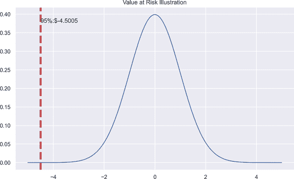
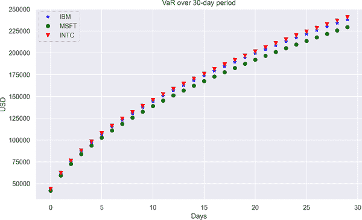
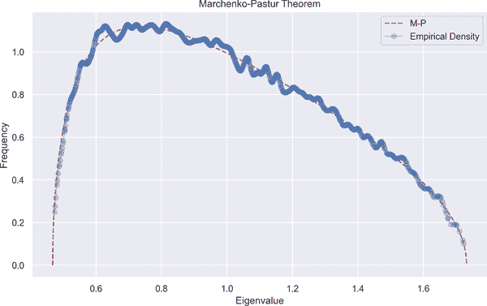
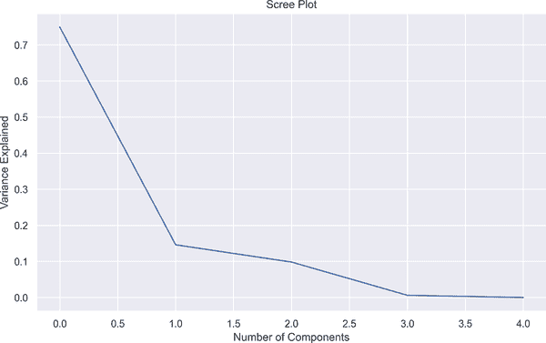
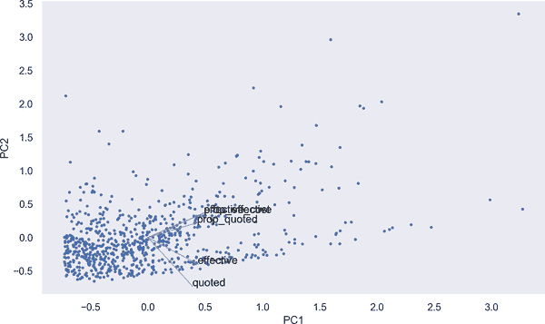

# 第五章。建模市场风险

> 基于历史数据驱动的风险度量假设未来会遵循过去的模式。你需要理解这种假设的局限性。更重要的是，你需要建模那些这种模式会崩溃的场景。
> 
> 迈尔斯·肯尼迪

风险在金融中无处不在，但难以量化。首要的是要知道如何区分金融风险的来源，因为使用相同的工具应对来自不同来源的风险可能并不明智。

因此，区别对待金融风险的各种来源至关重要，因为这些不同风险的影响以及用于减轻它们的工具是完全不同的。假设公司面临着大幅市场波动，那么其投资组合中的所有资产都容易受到这些波动带来的风险影响。然而，应开发出不同的工具来应对源自客户资料的风险。此外，请记住，不同的风险因素对资产价格的贡献非常显著。所有这些例子都表明，在金融领域处理风险因素需要仔细考虑。

正如前面简要讨论过的那样，这些风险主要是市场风险、信用风险、流动性风险和操作风险。显然，还可以添加其他类型，但可以将它们视为这四种主要风险类型的分支，这将是本章的重点。

*市场风险*是指由金融指标变化引起的风险，例如汇率、利率、通货膨胀等。市场风险可以被定义为在资产负债表和非资产负债表头寸中由市场价格波动引起的损失风险（BIS 2020）。现在让我们看看这些因素如何影响市场风险。假设通货膨胀率上升对金融机构当前的盈利能力构成威胁，因为通货膨胀会对利率施加压力，这反过来影响借款人的资金成本。这些实例可能会被放大，但我们还应注意这些金融风险来源之间的相互作用。也就是说，当一个金融风险来源变化时，其他风险来源不能保持不变。因此，在某种程度上，金融指标是相互关联的，这意味着这些风险来源的相互作用应该被考虑进去。

如你所想象的那样，有不同的工具来管理市场风险。其中，最显著和广泛接受的工具是价值-at-risk（VaR）和预期缺失（ES）。本章的最终目标是利用机器学习的最新发展来增强这些方法。在这个时刻，引人入胜地提出以下问题可能会很诱人：

+   传统模型在金融中失败了吗？

+   机器学习模型的独特之处是什么？

我将从解决第一个问题开始。传统模型无法解决的首要挑战是金融系统的复杂性。由于某些强烈的假设或者简单地无法捕捉数据引入的复杂性，长期以来的传统模型开始被基于机器学习的模型所取代。

Prado（2020 年）生动地表达了这一事实：

> 考虑到现代金融系统的复杂性，研究人员不太可能通过对数据的视觉检查或运行几个回归分析来揭示理论的构成要素。

要解决第二个问题，智慧之举应是思考机器学习模型的工作逻辑。与旧统计方法相对，机器学习模型试图揭示变量之间的关联，识别关键变量，并使我们能够找出这些变量对因变量的影响，而无需一个完备的理论支持。这实际上是机器学习模型之美，因为它们让我们能够发现理论，而不是依赖于理论：

> 统计学和机器学习中的许多方法，原则上既可用于预测也可用于推断。然而，统计方法长期以来专注于推断，这是通过创建和拟合特定于项目的概率模型来实现的...
> 
> 相比之下，机器学习集中于利用通用学习算法在通常是丰富且难以处理的数据中找出模式来进行预测。
> 
> Bzdok（2018 年，第 232 页）

在接下来的部分，我们将开始讨论市场风险模型。首先，我们将讨论 VaR 和 ES 模型的应用。在讨论这些传统模型的应用后，我们将学习如何通过采用基于机器学习的方法来改进它们。让我们开始吧。

# 风险价值（VaR）

VaR 模型起源于一位 J.P.摩根的高管提出的要求，他希望有一份汇总报告，显示 J.P.摩根在某一天可能面临的损失以及风险。这份报告将向高管们展示机构承担的聚合风险。计算市场风险的方法被称为 VaR。这份报告是 VaR 的起点，现在它已经如此普及，不仅机构喜欢使用 VaR，监管机构也要求其采用。

VaR 的采用可以追溯到上世纪 90 年代，尽管它已经有了许多扩展和新提出的模型，但仍在使用中。它有何吸引力？答案来自 Kevin Dowd（2002 年，第 10 页）：

> VaR 数字有两个重要特征。首先，它提供了一个跨不同头寸和风险因素的风险的常见一致度测量。它使我们能够衡量与固定收益头寸相关的风险，比如以与股票头寸相关的风险衡量相比较且保持一致。VaR 为我们提供了一个常见的风险标尺，而这个标尺使机构能够以之前不可能的新方式来管理风险。VaR 的另一个特征是它考虑了不同风险因素之间的相关性。如果两个风险相互抵消，VaR 允许这种抵消并告诉我们总体风险相当低。

实际上，VaR 回答了投资者最常见的问题之一：*我的投资的最大预期损失是多少？*

VaR 为这个问题提供了一个非常直观和实用的答案。在这方面，它用于衡量公司在给定期间和预定义置信区间内的最坏预期损失。假设某项投资的日 VaR 为$1 million，并且置信区间为 95%。这意味着有 5%的机会，投资者可能会在一天内遭受超过$1 million 的损失。

根据这一定义，我们可以确定 VaR 的组成部分是置信区间、时间段、资产或投资组合的价值以及标准偏差，因为我们正在谈论风险。

总结来说，在 VaR 分析中需要强调一些重要点：

+   VaR 需要估计损失的概率。

+   VaR 集中在潜在的损失上。我们谈论的不是实际的或已实现的损失；相反，VaR 是一种损失预测。

+   VaR 有三个关键要素：

    +   定义损失水平的标准偏差。

    +   固定的时间跨度用于评估风险。

    +   置信区间。

VaR 可以通过三种不同的方法来衡量：

+   方差-协方差 VaR

+   历史模拟 VaR

+   蒙特卡洛 VaR

## 方差-协方差方法

方差-协方差方法也被称为*参数*方法，因为假设观察值服从正态分布。方差-协方差方法在回报被认为是正态分布时很普遍。参数形式的假设使得方差-协方差方法的应用变得容易。

就像所有的 VaR 方法一样，我们可以使用单一资产或投资组合。然而，使用投资组合需要仔细处理，因为需要估计相关结构和投资组合方差。在这一点上，相关性变得重要，并且使用历史数据来计算相关性、均值和标准偏差。在用 ML 方法增强时，相关结构将是我们的主要关注点。

假设我们有一个由单一资产组成的投资组合，如图 5-1 所示。显示该资产的回报为零，标准差为 1，如果持有期为 1，则可以通过该资产的价值和相应的 Z 值以及标准差计算相应的 VaR 值。因此，正态性假设使事情变得更容易，但这是一个强假设，因为不能保证资产回报服从正态分布；相反，大多数资产回报并不服从正态分布。此外，由于正态性假设，可能无法捕捉到尾部的潜在风险。因此，正态性假设是有代价的。参见以下内容：

```py
In [1]: import pandas as pd
        import numpy as np
        import matplotlib.pyplot as plt
        import datetime
        import yfinance as yf
        from scipy.stats import norm
        import requests
        from io import StringIO
        import seaborn as sns; sns.set()
        import warnings
        warnings.filterwarnings('ignore')
        plt.rcParams['figure.figsize'] = (10,6)

In [2]: mean = 0
        std_dev = 1
        x = np.arange(-5, 5, 0.01)
        y = norm.pdf(x, mean, std_dev)
        pdf = plt.plot(x, y)
        min_ylim, max_ylim = plt.ylim()
        plt.text(np.percentile(x, 5), max_ylim * 0.9, '95%:${:.4f}'
                 .format(np.percentile(x, 5)))
        plt.axvline(np.percentile(x, 5), color='r', linestyle='dashed',
                    linewidth=4)
        plt.title('Value at Risk Illustration')
        plt.show()
In [3]: mean = 0
        std_dev = 1
        x = np.arange(-5, 5, 0.01)
        y = norm.pdf(x, mean, std_dev) 
        pdf = plt.plot(x, y)
        min_ylim, max_ylim = plt.ylim() 
        plt.text(np.percentile(x, 5), max_ylim * 0.9, '95%:${:.4f}'
                 .format(np.percentile(x, 5))) 
        plt.axvline(np.percentile(x, 5), color='r', linestyle='dashed',
                    linewidth=4)
        plt.title('Value at Risk Illustration')
        plt.show()
```


基于给定的`x`、均值和标准差生成概率密度函数


限制 x 轴和 y 轴


指定`x`位于`x`数据的 5%分位数的位置



###### 图 5-1\. VaR 插图

###### 注意

根据 Fama（1965）的研究，由于厚尾和不对称性，股票价格回报并不服从正态分布。这一实证观察意味着股票回报的峰度高于正态分布。

高峰度对应于厚尾，这能够捕捉极端负回报。由于方差-协方差方法无法捕捉厚尾，因此无法估计可能发生的极端负回报，特别是在危机期间。

让我们看看如何在 Python 中应用方差-协方差 VaR。为了说明，让我们考虑一个双资产组合。方差-协方差 VaR 的公式如下：

<math alttext="dollar-sign VaR equals upper V sigma Subscript p Baseline StartRoot t EndRoot upper Z Subscript alpha Baseline dollar-sign"><mrow><mtext>VaR</mtext> <mo>=</mo> <mi>V</mi> <msub><mi>σ</mi> <mi>p</mi></msub> <msqrt><mi>t</mi></msqrt> <msub><mi>Z</mi> <mi>α</mi></msub></mrow></math><math alttext="dollar-sign sigma Subscript p Baseline equals StartRoot w 1 squared sigma 1 squared plus w 2 squared sigma 2 squared plus rho w 1 w 2 sigma 1 sigma 2 EndRoot dollar-sign"><mrow><msub><mi>σ</mi> <mi>p</mi></msub> <mo>=</mo> <msqrt><mrow><msubsup><mi>w</mi> <mn>1</mn> <mn>2</mn></msubsup> <msubsup><mi>σ</mi> <mn>1</mn> <mn>2</mn></msubsup> <mo>+</mo> <msubsup><mi>w</mi> <mn>2</mn> <mn>2</mn></msubsup> <msubsup><mi>σ</mi> <mn>2</mn> <mn>2</mn></msubsup> <mo>+</mo> <mi>ρ</mi> <msub><mi>w</mi> <mn>1</mn></msub> <msub><mi>w</mi> <mn>2</mn></msub> <msub><mi>σ</mi> <mn>1</mn></msub> <msub><mi>σ</mi> <mn>2</mn></msub></mrow></msqrt></mrow></math><math alttext="dollar-sign sigma Subscript p Baseline equals StartRoot w 1 sigma 1 plus w 2 plus sigma plus 2 w 1 w 2 sigma-summation Underscript 1 comma 2 Endscripts EndRoot dollar-sign"><mrow><msub><mi>σ</mi> <mi>p</mi></msub> <mo>=</mo> <msqrt><mrow><msub><mi>w</mi> <mn>1</mn></msub> <msub><mi>σ</mi> <mn>1</mn></msub> <mo>+</mo> <msub><mi>w</mi> <mn>2</mn></msub> <mo>+</mo> <mi>σ</mi> <mo>+</mo> <mn>2</mn> <msub><mi>w</mi> <mn>1</mn></msub> <msub><mi>w</mi> <mn>2</mn></msub> <msub><mo>∑</mo> <mrow><mn>1</mn><mo>,</mo><mn>2</mn></mrow></msub></mrow></msqrt></mrow></math>

要在代码中应用此方法，我们从以下内容开始：

```py
In [4]: def getDailyData(symbol):
                parameters = {'function': 'TIME_SERIES_DAILY_ADJUSTED',
                              'symbol': symbol,
                               'outputsize':'full',
                               'datatype': 'csv',
                               'apikey': 'insert your api key here'} 

                response = requests.get('https://www.alphavantage.co/query',
                                        params=parameters) 

                csvText = StringIO(response.text) 
                data = pd.read_csv(csvText, index_col='timestamp')
                return data

In [5]: symbols = ["IBM", "MSFT", "INTC"]
        stock3 = []
        for symbol in symbols:
            stock3.append(getDailyData(symbol)[::-1]['close']
                          ['2020-01-01': '2020-12-31']) 
        stocks = pd.DataFrame(stock3).T
        stocks.columns = symbols

In [6]: stocks.head()
Out[6]:                IBM    MSFT   INTC
        timestamp
        2020-01-02  135.42  160.62  60.84
        2020-01-03  134.34  158.62  60.10
        2020-01-06  134.10  159.03  59.93
        2020-01-07  134.19  157.58  58.93
        2020-01-08  135.31  160.09  58.97
```


确定从 Alpha Vantage 提取数据时要使用的参数。


向 Alpha Vantage 网站发出请求。


打开响应文件，该文件以文本格式存在。


反转涵盖 2019-01 至 2019-12 期间的数据，并附加 IBM、MSFT 和 INTC 的每日股价。

###### 注意

Alpha Vantage 是一家与主要交易所和机构合作的数据提供公司。利用 Alpha Vantage 的 API，可以获取各种时间间隔（日内、日常、每周等）的股票价格、股票基本面和外汇信息。有关更多信息，请访问[Alpha Vantage 的网站](https://oreil.ly/ByZYD)。

然后我们进行计算：

```py
In [7]: stocks_returns = (np.log(stocks) - np.log(stocks.shift(1))).dropna() 
        stocks_returns
Out[7]:                  IBM      MSFT      INTC
        timestamp
        2020-01-03 -0.008007 -0.012530 -0.012238
        2020-01-06 -0.001788  0.002581 -0.002833
        2020-01-07  0.000671 -0.009160 -0.016827
        2020-01-08  0.008312  0.015803  0.000679
        2020-01-09  0.010513  0.012416  0.005580
        ...              ...       ...       ...
        2020-12-24  0.006356  0.007797  0.010679
        2020-12-28  0.001042  0.009873  0.000000
        2020-12-29 -0.008205 -0.003607  0.048112
        2020-12-30  0.004352 -0.011081 -0.013043
        2020-12-31  0.012309  0.003333  0.021711

        [252 rows x 3 columns]

In [8]: stocks_returns_mean = stocks_returns.mean()
        weights  = np.random.random(len(stocks_returns.columns)) 
        weights /= np.sum(weights) 
        cov_var = stocks_returns.cov() 
        port_std = np.sqrt(weights.T.dot(cov_var).dot(weights)) 

In [9]: initial_investment = 1e6
        conf_level = 0.95

In [10]: def VaR_parametric(initial_investment, conf_level):
             alpha = norm.ppf(1 - conf_level, stocks_returns_mean, port_std) 
             for i, j in zip(stocks.columns, range(len(stocks.columns))):
                 VaR_param = (initial_investment - initial_investment *
                              (1 + alpha))[j] 
                 print("Parametric VaR result for {} is {} "
                       .format(i, VaR_param))
             VaR_param = (initial_investment - initial_investment * (1 + alpha))
             print('--' * 25)
             return VaR_param

In [11]: VaR_param = VaR_parametric(initial_investment, conf_level)
         VaR_param
         Parametric VaR result for IBM is 42606.16125893139
         Parametric VaR result for MSFT is 41024.50194348814
         Parametric VaR result for INTC is 43109.25240851776
         --------------------------------------------------

Out[11]: array([42606.16125893, 41024.50194349, 43109.25240852])
```


计算对数收益率。


绘制权重的随机数。


生成权重。


计算协方差矩阵。


查找投资组合标准偏差。


使用百分点函数 (`ppf`) 计算特定值的 Z 分数


估算方差-协方差 VaR 模型

VaR 随时间跨度变化，这意味着持有资产的时间越长，投资者越容易受到风险的影响。如图 5-2 所示，VaR 随持有时间的增加而增加。此外，持有期是投资组合清算的最长期限。考虑到报告目的，30 天可能更适合投资者。因此，我们将在下面的代码中说明该期限，在其中生成图 5-2。

```py
In [12]: var_horizon = []
         time_horizon = 30
         for j in range(len(stocks_returns.columns)):
             for i in range(1, time_horizon + 1):
                 var_horizon.append(VaR_param[j] * np.sqrt(i))
         plt.plot(var_horizon[:time_horizon], "o",
                  c='blue', marker='*', label='IBM')
         plt.plot(var_horizon[time_horizon:time_horizon + 30], "o",
                  c='green', marker='o', label='MSFT')
         plt.plot(var_horizon[time_horizon + 30:time_horizon + 60], "o",
                  c='red', marker='v', label='INTC')
         plt.xlabel("Days")
         plt.ylabel("USD")
         plt.title("VaR over 30-day period")
         plt.legend()
         plt.show()
```

方差-协方差方法的优缺点如下：

优势

+   易于计算

+   不需要大量样本

缺点

+   观察值呈正态分布

+   在非线性结构下效果不佳

+   需要计算协方差矩阵



###### 图 5-2\. 不同时间跨度下的 VaR

因此，即使假设正态性听起来很吸引人，也可能不是估算 VaR 的最佳方法，特别是当资产回报不符合正态分布时。幸运的是，还有另一种不需要正态性假设的方法，即历史模拟 VaR 模型。

## 历史模拟方法

强假设，如正态分布，可能导致估算不准确。解决此问题的方法是历史模拟 VaR。这是一种经验方法：我们不使用参数化方法，而是找到百分位数，这相当于方差-协方差方法中的 Z 表等效物。假设置信区间为 95%，则使用 5% 代替 Z 表的值，我们需要做的就是将该百分位数乘以初始投资。

历史模拟 VaR 的步骤如下：

1.  获取投资组合（或单个资产）的资产回报

1.  根据置信区间找到相应的返回百分位数

1.  将该百分位数乘以初始投资

若要在代码中执行此操作，我们可以定义以下函数：

```py
In [13]: def VaR_historical(initial_investment, conf_level): 
             Hist_percentile95 = []
             for i, j in zip(stocks_returns.columns,
                             range(len(stocks_returns.columns))):
                 Hist_percentile95.append(np.percentile(stocks_returns.loc[:, i],
                                                        5))
                 print("Based on historical values 95% of {}'s return is {:.4f}"
                       .format(i, Hist_percentile95[j]))
                 VaR_historical = (initial_investment - initial_investment *
                                   (1 + Hist_percentile95[j]))
                 print("Historical VaR result for {} is {:.2f} "
                       .format(i, VaR_historical))
                 print('--' * 35)

In [14]: VaR_historical(initial_investment,conf_level) 
         Based on historical values 95% of IBM's return is -0.0371
         Historical VaR result for IBM is 37081.53
         ----------------------------------------------------------------------
         Based on historical values 95% of MSFT's return is -0.0426
         Historical VaR result for MSFT is 42583.68
         ----------------------------------------------------------------------
         Based on historical values 95% of INTC's return is -0.0425
         Historical VaR result for INTC is 42485.39
         ----------------------------------------------------------------------
```


计算股票回报的 95% 百分位数


估算历史模拟 VaR

历史模拟 VaR 方法隐含地假设历史价格变动具有类似的模式，即不存在结构性断裂。此方法的优缺点如下：

优势

+   无分布假设

+   适用于非线性结构

+   易于计算

缺点

+   需要大样本

+   需要高计算能力

## 蒙特卡洛模拟 VaR

在深入探讨蒙特卡罗模拟 VaR 估计之前，简要介绍一下蒙特卡罗模拟会很有好处。蒙特卡罗是一种计算数值逼近的高效工具，用于没有闭式解的情况下进行估计。蒙特卡罗依赖于从给定分布中重复生成的随机样本。

蒙特卡罗背后的逻辑由 Glasserman（2003, p. 11）定义如下：

> 蒙特卡罗方法基于概率与体积的类比。测度的数学形式化了概率的直观概念，将事件与一组结果相关联，并将事件的概率定义为其相对于可能结果宇宙的体积或测度。蒙特卡罗以反向方式使用此标识，通过解释体积为概率来计算集合的体积。

从应用的角度来看，蒙特卡罗与历史模拟 VaR 非常相似，但它不使用历史观察值。相反，它从给定分布中生成随机样本。蒙特卡罗通过提供可能结果和概率之间的联系来帮助决策者，使其成为金融中高效和适用的工具。

数学蒙特卡罗可以如下定义：

让 <math alttext="upper X 1 comma upper X 2 comma ellipsis comma upper X Subscript n Baseline"><mrow><msub><mi>X</mi> <mn>1</mn></msub> <mo>,</mo> <msub><mi>X</mi> <mn>2</mn></msub> <mo>,</mo> <mo>⋯</mo> <mo>,</mo> <msub><mi>X</mi> <mi>n</mi></msub></mrow></math> 为独立同分布的随机变量，并且 f(x) 是实值函数。大数法则表明：

<math alttext="sans-serif upper E left-parenthesis f left-parenthesis upper X right-parenthesis right-parenthesis almost-equals StartFraction 1 Over upper N EndFraction sigma-summation Underscript i Overscript upper N Endscripts f left-parenthesis upper X Subscript i Baseline right-parenthesis" display="block"><mrow><mi>𝖤</mi> <mrow><mo>(</mo> <mi>f</mi> <mrow><mo>(</mo> <mi>X</mi> <mo>)</mo></mrow> <mo>)</mo></mrow> <mo>≈</mo> <mfrac><mn>1</mn> <mi>N</mi></mfrac> <munderover><mo>∑</mo> <mi>i</mi> <mi>N</mi></munderover> <mi>f</mi> <mrow><mo>(</mo> <msub><mi>X</mi> <mi>i</mi></msub> <mo>)</mo></mrow></mrow></math>

简而言之，蒙特卡罗模拟什么都在做随机生成样本并计算它们的均值。在计算上，它遵循以下步骤：

1.  定义域

1.  生成随机数

1.  迭代和汇总结果

确定数学 <math alttext="pi"><mi>π</mi></math> 的方法是蒙特卡罗应用的简单但有说明性的例子。

假设我们有一个半径为 *r* = 1 的圆，面积为 4\. 圆的面积是 <math alttext="pi"><mi>π</mi></math> ，而试图将圆放入的正方形的面积是 4\. 比率结果如下：

<math alttext="dollar-sign StartFraction pi Over 4 EndFraction dollar-sign"><mfrac><mi>π</mi> <mn>4</mn></mfrac></math>

留下 <math alttext="pi"><mi>π</mi></math> 不变，圆和面积之间的比例可以定义为：

<math alttext="dollar-sign StartFraction upper C i r c u m f e r e n c e Subscript c i r c l e Baseline Over upper A r e a Subscript s q u a r e Baseline EndFraction equals StartFraction m Over n EndFraction dollar-sign"><mrow><mfrac><mrow><mi>C</mi><mi>i</mi><mi>r</mi><mi>c</mi><mi>u</mi><mi>m</mi><mi>f</mi><mi>e</mi><mi>r</mi><mi>e</mi><mi>n</mi><mi>c</mi><msub><mi>e</mi> <mrow><mi>c</mi><mi>i</mi><mi>r</mi><mi>c</mi><mi>l</mi><mi>e</mi></mrow></msub></mrow> <mrow><mi>A</mi><mi>r</mi><mi>e</mi><msub><mi>a</mi> <mrow><mi>s</mi><mi>q</mi><mi>u</mi><mi>a</mi><mi>r</mi><mi>e</mi></mrow></msub></mrow></mfrac> <mo>=</mo> <mfrac><mi>m</mi> <mi>n</mi></mfrac></mrow></math>

一旦我们平衡这些方程式，结果是：

<math alttext="dollar-sign pi equals 4 x StartFraction m Over n EndFraction dollar-sign"><mrow><mi>π</mi> <mo>=</mo> <mn>4</mn> <mi>x</mi> <mfrac><mi>m</mi> <mi>n</mi></mfrac></mrow></math>

如果我们逐步进行，首先是定义域，即 [-1, 1]。因此，圆内部的数字满足 <math alttext="x squared plus y squared less-than-or-equal-to 1"><mrow><msup><mi>x</mi> <mn>2</mn></msup> <mo>+</mo> <msup><mi>y</mi> <mn>2</mn></msup> <mo>≤</mo> <mn>1</mn></mrow></math> 。

第二步是生成随机数以满足这一给定条件。换句话说，我们需要具有均匀分布的随机样本，在 Python 中这是一项相当简单的任务。为了练习，我将使用 NumPy 库生成 100 个均匀分布的随机数：

```py
In [15]: x = np.random.uniform(-1, 1, 100) 
         y = np.random.uniform(-1, 1, 100)

In [16]: sample = 100
         def pi_calc(x, y):
             point_inside_circle = 0
             for i in range(sample):
                 if np.sqrt(x[i] ** 2 + y[i] ** 2) <= 1: 
                     point_inside_circle += 1
             print('pi value is {}'.format(4 * point_inside_circle/sample))

In [17]: pi_calc(x,y)
         pi value is 3.2

In [18]: x = np.random.uniform(-1, 1, 1000000)
         y = np.random.uniform(-1, 1, 1000000)

In [19]: sample = 1000000

         def pi_calc(x, y):
             point_inside_circle = 0
             for i in range(sample):
                 if np.sqrt(x[i] ** 2 + y[i] ** 2) < 1:
                     point_inside_circle += 1
             print('pi value is {:.2f}'.format(4 * point_inside_circle/sample))

In [20]: pi_calc(x,y)
         pi value is 3.14

In [21]: sim_data = pd.DataFrame([])
         num_reps = 1000
         n = 100
         for i in range(len(stocks.columns)):
             mean = np.random.randn(n).mean()
             std = np.random.randn(n).std()
             temp = pd.DataFrame(np.random.normal(mean, std, num_reps))
             sim_data = pd.concat([sim_data, temp], axis=1)
         sim_data.columns = ['Simulation 1', 'Simulation 2', 'Simulation 3']

In [22]: sim_data
Out[22]:      Simulation 1  Simulation 2  Simulation 3
         0        1.587297     -0.256668      1.137718
         1        0.053628     -0.177641     -1.642747
         2       -1.636260     -0.626633      0.393466
         3        1.088207      0.847237      0.453473
         4       -0.479977     -0.114377     -2.108050
         ..            ...           ...           ...
         995      1.615190      0.940931      0.172129
         996     -0.015111     -1.149821     -0.279746
         997     -0.806576     -0.141932     -1.246538
         998      1.609327      0.582967     -1.879237
         999     -0.943749     -0.286847      0.777052

         [1000 rows x 3 columns]

In [23]: def MC_VaR(initial_investment, conf_level):
             MC_percentile95 = []
             for i, j in zip(sim_data.columns, range(len(sim_data.columns))):
                 MC_percentile95.append(np.percentile(sim_data.loc[:, i], 5)) 
                 print("Based on simulation 95% of {}'s return is {:.4f}"
                       .format(i, MC_percentile95[j]))
                 VaR_MC = (initial_investment - initial_investment *
                           (1 + MC_percentile95[j])) 
                 print("Simulation VaR result for {} is {:.2f} "
                       .format(i, VaR_MC))
                 print('--' * 35)

In [24]: MC_VaR(initial_investment, conf_level)
         Based on simulation 95% of Simulation 1's return is -1.7880
         Simulation VaR result for Simulation 1 is 1787990.69
         ----------------------------------------------------------------------
         Based on simulation 95% of Simulation 2's return is -1.6290
         Simulation VaR result for Simulation 2 is 1628976.68
         ----------------------------------------------------------------------
         Based on simulation 95% of Simulation 3's return is -1.5156
         Simulation VaR result for Simulation 3 is 1515623.93
         ----------------------------------------------------------------------
```


从均匀分布生成随机数


检查点是否在半径为 1 的圆内


计算每个股票回报的 95%并将结果附加到名为 `MC_percentile95` 的列表中


估计蒙特卡罗 VaR

# 降噪

波动性无处不在，但找出哪种波动性最有价值却是一项艰巨的任务。一般而言，市场上存在两种信息：*噪音* 和 *信号*。前者仅产生随机信息，而后者通过提供有价值的信息使投资者能够赚钱。举例来说，考虑市场上的两个主要参与者：一个使用嘈杂信息的噪音交易者，以及利用信号或内幕信息的知情交易者。噪音交易者的交易动机受到随机行为的驱动。因此，市场中的信息流被认为是某些噪音交易者的买入信号和其他人的卖出信号。

然而，知情交易者被认为是理性的，因为他们能够评估信号，因为他们知道这是私人信息。

因此，连续的信息流应该谨慎处理。简而言之，来自噪音交易者的信息可以视为噪音，而来自内部人士的信息则可视为信号，而这才是重要的信息。不能区分噪音和信号的投资者可能会未能获利和/或正确评估风险。

现在问题转变为如何区分金融市场中信息流的不同。我们如何区分噪音和信号？我们如何利用这些信息？

现在是讨论马尔琴科-帕斯图尔定理的时候了，这有助于有均匀协方差矩阵。马尔琴科-帕斯图尔定理允许我们利用协方差矩阵的特征值从噪音中提取信号。

###### 注意

设 <math alttext="upper A element-of double-struck upper R Superscript n x n"><mrow><mi>A</mi> <mo>∈</mo> <msup><mi>ℝ</mi> <mrow><mi>n</mi><mi>x</mi><mi>n</mi></mrow></msup></mrow></math> 是一个方阵。那么，<math alttext="lamda element-of double-struck upper R"><mrow><mi>λ</mi> <mo>∈</mo> <mi>ℝ</mi></mrow></math> 是 *A* 的特征值，<math alttext="x element-of double-struck upper R Superscript n"><mrow><mi>x</mi> <mo>∈</mo> <msup><mi>ℝ</mi> <mi>n</mi></msup></mrow></math> 是对应的特征向量，如果

<math alttext="dollar-sign upper A x equals lamda x dollar-sign"><mrow><mi>A</mi> <mi>x</mi> <mo>=</mo> <mi>λ</mi> <mi>x</mi></mrow></math>

其中 <math alttext="x 属于双筒上 R 上标 n 基线 不等于 0"><mrow><mi>x</mi> <mo>∈</mo> <msup><mi>ℝ</mi> <mi>n</mi></msup> <mo>≠</mo> <mn>0</mn></mrow></math> .

*特征值* 和 *特征向量* 在金融上下文中有特殊含义。特征向量表示协方差矩阵的方差，而特征值显示特征向量的大小。具体来说，最大特征向量对应最大方差，其大小等于相应的特征值。由于数据中存在噪声，某些特征值可以被视为随机的，因此有必要检测并过滤这些特征值，以保留信号。

为了区分噪声和信号，我们将 Marchenko–Pastur 定理的概率密度函数（PDF）拟合到嘈杂的协方差中。Marchenko–Pastur 定理的 PDF 取以下形式（Prado 2020）：

<math mode="display"><mrow><mi>f</mi> <mrow><mo>(</mo> <mi>λ</mi> <mo>)</mo></mrow> <mo>=</mo> <mfenced close="" open="{" separators=""><mtable><mtr><mtd columnalign="left"><mrow><mfrac><mi>T</mi> <mi>N</mi></mfrac> <msqrt><mrow><mrow><mo>(</mo> <msub><mi>λ</mi> <mi>t</mi></msub> <mo>-</mo> <mi>λ</mi> <mo>)</mo></mrow> <mrow><mo>(</mo> <mi>λ</mi> <mo>-</mo> <msub><mi>λ</mi> <mo>-</mo></msub> <mo>)</mo></mrow></mrow></msqrt></mrow></mtd> <mtd columnalign="right"><mrow><mtext>if</mtext> <mi>λ</mi> <mo>∈</mo> <mo>[</mo> <mi>λ</mi> <mo>-</mo> <msub><mi>λ</mi> <mo>-</mo></msub> <mo>]</mo></mrow></mtd></mtr> <mtr><mtd columnalign="left"><mrow><mn>0</mn> <mo>,</mo></mrow></mtd> <mtd columnalign="right"><mrow><mtext>if</mtext> <mi>λ</mi> <mo>∉</mo> <mo>[</mo> <mi>λ</mi> <mo>-</mo> <msub><mi>λ</mi> <mo>-</mo></msub> <mo>]</mo></mrow></mtd></mtr></mtable></mfenced></mrow></math>

其中 <math alttext="lamda 下标 plus 基线 和 lamda 下标 minus 基线"><mrow><msub><mi>λ</mi> <mo>+</mo></msub> <mtext>和</mtext> <msub><mi>λ</mi> <mo>-</mo></msub></mrow></math> 分别为最大和最小特征值。

在以下代码块中，这是对 Prado (2020) 提供的代码稍作修改，我们将生成 Marchenko–Pastur 分布和核密度的概率密度函数，这将允许我们以非参数化的方式对随机变量进行建模。然后，将 Marchenko–Pastur 分布拟合到数据中：

```py
In [25]: def mp_pdf(sigma2, q, obs):
             lambda_plus = sigma2 * (1 + q ** 0.5) ** 2 
             lambda_minus = sigma2 * (1 - q ** 0.5) ** 2 
             l = np.linspace(lambda_minus, lambda_plus, obs)
             pdf_mp = 1 / (2 * np.pi * sigma2 * q * l) \
                      * np.sqrt((lambda_plus  - l)
                      *  (l - lambda_minus)) 
             pdf_mp = pd.Series(pdf_mp, index=l)
             return pdf_mp

In [26]: from sklearn.neighbors import KernelDensity

         def kde_fit(bandwidth,obs,x=None):
             kde = KernelDensity(bandwidth, kernel='gaussian') 
             if len(obs.shape) == 1:
                 kde_fit=kde.fit(np.array(obs).reshape(-1, 1)) 
             if x is None:
                 x=np.unique(obs).reshape(-1, 1)
             if len(x.shape) == 1:
                 x = x.reshape(-1, 1)
             logprob = kde_fit.score_samples(x) 
             pdf_kde = pd.Series(np.exp(logprob), index=x.flatten())
             return pdf_kde

In [27]: corr_mat = np.random.normal(size=(10000, 1000)) 
         corr_coef = np.corrcoef(corr_mat, rowvar=0) 
         sigma2 = 1
         obs = corr_mat.shape[0]
         q = corr_mat.shape[0] / corr_mat.shape[1]

         def plotting(corr_coef, q):
             ev, _ = np.linalg.eigh(corr_coef) 
             idx = ev.argsort()[::-1]
             eigen_val = np.diagflat(ev[idx]) 
             pdf_mp = mp_pdf(1., q=corr_mat.shape[1] / corr_mat.shape[0],
                             obs=1000) 
             kde_pdf = kde_fit(0.01, np.diag(eigen_val)) 
             ax = pdf_mp.plot(title="Marchenko-Pastur Theorem",
                              label="M-P", style='r--')
             kde_pdf.plot(label="Empirical Density", style='o-', alpha=0.3)
             ax.set(xlabel="Eigenvalue", ylabel="Frequency")
             ax.legend(loc="upper right")
             plt.show()
             return plt

In [28]: plotting(corr_coef, q);
```


计算最大期望特征值


计算最小期望特征值


生成 Marchenko-Pastur 分布的概率密度函数


初始化核密度估计


将核密度拟合到观测值


评估观测数据上的对数密度模型


从正态分布生成随机样本


将协方差矩阵转换为相关矩阵


计算相关矩阵的特征值


将 NumPy 数组转换为对角矩阵


调用 `mp_pdf` 估算 Marchenko–Pastur 分布的概率密度函数


调用 `kde_fit` 对数据进行核分布拟合

结果显示的图 5-3 表明 Marchenko–Pastur 分布很好地适配了数据。多亏了 Marchenko–Pastur 定理，我们能区分噪声和信号；现在我们可以称经过噪声过滤的数据为*去噪*数据。



###### 图 5-3\. 拟合 Marchenko–Pastur 分布

到目前为止，我们已经讨论了去噪协方差矩阵的主要步骤，以便将其插入 VaR 模型中，这被称为*去噪 VaR*估计。去噪协方差矩阵的意义在于从数据中剔除不必要的信息（噪音）。因此，我们可以只利用市场的信号，将注意力集中在重要的事件上。

去噪协方差矩阵包括以下阶段：^(1)

1.  基于相关矩阵计算特征值和特征向量。

1.  使用核密度估计，找到特定特征值的特征向量。

1.  将 Marchenko–Pastur 分布拟合到核密度估计中。

1.  使用 Marchenko–Pastur 分布找到最大理论特征值。

1.  计算大于理论值的特征值的平均值。

1.  使用这些新的特征值和特征向量来计算去噪相关矩阵。

1.  通过新的相关矩阵计算去噪协方差矩阵。

让我们看看如何使用 Python 中的`portfoliolab`库几行代码就可以应用找到去噪协方差矩阵：

```py
In [29]: import portfoliolab as pl

In [30]: risk_estimators = pl.estimators.RiskEstimators()

In [31]: stock_prices = stocks.copy()

In [32]: cov_matrix = stocks_returns.cov()
         cov_matrix
Out[32]:            IBM      MSFT      INTC
         IBM   0.000672  0.000465  0.000569
         MSFT  0.000465  0.000770  0.000679
         INTC  0.000569  0.000679  0.001158

In [33]: tn_relation = stock_prices.shape[0] / stock_prices.shape[1] 
         kde_bwidth = 0.25 
         cov_matrix_denoised = risk_estimators.denoise_covariance(cov_matrix,
                                                                  tn_relation,
                                                                  kde_bwidth) 
         cov_matrix_denoised = pd.DataFrame(cov_matrix_denoised,
                                            index=cov_matrix.index,
                                            columns=cov_matrix.columns)
         cov_matrix_denoised
Out[33]:            IBM      MSFT      INTC
         IBM   0.000672  0.000480  0.000589
         MSFT  0.000480  0.000770  0.000638
         INTC  0.000589  0.000638  0.001158

In [34]: def VaR_parametric_denoised(initial_investment, conf_level):
             port_std = np.sqrt(weights.T.dot(cov_matrix_denoised)
                                .dot(weights)) 
             alpha = norm.ppf(1 - conf_level, stocks_returns_mean, port_std)
             for i, j in zip(stocks.columns,range(len(stocks.columns))):
                 print("Parametric VaR result for {} is {} ".format(i,VaR_param))
             VaR_params = (initial_investment - initial_investment * (1 + alpha))
             print('--' * 25)
             return VaR_params

In [35]: VaR_parametric_denoised(initial_investment, conf_level)
         Parametric VaR result for IBM is [42606.16125893 41024.50194349
          43109.25240852]
         Parametric VaR result for MSFT is [42606.16125893 41024.50194349
          43109.25240852]
         Parametric VaR result for INTC is [42606.16125893 41024.50194349
          43109.25240852]
         --------------------------------------------------

Out[35]: array([42519.03744155, 40937.37812611, 43022.12859114])

In [36]: symbols = ["IBM", "MSFT", "INTC"]
         stock3 = []
         for symbol in symbols:
             stock3.append(getDailyData(symbol)[::-1]['close']
                           ['2007-04-01': '2009-02-01'])
         stocks_crisis = pd.DataFrame(stock3).T
         stocks_crisis.columns = symbols

In [37]: stocks_crisis
Out[37]:               IBM   MSFT   INTC
         timestamp
         2007-04-02  95.21  27.74  19.13
         2007-04-03  96.10  27.87  19.31
         2007-04-04  96.21  28.50  19.38
         2007-04-05  96.52  28.55  19.58
         2007-04-09  96.62  28.57  20.10
         ...           ...    ...    ...
         2009-01-26  91.60  17.63  13.38
         2009-01-27  91.66  17.66  13.81
         2009-01-28  94.82  18.04  14.01
         2009-01-29  92.51  17.59  13.37
         2009-01-30  91.65  17.10  12.90

         [463 rows x 3 columns]

In [38]: stock_prices = stocks_crisis.copy()

In [39]: stocks_returns = (np.log(stocks) - np.log(stocks.shift(1))).dropna()

In [40]: cov_matrix = stocks_returns.cov()

In [41]: VaR_parametric(initial_investment, conf_level)
         Parametric VaR result for IBM is 42606.16125893139
         Parametric VaR result for MSFT is 41024.50194348814
         Parametric VaR result for INTC is 43109.25240851776
         --------------------------------------------------

Out[41]: array([42606.16125893, 41024.50194349, 43109.25240852])

In [42]: VaR_parametric_denoised(initial_investment, conf_level)
         Parametric VaR result for IBM is [42606.16125893 41024.50194349
          43109.25240852]
         Parametric VaR result for MSFT is [42606.16125893 41024.50194349
          43109.25240852]
         Parametric VaR result for INTC is [42606.16125893 41024.50194349
          43109.25240852]
         --------------------------------------------------

Out[42]: array([42519.03744155, 40937.37812611, 43022.12859114])
```


将观测数`T`与变量数`N`相关联


确定核密度估计的带宽


生成去噪协方差矩阵


将去噪协方差矩阵整合到 VaR 公式中

传统应用的 VaR 与去噪 VaR 之间的差异在危机期间更加显著。在危机期间，资产之间的相关性增加，有时被称为*相关性崩溃*。我们将评估危机的影响以验证这一现象，并为此使用 2017 年至 2018 年的危机。然而，运行此分析需要危机的确切开始和结束日期；我们将从国家经济研究局（NBER）获取此信息，该机构宣布商业周期。

结果表明，在危机期间，相关性和因此 VaR 值变得更高。

现在，我们成功地使用了经过去噪的协方差矩阵来获得基于机器学习的风险价值（VaR），而不是直接从数据计算得到的经验矩阵。尽管 VaR 具有吸引力并且易于使用，但它并不是一个一致的风险度量，这需要满足某些条件或公理。你可以把这些公理看作是风险度量的技术要求。

让<math alttext="alpha element-of left-parenthesis 0 comma 1 right-parenthesis"><mrow><mi>α</mi> <mo>∈</mo> <mo>(</mo> <mn>0</mn> <mo>,</mo> <mn>1</mn> <mo>)</mo></mrow></math>成为一个固定的置信水平，而（<math alttext="omega"><mi>ω</mi></math>，<math alttext="script upper F"><mi>ℱ</mi></math>，<math alttext="sans-serif upper P"><mi>𝖯</mi></math>）则是一个概率空间，其中<math alttext="omega"><mi>ω</mi></math>代表样本空间，<math alttext="script upper F"><mi>ℱ</mi></math>表示样本空间的子集，而<math alttext="sans-serif upper P"><mi>𝖯</mi></math>则是概率度量。

###### 注意

为了说明，假设<math alttext="omega"><mi>ω</mi></math>是投掷硬币事件中所有可能结果的集合，<math alttext="omega"><mi>ω</mi></math> = {H, T}。 <math alttext="script upper F"><mi>ℱ</mi></math> 可以看作是连续两次投掷硬币，<math alttext="script upper F equals 2 Superscript omega"><mrow><mi>ℱ</mi> <mo>=</mo> <msup><mn>2</mn> <mi>ω</mi></msup></mrow></math> = <math alttext="2 squared"><msup><mn>2</mn> <mn>2</mn></msup></math>。最后，概率度量，<math alttext="sans-serif upper P"><mi>𝖯</mi></math>，是得到尾巴（0.5）的几率。

这里是一致风险度量的四个公理：

平移不变性

对于所有结果*Y*和常数<math alttext="a element-of double-struck upper R"><mrow><mi>a</mi> <mo>∈</mo> <mi>ℝ</mi></mrow></math>，我们有

<math alttext="dollar-sign upper V a upper R left-parenthesis upper Y plus a right-parenthesis equals upper V a upper R left-parenthesis upper Y right-parenthesis plus a dollar-sign"><mrow><mi>V</mi> <mi>a</mi> <mi>R</mi> <mo>(</mo> <mi>Y</mi> <mo>+</mo> <mi>a</mi> <mo>)</mo> <mo>=</mo> <mi>V</mi> <mi>a</mi> <mi>R</mi> <mo>(</mo> <mi>Y</mi> <mo>)</mo> <mo>+</mo> <mi>a</mi></mrow></math>

这意味着如果将无风险金额*a*添加到投资组合中，则会降低*a*的 VaR。

子可加性

对于所有<math alttext="upper Y 1"><msub><mi>Y</mi> <mn>1</mn></msub></math>和<math alttext="upper Y 2"><msub><mi>Y</mi> <mn>2</mn></msub></math>，我们有

<math alttext="dollar-sign upper V a upper R left-parenthesis upper Y 1 plus upper Y 2 right-parenthesis less-than-or-equal-to upper V a upper R left-parenthesis upper Y 1 right-parenthesis plus upper V a upper R left-parenthesis upper Y 2 right-parenthesis dollar-sign"><mrow><mi>V</mi> <mi>a</mi> <mi>R</mi> <mrow><mo>(</mo> <msub><mi>Y</mi> <mn>1</mn></msub> <mo>+</mo> <msub><mi>Y</mi> <mn>2</mn></msub> <mo>)</mo></mrow> <mo>≤</mo> <mi>V</mi> <mi>a</mi> <mi>R</mi> <mrow><mo>(</mo> <msub><mi>Y</mi> <mn>1</mn></msub> <mo>)</mo></mrow> <mo>+</mo> <mi>V</mi> <mi>a</mi> <mi>R</mi> <mrow><mo>(</mo> <msub><mi>Y</mi> <mn>2</mn></msub> <mo>)</mo></mrow></mrow></math>

此公理强调了在风险管理中分散化的重要性。假设<math alttext="upper Y 1"><msub><mi>Y</mi> <mn>1</mn></msub></math>和<math alttext="upper Y 2"><msub><mi>Y</mi> <mn>2</mn></msub></math>作为两个资产：如果它们都包含在投资组合中，则结果的 VaR 比分开持有它们低。让我们检查 VaR 是否满足子可加性假设：

```py
In [43]: asset1 = [-0.5, 0, 0.1, 0.4] 
         VaR1 = np.percentile(asset1, 90)
         print('VaR for the Asset 1 is {:.4f}'.format(VaR1))
         asset2 = [0, -0.5, 0.01, 0.4] 
         VaR2 = np.percentile(asset2, 90)
         print('VaR for the Asset 2 is {:.4f}'.format(VaR2))
         VaR_all = np.percentile(asset1 + asset2, 90)
         print('VaR for the portfolio is {:.4f}'.format(VaR_all))
         VaR for the Asset 1 is 0.3100
         VaR for the Asset 2 is 0.2830
         VaR for the portfolio is 0.4000

In [44]: asset1 = [-0.5, 0, 0.05, 0.03] 
         VaR1 = np.percentile(asset1, 90)
         print('VaR for the Asset 1 is {:.4f}'.format(VaR1))
         asset2 = [0, -0.5, 0.02, 0.8] 
         VaR2 = np.percentile(asset2,90)
         print('VaR for the Asset 2 is {:.4f}'.format(VaR2))
         VaR_all = np.percentile(asset1 + asset2 , 90)
         print('VaR for the portfolio is {:.4f}'.format(VaR_all))
         VaR for the Asset 1 is 0.0440
         VaR for the Asset 2 is 0.5660
         VaR for the portfolio is 0.2750
```


第一个资产的资产回报率


第二资产的资产回报率

结果表明，投资组合的 VaR 比各个单独的 VaR 之和要低，这是由于分散化通过降低风险来减少投资组合的 VaR。

正齐次性

对于所有结果 *Y* 和 *a* > 0，我们有

<math alttext="dollar-sign upper V a upper R left-parenthesis a upper Y right-parenthesis equals a upper V a upper R left-parenthesis upper Y right-parenthesis dollar-sign"><mrow><mi>V</mi> <mi>a</mi> <mi>R</mi> <mo>(</mo> <mi>a</mi> <mi>Y</mi> <mo>)</mo> <mo>=</mo> <mi>a</mi> <mi>V</mi> <mi>a</mi> <mi>R</mi> <mo>(</mo> <mi>Y</mi> <mo>)</mo></mrow></math>

这意味着投资组合的风险和价值是同步变化的——也就是说，如果投资组合的价值增加了 *a*，风险也会增加 *a*。

单调性

对于任意两个结果 <math alttext="upper Y 1"><msub><mi>Y</mi> <mn>1</mn></msub></math> 和 <math alttext="upper Y 2"><msub><mi>Y</mi> <mn>2</mn></msub></math> ，如果 <math alttext="upper Y 1 less-than-or-equal-to upper Y 2"><mrow><msub><mi>Y</mi> <mn>1</mn></msub> <mo>≤</mo> <msub><mi>Y</mi> <mn>2</mn></msub></mrow></math> ，那么：

<math alttext="dollar-sign upper V a upper R left-parenthesis upper Y 2 right-parenthesis less-than-or-equal-to upper V a upper R left-parenthesis upper Y 1 right-parenthesis dollar-sign"><mrow><mi>V</mi> <mi>a</mi> <mi>R</mi> <mrow><mo>(</mo> <msub><mi>Y</mi> <mn>2</mn></msub> <mo>)</mo></mrow> <mo>≤</mo> <mi>V</mi> <mi>a</mi> <mi>R</mi> <mrow><mo>(</mo> <msub><mi>Y</mi> <mn>1</mn></msub> <mo>)</mo></mrow></mrow></math>

起初，这可能看起来令人困惑，但从单调性来看，这在更高资产回报情况下暗示着更低的 VaR。

现在我们知道 VaR 不是一个一致的风险度量。然而，VaR 并不是我们估算市场风险的唯一工具。预期缺失是另一种一致的市场风险度量。

# 预期缺失

与 VaR 不同，ES 关注的是分布的尾部。更具体地说，ES 使我们能够考虑市场上的意外风险。然而，这并不意味着 ES 和 VaR 是两个完全不同的概念。相反，它们是相关的——也就是说，可以用 VaR 来表达 ES。

让我们假设损失分布是连续的；然后 ES 可以数学上定义为：

<math alttext="dollar-sign upper E upper S Subscript alpha Baseline equals StartFraction 1 Over 1 minus alpha EndFraction integral Subscript alpha Superscript 1 Baseline q Subscript u Baseline d u dollar-sign"><mrow><mi>E</mi> <msub><mi>S</mi> <mi>α</mi></msub> <mo>=</mo> <mfrac><mn>1</mn> <mrow><mn>1</mn><mo>-</mo><mi>α</mi></mrow></mfrac> <msubsup><mo>∫</mo> <mi>α</mi> <mn>1</mn></msubsup> <msub><mi>q</mi> <mi>u</mi></msub> <mi>d</mi> <mi>u</mi></mrow></math>

其中 *q* 表示损失分布的分位数。ES 公式表明，它不过是损失的加权平均值，<math alttext="left-parenthesis 1 minus alpha right-parenthesis percent-sign"><mrow><mo>(</mo> <mn>1</mn> <mo>-</mo> <mi>α</mi> <mo>)</mo> <mo>%</mo></mrow></math>。

让我们用 <math alttext="q Subscript u"><msub><mi>q</mi> <mi>u</mi></msub></math> 和 VaR 进行替代，得到以下方程：

<math alttext="dollar-sign upper E upper S Subscript alpha Baseline equals StartFraction 1 Over 1 minus alpha EndFraction integral Subscript alpha Superscript 1 Baseline upper V a upper R Subscript u Baseline d u dollar-sign"><mrow><mi>E</mi> <msub><mi>S</mi> <mi>α</mi></msub> <mo>=</mo> <mfrac><mn>1</mn> <mrow><mn>1</mn><mo>-</mo><mi>α</mi></mrow></mfrac> <msubsup><mo>∫</mo> <mi>α</mi> <mn>1</mn></msubsup> <mi>V</mi> <mi>a</mi> <msub><mi>R</mi> <mi>u</mi></msub> <mi>d</mi> <mi>u</mi></mrow></math>

或者，它是超过 VaR 的损失的均值：

<math alttext="dollar-sign upper E upper S Subscript alpha Baseline equals sans-serif upper E left-parenthesis upper L vertical-bar upper L greater-than upper V a upper R Subscript alpha Baseline right-parenthesis dollar-sign"><mrow><mi>E</mi> <msub><mi>S</mi> <mi>α</mi></msub> <mo>=</mo> <mi>𝖤</mi> <mrow><mo>(</mo> <mi>L</mi> <mo>|</mo> <mi>L</mi> <mo>></mo> <mi>V</mi> <mi>a</mi> <msub><mi>R</mi> <mi>α</mi></msub> <mo>)</mo></mrow></mrow></math>

损失分布可以是连续的或离散的，你可以想象，如果是离散形式，ES 会不同，比如

<math alttext="dollar-sign upper E upper S Subscript alpha Baseline equals StartFraction 1 Over 1 minus alpha EndFraction sigma-summation Underscript n equals 0 Overscript 1 Endscripts max left-parenthesis upper L Subscript n Baseline right-parenthesis probability left-parenthesis upper L Subscript n Baseline right-parenthesis dollar-sign"><mrow><mi>E</mi> <msub><mi>S</mi> <mi>α</mi></msub> <mo>=</mo> <mfrac><mn>1</mn> <mrow><mn>1</mn><mo>-</mo><mi>α</mi></mrow></mfrac> <msubsup><mo>∑</mo> <mrow><mi>n</mi><mo>=</mo><mn>0</mn></mrow> <mn>1</mn></msubsup> <mtext>max</mtext> <mrow><mo>(</mo> <msub><mi>L</mi> <mi>n</mi></msub> <mo>)</mo></mrow> <mo form="prefix">Pr</mo> <mrow><mo>(</mo> <msub><mi>L</mi> <mi>n</mi></msub> <mo>)</mo></mrow></mrow></math>

其中 <math alttext="m a x left-parenthesis upper L Subscript n Baseline right-parenthesis"><mrow><mi>m</mi> <mi>a</mi> <mi>x</mi> <mo>(</mo> <msub><mi>L</mi> <mi>n</mi></msub> <mo>)</mo></mrow></math> 表示最大的第 <math alttext="n Superscript t h"><msup><mi>n</mi> <mrow><mi>t</mi><mi>h</mi></mrow></msup></math> 损失，而 <math alttext="probability left-parenthesis upper L Subscript n Baseline right-parenthesis"><mrow><mo form="prefix">Pr</mo> <mo>(</mo> <msub><mi>L</mi> <mi>n</mi></msub> <mo>)</mo></mrow></math> 表示第 <math alttext="n Superscript t h"><msup><mi>n</mi> <mrow><mi>t</mi><mi>h</mi></mrow></msup></math> 最高损失的概率。在代码中，我们可以将其公式化为：

```py
In [45]: def ES_parametric(initial_investment , conf_level):
             alpha = - norm.ppf(1 - conf_level,stocks_returns_mean,port_std)
             for i, j in zip(stocks.columns, range(len(stocks.columns))):
                 VaR_param = (initial_investment * alpha)[j] 
                 ES_param = (1 / (1 - conf_level)) \
                            * initial_investment \
                            * norm.expect(lambda x: x,
                                          lb = norm.ppf(conf_level,
                                                        stocks_returns_mean[j],
                                                        port_std),
                                          loc = stocks_returns_mean[j],
                                          scale = port_std) 
                 print(f"Parametric ES result for {i} is {ES_param}")

In [46]: ES_parametric(initial_investment, conf_level)
         Parametric ES result for IBM is 52776.42396231898
         Parametric ES result for MSFT is 54358.083277762125
         Parametric ES result for INTC is 52273.33281273264
```


估算方差-协方差 VaR


给定置信区间，基于 VaR 估算 ES

ES 也可以基于历史观察值计算。与历史模拟 VaR 方法类似，可以放宽参数假设。为此，首先找到对应于 95%的第一个收益（或损失），然后大于 95%的观察值的均值给出我们的结果。

下面是我们在代码中所做的事情：

```py
In [47]: def ES_historical(initial_investment, conf_level):
             for i, j in zip(stocks_returns.columns,
                             range(len(stocks_returns.columns))):
                 ES_hist_percentile95 = np.percentile(stocks_returns.loc[:, i],
                                                      5) 
                 ES_historical = stocks_returns[str(i)][stocks_returns[str(i)] <=
                                                        ES_hist_percentile95]\
                                                        .mean() 
                 print("Historical ES result for {} is {:.4f} "
                       .format(i, initial_investment * ES_historical))

In [48]: ES_historical(initial_investment, conf_level)
         Historical ES result for IBM is -64802.3898
         Historical ES result for MSFT is -65765.0848
         Historical ES result for INTC is -88462.7404
```


计算收益的 95%


基于历史观察值估算 ES

到目前为止，我们已经看到了如何以传统方式建模预期缺失。现在，是时候引入基于机器学习的方法，进一步提升 ES 模型的估算性能和可靠性了。

# 流动性增强的预期缺失

正如讨论的那样，ES 为我们提供了一个连贯的风险度量来衡量市场风险。然而，尽管我们将金融风险区分为市场、信用、流动性和操作风险，但这并不意味着这些风险完全无关。相反，它们在某种程度上是相关的。也就是说，一旦金融危机冲击市场，市场风险随着信贷额度的下降而上升，进而增加流动性风险。

安东尼亚德斯（2014 年，第 6 页）支持这一观点：

> 公共流动性资产池是流动性风险可能影响抵押信贷供给的资源约束。
> 
> 在 2007 年至 2008 年的金融危机期间，银行融资条件受到压力的主要来源来自批发融资市场中经历的资金流动性不足。

忽视风险的流动性维度可能导致低估市场风险。因此，将 ES 与流动性风险结合起来可能会更准确和可靠地估算。听起来很吸引人，但我们如何找到流动性的代理呢？

文献中，报价价差是常用于流动性建模的衡量标准。简而言之，*报价价差* 是买方愿意支付的最高可用价格（买价）与卖方愿意接受的最低价格（卖价）之间的差异。因此，报价价差提供了衡量交易成本的工具。

###### 注意

*流动性* 可以定义为在极短的时间内进行交易并且不对市场价格产生显著影响的便利性。主要有两种流动性的主要度量：

市场流动性

资产交易的便利程度。

资金流动性

投资者可以获取资金的便利程度。

流动性及其所带来的风险将在第七章中详细讨论。

在某种程度上，报价价差是交易成本的良好指标，也是流动性的良好代理，因为交易成本是流动性的组成部分之一。根据其关注点的不同，可以以多种方式定义价差。以下是我们将用来将流动性风险纳入 ES 模型的报价价差：

有效差价

<math alttext="dollar-sign Effective spread equals 2 StartAbsoluteValue left-parenthesis upper P Subscript t Baseline minus upper P Subscript m i d Baseline right-parenthesis EndAbsoluteValue dollar-sign"><mrow><mtext>Effective</mtext> <mtext>spread</mtext> <mo>=</mo> <mn>2</mn> <mo>|</mo> <mo>(</mo> <msub><mi>P</mi> <mi>t</mi></msub> <mo>-</mo> <msub><mi>P</mi> <mrow><mi>m</mi><mi>i</mi><mi>d</mi></mrow></msub> <mo>)</mo> <mo>|</mo></mrow></math>

其中 <math alttext="upper P Subscript t"><msub><mi>P</mi> <mi>t</mi></msub></math> 是时间 *t* 时的交易价格，<math alttext="upper P Subscript m i d"><msub><mi>P</mi> <mrow><mi>m</mi><mi>i</mi><mi>d</mi></mrow></msub></math> 是报价中点（ <math alttext="left-parenthesis upper P Subscript a s k Baseline minus upper P Subscript b i d Baseline right-parenthesis slash 2"><mrow><mo>(</mo> <msub><mi>P</mi> <mrow><mi>a</mi><mi>s</mi><mi>k</mi></mrow></msub> <mo>-</mo> <msub><mi>P</mi> <mrow><mi>b</mi><mi>i</mi><mi>d</mi></mrow></msub> <mo>)</mo> <mo>/</mo> <mn>2</mn></mrow></math> )。

比例报价差价

<math alttext="dollar-sign Proportional quoted spread equals left-parenthesis upper P Subscript a s k Baseline minus upper P Subscript b i d Baseline right-parenthesis slash upper P Subscript m i d Baseline dollar-sign"><mrow><mtext>Proportional</mtext> <mtext>quoted</mtext> <mtext>spread</mtext> <mo>=</mo> <mrow><mo>(</mo> <msub><mi>P</mi> <mrow><mi>a</mi><mi>s</mi><mi>k</mi></mrow></msub> <mo>-</mo> <msub><mi>P</mi> <mrow><mi>b</mi><mi>i</mi><mi>d</mi></mrow></msub> <mo>)</mo></mrow> <mo>/</mo> <msub><mi>P</mi> <mrow><mi>m</mi><mi>i</mi><mi>d</mi></mrow></msub></mrow></math>

其中 <math alttext="upper P Subscript a s k"><msub><mi>P</mi> <mrow><mi>a</mi><mi>s</mi><mi>k</mi></mrow></msub></math> 是卖出价格，<math alttext="upper P Subscript b i d"><msub><mi>P</mi> <mrow><mi>b</mi><mi>i</mi><mi>d</mi></mrow></msub></math> 和 <math alttext="upper P Subscript m i d"><msub><mi>P</mi> <mrow><mi>m</mi><mi>i</mi><mi>d</mi></mrow></msub></math> 分别是买入价格和中间价格。

报价差价

<math alttext="dollar-sign Quoted spread equals upper P Subscript a s k Baseline minus upper P Subscript b i d Baseline dollar-sign"><mrow><mtext>Quoted</mtext> <mtext>spread</mtext> <mo>=</mo> <msub><mi>P</mi> <mrow><mi>a</mi><mi>s</mi><mi>k</mi></mrow></msub> <mo>-</mo> <msub><mi>P</mi> <mrow><mi>b</mi><mi>i</mi><mi>d</mi></mrow></msub></mrow></math>

比例有效传播

<math alttext="dollar-sign Proportional effective spread equals 2 left-parenthesis StartAbsoluteValue upper P Subscript t Baseline minus upper P Subscript m i d Baseline EndAbsoluteValue right-parenthesis slash upper P Subscript m i d Baseline dollar-sign"><mrow><mtext>Proportional</mtext> <mtext>effective</mtext> <mtext>spread</mtext> <mo>=</mo> <mrow><mn>2</mn> <mo>(</mo> <mo>|</mo></mrow> <msub><mi>P</mi> <mi>t</mi></msub> <mo>-</mo> <msub><mi>P</mi> <mrow><mi>m</mi><mi>i</mi><mi>d</mi></mrow></msub> <mrow><mo>|</mo> <mo>)</mo></mrow> <mo>/</mo> <msub><mi>P</mi> <mrow><mi>m</mi><mi>i</mi><mi>d</mi></mrow></msub></mrow></math>

# 有效成本

当交易以高于报价中点的价格执行时，买方发起的交易发生。同样，当交易以低于报价中点的价格执行时，卖方发起的交易发生。然后我们可以描述*有效成本*如下：

<math mode="display"><mrow><mtext>Effective</mtext> <mtext>cost</mtext> <mo>=</mo> <mfenced close="" open="{" separators=""><mtable><mtr><mtd columnalign="left"><mrow><mrow><mo>(</mo> <msub><mi>P</mi> <mi>t</mi></msub> <mo>-</mo> <msub><mi>P</mi> <mrow><mi>m</mi><mi>i</mi><mi>d</mi></mrow></msub> <mo>)</mo></mrow> <mo>/</mo> <msub><mi>P</mi> <mrow><mi>m</mi><mi>i</mi><mi>d</mi></mrow></msub> <mtext>for</mtext> <mtext>buyer-initiated</mtext></mrow></mtd></mtr> <mtr><mtd columnalign="left"><mrow><mrow><mo>(</mo> <msub><mi>P</mi> <mrow><mi>m</mi><mi>i</mi><mi>d</mi></mrow></msub> <mo>/</mo> <msub><mi>P</mi> <mi>t</mi></msub> <mo>)</mo></mrow> <mo>/</mo> <msub><mi>P</mi> <mrow><mi>m</mi><mi>i</mi><mi>d</mi></mrow></msub> <mtext>for</mtext> <mtext>seller-initiated</mtext></mrow></mtd></mtr></mtable></mfenced></mrow></math>

现在我们需要找到一种方法将这些买卖差价纳入 ES 模型中，以便能够考虑流动性风险和市场风险。我们将采用两种不同的方法来完成这项任务。第一种方法是采用买卖差价的横截面均值，如 Chordia 等人所建议的（2000 年）和 Pástor 和 Stambaugh（2003 年）。第二种方法是应用主成分分析（PCA），如 Mancini 等人（2013 年）所提出的。

横截面均值只是买卖差价的逐行平均。使用此方法，我们能够生成市场范围内的流动性度量。平均公式如下：

<math alttext="dollar-sign upper L Subscript upper M comma t Baseline equals StartFraction 1 Over upper N EndFraction sigma-summation Underscript i Overscript upper N Endscripts upper L Subscript i comma t dollar-sign"><mrow><msub><mi>L</mi> <mrow><mi>M</mi><mo>,</mo><mi>t</mi></mrow></msub> <mo>=</mo> <mfrac><mn>1</mn> <mi>N</mi></mfrac> <msubsup><mo>∑</mo> <mi>i</mi> <mi>N</mi></msubsup> <msub><mi>L</mi> <mrow><mi>i</mi><mo>,</mo><mi>t</mi></mrow></msub></mrow></math>

其中 <math alttext="upper L Subscript upper M comma t"><msub><mi>L</mi> <mrow><mi>M</mi><mo>,</mo><mi>t</mi></mrow></msub></math> 是市场流动性，<math alttext="upper L Subscript i comma t"><msub><mi>L</mi> <mrow><mi>i</mi><mo>,</mo><mi>t</mi></mrow></msub></math> 是个体流动性度量，即我们的买卖差价。然后我们可以计算

<math alttext="dollar-sign upper E upper S Subscript upper L Baseline equals upper E upper S plus Liquidity cost dollar-sign"><mrow><mi>E</mi> <msub><mi>S</mi> <mi>L</mi></msub> <mo>=</mo> <mi>E</mi> <mi>S</mi> <mo>+</mo> <mtext>Liquidity</mtext> <mtext>cost</mtext></mrow></math><math alttext="dollar-sign upper E upper S Subscript upper L Baseline equals StartFraction 1 Over 1 minus alpha EndFraction integral Subscript alpha Superscript 1 Baseline upper V a upper R Subscript u Baseline d u plus one-half upper P Subscript l a s t Baseline left-parenthesis mu plus k sigma right-parenthesis dollar-sign"><mrow><mi>E</mi> <msub><mi>S</mi> <mi>L</mi></msub> <mo>=</mo> <mfrac><mn>1</mn> <mrow><mn>1</mn><mo>-</mo><mi>α</mi></mrow></mfrac> <msubsup><mo>∫</mo> <mi>α</mi> <mn>1</mn></msubsup> <mi>V</mi> <mi>a</mi> <msub><mi>R</mi> <mi>u</mi></msub> <mi>d</mi> <mi>u</mi> <mo>+</mo> <mfrac><mn>1</mn> <mn>2</mn></mfrac> <msub><mi>P</mi> <mrow><mi>l</mi><mi>a</mi><mi>s</mi><mi>t</mi></mrow></msub> <mrow><mo>(</mo> <mi>μ</mi> <mo>+</mo> <mi>k</mi> <mi>σ</mi> <mo>)</mo></mrow></mrow></math>

where

+   <math alttext="upper P Subscript l a s t"><msub><mi>P</mi> <mrow><mi>l</mi><mi>a</mi><mi>s</mi><mi>t</mi></mrow></msub></math> 是收盘股价

+   <math alttext="mu"><mi>μ</mi></math> 是传播的平均值

+   *k* 是用于容纳尾部厚尾的缩放因子

+   <math alttext="sigma"><mi>σ</mi></math> 是传播的标准差

要将这些方法转换为代码，我们将执行以下操作：

```py
In [49]: bid_ask = pd.read_csv('bid_ask.csv') 

In [50]: bid_ask['mid_price'] = (bid_ask['ASKHI'] + bid_ask['BIDLO']) / 2 
         buyer_seller_initiated = []
         for i in range(len(bid_ask)):
             if bid_ask['PRC'][i] > bid_ask['mid_price'][i]: 
                 buyer_seller_initiated.append(1) 
             else:
                 buyer_seller_initiated.append(0) 

         bid_ask['buyer_seller_init'] = buyer_seller_initiated

In [51]: effective_cost = []
         for i in range(len(bid_ask)):
             if bid_ask['buyer_seller_init'][i] == 1:
                 effective_cost.append((bid_ask['PRC'][i] -
                                        bid_ask['mid_price'][i]) /
                                        bid_ask['mid_price'][i]) 
             else:
                 effective_cost.append((bid_ask['mid_price'][i] -
                                        bid_ask['PRC'][i])/
                                        bid_ask['mid_price'][i]) 
         bid_ask['effective_cost'] = effective_cost

In [52]: bid_ask['quoted'] = bid_ask['ASKHI'] - bid_ask['BIDLO'] 
         bid_ask['prop_quoted'] = (bid_ask['ASKHI'] - bid_ask['BIDLO']) /\
                                  bid_ask['mid_price'] 
         bid_ask['effective'] = 2 * abs(bid_ask['PRC'] - bid_ask['mid_price']) 
         bid_ask['prop_effective'] = 2 * abs(bid_ask['PRC'] -
                                             bid_ask['mid_price']) /\
                                             bid_ask['PRC'] 

In [53]: spread_meas = bid_ask.iloc[:, -5:]
         spread_meas.corr()
Out[53]:                 effective_cost    quoted  prop_quoted  effective  \
         effective_cost        1.000000  0.441290     0.727917   0.800894
         quoted                0.441290  1.000000     0.628526   0.717246
         prop_quoted           0.727917  0.628526     1.000000   0.514979
         effective             0.800894  0.717246     0.514979   1.000000
         prop_effective        0.999847  0.442053     0.728687   0.800713

                         prop_effective
         effective_cost        0.999847
         quoted                0.442053
         prop_quoted           0.728687
         effective             0.800713
         prop_effective        1.000000

In [54]: spread_meas.describe()
Out[54]:     effective_cost      quoted  prop_quoted   effective  prop_effective
      count      756.000000  756.000000   756.000000  756.000000      756.000000
      mean         0.004247    1.592583     0.015869    0.844314        0.008484
      std          0.003633    0.921321     0.007791    0.768363        0.007257
      min          0.000000    0.320000     0.003780    0.000000        0.000000
      25%          0.001517    0.979975     0.010530    0.300007        0.003029
      50%          0.003438    1.400000     0.013943    0.610000        0.006874
      75%          0.005854    1.962508     0.019133    1.180005        0.011646
      max          0.023283    8.110000     0.055451    6.750000        0.047677

In [55]: high_corr = spread_meas.corr().unstack()\
                     .sort_values(ascending=False).drop_duplicates() 
         high_corr[(high_corr > 0.80) & (high_corr != 1)] 
Out[55]: effective_cost  prop_effective    0.999847
         effective       effective_cost    0.800894
         prop_effective  effective         0.800713
         dtype: float64

In [56]: sorted_spread_measures = bid_ask.iloc[:, -5:-2]

In [57]: cross_sec_mean_corr = sorted_spread_measures.mean(axis=1).mean() 
         std_corr = sorted_spread_measures.std().sum() / 3 

In [58]: df = pd.DataFrame(index=stocks.columns)
         last_prices = []
         for i in symbols:
             last_prices.append(stocks[i].iloc[-1]) 
         df['last_prices'] = last_prices

In [59]: def ES_parametric(initial_investment, conf_level):
             ES_params = [ ]
             alpha = - norm.ppf(1 - conf_level, stocks_returns_mean, port_std)
             for i,j in zip(stocks.columns,range(len(stocks.columns))):
                 VaR_param = (initial_investment * alpha)[j]
                 ES_param = (1 / (1 - conf_level)) \
                            * norm.expect(lambda x: VaR_param, lb = conf_level)
                 ES_params.append(ES_param)
             return ES_params

In [60]: ES_params = ES_parametric(initial_investment, conf_level)
         for i in range(len(symbols)):
             print(f'The ES result for {symbols[i]} is {ES_params[i]}')
         The ES result for IBM is 145760.89803654602
         The ES result for MSFT is 140349.84772375744
         The ES result for INTC is 147482.03450111256

In [61]: k = 1.96

         for i, j in zip(range(len(symbols)), symbols):
             print('The liquidity Adjusted ES of {} is {}'
                   .format(j, ES_params[i] + (df.loc[j].values[0] / 2) *
                           (cross_sec_mean_corr + k * std_corr))) 
         The liquidity Adjusted ES of IBM is 145833.08767607837
         The liquidity Adjusted ES of MSFT is 140477.40110495212
         The liquidity Adjusted ES of INTC is 147510.60526566216
```


导入 `bid_ask` 数据


计算中间价格


定义买方和卖方发起交易的条件


如果满足以上条件，则返回 1，并将其附加到 `buyer_seller_initiated` 列表中


如果不满足以上条件，则返回 0，并将其附加到 `buyer_seller_initiated` 列表中


如果 `buyer_seller_initiated` 变量取值为 1，则运行相应的有效成本公式


如果 `buyer_seller_initiated` 变量取值为 0，则运行相应的有效成本公式


计算报价、比例报价、有效和比例有效传播


获得相关矩阵并按列列出它们


对相关性大于 80% 的排序


计算传播测量的横截面均值


获取价差的标准偏差


从`stocks`数据中过滤最后观察到的股票价格


估算调整后的 ES（预期损失）

PCA 是用于减少维度的方法。它用尽可能少的组件提取尽可能多的信息。如果我们以图 5-4 为例，从五个特征中，我们可能选择两个组件。因此，我们通过选择组件数来减少维度，牺牲了信息，因为取决于我们选择的截止点，我们选择了组件数量，丢掉了多少组件就丢掉了多少信息。

更具体地说，当图 5-4 变得平坦时，这意味着我们保留的信息较少，这是 PCA 的截止点。但是，选择合适的组件数量并不容易，因为在截止点和保留信息之间存在权衡。一方面，截止点越高（我们有更多的组件），我们保留的信息就越多（我们减少的维度就越少）。另一方面，截止点越低（我们有更少的组件），我们保留的信息就越少（我们减少的维度就越高）。得到平坦的屏幕图并不是选择合适组件数量的唯一标准，那么选择适当的组件数量的可能标准是什么呢？以下是 PCA 选择合适组件数量的可能标准：

+   解释方差大于 80%

+   多个特征值

+   当屏幕图变得平坦时

###### 注意

请注意，流动性调整也可以应用于 VaR。 VaR 的相同过程也适用。从数学上讲，

<math alttext="dollar-sign upper V a upper R Subscript upper L Baseline equals sigma Subscript p Baseline StartRoot t EndRoot upper Z Subscript alpha Baseline plus one-half upper P Subscript l a s t Baseline left-parenthesis mu plus k sigma right-parenthesis dollar-sign"><mrow><mi>V</mi> <mi>a</mi> <msub><mi>R</mi> <mi>L</mi></msub> <mo>=</mo> <msub><mi>σ</mi> <mi>p</mi></msub> <msqrt><mi>t</mi></msqrt> <msub><mi>Z</mi> <mi>α</mi></msub> <mo>+</mo> <mfrac><mn>1</mn> <mn>2</mn></mfrac> <msub><mi>P</mi> <mrow><mi>l</mi><mi>a</mi><mi>s</mi><mi>t</mi></mrow></msub> <mrow><mo>(</mo> <mi>μ</mi> <mo>+</mo> <mi>k</mi> <mi>σ</mi> <mo>)</mo></mrow></mrow></math>

此应用留给读者。

然而，减少维度并不是我们唯一可以利用的东西。在这个例子中，我们应用 PCA 是为了获得流动性的独特特征，因为 PCA 为我们从数据中过滤出最重要的信息：

```py
In [62]: from sklearn.decomposition import PCA
         from sklearn.preprocessing import StandardScaler

In [63]: scaler = StandardScaler()
         spread_meas_scaled = scaler.fit_transform(np.abs(spread_meas)) 
         pca = PCA(n_components=5) 
         prin_comp = pca.fit_transform(spread_meas_scaled) 

In [64]: var_expl = np.round(pca.explained_variance_ratio_, decimals=4) 
         cum_var = np.cumsum(np.round(pca.explained_variance_ratio_,
                                      decimals=4)) 
         print('Individually Explained Variances are:\n{}'.format(var_expl))
         print('=='*30)
         print('Cumulative Explained Variances are: {}'.format(cum_var))
         Individually Explained Variances are:
         [0.7494 0.1461 0.0983 0.0062 0.    ]
         ============================================================
         Cumulative Explained Variances are: [0.7494 0.8955 0.9938 1.     1.    ]

In [65]: plt.plot(pca.explained_variance_ratio_) 
         plt.xlabel('Number of Components')
         plt.ylabel('Variance Explained')
         plt.title('Scree Plot')
         plt.show()
In [66]: pca = PCA(n_components=2) 
         pca.fit(np.abs(spread_meas_scaled))
         prin_comp = pca.transform(np.abs(spread_meas_scaled))
         prin_comp = pd.DataFrame(np.abs(prin_comp), columns = ['Component 1',
                                                                'Component 2'])
         print(pca.explained_variance_ratio_*100)
         [65.65640435 19.29704671]

In [67]: def myplot(score, coeff, labels=None):
             xs = score[:, 0]
             ys = score[:, 1]
             n = coeff.shape[0]
             scalex = 1.0 / (xs.max() - xs.min())
             scaley = 1.0 / (ys.max() - ys.min())
             plt.scatter(xs * scalex * 4, ys * scaley * 4, s=5)
             for i in range(n):
                 plt.arrow(0, 0, coeff[i, 0], coeff[i, 1], color = 'r',
                           alpha=0.5)
                 if labels is None:
                     plt.text(coeff[i, 0], coeff[i, 1], "Var"+str(i),
                              color='black')
                 else:
                     plt.text(coeff[i,0 ], coeff[i, 1], labels[i],
                              color='black')

             plt.xlabel("PC{}".format(1))
             plt.ylabel("PC{}".format(2))
             plt.grid()

In [68]: spread_measures_scaled_df = pd.DataFrame(spread_meas_scaled,
                                                  columns=spread_meas.columns)

In [69]: myplot(np.array(spread_measures_scaled_df)[:, 0:2],
                np.transpose(pca.components_[0:2,:]),
                list(spread_measures_scaled_df.columns)) 
         plt.show()
```


标准化价差测量值


将主成分数确定为 5


将主成分应用于*spread_measures_scaled*


观察五个主成分的解释方差


观察五个主成分的累积解释方差


绘制*屏幕图*（图 5-4）


根据屏幕图，确定使用两个组件进行 PCA 分析


绘制*双标图*（图 5-5）以观察组件和特征之间的关系



###### 图 5-4\. PCA 屏幕图



###### 图 5-5\. PCA 双标图

现在我们拥有所有必要的信息，并通过整合这些信息，我们能够计算流动性调整的 ES。毫不奇怪，下面的代码显示，与标准 ES 应用相比，流动性调整的 ES 提供了更大的值。这意味着在我们的 ES 估计中包含了流动性维度，导致了更高的风险：

```py
In [70]: prin_comp1_rescaled = prin_comp.iloc[:,0] * prin_comp.iloc[:,0].std()\
                               + prin_comp.iloc[:, 0].mean() 
         prin_comp2_rescaled = prin_comp.iloc[:,1] * prin_comp.iloc[:,1].std()\
                               + prin_comp.iloc[:, 1].mean() 
         prin_comp_rescaled = pd.concat([prin_comp1_rescaled,
                                         prin_comp2_rescaled],
                                        axis=1)
         prin_comp_rescaled.head()
Out[70]:    Component 1  Component 2
         0     1.766661     1.256192
         1     4.835170     1.939466
         2     3.611486     1.551059
         3     0.962666     0.601529
         4     0.831065     0.734612

In [71]: mean_pca_liq = prin_comp_rescaled.mean(axis=1).mean() 
         mean_pca_liq
Out[71]: 1.0647130086973815

In [72]: k = 1.96
         for i, j in zip(range(len(symbols)), symbols):
             print('The liquidity Adjusted ES of {} is {}'
                   .format(j, ES_params[i] + (df.loc[j].values[0] / 2) *
                           (mean_pca_liq + k * std_corr))) 
         The liquidity Adjusted ES of IBM is 145866.2662997893
         The liquidity Adjusted ES of MSFT is 140536.02510785797
         The liquidity Adjusted ES of INTC is 147523.7364940803
```


计算流动性调整 ES 公式的流动性部分，用于第一主成分


计算流动性调整 ES 公式的流动性部分，用于第二主成分


计算两个主成分的横截面均值


估算流动性调整的 ES

# 结论

市场风险一直受到关注，因为它显示了公司在市场事件带来的风险方面的脆弱程度。在金融风险管理教材中，往往会找到 VaR 和 ES 模型，这两个模型在理论和实践中都是突出和常用的模型。在本章中，在介绍这些模型之后，介绍了重新审视和改进模型估计的模型。为此，我们首先尝试区分噪声和信号的信息流，这被称为去噪。然后，我们使用去噪的协方差矩阵来改进 VaR 估计。

接下来，我们讨论了 ES 模型作为一个连贯的风险度量。我们用来改进这个模型的方法是基于流动性的方法，通过这个方法，我们重新审视了 ES 模型，并使用流动性组件增强了它，以便能够考虑流动性风险来估计 ES。

市场风险估计的进一步改进是可能的，但我们在这里的目标是提供一个一般的概念和必要的工具，以为基于 ML 的市场风险方法提供一个体面的基础。但是，您可以进一步应用不同的工具。在下一章中，我们将讨论像巴塞尔银行监督委员会（BCBS）等监管机构建议的信贷风险建模，然后使用基于 ML 的方法丰富这个模型。

# 参考资料

本章引用的文章：

+   Antoniades, Adonis. 2016\. “流动性风险与 2007-2008 年信贷紧缩: 基于抵押贷款申请的微观数据的证据。” *金融与数量分析杂志* 51 (6): 1795-1822。

+   Bzdok, D., N. Altman, and M. Krzywinski. 2018\. “要点: 统计学与机器学习。” *自然方法* 15 (4): 233-234.

+   BIS，市场风险 RWA 的计算，2020 年。

+   Chordia, Tarun, Richard Roll, 和 Avanidhar Subrahmanyam. 2000\. “流动性的共性。” 金融经济学杂志 56 (1): 3-28。

+   Mancini, Loriano, Angelo Ranaldo, 和 Jan Wrampelmeyer. 2013\. “外汇市场流动性：测量、共性和风险溢价。” *金融学杂志* 68 (5): 1805-1841。

+   Pástor, Ľuboš, 和 Robert F. Stambaugh. 2003\. “流动性风险与预期股票回报。” *政治经济学杂志* 111 (3): 642-685。

本章引用的书籍有：

+   Dowd, Kevin. 2003\. *市场风险测量导论*. Hoboken, NJ: John Wiley and Sons.

+   Glasserman, Paul. *金融工程中的蒙特卡罗方法*. 2013\. 随机建模与应用概率系列，第 53 卷。纽约：Springer Science & Business Media。

+   M. López De Prado. 2020\. *资产管理的机器学习*. 剑桥：剑桥大学出版社。

^(1) 此过程的详细信息可在[Hudson and Thames](https://oreil.ly/gkQjX)找到。

^(2) 更多信息请参阅[NBER 的网站](https://oreil.ly/07s71)。
