# 第六章 信用风险估算

> 尽管市场风险得到了更好的研究，但银行经济资本的较大部分通常用于信用风险。因此，传统标准方法的信用风险测量、分析和管理的复杂性可能不符合其重要性。
> 
> Uwe Wehrspohn (2002)

金融机构的主要角色是建立一个渠道，使资金从盈余实体流向赤字实体。因此，金融机构确保了金融系统中的资本配置，并在这些交易中获取利润。

但是，金融机构处理的一个重要风险是信用风险。这是一个如此巨大的风险，以至于如果没有它，资本配置可能会更少成本更高效。*信用风险*是指借款人无法履行其债务时出现的风险。换句话说，当借款人违约时，他们未能偿还其债务，这导致金融机构遭受损失。

信用风险及其目标可以用更正式的方式定义（BCBS 和 BIS 2000 年）：

> 信用风险最简单的定义是银行借款人或交易对手可能无法按照约定的条件履行其义务的潜力。信用风险管理的目标是通过在可接受的参数内保持信用风险敞口，从而最大化银行的风险调整后的回报率。

估算信用风险是一项如此艰巨的任务，以至于一个监管机构巴塞尔密切监视金融市场的最新发展，并制定规定以加强银行的资本要求。对于银行拥有强大的资本要求的重要性在于，银行应在动荡时期拥有资本缓冲。

政策制定者普遍认为，为确保金融体系的稳定，金融机构应设定最低资本要求，因为一连串的违约可能导致金融市场崩溃，而金融机构向彼此提供抵押品。那些试图规避这种资本要求的人在[2007—2008 年抵押贷款危机](https://oreil.ly/OjDw9)期间吃了苦头。

当然，至少确保最低资本要求对金融机构来说是一种负担，因为资本是它们无法向赤字实体输送以盈利的资产。因此，管理信用风险等于进行盈利和高效的交易。

在这方面，本章展示了如何利用前沿的机器学习模型估计信用风险。我们从信用风险的理论背景开始讨论。毫无疑问，在信用风险分析中有许多主题，但我们专注于违约概率以及如何引入机器学习方法来估计它。为此，通过聚类方法对客户进行分段，以便可以分别为这些数据拟合模型。这样做可以更好地适应不同客户段的信用风险数据分布变化。根据得到的聚类，引入了包括贝叶斯方法在内的机器学习和深度学习模型来建模信用风险。

# 估计信用风险

除了违约概率（即借款人未能偿还债务的可能性）之外，信用风险还具有三个定义特征：

暴露

这指的是可能违约或其履行能力发生不利变化的方当事人。

可能性

此方当事人可能会违约其义务的可能性。

恢复率

如果违约发生，可以收回多少。

BIS 提出了全球金融信用管理标准，称为*巴塞尔协议*。目前有三个巴塞尔协议。1988 年的巴塞尔 I 协议规定，要求持有资本至少相当于风险加权资产的 8%。

巴塞尔 I 协议包括第一个资本测量系统，这是在[拉美债务危机](https://oreil.ly/KI5vs)爆发后创建的。在巴塞尔 I 中，资产分类如下：

+   0% 用于无风险资产。

+   20% 用于向其他银行提供贷款。

+   50% 用于住宅抵押贷款

+   100% 用于企业债务

1999 年，巴塞尔 II 根据三大支柱对巴塞尔 I 进行了修订。

+   最低资本要求，旨在发展和扩展 1988 年协议中制定的标准化规则

+   对机构资本充足性和内部评估过程的监督审查

+   利用信息披露作为加强市场纪律和鼓励良好银行业务实践的杠杆

最后一项协议，2010 年的巴塞尔 III，是不可避免的。在 2007-2008 年的抵押贷款危机加剧之际。它引入了一套新的措施，进一步增强了流动性和恶劣治理实践。例如，引入了股本要求，以防止在金融系统中发生连续的失败，即所谓的*多米诺效应*，在金融动荡和危机时期。因此，巴塞尔 III 要求在表 6-1 中列出的银行金融比率。

表 6-1\. 巴塞尔 III 要求的金融比率

| 金融比率 | 公式 |
| --- | --- |
| 一级资本比率 | <math alttext="StartFraction Equity capital Over Risk weighted assets EndFraction greater-than equals 4.5 percent-sign"><mrow><mfrac><mrow><mtext>权益资本</mtext></mrow> <mrow><mtext>风险加权资产</mtext></mrow></mfrac> <mo>></mo> <mo>=</mo> <mn>4</mn> <mo>.</mo> <mn>5</mn> <mo>%</mo></mrow></math> |
| 杠杆比率 | <math alttext="StartFraction Tier 1 capital Over Average total assets EndFraction greater-than equals 3 percent-sign"><mrow><mfrac><mrow><mtext>一级资本</mtext></mrow> <mrow><mtext>平均总资产</mtext></mrow></mfrac> <mo>></mo> <mo>=</mo> <mn>3</mn> <mo>%</mo></mrow></math> |
| 流动性覆盖率 | <math alttext="StartFraction Stock of high quality liquid assets Over Total net cash outflows over the next 30 calendar days EndFraction greater-than equals 100 percent-sign"><mrow><mfrac><mrow><mtext>优质流动性资产存量</mtext></mrow> <mrow><mtext>未来 30 个日历日的总净现金流出</mtext></mrow></mfrac> <mo>></mo> <mo>=</mo> <mn>100</mn> <mo>%</mo></mrow></math> |

巴塞尔协议 II 建议银行实施标准化方法或基于内部评级(IRB)的方法来估计信用风险。标准化方法超出了本书的范围，但感兴趣的读者可以参考《信用风险标准化方法》[BIS 的咨询文件](https://oreil.ly/0Mj7J)。

现在让我们专注于内部评级方法(IRB)；这种内部评估的关键参数包括：

<math alttext="Expected loss equals EAD times LGD times PD" display="block"><mrow><mtext>Expected</mtext> <mtext>loss</mtext> <mo>=</mo> <mtext>EAD</mtext> <mo>×</mo> <mtext>LGD</mtext> <mo>×</mo> <mtext>PD</mtext></mrow></math>

其中*PD*是违约概率，*LGD*是违约时的预期损失（取值范围在 0 到 1 之间），*EAD*是违约时的暴露。

估计信用风险最重要和具有挑战性的部分是建模违约概率，本章的目标主要是提出一个机器学习模型来解决这个问题。在继续之前，还有一个在估计信用风险中有时被忽视或忽略的重要问题：*风险分桶*。

# 风险分桶

风险分桶只是将信用价值相似的借款人分组。风险分桶背后的故事是获得同质性的组或簇，以便我们能更好地估计信用风险。将不同风险借款人一视同仁可能导致预测不佳，因为模型无法同时捕捉数据的完全不同特征。因此，通过根据风险性将借款人分成不同的组别，风险分桶使我们能够做出准确的预测。

风险分桶可以通过不同的统计方法来实现，但我们将应用聚类技术，最终得到使用 K-means 算法形成的同质性聚类。

我们生活在数据时代，但这并不意味着我们总能找到正在寻找的数据。相反，若不应用数据整理和清理技术，很少能找到它。

当数据具有依赖变量时，当然更易处理，同时还能帮助我们获得更准确的结果。然而，有时我们需要揭示数据的隐藏特征——也就是说，如果借款人的风险性未知，我们应该提出一种基于他们风险性分组的解决方案。

聚类是提出的方法，用于创建这些组或*簇*。最佳聚类应该使得空间上的簇之间距离较远：

> 聚类将数据实例分组到子集中，使得相似实例归于同一组，而不同实例则属于不同组。这样一来，实例被组织成一个有效的表示，以描述被抽样的总体。
> 
> Rokach 和 Maimon（2005）

存在不同的聚类方法，但 K 均值算法适合我们的目的，即为信用风险分析创建风险分组。在 K 均值中，观测值在簇内的距离是基于簇中心，即*质心*来计算的。根据到质心的距离，将观测值聚类。这种距离可以通过不同的方法来衡量。其中，以下是最为知名的度量方法：

欧几里得

<math alttext="StartRoot sigma-summation Underscript i equals 1 Overscript n Endscripts left-parenthesis p Subscript i Baseline minus q Subscript i Baseline right-parenthesis squared EndRoot"><msqrt><mrow><msubsup><mo>∑</mo> <mrow><mi>i</mi><mo>=</mo><mn>1</mn></mrow> <mi>n</mi></msubsup> <msup><mrow><mo>(</mo><msub><mi>p</mi> <mi>i</mi></msub> <mo>-</mo><msub><mi>q</mi> <mi>i</mi></msub> <mo>)</mo></mrow> <mn>2</mn></msup></mrow></msqrt></math>

闵可夫斯基

<math alttext="left-parenthesis sigma-summation Underscript i equals 1 Overscript n Endscripts StartAbsoluteValue p Subscript i Baseline minus q Subscript i Baseline EndAbsoluteValue Superscript p Baseline right-parenthesis Superscript 1 slash p"><mrow><msup><mrow><mo>(</mo> <msubsup><mo>∑</mo> <mrow><mi>i</mi><mo>=</mo><mn>1</mn></mrow> <mi>n</mi></msubsup> <msup><mrow><mo>|</mo> <msub><mi>p</mi> <mi>i</mi></msub> <mo>-</mo> <msub><mi>q</mi> <mi>i</mi></msub> <mo>|</mo></mrow> <mi>p</mi></msup> <mo>)</mo></mrow> <mrow><mn>1</mn><mo>/</mo><mi>p</mi></mrow></msup></mrow></math>

曼哈顿

<math alttext="StartRoot sigma-summation Underscript i equals 1 Overscript n Endscripts StartAbsoluteValue p Subscript i Baseline minus q Subscript i Baseline EndAbsoluteValue EndRoot"><msqrt><mrow><msubsup><mo>∑</mo> <mrow><mi>i</mi><mo>=</mo><mn>1</mn></mrow> <mi>n</mi></msubsup> <mrow><mo>|</mo> <msub><mi>p</mi> <mi>i</mi></msub> <mo>-</mo> <msub><mi>q</mi> <mi>i</mi></msub> <mo>|</mo></mrow></mrow></msqrt></math>

聚类的目标是最小化质心与观测值之间的距离，以便将相似的观测值放置在同一簇中。这种逻辑基于这样的直觉：观测值越相似，它们之间的距离就越小。因此，我们寻求最小化观测值与质心之间的距离，这另一种说法是我们在最小化质心和观测值之间的平方误差和：

<math alttext="sigma-summation Underscript i equals 1 Overscript upper K Endscripts sigma-summation Underscript x element-of upper C Subscript i Endscripts left-parenthesis upper C Subscript i Baseline minus x right-parenthesis squared" display="block"><mrow><munderover><mo>∑</mo> <mrow><mi>i</mi><mo>=</mo><mn>1</mn></mrow> <mi>K</mi></munderover> <munder><mo>∑</mo> <mrow><mi>x</mi><mo>∈</mo><msub><mi>C</mi> <mi>i</mi></msub></mrow></munder> <msup><mrow><mo>(</mo><msub><mi>C</mi> <mi>i</mi></msub> <mo>-</mo><mi>x</mi><mo>)</mo></mrow> <mn>2</mn></msup></mrow></math>

其中*x*是观测值，<math alttext="upper C Subscript i"><msub><mi>C</mi> <mi>i</mi></msub></math> 是第<i>t</i>个簇的质心。然而，考虑到观测值的数量和簇的组合，搜索区域可能过大难以处理。这可能听起来有点吓人，但别担心：我们有期望-最大化（*E-M*）算法来支持我们的聚类。由于 K 均值没有闭式解，我们正在寻找一个近似解，而 E-M 算法提供了这个解。在期望-最大化（*E-M*）算法中，*E*表示将观测值分配给最近的质心，*M*表示通过更新参数完成数据生成过程。

在期望-最大化（*E-M*）算法中，观测值与质心之间的距离被迭代地最小化。算法的工作步骤如下：

1.  选择*k*个随机点作为质心。

1.  根据选择的距离度量计算观察和* n *质心之间的距离。基于这些距离，将每个观察分配到最近的集群。

1.  根据分配更新集群中心。

1.  从步骤 2 开始重复该过程，直到质心不再改变。

现在，我们使用 K-means 聚类进行风险分桶。要确定最优的簇数，将采用不同的技术。首先，我们使用*肘部法则*，这基于*惯性*。

惯性被计算为观察到它们最近的质心的平方距离之和。其次，引入* Silhouette 分数* 作为工具来确定最优簇的数量。这个值在 1 到-1 之间。值为 1 表示观察接近正确的质心并且正确分类。然而，-1 显示观察未正确分组。Silhouette 分数的强度在于考虑到簇内距离和簇间距离。Silhouette 分数的公式如下：

<math alttext="Silhouette score equals StartFraction x minus y Over max left-parenthesis x comma y right-parenthesis EndFraction" display="block"><mrow><mtext>Silhouette</mtext> <mtext>score</mtext> <mo>=</mo> <mfrac><mrow><mi>x</mi><mo>-</mo><mi>y</mi></mrow> <mrow><mtext>max</mtext><mo>(</mo><mi>x</mi><mo>,</mo><mi>y</mi><mo>)</mo></mrow></mfrac></mrow></math>

其中 * x * 是簇之间的平均距离，* y * 是簇内的平均距离。

第三种方法是*Calinski-Harabasz* *(CH)*，也称为*方差比准则*。CH 方法的公式如下：

<math alttext="CH equals StartFraction upper S upper S Subscript upper B Baseline Over upper S upper S Subscript upper W Baseline EndFraction times StartFraction upper N minus k Over k minus 1 EndFraction" display="block"><mrow><mtext>CH</mtext> <mo>=</mo> <mfrac><mrow><mi>S</mi><msub><mi>S</mi> <mi>B</mi></msub></mrow> <mrow><mi>S</mi><msub><mi>S</mi> <mi>W</mi></msub></mrow></mfrac> <mo>×</mo> <mfrac><mrow><mi>N</mi><mo>-</mo><mi>k</mi></mrow> <mrow><mi>k</mi><mo>-</mo><mn>1</mn></mrow></mfrac></mrow></math>

其中 <math alttext="upper S upper S Subscript upper B"><mrow><mi>S</mi> <msub><mi>S</mi> <mi>B</mi></msub></mrow></math> 表示簇间方差， <math alttext="upper S upper S Subscript upper W"><mrow><mi>S</mi> <msub><mi>S</mi> <mi>W</mi></msub></mrow></math> 表示簇内方差，* N * 是观测数，* k * 是簇的数目。根据这些信息，我们寻找高 CH 分数，因为簇间方差（簇内方差越小）越大，越有利于找到最优簇的数量。

最后的方法是*间隙分析*。Tibshirani 等人（2001 年）提出了一种独特的方法，通过这种方法，我们能够基于参考分布找到最优的簇数。根据 Tibshirani 等人的类似符号，设 <math alttext="d Subscript i i Sub Superscript e"><msub><mi>d</mi> <mrow><mi>i</mi><msup><mi>i</mi> <mi>e</mi></msup></mrow></msub></math> 是 <math alttext="x Subscript i j"><msub><mi>x</mi> <mrow><mi>i</mi><mi>j</mi></mrow></msub></math> 与 <math alttext="x Subscript i Sub Superscript e j"><msub><mi>x</mi> <msup><mi>i</mi> <mrow><mi>e</mi><mi>j</mi></mrow></msup></msub></math> 之间的欧几里德距离，让 <math alttext="upper C Subscript r"><msub><mi>C</mi> <mi>r</mi></msub></math> 是 <math alttext="i Subscript t h"><msub><mi>i</mi> <mrow><mi>t</mi><mi>h</mi></mrow></msub></math> 簇，表示* r *数的观测:

<math alttext="sigma-summation Underscript j Endscripts left-parenthesis x Subscript i j Baseline minus x Subscript i Sub Superscript e j Subscript Baseline right-parenthesis squared" display="block"><mrow><munder><mo>∑</mo> <mi>j</mi></munder> <msup><mrow><mo>(</mo><msub><mi>x</mi> <mrow><mi>i</mi><mi>j</mi></mrow></msub> <mo>-</mo><msub><mi>x</mi> <msup><mi>i</mi> <mrow><mi>e</mi><mi>j</mi></mrow></msup></msub> <mo>)</mo></mrow> <mn>2</mn></msup></mrow></math>

所有集群中观察到的成对距离之和为：

<math alttext="upper D Subscript r Baseline equals sigma-summation Underscript i comma i Superscript e Baseline element-of upper C Subscript r Baseline Endscripts d Subscript i comma i Sub Superscript e" display="block"><mrow><msub><mi>D</mi> <mi>r</mi></msub> <mo>=</mo> <munder><mo>∑</mo> <mrow><mi>i</mi><mo>,</mo><msup><mi>i</mi> <mi>e</mi></msup> <mo>∈</mo><msub><mi>C</mi> <mi>r</mi></msub></mrow></munder> <msub><mi>d</mi> <mrow><mi>i</mi><mo>,</mo><msup><mi>i</mi> <mi>e</mi></msup></mrow></msub></mrow></math>

簇内平方和， <math alttext="upper W Subscript k"><msub><mi>W</mi> <mi>k</mi></msub></math> ，为：

<math alttext="upper W Subscript k Baseline equals sigma-summation Underscript r equals 1 Overscript k Endscripts StartFraction 1 Over 2 Subscript n Sub Subscript r Subscript Baseline EndFraction upper D Subscript r" display="block"><mrow><msub><mi>W</mi> <mi>k</mi></msub> <mo>=</mo> <munderover><mo>∑</mo> <mrow><mi>r</mi><mo>=</mo><mn>1</mn></mrow> <mi>k</mi></munderover> <mfrac><mn>1</mn> <msub><mn>2</mn> <msub><mi>n</mi> <mi>r</mi></msub></msub></mfrac> <msub><mi>D</mi> <mi>r</mi></msub></mrow></math>

其中 *n* 是样本大小，<math alttext="upper W Subscript k"><msub><mi>W</mi> <mi>k</mi></msub></math> 的期望为：

<math alttext="upper W Subscript k Baseline equals l o g left-parenthesis p n slash 12 right-parenthesis minus left-parenthesis 2 slash p right-parenthesis l o g left-parenthesis k right-parenthesis plus c o n s t a n t" display="block"><mrow><msub><mi>W</mi> <mi>k</mi></msub> <mo>=</mo> <mi>l</mi> <mi>o</mi> <mi>g</mi> <mrow><mo>(</mo> <mi>p</mi> <mi>n</mi> <mo>/</mo> <mn>12</mn> <mo>)</mo></mrow> <mo>-</mo> <mrow><mo>(</mo> <mn>2</mn> <mo>/</mo> <mi>p</mi> <mo>)</mo></mrow> <mi>l</mi> <mi>o</mi> <mi>g</mi> <mrow><mo>(</mo> <mi>k</mi> <mo>)</mo></mrow> <mo>+</mo> <mi>c</mi> <mi>o</mi> <mi>n</mi> <mi>s</mi> <mi>t</mi> <mi>a</mi> <mi>n</mi> <mi>t</mi></mrow></math>

其中 *p* 和 *k* 分别为维度和质心。让我们使用德国信用风险数据创建一个实践练习。该数据是从 [Kaggle 平台](https://oreil.ly/4NgIy) 收集的，变量的解释如下：

+   年龄：数值型

+   性别：男性、女性

+   工作：0—无技能和非居民，1—无技能和居民，2—技术工人，3—高技能工人

+   住房：自有、租赁、免费

+   储蓄账户：少、中等、相当丰富、丰富

+   支票账户：数值型

+   信用额度：数值型

+   期限：数值型

+   目的：汽车、家具/设备、收音机/电视、家用电器、维修、教育、商业、度假/其他

估计最佳聚类的值将是最大化间隙统计量的值，因为间隙统计量是不同 *k* 值的总内部聚类变化和它们在相应数据的空值参考分布下的期望值之间的差异。当我们获得最高的间隙值时，决策就做出了。

在以下代码块中，我们导入德国信用数据集并且删除了不必要的列。数据集包含分类和数值两种值，需要分别处理，我们很快就会做到这一点：

```py
In [1]: import pandas as pd

In [2]: credit = pd.read_csv('credit_data_risk.csv')

In [3]: credit.head()
Out[3]: Unnamed: 0  Age     Sex  Job Housing Saving accounts Checking account  \
        0           0   67    male    2     own             NaN           little

        1           1   22  female    2     own          little         moderate

        2           2   49    male    1     own          little              NaN

        3           3   45    male    2    free          little           little

        4           4   53    male    2    free          little           little

           Credit amount  Duration              Purpose  Risk

        0           1169         6             radio/TV  good

        1           5951        48             radio/TV   bad

        2           2096        12            education  good

        3           7882        42  furniture/equipment  good

        4           4870        24                  car   bad

In [4]: del credit['Unnamed: 0'] 
```


删除不必要的列名为 `Unnamed: 0`

摘要统计数据如下代码所示。根据统计数据，客户的平均年龄约为 35 岁，平均工作类型为技术工人，平均信用额度和期限分别为 3,271 和 21。此外，摘要统计数据告诉我们 `信用额度` 变量显示出相对较高的标准差，正如预期的那样。`期限` 和 `年龄` 变量具有非常相似的标准差，但期限的变化范围在一个较窄的区间内，其最小值和最大值分别为 4 和 72。由于 `工作` 是一个离散变量，因此预期低离散度，并且我们确实得到了：

```py
In [5]: credit.describe()
Out[5]:                Age          Job  Credit amount     Duration
        count  1000.000000  1000.000000    1000.000000  1000.000000
        mean     35.546000     1.904000    3271.258000    20.903000
        std      11.375469     0.653614    2822.736876    12.058814
        min      19.000000     0.000000     250.000000     4.000000
        25%      27.000000     2.000000    1365.500000    12.000000
        50%      33.000000     2.000000    2319.500000    18.000000
        75%      42.000000     2.000000    3972.250000    24.000000
        max      75.000000     3.000000   18424.000000    72.000000
```

接下来，通过直方图检查数据集中数值变量的分布，结果显示没有一个变量遵循正态分布。正如我们在 图 6-1 中看到的那样，`年龄`、`信用额度` 和 `期限` 变量呈正偏态分布。

```py
In [6]: import matplotlib.pyplot as plt
        import seaborn as sns; sns.set()
        plt.rcParams["figure.figsize"] = (10,6) 

In [7]: numerical_credit = credit.select_dtypes(exclude='O') 

In [8]: plt.figure(figsize=(10, 8))
        k = 0
        cols = numerical_credit.columns
        for i, j in zip(range(len(cols)), cols):
            k +=1
            plt.subplot(2, 2, k)
            plt.hist(numerical_credit.iloc[:, i])
            plt.title(j)
```


设定一个固定的图像尺寸


删除对象类型变量以获取所有数值变量

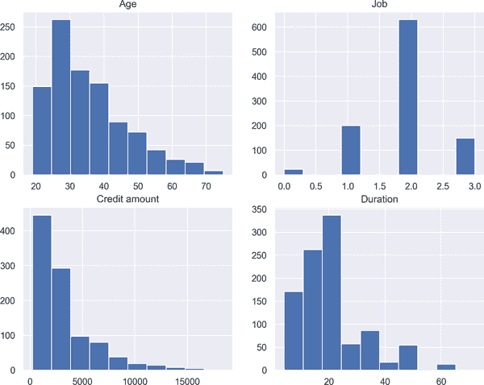

###### 图 6-1\. 信用风险数据直方图

图 6-1 显示了年龄、工作、信用额度和期限变量的分布。除了 `工作` 变量是离散变量外，所有其他变量都呈偏态分布。

首先介绍肘部法，在下面的代码片段中，并得到结果 图 6-2。为了找到最佳的聚类数，我们观察曲线的斜率，并决定曲线变平的截止点——也就是说，曲线的斜率变小。随着曲线变平，所述聚类内点的惯性减少，这对于聚类是有益的。另一方面，随着我们允许惯性减少，聚类数量增加，这使得分析更加复杂。考虑到这种权衡，停止标准是曲线变平的点。在代码中：

```py
In [9]: from sklearn.preprocessing import StandardScaler
        from sklearn.cluster import KMeans
        import numpy as np

In [10]: scaler = StandardScaler()
         scaled_credit = scaler.fit_transform(numerical_credit) 

In [11]: distance = []
         for k in range(1, 10):
             kmeans = KMeans(n_clusters=k) 
             kmeans.fit(scaled_credit)
             distance.append(kmeans.inertia_) 

In [12]: plt.plot(range(1, 10), distance, 'bx-')
         plt.xlabel('k')
         plt.ylabel('Inertia')
         plt.title('The Elbow Method')
         plt.show()
```


应用标准化以进行缩放


运行 K-means 算法


计算 `inertia` 并存储到名为 `distance` 的列表中

图 6-2 显示在四个聚类后曲线变得平缓。因此，肘部法建议我们在四个聚类停止。

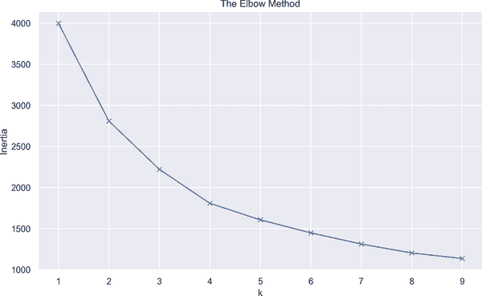

###### 图 6-2\. 肘部法

下面的代码给出了从聚类 2 到 10 的 Silhouette 分数，结果为 图 6-3，x 轴上的 Silhouette 分数。给定由虚线表示的平均 Silhouette 分数，最佳聚类数为两个：

```py
In [13]: from sklearn.metrics import silhouette_score 
         from yellowbrick.cluster import SilhouetteVisualizer 

In [14]: fig, ax = plt.subplots(4, 2, figsize=(25, 20))
         for i in range(2, 10):
             km = KMeans(n_clusters=i)
             q, r = divmod(i, 2) 
             visualizer = SilhouetteVisualizer(km, colors='yellowbrick',
                                               ax=ax[q - 1][r]) 
             visualizer.fit(scaled_credit)
             ax[q - 1][r].set_title("For Cluster_"+str(i))
             ax[q - 1][r].set_xlabel("Silhouette Score")
```


导入 `silhouette_score` 模块以计算 Silhouette 分数


导入 `SilhouetteVisualizer` 模块以绘制 Silhouette 图


使用 `divmod` 配置标签，因为它返回商 (`q`) 和余数 (`r`)


绘制 Silhouette 分数

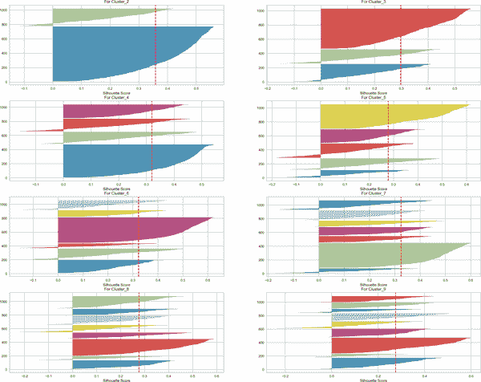

###### 图 6-3\. Silhouette 分数

如前所述，CH 方法是一种寻找最佳聚类的方便工具，以下代码显示了如何在 Python 中使用该方法，结果为 图 6-4。我们寻找最高的 CH 分数，并且我们将看到它在聚类 2 处获得：

```py
In [15]: from yellowbrick.cluster import KElbowVisualizer 
         model = KMeans()
         visualizer = KElbowVisualizer(model, k=(2, 10),
                                       metric='calinski_harabasz',
                                       timings=False) 
         visualizer.fit(scaled_credit)
         visualizer.show()
Out[]: <Figure size 576x396 with 0 Axes>
```


导入 `KElbowVisualizer` 以绘制 CH 分数


可视化 CH 指标

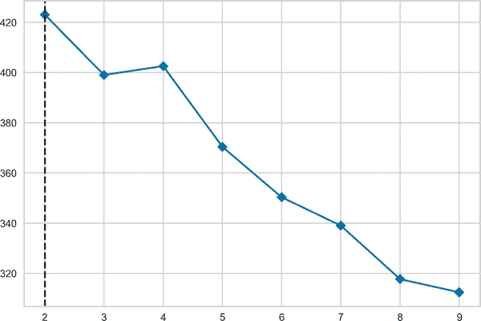

###### 图 6-4\. CH 方法

图 6-4 显示肘部出现在第二个聚类，表明停在两个聚类是最佳决定。

寻找最佳聚类数的最后一步是间隙分析，结果为 图 6-5：

```py
In [16]: from gap_statistic.optimalK import OptimalK 

In [17]: optimalK = OptimalK(n_jobs=8, parallel_backend='joblib') 
         n_clusters = optimalK(scaled_credit, cluster_array=np.arange(1, 10)) 

In [18]: gap_result = optimalK.gap_df 
         gap_result.head()
Out[18]:    n_clusters  gap_value         gap*  ref_dispersion_std        sk  \
         0         1.0   0.889755  5738.286952           54.033596  0.006408
         1         2.0   0.968585  4599.736451          366.047394  0.056195
         2         3.0   1.003974  3851.032471           65.026259  0.012381
         3         4.0   1.044347  3555.819296          147.396138  0.031187
         4         5.0   1.116450  3305.617917           27.894622  0.006559

                    sk*      diff        diff*
         0  6626.296782 -0.022635  6466.660374
         1  5328.109873 -0.023008  5196.127130
         2  4447.423150 -0.009186  4404.645656
         3  4109.432481 -0.065543  4067.336067
         4  3817.134689  0.141622  3729.880829

In [19]: plt.plot(gap_result.n_clusters, gap_result.gap_value)
         min_ylim, max_ylim = plt.ylim()
         plt.axhline(np.max(gap_result.gap_value), color='r',
                     linestyle='dashed', linewidth=2)
         plt.title('Gap Analysis')
         plt.xlabel('Number of Cluster')
         plt.ylabel('Gap Value')
         plt.show()
```


导入 `OptimalK` 模块以计算间隙统计量


运行间隙统计量并使用并行化


根据间隙统计确定聚类数量


存储间隙分析结果

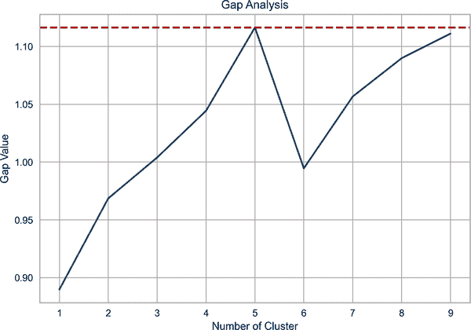

###### 图 6-5\. 差距分析

我们在图 6-5 中观察到一个急剧增加的情况，直到间隙值达到其峰值，并且分析建议在找到最佳聚类数量的最大值时停止。在本例中，我们发现在第 5 个聚类处的值，因此这是截断点。

综合这些讨论，选择了两个聚类作为最佳聚类数量，并相应进行了 K-means 聚类分析。为了说明，考虑到聚类分析，让我们用以下方式可视化 2-D 聚类结果，导致图 6-6：

```py
In [20]: kmeans = KMeans(n_clusters=2)
         clusters = kmeans.fit_predict(scaled_credit)

In [21]: plt.figure(figsize=(10, 12))
         plt.subplot(311)
         plt.scatter(scaled_credit[:, 0], scaled_credit[:, 2],
                     c=kmeans.labels_, cmap='viridis')
         plt.scatter(kmeans.cluster_centers_[:, 0],
                     kmeans.cluster_centers_[:, 2], s = 80,
                     marker= 'x', color = 'k')
         plt.title('Age vs Credit')
         plt.subplot(312)
         plt.scatter(scaled_credit[:, 0], scaled_credit[:, 2],
                     c=kmeans.labels_, cmap='viridis')
         plt.scatter(kmeans.cluster_centers_[:, 0],
                     kmeans.cluster_centers_[:, 2], s = 80,
                     marker= 'x', color = 'k')
         plt.title('Credit vs Duration')
         plt.subplot(313)
         plt.scatter(scaled_credit[:, 2], scaled_credit[:, 3],
                     c=kmeans.labels_, cmap='viridis')
         plt.scatter(kmeans.cluster_centers_[:, 2],
                     kmeans.cluster_centers_[:, 3], s = 120,
                     marker= 'x', color = 'k')
         plt.title('Age vs Duration')
         plt.show()
```

图 6-6 展示了观察行为，交叉符号`x`表示聚类中心，即质心。年龄表示更分散的数据，而`age`变量的质心位于`credit`变量的上方。在图 6-6 的第二个子图中展示了两个连续变量，即`credit`和`duration`，我们观察到清晰分离的聚类。该图表明，与`credit`变量相比，持续时间变量更为波动。在最后一个子图中，通过散点分析检验了`age`和`duration`之间的关系。结果表明，在这两个变量之间存在许多重叠的观察结果。

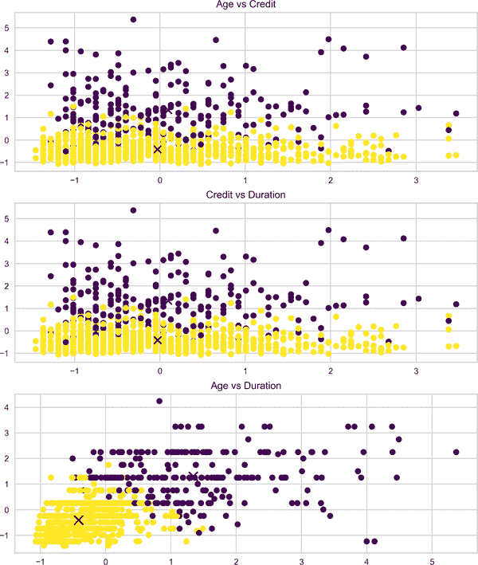

###### 图 6-6\. K-means 聚类

# 使用逻辑回归进行违约概率估计

获得聚类后，我们能够以同样方式处理具有类似特征的客户，即如果提供具有相似分布的数据，则模型可以更轻松和更稳定地学习。相反，对整个样本使用所有客户可能导致预测效果差且不稳定。

本节最终涉及使用贝叶斯估计计算违约概率，但首先让我们看看逻辑回归，以便进行比较。¹

逻辑回归是一种分类算法，在金融行业广泛应用。换句话说，它提出了解决分类问题的回归方法。逻辑回归旨在预测离散输出，并考虑了一些独立变量。

让*X*为自变量集合，*Y*为二进制（或多项式）输出。然后，条件概率为：

<math alttext="probability left-parenthesis upper Y equals 1 vertical-bar upper X equals x right-parenthesis" display="block"><mrow><mo form="prefix">Pr</mo> <mo>(</mo> <mi>Y</mi> <mo>=</mo> <mn>1</mn> <mo>|</mo> <mi>X</mi> <mo>=</mo> <mi>x</mi> <mo>)</mo></mrow></math>

可以理解为：给定*X*的值，*Y*为 1 的概率是多少？由于逻辑回归的因变量是概率型的，我们需要确保因变量的取值只能在 0 到 1 之间。

为此，应用一种称为*logistic（logit）转换*的修改，它简单地是概率比的对数（*p* / 1 - *p*）：

<math alttext="l o g left-parenthesis StartFraction p Over 1 minus p EndFraction right-parenthesis" display="block"><mrow><mi>l</mi> <mi>o</mi> <mi>g</mi> <mo>(</mo> <mfrac><mi>p</mi> <mrow><mn>1</mn><mo>-</mo><mi>p</mi></mrow></mfrac> <mo>)</mo></mrow></math>

逻辑回归模型的形式如下所示：

<math alttext="l o g left-parenthesis StartFraction p Over 1 minus p EndFraction right-parenthesis equals beta 0 plus beta 1 x" display="block"><mrow><mi>l</mi> <mi>o</mi> <mi>g</mi> <mrow><mo>(</mo> <mfrac><mi>p</mi> <mrow><mn>1</mn><mo>-</mo><mi>p</mi></mrow></mfrac> <mo>)</mo></mrow> <mo>=</mo> <msub><mi>β</mi> <mn>0</mn></msub> <mo>+</mo> <msub><mi>β</mi> <mn>1</mn></msub> <mi>x</mi></mrow></math>

解决*p*的结果如下：

<math alttext="p equals StartFraction e Superscript beta 0 plus beta 1 x Baseline Over 1 plus e Superscript beta 0 plus beta 1 x Baseline EndFraction" display="block"><mrow><mi>p</mi> <mo>=</mo> <mfrac><msup><mi>e</mi> <mrow><msub><mi>β</mi> <mn>0</mn></msub> <mo>+</mo><msub><mi>β</mi> <mn>1</mn></msub> <mi>x</mi></mrow></msup> <mrow><mn>1</mn><mo>+</mo><msup><mi>e</mi> <mrow><msub><mi>β</mi> <mn>0</mn></msub> <mo>+</mo><msub><mi>β</mi> <mn>1</mn></msub> <mi>x</mi></mrow></msup></mrow></mfrac></mrow></math>

让我们首先准备数据应用。首先，我们将集群区分为 0 和 1。信用数据有一列名为`risk`，表示客户的风险水平。接下来，检查集群 0 和集群 1 中每种风险的观察次数；结果显示，集群 0 和 1 中有 571 名好客户和 129 名好客户。在代码中：

```py
In [22]: clusters, counts = np.unique(kmeans.labels_, return_counts=True) 

In [23]: cluster_dict = {}
         for i in range(len(clusters)):
             cluster_dict[i] = scaled_credit[np.where(kmeans.labels_==i)] 

In [24]: credit['clusters'] = pd.DataFrame(kmeans.labels_) 

In [25]: df_scaled = pd.DataFrame(scaled_credit)
         df_scaled['clusters'] = credit['clusters']

In [26]: df_scaled['Risk'] = credit['Risk']
         df_scaled.columns = ['Age', 'Job', 'Credit amount',
                              'Duration', 'Clusters', 'Risk']

In [27]: df_scaled[df_scaled.Clusters == 0]['Risk'].value_counts() 
Out[27]: good    571
         bad     193
         Name: Risk, dtype: int64

In [28]: df_scaled[df_scaled.Clusters == 1]['Risk'].value_counts() 
Out[28]: good    129
         bad     107
         Name: Risk, dtype: int64
```


获取集群编号


基于集群编号，区分集群并将它们存储在名为`cluster_dict`的字典中


使用 K-means 标签创建`clusters`列


观察集群内类别的观察次数


查找每个类别的观察次数

接下来，我们绘制了几个条形图，以显示每个风险级别类别的观察次数差异（图 6-7 和 6-8）：

```py
In [29]: df_scaled[df_scaled.Clusters == 0]['Risk'].value_counts()\
                                             .plot(kind='bar',
                                             figsize=(10, 6),
                                             title="Frequency of Risk Level");
In [30]: df_scaled[df_scaled.Clusters == 1]['Risk'].value_counts()\
                                             .plot(kind='bar',
                                             figsize=(10, 6),
                                             title="Frequency of Risk Level");
```

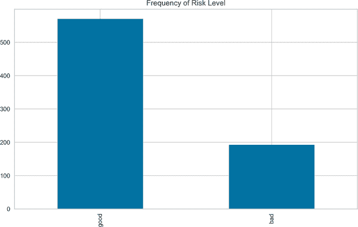

###### 图 6-7\. 第一个集群风险水平的频率

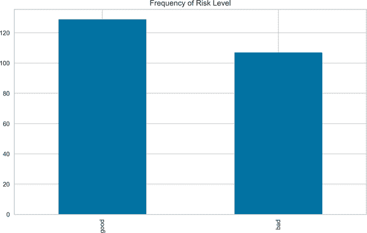

###### 图 6-8\. 第二个集群风险水平的频率

基于我们之前定义的集群，我们可以通过直方图分析风险水平的频率。图 6-7 显示，在第一个集群中，风险水平的分布是不平衡的，而在 图 6-8 中，好和坏风险水平的频率更加平衡，如果不是完全平衡的话。

此时，让我们退后一步，专注于一个完全不同的问题：*类不平衡*。在信用风险分析中，类不平衡问题并不少见。当一个类占主导地位时，就会出现类不平衡。例如，在我们的案例中，根据从第一个集群获得的数据，我们有 571 名信用记录良好的客户和 193 名信用记录不良的客户。可以清楚地看到，信用记录良好的客户占据了上风；这基本上就是我们所说的类不平衡。

处理此问题有多种方法：上采样、下采样、合成少数类过采样技术（SMOTE）和编辑最近邻规则（ENN）。为了利用混合方法，我们将结合 SMOTE 和 ENN，以清理类之间不必要的重叠观测，这将帮助我们检测到最佳的平衡比率，并进而提高预测性能（Tuong 等，2018）。将不平衡数据转换为平衡数据将是预测违约概率的第一步，但请注意，我们仅将此技术应用于从第一个聚类中获取的数据。

现在，我们接下来进行训练-测试拆分。为此，我们需要将分类变量`Risk`转换为离散变量。类别`good`取值为 1，`bad`取值为 0。在训练-测试拆分中，将 80%的数据用于训练样本，20%用于测试样本：

```py
In [31]: from sklearn.model_selection import train_test_split

In [32]: df_scaled['Risk'] = df_scaled['Risk'].replace({'good': 1, 'bad': 0}) 

In [33]: X = df_scaled.drop('Risk', axis=1)
         y = df_scaled.loc[:, ['Risk', 'Clusters']]

In [34]: X_train, X_test, y_train, y_test = train_test_split(X, y,
                                                             test_size=0.2,
                                                             random_state=42)

In [35]: first_cluster_train = X_train[X_train.Clusters == 0].iloc[:, :-1] 
         second_cluster_train = X_train[X_train.Clusters == 1].iloc[:, :-1] 
```


变量的离散化


根据第一个聚类创建数据，并从`X_train`中删除最后一列


根据第二个聚类创建数据，并从`X_train`中删除最后一列

在这些准备工作完成后，我们准备继续运行逻辑回归以预测违约概率。我们将使用的库名为`statsmodels`，它允许有一个汇总表。以下结果基于第一个聚类数据。根据结果，`age`、`credit amount`和`job`变量与客户的信用价值呈正相关，而`dependent`和`duration`变量之间存在负相关。这一发现表明，在 1%的显著性水平上，所有估计系数都显示出统计上显著的结果。一般的解释是，持续时间的下降和信用额度、年龄和工作的增加都意味着违约的高概率：

```py
In [36]: import statsmodels.api as sm
         from sklearn.linear_model import LogisticRegression
         from sklearn.metrics import roc_auc_score, roc_curve
         from imblearn.combine import SMOTEENN 
         import warnings
         warnings.filterwarnings('ignore')

In [37]: X_train1 = first_cluster_train
         y_train1 = y_train[y_train.Clusters == 0]['Risk'] 
         smote = SMOTEENN(random_state = 2) 
         X_train1, y_train1 = smote.fit_resample(X_train1, y_train1.ravel()) 
         logit = sm.Logit(y_train1, X_train1) 
         logit_fit1 = logit.fit() 
         print(logit_fit1.summary())
         Optimization terminated successfully.
         Current function value: 0.479511
         Iterations 6
                           Logit Regression Results
==============================================================================
Dep. Variable:                      y   No. Observations:                  370
Model:                          Logit   Df Residuals:                      366
Method:                           MLE   Df Model:                            3
Date:                Wed, 01 Dec 2021   Pseudo R-squ.:                  0.2989
Time:                        20:34:31   Log-Likelihood:                -177.42
converged:                       True   LL-Null:                       -253.08
Covariance Type:            nonrobust   LLR p-value:                 1.372e-32
================================================================================
                    coef   std err          z      P>|z|      [0.025      0.975]
--------------------------------------------------------------------------------
Age               1.3677     0.164      8.348      0.000       1.047       1.689
Job               0.4393     0.153      2.873      0.004       0.140       0.739
Credit amount     1.3290     0.305      4.358      0.000       0.731       1.927
Duration         -1.2709     0.246     -5.164      0.000      -1.753      -0.789
================================================================================
```


导入`SMOTEENN`以处理类别不平衡问题


根据聚类 0 和风险水平创建`y_train`


运行带有随机状态为 2 的`SMOTEENN`方法


将不平衡数据转换为平衡数据


配置逻辑回归模型


运行逻辑回归模型

随后，通过基于聚类创建不同的数据集进行预测分析。为了测试的目的，以下分析是在测试数据上进行的，并导致图表 6-9 中的结果：

```py
In [38]: first_cluster_test = X_test[X_test.Clusters == 0].iloc[:, :-1] 
         second_cluster_test = X_test[X_test.Clusters == 1].iloc[:, :-1] 

In [39]: X_test1 = first_cluster_test
         y_test1 = y_test[y_test.Clusters == 0]['Risk']
         pred_prob1 = logit_fit1.predict(X_test1) 

In [40]: false_pos, true_pos, _ = roc_curve(y_test1.values,  pred_prob1) 
         auc = roc_auc_score(y_test1, pred_prob1) 
         plt.plot(false_pos,true_pos, label="AUC for cluster 1={:.4f} "
                  .format(auc))
         plt.plot([0, 1], [0, 1], linestyle = '--', label='45 degree line')
         plt.legend(loc='best')
         plt.title('ROC-AUC Curve 1')
         plt.show()
```


基于第 0 类别的聚类创建第一组测试数据


基于第一类别的聚类创建第二组测试数据


使用`X_test1`进行预测


使用`roc_curve`函数获取假阳性和真阳性


计算`roc-auc`分数

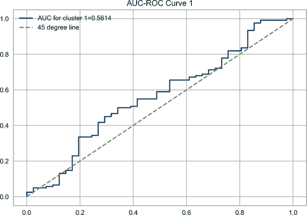

###### 图 6-9\. 第一个聚类的 ROC-AUC 曲线

ROC-AUC 曲线是在存在不平衡数据时的一个方便工具。图 6-9 中的 ROC-AUC 曲线表明模型的性能并不是很好，因为它仅略高于 45 度线。一般来说，根据测试结果，一个良好的 ROC-AUC 曲线应该接近 1，意味着有接近完美的分离。

继续使用从第二个聚类获得的第二组训练样本，`job`、`duration`和`age`的估计系数表现出正相关，表明`job`类型为`1`且持续时间较长的客户倾向于违约，而`credit amount`变量与因变量呈负相关。然而，所有估计系数在 95%置信区间下都不显著；因此，进一步解释这些发现是毫无意义的。

类似于我们对第一组测试数据所做的操作，我们创建第二组测试数据来运行预测以绘制 ROC-AUC 曲线，结果显示为图 6-10：

```py
In [41]: X_train2 = second_cluster_train
         y_train2 = y_train[y_train.Clusters == 1]['Risk']
         logit = sm.Logit(y_train2, X_train2)
         logit_fit2 = logit.fit()
         print(logit_fit2.summary())
         Optimization terminated successfully.
         Current function value: 0.688152
         Iterations 4
                           Logit Regression Results
==============================================================================
Dep. Variable:                   Risk   No. Observations:                  199
Model:                          Logit   Df Residuals:                      195
Method:                           MLE   Df Model:                            3
Date:                Wed, 01 Dec 2021   Pseudo R-squ.:              -0.0008478
Time:                        20:34:33   Log-Likelihood:                -136.94
converged:                       True   LL-Null:                       -136.83
Covariance Type:            nonrobust   LLR p-value:                     1.000
================================================================================
                    coef   std err          z      P>|z|      [0.025      0.975]
--------------------------------------------------------------------------------
Age               0.0281     0.146      0.192      0.848      -0.259       0.315
Job               0.1536     0.151      1.020      0.308      -0.142       0.449
Credit amount    -0.1090     0.115     -0.945      0.345      -0.335       0.117
Duration          0.1046     0.126      0.833      0.405      -0.142       0.351
================================================================================

In [42]: X_test2 = second_cluster_test
         y_test2 = y_test[y_test.Clusters == 1]['Risk']
         pred_prob2 = logit_fit2.predict(X_test2)

In [43]: false_pos, true_pos, _ = roc_curve(y_test2.values,  pred_prob2)
         auc = roc_auc_score(y_test2, pred_prob2)
         plt.plot(false_pos,true_pos,label="AUC for cluster 2={:.4f} "
                  .format(auc))
         plt.plot([0, 1], [0, 1], linestyle = '--', label='45 degree line')
         plt.legend(loc='best')
         plt.title('ROC-AUC Curve 2')
         plt.show()
```

根据测试数据，图 6-10 中显示的结果比先前的应用要差，这可以通过 0.4064 的 AUC 分数确认。考虑到这些数据，我们远不能说逻辑回归在使用德国信用风险数据集建模违约概率方面做得很好。

现在我们将使用不同的模型来看看逻辑回归在相对于其他方法建模此类问题中的表现如何。因此，在接下来的部分，我们将研究最大后验概率（MAP）贝叶斯估计和马尔可夫链蒙特卡洛（MCMC）方法。然后，我们将使用几个知名的 ML 模型——如 SVM、随机森林和使用`MLPRegressor`的神经网络——来探索这些方法，并将使用 TensorFlow 测试深度学习模型。这个应用将展示哪个模型在建模违约概率方面表现更好。

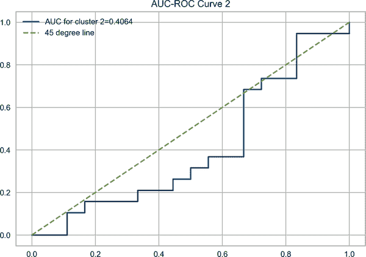

###### 图 6-10\. 第二个聚类的 ROC-AUC 曲线

## 使用贝叶斯模型进行违约概率估计

在这部分中，我们将使用 Python 包`PYMC3`进行贝叶斯估计，预测违约的概率。但是，使用`PYMC3`运行贝叶斯分析有几种方法，对于第一个应用程序，我们将使用第四章中讨论的 MAP 分布。作为一个快速提醒，鉴于代表性后验分布，MAP 在这种情况下成为一个有效的模型。此外，我们选择具有确定性变量(*p*)的贝叶斯模型，该变量完全由其父变量决定，即`age`、`job`、`credit amount`和`duration`。

让我们将贝叶斯分析的结果与逻辑回归进行比较：

```py
In [44]: import pymc3 as pm 
         import arviz as az 

In [45]: with pm.Model() as logistic_model1: 
             beta_age = pm.Normal('coeff_age', mu=0, sd=10) 
             beta_job = pm.Normal('coeff_job', mu=0, sd=10)
             beta_credit = pm.Normal('coeff_credit_amount', mu=0, sd=10)
             beta_dur = pm.Normal('coeff_duration', mu=0, sd=10)
             p = pm.Deterministic('p', pm.math.sigmoid(beta_age *
                                       X_train1['Age'] + beta_job *
                                       X_train1['Job'] + beta_credit *
                                       X_train1['Credit amount'] + beta_dur *
                                       X_train1['Duration'])) 
         with logistic_model1:
             observed = pm.Bernoulli("risk", p, observed=y_train1) 
             map_estimate = pm.find_MAP() 
Out[]: <IPython.core.display.HTML object>

In [46]: param_list = ['coeff_age', 'coeff_job',
                       'coeff_credit_amount', 'coeff_duration']
         params = {}
         for i in param_list:
             params[i] = [np.round(map_estimate[i], 6)] 

         bayesian_params = pd.DataFrame.from_dict(params)
         print('The result of Bayesian estimation:\n {}'.format(bayesian_params))
         The result of Bayesian estimation:
             coeff_age  coeff_job  coeff_credit_amount  coeff_duration
         0   1.367247   0.439128              1.32721       -1.269345
```


导入`PYMC3`


导入`arviz`用于贝叶斯模型的探索性分析


将贝叶斯模型标识为`logistic_model1`


确定变量的假设分布为正态分布，具有定义的`mu`和`sigma`参数


使用第一个样本运行确定性模型


运行伯努利分布来建模因变量


将 MAP 模型拟合到数据中


将所有估计系数的结果存储在`param`s 中，保留六位小数

最引人注目的观察是估计系数之间的差异非常小，可以忽略不计。差异出现在小数部分。以信用金额变量的估计系数为例，我们在逻辑回归中估计系数为 1.3290，在贝叶斯分析中为 1.3272。

当比较基于第二簇数据的分析结果时，故事基本相同：

```py
In [47]: with pm.Model() as logistic_model2:
             beta_age = pm.Normal('coeff_age', mu=0, sd=10)
             beta_job = pm.Normal('coeff_job', mu=0, sd=10)
             beta_credit = pm.Normal('coeff_credit_amount', mu=0, sd=10)
             beta_dur = pm.Normal('coeff_duration', mu=0, sd=10)
             p = pm.Deterministic('p', pm.math.sigmoid(beta_age *
                                       second_cluster_train['Age'] +
                                       beta_job * second_cluster_train['Job'] +
                                       beta_credit *
                                       second_cluster_train['Credit amount'] +
                                       beta_dur *
                                       second_cluster_train['Duration']))
         with logistic_model2:
             observed = pm.Bernoulli("risk", p,
                                     observed=y_train[y_train.Clusters == 1]
                                     ['Risk'])
             map_estimate = pm.find_MAP()
Out[]: <IPython.core.display.HTML object>

In [48]: param_list = [ 'coeff_age', 'coeff_job',
                       'coeff_credit_amount', 'coeff_duration']
         params = {}
         for i in param_list:
             params[i] = [np.round(map_estimate[i], 6)]

         bayesian_params = pd.DataFrame.from_dict(params)
         print('The result of Bayesian estimation:\n {}'.format(bayesian_params))
         The result of Bayesian estimation:
             coeff_age  coeff_job  coeff_credit_amount  coeff_duration
         0   0.028069   0.153599            -0.109003        0.104581
```

最显著的差异出现在`duration`变量中。这个变量的估计系数在逻辑回归和贝叶斯估计中分别为 0.1046 和 0.1045。

我们不是寻找局部最大值，有时很难得到，而是基于抽样过程寻找近似期望。在贝叶斯设置中，这称为 MCMC。正如我们在第四章中讨论的，其中最著名的方法之一是 Metropolis-Hastings（M-H）算法。

基于 M-H 算法的贝叶斯估计的 Python 代码如下所示，并导致图 6-11 的结果。因此，我们抽取 10,000 个后验样本，模拟两个独立的马尔可夫链的后验分布。代码中还提供了估计系数的摘要表：

```py
In [49]: import logging 
         logger = logging.getLogger('pymc3') 
         logger.setLevel(logging.ERROR) 

In [50]: with logistic_model1:
             step = pm.Metropolis() 
             trace = pm.sample(10000, step=step,progressbar = False) 
         az.plot_trace(trace) 
         plt.show()
In [51]: with logistic_model1:
             display(az.summary(trace, round_to=6)[:4]) 
Out[]:                          mean        sd    hdi_3%   hdi_97%  mcse_mean  \
       coeff_age            1.392284  0.164607  1.086472  1.691713   0.003111
       coeff_job            0.448694  0.155060  0.138471  0.719332   0.002925
       coeff_credit_amount  1.345549  0.308100  0.779578  1.928159   0.008017
       coeff_duration      -1.290292  0.252505 -1.753565 -0.802707   0.006823

                             mcse_sd     ess_bulk     ess_tail     r_hat
       coeff_age            0.002200  2787.022099  3536.314548  1.000542
       coeff_job            0.002090  2818.973167  3038.790307  1.001246
       coeff_credit_amount  0.005670  1476.746667  2289.532062  1.001746
       coeff_duration       0.004826  1369.393339  2135.308468  1.001022
```


导入`logging`包以抑制警告消息


为日志记录命名包


抑制错误而不引发异常


启动 M-H 模型


使用 10,000 个样本运行模型并忽略进度条


创建简单的后验概率图使用`plot_trace`


打印摘要结果的前四行

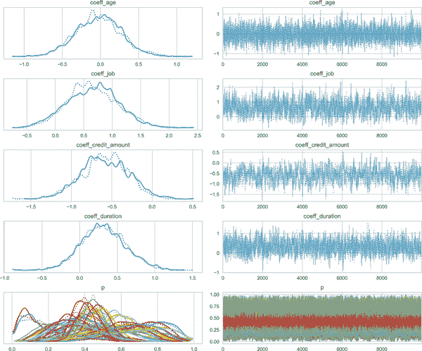

###### 图 6-11\. 使用 M—H 进行贝叶斯估计的第一个聚类

结果表明，预测性能应该非常接近逻辑回归的性能，因为这两个模型的估计系数非常相似。

在 Figure 6-11 中，我们看到了虚线和实线。给定第一个聚类数据，位于 Figure 6-11 左侧的图表显示了相关参数的样本值。虽然这不是我们目前的重点，但我们可以观察到最后一个图中的确定性变量*p*。

类似地，基于第二个聚类的 M-H 贝叶斯估计结果与逻辑回归非常接近。然而，从 MAP 应用程序获得的结果更好，这主要是因为 M-H 使用随机抽样。然而，这种小偏差的另一个潜在原因我们将讨论。

至于我们从第二个聚类获得的数据，可以在下面的代码中看到 M-H 贝叶斯估计的结果，该代码还创建了 Figure 6-12 中显示的图表：

```py
In [52]: with logistic_model2:
             step = pm.Metropolis()
             trace = pm.sample(10000, step=step,progressbar = False)
         az.plot_trace(trace)
         plt.show()
In [53]: with logistic_model2:
             display(az.summary(trace, round_to=6)[:4])
Out[]:                          mean        sd    hdi_3%   hdi_97%  mcse_mean  \
       coeff_age            0.029953  0.151466 -0.262319  0.309050   0.002855
       coeff_job            0.158140  0.153030 -0.125043  0.435734   0.003513
       coeff_credit_amount -0.108844  0.116542 -0.328353  0.105858   0.003511
       coeff_duration       0.103149  0.128264 -0.142609  0.339575   0.003720

                             mcse_sd     ess_bulk     ess_tail     r_hat
       coeff_age            0.002019  2823.255277  3195.005913  1.000905
       coeff_job            0.002485  1886.026245  2336.516309  1.000594
       coeff_credit_amount  0.002483  1102.228318  1592.047959  1.002032
       coeff_duration       0.002631  1188.042552  1900.179695  1.000988
```

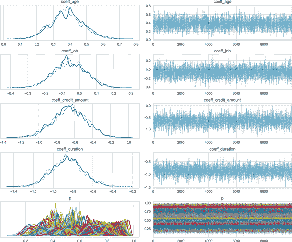

###### 图 6-12\. 使用 M—H 进行贝叶斯估计的第二个聚类

现在让我们讨论 M-H 模型的局限性，这可能会揭示模型结果之间的差异。M-H 算法的一个缺点是对步长的敏感性。小步骤阻碍了收敛过程。相反，大步骤可能导致高拒绝率。此外，M-H 可能会受到罕见事件的影响——由于这些事件的概率很低，需要大样本才能获得可靠的估计——这在本例中是我们关注的焦点。

现在，让我们考虑如果我们使用 SVM 预测违约概率会发生什么，并将其性能与逻辑回归进行比较。

## 使用支持向量机进行违约概率估计

SVM 被认为是一个参数化模型，并且在高维数据上表现良好。在多变量设置中的违约案例可能为运行 SVM 提供了丰富的数据。在继续之前，简要讨论我们将用来运行超参数调整的新方法是`HalvingRandomSearchCV`。

`HalvingRandomSearchCV`使用迭代选择，以使用更少的资源，从而提高性能并节省时间。`HalvingRandomSearchCV`尝试使用连续减半来识别候选参数的最佳值。这个过程的逻辑如下：

1.  评估所有参数组合，在第一次迭代中利用一定数量的训练样本。

1.  在第二次迭代中，使用选定的一些参数和大量的训练样本。

1.  直到最后一次迭代只包括得分最高的候选模型。

使用信用数据集，我们使用支持向量分类（SVC）预测违约的概率。同样，根据我们在本章最初部分执行的聚类，我们使用两个不同的数据集。结果如下所示：

```py
In [54]: from sklearn.svm import SVC
         from sklearn.experimental import enable_halving_search_cv 
         from sklearn.model_selection import HalvingRandomSearchCV 
         import time

In [55]: param_svc = {'gamma': [1e-6, 1e-2],
                      'C':[0.001,.09,1,5,10],
                      'kernel':('linear','rbf')}

In [56]: svc = SVC(class_weight='balanced')
         halve_SVC = HalvingRandomSearchCV(svc, param_svc,
                                           scoring = 'roc_auc', n_jobs=-1) 
         halve_SVC.fit(X_train1, y_train1)
         print('Best hyperparameters for first cluster in SVC {} with {}'.
               format(halve_SVC.best_score_, halve_SVC.best_params_))
         Best hyperparameters for first cluster in SVC 0.8273860106443562 with
         {'kernel': 'rbf', 'gamma': 0.01, 'C': 1}

In [57]: y_pred_SVC1 = halve_SVC.predict(X_test1) 
         print('The ROC AUC score of SVC for first cluster is {:.4f}'.
               format(roc_auc_score(y_test1, y_pred_SVC1)))
         The ROC AUC score of SVC for first cluster is 0.5179
```


导入库以启用连续减半搜索。


导入库以运行减半搜索。


使用并行处理运行减半搜索。


运行预测分析。

SVM 中的一个重要步骤是超参数调整。使用减半搜索方法，我们试图找到最佳的`kernel`、`gamma`和`C`的组合。结果表明，两个不同样本之间唯一的区别在于`gamma`和`C`超参数上。在第一个聚类中，最优的`C`得分为 1，而在第二个聚类中为 0.001。更高的`C`值表示我们应选择更小的边距以获得更好的分类效果。至于`gamma`超参数，两个聚类都采用相同的值。较低的`gamma`意味着支持向量对决策的影响更大。最佳的核函数是高斯核，两个聚类的`gamma`值均为 0.01。

AUC 性能指标表明，SVC 的预测性能略低于逻辑回归。具体来说，SVC 的 AUC 为 0.5179，这意味着 SVC 在第一个聚类中表现不如逻辑回归。

第二个聚类显示，SVC 的性能甚至比第一个聚类稍差，这表明 SVC 在这些数据上表现不佳，因为这些数据不太可能清晰地分离，这暗示 SVC 在低维空间中表现不佳。

```py
In [58]: halve_SVC.fit(X_train2, y_train2)
         print('Best hyperparameters for second cluster in SVC {} with {}'.
               format(halve_SVC.best_score_, halve_SVC.best_params_))
         Best hyperparameters for second cluster in SVC 0.5350758636788049 with
         {'kernel': 'rbf', 'gamma': 0.01, 'C': 0.001}

In [59]: y_pred_SVC2 = halve_SVC.predict(X_test2)
         print('The ROC AUC score of SVC for first cluster is {:.4f}'.
               format(roc_auc_score(y_test2, y_pred_SVC2)))
         The ROC AUC score of SVC for first cluster is 0.5000
```

好吧，也许我们已经足够使用参数化方法了，让我们转向非参数化方法。现在，*非参数化* 这个词可能听起来令人困惑，但它只是一个具有无限参数的模型，随着观察数量的增加而变得更加复杂。随机森林是机器学习中最适用的非参数模型之一，我们接下来会讨论这个模型。

## 使用随机森林进行违约概率估计

随机森林分类器是我们可以用来建模违约概率的另一个模型。虽然随机森林在高维情况下失败，但我们的数据并不那么复杂，而随机森林的优势在于在大量样本存在时具有良好的预测性能，因此可以认为随机森林模型可能会胜过 SVC 模型。

使用减半搜索方法，我们试图找出最佳的 `n_estimators`、`criterion`、`max_features`、`max_depth`、`min_samples_split` 组合。结果表明，对于第一个集群，我们使用 `n_estimators` 为 300，`min_samples_split` 为 10，`max_depth` 为 6，采用基尼系数的方法，以及 `sqrt` 作为 `max_features`。至于第二个集群，我们有两种不同的最优超参数，如下所示。在基于树的模型中，较大的深度意味着更复杂的模型。话虽如此，提议用于第二个集群的模型稍微复杂一些。`max_features` 超参数在样本间似乎有所不同；在第一个集群中，通过 <math alttext="StartRoot number of features EndRoot"><msqrt><mrow><mtext>number</mtext> <mtext>of</mtext> <mtext>features</mtext></mrow></msqrt></math> 选择了最大特征数。

鉴于第一个集群的数据，AUC 得分为 0.5387 表明随机森林相比其他模型有更好的性能：

```py
In [60]: from sklearn.ensemble import RandomForestClassifier

In [61]: rfc = RandomForestClassifier(random_state=42)

In [62]: param_rfc = {'n_estimators': [100, 300],
             'criterion' :['gini', 'entropy'],
             'max_features': ['auto', 'sqrt', 'log2'],
             'max_depth' : [3, 4, 5, 6],
             'min_samples_split':[5, 10]}

In [63]: halve_RF = HalvingRandomSearchCV(rfc, param_rfc,
                                          scoring = 'roc_auc', n_jobs=-1)
         halve_RF.fit(X_train1, y_train1)
         print('Best hyperparameters for first cluster in RF {} with {}'.
               format(halve_RF.best_score_, halve_RF.best_params_))
         Best hyperparameters for first cluster in RF 0.8890871444218126 with
         {'n_estimators': 300, 'min_samples_split': 10, 'max_features': 'sqrt',
         'max_depth': 6, 'criterion': 'gini'}

In [64]: y_pred_RF1 = halve_RF.predict(X_test1)
         print('The ROC AUC score of RF for first cluster is {:.4f}'.
               format(roc_auc_score(y_test1, y_pred_RF1)))
         The ROC AUC score of RF for first cluster is 0.5387
```

下面的代码展示了基于第二个集群的随机森林运行：

```py
In [65]: halve_RF.fit(X_train2, y_train2)
         print('Best hyperparameters for second cluster in RF {} with {}'.
               format(halve_RF.best_score_, halve_RF.best_params_))
         Best hyperparameters for second cluster in RF 0.6565 with
         {'n_estimators': 100, 'min_samples_split': 5, 'max_features': 'auto',
         'max_depth': 5, 'criterion': 'entropy'}

In [66]: y_pred_RF2 = halve_RF.predict(X_test2)
         print('The ROC AUC score of RF for first cluster is {:.4f}'.
               format(roc_auc_score(y_test2, y_pred_RF2)))
         The ROC AUC score of RF for first cluster is 0.5906
```

随机森林在第二个集群中具有更好的预测性能，AUC 得分为 0.5906。鉴于随机森林的预测性能，我们可以得出结论，随机森林更擅长拟合数据。这部分是由于数据的低维特性，因为当数据维度低且观察数目大时，随机森林证明是一个不错的选择。

## 使用神经网络进行违约概率估计

鉴于违约概率估计的复杂性，揭示数据的隐藏结构是一项艰巨的任务，但神经网络结构在处理此问题时表现出色，因此它是这类任务的理想候选模型。在设置神经网络模型时，使用 `GridSearchCV` 来优化隐藏层的数量、优化技术和学习率。

在运行模型时，我们首先使用`MLP`库，它允许我们控制许多参数，包括隐藏层大小、优化技术（求解器）和学习率。比较两个簇的优化超参数表明，唯一的区别在于隐藏层中神经元的数量。因此，在第一个簇中，第一个隐藏层中的神经元数量较大。但是，在第二个簇中，第二个隐藏层中的神经元数量较大。

以下代码表明基于第一簇数据的性能只有轻微改善。换句话说，AUC 变为 0.5263，仅比随机森林略差：

```py
In [67]: from sklearn.neural_network import MLPClassifier

In [68]: param_NN = {"hidden_layer_sizes": [(100, 50), (50, 50), (10, 100)],
                     "solver": ["lbfgs", "sgd", "adam"],
                     "learning_rate_init": [0.001, 0.05]}

In [69]: MLP = MLPClassifier(random_state=42)

In [70]: param_halve_NN = HalvingRandomSearchCV(MLP, param_NN,
                                                scoring = 'roc_auc')
         param_halve_NN.fit(X_train1, y_train1)
         print('Best hyperparameters for first cluster in NN are {}'.
               format(param_halve_NN.best_params_))
         Best hyperparameters for first cluster in NN are {'solver': 'lbfgs',
         'learning_rate_init': 0.05, 'hidden_layer_sizes': (100, 50)}

In [71]: y_pred_NN1 = param_halve_NN.predict(X_test1)
         print('The ROC AUC score of NN for first cluster is {:.4f}'.
               format(roc_auc_score(y_test1, y_pred_NN1)))
         The ROC AUC score of NN for first cluster is 0.5263
```

从第二簇中获得的 ROC-AUC 得分为 0.6155，具有 10 个和 100 个神经元的两个隐藏层。此外，最佳优化技术为`adam`，最佳初始学习率为 0.05。这是我们获得的最高 AUC 得分，表明神经网络能够捕捉复杂和非线性数据的动态，如下所示：

```py
In [72]: param_halve_NN.fit(X_train2, y_train2)
         print('Best hyperparameters for first cluster in NN are {}'.
               format(param_halve_NN.best_params_))
         Best hyperparameters for first cluster in NN are {'solver': 'lbfgs',
         'learning_rate_init': 0.05, 'hidden_layer_sizes': (10, 100)}

In [73]: y_pred_NN2 = param_halve_NN.predict(X_test2)
         print('The ROC AUC score of NN for first cluster is {:.4f}'.
               format(roc_auc_score(y_test2, y_pred_NN2)))
         The ROC AUC score of NN for first cluster is 0.6155
```

## 使用深度学习进行违约概率估计

现在让我们来看看使用 TensorFlow 通过`KerasClassifier`控制超参数的深度学习模型的性能。

我们在这个模型中调整的超参数是批量大小、epoch 和 dropout 率。由于违约概率是一个分类问题，Sigmoid 激活函数似乎是最优的函数选择。深度学习基于神经网络的结构，但提供了更复杂的结构，因此预计能更好地捕捉数据的动态，从而使我们具有更好的预测性能。

如下所示，第二个样本的预测性能出现了问题，然而，AUC 得分为 0.5628：

```py
In [74]: from tensorflow import keras
         from tensorflow.keras.wrappers.scikit_learn import KerasClassifier 
         from tensorflow.keras.layers import Dense, Dropout
         from sklearn.model_selection import GridSearchCV
         import tensorflow as tf
         import logging 
         tf.get_logger().setLevel(logging.ERROR) 

In [75]: def DL_risk(dropout_rate,verbose=0):
             model = keras.Sequential()
             model.add(Dense(128,kernel_initializer='normal',
                 activation = 'relu', input_dim=4))
             model.add(Dense(64, kernel_initializer='normal',
                 activation = 'relu'))
             model.add(Dense(8,kernel_initializer='normal',
                 activation = 'relu'))
             model.add(Dropout(dropout_rate))
             model.add(Dense(1, activation="sigmoid"))
             model.compile(loss='binary_crossentropy', optimizer='rmsprop')
             return model
```


导入`KerasClassifier`以运行网格搜索


导入`logging`以抑制警告消息


为 TensorFlow 命名以记录日志

给定了 dropout、批量大小和 epoch 的优化超参数，深度学习模型在我们迄今使用的模型中产生了最佳性能，AUC 得分为 0.5614。MLPClassifier 和本章中使用的深度学习模型之间的区别在于隐藏层中的神经元数量。从技术上讲，这两个模型都是具有不同结构的深度学习模型。

```py
In [76]: parameters = {'batch_size':  [10, 50, 100],
                   'epochs':  [50, 100, 150],
                      'dropout_rate':[0.2, 0.4]}
         model = KerasClassifier(build_fn = DL_risk) 
         gs = GridSearchCV(estimator = model,
                                param_grid = parameters,
                                   scoring = 'roc_auc') 

In [77]: gs.fit(X_train1, y_train1, verbose=0)
         print('Best hyperparameters for first cluster in DL are {}'.
               format(gs.best_params_))
         Best hyperparameters for first cluster in DL are {'batch_size': 10,
         'dropout_rate': 0.2, 'epochs': 50}
```


调用一个名为`DL_risk`的预定义函数以优化超参数运行。


应用网格搜索

```py
In [78]: model = KerasClassifier(build_fn = DL_risk,                    
                                 dropout_rate = gs.best_params_['dropout_rate'],
                                 verbose = 0,
                                 batch_size = gs.best_params_['batch_size'], 
                                 epochs = gs.best_params_['epochs']) 
         model.fit(X_train1, y_train1)
         DL_predict1 = model.predict(X_test1)                           
         DL_ROC_AUC = roc_auc_score(y_test1, pd.DataFrame(DL_predict1.flatten()))
         print('DL_ROC_AUC is {:.4f}'.format(DL_ROC_AUC))
         DL_ROC_AUC is 0.5628
```


使用最优的 dropout 率超参数运行深度学习算法


运行具有最佳批大小超参数的深度学习算法


运行具有最佳超参数（epoch number）的深度学习算法


在展平预测后计算 ROC-AUC 分数

```py
In [79]: gs.fit(X_train2.values, y_train2.values, verbose=0)
         print('Best parameters for second cluster in DL are {}'.
               format(gs.best_params_))
         Best parameters for second cluster in DL are {'batch_size': 10,
         'dropout_rate': 0.2, 'epochs': 150}

In [80]: model = KerasClassifier(build_fn = DL_risk,
                                 dropout_rate= gs.best_params_['dropout_rate'],
                                 verbose = 0,
                                 batch_size = gs.best_params_['batch_size'],
                                 epochs = gs.best_params_['epochs'])
         model.fit(X_train2, y_train2)
         DL_predict2 =  model.predict(X_test2)
         DL_ROC_AUC = roc_auc_score(y_test2, DL_predict2.flatten())
         print('DL_ROC_AUC is {:.4f}'.format(DL_ROC_AUC))
         DL_ROC_AUC is 0.5614
```

这一发现证实了 DL 模型在金融建模中变得越来越受欢迎。然而，在工业界，由于网络结构的不透明性，建议将该方法与传统模型结合使用。

# 结论

信用风险分析有着悠久的传统，但仍然是一项具有挑战性的任务。本章尝试提出一种全新的基于机器学习的方法来解决这个问题，并获得更好的预测性能。在本章的第一部分，提供了与信用风险相关的主要概念。然后，我们将一个众所周知的参数模型，即 logistic 回归，应用到了德国信用风险数据中。然后，比较了 logistic 回归与基于 MAP 和 M-H 的贝叶斯估计的性能。最后，应用了核心机器学习模型—即 SVC、随机森林和带有深度学习的 NNs，并比较了所有模型的性能。

在下一章中，将介绍一个被忽视的维度风险：流动性风险。自 2007-2008 年金融危机以来，人们对流动性风险的重视程度大幅增长，并已成为风险管理的重要组成部分。

# 参考文献

本章引用的文章：

+   银行监督管理委员会（Basel Committee on Banking Supervision）和国际清算银行（Bank for International Settlements）。2000 年。“信用风险管理原则。”国际清算银行。

+   Le, Tuong, Mi Young Lee, Jun Ryeol Park, 和 Sung Wook Baik. 2018\. “破产预测的过采样技术：来自交易数据集的新特征。” *对称性* 10 (4): 79。

+   Tibshirani, Robert, Guenther Walther, 和 Trevor Hastie. 2001\. “通过间隙统计量估计数据集中的簇数。” *英国皇家统计学会杂志：B 系列（统计方法）* 63 (2): 411-423。

本章引用的书籍和博士论文：

+   Rokach, Lior, 和 Oded Maimon. 2005\. “聚类方法。” 在 *数据挖掘与知识发现手册*，321-352\. 波士顿：斯普林格出版社。

+   Wehrspohn, Uwe. 2002\. “信用风险评估：建模-分析-管理。”哈佛大学博士论文。

¹ 运行 logistic 回归以初始化贝叶斯估计中的先验结果是有用的。
