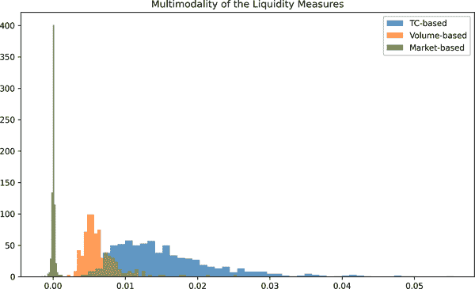
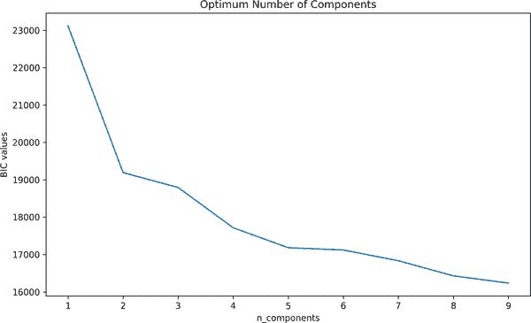
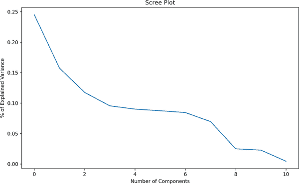

# 第七章：流动性建模

> 当音乐停止时，就流动性而言，情况会变得复杂。但只要音乐还在播放，你就必须起身跳舞。我们仍在跳舞。
> 
> 查克·普林斯（2007 年）

流动性是金融风险的另一个重要来源。然而，长期以来，流动性一直被忽视，金融行业为了建模风险而不考虑流动性付出了巨大代价。

流动性风险的成因是与完全市场和对称信息范式的偏离，这可能导致道德风险和逆向选择。在这种条件持续存在的情况下，流动性风险在金融系统中是普遍存在的，可以引发融资和市场流动性之间的恶性循环，促使系统性流动性风险（Nikolaou 2009）。

利用变量变化值与其对实际市场的影响之间的时间滞后是建模成功的标准之一。例如，利率在某种程度上与实际市场动态有所不同，而且需要一些时间来稳定下来。除此之外，不确定性是传统资产定价模型中唯一的风险来源；然而，这与现实相去甚远。为了填补金融模型与实际市场动态之间的差距，流动性维度显得尤为重要。具有流动性的模型可以更好地调整自身以适应金融市场的发展，因为流动性影响了资产的所需回报率，也影响了不确定性水平。因此，流动性在估计违约概率方面是非常重要的一个维度（Gaygisiz，Karasan 和 Hekimoglu 2021）。

自 2007 年至 2008 年全球抵押贷款危机爆发以来，流动性的重要性备受关注。在这次危机中，大多数金融机构都受到了流动性压力的严重打击，导致监管机构和中央银行采取了一些严格的措施。从那时起，关于包含流动性的必要性的讨论更加激烈，这起于可交易证券的缺乏。

流动性概念是多方面的。总的来说，*流动性资产*的定义取决于在不造成相当价格影响的情况下出售大量资产的程度。这也被称为*交易成本*。然而，这并不是流动性的唯一重要方面。在压力时期，弹性成为投资者寻求迅速价格发现的突出特征（Sarr 和 Lybek 2002）。这是 Kyle（1985 年）指出的：“流动性是一个难以捉摸和难以捉摸的概念，部分原因是因为它包含了市场的许多交易特性。”

话虽如此，流动性是一个模糊的概念，要定义它，我们需要关注其不同的维度。在文献中，不同的研究人员提出了不同的流动性维度，但为了本书的目的，我们将确定流动性的四个定义特征：

紧密度

在同一时间以相同价格交易资产的能力。这指的是交易中发生的交易成本。如果交易成本高，买入和卖出价格之间的差异将很大，反之亦然。因此，狭窄的交易成本定义了市场的紧密程度。

即时性

大量的买入或卖出订单可以进行交易的速度。流动性的这一维度为我们提供了有关金融市场的宝贵信息，低即时性指的是市场某些部分（如清算、结算等）的功能失效。

深度

大量的买家和卖家存在，他们能够以不同价格满足大量订单。

弹性

市场从非均衡状态恢复的速度。这可以被看作是一个价格恢复过程，其中订单不平衡迅速消失。

鉴于流动性的定义和相互联系，不难看出建模流动性是一项艰巨的任务。在文献中，提出了许多不同类型的流动性模型，然而，考虑到流动性的多维性，根据其捕捉的维度对数据进行聚类可能是明智的选择。为此，我们将提出不同的流动性指标来代表所有四个维度。这些流动性指标包括基于交易量的指标、基于交易成本的指标、基于价格影响的指标和市场影响指标。对于所有这些维度，将使用几种不同的流动性代理。

使用聚类分析，这些流动性指标将被聚类，这有助于我们理解投资者应该关注哪一部分流动性，因为已知在不同的时间段内经济中存在不同维度的流动性。因此，一旦我们完成了聚类分析，我们就会得到更少的流动性指标。为了进行聚类分析，我们将使用高斯混合模型（GMM）和高斯混合 Copula 模型（GMCM）来解决这个问题。GMM 是一个广泛认可的聚类模型，在椭圆分布下表现良好。GMCM 是 GMM 的扩展，我们在其中包括 Copula 分析来考虑相关性。我们将详细讨论这些模型，所以让我们从识别基于不同流动性维度的流动性指标开始。

# 流动性指标

流动性的作用最终被金融从业者和经济学家认可，这使得理解和发展流动性测量更加重要。现有文献集中于单一指标，很难概念化像流动性这样难以捉摸的概念。相反，我们将涵盖四个维度，以开发更全面的应用：

+   交易量

+   交易成本

+   价格影响

+   市场影响

让我们从基于交易量的流动性指标开始。

## 基于交易量的流动性指标

当市场具有深度时，大额订单得到满足，即深度的金融市场有能力满足大量订单。这反过来提供了关于市场的信息，如果市场缺乏深度，则市场中会出现订单不平衡和不连续性。鉴于市场的深度，基于交易量的流动性衡量标准可以用来区分流动性和非流动性资产。此外，基于交易量的流动性衡量标准与买卖价差密切相关：较大的买卖价差意味着低交易量，而较窄的买卖价差则意味着高交易量（Huong 和 Gregoriou，2020）。

正如你可以想象的那样，流动性变化的大部分来自交易活动。Blume、Easley 和 O'Hara (1994) 强调了基于交易量的方法的重要性，称交易量产生的信息是从其他统计数据中无法提取的。

为了正确表达流动性的深度维度，将引入以下基于交易量的衡量标准：

+   流动性比率

+   Hui-Heubel 比率

+   周转率

### 流动性比率

此比率衡量需要多少交易量才能引发价格变动 1%：

<math alttext="dollar-sign upper L upper R Subscript i t Baseline equals StartFraction sigma-summation Underscript t equals 1 Overscript upper T Endscripts upper P Subscript i t Baseline upper V Subscript i t Baseline Over sigma-summation Underscript t equals 1 Overscript upper T Endscripts StartAbsoluteValue upper P upper C Subscript i t Baseline EndAbsoluteValue EndFraction dollar-sign"><mrow><mi>L</mi> <msub><mi>R</mi> <mrow><mi>i</mi><mi>t</mi></mrow></msub> <mo>=</mo> <mfrac><mrow><msubsup><mo>∑</mo> <mrow><mi>t</mi><mo>=</mo><mn>1</mn></mrow> <mi>T</mi></msubsup> <msub><mi>P</mi> <mrow><mi>i</mi><mi>t</mi></mrow></msub> <msub><mi>V</mi> <mrow><mi>i</mi><mi>t</mi></mrow></msub></mrow> <mrow><msubsup><mo>∑</mo> <mrow><mi>t</mi><mo>=</mo><mn>1</mn></mrow> <mi>T</mi></msubsup> <mrow><mo>|</mo><mi>P</mi><msub><mi>C</mi> <mrow><mi>i</mi><mi>t</mi></mrow></msub> <mo>|</mo></mrow></mrow></mfrac></mrow></math>

其中 <math alttext="upper P Subscript i t"><msub><mi>P</mi> <mrow><mi>i</mi><mi>t</mi></mrow></msub></math> 是第 *t* 天股票 *i* 的总价格，<math alttext="upper V Subscript i t"><msub><mi>V</mi> <mrow><mi>i</mi><mi>t</mi></mrow></msub></math> 表示第 *t* 天股票 *i* 的交易量，最后，<math alttext="StartAbsoluteValue upper P upper C Subscript i t Baseline EndAbsoluteValue"><mrow><mrow><mo>|</mo> <mi>P</mi></mrow> <msub><mi>C</mi> <mrow><mi>i</mi><mi>t</mi></mrow></msub> <mrow><mo>|</mo></mrow></mrow></math> 是时间 *t* 和 *t* - 1 之间价格的绝对差值。

比率 <math alttext="upper L upper R Subscript i t"><mrow><mi>L</mi> <msub><mi>R</mi> <mrow><mi>i</mi><mi>t</mi></mrow></msub></mrow></math> 越高，资产 *i* 的流动性也越高。这意味着更高的交易量，<math alttext="upper P Subscript i t Baseline upper V Subscript i t"><mrow><msub><mi>P</mi> <mrow><mi>i</mi><mi>t</mi></mrow></msub> <msub><mi>V</mi> <mrow><mi>i</mi><mi>t</mi></mrow></msub></mrow></math> ，以及低价格差异，<math alttext="StartAbsoluteValue upper P upper C Subscript i t Baseline EndAbsoluteValue"><mrow><mrow><mo>|</mo> <mi>P</mi></mrow> <msub><mi>C</mi> <mrow><mi>i</mi><mi>t</mi></mrow></msub> <mrow><mo>|</mo></mrow></mrow></math> ，代表高流动性水平。反之，如果需要低交易量来引发价格变动，则称此资产为非流动性资产。显然，这一概念框架更侧重于价格方面，而非市场中通常存在的时间或执行成本问题（Gabrielsen、Marzo 和 Zagaglia，2011）。

首先导入数据并通过以下代码观察。正如可以轻易观察到的那样，数据集中的主要变量包括询价（`ASKHI`）、出价（`BIDLO`）、开盘价（`OPENPRC`）、交易价格（`PRC`），以及成交量（`VOL`）、收益（`RET`）、加权收益率（`vwretx`）和流通股份数量（`SHROUT`）：

```py
In [1]: import pandas as pd
        import numpy as np
        import matplotlib.pyplot as plt
        import warnings
        warnings.filterwarnings("ignore")
        plt.rcParams['figure.figsize'] = (10, 6)
        pd.set_option('use_inf_as_na', True)

In [2]: liq_data = pd.read_csv('bid_ask.csv')

In [3]: liq_data.head()

Out[3]: Unnamed: 0        Date  EXCHCD TICKER      COMNAM  BIDLO   ASKHI    PRC
         \
        0     1031570  2019-01-02     3.0   INTC  INTEL CORP  45.77  47.470
         47.08
        1     1031571  2019-01-03     3.0   INTC  INTEL CORP  44.39  46.280
         44.49
        2     1031572  2019-01-04     3.0   INTC  INTEL CORP  45.54  47.570
         47.22
        3     1031573  2019-01-07     3.0   INTC  INTEL CORP  46.75  47.995
         47.44
        4     1031574  2019-01-08     3.0   INTC  INTEL CORP  46.78  48.030
         47.74

                  VOL       RET     SHROUT  OPENPRC    vwretx

        0  18761673.0  0.003196  4564000.0   45.960  0.001783

        1  32254097.0 -0.055013  4564000.0   46.150 -0.021219

        2  35419836.0  0.061362  4564000.0   45.835  0.033399

        3  22724997.0  0.004659  4564000.0   47.100  0.009191

        4  22721240.0  0.006324  4564000.0   47.800  0.010240
```

计算一些流动性指标需要进行滚动窗口估算，例如计算五天的出价价格。为了完成这项任务，使用以下代码生成名为`rolling_five`的列表：

```py
In [4]: rolling_five = []

        for j in liq_data.TICKER.unique():
            for i in range(len(liq_data[liq_data.TICKER == j])):
                rolling_five.append(liq_data[i:i+5].agg({'BIDLO': 'min',
                                                        'ASKHI': 'max',
                                                         'VOL': 'sum',
                                                         'SHROUT': 'mean',
                                                         'PRC': 'mean'})) 

In [5]: rolling_five_df = pd.DataFrame(rolling_five)
        rolling_five_df.columns = ['bidlo_min', 'askhi_max', 'vol_sum',
                                   'shrout_mean', 'prc_mean']
        liq_vol_all = pd.concat([liq_data,rolling_five_df], axis=1)

In [6]: liq_ratio = []

        for j in liq_vol_all.TICKER.unique():
            for i in range(len(liq_vol_all[liq_vol_all.TICKER == j])):
                liq_ratio.append((liq_vol_all['PRC'][i+1:i+6] *
                                  liq_vol_all['VOL'][i+1:i+6]).sum()/
                                 (np.abs(liq_vol_all['PRC'][i+1:i+6].mean() -
                                         liq_vol_all['PRC'][i:i+5].mean())))
```


计算五天窗口所需的统计量

现在，我们有了最低出价、最高询价、成交量总和、流通股份数量的均值，以及每五天的交易价格均值。

### 汇-霍伯尔比率

另一个捕捉市场深度的指标是汇-霍伯尔流动性比率，也称为<math alttext="upper L Subscript upper H upper H"><msub><mi>L</mi> <mrow><mi>H</mi><mi>H</mi></mrow></msub></math>：

<math alttext="dollar-sign upper L Subscript upper H upper H Baseline equals StartFraction upper P Subscript m a x Baseline minus upper P Subscript m i n Baseline Over upper P Subscript m i n Baseline EndFraction slash upper V slash upper P overbar times shrout dollar-sign"><mrow><msub><mi>L</mi> <mrow><mi>H</mi><mi>H</mi></mrow></msub> <mo>=</mo> <mfrac><mrow><msub><mi>P</mi> <mrow><mi>m</mi><mi>a</mi><mi>x</mi></mrow></msub> <mo>-</mo><msub><mi>P</mi> <mrow><mi>m</mi><mi>i</mi><mi>n</mi></mrow></msub></mrow> <msub><mi>P</mi> <mrow><mi>m</mi><mi>i</mi><mi>n</mi></mrow></msub></mfrac> <mo>/</mo> <mi>V</mi> <mo>/</mo> <mover><mi>P</mi> <mo>¯</mo></mover> <mo>×</mo> <mtext>shrout</mtext></mrow></math>

其中<math alttext="upper P Subscript m a x"><msub><mi>P</mi> <mrow><mi>m</mi><mi>a</mi><mi>x</mi></mrow></msub></math>和<math alttext="upper P Subscript m i n"><msub><mi>P</mi> <mrow><mi>m</mi><mi>i</mi><mi>n</mi></mrow></msub></math>分别显示在确定的周期内的最高和最低价格。<math alttext="upper P overbar"><mover><mi>P</mi> <mo>¯</mo></mover></math>是在确定的周期内的平均收盘价。在分子中的是股票价格的百分比变化，分母中的是成交量除以市值，即<math alttext="upper P overbar times shrout"><mrow><mover><mi>P</mi> <mo>¯</mo></mover> <mo>×</mo> <mtext>shrout</mtext></mrow></math>。汇-霍伯尔流动性度量的最显著特征之一是它适用于单一股票，而不仅仅适用于投资组合。

如 Gabrielsen、Marzo 和 Zagaglia（2011）所讨论的，<math alttext="upper P Subscript m a x"><msub><mi>P</mi> <mrow><mi>m</mi><mi>a</mi><mi>x</mi></mrow></msub></math>和<math alttext="upper P Subscript m i n"><msub><mi>P</mi> <mrow><mi>m</mi><mi>i</mi><mi>n</mi></mrow></msub></math>可以由买卖价差取代，但由于买卖价差波动性低，它往往会向下偏倚。

要计算汇-霍伯尔流动性比率，首先在一个列表中拥有流动性指标，然后将所有这些指标添加到数据框中，以获得全面的数据：

```py
In [7]: Lhh = []

        for j in liq_vol_all.TICKER.unique():
            for i in range(len(liq_vol_all[liq_vol_all.TICKER == j])):
                Lhh.append((liq_vol_all['PRC'][i:i+5].max() -
                            liq_vol_all['PRC'][i:i+5].min()) /
                           liq_vol_all['PRC'][i:i+5].min() /
                           (liq_vol_all['VOL'][i:i+5].sum() /
                            liq_vol_all['SHROUT'][i:i+5].mean() *
                            liq_vol_all['PRC'][i:i+5].mean()))
```

### 成交率

成交率长期以来一直被视为流动性的代理指标。它基本上是波动率与流通股份数量的比率：

<math alttext="dollar-sign upper L upper R Subscript i t Baseline equals StartFraction 1 Over upper D Subscript i t Baseline EndFraction StartFraction sigma-summation Underscript t equals 1 Overscript upper T Endscripts upper V o l Subscript i t Baseline Over sigma-summation Underscript t equals 1 Overscript upper T Endscripts shrout Subscript i t Baseline EndFraction dollar-sign"><mrow><mi>L</mi> <msub><mi>R</mi> <mrow><mi>i</mi><mi>t</mi></mrow></msub> <mo>=</mo> <mfrac><mn>1</mn> <msub><mi>D</mi> <mrow><mi>i</mi><mi>t</mi></mrow></msub></mfrac> <mfrac><mrow><msubsup><mo>∑</mo> <mrow><mi>t</mi><mo>=</mo><mn>1</mn></mrow> <mi>T</mi></msubsup> <mi>V</mi><mi>o</mi><msub><mi>l</mi> <mrow><mi>i</mi><mi>t</mi></mrow></msub></mrow> <mrow><msubsup><mo>∑</mo> <mrow><mi>t</mi><mo>=</mo><mn>1</mn></mrow> <mi>T</mi></msubsup> <msub><mtext>shrout</mtext> <mrow><mi>i</mi><mi>t</mi></mrow></msub></mrow></mfrac></mrow></math>

其中 <math alttext="upper D Subscript i t"><msub><mi>D</mi> <mrow><mi>i</mi><mi>t</mi></mrow></msub></math> 表示交易日数，<math alttext="upper V o l Subscript i t"><mrow><mi>V</mi> <mi>o</mi> <msub><mi>l</mi> <mrow><mi>i</mi><mi>t</mi></mrow></msub></mrow></math> 是时间 *t* 的交易股数，<math alttext="shrout Subscript i t"><msub><mtext>shrout</mtext> <mrow><mi>i</mi><mi>t</mi></mrow></msub></math> 显示时间 *t* 的流通股数。较高的换手率表明流动性水平较高，因为换手率意味着交易频率。由于换手率包括流通股数，这使其成为更微妙的流动性指标。

成交量比率是根据日常数据计算的，然后所有基于交易量的流动性指标都转换为数据框并包含在`liq_vol_all`中：

```py
In [8]: turnover_ratio = []

        for j in liq_vol_all.TICKER.unique():
            for i in range(len(liq_vol_all[liq_vol_all.TICKER == j])):
                turnover_ratio.append((1/liq_vol_all['VOL'].count()) *
                                      (np.sum(liq_vol_all['VOL'][i:i+1]) /
                                       np.sum(liq_vol_all['SHROUT'][i:i+1])))

In [9]: liq_vol_all['liq_ratio'] = pd.DataFrame(liq_ratio)
        liq_vol_all['Lhh'] = pd.DataFrame(Lhh)
        liq_vol_all['turnover_ratio'] = pd.DataFrame(turnover_ratio)
```

## 基于交易成本的流动性指标

在现实世界中，买家和卖家并不会在一个无摩擦的环境中神奇地相遇。相反，需要中介（经纪人和交易商）、设备（计算机等）、耐心（交易不能立即实现）以及规则书来规定如何处理订单并将其转化为交易。此外，大型机构投资者的订单足以影响市场价格。所有这些都意味着存在交易成本，而如何构建一个市场（以及更广泛的市场）以遏制这些成本是一个微妙而复杂的挑战（Baker and Kıymaz (2013)）。这导致了交易成本的出现。

*交易成本* 是投资者在交易中必须承担的费用。它指与交易执行相关的任何费用。可以区分交易成本为显性和隐性成本。前者涉及订单处理、税费和经纪费，而后者包括更潜在的成本，如买卖价差、执行时机等。

交易成本与流动性的紧密度和即时性维度相关。高交易成本会阻止投资者交易，这反过来会减少市场上的买家和卖家数量，使交易场所从更为集中的市场向分散的市场演变，导致市场变得浅薄（Sarr and Lybek 2002）。在交易成本低的情况下，投资者愿意交易，这将导致一个繁荣的交易环境，市场将更加集中。

类似地，在低交易成本的环境中有大量的买家和卖家指的是大量订单在短时间内交易。因此，即时性是流动性的另一个维度，与交易成本密切相关。

尽管关于买卖价差的优良性及这些模型提供的保证仍在进行讨论，但买卖价差是广泛认可的交易成本代理。 在买卖价差作为交易成本分析的程度上，它也是资产转换为现金（或现金等价物）的流动性良好指标。 不详细讨论，买卖价差可以通过报价价差、有效价差和实现价差方法来衡量。 因此乍一看，似乎奇怪地计算买卖价差，可以通过这些方法轻松计算。 但这在现实中并非如此。 当交易无法在报价内实现时，这时的价差不再是这些方法基于的观察到的价差。

### 百分比报价和有效买卖价差

另外两个知名的买卖价差是*百分比报价*和*百分比有效*买卖价差。 报价价差衡量完成交易的成本，即买卖价差的差异。 报价价差有不同的形式，但为了缩放起见，我们将选择百分比报价价差：

<math alttext="dollar-sign Percentage quoted spread equals StartFraction upper P Subscript a s k Baseline minus upper P Subscript b i d Baseline Over upper P Subscript m i d Baseline EndFraction dollar-sign"><mrow><mtext>Percentage</mtext> <mtext>quoted</mtext> <mtext>spread</mtext> <mo>=</mo> <mfrac><mrow><msub><mi>P</mi> <mrow><mi>a</mi><mi>s</mi><mi>k</mi></mrow></msub> <mo>-</mo><msub><mi>P</mi> <mrow><mi>b</mi><mi>i</mi><mi>d</mi></mrow></msub></mrow> <msub><mi>P</mi> <mrow><mi>m</mi><mi>i</mi><mi>d</mi></mrow></msub></mfrac></mrow></math>

其中 <math alttext="upper P Subscript a s k"><msub><mi>P</mi> <mrow><mi>a</mi><mi>s</mi><mi>k</mi></mrow></msub></math> 是股票的卖出价，<math alttext="upper P Subscript b i d"><msub><mi>P</mi> <mrow><mi>b</mi><mi>i</mi><mi>d</mi></mrow></msub></math> 是股票的买入价。

有效点差衡量了交易价格与中间价格之间的偏差，有时被称为股票的真实基础价值。当交易发生在报价内或外时，更好的交易成本衡量是基于实际交易价格计算的百分比有效半点差，其按百分比计算（Bessembinder 和 Venkataraman 2010）：

<math alttext="dollar-sign Effective spread equals StartFraction 2 StartAbsoluteValue upper P Subscript t Baseline minus upper P Subscript m i d Baseline EndAbsoluteValue Over upper P Subscript m i d Baseline EndFraction dollar-sign"><mrow><mtext>Effective</mtext> <mtext>spread</mtext> <mo>=</mo> <mfrac><mrow><mrow><mn>2</mn><mo>|</mo></mrow><msub><mi>P</mi> <mi>t</mi></msub> <mo>-</mo><msub><mi>P</mi> <mrow><mi>m</mi><mi>i</mi><mi>d</mi></mrow></msub> <mrow><mo>|</mo></mrow></mrow> <msub><mi>P</mi> <mrow><mi>m</mi><mi>i</mi><mi>d</mi></mrow></msub></mfrac></mrow></math>

其中 <math alttext="upper P Subscript t"><msub><mi>P</mi> <mi>t</mi></msub></math> 是股票的交易价格，<math alttext="upper P Subscript m i d"><msub><mi>P</mi> <mrow><mi>m</mi><mi>i</mi><mi>d</mi></mrow></msub></math> 是交易时期的买卖盘中点。

计算百分比报价和有效买卖价差相对容易，如下所示：

```py
In [10]: liq_vol_all['mid_price'] = (liq_vol_all.ASKHI + liq_vol_all.BIDLO) / 2
         liq_vol_all['percent_quoted_ba'] = (liq_vol_all.ASKHI -
                                             liq_vol_all.BIDLO) / \
                                             liq_vol_all.mid_price
         liq_vol_all['percent_effective_ba'] = 2 * abs((liq_vol_all.PRC -
                                                      liq_vol_all.mid_price)) / \
                                                      liq_vol_all.mid_price
```

### Roll 的点差估计

最初和最重要的传播措施之一是由 Roll（1984）提出的。*Roll spread* 可以定义为：

<math alttext="dollar-sign Roll equals StartRoot minus cov left-parenthesis normal upper Delta p Subscript t Baseline comma normal upper Delta p Subscript t minus 1 Baseline right-parenthesis EndRoot dollar-sign"><mrow><mtext>Roll</mtext> <mo>=</mo> <msqrt><mrow><mo>-</mo> <mtext>cov</mtext> <mo>(</mo> <mi>Δ</mi> <msub><mi>p</mi> <mi>t</mi></msub> <mo>,</mo> <mi>Δ</mi> <msub><mi>p</mi> <mrow><mi>t</mi><mo>-</mo><mn>1</mn></mrow></msub> <mo>)</mo></mrow></msqrt></mrow></math>

其中 <math alttext="normal upper Delta p Subscript t"><mrow><mi>Δ</mi> <msub><mi>p</mi> <mi>t</mi></msub></mrow></math> 和 <math alttext="normal upper Delta p Subscript t minus 1"><mrow><mi>Δ</mi> <msub><mi>p</mi> <mrow><mi>t</mi><mo>-</mo><mn>1</mn></mrow></msub></mrow></math> 是时间 *t* 和时间 *t* – 1 的价格差异，<math alttext="cov"><mtext>cov</mtext></math> 表示这些价格差异之间的协方差。

假设市场是有效的¹，并且观察到的价格变化的概率分布是稳定的，Roll 的价差是由价格变化的串行相关性良好代理流动性的事实所激发。

计算 Roll 的价差中最重要的一点是，正协方差并不是定义良好的，并且几乎占了案例的一半。文献提出了几种方法来解决这个缺点，我们将在接下来采纳 Harris 的方法（1990 年）：

```py
In [11]: liq_vol_all['price_diff'] = liq_vol_all.groupby('TICKER')['PRC']\
                                     .apply(lambda x:x.diff())
         liq_vol_all.dropna(inplace=True)
         roll = []

         for j in liq_vol_all.TICKER.unique():
              for i in range(len(liq_vol_all[liq_vol_all.TICKER == j])):
                 roll_cov = np.cov(liq_vol_all['price_diff'][i:i+5],
                                   liq_vol_all['price_diff'][i+1:i+6]) 
                 if roll_cov[0,1] < 0: 
                     roll.append(2 * np.sqrt(-roll_cov[0, 1]))
                 else:
                      roll.append(2 * np.sqrt(np.abs(roll_cov[0, 1]))) 
```


计算五天窗口内价格差异的协方差


检查协方差为负的情况


在正协方差的情况下，采用 Harris 的方法

### Corwin-Schultz spread

*Corwin-Schultz spread* 相当直观且易于应用。它主要基于以下假设：每日的高低价通常由买方和卖方发起，观察到的价格变化可以分解为有效价格波动和买卖价差。因此，一天内高低价的比率反映了股票的方差和买卖价差（Corwin 和 Schultz 2012; Abdi 和 Ranaldo 2017）。

该价差提出了一种基于每日高低价的全新方法，其逻辑由 Corwin 和 Schultz (2012) 概述为“连续单日的价格范围之和反映了 2 天的波动性和两倍的价差，而一个 2 天期间的价格范围反映了 2 天的波动性和一个价差”：

<math alttext="dollar-sign upper S equals StartFraction 2 left-parenthesis e Superscript alpha Baseline minus 1 right-parenthesis Over 1 plus e Superscript alpha Baseline EndFraction dollar-sign"><mrow><mi>S</mi> <mo>=</mo> <mfrac><mrow><mn>2</mn><mo>(</mo><msup><mi>e</mi> <mi>α</mi></msup> <mo>-</mo><mn>1</mn><mo>)</mo></mrow> <mrow><mn>1</mn><mo>+</mo><msup><mi>e</mi> <mi>α</mi></msup></mrow></mfrac></mrow></math><math alttext="dollar-sign alpha equals StartFraction StartRoot 2 beta EndRoot minus StartRoot beta EndRoot Over 3 minus 2 StartRoot 2 EndRoot EndFraction minus NestedStartRoot StartFraction gamma Over 3 minus 2 StartRoot 2 EndRoot EndFraction NestedEndRoot dollar-sign"><mrow><mi>α</mi> <mo>=</mo> <mfrac><mrow><msqrt><mrow><mn>2</mn><mi>β</mi></mrow></msqrt><mo>-</mo><msqrt><mi>β</mi></msqrt></mrow> <mrow><mn>3</mn><mo>-</mo><mn>2</mn><msqrt><mn>2</mn></msqrt></mrow></mfrac> <mo>-</mo> <msqrt><mfrac><mi>γ</mi> <mrow><mn>3</mn><mo>-</mo><mn>2</mn><msqrt><mn>2</mn></msqrt></mrow></mfrac></msqrt></mrow></math><math alttext="dollar-sign beta equals double-struck upper E left-parenthesis sigma-summation Underscript j equals 0 Overscript 1 Endscripts left-bracket l n left-parenthesis StartFraction upper H Subscript t plus j Superscript 0 Baseline Over upper L Subscript t plus j Superscript 0 Baseline EndFraction right-parenthesis right-bracket squared right-parenthesis dollar-sign"><mrow><mi>β</mi> <mo>=</mo> <mi>𝔼</mi> <mo>(</mo> <msubsup><mo>∑</mo> <mrow><mi>j</mi><mo>=</mo><mn>0</mn></mrow> <mn>1</mn></msubsup> <msup><mrow><mo>[</mo><mi>l</mi><mi>n</mi><mrow><mo>(</mo><mfrac><msubsup><mi>H</mi> <mrow><mi>t</mi><mo>+</mo><mi>j</mi></mrow> <mn>0</mn></msubsup> <msubsup><mi>L</mi> <mrow><mi>t</mi><mo>+</mo><mi>j</mi></mrow> <mn>0</mn></msubsup></mfrac> <mo>)</mo></mrow><mo>]</mo></mrow> <mn>2</mn></msup> <mo>)</mo></mrow></math><math alttext="dollar-sign gamma equals double-struck upper E left-parenthesis sigma-summation Underscript j equals 0 Overscript 1 Endscripts left-bracket l n left-parenthesis StartFraction upper H Subscript t plus 1 Superscript 0 Baseline Over upper L Subscript t plus 1 Superscript 0 Baseline EndFraction right-parenthesis right-bracket squared right-parenthesis dollar-sign"><mrow><mi>γ</mi> <mo>=</mo> <mi>𝔼</mi> <mo>(</mo> <msubsup><mo>∑</mo> <mrow><mi>j</mi><mo>=</mo><mn>0</mn></mrow> <mn>1</mn></msubsup> <msup><mrow><mo>[</mo><mi>l</mi><mi>n</mi><mrow><mo>(</mo><mfrac><msubsup><mi>H</mi> <mrow><mi>t</mi><mo>+</mo><mn>1</mn></mrow> <mn>0</mn></msubsup> <msubsup><mi>L</mi> <mrow><mi>t</mi><mo>+</mo><mn>1</mn></mrow> <mn>0</mn></msubsup></mfrac> <mo>)</mo></mrow><mo>]</mo></mrow> <mn>2</mn></msup> <mo>)</mo></mrow></math>

其中 <math alttext="upper H Subscript t Superscript upper A"><msubsup><mi>H</mi> <mi>t</mi> <mi>A</mi></msubsup></math> <math alttext="left-parenthesis upper L Subscript t Superscript upper A Baseline right-parenthesis"><mrow><mo>(</mo> <msubsup><mi>L</mi> <mi>t</mi> <mi>A</mi></msubsup> <mo>)</mo></mrow></math> 表示第 *t* 天的实际高（低）价格，<math alttext="upper H Subscript t Superscript o"><msubsup><mi>H</mi> <mi>t</mi> <mi>o</mi></msubsup></math> 或 <math alttext="upper L Subscript t Superscript o"><msubsup><mi>L</mi> <mi>t</mi> <mi>o</mi></msubsup></math> 表示第 *t* 天观察到的高（低）股票价格。

Corwin-Schultz 价差需要多个步骤来计算，因为它包括许多变量。以下代码展示了我们进行此计算的方式：

```py
In [12]: gamma = []

         for j in liq_vol_all.TICKER.unique():
             for i in range(len(liq_vol_all[liq_vol_all.TICKER == j])):
                 gamma.append((max(liq_vol_all['ASKHI'].iloc[i+1],
                                   liq_vol_all['ASKHI'].iloc[i]) -
                               min(liq_vol_all['BIDLO'].iloc[i+1],
                                   liq_vol_all['BIDLO'].iloc[i])) ** 2)
                 gamma_array = np.array(gamma)

In [13]: beta = []

         for j in liq_vol_all.TICKER.unique():
             for i in range(len(liq_vol_all[liq_vol_all.TICKER == j])):
                 beta.append((liq_vol_all['ASKHI'].iloc[i+1] -
                              liq_vol_all['BIDLO'].iloc[i+1]) ** 2 +
                             (liq_vol_all['ASKHI'].iloc[i] -
                              liq_vol_all['BIDLO'].iloc[i]) ** 2)
                 beta_array = np.array(beta)

In [14]: alpha = ((np.sqrt(2 * beta_array) - np.sqrt(beta_array)) /
                (3 - (2 * np.sqrt(2)))) - np.sqrt(gamma_array /
                                                  (3 - (2 * np.sqrt(2))))
         CS_spread = (2 * np.exp(alpha - 1)) / (1 + np.exp(alpha))

In [15]: liq_vol_all = liq_vol_all.reset_index()
         liq_vol_all['roll'] = pd.DataFrame(roll)
         liq_vol_all['CS_spread'] = pd.DataFrame(CS_spread)
```

## 基于价格影响的流动性度量标准

在本节中，我们将介绍基于价格影响的流动性度量标准，通过这些标准我们能够评估价格对成交量和周转率的敏感程度。回想一下，弹性是指市场对新订单的响应能力。如果市场对新订单敏感——即，新订单纠正了市场的不平衡——那么就说它具有弹性。因此，鉴于成交量和/或周转率的变化，高价格调整量意味着弹性，反之亦然。

我们有三种基于价格影响的流动性度量标准需要讨论：

+   Amihud 流动性测量

+   Florackis、Andros 和 Alexandros（2011 年）价格影响比率

+   交易弹性系数（CET）

### Amihud 流动性

这种流动性代理是一种著名且广为认可的衡量标准。Amihud 流动性（2002 年）基本上衡量了收益对交易量敏感性。更具体地说，它让我们了解到在交易量变化 1 美元时，绝对收益的变化情况。Amihud 流动性测量，或简称 ILLIQ，广为学术界和从业者所知：

<math alttext="dollar-sign ILLIQ equals StartFraction 1 Over upper D Subscript i t Baseline EndFraction sigma-summation Underscript d equals 1 Overscript upper D Subscript i t Baseline Endscripts StartFraction StartAbsoluteValue upper R Subscript i t d Baseline EndAbsoluteValue Over upper V Subscript i t d Baseline EndFraction dollar-sign"><mrow><mtext>ILLIQ</mtext> <mo>=</mo> <mfrac><mn>1</mn> <msub><mi>D</mi> <mrow><mi>i</mi><mi>t</mi></mrow></msub></mfrac> <msubsup><mo>∑</mo> <mrow><mi>d</mi><mo>=</mo><mn>1</mn></mrow> <msub><mi>D</mi> <mrow><mi>i</mi><mi>t</mi></mrow></msub></msubsup> <mfrac><mrow><mrow><mo>|</mo></mrow><msub><mi>R</mi> <mrow><mi>i</mi><mi>t</mi><mi>d</mi></mrow></msub> <mrow><mo>|</mo></mrow></mrow> <msub><mi>V</mi> <mrow><mi>i</mi><mi>t</mi><mi>d</mi></mrow></msub></mfrac></mrow></math>

其中 <math alttext="upper R Subscript i t d"><msub><mi>R</mi> <mrow><mi>i</mi><mi>t</mi><mi>d</mi></mrow></msub></math> 表示月 *t* 第 *d* 天的股票收益，<math alttext="upper V Subscript i t d"><msub><mi>V</mi> <mrow><mi>i</mi><mi>t</mi><mi>d</mi></mrow></msub></math> 表示当月 *t* 的美元交易量，*D* 是月 *t* 的观察天数。

Amihud 测量法比许多其他流动性指标具有两个优势。首先，Amihud 测量法的构造简单，利用每日收益率与成交量比率的绝对值来捕捉价格影响。其次，该测量法与预期股票回报率有很强的正相关关系（Lou 和 Tao，2017 年）。

Amihud 流动性测量并不难计算。然而，在直接计算 Amihud 测量之前，需要计算股票的交易金额：

```py
In [16]: dvol = []

         for j in liq_vol_all.TICKER.unique():
             for i in range(len(liq_vol_all[liq_vol_all.TICKER == j])):
                 dvol.append((liq_vol_all['PRC'][i:i+5] *
                              liq_vol_all['VOL'][i:i+5]).sum())
         liq_vol_all['dvol'] = pd.DataFrame(dvol)

In [17]: amihud = []

         for j in liq_vol_all.TICKER.unique():
             for i in range(len(liq_vol_all[liq_vol_all.TICKER == j])):
                 amihud.append((1 / liq_vol_all['RET'].count()) *
                               (np.sum(np.abs(liq_vol_all['RET'][i:i+1])) /
                                       np.sum(liq_vol_all['dvol'][i:i+1])))
```

### 价格影响比率

Florackis, Andros, 和 Alexandros (2011) 旨在改进 Amihud 流动性比率，并提出了一种新的流动性指标，即 Return-to-Turnover (RtoTR)。作者列举了 Amihud 流动性指标的缺点：

+   它在不同市值的股票之间无法比较。

+   它忽视了投资者的持有期限。

为了应对这些缺点，Florackis, Andros 和 Alexandros 提出了一个新的测量方法 RtoTR，用换手率取代了 Amihud 模型的成交量比率，以便新的测量方法能够捕捉交易频率：

<math alttext="dollar-sign RtoTR equals StartFraction 1 Over upper D Subscript i t Baseline EndFraction sigma-summation Underscript d equals 1 Overscript upper D Subscript i t Baseline Endscripts StartFraction StartAbsoluteValue upper R Subscript i t d Baseline EndAbsoluteValue Over upper T upper R Subscript i t d Baseline EndFraction dollar-sign"><mrow><mtext>RtoTR</mtext> <mo>=</mo> <mfrac><mn>1</mn> <msub><mi>D</mi> <mrow><mi>i</mi><mi>t</mi></mrow></msub></mfrac> <msubsup><mo>∑</mo> <mrow><mi>d</mi><mo>=</mo><mn>1</mn></mrow> <msub><mi>D</mi> <mrow><mi>i</mi><mi>t</mi></mrow></msub></msubsup> <mfrac><mrow><mrow><mo>|</mo></mrow><msub><mi>R</mi> <mrow><mi>i</mi><mi>t</mi><mi>d</mi></mrow></msub> <mrow><mo>|</mo></mrow></mrow> <mrow><mi>T</mi><msub><mi>R</mi> <mrow><mi>i</mi><mi>t</mi><mi>d</mi></mrow></msub></mrow></mfrac></mrow></math>

其中 <math alttext="upper T upper R Subscript i t d"><mrow><mi>T</mi> <msub><mi>R</mi> <mrow><mi>i</mi><mi>t</mi><mi>d</mi></mrow></msub></mrow></math> 是股票*i*在*d*日的月份*t*的货币交易量，其余部分与 Amihud 流动性测量中相同。

这个测量方法与 Amihud 的测量一样容易计算，并且没有尺寸偏差，因为它包括捕捉交易频率的换手率。这也帮助我们检验价格和规模效应。

以下提供了价格影响比率的计算：

```py
In [18]: florackis = []

         for j in liq_vol_all.TICKER.unique():
             for i in range(len(liq_vol_all[liq_vol_all.TICKER == j])):
                 florackis.append((1 / liq_vol_all['RET'].count()) *
                                  (np.sum(np.abs(liq_vol_all['RET'][i:i+1]) /
                                          liq_vol_all['turnover_ratio'][i:i+1])))
```

### 交易弹性系数

CET 是一种旨在弥补时间相关流动性指标（如每单位时间的交易次数和订单数）缺陷的流动性指标。这些指标被采用来评估市场即时性对流动性水平的影响程度。

市场即时性和 CET 是相辅相成的，因为它衡量了交易量的价格弹性，如果价格对交易量具有响应性（即弹性），这就意味着更高水平的市场即时性：

<math alttext="dollar-sign CET equals StartFraction percent-sign normal upper Delta upper V Over percent-sign normal upper Delta upper P EndFraction dollar-sign"><mrow><mtext>CET</mtext> <mo>=</mo> <mfrac><mrow><mo>%</mo><mi>Δ</mi><mi>V</mi></mrow> <mrow><mo>%</mo><mi>Δ</mi><mi>P</mi></mrow></mfrac></mrow></math>

其中 <math alttext="percent-sign normal upper Delta upper V"><mrow><mo>%</mo> <mi>Δ</mi> <mi>V</mi></mrow></math> 指的是交易量变化，<math alttext="percent-sign normal upper Delta upper P"><mrow><mo>%</mo> <mi>Δ</mi> <mi>P</mi></mrow></math> 表示价格变化。

下面提供了 CET 公式的 Python 代码。作为此应用程序的第一部分，计算了成交量和价格的百分比差异。然后将所有基于价格影响的流动性指标存储在`liq_vol_all`数据框中：

```py
In [19]: liq_vol_all['vol_diff_pct'] = liq_vol_all.groupby('TICKER')['VOL']\
                                       .apply(lambda x: x.diff()).pct_change() 
         liq_vol_all['price_diff_pct'] = liq_vol_all.groupby('TICKER')['PRC']\
                                       .apply(lambda x: x.diff()).pct_change() 

In [20]: cet = []

         for j in liq_vol_all.TICKER.unique():
             for i in range(len(liq_vol_all[liq_vol_all.TICKER == j])):
                 cet.append(np.sum(liq_vol_all['vol_diff_pct'][i:i+1])/
                            np.sum(liq_vol_all['price_diff_pct'][i:i+1]))

In [21]: liq_vol_all['amihud'] = pd.DataFrame(amihud)
         liq_vol_all['florackis'] = pd.DataFrame(florackis)
         liq_vol_all['cet'] = pd.DataFrame(cet)
```


计算百分比成交量差异


计算百分比价格差异

## 基于市场影响的流动性指标

在金融领域，识别信息来源至关重要，因为未知的信息来源可能会误导投资者，并导致意外后果。例如，市场上涨产生的价格波动并不能像个别股票上涨产生的那样提供相同的信息。因此，应该以一种正确捕捉价格变动的方式识别新的信息来源。

为完成此任务，我们使用资本资产定价模型（CAPM），通过该模型我们可以区分系统性风险和非系统性风险。CAPM 中的著名斜率系数表示系统性风险，去除市场风险后，非系统性风险归因于个别股票。

正如 Sarr 和 Lybek (2002) 所引用的，Hui-Heubel 采用了以下方法：

<math alttext="dollar-sign upper R Subscript i Baseline equals alpha plus beta upper R Subscript m Baseline plus u Subscript i dollar-sign"><mrow><msub><mi>R</mi> <mi>i</mi></msub> <mo>=</mo> <mi>α</mi> <mo>+</mo> <mi>β</mi> <msub><mi>R</mi> <mi>m</mi></msub> <mo>+</mo> <msub><mi>u</mi> <mi>i</mi></msub></mrow></math>

其中 <math alttext="上标 R 子 i"><msub><mi>R</mi> <mi>i</mi></msub></math> 是 <math alttext="i 上标 t 下标 h"><msup><mi>i</mi> <mrow><mi>t</mi><mi>h</mi></mrow></msup></math> 股票的每日收益率，<math alttext="u 子 i"><msub><mi>u</mi> <mi>i</mi></msub></math> 是特有的或非系统性风险。

一旦我们从方程中估计出残差，<math alttext="u 子 i"><msub><mi>u</mi> <mi>i</mi></msub></math>，它被回归到波动率，<math alttext="上标 V 子 i"><msub><mi>V</mi> <mi>i</mi></msub></math>，并且 <math alttext="上标 V 子 i"><msub><mi>V</mi> <mi>i</mi></msub></math> 的估计系数给出了相关股票的流动性水平，也称为特有风险：

<math alttext="dollar-sign u Subscript i Superscript 2 Baseline equals gamma 1 plus gamma 2 upper V Subscript i Baseline plus e Subscript i dollar-sign"><mrow><msubsup><mi>u</mi> <mi>i</mi> <mn>2</mn></msubsup> <mo>=</mo> <msub><mi>γ</mi> <mn>1</mn></msub> <mo>+</mo> <msub><mi>γ</mi> <mn>2</mn></msub> <msub><mi>V</mi> <mi>i</mi></msub> <mo>+</mo> <msub><mi>e</mi> <mi>i</mi></msub></mrow></math>

其中 <math alttext="u 子 i 上标 2"><msubsup><mi>u</mi> <mi>i</mi> <mn>2</mn></msubsup></math> 表示平方残差，<math alttext="上标 V 子 i"><msub><mi>V</mi> <mi>i</mi></msub></math> 是每日成交量的百分比变化，<math alttext="e 子 i"><msub><mi>e</mi> <mi>i</mi></msub></math> 是残差项。

较大的 <math alttext="gamma 2"><msub><mi>γ</mi> <mn>2</mn></msub></math> 意味着较大的价格波动，这让我们对股票的流动性有了直观的了解。相反，较小的 <math alttext="gamma 2"><msub><mi>γ</mi> <mn>2</mn></msub></math> 导致较小的价格波动，表明流动性水平较高。在代码中，我们有：

```py
In [22]: import statsmodels.api as sm

In [23]: liq_vol_all['VOL_pct_change'] = liq_vol_all.groupby('TICKER')['VOL']\
                                         .apply(lambda x: x.pct_change())
         liq_vol_all.dropna(subset=['VOL_pct_change'], inplace=True)
         liq_vol_all = liq_vol_all.reset_index()

In [24]: unsys_resid = []

         for i in liq_vol_all.TICKER.unique():
             X1 = liq_vol_all[liq_vol_all['TICKER'] == i]['vwretx'] 
             y = liq_vol_all[liq_vol_all['TICKER'] == i]['RET'] 
             ols = sm.OLS(y, X1).fit() 
             unsys_resid.append(ols.resid) 
```


将所有股票的成交量加权收益率作为自变量。


将所有股票的收益率作为因变量。


使用定义的变量运行线性回归模型。


将线性回归的残差存储为非系统性因子。

然后我们计算基于市场影响的流动性比率：

```py
In [25]: market_impact = {}

         for i, j in zip(liq_vol_all.TICKER.unique(),
                         range(len(liq_vol_all['TICKER'].unique()))):
             X2 = liq_vol_all[liq_vol_all['TICKER'] == i]['VOL_pct_change'] 
             ols = sm.OLS(unsys_resid[j] ** 2, X2).fit()
             print('***' * 30)
             print(f'OLS Result for {i}')
             print(ols.summary())
             market_impact[j] = ols.resid 
********************************************************************************
OLS Result for INTC
                        OLS Regression Results
================================================================================
Dep. Variable:                  y   R-squared (uncentered):                0.157
Model:                        OLS   Adj. R-squared (uncentered)            0.154
Method:             Least Squares   F-statistic:                           46.31
Date:            Thu, 02 Dec 2021   Prob (F-statistic):                 7.53e-11
Time:                    15:33:38   Log-Likelihood:                       1444.9
No. Observations:             249   AIC:                                  -2888.
Df Residuals:                 248   BIC:                                  -2884.
Df Model:                       1
Covariance Type:        nonrobust
================================================================================
                   coef    std err          t      P>|t|      [0.025      0.975]
--------------------------------------------------------------------------------
VOL_pct_change    0.0008     0.000      6.805      0.000       0.001       0.001
==============================================================================
Omnibus:                      373.849   Durbin-Watson:                   1.908
Prob(Omnibus):                  0.000   Jarque-Bera (JB):            53506.774
Skew:                           7.228   Prob(JB):                         0.00
Kurtosis:                      73.344   Cond. No.                         1.00
==============================================================================

Notes:
[1] R² is computed without centering (uncentered) since the model does not
contain a constant.
[2] Standard Errors assume that the covariance matrix of the errors is
correctly specified.
********************************************************************************
OLS Result for MSFT
                        OLS Regression Results
================================================================================
Dep. Variable:                  y   R-squared (uncentered):                0.044
Model:                        OLS   Adj. R-squared (uncentered):           0.040
Method:             Least Squares   F-statistic:                           11.45
Date:            Thu, 02 Dec 2021   Prob (F-statistic):                 0.000833
Time:                    15:33:38   Log-Likelihood:                       1851.0
No. Observations:             249   AIC:                                 -3700.
Df Residuals:                 248   BIC:                                 -3696.
Df Model:                       1
Covariance Type:        nonrobust
================================================================================
                   coef    std err          t      P>|t|      [0.025      0.975]
--------------------------------------------------------------------------------
VOL_pct_change  9.641e-05  2.85e-05     3.383      0.001      4.03e-05     0.000
==============================================================================
Omnibus:                      285.769   Durbin-Watson:                   1.533
Prob(Omnibus):                  0.000   Jarque-Bera (JB):            11207.666
Skew:                           4.937   Prob(JB):                         0.00
Kurtosis:                      34.349   Cond. No.                         1.00
==============================================================================

Notes:
[1] R² is computed without centering (uncentered) since the model does not
contain a constant.
[2] Standard Errors assume that the covariance matrix of the errors is
correctly specified.

********************************************************************************
OLS Result for IBM
                         OLS Regression Results
================================================================================
Dep. Variable:                  y   R-squared (uncentered):                0.134
Model:                        OLS   Adj. R-squared (uncentered):           0.130
Method:             Least Squares   F-statistic:                           38.36
Date:            Thu, 02 Dec 2021   Prob (F-statistic):                 2.43e-09
Time:                    15:33:38   Log-Likelihood:                       1547.1
No. Observations:             249   AIC:                                  -3092.
Df Residuals:                 248   BIC:                                  -3089.
Df Model:                       1
Covariance Type:        nonrobust
================================================================================
                  coef    std err          t      P>|t|      [0.025      0.975]
--------------------------------------------------------------------------------
VOL_pct_change  0.0005   7.43e-05      6.193      0.000       0.000       0.001
==============================================================================
Omnibus:                      446.818   Durbin-Watson:                   2.034
Prob(Omnibus):                  0.000   Jarque-Bera (JB):           156387.719
Skew:                           9.835   Prob(JB):                         0.00
Kurtosis:                     124.188   Cond. No.                         1.00
==============================================================================

Notes:
[1] R² is computed without centering (uncentered) since the model does not
contain a constant.
[2] Standard Errors assume that the covariance matrix of the errors is
correctly specified.
```


将所有股票成交量的百分比变化作为自变量。


市场影响是这个线性回归的残差。

然后，我们将市场影响纳入我们的数据框，并观察到目前为止我们引入的所有流动性度量的摘要统计数据：

```py
In [26]: append1 = market_impact[0].append(market_impact[1])
         liq_vol_all['market_impact'] = append1.append(market_impact[2]) 

In [27]: cols = ['vol_diff_pct', 'price_diff_pct', 'price_diff',
                 'VOL_pct_change', 'dvol', 'mid_price']
         liq_measures_all = liq_vol_all.drop(liq_vol_all[cols], axis=1)\
                            .iloc[:, -11:]
         liq_measures_all.dropna(inplace=True)
         liq_measures_all.describe().T
Out[27]:                       count          mean           std           min \
         liq_ratio             738.0  7.368514e+10  2.569030e+11  8.065402e+08
         Lhh                   738.0  3.340167e-05  5.371681e-05  3.966368e-06
         turnover_ratio        738.0  6.491127e-03  2.842668e-03  1.916371e-03
         percent_quoted_ba     738.0  1.565276e-02  7.562850e-03  3.779877e-03
         percent_effective_ba  738.0  8.334177e-03  7.100304e-03  0.000000e+00
         roll                  738.0  8.190794e-01  6.066821e-01  7.615773e-02
         CS_spread             738.0  3.305464e-01  1.267434e-01  1.773438e-40
         amihud                738.0  2.777021e-15  2.319450e-15  0.000000e+00
         florackis             738.0  2.284291e-03  1.546181e-03  0.000000e+00
         cet                   738.0 -1.113583e+00  3.333932e+01 -4.575246e+02
         market_impact         738.0  8.614680e-05  5.087547e-04 -1.596135e-03

                                   25%           50%           75%           max
    liq_ratio             1.378496e+10  2.261858e+10  4.505784e+10  3.095986e+12
    Lhh                   1.694354e-05  2.368095e-05  3.558960e-05  5.824148e-04
    turnover_ratio        4.897990e-03  5.764112e-03  7.423111e-03  2.542853e-02
    percent_quoted_ba     1.041887e-02  1.379992e-02  1.878123e-02  5.545110e-02
    percent_effective_ba  3.032785e-03  6.851479e-03  1.152485e-02  4.656669e-02
    roll                  4.574986e-01  6.975982e-01  1.011879e+00  4.178873e+00
    CS_spread             2.444225e-01  3.609800e-01  4.188028e-01  5.877726e-01
    amihud                1.117729e-15  2.220439e-15  3.766086e-15  1.320828e-14
    florackis             1.059446e-03  2.013517e-03  3.324181e-03  7.869841e-03
    cet                  -1.687807e-01  5.654237e-01  1.660166e+00  1.845917e+02
    market_impact        -3.010645e-05  3.383862e-05  1.309451e-04  8.165527e-03
```


将市场影响附加到 `liq_vol_all` 数据框中。

这些是我们在通过 GMM 建模流动性过程中利用的流动性度量。现在让我们通过概率无监督学习算法来讨论这一点。

# 高斯混合模型

如果我们的数据具有几个模式，代表数据的不同方面会发生什么？或者让我们将其放在流动性指标的背景下，你如何用不同的均值方差来建模流动性指标？正如你可以想象的那样，由流动性指标组成的数据是多模式的，意味着存在几个不同的高概率集群，我们的任务是找出哪种模型最适合这类数据。

显然，提议的模型应包括多个组件的混合，并且在不知道具体流动性度量的情况下，应基于从这些度量中获得的值进行聚类。总结一下，我们将有一个包含所有流动性度量的大数据集，假设我们暂时忘记为这些度量分配标签，我们需要一个能够呈现这些度量不同分布的模型，而不知道标签的情况下。这个模型就是 GMM，它使我们能够在不知道变量名称的情况下建模多模态数据。

考虑到之前介绍的不同流动性指标的不同重点，如果我们设法对这些数据进行建模，那意味着我们可以在不同时间捕捉到不同的流动性水平。例如，高波动率期间的流动性无法以与低波动率期间相同的方式建模。在相似的情况下，考虑到市场的深度，我们需要关注这些不同流动性的方面。GMM 为我们提供了解决这个问题的工具。

简而言之，如果市场经历繁荣期，这与高波动性重合，基于成交量和交易成本的度量将是不错的选择；如果市场出现价格不连续，基于价格的度量将是最佳选择。当然，我们不是在谈论一刀切的度量方法——有些情况下，混合度量可能效果更好。

正如 VanderPlas（2016）所述，对于 K-means 要成功，聚类模型必须具有圆形特征。然而，许多金融变量展示出非圆形形状，这使得通过 K-means 进行建模变得困难。正如可以清楚地观察到的那样，流动性指标重叠并且没有圆形形状，因此具有其概率特性的 GMM 将是建模这类数据的良好选择，正如 Fraley 和 Raftery（1998）所述：

> 混合模型方法在聚类中的一个优势是它允许使用近似贝叶斯因子来比较模型。这提供了一个系统的方式，不仅可以选择模型的参数化（因而是聚类方法），还可以选择聚类数目。

在这部分中，我们希望导入 GMM 中所需的库。此外，我们还进行了缩放处理，这是聚类中的一个重要步骤，因为数据框中存在混合数值。在接下来的代码的最后部分中，我们绘制了直方图以观察数据中的多模态性（参见图 7-1）。这是我们在本节开头讨论的现象。

```py
In [28]: from sklearn.mixture import GaussianMixture
         from sklearn.preprocessing import StandardScaler

In [29]: liq_measures_all2 = liq_measures_all.dropna()
         scaled_liq = StandardScaler().fit_transform(liq_measures_all2)

In [30]: kwargs = dict(alpha=0.5, bins=50,  stacked=True)
         plt.hist(liq_measures_all.loc[:, 'percent_quoted_ba'],
                  **kwargs, label='TC-based')
         plt.hist(liq_measures_all.loc[:, 'turnover_ratio'],
                  **kwargs, label='Volume-based')
         plt.hist(liq_measures_all.loc[:, 'market_impact'],
                  **kwargs, label='Market-based')
         plt.title('Multi Modality of the Liquidity Measures')
         plt.legend()
         plt.show()
```



###### 图 7-1\. 流动性指标的多模态性

现在，考虑到交易成本、交易量和市场流动性指标，我们可以在图 7-1 中轻松观察到多峰性（即三个峰值）。由于尺度问题，基于价格影响的流动性维度未包含在直方图中。

现在，让我们运行 GMM 模型，看看如何对流动性指标进行聚类。但首先，一个常见的问题是：我们应该有多少个簇？为了解决这个问题，我们将再次使用 BIC，并生成如图 7-2 所示的图表：

```py
In [31]: n_components = np.arange(1, 10)
         clusters = [GaussianMixture(n, covariance_type='spherical',
                                     random_state=0).fit(scaled_liq)
                   for n in n_components] 
         plt.plot(n_components, [m.bic(scaled_liq) for m in clusters]) 
         plt.title('Optimum Number of Components')
         plt.xlabel('n_components')
         plt.ylabel('BIC values')
         plt.show()
```


根据不同的簇数量生成不同的 BIC 值


绘制给定组件数量的 BIC 值线图



###### 图 7-2\. 最佳组件数量

图 7-2 告诉我们，在第三个簇之后，曲线似乎趋于平缓，这是停止的理想点。

使用以下代码，我们能够检测数据最佳表示状态。术语*state*代表的是具有最高后验概率的簇。这意味着这个特定的状态最能解释数据的动态。在这种情况下，概率为 0.55 的 State-3 是最有可能解释数据动态的状态：

```py
In [32]: def cluster_state(data, nstates):
             gmm = GaussianMixture(n_components=nstates,
                                   covariance_type='spherical',
                                   init_params='kmeans') 
             gmm_fit = gmm.fit(scaled_liq) 
             labels = gmm_fit.predict(scaled_liq) 
             state_probs = gmm.predict_proba(scaled_liq) 
             state_probs_df = pd.DataFrame(state_probs,
                                           columns=['state-1','state-2',
                                                    'state-3'])
             state_prob_means = [state_probs_df.iloc[:, i].mean()
                                 for i in range(len(state_probs_df.columns))] 
             if np.max(state_prob_means) == state_prob_means[0]:
                 print('State-1 is likely to occur with a probability of {:4f}'
                       .format(state_prob_means[0]))
             elif np.max(state_prob_means) == state_prob_means[1]:
                 print('State-2 is likely to occur with a probability of {:4f}'
                       .format(state_prob_means[1]))
             else:
                 print('State-3 is likely to occur with a probability of {:4f}'
                       .format(state_prob_means[2]))
             return state_probs

In [33]: state_probs = cluster_state(scaled_liq, 3)
         print(f'State probabilities are {state_probs.mean(axis=0)}')

         State-3 is likely to occur with a probability of 0.550297
         State probabilities are [0.06285593 0.38684657 0.5502975 ]
```


配置 GMM 模型


使用缩放后的数据拟合 GMM 模型


运行预测


获取状态概率


计算三个状态概率的平均值

好了，将 GMM 应用于聚类流动性指标并提取代表其一维数据的可能状态，这样做是合理的吗？因为在数据末尾，我们最终得到了只有一个具有最高概率的簇。但是，如果我们应用 PCA 来完全理解哪些变量与当前状态相关联，您会怎么想呢？在 PCA 中，我们能够通过载荷建立组件和特征之间的桥梁，以便分析哪些流动性指标具有特定时期的定义特征。

首先，让我们应用 PCA 并创建一个 scree 图(图 7-3)，以确定我们正在处理的组件数量：

```py
In [34]: from sklearn.decomposition import PCA

In [35]: pca = PCA(n_components=11)
         components = pca.fit_transform(scaled_liq)
         plt.plot(pca.explained_variance_ratio_)
         plt.title('Scree Plot')
         plt.xlabel('Number of Components')
         plt.ylabel('% of Explained Variance')
         plt.show()
```



###### 图 7-3\. Scree plot

基于图 7-3，我们将决定停留在第 3 个成分。

现在我们确定了组分的数量，让我们使用三个组分和 GMM 重新运行 PCA。与之前的 GMM 应用类似，后验概率被计算并分配给一个名为`state_probs`的变量：

```py
In [36]: def gmm_pca(data, nstate):
             pca = PCA(n_components=3)
             components = pca.fit_transform(data)
             mxtd = GaussianMixture(n_components=nstate,
                                    covariance_type='spherical')
             gmm = mxtd.fit(components)
             labels = gmm.predict(components)
             state_probs = gmm.predict_proba(components)
             return state_probs,pca

In [37]: state_probs, pca = gmm_pca(scaled_liq, 3)
         print(f'State probabilities are {state_probs.mean(axis=0)}')
         State probabilities are [0.7329713  0.25076855 0.01626015]
```

接下来，我们找出概率最高的状态，结果显示是 State-1，概率为 73%：

```py
In [38]: def wpc():
             state_probs_df = pd.DataFrame(state_probs,
                                           columns=['state-1', 'state-2',
                                                    'state-3'])
             state_prob_means = [state_probs_df.iloc[:, i].mean()
                                 for i in range(len(state_probs_df.columns))]
             if np.max(state_prob_means) == state_prob_means[0]:
                 print('State-1 is likely to occur with a probability of {:4f}'
                       .format(state_prob_means[0]))
             elif np.max(state_prob_means) == state_prob_means[1]:
                 print('State-2 is likely to occur with a probability of {:4f}'
                       .format(state_prob_means[1]))
             else:
                 print('State-3 is likely to occur with a probability of {:4f}'
                       .format(state_prob_means[2]))
         wpc()
         State-1 is likely to occur with a probability of 0.732971
```

现在让我们关注找出哪些流动性度量最重要的加载分析。这种分析表明`turnover_ratio`、`percent_quoted_ba`、`percent_effective_ba`、`amihud`和`florackis`比率是组成 State-1 的流动性比率。以下代码显示了结果：

```py
In [39]: loadings = pca.components_.T * np.sqrt(pca.explained_variance_) 
         loading_matrix = pd.DataFrame(loadings,
                                       columns=['PC1', 'PC2', 'PC3'],
                                       index=liq_measures_all.columns)
         loading_matrix
Out[39]:                            PC1       PC2       PC3
         liq_ratio             0.116701 -0.115791 -0.196355
         Lhh                  -0.211827  0.882007 -0.125890
         turnover_ratio        0.601041 -0.006381  0.016222
         percent_quoted_ba     0.713239  0.140103  0.551385
         percent_effective_ba  0.641527  0.154973  0.526933
         roll                 -0.070192  0.886080 -0.093126
         CS_spread             0.013373 -0.299229 -0.092705
         amihud                0.849614 -0.020623 -0.488324
         florackis             0.710818  0.081948 -0.589693
         cet                  -0.035736  0.101575  0.001595
         market_impact         0.357031  0.095045  0.235266
```


计算 PCA 的载荷

# 高斯混合 copula 模型

鉴于金融市场的复杂性和精密性，不可能提出一种适合所有情况的风险模型。因此，金融机构开发了自己的信用、流动性、市场和操作风险模型，以便更有效和现实地管理面临的风险。然而，这些金融机构面临的最大挑战之一是风险的相关性，也被称为风险的联合分布，正如 Rachev 和 Stein（2009）所述：

> 随着次贷危机的出现和随后的信贷紧缩，学者、从业者、哲学家和记者开始寻找导致动荡和（几乎）前所未有的市场恶化的原因和失败... 对华尔街及全球各地使用的几种方法和模型提出的批评，在许多情况下都是把它们置于错误的光线之下。除了风险和问题被证券化、分级和包装了信贷市场底层资产以及评级机构不幸和有些误导性的角色所蒙蔽之外，数学模型被用于市场，而这些模型现在由于它们在极端市场阶段无法捕捉风险而受到质疑。

建模“极端市场阶段”的任务引导我们到联合分布的概念，通过它可以用单一分布来模拟多个风险。

忽略风险相互作用的模型注定会失败。在这方面，提出了一个直观但简单的方法：*copulas*。

Copula 是一个函数，将个体风险的边际分布映射到多变量分布，从而产生许多标准均匀随机变量的联合分布。如果我们使用已知分布，比如正态分布，可以很容易地建模变量的联合分布，称为双变量正态分布。然而，挑战在于定义这两个变量之间的相关结构，而这正是 copulas 的应用之处（Hull 2012）。

使用 Sklar 定理，让*F*成为<math alttext="upper X Superscript i"><msup><mi>X</mi> <mi>i</mi></msup></math>的边际连续累积分布函数（CDF）。 CDF 变换将随机变量映射到在[0,1]中均匀分布的标量。然而，所有这些边际 CDF 的联合分布不遵循均匀分布，而是一个 Copula 函数（Kasa and Rajan 2020）：

<math alttext="dollar-sign upper C colon left-bracket 0 comma 1 right-bracket Superscript i Baseline right-arrow left-bracket 0 comma 1 right-bracket dollar-sign"><mrow><mi>C</mi> <mo>:</mo> <msup><mrow><mo>[</mo><mn>0</mn><mo>,</mo><mn>1</mn><mo>]</mo></mrow> <mi>i</mi></msup> <mo>→</mo> <mrow><mo>[</mo> <mn>0</mn> <mo>,</mo> <mn>1</mn> <mo>]</mo></mrow></mrow></math>

其中*i*表示边际 CDF 的数量。换句话说，在双变量情况下，*i*取值为 2，函数变为：

<math alttext="dollar-sign upper C colon left-bracket 0 comma 1 right-bracket squared right-arrow left-bracket 0 comma 1 right-bracket dollar-sign"><mrow><mi>C</mi> <mo>:</mo> <msup><mrow><mo>[</mo><mn>0</mn><mo>,</mo><mn>1</mn><mo>]</mo></mrow> <mn>2</mn></msup> <mo>→</mo> <mrow><mo>[</mo> <mn>0</mn> <mo>,</mo> <mn>1</mn> <mo>]</mo></mrow></mrow></math>

因此：

<math alttext="dollar-sign upper F left-parenthesis x 1 comma x 2 right-parenthesis identical-to upper C left-parenthesis upper F 1 left-parenthesis x 1 right-parenthesis comma period period period comma upper F Subscript i Baseline left-parenthesis x Subscript i Baseline right-parenthesis right-parenthesis dollar-sign"><mrow><mi>F</mi> <mrow><mo>(</mo> <msub><mi>x</mi> <mn>1</mn></msub> <mo>,</mo> <msub><mi>x</mi> <mn>2</mn></msub> <mo>)</mo></mrow> <mo>≡</mo> <mi>C</mi> <mrow><mo>(</mo> <msub><mi>F</mi> <mn>1</mn></msub> <mrow><mo>(</mo> <msub><mi>x</mi> <mn>1</mn></msub> <mo>)</mo></mrow> <mo>,</mo> <mo>.</mo> <mo>.</mo> <mo>.</mo> <mo>,</mo> <msub><mi>F</mi> <mi>i</mi></msub> <mrow><mo>(</mo> <msub><mi>x</mi> <mi>i</mi></msub> <mo>)</mo></mrow> <mo>)</mo></mrow></mrow></math>

其中*C*是联合分布的边际分布给定的唯一 Copula，且<math alttext="upper F Subscript i"><msub><mi>F</mi> <mi>i</mi></msub></math>连续。

或者，Copula 函数可以由单独的边际密度描述：

<math alttext="dollar-sign f left-parenthesis x right-parenthesis equals upper C left-parenthesis upper F 1 left-parenthesis x 1 right-parenthesis comma period period period comma upper F Subscript i Baseline left-parenthesis x Subscript i Baseline right-parenthesis right-parenthesis product Underscript j equals 1 Overscript i Endscripts f Subscript j Baseline left-parenthesis x Subscript j Baseline right-parenthesis dollar-sign"><mrow><mi>f</mi> <mrow><mo>(</mo> <mi>x</mi> <mo>)</mo></mrow> <mo>=</mo> <mi>C</mi> <mrow><mo>(</mo> <msub><mi>F</mi> <mn>1</mn></msub> <mrow><mo>(</mo> <msub><mi>x</mi> <mn>1</mn></msub> <mo>)</mo></mrow> <mo>,</mo> <mo>.</mo> <mo>.</mo> <mo>.</mo> <mo>,</mo> <msub><mi>F</mi> <mi>i</mi></msub> <mrow><mo>(</mo> <msub><mi>x</mi> <mi>i</mi></msub> <mo>)</mo></mrow> <mo>)</mo></mrow> <msubsup><mo>∏</mo> <mrow><mi>j</mi><mo>=</mo><mn>1</mn></mrow> <mi>i</mi></msubsup> <msub><mi>f</mi> <mi>j</mi></msub> <mrow><mo>(</mo> <msub><mi>x</mi> <mi>j</mi></msub> <mo>)</mo></mrow></mrow></math>

其中<math alttext="f left-parenthesis x right-parenthesis"><mrow><mi>f</mi> <mo>(</mo> <mi>x</mi> <mo>)</mo></mrow></math>表示多变量密度，<math alttext="f Subscript j"><msub><mi>f</mi> <mi>j</mi></msub></math>是第<math alttext="j Superscript t h"><msup><mi>j</mi> <mrow><mi>t</mi><mi>h</mi></mrow></msup></math>个资产的边际密度。

我们不能完成我们的讨论而不说明我们需要满足的 Copula 的假设。这是 Bouye（2000）的假设：

1.  <math alttext="upper C equals upper S 1 times upper S 2"><mrow><mi>C</mi> <mo>=</mo> <msub><mi>S</mi> <mn>1</mn></msub> <mo>×</mo> <msub><mi>S</mi> <mn>2</mn></msub></mrow></math> ，其中<math alttext="upper S 1"><msub><mi>S</mi> <mn>1</mn></msub></math>和<math alttext="upper S 2"><msub><mi>S</mi> <mn>2</mn></msub></math>是[0,1]的非空子集。

1.  *C*是一个增函数，使得<math alttext="0 less-than-or-equal-to u 1 less-than-or-equal-to u 2 less-than-or-equal-to 1"><mrow><mn>0</mn> <mo>≤</mo> <msub><mi>u</mi> <mn>1</mn></msub> <mo>≤</mo> <msub><mi>u</mi> <mn>2</mn></msub> <mo>≤</mo> <mn>1</mn></mrow></math>且<math alttext="0 less-than-or-equal-to v 1 less-than-or-equal-to v 2 less-than-or-equal-to 1"><mrow><mn>0</mn> <mo>≤</mo> <msub><mi>v</mi> <mn>1</mn></msub> <mo>≤</mo> <msub><mi>v</mi> <mn>2</mn></msub> <mo>≤</mo> <mn>1</mn></mrow></math>。

    <math alttext="dollar-sign upper C left-parenthesis left-bracket u 1 comma v 1 right-bracket times left-bracket u 2 comma v 2 right-bracket right-parenthesis identical-to upper C left-parenthesis u 2 comma v 2 right-parenthesis minus upper C left-parenthesis u 2 comma v 2 right-parenthesis minus upper C left-parenthesis u 1 comma v 2 right-parenthesis plus upper C left-parenthesis u 1 comma u 1 right-parenthesis greater-than-or-equal-to 0 dollar-sign"><mrow><mi>C</mi> <mrow><mo>(</mo> <mrow><mo>[</mo> <msub><mi>u</mi> <mn>1</mn></msub> <mo>,</mo> <msub><mi>v</mi> <mn>1</mn></msub> <mo>]</mo></mrow> <mo>×</mo> <mrow><mo>[</mo> <msub><mi>u</mi> <mn>2</mn></msub> <mo>,</mo> <msub><mi>v</mi> <mn>2</mn></msub> <mo>]</mo></mrow> <mo>)</mo></mrow> <mo>≡</mo> <mi>C</mi> <mrow><mo>(</mo> <msub><mi>u</mi> <mn>2</mn></msub> <mo>,</mo> <msub><mi>v</mi> <mn>2</mn></msub> <mo>)</mo></mrow> <mo>-</mo> <mi>C</mi> <mrow><mo>(</mo> <msub><mi>u</mi> <mn>2</mn></msub> <mo>,</mo> <msub><mi>v</mi> <mn>2</mn></msub> <mo>)</mo></mrow> <mo>-</mo> <mi>C</mi> <mrow><mo>(</mo> <msub><mi>u</mi> <mn>1</mn></msub> <mo>,</mo> <msub><mi>v</mi> <mn>2</mn></msub> <mo>)</mo></mrow> <mo>+</mo> <mi>C</mi> <mrow><mo>(</mo> <msub><mi>u</mi> <mn>1</mn></msub> <mo>,</mo> <msub><mi>u</mi> <mn>1</mn></msub> <mo>)</mo></mrow> <mo>≥</mo> <mn>0</mn></mrow></math>

1.  对于<math alttext="upper S 1"><msub><mi>S</mi> <mn>1</mn></msub></math>中的每个*u*和<math alttext="upper S 2"><msub><mi>S</mi> <mn>2</mn></msub></math>中的每个*v*：*C*(*u*, 1) = *u*，*C*(1, *v*) = *v*。

在对 Copula 进行了长时间的理论讨论之后，您可能会想到在 Python 中编写其代码的复杂性。别担心，我们有一个库可以做到这一点，而且很容易应用。Python 中用于 Copula 的库的名称称为 Copulae，在接下来的工作中我们将使用它：

```py
In [40]: from copulae.mixtures.gmc.gmc import GaussianMixtureCopula 

In [41]: _, dim = scaled_liq.shape
         gmcm = GaussianMixtureCopula(n_clusters=3, ndim=dim) 

In [42]: gmcm_fit = gmcm.fit(scaled_liq,method='kmeans',
                             criteria='GMCM', eps=0.0001) 
         state_prob = gmcm_fit.params.prob
         print(f'The state {np.argmax(state_prob) + 1} is likely to occur')
         print(f'State probabilities based on GMCM are {state_prob}')
         The state 2 is likely to occur
         State probabilities based on GMCM are [0.3197832  0.34146341 0.
         33875339]
```


从`copulae`导入`GaussianMixtureCopula`


配置 GMCM 与簇和维数的数量


拟合 GMCM

结果表明，当考虑相关性时，State-2 占优势，但后验概率非常接近，这意味着当流动性指标之间的相关性考虑进来时，流动性的共同性突出。

# 结论

近十多年来，流动性风险一直处于微观视野中，因为它本身是重要的风险来源，并且与其他金融风险具有很高的相关性。

本章介绍了一种基于 GMM 的新型流动性建模方法，该方法允许我们对多变量数据进行建模并生成聚类。鉴于这些聚类的后验概率，我们能够确定哪个聚类代表了数据的定义特征。然而，如果不考虑流动性指标的相关结构，我们的模型可能不是对现实的良好表示。因此，为了解决这个问题，我们引入了 GMCM，并通过考虑变量间的相关结构重新定义了定义性聚类。

在完成流动性建模之后，我们现在准备讨论另一个重要的金融风险来源：*运营风险*。运营风险可能由于各种原因而产生，但我们将通过欺诈活动来讨论运营风险。

# 参考文献

本章引用的文章：

+   Abdi, Farshid, and Angelo Ranaldo. 2017\. “A Simple Estimation of Bid-Ask Spreads from Daily Close, High, and Low Prices.” *The Review of Financial Studies* 30 (12): 4437-4480.

+   Baker, H. Kent, and Halil Kiymaz, eds. 2013\. *Market Microstructure in Emerging and Developed Markets: Price Discovery, Information Flows, and Transaction Costs*. Hoboken, New Jersey: John Wiley and Sons.

+   Bessembinder, Hendrik, and Kumar Venkataraman. 2010\. “Bid–Ask Spreads.” in *Encyclopedia of Quantitative Finance*, edited b. Rama Cont. Hoboken, NJ: John Wiley and Sons.

+   Blume, Lawrence, David Easley, and Maureen O’Hara. 1994 “Market Statistics and Technical Analysis: The Role of Volume.” *The Journal of Finance* 49 (1): 153-181.

+   Bouyé, Eric, Valdo Durrleman, Ashkan Nikeghbali, Gaël Riboulet, and Thierry Roncalli. 2000\. “Copulas for Finance: A Reading Guide and Some Applications.” Available at SSRN 1032533.

+   Chuck, Prince. 2007\. “Citigroup Chief Stays Bullish on Buy-Outs.” *Financial Times*. [*https://oreil.ly/nKOZk*](https://oreil.ly/nKOZk).

+   Corwin, Shane A., and Paul Schultz. 2012\. “A Simple Way to Estimate Bid‐Ask Spreads from Daily High and Low Prices.” *The Journal of Finance* 67 (2): 719-760.

+   Florackis, Chris, Andros Gregoriou, and Alexandros Kostakis. 2011\. “Trading Frequency and Asset Pricing on the London Stock Exchange: Evidence from a New Price Impact Ratio.” *Journal of Banking and Finance* 35 (12): 3335-3350.

+   Fraley, Chris, and Adrian E. Raftery. 1998\. “How Many Clusters? Which Clustering Method? Answers via Model-Based Cluster Analysis.” *The Computer Journal* 41 (8): 578-588.

+   Gabrielsen, Alexandros, Massimiliano Marzo, 和 Paolo Zagaglia. 2011\. “Measuring Market Liquidity: An Introductory Survey.” *SRN 电子期刊*。

+   Harris, Lawrence. 1990\. “Statistical Properties of the Roll Serial Covariance Bid/Ask Spread Estimator.” *金融学杂志* 45 (2): 579-590。

+   Gaygisiz, Esma, Abdullah Karasan, 和 Alper Hekimoglu. 2021\. “Analyses of factors of Market Microstructure: Price impact, liquidity, and Volatility.” *优化*（即将发表）。

+   Kasa, Siva Rajesh, 和 Vaibhav Rajan. 2020\. “Improved Inference of Gaussian Mixture Copula Model for Clustering and Reproducibility Analysis using Automatic Differentiation.” arXiv 预印本 arXiv:2010.14359。

+   Kyle, Albert S. 1985\. “Continuous Auctions and Insider Trading.” *计量经济学* 53 (6): 1315-1335。

+   Le, Huong, 和 Andros Gregoriou. 2020\. “How Do You Capture Liquidity? A Review of the Literature on Low‐Frequency Stock Liquidity.” *经济调查杂志* 34 (5): 1170-1186。

+   Lou, Xiaoxia, 和 Tao Shu. 2017\. “Price Impact or Trading Volume: Why Is the Amihud (2002) measure Priced?.” *金融研究评论* 30 (12): 4481-4520。

+   Nikolaou, Kleopatra. 2009\. “Liquidity (Risk) concepts: Definitions and Interactions.” 欧洲央行工作论文系列 1008。

+   Rachev, S. T., W. Sun, 和 M. stein. 2009\. “Copula Concepts in Financial Markets.” *Institutionell 投资组合* (4): 12-15。

+   Roll, Richard. 1984\. “A Simple Implicit Measure of the Effective Bid‐Ask Spread in an Efficient Market.” *金融学杂志* 29 (4): 1127-1139。

+   Sarr, Abdourahmane, 和 Tonny Lybek. 2002\. “Measuring liquidity in financial markets.” IMF Working Papers (02/232): 1-64。

本章引用的书籍和在线资料：

+   Hull, John. 2012\. *风险管理和金融机构*。新泽西州霍博肯：约翰·威利和儿子。

+   VanderPlas, Jake. 2016\. *Python 数据科学手册：处理数据的基本工具*。塞巴斯托波尔：奥莱利。

¹ *有效市场* 指当前价格多么快速地反映了有关基础资产价值的所有可用信息。
