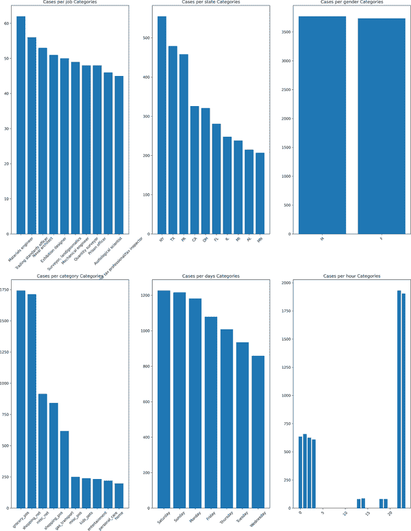

# 第八章：建模操作风险

> ...并不一定是最大的错误行为造成最严重的打击；即使是最小的事件也可能导致股价暴跌。
> 
> Dunnett, Levy, and Simoes (2005)

到目前为止，我们已经讨论了三种主要的财务风险：市场风险、信用风险和流动性风险。现在是时候讨论操作风险了，这种风险比其他类型的财务风险更加模糊不清。这种模糊性源于金融机构可能面临的风险来源种类繁多，从而可能导致巨大的损失。

操作风险是由于内部流程、人员和系统的不足或失败，或外部事件导致的直接或间接损失的风险（BIS 2019）。请注意，损失可以是直接的和/或间接的。一些直接损失包括：

+   来自司法程序的法律责任

+   由于盗窃或资产减少而导致的减值

+   源自税收、许可、罚款等的合规性。

+   业务中断

间接成本与机会成本相关，机构的决策可能引发一系列事件，导致未来某个不确定时间的损失。

通常，金融机构会分配一定金额来覆盖源自操作风险的损失，即所谓的*意外损失*。然而，分配适当的资金以覆盖意外损失并非易事。必须确定正确的意外损失金额；否则，要么投入更多资金，导致资金闲置并产生机会成本，要么分配少于所需资金，导致流动性问题。

正如我们之前简要提到的，操作风险可以采取多种形式。其中，我们将重点放在欺诈风险上，这被认为是最普遍和最具破坏性的操作风险类型之一。

如果损失是由金融机构内部引起的，则欺诈可能通常被描述为一种故意行为、误述或遗漏，旨在欺骗他人，导致受害者遭受损失或施行者获得利益（OCC 2019）。如果是由第三方实施的，则可以称为外部欺诈。

为什么欺诈成为金融机构的主要关注点？什么会增加欺诈行为的可能性？为了回答这些问题，我们可以参考三个重要因素：

+   全球化

+   缺乏适当的风险管理

+   经济压力

全球化导致金融机构在全球范围内扩展其业务，这带来了复杂性，增加了腐败、贿赂和任何违法行为的可能性，因为金融机构开始在他们没有先前知识的环境中运营。

缺乏适当的风险管理一直以来都是欺诈的最明显原因。误导性报告和流氓、未经授权的交易为欺诈行为埋下了种子。巴林银行案例是一个非常著名的例子，尼克·利森（Barings）在此案中，一名年轻的巴林银行交易员运行了一个投机交易和随后的掩盖操作，使用会计把戏导致巴林银行损失了高达 13 亿美元的巨额财富。因此，当缺乏明确定义的风险管理政策以及良好建立的风险文化时，员工可能倾向于实施欺诈行为。

另一个导致欺诈行为的动机可能是员工经济状况恶化。特别是在经济衰退期间，员工可能会被诱使从事欺诈活动。此外，金融机构本身可能会采用非法操作（如会计把戏）来摆脱经济衰退的困境。

欺诈不仅会造成巨额损失，而且还会对公司的声誉构成威胁，这可能会进一步影响公司的长期可持续性。以安然公司为例，这是一个典型的会计欺诈案例，于 2001 年爆发。安然公司成立于 1985 年，曾经是美国和世界上最大的公司之一。让我简要告诉你这场大崩溃的故事。

由于安然公司在能源市场面临的压力，高管们被迫依赖可疑的会计实践，导致通过写入巨额未实现未来收益的方式产生的虚高利润。多亏了举报人雪伦·沃特金斯（Sherron Watkins），她曾是前企业发展副总裁，现代金融史上最大的欺诈案例之一得以曝光。此事件也强调了预防欺诈活动的重要性，否则可能导致个人或公司声誉或财务崩溃造成巨大损失。

在本章中，我们旨在介绍一种基于机器学习的模型来检测欺诈或可能的欺诈操作。这是一个应不断发展的领域，以赶在作恶者之前。与欺诈相关的数据集可以分为*标记*或*未标记数据*。为了同时考虑两者，我们首先应用监督学习算法，然后使用无监督学习算法，假装我们没有标签，尽管我们将使用的数据集确实包含标签。

我们用于欺诈分析的数据集称为 Brandon Harris 创建的*信用卡交易欺诈检测数据集*。信用卡欺诈并不罕见，目标是检测欺诈可能性并通知银行，以便银行可以进行尽职调查。这是银行保护自身免受巨额损失的方式。根据尼尔森报告（2020 年），支付卡欺诈损失达到创纪录的 320.4 亿美元，相当于每 100 美元总交易量的 6.8 美分。

这个数据集是各种属性类型混合的很好的例子，因为我们有连续、离散和名义数据。您可以在[Kaggle](https://oreil.ly/fxxFg)上找到这些数据。表 8-1 提供了数据的解释。

表 8-1\. 属性及其解释

| 属性 | 解释 |
| --- | --- |
| `trans_date_trans_time` | 交易日期 |
| `cc_num` | 客户的信用卡号码 |
| `merchant` | 进行交易的商家 |
| `amt` | 交易金额 |
| `first` | 客户的名字 |
| `last` | 客户的姓氏 |
| `gender` | 客户的性别 |
| `street, city, state` | 客户的地址 |
| `zip` | 交易的邮政编码 |
| `lat` | 客户的纬度 |
| `long` | 客户的经度 |
| `city_pop` | 城市的人口 |
| `job` | 客户职业的类型 |
| `dob` | 客户的出生日期 |
| `trans_num` | 每笔交易的唯一交易号 |
| `unix_time` | 交易的 Unix 时间 |
| `merch_lat` | 商家的纬度 |
| `merch_long` | 商家的经度 |
| `is_fraud` | 交易是否欺诈 |

# 熟悉欺诈数据

正如您可能注意到的，如果不同类别的观察数量相对均衡，机器学习算法的效果会更好——也就是说，它在平衡数据上运行得更好。在欺诈案例中我们没有平衡的数据，因此这被称为*类别不平衡*。在第六章中，我们学习了如何处理类别不平衡问题，我们将在本章再次使用这个技能。

让我们开始吧。首先，查看信用卡交易欺诈检测数据集中变量的数据类型：

```py
In [1]: import pandas as pd
        import numpy as np
        import matplotlib.pyplot as plt
        import seaborn as sns
        from scipy.stats import zscore
        import warnings
        warnings.filterwarnings('ignore')

In [2]: fraud_data = pd.read_csv('fraudTrain.csv')
        del fraud_data['Unnamed: 0']

In [3]: fraud_data.info()
        <class 'pandas.core.frame.DataFrame'>
        RangeIndex: 1296675 entries, 0 to 1296674
        Data columns (total 22 columns):
         #   Column                 Non-Null Count    Dtype
        ---  ------                 --------------    -----
         0   trans_date_trans_time  1296675 non-null  object
         1   cc_num                 1296675 non-null  int64
         2   merchant               1296675 non-null  object
         3   category               1296675 non-null  object
         4   amt                    1296675 non-null  float64
         5   first                  1296675 non-null  object
         6   last                   1296675 non-null  object
         7   gender                 1296675 non-null  object
         8   street                 1296675 non-null  object
         9   city                   1296675 non-null  object
         10  state                  1296675 non-null  object
         11  zip                    1296675 non-null  int64
         12  lat                    1296675 non-null  float64
         13  long                   1296675 non-null  float64
         14  city_pop               1296675 non-null  int64
         15  job                    1296675 non-null  object
         16  dob                    1296675 non-null  object
         17  trans_num              1296675 non-null  object
         18  unix_time              1296675 non-null  int64
         19  merch_lat              1296675 non-null  float64
         20  merch_long             1296675 non-null  float64
         21  is_fraud               1296675 non-null  int64
        dtypes: float64(5), int64(5), object(12)
        memory usage: 217.6+ MB
```

我们可以看到，我们拥有所有类型的数据：对象、整数和浮点数。然而，大多数变量是对象类型，因此需要进一步分析将这些分类变量转换为数值变量。

在这种分析中，因变量非常重要，因为它通常具有需要注意的不平衡特征。如下片段所示（及其结果图 Figure 8-1），表明观察数量极不均衡：

```py
In [4]: plt.pie(fraud_data['is_fraud'].value_counts(), labels=[0, 1])
        plt.title('Pie Chart for Dependent Variable');
        print(fraud_data['is_fraud'].value_counts())
        plt.show()
        0    1289169
        1       7506
        Name: is_fraud, dtype: int64
```


###### 图 8-1\. 因变量的饼图

如我们所见，非欺诈案例的观察数量为 1,289,169，而欺诈案例仅有 7,506，所以我们知道数据是高度不平衡的，这是预料之中的。

此时，我们可以使用一个非常不同的工具来检测缺失观测数量。这个工具被称为`missingno`，它还为我们提供了一个用于缺失值的可视化模块（如 Figure 8-2 所示）：

```py
In [5]: import missingno as msno 

        msno.bar(fraud_data) 
```


导入`missingno`


创建一个用于缺失值的条形图


###### 图 8-2\. 缺失观测

图 8-2 表明在顶部每个变量的非缺失观测数量，而在左侧我们可以看到非缺失值的百分比。这个分析表明数据没有缺失值。

在下一步中，首先我们将日期变量 `trans_date_trans_time` 转换为适当的格式，然后我们将时间分解为天和小时，假设欺诈活动在特定时间段内激增。分析欺诈对变量的不同类别的影响是有意义的。为此，我们将使用柱状图。更清楚地看到，欺诈案件数量可能会随着某些变量类别的变化而变化。但是在性别变量中保持不变，这意味着性别对欺诈活动没有影响。另一个引人注目且显而易见的观察是，欺诈案件每天和每小时变化非常大。这可以在生成的 图 8-3 中得到视觉确认。

```py
In [6]: fraud_data['time'] = pd.to_datetime(fraud_data['trans_date_trans_time'])
        del fraud_data['trans_date_trans_time']

In [7]: fraud_data['days'] = fraud_data['time'].dt.day_name()
        fraud_data['hour'] = fraud_data['time'].dt.hour

In [8]: def fraud_cat(cols):
            k = 1
            plt.figure(figsize=(20, 40))
            for i in cols:
                categ = fraud_data.loc[fraud_data['is_fraud'] == 1, i].\
                        value_counts().sort_values(ascending=False).\
                        reset_index().head(10) 
                plt.subplot(len(cols) / 2, len(cols) / 2, k)
                bar_plot = plt.bar(categ.iloc[:, 0], categ[i])
                plt.title(f'Cases per {i} Categories')
                plt.xticks(rotation='45')
                k+= 1
            return categ, bar_plot

In [9]: cols = ['job', 'state', 'gender', 'category', 'days', 'hour']
        _, bar_plot = fraud_cat(cols)
        bar_plot
```


根据欺诈活动对 `fraud_data` 进行排序，按升序排列

基于分析和我们对欺诈分析的先前知识，我们可以决定在建模中使用的变量数量。分类变量进行排序，以便我们可以使用 `pd.get_dummies` 创建虚拟变量：

```py
In [10]: cols=['amt','gender','state','category',
               'city_pop','job','is_fraud','days','hour']
         fraud_data_df=fraud_data[cols]

In [11]: cat_cols=fraud_data[cols].select_dtypes(include='object').columns

In [12]: def one_hot_encoded_cat(data, cat_cols):
             for i in cat_cols:
                 df1 = pd.get_dummies(data[str(i)],
                                      prefix=i, drop_first=True)
                 data.drop(str(i), axis=1, inplace=True)
                 data = pd.concat([data, df1], axis=1)
             return data

In [13]: fraud_df = one_hot_encoded_cat(fraud_data_df, cat_cols)
```



###### 图 8-3\. 柱状图变量

在分类变量分析之后，讨论数值变量 `amount`、`population` 和 `hour` 之间的交互作用是值得的。相关性分析为我们提供了一个强有力的工具，用于确定这些变量之间的相互作用，而生成的热图（图 8-4）表明相关性非常低：

```py
In [14]: num_col = fraud_data_df.select_dtypes(exclude='object').columns
         fraud_data_df = fraud_data_df[num_col]
         del fraud_data_df['is_fraud']

In [15]: plt.figure(figsize=(10,6))
         corrmat = fraud_data_df.corr()
         top_corr_features = corrmat.index
         heat_map = sns.heatmap(corrmat, annot=True, cmap="viridis")
```


###### 图 8-4\. 热图

# 欺诈审查的监督学习建模

我们已经确定了使用交互、缺失值和创建虚拟变量来确定变量的特殊特征。现在我们准备继续并运行欺诈分析的 ML 模型。我们即将运行的模型包括：

+   逻辑回归

+   决策树

+   随机森林

+   XGBoost

如你所想象的那样，在进行建模之前保持数据平衡是关键。尽管有许多方法可以获得平衡数据，但我们将选择欠采样方法，因为它的性能更好。欠采样是一种将多数类别与少数类别匹配的技术，如 图 8-5 所示。


###### 图 8-5\. 欠采样

或者，从多数类中删除观察次数，直到获得与少数类相同数量的观察次数。我们将在以下代码块中应用欠采样，其中独立和依赖变量分别命名为`X_under`和`y_under`。接下来，将随机分割训练和测试集以获取训练和测试分割：

```py
In [16]: from sklearn.model_selection import train_test_split
         from sklearn.linear_model import LogisticRegression
         from sklearn.model_selection import train_test_split
         from sklearn.model_selection import GridSearchCV
         from sklearn.model_selection import RandomizedSearchCV
         from sklearn.metrics import (classification_report,
                                     confusion_matrix, f1_score)

In [17]: non_fraud_class = fraud_df[fraud_df['is_fraud'] == 0]
         fraud_class = fraud_df[fraud_df['is_fraud'] == 1]

In [18]: non_fraud_count,fraud_count=fraud_df['is_fraud'].value_counts()
         print('The number of observations in non_fraud_class:', non_fraud_count)
         print('The number of observations in fraud_class:', fraud_count)
         The number of observations in non_fraud_class: 1289169
         The number of observations in fraud_class: 7506

In [19]: non_fraud_under = non_fraud_class.sample(fraud_count) 
         under_sampled = pd.concat([non_fraud_under, fraud_class], axis=0) 
         X_under = under_sampled.drop('is_fraud',axis=1) 
         y_under = under_sampled['is_fraud'] 

In [20]: X_train_under, X_test_under, y_train_under, y_test_under =\
                 train_test_split(X_under, y_under, random_state=0)
```


对`fraud_count`进行抽样


将包含欺诈案例的数据与不包含欺诈案例的数据合并


通过去除`is_fraud`创建独立变量


通过`is_fraud`创建依赖变量

使用欠采样方法后，让我们现在运行之前描述的一些分类模型，并观察这些模型在检测欺诈方面的表现：

```py
In [21]: param_log = {'C': np.logspace(-4, 4, 4), 'penalty': ['l1', 'l2']}
         log_grid = GridSearchCV(LogisticRegression(),
                                 param_grid=param_log, n_jobs=-1)
         log_grid.fit(X_train_under, y_train_under)
         prediction_log = log_grid.predict(X_test_under)

In [22]: conf_mat_log = confusion_matrix(y_true=y_test_under,
                                         y_pred=prediction_log)
         print('Confusion matrix:\n', conf_mat_log)
         print('--' * 25)
         print('Classification report:\n',
               classification_report(y_test_under, prediction_log))
         Confusion matrix:
          [[1534  310]
          [ 486 1423]]
         --------------------------------------------------
         Classification report:
                        precision    recall  f1-score   support

                    0       0.76      0.83      0.79      1844
                    1       0.82      0.75      0.78      1909

             accuracy                           0.79      3753
            macro avg       0.79      0.79      0.79      3753
         weighted avg       0.79      0.79      0.79      3753
```

首先，让我们看一下混淆矩阵。混淆矩阵表明误报和漏报的观察次数分别为 310 和 486。我们将在基于成本的方法中使用混淆矩阵。

*F1 分数*是用于衡量这些模型性能的指标。它呈现了召回率和精确率的加权平均值，使其成为这种情况下的理想衡量标准。

第二个模型是决策树，在建模欺诈方面表现良好。调整超参数后，F1 分数显著提高，表明决策树表现相对良好。与逻辑回归相比，误报和漏报观察次数显著减少：

```py
In [23]: from sklearn.tree import DecisionTreeClassifier

In [24]: param_dt = {'max_depth': [3, 5, 10],
                     'min_samples_split': [2, 4, 6],
                     'criterion': ['gini', 'entropy']}
         dt_grid = GridSearchCV(DecisionTreeClassifier(),
                                param_grid=param_dt, n_jobs=-1)
         dt_grid.fit(X_train_under, y_train_under)
         prediction_dt = dt_grid.predict(X_test_under)

In [25]: conf_mat_dt = confusion_matrix(y_true=y_test_under,
                                        y_pred=prediction_dt)
         print('Confusion matrix:\n', conf_mat_dt)
         print('--' * 25)
         print('Classification report:\n',
               classification_report(y_test_under, prediction_dt))
         Confusion matrix:
          [[1795   49]
          [  84 1825]]
         --------------------------------------------------
         Classification report:
                        precision    recall  f1-score   support

                    0       0.96      0.97      0.96      1844
                    1       0.97      0.96      0.96      1909

             accuracy                           0.96      3753
            macro avg       0.96      0.96      0.96      3753
         weighted avg       0.96      0.96      0.96      3753
```

根据共同信念，作为集成模型的随机森林优于决策树。然而，在这种情况下，这只有在决策树预测不稳定且不同样本的预测结果差异巨大时才成立，而这里并非如此。正如您从以下结果中可以观察到的那样，即使随机森林的 F1 分数为 87，它也不如决策树表现好：

```py
In [26]: from sklearn.ensemble import RandomForestClassifier

In [27]: param_rf = {'n_estimators':[20,50,100] ,
                  'max_depth':[3,5,10],
                  'min_samples_split':[2,4,6],
                  'max_features':['auto', 'sqrt', 'log2']}
         rf_grid = GridSearchCV(RandomForestClassifier(),
                               param_grid=param_rf, n_jobs=-1)
         rf_grid.fit(X_train_under, y_train_under)
         prediction_rf = rf_grid.predict(X_test_under)

In [28]: conf_mat_rf = confusion_matrix(y_true=y_test_under,
                                        y_pred=prediction_rf)
         print('Confusion matrix:\n', conf_mat_rf)
         print('--' * 25)
         print('Classification report:\n',
               classification_report(y_test_under, prediction_rf))
         Confusion matrix:
          [[1763   81]
          [ 416 1493]]
         --------------------------------------------------
         Classification report:
                        precision    recall  f1-score   support

                    0       0.81      0.96      0.88      1844
                    1       0.95      0.78      0.86      1909

             accuracy                           0.87      3753
            macro avg       0.88      0.87      0.87      3753
         weighted avg       0.88      0.87      0.87      3753
```

我们将看看的最终模型是 XGBoost，其产生了与决策树类似的结果，其 F1 分数为 97：

```py
In [29]: from xgboost import XGBClassifier

In [30]: param_boost = {'learning_rate': [0.01, 0.1],
                        'max_depth': [3, 5, 7],
                        'subsample': [0.5, 0.7],
                        'colsample_bytree': [0.5, 0.7],
                        'n_estimators': [10, 20, 30]}
         boost_grid = RandomizedSearchCV(XGBClassifier(),
                                         param_boost, n_jobs=-1)
         boost_grid.fit(X_train_under, y_train_under)
         prediction_boost = boost_grid.predict(X_test_under)

In [31]: conf_mat_boost = confusion_matrix(y_true=y_test_under,
                                           y_pred=prediction_boost)
         print('Confusion matrix:\n', conf_mat_boost)
         print('--' * 25)
         print('Classification report:\n',
               classification_report(y_test_under, prediction_boost))
         Confusion matrix:
          [[1791   53]
          [  75 1834]]
         --------------------------------------------------
         Classification report:
                        precision    recall  f1-score   support

                    0       0.96      0.97      0.97      1844
                    1       0.97      0.96      0.97      1909

             accuracy                           0.97      3753
            macro avg       0.97      0.97      0.97      3753
         weighted avg       0.97      0.97      0.97      3753
```

综合所有申请情况，以下是总结结果：

表 8-2\. 使用欠采样对欺诈进行建模的结果

| 模型 | F1 分数 |
| --- | --- |
| 逻辑回归 | 0.79 |
| 决策树 | 0.96 |
| 随机森林 | 0.87 |
| XGBoost | 0.97 |

## 基于成本的欺诈检查

欠采样为处理不平衡数据提供了方便的工具。然而，它也伴随着成本，其中最大的成本是丢弃重要的观察结果。尽管不同的采样程序可以应用于诸如医疗保健、欺诈等敏感分析领域，但应注意性能指标未能考虑不同误分类对经济影响的程度。因此，如果某种方法提出了不同的误分类成本，它被称为*成本敏感分类器*。让我们考虑欺诈案例，这是成本敏感分析的一个典型例子。在这种类型的分析中，明显假阳性比假阴性成本低。更准确地说，假阳性意味着阻止一个已经合法的交易。这类分类的成本往往与行政和机会成本相关，例如检测所花费的时间和精力，以及金融机构可能因交易而失去的潜在收益。

然而，未能检测到欺诈（即出现假阴性）对于一家公司意义重大，因为这可能暗示着各种内部弱点以及设计不良的运营程序。未能检测到真实欺诈的公司可能会承担大笔财务成本，包括交易金额，更不用说因声誉受损而产生的成本了。前一种成本将加重公司的负担，但后者既无法量化也不能被忽视。

如您所见，为不同的误分类分配不同的成本需求使我们能够找到更为显著、现实的解决方案。为简单起见，我们假设假阴性和真阳性的成本分别为交易金额和 2。表 8-3 总结了结果。另一种评估成本敏感性的方法是假设常数假阴性，就像其他情况一样。然而，这种方法被认为是不现实的。

表 8-3\. 成本敏感矩阵

| 模型 | F1 分数 |
| --- | --- |
| 真阳性 = 2 | 假阴性 = 交易金额 |
| 假阳性 = 2 | 真阴性 = 0 |

因此，一个机构可能面临的总成本将采取以下形式：

<math alttext="Cost equals sigma-summation Underscript i equals 1 Overscript upper N Endscripts y Subscript i Baseline left-parenthesis c Subscript i Baseline upper C Subscript upper T upper P Sub Subscript i Subscript Baseline plus left-parenthesis 1 minus c Subscript i Baseline right-parenthesis upper C Subscript upper F upper N Sub Subscript i Subscript Baseline right-parenthesis plus left-parenthesis 1 minus y Subscript i Baseline right-parenthesis c Subscript i Baseline upper C Subscript upper F upper P Sub Subscript i Subscript Baseline" display="block"><mrow><mtext>Cost</mtext> <mo>=</mo> <munderover><mo>∑</mo> <mrow><mi>i</mi><mo>=</mo><mn>1</mn></mrow> <mi>N</mi></munderover> <msub><mi>y</mi> <mi>i</mi></msub> <mrow><mo>(</mo> <msub><mi>c</mi> <mi>i</mi></msub> <msub><mi>C</mi> <mrow><mi>T</mi><msub><mi>P</mi> <mi>i</mi></msub></mrow></msub> <mo>+</mo> <mrow><mo>(</mo> <mn>1</mn> <mo>-</mo> <msub><mi>c</mi> <mi>i</mi></msub> <mo>)</mo></mrow> <msub><mi>C</mi> <mrow><mi>F</mi><msub><mi>N</mi> <mi>i</mi></msub></mrow></msub> <mo>)</mo></mrow> <mo>+</mo> <mrow><mo>(</mo> <mn>1</mn> <mo>-</mo> <msub><mi>y</mi> <mi>i</mi></msub> <mo>)</mo></mrow> <msub><mi>c</mi> <mi>i</mi></msub> <msub><mi>C</mi> <mrow><mi>F</mi><msub><mi>P</mi> <mi>i</mi></msub></mrow></msub></mrow></math>

其中<math alttext="c Subscript i"><msub><mi>c</mi> <mi>i</mi></msub></math>是预测标签，<math alttext="y Subscript i"><msub><mi>y</mi> <mi>i</mi></msub></math>是实际标签，*N*是观察数，<math alttext="upper C Subscript upper T upper P Sub Subscript i"><msub><mi>C</mi> <mrow><mi>T</mi><msub><mi>P</mi> <mi>i</mi></msub></mrow></msub></math>和<math alttext="upper C Subscript upper F upper P Sub Subscript i"><msub><mi>C</mi> <mrow><mi>F</mi><msub><mi>P</mi> <mi>i</mi></msub></mrow></msub></math>对应于行政成本，在我们的案例中为 2。<math alttext="upper C Subscript upper F upper N Sub Subscript i"><msub><mi>C</mi> <mrow><mi>F</mi><msub><mi>N</mi> <mi>i</mi></msub></mrow></msub></math>代表交易金额。

现在，有了这些信息，让我们重新审视考虑成本敏感方法的 ML 模型，并计算这些模型的成本变化。然而，在我们开始之前，值得注意的是，成本敏感模型不是快速处理型的，因此由于我们有大量观察结果，从中抽样来及时地对数据建模是明智的。一个类相关的成本度量如下：

```py
In [32]: fraud_df_sampled = fraud_df.sample(int(len(fraud_df) * 0.2)) 

In [33]: cost_fp = 2
         cost_fn = fraud_df_sampled['amt']
         cost_tp = 2
         cost_tn = 0
         cost_mat = np.array([cost_fp * np.ones(fraud_df_sampled.shape[0]),
                              cost_fn,
                              cost_tp * np.ones(fraud_df_sampled.shape[0]),
                              cost_tn * np.ones(fraud_df_sampled.shape[0])]).T 

In [34]: cost_log = conf_mat_log[0][1] * cost_fp + conf_mat_boost[1][0] * \
                     cost_fn.mean() + conf_mat_log[1][1] * cost_tp 
         cost_dt = conf_mat_dt[0][1] * cost_fp + conf_mat_boost[1][0] * \
                   cost_fn.mean() + conf_mat_dt[1][1] * cost_tp 
         cost_rf = conf_mat_rf[0][1] * cost_fp + conf_mat_boost[1][0] * \
                   cost_fn.mean() + conf_mat_rf[1][1] * cost_tp 
         cost_boost = conf_mat_boost[0][1] * cost_fp + conf_mat_boost[1][0] * \
                      cost_fn.mean() + conf_mat_boost[1][1] * cost_tp 
```


从`fraud_df`数据中抽样


计算成本矩阵


计算每个模型的总成本

计算总成本使我们能够采用不同的方法来评估模型性能。具有高 F1 分数的模型预计总成本较低，这就是我们在表 8-4 中看到的情况。逻辑回归的总成本最高，而 XGBoost 的总成本最低。

表 8-4\. 总成本

| 模型 | 总成本 |
| --- | --- |
| 逻辑回归 | 5995 |
| 决策树 | 5351 |
| 随机森林 | 5413 |
| XGBoost | 5371 |

## 节省分数

在成本改善中可以使用不同的指标，而节省分数绝对是其中之一。为了能够定义节省，让我们给出成本的公式。

Bahnsen、Aouada 和 Ottersten（2014）清楚地解释了以下节省分数公式：

<math alttext="Cost left-parenthesis f left-parenthesis upper S right-parenthesis right-parenthesis equals sigma-summation Underscript i equals 1 Overscript upper N Endscripts left-parenthesis y Subscript i Baseline left-parenthesis c Subscript i Baseline upper C Subscript upper T upper P Sub Subscript i Subscript Baseline plus left-parenthesis 1 minus c Subscript i Baseline right-parenthesis upper C Subscript upper F upper N Sub Subscript i Subscript Baseline right-parenthesis plus left-parenthesis 1 minus y Subscript i Baseline right-parenthesis left-parenthesis c Subscript i Baseline upper C Subscript upper F upper P Sub Subscript i Subscript Baseline plus left-parenthesis 1 minus c Subscript i Baseline right-parenthesis upper C Subscript upper T upper N Sub Subscript i Subscript Baseline right-parenthesis right-parenthesis" display="block"><mrow><mtext>Cost(f(S))</mtext> <mo>=</mo> <munderover><mo>∑</mo> <mrow><mi>i</mi><mo>=</mo><mn>1</mn></mrow> <mi>N</mi></munderover> <mfenced close=")" open="(" separators=""><msub><mi>y</mi> <mi>i</mi></msub> <mrow><mo>(</mo><msub><mi>c</mi> <mi>i</mi></msub> <msub><mi>C</mi> <mrow><mi>T</mi><msub><mi>P</mi> <mi>i</mi></msub></mrow></msub> <mo>+</mo><mrow><mo>(</mo><mn>1</mn><mo>-</mo><msub><mi>c</mi> <mi>i</mi></msub> <mo>)</mo></mrow><msub><mi>C</mi> <mrow><mi>F</mi><msub><mi>N</mi> <mi>i</mi></msub></mrow></msub> <mo>)</mo></mrow> <mo>+</mo> <mrow><mo>(</mo><mn>1</mn><mo>-</mo><msub><mi>y</mi> <mi>i</mi></msub> <mo>)</mo></mrow> <mrow><mo>(</mo><msub><mi>c</mi> <mi>i</mi></msub> <msub><mi>C</mi> <mrow><mi>F</mi><msub><mi>P</mi> <mi>i</mi></msub></mrow></msub> <mo>+</mo><mrow><mo>(</mo><mn>1</mn><mo>-</mo><msub><mi>c</mi> <mi>i</mi></msub> <mo>)</mo></mrow><msub><mi>C</mi> <mrow><mi>T</mi><msub><mi>N</mi> <mi>i</mi></msub></mrow></msub> <mo>)</mo></mrow></mfenced></mrow></math>

其中*TP*，*FN*，*FP*和*TN*分别是真正例，假负例，假正例和真负例。对于训练集*S*上的每个观察*i*，<math alttext="c Subscript i"><msub><mi>c</mi> <mi>i</mi></msub></math> 是预测标签。<math alttext="y Subscript i"><msub><mi>y</mi> <mi>i</mi></msub></math>是类标签，取值为 1 或 0，即<math alttext="y element-of 0 comma 1"><mrow><mi>y</mi> <mo>∈</mo> <mrow><mn>0</mn> <mo>,</mo> <mn>1</mn></mrow></mrow></math>。我们的节省公式如下：

<math alttext="Saving left-parenthesis f left-parenthesis upper S right-parenthesis right-parenthesis equals StartFraction Cost left-parenthesis f left-parenthesis upper S right-parenthesis right-parenthesis minus upper C o s t Subscript l Baseline left-parenthesis upper S right-parenthesis Over upper C o s t Subscript l Baseline left-parenthesis upper S right-parenthesis EndFraction" display="block"><mrow><mtext>Saving(f(S))</mtext> <mo>=</mo> <mfrac><mrow><mtext>Cost(f(S))</mtext><mo>-</mo><mi>C</mi><mi>o</mi><mi>s</mi><msub><mi>t</mi> <mi>l</mi></msub> <mrow><mo>(</mo><mi>S</mi><mo>)</mo></mrow></mrow> <mrow><mi>C</mi><mi>o</mi><mi>s</mi><msub><mi>t</mi> <mi>l</mi></msub> <mrow><mo>(</mo><mi>S</mi><mo>)</mo></mrow></mrow></mfrac></mrow></math>

其中 <math alttext="upper C o s t Subscript l Baseline equals m i n upper C o s t left-parenthesis f 0 left-parenthesis upper S right-parenthesis right-parenthesis comma upper C o s t left-parenthesis f 1 left-parenthesis upper S right-parenthesis right-parenthesis"><mrow><mi>C</mi> <mi>o</mi> <mi>s</mi> <msub><mi>t</mi> <mi>l</mi></msub> <mo>=</mo> <mi>m</mi> <mi>i</mi> <mi>n</mi> <mrow><mi>C</mi> <mi>o</mi> <mi>s</mi> <mi>t</mi> <mrow><mo>(</mo> <msub><mi>f</mi> <mn>0</mn></msub> <mrow><mo>(</mo> <mi>S</mi> <mo>)</mo></mrow> <mo>)</mo></mrow> <mo>,</mo> <mi>C</mi> <mi>o</mi> <mi>s</mi> <mi>t</mi> <mrow><mo>(</mo> <msub><mi>f</mi> <mn>1</mn></msub> <mrow><mo>(</mo> <mi>S</mi> <mo>)</mo></mrow> <mo>)</mo></mrow></mrow></mrow></mrow></math> 其中 <math alttext="f 0"><msub><mi>f</mi> <mn>0</mn></msub></math> 预测类别 0， <math alttext="c 0"><msub><mi>c</mi> <mn>0</mn></msub></math> ，而 <math alttext="f 1"><msub><mi>f</mi> <mn>1</mn></msub></math> 预测类别 1 中的观测， <math alttext="c 1"><msub><mi>c</mi> <mn>1</mn></msub></math> 。

在代码中，我们有以下内容：

```py
In [35]: import joblib
         import sys
         sys.modules['sklearn.externals.joblib'] = joblib
         from costcla.metrics import cost_loss, savings_score
         from costcla.models import BayesMinimumRiskClassifier

In [36]: X_train, X_test, y_train, y_test, cost_mat_train, cost_mat_test = \
         train_test_split(fraud_df_sampled.drop('is_fraud', axis=1),
                                    fraud_df_sampled.is_fraud, cost_mat,
                                    test_size=0.2, random_state=0)

In [37]: saving_models = []
         saving_models.append(('Log. Reg.',
                               LogisticRegression()))
         saving_models.append(('Dec. Tree',
                               DecisionTreeClassifier()))
         saving_models.append(('Random Forest',
                               RandomForestClassifier()))

In [38]: saving_score_base_all = []

         for name, save_model in saving_models:
             sv_model = save_model
             sv_model.fit(X_train, y_train)
             y_pred = sv_model.predict(X_test)
             saving_score_base = savings_score(y_test, y_pred, cost_mat_test) 
             saving_score_base_all.append(saving_score_base)
             print('The saving score for {} is {:.4f}'.
                   format(name, saving_score_base))
             print('--' * 20)
         The saving score for Log. Reg. is -0.5602
         ----------------------------------------
         The saving score for Dec. Tree is 0.6557
         ----------------------------------------
         The saving score for Random Forest is 0.4789
         ----------------------------------------

In [39]: f1_score_base_all = []

         for name, save_model in saving_models:
             sv_model = save_model
             sv_model.fit(X_train, y_train)
             y_pred = sv_model.predict(X_test)
             f1_score_base = f1_score(y_test, y_pred, cost_mat_test) 
             f1_score_base_all.append(f1_score_base)
             print('The F1 score for {} is {:.4f}'.
                   format(name, f1_score_base))
             print('--' * 20)
         The F1 score for Log. Reg. is 0.0000
         ----------------------------------------
         The F1 score for Dec. Tree is 0.7383
         ----------------------------------------
         The F1 score for Random Forest is 0.7068
         ----------------------------------------
```


计算节省分数


计算 F1 分数

###### 警告

请注意，如果您使用的是 `sklearn` 版本 0.23 或更高版本，则需要将其降级到 0.22 版本以使用 `costcla` 库。这是由于 `costcla` 库内部的 `sklearn.external.six` 包。

表 8-5 显示，决策树在三个模型中具有最高的节省分数，有趣的是，逻辑回归产生了负的节省分数，这意味着假阴性和假阳性预测的数量相当大，从而扩大了节省分数公式的分母。

表 8-5\. 节省分数

| 模型 | 节省分数 | F1 分数 |
| --- | --- | --- |
| 逻辑回归 | -0.5602 | 0.0000 |
| 决策树 | 0.6557 | 0.7383 |
| 随机森林 | 0.4789 | 0.7068 |

## 成本敏感建模

到目前为止，我们已经讨论了节省分数和成本敏感的概念，现在我们准备运行成本敏感的逻辑回归、决策树和随机森林。我们在这里要解决的问题是，如果考虑到误分类的不同成本来建模欺诈会发生什么？这如何影响节省分数？

为了进行这项调查，我们将使用 `costcla` 库。这个库是专门为采用成本敏感分类器而创建的，其中考虑了不同的误分类成本。因为，正如之前讨论的那样，传统的欺诈模型假设所有正确分类和错误分类的示例都具有相同的成本，这在欺诈中是不正确的（Bahnsen 2021）。

应用成本敏感模型后，使用节省分数来比较以下代码中的模型：

```py
In [40]: from costcla.models import CostSensitiveLogisticRegression
         from costcla.models import CostSensitiveDecisionTreeClassifier
         from costcla.models import CostSensitiveRandomForestClassifier

In [41]: cost_sen_models = []
         cost_sen_models.append(('Log. Reg. CS',
                                 CostSensitiveLogisticRegression()))
         cost_sen_models.append(('Dec. Tree CS',
                                 CostSensitiveDecisionTreeClassifier()))
         cost_sen_models.append(('Random Forest CS',
                                 CostSensitiveRandomForestClassifier()))

In [42]: saving_cost_all = []

         for name, cost_model in cost_sen_models:
             cs_model = cost_model
             cs_model.fit(np.array(X_train), np.array(y_train),
                          cost_mat_train) 
             y_pred = cs_model.predict(np.array(X_test))
             saving_score_cost = savings_score(np.array(y_test),
                                               np.array(y_pred), cost_mat_test)
             saving_cost_all.append(saving_score_cost)
             print('The saving score for {} is {:.4f}'.
                   format(name, saving_score_cost))
             print('--'*20)
         The saving score for Log. Reg. CS is -0.5906
         ----------------------------------------
         The saving score for Dec. Tree CS is 0.8419
         ----------------------------------------
         The saving score for Random Forest CS is 0.8903
         ----------------------------------------

In [43]: f1_score_cost_all = []

         for name, cost_model in cost_sen_models:
             cs_model = cost_model
             cs_model.fit(np.array(X_train), np.array(y_train),
                          cost_mat_train)
             y_pred = cs_model.predict(np.array(X_test))
             f1_score_cost = f1_score(np.array(y_test),
                                      np.array(y_pred), cost_mat_test)
             f1_score_cost_all.append(f1_score_cost)
             print('The F1 score for {} is {:.4f}'. format(name,
                                                           f1_score_cost))
             print('--'*20)
         The F1 score for Log. Reg. CS is 0.0000
         ----------------------------------------
         The F1 score for Dec. Tree CS is 0.3281
         ----------------------------------------
         The F1 score for Random Forest CS is 0.4012
         ----------------------------------------
```


通过迭代训练成本敏感模型

根据 表 8-6，最佳和最差的救助分数分别在随机森林和逻辑回归中获得。这证实了两个重要事实：首先，它意味着随机森林具有低数量的不准确观察结果，其次，这些不准确的观察结果成本较低。准确地说，用随机森林建模欺诈生成了极少数量的假阴性，这是救助分数公式的分母。

表 8-6\. 成本敏感模型的救助分数

| 模型 | 救助分数 | F1 分数 |
| --- | --- | --- |
| 逻辑回归 | -0.5906 | 0.0000 |
| 决策树 | 0.8414 | 0.3281 |
| 随机森林 | 0.8913 | 0.4012 |

## 贝叶斯最小风险

贝叶斯决策还可用于考虑成本敏感性的欺诈建模。贝叶斯最小风险方法基于使用不同成本（或损失）和概率的决策过程。数学上，如果预测某笔交易是欺诈，整体风险定义如下：

<math alttext="upper R left-parenthesis c Subscript f Baseline vertical-bar upper S right-parenthesis equals upper L left-parenthesis c Subscript f Baseline vertical-bar y Subscript f Baseline right-parenthesis upper P left-parenthesis c Subscript f Baseline vertical-bar upper S right-parenthesis plus upper L left-parenthesis c Subscript f Baseline vertical-bar y Subscript l Baseline right-parenthesis upper P left-parenthesis c Subscript l Baseline vertical-bar upper S right-parenthesis" display="block"><mrow><mi>R</mi> <mrow><mo>(</mo> <msub><mi>c</mi> <mi>f</mi></msub> <mo>|</mo> <mi>S</mi> <mo>)</mo></mrow> <mo>=</mo> <mi>L</mi> <mrow><mo>(</mo> <msub><mi>c</mi> <mi>f</mi></msub> <mo>|</mo> <msub><mi>y</mi> <mi>f</mi></msub> <mo>)</mo></mrow> <mi>P</mi> <mrow><mo>(</mo> <msub><mi>c</mi> <mi>f</mi></msub> <mo>|</mo> <mi>S</mi> <mo>)</mo></mrow> <mo>+</mo> <mi>L</mi> <mrow><mo>(</mo> <msub><mi>c</mi> <mi>f</mi></msub> <mo>|</mo> <msub><mi>y</mi> <mi>l</mi></msub> <mo>)</mo></mrow> <mi>P</mi> <mrow><mo>(</mo> <msub><mi>c</mi> <mi>l</mi></msub> <mo>|</mo> <mi>S</mi> <mo>)</mo></mrow></mrow></math>

另一方面，如果预测某笔交易合法，则整体风险如下：

<math alttext="upper R left-parenthesis c Subscript l Baseline vertical-bar upper S right-parenthesis equals upper L left-parenthesis c Subscript l Baseline vertical-bar y Subscript l Baseline right-parenthesis upper P left-parenthesis c Subscript l Baseline vertical-bar upper S right-parenthesis plus upper L left-parenthesis c Subscript l Baseline vertical-bar y Subscript f Baseline right-parenthesis upper P left-parenthesis c Subscript f Baseline vertical-bar upper S right-parenthesis" display="block"><mrow><mi>R</mi> <mrow><mo>(</mo> <msub><mi>c</mi> <mi>l</mi></msub> <mo>|</mo> <mi>S</mi> <mo>)</mo></mrow> <mo>=</mo> <mi>L</mi> <mrow><mo>(</mo> <msub><mi>c</mi> <mi>l</mi></msub> <mo>|</mo> <msub><mi>y</mi> <mi>l</mi></msub> <mo>)</mo></mrow> <mi>P</mi> <mrow><mo>(</mo> <msub><mi>c</mi> <mi>l</mi></msub> <mo>|</mo> <mi>S</mi> <mo>)</mo></mrow> <mo>+</mo> <mi>L</mi> <mrow><mo>(</mo> <msub><mi>c</mi> <mi>l</mi></msub> <mo>|</mo> <msub><mi>y</mi> <mi>f</mi></msub> <mo>)</mo></mrow> <mi>P</mi> <mrow><mo>(</mo> <msub><mi>c</mi> <mi>f</mi></msub> <mo>|</mo> <mi>S</mi> <mo>)</mo></mrow></mrow></math>

其中<math alttext="y Subscript f"><msub><mi>y</mi> <mi>f</mi></msub></math>和<math alttext="y Subscript l"><msub><mi>y</mi> <mi>l</mi></msub></math>分别是欺诈案例和合法案例的实际类别。<math alttext="upper L left-parenthesis c Subscript f Baseline vertical-bar y Subscript f Baseline right-parenthesis"><mrow><mi>L</mi> <mo>(</mo> <msub><mi>c</mi> <mi>f</mi></msub> <mo>|</mo> <msub><mi>y</mi> <mi>f</mi></msub> <mo>)</mo></mrow></math>表示检测到欺诈并且实际类别为欺诈时的成本。类似地，<math alttext="upper L left-parenthesis c Subscript l Baseline vertical-bar y Subscript l Baseline right-parenthesis"><mrow><mi>L</mi> <mo>(</mo> <msub><mi>c</mi> <mi>l</mi></msub> <mo>|</mo> <msub><mi>y</mi> <mi>l</mi></msub> <mo>)</mo></mrow></math>表示预测交易为合法且实际类别为合法时的成本。相反，<math alttext="upper L left-parenthesis c Subscript f Baseline vertical-bar y Subscript l Baseline right-parenthesis"><mrow><mi>L</mi> <mo>(</mo> <msub><mi>c</mi> <mi>f</mi></msub> <mo>|</mo> <msub><mi>y</mi> <mi>l</mi></msub> <mo>)</mo></mrow></math>和<math alttext="upper L left-parenthesis c Subscript l Baseline vertical-bar y Subscript f Baseline right-parenthesis"><mrow><mi>L</mi> <mo>(</mo> <msub><mi>c</mi> <mi>l</mi></msub> <mo>|</mo> <msub><mi>y</mi> <mi>f</mi></msub> <mo>)</mo></mrow></math>计算表 8-3 中的非对角元素的成本。前者计算预测交易为欺诈但实际类别不是时的成本，后者显示交易为合法但实际类别为欺诈时的成本。<math alttext="upper P left-parenthesis c Subscript l Baseline vertical-bar upper S right-parenthesis"><mrow><mi>P</mi> <mo>(</mo> <msub><mi>c</mi> <mi>l</mi></msub> <mo>|</mo> <mi>S</mi> <mo>)</mo></mrow></math>表示给定*S*时有合法交易的预测概率，<math alttext="upper P left-parenthesis c Subscript f Baseline vertical-bar upper S right-parenthesis"><mrow><mi>P</mi> <mo>(</mo> <msub><mi>c</mi> <mi>f</mi></msub> <mo>|</mo> <mi>S</mi> <mo>)</mo></mrow></math>表示给定*S*时有欺诈交易的预测概率。

或者，贝叶斯最小风险公式可以解释为：

<math alttext="upper R left-parenthesis c Subscript f Baseline vertical-bar upper S right-parenthesis equals upper C Subscript a d m i n Baseline upper P left-parenthesis c Subscript f Baseline vertical-bar upper S right-parenthesis plus upper C Subscript a d m i n Baseline upper P left-parenthesis c Subscript l Baseline vertical-bar upper S right-parenthesis" display="block"><mrow><mi>R</mi> <mrow><mo>(</mo> <msub><mi>c</mi> <mi>f</mi></msub> <mo>|</mo> <mi>S</mi> <mo>)</mo></mrow> <mo>=</mo> <msub><mi>C</mi> <mrow><mi>a</mi><mi>d</mi><mi>m</mi><mi>i</mi><mi>n</mi></mrow></msub> <mi>P</mi> <mrow><mo>(</mo> <msub><mi>c</mi> <mi>f</mi></msub> <mo>|</mo> <mi>S</mi> <mo>)</mo></mrow> <mo>+</mo> <msub><mi>C</mi> <mrow><mi>a</mi><mi>d</mi><mi>m</mi><mi>i</mi><mi>n</mi></mrow></msub> <mi>P</mi> <mrow><mo>(</mo> <msub><mi>c</mi> <mi>l</mi></msub> <mo>|</mo> <mi>S</mi> <mo>)</mo></mrow></mrow></math><math alttext="upper R left-parenthesis c Subscript l Baseline vertical-bar upper S right-parenthesis equals 0 plus upper C Subscript a m t Baseline upper P left-parenthesis c Subscript l Baseline vertical-bar upper S right-parenthesis" display="block"><mrow><mi>R</mi> <mrow><mo>(</mo> <msub><mi>c</mi> <mi>l</mi></msub> <mo>|</mo> <mi>S</mi> <mo>)</mo></mrow> <mo>=</mo> <mn>0</mn> <mo>+</mo> <msub><mi>C</mi> <mrow><mi>a</mi><mi>m</mi><mi>t</mi></mrow></msub> <mi>P</mi> <mrow><mo>(</mo> <msub><mi>c</mi> <mi>l</mi></msub> <mo>|</mo> <mi>S</mi> <mo>)</mo></mrow></mrow></math>

其中*admin*是管理成本，*amt*是交易金额。话虽如此，如果交易是欺诈，那么它就被标记为欺诈：

<math alttext="upper R left-parenthesis c Subscript f Baseline vertical-bar upper S right-parenthesis greater-than-or-equal-to upper R left-parenthesis c Subscript l Baseline vertical-bar upper S right-parenthesis" display="block"><mrow><mi>R</mi> <mrow><mo>(</mo> <msub><mi>c</mi> <mi>f</mi></msub> <mo>|</mo> <mi>S</mi> <mo>)</mo></mrow> <mo>≥</mo> <mi>R</mi> <mrow><mo>(</mo> <msub><mi>c</mi> <mi>l</mi></msub> <mo>|</mo> <mi>S</mi> <mo>)</mo></mrow></mrow></math>

或者：

<math alttext="upper C Subscript a d m i n Baseline upper P left-parenthesis c Subscript f Baseline vertical-bar upper S right-parenthesis plus upper C Subscript a d m i n Baseline upper P left-parenthesis c Subscript l Baseline vertical-bar upper S right-parenthesis greater-than-or-equal-to upper C Subscript a m t Baseline upper P left-parenthesis c Subscript l Baseline vertical-bar upper S right-parenthesis" display="block"><mrow><msub><mi>C</mi> <mrow><mi>a</mi><mi>d</mi><mi>m</mi><mi>i</mi><mi>n</mi></mrow></msub> <mi>P</mi> <mrow><mo>(</mo> <msub><mi>c</mi> <mi>f</mi></msub> <mo>|</mo> <mi>S</mi> <mo>)</mo></mrow> <mo>+</mo> <msub><mi>C</mi> <mrow><mi>a</mi><mi>d</mi><mi>m</mi><mi>i</mi><mi>n</mi></mrow></msub> <mi>P</mi> <mrow><mo>(</mo> <msub><mi>c</mi> <mi>l</mi></msub> <mo>|</mo> <mi>S</mi> <mo>)</mo></mrow> <mo>≥</mo> <msub><mi>C</mi> <mrow><mi>a</mi><mi>m</mi><mi>t</mi></mrow></msub> <mi>P</mi> <mrow><mo>(</mo> <msub><mi>c</mi> <mi>l</mi></msub> <mo>|</mo> <mi>S</mi> <mo>)</mo></mrow></mrow></math>

现在是时候在 Python 中应用贝叶斯最小风险模型了。再次使用三个模型并使用 F1 分数进行比较：F1 分数的结果可以在 表 8-7 中找到，并且决策树具有最高的 F1 分数，逻辑回归具有最低的 F1 分数。因此，储蓄分数的顺序是相反的，显示出成本敏感方法的有效性：

```py
In [44]: saving_score_bmr_all = []

         for name, bmr_model in saving_models:
             f = bmr_model.fit(X_train, y_train)
             y_prob_test = f.predict_proba(np.array(X_test))
             f_bmr = BayesMinimumRiskClassifier() 
             f_bmr.fit(np.array(y_test), y_prob_test)
             y_pred_test = f_bmr.predict(np.array(y_prob_test),
                                         cost_mat_test)
             saving_score_bmr = savings_score(y_test, y_pred_test,
                                              cost_mat_test)
             saving_score_bmr_all.append(saving_score_bmr)
             print('The saving score for {} is {:.4f}'.\
                   format(name, saving_score_bmr))
             print('--' * 20)
         The saving score for Log. Reg. is 0.8064
         ----------------------------------------
         The saving score for Dec. Tree is 0.7343
         ----------------------------------------
         The saving score for Random Forest is 0.9624
         ----------------------------------------

In [45]: f1_score_bmr_all = []

         for name, bmr_model in saving_models:
             f = bmr_model.fit(X_train, y_train)
             y_prob_test = f.predict_proba(np.array(X_test))
             f_bmr = BayesMinimumRiskClassifier()
             f_bmr.fit(np.array(y_test), y_prob_test)
             y_pred_test = f_bmr.predict(np.array(y_prob_test),
                                         cost_mat_test)
             f1_score_bmr = f1_score(y_test, y_pred_test)
             f1_score_bmr_all.append(f1_score_bmr)
             print('The F1 score for {} is {:.4f}'.\
                   format(name, f1_score_bmr))
             print('--'*20)
         The F1 score for Log. Reg. is 0.1709
         ----------------------------------------
         The F1 score for Dec. Tree is 0.6381
         ----------------------------------------
         The F1 score for Random Forest is 0.4367
         ----------------------------------------
```


调用贝叶斯最小风险分类器库

表 8-7\. 基于 BMR 的 F1 分数

| 模型 | 储蓄分数 | F1 分数 |
| --- | --- | --- |
| 逻辑回归 | 0.8064 | 0.1709 |
| 决策树 | 0.7343 | 0.6381 |
| 随机森林 | 0.9624 | 0.4367 |

要创建这些数据的绘图，我们执行以下操作（导致 图 8-6）：

```py
In [46]: savings = [saving_score_base_all, saving_cost_all, saving_score_bmr_all]
         f1 = [f1_score_base_all, f1_score_cost_all, f1_score_bmr_all]
         saving_scores = pd.concat([pd.Series(x) for x in savings])
         f1_scores = pd.concat([pd.Series(x) for x in f1])
         scores = pd.concat([saving_scores, f1_scores], axis=1)
         scores.columns = ['saving_scores', 'F1_scores']

In [47]: model_names = ['Log. Reg_base', 'Dec. Tree_base', 'Random Forest_base',
                        'Log. Reg_cs', 'Dec. Tree_cs', 'Random Forest_cs',
                       'Log. Reg_bayes', 'Dec. Tree_bayes',
                        'Random Forest_bayes']

In [48]: plt.figure(figsize=(10, 6))
         plt.plot(range(scores.shape[0]), scores["F1_scores"],
                  "--", label='F1Score') 
         plt.bar(np.arange(scores.shape[0]), scores['saving_scores'],
                 0.6, label='Savings') 
         _ = np.arange(len(model_names))
         plt.xticks(_, model_names)
         plt.legend(loc='best')
         plt.xticks(rotation='vertical')
         plt.show()
```


根据使用的模型绘制 F1 分数的折线图


根据使用的模型绘制条形图


###### 图 8-6\. F1 和储蓄分数

图 8-6 展示了我们迄今所采用的模型在 F1 和储蓄分数上的表现。据此，成本敏感和贝叶斯最小风险模型超过了基础模型，符合预期。

# 无监督学习建模用于欺诈检测

无监督学习模型也用于以提取数据的隐藏特征的方式检测欺诈活动。这种方法比监督模型的最显着优势是不需要应用抽样过程来解决数据不平衡问题。无监督模型本质上不需要关于数据的任何先验知识。为了了解无监督学习模型在这类数据上的表现，我们将探讨自组织映射（SOM）和自动编码器模型。

## 自组织映射

SOM 是一种从高维空间获得低维空间的无监督方法。这是由芬兰学者 Teuvo Kohonen 在 1980 年代提出的方法，并且广泛传播开来。SOM 是一种人工神经网络，因此它是基于竞争学习的，输出神经元竞争被激活。被激活的神经元称为*获胜神经元*，每个神经元都有相邻的权重，因此输出空间中节点的空间位置表明了输入空间中的固有统计特征（Haykin 1999）。

SOM 方法的最显著特征如下（Asan 和 Ercan 2012）：

+   关于变量分布没有任何假设

+   变量之间的依赖结构

+   处理非线性结构

+   处理嘈杂和缺失数据

让我们逐步了解 SOM 技术的重要步骤。正如你可能猜到的那样，第一步是识别获胜节点或激活的神经元。获胜节点是通过距离度量来识别的，即曼哈顿距离、切比雪夫距离和欧氏距离。在这些距离度量中，欧氏距离是最常用的，因为它在梯度下降过程中表现良好。因此，给定以下欧几里得公式，我们可以找到样本和权重之间的距离：

<math alttext="parallel-to left-parenthesis x Subscript t Baseline minus w Subscript i Baseline left-parenthesis t right-parenthesis right-parenthesis parallel-to equals StartRoot sigma-summation Underscript i Endscripts equals 1 Superscript n Baseline left-parenthesis x Subscript t j Baseline minus w Subscript t j i Baseline right-parenthesis squared EndRoot comma i equals 1 comma 2 comma period period period comma n" display="block"><mrow><mfenced close="∥" open="∥" separators=""><mo>(</mo> <msub><mi>x</mi> <mi>t</mi></msub> <mo>-</mo> <msub><mi>w</mi> <mi>i</mi></msub> <mrow><mo>(</mo> <mi>t</mi> <mo>)</mo></mrow> <mo>)</mo></mfenced> <mo>=</mo> <msqrt><mrow><msub><mo>∑</mo> <mi>i</mi></msub> <mo>=</mo> <msup><mn>1</mn> <mi>n</mi></msup> <msup><mrow><mo>(</mo><msub><mi>x</mi> <mrow><mi>t</mi><mi>j</mi></mrow></msub> <mo>-</mo><msub><mi>w</mi> <mrow><mi>t</mi><mi>j</mi><mi>i</mi></mrow></msub> <mo>)</mo></mrow> <mn>2</mn></msup></mrow></msqrt> <mo>,</mo> <mi>i</mi> <mo>=</mo> <mn>1</mn> <mo>,</mo> <mn>2</mn> <mo>,</mo> <mo>.</mo> <mo>.</mo> <mo>.</mo> <mo>,</mo> <mi>n</mi></mrow></math>

其中*x*为样本，*w*为权重，获胜节点*k(t)*显示在 Equation 8-1 中。

##### 方程 8-1\. 识别获胜节点

<math alttext="k left-parenthesis t right-parenthesis equals arg min parallel-to x left-parenthesis t right-parenthesis minus w right-parenthesis i left-parenthesis t right-parenthesis parallel-to" display="block"><mrow><mi>k</mi> <mrow><mo>(</mo> <mi>t</mi> <mo>)</mo></mrow> <mo>=</mo> <mtext>arg</mtext> <mtext>min</mtext> <mfenced close="∥" open="∥" separators=""><mi>x</mi> <mo>(</mo> <mi>t</mi> <mo>)</mo> <mo>-</mo> <mi>w</mi> <mo>)</mo> <mi>i</mi> <mo>(</mo> <mi>t</mi> <mo>)</mo></mfenced></mrow></math>

另一个重要的步骤是更新权重。给定学习率和邻域大小，应用以下更新：

<math alttext="w Subscript i Baseline left-parenthesis t plus 1 right-parenthesis equals w Subscript i Baseline left-parenthesis t right-parenthesis plus lamda left-bracket x left-parenthesis t right-parenthesis minus w Subscript i Baseline left-parenthesis t right-parenthesis right-bracket" display="block"><mrow><msub><mi>w</mi> <mi>i</mi></msub> <mrow><mo>(</mo> <mi>t</mi> <mo>+</mo> <mn>1</mn> <mo>)</mo></mrow> <mo>=</mo> <msub><mi>w</mi> <mi>i</mi></msub> <mrow><mo>(</mo> <mi>t</mi> <mo>)</mo></mrow> <mo>+</mo> <mi>λ</mi> <mrow><mo>[</mo> <mi>x</mi> <mrow><mo>(</mo> <mi>t</mi> <mo>)</mo></mrow> <mo>-</mo> <msub><mi>w</mi> <mi>i</mi></msub> <mrow><mo>(</mo> <mi>t</mi> <mo>)</mo></mrow> <mo>]</mo></mrow></mrow></math>

其中<math alttext="w Subscript i Baseline left-parenthesis t right-parenthesis"><mrow><msub><mi>w</mi> <mi>i</mi></msub> <mrow><mo>(</mo> <mi>t</mi> <mo>)</mo></mrow></mrow></math>为第<math alttext="t Superscript t h"><msup><mi>t</mi> <mrow><mi>t</mi><mi>h</mi></mrow></msup></math>次迭代中获胜神经元*i*的权重，而<math alttext="lamda"><mi>λ</mi></math>为学习率。

Richardson、Risien 和 Shillington（2003）指出，权重适应速率随着其远离获胜节点而衰减。这由邻域函数<math alttext="h Subscript k i Baseline left-parenthesis t right-parenthesis"><mrow><msub><mi>h</mi> <mrow><mi>k</mi><mi>i</mi></mrow></msub> <mrow><mo>(</mo> <mi>t</mi> <mo>)</mo></mrow></mrow></math>定义，其中*i*是邻居的索引。在邻域函数中，最著名的是具有以下形式的高斯函数：

<math alttext="h Subscript k i Baseline left-parenthesis t right-parenthesis equals e x p left-parenthesis minus StartFraction d Subscript k i Superscript 2 Baseline Over 2 sigma squared left-parenthesis t right-parenthesis EndFraction right-parenthesis" display="block"><mrow><msub><mi>h</mi> <mrow><mi>k</mi><mi>i</mi></mrow></msub> <mrow><mo>(</mo> <mi>t</mi> <mo>)</mo></mrow> <mo>=</mo> <mi>e</mi> <mi>x</mi> <mi>p</mi> <mrow><mo>(</mo> <mo>-</mo> <mfrac><msubsup><mi>d</mi> <mrow><mi>k</mi><mi>i</mi></mrow> <mn>2</mn></msubsup> <mrow><mn>2</mn><msup><mi>σ</mi> <mn>2</mn></msup> <mrow><mo>(</mo><mi>t</mi><mo>)</mo></mrow></mrow></mfrac> <mo>)</mo></mrow></mrow></math>

其中<math alttext="d Subscript k i Superscript 2"><msubsup><mi>d</mi> <mrow><mi>k</mi><mi>i</mi></mrow> <mn>2</mn></msubsup></math>表示获胜神经元和相关神经元之间的距离，<math alttext="sigma squared left-parenthesis t right-parenthesis"><mrow><msup><mi>σ</mi> <mn>2</mn></msup> <mrow><mo>(</mo> <mi>t</mi> <mo>)</mo></mrow></mrow></math>表示在第*t*次迭代时的半径。

考虑到这一切，更新过程如公式 8-2 所示。

##### 公式 8-2\. 更新权重

<math alttext="w Subscript i Baseline left-parenthesis t plus 1 right-parenthesis equals w Subscript i Baseline left-parenthesis t right-parenthesis plus lamda h Subscript k i Baseline left-parenthesis t right-parenthesis left-bracket x left-parenthesis t right-parenthesis minus w Subscript i Baseline left-parenthesis t right-parenthesis right-bracket" display="block"><mrow><msub><mi>w</mi> <mi>i</mi></msub> <mrow><mo>(</mo> <mi>t</mi> <mo>+</mo> <mn>1</mn> <mo>)</mo></mrow> <mo>=</mo> <msub><mi>w</mi> <mi>i</mi></msub> <mrow><mo>(</mo> <mi>t</mi> <mo>)</mo></mrow> <mo>+</mo> <mi>λ</mi> <msub><mi>h</mi> <mrow><mi>k</mi><mi>i</mi></mrow></msub> <mrow><mo>(</mo> <mi>t</mi> <mo>)</mo></mrow> <mrow><mo>[</mo> <mi>x</mi> <mrow><mo>(</mo> <mi>t</mi> <mo>)</mo></mrow> <mo>-</mo> <msub><mi>w</mi> <mi>i</mi></msub> <mrow><mo>(</mo> <mi>t</mi> <mo>)</mo></mrow> <mo>]</mo></mrow></mrow></math>

就是这样，但我知道这个过程有点乏味。因此，让我们总结一下步骤：

1.  初始化权重：将权重赋予随机值是最常见的方法。

1.  使用公式 8-1 找到获胜神经元。

1.  根据公式 8-2 给出的更新权重。

1.  根据公式 8-2 的结果调整参数，通过将*t*设置为*t* + 1。

我们已经知道我们使用的欺诈数据中有两类，因此我们的自组织映射应具有两行一列的结构。您可以在以下代码中找到其应用：

```py
In [49]: from sklearn.preprocessing import StandardScaler
         standard = StandardScaler()
         scaled_fraud = standard.fit_transform(X_under)

In [50]: from sklearn_som.som import SOM
         som = SOM(m=2, n=1, dim=scaled_fraud.shape[1]) 
         som.fit(scaled_fraud)
         predictions_som = som.predict(np.array(scaled_fraud))

In [51]: predictions_som = np.where(predictions_som == 1, 0, 1)

In [52]: print('Classification report:\n',
               classification_report(y_under, predictions_som))
         Classification report:
                        precision    recall  f1-score   support

                    0       0.56      0.40      0.47      7506
                    1       0.53      0.68      0.60      7506

             accuracy                           0.54     15012
            macro avg       0.54      0.54      0.53     15012
         weighted avg       0.54      0.54      0.53     15012
```


配置 SOP

检查分类报告后，明显地，F1 得分与其他方法所得相似。这证实了当我们没有标记数据时，SOM 在检测欺诈方面是一个有用的模型。在以下代码中，我们生成图 8-7，显示了实际和预测类别：

```py
In [53]: fig, ax = plt.subplots(nrows=1, ncols=2, figsize=(8, 6))
         x = X_under.iloc[:,0]
         y = X_under.iloc[:,1]

         ax[0].scatter(x, y, alpha=0.1, cmap='Greys', c=y_under)
         ax[0].title.set_text('Actual Classes')
         ax[1].scatter(x, y, alpha=0.1, cmap='Greys', c=predictions_som)
         ax[1].title.set_text('SOM Predictions')
```


###### 图 8-7\. SOM 预测

## 自编码器

*自编码器*是一种无监督深度学习模型，训练通过隐藏层将输入转换为输出。然而，自编码器的网络结构与其他结构不同，自编码器由两部分组成：*编码器*和*解码器*。

编码器作为特征提取函数，解码器作为重构函数。举例来说，让*x*为输入，*h*为隐藏层。然后，编码器函数为*h* = <math alttext="f left-parenthesis x right-parenthesis"><mrow><mi>f</mi> <mo>(</mo> <mi>x</mi> <mo>)</mo></mrow></math> ，解码器函数通过 *r* = <math alttext="g left-parenthesis h right-parenthesis"><mrow><mi>g</mi> <mo>(</mo> <mi>h</mi> <mo>)</mo></mrow></math> 进行重构。如果自编码器通过简单复制学习，即 <math alttext="g left-parenthesis f left-parenthesis x right-parenthesis right-parenthesis"><mrow><mi>g</mi> <mo>(</mo> <mi>f</mi> <mo>(</mo> <mi>x</mi> <mo>)</mo> <mo>)</mo></mrow></math> = *x*，这不是理想的情况，因为自编码器寻求特征提取。这相当于仅复制输入的相关方面（Goodfellow et al. 2016）。

因此，自编码器具有一种网络结构，可以以较低维度的方式压缩知识，形成原始输入的表示。给定编码器和解码器函数，有不同类型的自编码器。其中，我们将讨论三种最常用的自编码器，以保持我们的方向：

+   **欠完备自编码器**

+   **稀疏自编码器**

+   **去噪自编码器**

### **欠完备自编码器**

这是最基本的自编码器类型，因为隐藏层*h*的维度比训练数据*x*小。因此，神经元数量少于训练数据的数量。这种自编码器的目标是通过最小化损失函数来捕捉数据的潜在属性，即 <math alttext="double-struck upper L left-parenthesis x comma g left-parenthesis f left-parenthesis x right-parenthesis right-parenthesis right-parenthesis"><mrow><mi>𝕃</mi> <mo>(</mo> <mi>x</mi> <mo>,</mo> <mi>g</mi> <mo>(</mo> <mi>f</mi> <mo>(</mo> <mi>x</mi> <mo>)</mo> <mo>)</mo> <mo>)</mo></mrow></math> ，其中 <math alttext="double-struck upper L"><mi>𝕃</mi></math> 是损失函数。

自编码器在机器学习中著名地面临着偏差-方差的权衡，即自编码器旨在良好地重构输入同时具有低维表示。为了解决这个问题，我们将介绍稀疏和去噪自编码器。

### **稀疏自编码器**

稀疏自编码器提出了一种解决这种权衡的方法，通过对重构误差施加稀疏性。在稀疏自编码器中，有两种强制正则化的方法。第一种方法是应用 <math alttext="upper L 1"><msub><mi>L</mi> <mn>1</mn></msub></math> 正则化。在这种情况下，自编码器的优化变为（Banks, Koenigstein, and Giryes 2020）：

<math alttext="dollar-sign arg min Subscript g comma f Baseline double-struck upper L left-parenthesis x comma g left-parenthesis f left-parenthesis x right-parenthesis right-parenthesis right-parenthesis plus lamda left-parenthesis h right-parenthesis dollar-sign"><mrow><mtext>arg</mtext> <msub><mtext>min</mtext> <mrow><mi>g</mi><mo>,</mo><mi>f</mi></mrow></msub> <mi>𝕃</mi> <mrow><mo>(</mo> <mi>x</mi> <mo>,</mo> <mi>g</mi> <mrow><mo>(</mo> <mi>f</mi> <mrow><mo>(</mo> <mi>x</mi> <mo>)</mo></mrow> <mo>)</mo></mrow> <mo>)</mo></mrow> <mo>+</mo> <mi>λ</mi> <mrow><mo>(</mo> <mi>h</mi> <mo>)</mo></mrow></mrow></math>

其中 <math alttext="g left-parenthesis f left-parenthesis x right-parenthesis right-parenthesis"><mrow><mi>g</mi> <mo>(</mo> <mi>f</mi> <mo>(</mo> <mi>x</mi> <mo>)</mo> <mo>)</mo></mrow></math> 是解码器，*h* 是编码器的输出。图 8-8 展示了稀疏自编码器。


###### 图 8-8. 稀疏自编码器模型结构

正则化稀疏自编码器的第二种方法是使用 Kullback-Leibler（KL）散度，它通过测量它们之间的距离来简单地告诉我们两个概率分布的相似性。KL 散度可以用数学方式表达为：

<math alttext="dollar-sign double-struck upper L left-parenthesis x comma ModifyingAbove x With caret right-parenthesis plus sigma-summation Underscript j Endscripts upper K upper L left-parenthesis rho parallel-to ModifyingAbove rho With caret parallel-to right-parenthesis dollar-sign"><mrow><mi>𝕃</mi> <mrow><mo>(</mo> <mi>x</mi> <mo>,</mo> <mover accent="true"><mi>x</mi> <mo>^</mo></mover> <mo>)</mo></mrow> <mo>+</mo> <msub><mo>∑</mo> <mi>j</mi></msub> <mi>K</mi> <mi>L</mi> <mrow><mo>(</mo> <mi>ρ</mi> <mfenced close="∥" open="∥" separators=""><mover accent="true"><mi>ρ</mi> <mo>^</mo></mover></mfenced> <mo>)</mo></mrow></mrow></math>

其中<math alttext="rho"><mi>ρ</mi></math>和<math alttext="ModifyingAbove rho With caret"><mover accent="true"><mi>ρ</mi> <mo>^</mo></mover></math>分别是理想分布和观察分布。

### 降噪自编码器

降噪自编码器的思想是，与使用惩罚项<math alttext="lamda"><mi>λ</mi></math>相反，向输入数据添加噪声，并从这种变化的构建（即重建）中学习。因此，与最小化<math alttext="double-struck upper L left-parenthesis x comma g left-parenthesis f left-parenthesis x right-parenthesis right-parenthesis right-parenthesis"><mrow><mi>𝕃</mi> <mo>(</mo> <mi>x</mi> <mo>,</mo> <mi>g</mi> <mo>(</mo> <mi>f</mi> <mo>(</mo> <mi>x</mi> <mo>)</mo> <mo>)</mo> <mo>)</mo></mrow></math>相反，降噪自编码器提供最小化以下损失函数：

<math alttext="double-struck upper L left-parenthesis x comma g left-parenthesis f left-parenthesis ModifyingAbove x With caret right-parenthesis right-parenthesis right-parenthesis" display="block"><mrow><mi>𝕃</mi> <mo>(</mo> <mi>x</mi> <mo>,</mo> <mi>g</mi> <mrow><mo>(</mo> <mi>f</mi> <mrow><mo>(</mo> <mover accent="true"><mi>x</mi> <mo>^</mo></mover> <mo>)</mo></mrow> <mo>)</mo></mrow> <mo>)</mo></mrow></math>

其中<math alttext="ModifyingAbove x With caret"><mover accent="true"><mi>x</mi> <mo>^</mo></mover></math>是通过添加例如高斯噪声获得的损坏输入。图 8-9 说明了这个过程。


###### 图 8-9. 降噪自编码器模型结构

在下面的代码中，我们将使用 Keras 中的自编码器模型。在继续之前，它使用标准缩放器进行了缩放，然后使用批量大小为 200 和 100 个时期，我们能够得到令人满意的预测结果。然后，我们将从自编码器模型创建一个重构误差表，以与真实类进行比较，结果表明这些模型的均值和标准差彼此接近：

```py
In [54]: from sklearn.preprocessing import StandardScaler
         from tensorflow import keras
         from tensorflow.keras.layers import Dense, Dropout
         from keras import regularizers

In [55]: fraud_df[['amt','city_pop','hour']] = StandardScaler().\
         fit_transform(fraud_df[['amt','city_pop','hour']])

In [56]: X_train, X_test = train_test_split(fraud_df,
                                            test_size=0.2, random_state=123)
         X_train[X_train['is_fraud'] == 0]
         X_train = X_train.drop(['is_fraud'], axis=1).values
         y_test = X_test['is_fraud']
         X_test = X_test.drop(['is_fraud'], axis=1).values

In [57]: autoencoder = keras.Sequential()
         autoencoder.add(Dense(X_train_under.shape[1], activation='tanh',
                               activity_regularizer=regularizers.l1(10e-5),
                               input_dim= X_train_under.shape[1]))
         #encoder
         autoencoder.add(Dense(64, activation='tanh')) 
         autoencoder.add(Dense(32, activation='relu')) 
         #decoder
         autoencoder.add(Dense(32, activation='elu')) 
         autoencoder.add(Dense(64,activation='tanh')) 
         autoencoder.add(Dense(X_train_under.shape[1], activation='elu'))
         autoencoder.compile(loss='mse',
                             optimizer='adam')
         autoencoder.summary();
         Model: "sequential"
         _________________________________________________________________
         Layer (type)                 Output Shape              Param #
         =================================================================
         dense (Dense)                (None, 566)               320922
         _________________________________________________________________
         dense_1 (Dense)              (None, 64)                36288
         _________________________________________________________________
         dense_2 (Dense)              (None, 32)                2080
         _________________________________________________________________
         dense_3 (Dense)              (None, 32)                1056
         _________________________________________________________________
         dense_4 (Dense)              (None, 64)                2112
         _________________________________________________________________
         dense_5 (Dense)              (None, 566)               36790
         =================================================================
         Total params: 399,248
         Trainable params: 399,248
         Non-trainable params: 0
         _________________________________________________________________
```


在编码器和解码器部分分别标识了 64 和 32 个隐藏层。


在编码器和解码器部分分别标识了 32 和 64 个隐藏层。

配置自编码器模型后，下一步是拟合和预测。在进行预测后，我们使用摘要统计数据来检查模型的质量，因为这是查看重构是否有效的可靠方法：

```py
In [58]: batch_size = 200
         epochs = 100

In [59]: history = autoencoder.fit(X_train, X_train,
                                   shuffle=True,
                                   epochs=epochs,
                                   batch_size=batch_size,
                                   validation_data=(X_test, X_test),
                                   verbose=0).history

In [60]: autoencoder_pred = autoencoder.predict(X_test)
         mse = np.mean(np.power(X_test - autoencoder_pred, 2), axis=1)
         error_df = pd.DataFrame({'reconstruction_error': mse,
                                 'true_class': y_test}) 
         error_df.describe()
Out[60]:        reconstruction_error     true_class
         count         259335.000000  259335.000000
         mean               0.002491       0.005668
         std                0.007758       0.075075
         min                0.000174       0.000000
         25%                0.001790       0.000000
         50%                0.001993       0.000000
         75%                0.003368       0.000000
         max                2.582811       1.000000
```


创建一个名为`error_df`的表格，以比较从模型获得的结果与真实数据

最后，我们创建我们的图表（图 8-10）：

```py
In [61]: plt.figure(figsize=(10, 6))
         plt.plot(history['loss'], linewidth=2, label='Train')
         plt.plot(history['val_loss'], linewidth=2, label='Test')
         plt.legend(loc='upper right')
         plt.title('Model loss')
         plt.ylabel('Loss')
         plt.xlabel('Epoch')
         plt.show()
```


###### 图 8-10. 自编码器性能

图 8-10 展示了我们使用线图进行的自动编码器建模的结果，我们可以看到测试损失结果比训练损失更加波动，但平均而言，平均损失是相似的。

# 结论

欺诈因为几个原因在金融领域是一个热门话题。严格的监管、声誉损失以及欺诈带来的成本是打击它的主要原因。直到最近，欺诈对金融机构来说一直是一个大问题，因为建模欺诈没有产生令人满意的结果，因此金融机构不得不投入更多资源来处理这一现象。多亏了机器学习的最新进展，我们现在可以利用各种工具来对抗欺诈，本章专门介绍了这些模型并比较了它们的结果。这些模型涵盖了从逻辑回归这样的参数化方法到自动编码器这样的深度学习模型。

在下一章中，我们将探讨一种名为股价崩盘风险的不同财务风险模型，这将使我们能够了解公司治理的健康状况。这对于财务风险管理非常重要，因为风险管理最终根植于公司管理。希望在公司治理不善的公司中期望低风险是幼稚的。

# 参考文献

本章引用的文章：

+   Asan, Umut 和 Secil Ercan. 2012\. “自组织映射简介。” 在 *工业工程中的计算智能系统* 中，由 Cengiz Kahraman 编辑。295-315 页。 巴黎：Atlantis Press。

+   Bahnsen, Alejandro Correa, Djamia Aouada 和 Björn Ottersten. 2014\. “基于示例的成本敏感逻辑回归用于信用评分。” 在 *第 13 届国际机器学习与应用会议* 中，263-269 页。 IEEE。

+   Bank, Dor, Noam Koenigstein 和 Raja Giryes. 2020\. “自动编码器。” arXiv 预印本 arXiv:2003.05991。

+   Dunnett, Robert S., Cindy B. Levy 和 Antonio P. Simoes. 2005\. “运营风险的隐藏成本。” McKinsey St Company.

+   Richardson, Anthony J., C. Risien 和 Frank Alan Shillington. 2003\. “使用自组织映射识别卫星图像中的模式。” 海洋学进展 59 (2-3): 223-239。

本章引用的书籍和在线资源：

+   Bahnsen, Alejandro Correa. 2021\. “引言：基于示例的成本敏感分类。” [*https://oreil.ly/5eCsJ*](https://oreil.ly/5eCsJ)。

+   Goodfellow, Ian, Yoshua Bengio 和 Aaron Courville. 2016\. *深度学习*。剑桥：MIT 出版社。

+   Nilsen. 2020\. “卡片欺诈损失达到 28.65 亿美元。” Nilsen 报告。 [*https://oreil.ly/kSls7*](https://oreil.ly/kSls7)。

+   Office of the Comptroller of the Currency. 2019\. “运营风险：欺诈风险管理原则。” CC 公告。 [*https://oreil.ly/GaQez*](https://oreil.ly/GaQez)。

+   Simon, Haykin. 1999\. *神经网络：全面的基础*，第二版。新泽西州恩格尔伍德克利夫斯：Prentice-Hall。
