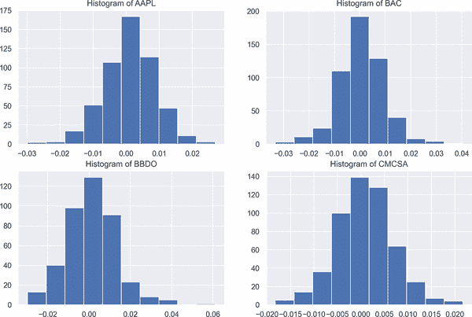
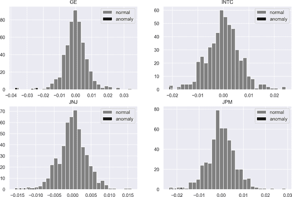

# 第九章：公司治理风险度量：股价崩盘

> 理解公司治理不仅启发了在富裕经济体中或许边缘改进的讨论，还可以在需要进行重大制度改变的地方激发主要的制度变革。
> 
> Shleifer 和 Vishny (1997)

您认为可以通过风险度量来评估公司治理的质量吗？根据最近的研究，答案是肯定的。公司治理与风险度量之间的联系已经通过*股价崩盘风险*建立起来，这被称为个别股票大幅下跌的风险。这种关联引发了该领域的大量研究。

发现股价崩盘的决定因素的重要性在于识别低（或高）质量公司治理的根本原因。识别这些根本原因有助于公司集中解决问题管理领域，增强公司的运行绩效并提升其声誉。这反过来降低了股价崩盘的风险，增加了公司的总收入。

股价崩盘为投资者和风险管理人员提供了关于公司*公司治理*强弱的信号。公司治理被定义为指导和控制公司的方式，以及公司是否或不是“促进公司公平性、透明度和责任性”（Wolfensohn 1999）的方式。

根据这一定义，公司治理有三大支柱：

公平

这一原则涉及对所有股东的平等待遇。

透明度

及时告知股东有关公司事件的任何信息称为*透明度*。这意味着与不愿向股东披露信息相对立的状态。

责任制

这与制定一个既公平、又平衡和可理解的行为准则相关，通过该准则向股东呈现公司位置的公平、平衡和可理解的评估。

责任制是控制*代理成本*的一种工具，代理成本是由股东和管理层的利益冲突所引起的成本。代理成本是信息不对称的另一个来源，因为管理者和股东拥有的信息量不同。当管理者和股东的利益发生分歧时，就会产生冲突。更确切地说，管理者一方面希望最大化自己的权力和财富。另一方面，股东则希望找到一种方法来最大化股东价值。这两个目标可能发生冲突，由于管理者信息上的优势，一些公司政策可能旨在增加管理者的权力和财富，损害股东利益。

因此，股价崩盘可能是有关企业治理质量的警告信号。例如，在信息不对称存在的情况下，代理理论表明外部利益相关者让管理者生成更不透明的财务报告以隐瞒不好的消息（Hutton、Marcus 和 Tehranian 2009）。这种现象的更近期解释被称为*自主披露*理论（Bae、Lim 和 Wei 2006）。根据这一理论，公司倾向于立即宣布好消息，但他们积累负面信息。当积累的负面信息达到临界点时，将引发大幅度下降。由于隐瞒公司的不好消息会阻止及时采取纠正措施，一旦积累的坏消息向市场发布，投资者将修正其未来预期，价格必然会突然下降，这被称为*崩盘风险*（Hutton、Marcus 和 Tehranian 2009 以及 Kim 2011）。

此外，不透明的财务报告与问责原则相关，导致管理者不愿透露不好的消息。这导致公司财务状况的不公平呈现，并进一步增加了未来股价崩盘的可能性（Bleck 和 Liu (2007)，Myers (2006)，以及 Kim 和 Zhang (2013)）。

因此，企业治理与股价崩盘之间的关联在各种方式中是显而易见的。在本章中，我们首先介绍股价度量，然后看看我们如何将这些度量应用于检测崩盘。

我们将首先从 Center for Research in Security Prices (CRSP) 和 Compustat 数据库获取一些数据，然后识别股价崩盘的主要决定因素。

###### 注意

CRSP 自 1960 年以来为学术研究和支持课堂教学提供数据。CRSP 在金融、经济和相关领域具有高质量的数据。欲了解更多信息，请参阅[CRSP 网站](https://oreil.ly/oO3X8)。

类似地，自 1962 年以来，Compustat 数据库提供了关于全球公司的财务、经济和市场信息。它是 S&P 全球市场情报的产品。欲了解更多信息，请参阅[Compustat 宣传册](https://oreil.ly/E4Hpj)。

# 股价崩盘度量方法

有关股价崩盘的文献正在增长，并且不同的崩盘度量方法由不同的研究人员采用。在介绍基于机器学习的崩盘度量方法之前，值得比较这些不同方法的利弊。

文献中使用的主要崩盘度量方法包括：

+   下至上波动 (DUVOL)

+   负偏度系数 (NCSKEW)

+   崩盘

DUVOL 是一种基于“下跌”和“上涨”周公司特定回报标准偏差的常见崩盘测量方法。下跌周是指公司特定周股票回报低于财年内每周回报的均值的周。相反，上涨周是指公司特定周股票回报高于财年内每周回报的均值的周。数学上描述为：

<math alttext="dollar-sign DUVOL equals log left-parenthesis StartFraction left-parenthesis n Subscript u minus 1 Baseline right-parenthesis sigma-summation Underscript down Endscripts upper R Subscript i t Superscript 2 Baseline Over left-parenthesis n Subscript d minus 1 Baseline right-parenthesis sigma-summation Underscript up Endscripts upper R Subscript i t Superscript 2 Baseline EndFraction right-parenthesis dollar-sign"><mrow><mtext>DUVOL</mtext> <mo>=</mo> <mo form="prefix">log</mo> <mo>(</mo> <mfrac><mrow><mrow><mo>(</mo><msub><mi>n</mi> <mrow><mi>u</mi><mo>-</mo><mn>1</mn></mrow></msub> <mo>)</mo></mrow><msub><mo>∑</mo> <mtext>down</mtext></msub> <msubsup><mi>R</mi> <mrow><mi>i</mi><mi>t</mi></mrow> <mn>2</mn></msubsup></mrow> <mrow><mrow><mo>(</mo><msub><mi>n</mi> <mrow><mi>d</mi><mo>-</mo><mn>1</mn></mrow></msub> <mo>)</mo></mrow><msub><mo>∑</mo> <mtext>up</mtext></msub> <msubsup><mi>R</mi> <mrow><mi>i</mi><mi>t</mi></mrow> <mn>2</mn></msubsup></mrow></mfrac> <mo>)</mo></mrow></math>

其中*n*是股票*i*在年度*t*的交易周数，<math alttext="n Subscript u"><msub><mi>n</mi> <mi>u</mi></msub></math>是上涨周数，而<math alttext="n Subscript d"><msub><mi>n</mi> <mi>d</mi></msub></math>则是下跌周数。在一年内，具有低于年度均值的公司特定回报的周被称为下跌周，而具有高于年度均值的公司特定回报的周被称为上涨周。

NCSKEW 通过取每日回报的第三阶负值，并将其除以（日回报标准差的样本模拟）的第三次幂来计算（Chen，Hong 和 Stein 2001）：

<math alttext="dollar-sign NCSKEW equals minus StartFraction left-parenthesis n left-parenthesis n minus 1 right-parenthesis Superscript 3 slash 2 Baseline sigma-summation upper R Subscript i t Superscript 3 Baseline right-parenthesis Over left-parenthesis left-parenthesis n minus 1 right-parenthesis left-parenthesis n minus 2 right-parenthesis left-parenthesis sigma-summation upper R Subscript i t Superscript 2 Baseline right-parenthesis Superscript 3 slash 2 Baseline right-parenthesis EndFraction dollar-sign"><mrow><mtext>NCSKEW</mtext> <mo>=</mo> <mo>-</mo> <mfrac><mrow><mo>(</mo><mi>n</mi><msup><mrow><mo>(</mo><mi>n</mi><mo>-</mo><mn>1</mn><mo>)</mo></mrow> <mrow><mn>3</mn><mo>/</mo><mn>2</mn></mrow></msup> <mo>∑</mo><msubsup><mi>R</mi> <mrow><mi>i</mi><mi>t</mi></mrow> <mn>3</mn></msubsup> <mo>)</mo></mrow> <mrow><mo>(</mo><mrow><mo>(</mo><mi>n</mi><mo>-</mo><mn>1</mn><mo>)</mo></mrow><mrow><mo>(</mo><mi>n</mi><mo>-</mo><mn>2</mn><mo>)</mo></mrow><msup><mrow><mo>(</mo><mo>∑</mo><msubsup><mi>R</mi> <mrow><mi>i</mi><mi>t</mi></mrow> <mn>2</mn></msubsup> <mo>)</mo></mrow> <mrow><mn>3</mn><mo>/</mo><mn>2</mn></mrow></msup> <mo>)</mo></mrow></mfrac></mrow></math>

NCSKEW 和 DUVOL 指标的值越高，崩盘风险越高。

另一方面，CRASH 测量是根据与公司特定周回报的距离计算的。也就是说，如果回报低于均值的 3.09 倍（有时为 3.2 倍），则 CRASH 取值为 1，否则为 0。

# **最小协方差行列式**

毫不奇怪，基于 ML 的算法引起了极大关注，因为它们攻击了基于规则的模型的弱点，并展现出良好的预测性能。因此，我们将尝试使用名为*最小协方差行列式*（MCD）的 ML 方法来估计股价崩盘风险。 MCD 是一种用于检测具有椭圆对称和单峰数据集中异常值的方法。使用 MCD 估计器检测股票回报中的异常值，并将其作为依赖变量用于逻辑面板回归，以探索崩盘风险的根本原因。

MCD 估计器提供了一种在检测异常值方面稳健且一致的方法。这很重要，因为异常值可能会对多变量分析产生巨大影响。正如 Finch（2012）总结的那样，多变量分析中的异常值可能会扭曲相关系数，导致偏倚估计。

MCD 的算法可以如下给出：

1.  基于数据检测初始的稳健聚类。

1.  为每个聚类计算均值向量<math alttext="upper M Superscript a"><msup><mi>M</mi> <mi>a</mi></msup></math>和正定¹协方差矩阵<math alttext="sigma-summation Overscript a Endscripts"><msup><mo>∑</mo> <mi>a</mi></msup></math>。

1.  计算每个聚类中每个观测的 MCD。

1.  将具有较小 MCD 的新观测分配给聚类。

1.  基于最小 MCD 选择一半的样本*h*，并计算从*h*得到的 <math alttext="upper M Superscript a"><msup><mi>M</mi> <mi>a</mi></msup></math> 和 <math alttext="sigma-summation Overscript a Endscripts"><msup><mo>∑</mo> <mi>a</mi></msup></math> 。

1.  重复步骤 2 到 5，直到*h*没有变化的余地。

1.  如果 <math alttext="c Subscript p Baseline equals StartRoot chi Subscript p comma 0.95 Superscript 2 Baseline EndRoot"><mrow><msub><mi>c</mi> <mi>p</mi></msub> <mo>=</mo> <msqrt><msubsup><mi>χ</mi> <mrow><mi>p</mi><mo>,</mo><mn>0</mn><mo>.</mo><mn>95</mn></mrow> <mn>2</mn></msubsup></msqrt></mrow></math> 小于 <math alttext="d squared"><msup><mi>d</mi> <mn>2</mn></msup></math> ，则检测异常值。

MCD 的优势在于其可解释性、可调性、低计算时间需求和鲁棒性：

可解释性

可解释性是模型背后算法能够解释的程度。MCD 假设数据呈椭圆分布，并且通过马哈拉诺比斯距离度量计算异常值。

###### 注意

马哈拉诺比斯距离是多变量设置中使用的距离度量。在各种距离度量中，马哈拉诺比斯以其能够检测异常值的能力脱颖而出，尽管它是一种计算昂贵的方法，因为它考虑了变量之间的相互关系结构。

数学上，马哈拉诺比斯距离的公式如下：

<math display="block"><mrow><msub><mi>d</mi> <mi>m</mi></msub> <mrow><mo>(</mo> <mi>x</mi> <mo>,</mo> <mi>μ</mi> <mo>)</mo></mrow> <mo>=</mo> <msqrt><mrow><msup><mrow><mo>(</mo><mi>x</mi><mo>-</mo><mi>μ</mi><mo>)</mo></mrow> <mi>T</mi></msup> <msup><mo>∑</mo> <mrow><mo>-</mo><mn>1</mn></mrow></msup> <mrow><mo>(</mo> <mi>x</mi> <mo>-</mo> <mi>μ</mi> <mo>)</mo></mrow></mrow></msqrt> <mo>.</mo></mrow></math>

其中 <math alttext="mu equals double-struck upper E left-parenthesis upper X right-parenthesis"><mrow><mi>μ</mi> <mo>=</mo> <mi>𝔼</mi> <mo>(</mo> <mi>X</mi> <mo>)</mo></mrow></math> ， <math alttext="sigma-summation"><mo>∑</mo></math> 是协方差矩阵，*X* 是一个向量。

可调性

可调性强调具有数据依赖模型的重要性，允许其在一致基础上进行校准，以便捕捉结构变化。

低计算时间

这指的是快速计算协方差矩阵并避免使用整个样本。相反，MCD 使用一半的样本，其中不包括异常值，以确保异常观测不会使 MCD 的位置或形状偏差。

鲁棒性

在 MCD 中使用一半的样本也确保了其鲁棒性，因为这意味着在污染下模型是一致的（Hubert et al. 2018）。

现在我们将应用 MCD 方法来检测股票收益中的异常值，并将结果用作因变量。因此，如果股价崩盘，因变量取值为 1，否则为 0。

从经验的角度来看，在 Python 中有一个内置库可以运行这个算法，即*椭圆包络*，我们将利用它。

# 应用最小协方差确定法

至此，我们已经讨论了股价崩盘检测的理论背景。从这一点出发，我们将集中精力在实证部分，并看看如何将理论应用到实践中。在这个过程中，我们不会仅仅关注股价崩盘检测。在提出基于机器学习的股价崩盘检测方法后，我们将深入研究崩盘的根本原因。为了做到这一点，鉴于大量的文献，我们将使用多个变量来观察它们如何以及在多大程度上影响股价崩盘的发生。因此，本章的目标是双重的：检测股价崩盘和识别崩盘的根本原因。请记住，关于股价崩盘检测及影响其崩盘的变量有许多不同且竞争的观点。

在这个分析中，我们将使用以下公司的股票和资产负债表信息：

| 苹果 | AT&T | 巴西银行 | 美国银行 |
| --- | --- | --- | --- |
| CISCO | 可口可乐 | 康卡斯特 | 杜邦公司 |
| 埃克森美孚公司 | Facebook | 福特汽车 | 通用电气 |
| 英特尔公司 | 强生公司 | 摩根大通 | 默克公司 |
| 微软 | Motus GI Holdings Inc. | 甲骨文公司 | 辉瑞公司 |
| 宝洁公司 | Sherritt International Corp. | Sirius XM Holdings Inc. | Trisura Group Ltd. |
| 瑞士银行 | 威瑞森 | 沃尔玛 | 富国银行公司 |

要继续，我们需要计算每周特定公司的回报率，但我们的数据是日常的，所以让我们开始并进行必要的编码：

```py
In [1]: import pandas as pd
        import matplotlib.pyplot as plt
        import numpy as np
        import seaborn as sns; sns.set()
        pd.set_option('use_inf_as_na', True)
        import warnings
        warnings.filterwarnings('ignore')

In [2]: crash_data = pd.read_csv('crash_data.csv')

In [3]: crash_data.head()
Out[3]: Unnamed: 0       RET      date TICKER    vwretx  BIDLO   ASKHI    PRC  \
        0    27882462  0.041833  20100104    BAC  0.017045  15.12  15.750  15.69

        1    27882463  0.032505  20100105    BAC  0.003362  15.70  16.210  16.20

        2    27882464  0.011728  20100106    BAC  0.001769  16.03  16.540  16.39

        3    27882465  0.032947  20100107    BAC  0.002821  16.51  17.185  16.93

        4    27882466 -0.008860  20100108    BAC  0.004161  16.63  17.100  16.78

                   VOL

        0  180845100.0

        1  209521200.0

        2  205257900.0

        3  320868400.0

        4  220104600.0

In [4]: crash_data.date = pd.to_datetime(crash_data.date, format='%Y%m%d') 
        crash_data = crash_data.set_index('date') 
```


将日期列转换为适当的日期格式


将日期设置为索引

作为提醒，我们使用的数据已从 CRSP 和 Compustat 收集。表 9-1 提供了数据的简要说明。

表 9-1\. 属性和解释

| 属性 | 解释 |
| --- | --- |
| `RET` | 股票回报率 |
| `vwretx` | 成交量加权回报 |
| `BIDLO` | 最低竞价价格 |
| `ASKHI` | 最高出价价格 |
| `PRC` | 交易价格 |
| `VOL` | 交易量 |

给定这些数据，让我们计算每周的平均回报，并使用前四只股票生成图 9-1。为了进行这些计算，我们还将计算其他变量的每周平均值，因为在接下来的过程中我们将使用它们：

```py
In [5]: crash_dataw = crash_data.groupby('TICKER').resample('W').\
                      agg({'RET':'mean', 'vwretx':'mean', 'VOL':'mean',
                           'BIDLO':'mean', 'ASKHI':'mean', 'PRC':'mean'}) 

In [6]: crash_dataw = crash_dataw.reset_index()
        crash_dataw.dropna(inplace=True)
        stocks = crash_dataw.TICKER.unique()

In [7]: plt.figure(figsize=(12, 8))
        k = 1

        for i in stocks[: 4]: 
            plt.subplot(2, 2, k)
            plt.hist(crash_dataw[crash_dataw.TICKER == i]['RET'])
            plt.title('Histogram of '+i)
            k+=1
        plt.show()
```


计算每股周回报率以及其他变量


选择前四只股票

图 9-1 显示了我们的前四只股票，即苹果、美国银行、巴西银行和康卡斯特的直方图。如预期的那样，分布似乎是正态的，但我们现在有了一般来说显示过渡峰度分布的回报率。



###### 图 9-1。返回直方图

接下来，我们计算返回以排除市场影响，这被称为*公司特定收益*。 为了计算公司特定的周收益，我们根据以下方程进行线性回归：

<math alttext="r Subscript j comma t Baseline equals alpha 0 plus beta 1 r Subscript m comma t minus 2 Baseline plus beta 2 r Subscript m comma t minus 1 Baseline plus beta 3 r Subscript m comma t Baseline plus beta 4 r Subscript m comma t plus 1 Baseline plus beta 5 r Subscript m comma t plus 2 Baseline plus epsilon Subscript j comma t" display="block"><mrow><msub><mi>r</mi> <mrow><mi>j</mi><mo>,</mo><mi>t</mi></mrow></msub> <mo>=</mo> <msub><mi>α</mi> <mn>0</mn></msub> <mo>+</mo> <msub><mi>β</mi> <mn>1</mn></msub> <msub><mi>r</mi> <mrow><mi>m</mi><mo>,</mo><mi>t</mi><mo>-</mo><mn>2</mn></mrow></msub> <mo>+</mo> <msub><mi>β</mi> <mn>2</mn></msub> <msub><mi>r</mi> <mrow><mi>m</mi><mo>,</mo><mi>t</mi><mo>-</mo><mn>1</mn></mrow></msub> <mo>+</mo> <msub><mi>β</mi> <mn>3</mn></msub> <msub><mi>r</mi> <mrow><mi>m</mi><mo>,</mo><mi>t</mi></mrow></msub> <mo>+</mo> <msub><mi>β</mi> <mn>4</mn></msub> <msub><mi>r</mi> <mrow><mi>m</mi><mo>,</mo><mi>t</mi><mo>+</mo><mn>1</mn></mrow></msub> <mo>+</mo> <msub><mi>β</mi> <mn>5</mn></msub> <msub><mi>r</mi> <mrow><mi>m</mi><mo>,</mo><mi>t</mi><mo>+</mo><mn>2</mn></mrow></msub> <mo>+</mo> <msub><mi>ϵ</mi> <mrow><mi>j</mi><mo>,</mo><mi>t</mi></mrow></msub></mrow></math>

其中<math alttext="r Subscript j comma t"><msub><mi>r</mi> <mrow><mi>j</mi><mo>,</mo><mi>t</mi></mrow></msub></math>是第 *j* 家公司在第 *t* 周的回报，<math alttext="r Subscript m"><msub><mi>r</mi> <mi>m</mi></msub></math> ， *t* 是第 *t* 周 CRSP 市场回报的加权值。通过 1 + 对数来缩放这个回归的残差，提供了公司特定的回报。

根据扩展的市场模型，可以计算出公司特定的周收益，如下所示：<math alttext="upper W Subscript i comma t Baseline equals l n left-parenthesis 1 plus epsilon Subscript i comma t Baseline right-parenthesis"><mrow><msub><mi>W</mi> <mrow><mi>i</mi><mo>,</mo><mi>t</mi></mrow></msub> <mo>=</mo> <mi>l</mi> <mi>n</mi> <mrow><mo>(</mo> <mn>1</mn> <mo>+</mo> <msub><mi>ϵ</mi> <mrow><mi>i</mi><mo>,</mo><mi>t</mi></mrow></msub> <mo>)</mo></mrow></mrow></math> (Kim, Li, and Zhang 2011):

```py
In [8]: import statsmodels.api as sm
        residuals = []

        for i in stocks:
            Y = crash_dataw.loc[crash_dataw['TICKER'] == i]['RET'].values
            X = crash_dataw.loc[crash_dataw['TICKER'] == i]['vwretx'].values
            X = sm.add_constant(X)
            ols = sm.OLS(Y[2:-2], X[2:-2] + X[1:-3] + X[0:-4] + \
                         X[3:-1] + X[4:]).fit() 
            residuals.append(ols.resid)

In [9]: residuals = list(map(lambda x: np.log(1 + x), residuals)) 

In [10]: crash_data_sliced = pd.DataFrame([])
         for i in stocks:
             crash_data_sliced = crash_data_sliced.\
                                 append(crash_dataw.loc[crash_dataw.TICKER == i]
                                        [2:-2]) 
         crash_data_sliced.head()
Out[10]: TICKER       date       RET    vwretx          VOL       BIDLO
          ASKHI  \
         2   AAPL 2010-01-24 -0.009510 -0.009480  25930885.00  205.277505
          212.888450
         3   AAPL 2010-01-31 -0.005426 -0.003738  52020594.00  198.250202
          207.338002
         4   AAPL 2010-02-07  0.003722 -0.001463  26953208.40  192.304004
          197.378002
         5   AAPL 2010-02-14  0.005031  0.002970  19731018.60  194.513998
          198.674002
         6   AAPL 2010-02-21  0.001640  0.007700  16618997.25  201.102500
          203.772500

                   PRC

         2  208.146752

         3  201.650398

         4  195.466002

         5  196.895200

         6  202.636995
```


按预定义的方程进行线性回归


计算残差的 1 + 对数


删除前两个和最后两个观察值以与以前的数据对齐

在所有这些准备工作之后，我们准备运行椭圆信封以检测崩盘。

只识别了两个参数：`support_fraction` 和 `contamination`。前者参数用于控制要包含在原始 MCD 估计支持中的点的比例，而后者用于确定数据集中异常值的比例：

```py
In [11]: from sklearn.covariance import EllipticEnvelope
         envelope = EllipticEnvelope(contamination=0.02, support_fraction=1) 
         ee_predictions = {}

         for i, j in zip(range(len(stocks)), stocks):
             envelope.fit(np.array(residuals[i]).reshape(-1, 1))
             ee_predictions[j] = envelope.predict(np.array(residuals[i])
                                                  .reshape(-1, 1)) 

In [12]: transform = []

         for i in stocks:
             for j in range(len(ee_predictions[i])):
                 transform.append(np.where(ee_predictions[i][j] == 1, 0, -1)) 

In [13]: crash_data_sliced = crash_data_sliced.reset_index()
         crash_data_sliced['residuals'] = np.concatenate(residuals) 
         crash_data_sliced['neg_outliers'] = np.where((np.array(transform)) \
                                                        == -1, 1, 0) 
         crash_data_sliced.loc[(crash_data_sliced.neg_outliers == 1) &
                               (crash_data_sliced.residuals > 0),
                               'neg_outliers'] = 0 
```


使用`contamination`和`support_fraction`分别为 2 和 1 运行椭圆信封


预测崩溃


将崩溃转换为所需形式


获得一个一维的`numpy`数组以在数据框中创建一个新列


对崩溃进行最终转换，命名为`neg_outliers`


摆脱分布的正侧（即右尾）的崩溃

以下代码块用于可视化算法是否正确捕获了崩盘。在此分析中，使用了通用汽车、英特尔、强生和摩根大通。如下图所示，该算法运行良好，并且识别出了分布的负面（显示为黑色条形）崩盘：

```py
In [14]: plt.figure(figsize=(12, 8))
         k = 1

         for i in stocks[8:12]:
             plt.subplot(2, 2, k)
             crash_data_sliced['residuals'][crash_data_sliced.TICKER == i]\
             .hist(label='normal', bins=30, color='gray')
             outliers = crash_data_sliced['residuals']
             [(crash_data_sliced.TICKER == i) &
              (crash_data_sliced.neg_outliers > 0)]
             outliers.hist(color='black', label='anomaly')
             plt.title(i)
             plt.legend()
             k += 1
         plt.show()
```



###### 图 9-2\. 异常直方图

从这一点开始，我们将使用两个不同的数据集，因为在这个分析中需要资产负债表信息。因此，我们将我们的周数据转换为年度数据，以便将此数据与资产负债表信息（包括年度信息）合并。此外，计算崩盘风险，即股价崩盘风险的年度平均值和标准差也是必要的：

```py
In [15]: crash_data_sliced = crash_data_sliced.set_index('date')
         crash_data_sliced.index = pd.to_datetime(crash_data_sliced.index)

In [16]: std = crash_data.groupby('TICKER')['RET'].resample('W').std()\
               .reset_index()
         crash_dataw['std'] = pd.DataFrame(std['RET']) 

In [17]: yearly_data = crash_data_sliced.groupby('TICKER')['residuals']\
                       .resample('Y').agg({'residuals':{'mean', 'std'}})\
                       .reset_index()
         yearly_data.columns = ['TICKER', 'date', 'mean', 'std']
         yearly_data.head()
Out[17]:   TICKER       date      mean       std
         0   AAPL 2010-12-31  0.000686  0.008291
         1   AAPL 2011-12-31  0.000431  0.009088
         2   AAPL 2012-12-31 -0.000079  0.008056
         3   AAPL 2013-12-31 -0.001019  0.009096
         4   AAPL 2014-12-31  0.000468  0.006174

In [18]: merge_crash = pd.merge(crash_data_sliced.reset_index(), yearly_data,
                                how='outer', on=['TICKER', 'date']) 

In [19]: merge_crash[['annual_mean', 'annual_std']] = merge_crash\
                                                      .sort_values(by=['TICKER',
                                                                       'date'])\
                                                      .iloc[:, -2:]\
                                                      .fillna(method='bfill') 
         merge_crash['residuals'] = merge_crash.sort_values(by=['TICKER',
                                                                'date'])\
                                                               ['residuals']\
                                                      .fillna(method='ffill') 
         merge_crash = merge_crash.drop(merge_crash.iloc[: ,-4:-2], axis=1) 
```


对数据进行重采样以计算回报的平均值和标准差


根据`Ticker`和`date`基于`yearly_data`和`crash_data_sliced`合并


对年度数据进行向后填充


删除列以防止混淆

在文献中，最广泛使用的股价崩盘测量之一是崩盘风险，因为它具有离散型，使其成为比较目的的便利工具。

现在让我们用 Python 生成崩盘风险。我们将使用前一段生成的`merge_crash`数据。考虑到崩盘风险的公式，我们检查周回报是否低于平均值的 3.09 个标准差。如果是，标记为 1，表示崩盘，否则标记为 0。结果将显示，13502 个观察中有 44 次崩盘。

在最后一个块（`In [22]`）中，崩盘风险度量是年度化的，以便我们能够将其包含在我们的最终数据中：

```py
In [20]: crash_risk_out = []

         for j in stocks:
             for k in range(len(merge_crash[merge_crash.TICKER == j])):
                 if merge_crash[merge_crash.TICKER == j]['residuals'].iloc[k] < \
                 merge_crash[merge_crash.TICKER == j]['annual_mean'].iloc[k] - \
                 3.09 * \
                 merge_crash[merge_crash.TICKER == j]['annual_std'].iloc[k]:
                     crash_risk_out.append(1)
                 else:
                     crash_risk_out.append(0)

In [21]: merge_crash['crash_risk'] = crash_risk_out
         merge_crash['crash_risk'].value_counts()
Out[21]: 0    13476
         1       44
         Name: crash_risk, dtype: int64

In [22]: merge_crash = merge_crash.set_index('date')
         merge_crash_annual = merge_crash.groupby('TICKER')\
                              .resample('1Y')['crash_risk'].sum().reset_index()
```

如果您像我们在这里所做的那样使用多只股票，计算 DUVOL 和 NCSKEW 并不是一件容易的事情。第一步是确定下跌和上涨周。提醒一下，下跌（或上涨）周是指周回报小于（或大于）年回报的周。在以下代码块的最后部分，我们计算了计算 DUVOL 和 NCSKEW 崩盘测量所需的必要因素，例如下跌周的平方残差：

```py
In [23]: down = []

         for j in range(len(merge_crash)):
             if merge_crash['residuals'].iloc[j] < \
                merge_crash['annual_mean'].iloc[j]:
                 down.append(1) 
             else:
                 down.append(0) 

In [24]: merge_crash = merge_crash.reset_index()
         merge_crash['down'] = pd.DataFrame(down)
         merge_crash['up'] = 1 - merge_crash['down']
         down_residuals = merge_crash[merge_crash.down == 1]\
                          [['residuals', 'TICKER', 'date']] 
         up_residuals = merge_crash[merge_crash.up == 1]\
                        [['residuals', 'TICKER', 'date']] 

In [25]: down_residuals['residuals_down_sq'] = down_residuals['residuals'] ** 2
         down_residuals['residuals_down_cubic'] = down_residuals['residuals'] **3
         up_residuals['residuals_up_sq'] = up_residuals['residuals'] ** 2
         up_residuals['residuals_up_cubic'] = up_residuals['residuals'] ** 3
         down_residuals['down_residuals'] = down_residuals['residuals']
         up_residuals['up_residuals'] = up_residuals['residuals']
         del down_residuals['residuals']
         del up_residuals['residuals']

In [26]: merge_crash['residuals_sq'] = merge_crash['residuals'] ** 2
         merge_crash['residuals_cubic'] = merge_crash['residuals'] ** 3
```


如果条件返回真，则将 1 添加到`down`列表中


如果条件返回真，则将 0 添加到`down`列表中


创建一个名为`down_residuals`的新变量，包括下跌周


创建一个名为`up_residuals`的新变量，包括上升周

下一步是将`down_residuals`和`up_residuals`与`merge_crash`合并。然后，我们指定并年化我们想要检查的所有变量，以确定哪些变量在解释股价崩盘方面最重要：

```py
In [27]: merge_crash_all = merge_crash.merge(down_residuals,
                                             on=['TICKER', 'date'],
                                             how='outer')
         merge_crash_all = merge_crash_all.merge(up_residuals,
                                                 on=['TICKER', 'date'],
                                                 how='outer')

In [28]: cols = ['BIDLO', 'ASKHI', 'residuals',
                 'annual_std', 'residuals_sq', 'residuals_cubic',
                 'down', 'up', 'residuals_up_sq', 'residuals_down_sq',
                 'neg_outliers']
         merge_crash_all = merge_crash_all.set_index('date')
         merge_grouped = merge_crash_all.groupby('TICKER')[cols]\
                         .resample('1Y').sum().reset_index() 
         merge_grouped['neg_outliers'] = np.where(merge_grouped.neg_outliers >=
                                                  1, 1, 0) 
```


指定和年化感兴趣的变量


转换大于 1 的负离群观察，如果有的话

还有两个重要的问题有待解答：我们有多少下周和上周，以及它们的总和是多少？这些问题很重要，因为上下周的数量分别对应 DUVOL 公式中的<math alttext="n Subscript u"><msub><mi>n</mi> <mi>u</mi></msub></math>和<math alttext="n Subscript d"><msub><mi>n</mi> <mi>d</mi></msub></math>。所以让我们来做这个计算：

```py
In [29]: merge_grouped = merge_grouped.set_index('date')
         merge_all = merge_grouped.groupby('TICKER')\
                     .resample('1Y').agg({'down':['sum', 'count'],
                                          'up':['sum', 'count']})\
                     .reset_index() 
         merge_all.head()

Out[29]:   TICKER       date down        up
                              sum count sum count
         0   AAPL 2010-12-31   27     1  23     1
         1   AAPL 2011-12-31   26     1  27     1
         2   AAPL 2012-12-31   28     1  26     1
         3   AAPL 2013-12-31   24     1  29     1
         4   AAPL 2014-12-31   22     1  31     1

In [30]: merge_grouped['down'] = merge_all['down']['sum'].values
         merge_grouped['up'] = merge_all['up']['sum'].values
         merge_grouped['count'] = merge_grouped['down'] + merge_grouped['up']
```


计算上周和下周的年化总和及数量

最后，我们准备使用到目前为止获得的所有输入来计算 DUVOL 和 NCSKEW：

```py
In [31]: merge_grouped = merge_grouped.reset_index()

In [32]: merge_grouped['duvol'] = np.log(((merge_grouped['up'] - 1) *
                                          merge_grouped['residuals_down_sq']) /
                                         ((merge_grouped['down'] - 1) *
                                          merge_grouped['residuals_up_sq'])) 

In [33]: merge_grouped['duvol'].mean()
Out[33]: -0.023371498758114867

In [34]: merge_grouped['ncskew'] = - (((merge_grouped['count'] *
                                        (merge_grouped['count'] - 1) **
                                        (3 / 2)) *
                                      merge_grouped['residuals_cubic']) /
                                      (((merge_grouped['count'] - 1) *
                                        (merge_grouped['count'] - 2)) *
                                       merge_grouped['residuals_sq'] **
                                       (3 / 2))) 

In [35]: merge_grouped['ncskew'].mean()
Out[35]: -0.031025284134663118

In [36]: merge_grouped['crash_risk'] = merge_crash_annual['crash_risk']
         merge_grouped['crash_risk'] = np.where(merge_grouped.crash_risk >=
                                                1, 1, 0)

In [37]: merge_crash_all_grouped2 = merge_crash_all.groupby('TICKER')\
                                     [['VOL', 'PRC']]\
                                    .resample('1Y').mean().reset_index()
         merge_grouped[['VOL', 'PRC']] = merge_crash_all_grouped2[['VOL', 'PRC']]

         merge_grouped[['ncskew','duvol']].corr()
```


计算 DUVOL


计算 NCSKEW

DUVOL 表示回报量的年均值以下部分与年均值以上部分的比例。因此，较高的 DUVOL 意味着左偏分布或更高的崩盘概率。考虑到 DUVOL 的平均值为-0.0233，我们可以得出结论，股票在指定期间内不太可能崩盘。

另一方面，NCSKEW 比较尾部的形状——即左尾比右尾更长时，股票价格往往会崩盘。预期地，NCSKEW 与 DUVOL 之间的相关性很高，确认了虽然两个测量方法通过不同方式获取相同的信息。

# 逻辑面板应用

由于我们正在寻找能够解释股价崩盘风险的变量，本节提供了骨干分析。由于数据中既有股票又有时间序列，面板数据分析是一种合适的分析技术。

至少有三个因素促成了面板数据研究的几何增长（Hsiao 2014）：

1.  数据可用性

1.  模型人类行为复杂性的能力，要比单一横截面或时间序列数据更强。

1.  其挑战性的方法论

简而言之，面板数据分析结合了时间序列和横截面数据，因此比单独使用时间序列和横截面分析具有更多优势。Ullah（1998）总结了这些优势：

> 明显的好处是数据集更大，变量之间的变异性更大，且共线性较低，这比典型的横截面或时间序列数据要好得多。借助更多、更具信息量的数据，可以获得更可靠的估计，并在更少限制的假设下测试更复杂的行为模型。面板数据集的另一个优点是它们能够控制个体异质性……特别是，面板数据集更能研究动态行为的复杂问题。

由于我们的数据是离散类型的，逻辑面板应用程序满足了这一需求。然而，面板数据分析的库较少，而逻辑面板应用更是如此。我们将使用的库是 Python 计量经济学模型模块（`pyeconometrics`），它有一些高级模型，包括：

+   固定效应逻辑回归（Logit）

+   随机效应逻辑回归（Logit 和 Probit）

+   Tobit I（截断数据的线性回归）

###### 注意

一个潜在的内生性问题是时间不变的遗漏变量，这需要考虑。为了控制这一点，我们将使用固定效应逻辑面板模型。

要运行逻辑面板应用程序，使用 `pyeconometrics` 模块，但安装此库的方式有些不同。请访问其 [GitHub 仓库](https://oreil.ly/cxATG) 获取更多信息。

###### 警告

安装 `pyeconometrics` 与我们使用的一些库和模块的安装方式有些不同。为了确保你正确安装该库，请访问其 [GitHub 仓库](https://oreil.ly/Ap8NO)。

现在让我们介绍在本分析中将使用的变量。在获取股票价格崩盘度量后，是时候讨论哪些变量在估计股票价格崩盘风险时是重要的了。表 9-2 列出了自变量。

表 9-2。用于股票价格崩盘分析的自变量

| 变量 | 解释 |
| --- | --- |
| 规模（`log_size`） | 公司拥有的总资产的对数。 |
| 应收账款（`rect`） | 应收账款/债务人。 |
| 房产、厂房和设备（`ppegt`） | 总房产、厂房和设备。 |
| 平   | 平均周转率（`dturn`） | 当年的平均月周转率减去上一年的平均月周转率。周转率是月交易量除以总流通股数。 |
| NCSKEW（`ncskew`） | 公司特定周收益的负偏度系数，是公司特定周收益的三阶矩除以三次标准差的负数。 |
| 公司特定收益（`residuals`） | 当年公司特定周收益的平均值。 |
| 总资产回报率（`RoA`） | 当年资产回报率，即净利润与总资产的比率。 |
| 标准差（`annual_std`） | 当年公司特定周收益的标准差。 |
| 公司特定情绪 (`firm_sent`) | 通过 PCA 获得的公司特定投资者情绪测量。 |

回报资产和杠杆变量是通过资产负债表数据计算的：

```py
In [38]: bs = pd.read_csv('bs_v.3.csv')
         bs['Date'] = pd.to_datetime(bs.datadate, format='%Y%m%d')
         bs['annual_date'] = bs['Date'].dt.year

In [39]: bs['RoA'] = bs['ni'] / bs['at']
         bs['leverage'] = bs['lt'] / bs['at']

In [40]: merge_grouped['annual_date'] = merge_grouped['date'].dt.year
         bs['TICKER'] = bs.tic
         del bs['tic']
```

下一步是获取剩余变量，合并资产负债表数据（`bs`）和股票相关数据（`merge_crash_all_grouped`）：

```py
In [41]: merge_ret_bs = pd.merge(bs, merge_grouped,
                                 on=['TICKER', 'annual_date'])

In [42]: merge_ret_bs2 = merge_ret_bs.set_index('Date')
         merge_ret_bs2 = merge_ret_bs2.groupby('TICKER').resample('Y').mean()
         merge_ret_bs2.reset_index(inplace=True)

In [43]: merge_ret_bs2['vol_csho_diff'] = (merge_ret_bs2.groupby('TICKER')
                                           ['VOL'].shift(-1) /
                                           merge_ret_bs2.groupby('TICKER')
                                           ['csho'].shift(-1))
         merge_ret_bs2['dturn1'] = merge_ret_bs2['VOL'] / merge_ret_bs2['csho']
         merge_ret_bs2['dturn'] = merge_ret_bs2['vol_csho_diff'] - \
                                  merge_ret_bs2['dturn1']

In [44]: merge_ret_bs2['p/e'] = merge_ret_bs2['PRC'] / merge_ret_bs2['ni']
         merge_ret_bs2['turnover_rate'] = merge_ret_bs2['VOL'] / \
                                          merge_ret_bs2['csho']
         merge_ret_bs2['equity_share'] = merge_ret_bs2['ceq'] / \
                                         (merge_ret_bs2['ceq'] +
                                          merge_ret_bs2['dt'])
         merge_ret_bs2['firm_size'] = np.log(merge_ret_bs2['at'])
         merge_ret_bs2['cefd'] = (((merge_ret_bs2['at'] -
                                  merge_ret_bs2['lt']) / merge_ret_bs2['csho']) -
                                  merge_ret_bs2['PRC']) / (merge_ret_bs2['at'] -
                                  merge_ret_bs2['lt']) / merge_ret_bs2['csho']

In [45]: merge_ret_bs2 = merge_ret_bs2.set_index('Date')
         merge_ret_bs2['buying_volume'] = merge_ret_bs2['VOL'] * \
                                          (merge_ret_bs2['PRC'] -
                                           merge_ret_bs2['BIDLO']) / \
                                          (merge_ret_bs2['ASKHI'] -
                                           merge_ret_bs2['BIDLO'])
         merge_ret_bs2['selling_volume'] = merge_ret_bs2['VOL'] * \
                                           (merge_ret_bs2['ASKHI'] -
                                            merge_ret_bs2['PRC']) / \
                                           (merge_ret_bs2['ASKHI'] -
                                            merge_ret_bs2['BIDLO'])
         buying_volume = merge_ret_bs2.groupby('TICKER')['buying_volume'] \
                         .resample('Y').sum().reset_index()
         selling_volume = merge_ret_bs2.groupby('TICKER')['selling_volume'] \
                         .resample('Y').sum().reset_index()
         del buying_volume['TICKER']
         del buying_volume['Date']

In [46]: buy_sel_vol = pd.concat([buying_volume,selling_volume], axis=1)
         buy_sel_vol['bsi'] = (buy_sel_vol.buying_volume -
                               buy_sel_vol.selling_volume) / \
                              (buy_sel_vol.buying_volume +
                               buy_sel_vol.selling_volume)

In [47]: merge_ret_bs2 = merge_ret_bs2.reset_index()
         merge_ret_bs2 = pd.merge(buy_sel_vol ,merge_ret_bs2,
                                  on=['TICKER', 'Date'])
```

除了公司特定情绪外，其余变量在解释股价暴跌风险方面广泛使用且非常有用。

推导出一个指数并将其用作代理在研究人员中非常流行，当难以找到合适的变量来代表一个现象时。例如，假设您认为公司特定情绪是一个包含关于股价暴跌非常有力见解的变量，但如何提出一个代表公司特定情绪的变量？为了解决这个问题，我们可以考虑所有与公司特定情绪有关的变量，然后识别关系，使用主成分分析创建一个指数。这正是我们将要做的事情。

尽管股价暴跌风险的一些众所周知的决定因素，一个被认为被忽视的重要方面是公司特定投资者情绪。可以直观地说，根据投资者对公司的看法，股价可能上涨或下跌。也就是说，如果投资者倾向于对个别股票感到乐观，他们很可能会购买该资产，从而推动股价上涨或下跌（尹和田，2017 年）。

在这方面，市盈率（P/E）、周转率（TURN）、股权份额（EQS）、封闭式基金折价（CEFD）、杠杆（LEV）、买卖量（BSI）用于识别公司特定情绪。这些变量的解释详见表格 9-3。

表格 9-3\. 用于公司特定情绪的变量

| 变量 | 解释 |
| --- | --- |
| 市盈率 (`p/e`) | 每股市值 / 每股收益 |
| 周转率 (`turnover_rate`) | 总交易股数 / 平均流通股数 |
| 股权份额 (`equity_share`) | 普通股 |
| 封闭式基金折价 (`cefd`) | 通过首次公开发行筹集固定金额的资产 |
| 杠杆 (`leverage`) | 长期负债总额和流动负债总额之和 / 总资产 |
| 买卖量 (`bsi`) | 买入（卖出）量是与买入（卖出）交易相关的股份数量 |

要正确捕捉公司特定情绪，我们需要尽可能多地提取信息，而 PCA 是一种方便的工具来完成这项任务：

```py
In [48]: from sklearn.preprocessing import StandardScaler
         from sklearn.decomposition import PCA

In [49]: firm_sentiment = merge_ret_bs2[['p/e', 'turnover_rate',
                                         'equity_share', 'cefd',
                                         'leverage', 'bsi']]
         firm_sentiment = firm_sentiment.apply(lambda x: x.fillna(x.mean()),
                                               axis=0) 

In [50]: firm_sentiment_std = StandardScaler().fit_transform(firm_sentiment)
         pca = PCA(n_components=6)
         pca_market_sentiment = pca.fit_transform(firm_sentiment_std)
         print('Explained Variance Ratios per Component are:\n {}'\
               .format(pca.explained_variance_ratio_))
         Explained Variance Ratios per Component are:
          [0.35828322 0.2752777  0.15343653 0.12206041 0.06681776 0.02412438]

In [51]: loadings_1 = pd.DataFrame(pca.components_.T *
                                   np.sqrt(pca.explained_variance_),
                                   columns=['PC1', 'PC2', 'PC3',
                                            'PC4', 'PC5', 'PC6'],
                                   index=firm_sentiment.columns) 
         loadings_1
Out[51]: PC1       PC2       PC3       PC4       PC5       PC6
         p/e           -0.250786  0.326182  0.911665  0.056323  0.000583
          0.021730
         turnover_rate -0.101554  0.854432 -0.197381  0.201749  0.428911
          -0.008421
         equity_share  -0.913620 -0.162406 -0.133783  0.224513 -0.031672
          0.271443
         cefd           0.639570 -0.118671  0.038422  0.754467 -0.100176
          0.014146
         leverage       0.917298  0.098311  0.068633 -0.264369  0.089224
          0.265335
         bsi            0.006731  0.878526 -0.173740 -0.044127 -0.446735
          0.022520

In [52]: df_loading1 = pd.DataFrame(loadings_1.mean(axis=1)) 
         df_loading1
Out[52]:                       0
         p/e            0.177616
         turnover_rate  0.196289
         equity_share  -0.124254
         cefd           0.204626
         leverage       0.195739
         bsi            0.040529

In [53]: firm_sentiment = pd.DataFrame(np.dot(pca_market_sentiment,
                                              np.array(df_loading1)))
         merge_ret_bs2['firm_sent'] = firm_sentiment
```


用均值填充缺失值


计算载荷


取负载的横截面平均值

在获得了特征的负载之后，横截面平均分量的结果如下：

<math alttext="SENT i comma t equals 0.177 upper P slash upper E Subscript i comma t Baseline plus 0.196 TURN Subscript i comma t Baseline minus 0.124 EQS Subscript i comma t Baseline plus 0.204 CEFD Subscript i comma t Baseline plus 0.195 LEV Subscript i comma t Baseline plus 0.040 BSI Subscript i comma t Baseline" display="block"><mrow><mtext>SENT</mtext> <mrow><mi>i</mi> <mo>,</mo> <mi>t</mi></mrow> <mo>=</mo> <mn>0</mn> <mo>.</mo> <mn>177</mn> <msub><mtext>P/E</mtext> <mrow><mi>i</mi><mo>,</mo><mi>t</mi></mrow></msub> <mo>+</mo> <mn>0</mn> <mo>.</mo> <mn>196</mn> <msub><mtext>TURN</mtext> <mrow><mi>i</mi><mo>,</mo><mi>t</mi></mrow></msub> <mo>-</mo> <mn>0</mn> <mo>.</mo> <mn>124</mn> <msub><mtext>EQS</mtext> <mrow><mi>i</mi><mo>,</mo><mi>t</mi></mrow></msub> <mo>+</mo> <mn>0</mn> <mo>.</mo> <mn>204</mn> <msub><mtext>CEFD</mtext> <mrow><mi>i</mi><mo>,</mo><mi>t</mi></mrow></msub> <mo>+</mo> <mn>0</mn> <mo>.</mo> <mn>195</mn> <msub><mtext>LEV</mtext> <mrow><mi>i</mi><mo>,</mo><mi>t</mi></mrow></msub> <mo>+</mo> <mn>0</mn> <mo>.</mo> <mn>040</mn> <msub><mtext>BSI</mtext> <mrow><mi>i</mi><mo>,</mo><mi>t</mi></mrow></msub></mrow></math>

结果表明，除了股权份额外，公司特定情绪受到所有变量的正面影响。此外，杠杆和周转率对公司特定情绪的影响最大。

我们还有一步要走：解释逻辑面板数据分析。在此之前，应定义自变量和因变量，并使用必要的库来完成：

```py
In [54]: merge_ret_bs2['log_size'] = np.log(merge_ret_bs2['at'])

In [55]: merge_ret_bs2.set_index(['TICKER', 'Date'], inplace=True)

In [56]: X = (merge_ret_bs2[['log_size', 'rect', 'ppegt', 'dturn',
                         'ncskew', 'residuals', 'RoA', 'annual_std',
                         'firm_sent']]).shift(1)
         X['neg_outliers'] = merge_ret_bs2['neg_outliers']
```

逻辑面板数据分析向我们展示了哪些变量与从椭圆包络算法获得的`neg_outliers`（股价崩盘度量）具有统计上显著的关系。结果表明，除了`ppegt`和`残差`之外，所有其他变量在常规置信区间内具有统计学显著性。具体而言，`log_size`、`dturn`、`firm_sent`和`annual_std`确实会触发崩盘。

结果表明，公司特定投资者情绪指数的系数为正，在金融上具有重要意义，并且在 1%水平上具有统计学显著性。文献表明，在情绪高涨时，在乐观预期的压力下，管理者倾向于加速好消息的发布，但隐瞒坏消息以维持积极的环境（Bergman 和 Roychowdhury 2008）。因此，结果表明情绪与崩盘风险之间存在正相关关系。

鉴于所有这些变量与`neg_outliers`之间表现出强有力的统计上显著的关系，我们能够进行可靠的预测分析：

```py
In [57]: from pyeconometrics.panel_discrete_models import FixedEffectPanelModel
         from sklearn.model_selection import train_test_split
         from sklearn.metrics import accuracy_score

In [58]: FE_ML = FixedEffectPanelModel()
         FE_ML.fit(X, 'neg_outliers')
         FE_ML.summary()
    ======================================================================
    ==========
    Dep. Variable:                  neg_outliers   Pseudo R-squ.:      0.09611
    Model:             Panel Fixed Effects Logit   Log-Likelihood:     -83.035
    Method:                                  MLE   LL-Null:            -91.864
    No. Observations:                        193   LLR p-value:          0.061
    Df Model:                                  9

    Converged:                                  True

    ======================================================================
                        coef  std err        t    P>|t| [95.0% Conf. Int.]
    ----------------------------------------------------------------------
    _cons                     -2.5897    1.085   -2.387    0.008    -4.716
    -0.464
    log_size                   0.1908    0.089    2.155    0.016     0.017
    0.364
    rect                      -0.0000    0.000   -4.508    0.000    -0.000
    -0.000
    ppegt                     -0.0000    0.000   -0.650    0.258    -0.000
    0.000
    dturn                      0.0003    0.000    8.848    0.000     0.000
    0.000
    ncskew                    -0.2156    0.089   -2.420    0.008    -0.390
    -0.041
    residuals                 -0.3843    1.711   -0.225    0.411    -3.737
    2.968
    RoA                        1.4897    1.061    1.404    0.080    -0.590
    3.569
    annual_std                 1.9252    0.547    3.517    0.000     0.852
    2.998
    firm_sent                  0.6847    0.151    4.541    0.000     0.389
    0.980
    ----------------------------------------------------------------------
```

为了比较，这次将因变量替换为`crash_risk`，这也是离散类型。通过这种比较，我们能够比较模型的优良程度以及可能的预测能力。鉴于我们模型的优良度量，<math alttext="upper R squared"><msup><mi>R</mi> <mn>2</mn></msup></math>，以`neg_outliers`作为因变量的模型具有更高的解释力。然而，请注意，<math alttext="upper R squared"><msup><mi>R</mi> <mn>2</mn></msup></math>并不是唯一用于比较模型优良度的指标。由于这个讨论超出了本书的范围，我不会详细讨论。

除此之外，显而易见的是，某些估计系数的符号在这两个模型之间是不同的。例如，根据文献，公司情绪（`firm_sent`）应该具有正符号，因为一旦投资者情绪激增，隐瞒坏消息的行为就会增加，导致股价崩盘风险上升。这些重要观察结果被包含在先前的模型中，该模型包含了我们新引入的因变量`neg_outliers`。具有`neg_outliers`的模型产生了更好且更可靠的预测：

```py
In [59]: del X['neg_outliers']
         X['crash_risk'] = merge_ret_bs2['crash_risk']

In [60]: FE_crash = FixedEffectPanelModel()
         FE_crash.fit(X, 'crash_risk')
         FE_crash.summary()
    ======================================================================
    Dep. Variable:                   crash_risk   Pseudo R-squ.:   0.05324
    Model:            Panel Fixed Effects Logit   Log-Likelihood:  -55.640
    Method:                                 MLE   LL-Null:         -58.769
    No. Observations:                       193   LLR p-value:       0.793
    Df Model:                                 9

    Converged:                                  True

    ======================================================================
                            coef  std err        t    P>|t| [95.0% Conf. Int.]

    ----------------------------------------------------------------------
    _cons                     -3.1859    1.154   -2.762    0.003    -5.447
    -0.925
    log_size                   0.2012    0.094    2.134    0.016     0.016
    0.386
    rect                      -0.0000    0.000   -1.861    0.031    -0.000
    0.000
    ppegt                     -0.0000    0.000   -0.638    0.262    -0.000
    0.000
    dturn                      0.0001    0.000    2.882    0.002     0.000
    0.000
    ncskew                     0.3840    0.114    3.367    0.000     0.160
    0.608
    residuals                  3.3976    2.062    1.648    0.050    -0.644
    7.439
    RoA                        2.5096    1.258    1.994    0.023     0.043
    4.976
    annual_std                 2.4094    0.657    3.668    0.000     1.122
    3.697
    firm_sent                 -0.0041    0.164   -0.025    0.490    -0.326
    0.318
    ----------------------------------------------------------------------
```

# 结论

在本章中，我们学习了如何使用机器学习检测股票价格崩盘。使用 MCD 方法，检测到了市场调整后具体股票价格回报中的负异常，并将其定义为股票价格崩盘风险指标。结果表明，情绪与崩盘风险之间存在正向关系，表明在高情绪时期，面对乐观预期的压力，管理者倾向于隐瞒不良消息，而这些积累的不良消息导致大幅度下跌。

另外，还获得了其他股价崩盘指标，即 NCSKEW、DUVOL 和崩盘风险。我们在分析中使用了 NCSKEW 和崩盘风险作为自变量和因变量。

逻辑面板分析显示，带有`neg_outliers`的模型估计系数与文献一致，使其比带有`crash_risk`的模型更有用，同时提高了其预测分析的可靠性。

在下一章中，我们将介绍金融圈中一个全新且备受欢迎的话题：*合成数据生成*及其在风险管理中的应用。

# 参考文献

本章引用的文章和书籍：

+   Bae, Kee‐Hong, Chanwoo Lim, 和 KC John Wei. 2006\. “公司治理与全球股票市场条件偏斜。” *商业杂志* 79 (6): 2999-3028.

+   Bergman, Nittai K., 和 Sugata Roychowdhury. 2008\. “投资者情绪与企业披露。” *会计研究期刊* 46 (5): 1057-1083.

+   Bleck, Alexander, 和 Xuewen Liu. 2007\. “市场透明度与会计制度。” *会计研究期刊* 45 (2): 229-256.

+   Chen, Joseph, Harrison Hong, 和 Jeremy C. Stein. 2001\. “预测崩盘：交易量、过去回报和股票价格条件偏斜。” *金融经济学期刊* 61 (3): 345-381.

+   Hubert, Mia, Michiel Debruyne, 和 Peter J. Rousseeuw. 2018\. “最小协方差行列式及其扩展。” 2018\. *Wiley 跨学科统计评论* 10 (3): e1421.

+   Hutton, Amy P., Alan J. Marcus, 和 Hassan Tehranian. 2009\. “不透明的财务报告、R2 和崩盘风险。” *金融经济学期刊* 94 (1): 67-86.

+   Hsiao, Cheng. 2014\. *面板数据分析*。剑桥大学出版社。

+   Kim J. B., Li Y., 和 Zhang L. 2011\. “企业避税与股票价格崩盘风险：公司层面分析。” *金融经济学期刊* 100 (3): 639-662.

+   Kim, Jeong‐Bon, 和 Liandong Zhang. 2014\. “财务报告不透明度与预期崩盘风险：基于隐含波动率的证据。” *现代会计研究* 31 (3): 851-875.

+   Jin, Li, 和 Stewart C. Myers. 2006\. “全球范围内的 R2：新理论和新测试。” *金融经济学期刊* 79 (2): 257-292.

+   Finch, Holmes. 2012\. “通过离群检测方法分布变量。” *心理学前沿* (3): 211。

+   Wolfensohn, James. 1999\. “印度公司治理条款的批判性研究。” *金融时报* 25 (4). Retrieved from [*https://oreil.ly/EnLaQ*](https://oreil.ly/EnLaQ).

+   Shleifer, Andrei, 和 Robert W. Vishny. 1997\. “公司治理概览。” *金融学杂志* 52 (2): 737-783.

+   Ullah, Aman，编。 1998\. *应用经济统计手册*。博卡拉顿：CRC 出版社。

+   Yin, Yugang, 和 Rongfu Tian. 2017\. “投资者情绪、财务报告质量和股价崩盘风险：空头销售限制的作用。” *新兴市场金融与贸易* 53 (3): 493-510。

¹ 所有正特征值的对称矩阵称为*正定矩阵*。
