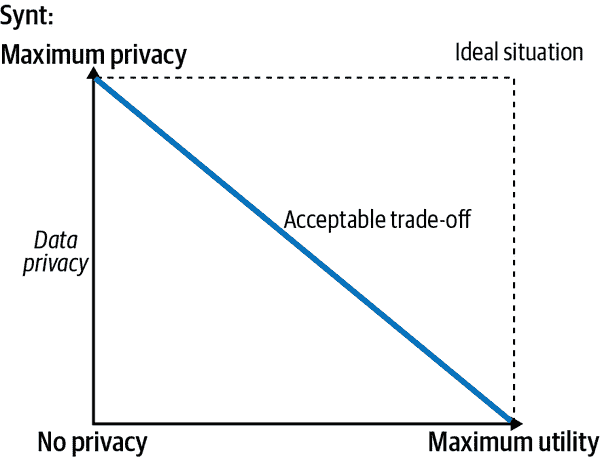
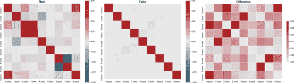
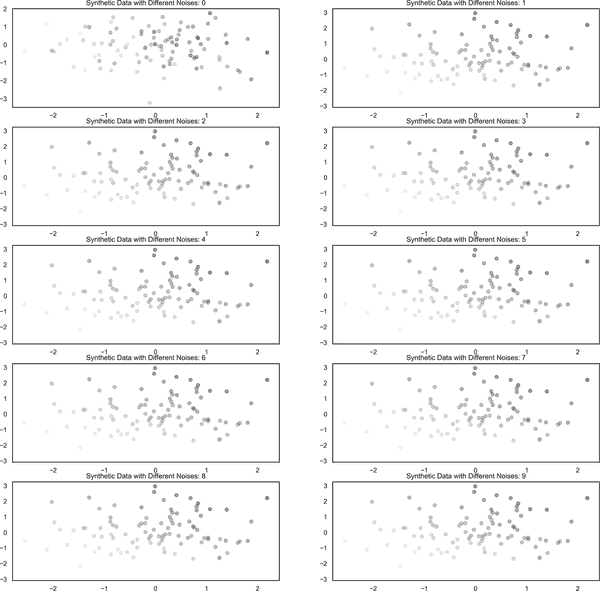
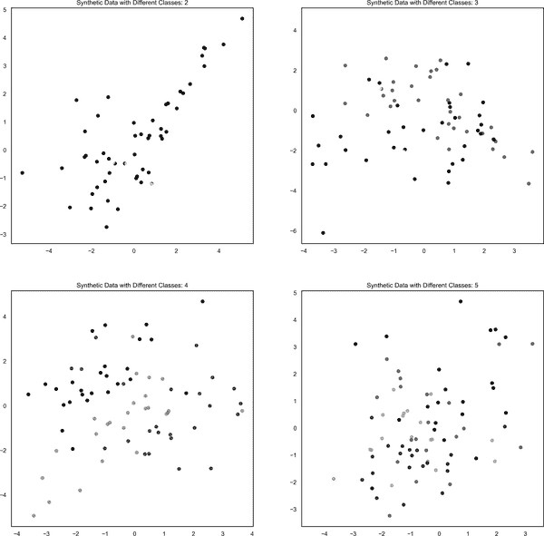
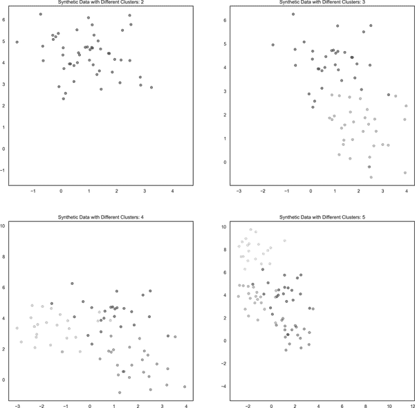
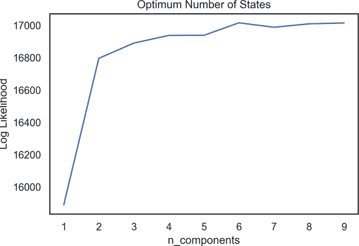
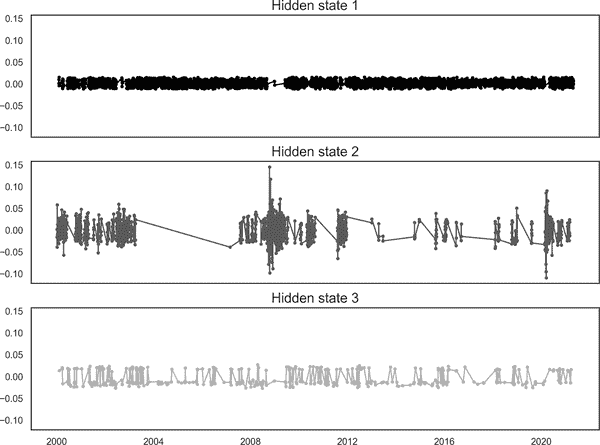
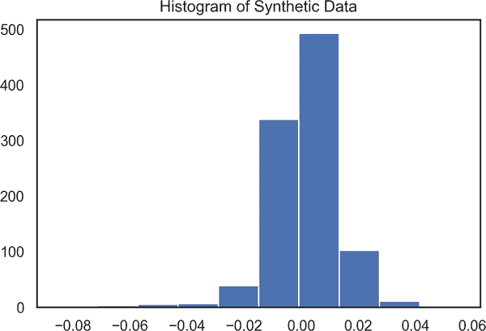
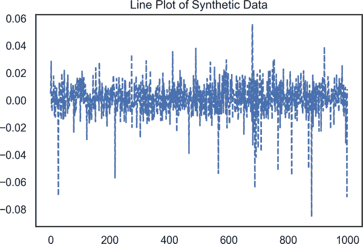

# 第十章。在金融领域中，合成数据生成和隐马尔可夫模型

> 数据不一定要根植于真实世界才具有价值：它可以被制造出来，并且可以填补或难以获取的空白。
> 
> Ahuja (2020)

由于对保密性和数据需求增加的关注，合成数据生成在金融领域越来越受到关注。因此，为什么不使用合成数据来代替真实数据，只要它模拟了所需的统计特性呢？听起来很吸引人，不是吗？合成数据生成是本章的一部分；另一部分专注于另一个不被重视但相当重要和有趣的主题：隐马尔可夫模型（HMM）。你可能想问：合成数据和 HMM 之间的共同点是什么？嗯，我们可以从 HMM 生成合成数据——这是本章的一个目标。另一个目标是介绍这两个重要主题，因为它们经常在机器学习中使用。

# 合成数据生成

金融数据的保密性、敏感性和成本极大地限制了其使用。这反过来阻碍了金融领域有用知识的进展和传播。合成数据解决了这些缺点，并帮助研究人员和从业者进行分析并传播结果。

合成数据是通过模仿真实数据的统计特性生成的数据。尽管有一种观念认为数据必须以其原始形式建模，但是从真实数据生成合成数据并不是唯一的创建方式（Patki, Wedge, 和 Veeramachaneni, 2016）。实际上，我们可以通过三种方式生成合成数据：

+   合成数据可以从*真实数据*中生成。这个过程的工作流程从获取真实数据开始，然后进行建模以揭示数据的分布，最后从这个现有模型中抽取合成数据。

+   合成数据可以通过*模型或知识*获得。一般来说，这种类型的合成数据生成可以通过使用现有的模型或研究人员的知识来应用。

+   *混合*过程包括前两个步骤，因为有时只有一部分数据变得可用，这部分真实数据用于生成合成数据，合成数据的另一部分可以从模型中获得。

我们很快将看到如何应用这些技术来生成合成数据。根据其性质，合成数据生成过程在隐私和实用性之间有着不可妥协的权衡。确切地说，从未公开的真实数据生成合成数据会产生高实用性。然而，合成数据生成的实用性在很大程度上取决于真实公共数据的去识别和聚合。合成数据生成的实用性取决于成功的建模或分析师的专业知识。

在数据生成过程中，隐私-效用权衡是数据生成过程的上下文。这在图 10-1 中有所体现。



###### 图 10-1\. 隐私-效用权衡

# 合成数据的评估

正如您可以想象的那样，有各种工具可以用来衡量合成数据的有效性；然而，我们将把注意力限制在四种常用的方法上：KL 散度，可区分性，ROC 曲线，以及比较主要统计数据，如均值、中位数等。由于 KL 散度和 ROC 曲线分别在第八章和第六章中已讨论过，我们将跳过这些内容，直接开始介绍可区分性方法。

*可区分性*，顾名思义，试图通过使用一个分类模型来区分真实和合成记录，如果是真实数据则分配为 1，否则为 0。如果输出接近 1，则预测记录为真实数据，否则预测为合成数据，使用*倾向得分*（El Emam 2020）。

另一种方法简单而强大，基于比较真实数据和合成数据的主要统计数据。根据所采用的模型，可以比较真实数据和合成数据的均值（或其他统计数据），以了解合成数据模仿真实数据的程度。

让我们讨论一下合成数据生成的优缺点：

优点

数据的可用性增加

合成数据生成使我们具备了一个强大的工具，可以克服获取真实数据的困难，这可能既昂贵又专有。

改善分析技能

作为真实数据的良好代理，合成数据可以在各种分析过程中使用，从而提升我们对特定主题的理解。此外，合成数据可以用于标记，为高度准确的分析铺平道路。

处理常见的统计问题

合成数据生成可以减轻由真实数据引起的问题。真实数据可能存在问题，如缺失值、异常值等，这些问题会严重影响模型的性能。合成数据为处理这些统计问题提供了一个工具，因此我们可能会获得改善的建模性能。

缺点

无法保护机密性

由于网络攻击，合成数据可能成为私人信息泄露的来源。例如，客户的凭证可以通过反向工程获得。

质量关注

在合成数据生成过程中需要考虑两个重要因素：研究人员的能力和数据的特性。这两点决定了合成数据生成的质量过程。如果这些因素缺乏，合成数据的质量可能会较低。

# 生成合成数据

首先从真实数据生成合成数据，然后从模型中生成。我们将使用`fetch_california_housing`的真实数据生成合成数据，同时在此过程中使用 CTGAN 库（`CTGANSynthesizer`）。CTGAN 库基于生成对抗网络（GANs），使我们能够生成与原始数据高度相似的合成数据。在生成合成数据时，训练步骤的数量由`epoch`参数控制，这使我们能够在短时间内获得合成数据：

```py
In [1]: from sklearn.datasets import fetch_california_housing 
        import pandas as pd
        import numpy as np
        import matplotlib. pyplot as plt
        import yfinance as yf
        import datetime
        import warnings
        warnings.filterwarnings('ignore')

In [2]: X, y = fetch_california_housing(return_X_y=True) 

In [3]: import numpy as np
        california_housing=np.column_stack([X, y]) 
        california_housing_df=pd.DataFrame(california_housing)

In [4]: from ctgan import CTGANSynthesizer 

        ctgan = CTGANSynthesizer(epochs=10) 
        ctgan.fit(california_housing_df)
        synt_sample = ctgan.sample(len(california_housing_df)) 
```


导入`sklearn`中的`fetch_california_housing`数据


从`fetch_california_housing`生成自变量和因变量


使用`stack`函数堆叠两个数组


导入`CTGANSynthesizer`用于生成合成数据


使用`epoch`为 10 初始化从`CTGANSynthesizer`生成合成数据的过程


生成样本

生成合成数据后，可以通过描述性统计检查合成数据的相似性。描述性统计一直非常方便，但我们还有另一个工具，来自 Synthetic Data Vault（SDV）的`evaluate`包。此函数的输出将是一个介于 0 和 1 之间的数字，表示两个表的相似程度，0 表示最差，1 表示最佳。此外，生成过程的结果可以被可视化（在生成的图表 10-2 和 10-3 中），并与真实数据进行比较，以便充分理解合成数据是否很好地代表了真实数据：

```py
In [5]: california_housing_df.describe()

Out[5]:              0             1             2             3             4 \
   count  20640.000000  20640.000000  20640.000000  20640.000000  20640.000000
   mean       3.870671     28.639486      5.429000      1.096675   1425.476744
   std        1.899822     12.585558      2.474173      0.473911   1132.462122
   min        0.499900      1.000000      0.846154      0.333333      3.000000
   25%        2.563400     18.000000      4.440716      1.006079    787.000000
   50%        3.534800     29.000000      5.229129      1.048780   1166.000000
   75%        4.743250     37.000000      6.052381      1.099526   1725.000000
   max       15.000100     52.000000    141.909091     34.066667  35682.000000

                     5             6             7             8
   count  20640.000000  20640.000000  20640.000000  20640.000000
   mean       3.070655     35.631861   -119.569704      2.068558
   std       10.386050      2.135952      2.003532      1.153956
   min        0.692308     32.540000   -124.350000      0.149990
   25%        2.429741     33.930000   -121.800000      1.196000
   50%        2.818116     34.260000   -118.490000      1.797000
   75%        3.282261     37.710000   -118.010000      2.647250
   max     1243.333333     41.950000   -114.310000      5.000010

In [6]: synt_sample.describe()
Out[6]:              0             1             2             3             4 \
   count  20640.000000  20640.000000  20640.000000  20640.000000  20640.000000
   mean       4.819246     28.954316      6.191938      1.172562   2679.408170
   std        3.023684     13.650675      2.237810      0.402990   2127.606868
   min       -0.068225     -2.927976      0.877387     -0.144332   -468.985777
   25%        2.627803     19.113346      4.779587      0.957408   1148.179104
   50%        4.217247     29.798105      5.779768      1.062072   2021.181784
   75%        6.254332     38.144114      7.058157      1.285233   3666.957652
   max       19.815551     54.219486     15.639807      3.262196  12548.941245

                     5             6             7             8
   count  20640.000000  20640.000000  20640.000000  20640.000000
   mean       3.388233     36.371957   -119.957959      2.584699
   std        1.035668      2.411460      2.306550      1.305122
   min        0.650323     32.234033   -125.836387      0.212203
   25%        2.651633     34.081107   -122.010873      1.579294
   50%        3.280092     36.677974   -119.606385      2.334144
   75%        3.994524     38.023437   -118.080271      3.456931
   max        7.026720     43.131795   -113.530352      5.395162

In [7]: from sdv.evaluation import evaluate 

        evaluate(synt_sample, california_housing_df) 
Out[7]: 0.4773175572768998

In [8]: from table_evaluator import TableEvaluator 

        table_evaluator =  TableEvaluator(california_housing_df, synt_sample) 

        table_evaluator.visual_evaluation() 
```


导入`evaluate`包以评估合成和真实数据的相似性


运行`evaluate`包对我们的真实数据和合成数据进行评估


导入`TableEvaluator`以视觉检查合成数据和真实数据之间的相似性


使用真实数据和合成数据运行`TableEvaluator`


使用`visual_evaluation`包进行视觉分析


###### 图 10-2. 合成数据生成的评估-1



###### 图 10-3. 合成数据生成的评估-2

图 10-2 和 10-3 允许我们通过均值、标准偏差和热图直观比较真实数据和合成数据的性能。尽管`evaluation`有许多不同的工具，但现在值得我们把注意力集中在这些工具上。

正如你所见，从真实数据生成合成数据并不难。现在让我们走一遍根据模型生成合成数据的过程。我将使用`sklearn`，这是一个用于机器学习应用的瑞士军刀库，既可以用于分类模型也可以用于回归模型。`make_regression`对于生成回归模型的合成数据非常有用。同样，`make_classification`生成用于运行分类模型的合成数据。以下代码还生成了 Figure 10-4：

```py
In [9]: from sklearn.datasets import make_regression 
        import matplotlib.pyplot as plt
        from matplotlib import cm

In [10]: X, y = make_regression(n_samples=1000, n_features=3, noise=0.2,
                                random_state=123) 

         plt.scatter(X[:, 0], X[:, 1], alpha= 0.3, cmap='Greys', c=y)

In [11]: plt.figure(figsize=(18, 18))
         k = 0

         for i in range(0, 10):
             X, y = make_regression(n_samples=100, n_features=3, noise=i,
                                    random_state=123)
             k+=1
             plt.subplot(5, 2, k)
             profit_margin_orange = np.asarray([20, 35, 40])
             plt.scatter(X[:, 0], X[:, 1], alpha=0.3, cmap=cm.Greys, c=y)
             plt.title('Synthetic Data with Different Noises: ' + str(i))
         plt.show()
```


导入`make_regression`包


用 1000 个样本、3 个特征和噪声的标准偏差生成回归的合成数据

Figure 10-4 显示了在生成合成数据时变化噪声的效果。正如预期的那样，随着标准偏差的增加，`noise`参数会越来越大。



###### 图 10-4. 使用不同噪声生成合成数据

那么为分类生成合成数据如何呢？听起来很容易。我们将按照与回归非常相似的过程。这次，我们将使用`make_classification`包。在生成合成数据之后，将通过散点图观察不同类别数量的影响（Figure 10-5）：

```py
In [12]: from sklearn.datasets import make_classification 

In [13]: plt.figure(figsize=(18, 18))
         k = 0

         for i in range(2, 6):
             X, y = make_classification(n_samples=100,
                                        n_features=4,
                                        n_classes=i,
                                        n_redundant=0,
                                        n_informative=4,
                                        random_state=123) 
             k+=1
             plt.subplot(2, 2, k)
             plt.scatter(X[: ,0], X[:, 1], alpha=0.8, cmap='gray', c=y)
             plt.title('Synthetic Data with Different Classes: ' + str(i))
         plt.show()
```


导入`make_classification`包


用 100 个样本、4 个特征和 4 个信息特征生成分类的合成数据

Figure 10-5 展示了在合成数据生成中具有不同类别的效果；在这种情况下，使用类别 2 到 5 生成了合成数据。



###### 图 10-5\. 使用不同类别生成合成数据

从无监督学习中生成合成数据也是可能的。`make_blobs` 是一个可用于此目的的包。因此，我们将生成合成数据，并观察不同聚类数对合成数据的影响，并生成 Figure 10-6：

```py
In [14]: from sklearn.datasets import make_blobs 

In [15]: X, y = make_blobs(n_samples=100, centers=2,
                               n_features=2, random_state=0) 

In [16]: plt.figure(figsize=(18, 18))
         k = 0
         for i in range(2, 6):
             X, y = make_blobs(n_samples=100, centers=i,
                               n_features=2, random_state=0)
             k += 1
             plt.subplot(2, 2, k)
             my_scatter_plot = plt.scatter(X[:, 0], X[:, 1],
                                           alpha=0.3, cmap='gray', c=y)
             plt.title('Synthetic Data with Different Clusters: ' + str(i))
         plt.show()
```


从 `sklearn` 导入 `make_blobs` 包


生成具有 100 个样本、2 个中心和 2 个特征的合成数据

Figure 10-6 显示了具有不同聚类的合成数据的外观。

到目前为止，我们已经学习了如何使用真实数据和模型生成合成数据，同时使用监督学习（回归和分类）和无监督学习。从现在开始，我们将探索 HMM 并学习如何使用它。从财务角度来看，我们将通过因子投资来完成这项任务。因子投资并不是一个新话题，但在著名的法马-弗伦奇三因子模型（法马和弗伦奇，1993 年）之后，它变得越来越吸引人。我们将看到 HMM 对识别经济中不同状态的影响，并在投资策略中加以考虑。最后，我们将能够通过夏普比率比较基于法马-弗伦奇三因子模型和 HMM 的因子投资的效果。



###### 图 10-6\. 使用不同噪声生成合成数据

# 隐马尔可夫模型简介

HMM 给出了我们对顺序数据的概率分布，这是由隐藏状态的马尔可夫过程建模的。HMM 使我们能够估计从一个状态到另一个状态的概率转移。

为了说明，让我们考虑股市，其中股票上涨、下跌或保持不变。随机选择一个状态——比如上涨。下一个状态可能是上涨、下跌或保持不变。在这种情况下，状态被认为是一个*隐藏*状态，因为我们不能确定市场下一个状态将是什么。

总体上，HMM 有两个基本假设：第一，所有观察值仅依赖于当前状态，并且在条件上独立于其他变量；第二，转移概率是均匀的，并且仅依赖于当前隐藏状态（Wang, Lin 和 Mikhelson，2020 年）。

# 法马-弗伦奇三因子模型与 HMM

法玛和法 rench（1993）提出的模型为扩展 CAPM 的进一步研究铺平了道路。该模型提出全新的解释变量来解释股票回报的变化。该模型的三个因子包括市场风险<math alttext="left-parenthesis upper R m minus upper R f right-parenthesis"><mrow><mo>(</mo> <mi>R</mi> <mi>m</mi> <mo>-</mo> <mi>R</mi> <mi>f</mi> <mo>)</mo></mrow></math>，小市值与大市值之间的差异（SMB）和高市值与低市值之间的差异（HML）。我们将在下文简要讨论这些因子，因为我们将在模型中使用它们。

<math alttext="left-parenthesis upper R m minus upper R f right-parenthesis"><mrow><mo>(</mo> <mi>R</mi> <mi>m</mi> <mo>-</mo> <mi>R</mi> <mi>f</mi> <mo>)</mo></mrow></math>基本上是市场投资组合的回报减去无风险利率，这是一个由政府发行的 T 票或类似资产代理的假设利率。

SMB 是大小效应的代理。大小效应是用来解释公司财务中的几个现象的重要变量。它通过不同的变量如总资产的对数来表示。法玛-法 rench 通过计算小市值公司和大市值公司之间的回报来考虑大小效应。

第三个因子是 HML，它代表高账面市值比和低账面市值比之间的回报差异，比较公司的账面价值与市场价值。

实证研究表明，较小的 SMB，较高的 HML 以及较小的<math alttext="left-parenthesis upper R m minus upper R f right-parenthesis"><mrow><mo>(</mo> <mi>R</mi> <mi>m</mi> <mo>-</mo> <mi>R</mi> <mi>f</mi> <mo>)</mo></mrow></math>会提升股票回报率。从理论上讲，在运行法玛-法 rench 三因子模型之前识别状态将提升模型的性能。为了验证这一点在真实数据中是否成立，让我们运行包含或不包含 HMM 的因子投资模型。

数据来自[肯尼斯·法 rench 数据库](https://oreil.ly/m5ShJ)。如下所示，包含在数据中的变量有：`Date`、`Mkt-RF`、`SMB`、`HML`和`RF`。结果显示，所有变量都是数值型的，除了如预期的日期。为了节省处理模型的时间，数据已经被修剪到从 2000-01-03 开始：

```py
In [17]: ff = pd.read_csv('FF3.csv', skiprows=4)
         ff = ff.rename(columns={'Unnamed: 0': 'Date'})
         ff = ff.iloc[:-1]
         ff.head()
Out[17]:        Date  Mkt-RF   SMB   HML     RF
         0  19260701    0.10 -0.24 -0.28  0.009
         1  19260702    0.45 -0.32 -0.08  0.009
         2  19260706    0.17  0.27 -0.35  0.009
         3  19260707    0.09 -0.59  0.03  0.009
         4  19260708    0.21 -0.36  0.15  0.009

In [18]: ff.info()
         <class 'pandas.core.frame.DataFrame'>
         RangeIndex: 24978 entries, 0 to 24977
         Data columns (total 5 columns):
          #   Column  Non-Null Count  Dtype
         ---  ------  --------------  -----
          0   Date    24978 non-null  object
          1   Mkt-RF  24978 non-null  float64
          2   SMB     24978 non-null  float64
          3   HML     24978 non-null  float64
          4   RF      24978 non-null  float64
         dtypes: float64(4), object(1)
         memory usage: 975.8+ KB

In [19]: ff['Date'] = pd.to_datetime(ff['Date'])
         ff.set_index('Date', inplace=True)
         ff_trim = ff.loc['2000-01-01':]

In [20]: ff_trim.head()
Out[20]:             Mkt-RF   SMB   HML     RF
         Date
         2000-01-03   -0.71  0.61 -1.40  0.021
         2000-01-04   -4.06  0.01  2.06  0.021
         2000-01-05   -0.09  0.18  0.19  0.021
         2000-01-06   -0.73 -0.42  1.27  0.021
         2000-01-07    3.21 -0.49 -1.42  0.021
```

好吧，我们已经得到了解释股票回报背后动态的变量，但是这是哪一种股票回报？它应该是代表经济总体状况的回报。这种类型变量的一个潜在候选者是标普 500 交易所交易基金（ETF）。

###### 请注意

ETF 是一种特殊类型的投资基金和交易所交易产品，跟踪行业、商品等。SPDR 标普 500 ETF（SPY）是一个非常著名的例子，跟踪标普 500 指数。一些其他的 ETF 包括：

+   全球前 2000 名 ETF 股票（VXUS）

+   能源选择部门 SPDR 基金（XLE）

+   iShares Edge MSCI Min Vol USA ETF（USMV）

+   iShares 晨星大型市值 ETF（JKD）

我们将从 2000-01-03 到 2021-04-30 收集每日的 SPY 收盘价，以匹配我们研究的时期。获取数据后，我们将 `ff_trim` 和 `SP_ETF` 合并，这样就得到了包括返回率和波动率的数据，隐藏状态也是在这些数据上确定的：

```py
In [21]: ticker = 'SPY'
         start = datetime.datetime(2000, 1, 3)
         end = datetime.datetime(2021, 4, 30)
         SP_ETF = yf.download(ticker, start, end, interval='1d').Close
         [*********************100%***********************]  1 of 1 completed

In [22]: ff_merge = pd.merge(ff_trim, SP_ETF, how='inner', on='Date')

In [23]: SP = pd.DataFrame()
         SP['Close']= ff_merge['Close']

In [24]: SP['return'] = (SP['Close'] / SP['Close'].shift(1))-1
```


计算 SPY 的收益率

假设经济有三种状态：上升、下降和恒定。在此基础上，我们使用完全协方差运行 HMM，表示独立组件，并进行了 100 次迭代（`n_iter`）。以下代码块展示了如何应用高斯 HMM 并预测隐藏状态：

```py
In [25]: from hmmlearn import hmm

In [26]: hmm_model = hmm.GaussianHMM(n_components=3,
                                     covariance_type="full",
                                     n_iter=100)

In [27]: hmm_model.fit(np.array(SP['return'].dropna()).reshape(-1, 1))
         hmm_predict = hmm_model.predict(np.array(SP['return'].dropna())
                                         .reshape(-1, 1))
         df_hmm = pd.DataFrame(hmm_predict)

In [28]: ret_merged = pd.concat([df_hmm,SP['return'].dropna().reset_index()],
                                axis=1)
         ret_merged.drop('Date',axis=1, inplace=True)
         ret_merged.rename(columns={0:'states'}, inplace=True)
         ret_merged.dropna().head()
Out[28]:    states    return
         0       1 -0.039106
         1       1  0.001789
         2       1 -0.016071
         3       1  0.058076
         4       2  0.003431
```


使用返回数据拟合高斯 HMM


给定返回数据，预测隐藏状态

在预测隐藏状态之后，返回数据与隐藏状态连接，这样我们就能看到哪个返回值属于哪个状态。

现在让我们检查运行高斯 HMM 分析后得到的结果。在以下代码块中，我们计算了不同状态的均值和标准差，还估计了协方差、初始概率和转移矩阵：

```py
In [29]: ret_merged['states'].value_counts()
Out[29]: 0    3014
         2    2092
         1     258
         Name: states, dtype: int64

In [30]: state_means = []
         state_std = []

         for i in range(3):
             state_means.append(ret_merged[ret_merged.states == i]['return']
                                .mean())
             state_std.append(ret_merged[ret_merged.states == i]['return']
                              .std())
         print('State Means are: {:.4f}'.format(state_means))
         print('State Standard Deviations are: {:.4f}'.format(state_std))
         State Means are: [0.0009956956923795376, -0.0018371952883552139, -0.
         0005000714110860054]
         State Standard Deviations are: [0.006006540155737148, 0.
         03598912028897813, 0.01372712345328388]

In [31]: print(f'HMM means\n {hmm_model.means_}')
         print(f'HMM covariances\n {hmm_model.covars_}')
         print(f'HMM transition matrix\n {hmm_model.transmat_}')
         print(f'HMM initial probability\n {hmm_model.startprob_}')
         HMM means
          [[ 0.00100365]
          [-0.002317  ]
          [-0.00036613]]
         HMM covariances
          [[[3.85162047e-05]]

          [[1.26647594e-03]]

          [[1.82565269e-04]]]
         HMM transition matrix
          [[9.80443302e-01 1.20922866e-06 1.95554886e-02]
          [1.73050704e-08 9.51104459e-01 4.88955238e-02]
          [2.67975578e-02 5.91734590e-03 9.67285096e-01]]
         HMM initial probability
          [0.00000000e+000 1.00000000e+000 2.98271922e-120]
```

每个状态的观察数量见 Table 10-1。

表 10-1\. 每个状态的观察结果

| 状态 | 观察次数 | 收益均值 | 协方差 |
| --- | --- | --- | --- |
| 0 | 3014 | 0.0010 | 3.8482e-05 |
| 1 | 2092 | -0.0023 | 1.2643e-05 |
| 2 | 258 | -0.0003 | 1.8256e-05 |

我们假设经济有三种状态，但这一假设基于理论。然而，如果我们要确保，有一个强大且方便的工具可以应用：*Elbow Analysis*。在运行高斯 HMM 后，我们得到了似然结果，如果没有改进的空间——即，似然值变得相对稳定——这就是我们可以停止分析的时刻。根据以下结果（连同相应的 Figure 10-7），三个组件是一个不错的选择：

```py
In [32]: sp_ret = SP['return'].dropna().values.reshape(-1,1)
         n_components = np.arange(1, 10)
         clusters = [hmm.GaussianHMM(n_components=n,
                                     covariance_type="full").fit(sp_ret)
                    for n in n_components] 
         plt.plot(n_components, [m.score(np.array(SP['return'].dropna())\
                                         .reshape(-1,1)) for m in clusters]) 
         plt.title('Optimum Number of States')
         plt.xlabel('n_components')
         plt.ylabel('Log Likelihood')
In [33]: hmm_model = hmm.GaussianHMM(n_components=3,
                                 covariance_type="full",
                                 random_state=123).fit(sp_ret)
         hidden_states = hmm_model.predict(sp_ret)
```


基于高斯 HMM 通过列表推导创建十个聚类


根据组件数量计算对数似然

Figure 10-7 显示了每个状态的似然值。很容易观察到，在第三个组件之后，曲线变得更加平坦。



###### 图 10-7\. 高斯 HMM 谱图

现在让我们可视化通过高斯 HMM 获得的状态，并生成图 10-8：

```py
In [34]: from matplotlib.dates import YearLocator, MonthLocator
         from matplotlib import cm

In [35]: df_sp_ret = SP['return'].dropna()

         hmm_model = hmm.GaussianHMM(n_components=3,
                                     covariance_type="full",
                                     random_state=123).fit(sp_ret)

         hidden_states = hmm_model.predict(sp_ret)

         fig, axs = plt.subplots(hmm_model.n_components, sharex=True,
                                 sharey=True, figsize=(12, 9))
         colors = cm.gray(np.linspace(0, 0.7, hmm_model.n_components))

         for i, (ax, color) in enumerate(zip(axs, colors)):
             mask = hidden_states == i
             ax.plot_date(df_sp_ret.index.values[mask],
                          df_sp_ret.values[mask],
                          ".-", c=color)
             ax.set_title("Hidden state {}".format(i + 1), fontsize=16)
             ax.xaxis.set_minor_locator(MonthLocator())

         plt.tight_layout()
```



###### 图 10-8\. 高斯 HMM 状态

图 10-8 展示了隐藏状态的行为，正如预期的那样，这些状态的分布与彼此完全不同，突显了识别状态的重要性。

鉴于所得状态，SPY 的回报率不同，这是我们预期的。在所有这些准备工作之后，我们可以继续并使用和不使用高斯 HMM 运行法玛-弗雷奇三因子模型。建模后，我们将计算夏普比率，以确定哪一个具有更好的风险调整回报。使用高斯 HMM 进行的分析显示了接近 0.0981 的夏普比率：

```py
In [36]: ret_merged.groupby('states')['return'].mean()
Out[36]: states
         0    0.000996
         1   -0.001837
         2   -0.000500
         Name: return, dtype: float64

In [37]: ff_merge['return'] = ff_merge['Close'].pct_change()
         ff_merge.dropna(inplace=True)

In [38]: split = int(len(ff_merge) * 0.9)
         train_ff= ff_merge.iloc[:split].dropna()
         test_ff = ff_merge.iloc[split:].dropna()

In [39]: hmm_model = hmm.GaussianHMM(n_components=3,
                                     covariance_type="full",
                                     n_iter=100, init_params="")

In [40]: predictions = []

         for i in range(len(test_ff)):
             hmm_model.fit(train_ff)
             adjustment = np.dot(hmm_model.transmat_, hmm_model.means_) 
             predictions.append(test_ff.iloc[i] + adjustment[0])
         predictions = pd.DataFrame(predictions)

In [41]: std_dev = predictions['return'].std()
         sharpe = predictions['return'].mean() / std_dev
         print('Sharpe ratio with HMM is {:.4f}'.format(sharpe))
Out[41]: Sharpe ratio with HMM is 0.0981
```


基于转移矩阵的调整

运行法玛-弗雷奇三因子模型的传统方法是应用线性回归，以下代码块就是这样做的。在运行线性回归之后，我们可以进行预测，然后计算夏普比率。我们会发现，与高斯 HMM 相比，线性回归产生了较低的夏普比率（0.0589）：

```py
In [42]: import statsmodels.api as sm

In [43]: Y = train_ff['return']
         X = train_ff[['Mkt-RF', 'SMB', 'HML']]

In [44]: model = sm.OLS(Y, X)
         ff_ols = model.fit()
         print(ff_ols.summary())

                        OLS Regression Results
================================================================================
Dep. Variable:             return   R-squared (uncentered):                0.962
Model:                        OLS   Adj. R-squared (uncentered):           0.962
Method:             Least Squares   F-statistic:                       4.072e+04
Date:            Tue, 30 Nov 2021   Prob (F-statistic):                     0.00
Time:                    00:05:02   Log-Likelihood:                       22347.
No. Observations:            4827   AIC:                              -4.469e+04
Df Residuals:                4824   BIC:                              -4.467e+04
Df Model:                       3
Covariance Type:        nonrobust
==============================================================================
                 coef    std err          t      P>|t|      [0.025      0.975]
------------------------------------------------------------------------------
Mkt-RF         0.0098   2.82e-05    348.173      0.000       0.010       0.010
SMB           -0.0017   5.71e-05    -29.005      0.000      -0.002      -0.002
HML        -6.584e-05   5.21e-05     -1.264      0.206      -0.000    3.63e-05
==============================================================================
Omnibus:                     1326.960   Durbin-Watson:                   2.717
Prob(Omnibus):                  0.000   Jarque-Bera (JB):            80241.345
Skew:                           0.433   Prob(JB):                         0.00
Kurtosis:                      22.955   Cond. No.                         2.16
==============================================================================

Notes:
[1] R² is computed without centering (uncentered) since the model does not
contain a constant.
[2] Standard Errors assume that the covariance matrix of the errors is
correctly specified.

In [45]: ff_pred = ff_ols.predict(test_ff[["Mkt-RF", "SMB", "HML"]])
         ff_pred.head()
Out[45]: Date
         2019-03-14   -0.000340
         2019-03-15    0.005178
         2019-03-18    0.004273
         2019-03-19   -0.000194
         2019-03-20   -0.003795
         dtype: float64

In [46]: std_dev = ff_pred.std()
         sharpe = ff_pred.mean() / std_dev
         print('Sharpe ratio with FF 3 factor model is {:.4f}'.format(sharpe))
Out[46]: Sharpe ratio with FF 3 factor model is 0.0589
```

这一结果表明，高斯 HMM 提供了更好的风险调整回报，使其在资产配置等分析中非常有用。

以下分析试图展示如果基于未见数据预测指数回报的状态，可以用于未来分析的回测情况：

```py
In [47]: split = int(len(SP['return']) * 0.9)
         train_ret_SP = SP['return'].iloc[split:].dropna()
         test_ret_SP = SP['return'].iloc[:split].dropna()

In [48]: hmm_model = hmm.GaussianHMM(n_components=3,
                                     covariance_type="full",
                                     n_iter=100)
         hmm_model.fit(np.array(train_ret_SP).reshape(-1, 1))
         hmm_predict_vol = hmm_model.predict(np.array(test_ret_SP)
                                             .reshape(-1, 1))
         pd.DataFrame(hmm_predict_vol).value_counts()
Out[48]: 0    4447
         1     282
         2      98
         dtype: int64
```

正如我们讨论过的，HMM 为我们进一步扩展分析提供了有力的方式，以获取更可靠和准确的结果。在结束本章之前，展示使用高斯 HMM 生成合成数据的过程是值得的。为此，我们首先应定义我们的初始参数。这些参数是：初始概率（`startprob`）、转移矩阵（`transmat`）、均值（`means`）和协方差（`covars`）。定义了参数之后，我们可以运行高斯 HMM，并应用随机抽样过程，以得到我们需要的观测数，本例中为 1,000。以下代码生成了图表 10-9 和 10-10：

```py
In [49]: startprob = hmm_model.startprob_
         transmat = hmm_model.transmat_
         means = hmm_model.means_
         covars = hmm_model.covars_

In [50]: syn_hmm = hmm.GaussianHMM(n_components=3, covariance_type="full")

In [51]: syn_hmm.startprob_ = startprob
         syn_hmm.transmat_ = transmat
         syn_hmm.means_ = means
         syn_hmm.covars_ = covars

In [52]: syn_data, _ = syn_hmm.sample(n_samples=1000)

In [53]: plt.hist(syn_data)
         plt.show()
In [54]: plt.plot(syn_data, "--")
         plt.show()
```

基于合成数据的分布和线性图可见于图表 10-9 和 10-10。由于我们从高斯 HMM 中得到了足够大的样本量，我们观察到数据呈正态分布。



###### 图 10-9\. 高斯 HMM 合成数据直方图



###### 图 10-10\. 高斯 HMM 合成数据线性图

# 结论

在这一最后一章中，我们讨论了两个相对新颖但颇具前景的主题。合成数据生成使我们能够在没有真实数据或违反保密情况下进行分析，因此对于从业者在这些情况下是一个救命稻草。在本章的第二部分，我们研究了高斯 HMM 及其在金融分析中的有用性，然后使用高斯 HMM 生成了合成数据。

我们看到高斯 HMM 如何帮助我们在投资组合配置中获得更好的结果，但值得注意的是，这并不是我们可以应用 HMM 的唯一领域。相反，研究人员利用这种方法的领域还有许多，可以肯定的是将会有更多的应用出现。

# 参考资料

本章引用的文章和书籍：

+   Ahuja, Ankana. 2020\. “合成数据的前景”。 *《金融时报》*。 [*https://oreil.ly/qphEN*](https://oreil.ly/qphEN).

+   El Emam, Khaled, Lucy Mosquera, 和 Richard Hoptroff. 2020\. *实用的合成数据生成：平衡隐私与数据广泛可用性*。 Sebastopol: O’Reilly.

+   Fama, Eugene F., 和 Kenneth R. French. 1993\. “股票和债券收益的共同风险因素。” *《金融经济学杂志》* 33 (3): 56.

+   Patki, Neha, Roy Wedge, 和 Kalyan Veeramachaneni. 2016\. “合成数据保险库。” 在 2016 年 IEEE 国际数据科学与高级分析会议（DSAA）中，399-410 页.

+   Wang, Matthew, Yi-Hong Lin, 和 Ilya Mikhelson. 2020\. “隐马尔可夫模型的制度切换因子投资。” *《风险与金融管理杂志》* 13 (12): 311.
