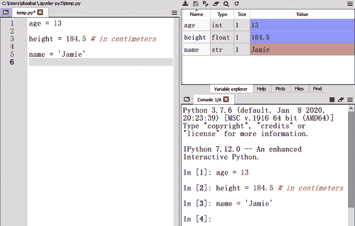
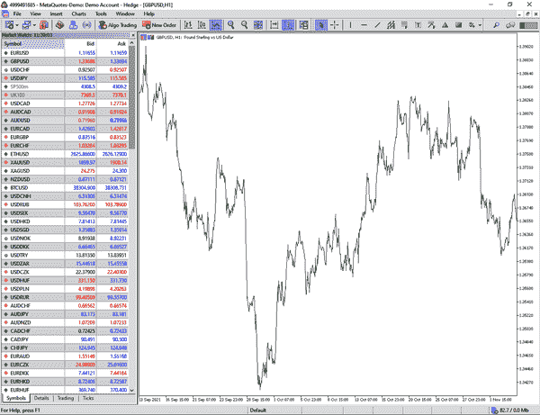
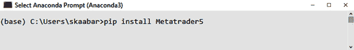

# 第一章：在 Python 中导入和处理金融数据

本章专门讨论通过编码分析金融数据所需的基础工作。这需要一些准备工作，如下载合适的软件和创建一个自动获取历史数据的算法。

到本章结束时，你应该知道如何使用 Python 自动导入历史金融数据，这个技能应该能为你节省时间。那么，让我们开始吧。

# 安装环境

第一步是准备环境和算法成功所需的其他一切。为此，你需要两个程序：

+   你用来编写和执行代码的 Python 解释器

+   你用作数据库的图表和金融软件

让我们从 Python 解释器开始。我使用一个名为 SPYDER 的软件。有些人可能更熟悉其他软件，如 Jupyter 和 PyCharm，但过程是相同的。你可以从[官方网站](https://www.spyder-ide.org)下载 SPYDER，或者更好地，作为一个名为[Anaconda](https://oreil.ly/nI8Ed)的大包的一部分下载它，这样安装更方便并提供更多工具。注意它是开源、免费的软件。

SPYDER 的界面分为三个窗口，如你在图 1-1 中所见。左侧的窗口用于编写稍后执行的代码（告诉算法运行并应用代码）。通常，你会在那个区域看到多行代码。

右上角的窗口是变量资源管理器。每次存储变量时，你都可以在那里看到它。右下角的窗口是控制台，显示代码的结果，无论是错误还是输出。



###### 图 1-1\. SPYDER 的界面

你可以在代码中定义和使用的数据类型分为几类：

整数

这些是整数，可以是正数也可以是负数。例如 −8 和 745。然而，它们限制在 −2147483648 到 2147483647 之间。任何超出此范围的数字被认为是一个不同的数据类型，称为*长整型*。数据类型之间的区别与内存有关。整数的宽度为 32 位，而长整型为 64 位。

浮点数

这些是带有小数点的实数，例如 18.54 和 311.52。

字符串

这些是存储在变量中的单词。更科学地说，它们是一组结构化字符（文本）。在 Python 中，你可以用单引号或双引号之间写字符串。

在图 1-1 的代码第 1 行中，我定义了一个名为`age`的变量，并将其设置为 13。当你运行此代码时，你应该在变量资源管理器中看到`age`的创建，类型为`int`（整数），值为 13。在第 3 行，我执行了定义`height`变量并设置为 184.50 的代码（因此是浮点数数据类型）。

注意，变量定义旁边我写了`in centimeters`这个短语，前面加了井号。这叫做*注释*。在 Python 中，注释对于解释代码非常重要。因此，任何以`#`开头的内容都不会被执行。在变量资源管理器中，您可以看到`height`变量的`float`类型。第 5 行定义了一个字符串，在控制台中显示为`str`类型（字符串）。您可以看到代码已成功执行，因为没有显示为红色的错误。

准备环境的下一步是安装图表软件，以便您可以将历史数据导入到 SPYDER 中。在整本书中，我使用 MetaTrader 5，这是许多全球交易员使用的基准图表程序。按照以下步骤进行操作：

1.  下载 SPYDER 并熟悉其工作方式。

1.  下载 MetaTrader 5 软件。

1.  使用 SPYDER 从 MetaTrader 5 导入历史价格。

从[官方网站](https://www.metatrader5.com/en)下载并安装 MetaTrader 5。您需要创建一个演示账户，这只是一个带有虚拟货币的虚拟账户。单词*demo*不是指使用的时间有限，而是指它不使用真实货币。

要开设账户，请选择文件 > 打开账户，选择 MetaQuotes Software Corp，然后点击下一步。接下来，选择第一个选项以开设演示账户；这将让您交易虚拟货币。最后，输入一些基本信息，如姓名、电子邮件和账户类型。您将不会收到验证请求或任何类型的确认，因为演示应直接启动，允许您查看图表。

图 1-2 显示了平台的界面。默认情况下，MetaTrader 5 不显示其涵盖的所有市场，因此如果需要，您需要使其可访问以进行导入和可视化。单击查看，单击市场观察，然后右键单击新选项卡中显示的任何符号，并选择显示所有。这样，您可以看到扩展列表，其中包含更多市场。



###### 图 1-2\. MetaTrader 5 的界面。

# 创建导入算法。

能够自动调用任何时间段的历史数据是一种非常节省时间的方法，因为它使您能够专注于研究和分析，而不是浪费宝贵的时间获取和清理数据。让我们创建一组函数，几乎可以即时导入所选资产的历史数据。

在进行编码之前，您需要安装 MetaTrader 5 Python 集成库，以便稍后在 SPYDER 中使用它。这很简单，只需一步。打开 Anaconda 提示符并输入`pip install Metatrader5`，如图 1-3 所示。



###### 图 1-3\. Anaconda 提示显示安装 MetaTrader 5 库的命令。

安装是允许您在解释器中使用为 MetaTrader 5 设计的 Python 库的桥梁。

以下代码块使用了内置的`import`语句，调用了内部（自行创建的）或外部（第三方创建的）库。库是函数的存储库，因此，你需要导入与你想要做的事情相关的库。为了演示目的，导入以下模块、包和库：

```py
import datetime
import pytz
import pandas as pd
import MetaTrader5 as mt5
import numpy as np 
```

`datetime`模块提供了操作日期和时间的工具，`pytz`库提供了跨平台的时区计算，这些对导入是必需的，而`pandas`和`numpy`库用于数据处理和分析。

###### 注意

你主要使用`numpy`进行大多数计算和数据处理。

MetaTrader 5 库导入与软件模块相关的函数，是允许你导入金融历史数据的关键库。

注意，代码的最后三行包含`as`语句。这用于在你经常使用它并希望节省写作空间时，给库命名自定义名称。换句话说，从现在起，Python 将认识 MetaTrader 5 库为 mt5。

###### 注意

*模块*是包含函数和变量的文件。*包*是模块的集合；它需要一个*init.py*文件。库只是包的集合。

执行`import`语句意味着 Python 现在识别其中的函数，并允许你在未来的代码中使用它们（如果你决定调用它们）。你必须在每次打开新会话时运行它们，这就是为什么`import`语句通常位于代码的开头。

下一步是创建你将能够导入的时间框架的宇宙。即使我将向你展示如何分析和回测每小时数据，你可以定义一个更广泛的宇宙，如下面的代码片段所示：

```py
frame_M15 = mt5.TIMEFRAME_M15 `# 15-minute time`
frameframe_M30 = mt5.TIMEFRAME_M30 `# 30-minute time frame`
frame_H1 = mt5.TIMEFRAME_H1 `# Hourly time frame`
frame_H4 = mt5.TIMEFRAME_H4 `# 4-hour time frame`
frame_D1 = mt5.TIMEFRAME_D1 `# Daily time frame`
frame_W1 = mt5.TIMEFRAME_W1 `# Weekly time frame`
frame_M1 = mt5.TIMEFRAME_MN1 `# Monthly time frame`

```

*时间框架*是你记录价格频率的频率。使用小时数据，你将每小时记录最后打印的价格。这意味着一天内，你可以有最多 24 个小时价格。这允许你看到价格的日内演变。然而，收盘价格只是你想要导入的事物之一。在一个时间段内（无论是每小时还是每日），你将看到以下内容：

+   时间段的第一个价格，称为*开盘价格*。

+   打印在时间段内的最高价格，称为*高价格*。

+   打印在时间段内的最低价格，称为*低价格*。

+   在开始新的时间段之前所看到的最后价格，被称为*收盘价格*。

总体而言，这些被称为 OHLC¹数据，通常按照写入的顺序排列。

以下代码定义了当前时间，这用于算法在导入数据时有一个参考点。基本上，你正在创建一个变量，用于存储当前的时间和日期：

```py
now = datetime.datetime.now()
```

现在我们继续定义您要进行回测的资产范围。我涉及四种资产类别：货币、加密货币、大宗商品和股票指数：

+   *货币*（也称为*外汇*，是外汇市场的缩写）是按日交易量计算的最大金融市场。货币以货币对的形式报价，这意味着您不能仅仅用美元购买美元；您必须使用另一种货币购买。因此，EURUSD 货币对指的是 1 欧元相当于多少美元。回测范围包括 EURUSD、USDCHF、GBPUSD 和 USDCAD。

###### 注意

USD 是美元的缩写，EUR 是欧元货币的缩写，CHF 是瑞士法郎的缩写，GBP 是英镑的缩写，CAD 是加拿大元的缩写。

+   *加密货币*（也称为*加密货币*）是一种新型、具有颠覆性的资产类别，其特点是严重的波动性。最知名的加密货币是比特币，其次是以太坊。请注意，两者都以美元计价；这就是为什么它们被标记为 BTCUSD 和 ETHUSD 的原因。

###### 注意

请注意，比特币（BTC）和以太坊（ETH）是相对于美元报价的。它们通常被认为是最流动的加密货币对。

+   *大宗商品*是金、银、铜等实物资产。它们被划分为许多类别，如能源（原油、布伦特原油等）和工业金属（铜、锌等）。在资产范围内，我只关注黄金和白银。

+   *股票指数*是对一个国家股票精选篮子的加权计算。它们用于分析一个国家整体股票市场的健康状况。在这本书中，我涵盖了标普 500 指数，作为美国股票的代理，以及富时 100 指数，作为英国股票的代理：

```py
assets = ['EURUSD', 'USDCHF', 'GBPUSD', 'USDCAD', 'BTCUSD', 
          'ETHUSD', 'XAUUSD', 'XAGUSD', 'SP500m', 'UK100']
```

现在您已经准备好了时间和资产变量，您所需的只是创建导入算法的结构。`get_quotes()`函数就是这样做的：

```py
def get_quotes(time_frame, year = 2005, month = 1, day = 1, 
               asset = "EURUSD"):

    if not mt5.initialize():

        print("initialize() failed, error code =", mt5.last_error())

        quit()

    timezone = pytz.timezone("Europe/Paris")

    time_from = datetime.datetime(year, month, day, tzinfo = timezone)

    time_to = datetime.datetime.now(timezone) + datetime.timedelta(days=1)

    rates = mt5.copy_rates_range(asset, time_frame, time_from, time_to)

    rates_frame = pd.DataFrame(rates)

    return rates_frame

```

注意，在`get_quotes()`函数中，您最终使用了`pytz`和`pandas`库。该函数首先通过定义奥尔森时区来开始，您可以自行设置。以下是一个简要的、不详尽的列表，根据您的时区可以输入的内容：

```py
America/New_York
Europe/London
Europe/Paris
Asia/Tokyo
Australia/Sydney

```

之后，我定义了两个变量，分别称为`time_from`和`time_to`：

+   变量`time_from`包含了指向导入日期开始的日期时间（例如，2020 年 01 月 01 日）。

+   变量`time_to`包含了指向导入日期结束的日期时间（例如，2020 年 12 月 31 日）。

下一步是创建一个变量，使用您指定的时间段导入财务数据。这通过`rates`变量使用`mt5.copy_rates_range()`函数来完成。最后，使用`pandas`将数据转换为数据框。

###### 注意

在整本书中，您将处理数组而不是数据框；不过，`get_quotes()`函数首先将值导入为数据框以保持兼容性，然后将其转换为数组。无论如何，数据框和数组之间的主要区别在于可以保存的数据类型及轴的结构。

导入过程所需的最终函数是`mass_import()`函数。它允许您使用变量选择时间框架，然后使用`get_quotes()`函数导入数据并格式化为数组。以下代码段定义了`mass_import()`函数：

```py
def mass_import(asset, time_frame):

    if time_frame == 'H1':
        data = get_quotes(frame_H1, 2013, 1, 1, asset = assets[asset])
        data = data.iloc[:, 1:5].values
        data = data.round(decimals = 5)        

    if time_frame == 'D1':
        data = get_quotes(frame_D1, 2000, 1, 1, asset = assets[asset])
        data = data.iloc[:, 1:5].values
        data = data.round(decimals = 5)        

    return data 

```

`mass_import()`函数会自动将数据框转换为数组，因此在使用自动导入时不必担心转换问题。

###### 注意

算法导入了由 MetaTrader 5 限制的大量历史数据。虽然该数量很大，但是随着时间的推移，您可能需要调整年份参数以获取数据。例如，如果使用`mass_import()`函数返回一个空数组，请尝试在`get_quotes()`函数中放入一个更新的年份（如前面示例中的“2014”而不是“2013”）。

尽管 MetaTrader 5 有 MAC 版本，但 Python 库仅适用于 Windows。在 Mac 上需要模拟器。对于 Mac 用户，您也可以尝试本章后面介绍的手动导入方法。

# 把一切放在一起

现在让我们看一个完整的数据导入示例。请记住，完整的导入代码可以在本书的 GitHub 仓库中找到。通常，本书中只处理每小时数据，因为交易者大量使用它，这会产生有趣的信号；不过，让我们尝试在定义了本章中所见函数之后应用几个导入示例：

+   要导入每日 ETHUSD 数据，请输入以下代码：

```py
my_data = mass_import(5, 'D1')
```

+   要导入每小时 GBPUSD 数据，请输入以下代码：

```py
my_data = mass_import(2, 'H1')
```

有许多方法可以将数据导入 Python；一些是自动的，一些是手动的。您刚刚看到了使用代码与图表平台通信并下载数据的第一种方式。手动方式是使用从第三方下载的包含 OHLC 数据的 Excel 文件。在这种情况下，您可以使用`pandas`库将其导入并转换为数组。

假设 Excel 文件名为*my_data*，并且文件存储在您的桌面上。您必须确保 SPYDER 目录与文件存放在同一位置。用通俗的话说，SPYDER 必须在桌面上搜索 Excel 文件。要选择正确的目录，您必须单击箭头旁边的文件夹按钮，如图 1-4 所示。


###### 图 1-4\. 目录选项卡

应该打开一个单独的窗口，您可以在其中选择桌面位置，然后验证选择。完成这些步骤后，选项卡应该看起来像图 1-5。


###### 图 1-5\. 目录选项卡

你必须使用`read_excel()`函数来获取 Excel 文件中的值。按照以下语法操作：

```py
`# Importing the excel file into the Python interpreter`
my_data = pd.read_excel('my_data.xlsx')

```

此时，你有一个名为`my_data`的数据框，其中有四列，表示开盘价、最高价、最低价和收盘价。通常，在使用属于某个库的函数之前，你必须输入该库的名称；这就是为什么`read_excel()`之前要加上`pd`的原因。

###### 注意

请记住，`pd`是用来引用`pandas`的快捷方式。同时，`np`是用来引用`numpy`的快捷方式。

下面的语法显示了如何将数据框中的结构化元素转换为数组，以便于操作。我使用的数组库称为`numpy`，这是本书中主要使用的库。

###### 注意

我建议 Windows 用户使用自动方式，而 macOS 用户使用手动方式，因为兼容性问题。

在你使用`numpy`函数之前，你认为应该做什么？如果你的答案是导入库，那么你是正确的。以下代码片段导入`numpy`并将`my_data`转换为数组，以便进行分析：

```py
`# Importing the library`
import numpy as np

`# Converting from data frame to array`
my_data = np.array(my_data)

```

或者，你可以通过在`pd.​read_excel('my_data.xlsx')`后添加`.values`，从而变为`pd.read_excel('my_data.xlsx').​values`，得到一个数组而不是数据框，这样就可以一行搞定所有操作。

# 摘要

研究和交易框架由四种不同的算法组成，这些算法将在下一章节详细讨论。它们可以总结如下：

导入算法

这是本章展示的算法，处理导入和准备历史 OHLC 数据以供分析或回测。我相信在这个阶段，你可以轻松地自动和手动完成这一操作。

信号算法

这个算法，你将在第二章中看到，将负责生成买入和卖出订单。本质上，它是一组条件，给出了绿灯，表明出现了某种模式，可以进行交易。

绘图算法

这是最简单的算法。你将用它来绘制价格图上的信号。其目的是在图表上视觉分析买入和卖出信号。你将在第二章中也学习到这一点。

性能算法

这个算法用于计算和分析从信号算法获取的结果。基本上，它计算了在符合条件的模式生成的信号上的性能指标。你也将在第二章中学习到这一点。

你必须知道如何自动导入和准备以后要分析的金融数据。Python 提供了强大而快速的工具来做到这一点；因此，请确保掌握这项技术，以便扩展你的研究能力。

¹ *开盘*、*最高*、*最低*和*收盘*的缩写。
