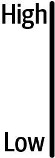
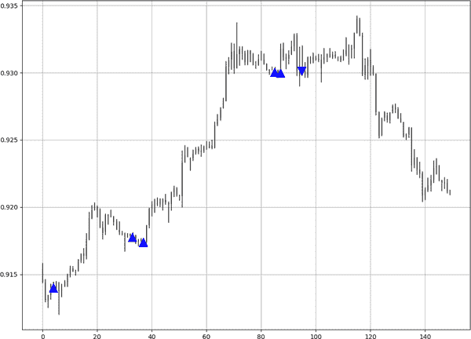

# 第二章 算法思维与函数

*算法*是计算机根据特定条件的实现应用的一组规则。通常使用算法来解决特定问题或简单地遵循重复任务的序列。您还可以使用算法通过扫描设置的条件来查找模式。

本书的主要目的是向您展示如何扫描、发现和评估蜡烛图形和策略。使用算法而不是手动执行任务的主要好处如下：

速度

算法与人类相比能够以极快的速度运行。一个简单的算法可以在几秒钟内扫描数十万条数据，而人类可能需要数周甚至数月来完成同样的任务。

纪律

算法遵循一组明确的规则，并且不具备使它们偶尔忽略规则的情感或情绪。此外，算法不会陷入主观解释的陷阱。这对评估过程至关重要，因为您需要客观和清晰的衡量标准来评判您的交易系统。

错误百分比

当代码中没有错误时，算法通常是无误差的。人类由于不注意和疲劳可能会犯很多错误。

###### 注意

*交易系统*由多个算法组成，如交易和风险管理算法。强大的交易系统依赖于明确和稳定的基于规则的算法来提供可靠的衡量标准。

本章分为四节。首先涵盖了原始函数，这些函数处理了本书中始终使用的基本数据操作。然后展示了如何对模式和策略的信号进行编码。接着介绍了如何在价格图表上可视化信号，以便您得到美观且易于解释的表现。最后，您将学习关键绩效评估指标及其编码方式。确保掌握本章的概念，因为它们对本书的其余部分至关重要；它们不仅有助于检测模式，还有助于创建策略。

# 编码原始函数

*原始函数*是一小组自定义函数，帮助您更好地操作数据数组。原始函数的概念始于我早年练习编码的一项练习，但随着时间的推移，它们成为我在研究中经常使用的常规代码片段。

分析和回测是重复性任务，需要一些函数在任何地方起作用。让我们从最基本的原始函数开始（记住，您将在整本书中使用`numpy`）。

## 向数组添加列的函数

有时，您需要添加列以填充它们，其中可以是指标或信号。例如，假设您有一个由四列组成的 OHLC 数组。您可以使用函数添加额外的列，您可以使用这些列来容纳以下内容：

+   基于收盘价计算的指标，例如简单移动平均¹

+   使用预定的二进制值（例如买入信号为 1，卖出信号为−1）作为买卖信号的代理

###### 注意

数组中的行表示时间步骤。在本书中我使用小时时间框架，这意味着每行包含每小时的开盘、最高、最低、收盘价以及任何指标值或买卖代理。

因此，第一个原始函数是`add_column()`，如下面的代码片段所示：

```py
def add_column(data, times):

    for i in range(1, times + 1):

        new = np.zeros((len(data), 1), dtype = float)

        data = np.append(data, new, axis = 1)

    return data
```

函数循环由变量`times`选择的预定次数，并且每次循环都会创建一个新的数组，其中包含与原始数据相同长度的零值，如`len(data)`所示。这个新数组由`np.zeros()`预建的`numpy`函数创建。

最后一步是使用`np.append()`将这个新创建的数组直接粘贴到原始四列旁边，从而得到一个有五列的数组。

随着循环的进行，列数逐渐增加。参数`axis`指定了行和列之间的二元选择。当它等于 0 时，它指的是行，当它等于 1 时，它指的是列。记住，变量`times`是您希望添加的列数，这在调用函数时指定。让我们看一个示例以使事情更清楚。

您有一个名为`my_data`的数组，由四列组成，您希望添加五列新列以更新原始数组，使其具有九列。假设您已经定义了`add_column()`函数，您会写什么来完成这个任务？答案如下：

```py
`# Adding five columns to an existing array`
my_data = add_column(my_data, 5)
```

## 从数组中删除列的函数

当尝试计算复杂的指标时，可能会出现额外的列，因为您可能需要通过中间计算来填充它们，这些计算在指标准备好之后是不需要的。例如，使用一列来计算权重，然后使用下一列来计算基于权重的指标。您会保留指标列，但不保留权重列。

最后，您希望保留指标的最终结果，并删除先前的列，这样您就可以得到一个由 OHLC 数据组成的干净数组，其中下一列是指标的读数。

快速简便的方法是使用`delete_column()`函数。下面的代码片段显示了如何定义它：

```py
def delete_column(data, index, times):

    for i in range(1, times + 1):

        data = np.delete(data, index, axis = 1)

    return data

```

###### 注意

记住，在使用函数之前，必须先定义它。这意味着在编写函数的语法后，必须执行它，以便 Python 将其存储在内存中。

函数循环遍历指定范围，即您要从选定索引开始删除的列数。例如，函数删除从第 4 列开始的三列，包括第 4 列。

函数说明，新转换的数组使用内置的`numpy`函数`np.delete()`从变量`index`开始删除列。最后，变量`times`是要删除的列数，在调用函数时指定。以下是两个示例，以便更清晰地理解：

+   你有一个包含 10 列的数组，并且想要从索引为 4 的列开始删除 4 列。下面是如何实现的：

    ```py
    my_data = delete_column(my_data, 4, 4)

    ```

###### 注意

请记住，索引为 4 的列不是第四列，而是第五列。这是因为 Python 从零开始索引。

+   你有一个包含八列的数组，并且想要从索引为 1 的列开始删除两列。下面是如何实现的：

    ```py
    my_data = delete_column(my_data, 1, 2)
    ```

你主要会在技术指标中使用`delete_column()`，而不是模式，因为后者是直接的规则，而不是像一些指标那样的顺序复杂计算。

## 向数组添加行的函数

有时候你想在数组末尾添加行，由于滞后或手动添加编码值。你可以使用以下函数向数组末尾添加空行：

```py
def add_row(data, times):

    for i in range(1, times + 1):       

        columns = np.shape(data)[1]

        new = np.zeros((1, columns), dtype = float)

        data = np.append(data, new, axis = 0)

    return data

```

该函数循环遍历数据，并在每次循环中使用内置函数`np.shape()`找到数组的形状，该函数输出矩阵的行数和列数。由于你只关心列数，你会添加`[1]`来告诉算法你只想要第二个值，也就是列数。将列数存储在变量`columns`中后，算法继续执行下一行，并创建一个全由零组成的新数组，该数组只有一行，列数等于变量`columns`。最后，算法将这个新创建的带有一行的数组附加到原始数组的末尾，从而输出一个与其他行大小相同的新行。

## 从数组中删除行的函数

在计算指标时，一些计算可能需要过去最少数量的数据；否则，你会看到无效值，在 Python 中表现为 NaN²。以下函数从开头删除行：

```py
def delete_row(data, number):

    data = data[number:, ]

    return data
```

这个简单的函数说明，实际数据从`number`索引开始，一直到数据的末尾。基本上，它忽略了从开头选择的若干行。

## 舍入数字的函数

为什么在这里讨论一个看起来不足以成为独立函数的简单概念？答案是除非你将 OHLC 数据的数字四舍五入，否则某些模式非常罕见。

让我们以欧元美元货币对为例。近年来，出于精确性原因，零售市场经销商开始对大多数货币对进行五位小数报价，而不是四位。尽管交易员习惯于*点*的概念，即第四位小数（即 1.0964 中的 4），但现在他们有一个*点分*，即第五位小数（即 1.09645 中的 5）。

这种变化可能会让习惯于传统四位小数系统的市场参与者感到困惑，但这是必要的，并且有利于交易商报出更紧密的价差。*价差*是买入（询价）和卖出（出价）价格之间的差异。这是市场交易商承担风险的补偿。对交易者来说，它被视为交易成本，因为购买时稍微更贵，而出售时稍微更便宜。

让我们利用这个机会讨论一下货币对的工作原理，然后逐步详细解释为什么最终需要对数字进行四舍五入。

货币对由两种货币组成；左边的是基础货币，右边的是价格货币。当你看到 EURUSD 交易报价为 1.0500 时，意味着购买 1 欧元需要花费 1.0500 美元。

现在，假设你用 10500 美元购买了 10000 欧元，几周后发现 EURUSD 的报价为 1.0750。这到底意味着什么？这意味着相对于美元，欧元的价值上升了，因为现在你需要 10750 美元来购买 10000 欧元；因此，从理论上讲，你赚了 250 美元（你也可以称之为 250 点的收益，因为每 1 欧元的价值提高了 0.0250）。只有当你将你的欧元兑换成美元时才会实现这一点，这将使你获得 10750 美元，而不是 10500 美元。随着市场的发展和五位小数系统的引入，你现在可能会看到 EURUSD 的小数点后有五个数字（例如，EURUSD 为 1.07516）。

存在某些蜡烛图模式，需要接近开盘价的收盘价。这就是为什么我在后续章节中的某些模式中包含四舍五入的原因。货币对的最佳四舍五入数必须是四位小数——不多不少。以下代码块显示了四舍五入函数：

```py
def rounding(data, how_far):

    data = data.round(decimals = how_far)

    return data

```

函数使用内置函数`round()`来简化过程。确保理解在搜索特定模式时需要对 OHLC 数据进行四舍五入的必要性，因为在后续章节中你会用到它。

在继续之前，让我们简要练习一下你在本节学到的新函数。假设你有一个 OHLC 数组，你想要：

+   在数组中添加两列：

    ```py
    my_data = add_column(my_data, 2)
    ```

+   从第二列开始删除三列：

    ```py
    my_data = delete_column(my_data, 1, 3)
    ```

+   在数组末尾添加 11 行：

    ```py
    my_data = add_row(my_data, 11)
    ```

+   删除数组中的前四行：

    ```py
    my_data = delete_row(my_data, 4)
    ```

+   将数组中所有的值四舍五入到四位小数：

    ```py
    my_data = rounding(my_data, 4)

    ```

###### 注意

记住，变量`data`通常用于函数中，并引用你想引用的任何数据，而变量`my_data`是我导入的所有 OHLC 数组的默认名称。

# 编码信号

这标志着信号算法的开始。记住，本节的目的是看如何创建一组条件以寻找有效信号。到目前为止，你已经导入了一个资产或货币对的 OHLC 数组。

我还没有讨论任何蜡烛图案的情况下，我会创建一个假设的模式，然后编写其条件并创建信号算法。我们称这个假设的配置为 Alpha 模式：

+   下一个开盘时会产生一个长期（买入）信号，只要当前的最低价低于 5 个周期前和 13 个周期前的最低价，但高于 21 个周期前的最低价。同时，当前条的收盘价必须高于 3 个周期前的收盘价。

+   当前的高价高于 5 个周期前和 13 个周期前的高价，但低于 21 个周期前的高价时，下一个开盘会产生一个短期（卖出）信号。同时，当前条的收盘价必须低于 3 个周期前的收盘价。

###### 注意

*空头卖出*位置是一种复杂的行为，您从第三方借入资产然后卖给买方以获利。最后，您将其买回并归还给原始所有者。如果价格下跌，您将会赚取差价；否则，您将以比您卖出时更高的价格买回它。

前面的要点提供了生成买入和卖出信号所需的一切，因此，您可以开始编写`signal()`函数。

将`signal()`函数视为扫描每一行并在满足您设置的所有条件时留下痕迹的函数。这些痕迹是买入和卖出代理订单的代理。

您需要告诉算法的第一件事是拥有足够数量的列，您希望用买入和卖出订单填充。如前所述，您可以使用`add_column()`来完成这个操作。接下来的步骤是告诉算法在整个数据范围内进行循环，这可以通过`for`语句完成，它在预定义的范围内执行有限循环，而在您的情况下，是 OHLC 数据数组的长度。

当您在验证模式时，可以在接下来的开盘价格上启动仓位，您可以使用`try()`和`except()`函数，它们仅仅是绕过由于在数组的最后一行出现信号并在下一个不存在的行上触发错误导致的错误。为了说明这个错误，想象有 500 行并在第 500 行得到一个买入信号。由于您在下一个开盘时购买，信号将出现在下一个不存在的行上。这将导致索引错误。

现在，您已经准备好编写 Alpha 模式的条件了。通常我先编写看涨条件。因此，在告诉算法添加两列并在忽略`IndexError()`问题的同时循环数据时，我会简单地使用`if`语句添加条件。

这些条件很直观：你只需知道变量`i`是当前循环中的行索引，因此`i-5`是当前行之前五行（时间步长）的变量。`i`变量与`for`循环一起使用，以便条件可以应用于每一行。

然而，有时候你可能需要在 OHLC 数据之后计算指标或波动率度量，这将推动买入和卖出列到下一个索引。这在“指标分析”中有所涵盖。以下代码片段定义了 Alpha 模式的函数：

```py
def signal(data):

    data = add_column(data, 5)    

    for i in range(len(data)):    

       try:

          `# Bullish Alpha`
           if data[i, 2] < data[i - 5, 2] and data[i, 2] < data[i - 13, 2]
              and data[i, 2] > data[i - 21, 2] and \               data[i, 3] > data[i - 1, 3] and data[i, 4] == 0:

                    data[i + 1, 4] = 1 

           `# Bearish Alpha`
           elif data[i, 1] > data[i - 5, 1] and data[i, 1] > data[i - 13,
                ​1] and data[i, 1] < data[i - 21, 1] and \                 data[i, 3] < data[i - 1, 3] and data[i, 5] == 0:

                    data[i + 1, 5] = -1 

       except IndexError:

            pass

    return data

```

语句`data[i, 4] == 0`是要有买入信号，必须在上一行没有买入信号的条件。³ 这是为了避免在模式具有重复性质时出现连续信号。

长信号的代理是在索引为 4 的列中输入数字 1（因此是第五列）。我在验证模式后写`data[i + 1, 4] = 1`的原因是为了强制算法在完成当前收盘价后，在下一个开盘价上进行买入。相反，短信号的代理是在索引为 5 的列中输入数字-1（因此是第六列）。

这样，你就编写了根据行开盘创建信号所需的条件。你如何编写以下条件呢？

+   当前收盘价高于两个周期前的收盘价时，下一个开盘价上生成一个长信号。

+   当当前收盘价低于两个周期前的收盘价时，下一个开盘价上生成一个短信号。

答案在以下代码片段中：

```py
def signal(data):

    data = add_column(data, 2)   

    for i in range(len(data)):   

        try:

            `# Bullish signal`
            if data[i, 3] > data[i - 2, 3]:

                data[i + 1, 4] = 1

  `# Bearish signal`
            elif data[i, 3] < data[i - 2, 3]:

                data[i + 1, 5] = -1

        except IndexError:

            pass

    return data

```

就是这样！你编写信号的方式是使用函数，然后调用它们。调用函数等同于应用它并看到它实现。

###### 注意

要调用信号函数，请使用以下语法：

```py
my_data = signal(my_data)
```

`return`语句强制你重新定义数组，使其成为你想要的（由信号函数定义）。这一义务来自于你正在添加列，因此你必须重新创建数组。

现在，让我们继续进行第三个算法：信号的可视化表示。看起来这是一个可选步骤，而且确实是，但是查看信号样本对你了解可以期待什么是有帮助的。你还必须视觉检查模式的信号，以确保算法正在检测到正确的配置。

# 创建信号图表

当你创建和应用长信号和短信号时，你的策略核心准备就绪，因此你需要以两种不同的方式进行评估：

主观地

目视检查多个信号图表，以检测可能提供算法错误提示的异常情况（例如，算法检测到的错误模式）。这也可以帮助你更好地理解信号的频率和连续性。这就是你将在本节中看到的内容。

客观地

目标评估是更重要的方法。这涉及计算诸如命中率之类的性能指标。随着我在下一节中深入讨论这些指标，您将看到并编写所需的所有指标。

图 2-1 中的简单图表可以帮助您了解当前所处位置。在导入历史数据和编写信号之后，可视化是框架中的第三个算法。


###### 图 2-1\. 算法图

第一章介绍了如何从 MetaTrader 5 平台导入历史 OHLC 数据，您还看到了如何在 MetaTrader 5 平台上没有包含数据的情况下加载您自己的数据。本章已经讨论了如何编写并应用从一组称为 Alpha 模式的条件生成的信号。让我们继续使用相同的例子。

这里是导致有效 Alpha 模式的交易条件的提醒：

+   当前低点低于 5 个周期前和 13 个周期前的低点但高于 21 个周期前的低点时，下一个开盘产生长期信号。同时，当前柱的收盘价必须高于 3 个周期前的收盘价。

+   当前高价高于 5 个周期前和 13 个周期前的高价但低于 21 个周期前的高价时，下一个开盘产生短期信号。同时，当前柱的收盘价必须低于 3 个周期前的收盘价。

下一步是使用简单的柱状图可视化这些信号。然后我在产生长期信号的地方应用朝上箭头，并在产生短期信号的地方应用朝下箭头。在本书后面，我将使用蜡烛图创建这些信号图，但由于我尚未介绍它们，我将使用*简单柱状图*，这是连接每个柱的高点和低点的黑色垂直线。图 2-2 展示了一个简单的柱状图。



###### 图 2-2\. 一个简单的高低杆

作为提醒，我还没有讨论技术分析，所以如果您感到信息过载，请不要担心，因为在下一章中一切都应该更清楚。

看一看图 2-3。这是一个简单的柱状图示例，其中在每个小时的高点和低点之间绘制了垂直线。

让我们将 Alpha 模式的信号应用于这些柱上，以便您了解交易相对于价格走势的位置。这使您可以看到每次获得 Alpha 信号时价格发生了什么变化。


###### 图 2-3\. USDCHF 上的简单柱状图

使用下面的函数，我称之为`signal_chart()`。在我定义信号图表之前，这是如何使用以下函数定义的`ohlc_plot_bars()`创建简单的柱状图的：

```py
def ohlc_plot_bars(data, window):

    sample = data[-window:, ]

    for i in range(len(sample)):

        plt.vlines(x = i, ymin = sample[i, 2], ymax = sample[i, 1], 
        color = 'black', linewidth = 1)  

        if sample[i, 3] > sample[i, 0]:

            plt.vlines(x = i, ymin = sample[i, 0], ymax = sample[i, 3], 
            color = 'black', linewidth = 1)  

        if sample[i, 3] < sample[i, 0]:

            plt.vlines(x = i, ymin = sample[i, 3], ymax = sample[i, 0], 
            color = 'black', linewidth = 1)  

        if sample[i, 3] == sample[i, 0]:

            plt.vlines(x = i, ymin = sample[i, 3], ymax = sample[i, 0] + 
            0.00003, color = 'black', linewidth = 1.00)  

    plt.grid()

```

该函数允许你绘制简单的条形图。它首先通过定义*回顾期*（即最近观察到的数量）来开始，用于可视化的观察数量。回顾期的变量是`window`，因此，一个窗口大小为 500 将显示最近的 500 个观察结果。然后，它通过循环遍历在`window`变量内的观察结果，并使用`plt.vlines()`绘制垂直线，正如前面的代码所示。

要绘制最近的 500 个条形图，请使用以下语法：

```py
ohlc_plot_bars(my_data, 500)
```

现在，让我们将由箭头表示的信号添加到简单的条形图中。看一下以下定义`signal_chart()`函数的代码块，并注意它如何使用我之前展示的函数：

```py
def signal_chart(data, position, buy_column, sell_column, window = 500):

    sample = data[-window:, ]

    fig, ax = plt.subplots(figsize = (10, 5))

    ohlc_plot_bars(data, window)    

    for i in range(len(sample)):

        if sample[i, buy_column] == 1:

            x = i
            y = sample[i, position]

            ax.annotate(' ', xy = (x, y), 
                        arrowprops = dict(width = 9, headlength = 11, 
                        headwidth = 11, facecolor = 'green', color = 
                        'green'))

        elif sample[i, sell_column] == -1:

            x = i
            y = sample[i, position]

            ax.annotate(' ', xy = (x, y), 
                        arrowprops = dict(width = 9, headlength = -11, 
                        headwidth = -11, facecolor = 'red', color = 
                        'red'))  

```

变量`position`应设置为零，因为信号是指开盘价，这样箭头位置就合适了。因此，函数被这样调用：

```py
signal_chart(my_data, 0, 4, 5, window = 250)
```

如果你将此函数应用于 OHLC 数组，其中已经应用了来自 Alpha 模式的信号，你将得到图 2-4 中的信号图表。请注意，向上箭头表示长信号的确切生成位置，而向下箭头表示短信号的生成位置。图 2-4 显示了 USDCHF 小时值上的信号图表。



###### 图 2-4\. USDCHF 上的信号图表

让我们回顾一下你迄今为止做过的事情。你首先定义和编码了信号，以便有你的买入和卖出订单的代理。然后，你编写了一个图表函数，显示这些信号叠加在价格图表上，这给出了你在过去买入和卖出的位置的概念。

请注意，即使简单的条形图只显示高点和低点，信号是放在开盘价处的，因为它考虑了 OHLC 数据的总体情况。

下面的代码显示了在 USDCHF 小时值上按时间顺序执行此过程的过程，如前面的图表所示：

```py
`# Choosing the asset`
pair = 1

`# Time frame`
horizon = 'H1'

`# Importing the asset as an array`
my_data = mass_import(pair, horizon)

`# Creating the signal function`
def signal(data):

    data = add_column(data, 2)   

    for i in range(len(data)):   

        try:

        `# Bullish Alpha`
            if data[i, 2] < data[i - 5, 2] and data[i, 2] < 
               data[i - 13, 2] and data[i, 2] > data[i - 21, 2] and 
               data[i, 3] > data[i - 1, 3] and data[i, 4] == 0:

                     data[i + 1, 4] = 1

          `# Bearish Alpha`
            elif data[i, 1] > data[i - 5, 1] and data[i, 1] > 
                 data[i - 13, 1] and data[i, 1] < data[i - 21, 1] and 
                 data[i, 3] < data[i - 1, 3] and data[i, 5] == 0:

                     data[i + 1, 5] = -1

        except IndexError:

            pass

    return data

`# Calling the signal function`
my_data = signal(my_data)

`# Charting the latest 150 signals`
signal_chart(my_data, 0, 4, 5, window = 150)

```

图 2-5 展示了应用在 EURUSD 小时值上的相同过程。请注意，该模式是假设的，没有科学依据。


###### 图 2-5\. EURUSD 上的信号图表

# 编写绩效评估函数

可视化信号只是第一步。你需要客观数据来告诉你是否有一个赢利或亏损的交易系统。

为此，你需要*绩效评估*，这只是计算不同指标和比率的过程，这些指标和比率可以给你关于过去绩效的线索。之后，你的工作是解释这些指标，并尝试调整模式的使用以改善这些指标。

请记住，一个交易策略很容易是导致模式的几个条件；因此，即使本书讨论蜡烛图案的细节，我也将简要回顾交易策略。第十章和第十一章讨论了几个自然涉及蜡烛图案的策略。

###### 注意

绩效评估还涉及到过去绩效预示未来绩效的期望。这种持续性可能性不大，但回测和评估过去绩效是验证和实施你的策略的最佳方法。

## 命中率

我们人类更喜欢正确而不是错误。通常情况下，我们为自己的成就感到自豪，为失败感到羞愧，这就是为什么当我们发现大多数决策导致预期和期望结果时，我们会感到安慰。大多数时候正确提供了一种每个人都欢迎的自我提升感。毕竟，谁不想被视为成功呢？

在交易行话中，*命中率* 是过去盈利交易数量除以总已实现过去交易数量。这意味着命中率衡量了你在预测未来方向时正确的百分比。70%的命中率意味着平均而言，你在每 100 次交易中有 70 次盈利，这并不差，但你必须绝对小心，因为这是一把双刃剑，稍后你会明白为什么。现在，让我们看一下命中率的数学表示：

<math alttext="Hit ratio equals StartFraction Number of profitable trades Over Number of total trades EndFraction"><mrow><mtext>Hit</mtext> <mtext>ratio</mtext> <mo>=</mo> <mfrac><mrow><mtext>Number</mtext><mtext>of</mtext><mtext>profitable</mtext><mtext>trades</mtext></mrow> <mrow><mtext>Number</mtext><mtext>of</mtext><mtext>total</mtext><mtext>trades</mtext></mrow></mfrac></mrow></math>

显然，总交易次数包括盈利交易和亏损交易的数量。命中率是接收者心理影响最观察和分析的绩效指标之一。确保你计算的比率是在已实现交易总数上，不包括未决交易。

## 收益率

当你投资 100 美元，一年后它变成 105 美元，你可以如何描述你的收益率呢？不要仅仅说你赚了 5 美元，而是可以将你的利润表述为相对于初始投资的回报，计算方法如下：

<math alttext="Rate of return equals left-parenthesis StartFraction New balance Over Initial balance EndFraction right-parenthesis minus 1"><mrow><mtext>Rate</mtext> <mtext>of</mtext> <mtext>return</mtext> <mo>=</mo> <mo>(</mo> <mfrac><mrow><mtext>New</mtext><mtext>balance</mtext></mrow> <mrow><mtext>Initial</mtext><mtext>balance</mtext></mrow></mfrac> <mo>)</mo> <mo>-</mo> <mn>1</mn></mrow></math>

这意味着你的收益率为 5%。用百分比来表达盈利能更好地反映投资组合的盈亏幅度。例如，看看以下两个假设情况：

+   A 组投资组合赚取了$125,000。

+   B 组投资组合回报率为 10%。

A 组投资组合似乎更令人印象深刻，但如果我告诉你两个投资组合的初始余额都是$2,000,000 呢？这确实使得 A 组的表现不佳，因为它只赚了 6.25%，而 B 组则赚了 10%（$200,000）。

你还可以计算几种类型的回报率，即*毛*回报率和*净*回报率。当然，你最应该关注的是后者，因为它扣除了费用。让我们看看以下例子中两者的区别：

+   2021 年 01 月 01 日的初始余额为$1,000,000

+   2021 年 12 月 31 日的最终总余额为$1,175,000。

+   2021 年期间未支付的佣金和费用总计为$35,000。

+   2021 年未支付的研究提供商费用为$10,000。

在这个例子中，毛收益率是不考虑支付给经纪人和其他第三方供应商的费用的收益率：

<math alttext="Gross rate of return left-parenthesis StartFraction 1 comma 175 comma 000 Over 1 comma 000 comma 000 EndFraction right-parenthesis minus 1 equals 17.5 percent-sign"><mrow><mtext>Gross</mtext> <mtext>rate</mtext> <mtext>of</mtext> <mtext>return</mtext> <mo>=</mo> <mo>(</mo> <mfrac><mrow><mn>1</mn><mo lspace="0%" rspace="0%">,</mo><mn>175</mn><mo lspace="0%" rspace="0%">,</mo><mn>000</mn></mrow> <mrow><mn>1</mn><mo lspace="0%" rspace="0%">,</mo><mn>000</mn><mo lspace="0%" rspace="0%">,</mo><mn>000</mn></mrow></mfrac> <mo>)</mo> <mo>-</mo> <mn>1</mn> <mo>=</mo> <mn>17</mn> <mo lspace="0%" rspace="0%">.</mo> <mn>5</mn> <mo lspace="0%" rspace="0%">%</mo></mrow></math>

净回报率更接近你实际获得的收益，通过以下计算得出：

<math alttext="Net rate of return left-parenthesis StartFraction 1 comma 175 comma 000 minus 35 comma 000 minus 10 comma 000 Over 1 comma 000 comma 000 EndFraction right-parenthesis minus 1 equals 13 percent-sign"><mrow><mtext>Net</mtext> <mtext>rate</mtext> <mtext>of</mtext> <mtext>return</mtext> <mo>=</mo> <mo>(</mo> <mfrac><mrow><mn>1</mn><mo lspace="0%" rspace="0%">,</mo><mn>175</mn><mo lspace="0%" rspace="0%">,</mo><mn>000</mn><mo>-</mo><mn>35</mn><mo lspace="0%" rspace="0%">,</mo><mn>000</mn><mo>-</mo><mn>10</mn><mo lspace="0%" rspace="0%">,</mo><mn>000</mn></mrow> <mrow><mn>1</mn><mo lspace="0%" rspace="0%">,</mo><mn>000</mn><mo lspace="0%" rspace="0%">,</mo><mn>000</mn></mrow></mfrac> <mo>)</mo> <mo>-</mo> <mn>1</mn> <mo>=</mo> <mn>13</mn> <mo lspace="0%" rspace="0%">%</mo></mrow></math>

###### 警告

投资组合仍然盈利，但在扣除成本后受到了打击。有些投资组合在扣除成本后从赢家变成了输家，这就是选择一个有合理费率结构的经纪商的重要性，以免长期侵蚀你的利润。即使是佣金的小差异也会对积极交易者产生巨大影响。

## 盈利因子

*盈利因子*是一个快速衡量指标，用来看你每损失 1 个货币单位时赢得多少。它的计算方法是总毛利润与总毛亏损之间的比率，也就是将所有盈利交易的盈利总和除以所有亏损交易的亏损总和。在数学上，它表示如下：

<math alttext="Profit factor equals StartFraction Gross total profit Over StartAbsoluteValue Gross total loss EndAbsoluteValue EndFraction"><mrow><mtext>Profit</mtext> <mtext>factor</mtext> <mo>=</mo> <mfrac><mrow><mtext>Gross</mtext><mtext>total</mtext><mtext>profit</mtext></mrow> <mrow><mo>|</mo><mtext>Gross</mtext><mtext>total</mtext><mtext>loss</mtext><mo>|</mo></mrow></mfrac></mrow></math>

将其除以总毛亏损的绝对值非常重要。让我们以 2020 年赚取了$127,398 和亏损了$88,318 的投资组合为例。在这种情况下，盈利比率将是多少？

答案是 1.44，这被解释为平均每损失$1.00 赢得$1.44。每当盈利性为正时，盈利因子大于 1，每当盈利性为负时，盈利因子小于 1。一些交易者喜欢通过调整策略来优化它们，直到找到最高的盈利因子。

## 风险-收益比

一个好的交易系统是通过获得奖励来衡量每承担一定风险量。当你冒着$1.00 的风险赢得$1.00 时，风险-收益比等于 1.00，你有 50%的机会赢得或输掉相同的金额，除非你有一个随时间推移使你比输赢更多的统计优势。

这个统计优势是命中率的概念。当你进入一笔交易并设置*目标*（盈利平仓的水平）和*止损*（为避免更糟结果而进行的亏损平仓水平）时，你实际上可以计算出你的理论（预期）风险-收益比。

这是一个简单的例子，基于购买加密货币 Cardano（ADA）相对于 USDT（代表 USD）：

+   以$1.00 购买 ADAUSDT。

+   设置止损价为$0.95。

+   设置目标为$1.10。

这笔交易的风险-收益比是多少，你如何解释它？简单来说，你冒着$0.05 的风险来赚取$0.10，这意味着你的奖励是风险的两倍；因此，风险-收益比为 2.00。

<math alttext="Risk reward ratio equals StartFraction StartAbsoluteValue Entry price minus Target price EndAbsoluteValue Over StartAbsoluteValue Entry price minus Stop price EndAbsoluteValue EndFraction"><mrow><mtext>Risk</mtext> <mtext>reward</mtext> <mtext>ratio</mtext> <mo>=</mo> <mfrac><mrow><mo>|</mo><mtext>Entry</mtext><mtext>price</mtext><mo>-</mo><mtext>Target</mtext><mtext>price</mtext><mo>|</mo></mrow> <mrow><mo>|</mo><mtext>Entry</mtext><mtext>price</mtext><mo>-</mo><mtext>Stop</mtext><mtext>price</mtext><mo>|</mo></mrow></mfrac></mrow></math>

上述公式显示了如何计算理论或预期风险-收益比，这是在交易之前设定的。

###### 提示

一个经验法则是通常尝试选择提供接近 2.00 的风险-收益比的策略，因为这为你提供了足够的可预测误差余地以保持盈利。假设交易数量相同，具有 2.00 风险-收益比，你只需 33.33%的命中率即可打平。

保本命中率是达到零利润和损失所需的最低命中率，不包括成本和费用。由于它仅仅是一个指示性的测量，保本命中率在绩效报告中很少呈现。然而，你可以通过风险-收益比轻松计算它，如下所示：

<math><mrow><mtext>保本命中率</mtext> <mo>=</mo> <mfrac><mn>1</mn> <mrow><mn>1</mn><mo>+</mo><mtext>风险收益比</mtext></mrow></mfrac></mrow></math>

这导致命中率与风险-收益比之间存在负相关关系，因为你的风险越小、收益越大，实际上命中收益（目标）的可能性就越小，因为你距离风险（止损）更近。考虑以下例子：

+   自 2021 年 1 月 1 日以来的命中率 = 43.67%

+   自 2021 年 1 月 1 日以来实现的风险-收益比 = 2.11

在这种情况下，保本命中率会是多少？通过使用公式，你可以找到以下结果：

<math><mrow><mtext>保本命中率</mtext> <mo>=</mo> <mfrac><mn>1</mn> <mrow><mn>1</mn><mo>+</mo><mn>2</mn><mo lspace="0%" rspace="0%">.</mo><mn>11</mn></mrow></mfrac> <mo>=</mo> <mn>32</mn> <mo lspace="0%" rspace="0%">.</mo> <mn>15</mn> <mo lspace="0%" rspace="0%">%</mo></mrow></math>

这意味着你拥有一个获胜的策略，因为你平均每 100 笔交易中有 43-44 笔盈利交易。此外，对于这些交易中的每一笔，你的平均盈利是你亏损的 2.11 倍，这就是区别所在。良好的风险管理是使交易系统盈利的关键。仅凭命中率的初步观察，会让人感觉不起眼，但通过看风险-收益比，会呈现出全新的画面。

实际上，有些交易可以在止损或目标价位之前关闭，这是由于各种原因，例如在同一方向上再次得到信号。因此，你有两个不同的风险-收益比：

理论上的风险-收益比

这通常是在交易之前设置的，是一个预测。

实现的风险-收益比

这是每笔交易的平均利润除以每笔交易的平均亏损，这给出了你与理论风险-收益比有多接近的一个想法。

让我们看另一个例子来解释这两个比率：

+   在 2021 年 1 月 1 日设定的理论风险-收益比 = 2.00

+   2021 年平均每笔交易的盈利 = $241,597

+   2021 年平均每笔交易的亏损 = $127,222

因此，实现的风险-收益比为 1.90，略低于理论值。这是可以接受的，因为有时你在达到止损或目标水平之前会退出一些交易。本书中回测中呈现的比率是实现的比率。

## 交易次数

交易频率对于性能评估至关重要。需要记住的一个经验法则是至少要有 30 笔交易，以达到可靠性的最低阈值。当然，多年来，交易频率必须要高得多。有些模式非常罕见，不太可能提供多少信号，从而阻止你对其进行正确的评估。

不幸的是，有些模式可能非常罕见，但无论如何，这本书并不是关于美化和夸大它们的，因为其中一些实际上非常糟糕且不具预测性，但仍被许多零售交易者用来分析市场。这将我们带到书的第二个实用性：揭秘。现在是时候看看如何在 Python 中编写这些指标了。

## 创建一个性能评估函数。

你终于结束了关于性能指标的理论部分讨论。即使在现实中有更多深入细节的性能指标，你也不需要计算它们所有来快速了解什么有效什么无效。

例如，回报率在后面的回测中并不是很有用，因为它是仓位大小和交易成本的函数，所以它并不直接处理可预测性。这就是为什么我只使用其他四个指标：

+   命中率给你一个关于模式或策略可预测性的初步概念。

+   利润因子让你看到生成的利润是否大于生成的损失，而不论仓位大小。

+   实现的风险回报比告诉你，相比于承担的风险，你能得到多少回报。

+   信号的频率显示结果是否有意义，以及你是否期望频繁信号或罕见信号。

性能指标被捆绑到一个我称为`performance()`的 Python 函数中，如下面的代码块所示。我将在代码之后解释它是如何工作的及其输出：

```py
def performance(data, 
                 open_price, 
                 buy_column, 
                 sell_column, 
                 long_result_col, 
                 short_result_col, 
                 total_result_col):

    `# Variable holding period`
    for i in range(len(data)):

        try:

            if data[i, buy_column] == 1:

                for a in range(i + 1, i + 1000):

                    if data[a, buy_column] == 1 or data[a, sell_column] \                                               == -1:

                        data[a, long_result_col] = data[a, open_price] - \                                                    data[i, open_price]

                        break

                    else:

                        continue                

            else:

                continue

        except IndexError:

            pass

    for i in range(len(data)):

        try:

            if data[i, sell_column] == -1:

                for a in range(i + 1, i + 1000):

                    if data[a, buy_column] == 1 or data[a, sell_column] \                                               == -1:

                        data[a, short_result_col] = data[i, open_price] -\                                                     data[a, open_price]

                        break   

                    else:

                        continue

            else:
                continue

        except IndexError:

            pass   

  `# Aggregating the long & short results into one column`
    data[:, total_result_col] = data[:, long_result_col] + \                                 data[:, short_result_col]  

    `# Profit factor   ` 
    total_net_profits = data[data[:, total_result_col] > 0, \                         total_result_col]
    total_net_losses  = data[data[:, total_result_col] < 0, \                         total_result_col] 
    total_net_losses  = abs(total_net_losses)
    profit_factor     = round(np.sum(total_net_profits) / \                         np.sum(total_net_losses), 2)

`# Hit ratio`   
    hit_ratio         = len(total_net_profits) / (len(total_net_losses) \                         + len(total_net_profits))
    hit_ratio         = hit_ratio * 100

    `# Risk-reward ratio`
    average_gain            = total_net_profits.mean()
    average_loss            = total_net_losses.mean()
    realized_risk_reward    = average_gain / average_loss

    `# Number of trades`
    trades = len(total_net_losses) + len(total_net_profits)

    print('Hit Ratio         = ', hit_ratio)
    print('Profit factor     = ', profit_factor) 
    print('Realized RR       = ', round(realized_risk_reward, 3))
    print('Number of trades  = ', trades)    

```

函数并不像看起来那么复杂。例如，它接受七个变量，这些变量指的是数组及其列索引。变量`data`表示包含历史数据和模式生成信号的 OHLC 数组。记住，信号以 1 的形式表示长触发，以−1 的形式表示短触发。变量`open_price`只是数组的第一列，表示每个时间步的开盘价格。在你的情况下，因为你使用的是每小时的时间框架。

不要忘记，在 Python 中，数组的第一列索引为零，因此变量`open_price`始终具有值 0。接下来的两个变量分别表示买入和卖出信号的位置。对于简单的模式，通常是 4 和 5，而对于更复杂的模式，则可能更多。`long_result_col`和`short_result_col`变量是从`buy_column`和`sell_column`中找到的结果的索引。

这意味着每当你退出一个多头头寸时，该头寸的结果就会存储在由变量`long_result_col`描述的列中。最后，`total_result_col`总是紧随`short_result_col`之后的下一列，因为它是两个结果列的总和。`total_result_col`列被创建以便于计算绩效指标。现在，要调用函数，请使用以下语法：

```py
my_data = performance(my_data, 0, 4, 5, 6, 7, 8)
```

该语句调用了一个名为`my_data`的数组上的性能函数，你已经学会如何导入它，然后用必要的值替换变量。如果你不确定如何找到这些变量，请仔细重新阅读前面的段落。

## 一个假设的例子：评估绩效

在我结束本章之前，让我们看一个完整的例子并解释其结果。毕竟，回测是关于理解策略或模式提供了什么，以便改进它。以下是一个在 2017 年到 2021 年之间使用单一策略的投资组合的详细信息：

+   总交易数 = 2,348

+   盈利交易 = 1,236

+   亏损交易 = 1,112

+   理论风险-收益比 = 2.00

+   交易总净收益 = $457,995

+   交易总净损失 = $321,589

+   每笔交易的平均盈利 = $370.54

+   每笔交易的平均损失 = $289.19

### 2017 年到 2021 年期间的命中率是多少？

命中率简单地指的是盈利交易数与实现交易总数的比率。在这个例子中，它是 52.64%。

### 2017 年到 2021 年之间的净利润因子是多少？你会如何解释它？

利润因子是总利润除以总损失。在这个例子中，它是 1.42，远高于 1.00。该投资组合每损失 1.00 美元就能赚取 1.42 美元。

### 2017 年到 2021 年之间的实现的风险-收益比是多少？与理论风险-收益比相比如何？

实现的风险-收益比是每笔交易的平均收益与平均损失的比率。在这个例子中，它是 1.28。远低于理论风险-收益比 2.00，因此投资组合正在经历次优的风险管理，可能是由于过早关闭头寸。

### 我们应如何解释信号的频率？

在五年中进行了 2,348 笔交易，这个投资组合的交易活动相对较高，约每年 469 笔交易。对于如此多的交易量来说，交易成本是一个令人担忧的问题。从统计上讲，性能指标应适当描述投资组合的情况，因为有很多信号。

### 这是一个管理良好的投资组合吗？

尽管通过利润因子显示的盈利能力很高，管理者应考虑在保持命中率超过 50%的情况下改进实现的风险-回报比。这可以通过调整、优化甚至审查进出场技术来实现。管理者还应该研究对交易进行过滤，以减少经纪费用。然而，投资组合处于盈利状态，并且似乎有一种预测策略。

你现在已经完成了构建算法核心的工作，这些算法将用于分析和回测蜡烛图形态。在展示这些图形态之前，你还有一个必须理解的技术分析，这是蜡烛图形态识别所属的研究领域。

¹ *移动平均线* 是在滚动窗口上计算的均值。通常用于理解市场的趋势。移动平均线在第 Chapter 3 中有更深入的讨论。

² NaN 的缩写。如果单元格有 NaN，则被视为无效，如果用于计算，将只产生其他 NaN。

³ 由于本书始终使用小时时间框架，上一行指的是前一个小时蜡烛图。
