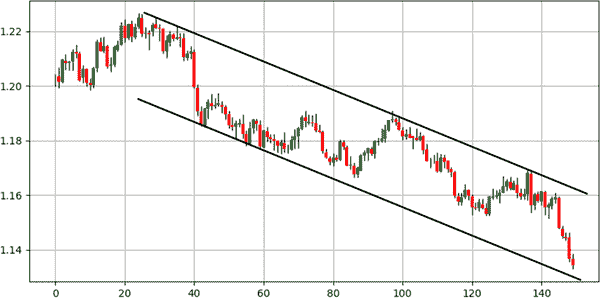

# 第三章。介绍技术分析

*技术分析*依赖于对价格行为历史的视觉解释，以确定市场可能的总体方向。它依赖于过去是未来最好的预测因素的想法。在技术分析这个广阔领域内有几种技术，特别是以下几种：

图表分析

这是你将主观的视觉解释技巧应用到图表上的地方。你通常会使用绘制支撑和阻力线以及回撤等方法来找到旨在确定下一步动向的拐点水平。

指标分析

这是你使用数学公式创建客观指标的地方，这些指标可以是趋势跟踪或逆向的。已知的指标包括移动平均线和相对强弱指数（RSI），这两者在本章中将更详细地讨论。

模式识别

这是你监视某些反复出现的配置并采取行动的地方。*模式*通常是偶尔出现并呈现特定理论或经验结果的事件。在金融领域，情况更加复杂，但已知的某些模式随时间积累价值，这可能部分是由于一种被称为*自我实现预言*的现象（一种初始预期导致其确认的过程）所致。已知的模式包括蜡烛图模式，这些模式是本书的主角。

让我们快速了解技术分析的历史，这样你就能更清楚地知道可以期待什么。技术分析依赖于三个原则：

历史会重演。

在趋势和范围内，你可能会看到簇集。此外，某些配置和模式大多数时候可能会产生相似的结果。¹

市场会消化一切。

假设一切（所有基本、技术和定量信息）都包含在当前价格中。

市场波动成浪。

由于不同的时间框架和需求，交易者以不同的频率买卖，因此形成趋势和波动，而不是一条直线。

不幸的是，技术分析被零售交易社区过分吹捧和滥用，这使得它在专业行业中的声誉略显不佳。每种分析方法都有其优点和缺点，有成功的基本分析、技术分析和定量分析投资者，但也有三个领域的失败投资者。

基本分析依赖于经济和金融数据，以长期投资视角对特定证券或货币进行判断，而量化分析更为灵活，更常应用于短期数据。它使用数学和统计概念进行预测。

在其他假设中，技术分析表明市场不高效，但这意味着什么呢？*市场效率*指的是信息已经嵌入到当前价格中，并且价格和价值是相同的。当你购买资产时，你希望它是*被低估的*（在基本分析术语中）或者*被过度卖出*（在技术分析术语中），这就是你相信价格应该上涨以达到价值的原因。因此，你假设价值大于价格。市场效率否认任何价格不等于价值的主张，因此建议任何α交易不应导致高于平均回报（*α交易*是指从事超过基准表现的投机操作，通常是指一个指数或加权指数）。

市场效率假说是技术分析师的最大敌人之一，因为其原则之一是在弱式市场效率中，你无法通过技术分析获得超额回报。因此，技术分析在一开始就被打倒，然后基本分析也受到了打击。

可以合理地假设，未来某个时刻，由于参与者的数量和获取信息的便利性，市场将不得不变得高效。然而，正如政治和异常事件所示，市场往往远非高效。

###### 注意

俄罗斯入侵乌克兰是一个政治事件的例子，引发了市场的恐慌和非理性行为。类似地，中央银行意外加息是异常经济事件的例子。

# Charting Analysis

在理解图表分析之前，你需要知道在打开图表时会看到什么，更具体地说是蜡烛图。

假设市场开盘价为$100。某些交易活动发生。让我们记录一下这一小时内的最高价($102)和最低价($98)。同时，记录这一小时的收盘价($101)。请记住，这四个数据分别被称为*开盘价*、*最高价*、*最低价*和*收盘价*（OHLC）。它们代表了创建蜡烛图所必需的四个基本价格。

*蜡烛图*非常简单和直观。它们是沿时间线的盒状元素，包含 OHLC 数据。图 3-1 展示了蜡烛图的工作原理。


###### 图 3-1。左侧是牛市蜡烛图；右侧是熊市蜡烛图

*牛市*蜡烛图的收盘价高于开盘价，而*熊市*蜡烛图的收盘价低于开盘价。

蜡烛图是分析金融时间序列的最著名方法之一。它们比简单的折线图包含更多信息，并且比条形图具有更强的视觉可解释性。Python 中许多库提供图表函数，但在我看来，自己动手做总是更好。让我们从折线图开始。

###### 注

*折线图* 是通过按时间顺序连接收盘价创建的。这是绘制资产最简单的方法。它是三种图表类型中信息最少的，因为它只显示收盘价。

在 Python 中绘制基本线图非常简单，只需一行代码。您必须确保已导入一个名为`matplotlib`的库，该库会为您处理绘图。以下代码片段显示了如何绘制一个包含 EURUSD 小时时间框架中的收盘价的一维数组的折线图：

```py
`# Importing the necessary charting library`
import matplotlib.pyplot as plt

`# The syntax to plot a line chart`
plt.plot(my_data, color = 'black', label = 'EURUSD')

`# The syntax to add the label created above`
plt.legend()

`# The syntax to add a grid`
plt.grid()

```

图 3-2 展示了 EURUSD 的折线图。该图仅提供收盘价和总体趋势方向的信息。


###### 图 3-2\. EURUSD 的折线图

现在让我们用蜡烛图将其提升到一个新的水平。

最简单的方法是考虑在每个时间步骤上画垂直线（就像第 2 章 中展示的简单条形图）。按照以下步骤操作：

1.  为每行绘制表示最高和最低点的垂直线。例如，在 OHLC 数据上，您可以使用名为`matplotlib`的函数`vlines()`，它使用最小（低价）和最大（高价）值在图表上绘制垂直线。因此，此函数绘制了在每个高低之间延伸的条形图。图 3-3 显示了一个简单的条形图（类似于第 2 章 中的条形图），其中每根条形是 EURUSD 的高低范围。

1.  重复第一步，只是这次在开盘和收盘价格上应用新的垂直线。这给你了一个垂直线里面的垂直线，但这是看不见的。如何解决？通过施加颜色条件和表示蜡烛图主体的更大宽度。


###### 图 3-3\. EURUSD 的简单条形图

图 3-4 显示了 EURUSD 的完整蜡烛图。您可以看到通过颜色编码和 OHLC 数据的可见性，您能够获取更多信息，如波动性和收盘价相对开盘价的总体趋势。这类信息在折线图中是不可用的。


###### 图 3-4\. EURUSD 的蜡烛图

实现这一点的完整代码如下：

```py
def ohlc_plot_candles(data, window):

    sample = data[-window:, ]

    for i in range(len(sample)):

        plt.vlines(x = i, ymin = sample[i, 2], ymax = sample[i, 1], 
                   color = 'black', linewidth = 1)  

        if sample[i, 3] > sample[i, 0]:

            plt.vlines(x = i, ymin = sample[i, 0], ymax = sample[i, 3], 
                       color = 'green', linewidth = 3)  

        if sample[i, 3] < sample[i, 0]:

            plt.vlines(x = i, ymin = sample[i, 3], ymax = sample[i, 0], 
                       color = 'red', linewidth = 3)  

        if sample[i, 3] == sample[i, 0]:

            plt.vlines(x = i, ymin = sample[i, 3], ymax = sample[i, 0] + 
                       0.00003, color = 'black', linewidth = 1.00)  

    plt.grid()

```

要调用函数并显示最近的 100 根蜡烛图，请使用以下语法：

```py
ohlc_plot_candles(my_data, window = 100)
```

有些人更喜欢用其他颜色绘制蜡烛图。为此，您必须调整`color`参数。例如，以下代码绘制了一个灰色（看涨）和黑色（看跌）的蜡烛图表：

```py
def ohlc_plot_candles(data, window):

    sample = data[-window:, ]

    for i in range(len(sample)):

        plt.vlines(x = i, ymin = sample[i, 2], ymax = sample[i, 1],
                   color = 'black', linewidth = 1)  

        if sample[i, 3] > sample[i, 0]:

            plt.vlines(x = i, ymin = sample[i, 0], ymax = sample[i, 3],
                       color = 'grey', linewidth = 3)  

        if sample[i, 3] < sample[i, 0]:

            plt.vlines(x = i, ymin = sample[i, 3], ymax = sample[i, 0],
                       color = 'black', linewidth = 3)  

        if sample[i, 3] == sample[i, 0]:

            plt.vlines(x = i, ymin = sample[i, 3], ymax = sample[i, 0] +
                       0.00003, color = 'black', linewidth = 1.00)  

    plt.grid()
```

*图表分析*是通过主观绘制来寻找支撑和阻力线的任务。*水平或对角线*线条是找到预测市场反应水平的精髓：

+   *支持水平*是市场应该反弹的水平，因为暗示周围的需求应该高于供应。

+   *阻力水平*是市场应该退回的水平，因为暗示周围的供应应该高于需求。

资产在时间轴上的方向可以分为三种：*上升趋势*，价格创造更高高点，*下降趋势*，价格创造更低低点，以及*横向（或盘整）*，价格在较长时间内围绕同一水平波动。

图 3-5 显示了在 EURUSD 接近 0.9850 附近的支持水平。通常情况下，当价格接近支持时，交易者开始考虑买入。这是因为预期应该会有向上的反应，因为力量平衡应该更向需求（积极）方向倾斜，交易者愿意支付更高的价格，因为他们预期将来会有更高的价格（记住之前讨论的价格对价值的论点）。这里的含义是大多数交易者看到的价格低于价值。


###### 图 3-5\. EURUSD 上显示 0.9850 支持的蜡烛图

图 3-6 显示在 EURUSD 接近 0.9960 附近的一个阻力水平。通常情况下，当市场接近阻力时，交易者开始考虑做空市场。这是因为预期应该会出现向下的反应，因为力量平衡应该更向供应方倾斜。这里的含义是大多数交易者看到的价格高于价值。


###### 图 3-6\. EURUSD 上显示 0.9960 阻力的蜡烛图

盘整（横向）市场使水平支撑和阻力线更有可能奏效。这是因为已经暗示了供需之间的一般平衡。因此，如果供应过剩，市场会迅速调整，因为需求应该足以稳定价格。

图 3-7 显示了一个被困在两个水平水平之间的盘整市场；这是 EURUSD 的情况。每当市场接近盘整市场中的阻力线时，您应该更有信心会发生下跌，而不像在上涨市场中那样，每当接近支持线时，您应该更有信心会发生反弹，而不像在下跌市场中那样。

此外，图表分析也适用于趋势市场。这体现在上升和下降通道形式上。它们与水平线具有相同的倾向，但有一个偏向（稍后讨论）。


###### 图 3-7\. EURUSD 上显示 0.9850 支持和 0.9960 阻力的蜡烛图

图 3-8 显示了一个*上升通道*，支撑和阻力点随时间上升，反映出因稳定上升的需求力量而产生的看涨压力。


###### 图 3-8\. AUDUSD 的蜡烛图显示了一个上升通道

见到这种情况的交易者会预期每当市场接近上升通道的下部时会有看涨反应，并且会预期每当市场接近通道的上部时会有看跌反应。

这并没有科学依据支持，因为没有什么规定市场必须平行运动，但自我实现的预言可能是为什么这样的通道被认为具有预测性质的原因。

图 3-9 展示了一个下降通道，支撑和阻力点随时间下降，反映出因稳定上升的供应力量而产生的看跌压力。一般来说，看跌通道往往更为激进，因为恐惧支配了贪婪，卖方比买方更为惊慌。



###### 图 3-9\. EURUSD 的蜡烛图显示了一个下降通道

我提到处理上升和下降通道时的一种偏见。我把这种偏见称为*隐形之手*。原因如下：

“趋势是你的朋友。” 这句话由马丁·兹威格创造，意味着在上升通道中，您需要更多关注每当市场回归支撑区域时的买入。这是因为您希望看涨压力的隐形之手能增加您获胜交易的概率。同样，在下降通道的情况下，更多地专注于在市场达到上限时进行卖空。兹威格定律的完整版本如下：“趋势是你的朋友，直到它弯曲的时候。” 这意味着在任何时候，市场都可能改变其走势，任何与趋势的友谊都将终止。总之，图表分析是主观的，并且更多依赖于交易者或分析师的经验。

值得一提的是，除了通过视觉估计来绘制它们以外，还有许多其他寻找支撑和阻力水平的方法：

斐波那契回撤

在这里，您可以使用斐波那契比率来确定反应性水平。通常会在上涨或下跌阶段计算斐波那契回撤，以便知道市场如果触及这些水平将会反转。这种方法的问题在于它非常主观，并且像任何其他技术一样，不是完美的。优点在于它提供了许多有趣的水平。

枢轴点

使用枢轴点可以利用简单的数学公式找到各个水平。基于昨天的交易活动，使用公式预测今天的未来支撑和阻力水平。然后，每当市场接近这些水平时，您尝试通过反向交易来抵消这一动向。

移动平均线

这些将在下一节中讨论。它们具有动态性质并跟随价格。您还可以使用它们来检测当前市场状态。

###### 提示

找到支撑和阻力水平的最佳方法是尽可能多地结合技术，这样您就会对最初的想法更有信心。交易是一个数字游戏，尽可能多地增加胜算应该最终提高您的系统表现的机会。

# 指标分析

*指标分析* 是第二常用的技术分析工具。它通常伴随图表一起确认您的初始想法。您可以将*指标*视为助手。它们可以分为两种类型：

趋势跟随指标

用于检测并交易预期继续的趋势市场中的当前走势。因此，它们与走势持续性有关。

逆势指标

用于淡化行情走势，并且在横盘市场中最有效，因为它们通常标志着初始行情的结束。因此，它们与行情预期反转（因此与行情的反持续性）有关。

接下来的部分介绍技术分析的两个支柱，移动平均线（趋势跟随）和相对强弱指数（逆势）。

## 移动平均线

最著名的趋势跟随叠加指标是*移动平均线*。它的简单性使其无疑成为最受追捧的工具之一。移动平均线有助于确认和跟随趋势。您还可以使用它们来找到支撑和阻力水平、止损点和目标，以及理解潜在趋势。

有许多类型的移动平均线，但最常见的是简单移动平均线，其中您取最近收盘价的滚动均值，如下式所示：

<math alttext="Moving average Subscript i Baseline equals StartFraction upper P r i c e Subscript i Baseline plus upper P r i c e Subscript i minus 1 Baseline plus period period period plus upper P r i c e Subscript i minus n Baseline Over n EndFraction"><mrow><mtext>Moving</mtext> <msub><mtext>average</mtext> <mi>i</mi></msub> <mo>=</mo> <mfrac><mrow><mi>P</mi><mi>r</mi><mi>i</mi><mi>c</mi><msub><mi>e</mi> <mi>i</mi></msub> <mo>+</mo><mi>P</mi><mi>r</mi><mi>i</mi><mi>c</mi><msub><mi>e</mi> <mrow><mi>i</mi><mo>-</mo><mn>1</mn></mrow></msub> <mo>+</mo><mo lspace="0%" rspace="0%">.</mo><mo lspace="0%" rspace="0%">.</mo><mo lspace="0%" rspace="0%">.</mo><mo>+</mo><mi>P</mi><mi>r</mi><mi>i</mi><mi>c</mi><msub><mi>e</mi> <mrow><mi>i</mi><mo>-</mo><mi>n</mi></mrow></msub></mrow> <mi>n</mi></mfrac></mrow></math>

这是你在统计学和生活中几乎任何其他部分使用的简单均值。它只是观察值的总和除以观察值的数量。²

图 3-10 显示了应用于美元/加元的 30 小时简单移动平均线。*30 小时* 表示我在每小时 K 线的情况下计算最近 30 个周期的移动平均值。


###### 图 3-10\. 美元/加元的蜡烛图与 30 小时简单移动平均线

移动平均线的经验法则包括以下内容：

+   每当市场高于其移动平均线时，牛市动能正在进行中，并且最好寻找做多机会。

+   每当市场低于其移动平均线时，熊市动能正在进行中，并且最好寻找做空机会。

+   每当市场穿过其移动平均线时，可以说动能已经改变，市场可能正在进入新的状态（趋势）。

您还可以组合移动平均线，以便它们发出信号。例如，每当短期移动平均线穿过长期移动平均线时，将出现牛市交叉信号，市场可能会继续上涨。这也被称为*金叉*。

相反，每当短期移动平均线穿过长期移动平均线下方时，就会出现熊市交叉，市场可能会继续下跌。这也被称为*死亡交叉*。

图 3-11 显示了 USDCAD 的 10 小时（接近市场价格）和 30 小时移动平均线（远离市场价格）。您可以注意到，在开始阶段，出现了一个金叉信号，标志着一个牛市趋势的开始。


###### 图 3-11\. USDCAD 的蜡烛图与 30 小时和 10 小时简单移动平均线

要编写移动平均线，使用以下函数：

```py
def ma(data, lookback, close, position): 

    data = add_column(data, 1)

    for i in range(len(data)):

            try:

                data[i, position] = (data[i - lookback + 1:i + 1, 
                                     close].mean())

            except IndexError:

                pass

    data = delete_row(data, lookback)

    return data
```

要计算收盘价格的 30 周期（或小时，取决于您的时间框架）移动平均线，您需要定义`ma()`函数，并按以下方式调用它：

```py
`# Setting the lookback period`
lookback = 30

`# Setting the index of the close price column`
close_column = 3

`# Setting the index of the moving average column`
ma_column = 4

`# Calling the moving average function`
my_data = ma(my_data, lookback, close_column, ma_column)
```

## 相对强弱指数

现在让我们讨论反向指标。由 J. Welles Wilder Jr.首次引入，*相对强弱指数*（RSI）是最流行和多用途的有界指标之一。它主要用作反向指标，其中极端值信号表明可以利用的反应。

使用以下步骤来计算默认的 14 周期相对强弱指数（RSI）：

1.  计算前一个收盘价格的变动。

1.  将正净变动与负净变动分开。

1.  计算平滑后的正净变动和负净变动的绝对值的平均移动。

1.  将平滑后的正变动除以平滑后的绝对负变动。将此计算称为相对强弱指数（RS）。

1.  对每个时间步骤应用此归一化公式以获得 RSI：

<math alttext="upper R upper S upper I Subscript i Baseline equals 100 minus StartFraction 100 Over 1 plus upper R upper S Subscript i Baseline EndFraction"><mrow><mi>R</mi> <mi>S</mi> <msub><mi>I</mi> <mi>i</mi></msub> <mo>=</mo> <mn>100</mn> <mo>-</mo> <mfrac><mn>100</mn> <mrow><mn>1</mn><mo>+</mo><mi>R</mi><msub><mi>S</mi> <mi>i</mi></msub></mrow></mfrac></mrow></math>

###### 注意

*平滑*移动平均线是 RSI 的创建者开发的一种特殊类型的移动平均线。它比简单移动平均线更平滑和稳定。

一般来说，RSI 默认使用 14 周期的回看期，尽管每位交易员可能有自己的偏好。以下是如何使用此指标：

+   每当 RSI 显示 30 或更低的读数时，市场被认为是超卖状态，可能会发生向上的修正。

+   每当 RSI 显示 70 或更高的读数时，市场被认为是超买状态，可能会发生向下的修正。

+   每当 RSI 超过或突破 50 水平时，可能正在出现新的趋势，但这通常是一种较弱的假设，更多地是理论性质而非实践性质。

图 3-12 显示了 EURUSD 与其 14 周期 RSI 的对比情况，位于第二面板。指标应用于确认长期或短期偏向，并在市场状态的时机分析中非常有帮助。


###### 图 3-12\. 顶部面板显示的小时 EURUSD 值，底部面板显示的 14 期 RSI

要使用常规数组方法创建 RSI，首先定义平滑移动平均如下：

```py
def smoothed_ma(data, alpha, lookback, close, position):

    lookback = (2 * lookback) - 1

    alpha = alpha / (lookback + 1.0)

    beta  = 1 - alpha

    data = ma(data, lookback, close, position)

    data[lookback + 1, position] = (data[lookback + 1, close] * alpha) + 
                                   (data[lookback, position] * beta)

    for i in range(lookback + 2, len(data)):

            try:

                data[i, position] = (data[i, close] * alpha) + 
                                    (data[i - 1, position] * beta)

            except IndexError:

                pass

    return data

```

现在，让我们使用以下函数编写 RSI：

```py
def rsi(data, lookback, close, position):

    data = add_column(data, 5)

    for i in range(len(data)):

        data[i, position] = data[i, close] - data[i - 1, close]

    for i in range(len(data)):

        if data[i, position] > 0:

            data[i, position + 1] = data[i, position]

        elif data[i, position] < 0:

            data[i, position + 2] = abs(data[i, position])

    data = smoothed_ma(data, 2, lookback, position + 1, position + 3)
    data = smoothed_ma(data, 2, lookback, position + 2, position + 4)

    data[:, position + 5] = data[:, position + 3] / data[:, position + 4]

    data[:, position + 6] = (100 - (100 / (1 + data[:, position + 5])))

    data = delete_column(data, position, 6)
    data = delete_row(data, lookback)

    return data

```

总结一下，指标可以通过多种方式计算。最常用的两种是移动平均和 RSI。我稍后会在第十章和第十一章回到它们。目前，请确保掌握技术分析的概念。我们继续进行模式识别。

# 模式识别

*模式*是指反复出现的特定配置，显示随后移动的特定预测。模式可以分为以下类型：

经典价格模式

这些是众所周知的技术反转价格模式，由于难以在不考虑主观条件的情况下进行回测而被认为不可靠。然而，它们仍被许多交易员和分析师使用。

定时模式

基于时间和价格的组合。这些模式较少被人知晓，但在正确使用时可以强大且具有预测性。

蜡烛图案

这里使用 OHLC 数据来预测市场未来反应。蜡烛图是可视化图表的最佳方式之一，因为它们包含许多可能信号反转或确认移动的模式。后续章节将对其进行更深入的讨论。

经典价格模式是指理论配置，如双顶和矩形。它们通常是反转模式或续趋势模式：

续价格模式

这些是确认总体持续移动的配置。例如，矩形和三角形。

反转价格模式

这些是淡化总体持续移动的配置。例如，头肩顶和双底。

传统图表分析师熟悉双顶和双底，它们预示着反转并给出了反转的潜力。尽管简单，但它们是主观的，有些并不像其他那样明显可见。

这阻碍了了解它们是否增加了价值。图 3-13 展示了双顶的插图，验证模式后通常会给出一个看跌的倾向，这通常是打破两个顶部之间最低点连接线的验证。这条线称为*颈线*。


###### 图 3-13\. 双顶插图

注意双顶中的三个重要元素：

领口线

这是连接两个峰值之间的最低点和模式开始/结束的线。它用于确定回撤水平，接下来我们将定义它。

回撤

打破颈线后，市场应该会试图朝向颈线做绝望的尝试，但由于卖方利用这一水平重新进场继续做空，市场未能继续上涨。因此，回撤水平是在确认双顶后的理论最佳卖出点。

潜力

这是双顶的目标。它被测量为模式顶部和向下投影的颈线之间的中点，从相同的颈线点开始。

双顶或双底可以有任何大小，但最好能够被大多数市场参与者看到，以便其影响更大。从心理学角度来说，这种模式的解释是，在第二个顶部或底部，市场未能推动价格超过第一个峰值，因此显示出弱势，这可能被卖方利用。

还有其他更客观的模式；即它们具有明确的检测和启动规则。这些模式都基于明确的客观条件，并不受分析师主观判断的影响。这有助于它们的反向测试和评估。

在结束这一入门章节之前，我想指出一些技术分析的误解和最佳实践，以便您能够正确开始。

# 技术分析的常见陷阱

尽管技术分析看起来很简单，但它可能会被误用，这不幸地加剧了有关其效用和相对基本分析位置的永恒争论。重要的是设定正确的期望，并保持在逻辑思维的范围内。本节讨论了技术分析的已知缺陷，您必须确保避免这些缺陷，以最大化您在金融丛林中的生存率。

## 渴望迅速致富

这个陷阱主要是心理上的，因为它涉及缺乏纪律和糟糕的管理。迫切想要尽快赚钱以取悦社会的需求，会促使交易者在交易和与交易相关的活动中做出情绪化和不良决策。

这也与需要赚钱的事实有关，你可能会不断改变自己的交易计划，因为你相信新计划是致富的更快途径。

当你对自己没有足够的信心，并认为其他人在赚钱方面比你更强时，你更有可能跟随他们，特别是因为他们提供了丰富的信息。除了你之外，没有人可以改变你的未来。

## 强迫模式

一种常见的心理缺陷，被称为*确认偏见*，阻止交易者看到与他们已经建立的观点相矛盾的信号。

有时，你对某些市场有初步看法，因此开始寻找任何符合这一观点的东西，这也可能迫使模式出现，尽管它们并无有效性。

###### 警告

你必须在分析中始终保持中立，并谨慎对待各种元素，同时保持最大的客观性。当然，这说起来容易，做起来难，绝对中立的最佳替代方案是算法化的方法，虽然这要以牺牲人类智能因素为代价。

## **后见之明偏差，梦想粉碎者**

技术分析在过去看起来很好。一切都显得显而易见，甚至使用非常基本的策略也很容易预测；然而，当你应用后者时，你会发现由于严酷的现实，你的大脑会欺骗你认为过去是完全可预测的。

这也是为什么回测结果几乎总是优于前向测试的原因。当你看过去的模式，并相信它们应该很容易被发现时，你表现出了“后见之明偏差”。要解决这个问题，你必须使用无偏算法进行回测。只有这样，你才能确定该模式是否具有价值。许多散户交易员陷入陷阱，只是简单地看待过去，来确定他们的策略的有效性，结果表现不佳。我在第十二章中更深入地讨论了这些偏见。

## 假设过去事件会有相同的未来结果

你一定听过这句话：“历史不会重演，但它确实经常押韵。” 这句话对理解市场如何运作至关重要。当你应用技术分析时，不要期望从过去的信号和模式中得到确切的结果。相反，你必须将它们作为指导和概率元素使用，这些元素表明市场可能会产生类似的反应，并且与过去的反应有相关性。

交易是一个数字游戏，你必须使赔率倾向于你的利益。当人们面对类似事件时，有时会表现出相似的行为方式。然而，随着不同的参与者不断进入和退出买卖活动，并且随着他们的动机不断变化，你可以肯定，在遇到类似于过去某种模式的市场反应之后，未来的反应不会完全相同，尽管它可能与过去“押韵”，意味着平均而言可能会有相关的反应。

话虽如此，不要期望每次看到明显的模式时都能完美地把握市场的时机。

## **把事情弄得比必要的更复杂**

另一句话是“一切都应该尽可能简单，但不要太简单。” 这完美描述了你应该如何进行研究和交易。

金融市场是高度复杂的、半随机的环境，需要不简单的策略，但策略不能太复杂，以至于你陷入“过拟合”的陷阱，这是一个常见的问题，交易员完美预测过去，并假设未来会完全相同，从而导致过去的巨大纸面收益，但未来却遭受巨大的真实损失。

# 技术分析最佳实践

当你误用某物时，你倾向于避免责怪自己，而是安抚自己的自尊心，从而免除任何责任。让我们列出一些最佳实践，优化你技术上分析市场的方式。

## 发挥不同时间框架的力量

许多分析师和交易者仅通过短期视角来分析市场。一个例子是在小时图上寻找机会，而忽视了日图上的市场配置。有一条严格的规则要知道，长时间框架（周度和月度）始终比短时间框架更重要，这意味着如果在较高时间框架上有坚实的阻力，即使在较短时间框架上看到看涨配置，也不应该真的考虑在该水平附近买入。

你应该这样做的原因是尊重*行星对齐原则*，在这种情况下，它决定了确认彼此的元素越多，你对成功交易的概率的信心越大。一个良好的框架是至少在三个不同的时间框架内分析市场，从较长的时间视角开始向下分析。

## 使用多种策略或指标

一些分析师认为图表分析比指标或模式更有效，而其他人持相反意见。最好的解决方案是三者兼用，并创建结合各类分析的最佳形态的策略。既然可以选择多种方法，为何只用一种呢？记住，这是一个数字游戏，你需要尽可能多的观点。

## 选择适合当前市场条件的正确策略

如上所述，市场往往趋势或横向移动。两种主要类型的策略可以归类为反向或趋势跟随，前者依赖于均值回归的概念（消退总体移动），后者依赖于动量原则（跟随总体移动）。

在选择部署策略之前，你必须知道市场是处于趋势还是区间，这可以通过使用移动平均线或其他趋势识别技术来完成。

主要的一点是在强劲趋势市场中不要使用反向策略，在区间市场中不要使用趋势跟随策略。这说起来容易，但实际上非常困难，如果不是不可能的话，估计当前和下一个市场制度。

## 不要低估默认参数

默认参数实际上并没有像人们描绘的那么可怕，一个显而易见的原因是：它们对交易者和分析师的可见性最高。

举例来说，考虑相对强度指数。你可以说，使用 14 个周期作为回顾窗口的默认版本可能比使用 55 个周期的版本更可靠，假设采用相同的策略，这是因为更多的人关注默认版本并基于它做决策，而不是使用 55 个周期的版本。

交易中的关键点是确保其他参与者也能看到你看到的配置，这样你就能最大化赢利的机会。这并不意味着你必须完全使用其他人相同的技术，但有时不要对指标进行过多调整也是有帮助的。

¹ 这假设长期内显示出非随机概率，表现出确定性特征。

² 你也可以把均值看作是总和除以数量。

³ 参见 J. Welles Wilder Jr.（1978）的*技术交易系统中的新概念*，由 Trend Research 出版。
