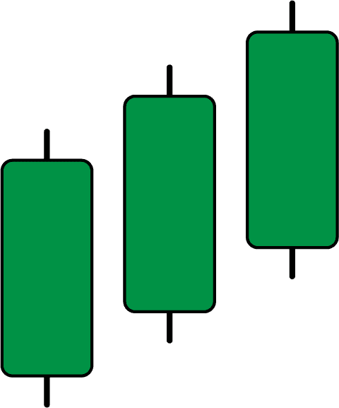

# 第四章\. 经典趋势跟随模式

*趋势跟随*，一个看似简单却又复杂的概念。或许放弃市场定时而只是顺势操作会更容易，但实际上，由于众多随机变量影响价格，这样做可能会面临挑战。一个稳步上升的市场可能会因一次经济或政治事件而动荡，但随后继续平稳前行，这会让在波动风暴中被止损的交易员感到困惑。

本章涵盖了经典的（在技术分析领域已广为人知和确立的）趋势跟随蜡烛图案。这些是简单和复杂的构型，自技术分析诞生以来就存在，并在许多初级和高级技术分析课程中教授。本章的目的是创建模式的客观条件并对其进行回测，以便您可以形成关于它们出现频率和可预测性的基本看法。有些模式可能经常出现，而其他模式可能极少出现，从而阻碍了对它们进行适当评估的能力。

如前所述，我回测图案的方法是假设在验证前一天收盘信号后，我会在下一个开盘时开启买入或卖出头寸。本书选择的回测时间框架是每小时。

# 光头蜡烛图案

第一个经典的趋势跟随模式是*光头蜡烛*。这个词源于日语，意为秃头或紧贴头皮，你很快就会明白为什么。

区分光头蜡烛图和普通蜡烛图相对较容易，因为光头蜡烛图没有任何影线。这意味着看涨的光头蜡烛图的开盘和最低价格相同，收盘和最高价格也相同。相反，看跌的光头蜡烛图的开盘和最高价格相同，收盘和最低价格也相同。图 4-1 展示了光头蜡烛图的这两个版本。


###### 图 4-1\. 左边是一个看涨的光头蜡烛图；右边是一个看跌的光头蜡烛图。

光头蜡烛图案通常出现在较短的时间框架内，因为蜡烛图的波动时间较短，难以超出它们的边界。这在分析 1 分钟和 5 分钟图表并将它们与日常图表进行比较时可以看出。

###### 注意

当蜡烛图的开盘和收盘价格之间的时间较短时，蜡烛图更有可能形成光头蜡烛图案。

在使用任何模式之前，您必须理解其存在的原因。毕竟，模式不是随机发现的；它们必须有其背后的合理性。更重要的是，您需要知道在验证模式后为什么应该期望某种反应。

答案在市场心理学中，它无处不在，以至于专注和知识丰富的交易员可以捕捉到任何暗示并跟随（或反向操作）市场走势。

当市场处于强劲的上涨趋势时，很少会出现较低的新低点，并且由于对基础证券的需求强劲，通常会在接近高点处收盘。在一个蜡烛图中，需求的最大力量表现为不存在低点且收盘价位于高点，这正是独角兽阳线蜡烛图的核心。当资产以最高价位收盘时，你会得到买家渴望更多的信号，而当没有低点低于开盘价时，你应该更有信心地认为，没有人成功将价格推低到其开盘价以下。

同样地，当市场处于强劲的下跌趋势时，很少会出现较高的新高点，并且由于基础证券的供应压力巨大，通常会在接近低点处收盘。在一个蜡烛图中，供应的最大力量表现为不存在高点且收盘价位于低点，如熊市独角兽阴线蜡烛图所示。

###### 注意

独角兽阳线蜡烛图（bullish Marubozu）是最强烈的牛市活动表现，而独角兽阴线蜡烛图（bearish Marubozu）则是最强烈的熊市活动表现。

在一些使用多个小数点的市场中，检测独角兽蜡烛图模式可能会有些棘手，这是由于其发生概率。例如，在货币市场上，如果使用五个小数点，你可能不会很快找到任何独角兽蜡烛图模式，但当你遵循通常的、不太精确的四个小数点惯例时（参见第二章），你会更频繁地看到这种模式。这对所有市场都适用；因此，为了能够分析这种模式，你需要对小数点进行一些微调。

图 4-2 显示了应用舍入函数后的 USDCHF 清晰图表：

```py
my_data = rounding(my_data, 4)
```


###### 图 4-2\. USDCHF 的蜡烛图

下一步是编写信号功能的代码。

###### 注意

*信号功能*是算法的核心，因为它负责找到模式并按时间顺序确定它们，因此根据特定条件输出买入和卖出信号。

在算法上，条件需如下：

+   如果收盘价大于开盘价，则高价等于收盘价，低价等于开盘价，那么在买入信号列的下一行打印 1。

+   如果收盘价低于开盘价，则高价等于开盘价，低价等于收盘价，然后在卖出信号列的下一行打印-1。

在 Python 语言中，使用以下语法编写独角兽蜡烛图信号功能：

```py
def signal(data, open_column, high_column, low_column, close_column, 
           buy_column, sell_column):

    data = add_column(data, 5)    

    for i in range(len(data)):  

       try:

           `# Bullish pattern`
           if data[i, close_column] > data[i, open_column] and 
              data[i, high_column] == data[i, close_column] and \               data[i, low_column] == data[i, open_column] and 
              data[i, buy_column] == 0:

                    data[i + 1, buy_column] = 1 

           `# Bearish pattern`
           elif data[i, close_column] < data[i, open_column] and 
                data[i, high_column] == data[i, open_column] and \                 data[i, low_column] == data[i, close_column] and 
                data[i, sell_column] == 0:

                    data[i + 1, sell_column] = -1 

       except IndexError:

            pass

    return data

```

图 4-3 显示了根据函数给出的信号在 EURUSD 上生成的交易。


###### 图 4-3\. EURUSD 上的信号图表

向上箭头表示看涨信号，而向下箭头表示看跌信号。图 4-4 展示了美元瑞士法郎信号的另一个示例。


###### 图 4-4\. 美元瑞士法郎信号图

现在让我们使用第二章讨论的性能评估指标回测该模式。

表格 4-1 展示了丸坐模式的表现摘要。交易条件如下：

+   在确认当前收盘价格信号后，入场价格为下一个开盘价格。

+   出场时，获取任一方向（看涨或看跌）的另一个信号。

+   性能评估指标中未包含交易成本。

+   没有使用风险管理系统。

###### 注

使用风险管理系统意味着采用简单和复杂的订单管理技术，以规范最大损失和预期目标。

表格 4-1\. 丸坐模式：表现摘要表格

| 资产 | 命中率 | 盈利因子 | 风险-收益比 | 信号数 |
| --- | --- | --- | --- | --- |
| 欧元美元 | 47.14% | 1.06 | 1.19 | 963 |
| 美元瑞士法郎 | 47.01% | 0.95 | 1.07 | 1355 |
| 英镑美元 | 47.27% | 0.79 | 0.89 | 605 |
| 美元加元 | 49.06% | 0.99 | 1.03 | 958 |
| 比特币美元 | 47.81% | 1.38 | 1.51 | 433 |
| 以太坊美元 | 39.76% | 0.93 | 1.41 | 3687 |
| 黄金 | 43.33% | 0.96 | 1.25 | 8443 |
| 标普 500 | 41.92% | 0.66 | 0.91 | 260 |
| 富时 100 | 50.00% | 1.09 | 1.09 | 90 |

回测的资产显示，丸坐模式相对罕见，并且似乎并未增加很大价值。如命中率所示，所有预测都是随机的。命中率约为 50%意味着你的对错概率相当。

同样，盈利因子显示你几乎只能获得足以抵消总亏损的总收益。在计算交易成本时，这一点被放大。接近 1.00 的盈利因子无关紧要，不太可能提供有关模式表现良好与否的更多信息。

如果分析交易该模式时承担的风险，会发现这证实了该策略的随机性。平均值约为 1.00，基本上你冒着 1 美元风险去赚 1 美元，结果可能两样。最后，信号并不是非常频繁，但超过 30 的阈值是进行任何统计解释所需的。

主要结论是，丸坐模式单独使用不太可能提供盈利策略。尽管如此，还请记住以下几点进行回测：

+   仅基于一个模式进行持仓，未与其他确认指标结合。通常情况下，将模式与其他技术和指标结合使用效果更佳。

+   回测的市场范围有限；因此，该模式在其他市场上的表现可能会有所不同。

+   回测的时间范围有限，因为结果仅反映了小时时间框架。请记住，还有其他时间框架，如五分钟、每日和每周。

+   退出技术是多变的，并取决于下一个信号，这可能要等很长时间。其他更合适的退出技术可能包括固定退出或依赖波动性的退出。

因此，即使回测给出了关于模式能力的一般近似想法，您也必须始终了解其局限性。

# 三根蜡烛模式

*三根蜡烛* 模式是一种趋势确认配置，其信号在打印出三根颜色相同、具有最小指定大小的蜡烛之后给出。一个看涨的三根蜡烛模式也被称为三白兵，其由三根大涨的蜡烛组成，每根的收盘价都高于前一根。相反，一个看跌的三根蜡烛模式被称为三黑鸦，其由三根大跌的蜡烛组成，每根的收盘价都低于前一根。

###### 注意

三白兵和三黑鸦的名称来源于蜡烛图曾经以黑白色图示，前者代表着看跌蜡烛，后者代表着看涨蜡烛。

图 4-5 展示了三白兵。请注意，每个收盘价都高于前一个。



###### 图 4-5\. 三白兵模式

图 4-6 展示了三黑鸦。请注意，每个收盘价都低于前一个。


###### 图 4-6\. 三黑鸦模式

该模式的直觉非常简单。它源于一种称为*羊群效应* 的心理偏倚，即市场参与者因为他人的行为而跟随趋势。这并不意味着该模式基于人类的缺陷和努力不足；它只是指人类常见的一种行为，他们倾向于跟随整体趋势。

###### 注意

人们追随最新的时尚潮流是因为它带来心理奖励。趋势追随交易者追随最新的趋势，因为他们相信这会带来财务回报，或者因为他们有一种错失机会的恐惧形式（FOMO）。

金融羊群效应可以定义为跟随多数人的行为，试图从当前持续的动向中获利尽可能多。因此，本质上，羊群效应实际上是趋势追随。当您看到同一方向内的三根大蜡烛时，通常会将其解释为一种充满动力、信念和继续朝同一方向发展的健康行动。将这三根大蜡烛与小蜡烛的羞怯行动进行比较，后者的类型在涨跌之间交替。

人们被信心和力量所吸引，更有可能追随它。三根健康蜡烛图案体现了力量和信心。

发现这种模式很容易，但必须有严格的算法规则，不仅仅是三根相同颜色的大蜡烛；否则，你将会有大量信号。从算法的角度看，条件需要如下：

+   如果最近三个收盘价分别高于其前一个收盘价，并且每个蜡烛图符合最小实体大小，则在下一行的买入信号列中打印 1。

+   如果最近三个收盘价分别低于其前一个收盘价，并且每个蜡烛图符合最小实体大小，则在下一行的卖出信号列中打印-1。

蜡烛的实体是收盘价和开盘价之间的差异的绝对值。因此，要找到实体，请按照以下数学公式操作：

<math alttext="Candlestick body Subscript i Baseline equals StartAbsoluteValue Close price Subscript i Baseline minus Open price Subscript i Baseline EndAbsoluteValue"><mrow><mtext>Candlestick</mtext> <msub><mtext>body</mtext> <mi>i</mi></msub> <mo>=</mo> <mrow><mo>|</mo> <mtext>Close</mtext> <msub><mtext>price</mtext> <mi>i</mi></msub> <mo>-</mo> <mtext>Open</mtext> <msub><mtext>price</mtext> <mi>i</mi></msub> <mo>|</mo></mrow></mrow></math>

```py
def signal(data, open_column, close_column, buy_column, sell_column):

    data = add_column(data, 5)

    for i in range(len(data)):

       try:

           `# Bullish pattern`
           if data[i, close_column] - data[i, open_column] > body and \               data[i - 1, close_column] - data[i - 1, open_column] > \               body and data[i - 2, close_column] - \
              data[i - 2, open_column] > body and data[i, close_column] > \               data[i - 1, close_column] and data[i - 1, close_column] > \               data[i - 2, close_column] and data[i - 2, close_column] > \               data[i - 3, close_column] and data[i, buy_column] == 0:

                    data[i + 1, buy_column] = 1

           `# Bearish pattern`
           elif data[i, close_column] - data[i, open_column] > body and \                 data[i - 1, close_column] - data[i - 1, open_column] > \                 body and data[i - 2, close_column] - \                 data[i - 2, open_column] > body and data[i, close_column] \ 
                < data[i - 1, close_column] and data[i - 1, close_column] \
                < data[i - 2, close_column] and data[i - 2, close_column] \
                < data[i - 3, close_column] and data[i, sell_column] == 0:

                    data[i + 1, sell_column] = -1

       except IndexError:

            pass

```

此函数根据先前显示的条件生成买入和卖出信号。由于蜡烛的实体可能根据波动性而异，实际上可能会在某种程度上影响该模式的客观性。理论上，三根蜡烛图案仅指“大”蜡烛，并不指示应如何调整大小；因此，我根据资产和小时时间框架使用固定值。表 4-2 显示了总结。

表 4-2\. 三根蜡烛图案：蜡烛大小选择

| 资产 | Body | 类型 |
| --- | --- | --- |
| EURUSD | 0.0005 | 美元 |
| USDCHF | 0.0005 | 瑞士法郎 |
| GBPUSD | 0.0005 | 美元 |
| USDCAD | 0.0005 | 加拿大元 |
| BTCUSD | 50 | 美元 |
| ETHUSD | 10 | 美元 |
| 黄金 | 2 | 美元 |
| S&P500 | 10 | 点数 |
| FTSE100 | 10 | 点数 |

你也可以根据波动性调整变量`body`，但我将展示另一种适应波动性的模式。目前，我将保持经典模式的理论条件不变，并将创造力留给第五章和第七章中的现代模式。

图 4-7 显示了 EURUSD 上的信号图表。


###### 图 4-7\. EURUSD 上的信号图表

表 4-3 显示了三根蜡烛图案的性能总结。

表 4-3\. 三根蜡烛图案：性能总结表

| 资产 | 命中率 | 盈利因子 | 风险-收益比 | 信号数 |
| --- | --- | --- |
| EURUSD | 61.45% | 1.05 | 0.66 | 2672 |
| USDCHF | 62.04% | 0.98 | 0.60 | 2005 |
| GBPUSD | 61.53% | 0.96 | 0.60 | 3611 |
| USDCAD | 60.97% | 0.97 | 0.62 | 2844 |
| BTCUSD | 62.30% | 1.00 | 0.61 | 1085 |
| ETHUSD | 61.22% | 0.96 | 0.61 | 392 |
| 黄金 | 61.11% | 1.04 | 0.66 | 828 |
| S&P500 | 65.99% | 1.10 | 0.57 | 741 |
| FTSE100 | 64.54% | 0.97 | 0.53 | 1018 |

尽管结果显示相对于丸坐模式具有较高的命中率，但您必须小心，因为单独作为指标的命中率是没有用的。您必须将其与风险-回报比并行分析，以了解其预测能力是否有盈利可能。

你首先注意到的是关键低风险-回报值，其范围在 0.53 到 0.66 之间。这是第一个警告信号，说明命中率并不令人印象深刻。实际上，这甚至可能不足以产生正面结果。

# 田士模式

*田士*模式是一种趋势确认配置，市场在未填补的缺口后发出继续信号。在继续之前，您需要了解什么是缺口。

*缺口*构成了价格行为的重要组成部分。它们在市场中的罕见程度因市场而异。例如，在货币市场中，它们通常发生在周末后的零售市场开盘或重大公告时。在股票市场中，缺口从一天到另一天是相当常见的。

缺口是由于低流动性而导致两个连续收盘价格之间的不连续或空隙。当市场在$100 交易，突然在未报出$101 的情况下交易到$102 时，就形成了一个看涨的缺口。在图表中可以看到烛台之间似乎有一个缺失的部分。图 4-8 展示了一个看涨缺口。请注意烛台之间的空白区域。


###### 图 4-8. 一个看涨缺口

缺口可能是由于基本和技术原因而发生，但无论出现原因如何，您都应该有兴趣识别并进行交易。在货币市场上，周末出现的明显缺口是看得见的。图 4-9 展示了一个看跌缺口。


###### 图 4-9. 一个看跌缺口

缺口有不同类型，当它们出现时，由于事后的偏见，对它们进行分类可能很困难（事后偏见是一种认知偏差，因为分析师已经知道结果，所以会高估技术的预测能力）：

常见缺口

这些通常发生在横盘市场中。它们可能会被填充，因为市场的均值回归动态。

脱离缺口

这些通常类似于常见的缺口，但缺口出现在图形阻力的上方或图形支撑的下方。它们标志着新趋势的加速。

逃跑缺口

这些通常发生在趋势内部，但更加确认它；因此，这是一种继续模式。

耗尽缺口

这些通常发生在趋势结束时，接近支撑或阻力水平。这是一个反转模式。

在缺口出现的那一刻确定其类型并不是确定的方法，但这对于检测田士模式并不重要。该模式以一种用于固定日本和服的配饰命名，但其用途不明确。

一个牛市塔斯基模式由三根蜡烛图组成，第一根是看涨的蜡烛图，第二根是另一根看涨的蜡烛图，其间跳空高于第一根蜡烛图，第三根蜡烛图是熊市的，但不会收于第一根蜡烛图的收盘价以下。

图 4-10 展示了一个牛市塔斯基。


###### 图 4-10\. 一个牛市塔斯基

熊市塔斯基模式（见图 4-11）是牛市塔斯基的镜像。它由三根蜡烛图组成，第一根是熊市蜡烛图，第二根是另一根熊市蜡烛图，其间跳空低于第一根蜡烛图，第三根蜡烛图是看涨的，但不会收于第一根蜡烛图的收盘价以上。


###### 图 4-11\. 一个熊市塔斯基

这种模式的直觉与突破原理相关，即突破某个阈值，无论是支撑还是阻力，都应该在释放到初始方向之前对其产生重力作用。

每当看到市场跳空上涨，后面紧随一个不完全填补跳空的熊市蜡烛图时，这可能是卖方不足以领先的信号，显示出看涨的倾向。同样地，每当看到市场跳空下跌，后面紧随一个不完全填补跳空的看涨蜡烛图时，这可能是买方不足以领先的信号，显示出看跌的倾向。

算法上，条件需要如下：

+   如果前两个周期的收盘价高于前两个周期的开盘价，上一个周期的开盘价高于前两个周期的收盘价，上一个周期的收盘价高于上一个周期的开盘价，并且当前的收盘价高于前两个周期的收盘价，则在买入信号列的下一行打印 1。

+   如果前两个周期的收盘价低于前两个周期的开盘价，上一个周期的开盘价低于前两个周期的收盘价，上一个周期的收盘价低于上一个周期的开盘价，并且当前的收盘价低于前两个周期的收盘价，则在卖出信号列的下一行打印−1。

```py
def signal(data, open_column, close_column, buy_column, sell_column):

    data = add_column(data, 5)

    for i in range(len(data)):

       try:

      `# Bullish pattern`
           if data[i, close_column] < data[i, open_column] and \               data[i, close_column] < data[i - 1, open_column] and \               data[i, close_column] > data[i - 2, close_column] and \               data[i - 1, close_column] > data[i - 1, open_column] and \               data[i - 1, open_column] > data[i - 2, close_column] and \               data[i - 2, close_column] > data[i - 2, open_column]:

                    data[i + 1, buy_column] = 1

           `# Bearish pattern`
           elif data[i, close_column] > data[i, open_column] and \                 data[i, close_column] > data[i - 1, open_column] and \                 data[i, close_column] < data[i - 2, close_column] and \                 data[i - 1, close_column] < data[i - 1, open_column] and \                 data[i - 1, open_column] < data[i - 2, close_column] and \                 data[i - 2, close_column] < data[i - 2, open_column]:

                    data[i + 1, sell_column] = -1

       except IndexError:

            pass

    return data

```

是时候讨论回测结果了（见表 4-4）。请记住，该模式非常罕见，你应该对结果保持一种统计上的怀疑态度。

表 4-4\. 塔斯基模式：性能摘要表

| 资产 | 命中率 | 盈利因子 | 风险-收益比 | 信号数 |
| --- | --- | --- | --- | --- |
| EURUSD | 58.06% | 0.97 | 0.70 | 31 |
| USDCHF | 59.46% | 1.92 | 1.31 | 37 |
| GBPUSD | 48.72% | 0.93 | 0.98 | 39 |
| USDCAD | 40.00% | 0.61 | 0.91 | 40 |
| BTCUSD | 53.57% | 0.89 | 0.77 | 56 |
| ETHUSD | 50.00% | 1.03 | 1.03 | 30 |
| GOLD | 51.49% | 1.01 | 0.95 | 101 |
| S&P500 | 36.36% | 0.33 | 0.58 | 11 |
| 富时 100 | 50.00% | 1.56 | 1.56 | 14 |

结果证实了最初的假设：这种模式非常罕见。在大约十年时间里，EURUSD 的小时值仅出现 31 次，这个数量极为有限。

罕见模式的问题在于不清楚它们是如何进入文献的，因为缺乏足够（现在也是如此）的数据来分析这些模式的结果和交易的可预测性。

结果大多是负面的，统计上的稳健性不高，因为交易次数较少。田口模式可能在逻辑上有其合理性，但缺乏硬数据支持。

# *三方法*模式

*三方法*模式是一个复杂的配置，主要由五根蜡烛图组成。上升的*三方法*模式应该出现在牛市中，第一根蜡烛图是一个大阳线，接着是三根小阴线，通常都在第一根蜡烛图的范围内。要确认这一模式，最后一根大阳线必须收盘高于第一根蜡烛图的高点。这就像是一个小盘整的牛市突破。

图 4-12 描述了一个上升的*三方法*。


###### 图 4-12\. 上升的*三方法*模式

下降的*三方法*模式应该出现在熊市中，第一根蜡烛图是一个大阴线，接着是三根小阳线，通常都在第一根蜡烛图的范围内。要确认这一模式，最后一根大阴线必须收盘低于第一根蜡烛图的低点。这就像是一个小盘整的熊市突破。图 4-13 描绘了一个下降的*三方法*。


###### 图 4-13\. 下降的*三方法*模式

从心理学角度来看，这种模式涉及到超越或突破的概念，作为最初走势的确认。交易者通常会推高价格，直到他们开始获利了结并平仓。这种活动对价格有一种平滑作用，通过所谓的*修正*或*盘整*阶段来稳定价格。

如果最初的交易者恢复他们的买入或卖出活动，并设法超越盘整的范围，你可以相当有信心认为这种走势会继续。

*三方法*蜡烛图模式的信号功能可以写成如下形式：

```py
def signal(data, open_column, high_column, low_column, close_column, 
           buy_column, sell_column):

    data = add_column(data, 5)

    for i in range(len(data)):

       try:

  `# Bullish pattern`
           if data[i, close_column] > data[i, open_column] and\               data[i, close_column] > data[i - 4, high_column] and\               data[i, low_column] < data[i - 1, low_column] and\               data[i - 1, close_column] < data[i - 4, close_column] and\               data[i - 1, low_column] > data[i - 4, low_column] and\               data[i - 2, close_column] < data[i - 4, close_column] and\               data[i - 2, low_column] > data[i - 4, low_column] and\               data[i - 3, close_column] < data[i - 4, close_column] and\               data[i - 3, low_column] > data[i - 4, low_column] and\               data[i - 4, close_column] > data[i - 4, open_column]:

                    data[i + 1, buy_column] = 1

  `# Bearish pattern`
           elif data[i, close_column] < data[i, open_column] and\                 data[i, close_column] < data[i - 4, low_column] and\                 data[i, high_column] > data[i - 1, high_column] and\                 data[i - 1, close_column] > data[i - 4, close_column] and\                 data[i - 1, high_column] < data[i - 4, high_column] and\                 data[i - 2, close_column] > data[i - 4, close_column] and\                 data[i - 2, high_column] < data[i - 4, high_column] and\                 data[i - 3, close_column] > data[i - 4, close_column] and\                 data[i - 3, high_column] < data[i - 4, high_column] and\                 data[i - 4, close_column] < data[i - 4, open_column]:

                    data[i + 1, sell_column] = -1

       except IndexError:

            pass

    return data

```

图 4-14 展示了美元加元的信号图。


###### 图 4-14\. 美元加元的信号图

这种模式极为罕见，本身并没有显示出太多附加值。即使在放宽条件后，回测结果显示出的信号也很少；因此，这种模式依然神秘。

###### 注

根据您的数据提供商，一些历史值可能不完全相同，因此，您可以看到过去模式在来自某个提供商的数据上验证，但在来自另一个提供商的数据上未验证。这通常解释了在切换提供商和经纪人时进行反向测试结果略有不同的原因。

# Hikkake 模式

*Hikkake*是一个日语动词，意思是“欺骗”或“陷阱”，而此模式指的是一种实际的陷阱。该模式较为复杂，由大约五根蜡烛图组成，取决于文献（一些研究表明它可能是多个蜡烛图的组合，但没有具体指定蜡烛图的数量）。

**牛市 Hikkake**（参见图 4-15）以一根牛市蜡烛图开头，后跟一根完全嵌入在第一根蜡烛内部的熊市蜡烛图。接下来，必须出现两根蜡烛图，其高点不超过第二根蜡烛的高点。最后，出现一根大的牛市蜡烛图，其收盘价超过第二根蜡烛的高点。这证实了图案的有效性和上涨确认。

**熊市 Hikkake**以一根熊市蜡烛图开始，后跟一根完全嵌入在第一根蜡烛内部的牛市蜡烛图。接下来，必须出现两根蜡烛图，其低点不低于第二根蜡烛的低点。最后，必须出现一根大的熊市蜡烛图，其收盘价跌破第二根蜡烛的低点。这证实了图案的有效性和下跌确认。

尽管模式的心理学具有主观性，但并不难理解。术语*entrapment*源自这样一个事实，即牛市 Hikkake 在历史上是对那些认为市场已经见顶并且应该继续下跌的交易员的熊市陷阱。因此，每当看到最后的蜡烛图突破高点并验证配置时，您可以有一定的信心，预示着更多的力量即将到来。这是因为止损被触发，并且交易员正在看着一个理论上强势的牛市信号超过其阻力位。


###### 图 4-15\. 一种牛市 Hikkake

一种熊市 Hikkake（参见图 4-16）可与那些认为市场已经见底并且现在应该反弹的交易员形成对比。因此，每当看到最后的蜡烛图跌破低点并验证配置时，您可以开始改变偏见。


###### 图 4-16\. 一种熊市 Hikkake

信号功能可以写成如下形式：

```py
def signal(data, open_column, high_column, low_column, close_column, 
           buy_signal, sell_signal):

    data = add_column(data, 5)    

    for i in range(len(data)):    

       try:

            `# Bullish pattern`
            if data[i, close_column] > data[i - 3, high_column] and \                data[i, close_column] > data[i - 4, close_column] and \                data[i - 1, low_column] < data[i, open_column] and \                data[i - 1, close_column] < data[i, close_column] and \                data[i - 1, high_column] <= data[i - 3, high_column] and \                data[i - 2, low_column] < data[i, open_column] and \                data[i - 2, close_column] < data[i, close_column] and \                data[i - 2, high_column] <= data[i - 3, high_column] and \                data[i - 3, high_column] < data[i - 4, high_column] and \                data[i - 3, low_column] > data[i - 4, low_column] and \                data[i - 4, close_column] > data[i - 4, open_column]: 

                   data[i + 1, buy_signal] = 1 

        `# Bearish pattern`
            elif data[i, close_column] < data[i - 3, low_column] and \                  data[i, close_column] < data[i - 4, close_column] and \                  data[i - 1, high_column] > data[i, open_column] and \                  data[i - 1, close_column] > data[i, close_column] and \                  data[i - 1, low_column] >= data[i - 3, low_column] and \                  data[i - 2, high_column] > data[i, open_column] and \                  data[i - 2, close_column] > data[i, close_column] and \                  data[i - 2, low_column] >= data[i - 3, low_column] and \                  data[i - 3, low_column] > data[i - 4, low_column] and \                  data[i - 3, high_column] < data[i - 4, high_column] and \                  data[i - 4, close_column] < data[i - 4, open_column]: 

                     data[i + 1, sell_signal] = -1

       except IndexError:

            pass

    return data

```

图 4-17 显示了 EURGBP 上的一个生成信号。显然，这种模式很少见，并且没有有意义的反向测试结果。


###### 图 4-17\. EURGBP 上的信号图表

由于该模式非常罕见，没有足够的数据进行正确评估。当然，可以放宽条件以增加信号出现的可能性，但理论上，如果这样做，你就必须给它起个别的名字。表格 4-5 总结了其表现。

表格 4-5\. Hikkake 图案：绩效摘要表

| 资产 | 命中率 | 盈利因子 | 风险-收益比 | 信号数 |
| --- | --- | --- | --- | --- |
| EURUSD | 44.83% | 0.94 | 1.16 | 116 |
| USDCHF | 47.66% | 0.74 | 0.81 | 107 |
| GBPUSD | 49.57% | 1.55 | 1.57 | 115 |
| USDCAD | 55.14% | 0.84 | 0.68 | 107 |
| BTCUSD | 56.96% | 1.18 | 0.89 | 79 |
| ETHUSD | 60.00% | 1.24 | 0.82 | 50 |
| GOLD | 51.81% | 1.14 | 1.06 | 166 |
| S&P500 | 83.33% | 6.01 | 1.20 | 12 |
| FTSE100 | 53.33% | 2.06 | 1.80 | 15 |

结果显示随机表现，这很可能意味着该模式没有预测能力。在标准普尔 500 指数上的命中率为 83.33% 可能在统计学上不正确，因为算法在过去几年仅检测到 12 个信号。

¹ 记住，三根蜡烛图案由三根大蜡烛组成。因此，您需要编写条件代码，确保它们具有最小尺寸。
