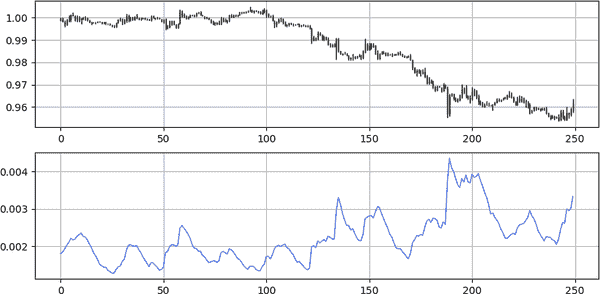
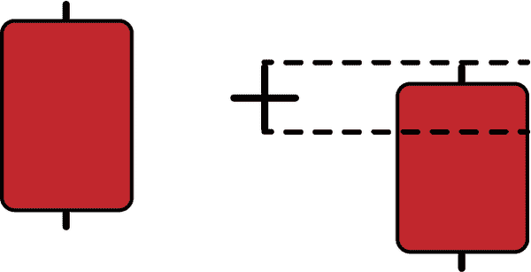
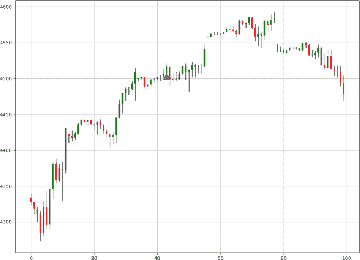

# 第五章：现代趋势跟踪模式

继续遵循趋势跟踪的概念，本章揭示了不属于经典模式的新模式。我将这些新模式称为*现代*模式，因为它们是我在分析中使用的个人发现。

目标仍然是相同的，即创建客观条件并对其进行回测，以形成对其频率和可预测性的看法。重要的是要记住，一个模式的可预测性在不同市场之间是相当随机的，这意味着在 GBPUSD 上有效的模式可能在 EURGBP 上无效，因为每个市场具有不同的统计和技术特性。

因此，我现在做出的主要假设是，现代模式既不比经典模式更好也不更差；它们只是一个让您在分析中获得更多确认的多样化工具。这意味着，如果您看到至少两三种（经典或现代）模式在同一时间出现，您应该更有信心进行交易。现在让我们开始学习这些新模式，并探索它们的直觉和代码。

# 五胞胎模式

*五胞胎*模式是一个多蜡烛配置，确认了潜在的趋势。该模式源于群体心理学和反应失败，¹这使其能够继续朝同一方向发展。其特点是有五个连续的相同类型的小蜡烛。该模式依赖于市场逐步上涨的事件，其中市场似乎被高估或超买，但仍然未受影响并继续上涨。

###### 注意

这种类型的模式通常出现在市场上一个有影响的事件后，价格行动保持在低波动率环境中，但仍然能看到明显的趋势。例如，2021 年 12 月底的 USDTRY²。土耳其总统雷杰普·塔伊普·埃尔多安在通胀和利率方面的声明震动了市场，引起了巨大的波动，但随后出现了一种明显的无决定形式，USD 相对 TRY 稳步上涨。

图 5-1 展示了一个看多的五胞胎模式。

​​

###### 图 5-1\. 一个看多的五胞胎模式

当波动性放缓时，出现五连小阳蜡烛，这就是五胞胎模式的发生。图 5-2 展示了一个看空的五胞胎模式。

​​

###### 图 5-2\. 一个看空的五胞胎模式

讨论在 第四章 中讨论的三根蜡烛模式与五连小阳线模式的区别在于蜡烛图的数量和它们的大小。前者假设大幅移动后面跟随大幅移动，而后者假设缓慢渐进的移动也会后续有缓慢渐进的移动。（这与金融市场中的波动聚集事件一致。*波动聚集* 是指波动性通过时间的持续性，低波动率通常后跟低波动率，而高波动率则后跟高波动率。）

因此，这两种模式指向同一个方向，但处理不同的市场特性。

检测五连小阳线模式很容易，但该模式可能不常见，因为您需要满足许多条件。在算法上，条件需要如下：

+   如果最新的五个收盘价都大于其开盘价，以及其前面的收盘价，并且每个蜡烛图都遵守最大蜡烛体大小，则在下一个买入行中打印 1。

+   如果最新的五个收盘价都低于其开盘价，以及其前面的收盘价，并且每个蜡烛图都遵守最大蜡烛体大小，则在下一个卖出行中打印 −1。

###### 注意

记住，五连小阳线模式由五个小蜡烛组成。因此，您需要编写它们必须具有最大大小的条件。

现在的任务是编写信号函数如下：

```py
def signal(data, open_column, close_column, buy_column, sell_column):

    data = add_column(data, 5)    

    for i in range(len(data)):    

       try:

      `# Bullish pattern`
           if data[i, close_column]>data[i, open_column] and\               data[i, close_column]>data[i - 1, close_column] and\               data[i, close_column]-data[i, open_column]<body and\               data[i-1, close_column]>data[i-1, open_column] and\               data[i-1, close_column]>data[i-2, close_column] and\               data[i-1, close_column]-data[i-1, open_column]<body and\               data[i-2, close_column]>data[i-2, open_column] and\               data[i-2, close_column]>data[i-3, close_column] and\               data[i-2, close_column]-data[i-2, open_column]<body and\               data[i-3, close_column]>data[i-3, open_column] and\               data[i-3, close_column]>data[i-4, close_column] and\               data[i-3, close_column]-data[i-3, open_column]<body and\               data[i-4, close_column]>data[i-4, open_column] and\               data[i-4, close_column]-data[i-4, open_column]<body and\               data[i, buy_column] == 0:

                    data[i + 1, 4] = 1 

           `# Bearish pattern`
           elif  data[i, close_column]<data[i, open_column] and\                  data[i, close_column]<data[i-1, close_column] and\                  data[i, open_column]-data[i, close_column]<body and\                  data[i-1, close_column]<data[i-1, open_column] and\                  data[i-1, close_column]<data[i-2, close_column] and\                  data[i-1, open_column]-data[i-1, close_column]<body and\                  data[i-2, close_column]<data[i-2, open_column] and\                  data[i-2, close_column]<data[i-3, close_column] and\                  data[i-2, open_column]-data[i-2, close_column]<body and\                  data[i-3, close_column]<data[i-3, open_column] and\                  data[i-3, close_column]<data[i-4, close_column] and\                  data[i-3, open_column]-data[i-3, close_column]<body and\                  data[i-4, close_column]<data[i-4, open_column] and\                  data[i-4, open_column]-data[i-4, close_column]<body and\                  data[i, sell_column] == 0:

                    data[i + 1, 5] = -1 

       except IndexError:

            pass

    return data

```

与三根蜡烛模式类似，表 5-1 显示了在使用小时时间框架时变量 `body` 的默认值。

表 5-1\. 五连小阳线模式：蜡烛体大小选择

| 资产 | 蜡烛 | 类型 |
| --- | --- | --- |
| EURUSD | 0.0005 | Pip |
| USDCHF | 0.0005 | Pip |
| GBPUSD | 0.0005 | Pip |
| USDCAD | 0.0005 | Pip |
| BTCUSD | 50 | USD |
| ETHUSD | 10 | USD |
| GOLD | 2 | USD |
| S&P500 | 10 | Points |
| FTSE100 | 10 | Points |

图 5-3 展示了根据函数给出的信号在 ETHUSD 上生成的交易。五连小阳线在收盘时验证，这就是为什么信号在下一个蜡烛图开盘时给出的原因。

​

###### 图 5-3\. ETHUSD 的信号图

###### 注意

上箭头表示在蜡烛图开盘时产生的看涨信号，而下箭头表示同样在蜡烛图开盘时产生的看跌信号。

图 5-4 展示了银的信号图的另一个示例。您可以看到，只要条件保持有效，您可能会得到连续的五连小阳线，但这并不一定意味着对趋势延续的信心加强。


###### 图 5-4\. 银的信号图

表 5-2 总结了五连小阳线模式的表现。

表 5-2\. 五连小阳线模式：绩效摘要表

| 资产 | 命中率 | 收益因子 | 风险-收益比 | 信号 |
| --- | --- | --- | --- | --- |
| 欧元/美元 | 55.21% | 0.93 | 0.76 | 2032 |
| USDCHF | 57.28% | 0.98 | 0.73 | 2004 |
| 英镑/美元 | 58.08% | 1.06 | 0.76 | 2052 |
| 美元/加元 | 59.04% | 1.04 | 0.72 | 2146 |
| BTCUSD | 57.49% | 1.09 | 0.81 | 854 |
| ETHUSD | 58.25% | 0.93 | 0.67 | 800 |
| 黄金 | 57.93% | 1.16 | 0.84 | 1883 |
| S&P500 | 59.44% | 1.12 | 0.77 | 217 |
| 富时 100 指数 | 58.96% | 1.05 | 0.73 | 212 |

结果在多个市场上与实现的风险-回报比接近保本点。请记住来自“编码性能评估函数”，只有实现的风险-回报比才有意义，而命中率没有任何意义。这就是为什么在 USDCHF 上的 57.28%的命中率并不令人印象深刻，因为每笔交易您冒险$1 来赚取$0.76。这也可以通过小于 1.00 的利润因子来看出。

主要结论是五胞胎模式应与其他技术结合使用，同时优化进出场点，以获得更好的指标。

# 双重麻烦模式

*双重麻烦*模式使用外生变量进行验证，这意味着您从名为*平均真实范围*（ATR）的波动率指标中借用信息来验证模式信号。

让我们首先定义波动率的概念，并了解 ATR，然后介绍双重麻烦模式。

波动率是交易和投资中的关键概念之一，因为它直接与风险相关，间接与回报相关。*波动*的资产或变量是其回报在其平均值周围大幅波动的资产或变量。

图 5-5 显示了低波动率线（变动较小的线）和高波动率线（波动较大的线）。


###### 图 5-5。高低波动性变量的比较

您可以使用以下代码片段自行编码：

```py
`# Importing the necessary libraries`
import numpy as np
import matplotlib.pyplot as plt

`# Creating high volatility noise`
hv_noise = np.random.normal(0, 1, 250)

`# Creating low volatility noise`
lv_noise = np.random.normal(0, 0.1, 250)

`# Plotting`
plt.plot(hv_noise, color = 'red', label = 'High Volatility')
plt.plot(lv_noise, color = 'blue', label = 'Low Volatility')
plt.axhline(y = 0, color = 'black', linewidth = 1)
plt.grid()
plt.legend()

```

我使用了一个名为`numpy`的函数`random.normal()`，它从正态分布中输出随机样本。正态分布是一个具有均值的概率连续函数，将数据对称地分布在均值周围。接近均值的数据比远离均值的数据更频繁发生。从视觉上看，正态分布的数据呈现出中间值为均值的平滑钟形曲线。

不同类型的波动性可以总结如下：

历史波动率

这是一段特定时间内的实现波动率。尽管这是向后看的，历史波动率通常用作未来波动率的期望。历史测量的一个例子是标准差。

###### 注

在继续之前，我想提到一种称为衍生品的金融工具。*衍生品*是交易者用于以特定方式交易市场的产品。例如，*远期*合约是一种衍生品合约，买方在后续时间锁定资产价格。远期合约是一种义务。另一种衍生品是期权。*期权*是以现在支付保费（期权的价格）的方式，在未来以特定价格购买某种资产的权利，买方在想购买标的股票时行使他们的期权；否则，他们可以让期权到期。

隐含波动率

在其最简单的定义中，隐含波动率是当输入到 Black-Scholes 方程中时，可以得出期权市场价格的度量。（Black-Scholes 方程是用于定价期权的数学公式。期权的价格是买方支付的保费，以购买期权，在某个特定到期日之前，以预定的价格购买某种资产。）它是预期未来的实际波动性。它有一个时间尺度：期权的到期日。

远期波动率

未来特定期间的波动性。

实际波动率

任何特定时间的波动量，也称为*局部波动率*。这个度量难以计算，没有时间尺度。

最基本的波动性类型是标准偏差。它是描述性统计的支柱之一。首先，我必须解释方差。

*方差*是作为离散度量计算的，计算方法是从均值计算的平方偏差。你取平方偏差，以强制距离均值为非负，然后取方差的平方根，从而将其转换为标准偏差，并使该度量具有与均值相同的单位。

###### 注意

通过平方偏差，你可以避免负距离测量，通过取平方根，你可以将苹果（标准偏差）与苹果（平均值）进行比较。

因此，方差通过以下数学公式计算：

<math alttext="sigma squared equals StartFraction 1 Over n EndFraction sigma-summation Underscript i equals 1 Overscript n Endscripts left-parenthesis x Subscript i Baseline minus chi right-parenthesis squared"><mrow><msup><mi>σ</mi> <mn>2</mn></msup> <mo>=</mo> <mfrac><mn>1</mn> <mi>n</mi></mfrac> <msubsup><mo>∑</mo> <mrow><mi>i</mi><mo>=</mo><mn>1</mn></mrow> <mi>n</mi></msubsup> <msup><mrow><mo>(</mo><msub><mi>x</mi> <mi>i</mi></msub> <mo>-</mo><mi>χ</mi><mo>)</mo></mrow> <mn>2</mn></msup></mrow></math>

根据这个逻辑，标准偏差因此如下所示：

<math alttext="sigma equals StartRoot StartFraction 1 Over n EndFraction sigma-summation Underscript i equals 1 Overscript n Endscripts left-parenthesis x Subscript i Baseline minus chi right-parenthesis squared EndRoot"><mrow><mi>σ</mi> <mo>=</mo> <msqrt><mrow><mfrac><mn>1</mn> <mi>n</mi></mfrac> <msubsup><mo>∑</mo> <mrow><mi>i</mi><mo>=</mo><mn>1</mn></mrow> <mi>n</mi></msubsup> <msup><mrow><mo>(</mo><msub><mi>x</mi> <mi>i</mi></msub> <mo>-</mo><mi>χ</mi><mo>)</mo></mrow> <mn>2</mn></msup></mrow></msqrt></mrow></math>

通俗地说，标准偏差是在数据集中分析每个值时，平均距离离均值的期望距离。

在理解波动性的概念后，让我们来看看你必须使用的波动性指标，以找到双重麻烦模式，即 ATR。

###### 注意

ATR 是衡量波动性的另一种方法。类似于标准偏差，ATR 考虑了其计算中的高点和低点，因此比标准偏差更完整。

ATR 用作历史波动率的测量标准。它由 Wilder Welles Jr.开发，他也是 RSI 的创造者，在第三章讨论的指标中提到。ATR 的第一个构建模块是*真实范围*。我们来看看如何计算真实范围。

假设您有一个 OHLC 数组。 对于每个小时，真实范围只是三个价格差中的最大值：

+   High − Low

+   High − Previous close

+   Previous close − Low

一旦您从中获得了最大收益，您只需对真实范围的特定回顾期进行平滑平均即可获得 ATR。

由于在恐慌和价格下跌期间，您会看到波动性上升，所以在这些时期 ATR 很可能会上升。 同样，在持续上涨或下跌的时期，ATR 往往会下降。 图 5-6 显示了 EURUSD 的一个示例，其中包含 10 期 ATR 测量值。 看一下图表，你能说什么？



###### 图 5-6\. EURUSD 与 10 期 ATR

很明显，市场及其 ATR 测量值之间存在负相关性。 这是相当普遍的，因为高波动性通常与恐惧（市场下跌）相关联，而低波动性通常与贪婪（市场上涨）相关联。 相关性并非完美，但从长期来看，它在统计上是负面的。

ATR 的代码可以在以下代码片段中找到。

###### 注意

确保您已经在第三章中定义了`smoothed_ma()`函数。 ATR 是特定回顾期内真实范围的平滑平均值。 因此，它不是简单的平均值。

```py
def atr(data, lookback, high_column, low_column, close_column, position):

    data = add_column(data, 1)

    for i in range(len(data)):

        try:

            data[i, position] = max(data[i, high_column] - \
                                data[i, low_column], abs(data[i, \
                                high_column] - data[i - 1, close_column]),\
                                abs(data[i, low_column]  - \
                                data[i - 1, close_column]))

        except ValueError:

            pass

    data[0, position] = 0   

    data = smoothed_ma(data, 2, lookback, position, position + 1)

    data = delete_column(data, position, 1)

    data = delete_row(data, lookback)

    return data

```

现在您已经准备好了解 *Double Trouble* 模式，这是一种两蜡烛的趋势跟随配置，通常表明总体方向的持续。

看涨的 Double Trouble 模式由两个看涨蜡烛组成，第一个收盘价低于第二个收盘价。 第二个蜡烛必须至少是前一个蜡烛的 10 期 ATR 的两倍大（从高到低）。

看涨的 Double Trouble 基于市场心理的狂喜。 另一种解释是，它可能是一种空头挤压形式，这可能进一步提高看涨退出的概率。

###### 注意

*空头挤压*是市场上价格迅速上涨的异常情况。 在空头挤压之前，市场必须有大量的空头卖家。 迅速的价格上涨是由空头卖家的止损订单触发而放大的。

图 5-7 说明了一个看涨的 Double Trouble 模式。


###### 图 5-7\. 一个看涨的 Double Trouble 模式

看跌的 Double Trouble 模式由两个看跌蜡烛组成，第一个收盘价高于第二个收盘价。 第二个蜡烛必须至少是前一个蜡烛 10 期 ATR 的两倍大（从高到低）。

图 5-8 说明了一个看跌的 Double Trouble 模式。


###### 图 5-8\. 一个看跌的 Double Trouble 模式

现在清楚了，Double Trouble 模式高度依赖于波动性的出现。只有在当前高点和当前低点之间的距离是前一小时 10 周期 ATR 的两倍时，才能验证这种模式。

算法上说，Double Trouble 模式的代码如下：

```py
def signal(data, open_column, high_column, low_column, close_column, 
           atr_column, buy_column, sell_column):

    data = add_column(data, 5)    

    for i in range(len(data)):  

       try:

    `# Bullish pattern`
           if data[i, close_column] > data[i, open_column] and \               data[i, close_column] > data[i - 1, close_column] and \               data[i - 1, close_column] > data[i - 1, open_column] and \               data[i, high_column] - data[i, low_column] > (2 * data[i - \               1, atr_column]) and data[i, close_column] - data[i, \               open_column] > data[i - 1, close_column] - data[i - 1, \               open_column] and data[i, buy_column] == 0:

                    data[i + 1, buy_column] = 1 

           `# Bearish pattern`
           elif data[i, close_column] < data[i, open_column] and \               data[i, close_column] < data[i - 1, close_column] and \               data[i - 1, close_column] < data[i - 1, open_column] and \               data[i, high_column] - data[i, low_column] > (2 * data[i - \               1, atr_column]) and data[i, open_column] - data[i, \               close_column] > data[i - 1, open_column] - data[i - 1, \               close_column] and data[i, sell_column] == 0:

                    data[i + 1, sell_column] = -1 

       except IndexError:

            pass

    return data

```

信号函数使用`abs()`函数，该函数获取括号内数字的绝对值。这用于衡量蜡烛的大小。

###### 注意

通过计算 ATR，您使用第五列（索引=4）。因此，Double Trouble 模式的买入和卖出信号必须在第六列和第七列（索引=5 和索引=6）中，与以前的模式不同，以前没有计算过中间指标。在调用函数之前，请确保转移列。

图 5-9 和 5-10 展示了富时 100 和 BTCUSD 的信号图表。


###### 图 5-9\. 富时 100 的信号图表


###### 图 5-10\. BTCUSD 的信号图表

表 5-3 总结了 Double Trouble 模式的表现。

表 5-3\. Double Trouble 模式：绩效摘要表

| 资产 | 命中率 | 盈利因子 | 风险-回报比 | 信号数 |
| --- | --- | --- | --- | --- |
| EURUSD | 51.54% | 1.03 | 0.97 | 2103 |
| USDCHF | 50.47% | 1.03 | 1.01 | 2106 |
| GBPUSD | 50.06% | 0.98 | 0.98 | 2155 |
| USDCAD | 50.86% | 1.00 | 0.96 | 1787 |
| BTCUSD | 53.59% | 1.21 | 1.05 | 1056 |
| ETHUSD | 56.76% | 1.30 | 0.99 | 953 |
| GOLD | 51.76% | 1.10 | 1.02 | 2007 |
| S&P500 | 54.00% | 1.32 | 1.13 | 237 |
| FTSE100 | 45.95% | 0.62 | 0.73 | 198 |

您可以看到，Double Trouble 模式表现优于 Quintuplets 模式，因为它具有相对更好的盈利因子和风险-回报比。

这些结果表明，Double Trouble 模式可能比 Quintuplets 模式更具预测性。这也表明，考虑到波动性可以在模式识别领域提供新的见解和机会。

# Bottle 模式

这是我发现的最简单和最直观的模式之一。它依赖于两根蜡烛来发出趋势延续的信号。我将其称为*Bottle*模式，因为第二根蜡烛看起来像一个瓶子。这种模式还标志着间隙的回归，因为这是验证牛市或熊市信号所需的条件之一。

看涨的 Bottle 模式由一根看涨蜡烛组成，后跟另一根看涨蜡烛，其低端无影线，但高端有影线。同时，第二根蜡烛必须在上一个蜡烛的收盘价下方开盘，这被认为是向下间隙（或内部间隙）。

该模式可用于确认上涨继续，因为其基础心理是市场在开盘后未能创新低，表明强劲的看涨压力。图 5-11 说明了看涨的 Bottle 模式。


###### 图 5-11\. 一个牛市 Bottle 模式

熊市 Bottle 模式由一根熊市蜡烛图组成，后跟另一根熊市蜡烛图，其上无上影线，但下面有一根下影线。同时，第二根蜡烛图的开盘必须高于最后一根蜡烛图的收盘，被视为向上间隙。图 5-12 展示了熊市 Bottle 模式。


###### 图 5-12\. 一个熊市 Bottle 模式

辨别配置相对容易，但您必须小心遵守所有条件，因为有时候可能不会出现间隙，从而使模式失效。

您可以用以下方式表达模式的信号功能：

```py
def signal(data, open_column, high_column, low_column, close_column, 
           buy_column, sell_column):

    data = add_column(data, 5)    

    for i in range(len(data)):  

       try:

      `# Bullish pattern`
           if data[i, close_column] > data[i, open_column] and \               data[i, open_column] == data[i, low_column] and \               data[i - 1, close_column] > data[i - 1, open_column] and \               data[i, open_column] < data[i - 1, close_column] and \               data[i, buy_column] == 0:

                    data[i + 1, buy_column] = 1 

      `# Bearish pattern`
           elif data[i, close_column] < data[i, open_column] and \                 data[i, open_column] == data[i, high_column] and \                 data[i - 1, close_column] < data[i - 1, open_column] and \                 data[i, open_column] > data[i - 1, close_column] and \                 data[i, sell_column] == 0:

                    data[i + 1, sell_column] = -1 

       except IndexError:

            pass

    return data

```

此时，您应该理解条件是如何书写的，因此这些条件应该变得非常自然。此模式的简单性使代码基础。

看一下信号实际操作(图 5-13)，然后再进行回测和解读结果。


###### 图 5-13\. USDCHF 上的信号图表

首先注意到，在过去的 100 小时内，USDCHF 只有两次熊市 Bottle 模式。这是正常的，有时会发生，特别是当条件要求平等时。图 5-14 显示了 AUDJPY，在过去的 100 个交易小时内也可以看到一个熊市信号。


###### 图 5-14\. AUDJPY 上的信号图表

###### 注意

您可以使用四舍五入函数增加 Bottle 模式的信号频率。我选择不这样做，以保持模式的真实本质。

表 5-4 总结了 Bottle 模式的表现。

表 5-4\. Bottle 模式：表现总结表

| 资产 | 命中率 | 盈利因子 | 风险-收益比 | 信号数 |
| --- | --- | --- | --- | --- |
| EURUSD | 51.39% | 0.99 | 0.94 | 395 |
| USDCHF | 52.85% | 1.17 | 1.04 | 507 |
| GBPUSD | 50.75% | 0.85 | 0.83 | 398 |
| USDCAD | 50.48% | 1.14 | 1.11 | 513 |
| BTCUSD | 50.44% | 0.98 | 0.96 | 337 |
| ETHUSD | 50.95% | 0.83 | 0.80 | 365 |
| GOLD | 47.98% | 0.82 | 0.89 | 471 |
| S&P500 | 41.81% | 0.72 | 1.01 | 55 |
| FTSE100 | 53.91% | 1.81 | 1.55 | 115 |

这种模式在 USDCHF 和 FTSE 100 上的表现似乎优于其他回测资产。重要的是要知道，无论是好的还是坏的模式，都不太可能在每个市场上起作用；因此，当您找到一个好的模式时，必须在正确的市场上交易。

最简单的例子是趋势市场上反转模式的表现不佳，以及区域市场上继续模式的表现不佳。请记住，您要寻找的是好的技术（模式或策略），*而不是完美的技术*。

# 弹弓模式

此模式的名称来自于它处理确认新趋势的突破系统。因此，*弹弓*模式是一种四蜡烛线趋势检测系统，它在突破发生后使用回调方法。定义可能看起来很复杂，但实际上很简单。让我们从看涨弹弓的条件开始。

首先，该模式的特征是有一个首个看涨蜡烛线，随后是一个更高的蜡烛线，确认了看涨倾向，然后是另外两个蜡烛线，后者未突破前者的高点。最后，最后一个蜡烛线的低点必须等于或低于第一个蜡烛线的高点，且收盘价高于第二个蜡烛线的最高点。第二个和第三个蜡烛线的颜色没有严格的规则。图 5-15 显示了完美的看涨弹弓模式。


###### 图 5-15\. 看涨弹弓模式

看跌弹弓模式（图 5-16）的特点是有一个首个看跌蜡烛线，随后是一个较低的蜡烛线，确认了看跌倾向，然后是另外两个蜡烛线，后者未突破前者的低点。最后，最后一个蜡烛线的高点必须等于或高于第一个蜡烛线的低点，且收盘价低于第二个蜡烛线的最低点。


###### 图 5-16\. 看跌弹弓模式

检测弹弓模式有些复杂，因为条件和其罕见性，但可以通过算法简化，如下所示：

```py
def signal(data, open_column, high_column, low_column, close_column, 
           buy_column, sell_column):

    data = add_column(data, 5)    

    for i in range(len(data)):  

       try:

    `# Bullish pattern`
           if data[i, close_column] > data[i - 1, high_column] and \               data[i, close_column] > data[i - 2, high_column] and \               data[i, low_column] <= data[i - 3, high_column] and \               data[i, close_column] > data[i, open_column] and \               data[i - 1, close_column] >= data[i - 3, high_column] and \               data[i - 2, low_column] >= data[i - 3, low_column] and \               data[i - 2, close_column] > data[i - 2, open_column] and \               data[i - 2, close_column] > data[i - 3, high_column] and \               data[i - 1, high_column] <= data[i - 2, high_column]: 

                    data[i + 1, buy_column] = 1 

           `# Bearish pattern`
           elif data[i, close_column] < data[i - 1, low_column] and \                 data[i, close_column] < data[i - 2, low_column] and \                 data[i, high_column] >= data[i - 3, low_column] and \                 data[i, close_column] < data[i, open_column] and \                 data[i - 1, high_column] <= data[i - 3, high_column] and \                 data[i - 2, close_column] <= data[i - 3, low_column] and \                 data[i - 2, close_column] < data[i - 2, open_column] and \                 data[i - 2, close_column] < data[i - 3, low_column] and \                 data[i - 1, low_column] >= data[i - 2, low_column]:   

                    data[i + 1, sell_column] = -1 

       except IndexError:

            pass

    return data

```

图 5-17 显示了黄金商品的示例，突出了弹弓模式给出的信号。


###### 图 5-17\. 黄金信号图

该模式通常用于短期趋势延续走势；因此，目标不是在同一方向持续几天，而是至少形成边际新高点（看涨弹弓）或新低点（看跌弹弓）。

因此，退出策略可以极大地影响此模式的结果。尽管如此，我使用与其他模式相同的条件进行回测（在下一个信号出现时退出，无论是看涨还是看跌）。

实际上，您必须根据风险和回报偏好制定自己的入场和退出规则，以便优化预期结果。图 5-18 显示了 AUDNZD 的示例。


###### 图 5-18\. AUDNZD 信号图

表 5-5 总结了弹弓模式的结果。

表 5-5\. 弹弓模式：绩效摘要表

| 资产 | 命中率 | 盈利因子 | 风险-回报比 | 信号 |
| --- | --- | --- | --- | --- |
| 欧元美元 | 50.03% | 0.98 | 0.98 | 1591 |
| 美元瑞郎 | 51.81% | 0.96 | 0.90 | 1621 |
| 英镑美元 | 48.27% | 1.01 | 1.08 | 1622 |
| 美元加元 | 48.61% | 0.94 | 0.99 | 1728 |
| BTC 美元 | 52.01% | 0.88 | 0.82 | 721 |
| 以太坊美元 | 48.52% | 1.01 | 1.07 | 577 |
| 黄金 | 47.90% | 0.85 | 0.93 | 1332 |
| S&P500 | 49.36% | 1.01 | 1.04 | 158 |
| FTSE100 | 57.14% | 1.38 | 1.04 | 189 |

与其他蜡烛图案相比，弹弓模式的信号数量相对较多。然而，由于受到退出技术的影响（将在后续章节中介绍），除了富时 100 外，其可预测性相对较低。

# H 模式

*H*模式是一种三根蜡烛的连续形态。看涨的 H 模式（图 5-19）由一个看涨的蜡烛后跟一个不确定的蜡烛组成³，其开盘价等于收盘价。接下来，第三根蜡烛必须是看涨的，其收盘价必须高于不确定蜡烛的收盘价。最后，第三根蜡烛的低点必须高于不确定蜡烛的低点。


###### 图 5-19\. 一个看涨的 H 模式

熊市 H 模式（图 5-20）由一个熊市蜡烛后跟一个不确定的蜡烛组成；接下来，第三根蜡烛必须是熊市的，其收盘价必须低于不确定蜡烛的收盘价。最后，第三根蜡烛的高点必须低于不确定蜡烛的高点。



###### 图 5-20\. 一个熊市 H 模式

下面的代码片段显示了如何扫描 H 模式：

```py
def signal(data, open_column, high_column, low_column, close_column, 
           buy_column, sell_column):

    data = add_column(data, 5)    

    for i in range(len(data)):  

       try:

           `# Bullish pattern`
           if data[i, close_column] > data[i, open_column] and \               data[i, close_column] > data[i - 1, close_column] and \               data[i, low_column] > data[i - 1, low_column] and \               data[i - 1, close_column] == data[i - 1, open_column] and \               data[i - 2, close_column] > data[i - 2, open_column] and \               data[i - 2, high_column] < data[i - 1, high_column]:

                    data[i + 1, buy_column] = 1 

           `# Bearish pattern`
           elif data[i, close_column] < data[i, open_column] and \                 data[i, close_column] < data[i - 1, close_column] and \                 data[i, low_column] < data[i - 1, low_column] and \                 data[i - 1, close_column] == data[i - 1, open_column] and \                 data[i - 2, close_column] < data[i - 2, open_column] and \                 data[i - 2, low_column] > data[i - 1, low_column]:

                    data[i + 1, sell_column] = -1 

       except IndexError:

            pass

    return data

```

图 5-21 展示了 S&P 500 生成信号的示例。显然，该模式在实际中可能较为罕见，这取决于市场的特性。理论上，趋势跟随模式在趋势市场上的平均表现比区间市场要好。

鉴于股票大多处于趋势状态，性能摘要表显示，H 模式在股票指数上表现优异。



###### 图 5-21\. S&P 500 上的信号图表

模式通常有所谓的*潜在*目标。到目前为止，你已经在假设在下一个信号时退出的情况下对它们进行了回测。这是可以接受的，因为你希望通过对比各种模式的结果来进行客观评估。

使用本书中介绍的 H 模式和其他现代蜡烛图案，我发现强行施加某种退出并没有真正增加价值，因为每个市场的表现都不同。因此，最好是根据自己的判断使用退出策略，或者如果仅仅依据图案交易，则在下一个信号时退出。

图 5-22 展示了 AUDNZD 货币对小时值上生成的信号。


###### 图 5-22\. AUDNZD 上的信号图表

现在让我们来看看回测结果，并看看如何解读它们（参见表 5-6）。

表 5-6\. H 模式：性能摘要表

| 资产 | 命中率 | 盈利因子 | 风险-回报比 | 信号数 |
| --- | --- | --- | --- | --- |
| EURUSD | 51.56% | 0.89 | 0.84 | 128 |
| 美元/瑞郎 | 45.83% | 0.77 | 0.91 | 144 |
| 英镑/美元 | 44.68% | 0.93 | 1.15 | 94 |
| 美元/加元 | 57.49% | 1.31 | 0.97 | 120 |
| 比特币/美元 | 61.53% | 3.25 | 2.03 | 26 |
| 以太坊/美元 | 41.83% | 0.55 | 0.77 | 98 |
| 黄金 | 65.38% | 2.55 | 1.34 | 52 |
| 标准普尔 500 指数 | 59.64% | 1.33 | 0.90 | 57 |
| 富时 100 指数 | 50.00% | 1.35 | 1.35 | 36 |

这种模式似乎具有更强的预测力，但缺点在这里显而易见：信号的频率。你可以清楚地看到交易的缺乏。正如预期的那样，在标普 500 指数和富时 100 等趋势市场上，你会看到比在美元/加元和英镑/美元等区间市场上更好的结果。

¹ 当市场参与者预期由于极端条件而出现逆转，但市场继续保持初始状态时，就会发生这种事件。

² 美元/土耳其里拉是以 1 美元兑换土耳其里拉的价值。

³ 犹豫模式也被称为十字星。
