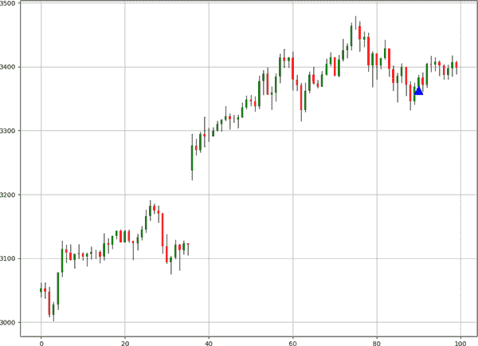

# 第六章：经典反向模式

到目前为止，您应该已经熟悉趋势跟随的概念，即在预期其持续的情况下，骑着现有趋势前进的技术。现在是时候看看反向模式，这些模式信号可能发生逆转或至少是初始动作的修正。因此，反向模式建议的策略是与其骑趋势相反，而是逆市操作。

本章涵盖了经典的反向模式。请记住，所谓的*经典*是指在技术分析领域中已知和已建立的模式。本章的目的是创建反向模式的客观条件，并对其进行回测，以便您对其频率和可预测性形成自己的看法。

# 阴阳线图案

每当有人提到蜡烛图模式时，许多人会想到阴阳线图案，因为这是最为人熟知和直观的配置。日语中，“doji”的意思是“错误”，这是合理的，因为交易者将其标记为一种犹豫图案。

与光头光脚图案类似，*阴阳线*图案是一种开盘价等于收盘价的单根蜡烛配置。这就是为什么阴阳线是一种犹豫图案。

要区分牛市阴阳线和熊市阴阳线，你必须检查前一根蜡烛和其后一根蜡烛。图 6-1 展示了理论上的牛市阴阳线配置。在下跌市场中，出现像阴阳线这样的犹豫蜡烛可能是变向的第一个线索。它必须通过随后的牛市蜡烛确认。


###### 图 6-1\. 牛市阴阳线

相比之下，图 6-2 展示了理论上的熊市阴阳线配置。在上升市场中，出现阴阳线可能预示着当前方向可能发生变化。类似地，这必须通过随后的熊市蜡烛确认。


###### 图 6-2\. 熊市阴阳线

阴阳线图案的理论基础在于力量平衡的概念。当买方多于卖方时，力量平衡向上倾斜，因为需求大于供给；因此市场上升。

当需求开始失去动力并接近供给水平时，就会出现均衡，这表现为在塑造新高点的动力减弱。*均衡*出现在出现阴阳线图案时，收盘价等于开盘价，表明双方都未能成功将价格推向各自期望的方向。

相反，当供给相对于需求增加时，市场应开始下跌。阴阳线形成均衡点，市场从牛市转向预期的熊市制度。

有趣的是，还有其他类型的阴阳线图案，比如以下几种。

## 蜻蜓十字星

这种类型的十字星其高价等于收盘价和开盘价。这意味着它是一种只有低价与其他不同的十字星。它也是一个犹豫模式，根据之前的价格走势可以是看涨或看跌的。这种模式的问题在于你可以用两种方式来理解它：一种是市场没有形成更高的高点，因此未能继续上涨，形成看跌倾向；另一种是市场未能收盘低点并回升至原点，形成看涨倾向。无论如何，它必须像所有十字星模式一样被视为反转模式。

Figure 6-3 描述了一个蜻蜓十字星。


###### Figure 6-3\. 蜻蜓十字星

## 墓碑十字星

这与蜻蜓十字星相反。它遵循相同的直觉，并具有相同的期望，这取决于之前的价格走势。在市场下跌的情况下，如果遇到墓碑十字星，则必须有一个看涨倾向。同样地，如果市场上涨并遇到墓碑十字星，则必须有一个看跌倾向。

Figure 6-4 描述了一个墓碑十字星。


###### Figure 6-4\. 墓碑十字星

## 平十字星

这种模式通常出现在零售市场关闭或市场接近假期时。低流动性和低交易量是平十字星的主要特征，不太可能指示市场方向。然而，它仍然是一种市场犹豫的类型，其中四个价格相等。这就是为什么它看起来像一条水平线。

Figure 6-5 描述了一个平十字星。


###### Figure 6-5\. 平十字星

## 双十字星

犹豫可能持续超过一个周期。有可能会看到多个连续的十字星模式。两个连续的十字星模式表示持续的犹豫，而逆势交易者仍在犹豫和努力推动市场朝他们的方向发展，这可能降低了反转的信心。一般来说，两个十字星模式不比一个十字星模式更有价值。

Figure 6-6 描述了一个双十字星。


###### Figure 6-6\. 双十字星

## 三星十字星

这可能是所有其他十字星模式中最稀有的一种。它的特点是有三个十字星模式，中间的一个跳过其他两个。

Figure 6-7 描述了一个三星十字星。


###### Figure 6-7\. 三星十字星

###### 注意

十字星模式并不完美，因为它可能多次出现后市没有任何反应。这是因为开盘价和收盘价之间的平衡并不一定意味着预期的买卖活动达到了平衡。

算法上，条件并不复杂。你需要像前面展示的那样四舍五入数值，然后遵循以下直觉：

+   如果当前收盘价格高于当前开盘价格，前一次收盘价格等于开盘价格，并且前一次收盘价格低于前一次开盘价格，则在下一行打印 1。

+   如果当前收盘价格低于当前开盘价格，前一次收盘价格等于开盘价格，并且前一次收盘价格高于前一次开盘价格，则在下一行打印−1。

###### 注

我之前提到道琼斯蜡烛图形是一种单蜡烛配置。这是因为道琼斯蜡烛图具有相同的开盘和收盘价格。然而，要确认该图案，以便算法预测下一个可能的方向，您必须施加前述条件。

您可以通过以下代码片段编写道琼斯蜡烛图案的信号函数：

```py
def signal(data, open_column, close_column, buy_column, sell_column):

    data = add_column(data, 5)    

    for i in range(len(data)):  

       try:

           `# Bullish pattern`
           if data[i, close_column] > data[i, open_column] and \               data[i, close_column] > data[i - 1, close_column] and \               data[i - 1, close_column] == data[i - 1, open_column] and \               data[i - 2, close_column] < data[i - 2, open_column] and \               data[i - 2, close_column] < data[i - 2, open_column]:

                    data[i + 1, buy_column] = 1 

           `# Bearish pattern`
           elif data[i, close_column] < data[i, open_column] and \               data[i, close_column] < data[i - 1, close_column] and \               data[i - 1, close_column] == data[i - 1, open_column] and \               data[i - 2, close_column] > data[i - 2, open_column] and \               data[i - 2, close_column] > data[i - 2, open_column]:

                    data[i + 1, sell_column] = -1 

       except IndexError:

            pass

    return data

```

图 6-8 显示了美元/瑞士法郎的信号图表。


###### 图 6-8\. 美元/瑞士法郎信号图表

显然，道琼斯蜡烛图案并不罕见。图 6-9 展示了富时 100 的另一个信号图表。


###### 图 6-9\. 富时 100 信号图表

表 6-1 显示了道琼斯蜡烛图案的性能摘要。在检查结果之前，让我们回顾之前提到的交易条件：

+   入场是在验证当前收盘价格信号后的下一个开盘价格上完成的。

+   出局是在任一方向（牛市或熊市）获得另一个信号时完成的。

+   交易成本在性能评估指标中被省略。

+   没有风险管理系统。

表 6-1\. 道琼斯蜡烛图案：性能摘要表

| 资产 | 命中率 | 盈利因子 | 风险-回报比 | 信号数 |
| --- | --- | --- | --- | --- |
| 欧元/美元 | 45.86% | 0.97 | 1.14 | 1537 |
| 美元/瑞士法郎 | 45.33% | 0.83 | 1.00 | 1661 |
| 英镑/美元 | 49.78% | 1.03 | 1.04 | 1177 |
| 美元/加元 | 48.06% | 0.92 | 1.00 | 1315 |
| 比特币/美元 | 48.69% | 0.93 | 0.98 | 345 |
| 以太坊/美元 | 45.69% | 0.91 | 1.09 | 1254 |
| 黄金 | 46.17% | 1.05 | 1.22 | 3166 |
| 标准普尔 500 指数 | 48.84% | 1.11 | 1.16 | 303 |
| 富时 100 指数 | 50.27% | 1.02 | 1.00 | 179 |

经过回测的资产显示，道琼斯蜡烛图案是一种常见的配置，但一般不具有预测性质。根据我的经验，在依赖道琼斯蜡烛图来预测未来反应之前，定义当前市场趋势是至关重要的。例如，在牛市趋势市场中，熊市道琼斯蜡烛图案不太可能提供高质量的信号，但在横盘市场中，效力增加（记住看不见的手）。

总结一下，道琼斯蜡烛图案由于其简单和配置的丰富性是技术图案识别的基础，但远非最具预测性的图案。

# 榄寡妇线形态

日语中与“怀孕”同义的旧词相符，*Harami*模式是一个经典的反向两根蜡烛结构，第二根蜡烛的实体被第一根蜡烛的实体包围。通常有严格版和灵活版两种 Harami 模式，本章将分别讨论。让我们从灵活版本开始。

**牛市阴线**显示第一根**熊市**蜡烛（母亲）后跟第二根**牛市**蜡烛（宝宝），它的收盘价低于第一根蜡烛的开盘价，并且开盘价高于第一根蜡烛的收盘价。在灵活版本中，两根蜡烛的高点和低点不相关，而在严格版本中讨论。图 6-10 展示了一个灵活的牛市阴线。


###### 图 6-10\. 一个牛市的灵活 Harami

**熊市**阴线显示第一根**牛市**蜡烛（母亲）后跟第二根**熊市**蜡烛（宝宝），它的开盘价低于第一根蜡烛的收盘价，并且收盘价高于第一根蜡烛的开盘价。图 6-11 展示了一个灵活的熊市 Harami。


###### 图 6-11\. 一个熊市的灵活 Harami

**Harami**模式的心理解释是，逐渐减小的蜡烛尺寸暗示初期趋势的犹豫，并且可能会有反转迹象。一般来说，对于经典模式，可能存在一种自我实现预言的情况，其中一定百分比的可预测性归因于该模式的声誉，而非直观的解释。

###### 注意

一些模式可能没有有效的直觉，但仍然受到专业交易员的监视。这是因为许多其他交易员也在监视它们，形成了可能增加其可预测性的无限螺旋。

根据算法，条件应遵循以下直觉：

+   如果当前的收盘价高于当前的开盘价和前一次的收盘价，并且当前的开盘价高于前一次的收盘价但低于前一次的开盘价，则在下一个买入行中打印 1。

+   如果当前的收盘价低于当前的开盘价和前一次的收盘价，并且当前的开盘价低于前一次的收盘价但高于前一次的开盘价，则在下一个卖出行中打印-1。

灵活 Harami 模式的信号功能如下：

```py
def signal(data, open_column, high_column, low_column, close_column, 
           buy_column, sell_column):

    data = add_column(data, 5)    

    for i in range(len(data)):  

       try:

           `# Bullish pattern`
           if data[i, close_column] < data[i - 1, open_column] and \               data[i, open_column] > data[i - 1, close_column] and \               data[i, high_column] < data[i - 1, high_column] and \               data[i, low_column] > data[i - 1, low_column] and \               data[i, close_column] > data[i, open_column] and \               data[i - 1, close_column] < data[i - 1, open_column] and \               data[i - 2, close_column] < data[i - 2, open_column]:

                    data[i + 1, buy_column] = 1 

           `# Bearish pattern`
           elif data[i, close_column] > data[i - 1, open_column] and \                 data[i, open_column] < data[i - 1, close_column] and \                 data[i, high_column] < data[i - 1, high_column] and \                 data[i, low_column] > data[i - 1, low_column] and \                 data[i, close_column] < data[i, open_column] and \                 data[i - 1, close_column] > data[i - 1, open_column] and \                 data[i - 2, close_column] > data[i - 2, open_column]:

                    data[i + 1, sell_column] = -1 

       except IndexError:

            pass

    return data

```

图 6-12 显示了 ETHUSD 上的一个信号图表，其中在整体上涨趋势中的小幅熊市修正中出现了一个牛市的 Harami。



###### 图 6-12\. ETHUSD 的信号图表

表 6-2 总结了灵活 Harami 模式的表现。

表 6-2\. 灵活 Harami 模式：性能总结表

| 资产 | 命中率 | 盈利因子 | 风险-收益比 | 信号 |
| --- | --- | --- | --- | --- |
| EURUSD | 50.06% | 1.15 | 1.15 | 759 |
| USDCHF | 53.14% | 1.12 | 0.99 | 668 |
| GBPUSD | 49.81% | 1.06 | 1.06 | 823 |
| USDCAD | 52.15% | 1.06 | 0.97 | 696 |
| BTCUSD | 48.19% | 0.96 | 1.04 | 554 |
| ETHUSD | 48.81% | 0.63 | 0.66 | 379 |
| GOLD | 48.73% | 0.77 | 0.82 | 870 |
| S&P500 | 53.75% | 1.12 | 0.96 | 80 |
| FTSE100 | 57.44% | 1.42 | 1.05 | 94 |

图 6-13 展示了 GBPUSD 上的一个熊背离信号图。


###### 图 6-13\. GBPUSD 上的信号图

现在让我们转向严格熊背离形态。看涨的熊背离显示第一个看跌蜡烛（母蜡烛），后跟第二个看涨蜡烛（子蜡烛），其高价低于第一个蜡烛的开盘价，低价高于第一个蜡烛的收盘价。图 6-14 说明了一个看涨的严格熊背离形态。


###### 图 6-14\. 一个看涨的严格熊背离形态

熊背离形态显示第一个看涨蜡烛（母蜡烛），后跟第二个看跌蜡烛（子蜡烛），其高价低于第一个蜡烛的收盘价，低价高于第一个蜡烛的开盘价。图 6-15 说明了一个严格熊背离形态。


###### 图 6-15\. 一个熊背离严格形态

从算法角度看，条件应按以下直觉进行：

+   如果当前蜡烛图是看涨的，并完全包含在前一个看跌蜡烛图之内，则在下一个买入行中打印 1。

+   如果当前蜡烛图是看跌的，并完全包含在前一个看涨蜡烛图之内，则在下一个卖出行中打印 -1。

严格熊背离形态的信号函数如下：

```py
def signal(data, open_column, high_column, low_column, close_column, 
           buy_column, sell_column):

    data = add_column(data, 5)    

    for i in range(len(data)):  

       try:

           `# Bullish pattern`
           if data[i, close_column] > data[i, open_column] and \               data[i, high_column] < data[i - 1, open_column] and \               data[i, low_column] > data[i - 1, close_column] and \               data[i - 1, close_column] < data[i - 1, open_column] and \               data[i - 2, close_column] < data[i - 2, open_column]:

                    data[i + 1, buy_column] = 1 

  `# Bearish pattern`
           elif data[i, close_column] < data[i, open_column] and \                 data[i, high_column] < data[i - 1, close_column] and \                 data[i, low_column] > data[i - 1, open_column] and \                 data[i - 1, close_column] > data[i - 1, open_column] and \                 data[i - 2, close_column] > data[i - 2, open_column]:

                    data[i + 1, sell_column] = -1 

       except IndexError:

            pass

    return data

```

由于严格熊背离形态的罕见性，回测结果并不是非常有信息性。数据分析需要大量输出；因此，少数信号不太可能得出任何健壮的结论。在实践中，你不应常见到严格熊背离形态，而更多是灵活版本。

总结一下，熊背离形态是一个由两根蜡烛图组成的配置，可以有两种变化形式：灵活和严格。前者版本最常用，因为有足够的数据来评估，而后者由于条件严格而极其罕见。

# 熊势颈线形态

*熊势颈线*形态是一个容易理解的两根蜡烛图组合。看涨的熊势颈线由第一个看跌蜡烛图和第二个看涨蜡烛图组成，后者开盘价低于前者，但收盘价与第一个蜡烛图相同。图 6-16 说明了一个看涨的熊势颈线形态。


###### 图 6-16\. 一个看涨的熊势颈线形态

熊势颈线形态由第一个看涨蜡烛图和第二个看跌蜡烛图组成，后者开盘价高于前者，但收盘价与第一个蜡烛图相同。图 6-17 展示了一个熊势颈线形态。


###### 图 6-17\. 一个熊势颈线形态

自然地，根据这些条件，你需要像我之前展示的那样四舍五入数值。这是为了增加信号频率而不放弃任何条件。

Bullish On Neck 模式的心理直觉源于尽管卖家控制了局面，但向下跳空未能进一步推动市场价格下跌，买家成功收盘于前次收盘价，从而掌控了局面。Bearish On Neck 模式有相同的直觉，但方向相反，最初由买家掌控，后来卖家填补了下跳空并显示了他们的存在。

###### Note

On Neck 的名称来源于第二个蜡烛图看起来像是抓住第一个蜡烛图的脖子。

算法上，条件应该遵循以下步骤：

+   如果当前收盘价高于当前开盘价且等于前次收盘价，并且当前开盘价低于前次收盘价，则在下一个买入行中打印 1。

+   如果当前收盘价低于当前开盘价且等于前次收盘价，并且当前开盘价高于前次收盘价，则在下一个卖出行中打印-1。

On Neck 模式的信号函数如下：

```py
def signal(data, open_column, high_column, low_column, close_column, 
           buy_column, sell_column):

    data = add_column(data, 5)    

    for i in range(len(data)):  

       try:

           `# Bullish pattern`
           if data[i, close_column] > data[i, open_column] and \               data[i, close_column] == data[i - 1, close_column] and \               data[i, open_column] < data[i - 1, close_column] and \               data[i - 1, close_column] < data[i - 1, open_column]:

                    data[i + 1, buy_column] = 1 

           `# Bearish pattern`
           elif data[i, close_column] < data[i, open_column] and \                 data[i, close_column] == data[i - 1, close_column] and \                 data[i, open_column] > data[i - 1, close_column] and \                 data[i - 1, close_column] > data[i - 1, open_column]:

                    data[i + 1, sell_column] = -1 

       except IndexError:

            pass

    return data

```

Figure 6-18 展示了 EURUSD 的信号图表。


###### Figure 6-18\. Signal chart on EURUSD

Table 6-3 总结了该模式的表现。

Table 6-3\. On Neck 模式：性能摘要表

| Asset | 命中率 | 盈利因子 | 风险-收益比 | 信号数 |
| --- | --- | --- | --- | --- |
| EURUSD | 51.30% | 1.14 | 1.08 | 191 |
| USDCHF | 46.36% | 0.88 | 1.02 | 220 |
| GBPUSD | 54.63% | 1.28 | 1.06 | 194 |
| USDCAD | 50.84% | 1.00 | 0.97 | 177 |
| BTCUSD | 44.04% | 0.42 | 0.53 | 84 |
| ETHUSD | 41.41% | 0.56 | 0.79 | 99 |
| GOLD | 51.56% | 1.27 | 1.19 | 128 |
| S&P500 | 36.11% | 0.35 | 0.61 | 36 |
| FTSE100 | 57.50% | 0.79 | 0.58 | 40 |

Figure 6-19 展示了金价信号图表。


###### Figure 6-19\. Signal chart on gold

总结来说，On Neck 模式在市场中表现出混合的结果。此外，它可能相当罕见。

# Tweezers Pattern

*Tweezers* 模式是一个由两个蜡烛图组成的反向配置。它是最简单和最直接的反向模式之一。Bullish Tweezers 模式由第一个看跌的蜡烛图和第二个与第一个蜡烛图低点相同的看涨蜡烛图组成。Figure 6-20 展示了一个 Bullish Tweezers 模式。


###### Figure 6-20\. A bullish Tweezers

Bearish Tweezers 模式由第一个看涨的蜡烛图和第二个与第一个蜡烛图高点相同的看跌蜡烛图组成。Figure 6-21 展示了一个 Bearish Tweezers 模式。


###### Figure 6-21\. A bearish Tweezers

###### Note

该模式被称为 *镊子*，因为等式条件类似于一对镊子。可以说，这种命名模式有些牵强。

看涨的镊子模式的心理直觉来自于市场未能形成新低，可能已找到支撑。看跌的镊子模式来自于市场未能形成新高，可能已找到阻力。

算法上来说，条件应该遵循这种直觉：

+   如果当前的看涨蜡烛的最低价等于前一个看跌蜡烛的最低价，则在下一个买入行中打印 1。

+   如果当前的看跌蜡烛的最高价等于前一个看涨蜡烛的最高价，则在下一个卖出行中打印-1。

镊子模式的信号函数如下：

```py
def signal(data, open_column, high_column, low_column, close_column, 
           buy_column, sell_column):

    data = add_column(data, 5)    

    for i in range(len(data)):  

       try:

           `# Bullish pattern`
           if data[i, close_column] > data[i, open_column] and \               data[i, low_column] == data[i - 1, low_column] and \               data[i, close_column] - data[i, open_column] < body and \               data[i - 1, close_column] - data[i - 1, open_column] < body 
              and data[i - 1, close_column] < data[i - 1, open_column] \               and data[i - 2, close_column] < data[i - 2, open_column]:

                    data[i + 1, buy_column] = 1 

           `# Bearish pattern`
           elif data[i, close_column] < data[i, open_column] and \                 data[i, high_column] == data[i - 1, high_column] and \                 data[i, close_column] - data[i, open_column] < body and \                 data[i - 1, close_column] - data[i - 1, open_column] < \                 body and data[i - 1, close_column] > data[i - 1, \                 open_column] and data[i - 2, close_column] > data[i - 2, \                 open_column]:

                    data[i + 1, sell_column] = -1 

       except IndexError:

            pass

    return data

```

图 6-22 展示了黄金的信号图表。你可以看到有时同一区域可能会有很多镊子形态。


###### 图 6-22\. 黄金的信号图表

表 6-4 总结了该模式的绩效。

表 6-4\. 镊子模式：绩效摘要表

| 资产 | 命中率 | 盈利因子 | 风险-收益比 | 信号数 |
| --- | --- | --- | --- | --- |
| 欧元美元 | 50.77% | 1.20 | 1.17 | 1028 |
| 美元瑞郎 | 48.27% | 1.12 | 1.20 | 1104 |
| 英镑美元 | 49.32% | 0.89 | 0.91 | 667 |
| 美元加元 | 49.71% | 0.87 | 0.88 | 883 |
| 比特币美元 | 46.61% | 1.17 | 1.35 | 354 |
| 以太币美元 | 50.16% | 0.82 | 0.81 | 911 |
| 黄金 | 50.57% | 1.03 | 1.01 | 1038 |
| 标普 500 | 48.61% | 0.96 | 1.01 | 253 |
| 富时 100 | 49.04% | 1.09 | 1.14 | 157 |

总结一下，镊子模式是一个简单的构型，结果略带负面到混合。

图 6-23 显示了富时 100 的信号图表，可以在底部看到一个镊子模式。


###### 图 6-23\. 富时 100 的信号图表

# Stick Sandwich 模式

*Stick Sandwich* 模式是一个由颜色交替的三根蜡烛组成的反向构型。看涨的 Stick Sandwich 包括首先是一根看跌蜡烛，接着是一根较小的看涨蜡烛，最后是一根比第二根蜡烛大的看跌蜡烛。图 6-24 展示了一个看涨的 Stick Sandwich 模式。


###### 图 6-24\. 一个看涨的棒形三明治

看跌的 Stick Sandwich 包括首先是一根看涨蜡烛，接着是一根较小的看跌蜡烛，最后是一根比第二根蜡烛大的看涨蜡烛。图 6-25 展示了一个看跌的 Stick Sandwich 模式。


###### 图 6-25\. 一个看跌的棒形三明治

一般来说，Stick Sandwich 模式出现在趋势中；因此，看涨的 Stick Sandwich 在看跌的价格行动之前，看跌的 Stick Sandwich 在看涨的价格行动之前出现。

###### 注

棍子三明治模式的名称来源于其外部大蜡烛看起来像面包，中间蜡烛看起来像馅料的形状。

牛市棍子三明治的心理直觉来自于市场未能形成新低，可能已找到支撑（类似于镊子的直觉）。熊市棍子三明治模式来自于市场未能形成新高，可能已找到阻力。

棍子三明治的信号功能如下：

```py
def signal(data, open_column, high_column, low_column, close_column, 
           buy_column, sell_column):

    data = add_column(data, 5)    

    for i in range(len(data)):  

       try:

           `# Bullish pattern`
           if data[i, close_column] < data[i, open_column] and \               data[i, high_column] > data[i - 1, high_column] and \               data[i, low_column] < data[i - 1, low_column] and \               data[i - 1, close_column] > data[i - 1, open_column] and \               data[i - 2, close_column] < data[i - 2, open_column] and \               data[i - 2, high_column] > data[i - 1, high_column] and \               data[i - 2, low_column] < data[i - 1, low_column] and \               data[i - 2, close_column] < data[i - 3, close_column] and \               data[i - 3, close_column] < data[i - 3, open_column]:

                    data[i + 1, buy_column] = 1 

           `# Bearish pattern`
           elif data[i, close_column] > data[i, open_column] and \                 data[i, high_column] > data[i - 1, high_column] and \                 data[i, low_column] < data[i - 1, low_column] and \                 data[i - 1, close_column] < data[i - 1, open_column] and \                 data[i - 2, close_column] > data[i - 2, open_column] and \                 data[i - 2, high_column] > data[i - 1, high_column] and \                 data[i - 2, low_column] < data[i - 1, low_column] and \                 data[i - 2, close_column] > data[i - 3, close_column] and\                 data[i - 3, close_column] > data[i - 3, open_column]:

                    data[i + 1, sell_column] = -1 

       except IndexError:

            pass

    return data

```

图 6-26 展示了 GBPUSD 的信号图表。


###### 图 6-26\. GBPUSD 的信号图表

图 6-27 展示了 USDCAD 的信号图表。


###### 图 6-27\. USDCAD 的信号图表

表 6-5 总结了该模式的表现。

表 6-5\. 棍子三明治模式：性能总结表

| 资产 | 命中率 | 盈利因子 | 风险-回报比 | 信号数 |
| --- | --- | --- | --- | --- |
| EURUSD | 44.26% | 0.73 | 0.92 | 253 |
| USDCHF | 47.53% | 1.00 | 1.10 | 284 |
| GBPUSD | 49.37% | 0.97 | 0.99 | 318 |
| USDCAD | 49.12% | 1.01 | 1.05 | 285 |
| BTCUSD | 51.12% | 1.88 | 1.80 | 178 |
| ETHUSD | 50.37% | 1.56 | 1.54 | 135 |
| GOLD | 50.99% | 0.96 | 0.92 | 251 |
| S&P500 | 56.86% | 1.19 | 0.90 | 51 |
| FTSE100 | 53.84% | 2.62 | 2.24 | 39 |

总结一下，棍子三明治模式在本章中表现略胜一筹。这使得它成为与技术指标和其他退出技术结合的有趣候选。

# 锤子模式

从技术上讲，*锤子*模式只是称为四种不同（但相似）蜡烛图形的一个名称，分别为流星，吊人，锤子和倒锤子。根据我的经验，只有锤子和倒锤子值得追求，因为它们在本节后面讨论的直觉是有效的。

牛市锤子是一个长低影线没有高影线的牛市蜡烛图。此外，它必须有一个相对较小的实体。图 6-28 说明了一个牛市锤子。


###### 图 6-28\. 一个牛市锤子

熊市锤子是一个长高影线没有短低影线的熊市蜡烛图。此外，它必须有一个相对较小的实体。图 6-29 说明了一个熊市锤子。


###### 图 6-29\. 一个熊市锤子

###### 注

锤子模式的名称来自于长影线看起来像锤柄而蜡烛的实体看起来像锤头。

牛市锤子的直觉是，在时段内形成极端低点后，买家设法收高于开盘价。相反，熊市锤子的直觉是，在形成极端高点后，卖家设法收低于开盘价，从而掌控局势。

锤头模式的信号函数如下：

```py
def signal(data, open_column, high_column, low_column, close_column, 
           buy_column, sell_column):

    data = add_column(data, 5)    

    for i in range(len(data)):  

       try:

            `# Bullish pattern`
            if data[i, close_column] > data[i, open_column] and \                abs(data[i - 1, close_column] - data[i - 1, open_column]) \                < body and min(data[i - 1, close_column], data[i - 1, \                open_column]) - data[i - 1, low_column] > 2 * wick and \                data[i - 1, close_column] == data[i - 1, high_column] and \                data[i - 2, close_column] < data[i - 2, open_column]:

                     data[i + 1, buy_column] = 1 

            `# Bearish pattern`
            elif data[i, close_column] < data[i, open_column] and \                  abs(data[i -1, close_column] - data[i - 1, open_column]) \                  < body and data[i - 1, high_column] - max(data[i - 1, \                  close_column], data[i - 1, open_column]) > 2 * wick and \                  data[i - 1, close_column] == data[i - 1, low_column] and \                  data[i - 2, close_column] > data[i - 2, open_column]:

                     data[i + 1, sell_column] = -1                      

       except IndexError:

            pass

    return data

```

图 6-30 展示了英镑/美元的信号图表。


###### 图 6-30\. 英镑/美元的信号图表

表 6-6 总结了该图案的表现。

表 6-6\. 锤头模式：绩效总结表格

| 资产 | 命中率 | 盈利因子 | 风险-收益比 | 信号数 |
| --- | --- | --- | --- | --- |
| EURUSD | 47.82% | 1.24 | 1.36 | 23 |
| USDCHF | 61.11% | 1.93 | 1.23 | 36 |
| GBPUSD | 47.61% | 0.87 | 0.96 | 21 |
| USDCAD | 42.85% | 0.7 | 0.94 | 28 |
| BTCUSD | 52.63% | 2.39 | 2.14 | 19 |
| ETHUSD | 60.00% | 1.08 | 0.72 | 20 |
| GOLD | 47.36% | 1.09 | 1.22 | 38 |
| S&P500 | 57.57% | 2.22 | 1.63 | 33 |
| FTSE100 | 55.00% | 1.22 | 0.99 | 20 |

总结一下，锤头形态是一个简单直观的配置，但相当罕见，这使得其评估有偏差。

图 6-31 展示了美元/加元的信号图表。


###### 图 6-31\. 美元/加元的信号图表

# 星型图案

*星* 形态是一个包含间隙和颜色交替的三蜡烛反向配置，比其他模式更不常见。这是因为其特性使得其不太可能经常发生。

看涨的星型图案，也称为晨星，由一个看跌蜡烛后跟随一个小实体蜡烛组成，前者的间隙低于它，之后是第三个看涨蜡烛，其间隙高于中间蜡烛。图 6-32 展示了一个晨星图案。


###### 图 6-32\. 晨星

看跌的星型图案，也称为晚星，由一个看涨蜡烛后跟随一个小实体蜡烛组成，前者的间隙高于它，之后是第三个看跌蜡烛，其间隙低于中间蜡烛。图 6-33 展示了一个晚星图案。


###### 图 6-33\. 晚星

###### 注

星型图案的名称来自于中间的蜡烛形成孤立，使其看起来像是遥远的星星。

晨星的直觉是市场已经完美地形成了一个 U 型转折，需求现在比之前更加健康，因为平衡的转移（由第三个看涨蜡烛确认）。晚星也适用相同的直觉。

星型图案的信号函数如下：

```py
def signal(data, open_column, high_column, low_column, close_column, 
           buy_column, sell_column):

    data = add_column(data, 5)    

    for i in range(len(data)):  

       try:

        `# Bullish pattern`
            if data[i, close_column] > data[i, open_column] and \                max(data[i - 1, close_column], data[i - 1, open_column]) \                < data[i, open_column] and max(data[i - 1, close_column], \                data[i - 1, open_column]) < data[i - 2, close_column] and \                data[i - 2, close_column] < data[i - 2, open_column]:

                     data[i + 1, buy_column] = 1 

            `# Bearish pattern`
            elif data[i, close_column] < data[i, open_column] and \                  min(data[i - 1, close_column], data[i - 1, open_column]) \
                 > data[i, open_column] and min(data[i - 1, close_column],\                  data[i - 1, open_column]) > data[i - 2, close_column] \                  and data[i - 2, close_column] > data[i - 2, open_column]:

                     data[i + 1, sell_column] = -1                      

       except IndexError:

            pass

    return data

```

图 6-34 展示了标准普尔 500 的信号图表。


###### 图 6-34\. 标准普尔 500 的信号图表

由于图案的罕见性，回测被省略。

# 刺透图案

*刺透* 模式是技术图案识别领域中最著名的两蜡烛形态之一。看涨的刺透模式由一个看跌蜡烛后跟随一个看涨蜡烛组成，后者开盘比前一个蜡烛的收盘价低，并且收盘价高于前一个蜡烛的开盘价。图 6-35 展示了一个看涨的刺透模式。


###### 图 6-35\. 一个看涨的刺透形态

**看跌刺透形态**由一根看涨蜡烛后跟一根开盘高于前一蜡烛收盘价的看跌蜡烛组成。图 6-36 展示了一个看涨刺透形态。


###### 图 6-36\. 一个看跌的刺透形态

###### 注：

**刺透形态**的名称来源于第二根蜡烛从外部穿透第一根蜡烛的事实。

**看涨刺透形态**的直觉是，尽管市场开盘时有较低的缺口，但前一收盘价仍被超越。该形态显示出购买者不愿意放弃购买活动，这些活动阻止了市场继续下跌。类似地，**看跌刺透形态**中的卖方拒绝让缺口保持未填补状态，并掌控了市场。

**刺透形态**的信号功能如下：

```py
def signal(data, open_column, close_column, buy_column, sell_column):

    data = add_column(data, 5)    

    for i in range(len(data)):  

       try:

           `# Bullish pattern`
           if data[i, close_column] > data[i, open_column] and \               data[i, close_column] < data[i - 1, open_column] and \               data[i, close_column] > data[i - 1, close_column] and \               data[i, open_column] < data[i - 1, close_column] and \               data[i - 1, close_column] < data[i - 1, open_column] and \               data[i - 2, close_column] < data[i - 2, open_column]:    

                    data[i + 1, buy_column] = 1 

           `# Bearish pattern`
           elif data[i, close_column] < data[i, open_column] and \                 data[i, close_column] > data[i - 1, open_column] and \                 data[i, close_column] < data[i - 1, close_column] and \                 data[i, open_column] > data[i - 1, close_column] and \                 data[i - 1, close_column] > data[i - 1, open_column] and \                 data[i - 2, close_column] > data[i - 2, open_column]: 

                    data[i + 1, sell_column] = -1 

       except IndexError:

            pass

    return data

```

图 6-37 展示了黄金的信号图表。


###### 图 6-37\. 黄金信号图表

图 6-38 展示了富时 100 的信号图表。


###### 图 6-38\. 富时 100 信号图表

表 6-7 总结了该形态的表现。

表 6-7\. 刺透形态：表现总结表

| 资产 | 命中率 | 盈利因子 | 风险-回报比 | 信号 |
| --- | --- | --- | --- | --- |
| 欧元兑美元 | 51.41% | 0.95 | 0.90 | 1904 |
| 美元兑瑞士法郎 | 49.26% | 0.93 | 0.95 | 1961 |
| 英镑兑美元 | 50.83% | 0.84 | 0.81 | 1985 |
| 美元兑加拿大元 | 50.73% | 0.93 | 0.90 | 1961 |
| 比特币兑美元 | 50.88% | 0.87 | 0.84 | 1584 |
| 以太币兑美元 | 48.68% | 0.91 | 0.96 | 1066 |
| 黄金 | 51.30% | 0.96 | 0.92 | 2341 |
| 标准普尔 500 指数 | 49.46% | 1.06 | 1.07 | 186 |
| 富时 100 指数 | 49.49% | 0.96 | 0.98 | 295 |

**刺透形态**可能很常见，但其盈利能力与其他形态相比较低。

# **吞没形态**

*吞没*形态，一个由两根蜡烛构成的反向模式，是 Harami 形态的镜像。有趣的是，它们都具有反向操作的特性。**看涨吞没形态**由第一根看跌蜡烛和随后完全包含它的看涨蜡烛组成。图 6-39 展示了一个看涨吞没形态。


###### 图 6-39\. 一个看涨吞没形态

**看跌吞没形态**由第一根看涨蜡烛和随后的完全包含它的看跌蜡烛组成。图 6-40 展示了一个看跌吞没形态。


###### 图 6-40\. 一个看跌吞没形态

###### 注：

**吞没**形态的名称来源于第二根蜡烛完全覆盖（或吞没）第一根蜡烛的事实。

Engulfing 形态的直觉在于第二根蜡烛完全遮盖了第一根蜡烛。显然，当发生 Engulfing 时，会出现动态变化，由相反方向的更大蜡烛线表示。

Engulfing 形态的信号函数如下：

```py
def signal(data, open_column, close_column, buy_column, sell_column):

    data = add_column(data, 5)    

    for i in range(len(data)):  

       try:

           `# Bullish pattern`
           if data[i, close_column] > data[i, open_column] and \               data[i, open_column] < data[i - 1, close_column] and \               data[i, close_column] > data[i - 1, open_column] and \               data[i - 1, close_column] < data[i - 1, open_column] and \               data[i - 2, close_column] < data[i - 2, open_column]:

                    data[i + 1, buy_column] = 1 

           `# Bearish pattern`
           elif data[i, close_column] < data[i, open_column] and \                 data[i, open_column] > data[i - 1, close_column] and \                 data[i, close_column] < data[i - 1, open_column] and \                 data[i - 1, close_column] > data[i - 1, open_column] and \                 data[i - 2, close_column] > data[i - 2, open_column]:

                    data[i + 1, sell_column] = -1 

       except IndexError:

            pass

    return data

```

图 6-41 显示了 EURUSD 的信号图表。


###### 图 6-41\. EURUSD 信号图表

表 6-8 总结了这种形态的表现。

表 6-8\. Engulfing 形态：绩效汇总表

| 资产 | 命中率 | 盈利因子 | 风险-收益比 | 信号数 |
| --- | --- | --- | --- | --- |
| 欧元/美元 | 46.73% | 0.94 | 1.07 | 1881 |
| 美元/瑞士法郎 | 47.46% | 0.95 | 1.05 | 1890 |
| 英镑/美元 | 49.87% | 1.06 | 1.06 | 1989 |
| 美元/加拿大元 | 48.96% | 1.00 | 1.04 | 1793 |
| BTCUSD | 47.88% | 0.92 | 1.00 | 1251 |
| ETHUSD | 47.71% | 1.03 | 1.13 | 876 |
| 黄金 | 47.08% | 0.97 | 1.09 | 2130 |
| 标普 500 指数 | 50.25% | 0.97 | 0.96 | 193 |
| 富时 100 指数 | 42.49% | 0.64 | 0.87 | 313 |

图 6-42 显示了 BTCUSD 的信号图表。


###### 图 6-42\. BTCUSD 信号图表

总结一下，Engulfing 形态在可预测性上类似于穿透形态。这两种形态可能受益于交易条件的变化，如进出场点。

# 弃婴形态

这并不是一个真正可交易的形态，因为它极为罕见。我只是为了教育目的而介绍它，因为你不应指望在实践中经常看到它。*弃婴形态* 是一个由三根蜡烛线组成的形态，其中间的蜡烛线是十字星。看涨的弃婴形态由一个看跌的蜡烛线后跟一个向下跳空的十字星蜡烛线组成，其高点不接触第一个蜡烛线的低点。最后，有第三个看涨的蜡烛线，其低点也不接触中间蜡烛线的高点。图 6-43 展示了一个看涨的弃婴形态。


###### 图 6-43\. 一个看涨的弃婴形态

看跌的弃婴形态由一个看涨的蜡烛线后跟一个向上跳空的十字星蜡烛线组成，其低点不接触第一个蜡烛线的高点。最后，有第三个看跌的蜡烛线，其高点也不接触中间蜡烛线的低点。图 6-44 展示了一个看跌的弃婴形态。


###### 图 6-44\. 一个看跌的弃婴形态

###### 注意

弃婴形态的名称源于中间的蜡烛线完全孤立，其上下影线不接触其他两个蜡烛线的影线。

这种形态在流动性较低的股票和其他资产中可能更常见。一般来说，流动性强和主要市场很少见到这种复杂的配置。

看涨的**遗弃婴儿**的直觉是，市场形成了一个 U 形转折，需求现在比之前更加健康，因为平衡已经转移。同样的直觉适用于看跌的遗弃婴儿。

**遗弃婴儿**模式的信号函数如下：

```py
def signal(data, open_column, high_column, low_column, close_column, 
           buy_column, sell_column):

    data = add_column(data, 5)    

    for i in range(len(data)):  

       try:

            `# Bullish pattern`
            if data[i, close_column] > data[i, open_column] and \                data[i - 1, close_column] == data[i - 1, open_column] and \                data[i - 1, high_column] < data[i, low_column] and \                data[i - 1, high_column] < data[i - 2, low_column] and \                data[i - 2, close_column] < data[i - 2, open_column]:

                     data[i + 1, buy_column] = 1 

          `# Bearish pattern`
            elif data[i, close_column] < data[i, open_column] and \                  data[i - 1, close_column] == data[i - 1, open_column] and \                  data[i - 1, low_column] > data[i, high_column] and \                  data[i - 1, low_column] > data[i - 2, high_column] and \                  data[i - 2, close_column] > data[i - 2, open_column]:

                     data[i + 1, sell_column] = -1                      

       except IndexError:

            pass

    return data

```

我不会展示此模式的性能，因为没有足够的数据来得出任何结论。

总结来说，**遗弃婴儿**主要是一个在理论上看起来很好的模式，但实际上它非常罕见，因此你无法判断它的表现。此外，检测到的少数模式并没有显示出很强的预测潜力，这使得**遗弃婴儿**成为一个美丽的神话构型，但实际表现不及其名声。

# **陀螺**模式

**陀螺**模式是一个由三根蜡烛组成的逆势结构，类似于十字星模式，但通常更常见，间接暗示波动率上升。看涨的陀螺模式由一个看跌蜡烛后跟一个具有长影线（高点和低点）的小实体蜡烛组成。最后，出现一个看涨蜡烛来确认预期的上涨动作。图 6-45 展示了一个看涨的陀螺模式。


###### 图 6-45\. 看涨的陀螺模式

看跌的**陀螺**模式由一个看涨蜡烛后跟一个具有长影线（高点和低点）的小实体蜡烛组成。最后，出现一个看跌蜡烛来确认预期的下跌动作。图 6-46 展示了一个看跌的陀螺模式。


###### 图 6-46\. 看跌的陀螺模式

###### 注意

**陀螺**模式的名称显然与其类似陀螺的外形有关。

**陀螺**模式背后的直觉与十字星模式相同，尽管它的力量较小，因为收盘价并不完全等于开盘价。然而，长影线所显示的波动性表明买家和卖家之间的斗争，并可能预示着模式之后会出现明确的方向。

**陀螺**模式的信号函数如下：

```py
def signal(data, open_column, high_column, low_column, close_column, 
           buy_column, sell_column):

    data = add_column(data, 5)    

    for i in range(len(data)):  

       try:

            `# Bullish pattern`
            if data[i, close_column] - data[i, open_column] > body and \                data[i - 1, high_column] - data[i - 1, close_column] >= wick \                and data[i - 1, open_column] - data[i - 1, low_column] >= \                wick and data[i - 1, close_column] - data[i - 1, \                open_column] < body and data[i - 1, close_column] > data[i \                - 1, open_column] and data[i - 2, close_column] < data[i - \                2, open_column] and data[i - 2, open_column] - data[i - 2, \                close_column] > body:

                     data[i + 1, buy_column] = 1 

            `# Bearish pattern`
            elif data[i, open_column] - data[i, close_column] > body and \                  data[i - 1, high_column] - data[i - 1, open_column] >= \                  wick and data[i - 1, close_column] - data[i - 1, \                  low_column] >= wick and data[i - 1, open_column] - \                  data[i - 1, close_column] < body and data[i - 1, \                  close_column] < data[i - 1, open_column] and data[i - 2, \                  close_column] > data[i - 2, open_column] and data[i - 2, \                  close_column] - data[i - 2, open_column] > body:

                     data[i + 1, sell_column] = -1                      

       except IndexError:

            pass

    return data

```

图 6-47 展示了富时 100 的信号图表。


###### 图 6-47\. 富时 100 的信号图表

表 6-9 总结了该模式的性能。

表格 6-9\. **陀螺**模式：性能摘要表

| 资产 | 命中率 | 盈利因子 | 风险-回报比 | 信号数 |
| --- | --- | --- | --- | --- |
| 欧元/美元 | 51.02% | 0.87 | 0.83 | 243 |
| 美元/瑞士法郎 | 49.69% | 0.79 | 0.80 | 163 |
| 英镑/美元 | 48.79% | 1.14 | 1.19 | 414 |
| 美元/加元 | 45.22% | 0.79 | 0.96 | 272 |
| 比特币/美元 | 48.62% | 0.77 | 0.81 | 401 |
| ETHUSD | 38.37% | 0.66 | 1.06 | 185 |
| 黄金 | 41.22% | 0.62 | 0.88 | 228 |
| S&P500 | 50.00% | 1.18 | 1.18 | 36 |
| 富时 100 | 42.34% | 0.84 | 1.14 | 111 |

# **内部上/下模式**

*内部上涨/下跌* 模式是一个由三根蜡烛组成的反向配置，通过两根确认蜡烛来信号初次移动的结束。内部上涨模式由一个熊市蜡烛后跟一个较小的阳线组成，其实体在第一个蜡烛的实体内。最后，必须出现一个阳线并超过第一个蜡烛的开盘价。图 6-48 展示了一个内部上涨模式。


###### 图 6-48\. 一个内部上涨

熊市内部下跌模式由一个牛市蜡烛后跟一个较小的阴线组成，其实体在第一个蜡烛的实体内。最后，必须出现一个阴线并打破第一个蜡烛的开盘价。图 6-49 展示了一个熊市内部下跌模式。


###### 图 6-49\. 熊市内部下跌

###### 注意

蜡烛的实体是开盘和收盘价格之间的绝对差异，而蜡烛的范围是高点和低点价格之间的绝对差异。

内部上涨模式的直觉是在主导的熊市趋势之后，买家开始控制局势。第二根蜡烛显示了第一个力量平衡，第三根蜡烛通过超越第二根蜡烛的收盘价来确认这一新动向。第二根蜡烛的实体包含在第一根蜡烛的实体内，表明卖方无法将价格进一步推低，这表明他们开始感到困难。内部下跌模式的直觉是在主导的牛市趋势之后，卖家开始控制局势。第二根蜡烛的实体包含在第一根蜡烛的实体内，表明买家无法将价格进一步推高。

###### 注意

注意，内部上涨/下跌模式类似于一个孕线形态，后跟一个确认新方向的大蜡烛。

内部上涨/下跌模式的信号功能如下：

```py
def signal(data, open_column, high_column, low_column, close_column, 
           buy_column, sell_column):

    data = add_column(data, 5)    

    for i in range(len(data)):  

       try:

           `# Bullish pattern`
           if data[i - 2, close_column] < data[i - 2, open_column] and \               abs(data[i - 2, open_column] - data[i - 2, close_column]) > \               body and data[i - 1, close_column] < data[i - 2, \               open_column] and data[i - 1, open_column] > data[i - 2, \               close_column] and data[i - 1, close_column] > data[i - 1, \               open_column] and data[i, close_column] > data[i - 2, \               open_column] and data[i, close_column] > data[i, \               open_column] and abs(data[i, open_column] - data[i, \               close_column]) > body:

                    data[i + 1, buy_column] = 1 

           `# Bearish pattern`
           elif data[i - 2, close_column] > data[i - 2, open_column] and \                 abs(data[i - 2, close_column] - data[i - 2, open_column]) \                 > body and data[i - 1, close_column] > data[i - 2, \                 open_column] and data[i - 1, open_column] < data[i - 2, \                 close_column] and data[i - 1, close_column] < data[i - 1, \                 open_column] and data[i, close_column] < data[i - 2, \                 open_column] and data[i, close_column] < data[i, \                 open_column] and abs(data[i, open_column] - data[i, \                 close_column]) > body:

                    data[i + 1, sell_column] = -1 

       except IndexError:

            pass

    return data

```

图 6-50 展示了美元/加元的信号图表。


###### 图 6-50\. 美元/加元信号图表

表 6-10 总结了该模式的表现。

表 6-10\. 内部上涨/下跌模式：性能总结表

| 资产 | 命中率 | 盈利因子 | 风险-收益比 | 信号 |
| --- | --- | --- | --- | --- |
| 欧元/美元 | 49.82% | 0.94 | 0.95 | 572 |
| 美元/瑞士法郎 | 48.89% | 0.98 | 1.02 | 452 |
| 英镑/美元 | 48.86% | 1.15 | 1.20 | 659 |
| 美元/加元 | 50.93% | 1.26 | 1.22 | 591 |
| 比特币/美元 | 51.40% | 1.30 | 1.23 | 214 |
| 以太坊/美元 | 42.22% | 0.73 | 1.00 | 90 |
| 黄金 | 46.73% | 0.73 | 0.83 | 199 |
| 标普 500 | 50.00% | 0.62 | 0.62 | 64 |
| 富时 100 | 54.13% | 1.04 | 0.88 | 133 |

图 6-51 展示了以太坊/美元的信号图表。


###### 图 6-51\. 以太坊/美元信号图表

# 塔形态

*Tower* 模式是一个多蜡烛（通常为五根）的反向配置，预示着逐渐趋势的结束。看涨的 Tower Bottom 模式以一个看跌蜡烛图开始，接着是三根小实体蜡烛，其中中间的一根略低于另外两根。最后，一个正常大小的看涨蜡烛图出现来确认向上走势。图 6-52 展示了 Tower Bottom 模式。


###### 图 6-52\. 一个 Tower Bottom

熊市 Tower Top 模式始于一个看涨蜡烛图，接着是三根小实体蜡烛，其中中间的一根略高于另外两根。最后，一个正常大小的看跌蜡烛图出现来确认向下走势。图 6-53 展示了 Tower Top 模式。


###### 图 6-53\. 一个 Tower Top

###### 注

Tower 模式是一种稳定配置，暗示初始趋势可能结束。

Tower Bottom 模式的直觉是在一个看跌行情后，小实体蜡烛暗示可能的稳定，最后的看涨蜡烛预示着预期的看涨反转。类似地，Tower Top 模式暗示可能在看跌蜡烛验证向下行情之前的整理。

###### 注

多蜡烛模式有时由于其模糊的条件而难以编码。Tower 模式有许多版本，但我发现限制在最多五根蜡烛的条件比创建涉及更多蜡烛的条件更好。

Tower 模式的信号功能如下：

```py
def signal(data, open_column, high_column, low_column, close_column, 
           buy_column, sell_column):

    data = add_column(data, 5)    

    for i in range(len(data)):  

       try:

           `# Bullish pattern`
           if data[i, close_column] > data[i, open_column] and \               data[i, close_column] - data[i, open_column] > body and \               data[i - 2, low_column] < data[i - 1, low_column] and \               data[i - 2, low_column] < data[i - 3, low_column] and \               data[i - 4, close_column] < data[i - 4, open_column] and \               data[i - 4, open_column] - data[i, close_column] > body:

                    data[i + 1, buy_column] = 1 

           `# Bearish pattern`
           elif data[i, close_column] < data[i, open_column] and \                 data[i, open_column] - data[i, close_column] > body and \                 data[i - 2, high_column] > data[i - 1, high_column] and \                 data[i - 2, high_column] > data[i - 3, high_column] and \                 data[i - 4, close_column] > data[i - 4, open_column] and \                 data[i - 4, close_column] - data[i, open_column] > body:

                    data[i + 1, sell_column] = -1 

       except IndexError:

            pass

    return data

```

图 6-54 展示了美元加元的信号图表。


###### 图 6-54\. 美元加元信号图表

图 6-55 展示了英镑美元的信号图表。


###### 图 6-55\. 英镑美元信号图表

表 6-11 总结了该模式的绩效。

表 6-11\. Tower 模式：绩效摘要表

| 资产 | 命中率 | 盈利因子 | 风险-收益比 | 信号 |
| --- | --- | --- | --- | --- |
| EURUSD | 49.31% | 1.01 | 1.04 | 878 |
| USDCHF | 50.47% | 1.2 | 1.18 | 735 |
| GBPUSD | 46.30% | 0.95 | 1.10 | 1203 |
| USDCAD | 50.44% | 1.09 | 1.07 | 1013 |
| BTCUSD | 43.33% | 1.06 | 1.38 | 503 |
| ETHUSD | 45.45% | 0.88 | 1.05 | 231 |
| GOLD | 47.32% | 0.73 | 0.81 | 336 |
| S&P500 | 43.75% | 0.85 | 1.09 | 16 |
| FTSE100 | 50.00% | 1.27 | 1.27 | 60 |
