# 第七章。现代逆势模式

继续秉承逆势交易的精神，本章讨论了现代逆势模式，这些模式是我多年来注意到的蜡烛图形成，可以作为已知模式的补充。

本章的目的与往常一样，是描述模式的客观条件并对其进行回测，以便您对它们的频率和可预测性形成意见。

# 分身模式

在德语中，*Doppelgänger*一词意为“双重行走者”或“双重步行者”，通常用于指看起来完全相同但生物上无关的人。 Doppelgänger 蜡烛图形态是一个我喜欢用来确认中间逆转的三根蜡烛逆转配置。

图 7-1 说明了一个看涨的分身。该模式由一个看跌蜡烛后跟两根数值相似的蜡烛（相同的高低点，且它们的收盘价和开盘价必须相等，或者收盘价必须等于开盘价）组成，其类型（看涨或看跌）具有灵活性。

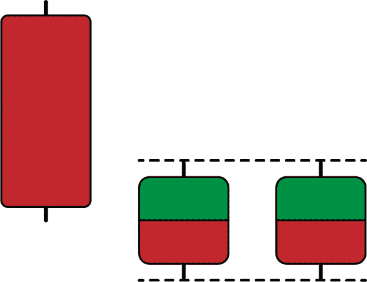

###### 图 7-1。一个看涨的分身

相比之下，图 7-2 展示了理论上的看跌分身模式。该模式由一个看涨蜡烛后跟两根数值相似的蜡烛组成，其类型（看涨或看跌）具有灵活性。请注意，这些是理论条件；在现实生活中，可能会添加一些灵活性（正如您将在本章中看到的）。

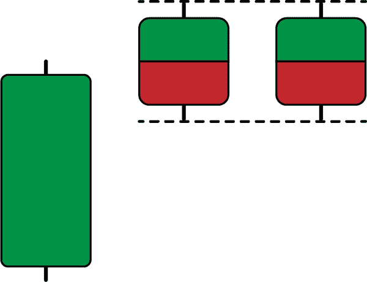

###### 图 7-2。一个看跌的分身

理想情况下，看涨逆转在下一根蜡烛超过相似高点时得到确认。同样，当下一根蜡烛突破相似低点时，看跌逆转得到确认。这是一个可选条件，可将该模式转变为四根蜡烛的配置。

分身模式的理论基础在于力量平衡的概念。具有相似蜡烛的情况下，当前总体方向周围存在犹豫，这可能导致完全的制度转变。此外，在看涨分身中低点的相等和看跌分身中高点的相等等价于支撑和阻力水平的概念，分别。

为增加信号的频率，您必须像在先前章节中看到的那样四舍五入值。对于外汇数据，您需要四位小数，对于其他回测资产，您需要零位小数。

从算法的角度看，实际条件如下：

+   如果当前高点等于先前高点，当前低点等于先前低点，并且两期前的蜡烛是看涨的，则在下一行打印 1，表示开盘价的买入信号的代表。

+   如果当前高点等于先前高点，当前低点等于先前低点，并且两期前的蜡烛是看跌的，则在下一行打印−1，表示开盘价的卖出信号的代表。

###### 注意

尝试编写添加第四根蜡烛图的可选条件。提醒一下，这个条件旨在过滤虚假信号，但可能会过滤掉太多信号。

你可以通过以下代码片段为幻影模式编写信号函数：

```py
def signal(data, open_column, high_column, low_column, close_column, 
           buy_column, sell_column):

    data = add_column(data, 5)  

    data = rounding(data, 4) `# Put 0 instead of 4 as of pair 4`

    for i in range(len(data)):  

       try:

    `# Bullish pattern`
           if data[i - 2, close_column] < data[i - 2, open_column] and \               data[i - 1, close_column] < data[i - 2, open_column] and \               data[i, high_column] == data[i - 1, high_column] and \               data[i, low_column] == data[i - 1, low_column]: 

                    data[i + 1, buy_column] = 1 

           `# Bearish pattern`
           elif data[i - 2, close_column] > data[i - 2, open_column] and \                 data[i - 1, close_column] > data[i - 2, open_column] and \                 data[i, high_column] == data[i - 1, high_column] and \                 data[i, low_column] == data[i - 1, low_column]:

                    data[i + 1, sell_column] = -1 

       except IndexError:

            pass

    return data

```

图 7-3 展示了 GBPUSD 的信号图。

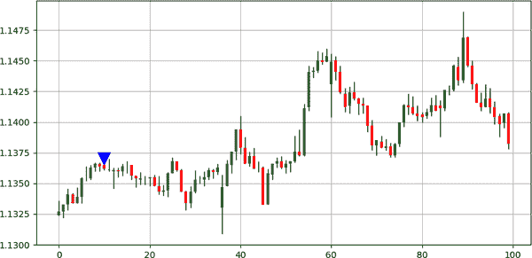

###### 图 7-3\. GBPUSD 的信号图

幻影模式并不常见。图 7-4 展示了另一个 USDCHF 的信号图。

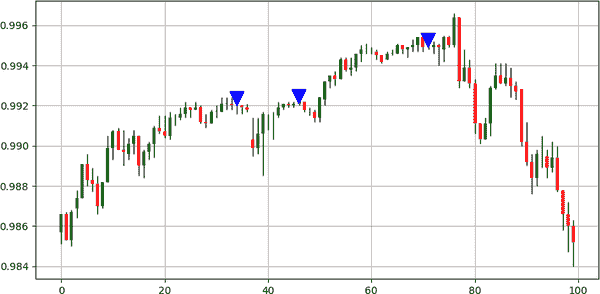

###### 图 7-4\. USDCHF 的信号图

表 7-1 总结了幻影模式的表现。

表 7-1\. 幻影模式：表现总结表

| 资产 | 命中率 | 盈利因子 | 风险收益比 | 信号数 |
| --- | --- | --- | --- | --- |
| EURUSD | 46.42% | 0.97 | 1.12 | 448 |
| USDCHF | 50.00% | 0.89 | 0.89 | 558 |
| GBPUSD | 48.05% | 1.07 | 1.16 | 283 |
| USDCAD | 45.52% | 0.76 | 0.91 | 380 |
| BTCUSD | 45.45% | 1.78 | 2.13 | 99 |
| ETHUSD | 50.87% | 0.92 | 0.88 | 1201 |
| GOLD | 49.74% | 0.85 | 0.85 | 2738 |
| S&P500 | 50.90% | 0.98 | 0.95 | 110 |
| FTSE100 | 48.27% | 1.27 | 1.36 | 29 |

总结一下，这种模式显示出跨资产类别的混合信号和混合频率。这可能是因为出场技术不适合这种模式，因为它主要关注中期逆转动作，但为了使书中所有模式的回测保持一致，出场条件是相同的。

提醒一下，出场条件是遇到看涨或看跌信号；否则，交易将继续进行。​

# 封锁模式

这种模式类似于市场发现支撑或阻力并显示出逆转迹象的概念。*封锁* 模式是一个由四根蜡烛图组成的配置，其中一些条件在视觉上难以检测。

图 7-5 描述了一个看涨的封锁。第一根蜡烛图必须是看跌的，并跟随着三根蜡烛图，其低价等于或高于第一根蜡烛图的低价，但低于其收盘价。最后，第四根蜡烛图必须是看涨的，并且其收盘价高于第一根蜡烛图的高价。这些条件验证了封锁模式并生成了一个看涨信号。

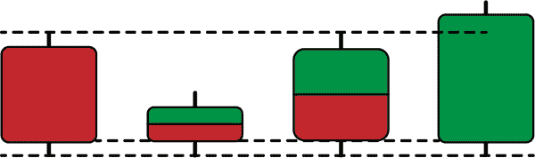

###### 图 7-5\. 一个看涨的封锁

图 7-6 描述了一个熊市封锁。第一根蜡烛图必须是看涨的，并跟随着三根蜡烛图，其高价等于或低于第一根蜡烛图的低价，但低于其收盘价。最后，第四根蜡烛图必须是看跌的，并且其收盘价低于第一根蜡烛图的低价。这些条件验证了封锁模式并生成了一个看跌信号。

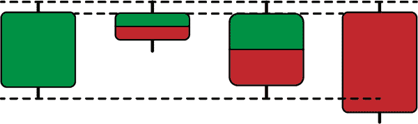

###### 图 7-6\. 一个熊市封锁

块位模式的理论基础在于，围绕支撑或阻力区域的稳定阶段可能提供了通过第四根蜡烛确认的反转机会。

下面的代码片段展示了如何编写块位模式的信号函数：

```py
def signal(data, open_column, high_column, low_column, close_column, 
           buy_column, sell_column):

    data = add_column(data, 5)    

    for i in range(len(data)):  

       try:

        `# Bullish pattern`
           if data[i - 3, close_column] < data[i - 3, open_column] and \               data[i - 2, close_column] < data[i - 3, open_column] and \               data[i - 2, low_column] >= data[i - 3, low_column] and \               data[i - 2, low_column] <= data[i - 3, close_column] and \               data[i - 1, low_column] >= data[i - 3, low_column] and \               data[i - 1, low_column] <= data[i - 3, close_column] and \               data[i, low_column] >= data[i - 3, low_column] and \               data[i, low_column] <= data[i - 3, close_column] and \               data[i, close_column] > data[i, open_column] and \               data[i, close_column] > data[i - 3, high_column]:        

                    data[i + 1, buy_column] = 1 

           `# Bearish pattern`
           elif data[i - 3, close_column] > data[i - 3, open_column] and \                 data[i - 2, close_column] > data[i - 3, open_column] and \                 data[i - 2, high_column] <= data[i - 3, high_column] and \                 data[i - 2, high_column] >= data[i - 3, close_column] and\                 data[i - 1, high_column] <= data[i - 3, high_column] and \                 data[i - 1, high_column] >= data[i - 3, close_column] and\                 data[i, high_column] <= data[i - 3, high_column] and \                 data[i, high_column] >= data[i - 3, close_column] and \                 data[i, close_column] < data[i, open_column] and \                 data[i, close_column] < data[i - 3, low_column]:  

                    data[i + 1, sell_column] = -1 

       except IndexError:

            pass

    return data

```

图 7-7 展示了英镑/美元的信号图表。首先要注意的是由于算法强加的多重条件，信号的稀缺性。

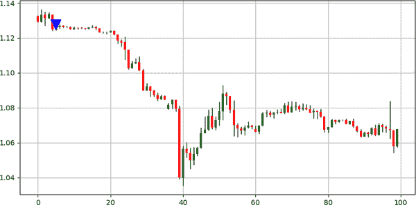

###### 图 7-7\. 英镑/美元的信号图表

罕见的模式无处不在，无论是经典还是现代的，它们在结果上与普通模式并没有太大区别。重要的是用其他信号和指标确认模式。

图 7-8 展示了澳元/新西兰元的信号图表。注意，通常情况下，图案与其完美理论形式并不相同，因为那样会使它们极为罕见甚至不可能找到；因此，有时可以应用一定的灵活性。

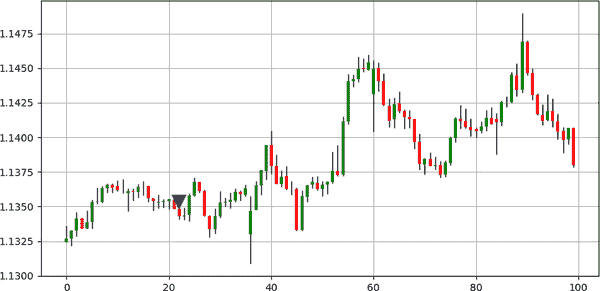

###### 图 7-8\. 澳元/新西兰元的信号图表

例如，我在这里应用的灵活性措施是，对于牛市块位模式，我已经取消了要求低点完全相同的条件，而对于熊市块位模式，则取消了要求高点完全相同的条件。记住，目的是检测一些模式并对其进行回测，以便对其预测能力有所了解，这将融入更复杂的策略中。

表 7-2 总结了块位模式的性能。

表 7-2\. 块位模式：性能总结表

| 资产 | 命中率 | 盈利因子 | 风险-回报比 | 信号数 |
| --- | --- | --- | --- | --- |
| EURUSD | 40.77% | 0.63 | 0.92 | 233 |
| USDCHF | 47.00% | 1.1 | 1.24 | 234 |
| GBPUSD | 50.19% | 1.06 | 1.06 | 263 |
| USDCAD | 46.15% | 0.92 | 1.07 | 260 |
| BTCUSD | 51.64% | 1.79 | 1.68 | 182 |
| ETHUSD | 45.40% | 1.64 | 1.96 | 174 |
| GOLD | 51.25% | 1.13 | 1.08 | 240 |
| S&P500 | 46.66% | 0.86 | 0.98 | 240 |
| FTSE100 | 35.71% | 1.1 | 1.98 | 28 |

总结来说，块位模式是一种在某些市场中可能稀有的复杂形态。它基于市场已找到支撑或阻力区域，并通过牛市或熊市蜡烛图表显示了反转意图的概念。

# 狂喜模式

乍一看，“狂喜”模式基本上与讨论的经典趋势跟随模式中的三根蜡烛模式相同。然而，我发现将一个条件添加到三根蜡烛模式中足以使其成为反向配置。当然，视觉上的冲突仍然相同，因为额外条件比交易员更容易通过算法检测到。

额外条件是每个蜡烛必须比前一个更大。这里的“更大”指的是实际范围，即书中早前提到的收盘价和开盘价的绝对差。

图 7-9 描绘了一个看涨的狂喜模式。该模式由三个连续的看跌蜡烛线组成，每个蜡烛线比前一个更大。

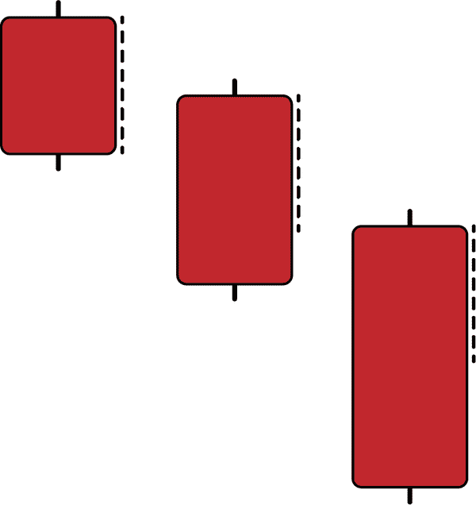

###### 图 7-9\. 一个看涨的狂喜模式

图 7-10 描绘了一个看跌的狂喜模式。该模式由三个连续的看涨蜡烛线组成，每个蜡烛线比前一个更大。

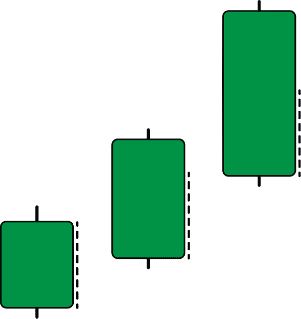

###### 图 7-10\. 一个看跌的狂喜模式

###### 注意

三蜡烛模式和狂喜模式非常相似，但蜡烛线尺寸的增加是它们之间的区别。在原始文献中，三蜡烛模式没有尺寸限制，这可能会导致这两种模式之间的冲突。

直觉上，你必须跟随让你更舒适的模式，并且你还必须用其他技术和指标来确认，以帮助你决定市场是否会继续朝着相同的方向趋势（三蜡烛模式），还是会反转（狂喜模式）。

下面的代码片段展示了如何为狂喜模式编写信号函数。你还需要对数值进行四舍五入：

```py
def signal(data, open_column, close_column, buy_column, sell_column):

    data = add_column(data, 5)  

    data = rounding(data, 4) # Put 0 instead of 4 as of pair 4

    for i in range(len(data)):  

       try:

  `# Bullish pattern`
           if data[i, open_column] > data[i, close_column] and \               data[i - 1, open_column] > data[i - 1, close_column] and \               data[i - 2, open_column] > data[i - 2, close_column] and \               data[i, close_column] < data[i - 1, close_column] and \               data[i - 1, close_column] < data[i - 2, close_column] and \               (data[i, open_column] - data[i, close_column]) > \               (data[i - 1, open_column] - data[i - 1, close_column]) and\               (data[i - 1, open_column] - data[i - 1, close_column]) > \               (data[i - 2, open_column] - data[i - 2, close_column]): 

                    data[i + 1, buy_column] = 1 

           `# Bearish pattern`
           elif data[i, open_column] < data[i, close_column] and \                 data[i - 1, open_column] < data[i - 1, close_column] and \                 data[i - 2, open_column] < data[i - 2, close_column] and \                 data[i, close_column] > data[i - 1, close_column] and \                 data[i - 1, close_column] > data[i - 2, close_column] and\                 (data[i, open_column] - data[i, close_column]) > \                 (data[i - 1, open_column] - data[i - 1, close_column]) and\                 (data[i - 1, open_column] - data[i - 1, close_column]) > \                 (data[i - 2, open_column] - data[i - 2, close_column]):

                    data[i + 1, sell_column] = -1 

       except IndexError:

            pass

    return data

```

图 7-11 展示了美元加元的信号图表。从视觉上看，狂喜模式比封锁模式更丰富，可能会提供更多信号，但这并不能说明质量如何，这一点我通常在本节末尾的绩效总结表格中会详细展示。

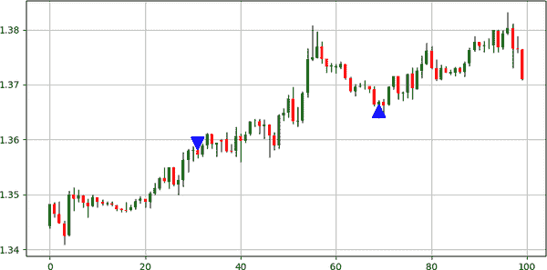

###### 图 7-11\. 美元加元的信号图表

狂喜模式的风险在于它试图计时贪婪阶段的结束，这非常危险。然而，基于短期事件的短期走势，狂喜模式表现优于其平均表现。例如，在确立的牛市趋势期间，狂喜模式的命中率小于横盘市场期间的命中率。

图 7-12 展示了澳元纽元的信号图表。请注意，在拥挤期间，该模式较为常见且质量相对较好。

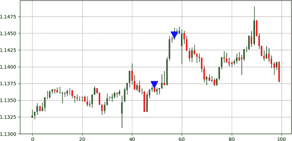

###### 图 7-12\. 澳元纽元的信号图表

###### 注意

请确保区分狂喜模式和双重麻烦模式，后者使用了包括高点和低点的波动率测量来考虑持续移动。一些蜡烛图模式可能相互类似，但存在一些微妙的差异，这些差异可能会改变预期的反应甚至预期的目标。

表格 7-3 总结了狂喜模式的绩效。请注意，通常的退出条件并非狂喜模式的最佳退出技术。

表格 7-3\. 狂喜模式：绩效总结表格

| 资产 | 命中率 | 盈利因子 | 风险-收益比 | 信号数 |
| --- | --- | --- | --- | --- |
| 欧元美元 | 49.17% | 1.17 | 1.21 | 1513 |
| 美元瑞士法郎 | 45.17% | 0.99 | 1.21 | 1523 |
| 英镑美元 | 46.69% | 1.08 | 1.24 | 1741 |
| 美元加元 | 46.96% | 1.00 | 1.12 | 1584 |
| BTCUSD | 47.24% | 1.12 | 1.24 | 1327 |
| ETHUSD | 45.71% | 0.98 | 1.16 | 1155 |
| GOLD | 44.48% | 0.94 | 1.17 | 2039 |
| S&P500 | 46.17% | 1.16 | 1.35 | 379 |
| FTSE100 | 46.34% | 1.05 | 1.21 | 369 |

总结来说，欢乐模式就像是市场参与者最初加速阶段的刹车，基于市场参与者的乐观情绪。基本上，更大的蜡烛意味着更大的风险，因为恐惧比贪婪更强大，交易者可能会在强劲的行情后开始减仓。

区分欢乐模式和第四章中讨论的三根蜡烛模式非常重要。

# 障碍模式

*障碍*模式非常基础且直观，可以被视为封锁模式的简化版本。它由三根蜡烛组成，同时借鉴了支撑和阻力水平的概念。该模式还利用了取整以稳定信号频率。

图 7-13 展示了一个看涨的障碍模式。前两根蜡烛必须是看跌的，而最后一根蜡烛必须是看涨的。同时，这三根蜡烛的最低点必须相同，这暗示着支撑区域。最后一根看涨蜡烛确认了看涨反转。

###### 注意

一个看涨的蜡烛意味着需求大于供应，因此在熊市后可以作为确认因素。

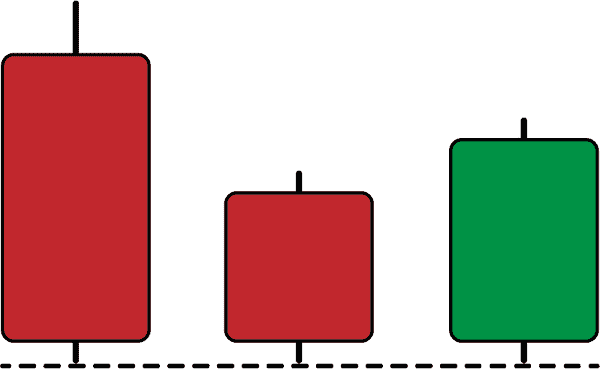

###### 图 7-13\. 一个看涨的障碍

图 7-14 展示了一个看跌的障碍模式。前两根蜡烛必须是看涨的，而最后一根蜡烛必须是看跌的。同时，这三根蜡烛的最高点必须相同，这暗示着阻力区域。最后一根看跌蜡烛确认了看跌反转。

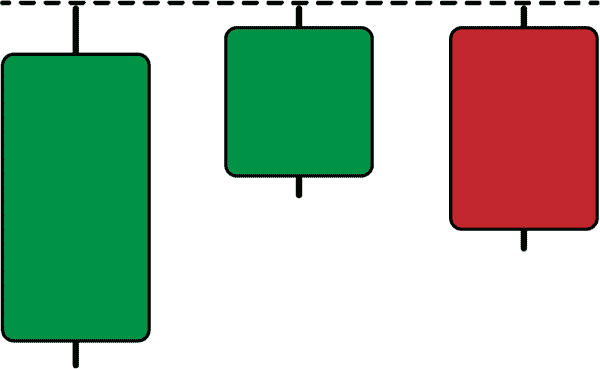

###### 图 7-14\. 一个看跌的障碍

###### 注意

在可选情况下，还可以施加额外条件。在看涨的障碍模式中，最后一根看涨蜡烛的收盘价必须高于中间蜡烛的最高价。同样地，在看跌的障碍模式中，最后一根看跌蜡烛的收盘价必须低于中间蜡烛的最低价。

下面的代码片段展示了如何为障碍模式编写信号函数。请注意，我添加了`rounding()`函数来最大化信号的获取。例如，如果欧元/美元的报价是五位小数（例如 1.05623），那么找到三根具有相同最低/最高值的蜡烛比四位小数的报价（例如 1.0562）更难：

```py
def signal(data, open_column, high_column, low_column, close_column, 
           buy_column, sell_column):

    data = add_column(data, 5)  

    data = rounding(data, 4) `# Put 0 instead of 4 as of pair 4`

    for i in range(len(data)):  

       try:

           `# Bullish pattern`
           if data[i, close_column] > data[i, open_column] and \               data[i - 1, close_column] < data[i - 1, open_column] and \               data[i - 2, close_column] < data[i - 2, open_column] and \               data[i, low_column] == data[i - 1, low_column] and \               data[i, low_column] == data[i - 2, low_column]:

                    data[i + 1, buy_column] = 1 

    `# Bearish pattern`
           elif data[i, close_column] < data[i, open_column] and \                 data[i - 1, close_column] > data[i - 1, open_column] and \                 data[i - 2, close_column] > data[i - 2, open_column] and \                 data[i, high_column] == data[i - 1, high_column] and \                 data[i, high_column] == data[i - 2, high_column]:

                    data[i + 1, sell_column] = -1 

       except IndexError:

            pass

    return data

```

图 7-15 展示了美元/瑞士法郎的信号图表。信号的频率似乎是可以接受的。这可以从性能汇总表中看出。

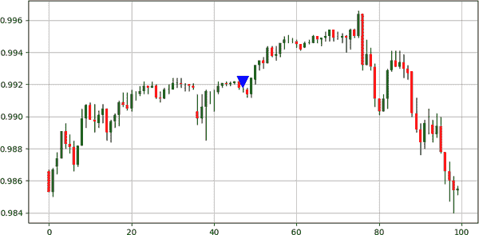

###### 图 7-15\. 美元/瑞士法郎的信号图表

图 7-16 展示了 AUDNZD 的信号图表。在某些市场中，信号可能比其他市场更少见。这是大多数蜡烛图模式所见的现象，了解信号频率使你能够知道在哪个市场使用哪些模式。

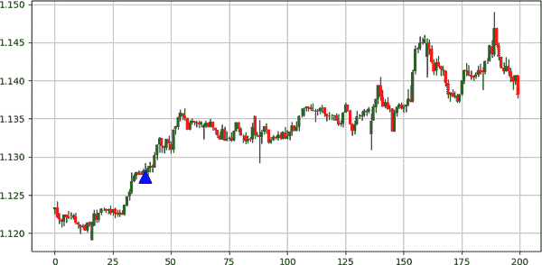

###### 图 7-16\. AUDNZD 的信号图表

表 7-4 总结了障碍模式的表现。

表 7-4\. 障碍模式：表现摘要表

| 资产 | 命中率 | 盈利因子 | 风险-收益比 | 信号数 |
| --- | --- | --- | --- | --- |
| EURUSD | 46.78% | 1.05 | 1.19 | 109 |
| USDCHF | 54.67% | 2.26 | 1.87 | 139 |
| GBPUSD | 43.24% | 0.85 | 1.11 | 74 |
| USDCAD | 52.74% | 1.13 | 1.01 | 91 |
| BTCUSD | 34.61% | 0.59 | 1.12 | 26 |
| ETHUSD | 50.92% | 1.11 | 1.07 | 163 |
| GOLD | 48.39% | 1.06 | 1.13 | 405 |
| S&P500 | 53.57% | 0.9 | 0.78 | 28 |
| FTSE100 | 37.50% | 0.38 | 0.63 | 8 |

总结一下，障碍模式是一个简单的三蜡烛配置，通过舍入增加其信号频率，由于一种严峻条件，迫使低点或高点相等。

# 镜像模式

如其名，*镜像* 模式是过去价格行动的反映，具有灵活的条件。其理念是市场正在形成一个 U 形转弯，并且应该改变方向。

图 7-17 描绘了一个牛市镜像。第一个蜡烛必须是熊市的，后面跟着两个具有相同高低的蜡烛。最后，最后一个蜡烛必须是牛市的，并且其高价等于第一个蜡烛的高价。在编码部分，你会看到有一些灵活性，因为理论条件难以找到。

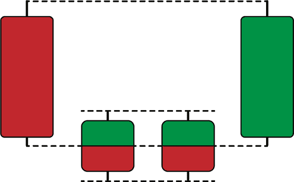

###### 图 7-17\. 一个牛市镜像

###### 注意

之所以蜡烛图模式的理论与实际应用之间存在差异，是因为理论处理直觉，但不能保证检测到模式所需的最低频率。在现实生活中，你必须调整一些条件，同时保留模式的直觉。

图 7-18 描述了一个熊市镜像。第一个蜡烛必须是牛市的，后面跟着两个具有相同高低的蜡烛。最后，最后一个蜡烛必须是熊市的，并且其低价等于第一个蜡烛的低价。

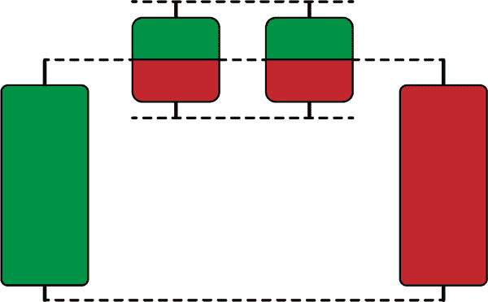

###### 图 7-18\. 一个熊市镜像

下面的代码片段展示了如何为镜像模式编写信号函数的代码。代码假设对中间蜡烛的高低灵活，并创建了这样一个条件：相等的收盘价格足以验证该模式（如果两个中间蜡烛的收盘价格相等，则不会使该模式失效）。

```py
def signal(data, open_column, high_column, low_column, close_column, 
           buy_column, sell_column):

    data = add_column(data, 5)  

    data = rounding(data, 0) # Put 0 instead of 4 as of pair 4

    for i in range(len(data)):  

       try:

           `# Bullish pattern`
           if data[i, close_column] > data[i, open_column] and \               data[i, high_column] == data[i - 3, high_column] and \               data[i, close_column] > data[i - 1, close_column] and \               data[i, close_column] > data[i - 2, close_column] and \               data[i, close_column] > data[i - 3, close_column] and \               data[i - 3, close_column] < data[i - 3, open_column] and \               data[i - 1, close_column] == data[i - 2, close_column]:

                    data[i + 1, buy_column] = 1 

      `# Bearish pattern`
           elif data[i, close_column] < data[i, open_column] and \                 data[i, low_column] == data[i - 3, low_column] and \                 data[i, close_column] < data[i - 1, close_column] and \                 data[i, close_column] < data[i - 2, close_column] and \                 data[i, close_column] < data[i - 3, close_column] and \                 data[i - 3, close_column] > data[i - 3, open_column] and \                 data[i - 1, close_column] == data[i - 2, close_column]:

                    data[i + 1, sell_column] = -1 

       except IndexError:

            pass

    return data

```

图 7-19 展示了 EURCHF 的信号图表。

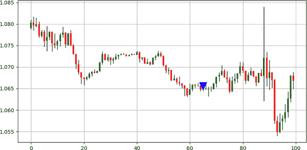

###### 图 7-19\. EURCHF 的信号图表

图 7-20 展示了 USDCHF 的信号图。即使在灵活的条件下，找到镜像模式可能也会很困难。

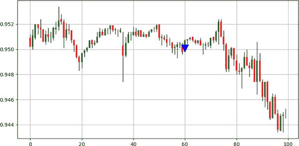

###### 图 7-20. USDCHF 的信号图

表 7-5 总结了镜像模式的表现。

表 7-5. 镜像模式：绩效汇总表

| Asset | 命中率 | 盈利因子 | 风险-收益比 | 信号数 |
| --- | --- | --- | --- | --- |
| EURUSD | 45.23% | 1.02 | 1.23 | 42 |
| USDCHF | 41.37% | 0.69 | 0.98 | 58 |
| GBPUSD | 37.50% | 0.78 | 1.3 | 32 |
| USDCAD | 34.21% | 0.78 | 1.5 | 38 |
| BTCUSD | 70.00% | 3.02 | 1.29 | 10 |
| ETHUSD | 44.30% | 0.83 | 1.04 | 237 |
| GOLD | 49.00% | 1.14 | 1.18 | 500 |
| S&P500 | 80.00% | 5.38 | 1.34 | 15 |

总结一下，镜像模式假设市场参与者逐渐改变方向，形成一个 U 形转折运动。这是一种罕见的模式，因为实现它的条件可能比较繁琐，但模式的直觉非常清晰。镜像模式也可以被视为“双胞胎”模式的延续。

# 收缩模式

收缩模式基于拥挤期后的突破概念。它是一个多蜡烛配置，最后一根蜡烛确认了这一动作。

图 7-21 展示了一个看涨的收缩模式。第一根蜡烛必须是看跌的，以反映看跌压力的代理，接下来的三根蜡烛可以是任何颜色，但每次必须缩小。最后（第五根）蜡烛必须是看涨的，并且必须超过第二根蜡烛的高点。

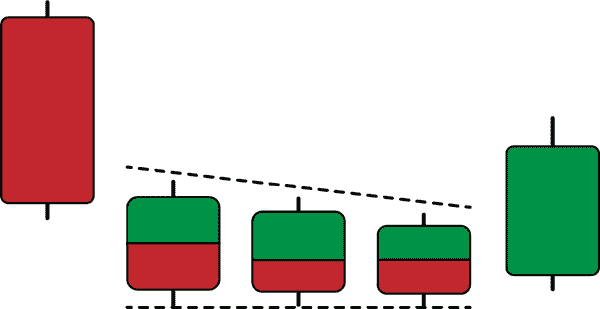

###### 图 7-21. 一个看涨的收缩模式

图 7-22 展示了一个熊市的收缩模式。第一根蜡烛必须是看涨的，以反映看涨压力的代理，接下来的三根蜡烛可以是任何颜色，但每次必须缩小。最后（第五根）蜡烛必须是看跌的，并且必须突破第二根蜡烛的低点。

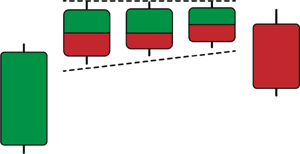

###### 图 7-22. 一个熊市的收缩模式

下面的代码片段展示了如何编写收缩模式的信号函数。我添加了一些灵活性，省略了理论条件，假设三个中间蜡烛具有类似的低点（看涨配置）和类似的高点（看跌配置），如图 7-21 和 7-22 中的虚线水平线所示。

```py
def signal(data, open_column, high_column, low_column, close_column, 
           buy_column, sell_column):

    data = add_column(data, 5)  

    data = rounding(data, 4)

    for i in range(len(data)):  

       try:

           `# Bullish pattern`
           if data[i - 4, close_column] < data[i - 4, open_column] and \               data[i, close_column] > data[i, open_column] and \               data[i, close_column] > data[i - 3, high_column] and \               abs(data[i - 3, close_column] - data[i - 3, open_column]) < \               abs(data[i - 4, close_column] - data[i - 4, open_column]) \               and abs(data[i - 2, close_column] - data[i - 2, open_column])\               < abs(data[i - 3, close_column] - data[i - 3, open_column]) \               and abs(data[i - 1, close_column] - data[i - 1, \               open_column]) < abs(data[i - 2, close_column] - data[i - 2, \               open_column]) and data[i - 1, high_column] < data[i - 2, \               high_column] and data[i - 2, high_column] < data[i - 3, \               high_column]:

                    data[i + 1, buy_column] = 1 

        `# Bearish pattern`
           elif data[i - 4, close_column] > data[i - 4, open_column] and \                 data[i, close_column] < data[i, open_column] and \                 data[i, close_column] < data[i - 3, low_column] and \                 abs(data[i - 3, close_column] - data[i - 3, open_column]) \                 < abs(data[i - 4, close_column] - data[i - 4, \                 open_column]) and abs(data[i - 2, close_column] - \                 data[i - 2, open_column]) < abs(data[i - 3, close_column] \                 - data[i - 3, open_column]) and abs(data[i - 1, \                 close_column] - data[i - 1, open_column]) < abs(data[i - \                 2, close_column] - data[i - 2, open_column]) and \                 data[i - 1, low_column] > data[i - 2, low_column] and \                 data[i - 2, low_column] > data[i - 3, low_column]:             

                    data[i + 1, sell_column] = -1 

       except IndexError:

            pass

    return data

```

图 7-23 展示了 GBPAUD 的信号图。

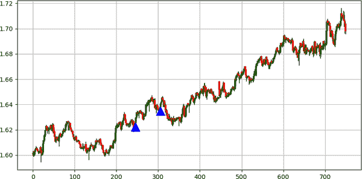

###### 图 7-23. GBPAUD 的信号图

表 7-6 总结了收缩模式的表现。

表 7-6. 收缩模式：绩效汇总表

| Asset | 命中率 | 盈利因子 | 风险-收益比 | 信号数 |
| --- | --- | --- | --- | --- |
| EURUSD | 37.77% | 0.52 | 0.86 | 45 |
| USDCHF | 37.14% | 0.39 | 0.66 | 35 |
| GBPUSD | 41.37% | 0.66 | 0.94 | 29 |
| USDCAD | 43.47% | 1.44 | 1.87 | 46 |
| 比特币对美元 | 58.62% | 1.24 | 0.88 | 29 |
| 以太坊对美元 | 55.55% | 2.16 | 1.73 | 27 |
| 金价 | 61.53% | 0.73 | 0.46 | 26 |

总结一下，收缩模式是直观的，并依赖于谨慎的概念，这通过在大蜡烛突破拥挤区之前的收缩蜡烛图形来体现，并确认了新的方向。

现在您已经学习完了不同蜡烛图形及其在 Python 中的编码方法。接下来的章节将讲解如何使用这些蜡烛图形，并将它们结合成更复杂的策略。
