# 第八章。高级蜡烛图表系统

到目前为止，您已经对可能对您有用的许多不同类型的模式有了全面的了解，但蜡烛图表也可以是创造性的，不必止步于基本的构建方法。本章介绍了两种蜡烛图表系统，提供了对原始系统的多样替代。

虽然原始系统将 OHLC 数据呈现为实际数据，但本章涵盖的两个建议系统采用了不同的方法来理解数据，并尽可能多地从中获取信息。

第一个高级图表系统是平均趋势烛台，它通过转换 OHLC 数据来帮助趋势追随者获得一个不那么嘈杂的视角。第二个图表系统是 K 线图表，它们仅仅是 OHLC 数据的平滑版本，应用蜡烛图案以寻找更多信号，同时减少噪音。

本章的目的是将这两个强大的图表系统添加到您的交易框架中，以便您有一个不同的视角。理想情况下，当使用原始蜡烛图系统检查模式时，您还应该在这两种替代蜡烛图系统上检查相同的模式。

# 平均趋势烛台系统

平均趋势烛台系统也称为平均趋势烛台。术语*heikin-ashi*在日语中意为“平均条”，考虑到其计算方式，这是直观的。创建平均趋势烛台图表的主要目的是理解潜在趋势，并过滤由随机波动引起的噪音。

您可以将该系统视为一种消噪技术，为您留下平滑的蜡烛图表。*平均趋势烛台*获取开盘价、最高价、最低价和收盘价，并使用简单的公式进行转换，然后绘制结果。

###### 注意

通过转换 OHLC 数据，平均趋势烛台图表不代表实际价值，而是*平滑*的价值。例如，熊市平均趋势烛台并不一定代表真正的熊市烛台，其收盘价也不一定等于真正的烛台收盘价。事实上，平均趋势烛台的收盘价很少是真实的收盘价。

要计算平均趋势烛台的开盘价，请使用以下公式：

<math alttext="Transformed open price Subscript i Baseline equals StartFraction Open price Subscript i minus 1 Baseline plus Close price Subscript i minus 1 Baseline Over 2 EndFraction"><mrow><mtext>Transformed</mtext> <mtext>open</mtext> <msub><mtext>price</mtext> <mi>i</mi></msub> <mo>=</mo> <mfrac><mrow><mtext>Open</mtext><msub><mtext>price</mtext> <mrow><mi>i</mi><mo>-</mo><mn>1</mn></mrow></msub> <mo>+</mo><mtext>Close</mtext><msub><mtext>price</mtext> <mrow><mi>i</mi><mo>-</mo><mn>1</mn></mrow></msub></mrow> <mn>2</mn></mfrac></mrow></math>

要计算平均趋势烛台的高价，请使用以下公式：

<math><mrow><mtext>转换</mtext> <mtext>高</mtext> <msub><mtext>价格</mtext> <mi>i</mi></msub> <mo>=</mo> <mi>m</mi> <mi>a</mi> <mi>x</mi> <mrow><mo>(</mo> <mtext>高</mtext> <msub><mtext>价格</mtext> <mi>i</mi></msub> <mo lspace="0%" rspace="0%">,</mo> <mtext>转换</mtext> <mtext>开盘</mtext> <msub><mtext>价格</mtext> <mi>i</mi></msub> <mo lspace="0%" rspace="0%">,</mo> <mtext>转换</mtext> <mtext>收盘</mtext> <msub><mtext>价格</mtext> <mi>i</mi></msub> <mo>)</mo></mrow></mrow></math>

要计算平均趋势烛台的低价，请使用以下公式：

<math><mrow><mtext>转换后的</mtext> <mtext>低价</mtext> <msub><mtext>价格</mtext> <mi>i</mi></msub> <mo>=</mo> <mi>m</mi> <mi>i</mi> <mi>n</mi> <mrow><mo>(</mo> <mtext>低价</mtext> <msub><mtext>价格</mtext> <mi>i</mi></msub> <mo lspace="0%" rspace="0%">,</mo> <mtext>转换后的</mtext> <mtext>开盘价</mtext> <msub><mtext>价格</mtext> <mi>i</mi></msub> <mo lspace="0%" rspace="0%">,</mo> <mtext>转换后的</mtext> <mtext>收盘价</mtext> <msub><mtext>价格</mtext> <mi>i</mi></msub> <mo>)</mo></mrow></mrow></math>

要计算 Heikin-Ashi 收盘价，请使用以下公式：

<math alttext="Transformed close price Subscript i Baseline equals StartFraction Open price Subscript i Baseline plus High price Subscript i Baseline plus Low price Subscript i Baseline plus Close price Subscript i Baseline Over 4 EndFraction"><mrow><mtext>Transformed</mtext> <mtext>close</mtext> <msub><mtext>price</mtext> <mi>i</mi></msub> <mo>=</mo> <mfrac><mrow><mtext>Open</mtext><msub><mtext>price</mtext> <mi>i</mi></msub> <mo>+</mo><mtext>High</mtext><msub><mtext>price</mtext> <mi>i</mi></msub> <mo>+</mo><mtext>Low</mtext><msub><mtext>price</mtext> <mi>i</mi></msub> <mo>+</mo><mtext>Close</mtext><msub><mtext>price</mtext> <mi>i</mi></msub></mrow> <mn>4</mn></mfrac></mrow></math>

Heikin-Ashi 图表的第一要点是，由于平滑效应，蜡烛图之间的颜色交替不像普通蜡烛图那样常见，这是一个可取的特性。图 8-1 展示了在 AUDNZD 上两种系统的差异。试着找出哪个是 Heikin-Ashi 图表。

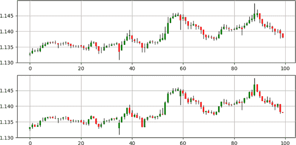

###### 图 8-1\. 上方是 AUDNZD 的 Heikin-Ashi 图表；下方是 AUDNZD 的普通蜡烛图表

注意相对来说，解释 Heikin-Ashi 图表相对容易，因为绿色（多头）蜡烛图会聚集在一起，显示当前趋势为多头，红色（空头）蜡烛图会聚集在一起，显示当前趋势为空头。这是平滑效应的威力。

图 8-2 展示了在 GBPAUD 上两种系统的差异。

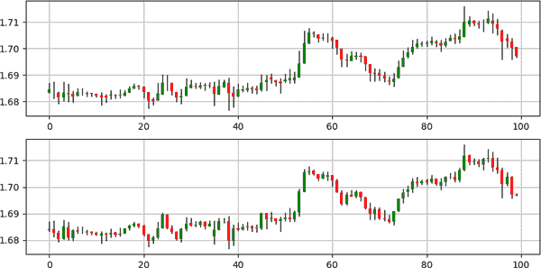

###### 图 8-2\. 上方是 GBPAUD 的 Heikin-Ashi 图表；下方是 GBPAUD 的普通蜡烛图表

Heikin-Ashi 图表有一些局限性：

+   OHLC 的 Heikin-Ashi 值不是真实价格，因为它们已经被转换过了。

+   在平盘市场中，Heikin-Ashi 蜡烛图会在颜色上交替，这妨碍了它们发出信号的能力。

+   颜色变化有时可能滞后，这可能意味着一部分行情已经发生在检测到之时。

创建 Heikin-Ashi 蜡烛图的方法是使用数组的四列 OHLC，应用转换，并将结果输出到数组的下一个四列。函数如下：

```py
def heikin_ashi(data, open_column, high_column, low_column, close_column, 
                position):

    data = add_column(data, 4)

    `# Heikin-Ashi Open`
    try:
        for i in range(len(data)):
            data[i, position] = (data[i - 1, open_column] + 
                                data[i - 1, close_column]) / 2
    except:
        pass

    `# Heikin-Ashi High`
    for i in range(len(data)):    
        data[i, position + 1] = max(data[i, position], 
                                data[i, position + 3], 
                                data[i, high_column])

    `# Heikin-Ashi Low    `
    for i in range(len(data)):    
        data[i, position + 2] = min(data[i, position], 
                                data[i, position + 3], 
                                data[i, low_column])      

    `# Heikin-Ashi Close`
    for i in range(len(data)):
        data[i, position + 3] = (data[i, open_column] + 
                                data[i, high_column] + 
                                data[i, low_column] + 
                                data[i, close_column]) / 4

    return data

```

现在让我们看看如何在 Heikin-Ashi 图表上应用之前看到的一些蜡烛图，这应该产生多样化效果。

## 检测十字星模式

作为提醒，十字星模式是一种不确定性和反向配置，具有以下特征：

+   如果当前的收盘价高于当前的开盘价，前一个收盘价等于开盘价，并且前一个收盘价低于前一个开盘价，则已经打印出了一个看涨的十字星。

+   如果当前的收盘价低于当前的开盘价，前一个收盘价等于开盘价，并且前一个收盘价高于前一个开盘价，则已经打印出了一个看跌的十字星。

图 8-3 展示了一个信号图表，上面的信号在 Heikin-Ashi 图表（顶部）和正常蜡烛图表（底部）上叠加显示。

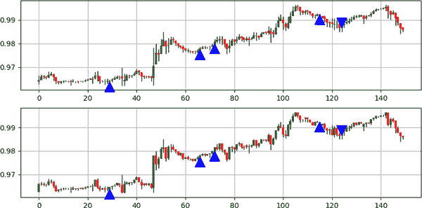

###### 图 8-3\. 顶部是 Heikin-Ashi 蜡烛图的信号（估计值）；底部是真实蜡烛图上的相同信号。货币对是 USDCHF。

###### 注意

图 8-3 的底部面板显示了真实信号相对于真实 OHLC 数据的位置。实际上，可以看到估计信号和真实信号的位置几乎没有差别。

图 8-4 展示了 USDCAD 的信号图表。不要忘记根据分析的资产对数值四舍五入。

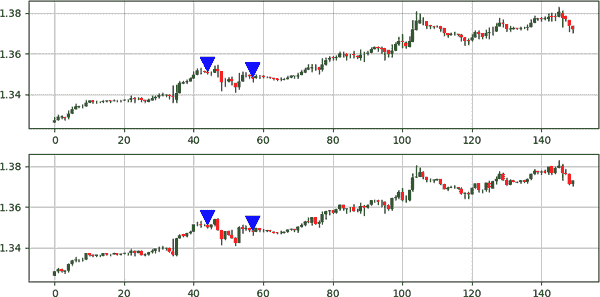

###### 图 8-4\. 顶部是 Heikin-Ashi 蜡烛图的信号（估计值）；底部是真实蜡烛图上的相同信号。资产是 USDCAD。

检查图案表现（见表 8-1）。重要的是使用真实的 OHLC 数据计算性能指标，而不是转换后的数值，以避免偏差系统。

表 8-1\. Heikin-Ashi 图表与 Doji 图案：性能总结表

| 资产 | 命中率 | 盈利因子 | 风险-收益比 | 信号数 |
| --- | --- | --- | --- | --- |
| EURUSD | 49,67% | 1,07 | 1,08 | 2126 |
| USDCHF | 47,30% | 1,07 | 1,19 | 2359 |
| GBPUSD | 48,73% | 1,03 | 1,08 | 1660 |
| USDCAD | 48,18% | 0,97 | 1,04 | 1982 |
| BTCUSD | 46,54% | 0,84 | 0,97 | 434 |
| ETHUSD | 44,91% | 0,81 | 0,99 | 1534 |
| GOLD | 44,93% | 1,05 | 1,29 | 3394 |
| S&P500 | 50,12% | 0,85 | 0,84 | 401 |
| FTSE100 | 52,10% | 1,09 | 1,00 | 261 |

## 检测 Tasuki 图案

作为提醒，Tasuki 图案是一种趋势跟随配置，其特征条件包括：

+   如果两期前的收盘价高于两期前的开盘价，一期前的开盘价高于两期前的收盘价，一期前的收盘价高于一期前的开盘价，并且当前的收盘价高于两期前的收盘价，则打印出了一个牛市 Tasuki 图案。

+   如果两期前的收盘价低于两期前的开盘价，一期前的开盘价低于两期前的收盘价，一期前的收盘价低于一期前的开盘价，并且当前的收盘价低于两期前的收盘价，则打印出了一个熊市 Tasuki 图案。

图 8-5 展示了 GBPAUD 的信号图表。

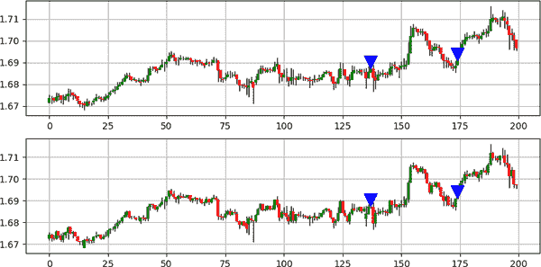

###### 图 8-5\. 顶部是 Heikin-Ashi 蜡烛图的信号（估计值）；底部是真实蜡烛图上的相同信号。货币对是 GBPAUD。

要创建双图信号图表，请使用以下代码：

```py
def candlestick_double_plot(data, buy_column, sell_column, window = 250):

    fig, ax = plt.subplots(2, figsize = (10, 5))

    sample = data[-window:, ]

    for i in range(len(sample)):

        ax[0].vlines(x = i, ymin = sample[i, 6], ymax = sample[i, 5], 
                     color = 'black', linewidth = 1)  

        if sample[i, 7] > sample[i, 4]:

            ax[0].vlines(x = i, ymin = sample[i, 4], ymax = sample[i, 7], 
                         color = 'mediumseagreen', linewidth = 3)  

        if sample[i, 7] < sample[i, 4]:

            ax[0].vlines(x = i, ymin = sample[i, 7], ymax = sample[i, 4], 
                         color = 'maroon', linewidth = 3)  

        if sample[i, 7] == sample[i, 4]:

            ax[0].vlines(x = i, ymin = sample[i, 7], ymax = sample[i, 4] + 
                         0.00005, color = 'black', linewidth = 1.00)  

        if sample[i, buy_column] == 1:

            x = i
            y = sample[i, 0]

            ax[0].annotate(' ', xy = (x, y), 
                        arrowprops = dict(width = 9, headlength = 11, 
                                          headwidth = 11, facecolor = 
                                          'green', color = 'green'))

        elif sample[i, sell_column] == -1:

            x = i
            y = sample[i, 0]

            ax[0].annotate(' ', xy = (x, y), 
                        arrowprops = dict(width = 9, headlength = -11,
                                          headwidth = -11, facecolor = 
                                          'red', color = 'red'))  

    ax[0].grid()

    for i in range(len(sample)):

        ax[1].vlines(x = i, ymin = sample[i, 2], ymax = sample[i, 1],
                     color = 'black', linewidth = 1)  

        if sample[i, 3] > sample[i, 0]:

            ax[1].vlines(x = i, ymin = sample[i, 0], ymax = sample[i, 3],
                         color = 'mediumseagreen', linewidth = 3)  

        if sample[i, 3] < sample[i, 0]:

            ax[1].vlines(x = i, ymin = sample[i, 3], ymax = sample[i, 0],
                         color = 'maroon', linewidth = 3)  

        if sample[i, 3] == sample[i, 0]:

            ax[1].vlines(x = i, ymin = sample[i, 3], ymax = sample[i, 0] +
                         0.00005, color = 'black', linewidth = 1.00)  

        if sample[i, buy_column] == 1:

            x = i
            y = sample[i, 0]

            ax[1].annotate(' ', xy = (x, y), 
                        arrowprops = dict(width = 9, headlength = 11, 
                                          headwidth = 11, facecolor = 
                                          'green', color = 'green'))

        elif sample[i, sell_column] == -1:

            x = i
            y = sample[i, 0]

            ax[1].annotate(' ', xy = (x, y), 
                        arrowprops = dict(width = 9, headlength = -11, 
                                          headwidth = -11, facecolor = 
                                          'red', color = 'red'))  

    ax[1].grid()

```

图 8-6 展示了 EURCHF 的信号图表。

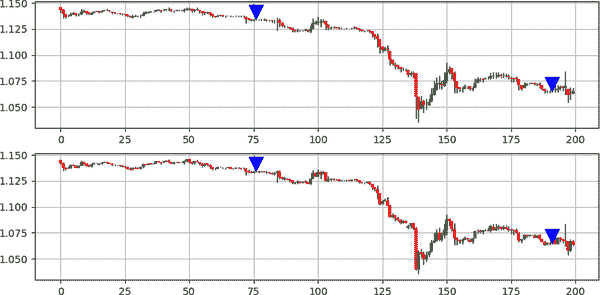

###### 图 8-6\. 顶部是平均烛台线估计的信号；底部是真实烛台线的相同信号。货币对为 EURCHF。

表 8-2 总结了一种算法在平均烛台线图上扫描和交易田边模式的性能指标。

表 8-2\. 平均烛台线与田边模式：性能摘要表

| 资产 | 命中率 | 盈利因子 | 风险回报比 | 信号 |
| --- | --- | --- | --- | --- |
| EURUSD | 51.04% | 0.83 | 0.80 | 384 |
| USDCHF | 50.00% | 0.91 | 0.91 | 468 |
| GBPUSD | 50.11% | 0.98 | 0.97 | 441 |
| USDCAD | 50.90% | 0.90 | 0.87 | 442 |
| BTCUSD | 50.00% | 0.94 | 0.93 | 248 |
| ETHUSD | 52.14% | 0.76 | 0.69 | 257 |
| GOLD | 47.04% | 0.92 | 1.04 | 372 |
| S&P500 | 55.76% | 1.12 | 0.88 | 52 |
| FTSE100 | 44.64% | 1.20 | 1.49 | 56 |

## 检测亢奋模式

作为提醒，亢奋模式是一种反向配置，其特征包括以下条件：

+   如果当前的空头烛台线实际尺寸大于前一个空头烛台线，并且前一个空头烛台线实际尺寸大于上一个空头烛台线，则打印出一个牛市的亢奋点。

+   如果当前的多头烛台线实际尺寸大于前一个多头烛台线，并且前一个多头烛台线实际尺寸大于上一个多头烛台线，则打印出一个牛市的亢奋点。

图 8-7 展示了 AUDNZD 的信号图。

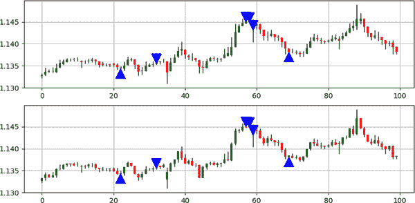

###### 图 8-7\. 顶部是平均烛台线估计的信号；底部是真实烛台线的相同信号。货币对为 AUDNZD。

###### 注

使用 `rounding()` 函数与亢奋模式可以帮助筛选出一些信号，如果你希望减少频率。

图 8-8 展示了 EURGBP 的信号图。保持趋势始终在你这边总是有趣的。这是你会在处理策略的章节中看到的一种技巧。主要思想是，在牛市趋势期间，最好考虑到一个看涨反转模式，而不是在熊市趋势期间。这是因为隐形的趋势手会帮助推动价格朝向总体方向。

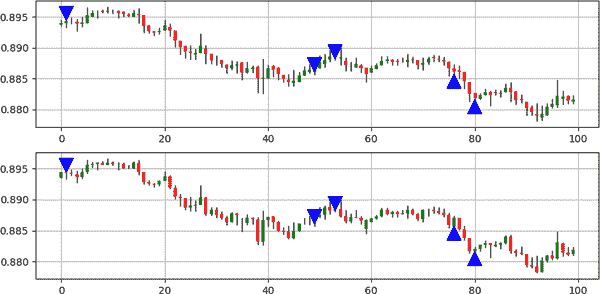

###### 图 8-8\. 顶部是平均烛台线估计的信号；底部是真实烛台线的相同信号。货币对为 EURGBP。

表 8-3 总结了一种算法在平均烛台线图上扫描和交易亢奋模式的性能指标。

表 8-3\. 平均烛台线与亢奋模式：性能摘要表

| 资产 | 命中率 | 盈利因子 | 风险回报比 | 信号 |
| --- | --- | --- | --- | --- |
| EURUSD | 47.74% | 1.01 | 1.11 | 2572 |
| USDCHF | 45.64% | 0.91 | 1.09 | 2583 |
| GBPUSD | 46.52% | 1.00 | 1.15 | 2990 |
| USDCAD | 48.25% | 1.08 | 1.16 | 2918 |
| BTCUSD | 48.61% | 1.04 | 1.1 | 2055 |
| ETHUSD | 43.83% | 0.8 | 1.02 | 933 |
| 黄金 | 49.17% | 1.06 | 1.09 | 543 |
| 标准普尔 500 指数 | 46.28% | 1.08 | 1.25 | 417 |
| 富时 100 指数 | 44.46% | 0.94 | 1.17 | 497 |

## 检测“双重麻烦”模式

作为提醒，“双重麻烦”模式是一种趋势跟踪配置，具有以下条件：

+   第二根看涨的蜡烛图必须至少是前一个蜡烛图的 10 周期 ATR 的两倍大小（从高到低）。

+   第二根看跌的蜡烛图必须至少是前一个蜡烛图的 10 周期 ATR 的两倍大小（从高到低）。

图 8-9 展示了 USDCHF 上的信号图。

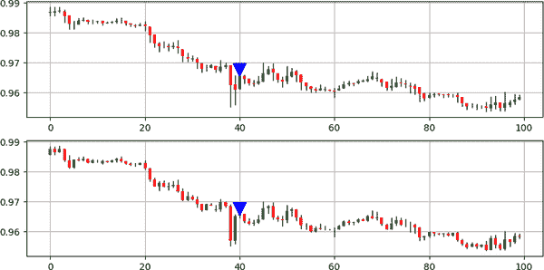

###### 图 8-9\. 顶部展示了平均柱状图（估计）上的信号；底部展示了相同信号在实际蜡烛图上的表现。货币对为 USDCHF。

图 8-10 展示了 USDJPY 上的信号图。

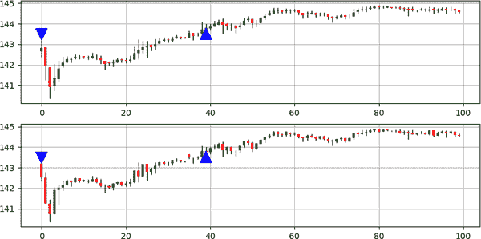

###### 图 8-10\. 顶部展示了平均柱状图（估计）上的信号；底部展示了相同信号在实际蜡烛图上的表现。资产为 USDJPY。

表格 8-4 总结了在平均柱状图上扫描和交易“双重麻烦”模式算法的表现指标。

表格 8-4\. 带有“双重麻烦”模式的平均柱状图：绩效汇总表

| 资产 | 命中率 | 盈利因子 | 风险-收益比 | 信号数 |
| --- | --- | --- | --- | --- |
| 欧元美元 | 57.62% | 0.92 | 0.67 | 1135 |
| 美元瑞士法郎 | 56.49% | 1.08 | 0.84 | 110 |
| 英镑美元 | 53.72% | 0.89 | 0.77 | 1167 |
| 美元加元 | 56.14% | 1.02 | 0.80 | 1058 |
| 比特币美元 | 62.84% | 1.19 | 0.71 | 716 |
| 以太坊美元 | 61.00% | 1.04 | 0.67 | 659 |
| 黄金 | 57.00% | 0.96 | 0.73 | 1021 |
| 标准普尔 500 指数 | 57.40% | 1.36 | 1.00 | 162 |
| 富时 100 指数 | 54.13% | 0.95 | 0.80 | 133 |

# K 的蜡烛图系统

*K 的* 蜡烛图旨在进一步平滑 OHLC 值，以更好地理解潜在趋势，同时保留四个基本数据。¹ 因此，K 的蜡烛图系统使用默认的回顾期三来计算 OHLC 数据的简单移动平均值。

###### 注

三期代表小时图中的三小时，日线图中的三天。

要计算 K 的开盘价格，请使用以下公式：

<math alttext="upper K single-comma-quotation-mark s open price Subscript i Baseline equals StartFraction Open price Subscript i Baseline plus Open price Subscript i minus 1 Baseline plus Open price Subscript i minus 2 Baseline Over 3 EndFraction"><mrow><mtext>K’s</mtext> <mtext>open</mtext> <msub><mtext>price</mtext> <mi>i</mi></msub> <mo>=</mo> <mfrac><mrow><mtext>Open</mtext><msub><mtext>price</mtext> <mi>i</mi></msub> <mo>+</mo><mtext>Open</mtext><msub><mtext>price</mtext> <mrow><mi>i</mi><mo>-</mo><mn>1</mn></mrow></msub> <mo>+</mo><mtext>Open</mtext><msub><mtext>price</mtext> <mrow><mi>i</mi><mo>-</mo><mn>2</mn></mrow></msub></mrow> <mn>3</mn></mfrac></mrow></math>

要计算 K 的最高价格，请使用以下公式：

<math alttext="upper K single-comma-quotation-mark s high price Subscript i Baseline equals StartFraction High price Subscript i Baseline plus High price Subscript i minus 1 Baseline plus High price Subscript i minus 2 Baseline Over 3 EndFraction"><mrow><mtext>K’s</mtext> <mtext>high</mtext> <msub><mtext>price</mtext> <mi>i</mi></msub> <mo>=</mo> <mfrac><mrow><mtext>High</mtext><msub><mtext>price</mtext> <mi>i</mi></msub> <mo>+</mo><mtext>High</mtext><msub><mtext>price</mtext> <mrow><mi>i</mi><mo>-</mo><mn>1</mn></mrow></msub> <mo>+</mo><mtext>High</mtext><msub><mtext>price</mtext> <mrow><mi>i</mi><mo>-</mo><mn>2</mn></mrow></msub></mrow> <mn>3</mn></mfrac></mrow></math>

要计算 K 的最低价格，请使用以下公式：

<math alttext="upper K single-comma-quotation-mark s low price Subscript i Baseline equals StartFraction Low price Subscript i Baseline plus Low price Subscript i minus 1 Baseline plus Low price Subscript i minus 2 Baseline Over 3 EndFraction"><mrow><mtext>K’s</mtext> <mtext>low</mtext> <msub><mtext>price</mtext> <mi>i</mi></msub> <mo>=</mo> <mfrac><mrow><mtext>Low</mtext><msub><mtext>price</mtext> <mi>i</mi></msub> <mo>+</mo><mtext>Low</mtext><msub><mtext>price</mtext> <mrow><mi>i</mi><mo>-</mo><mn>1</mn></mrow></msub> <mo>+</mo><mtext>Low</mtext><msub><mtext>price</mtext> <mrow><mi>i</mi><mo>-</mo><mn>2</mn></mrow></msub></mrow> <mn>3</mn></mfrac></mrow></math>

要计算 K 的收盘价格，请使用以下公式：

<math alttext="upper K single-comma-quotation-mark s close price Subscript i Baseline equals StartFraction Close reverse-solidus price Subscript i Baseline plus Close price Subscript i minus 1 Baseline plus Close price Subscript i minus 2 Baseline Over 3 EndFraction"><mrow><mtext>K’s</mtext> <mtext>close</mtext> <msub><mtext>price</mtext> <mi>i</mi></msub> <mo>=</mo> <mfrac><mrow><mtext>Close</mtext><msub><mtext>price</mtext> <mi>i</mi></msub> <mo>+</mo><mtext>Close</mtext><msub><mtext>price</mtext> <mrow><mi>i</mi><mo>-</mo><mn>1</mn></mrow></msub> <mo>+</mo><mtext>Close</mtext><msub><mtext>price</mtext> <mrow><mi>i</mi><mo>-</mo><mn>2</mn></mrow></msub></mrow> <mn>3</mn></mfrac></mrow></math>

图 8-11 展示了常规蜡烛图与 K 的蜡烛图之间的差异。

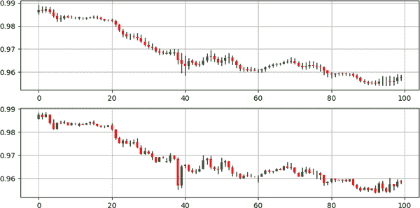

###### 图 8-11\. 顶部为 EURUSD 的 K 蜡烛图；底部为 EURUSD 的常规蜡烛图

注意，K 的蜡烛图比平均柱状图的走势更加平滑。这是因为 K 的蜡烛图使用的平滑期为 3，而平均柱状图的平滑期为 1。

图 8-12 展示了 AUDNZD 常规蜡烛图与 K 的蜡烛图在同一货币对上的差异。

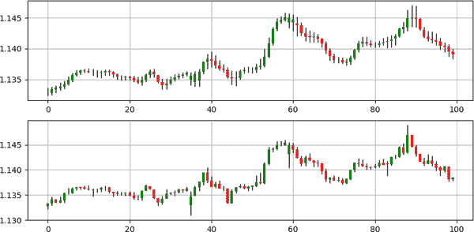

###### 图 8-12\. 顶部为 AUDNZD 的 K 的蜡烛图；底部为 AUDNZD 的常规蜡烛图

K 的蜡烛图的限制如下：

1.  OHLC K 的蜡烛图的值不是真实价格，因为它们已经转换过了。

1.  在平稳市场中，K 的蜡烛图会交替变色，这会妨碍它们生成信号的能力。

1.  滞后效应甚至比 Heikin-Ashi 蜡烛图更大。但是，这并不足以完全抵消视图的好处。

您可以使用的代码 K 的蜡烛图的功能如下：

```py
def k_candlesticks(data, open_column, high_column, low_column, 
                   close_column, lookback, position):

    data = add_column(data, 4)

    `# Averaging the open price`
    data = ma(data, lookback, open_column, position)

    `# Averaging the high price`
    data = ma(data, lookback, high_column, position + 1)

    `# Averaging the low price`
    data = ma(data, lookback, low_column, position + 2)

    `# Averaging the close price`
    data = ma(data, lookback, close_column, position + 3)

    return data 
```

现在让我们看看如何在 K 的蜡烛图上应用之前看到的一些蜡烛图。

## 检测十字星图案

十字星图案可能是使用 K 的蜡烛图最好的模式之一，因为它与许多形式的短期和长期逆转相关。图 8-13 展示了 GBPUSD 上的信号图表。

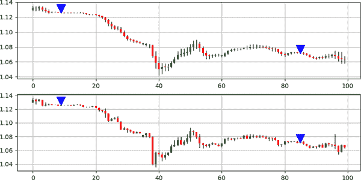

###### 图 8-13\. 顶部为 K 的蜡烛图上的信号（估计值）；底部为实际蜡烛图上的相同信号。货币对为 GBPUSD。

图 8-14 展示了 USDCAD 上的信号图表。在震荡市场上，反转模式的效果相对更好。

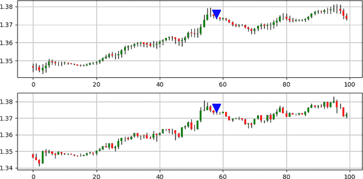

###### 图 8-14\. 顶部为 K 的蜡烛图上的信号（估计值）；底部为实际蜡烛图上的相同信号。货币对为 USDCAD。

表 8-5 总结了一个算法在 K 的蜡烛图上扫描和交易十字星图案的绩效指标。记住，提高绩效的关键之一是优化入场和出场技术。

表 8-5\. K 的蜡烛图与十字星图案：绩效总结表

| 资产 | 命中率 | 盈利因子 | 风险-收益比 | 信号数 |
| --- | --- | --- | --- | --- |
| EURUSD | 43.66% | 0.81 | 1.05 | 2352 |
| USDCHF | 43.80% | 0.90 | 1.15 | 2479 |
| GBPUSD | 46.19% | 1.07 | 1.24 | 1840 |
| USDCAD | 45.07% | 1.02 | 1.24 | 2143 |
| BTCUSD | 44.23% | 0.90 | 1.13 | 486 |
| ETHUSD | 45.93% | 1.20 | 1.41 | 1132 |
| GOLD | 45.60% | 0.89 | 1.06 | 2445 |
| S&P500 | 42.70% | 0.89 | 1.19 | 384 |
| FTSE100 | 46.44% | 1.19 | 1.37 | 267 |

## 检测挂月线图案

图 8-15 展示了 AUDNZD 上的信号图表。

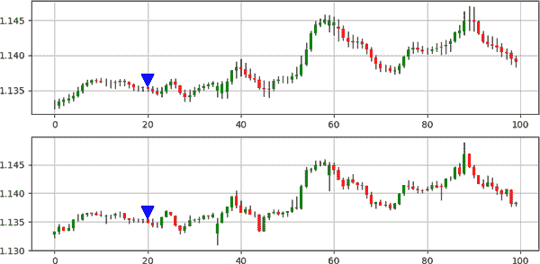

###### 图 8-15\. 顶部为 K 的蜡烛图上的信号（估计值）；底部为实际蜡烛图上的相同信号。货币对为 AUDNZD。

表 8-6 总结了一个算法在 K 的蜡烛图上扫描和交易挂月线图案的绩效指标。

表 8-6\. K 的蜡烛图与挂月线图案：绩效总结表

| 资产 | 命中率 | 盈利因子 | 风险-收益比 | 信号数 |
| --- | --- | --- | --- | --- |
| EURUSD | 50.00% | 1.11 | 1.11 | 50 |
| USDCHF | 51.68% | 0.83 | 0.78 | 89 |
| GBPUSD | 56.66% | 1.65 | 1.26 | 60 |
| USDCAD | 50.79% | 1.19 | 1.15 | 63 |
| BTCUSD | 43.24% | 0.78 | 1.02 | 74 |
| ETHUSD | 60.38% | 0.81 | 0.53 | 53 |
| GOLD | 55.38% | 1.01 | 0.81 | 130 |
| S&P500 | 47.05% | 0.77 | 0.86 | 17 |
| FTSE100 | 50.00% | 1.80 | 1.8 | 24 |

## 检测欢愉模式

图 8-16 展示了 AUDNZD 的信号图表。

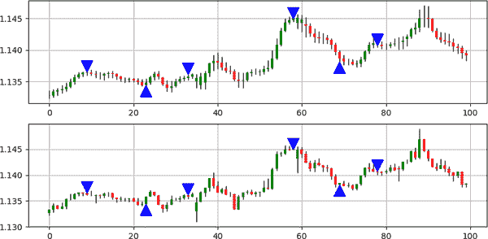

###### 图 8-16\. 在顶部，K 的蜡烛图上的信号（估计值）；在底部，实际蜡烛图上相同的信号。货币对为 AUDNZD。

图 8-17 展示了 AUDJPY 的信号图表。

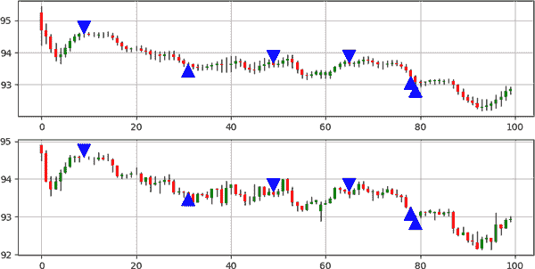

###### 图 8-17\. 在顶部，K 的蜡烛图上的信号（估计值）；在底部，实际蜡烛图上相同的信号。货币对为 AUDJPY。

表 8-7 总结了一个算法在 K 的蜡烛图上扫描和交易欢愉模式的性能指标。

图 8-7\. K 的蜡烛图与欢愉模式：性能摘要表

| 资产 | 命中率 | 盈利因子 | 风险-收益比 | 信号数 |
| --- | --- | --- | --- | --- |
| EURUSD | 46.29% | 1.02 | 1.18 | 3916 |
| USDCHF | 44.73% | 0.91 | 1.13 | 3798 |
| GBPUSD | 46.15% | 1.00 | 1.16 | 4446 |
| USDCAD | 45.64% | 0.99 | 1.18 | 4296 |
| BTCUSD | 46.71% | 1.01 | 1.15 | 3303 |
| ETHUSD | 45.14% | 0.98 | 1.19 | 1327 |
| GOLD | 47.40% | 1.03 | 1.14 | 597 |
| S&P500 | 48.08% | 1.27 | 1.37 | 522 |
| FTSE100 | 48.13% | 1.11 | 1.2 | 698 |

## 检测双重麻烦模式

图 8-18 展示了 USDCHF 的信号图表。

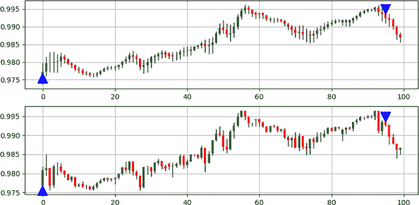

###### 图 8-18\. 在顶部，K 的蜡烛图上的信号（估计值）；在底部，实际蜡烛图上相同的信号。货币对为 USDCHF。

图 8-19 展示了 EURGBP 的信号图表。

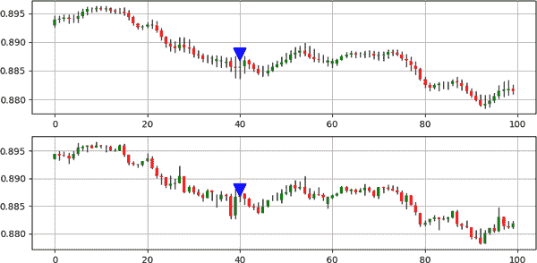

###### 图 8-19\. 在顶部，K 的蜡烛图上的信号（估计值）；在底部，实际蜡烛图上相同的信号。资产为 EURGBP。

表 8-8 总结了一个算法在 K 的蜡烛图上扫描和交易双重麻烦模式的性能指标。

图 8-8\. K 的蜡烛图与双重麻烦模式：性能摘要表

| 资产 | 命中率 | 盈利因子 | 风险-收益比 | 信号数 |
| --- | --- | --- | --- | --- |
| EURUSD | 50.35% | 0.9 | 0.89 | 709 |
| USDCHF | 53.36% | 1.06 | 0.93 | 624 |
| GBPUSD | 52.20% | 0.98 | 0.9 | 793 |
| USDCAD | 50.15% | 0.93 | 0.92 | 664 |
| BTCUSD | 54.67% | 1.49 | 1.24 | 406 |
| ETHUSD | 61.37% | 2.94 | 1.85 | 334 |
| GOLD | 51.68% | 1.09 | 1.02 | 743 |
| S&P500 | 55.35% | 1.07 | 0.86 | 112 |
| FTSE100 | 40.25% | 0.42 | 0.62 | 77 |

总结来说，不同的图表系统在提供价格行动不同视角方面很有用。每个系统都有其优缺点。表 8-9 总结了关于图表系统的一些关键点。

图 8-9\. 不同蜡烛图系统的比较

| 图表系统 | 优点 | 缺点 |
| --- | --- | --- |
| 蜡烛图表 | 真实价格和易于解读 | 嘈杂 |
| 平均趋势图 | 由于平滑处理，趋势解释更佳 | 延迟小且价格不真实 |
| K 线图 | 由于额外平滑处理，趋势解释更佳 | 延迟更大且价格不真实 |

¹ OHLC 数据。
