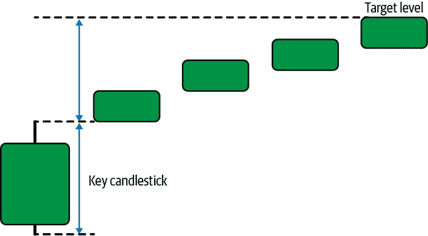
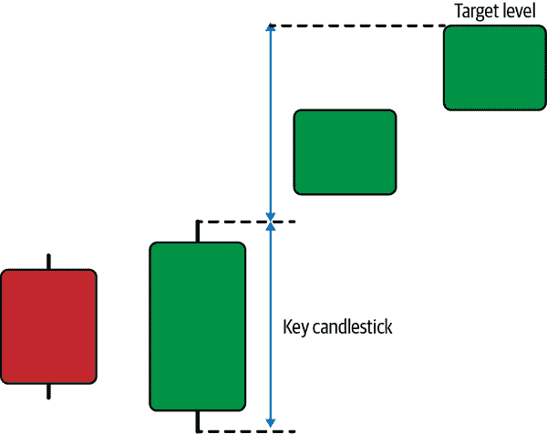
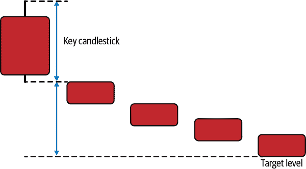
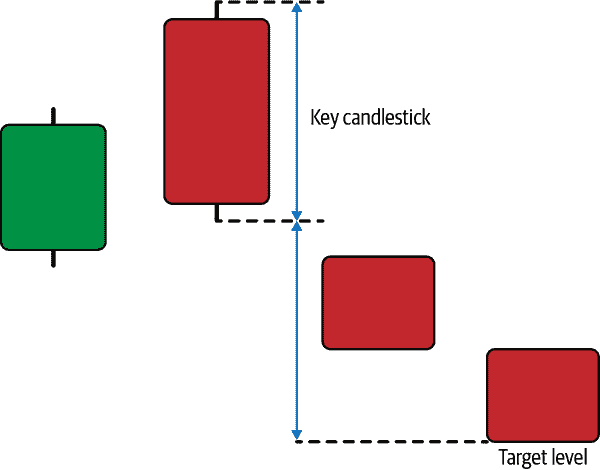

# 第九章 蜡烛图模式退出技术

每当出现蜡烛图模式时，你必须考虑三种技术（事件）：

入场技术

该技术控制在验证模式后使用的买入或卖出价格。换句话说，你会在模式出现后的下一个开盘价买入吗，还是会使用其他价格？

目标技术

该技术控制在何处盈利性地清算头寸。它可以被称为模式的*潜在目标*或其*预期反应区间*。

止损技术

该技术控制在何处亏损清算头寸。它可以被称为模式的*失效点*或*止损点*。

本章讨论了两种退出技术，即目标技术和止损技术。

###### 注意

注意*入场技术*假设在验证模式的蜡烛图开盘价上进行交易（做多或做空）。

# 对称退出技术

该技术根据模式内关键蜡烛图的大小设定了任何蜡烛图模式的简易目标。*对称退出*取决于关键蜡烛图的高低差，并从一个极端点进行投影（取决于是看涨还是看跌模式）。

###### 注意

*关键蜡烛图*是用来确定对称目标的蜡烛图。一般来说，它是确认或定义模式的蜡烛图。例如，Doji 模式的关键蜡烛图是中间的那根蜡烛图，类似加号，而 Euphoria 模式的关键蜡烛图是第三根（最大的）蜡烛图。

图 9-1 展示了从关键蜡烛图（第一根）计算的看涨目标的例子。该示例展示了一个假设的模式。两个箭头的大小相同。

###### 图 9-1\. 使用对称退出技术计算看涨目标

考虑一个具有以下特征的看涨吞没形态模式：

+   蜡烛图吞没形态的开盘价：$100

+   蜡烛图吞没形态的最高价：$105

+   蜡烛图吞没形态的最低价：$95

+   蜡烛图吞没形态的收盘价：$102

你应该瞄准的理论上的看涨目标是 ($105 – $95) + $105 = $115。

图 9-2 展示了使用该技术计算看涨吞没形态潜力的例子。

###### 图 9-2\. 使用对称退出技术计算蜡烛图吞没形态看涨目标

图 9-3 展示了从关键蜡烛图计算看跌目标的例子。该示例展示了一个假设的模式。

###### 图 9-3\. 使用对称退出技术计算看跌目标

考虑一个带有以下特征的看跌穿透（暗云）模式：

+   穿透蜡烛图的开盘价：$50

+   穿透蜡烛图的最高价：$55

+   吞没蜡烛的最低价：$45

+   吞没蜡烛的收盘价：$52

你应该瞄准的理论熊市目标是$55 - ($55 - $45) = $45。

图 9-4 展示了使用这种技术的牛市吞没模式的潜力。

###### 图 9-4. 使用对称退出技术计算吞没模式的熊市目标

对称退出技术的优点在于其易用性和简单直觉，即仅仅通过投影高低点之间的距离，这本身就是一个以波动性加权的目标度量。

###### 注意

记住，吞没和穿透模式是我在第六章中讨论的经典反向模式。

# 固定持有期退出技术

固定持有期假设，当你遇到另一个模式时，你必须退出一个模式。这是一个相对不灵活的技术，并且假设反应必须在一定的时间内发生。

主要思想是，在验证蜡烛图模式后开仓，一个计时器开始并运行直到退出，无论市场价格相对于进场价格如何。

例如，牛市吊顶模式验证完成，并开仓。在固定的持有期 5 个时期之后，必须在五个时间段后退出该持仓。固定的持有期技术假设了一个时间相关的模式，这对于预定的窗口是有效的。

# 可变持有期退出技术

可变的持有期假设，当你遇到另一个模式时，你必须退出一个模式。这是一个相对不灵活的技术。

主要思想是，在验证蜡烛图模式后开仓，只有当你遇到另一个模式时，无论是牛市还是熊市，你才会退出。这意味着只要市场向你展示否则，该模式就有效。

例如，验证了熊市孕线模式，并开仓。在变动的持有期之后，仅当遇到另一个模式时才退出该持仓。

对于罕见模式，这种技术可能会很危险，因为持仓可能会保持开放很长时间，从而使交易变得过时和无意义。

###### 注意

此技术假设，只有在遇到相同类型的模式或任何其他类型的模式（牛市或熊市）时，你才会退出。值得一提的是，这是本书中呈现的回测中使用的技术。

# 混合退出技术

混合退出技术可能是讨论的退出技术中最好的选择，因为它结合了三种退出技术的属性，以限制风险。混合退出技术使用先到先服务的方法来确定蜡烛图模式的退出，使用以下规则：

+   对称投影是计算并赋予特定权重（1%至 99%之间）的。

+   变动持有期会监控每根蜡烛图，并赋予一定的权重，即给定权重的剩余部分。

+   固定持有期用于在最大持续时间场景中框定整个交易。

前述要点的含义是，你将在两个情况下退出模式，以先达到的条件为准（对称投影或出现另一模式）。当你退出一个位置时，例如 50%的权重，这意味着你将在验证对称投影或出现另一模式时退出 50%的仓位。

如果在预定时间窗口到期之前不符合这两个条件，将关闭仓位（进入固定持有期）。

让我们举个例子。假设市场在 EURUSD 上验证了一个看涨的镜像模式，并给出以下交易细节：

+   在$1.0000 处发起买单。

+   对称投影的计算给出目标价位为$1.0100。

+   权重设定为 50%。

+   固定持有期设定为五个周期。

下面是一个假设的时间轴，展示了如果交易者采用混合方法，交易可能的进展：

+   *H-1*: 市场达到$1.0110 的高点；因模式达到其对称投影，关闭一半仓位。

+   *H-2*: 市场交易并收盘于$1.0000。

+   *H-3*: 市场交易并收盘于$0.9995。

+   *H-4*: 市场交易并收盘于$1.0150。

+   *H-5*: 市场收盘价为$1.0120，五个周期内未出现任何模式。剩余仓位清算。

每个市场可能有适合它的独特退出策略。总体而言，混合技术试图通过整合多种退出技术来兼顾各方面的利益。表 9-1 展示了所讨论退出技术之间的主要区别。

表 9-1\. 退出技术汇总

| 退出技术 | 持续时间 | 依赖性 |
| --- | --- | --- |
| 对称退出技术 | 中长期 | 价格 |
| 固定持有期 | 取决于用户 | 时间 |
| 变动持有期 | 中长期 | 价格 |
| 混合退出技术 | 中长期 | 价格和时间 |

# 模式作废

总会有这样的时刻，模式未能产生预期的反应，正如您可能从回测结果中看到的那样，这并不少见。在这种情况下，您必须准备好限制损失，通过创建*作废规则*来实现。这些规则可以是客观的，也可以是主观的，具体取决于交易者。

模式可以通过风险管理技术来作废，例如由交易者自己设定的止损或者像之前在第五章中讨论的 ATR 等波动率措施。

###### 注

注意，模式无效化与退出技术类似，不同之处在于它涉及到损失退出。然而，固定持有期技术既可以视为目标技术，也可以视为无效化技术，因为它是一种风险限制方法（在一定时间后退出），也是一种目标方法（在相信模式可能引起反应的有限时间后退出）。

模式无效化可以是双重的：

固定止损位

此无效化方法通过设定一个固定水平来限制风险，如果市场达到该水平，则清算头寸。随着市场波动性的不断变化，不建议采用此方法。

基于 ATR 的止损位

此无效化方法通过基于 ATR 的值设定限制水平来限制风险。建议根据波动性调整风险权重。

例如，交易者可以始终将 20 个点用作他们 EURUSD 短期交易的止损位。这意味着如果出现模式并且买入订单在$1.0000 启动，每当市场触及或突破$0.9980 时，该头寸将自动以亏损清算。相比之下，如果同一交易者使用基于 ATR 的技术来无效化模式，他们将在市场突破初始时的开盘价减去 ATR 读数乘以 2 之类的常数后退出。

更明确地说，假设 ATR 值为 20。那么，止损位将在$0.9960（20 × 2 = 40）。
