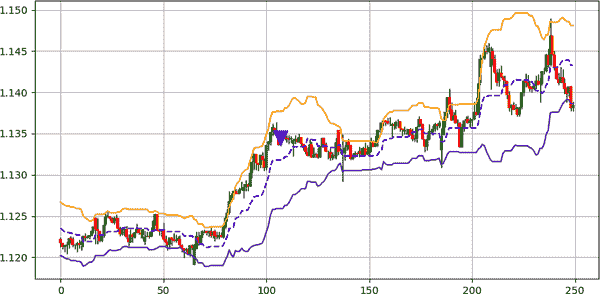

# 第十章\. 基于蜡烛图的趋势跟踪策略

模式识别只是方程式的一部分。当您发现一种模式时，您最有可能将其用于更广泛的交易框架中，因为仅依赖于蜡烛图形态的交易系统不太可能产生一致且稳定的正回报。

本章讨论了一些示例策略，您可以使用这些策略来使用特定技术规则来过滤趋势跟踪时的模式。每个市场都有其特点，必须具有优化的策略参数，这就是为什么我建议您专注于理解主要思想和概念，而不是记住本章中提出的策略的确切参数。

理想情况下，这些策略应该帮助您理解如何将不同的蜡烛图形态（经典和现代）与一些技术指标结合起来。本章还讨论了这些指标，以便您了解它们的机制和局限性。

###### 注意

*过滤* 是指选择那些可能提供正回报概率更高的信号的概念。

# 结合 Double Trouble 模式和 RSI

作为提醒，Double Trouble 模式是一种现代趋势跟踪蜡烛图形态，其特征包括波动性（使用 ATR 指标计算）。正如在本书中前面讨论的那样，RSI 是一种指标，重新解释市场动量为 0 到 100 之间的值，以更好地理解当前的动态。

尽管 RSI 是一种反向指标，我将向您展示如何在趋势跟踪框架内使用它的技术。

此策略使用 RSI 作为检测到的 Double Trouble 模式的过滤器。这意味着每当发现一种模式时，都会通过 RSI 过滤器来验证信号。

###### 注意

RSI 也可以作为动量计。因此，高于 50 的值表示看涨动量（上涨趋势），而低于 50 的值表示看跌动量（下跌趋势）。这是使用 RSI 作为趋势跟踪指标的一种方式。

策略的交易条件如下：

+   每当 14 周期 RSI 高于 50 时，出现看涨的 Double Trouble 模式时会生成一个长信号。

+   每当 14 周期 RSI 低于 50 时，出现看跌的 Double Trouble 模式时会生成一个短信号。

因此，过滤器是相对于 50 的 RSI 值。这是用来通过隐形手机制提高交易命中率的。^(1) 策略的基本直觉是在牛市中仅采取看涨信号，在熊市中仅采取看跌信号。

下面的代码片段展示了如何编写策略的信号函数：

```py
def signal(data, open_column, high_column, low_column, close_column, 
           atr_column, rsi_column, buy_column, sell_column):

    data = add_column(data, 5)    

    for i in range(len(data)):  

       try:

           `# Bullish setup`
           if data[i, close_column] > data[i, open_column] and \               data[i, close_column] > data[i - 1, close_column] and \               data[i - 1, close_column] > data[i - 1, open_column] and \               data[i, high_column] - data[i, low_column] > \               (2 * data[i - 1, atr_column]) and \               data[i, close_column] - data[i, open_column] > \               data[i - 1, close_column] - data[i - 1, open_column] and \               data[i, buy_column] == 0 and \               data[i, rsi_column] > 50:

                    data[i + 1, buy_column] = 1 

        `# Bearish setup`
           elif data[i, close_column] < data[i, open_column] and \               data[i, close_column] < data[i - 1, close_column] and \               data[i - 1, close_column] < data[i - 1, open_column] and \               data[i, high_column] - data[i, low_column] > \               (2 * data[i - 1, atr_column]) and \               data[i, open_column] - data[i, close_column] > \               data[i - 1, open_column] - data[i - 1, close_column] and \               data[i, sell_column] == 0 and \               data[i, rsi_column] < 50:

                    data[i + 1, sell_column] = -1 

       except IndexError:

            pass

    return data

```

注意到通过 RSI 代码行添加过滤器，说明其相对于中性水平 50 的值。图 10-1 显示了 USDCAD 的信号图表。

你始终可以调整策略，使其更适合你的配置和市场特征。然而，你应该记住，RSI 并非预测趋势的神奇工具，因为它是基于价格的，并且是滞后的（即，它不预测未来，只是讲述过去的故事）。此外，RSI 倾向于多次突破和重新整合 50 水平，这可能会产生错误的信号。


###### 图 10-1\. 使用双重麻烦图案和相对强弱指数（RSI）策略的信号图表

# 结合三根蜡烛图案和移动平均线

移动平均线是很好的趋势过滤器，有助于确定是否执行信号。记住，*移动平均线*是一种使用滚动窗口跟随市场价格的均值。这种策略结合了来自不同领域的两种趋势跟随元素^(2)，以便发出信号。

三根蜡烛图案是由连续的大体积同类蜡烛线组成的趋势跟随配置，确认了底层趋势。一般来说，看涨的三根蜡烛图案被称为三白兵，而看跌的版本被称为三黑鸦。

###### 注意

类似于使用 RSI 作为趋势跟随者，使用移动平均线在确定底层趋势方面非常有用。

当你看到市场价格高于其移动平均线（例如，100 周期移动平均线）时，通常表明牛市正在进行，而当你看到市场价格低于其移动平均线时，则通常表明熊市正在进行，从而指示了应该偏好哪种类型的信号。

该策略的交易条件如下：

+   每当市场价格高于其 100 周期移动平均线时，出现三白兵图案时生成长期信号。

+   每当市场价格低于其 100 周期移动平均线时，出现三黑鸦图案时生成短期信号。

###### 注意

趋势跟随策略使用蜡烛图形态和趋势过滤器的组合，增加了交易的信心。尽管历史回测显示，过滤器并不总是能提高命中率，但对于某些市场来说，这一比率显著提升。

以下代码片段显示了如何编写该策略的信号函数：

```py
def signal(data, open_column, close_column, ma_column, buy_column, 
           sell_column):

    data = add_column(data, 10)

    for i in range(len(data)):

       try:

        `# Bullish setup`
           if data[i, close_column] - data[i, open_column] > body and \               data[i - 1, close_column] - data[i - 1, open_column] > \               body and data[i - 2, close_column] - \ 
              data[i - 2, open_column] > body and data[i, close_column] \               > data[i - 1, close_column] and data[i - 1, close_column] \               > data[i - 2, close_column] and data[i - 2, close_column] \               > data[i - 3, close_column] and data[i, close_column] > \               data[i, ma_column] and data[i, buy_column] == 0:

                    data[i + 1, buy_column] = 1

           `# Bearish setup`
           elif data[i, open_column] - data[i, close_column] > body and \                 data[i - 1, open_column] - data[i - 1, close_column] > body \                 and data[i - 2, open_column] - data[i - 2, close_column] \                 > body and data[i, close_column] < \                 data[i - 1, close_column] and data[i - 1, close_column] \                 < data[i - 2, close_column] and data[i - 2, close_column] \                 < data[i - 3, close_column] and data[i, close_column] < \                 data[i, ma_column] and data[i, sell_column] == 0:

                    data[i + 1, sell_column] = -1

       except IndexError:

            pass

    return data

```

图 10-2 展示了一个使用 100 周期移动平均线（从左上角开始的弯曲线）作为过滤器的信号图表示例。注意，当市场价格高于其移动平均线时，你只会看到看涨信号，而当市场价格低于其移动平均线时，你只会看到看跌信号。


###### 图 10-2\. 使用三根蜡烛图案和移动平均线策略的信号图表

该策略最适合与其他趋势跟随策略一起使用。例如，一个基本交易者在 USDJPY 上有一个带息交易，并看到出现了三个白兵模式，同时市场位于其 100 期移动平均线之上。这种观察可以作为信念增强剂或确认以增加头寸。毕竟，交易是数字游戏，而将胜算累积到你这边则增加了获利的概率。

###### 注

*基本交易者*是依靠经济和金融分析而非技术分析做决策的交易者。

*带息交易*是一种通过买入利率较高的货币并卖出利率较低的货币来获利于利率差异的货币头寸。

# 结合瓶形图案与随机振荡器

与 RSI 类似，随机振荡器是一种动量指标，在技术交易中广泛使用，并被零售和专业社区广泛知晓。*随机振荡器*使用基本的归一化函数将值困在 0 到 100 之间。它比 RSI 更容易计算。在讨论振荡器之前，让我们看一下*归一化*的概念。

每当你有一个不同未界定值的数组，比如市场价格（或任何其他随机时间序列），你可以将这些值归一化到 0 到 1 之间，其中 0 是特定时间窗口的最低值，1 是特定时间窗口的最高值。看看这个表格：

| 时间步骤 | 1 | 2 | 3 | 4 | 5 |
| --- | --- | --- | --- | --- | --- |
| **数值** | 10 | 40 | 5 | 90 | 25 |
| 标准化值 | 0.06 | 0.41 | **0.00** | **1.00** | 0.24 |

表格显示，当变量从第 1 期到第 5 期移动时，归一化值显示它们可以在 0 到 1 之间，0 指的是特定时间窗口的最低值（5），1 指的是特定时间窗口的最高值（90）。同样，注意到大约在 0 到 1 之间的值具有归一化值 0.41，这意味着它可能是中间值。这是正常的，因为 40 大约是 5 和 90 之间距离的一半。

下面的公式展示了如何在特定时间窗口内将任何值归一化到 0 到 1 之间：

<math alttext="x Subscript Normalized Baseline equals StartFraction x Subscript Original Baseline minus x Subscript Low Baseline Over x Subscript High Baseline minus x Subscript Low Baseline EndFraction"><mrow><msub><mi>x</mi> <mtext>Normalized</mtext></msub> <mo>=</mo> <mfrac><mrow><msub><mi>x</mi> <mtext>Original</mtext></msub> <mo>-</mo><msub><mi>x</mi> <mtext>Low</mtext></msub></mrow> <mrow><msub><mi>x</mi> <mtext>High</mtext></msub> <mo>-</mo><msub><mi>x</mi> <mtext>Low</mtext></msub></mrow></mfrac></mrow></math>

让我们通过前面的表格来尝试一个例子。取值为 10，尝试使用公式进行归一化。你应该得到以下计算：

<math alttext="x Subscript Normalized Baseline equals StartFraction 10 minus 5 Over 90 minus 5 EndFraction equals 0.06"><mrow><msub><mi>x</mi> <mtext>Normalized</mtext></msub> <mo>=</mo> <mfrac><mrow><mn>10</mn><mo>-</mo><mn>5</mn></mrow> <mrow><mn>90</mn><mo>-</mo><mn>5</mn></mrow></mfrac> <mo>=</mo> <mn>0</mn> <mo lspace="0%" rspace="0%">.</mo> <mn>06</mn></mrow></math>

随机振荡器以修改的方式将市场价格归一化，通过在公式中结合高点和低点使其变为以下形式：

<math alttext="Stochastic value Subscript i Baseline equals StartFraction Close Subscript i Baseline minus Low Subscript i minus n colon i Baseline Over High Subscript i minus n colon i Baseline minus Low Subscript i minus n colon i Baseline EndFraction"><mrow><mtext>Stochastic</mtext> <msub><mtext>value</mtext> <mi>i</mi></msub> <mo>=</mo> <mfrac><mrow><msub><mtext>Close</mtext> <mi>i</mi></msub> <mo>-</mo><msub><mtext>Low</mtext> <mrow><mi>i</mi><mo>-</mo><mi>n</mi><mo>:</mo><mi>i</mi></mrow></msub></mrow> <mrow><msub><mtext>High</mtext> <mrow><mi>i</mi><mo>-</mo><mi>n</mi><mo>:</mo><mi>i</mi></mrow></msub> <mo>-</mo><msub><mtext>Low</mtext> <mrow><mi>i</mi><mo>-</mo><mi>n</mi><mo>:</mo><mi>i</mi></mrow></msub></mrow></mfrac></mrow></math>

公式意味着随机变量的当前值是当前收盘价减去设定的回看期内最低低价之间的差异，再除以相同回看期内最高高价与最低低价之间的差异。

###### 注

简单归一化函数与随机震荡器函数的区别在于后者增加了高价和低价。

随机震荡器可以被描述为前一个公式的平滑版本，并且通常与其值上计算的短期移动平均线一起绘制，称为*信号线*。要创建默认的随机震荡器，请按照以下步骤进行：

1.  使用 14 期滚动窗口归一化随机震荡器函数的值。

1.  用三期移动平均线平滑第一步骤的结果。这就是随机震荡器。

1.  计算信号线，这是在第二步骤的值上计算的另一个三期移动平均线。这就是信号线。

###### 注意

在随机震荡器上计算的第一个移动平均线称为*平滑*，而信号线称为*放缓*。

与 RSI 类似，随机震荡器限于 0 到 100 之间，超卖区在 20 以下，超买区在 80 以上。由于其公式，它比 RSI 更具波动性，并且倾向于更快地从一个极端移动到另一个极端。

随机震荡器有许多技术，但我们感兴趣的是它与信号线的交叉。这被称为*交叉技术*，在逆向策略中很有名。 (然而，我将其与趋势跟随蜡烛图形模式一起使用，因此将其转变为趋势跟随技术。)

###### 注意

由于归一化函数的性质，你必须小心随机震荡器有时会粘在极端值上，从而产生虚假信号。这种粘性效应表现为振荡器长时间停留在超卖和超买区域。

下面的代码片段展示了如何编写随机震荡器：

```py
def stochastic_oscillator(data, 
                             lookback, 
                             high, 
                             low, 
                             close, 
                             position, 
                             slowing = False, 
                             smoothing = False, 
                             slowing_period = 1, 
                             smoothing_period = 1):

    data = add_column(data, 1)

    for i in range(len(data)):

        try:

            data[i, position] = (data[i, close] - min(data[i - lookback \
                                + 1:i + 1, low])) / (max(data[i - lookback\
                                + 1:i + 1, high]) - min(data[i - lookback \
                                + 1:i + 1, low]))

        except ValueError:

            pass

    data[:, position] = data[:, position] * 100  

    if slowing == True and smoothing == False:

        data = ma(data, slowing_period, position, position + 1)

    if smoothing == True and slowing == False:

        data = ma(data, smoothing_period, position, position + 1)

    if smoothing == True and slowing == True:

        data = ma(data, slowing_period, position,   position + 1)

        data = ma(data, smoothing_period, position + 1, position + 2)        

    data = delete_row(data, lookback)

    return data

```

该策略的交易条件如下：

+   当随机震荡器高于其信号线时出现牛瓶形态时生成长信号。

+   当随机震荡器低于其信号线时出现熊瓶形态时生成短信号。

下面的代码片段展示了如何编写策略的信号函数：

```py
def signal(data, open_column, high_column, low_column, close_column, 
           stochastic_column, signal_column, buy_column, sell_column):

    data = add_column(data, 5)    

    for i in range(len(data)):  

       try:
  `# Bullish setup`
           if data[i, close_column] > data[i, open_column] and \               data[i, open_column] == data[i, low_column] and \               data[i - 1, close_column] > data[i - 1, open_column] and \               data[i, open_column] < data[i - 1, close_column] and \               data[i, stochastic_column] > data[i, signal_column] and \               data[i, buy_column] == 0:

                    data[i + 1, buy_column] = 1 

           `# Bearish setup`
           elif data[i, close_column] < data[i, open_column] and \                 data[i, open_column] == data[i, high_column] and \                 data[i - 1, close_column] < data[i - 1, open_column] and \                 data[i, open_column] > data[i - 1, close_column] and \                 data[i, stochastic_column] > data[i, signal_column] and \                 data[i, sell_column] == 0:

                    data[i + 1, sell_column] = -1 

       except IndexError:

            pass

    return data

```

图 10-3 显示了 USDCHF 的信号图表。


###### 图 10-3\. 使用瓶形态和随机震荡器的策略信号图表

# 结合丸坐模式与 K 的波动带

让我们从本书中涵盖的第一个蜡烛图案重新开始。丸坐模式可以被认为是最强大的蜡烛图案，因为它没有影线，意味着市场直接从一个点到另一个点而没有犹豫。

此策略使用一种称为*波动带*的概念，这是一种包围市场价格以提供动态支撑和阻力水平的框架技术。

###### 注意

有许多类型的波动率带。最著名的是布林带。不同类型的波动率带的可靠性取决于基础市场及其参数。

在掌握 K 的波动率带之前，您必须了解布林带的基础知识。由约翰·波林格（John Bollinger）开发，这些带子的性质更倾向于统计而非技术。

考虑以下列表：{11, 4, 5, 20}。给定这四个值，您如何描述这些元素？一般来说，描述列表中元素的最佳指标是均值。它也是下一个预期值的最佳估计（如果您按时间顺序添加新元素）。要计算列表的均值，请按照以下公式操作：

<math alttext="chi equals StartFraction 1 Over n EndFraction left-parenthesis sigma-summation Underscript i equals 1 Overscript n Endscripts x Subscript i Baseline right-parenthesis equals StartFraction x 1 plus x 2 plus period period period plus x Subscript n Baseline Over n EndFraction"><mrow><mi>χ</mi> <mo>=</mo> <mfrac><mn>1</mn> <mi>n</mi></mfrac> <mrow><mo>(</mo> <msubsup><mo>∑</mo> <mrow><mi>i</mi><mo>=</mo><mn>1</mn></mrow> <mi>n</mi></msubsup> <msub><mi>x</mi> <mi>i</mi></msub> <mo>)</mo></mrow> <mo>=</mo> <mfrac><mrow><msub><mi>x</mi> <mn>1</mn></msub> <mo>+</mo><msub><mi>x</mi> <mn>2</mn></msub> <mo>+</mo><mo lspace="0%" rspace="0%">.</mo><mo lspace="0%" rspace="0%">.</mo><mo lspace="0%" rspace="0%">.</mo><mo>+</mo><msub><mi>x</mi> <mi>n</mi></msub></mrow> <mi>n</mi></mfrac></mrow></math>

因此，根据公式，您必须将它们相加，并将结果除以它们的数量：

<math alttext="chi equals StartFraction 11 plus 4 plus 5 plus 20 Over 4 EndFraction equals 10"><mrow><mi>χ</mi> <mo>=</mo> <mfrac><mrow><mn>11</mn><mo>+</mo><mn>4</mn><mo>+</mo><mn>5</mn><mo>+</mo><mn>20</mn></mrow> <mn>4</mn></mfrac> <mo>=</mo> <mn>10</mn></mrow></math>

因此，列表的均值为 10。在前几章中，记住波动性的概念，您使用 ATR 来近似价格相对于过去时期的波动。带子使用另一种技术来计算波动性，即描述性统计中使用的标准差。

*标准差*是变量与组均值的平方偏差的平方根。这个概念可能听起来复杂，但让我们简化几个步骤：

+   计算每个变量（收盘价）在同一时间步长内与回溯期均值的距离。

+   对这些距离进行平方，以避免获得负值。

+   计算这些平方距离的均值。结果称为*方差*。

+   计算方差的平方根。结果称为*标准差*。

###### 注意

在最后一步中取平方根，使您能够将均值进行苹果与苹果的比较。

从数学角度来说，标准差的公式如下所示：

<math alttext="sigma equals StartRoot StartFraction 1 Over n EndFraction sigma-summation Underscript i equals 1 Overscript n Endscripts left-parenthesis x Subscript i Baseline minus chi right-parenthesis squared EndRoot"><mrow><mi>σ</mi> <mo>=</mo> <msqrt><mrow><mfrac><mn>1</mn> <mi>n</mi></mfrac> <msubsup><mo>∑</mo> <mrow><mi>i</mi><mo>=</mo><mn>1</mn></mrow> <mi>n</mi></msubsup> <msup><mrow><mo>(</mo><msub><mi>x</mi> <mi>i</mi></msub> <mo>-</mo><mi>χ</mi><mo>)</mo></mrow> <mn>2</mn></msup></mrow></msqrt></mrow></math>

现在您已经知道如何计算移动平均线，您可以简单地应用滚动标准差测量，这与移动平均线相同，只是您在计算滚动波动性。

+   上布林带是当前 20 周期移动平均值与当前标准差乘以 2 的和。

+   下布林带是当前 20 周期移动平均值与当前标准差乘以 2 的差。

###### 注意

常数（默认为 2）乘以标准偏差的值，然后将乘积加或减去当前移动平均值。

图 10-4 显示了应用在 USDCHF 上的布林带示例。一些交易者喜欢保持中线（即 20 周期移动平均线）。然而，对于布林带来说，该线并不像带子本身那样有价值。


###### 图 10-4\. 在 USDCHF 上应用布林带的示例

一般来说，当市场达到下布林带时，被认为是超卖的，预期将出现看涨反应。同样，当市场达到上布林带时，被认为是超买的，并且预期将出现看跌反应。

现在让我们看一下 K 的波动带，它受布林带的启发。它遵循以下条件：

+   计算最近 20 个周期内最高高点和最低低点的均值。

+   计算最近 20 个周期的最高标准偏差测量。

+   上波动带是第一步和第二步结果的总和乘以 2。

+   下波动带是第一步和第二步结果的差值乘以 2。

###### 注意

同样，常数（默认为 2）乘以标准偏差的最大值，然后将产品与最大高低点的均值当前值相加或相减。

下面的代码片段显示了编码 K 的波动带函数：

```py
`# Defining the standard deviation function`
def volatility(data, lookback, close, position):

    data = add_column(data, 1)

    for i in range(len(data)):

        try:

            data[i, position] = (data[i -lookback + 1:i + 1, close].std())

        except IndexError:

            pass

    data = delete_row(data, lookback)    

    return data

def k_volatility_band(data, lookback, multiplier, high, low, close, 
                      position):

    data = add_column(data, 6)

    `# Calculating the median line`
    for i in range(len(data)):

        try:

            data[i, position] = max(data[i - lookback + 1:i + 1, high]) 
            data[i, position + 1] = min(data[i - lookback + 1:i + 1, low]) 
            data[i, position + 2] = (data[i, position] + data[i, position \                                     + 1]) \/ 2

        except ValueError:

            pass

    data = delete_column(data, position, 2)

    `# Calculating maximum volatility`
    data = volatility(data, lookback, close, position + 1)

    for i in range(len(data)):

        try:

            data[i, position + 2] = max(data[i - lookback + 1:i + 1, \                                     position + 1]) 

        except ValueError:

            pass   

    data = delete_column(data, position + 1, 1)

  `# Calculating the bands`
    data[:, position + 2] = data[:, position] + (multiplier * data[:, \                             position + 1])    
    data[:, position + 3] = data[:, position] - (multiplier * data[:, \                             position + 1])

    data = delete_column(data, position + 1, 1)    

    return data

```

###### 注意

保持中线对于策略至关重要，因为它是主要的过滤器。因此，使用 K 的波动带时，中线出现在图表中。

请注意，词语*波动性*和*标准偏差*在本文中是可以互换使用的。图 10-5 展示了应用在 USDCHF 上的 K 的波动带的示例。


###### 图 10-5\. K 的波动带应用在 USDCHF 上的示例

现在让我们讨论一下策略。交易条件如下：

+   每当市场价格低于中线时出现看涨光头党图案时，将生成一个长信号。

+   每当市场价格高于中线时出现看跌光头党图案时，就会生成一个短信号。

下面的代码片段显示了如何编写策略的信号函数：

```py
def signal(data, open_column, high_column, low_column, close_column, 
           middle_band, buy_column, sell_column):

    data = add_column(data, 5)    

    for i in range(len(data)):  

       try:

           `# Bullish setup`
           if data[i, close_column] > data[i, open_column] and \               data[i, high_column] == data[i, close_column] and \               data[i, low_column] == data[i, open_column] and \               data[i, close_column] < data[i, middle_band] and \               data[i, buy_column] == 0:

                    data[i + 1, buy_column] = 1 
        `# Bearish setup`
           elif data[i, close_column] < data[i, open_column] and \                 data[i, high_column] == data[i, open_column] and \                 data[i, low_column] == data[i, close_column] and \                 data[i, close_column] > data[i, middle_band] and \                 data[i, sell_column] == 0:

                    data[i + 1, sell_column] = -1 

       except IndexError:

            pass

    return data
```

图 10-6 显示了 AUDNZD 上的信号图表。



###### 图 10-6\. 使用光头党图案和 K 的波动带策略的信号图表

可选地，您可以考虑以下更严格的条件（然而，信号会更少频繁）：

+   每当市场价格低于下波动率带时出现看涨光头党图案时，将生成一个长信号。

+   每当市场价格高于上波动带时出现看跌光头党图案时，将生成一个短信号。

总之，该策略可能会有更少的信号，但直观上它具有关于最强大蜡烛图（按振幅计算）和统计极端的坚实基础。

# 将 H 型模式与趋势强度指数结合起来

*趋势强度指数*（TII）衡量趋势的强度。它是通过围绕移动平均线和价格偏差的简单计算创建的，以显示趋势的强度。要构建该指标，请按以下步骤操作：

1.  在市场价格上计算 20 周期移动平均值。

1.  计算市场价格与移动平均线的偏差。这可以通过在两列上完成。如果收盘价高于其移动平均值，则第一列由两者之间的差异填充（上行变量），如果当前市场价格低于其移动平均值，则第二列由两者之间的差异填充（下行变量）。

1.  计算市场上移动平均线之上和之下的数值。

###### 注意

使用`numpy`函数`count_nonzero()`可以完成具有特定条件的数值计数。

+   按照以下公式找到 TII（默认为 20 期回顾）来应用：

<math alttext="upper T upper I upper I Subscript i Baseline equals left-parenthesis StartFraction Number of up Over Number of up plus Number of down EndFraction right-parenthesis x Baseline 100"><mrow><mi>T</mi> <mi>I</mi> <msub><mi>I</mi> <mi>i</mi></msub> <mo>=</mo> <mrow><mo>(</mo> <mfrac><mrow><mtext>Number</mtext><mtext>of</mtext><mtext>up</mtext></mrow> <mrow><mtext>Number</mtext><mtext>of</mtext><mtext>up</mtext><mo>+</mo><mtext>Number</mtext><mtext>of</mtext><mtext>down</mtext></mrow></mfrac> <mo>)</mo></mrow> <mi>x</mi> <mn>100</mn></mrow></math>

要在 Python 中编码 TII，请使用以下函数：

```py
def trend_intensity_indicator(data, lookback, close_column, position):

    data = add_column(data, 5)

    `# Calculating the moving average`
    data = ma(data, lookback, close_column, position)

    `# Deviations`
    for i in range(len(data)):

        if data[i, close_column] > data[i, position]:
           data[i, position + 1] = data[i, close_column] - \            data[i, position]

        if data[i, close_column] < data[i, position]:
           data[i, position + 2] = data[i, position] - \            data[i, close_column]

    `# Trend intensity index`
    for i in range(len(data)):

        data[i, position + 3] = np.count_nonzero(data[i - lookback + 1:i \                                 + 1, position + 1])

    for i in range(len(data)):

        data[i, position + 4] = np.count_nonzero(data[i - lookback + 1:i \                                 + 1, position + 2])

    for i in range(len(data)):

        data[i, position + 5] = ((data[i, position + 3]) / (data[i, \                                 position + 3] + data[i, position + 4])) \                                 * 100

    data = delete_column(data, position, 5)

    return data

```

通常情况下，当 TII 高于 50 时，正在进行强劲的看涨动能，而当 TII 低于 50 时，正在进行强劲的看跌动能。

策略的交易条件如下：

+   每当 20 期 TII 高于 50 时，出现看涨 H 型时产生长信号。

+   每当 20 期 TII 低于 50 时，出现看跌 H 型时产生短信号。

###### 注意

调整 TII 的回顾以找到合适的调整是可取的。H 型模式作为逆转失效模式（因此是趋势确认模式），可能与显示基础趋势强度的指标很好地配合。

下面的代码片段显示了如何编写策略的信号函数：

```py
def signal(data, open_column, high_column, low_column, close_column, 
           tii_column, buy_column, sell_column):

    data = add_column(data, 5)    

    data = rounding(data, 4) `# Put 0 instead of 4 as of pair 4`

    for i in range(len(data)):  

       try:

           `# Bullish setup`
           if data[i, close_column] > data[i, open_column] and \               data[i, close_column] > data[i - 1, close_column] and \               data[i, low_column] > data[i - 1, low_column] and \               data[i - 1, close_column] == data[i - 1, open_column] and \               data[i - 2, close_column] > data[i - 2, open_column] and \               data[i - 2, high_column] < data[i - 1, high_column] and \               data[i, tii_column] > 50:

                    data[i + 1, buy_column] = 1 

           `# Bearish setup`
           elif data[i, close_column] < data[i, open_column] and \                 data[i, close_column] < data[i - 1, close_column] and \                 data[i, low_column] < data[i - 1, low_column] and \                 data[i - 1, close_column] == data[i - 1, open_column] and \                 data[i - 2, close_column] < data[i - 2, open_column] and \                 data[i - 2, low_column] > data[i - 1, low_column] and \                 data[i, tii_column] < 50:

                    data[i + 1, sell_column] = -1 

       except IndexError:

            pass

    return data

```

图 10-7 显示了 EURGBP 的信号图表。


###### 图 10-7\. 使用 H 型和趋势强度指数策略的信号图表

图表显示，有一个信号与看涨条件重合。

总结本章时，重要的是将正确的模式与正确的指标结合起来，这通过反向测试完成。当然，所提供的组合只是例子，可以通过将其他指标与其他模式融合来创建更强大的组合是非常有趣的。此外，你可以将多种模式包含在你的策略中，而不仅仅是将一个模式与一个指标结合。

^(1) *看不见的手机制*涉及与趋势同步使用交易，例如，在看涨趋势中仅接受买入信号，而忽略任何卖出信号。

^(2) 三蜡烛模式源自于模式识别领域，而移动平均则来自于统计学和趋势跟随技术指标领域。
