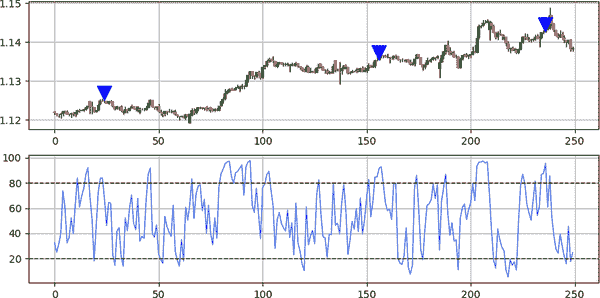
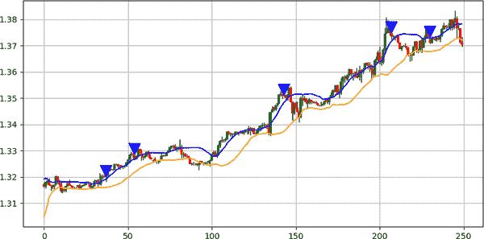
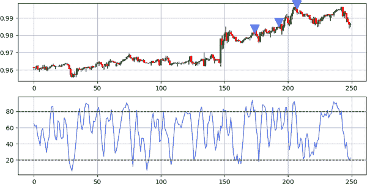
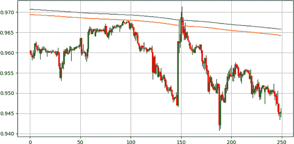
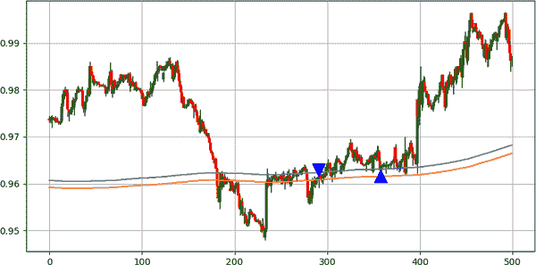
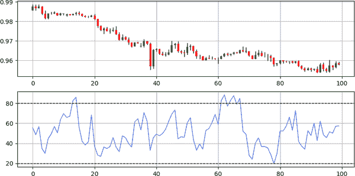
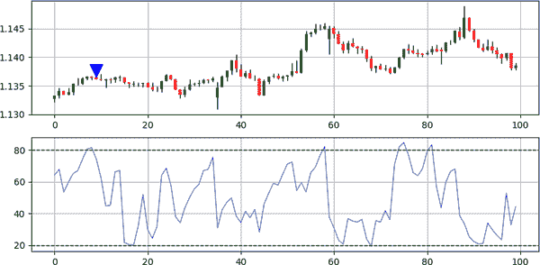

# 第十一章\. 基于蜡烛图的逆向策略

本章涵盖了蜡烛图案策略的逆向部分。 请记住，单独的蜡烛图案不太可能提供稳定的回报，因为它们必须与更复杂的技术和指标相结合，以将简单的想法和观察转化为可行的交易设置。

您应该认识到本章中使用的一些指标，因为它们已经表明它们在趋势跟踪中是有用的。 值得注意的是，RSI 不仅可以提供当前市场状态（有助于确定趋势），还可以提供可能指向逆转的极端水平（有助于确定逆向交易）。 换句话说，取决于您如何使用它，RSI 可以是趋势跟踪或逆向指标。

确保专注于将模式与指标相结合的直觉，以便您可以创建自己的策略组合。 毕竟，第十章和第十一章的重点是帮助您设计自己的策略。

# 将十字星图案与 RSI 相结合

此策略可能是最熟悉的将蜡烛图案和技术指标相结合的策略之一。 十字星是最简单的逆向配置，RSI 是最常用和研究的指标，两者都可以很好地确认预期的逆向移动。

###### 注意

RSI 过滤器使得可以将十字星图案转换为一个蜡烛图案，而不是三个。 这是因为十字星图案中的第一个和第三个蜡烛只用于区分牛市十字星图案和熊市十字星图案。 因此，十字星只是一个加号形状的蜡烛。

该策略使用了一种激进的技术，等待 RSI 的读数低于超卖水平或高于超买水平。 超卖和超买水平是可变的，并取决于基础市场和 RSI 的回顾。

通常，使用 14 周期 RSI（默认版本）的交易者倾向于将 30 作为超卖水平，将 70 作为超买水平。 该策略使用 3 周期 RSI，将 20 作为超卖水平，将 80 作为超买水平。 这旨在增加信号的频率，因为这样更有可能在 RSI 上同时出现一个十字星图案和一个信号。

交易条件如下：

+   每当 3 周期 RSI 低于 20 时出现牛市十字星图案时，都会生成一个做多信号。

+   每当 3 周期 RSI 高于 80 时出现熊市十字星图案时，都会生成一个做空信号。

下面的代码片段显示了如何编写策略的信号函数：

```py
lower_barrier = 20
upper_barrier = 80

def signal(data, open_column, close_column, indicator_column, 
           buy_column, sell_column):

    data = add_column(data, 5)    

    data = rounding(data, 0)  

    for i in range(len(data)):  

       try:

        `# Bullish setup`
           if data[i, close_column] == data[i, open_column] and \               data[i, indicator_column] < lower_barrier:

                    data[i + 1, buy_column] = 1 

           `# Bearish setup`
           elif data[i, close_column] == data[i, open_column] and \                 data[i, indicator_column] > upper_barrier:

                    data[i + 1, sell_column] = -1 

       except IndexError:

            pass

    return data

```

图 11-1 显示了 AUDNZD 上的信号图，展示了该策略的运作情况。正如您在前几章中了解到的那样，逆势技术在平稳（横盘）市场中效果更好，因为供求之间存在暗示的平衡，任何一方的过度都有可能恢复正常。逆势工具通过这种过度来衡量。



###### 图 11-1\. 使用十字星模式和 RSI 计算策略的信号图

总结一下，十字星模式非常灵活，因其简单而容易与技术指标集成。该策略易于理解，并存在许多其他变体，调整以提高其频率和盈利能力。

# 将吞噬模式与布林带结合

第十章提到，布林带是一种随市场价格移动的包络线技术，利用统计方法提供动态支撑和阻力水平。此策略将吞噬模式与市场价格相对于下布林带或上布林带的位置结合起来。

策略的交易条件如下：

+   每当市场价格低于下布林带时出现多头吞噬模式时，会生成一个长信号。

+   每当市场价格高于上布林带时出现空头吞噬模式时，会生成一个短信号。

###### 注意

市场价格低于其下布林带意味着统计上超卖事件，并暗示看涨反应，而市场价格高于其上布林带则意味着统计上超买事件，并暗示看跌反应。

以下代码片段显示了如何编写策略的信号函数：

```py
def signal(data, open_column, close_column, upper_band_column, 
           lower_band_column, buy_column, sell_column):

    data = add_column(data, 5)    

    for i in range(len(data)):  

       try:

           `# Bullish setup`
           if data[i, close_column] > data[i, open_column] and \               data[i, open_column] < data[i - 1, close_column] and \               data[i, close_column] > data[i - 1, open_column] and \               data[i - 1, close_column] < data[i - 1, open_column] and \               data[i - 2, close_column] < data[i - 2, open_column] and \               data[i, close_column] < data[i, lower_band_column]:

                    data[i + 1, buy_column] = 1 

          `# Bearish setup`
           elif data[i, close_column] < data[i, open_column] and \                 data[i, open_column] > data[i - 1, close_column] and \                 data[i, close_column] < data[i - 1, open_column] and \                 data[i - 1, close_column] > data[i - 1, open_column] and \                 data[i - 2, close_column] > data[i - 2, open_column] and \                 data[i, close_column] > data[i, upper_band_column]:

                    data[i + 1, sell_column] = -1 

       except IndexError:

            pass

    return data

```

一般来说，布林带使用 20 期的回溯期和 2 的标准差。但让我们再次回顾一下，确保你彻底理解这个伟大的指标设计的含义：

+   20 期回溯期是指在市场价格（收盘价）上计算的 20 期移动平均值。类似地，市场价格（收盘价）上计算了 20 期移动标准差测量。

+   标准差为 2 意味着在加到移动平均值或减去之前，滚动标准差测量将乘以两倍。

以下代码片段显示了计算布林带的函数：

```py
def bollinger_bands(data, lookback, standard_deviation, close, position):

    data = add_column(data, 2)
  `# Calculating the moving average`
    data = ma(data, lookback, close, position)

    `# Calculating the standard deviation`
    data = volatility(data, lookback, close, position + 1)

    data[:, position + 2] = data[:, position] + (standard_deviation * 
                            data[:, position + 1])
    data[:, position + 3] = data[:, position] - (standard_deviation * 
                            data[:, position + 1])

    data = delete_row(data, lookback)

    data = delete_column(data, position + 1, 1)

    return data

```

###### 注意

*波动性* 和 *标准差* 这两个词可以互换使用。

策略使用标准差为 1 的 20 期布林带。这是为了增加信号的频率，就像你在前一个策略中看到的那样。图 11-2 显示了 USDCAD 的信号图，你可以看到该策略的实施情况。

注意带更接近市场价格，并经常被突破或超越。从统计学角度来看，如果我们假设金融时间序列遵循正态分布，那么 68%的市场价格应该包含在移动平均线的一个标准偏差内（由上下带表示）。

吞没模式本身不是一个丰富的模式，因此通过添加额外的过滤器（布林带），频率进一步降低，这就是为什么调整参数很重要的原因。



###### 图 11-2\. 使用吞没模式和布林带的策略信号图表

# 将刺穿模式与随机振荡器结合使用

该策略将经典的蜡烛图逆势配置刺穿模式与技术指标随机振荡器结合，后者在第十章讨论过。

###### 注意

请记住，随机振荡器使用归一化函数创建一个在 0 到 100 之间的滚动计算，同时考虑高低价格。它的解释和使用方式类似于 RSI。

策略的交易条件如下：

+   在 14 周期随机振荡器低于 20 时出现看涨的刺穿模式时会生成一个长信号。

+   在 14 周期随机振荡器高于 80 时出现看跌的刺穿模式时会生成一个短信号。

以下代码片段显示了如何编写策略的信号函数：

```py
lower_barrier = 20
upper_barrier = 80

def signal(data, open_column, close_column, indicator_column, 
           buy_column, sell_column):

    data = add_column(data, 5)    

    for i in range(len(data)):  

       try:

           `# Bullish setup`
           if data[i, close_column] > data[i, open_column] and \               data[i, close_column] < data[i - 1, open_column] and \               data[i, close_column] > data[i - 1, close_column] and \               data[i, open_column] < data[i - 1, close_column] and \               data[i - 1, close_column] < data[i - 1, open_column] and \               data[i - 2, close_column] < data[i - 2, open_column] and \               data[i, indicator_column] < lower_barrier:

                    data[i + 1, buy_column] = 1 

           `# Bearish setup`
           elif data[i, close_column] < data[i, open_column] and \                 data[i, close_column] > data[i - 1, open_column] and \                 data[i, close_column] < data[i - 1, close_column] and \                 data[i, open_column] > data[i - 1, close_column] and \                 data[i - 1, close_column] > data[i - 1, open_column] and \                 data[i - 2, close_column] > data[i - 2, open_column] and \                 data[i, indicator_column] > upper_barrier:

                    data[i + 1, sell_column] = -1 

       except IndexError:

            pass

    return data

```

图 11-3 显示了 USDCHF 的信号图表，上升箭头代表看涨信号，下降箭头代表看跌信号。

总之，将刺穿模式与随机振荡器结合使用为预期的反转提供了额外的确认因素。随机振荡器可以根据需要进行调整，以校准策略到所需的频率和盈利能力。当然，没有一种策略适用于所有资产，但这就是我们称之为金融市场的半随机环境的本质。



###### 图 11-3\. 使用刺穿模式和随机振荡器的策略信号图表

# 将亢奋模式与 K 的信封结合使用

*K 的信封*是一对简单的 800 周期移动平均线，其中一个应用于价格的高点，另一个应用于价格的低点，从而形成一个区域。因此，它是一个随市场价格变动的动态支撑和阻力区域。K 的信封的一个重要特征是稳定性，这是由于回顾期显著高，因此相对于短期波动或噪音相对免疫。

该指标非常简单，用于确定当前市场趋势（看涨或看跌），或者在市场进入区域时寻找需求和供给区。以下代码块显示了 K 线信封的功能：

```py
def k_envelopes(data, lookback, high, low, position):

    `# Calculating the upper moving average`
    data = ma(data, lookback, high, position)

    `# Calculating the lower moving average`
    data = ma(data, lookback, low, position + 1)    

    return data
```

图 11-4 显示了应用了 K 线信封的 USDCHF 图表。注意信封如何提供动态的支撑和阻力区域。



###### 图 11-4\. USDCHF 与 K 线信封

现在的想法是将 K 线信封与蜡烛图案结合起来。策略的交易条件如下：

+   每当市场价格在 K 线信封内时出现看涨的 Euphoria 模式时，就会生成一个长信号。

+   每当市场价格在 K 线信封内出现看跌的 Euphoria 模式时，就会生成一个短信号。

###### 注

通过在 K 线信封内，市场价格因此正在期待一个由 Euphoria 模式确定的方向上的反应。换句话说，触发和方向由 Euphoria 模式给出，而确认则由 K 线信封给出。

以下代码片段显示了如何编写策略的信号函数：

```py
def signal(data, open_column, close_column, upper_k_envelope, 
           lower_k_envelope, buy_column, sell_column):

    data = add_column(data, 5)  

    data = rounding(data, 4) # Put 0 instead of 4 as of pair 4

    for i in range(len(data)):  

       try:
      `# Bullish setup`
           if data[i, open_column] > data[i, close_column] and \               data[i - 1, open_column] > data[i - 1, close_column] and \               data[i - 2, open_column] > data[i - 2, close_column] and \               data[i, close_column] < data[i - 1, close_column] and \               data[i - 1, close_column] < data[i - 2, close_column] and \               (data[i, open_column] - data[i, close_column]) > (data[i - 1,
              open_column] - data[i - 1, close_column]) and \               (data[i - 1, open_column] - data[i - 1, close_column]) > 
              (data[i - 2, open_column] - data[i - 2, close_column]) and \               data[i, close_column] > data[i, lower_k_envelope] and \               data[i, close_column] < data[i, upper_k_envelope]: 

                    data[i + 1, buy_column] = 1 

        `# Bearish setup`
           elif data[i, open_column] < data[i, close_column] and \                 data[i - 1, open_column] < data[i - 1, close_column] and \                 data[i - 2, open_column] < data[i - 2, close_column] and \                 data[i, close_column] > data[i - 1, close_column] and \                 data[i - 1, close_column] > data[i - 2, close_column] and \                 (data[i, open_column] - data[i, close_column]) > (data[i \                 - 1, open_column] - data[i - 1, close_column]) and \                 (data[i - 1, open_column] - data[i - 1, close_column]) > \                 (data[i - 2, open_column] - data[i - 2, close_column]) and \                 data[i, close_column] > data[i, lower_k_envelope] and \                 data[i, close_column] < data[i, upper_k_envelope]: 

                    data[i + 1, sell_column] = -1 

       except IndexError:

            pass

    return data

```

图 11-5 显示了一个信号图表，其中 K 线信封在图表上可见。信号的生成是由于在信封内出现 Euphoria 模式。

这种策略借鉴了图表分析领域（支撑和阻力水平），并应用了 Euphoria 现代蜡烛图案来确认需求区或供给区。



###### 图 11-5\. 使用 K 线信封和 Euphoria 模式的策略信号图表

# 将障碍模式与 RSI-ATR 结合起来

RSI-ATR 到底是什么？嗯，你已经知道 RSI 是一个动量指标，ATR 是一个波动性指标。你也看过如何编写它们并相应地使用它们。然而，将它们融合成一个指标是你尚未见过的事情。RSI-ATR 是由 RSI 的方向元素和 ATR 的膨胀/缩小特性组成的结构化指标。它的使用方式与 RSI 相同。

###### 注

*结构化指标* 是由两个或更多指标组成的技术指标。结构化指标的例子包括 RSI-ATR 和随机 RSI（其中包含随机振荡器和 RSI 作为基本组件）。

要计算 RSI-ATR（默认情况下，回溯期为 14），请按照以下步骤进行：

1.  在市场价格上计算一个 RSI。

1.  使用你已知的公式在市场价格上计算 ATR。

1.  将第一步的 RSI 除以第二步的 ATR。

1.  在上一步结果的基础上计算一个 RSI。

因此，RSI-ATR 是在 RSI（应用于市场价格）和 ATR 之间比率上计算的 RSI。这就是它是一个以波动性加权的指标的原因。以下代码片段显示了如何在 Python 中创建该指标：

```py
def rsi_atr(data, lookback_rsi, lookback_atr, lookback_rsi_atr, high, 
            low, close, position):

    data = rsi(data, lookback_rsi, close, position)

    data = atr(data, lookback_atr, high, low, close, position + 1)

    data = add_column(data, 1)

    data[:, position + 2] = data[:, position] / data[:, position + 1]

    data = rsi(data, lookback_rsi_atr, position + 2, position + 3)

    data = delete_column(data, position, 3)

    return data

```

图 11-6 展示了应用于 USDCHF 的 5 周期 RSI-ATR。



###### 图 11-6\. USDCHF 的 14 周期 RSI-ATR

###### 注意

您一定注意到，处理 RSI-ATR 时有三个参数，而处理 RSI 时只有一个参数。RSI-ATR 的第一个参数是 RSI 的回溯期，第二个参数是 ATR 的回溯期，第三个参数是最终 RSI 的回溯期。

RSI-ATR 具有比原始 RSI 更高的波动性和变化率，因此对市场波动更为敏感。另一方面，您使用它的方式与使用 RSI 的方式相同。

请记住，Barrier 模式是一种现代配置（见第 7 章），仅仅是支撑和阻力水平概念的体现。

策略的交易条件如下：

+   每当 5 周期 RSI-ATR 低于 20 时，出现牛市 Barrier 模式时会生成长信号。

+   每当 5 周期 RSI-ATR 高于 80 时，出现熊市 Barrier 模式时会生成短信号。

以下代码片段展示了如何编写策略的信号函数：

```py
def signal(data, open_column, close_column, indicator_column, 
           buy_column, sell_column):

    data = add_column(data, 5)    

    for i in range(len(data)):  

       try:

           `# Bullish setup`
           if data[i, close_column] > data[i, open_column] and \               data[i, close_column] < data[i - 1, open_column] and \               data[i, close_column] > data[i - 1, close_column] and \               data[i, open_column] < data[i - 1, close_column] and \               data[i - 1, close_column] < data[i - 1, open_column] and \               data[i - 2, close_column] < data[i - 2, open_column] and \               data[i, indicator_column] < lower_barrier:

                    data[i + 1, buy_column] = 1 

  `# Bearish setup`
           elif data[i, close_column] < data[i, open_column] and \                 data[i, close_column] > data[i - 1, open_column] and \                 data[i, close_column] < data[i - 1, close_column] and \                 data[i, open_column] > data[i - 1, close_column] and \                 data[i - 1, close_column] > data[i - 1, open_column] and \                 data[i - 2, close_column] > data[i - 2, open_column]  and \                 data[i, indicator_column] > upper_barrier:

                    data[i + 1, sell_column] = -1 

       except IndexError:

            pass

    return data

```

图 11-7 展示了 AUDNZD 的信号图表。



###### 图 11-7\. 使用 RSI-ATR 和 Barrier 模式的策略信号图表

总之，RSI-ATR 是一个有趣的指标，提供了基于 RSI 的波动加权信息。将该指标与基于支撑和阻力水平概念的蜡烛图形态结合起来，可能会产生强大的交易配置。
