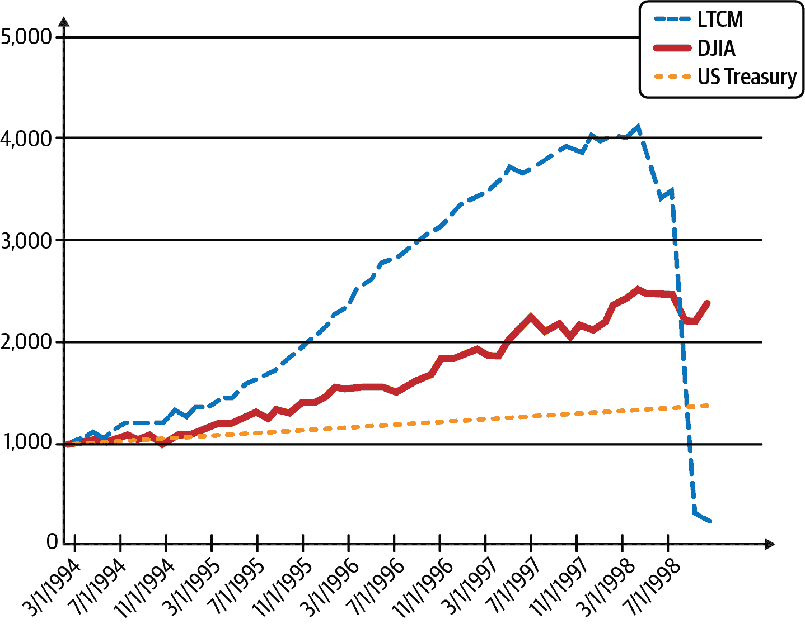
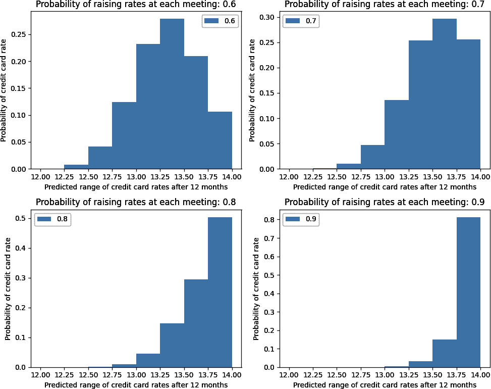
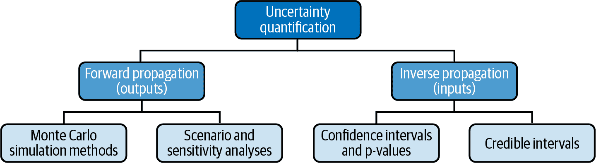
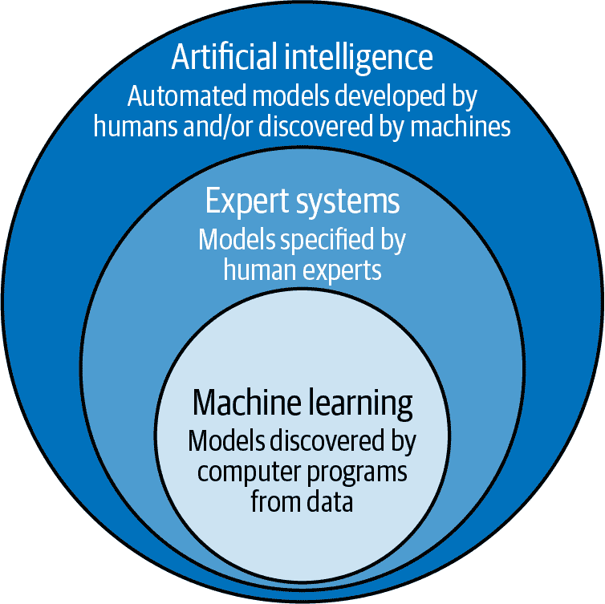
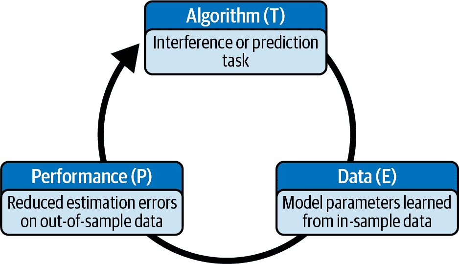
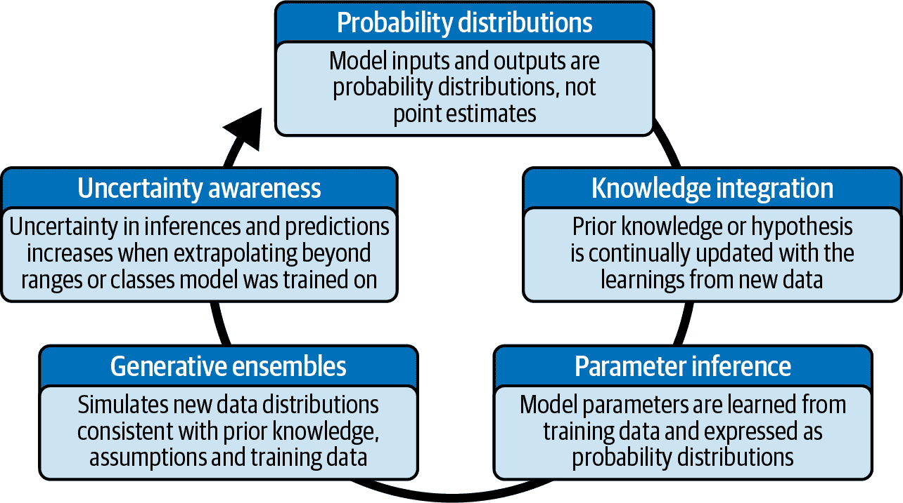

# 第一章：概率机器学习的需求

> 本质上，所有模型都是错误的，但有些是有用的。然而，必须始终牢记模型的近似性质。
> 
> ——乔治·博克斯，杰出的统计学家

地图可以让你从一个地理位置到另一个地方。这是一个非常有用的用于导航物理世界的数学模型。如果将其自动化成一个使用人工智能（AI）技术的 GPS 系统，它将变得更加有用。然而，无论是数学模型还是 AI 驱动的 GPS 系统，都永远无法捕捉到它所代表的地形的人类体验和丰富性。这是因为所有模型都必须简化现实世界的复杂性，从而使我们能够专注于我们感兴趣的某些现象特征。

乔治·博克斯，一位杰出的统计学家，曾经著名地说过，“所有模型都是错误的，但有些是有用的。” 这个深刻的机智的说法成为了我们的座右铭。我们承认所有模型都是错误的，因为它们是对现实的不完全和不足的表达。我们的目标是建立基于模型和支持技术的金融系统，这些系统能够在面对不确定性、信息不完整和不精确测量时进行有用的推断和预测，用于决策和风险管理。

所有金融模型，无论是理论上推导的还是人类和机器经验性发现的，都不仅仅是错误的，而且还受到三种类型错误的影响。在本章中，我们通过消费信贷的例子来解释这三重错误，并使用 Python 代码进行探讨。这体现了我们的观点，即金融模型的不准确性是其特征，而非错误。毕竟，我们处理的是人，而非粒子或钟摆。

金融并非像物理学那样精确的自然科学，处理精确的估计和预测，如学术界所宣称的那样。它是一门不精确的社会研究，涉及一系列不断变化、通常突然的具有不同可能性的价值观。

我们通过解释为什么人工智能总体上以及概率机器学习（ML）特别是为金融和投资领域开发下一代系统提供了最有用和最有前途的理论框架和技术来结束本章。

# 金融并非物理学

亚当·斯密，被普遍认为是现代经济学奠基人，对牛顿的力学和万有引力定律赞叹不已。¹ 自那以后，经济学家们一直努力将他们的学科变成像物理学那样的数学科学。他们渴望建立能够准确解释和预测人类在微观和宏观层面经济活动的理论。这种愿望在 20 世纪初与欧文·费舍等经济学家的努力开始，并在 20 世纪末的经济物理学运动中达到了高潮。

尽管现代金融学的复杂数学理论层出不穷，但它的理论几乎是令人沮丧和可悲的，特别是与物理学相比。例如，物理学能够以令人瞠目结舌的精确度预测月球的运动和您计算机中的电子。这些预测可以由全球任何一个物理学家随时计算。相比之下，市场参与者——交易员、投资者、分析师、金融高管——难以解释日常市场波动的原因，或者预测世界各地任何时间资产的价格。

或许金融比物理学更为艰难。与粒子和钟摆不同，人类是复杂的、情感化的、创造性的生物，拥有自由意志和潜在的认知偏见。他们倾向于不一致地行事，并以不可预测的方式不断对他人的行为作出反应。此外，市场参与者通过击败或操纵其操作系统来获利。

在南海公司投资亏损惨重后，牛顿曾说：“我可以计算星星的运动，但无法预测人类的疯狂。”⁴ 值得注意的是，牛顿并非投资新手。他在英国造币厅任职近 31 年，帮助将英镑与金本位挂钩，这种标准一直保持了两个多世纪。

# 所有的金融模型都是错误的，大多数是无用的

一些学者甚至认为，理论上的金融模型不仅是错误的，而且是危险的。对经济模型的物理科学表象的盲目信仰使其信奉者对其预测能力的准确性产生了虚假的确定感。⁵ 这种盲目信念已经导致了对他们和整个社会的许多灾难性后果。⁶ 论坛中讨论的 LTCM 的壮观灾难充分体现了学术傲慢和对分析金融模型的盲目信任所带来的危险后果。



###### 图 1-1\. 长期资本管理公司（LTCM）的史诗般灾难⁷

文艺复兴技术公司（Renaissance Technologies），这家有史以来最成功的对冲基金，采用与对冲基金如 LTCM 截然不同的策略，将其对金融理论的批判观点付诸实践。该公司不青睐金融或华尔街背景的人才，而更愿意招聘物理学家、数学家、统计学家和计算机科学家。它运用基于信息论、数据科学和机器学习等非金融理论的定量模型进行交易。

# 建模误差的三重要素

无论金融模型是基于学术理论还是经验数据挖掘策略，它们都面临模型错误的三重困扰。分析和预测中的错误可能源于以下任何建模问题：使用不合适的功能形式、输入不准确的参数或未能适应市场结构变化。⁸

## 模型规范错误

几乎所有的金融理论在其模型中使用了高斯或正态分布。例如，正态分布是马科维茨现代投资组合理论和布莱克-斯科尔斯-默顿期权定价理论的基础。⁹ 然而，学术研究中有大量文献记载，股票、债券、货币和大宗商品的收益分布具有明显的厚尾特性，显然不服从高斯分布。¹⁰ 换句话说，极端事件的发生频率远高于正态分布的预测。在第三章和第四章中，我们将实际上利用 Python 进行金融数据分析，以展示权益收益分布的非高斯结构。

如果资产价格回报符合正态分布，那么在宇宙的年龄内将不会发生以下任何金融灾难：黑色星期一、墨西哥比索危机、亚洲货币危机、LTCM 的破产或者闪崩。个别股票的“小型闪崩”甚至比这些宏观事件发生得更频繁。

然而，金融教科书、专业程序和专业人士继续在其资产估值和风险模型中使用正态分布，因为其简单性和分析可追溯性。然而，考虑到今天的先进算法和计算资源，这些理由已不再具备说服力。对于放弃正态分布的不愿意，这是“醉汉的寻找”明确的例子：一个源自笑话的原则，讲述了一个醉鬼在公园的黑暗中丢失了钥匙，但在路灯下拼命寻找，因为那里有光亮。

## 模型参数估计误差

此类错误可能是因为市场参与者可以获得不同级别和速度的信息传递。他们在处理能力和认知偏差方面也有不同水平的精通。此外，这些参数通常是通过过去的数据估计的，这些数据可能不准确地反映当前的市场情况。这些因素导致对模型参数的深刻认识上的不确定性。

让我们考虑一个利率的具体例子。对于任何金融资产的估值至关重要的是利率，它们用来贴现资产未来的不确定现金流，估计其在当前的价值。在消费者层面上，例如，信用卡的利率是根据一个称为基准利率的基准利率浮动的。这个利率通常与联邦基金利率同步变化，这是对美国和世界经济至关重要的利率。

让我们设想，您想要估计一年后您信用卡的利率。假设当前的基准利率是 2%，而您的信用卡公司向您收取 10%加上基准利率。鉴于当前经济的强势，您相信联邦储备系统更有可能上调利率而非不动。根据我们目前的信息，我们知道在接下来的 12 个月内，联邦储备系统将会开会八次，每次要么上调 0.25%，要么保持不变。

在以下 Python 代码示例中，我们使用二项分布来模拟您信用卡在 12 个月期末的利率。具体来说，我们将使用以下参数来估计联邦基金利率在每次会议上升 0.25%的概率范围：`fed_meetings` = 8（试验或会议次数）；`probability_raises` = [0.6, 0.7, 0.8, 0.9]。

```py
# Import binomial distribution from sciPy library
from scipy.stats import binom
# Import matplotlib library for drawing graphs
import matplotlib.pyplot as plt

# Total number of meetings of the Federal Open Market Committee (FOMC) in any 
# year
fed_meetings = 8
# Range of total interest rate increases at the end of the year
total_increases = list(range(0, fed_meetings + 1))
# Probability that the FOMC will raise rates at any given meeting
probability_raises = [0.6, 0.7, 0.8, 0.9]

fig, axs = plt.subplots(2, 2, figsize=(10, 8))

for i, ax in enumerate(axs.flatten()):
    # Use the probability mass function to calculate probabilities of total 
    # raises in eight meetings
    # Based on FOMC bias for raising rates at each meeting
    prob_dist = binom.pmf(k=total_increases, n=fed_meetings, 
    p=probability_raises[i])
    # How each 25 basis point increase in the federal funds rate affects your 
    # credit card interest rate
    cc_rate = [j * 0.25 + 12 for j in total_increases]

    # Plot the results for different FOMC probability
    ax.hist(cc_rate, weights=prob_dist, bins=fed_meetings, alpha=0.5, 
    label=probability_raises[i])
    ax.legend()
    ax.set_ylabel('Probability of credit card rate')
    ax.set_xlabel('Predicted range of credit card rates after 12 months')
    ax.set_title(f'Probability of raising rates at each meeting: 
    {probability_raises[i]}')

# Adjust spacing between subplots
plt.tight_layout()

# Show the plot
plt.show()
```

在 Figure 1-2 中，注意到您信用卡利率在 12 个月内的概率分布如何严重依赖于您对联邦在八次会议中每次上升利率概率的估计。您可以看到，如果您估计每次会议上升利率增加 0.1，那么您信用卡 12 个月后的预期利率将增加约 0.2%。



###### 图 1-2\. 信用卡利率的概率分布取决于您的参数估计

即使所有市场参与者在其模型中使用二项分布，他们对未来的主要利率可能存在分歧，因为他们对联邦每次会议上升息率的估计不同。确实，这个参数很难估计。许多机构都有专门的分析师，包括前联邦储备系统的雇员，分析联邦的每篇文件、演讲和事件，试图估计这个参数。这是因为联邦基金利率直接影响所有金融资产的价格，间接影响实体经济中的就业和通胀率。

回想一下，在我们的模型中假设这个参数`probability_raises`对于接下来八次联邦公开市场委员会（FOMC）会议是恒定的。这有多现实？FOMC 成员不只是一组偏见硬币。他们可以根据经济随时间变化而调整其个人偏好。假设参数`probabil⁠ity_​raises`在接下来 12 个月内保持恒定不仅不现实，而且也是有风险的。

## 由于模型未能适应结构性变化而导致的错误

底层数据生成的随机过程可能会随时间变化——即过程不是平稳遍历的。这意味着从特定时刻获取的样本金融数据或者在足够长的时间段内取样的数据计算出的分布统计矩，如均值和方差，不能准确预测未来基础分布的统计矩。平稳性和遍历性的概念在金融中非常重要，将在本书的后续部分详细解释。

我们生活在一个动态的资本主义经济中，其特点是技术创新和不断变化的货币与财政政策。资产价值和风险的时变分布是规则，而不是例外。对于这种分布，基于历史数据的参数值必然会在预测中引入误差。

在我们之前的例子中，如果经济显示出放缓的迹象，美联储可能会决定在其第四次会议上采取更中立的立场，从而使你将`probability_raises`参数从 70%调整为 50%。这一参数的变化将进一步改变你对信用卡利率预测的影响。

有时，时变分布及其参数会连续或突然地改变，比如墨西哥比索危机。对于这两种情况下的变化，所使用的模型都需要适应不断变化的市场条件。在新的市场环境中，可能需要一种新的函数形式和不同的参数来解释和预测资产价值和风险。

假设在我们的例子中第五次会议后，美国经济受到外部冲击——比如希腊的新兴民粹主义政府决定违约。现在，美联储可能更有可能降息而不是加息。考虑到美联储展望的这一结构性变化，我们将不得不将模型中的二项概率分布改变为具有适当参数的三项概率分布。

# 概率金融模型

金融模型的不准确性是特征，而不是错误。 将金融估计表示为科学精确值是不诚实且愚蠢地冒险。 所有模型都应量化金融推断和预测中固有的不确定性，以便在商业世界中进行明智的决策和风险管理。 金融数据存在噪声和测量误差。 模型的适当功能形式可能是未知的或是一个近似值。 模型参数和输出可能具有一系列值，并附带着合理性。 换句话说，我们需要数学上合理的概率模型，因为它们可以容纳不准确性，并以逻辑一致的方式量化不确定性。

当前有两种模型不确定性的量化方式：输出不确定性的前向传播和输入不确定性的反向传播。 图 1-3 显示了今天在金融中用于量化这两种不确定性的常见类型的概率模型。



###### 图 1-3. 用概率模型量化输入和输出不确定性

在前向不确定性传播中，由模型的不准确参数和输入引起的不确定性在整个模型中传播，以生成模型输出的不确定性。 大多数金融分析师使用情景和敏感性分析来量化其模型预测中的不确定性。 但是，这些都是只考虑了几种可能性的基本工具。

在情景分析中，仅构建了三种情况以供考虑：最佳情况，基准情况和最差情况。 每种情况都为模型的所有输入和参数设置了一个值。 同样，在敏感性分析中，只更改了一些输入或参数，以评估其对模型总输出的影响。 例如，可以对公司价值随利率或未来收入的变化进行敏感性分析。 在第三章中，我们将学习如何使用 Python 执行蒙特卡洛模拟（MCS）并将其应用于常见金融问题。 MCS 是所有科学中最强大的概率数值工具之一，用于分析确定性和概率系统。 它是一组数值方法，使用来自指定输入参数分布的独立随机样本生成我们将来可能观察到的新数据。 这使我们能够计算模型的预期不确定性，特别是当其功能关系无法解析时。

在逆向不确定性传播中，模型输入参数的不确定性是从观测数据推断出来的。这是一个比正向传播更难的计算问题，因为参数必须通过依赖随机抽样从数据中学习出来。使用先进的统计推断技术或复杂的数值计算来计算模型输入参数的置信区间或可信区间。在第四章中，我们解释了使用 p 值和置信区间的深层次缺陷和局限性，这些统计技术今天在金融数据分析中常用。稍后在第六章中，我们解释了马尔可夫链蒙特卡罗，一种先进的依赖随机抽样方法，可以用来计算模型输入参数的可信区间，从而量化不确定性。

我们需要一个综合的概率框架，无缝结合正向和逆向不确定性传播。我们不希望今天实践中常见的零散方法。也就是说，我们希望我们的概率模型能够量化时间变化随机过程输出的不确定性，其输入参数是从样本数据中学习而来的。

我们的概率框架将需要根据新的数据集持续更新模型输出或其输入参数——或两者——基于实质性新数据集。由于基础环境可能变化过快，以致于无法收集到大量相关数据，因此这些模型将必须使用小数据集开发。最重要的是，我们的概率模型需要知道它们所不知道的。在从以前未遇到过的数据集推断时，它们需要以低置信水平或更宽的不确定性边界提供答案。

# 金融 AI 和 ML

概率机器学习（ML）满足了构建最先进、下一代金融系统的所有前述要求。¹¹ 但是什么是概率 ML？在回答这个问题之前，让我们确保我们特别是在普遍情况下理解了 ML 和 AI 的含义。通常情况下，尽管它们并不是同义词，但我们会看到这些术语被滥用。ML 是 AI 的一个子领域。参见图 1-4。



###### 图 1-4\. ML 是 AI 的一个子领域

AI 是试图自动化人类的认知能力，如分析思维、决策制定和感知能力的一般领域。在 20 世纪，计算机科学家开发了 AI 的一个子领域，称为符号 AI（SAI），其中包括将人类知识的符号表示嵌入到计算机系统中的方法和工具，以定义良好的规则或算法的形式。

SAI 系统自动化由领域专家指定的模型，并被称为专家系统。例如，交易员、金融主管和系统开发人员共同明确制定所有规则和其金融和投资管理系统中自动化的模型参数。在我之前的公司，我曾经管理过几个这样的重要金融机构项目。

然而，SAI 在自动化复杂任务如图像识别和自然语言处理方面失败了——这些技术今天在企业金融和投资中广泛使用。这些类型的专家系统的规则太复杂，并且需要不断更新以适应不同情况。在 20 世纪后期，随着改进的算法、丰富的数据和廉价的计算资源的结合，机器学习的新 AI 子领域应运而生。

ML 将 SAI 范式颠倒过来。与专家指定模型来处理数据不同，没有或几乎没有领域专业知识的人提供通用算法，从数据样本中学习模型。更重要的是，机器学习程序会持续从新数据集中学习，并更新其模型，无需人工干预进行代码维护。查看下一个侧栏，了解如何从数据中学习参数的简单解释。

我们将在书的后半部分详细介绍建模、训练和测试概率机器学习系统。Tom Mitchell，一位机器学习先驱，对机器学习给出了一个有用的定义：“计算机程序在完成某一类任务 T 时，若对某一性能度量 P 的表现随着经验 E 的增长而改善，则称其从经验 E 中学习”。¹² 见图 1-5。



###### 图 1-5\. 一个 ML 模型从样本数据中学习其参数，但其性能是在样本外数据上评估的

性能是根据预先指定的目标函数进行衡量的，例如最大化年度股票价格回报或降低参数估计的平均绝对误差。

机器学习系统通常根据它们需要多少来自人类教师或监督员的帮助而分为三种类型。

监督学习

机器学习算法从数据中学习功能关系，这些数据以输入和期望输出对的形式提供。这是研究和工业中最常见的机器学习形式。一些机器学习系统的例子包括线性回归、逻辑回归、随机森林、梯度提升机和深度学习。

无监督学习

机器学习算法只需提供输入数据，就能自行学习数据中的结构关系。K 均值聚类算法是投资分析师常用的数据探索算法。主成分分析是一种流行的降维算法。

强化学习

机器学习算法会根据来自环境的反馈不断更新策略或一组操作，以最大化累积奖励的现值。它与监督学习不同，因为反馈信号不是期望的输出或类别，而是奖励或惩罚。算法的示例包括 Q-learning、深度 Q-learning 和策略梯度方法。强化学习算法正在高级交易应用中得到应用。

在 21 世纪，金融数据科学家正在训练机器学习算法，以利用来自多个金融和非金融来源的数据发现复杂的功能关系。新发现的关系可能会增强或取代财务和投资执行者的见解。机器学习程序能够检测高维数据集中的模式，这对人类来说是一项难以实现的壮举。它们还能够减少维度，以便为人类提供可视化。

AI 在金融和投资过程的所有方面都有所应用——从创意生成到分析、执行、组合和风险管理。今天在金融和投资中领先的 AI 驱动系统利用专家系统和基于 ML 的系统的组合，以充分利用这两种方法和专业知识的优势。此外，AI 驱动的金融系统继续利用人类智慧（HI）进行研究、开发和维护。在市场条件突变且难以从突发变化中学习的情况下，人类也可能会介入。因此，您可以将现代金融系统视为 SAI + ML + HI 的复杂组合。

# 概率机器学习

概率机器学习是下一代 AI 驱动的金融和投资系统的框架和技术。领先的技术公司清楚地了解传统 AI 技术的局限性，并正在开发其概率版本，以扩展其适用性到更复杂的问题上。

谷歌最近推出了 TensorFlow Probability，以扩展其成熟的 TensorFlow 平台。类似地，Facebook 和 Uber 推出了 Pyro 以扩展其 PyTorch 平台。目前，最流行的开源概率机器学习技术是 PyMC 和 Stan。PyMC 用 Python 编写，而 Stan 则用 C++ 编写。在 第七章 中，我们使用 PyMC 库，因为它是 Python 生态系统的一部分。

本书讨论的概率机器学习基于一个生成模型。尽管其他系统计算概率分数，但与今天使用的传统机器学习（如线性、非线性和深度学习系统）根本不同。图 1-6 显示了这两种系统之间的主要区别。



###### 图 1-6\. 概率机器学习系统主要特征总结

## 概率分布

即使传统机器学习系统使用校准的概率，它们也只计算输入和输出的最可能估计值及其相关概率作为单点值。这在数据丰富且信噪比高的领域（如图像识别）中效果良好。正如前面的部分所讨论和证明的那样，点估计是对金融现实的不准确和误导性表达，其中不确定性非常高。此外，校准的概率可能不是有效的概率，因为 MLE 模型几乎从不计算数据的无条件概率分布。这可能会导致不确定性的糟糕量化，正如将在第六章中解释的那样。

概率机器学习系统在计算输入参数和模型输出时只处理概率分布。这是对金融模型变量不确定性的现实和诚实的表达。此外，概率分布让用户根据他们的业务目标灵活选择适当的点估计。

## 知识整合

传统机器学习系统没有一个理论上合理的框架来整合先验知识，无论是既定的科学知识、机构知识还是个人见解。在本书的后面部分，我们将看到，传统的统计学家使用特定的统计方法来秘密地引入先验知识，例如零假设、统计显著水平以及 L1 和 L2 正则化，同时大谈特谈“只让数据说话”。

在个人和专业生活中不整合先验知识是愚蠢的。这是学习的对立面，违背了科学方法的本质。然而，这是零假设显著性检验（NHST）的基础，NHST 自上世纪 60 年代以来一直是学术界、研究界和工业界的主流统计方法。NHST 禁止在基于虚假主张的实验中包含先验知识，该主张声称客观性要求我们只让数据说话。通过遵循这个虚假主张，NHST 最终陷入了检察官谬误，我们将在第四章中展示。

NHST（Null Hypothesis Significance Testing，零假设显著性检验）对客观性的定义要求我们在每次发现火时都必须触及，因为我们无法纳入我们在过去类似情况下的先验知识。这就是愚蠢的定义，而不是客观性。在第四章中，我们将讨论为什么以及如何有几个荟萃研究表明基于 NHST 的大多数发表的医学研究结果都是错误的。是的，你没看错，自 2005 年发表的一篇重要论文以来，这一点一直是一个公开的秘密。¹³

幸运的是，在本书中，我们不必在关于客观性的这种伪论或 NHST 产生的垃圾科学的蔓延上浪费太多墨水或像素。概率 ML 系统提供了一个数学严谨的框架，用于将先验知识纳入其中，并根据新信息的学习适当地更新。先验知识的表示是显式的，以便任何人都可以对其提出质疑或更改。这是学习的本质，也是科学方法的基础。

"没有免费午餐"（NFL）定理的一个重要含义是，为了优化算法在特定问题领域的性能，先验领域知识是必要的。如果我们不应用我们的先验领域知识，那么我们无偏的算法在所有问题领域上的平均表现将不会比随机猜测更好。在金融和投资领域，不存在免费的午餐，尤其是这一点。我们将在下一章详细讨论 NFL 定理。

众所周知，将累积的机构知识整合到公司的组织、流程和系统中，将在业务上带来可持续的竞争优势。此外，对市场的个人见解和经验可以导致“α”或基金经理在观点上与其他人群有主观上不同的看法，从而实现交易和投资中的超额回报。这就是沃伦·巴菲特，有史以来最伟大的投资者之一，获得他巨额财富的方式。市场通过失去利润，最终导致财务破产，来嘲笑教条主义和不切实际的客观性定义。

## 参数推断

几乎所有传统的 ML 系统都使用同样传统的统计方法，例如 p 值和置信区间，来估计模型参数的不确定性。正如将在第四章中解释的那样，这些都是深度有缺陷的，几乎是丑闻的统计方法，这些方法困扰着社会科学，包括金融和经济学。这些方法坚持对客观性的虔诚假装和对隐含和不现实的假设的遵循，通过晦涩的统计术语来掩盖，以便为一小部分情景产生分析可追溯的解决方案。

概率机器学习基于概率作为逻辑的简单直观定义，并且一般概率理论以及特别是反向概率规则的严格微积分。在下一章中，我们将展示反向概率规则（错误地和令人尴尬地被称为贝叶斯定理）如何作为乘法规则的一个平凡重述。这是一个逻辑重言式，极易证明。考虑到大多数数学定理的推导是多么地痛苦难以完成，它根本不值得被称为定理。

然而，由于反转公式中的归一化常数，在以前几乎不可能在简单问题中分析地反转概率。随着汉密尔顿蒙特卡洛和自动微分变分推断等最新数值算法的进展，概率机器学习系统现在能够反转概率，从样本内数据中计算模型参数估计，适用于几乎任何现实世界的问题。更重要的是，它们能够用数学上合理的可信区间量化参数不确定性，以任意置信水平。这使得反向不确定性传播成为可能。

## 生成集成

几乎所有传统的机器学习系统都是基于判别模型。这种类型的统计模型只从样本内数据中学习决策边界，而不了解数据的统计分布。因此，传统的判别式机器学习系统不能模拟新数据并量化总体输出的不确定性。

概率机器学习系统基于生成模型。这种类型的统计模型学习数据分布的统计结构，因此可以轻松地模拟新数据，包括生成可能缺失或损坏的数据。此外，参数的分布生成一系列模型。更重要的是，这些系统能够基于先前从样本内数据中学习到的数据变异性和输入参数不确定性，无缝地模拟二维输出不确定性。这无缝地实现了前向不确定性传播。

## 不确定性意识

在计算概率时，传统的机器学习系统使用最大似然估计（MLE）方法。这种技术优化假定概率分布的参数，使得样本内数据最有可能被观察到，考虑到模型参数的点估计。正如我们在本书后面将看到的那样，当数据稀疏时（这在金融和投资中经常发生，特别是当市场制度突然改变时），MLE 会导致错误的推断和预测。

更糟糕的是，这些基于 MLE 的机器学习系统会给这些错误估计附加可怕地高概率。我们正在自动化缺乏基本常识的强大系统的过度自信。这使得传统的机器学习系统在被那些不理解这些机器学习系统基本原理或者对其盲目信任的人员用于关键任务操作时具有潜在的风险和危险性。

概率机器学习系统不依赖于单一点估计，无论其可能性多高或最优，而是依赖于参数整个概率分布的每一个可能估计的加权平均。此外，当系统处理在训练中从未见过的数据类别，或者在已知数据范围之外进行外推时，这些估计的不确定性会适当增加。与基于 MLE 的系统不同，概率机器学习系统知道自己不知道的事情。这使得对不确定性的量化诚实，并防止对估计和预测的过度自信。

# 摘要

经济学不像物理学那样是一门精确的预测科学。远远不是这样。所以让我们不要假装是这样，并将经济学的学术理论和模型视为量子物理学模型，尽管其混淆的数学不可忽视。

所有金融模型，无论基于学术理论还是机器学习策略，都受制于建模误差的三重困扰。虽然这三个误差可以通过适当的工具（如概率机器学习系统）来减轻，但却无法消除。信息不对称和认知偏差将始终存在。资产价值和风险模型会随着资本主义、人类行为和技术创新的动态性而发生变化。

概率机器学习技术基于对概率的简单直观定义以及概率论的严格演算。它们能够将不断更新的先验知识与新的学习内容系统地整合。

这些系统将金融和投资系统中的不确定性和误差视为特征而非错误。它们将由不精确输入、参数和金融、投资系统输出产生的不确定性量化为概率分布，而非点估计。这样做可以得出对决策和风险管理有用的现实金融推断和预测。最重要的是，这些系统能够在它们的推断和预测在当前市场环境中不再有用时预警我们。

有几个原因使得概率机器学习成为下一代 AI 驱动金融和投资系统的框架和技术。其概率框架摆脱了有缺陷的统计方法学（NHST、p 值、置信区间）和传统的概率观念，将我们引向将概率视为逻辑的直观视角，以及一个能够全面和成功量化不确定性的数学严谨统计框架。因此，它使我们能够摆脱过去错误的理想化分析模型，走向更少错误、更现实的数值模型的未来。

概率编程中使用的算法是 AI 世界中最复杂的算法之一，在本书的下半部分我们将深入探讨它们。在接下来的三章中，我们将更深入地了解为何使用传统的 ML 系统部署资本非常危险，因为它们基于丑闻性缺陷的正统概率和统计方法。

# 参考文献

Géron, Aurélien。“The Machine Learning Landscape.” 收录于*Hands-On Machine Learning with Scikit-Learn, Keras, and TensorFlow*，1–34。第 3 版。O’Reilly Media, 2022。

Hayek, Friedrich von。“Bankquet Speech.” 在 1974 年 12 月 10 日的诺贝尔宴会上的演讲。斯德哥尔摩，瑞典。1974 年。Nobel Prize Outreach AB, 2023, [*https://www.nobelprize.org/prizes/economic-sciences/1974/hayek/speech/*](https://www.nobelprize.org/prizes/economic-sciences/1974/hayek/speech/)。

Ioannidis, John P. A.。“Why Most Published Research Findings Are False.” *PLOS Medicine*，2 卷，8 期（2005 年）：e124。[*https://doi.org/10.1371/journal.pmed.0020124*](https://doi.org/10.1371/journal.pmed.0020124)。

Offer, Avner, 和 Gabriel Söderberg. *The Nobel Factor: The Prize in Economics, Social Democracy, and the Market Turn*. Princeton, NJ: Princeton University Press, 2016.

Orrell, David, 和 Paul Wilmott。*The Money Formula: Dodgy Finance, Pseudo Science, and How Mathematicians Took Over the Markets*。West Sussex, UK: Wiley, 2017。

Sekerke, Matt。*Bayesian Risk Management*。Wiley, 2015。

Simons, Katerina。“Model Error.” *New England Economic Review*（1997 年 11 月）：17–28。

Thompson, J. R., L.S. Baggett, W. C. Wojciechowski, 和 E. E. Williams。“Nobels For Nonsense.” *Journal of Post Keynesian Economics*，29 卷，1 期（2006 年秋）：3–18。

# 进一步阅读

Jaynes, E. T. *Probability Theory: The Logic of Science*. New York: Cambridge University Press, 2003.

Lopez de Prado, Marcos. *Advances in Financial Machine Learning*. Hoboken, New Jersey: Wiley, 2018.

Taleb, Nassim Nicholas。*Fooled by Randomness: The Hidden Role of Chance in Life and in the Markets*。New York: Random House Trade, 2005。

¹ David Orrell 和 Paul Wilmott，“Going Random”，收录于*The Money Formula: Dodgy Finance, Pseudo Science, and How Mathematicians Took Over the Markets*（West Sussex, UK: Wiley, 2017）。

² Avner Offer 和 G. Söderberg，《诺贝尔因素：经济学奖、社会民主主义和市场转向》（Princeton, NJ: Princeton University Press, 2016 年）。

³ 弗里德里希·冯·哈耶克，《宴会演讲》，2023，[*https://www.nobelprize.org/prizes/economic-sciences/1974/hayek/speech*](https://www.nobelprize.org/prizes/economic-sciences/1974/hayek/speech/)。

⁴ David Orrell 和 Paul Wilmott，《早期模型》，收录于《金钱公式：欺诈金融、伪科学与数学家如何主宰市场》（West Sussex, UK: Wiley，2017 年）。

⁵ J. R. Thompson, L.S. Baggett, W. C. Wojciechowski 和 E. E. Williams，《无稽之谜的诺贝尔奖》，《后凯恩斯经济学杂志》29 卷 1 期（2006 年秋季）：3–18。

⁶ Orrell 和 Wilmott，《金钱公式》。

⁷ 来自 Wikimedia Commons 的一幅图像的改编。

⁸ Orrell 和 Wilmott，《金钱公式》；M. Sekerke，《贝叶斯风险管理》（Wiley，2015 年）；J. R. Thompson, L. S. Baggett, W. C. Wojciechowski 和 E. E. Williams，《无稽之谜的诺贝尔奖》，《后凯恩斯经济学杂志》29 卷 1 期（2006 年秋季）：3–18；及 Katerina Simons，《模型误差》，《新英格兰经济评论》（1997 年 11 月）：17–28。

⁹ Orrell 和 Wilmott，《金钱公式》；Sekerke，《贝叶斯风险管理》；及 Thompson、Baggett、Wojciechowski 和 Williams，《无稽之谜的诺贝尔奖》。

¹⁰ Orrell 和 Wilmott，《金钱公式》；Sekerke，《贝叶斯风险管理》；及 Thompson、Baggett、Wojciechowski 和 Williams，《无稽之谜的诺贝尔奖》。

¹¹ Sekerke，《贝叶斯风险管理》。

¹² Aurélien Géron，《机器学习风景》，收录于《Scikit-Learn、Keras 和 TensorFlow 实战》，第三版（O’Reilly Media，2022），1–34。

¹³ 本文作者是 John P. A. Ioannidis，《为什么大多数发表的研究结果是错误的》，《PLOS 医学》2 卷 8 期（2005 年）：e124，[*https://doi.org/10.1371/journal.pmed.0020124*](https://doi.org/10.1371/journal.pmed.0020124)。另见 Julia Belluz，《这就是为什么你不应该相信那些令人兴奋的新医学研究》，《Vox》，2017 年 2 月 27 日，[*https://www.vox.com/2015/3/23/8264355/research-study-hype*](https://www.vox.com/2015/3/23/8264355/research-study-hype)。
