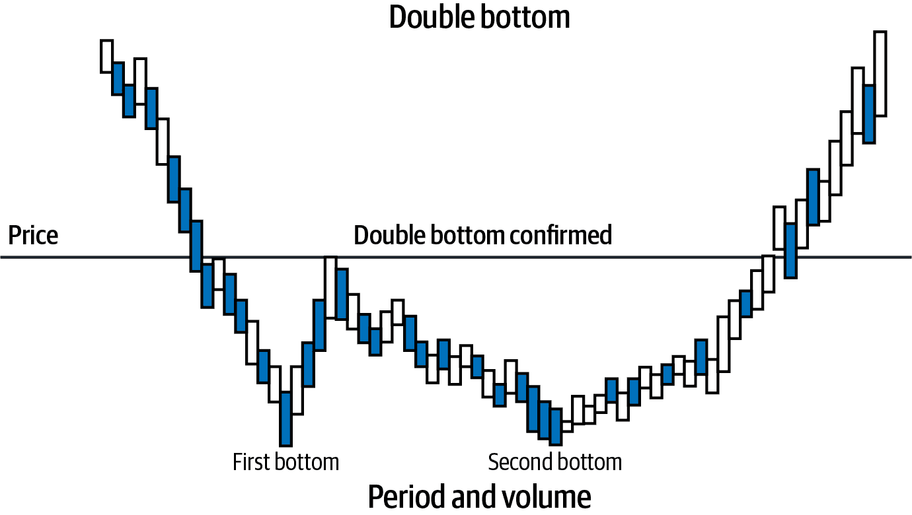

# 第二章：分析和量化不确定性

> 已知的是已知的。这些是我们知道自己知道的事情。已知未知。也就是说，有些我们知道自己不知道的事情。但也有未知的未知。有些事情我们不知道自己不知道。
> 
> —唐纳德·拉姆斯菲尔德，前美国国防部长

蒙提霍尔问题是一个著名的概率智力游戏，是探索我们在个人和职业生活中面临的不确定性复杂和深刻本质的一种娱乐方式。更为相关的是，蒙提霍尔问题的解决方案本质上是一种投注策略。在本章中，我们利用它来解释概率、统计、机器学习、博弈论、金融和投资中的许多关键概念和陷阱。

在本章中，我们将通过使用概率论的基本规则开发两种不同复杂度的分析解决蒙提霍尔问题的明显悖论。我们还推导出反向概率规则，这对于概率机器学习至关重要。稍后在本章中，我们将用蒙特卡洛模拟（MCS）确认这些分析解决方案，这是一种在金融和投资中广泛使用的最强大的数值技术之一。

Monty Hall 问题嵌入了三种类型的不确定性，我们进行了探讨。Aleatory 不确定性是观察数据中的随机性（已知已知）。Epistemic 不确定性源于对潜在现象的不了解（已知未知）。Ontological 不确定性则源自人类事务的本质及其固有的不可预测动态（未知未知）。

概率被用来系统地量化和分析不确定性。在这样做时，我们拒绝了风险和不确定性之间的虚无区别。概率确实是科学的逻辑。也许令你惊讶的是，我们可以同意概率论公理，但在概率的含义上却存在分歧。我们探讨了两种主要的思想流派，频率主义和认识论概率观。我们发现传统的概率观，即频率主义版本，充其量只是认识论概率的一个特例，并且更适合简单的偶然游戏。最糟糕的是，频率主义对概率的观点基于对经典物理学和常识的不可原谅的无知。

No Free Lunch（NFL）定理是一组不可能定理，它在概率框架内重新阐述了归纳问题的古老问题。我们探讨了这些认识论概念如何在概率机器学习、金融和投资中具有重要的实际意义。

# Monty Hall 问题

著名的蒙特霍尔问题最初由著名统计学家史蒂夫·塞尔文构思并解决。现在我们所知的问题基于流行的 1970 年代游戏节目 *Let’s Make a Deal* 并以主持人蒙特·霍尔的名字命名。以下是这个脑筋急转弯的规则：

1.  三扇门中有一扇门后面是汽车，另外两扇门后面是山羊。

1.  目标是赢得汽车（而不是山羊！）。

1.  只有蒙特知道哪扇门藏着汽车。

1.  蒙特允许你选择三扇门中的任意一扇。

1.  根据你的选择，他会打开另外两扇门中有一扇门后面是山羊的门。

所以让我们来玩这个游戏。无论你选择哪扇门，游戏的进行方式都是类似的。假设你选择了门 1。基于你的选择门 1，蒙特打开了门 3，给你展示了一只山羊。参见 Figure 2-1。


###### 图 2-1\. 蒙特霍尔问题¹

现在蒙特向你提出一个交易：他让你选择是保持原来选择的门 1 还是换到门 2。你会选择换到门 2 还是保持原来的选择门 1？在继续阅读之前尝试解决这个问题——这将是值得的麻烦。

我必须承认，当我多年前第一次遇到这个问题时，我的直接反应是无论你是保持还是换门，现在汽车被放置在门 1 或门 2 后面的概率是相等的。所以我坚持了我最初的选择。结果证明我的选择是错误的。

最佳策略是换门，因为蒙特开启其中一扇门后，为你提供了宝贵的新信息，你可以利用这些信息增加赢得汽车的几率。在我分析解决方案并意识到我错了之后，我感到欣慰的是，这个问题曾经困扰过成千上万的博士统计学家。这个问题甚至使伟大的数学家保罗·埃尔德什感到困惑，他只有在看到解决方案的模拟之后才确信换门是一个获胜策略。本章对蒙特霍尔问题的深入分析是我的“复仇分析”。

如下面的侧边栏解释的那样，人们为什么不换门可能存在心理上的原因。

在我们模拟这个问题之前，让我们尝试通过应用概率公理来逻辑推理出解决方案。

# 概率公理

下面是概率公理或基本规则的复习。令人惊讶的是，概率的计算可以完全从以下三个公理和几个定义中推导出来。

假设 S 是任意一种情况（也称为事件）。通常情况下，我们将 S 定义为汽车在门后的情况。因此，S[1] 是指汽车在门 1 后面的具体情况。类似地，我们类似地定义了 S[2] 和 S[3]。S 的补集是 S′（不是 S），表示门后是一只山羊而不是汽车的情况。

情景 S 和 S'被称为互斥，因为任何给定门后面要么是山羊要么是车，而不会同时是两者。由于这是游戏中唯一可能的情景，S 和 S'也被称为完全穷尽的情景或事件。所有可能情景的集合称为样本空间。让我们看看如何将概率规则应用到蒙特霍尔游戏中。

公理 1: P(S) ≥ 0

事件或情景的概率 P(S)总是被赋予非负实数。例如，当蒙特告诉我们门 3 后面没有车时，P(S[3]) = 0。事件概率为 0 意味着事件是不可能的或没有发生。

公理 2: P(S[1]) + P(S[2]) + P(S[3]) = 1

这个公理的含义是，我们确信样本空间中至少会发生其中一个情景。请注意，这个公理意味着事件概率为 1 意味着事件肯定会发生或已经发生。根据蒙特霍尔游戏的规则，我们知道只有一辆车，而它在三扇门中的一扇后面。这意味着情景 S[1]、S[2]和 S[3]是互斥且完全穷尽的。因此，P(S[1]) + P(S[2]) + P(S[3]) = 1。此外，请注意公理 1 和公理 2 确保概率始终在 0 到 1 之间，包括边界值。此外，P(S[1]) + P(not S[1]) = 1 暗示了 P(S[1]) = 1 – P(not S[1])。

公理 3: P(S[2] 或 S[3]) = P(S[2]) + P(S[3])

这个公理被称为求和规则，使我们能够计算两个互斥情景的概率。比如，我们想知道车可能在门 2 或门 3 后面的概率，即我们想知道 P(S[2] 或 S[3])。由于车不可能同时在门 2 和门 3 后面，S[2]和 S[3]是互斥的，即 P(S[2] 和 S[3]) = 0。因此，P(S[2] 或 S[3]) = P(S[2]) + P(S[3])。

# 概率分布函数

概率质量函数（PMF）提供了离散变量将具有特定值的概率，例如在蒙特霍尔问题中计算的值。PMF 只提供离散且有限的值。累积分布函数（CDF）列举了变量小于或等于特定值的概率。CDF 的值始终是非递减的，并且在 0 到 1 之间包括边界值。

概率密度函数（PDF）提供了连续变量落入数值范围内的概率。PDF 可以取无限多个连续值。然而，PDF 对于任何具体点估计都分配了零概率。或许令人惊讶的是，PDF 在分布的不同点处可以大于 1。这是因为 PDF 是（CDF）的导数或斜率，其值没有超过 1 的约束。

我们将应用概率公理来解决蒙蒂霍尔问题。非常重要的一点是，在本书中，我们不区分确定性变量和随机变量。这是因为我们将概率解释为关于事件信息的动态、外在属性，这些信息可能是可重复的或随机的。我们唯一区分的是一个变量和一个常数的常识性区分。我们完全了解的事件被视为常数。所有其他事件都被视为变量。

例如，当蒙蒂在其中一扇门后放置汽车，另外两扇门后放置山羊后，不存在与哪个实体位于哪个门后相关的随机性。对于蒙蒂及其观众来说，所有这样的事件现在都是静态的和非随机的。然而，与他的观众不同，蒙蒂确切地知道汽车放在哪里。对于蒙蒂来说，汽车在特定门后的概率是一个常数，即他选择放置汽车的门为 1，选择放置山羊的另外两扇门的概率为 0。由于在游戏开始时我们缺乏关于汽车位置的任何信息，我们可以将其视为一个变量，其值可以根据新信息动态更新。对于我们来说，这些事件既不是确定性的也不是随机的。我们的概率只反映了我们缺乏信息。然而，我们可以应用概率理论的计算来估计和更新我们对汽车放置位置的估计。所以让我们试着弄清楚这一点，不再拖延。

由于每种情况是互斥的（每扇门后要么是山羊要么是汽车）且全面的（这些是所有可能的情况），它们的概率必须相加为 1，因为以下至少会发生其中之一的情况：

+   *P(S[1]) + P(S[2]) + P(S[3]) = 1*                                                               *(方程式 2.1)*

在我们做出选择之前，最合理的假设是汽车同等可能地在三扇门后。游戏规则中没有任何东西让我们认为不是这样，而蒙蒂·霍尔也没有给我们任何相反的提示。因此，假设*P(S[1])=P(S[2])=P(S[3])*是合理的。使用方程式 2.1，我们得到：

+   *3 × P(S[1]) = 1 或 P(S[1]) = ⅓*                                                              *(方程式 2.2)*

由于*P(S[1]) = P(S[2]) = P(S[3])*，方程式 2.2 暗示着合理地假设汽车在三扇门后的概率是 1/3。

根据总和规则，汽车在 2 号门或 3 号门后的概率是：

+   *P(S[2] 或 S[3]) = P(S[2]) + P(S[3]) = ⅓ + ⅓ = ⅔*                                   *(方程式 2.3)*

当你选择 1 号门，蒙蒂打开 3 号门，并展示给你一只山羊后，P(S[3]) = 0。将这个值代入方程 2.3 并解出 P(S[2])，我们得到：

+   *P(S[2]) = P(S[2]或 S[3]) – P(S[3]) = ⅔ – 0 = ⅔*                                     *(方程式 2.4)*

因此，将选择从门 1 换到门 2 会使您赢得汽车的几率翻倍：从⅓增加到⅔。在这场游戏中，换门是最优的投注策略。参见图 2-2。


###### 图 2-2。蒙特霍尔问题的一个简单逻辑解³

需要注意的是，由于不确定性，如果您换门，仍然有⅓的机会会输。总的来说，结果的随机性使得确定您的投资或交易策略是赢家还是赌运成为困难和令人沮丧的事情。在蒙特霍尔问题中确定一个赢的策略要容易得多，因为可以通过分析或模拟多次进行游戏来确定。

# 反转概率

让我们对蒙特霍尔问题开发一个更严格的分析解决方案。为此，我们需要理解条件概率及其反转方法。这相当于理解普通数字的乘法和除法规则。回想一下，当我们对概率进行条件设定时，我们通过将来自条件数据的新信息纳入来修正情景或事件的可能性。给定条件数据集 D 的情景 H 的条件概率表示为 P(H|D)，它读作给定 D 时 H 的概率，并定义如下：

+   *P(H|D) = P(H 和 D) / P(D)，前提是 P(D) ≠ 0，因为除以 0 是未定义的*

通过 P(D)的除法确保了在 D 条件下的所有情景的概率将加起来为 1。回想一下，如果两个事件是独立的，则它们的联合概率是它们各自概率的乘积。也就是说，如果 D 的知识不会提高我们对 H 的概率，反之亦然。

P 给定 H 的条件概率的定义还意味着 P(H 和 D) = P(H|D) × P(D)。这被称为乘法规则。现在我们可以从乘法规则推导出逆概率规则。我们知道从两个事件的联合概率的对称性：

+   P(H 和 D) = P(D 和 H)

+   P(H|D) × P(D) = P(D|H) × P(H)

+   P(H|D) = P(D|H) × P(H) / P(D)

亲爱的读者们，这就是著名且错误命名为“贝叶斯定理”的证明。如果所有数学证明都这么简单就好了！正如您所见，这个所谓的定理是乘法规则的一个微不足道的改写。它与将两个数相乘并根据它们的乘积解出一个数的规则一样（例如，H = H × D/D）。困难和富有洞察力的部分是解释和应用这个公式来反转概率并解决复杂的现实世界问题。自上世纪 50 年代以来，先前提到的公式也错误地被称为贝叶斯定理。请参阅以下侧栏。

在本书中，我们将通过恢复其原始名称，即逆概率规则，来纠正这种公然的不公正和明显的误称。在 20 世纪中叶，R. A. Fisher 将其蔑称为贝叶斯规则之前，这就是这条规则在两个多世纪中的称呼。我怀疑，通过将一个业余数学家的名字附加到一个无可争议的数学规则上，费舍尔能够在虔诚的借口下不受限制地犯下检察官谬误。费舍尔的“比毫无用处更糟糕”的统计推断方法将在第四章进一步讨论。此外，在本书中，我们恢复规则的原始名称，因为它具有更长、更真实的传统，而将逆概率规则称为拉普拉斯-贝努利-莫伊弗-贝叶斯-普赖斯规则太长了。

此外，我们将把贝叶斯统计称为认识论统计学，将贝叶斯推断称为概率推断。正如频率统计学解释概率为事件的相对极限频率一样，认识论统计学将概率解释为关于事件信息的属性。希望这将使我们远离错误地将这一重要的科学努力和知识体系归因于一个可能对此努力的贡献存在疑议的人。事实上，并没有证据表明贝叶斯今天被用作这个术语的贝叶斯。

一般来说，认识论统计学和特别是逆概率规则是概率机器学习的基础，在本书的第二部分我们将深入讨论它。现在，让我们将其应用于蒙提霍尔问题，并继续使用 S[1]、S[2]和 S[3]及其相关的概率定义。现在我们定义我们的数据集 D，其中包括两个观察结果：您选择门 1；根据您选择的门 1，蒙提打开门 3 让您看到一只山羊。我们要求解 P(S[2]|D)，即给定数据集 D 时汽车在门 2 后面的概率。

根据逆概率规则，我们知道这等于 P(D|S[2]) × P(S[2])/P(D)。挑战性的计算是 P(D)，即无条件或边际概率，即观察到数据集 D 的概率，无论汽车停在哪个门后面。全概率规则允许我们从条件概率计算边际概率。具体而言，该规则指出，D 的边际概率 P(D)是在不同场景下实现 D 的加权平均概率，其中 P(S)给出了 S 样本空间中每个场景的具体概率或权重：

+   *P(D) = P(D|S[1]) × P(S[1]) + P(D|S[2]) × P(S[2]) + P(D|S[3]) × P(S[3])*

在蒙提霍尔游戏开始时，我们估计了三种情况的概率，即 P(S[1]) = P(S[2]) = P(S[3]) = ⅓。这些将是每种可能情况的权重。让我们计算观察到我们的数据集 D 的条件概率。注意，P(D|S[1]) 意味着在车实际上在门 1 后面的情况下看到数据集 D 的概率，依此类推。

如果车在门 1 后面，你选了门 1，其他两扇门后面是山羊。所以蒙提可以打开门 2 或门 3 中的任一扇来给你看一只山羊。因此，蒙提打开门 3 给你看一只山羊的概率，假设你选择了门 1，是 ½，即 P(D|S[1]) = ½。

如果车在门 2 后面而你选择了门 1，蒙提只能打开门 3 来给你看一只山羊。所以 P(D|S[2]) = 1。

如果车在门 3 后面，蒙提打开门 3 的概率为零，因为他会破坏游戏，而你只是为了露个脸就得到了车。因此，P(D|S[3]) = 0。

我们将数字代入总概率法则中，以计算在游戏中观察到数据集 D 的边际或无条件概率：

+   *P(D) = P(D|S[1]) × P(S[1]) + P(D|S[2]) × P(S[2]) + P(D|S[3]) × P(S[3])*

+   *P(D) = [½ × ⅓] + [1 × ⅓ ] + [0 × ⅓ ] = ½*

现在我们拥有了计算车在门 2 后面的概率的所有需要使用的概率，假设我们的数据集 D：

+   *P(S[2]|D) = P(D|S[2]) × P(S[2]) / P(D)*

+   *P(S[2]|D) = [1 × ⅓ ] / ½ = ⅔*

我们可以类似地计算在给定数据集 D 的情况下车在门 1 后面的概率：

+   *P(S[1]|D) = P(D|S[1]) × P(S[1]) / P(D)*

+   *P(S[1]|D) = [½ × ⅓] / ½ = ⅓*

显然，通过换门我们的机会增加了一倍，因为 P(S[2]|D) = 2P(S[1]|D) = ⅔。请注意，仍然有 ⅓ 的机会你不换门就能赢。但是就像交易和投资一样，你的投注策略应该始终让赔率对你有利。

# 模拟解决方案

仍然不确定？让我们通过使用一个称为蒙特卡罗模拟（MCS）的强大数值方法来解决蒙提霍尔问题，这在前一章中提到过。这种强大的计算方法几乎应用于每个领域的理论家和实践者，包括商业和金融。回想一下，MCS 从概率分布中随机抽样，以生成系统的许多可能情景，其结果是不确定的。它通常用于量化模型输出的不确定性。下面的 MCS 代码显示了如果多次玩这个游戏，换门是最佳的投注策略：

```py
import random
import matplotlib.pyplot as plt

# Number of iterations in the simulation
number_of_iterations = [10, 100, 1000, 10000]

fig, axs = plt.subplots(nrows=2, ncols=2, figsize=(8, 6))

for i, number_of_iterations in enumerate(number_of_iterations):
    # List to store results of all iterations
    stay_results = []
    switch_results = []

    # For loop for collecting results
    for j in range(number_of_iterations):
        doors = ['door 1', 'door 2', 'door 3']

        # Random selection of door to place the car
        car_door = random.choice(doors)
        # You select a door at random
        your_door = random.choice(doors)

        # Monty can only select the door that does not have the car and one 
        # that you have not chosen
        monty_door = list(set(doors) - set([car_door, your_door]))[0]
        # The door that Monty does not open and the one you have 
        # not chosen initially
        switch_door = list(set(doors) - set([monty_door, your_door]))[0]

        # Result if you stay with your original choice and it has the 
        # car behind it
        stay_results.append(your_door == car_door)
        # Result if you switch doors and it has the car behind it
        switch_results.append(switch_door == car_door)

    # Probability of winning the car if you stay with your original
    # choice of door
    probability_staying = sum(stay_results) / number_of_iterations
    # Probability of winning the car if you switch doors
    probability_switching = sum(switch_results) / number_of_iterations

    ax = axs[i // 2, i % 2]

    # Plot the probabilities as a bar graph
    ax.bar(['stay', 'switch'], [probability_staying, probability_switching],
    color=['blue', 'green'], alpha=0.7)
    ax.set_xlabel('Strategy')
    ax.set_ylabel('Probability of Winning')
    ax.set_title('After {} Simulations'.format(number_of_iterations))
    ax.set_ylim([0, 1])

    # Add probability values on the bars
    ax.text(-0.05, probability_staying + 0.05, '{:.2f}'
    .format(probability_staying), ha='left', va='center', fontsize=10)
    ax.text(0.95, probability_switching + 0.05, '{:.2f}'
    .format(probability_switching), ha='right', va='center', fontsize=10)

plt.tight_layout()
plt.show()
```


如您从模拟结果中所见，长期来看换门是获胜的策略。如果您玩游戏一万次，概率与分析解几乎相同。如果您玩游戏超过十万次，概率几乎完全与分析解相同。我们将在下一章节中特别探讨这些结果的理论原因，以及蒙特卡罗模拟在一般情况下的用途。

然而，从模拟中并不清楚在短期（10 次试验）内是否换门是正确的策略，特别是如果游戏只玩一次的话。我们知道，无论我们赢还是输汽车，蒙蒂都不会再邀请我们回来玩游戏。那么我们甚至能谈论一次性事件的概率吗？但是我们到底是什么意思？大家对概率的含义是否都同意？让我们现在来探讨这个问题。

# 概率的含义

两大学派关于概率基本含义的争论已经持续了约一个世纪——这是统计推断的灵魂。这两个阵营不仅在我们列举的公理中对概率的基本含义存在分歧，而且在应用这些公理以保持一致性进行推断的方法上也存在分歧。这些核心差异导致了统计推断理论及其实践中的不同发展。

## 频率主义概率

认为概率是事件或物理对象的自然、不变属性，并且概率是作为长期相对频率经验性测量的统计学家被称为频率主义者。频率主义是现代统计学的主流学派，无论是在学术研究还是工业应用中都是如此。它也被称为正统、经典或传统统计学。

正统统计学家声称概率是事件或物理现象的自然属性。事件的概率应该通过重复类似的实验来经验性地测量——无论是在现实中还是假设地，可以使用想象力或计算机模拟。例如，如果一个实验重复 N 次，事件 E 发生了 M 次，那么相对频率 M/N 近似于事件 E 的概率。随着实验次数 N 趋向无穷大，事件 E 的概率等于 M/N。图 2-3 显示了投掷两个公平骰子多次的长期相对频率的直方图。


###### 图 2-3\. 两个公平骰子的长期相对频率⁵

频率学家认为概率的任何其他解释都是厌恶的，几乎是亵渎的。然而，他们对概率的定义是意识形态的，不基于科学实验。正如本章后面将讨论的那样，骰子和硬币没有任何静态的、固有的、“真实”的概率。例如，抛硬币并不是随机的，而是基于物理定律，可以用机械硬币翻转器 100%准确地预测。这些实验嘲笑了频率学派对概率的定义，显示出对基础物理学的极端无知。在第四章中，我们将探讨频率学派对概率和统计方法的方法如何对社会科学一般以及经济金融特别是其中大多数使用其方法的出版研究造成了深远的损害，它们是错误的。

## **认知概率**

另一个重要的思想流派是广为人知并且错误地称为贝叶斯统计学。如前所述，这是一个极其错误的称呼，在本书中我们将这种解释称为认知概率。在认知学派中，概率有一个更简单、更直观的含义：它是逻辑的延伸，并根据当前的知识或无知量化事件发生的可能性程度。认知概率是动态的、心理建构，是事件信息的函数，这些事件可能是随机的或不可重复的。

随着获取更多信息，使用反向概率规则更新概率。最重要的是，事件的可能性表达为概率分布，而不是点估计。在生活和商业中存在的不确定性使点估计尽可能被避免。此外，对于概率密度函数，点估计的概率为零。概率机器学习就是基于这种思想流派。

重要的是要注意，概率的认知解释是广泛的，并将频率学派对概率解释作为一个特殊的极限情况。例如，在蒙蒂·霍尔问题中，我们假设汽车可能在三扇门后的任一扇门后，认知和频率概率都是⅓。此外，两种思想流派都得出了同样的结论，即换门可以增加你的概率，并且是一种获胜的策略。然而，认知方法不需要对游戏进行任何独立和相同分布的试验来估计两种策略的概率。同样地，对于诸如骰子和牌的简单游戏，两种概率学派都给出了相同的结果，但频率学派需要想象重新采样数据，或者实际进行模拟。

在过去的一个世纪里，频率学派的理论信徒们以明示或隐晦的方式贬低并试图摧毁认知学派的思想。在其他事情中，他们将认知概率标记为主观的，在科学中通常是一个贬义词。所有的模型，特别是社会和经济科学中的模型，其假设都是根据定义主观的，因为它们涉及在众多可用选项中进行设计选择。

在金融和投资中，主观概率是常态，并且是可取的，因为它们可能导致竞争优势。主观概率可以防止当每个人都遵循同样“客观”的推断或事件预测时发生的赶羊效应和群体思维。认知统计学将确保我们的主观概率与概率理论一致和一贯。如果我们在投资策略的主观概率上是不理性或不一致的，其他市场参与者将利用这些不一致性，并通过反对我们的交易或投资来进行荷兰式套利。这个概念相当于体育博彩中的无风险套利机会，无论结果如何，我们在交易或投资中都会输给其他市场参与者。

统计学的频率派理论被作为科学严谨、高效、健壮和客观的思想销售给了学术界和工业界。这与事实相去甚远。频率学派使用最大似然估计（MLE）方法来学习他们模型参数的最优值。在他们热衷于“只让数据说话”并使推断无偏的过程中，他们并未明确应用任何先验知识或基础率到他们的推断中。然后他们声称他们拥有无偏算法，适用于任何类别的问题。但是 NFL 定理清楚地表明这是不可能的。

NFL 定理在数学上证明了声称一个算法在所有问题域中既无偏又最优的说法是错误的。这是一个免费的午餐，在机器学习、搜索和优化中是不允许的。如果一个算法实际上是无偏的，NFL 定理告诉我们它在不同数据集上会有很高的方差，并且其性能在所有目标分布上的平均表现不会比随机猜测好。风险在于它比随机猜测还要糟糕，这在社会和经济科学中已经发生，那里的大多数研究发现都是错误的（参见第四章的引用）。如果频率学派的辩护是，这个世界上并不是所有的目标分布都是同等可能的，他们需要意识到选择一组目标分布的行为是对偏见的愚蠢承认，因为这涉及到做出主观选择。

但是，我们甚至不必使用 NFL 定理的复杂数学和逻辑来揭示频率主义框架的深刻缺陷。在第四章中，我们将探讨频率主义推断方法为什么“不仅无用”，因为它们违反了概率的乘法和除法规则（乘积和逆概率规则），并在其假设检验方法中使用了检察官谬误的统计诡计。

尽管频率主义者竭力努力，认识论统计已被证明在理论上是合理的，并经过实验证实。事实上，当暴露于复杂的统计现象时，频率主义概率实际上是失败的，揭示了其在处理图像处理和重建等领域时的脆弱性和特设性，其中任何测量的抽样分布总是恒定的。概率算法主导着图像处理领域，利用其更广泛的认识论基础。⁶

在表 2-1 中概述了频率主义和认识论统计之间的差异。这些差异每一个都已经或将在本书中进行解释，并得到了大量学术参考资料的支持。

表 2-1\. 频率主义和认识论统计之间差异的总结

| 维度 | 频率主义统计学 | 认识论统计学 |
| --- | --- | --- |
| 概率 | 事件或对象的长期相对频率的固有静态属性。不受物理实验支持。 | 任何事件信息的动态外在属性，可能是可重复或随机的。 |
| 数据 | 被视为随机变量的方差来源。推断不能用于小数据集。 | 被视为常数的已知数据。数据集的大小无关紧要。 |
| 参数 | 被视为未知或不可知的常数。 | 被视为未知变量。 |
| 模型 | 存在一个解释数据的最佳参数的“真实”模型。 | 存在多个解释模型，其可信度各异。 |
| 模型类型 | 判别模型——只学习决策边界。不能生成新数据。 | 生成模型——学习数据的基本结构。模拟新数据。 |
| 模型假设 | 隐含在零假设、显著性水平、正则化和渐近限制中。 | 最重要的模型假设明确陈述，并以先验概率形式量化。 |
| 推断方法 | 最大似然估计。 | 逆概率法则 / 乘法规则。 |
| 假设检验 | 零假设显著性检验是二元的，并且有检察官谬误。 | 给多个不同假设分配可信度。 |
| 不确定性类型 | 只处理随机不确定性。 | 处理随机和认识不确定性。 |
| 不确定性量化 | 置信区间在认识论上不一致且在数学上有缺陷。P 值犯了反向谬误。 | 基于逻辑和常识的可信区间。在认识论上一致且在数学上合理。 |
| 计算复杂性 | 低。 | 中等到高。 |
| 无免费午餐（NFL）定理 | 违反了无免费午餐定理。不包括先验知识，因此算法具有很高的方差。在所有可能的问题上平均下来，它们的性能不比随机猜测好。 | 符合无免费午餐定理。先验知识降低了算法的方差，使其在特定问题领域中最优。 |
| 科学方法论 | 在客观性表象下的意识形态化、非科学、特定场合下的临时方法。否认反向概率法则/乘法法则的有效性。社会和经济科学中虚假发现的主要原因。 | 逻辑和科学观点，系统地整合基于反向概率法则/乘法法则的先验知识。明确陈述和量化所有客观和主观假设。 |

## 相对概率

蒙提霍尔问题中是否存在客观概率？汽车在 2 号门后面，所以 S[2] = 1 的“真实”和客观概率不是一个常数吗？是的，任何与蒙提相同位置的主持人将会分配 S[2] = 1，就像任何参与者会分配 S[2] = ⅓ 一样。然而，在这个游戏中，没有任何事件的静态、不可变的“真实”概率，即独立于人类行为的本体存在。如果蒙提将汽车放在 1 号门后面，对他来说 S[2] = 0，但对任何参与者来说，仍然恒定为 ⅓。

概率取决于使用的模型、游戏的阶段以及参与者或主持人可用的信息。如前所述，任何参与者或主持人的概率不是主观的，而是他们拥有的信息的函数，因为任何主持人和任何合理的参与者都会使用基本概率理论或常识得出相同的概率。概率是用来动态量化不确定性的心理构造。

它类似于特殊相对论的物理学，自从阿尔伯特·爱因斯坦在 1905 年发表其重要论文以来，已经通过实验证实。相对论原理表明，物理定律在所有不相对加速的参考系中不变。共享同一参考系的两个观察者将始终就质量、长度和时间的基本测量达成一致。然而，根据他们的参考系如何相对运动及其相对于光速的比较，他们对这些量的测量将有所不同。相对论原理有许多重要的含义，包括没有绝对运动的事实。运动总是相对于某个参考系的。

图 2-4 显示了两个参考系，其中带有撇号的坐标系相对于不带撇号的坐标系以恒定速度运动。观察者 O 和 O′ 将同意物理法则适用于他们的世界。然而，观察者 O 将声称他们静止不动，观察者 O′ 则声称他们沿着 x 轴正向以恒定速度 (+v) 运动。但观察者 O′ 将声称他们静止不动，而观察者 O 则是在 x′ 轴负向以恒定速度 (–v) 运动。这意味着无法明确地说 O 还是 O′ 真的在运动。他们彼此相对运动，但在绝对意义上，两者都没有运动。


###### 图 2-4\. 两个相对运动的参考系中的相对论原理⁷

我发现根据观察者的参考系或信息获取情况来思考相对概率比绝对或主观概率更有用。不管怎样，我们都需要概率论来处理我们日常个人和专业生活中不得不面对的深刻不确定性。但在量化不确定性之前，我们需要对其有相当深入的理解。

# 风险与不确定性：一个毫无意义的区分

在传统的统计学和经济学文献中，通常会将风险和不确定性进行空洞的区分。据称，只能对已知且具有客观概率分布和相关参数的事件进行风险估计。可以准确估计概率和回报，并使用各种指标计算风险。当不存在客观概率分布或者事件是未知或无法预测时，就描述该事件为不确定性，并声称风险无法估计。

在金融和投资中，我们不是在处理像赌场游戏这样的简单游戏，其中玩家、规则和概率分布都是固定和已知的。产品市场和金融市场与这类简单的游戏有很大不同，其中事件风险可以被准确估计。正如前一章讨论的那样，未知的市场参与者可能根据他们自己的策略和假设使用不同的概率分布模型。即使对于流行的、共识的统计分布，也不存在关于参数估计的一致性。此外，由于市场不是平稳遍历的，这些概率分布及其参数正在不断变化，有时会突然变化，从而使每个人的估计和预测都成为笑柄。

因此，基于风险和不确定性的传统定义，几乎所有的投资和金融都是不确定的。在实践中，这是一个无用的区分，源自无用的频率主义统计学和新古典经济学关于客观、学术模型的意识形态，而非市场参与者的现实。作为从业者，我们根据我们的经验、专业知识、机构知识和判断力发展我们自己的主观模型。事实上，我们极为谨慎地保护我们的专有、主观模型，因为与公众分享它们将削弱我们的竞争优势。

Edward Thorp，有史以来最伟大的量化赌徒和交易员，在 Fischer Black 和 Myron Scholes 1973 年发表其著名的“客观”模型之前，就发明了一种期权定价模型。由于 Thorp 的模型是他的对冲基金的商业秘密，他有责任向投资者保密，不与公众分享他的模型，以保持公司的竞争优势。Thorp 运用他的主观、数值的专有期权模型，创造了历史上最佳的风险调整回报之一。Black 和 Scholes 应用他们的“客观”、分析的期权定价模型到实际市场中，结果几近破产，匆忙撤退到学术象牙塔的庇护所。

期权市场做市商和衍生品交易员像我一样，通常会以不同的方式修改“客观”的 Black-Scholes 定价模型，以纠正其许多深层次的缺陷。通过这样做，我们使我们的期权交易模型变得主观和专有。最重要的是，我们使其在成功交易这些复杂市场中变得有用。

“客观”的 Black-Scholes 期权定价模型的真正价值显然不在于其对期权的准确定价。学术界和从业者都普遍认为，它并不准确，尤其是因为错误地将基础资产的波动性视为恒定的。关于 Black-Scholes 模型的一个经典笑话是，你必须在“错误的公式里输入错误的数字才能得到正确的价格。”

Black-Scholes 模型的真正增值，在解释其在从业者中持久流行的原因时，是其促进市场参与者之间的沟通，这些参与者通常使用自己不同的专有期权定价模型。具有讽刺意味的是，尽管 Black-Scholes 模型有虚构的假设和市场幻想，但它在实际期权市场的快速增长中做出了显著贡献。人类对任何格式的优秀虚构作品都情有独钟。也许 Black 和 Scholes 应该被授予真正的诺贝尔文学奖。

在认识论统计学中，概率是逻辑的延伸，并且可以分配给任何不确定事件——已知的、未知的和不可知的。我们通过拒绝点估计，并对任何事件被认为是确定性（概率=1）或不可能性（概率=0）设定极高的标准来做到这一点。这就是为什么在认识论统计学中，我们只处理概率分布。通过使用像柯西分布这样的厚尾概率分布来承认不可知事件，该分布没有定义的均值或方差，反映了在我们的交易和投资持有期间几乎任何事情都是可能发生的事实。

概率估计基于我们的先验知识、观察数据和在进行这类估计时的专业知识。但更重要的是，它们依赖于人类的判断、常识和对因果关系的理解，而这些是 AI 系统无法处理的。我们对我们的估计和预测的信心程度将根据许多因素而变化，包括事件的性质、不确定性的来源、我们的资源以及我们执行此类任务的能力。

在金融和投资领域，我们没有奢侈品不进行这种不完美、混乱的统计尝试。我们这样做是充分了解到这些困难的练习充满了近似，充斥着潜在的错误，并且容易受到市场的破坏和嘲笑。德怀特·艾森豪威尔，前美国将军和总统，在解释这些练习的价值时说：“在准备战斗时，我始终发现计划是无用的，但规划是不可或缺的。”⁹ 通过对风险和不确定性进行某些无用的定义来放弃这种统计练习的选择甚至更糟糕。最糟糕的行动是被某些经济意识形态或对人类行为和理性的客观统计模型或规范理论的错误安全感所麻痹，这些理论没有基础于数据和世界的实际经验现实。

我们拒绝在风险和不确定性之间进行这种无用的区分。根据适当的概率分布和边界条件，所有不确定事件在逻辑上和现实上都是合理的。我们知道所有的模型都是错误的，包括有用的模型，并且不对这些现实的影子效忠。

# 不确定性的三位一体

不确定性通常根据其来源分为三种类型：伪随机、认知和本体。这些是哲学家和科学家们几千年来努力理解和应用的复杂概念。让我们看看如何使用蒙提·霍尔问题来理解这三种不确定性的复杂性。稍后，我们将这些不确定性类型应用到实际中机器学习的各个方面。

## 伪随机不确定性

“Aleatory”在拉丁语中意味着“掷骰子”。从根本上讲，伪随机不确定性是结果的不可减少的随机性。蒙提·霍尔问题的分析和模拟解决方案都表明，在这个游戏中，无论你选择保持或换门，单次玩游戏或多次玩游戏都不能保证你赢得汽车。你可以坚持最初选择的 1 号门，有 1/3 的几率赢得汽车；或者你可以换到 2 号门，有 1/3 的几率输掉汽车。每当你玩这个游戏时，你确实在掷象征性的骰子，因为结果是不确定的。

实际上，与掷骰子或抛硬币相比，硬币投掷更不确定，因为它们都没有伪随机不确定性，只有认知不确定性，正如下一节所解释的那样。在当前关于概率和统计学的文献中，抛硬币是伪随机不确定性的一个典型例子。然而，这显示了对古典物理定律的无可辩解的无知。已经实验证明，如果你知道硬币投掷的初始条件和其他参数，你可以以 100%的准确率预测其结果。这是因为硬币投掷是物理学，不是随机性。¹⁰

统计学家和前魔术师佩尔西·迪亚康尼斯（Persi Diaconis）让工程师们为他建造了一个机械硬币投掷器，以便他可以进行实验和研究硬币投掷。事实上，他和他的同事们验证了使用机械硬币投掷器进行硬币投掷时没有随机性。¹¹ 硬币投掷的随机性来自于人类投掷硬币时初始条件的不一致性以及硬币在地面上滚动的情况。

我们观察到的不确定性源于我们对投掷物理学的精确信息或知识的缺乏。这是伪随机不确定性的一个糟糕示例。它也表明，硬币没有任何固有的、不可变的、限制频率，正如频率学派想让我们相信的那样。你可以利用硬币投掷的物理学使有偏的硬币变得公正，反之亦然，只需一些练习。¹²

抛硬币和掷骰子是认知不确定性的例子，我们将在下一小节讨论。与硬币或骰子相反，无论对门的物理特性或它们的运动有多少信息，都无法减少蒙蒂·霍尔问题中汽车位置的 aleatory uncertainty。这是 aleatory uncertainty 的一个很好的例子，也是为什么社会系统与物理系统根本不同且更难预测的原因。

在机器学习（ML）中，**aleatory uncertainty** 是由数据生成的不可消除误差的源头。它设定了任何 ML 模型能够达到的泛化误差的下界。这种普遍存在的噪音以两种不同的方式生成：

测量不确定性

并非总能完全精确地测量数据。例如，当市场因某一事件（如经济报告发布）出现高波动性时，几乎不可能实时捕捉每笔交易或每一次价格变动，导致缺失或延迟的交易数据。同样，数据传输错误可能导致缺失或损坏的价格数据。

抽样不确定性

每当我们从人口中的随机数据样本，或在不同时间抽样随机过程时，样本统计数据（如均值和方差）会因样本而异。这种 aleatory uncertainty 类型是由抽样过程本身的固有随机性以及基础统计分布的可变性所导致的。例如，由不同公司进行的消费者情绪调查会产生不同的统计估计。此外，股票价格回报的方差也随时间变化。图 2-5 显示了如何从总体中获取特定的随机数据样本以估计总体的均值和方差。


###### 图 2-5\. 因为随机抽样用于估计其总体的统计特性¹³

## 认知不确定性

*Episteme* 在希腊语中意为“知识”。任何情境的认知不确定性取决于面对其的个体的知识或无知状态。与 aleatory uncertainty 不同，你可以通过获取更多的知识和理解来减少 epistemic uncertainty。当蒙蒂打开一扇门展示给你一只山羊时，他为你提供了非常宝贵的新信息，从而降低了你的认知不确定性。基于蒙蒂对你选择的反应，门 1 背后有汽车的概率保持不变为 1/3，但门 2 的概率从 1/3 变为 2/3，门 3 的概率从 1/3 变为 0。

然而，Monty 对于汽车在哪扇门后面没有任何不确定性：他对每扇门的概率始终是 1 或 0。他只对你会选哪扇门感到不确定。而且，一旦你选择了任何一扇门，他就确定接下来会做什么。但是，他不确定你在面对选择时会怎么做。你会留在最初选择的门 1 还是换到门 2，然后很可能赢得汽车？Monty 的不确定性不是认识论的，而是本体论的，这是一种根本不同的不确定性性质，我们将在下一小节中讨论。

所以我们可以从这个游戏中看到，为了为您选择正确的门而存在的不确定性是一个知识状态或“认识论”的功能。重要的是要注意，这不是主观信念，而是信息或其缺乏的功能。本章早期的任何参与者和任何主持人都将计算出相同的不确定性，而换门仍然是获胜策略。

###### 注意

这个游戏也是描述金融交易和市场的信息不对称性的一个例子。一般来说，交易方总是可以获得关于交易或资产各个方面的不同数量的信息，这导致他们在价格估计和交易结果上存在不确定性。不同的信息处理能力和速度进一步加剧了这些不确定性。

机器学习中存在许多认识论不确定性的来源，这源于对底层现象的知识和理解的缺乏。

它们可以按以下方式分类：

数据不确定性

为了进行有效推断，我们希望我们的数据样本能够代表底层人口或数据生成过程。例如，审计师在特定时间段内对公司的交易或财务记录的子集进行抽样，以检查是否符合会计准则。如果样本不代表交易的总体，则审计员可能无法检测到错误或欺诈。

模型不确定性

选择哪种模型来进行推断和预测总是存在不确定性。例如，在进行财务预测时，我们应该使用线性回归还是非线性回归模型？还是神经网络？或者其他一些模型？

特征不确定性

假设我们选择线性模型作为我们的第一个近似和财务预测的基线模型。我们将选择哪些特征来进行推断和预测？我们为什么选择这些特征而排除其他特征？需要多少个特征？

算法不确定性

现在我们已经为线性模型选择了特征，接下来应该使用什么线性算法来训练模型并学习其参数呢？岭回归、套索回归、支持向量机还是概率线性回归算法？

参数不确定性

假设我们决定使用市场模型和概率线性回归算法作为我们的基准模型。我们将为每个参数分配什么概率分布？或者这些参数将是点估计？超参数呢——即参数的概率分布，它们将是概率分布还是点估计？

方法不确定性

在我们的模型中，我们将使用什么数值方法从样本数据中学习其参数？我们将使用马尔可夫链蒙特卡洛（MCMC）方法还是变分推断？Metropolis 抽样方法还是 Hamiltonian Monte Carlo 抽样方法？我们将使用哪些值来设置所选数值方法的参数？我们如何证明这些参数值的合理性？

实施不确定性

假设我们决定使用 MCMC 方法。我们应该使用哪个软件来实现它？PyMC、Pyro、TensorFlow Probability 还是 Stan？或者我们将使用 Python 从头开始构建？R 或者 C++ 呢？

正如前面的讨论所示，设计机器学习模型涉及对目标函数、数据样本、模型、算法和计算资源等的选择。正如前一章提到的，我们的目标是训练我们的 ML 系统，以使其最小化可归纳泛化错误。

如果我们对问题域有先验知识，我们可能会开发一个简单的系统，因为这些知识和假设。这被称为 ML 中的偏差。风险在于，我们对模型的先验假设可能是错误的，导致它在系统地欠拟合训练数据并未从中学习新的模式或信号。因此，模型暴露于偏差误差，并在未看见的测试数据上表现不佳。另一方面，如果我们对问题域没有先验知识，我们可能会构建一个参数较多的复杂模型，以尽可能地适应和学习训练数据。那里的风险在于，模型可能会过度拟合训练数据并学习到伪相关性（噪音）。这导致模型在其预测和推断中引入误差，这些误差被称为方差误差，并导致模型在未看见的测试数据上表现不佳。图 2-6 展示了开发模型时需要进行的减少可归纳泛化误差的偏差-方差权衡。当基础数据分布不是稳定的遍历时（就像金融和投资问题中一样），这种权衡变得更加困难和动态。


###### 图 2-6\. 在开发机器学习模型时需要进行的偏差-方差权衡¹⁴

## 本体不确定性

本体论是关于存在和现实本质的哲学研究。本体不确定性通常源于未来的人类事务本质上是不可预测的。¹⁵

要使蒙蒂·霍尔游戏类似于现实世界的商业交易或交易，我们必须深入探讨游戏的目标，即赢得汽车。从蒙蒂的角度来看，赢就意味着保住汽车，这样他可以在吸引大量观众的同时降低节目成本。从这种视角看游戏时，蒙蒂对汽车藏在哪扇门后并不减少他在赢得游戏方面的本体不确定性。这是因为他不知道你会选择哪扇门，以及在有选择权时你是留在原门还是换门。由于他的概率是你概率的补集，如果你不换门，他有 2/3 的机会保住汽车，如果你换门，他有 1/3 的机会把汽车输给你。

你还有其他可能的本体不确定性。比如你第二次参加游戏时，拿出了对游戏和换门策略的分析。蒙蒂让你大吃一惊，改变了规则，不再打开另一扇门给你看山羊。相反，他让你观察他的身体语言和语调，以便帮助你做出决定。然而，蒙蒂并不打算给你任何有用的线索，想要将你的获胜概率降低到 1/3，无论你是留在原门还是换门。蒙蒂这样做是因为本周早些时候他的制片人曾威胁要取消节目，因为收视率下降，且不足以支付蒙蒂高额的薪水。

商业和金融市场的意外变化是常规而非例外。市场在经历结构性变化时不会向参与者发出备忘录。公司、交易和交易策略经常因这些类型的变化而彻底失败。这与海明威笔下的一个角色描述自己如何破产的方式类似：“有两种方式……逐渐地然后突然地。”¹⁶

在机器学习中，本体不确定性发生在基础人口或数据生成过程中存在结构性断裂的情况下，正如第一章中讨论的那样，我们不得不将模型从二项式更改为三项式。在金融和投资中，本体不确定性的来源是人类活动的复杂性，如政治选举、货币和财政政策变化、公司破产和技术突破等。只有人类能够理解这些变化背后的因果关系，并运用常识从头开始重新设计机器学习模型以适应新的制度。图 2-7 显示了在实践中用于航行金融和投资的概率、认知和本体不确定性的智能系统类型。

正如您所看到的，设计模型涉及理解不同类型的不确定性，每种都需要在各种设计选项中做出决策。这些问题的答案需要对问题域有先验知识，并有经验尝试许多不同的模型和算法。它们不能从演绎逻辑的第一原理中推导出，也不能仅从非静止遍历的样本数据中学习到。这对像我这样的从业者似乎是显而易见的。最令大多数从业者感到惊讶的事情之一（就像我一样），是有一组数学定理被称为无免费午餐（NFL）定理，证明了我们各种方法的有效性。


###### 图 2-7. 由概率 AI 系统支持的人类智能是航行金融和投资三维不确定性的最有用模型

# 无免费午餐定理

1891 年，诺贝尔文学奖获得者、英国帝国主义者鲁德亚德·吉卜林（Rudyard Kipling）在其旅行日记《美国笔记》中回忆了对一家酒吧的访问：“我碰巧看到了‘免费午餐’这个制度。你付一杯酒的钱，就可以吃到想吃的东西。在旧金山，一个人每天花不到一卢比，甚至是一个破产者也可以吃得很丰盛。如果你在这些地方受困，记住这一点。”¹⁷

我很幸运地“滞留”在这些地方已经一段时间了，还剩下一些印度卢比，这是我最近访问过前孟买省时留下的。不幸的是，这种曾经流行的美国传统“免费午餐”现在已不常见，尤其是在旧金山的酒吧里，几百卢比可能只能买到一些花生和一杯自来水。然而，“午餐永远不是免费”的观念一直存在，并且在许多学科，特别是经济学、金融学和投资学中得到了广泛应用。

大卫·沃尔珀特（David Wolpert）是一位杰出的计算机科学家和物理学家，他发现这个思想也适用于机器学习和统计推断。1996 年，他发表了一篇论文，通过数学证明了不存在一个能够在所有问题上都最优地解决的优秀机器学习算法的存在。在选择适当的学习算法并提高其性能之前，需要先了解问题域的先验知识。¹⁸ 沃尔珀特当时还是博士后学生，发表这篇论文后，遭到了工业界高管的人身攻击，学术界也对这些定理感到嘲讽，因为它们揭穿了他们关于发现这种最优、无偏、通用机器学习算法的虚假主张。

后来，沃尔珀特与威廉·麦克里迪（William Macready）在 1997 年发表了另一篇论文，为搜索和优化算法提供了类似的证明。¹⁹ 这些定理被称为“无免费午餐”（NFL）定理。请注意，在选择和设计学习算法时，关于问题域的先验知识和假设也被称为偏见。此外，问题由一个数据生成的目标分布定义，算法试图从训练数据中学习。成本函数用于衡量学习算法在样本外测试数据上的性能。这些定理对我们理解机器学习具有许多重要的影响，对我们非常关键。

重要的一个推论是，所有学习算法的表现在所有问题领域中平均来看是相同的。如图 2-8 所示，每位数据科学家都有一个不同的学习算法（A、B、C），它们在四个不同问题领域（苹果、梨、工具和鞋子）的未见数据上的表现被测量。在苹果问题领域中，这三个学习算法表现得都很好。因此，我们在苹果领域或任何其他问题领域中都没有一个唯一的最优学习算法。然而，这些学习算法在其他三个问题领域中的表现各有不同。在所有四个问题领域中独立考虑并取平均后，这三个学习算法的表现是相同的，即 32 / 4 = 8。


###### 图 2-8\. 所有三个学习算法在所有四个问题领域中平均表现相同，得分为 8。²⁰

这个例子说明了 NFL 定理中的核心思想，即没有数学上的理由可以根据在所有问题领域中的预期表现来优先选择一个学习算法。由于学习算法在不同问题领域中的表现各不相同，我们必须利用我们对特定问题领域的经验知识来选择一个与该领域目标函数最匹配的学习算法。因此，学习算法的表现如何取决于我们领域知识和假设的有效性。在机器学习中没有免费的午餐。

如果我们不支付先验知识的代价来使我们的学习算法与问题领域的潜在目标函数对齐，就像那些吃白食的频率主义者声称我们必须保持无偏一样，那么基于未见数据的学习算法预测平均来看将不会比随机猜测更好。事实上，风险是可能比随机猜测还要糟糕。因此，在机器学习中我们不能吃了免费午餐而不付出代价。如果我们在不支付午餐费用的情况下冲出去，后来我们会意识到我们所狼吞虎咽的是垃圾食品，而不是一顿真正的饭菜。

NFL 定理最常见的批评是现实世界中并非所有目标分布都同等可能。这种批评是无稽之谈，并且忽略了使用这样一种数学技术的目的。原因在于，在频率学家幻想的无偏世界中，我们被要求按定义给所有可能的目标分布分配相等的概率。从所有可能的目标分布的有限集中选择单个目标分布必然涉及做出主观选择，而根据无偏世界的定义，这是不允许的。因为在无偏世界中，我们被禁止利用我们对问题领域的先验知识来选择单一的目标分布，所以无偏算法在未见数据上的平均性能被降低到不会比随机猜测更好。频率学家使用的隐式选择目标函数的伎俩，同时用统计术语和客观性的虚假意识形态掩盖他们的偏见选择，经不起严格的审查。

NFL 定理的最重要实际影响是，任何学习算法的良好泛化性能始终取决于上下文和使用方式。如果我们对问题领域拥有充分的先验知识和有效的假设，我们应该使用它来选择并对齐学习算法与特定问题的基础结构及其目标函数的本质。虽然这可能会引入偏见到学习算法中，但这是值得付出的代价，因为它将导致在我们特定的问题领域中更好的性能。

但请记住，这种性能的优化是因为我们“付出”了先验知识。由于我们的学习算法将偏向于我们的问题领域，我们应该期望它几乎肯定在具有不同基础目标函数的其他问题领域上表现不佳，因此其在所有问题领域中的平均性能将不会优于另一个学习算法的性能。

但我们的学习算法在其他问题领域的表现并不是我们关心的问题。我们并不吹嘘我们的偏见学习算法和模型是解决所有问题领域的灵丹妙药。那将违反 NFL 定理。在本书中，我们主要关注优化我们的概率机器学习算法和模型，用于金融和投资。

最重要的是，NFL 定理是关于频率主义/传统统计的虚伪客观性和深层次缺陷的又一个数学证明。频率主义者不使用明确的先验领域知识，仅基于样本内数据进行统计推断的虔诚假装是错误的，并对所有社会科学造成了严重后果。它导致基本比率谬误和大量无效研究的泛滥，其结果不比随机猜测好。我们将在第四章进一步讨论此问题。

# 投资与归纳问题

归纳推理综合从过去的观察中获取信息，以制定在未来仍然可能成立的一般假设。简而言之，归纳推理基于对随机数据样本进行分析来推断一般人群分布的推理。图 2-9 显示了演绎和归纳推理在科学方法中的应用。


###### 图 2-9。在科学方法中使用归纳和演绎推理²¹

这通常是我们在金融和投资领域所做的。我们分析过去的数据来检测模式（如趋势）或制定变量（如收益和价格回报）或人类行为（如恐惧和贪婪）之间的因果关系。我们试图提出一个关于为什么这些历史模式和因果关系在未来很可能会持续存在的有力论点。这样的金融分析通常分为两种类型：

技术分析

这是根据供需市场动态对任何时间段内资产价格和交易量数据的历史模式进行研究。模式和统计指标与资产未来的上涨、下跌或横盘价格走势相关联。参见图 2-10，这是一个名为双底的技术模式信号，表明资产在确认第二底部价格找到支撑后将来会上涨。

一般来说，技术分析师不关心资产的性质或是在任何给定时间内导致其价格变动的原因。这是因为所有必要的信息被认为都反映在资产的价格和交易量数据中。技术分析师只关心在历史价格和交易量中检测模式、计算统计指标，并利用它们的相关性来预测资产未来的价格变动。技术投资和交易策略假设历史价格和交易量模式及其相关价格将在未来重复，因为这些基于人类行为以及供需市场动态的基础通常不会发生本质性变化。



###### 图 2-10\. 双底技术模式预测资产价格将来会上涨。

基本分析

这是对金融、经济和人类行为的研究。分析师们研究历史上的公司财务报表以及经济、行业和消费者报告。利用过去的实证数据、统计分析或学术金融理论，分析师们构建了特征（或风险因素）与资产基本价值之间的因果机制。基本分析师主要关注他们分析的资产的本质以及决定其估值的潜在因果机制。

例如，折现现金流（DCF）模型被广泛用于估值资产，如公司的股本和债务或其工厂的价值。基本分析师预测公司或资本项目未来（通常是三到五年）预计产生的现金流，并根据利率将其贴现回现在，以考虑公司资本的机会成本。他们还预测宏观经济变量，如税率、通货膨胀率、国内生产总值和货币汇率等。DCF 模型的基本原则是明天的现金比今天的现金少，因此必须相应地贴现。这假设利率始终为正，并且可以将现金出借以按适当利率赚取利息。通过放弃将现金以适当利率放贷的机会，投资者承担的机会成本反映在贴现率中。参见图 2-11。


###### 图 2-11\. 现金流需要贴现，因为假设利率为正，明天的现金比今天的现金少。

DCF 模型对贴现率和现金流预期增长率的微小变化非常敏感。这就是为什么央行设定的利率对所有资产的估值至关重要，因为它直接影响投资者的资本成本。基本交易和投资策略假设特征（风险因素）与资产估值之间的构建的因果机制将持续存在。

所有其他方法，如量化分析或机器学习，都使用技术分析和基本分析的某种组合。不过，我们怎么知道迄今观察到的技术分析模式和基本分析的因果关系会在未来继续存在呢？嗯，因为过去与未来相似。但这正是我们首先要证明的！这种循环推理通常被称为归纳问题。

这是一个令人困惑的形而上学问题，早在西方人们 18 世纪为了西方观众时，印度哲学卡尔瓦卡学派就已经研究了至少 2400 年。²² 我们可以在物理学中忽略归纳问题（参见侧边栏）。然而，在社会科学中，特别是金融和投资领域，这是对将过去推广到未来的任何逻辑的一个明显且存在的危险。这是因为人类有自由意志、情感和创造力，并且他们对彼此的行为做出不可预测的反应。有时历史会重演，有时会押韵，有时则毫无意义。这就是为什么美国证券交易委员会（SEC）要求所有投资管理行业的营销材料都必须声明，过去的回报不能保证未来的结果。这句陈词滥调但却屡见不鲜的声明只是回应了古老的归纳问题。与物理宇宙不同，社会系统不需要无限的时间和空间来产生看似不可能的事件。平均寿命已经足够让我们见证其中一些令人难以置信的事件。例如，在过去的十年中，日本和欧洲已经发行了超过 15 万亿美元的负利率债券！负利率违背了常识、金融基本原理和 DCF 模型的基础。

# 归纳问题、NFL 定理和概率机器学习

归纳推理是机器学习的基础。所有的机器学习模型都建立在这样一个假设之上：在过去的训练数据中发现的模式将在未来的未见数据中持续存在。需要注意的是，NFL 定理是概率框架内归纳问题的杰出算法重新表述。在这两个框架中，我们必须使用关于问题领域的先验知识或假设，以便在未见数据上做出比随机猜测更好的预测。更重要的是，这种知识不能仅仅从样本内数据或演绎逻辑的原理或数学定理中获取。必须基于过去的经验观察和对观察现象或数据生成目标函数结构统一的假设。只有当我们应用关于问题领域的先验知识时，我们才能期望优化我们的学习算法，以便在未见数据上做出比随机猜测更好的预测。

最重要的是，认识论统计热衷于归纳问题，并直接回答其核心问题：我们能否确定我们从过去的观察中获得的知识是有效的，并且将来仍将有效？当然不能—坚定的答案是，我们几乎永远不能确定。从不确定和不完整信息中持续学习是认识论统计和概率推理建立的基础。

因此，正如我们将在第五章中看到的那样，认识论统计为机器学习提供了一个概率框架，系统地整合先验知识，并随着新观察结果更新，因为我们永远不能确定我们的知识的有效性将持续到未来。几乎所有的知识都以不同程度的不确定性存在，并最好表示为概率分布，而不是点估计。从这些模型中生成关于未来（预测）和过去（回溯预测）的预测概率分布。然而，它面临的最大挑战是处理本体不确定性，这是人类智能至关重要的。

# 总结

在本章中，我们使用了著名的蒙提霍尔问题来复习概率论的基本规则，并应用这些规则来解决蒙提霍尔问题。我们还意识到了推导逆概率规则的惊人简单，这对认识论统计和概率机器学习至关重要。此外，我们利用蒙提霍尔游戏探讨了贯穿我们生活和业务的偶然性、认识论和本体不确定性的深刻复杂性。对三种不确定性类型及概率含义的更好理解将使我们能够分析并为我们在金融和投资领域面临的困难问题开发适当的模型。

我们确切知道，即使像硬币这样的物理对象也没有基于长期频率的内在概率。它取决于初始条件和投掷的物理过程。概率是认识论的，而非本体论的——它们是地图，而不是地形。频率主义者们应该停止用他们的心灵投射谬误来愚弄自己和他人，并放弃他们的虔诚假装客观性和科学严谨性。

NFL 定理可以解释为在一般机器学习和特别是金融与投资中重新表述归纳问题。算法或投资策略的过去表现不是其未来表现的保证。问题域的目标分布或样本外数据集可能会发生足够的变化，从而降低算法和投资策略的性能。换句话说，不可能有一个既无偏差又对所有问题域或市场环境都最优的学习算法或投资策略。如果我们希望为我们特定的问题域找到一个最优算法，就必须通过假设和先前的领域知识来支付代价。

概率机器学习在其框架内结合了归纳问题和 NFL 定理的基本概念。它系统地整合先前的领域知识，并持续更新新信息，始终表达对先前知识、推断、预测和预测的不确定性。我们将在第五章中探讨这个认识论上合理、数学上严谨、常识性的机器学习框架。在下一章中，我们将深入研究基本的蒙特卡洛方法及其在独立采样中量化不确定性的应用。

# 参考文献

Clark, Matthew P. A., and Brian D. Westerberg. “How Random Is the Toss of a Coin?” *Canadian Medical Association Journal* 181, no. 12 (December 8, 2009): E306–E308.

Dale, A. I. *A History of Inverse Probability: From Thomas Bayes to Karl Pearson*. New York: Springer, 1999.

Diaconis, Persi, Susan Holmes, and Richard Montgomery. “Dynamical Bias in the Coin Toss.” *Society for Industrial and Applied Mathematics (SIAM) Review* 49, no.2 (2007): 211–235.

Hemingway, Ernest. *The Sun Also Rises*. New York: Charles Scribner’s Sons, 1954.

Jaynes, E. T. *Probability Theory: The Logic of Science*. Edited by G. Larry Bretthorst, New York: Cambridge University Press, 2003.

Kahneman, Daniel. *Thinking, Fast and Slow*. New York: Farrar, Straus and Giroux, 2011.

Kipling, Rudyard. *From Sea to Sea: Letters of Travel, Part II*. New York: Charles Scribner’s Sons, 1899.

McElreath, Richard. *Statistical Rethinking: A Bayesian Course with Examples in R and Stan*. Boca Raton, FL: Chapman and Hall/CRC, 2016.

McGrath, James，《大管理智慧小书》，O’Reilly Media，2017 年。访问于 2023 年 6 月 23 日。[*https://www.oreilly.com/library/view/the-little-book/9781292148458/html/chapter-079.html*](https://www.oreilly.com/library/view/the-little-book/9781292148458/html/chapter-079.html)。

Njå, Ove, Øivind Solberg 和 Geir Sverre Braut，《不确定性——其本体论地位及其与安全的关系》，收录于《风险控制的错觉：如何与不确定性共存？》，编辑：Gilles Motet 和 Corinne Bieder，5–21 页。瑞士，香槟：SpringerOpen，2017 年。

Patterson, Scott，《量化交易者：如何新一代数学天才征服华尔街并几乎摧毁它》，纽约：皇冠商业，2010 年。

Perrett, Roy W.，《印度哲学中的归纳问题》，《东西方哲学》34 卷 2 期（1984 年）：161–74 页。

Stigler, Stephen M.，《谁发现了贝叶斯定理？》，《美国统计学家》37 卷 4 期 a（1983 年）：290–296 页。

Thaler, Richard，《不当行为：行为经济学的形成》（纽约：W·W·诺顿公司，2015 年）。

Wolpert, David，《学习算法之间缺乏先验区别》，《神经计算》8 卷 7 期（1996 年）：1341–90 页。

Wolpert, David H. 和 William G. Macready，《优化的无免费午餐定理》，《IEEE 进化计算交易》1 卷 1 期（1997 年）：67 页。

¹ 改编自维基共享资源上的一幅图像。

² Richard Thaler，《不当行为：行为经济学的形成》（纽约：W·W·诺顿公司，2015 年）；Daniel Kahneman，《思考，快与慢》（纽约：法拉尔、斯特劳斯和吉鲁克斯，2011 年）。

³ 改编自维基共享资源上的一幅图像。

⁴ Stephen M. Stigler，《谁发现了贝叶斯定理？》，《美国统计学家》37 卷 4 期 a（1983 年）：290–96 页；E. T. Jaynes，《历史演变》，收录于《概率论：科学逻辑》，编辑：G. Larry Bretthorst（纽约：剑桥大学出版社，2003 年），112–14 页；A. I. Dale，《逆概率》，收录于《逆概率的历史：从托马斯·贝叶斯到卡尔·皮尔逊》（纽约：斯普林格，1999 年），1–16 页。

⁵ 改编自维基共享资源上的一幅图像。

⁶ Richard McElreath，《布拉格的格雷姆》，收录于《统计重新思考：R 和 Stan 实例的贝叶斯课程》（弗罗里达州博卡拉顿：查普曼和霍尔/CRC，2016 年），1–18 页。

⁷ 改编自维基共享资源上的一幅图像。

⁸ Scott Patterson，《量化交易者：如何新一代数学天才征服华尔街并几乎摧毁它》（纽约：皇冠商业，2010 年）。

⁹ 引自“引语 64：德怀特·D·艾森豪威尔关于计划无用但计划至关重要的理由”，收录于《大管理智慧的小书》（作者：詹姆斯·麦克格拉思博士，O’Reilly Media，2017 年），[*https://www.oreilly.com/library/view/the-little-book/9781292148458/html/chapter-079.html*](https://www.oreilly.com/library/view/the-little-book/9781292148458/html/chapter-079.html)。

¹⁰ Jaynes，《如何作弊：硬币或骰子抛掷》，收录于《概率论》，317–20 页。

¹¹ Persi Diaconis、Susan Holmes 和 Richard Montgomery，《硬币抛掷中的动态偏差》，《工业和应用数学学会评论》49 卷 2 期（2007 年）：211–35 页。

¹² Matthew P. A. Clark 和 Brian D. Westerberg，《抛硬币有多随机？》，《加拿大医学协会杂志》181 卷 12 期（2009 年 12 月 8 日）：E306–E308 页。

¹³ 改编自维基共享资源上的一幅图像。

¹⁴ 改编自维基共享资源上的一幅图像。

¹⁵ Ove Njå、Øivind Solberg 和 Geir Sverre Braut，《不确定性——其本体论地位及其与安全性的关系》，收录于《风险控制的幻觉：如何与不确定性共存？》，编辑：Gilles Motet 和 Corinne Bieder（瑞士，Cham：SpringerOpen，2017 年），5–21 页。

¹⁶ Ernest Hemingway，《太阳照常升起》，（纽约：查尔斯·斯克里布纳子公司，1954 年），136 页。

¹⁷ Rudyard Kipling，《从海到海：旅行信件，第二部分》，（纽约：查尔斯·斯克里布纳子公司，1899 年），39 页。

¹⁸ David Wolpert，《学习算法之间缺乏先验区分》，《神经计算》8 卷 7 期（1996 年）：1341–90。

¹⁹ David H. Wolpert 和 William G. Macready，《优化中的无免费午餐定理》，《IEEE 进化计算期刊》1 卷 1 期（1997 年）：67 页。

²⁰ 改编自维基共享资源上的一幅图像。

²¹ 改编自维基共享资源上的一幅图像。

²² Roy W. Perrett，《印度哲学中的归纳问题》，《东西方哲学》34 卷 2 期（1984 年）：161–74。
