# 第三章：用蒙特卡洛模拟量化输出的不确定性

> 我掌握骰子的科学，我精于数字。
> 
> —《摩诃婆罗多》中的王子吉尔陀兰（约公元前 900 年），关于从随机选择的树枝上估计树叶数目的话语

蒙特卡洛模拟（MCS），又称蒙特卡洛方法，在金融和投资领域中的重要性不可忽视。MCS 用于估值各种资产、优化多样化投资组合、估计风险和评估复杂的交易策略。MCS 特别用于解决那些没有解析解的问题。¹ 确实，有许多类型的金融衍生品——如回溯期权和亚洲期权——不能用任何其他技术进行估值。尽管支撑 MCS 的数学并不简单，但一旦理解了其基于的关键统计概念，应用这一方法实际上是相当容易的。

MCS 也广泛应用于机器学习算法，尤其是概率机器学习领域。正如在第一章中讨论的，并在第二章中模拟解决蒙特霍尔问题中展示的，MCS 使您能够量化模型输出的不确定性，这是一种称为前向传播的过程。它将金融分析师使用的传统场景和敏感性分析提升到完全不同的水平。

你可能会想，一个使用随机抽样的方法如何会导致一个稳定的解？这不是自相矛盾吗？从某种意义上来说确实如此。然而，当你理解了一些统计定理之后，你会发现在某些情况下多次试验可以驯服随机性，并使其收敛到一个稳定的解。这正是我们在模拟解决蒙特霍尔问题时观察到的，大约经过 1000 次试验后，解决方案收敛到了理论值。在本章中，我们使用蒙特卡洛模拟来回顾关键的统计概念，并向你展示如何将这一强大的工具应用于解决金融和投资领域中的实际问题。特别是，我们将蒙特卡洛模拟应用于一个资本预算项目，即软件开发项目，并估计其价值和持续时间的不确定性。

# 蒙特卡洛模拟：概念验证

在我们开始探索这条路之前，我们怎么知道 MCS 确实像描述的那样有效？让我们通过计算π这个已知常数来进行一个简单的 MCS 概念验证。图 3-1 展示了我们如何设置模拟以估计π的值。

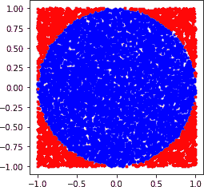

###### 图 3-1\. 在边长为两个单位长度的红色正方形中，单位长度的蓝色圆圈模拟计算π的值，使用蒙特卡洛模拟。

正如 Python 代码所示，你模拟 N 个点随机喷洒以填满整个正方形。接下来我们计算半径为 R 的圆内的 M 个点。圆的面积是 pi × R² = M。正方形的边长是 2R，所以它的面积是 2R × 2R = 4 × R² = N。这意味着圆的面积与正方形的面积的比值是 pi/4 = M/N。因此 pi = 4 × M/N：

```py
# Import modules
import numpy as np
from numpy import random as npr
import matplotlib.pyplot as plt

# Number of iterations in the simulation
n = 100000

# Draw random points from a uniform distribution in the X-Y plane to fill 
#the area of a square that has a side of 2 units
x = npr.uniform(low=-1, high=1, size=n)
y = npr.uniform(low=-1, high=1, size=n)

# Points with a distance less than or equal to one unit from the origin will 
# be inside the area of the unit circle. 
# Using Pythagoras's theorem c² = a² + b²
inside = np.sqrt(x**2 + y**2) <=1

# We generate N random points within our square and count the number of points 
# that fall within the circle. Summing the points inside the circle is equivalent 
# to integrating over the area of the circle. 

# Note that the ratio of the area of the circle to the area of the square is 
# pi*r²/(2*r)² = pi/4\. So if we can calculate the areas of the circle 
# and the square, we can solve for pi
pi = 4.0*sum(inside)/n 

# Estimate percentage error using the theoretical value of Pi
error = abs((pi-np.pi)/np.pi)*100

print("After {0} simulations, our estimate of Pi is {1} with an error of {2}%"
.format(n, pi, round(error,2)))

# Points outside the circle are the negation of the boolean array inside
outside = np.invert(inside)

# Plot the graph
plt.plot(x[inside], y[inside], 'b.')
plt.plot(x[outside], y[outside], 'r.')
plt.axis('square');
```

就像蒙特霍尔模拟一样，你可以从这个模拟的结果中看到 MCS 对 pi 的近似值接近理论值。此外，随着你增加在正方形上喷洒的点数 N，估计值与理论值之间的差异越来越接近 0。这使得正方形和圆形的面积比更加准确，从而给出更好的 pi 的估计值。现在让我们来探讨一下关键的统计概念，这些概念使得 MCS 能够利用随机性来解决复杂问题，无论是否具有解析解。

# 关键统计概念

这里有一些非常重要的统计概念，你需要理解这些概念，这样你就能更深入地理解为什么 MCS 有效，以及如何将其应用于解决金融和投资中的复杂问题。这些概念也是金融、统计和机器学习模型的理论基础。

## 均值和方差

图 3-2 应该可以让你回忆起你在高中学到的基本描述性统计概念。

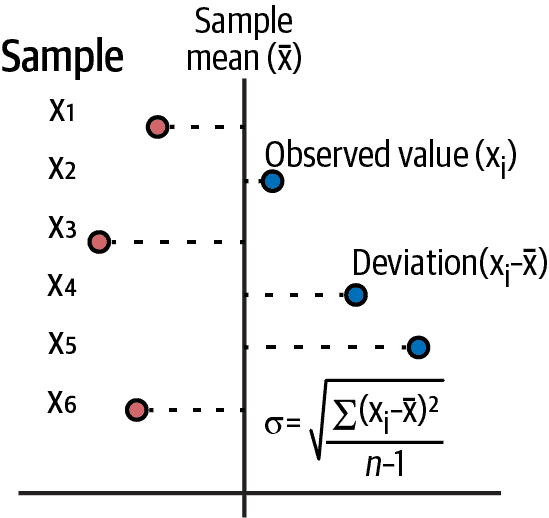

###### 图 3-2\. 样本均值和标准差的公式²

算术平均值是数据点样本中心趋势的一种测量方法。它很容易计算：将样本中的所有点值相加并将总和除以点的总数。数据集中心趋势的其他测量方法是中位数和众数。要记住中位数是将数据集分为上半部分和下半部分的值。虽然算术平均值对异常值很敏感，但中位数不受异常值的影响。众数是数据中观察到的最频繁的值。它也不受异常值的影响。有时一个样本中可能有许多众数，而其他时候众数甚至可能不存在。

需要注意的是，所有值相对于值的算术平均值的偏差的总和总是等于零。这就是使算术平均值成为样本中心趋势的一个好的测量方法的原因。这也是为什么你必须对偏差进行平方使其变为正数，以防它们相互抵消。从平均值得到的平均偏差可以让你对数据样本的分散性或数据样本与其算术平均值的散布情况有一个感觉。

请注意，样本方差通过将平方偏差的总和加起来并将其除以总点数（n）减 1 来计算。您使用 n-1 而不是 n 的原因是，通过计算平均值，您已经失去了一个自由度；即平均值和 n-1 个点将为您提供整个数据集。标准偏差，单位为平均值，是通过取方差的平方根获得的。

资产价格回报的波动性是使用样本回报的标准偏差计算的。如果在金融模型中连续复利回报，如几何布朗运动（GBM）中所假设的，我们使用价格回报的自然对数来计算波动性。这还具有使分析和数值计算变得更加简单的额外优势，因为乘法操作可以转换为其对数的加法。此外，当执行涉及多个小于 1 的值的乘法时，由于计算机固有的数值下溢限制，计算的精度可能会受到影响。

## 期望值：概率加权算术平均数

一种重要的算术平均数类型是交易或投资的期望值。期望值定义为未来支付的概率加权算术平均数：

+   E[S] = P(S[1]) x Payoff(S[1]) + ....+ P(S[n]) x Payoff(S[n])

在金融领域，您应该使用期望值来估计您交易和投资的未来回报。其他用于此目的的测量方法是不完整或具有误导性的。例如，常见的金融新闻网络上的交易员谈论的回报风险比。这种比率是一个不完整的度量标准，因为它没有考虑到正面和负面支付的预计概率。您可以构建一个交易，使其具有任何您想要的回报风险比。它并不能说明您认为支付的可能性有多大。如果回报风险比是您要考虑的关键指标，那么不要浪费时间投资。直接买一张彩票就好了。回报风险比可以超过一亿比一。

## 为什么波动率是一个荒谬的风险测量方法

假设股票 A 的价格一个月上涨 5%，下个月上涨 10%，第三个月上涨 20%。A 的每月复利回报率，即回报的几何平均数，大约为 11.49%，每月标准偏差或波动率为 7.64%。请注意，我们使用图 3-2 中的公式，并且在分母中使用 2，因为此估计是基于三个月的样本。与之相比，股票 B 连续三个月下跌-10%。每月复利回报率将为-10%，但每月波动率将为零。您更希望哪只股票进入您的投资组合？

波动率是一种荒谬的风险度量，因为它将不等于算术平均值（期望的一种度量）的利润视为与同等亏损一样的风险。同样荒谬的是，符合期望的亏损不被视为风险。显然，不管它是否等于回报样本的平均亏损，亏损就是亏损。

波动率不考虑回报分布的方向性，将正向和负向偏差对待得一视同仁。因此，波动率误估了非对称风险。投资者谈论并且不想要的波动性是损失的半标准差。然而，半标准差在分析上是棘手的，并且不适合于金融理论中的优雅公式。

这意味着基于回报波动性的任何风险或绩效度量本质上是有缺陷的。夏普比率衡量资产价格回报超过基准回报并将其除以资产价格回报的波动性。这是一种在学术界和行业中广受欢迎的标准投资绩效指标。然而，许多价值投资者，如沃伦·巴菲特、对冲基金经理和大宗商品交易顾问，都认为夏普比率是一种有缺陷的绩效衡量指标。更糟糕的是，波动性低估了金融风险，我们很快会讨论这一点。

###### 小贴士

如果你投资的正回报未达到预期，并且其结果的波动性让你夜不能寐，你可以放心了，因为帮助即将到来。现在，你可以通过免费转移那些有风险的正回报偏差来降低你的投资回报的波动性！

## 偏度和峰度

偏度衡量了分布关于其算术平均值的不对称性。正态分布的偏度为零。偏度的计算方式类似于方差，但是不是对偏离平均值的平方，而是将其提升到三次方。这样可以保留偏离的正负号，从而给出平均偏离的方向。偏度告诉你期望值（平均值）相对于中位数和众数的分布位置。参见 图 3-3。

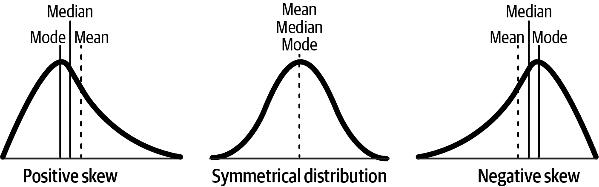

###### 图 3-3\. 与正态分布等对称分布相比的偏态分布³

作为投资者或交易员，你希望你的回报分布尽可能向正偏态发展。在正偏态分布中，期望值将大于中位数，因此它将位于分布的上半部分——平均而言，正回报将超过负回报。正如前面所讨论的，波动性是无方向性的，因此会误估偏态分布的非对称风险。

峰度是衡量分布在算术平均值周围有多陡峭，尾部有多肥厚，与正态分布相比的一种度量。像偏度一样，峰度是通过类似于方差的方法计算的，但不是将偏离均值平方，而是提升到四次方。肥尾分布意味着低概率事件比如果分布是正态的话更有可能发生。均匀分布没有尾巴。事实上，柯西（或洛伦兹）分布看起来与正态分布非常相似，但由于其无限的均值和方差，其尾部非常肥厚，正如在图 3-4 中所示。

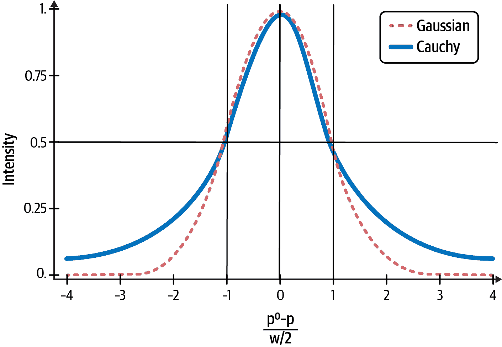

###### 图 3-4. 比较柯西分布的尾部与正态分布⁴

## 高斯或正态分布

高斯分布在自然界中随处可见，并且在所有科学中都被使用。我们经常看到数据呈钟形曲线分布，就像在图 3-5 中展示的那样。这就是为什么高斯分布也被称为正态分布。

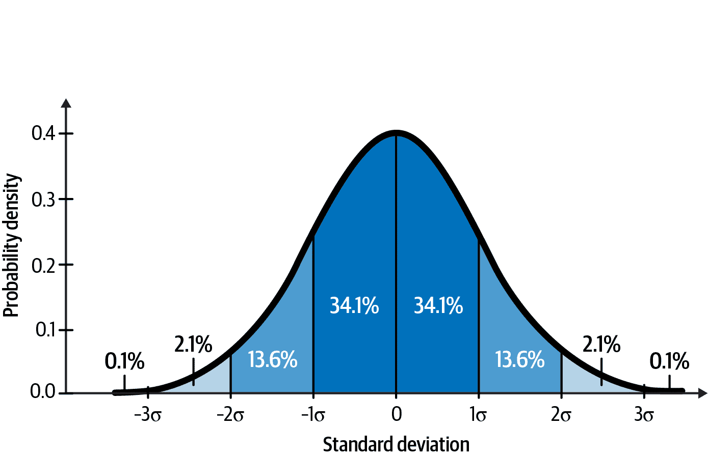

###### 图 3-5. 大约 99.7% 的高斯或正态分布面积落在均值的三个标准差内⁵

不幸的是，金融数据和学术研究显示，正态分布在所有金融市场中并不如此常见。但这并没有阻止大多数学者和许多从业者将其用于他们的模型。为什么？因为高斯分布在解析上可处理，并且适合于不使用计算机就能解决的优雅公式。如果你知道高斯分布的均值和标准差，你就知道关于分布的一切。例如，在图 3-3 中，你可以看到大约 68% 的数据落在均值的一个标准差内，95% 落在两个标准差内，几乎所有数据都落在均值的三个标准差内。

## 为什么波动率低估了金融风险

S&P 500 是一个全球市场指数，作为股票市场的基准，被全球市场参与者广泛使用。该指数代表一个由全球一些顶级公司组成的股权投资组合。基于 S&P 500 的金融工具是世界上最流动的市场，每周运行超过 5 天，全天 24 小时。我可以证明这一点，因为我交易基于该指数的 ETF（交易所交易基金），以及期权和期货。

根据现代投资组合理论（MPT），标准普尔 500 指数的资产价格回报应该大致服从正态分布。它还假设这个分布的均值和方差是平稳的遍历的。这意味着这两个参数是时间不变的，我们可以从任何时间段的一个相当大的样本中估计它们。

在下面的 Python 代码中，我们测试了 MPT 的基本原则，即资产价格回报是正态分布的。我们导入了 30 年的标准普尔 500 价格数据，并计算了其日回报、偏度和峰度：

```py
# Import Python libraries
import pandas as pd
from datetime import datetime
import numpy as np

import matplotlib.pyplot as plt
plt.style.use('seaborn')

# Install web scraper for Yahoo Finance
!pip install yfinance
import yfinance as yf

# Import over 30 years of S&P 500 ('SPY') price data into a dataframe 
# called equity
start = datetime(1993, 2, 1)
end = datetime(2022, 10, 15)
equity = yf.Ticker('SPY').history(start=start, end=end)

# Use SPY's closing prices to compute its daily returns. 
# Remove NaNs from your dataframe.
equity['Returns'] = equity['Close'].pct_change(1)*100
equity = equity.dropna()

# Visualize and summarize SPY's daily price returns. 
# Compute its skewness and kurtosis.
plt.hist(equity['Returns']), plt.title('Distribution of S&P 500 Daily Percentage 
Returns Over the Past 30 Years'), plt.xlabel('Daily Percentage Returns'), 
plt.ylabel('Frequency'), plt.show();
print("Descriptive statistics of S&P 500 percentage returns:\n{}"
.format(equity['Returns'].describe().round(2)))
print('The skewness of S&P 500 returns is: {0:.2f} and the kurtosis is: {1:.2f}.'
.format(equity['Returns'].skew(), equity['Returns'].kurtosis()))
```

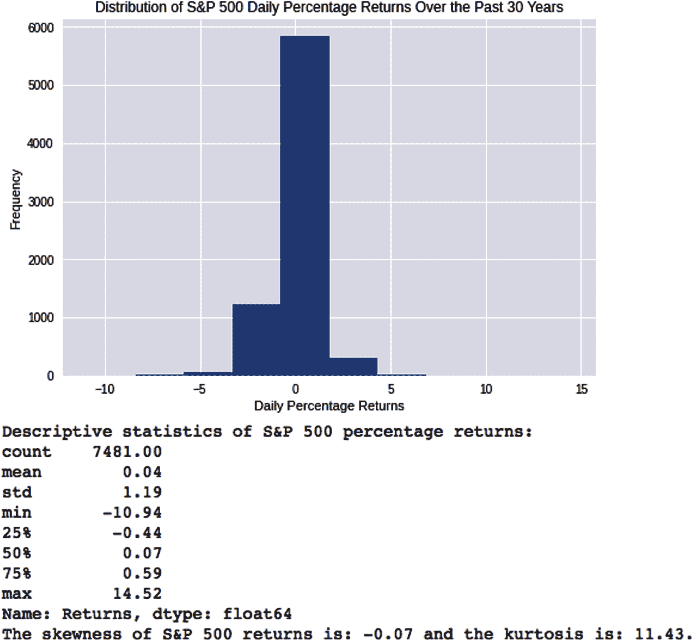

显然，日回报分布看起来与正态分布差别很大。它的负偏度为 0.07，非常厚的尾部，峰度为 11.43。如果标准普尔 500 的日回报真的是正态分布，会是什么样子呢？让我们模拟一下理论金融声称我们应该生活在其中的世界。

MPT 的时间不变原则意味着，我们可以利用来自任何时间段的足够大的样本估计其统计矩。三十年的数据绝对够用。我们使用上述历史数据的均值和标准差作为这些参数的估计值：

```py
# Estimate the mean and standard deviation from SPY's 30 year historical data
mean = equity['Returns'].mean()
vol = equity['Returns'].std()
sample = equity['Returns'].count()

# Use NumPy's random number generator to sample from a normal distribution
# with the above estimates of its mean and standard deviation
# Create a new column called 'Simulated' and generate the same number of 
# random samples from NumPy's normal distribution as the actual data sample
# you've imported above for SPY
equity['Simulated'] = np.random.normal(mean, vol, sample)

# Visualize and summarize SPY's simulated daily price returns.
plt.hist(equity['Simulated']), plt.title('Distribution of S&P 500 Simulated 
Daily Returns'), plt.xlabel('Simulated Daily Percentage Returns'), 
plt.ylabel('Frequency'), plt.show();
print("Descriptive statistics of S&P 500 stock's simulated percentage 
returns:\n{}".
format(equity['Simulated'].describe()))

# Compute the skewness and kurtosis of the simulated daily price returns.
print('The skewness of S&P 500 simulated returns is: {0} 
and the kurtosis is: 
{1}.'.format(equity['Simulated'].skew().round(2), equity['Simulated']
.kurtosis().round(2)))
```

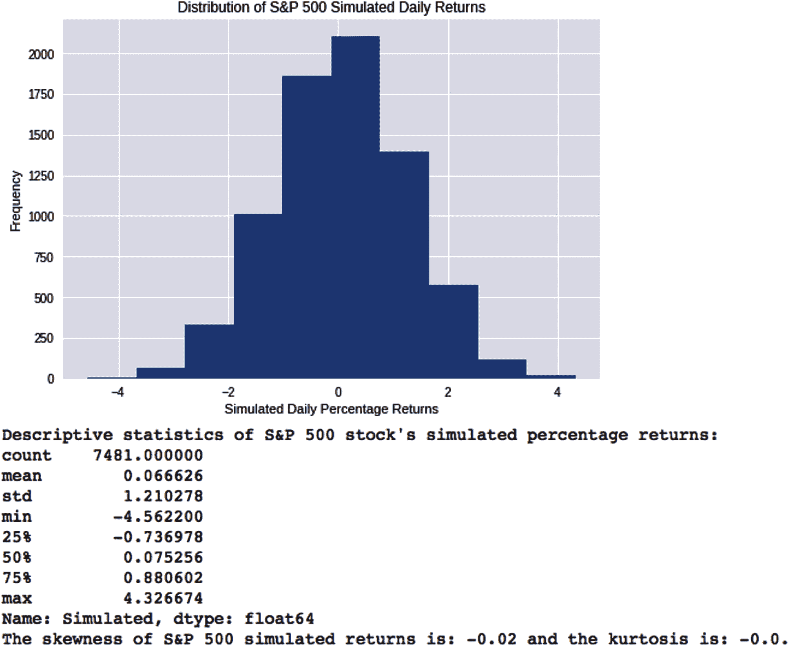

由于我们是从正态分布中随机抽样，偏度和峰度的值在零周围有轻微的抽样误差。无论如何，这两个分布看起来完全不像。过去 30 年的标准普尔 500 日回报显然不是正态分布的。

大多数金融时间序列都是不对称且有厚尾。这些并不是好玩的金融和统计小知识。具有负偏斜和厚尾的资产价格回报分布可能会使投资者、公司和整个经济陷入破产，如果它们的建模者忽视了这些，因为他们会低估极端事件的概率。大金融危机最近提醒了我们，使用忽视科学方法基本原则和真实世界数据中的嘈杂、丑陋和厚尾现实的优雅数学方程建立理论模型可能会带来灾难性后果。

## 大数定理

这是最重要的统计定理之一。大数定理（LLN）说，如果样本是独立的，并且从同一分布中抽取，那么样本均值几乎肯定会随着样本量的增加收敛于理论均值。在图 3-6 中，每次掷骰子所得数字之和除以总掷骰子次数或试验次数的值，在试验次数增加时接近 3.5。

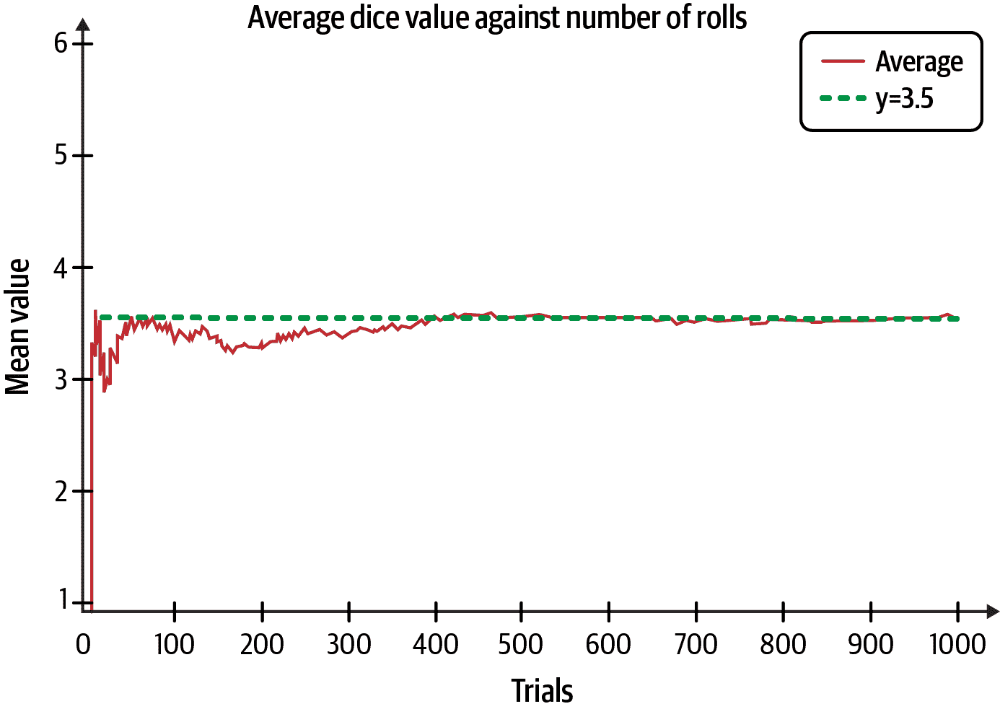

###### 图 3-6\. 骰子投掷的样本均值在样本量增大时逼近其理论均值⁶

请注意，理论平均值不必是物理结果。任何公平骰子上都没有 3.5。此外，请注意前几次试验的结果如何在均值周围广泛变化。然而，从长远来看，它们无情地收敛到理论均值。当然，我们假设骰子是公平的，并且我们不知道掷骰子的物理学。

## 中心极限定理

中心极限定理（CLT）指出，如果你不断从一个未知的任意形状的总体中抽取样本，并计算每个大小为 n 的样本的均值，则这些样本均值的分布将呈正态分布，如 图 3-7 所示。

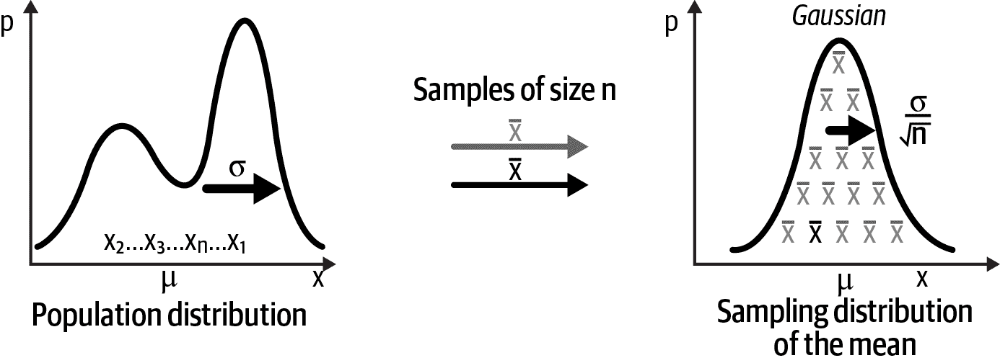

###### 图 3-7\. 样本均值的抽样分布是正态分布⁷

这是最惊人的统计现象之一。要欣赏中心极限定理（CLT）的威力，考虑一个公平的骰子，因为每个数字在骰子上出现的概率都是相等的（1/6）。图 3-8 显示了当你投掷一个公平的骰子并将每次投掷出现的数字相加并重复试验时会发生什么。瞧，CLT 的魔力：水平线变成了近似的钟形曲线。如果我们增加试验或者投掷骰子的次数，曲线将看起来像钟形曲线。

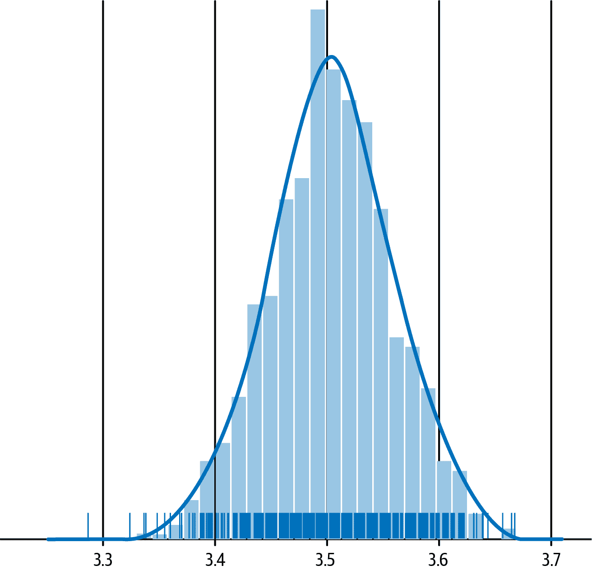

###### 图 3-8\. CLT 显示我们如何将公平骰子的均匀分布转换为近似的高斯分布⁸

# MCS 的理论基础

MCS 基于统计学中已提到的两个最重要的定理：大数定律（LLN）和中心极限定理（CLT）。⁹ 请注意，LLN 确保随着试验次数的增加，样本均值几乎肯定收敛于理论或总体均值。CLT 确保随着样本大小的增大，从理论均值得到的样本平均值的抽样误差或波动成为正态分布。

MCS 起作用并且可扩展到多维问题的原因之一是抽样误差与变量的维度无关。这种抽样误差随着样本大小的平方根而渐近地接近于零，而不是变量的维度。这是非常重要的。这意味着 MCS 中的抽样误差对单个变量和 100 维变量来说是一样的。

然而，误差随着样本大小 n 的平方根而减少。因此，为了使其估计的精度增加一个数量级，你必须将 MCS 迭代增加 100 倍。但随着计算能力日益便宜，这不像上个世纪那样成为大问题。

# 估值软件项目

通过将 MCS 应用于如估值资本项目等真实金融问题，增进我们对 MCS 的理解。在全球范围内，估值资本项目和其他投资（如债券和股票）广泛使用的贴现现金流量（DCF）模型在上一章中详细讨论。贴现现金流量（DCF）模型预测预期的自由现金流（FCF）在 N 期间，通常以年为单位。一个时间段内的自由现金流等于运营活动的现金减去资本支出。模型还需要估计公司投资者每期所需的回报率（R）。这个利率被称为折现率，因为它用于将项目的 N 期自由现金流折现到现在。折现自由现金流的原因是我们需要考虑投资者进行项目投资而不是进行类似风险的其他投资的机会成本。模型分为四个步骤：

1.  预测每个 N 期间项目的预期自由现金流（FCF）。

1.  估计适当的机会成本或每期折现率（R）。

1.  折现每个期望 FCF 回到现在。

1.  将预期折现的 FCF（前述）相加以获得预期的净现值（NPV）：

+   项目的预期 NPV = FCF[0] + FCF[1] / (1 + R) + FCF[2] / (1 + R)² + ...+ FCF[n] / (1 + R)^N

NPV 决策规则表明，您应接受任何其预期 NPV 大于零的投资。这是因为具有正预期 NPV 的投资提供给投资者比类似风险的替代投资更高的回报率，这是他们的机会成本。

要创建我们的 DCF 模型，我们需要关注软件项目的主要成本和收入驱动因素。我们还需要确保这些变量之间没有强相关性。理想情况下，模型的所有 FCF 应该使用非常少的非相关变量或风险因素进行制定。

正如您所知，软件开发是劳动密集型的，因此我们的主要成本驱动因素将是工资和薪水。此外，一些开发人员将在项目上兼职工作，而一些则是全职工作。然而，对于开发劳动成本，我们只需要所需开发人员的全职当量（FTE），即我们估算的努力，就好像所有必需的开发人员都在全职工作。排程是我们将确定分配多少时间以及何时需要每个开发人员的地方：

```py
# Import key Python libraries and packages that we need to process and analyze 
# our data
import pandas as pd
from datetime import datetime
import numpy as np
from numpy import random as npr
import matplotlib.pyplot as plt 
plt.style.use('seaborn')

# Specify model constants per full-time equivalent (fte)
daily_rate = 400
technology_charges = 500
overhead_charges = 200

# Specify other constants
tax_rate = 0.15

# Specify model risk factors that have little or no correlation among them.
# Number of trials/simulations
n = 10000
# Number of full-time equivalent persons on the team
fte = npr.uniform(low=1, high=5, size=n)
# In person days and driven independently by the scope of the project
effort = npr.uniform(low=240, high=480, size=n)
# Based on market research or expert judgment or both
price = npr.uniform(low=100, high=200, size=n)
# Independent of price in the price range considered
units = npr.normal(loc=1000, scale=500, size=n)
# Discount rate for the project period based on risk of similar efforts 
discount_rate = npr.uniform(low=0.06, high=0.10, size=n)

# Specify how risk factors affect the project model
labor_costs = effort * daily_rate
technology_costs = fte * technology_charges
overhead_costs = fte * overhead_charges
revenues = price * units
# Duration determines the number of days the project will take to complete
# assuming no interruption. Different from the elapsed time of the project.
duration = effort/fte

# Specify target_value
free_cash_flow = (revenues - labor_costs - technology_costs - overhead_costs) 
                 * (1 - tax_rate)

# Simulate project NPV assuming initial FCF=0
npv = free_cash_flow/(1 + discount_rate)

# Convert numpy array to pandas DataFrame for easier analysis
NPV = pd.DataFrame(npv, columns=['NPV'])
# Estimate project duration in days
Duration = pd.DataFrame(duration, columns=['Days'])

# Plot histogram of NPV distribution
plt.hist(NPV['NPV'], bins=50), plt.title ('Distribution of Project NPV'), 
plt.xlabel('Project NPV'), 
plt.ylabel('Frequency'), plt.show();
print(NPV.describe().round())
success_probability = sum(NPV['NPV'] > 0)/n *100
print('There is a {0}% probability that the project will have a positive NPV.'
.format(round(success_probability)))
# Plot histogram of project duration distribution
plt.hist(Duration['Days'], bins=50), 
plt.title ('Distribution of Project Duration'), plt.xlabel('Days'), 
plt.ylabel('Frequency'), plt.show();
print(Duration.describe().round())
```

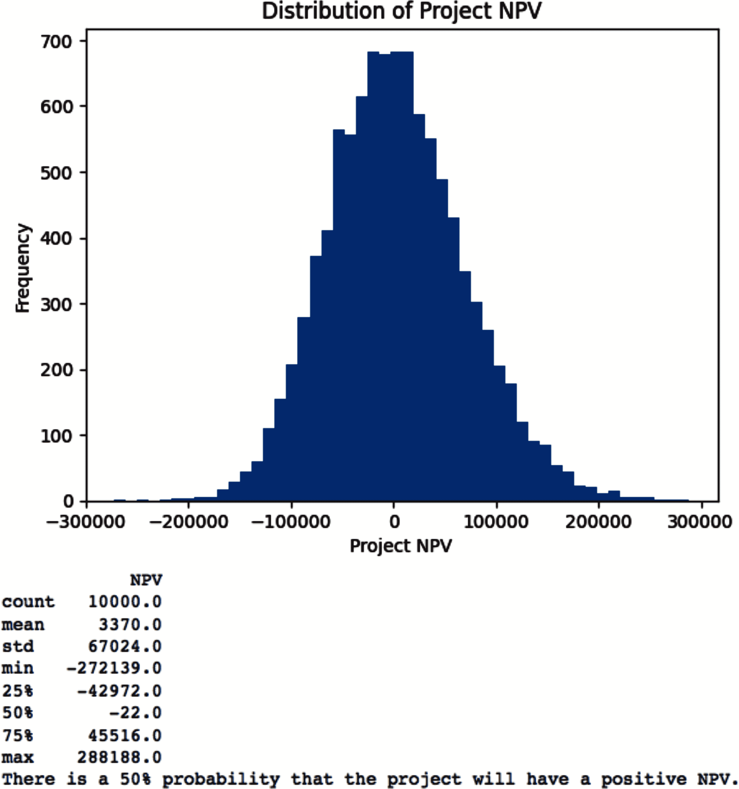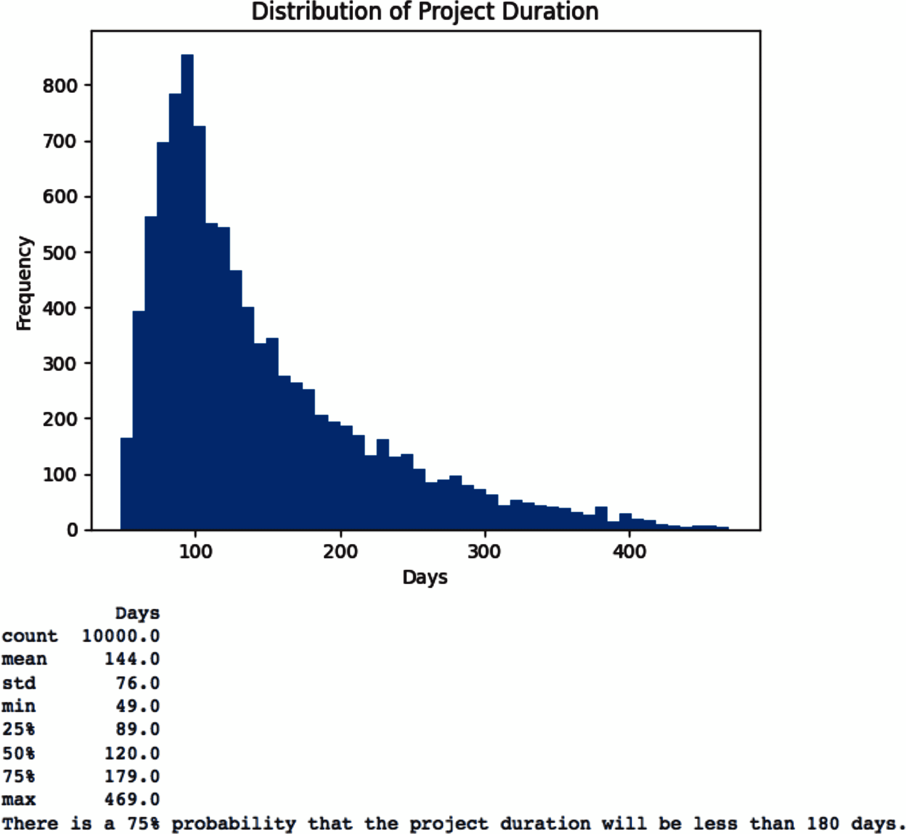

注意，我们没有按无风险利率贴现 FCF 分布。无风险利率是像美国 10 年期票据这样的政府证券的利率。这是 NPV 模拟中的常见错误，但是是不正确的，因为每个模拟都在估计 FCF 的预期值。每个 FCF 需要按风险调整折现率贴现，以考虑项目的总风险。

需要谨慎解释代码输出中风险调整净现值的分布。使用净现值的分散性来做决策将会双重计算项目风险。使用根据无风险利率调整后的净现值的分散性来考虑总体风险在公司财务中没有坚实的理论基础。

# 构建一个完善的蒙特卡洛模拟（MCS）

要利用 MCS 的力量来解决复杂的金融和投资相关问题，在面对不确定性时，遵循一个健全且可复制的过程是非常重要的。以下是一个完成这一目标的 10 步流程：

1.  构建你的模型中目标/依赖变量如何受特征/独立变量（在金融中也称为风险因素）影响的公式。

1.  指定每个风险因素的概率分布。一些常见的包括高斯分布、学生 t 分布、柯西分布和二项式概率分布。

1.  指定初始值和时间的离散化方式，例如秒、分钟、天、周或年。

1.  指定每个风险因素随时间如何变化，如果有的话。

1.  指定每个风险因素如何受其他风险因素影响。这很重要，因为风险因素之间的相关性可能会错误地放大或减弱效果。这种现象也称为多重共线性。

1.  让计算机从每个独立风险因素的概率分布中随机抽取一个值。

1.  根据随机值计算每个风险因素的值。

1.  根据所有风险因素的计算值计算目标/依赖变量。

1.  反复执行步骤 6 至 8 直至必要次数。

1.  记录并分析所有迭代的描述统计数据。

MCS 的威力在于，它将涉及积分微积分的复杂棘手问题转化为使用抽样算法进行描述统计的简单问题。然而，构建一个完善的 MCS 也面临许多挑战。以下是最重要的挑战：

+   指定每个独立变量随时间如何变化。串行相关性（也称为自相关性）是变量与过去自身实例的相关性。这种相关性不是恒定的，通常随时间变化，特别是在金融市场中。

+   指定模型中每个特征/独立变量如何受其他独立变量的影响。独立变量/风险因素之间的相关性通常随时间变化。

+   将理论概率分布拟合到实际结果中。变量的概率分布通常随时间变化。

+   收敛到最佳估计是非线性的，使其变慢且昂贵。它可能不会足够快地发生以对交易或投资产生任何实际价值。

可以如下解决这些挑战：

+   严格的数据分析、领域知识和行业专业知识。你需要在制定严谨的财务建模与时间、成本以及你所生成模型的有效性之间取得平衡。

+   将所有金融模型视为有缺陷和不完美的指导。不要让数学术语使你感到威胁或陷入虚假安全感。记住这句格言：“所有模型都是错误的，但有些是有用的。”

+   管理风险至关重要。始终适当规模化资本位置，具备宽泛的误差边界，并在模型失效时有备用计划。

+   显然，没有什么能替代管理经验和商业判断力。依靠常识，持怀疑态度，并对模型的假设、输入和输出提出困难问题。

# 摘要

从根本上讲，MCS 是一组使用概率分布的随机抽样进行近似估计或模拟模型结果不确定性的数值技术。其核心思想是利用随机性的统计特性来开发复杂确定性模型和解析难题的近似解决方案。MCS 将多维积分微积分中常常难以处理的复杂问题转化为任何从业者都能使用的描述统计问题。

当您尝试解决的问题没有解析可追踪的解时，MCS 尤为有用。它使您能够根据您的假设量化所有可能结果的概率和影响。当传统的最佳、最坏和基础情况分析对您的决策和风险管理可能不足时，应使用 MCS。MCS 使您更好地了解复杂金融模型的风险。蒙特卡洛方法是最强大的数值工具之一，对于概率机器学习至关重要。

在本章中，我们使用独立随机抽样应用了 MCS。这涉及从概率分布中随机选择样本，每个样本与任何先前样本都是独立的。当样本不相关时，这种方法用于模拟简单目标概率分布是有效的。

但是，当处理复杂的目标分布和相关样本时，我们必须使用更先进的相关随机抽样方法。这些依赖性随机抽样蒙特卡洛方法对于概率机器学习至关重要。在第六章中，我们将研究马尔可夫链蒙特卡洛（MCMC）方法，这是从具有依赖性的复杂分布中抽样的强大技术。在第七章中，我们将应用这些方法来进行金融建模，使用 PMC 库。

# 参考文献

Brandimarte, Paolo. *Monte Carlo Simulation: Applications in Financial Engineering, Risk Management, and Economics*. Hoboken, NJ: John Wiley & Sons, 2014.

Cemgil, A. Taylan。“蒙特卡罗方法、马尔可夫链蒙特卡罗和粒子滤波的教程简介”，收录于《*学术出版社信号处理系列：第 1 卷：信号处理理论和机器学习*》，由 Paulo S. R. Diniz、Johan A. K. Suykens、Rama Chellappa 和 Sergios Theodoridis 编辑，1065–1114 页。牛津，英国：Elsevier，2014 年。

¹ Paolo Brandimarte，“蒙特卡罗方法简介”，收录于《*蒙特卡罗模拟手册：金融工程、风险管理和经济应用*》。霍博肯，新泽西州：John Wiley & Sons，2014 年。

² 改编自维基共享资源上的一幅图像。

³ 改编自维基共享资源上的一幅图像。

⁴ 改编自维基共享资源上的一幅图像。

⁵ 改编自维基共享资源上的一幅图像。

⁶ 改编自维基共享资源上的一幅图像。

⁷ 改编自维基共享资源上的一幅图像。

⁸ 改编自维基共享资源上的一幅图像。

⁹ A. Taylan Cemgil，“蒙特卡罗方法、马尔可夫链蒙特卡罗和粒子滤波的教程简介”，收录于《*学术出版社信号处理系列：第 1 卷：信号处理理论和机器学习*》，由 Paulo S. R. Diniz、Johan A. K. Suykens、Rama Chellappa 和 Sergios Theodoridis 编辑，1065–1114 页。牛津，英国：Elsevier，2014 年。
