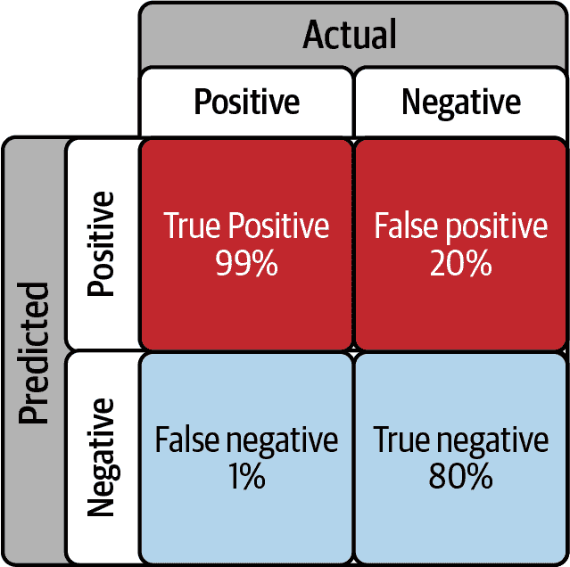
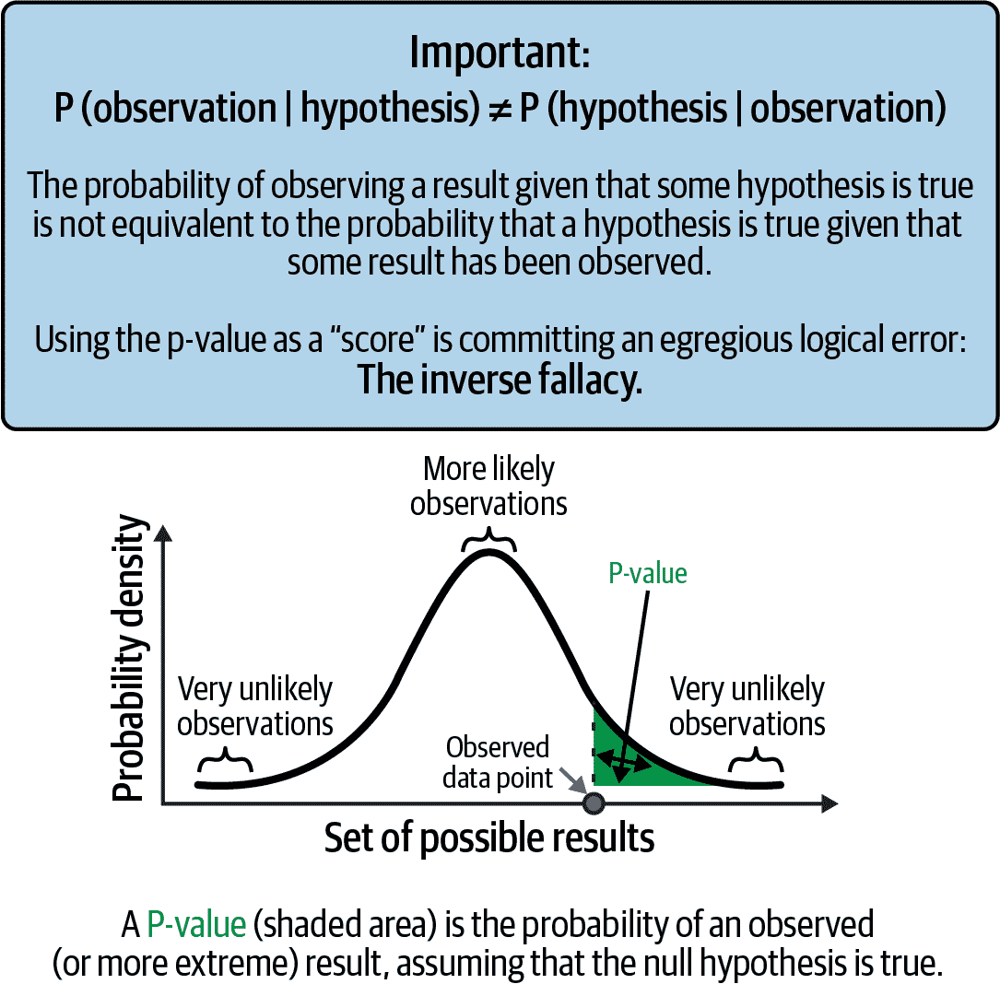
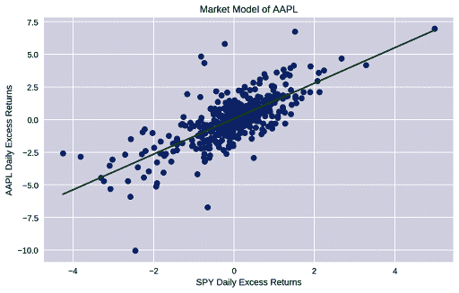
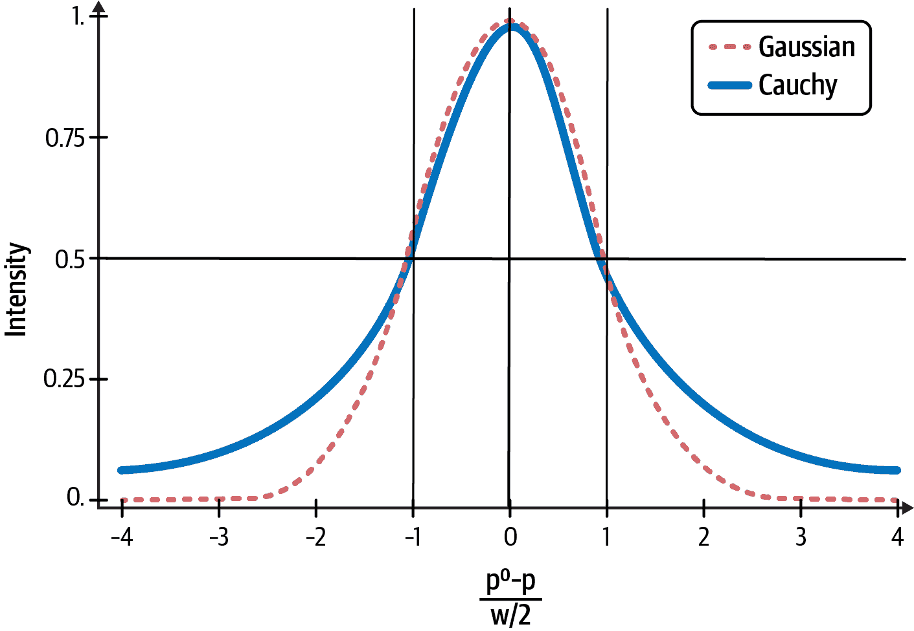

# 第四章。传统统计方法的危险性

> 比毫无用处还要糟糕。
> 
> ——杰兹·内曼，著名数理统计学家，指的是传统统计学建立者 R·A·费舍尔的统计推断方法

回顾来自第一章中，所有金融模型都受到三重错误的影响，即：模型规范错误；模型参数估计错误；以及模型未能适应其环境中结构性变化而产生的错误。因为这些错误，我们需要能够量化我们金融推断和预测中固有不确定性的动态模型。

一种称为零假设显著性检验（NHST）的统计推断方法几乎完全主导了社会和经济科学的研究和实践。在本章中，我们将探讨 NHST 及其 p 值统计如何用于测试假设和量化模型参数的不确定性。NHST 方法的深层逻辑缺陷主要是社会和经济科学中再现性危机的罪魁祸首，这里大多数发表的研究结果都是虚假的。¹ 在接下来的几节中，我们揭露 NHST 及其 p 值统计的统计诡计，并展示它如何犯有检察官谬误。这种谬误是逆谬误的另一种形式，其中条件语句错误地等同于其逆，从而违反了逆概率规则。

鉴于 p 值在量化参数不确定性方面存在深刻缺陷和滥用，² 另一种称为置信区间（CIs）的方法被正统统计学家誉为其数学严谨的替代品。不幸的是，CIs 在数据分析中也是错误的工具，因为它们并非设计用于从单一实验中进行统计推断。³ 更重要的是，在金融中应用 CIs 经常违反中心极限定理（CLT）的假设，使得 CIs 无效。在本章中，我们探讨在金融研究和实践中常见的三种应用 CIs 的错误。我们使用 Python 统计包 Statsmodels 开发了一个普通最小二乘（OLS）线性回归模型来说明这三种错误类型。我们使用回归模型的诊断测试结果来支持我们的理由，说明为什么一般情况下及特别是在金融领域不应使用 CIs 进行数据分析。

# 逆谬误

回顾逆概率规则的证明，这是对乘法规则的一个微不足道的改写。对于任何非零概率事件 H 和 D：

+   *P(H and D) = P(D and H)（概率乘积交换）*

+   *P(H|D) × P(D) = P(D|H) × P(H)（对两边应用乘法规则）*

+   *P(H|D) = P(D|H) × P(H) / P(D)（逆概率规则）*

注意到联合概率，即两个概率的乘积是可交换的，即单个概率的顺序不会改变其乘积的结果：

+   *P(H and D) = P(D and H)*

如你从上一个方程式中看到的，条件概率并不遵守交换律：

+   *P(H|D) ≠ P(D|H)*

这是人们在思考中常犯的逻辑错误，科学家们在使用 NHST 和 p 值时也经常犯这种错误。这被称为逆概率谬误，因为你误将条件概率 P(D|H)与其逆 P(H|D)等同起来，违反了逆概率规则。逆概率谬误也被称为转置条件谬误。举个简单的例子，考虑逆概率谬误如何从陈述 A 错误地推出陈述 B：

+   (A) 假设某人是程序员，很可能他们是分析型的。

+   (B) 假设某人是分析型的，很可能他们是程序员。

但是 P(分析型 | 程序员) ≠ P(程序员 | 分析型)。你知道，有许多许多分析型的人不是程序员，用这种方式框定的推理显得荒谬。然而，你将看到，人类通常并不擅长处理条件陈述及其逆向，尤其是在复杂情况下。事实上，检察官使用这种错误逻辑伪装在论证中已经毁了人们的生活，导致法官和陪审团做出了可怕的推理和决定。⁴ 检察官谬误的一个常见例子大致如下：

+   (A) 假设你们城市的 10 万名成年人中约有 0.1%具有与你相同的血型。

+   (B) 在谋杀案的受害者身上发现了一滴具有你的血型的血迹。

+   (C) 因此，城市检察官声称，有 99.9%的可能性你就是凶手。

这显然是荒谬的。真正令人恐惧的是，研究人员和实践者在统计推断中无意间使用了检察官的谬误逻辑，即在应用 NHST 和 p 值时。关于 NHST 的更多内容将在下一节介绍。我们在本节中揭示检察官在 NHST 方法中的错误推理，让你看看它是如何被使用的。

在发现血迹证据（E）之前，你有罪的概率（G）是 P(G) = 1/100,000，因为这个城市的每个成年人都是同等可能的嫌疑人。因此，你无罪的概率（I）是 P(I) = 99,999/100,000。即使你实际上是无辜的，血迹与你的血型匹配的概率仍然是 0.1%，仅仅因为这种血型在城市成年人口中的普遍性，这意味着 P(E | I) = 0.001。检察官需要估算你有罪的概率 P(G | E)，利用先前提到的概率。检察官没有使用逆概率规则，而是使用以下错误的论点：

+   (A) 根据证据，你可能有罪也可能无罪，所以 P(G | E) + P (I | E) = 1

+   (B) 现在检察官犯了逆谬误，使得 P(I | E) = P(E | I)

+   (C) 因此，检察官的谬误给出了你的 P (G | E) = 1 – P(I | E) = 1 – P(E | I)

+   (D) 填入数字，得到 P(G | E) = 1 – 0.001 = 0.999 或 99.9%

不需要显式地使用逆概率规则，你的律师可以运用一些常识，正确地论述在这个城市有 100 名成年人（0.1% × 100,000）与你相同的血型。因此，仅凭血迹证据，你有罪的概率只有百分之一，即 99%的概率你是无辜的。这与应用逆概率规则得到的概率大致相同，因为它只是一种理解可能性的常识性方法。现在让我们这样做，计算给定证据下你无罪的概率，P(I | E)：

+   (A) 逆概率规则表明 P (I | E) = P(E | I) × P(I)/ P(E)

+   (B) 我们使用总概率法则得到 P(E) = P(E | I) × P(I) + P(E | G) × P(G)

+   (C) 所以 P(I | E) = 0.001 × 0.99999 / [(0.001 × 0.99999) + ( 1 × 0.00001)] = 0.99 或 99%

在检察官将你从嫌疑人名单中除名之前，重要的是注意，现在你的律师也不应请求陪审团忽视血迹作为你有罪的弱证据，基于刚刚计算的 1%条件概率。这种错误的推理被称为辩护律师的谬误，曾在臭名昭著的奥·J·辛普森谋杀案审判中被使用。证据并不薄弱，因为在发现血迹之前，你成为凶手的几率是十万分之一。但是在发现血迹后，你有罪的几率增加了一千倍至百分之一。这确实是非常强有力的证据，没有人应该忽视它。然而，如果这是陪审团面对的唯一证据，那么它完全不足以判决定罪。检察官需要额外的犯罪证据来有效地起诉你。

现在让我们看一个现实的金融情境，反向谬误可能更难以发现。经济衰退在其发展初期通常很难识别。当我写下这一章节（2022 年秋季）时，经济学家和投资者们正在就美国经济当前是否处于衰退或即将进入衰退进行激烈的辩论。经济研究国家局（NBER），负责宣布官方衰退的组织，只能在事后确认这一事实。有时，NBER 需要超过一年的时间才能确定衰退实际开始的时间，就像 2007-09 年的大衰退一样。当然，交易员和投资者不能等那么久，他们会开发自己的指标来实时预测衰退。

假设你开发了一种专有的经济指标，它通过分析各种数据，在美国经济实际处于或即将进入衰退时，99%的时间内正确地发出衰退信号。你还注意到，即使经济不处于衰退状态，你的指标有大约 20%的时间会错误地发出衰退信号。假设你刚刚发现你的专有指标正在发出衰退信号。那么美国经济实际进入衰退的概率是多少？如果你回答是 99%，像许多人本能地做的那样，那么你就犯了反向谬误，因为 P(信号给出衰退|衰退) ≠ P(衰退给出信号)。

让我们看看为什么衰退的概率不是 99%，而是更低。假设 R 是美国经济处于衰退的情况，S 是你的指标发出我们处于衰退的事件。你有以下条件概率：

+   当我们实际处于衰退时，你的指标发出衰退信号的概率为 P(S|R) = 0.99 或 99%。这是其真正的正向率。

+   这意味着当我们实际处于衰退时，你的指标未能检测到衰退的概率为 P(not S|R) = 1 - P(S|R) = 0.01 或 1%。这是其假阴性率。

+   当经济不处于衰退时，你的指标错误地警示你衰退的概率为 P(S|not R) = 0.20 或 20%。这是其假阳性率。

+   类似地，你的指标成功检测到经济不处于衰退状态的概率为 P(not S| not R) = 1 - P(S|not R) = 0.80 或 80%。这是其真正的负向率。

这些条件概率通常以混淆矩阵的形式组织，如图 4-1 所示。

你的目标是估计 P(R|S)，即在你的指标生成这样的信号时，美国经济处于衰退状态的条件概率。为了计算这个逆概率 P(R|S)，你不能只让数据表明一个特定的情景。为什么？因为你的经济指标并不百分百准确。当经济不处于衰退时，它有 20% 的概率给出假的衰退信号。这种情况可能是它误判经济衰退的五种情况之一吗？此外，它有 1% 的概率在经济实际处于衰退时未能检测到衰退。所以也许我们已经在衰退中度过了几个月，而你的指标在 100 次未能发出信号的情况中的 1 次。你怎么可能仅凭数据就了解到这个特定情况？你不能，因为你对自己所处的环境一无所知。你需要利用先验知识，以便理解你进行金融实验的背景。



###### 图 4-1\. 你专有的经济衰退指标的混淆矩阵⁵

你的具体数据集并不知道美国经济衰退的普遍或罕见程度。为什么这个问题很重要？因为你不知道你的假阳性率相对于美国经济衰退发生率是否太高或太低，以至于你的指标是否有用，尽管其真阳性率为 99%。

基于过去的发生情况，你需要估计在任何给定月份美国可能处于衰退状态的概率 P(R)，这被称为特定事件/情景 R 的基础率。忽略基础率将违反逆概率规则并导致无效推断，我们将会证明这一点。

让我们从实际经济数据中计算基础率。美国国家经济研究局（NBER）自 1982 年以来每个月的经济衰退时间序列可以从美联储经济数据（FRED）下载，这是一个流行且免费的数据来源，拥有超过 50 万条经济和金融时间序列。让我们使用以下 Python 代码计算美国经济衰退的月度基础率：

```py
# Import libraries and FRED datareader
import numpy as np
import pandas as pd
import pandas_datareader.data as pdr
from datetime import datetime
start = datetime(1982, 1, 1)
end = datetime(2022, 9, 30)
# NBER business cycle classification
recession = pdr.DataReader('USREC', 'fred', start, end)
# Percentage of time the US economy was in recession since 1982
round(recession['USREC'].sum()/recession['USREC'].count()*100, 2)
```

从这些数据来看，自 1982 年 1 月至 2022 年 9 月，美国每个月只有 9.61% 的时间处于经济衰退中。一旦你估计出 P(R)，你就可以将其插入到总概率法则中，得到无条件概率或边际概率 P(S)，即不考虑经济状况，从你的指标中得到衰退信号的概率。然后，我们使用 P(R) 在逆概率规则中计算出美国经济处于衰退状态的概率，条件是你的专有指标正在发出衰退信号：

+   P(S) = P(S|R) × P(R) + P(S|not R) × P(not R) = (0.99 × 0.096) + (0.2 × 0.904) = 0.276

+   P(R|S) = P(S|R) × P(R) / P(S) = (0.99 × 0.096) / 0.276 = 0.344

对于 P(S) 的计算表明，无论美国经济是否处于衰退期，你都可以预期你的指标将在 27.6%的时间内生成信号。当你看到它闪烁时，P(R|S) 表明在这些场景中只有 34.4%的情况下，信号是关于经济是否处于衰退的正确。你的信号会在 65.6%的时间内给出虚假警报 P(not R|S)。这是一个非常糟糕的指标——你最好忽略它。

这个结果看起来违反直觉，因为你的指标具有 99%的真阳性率 P(S|R)。这是因为你不能掩盖你的指标的假阳性率，漠视美国经济衰退的基础率，用一些意识形态的垃圾来说只让数据说话，这是愚蠢的。因为这样做会否认反向概率规则，并忽视关于美国经济周期的客观先验数据。这样的谬误推断和决策几乎肯定会让你很快破产或失业。

在金融和投资的实际世界中，你需要一个误报率低于基础率的信号，以使你的信号正确的概率大于 50%。为了看到这一点，让我们重新计算，假设修订后的假阳性率为 9%，略低于自 1982 年以来每个月美国经济陷入衰退的 9.61%的基础率：

+   P(S) = P(S|R) × P(R) + P(S|not R) × P(not R) = (0.99 × 0.096) + (0.09 × 0.904) = 0.176

+   P(R|S) = P(S|R) × P(R) / P(S) = (0.95 × 0.0967) / 0.174 = 0.540

有 54%的概率能正确预测经济衰退，你的指标将具有优势或更好的决策和风险管理预期。

总结一下，你的指标的真阳性率很重要。然而，同样重要的是，指标的假阳性率需要低于你抽样的总体基础特征的基础率。所以，如果你忽略你的指标在 20%的情况下生成假阳性 P(S|not R)，而美国经济以 9.61%的基础率生成衰退月份，你的假阳性将以 2 比 1 的比例压倒你的真阳性。现在想想，这样做并不那么离谱，可以认为不道德的检察官、江湖郎中和伪科学家可能会愚弄你（和他们自己）的逆向谬误。

由于你的指标仍然有 34.4% 的机会是正确的，随机性也可能欺骗你，通过给你一个幸运的猜测，而美国经济最终可能陷入衰退。 然而，你对 99% 的概率估计将大大偏离，你的推理将是错误的。 基于运气、错误的推理和糟糕的概率估计的交易或投资策略会很快导致财务破产。 更糟糕的是，像基于逆错误的统计方法 NHST 这样的统计方法会给我们带来大量的假阳性研究，造成混乱和伤害。 这将毁掉我们珍视和重视的科学企业。

# NHST 对检察官谬误负有责任

现代统计学的主要创始人罗纳德·费舍尔在 1920 年代引入了 NHST。 他还将卡尔·皮尔逊的 p 值引入了他的方法中，用于量化不确定性。 这是一种后数据的方法，旨在使研究人员能够根据一个与他们试图证明的假设相反的零假设对单个实验进行统计推断。

在 1925 年，费舍尔发表了荒谬而毫无根据的言论：“逆概率理论建立在错误之上，必须完全被拒绝。”⁶ 当然，费舍尔没有也不能为这一言论提供任何证据。 他怎么能呢？ 那就相当于证明了除法规则是错误的。 正如前一章所述，我怀疑通过将该规则改名为业余数学家托马斯·贝叶斯后，他可以对该规则进行诋毁。 通过拒绝逆概率规则，费舍尔能够利用检察官谬误来推广他错误的歧视性观念，假装客观和“让数据自说自话。”⁷ 费舍尔在工业界的谄媚同伙和学术界的盲目信徒仅仅重复了关于逆概率理论的谎言，并将其从他们的实践和课程中驱逐出去——这个问题直到今天仍然存在。

NHST 是建立在一个称为反证法的有效命题逻辑的外观后面的。 逻辑如下：假设我们有两个命题 H 和 D，使得如果 H 为真，则 D 为真。 现在如果我们可以证明 D 为假，则我们可以合理地得出结论 H 必须为假。

按照后一种逻辑，使用 NHST 的研究人员制定了一个假设，称为零假设（H[0]），他们希望在观察任何数据之前证明其错误。 H[0] 被视为替代研究假设（H[1]）的否定，而后者并未明确指定，即，H[1] = not H[0] 并且 P(H[1]) + P(not H[0]) = 1\. 在这方面，他们为零假设担任了魔鬼的代言人。

零假设通常被制定为摘要统计量，比如需要比较两组数据分布的样本均值之差。重要的是要注意，研究人员不预测他们的研究假设 H[1]预计会产生的数据。

在开始实验之前，研究人员还会选择一个显著性水平，由α表示，这作为在观察数据后接受或拒绝零假设的决策阈值。传统上将α设定为 5%。α水平被声称是研究人员可能错误地拒绝真实零假设的长期概率，从而犯下第一类错误并生成假阳性结果（声称结果为真实而实际为假）。α水平是实验中最关键的元素，因为它决定了实验是否被认为具有统计学显著性。

需要注意，任何显著性水平完全是主观的，因为它不基于观察到的数据、零假设、科学原因、任何数学规则或定理。传统上使用 5%的α水平是完全任意和自证预言的仪式。由于费歇尔使用了 5%的α显著水平，研究人员和学术界盲目地效仿他的例子。这对于频率学派所吹嘘的客观性和科学严谨来说，无疑是一个让数据说话的遗漏。

假设零假设为真，研究人员计算一个称为 p 值的统计量，以量化观察到的样本数据（D）的摘要统计量或比它更极端的东西的概率：

+   p 值 = P(D|H[0])

如果 p 值 ≤ α，那么在α显著水平上将 H[0]作为假的拒绝，同时接受备择假设（H[1]）作为真实。

但 NHST 的这种逻辑是极其荒谬的。通过拒绝零假设（H[0]）给定测试统计量（D）的 p 值，研究人员犯了逆谬误，因为 P(H[0] | D) ≠ P(D | H[0])。参见图 4-2。



###### 图 4-2\. 如何在 NHST 中使用 p 值⁸

NHST 还做了更荒谬的逻辑跳跃。NHST 通过允许研究人员接受未指定的备择研究假设来犯下检察官的谬误，而这些数据在最初并未建模。回到上一节，重新了解我们如何解开检察官的谬误。

研究者想要确定 P(H[1]|D)，即在给定数据的情况下研究假设（H[1]）成立的概率。但 NHST 只计算 P(D|H[0])，即假设零假设（H[0]）成立的情况下观察到数据的概率。然后它使用 p 值统计量在显著性水平 α 下接受或拒绝零假设。因此，遵循 NHST 方法的研究者会犯下检察官谬误，如下所述：

+   P(H[1]|D) = 1 – P(H[0]|D)（正确陈述）

+   P(H[0]|D) = P(D|H[0])（逆向谬误）

+   P(H[1]|D) = 1 – P(D|H[0])（检察官谬误）

如何有效计算 P(H[1]|D)？在确定性世界中，证明反证法的二元逻辑需要转化为不确定世界中条件概率的微积分。这种转化由反向概率规则和全概率法则实现，正如前一节中所应用的：

+   P(H[1]|D) = 1 – P(H[0]|D)

+   P(H[1]|D) = 1 – [P(D|H[0])P(H[0])/P(D)]

+   **P(H[1]|D) = 1 – [P(D|H[0])P(H[0]) / (P(D|H[0])P(H[0]) + P(D|H[1])P(H[1]))]**

正如我所推导的这个方程所示，研究者需要估计 P(D|H[1])，即在研究假设 H[1] 成立的情况下观察到数据的概率。更重要的是，研究者需要估计至少一种补充假设的先验概率或基本比率，即 P(H[0]) 或 P(H[1])。因为没有基本比率，你就无法计算证据或观察到数据的无条件概率。这种谬误的逻辑正是使得关于零假设或替代研究假设的统计推断无效的原因。杰兹·奈曼，一位杰出的统计学家和费希尔的同行，称费希尔在统计推断上的工作“比无用还要糟糕”。⁹

显而易见，假设检验（NHST）——社会和经济科学教育、研究和实践的基石——犯了检察官谬误。难怪大多数使用 NHST 发表的研究发现都是错误的。NHST 浪费了数十亿的研究经费，败坏了科学的声誉，并通过其错误的阳性研究结果严重损害了人类利益。尽管多次失败地试图废除或改革它超过半个世纪，但 NHST 仍然在社会和经济科学领域造成严重破坏，产生了太多错误的研究主张至今仍然存在。¹⁰ 现在是时候拒绝 NHST，因为它“是建立在错误之上的，必须完全拒绝。”¹¹

许多社会和经济科学家建议用置信区间理论替代 p 值，后者被吹捧为一种更数学严谨的量化不确定性的方式。因此，让我们研究置信区间理论，看看它是否有用。

# 信心游戏

正如前面边栏中提到的，杰尔齐·尼曼开发了一种旨在支持工业质量控制的统计决策理论。他的统计理论提供了一个决策框架，旨在通过多次实验来平衡长期成本与收益，控制类型 I（假阳性）和类型 II（假阴性）错误。尼曼故意忽略了 p 值，因为它违反了基本的概率逻辑，是一个无意义的概念。

1937 年，尼曼开发了置信区间理论作为统计推断的 *前数据理论*，旨在在从总体分布中抽取数据之前，为统计程序提供长期平均特性。尼曼非常清楚地表明，他的置信区间理论并非旨在支持在单个科学实验中从数据中进行推断的 *后数据理论*。尽管今天在社会和经济科学的研究与实践中如何应用，但置信区间理论并非统计推断的 *后数据理论*。

置信区间理论量化了对总体参数估计的不确定性。例如，如图 4-3 所示的 90% 置信区间 (CI)，通常理解为参数的真值有 90% 的概率落在区间 [–a, a] 内。

![区间 [–a, a] 被称为 90% 置信区间。](assets/pmlf_0403.png)

###### 图 4-3\. 区间 [–a, a] 被称为 90% 置信区间¹³

费歇尔批评尼曼的置信区间理论，称其不符合科学家的需求，可能会导致从数据中得出互相矛盾的推断。费歇尔对置信区间理论的批评已被证明是有道理的，但并非因为尼曼的置信区间理论在逻辑或数学上存在缺陷，正如费歇尔所说的那样。

让我们来检查由于常见做法误用尼曼的置信区间理论作为后数据理论而产生的三类错误——即基于特定数据样本推断总体参数。使用置信区间产生的三种错误类型包括：

+   对总体参数进行概率声明

+   对特定置信区间进行概率声明

+   对抽样分布进行概率声明

频率学概率和统计推断的哲学对金融经济学的理论和实践产生了深远影响，特别是置信区间（CIs）。为了探讨置信区间在我们研究中的意义，我们从讨论简单市场模型的基本概念及其与金融理论的关系开始下一小节。随后，我们使用 Python 中的统计包 Statsmodels 构建股票回报的普通最小二乘线性回归模型，以估计我们市场模型的参数。这个实际例子使我们能够说明置信区间在金融数据分析中的实际应用。在接下来的章节中，我们探讨为什么置信区间在逻辑上不一致且实际上无用。

## 股票的单因子市场模型（MM）

现代投资组合理论假设理性、风险厌恶的投资者要求风险溢价，即超过无风险资产（如国库券）的回报，以投资风险资产如股票。股票的单因子市场模型（MM）基本上是股票的实现超额回报（结果或因变量）与单一风险因子的实现超额回报（预测或自变量）之间的线性回归模型，如此处所示：

+   ( R − F ) = α + β × ( M − F ) + ϵ

其中 *R* 是股票的实现回报率，*F* 是无风险资产的回报率，例如美国国债证券，*M* 是市场投资组合的实现回报率，例如标准普尔 500 指数，*α*（阿尔法）是预期的股票特定回报率，*β*（贝塔）是与市场的系统风险暴露水平，*ε*（伊普西隆）是意外的股票特定回报率。股票的贝塔值表示对整体市场投资组合回报率变化 1%的平均百分比回报响应。例如，如果一支股票的贝塔为 1.4，并且标准普尔 500 指数下跌了 1%，则预计股票平均下跌–1.4%。见 Figure 4-4。



###### 图 4-4\. 市场模型显示苹果公司（AAPL）的超额回报与标准普尔 500 指数的超额回报回归关系

注意，资产的市场模型（MM）与其资本资产定价模型（CAPM）不同。CAPM 是现代金融的关键经济均衡模型，根据其贝塔或对整体市场的系统风险暴露预测资产的预期回报。与 CAPM 不同，资产的 MM 是一个关于实现回报的统计模型，其制定中包括特异风险项 *ɑ* 和误差项 *ɛ*。

根据 CAPM，资产的 MM 的 alpha 有一个预期值为零，因为市场参与者被假设持有有效的投资组合，可以分散任何特定资产的特异风险。市场参与者只因承担系统性风险而受到奖励，因为它无法被分散掉。与 OLS 回归模型的一般假设一致，CAPM 和 MM 都假设残差 *ɛ* 的期望值将服从零均值和恒定有限方差的正态分布。

一个依赖现代投资组合理论和实践的金融分析师假设有一个基础的、时间不变的、随机过程来生成苹果公司的价格数据，这可以被建模为 OLS 线性回归 MM。这个 MM 将有人口参数，alpha 和 beta，它们有真正的、固定的值，可以从苹果的收盘价数据的理性随机样本中估计出来。

## 使用 Statsmodels 的简单线性回归

让我们运行我们的 Python 代码，基于五年的苹果每日收盘价格样本来估算 alpha 和 beta。只要在公式中一致使用，我们可以使用任何持有期回报。使用每日持有期是方便的，因为它可以使用 pandas 数据帧轻松进行价格回报计算：

```py
# Install Yahoo finance package
!pip install yfinance

# Import relevant Python packages
import statsmodels.api as sm
import pandas as pd
import yfinance as yf

import matplotlib.pyplot as plt
plt.style.use('seaborn')
from datetime import datetime
#Import financial data
start = datetime(2017, 8, 3)
end = datetime(2022, 8, 6)

# S&P 500 index is a proxy for the market
market = yf.Ticker('SPY').history(start=start, end=end)
# Ticker symbol for Apple, the most liquid stock in the world
stock = yf.Ticker('AAPL').history(start=start, end=end)
# 10 year US treasury note is the proxy for risk free rate
riskfree_rate = yf.Ticker('^TNX').history(start=start, end=end)
# Create dataframe to hold daily returns of securities
daily_returns = pd.DataFrame()
daily_returns['market'] = market['Close'].pct_change(1)*100
daily_returns['stock'] = stock['Close'].pct_change(1)*100
# Compounded daily rate based on 360 days 
# for the calendar year used in the bond market
daily_returns['riskfree'] = (1 + riskfree_rate['Close']) ** (1/360) - 1
# Plot and summarize the distribution of daily returns
plt.hist(daily_returns['market']), plt.title('Distribution of Market (SPY) 
Daily Returns'), plt.xlabel('Daily Percentage Returns'), 
plt.ylabel('Frequency'), plt.show()
# Analyze descriptive statistics
print("Descriptive Statistics of the Market's daily percentage returns:\n{}".
format(daily_returns['market'].describe()))

plt.hist(daily_returns['stock']), 
plt.title('Distribution of Apple Inc. (AAPL) Daily Returns'), 
plt.xlabel('Daily Percentage Returns'), plt.ylabel('Frequency'), plt.show()
# Analyze descriptive statistics
print("Descriptive Statistics of the Apple's daily percentage returns:\n{}"
.format(daily_returns['stock'].describe()))

plt.hist(daily_returns['riskfree']), plt.title('Distribution of the riskfree 
rate (TNX) Daily Returns'), plt.xlabel('Daily Percentage Returns'), 
plt.ylabel('Frequency'), plt.show()
# Analyze descriptive statistics
print("Descriptive Statistics of the 10 year note daily percentage returns:\n{}"
.format(daily_returns['riskfree'].describe()))
# Examine missing rows in the dataframe
market.index.difference(riskfree_rate.index)
# Fill rows with previous day's risk-free rate since daily rates 
# are generally stable
daily_returns = daily_returns.ffill()
# Drop NaNs in first row because of percentage calculations
daily_returns = daily_returns.dropna()
# Check dataframe for null values
daily_returns.isnull().sum()
# Check first five rows of dataframe
daily_returns.head()
# AAPL's Market Model based on daily excess returns

# Daily excess returns of AAPL
y = daily_returns['stock'] - daily_returns['riskfree']
# Daily excess returns of the market
x = daily_returns['market'] - daily_returns['riskfree']

# Plot the data
plt.scatter(x,y)

# Add the constant vector to obtain the intecept
x = sm.add_constant(x)

# Use ordinary least squares algorithm to find the line of best fit
market_model = sm.OLS(y, x).fit()

# Plot the line of best fit
plt.plot(x, x*market_model.params[0]+market_model.params['const'])
plt.title('Market Model of AAPL'), plt.xlabel('SPY Daily Excess Returns'), 
plt.ylabel('AAPL Daily Excess Returns'), plt.show();

# Display the values of alpha and beta of AAPL's market model
print("According to AAPL's Market Model, the security had a realized Alpha of 
{0}% and Beta of {1}".format(round(market_model.params['const'],2), 
round(market_model.params[0],2)))
# Summarize and analyze the statistics of your linear regression
print("The Market Model of AAPL is summarized below:\n{}"
.format(market_model.summary()));
```

运行我们的 Python 代码后，一个金融分析师会估计 alpha 为 0.071%，beta 为 1.2385，如 Statsmodels 摘要输出所示：

```py
The Market Model of AAPL is summarized below:
OLS Regression Results
=========================================================================
Dep. Variable:      y                       R-squared:          0.624
Model:              OLS                     Adj. R-squared:     0.624
Method:             Least Squares           F-statistic:        2087.
Date:               Sun, 07 Aug 2022        Prob (F-statistic): 2.02e-269
Time:               06:28:33                Log-Likelihood:     -2059.8
No. Observations:   1260                    AIC:                4124.
Df Residuals:       1258                    BIC:                4134.
Df Model:           1
Covariance Type:    nonrobust 
========================================================================
        coef        std err     t        P>|t|     [0.025      0.975]
const   0.0710      0.035     2.028      0.043     0.002       0.140
0       1.2385      0.027     45.684     0.000     1.185       1.292
========================================================================
Omnibus:        202.982             Durbin-Watson:          1.848
Prob(Omnibus):  0.000               Jarque-Bera (JB):       1785.931
Skew:           0.459               Prob(JB):               0.00
Kurtosis:       8.760               Cond. No.               1.30
======================================================================
Warnings:
[1] Standard Errors assume that the covariance matrix of the errors 
is correctly specified.

```

## Alpha 和 Beta 的置信区间

显然，alpha 和 beta 的这些点估计将取决于样本大小以及在我们的随机样本中使用的起始日期和结束日期，每个估计都反映了苹果在该特定时间段内的特异价格波动。尽管人口参数 alpha 和 beta 是未知的，可能是不可知的，但金融分析师认为它们是随机过程的真实常数。正是对苹果价格数据的随机抽样引入了对常数人口参数估计的不确定性。频率派将数据及其派生的每个统计量，如 CIs，视为随机变量。金融分析师从随机样本中计算 CIs，以表达围绕常数人口参数点估计的不确定性。

置信区间提供了一个值范围，附有概率值或显著性水平。例如，在苹果的 MM 中，财务分析师可以通过计算 alpha 和 beta 的标准误差（SE）来计算 95%置信区间。由于假定残差ɛ服从未知且恒定方差的正态分布，需要使用 t 统计量来计算置信区间。然而，由于样本量大于 30，t 分布收敛于标准正态分布，t 统计量的值与标准正态分布的 Z 分数相同。因此，分析师会将每个 SE 乘以+/– 95%置信区间的 Z 分数，然后将结果加到 alpha 和 beta 的点估计上以获取其置信区间。从之前的 Statsmodels 回归结果来看，alpha 和 beta 的 95%置信区间如下计算：

+   α+/–（SE × t-statistic / Z-score for 95% CI）= 0.0710 % +/– (0.035 % × 1.96) = [0.002%, 0.140%]

+   β+/-（SE × t-statistic / Z-score for 95% CI）= 1.2385 +/– (0.027 × 1.96) = [1.185, 1.292]

# 揭示信心游戏

要理解这三个错误，我们需要从现代统计学家的角度理解概率和统计推断。正如在第二章中讨论的那样，例如费希尔和内曼等频率主义者声称概率是事件的自然静态属性，并且作为其长期相对频率来经验测量。

频率主义者假设生成数据的潜在随机过程具有长期不变的统计特性：概率分布是静止的遍历过程。即使这些潜在过程的参数可能是未知或无法知道的，频率主义者认为这些参数是恒定的并具有“真实”的值。可以从数据的随机样本中估计总体参数。数据的随机性导致对真实的固定总体参数的估计存在不确定性。

大多数人认为从 95%置信区间得到的是真实总体参数在特定数据样本计算的*特定*区间内的 95%概率。例如，根据 Statsmodels 的结果，你可能会认为苹果的贝塔值的真实值有 95%的概率在[1.185, 1.292]的范围内。严格来说，你对这样的置信区间的解释是错误的。

根据**Neyman 的置信区间理论**，95%的置信区间实际上意味着，如果我们从苹果公司潜在的股票回报分布中抽取 100 个随机样本，我们将得到 100 个不同的置信区间，我们可以确信其中 95 个将包含真实的总体参数在其限制范围内。然而，我们不会知道这 100 个置信区间中的具体 95 个包含了总体参数的真实值，以及哪 5 个没有包含。我们可以肯定的是，只有包含总体参数的置信区间与不包含总体参数的置信区间的比率在长期抽样中接近 95%。

温斯顿·丘吉尔在谈论 CIs 时，可以说他也在谈论俄罗斯的世界战略，他说：“这是一个谜团，包裹在谜中，里面还有一个谜题；但或许有一把钥匙。”事实上，在本章节中我们确实提供了一个关键。让我们探讨在金融数据分析中误用置信区间作为后数据理论时产生的三重谬误。

## 关于总体参数概率性声明的错误

记住，频率主义统计学家认为总体参数是一个具有“真实”值的常数。这个值可能是未知的，甚至是无法知道的。但这并不改变其值是固定的事实。因此，一个总体参数要么在一个置信区间内，要么不在。例如，如果你相信资本市场高度有效的理论，你也会相信 alpha 的真实值是 0。现在 0 明显不在先前 Statsmodels 回归结果中计算的[0.002%，0.14%]的区间内。因此，alpha 在我们的置信区间内的概率是 0%，而不是 95%或其他任何值。

因为频率主义者认为总体参数是恒定的，所以对它们不会有任何歧义：在任何置信区间内总体参数的真实值的概率要么是 0%，要么是 100%。因此，在频率主义的概率解释下对任何总体参数做出概率性的声明是错误的。

## 关于特定置信区间概率性声明的错误

文献和教科书中更复杂的置信区间解释如下：假设我们要重复进行线性回归多次，区间[1.185, 1.292]将大约 95%的时间内包含 beta 的真实值。

记住，频率主义世界中的概率仅适用于*可重复*事件的长期频率。根据定义，一个唯一事件（如特定置信区间）的概率在频率主义者看来是未定义的，毫无意义。因此，频率主义者不能为我们计算的特定 alpha 和 beta 区间之一分配 95%的概率。换句话说，我们不能从特定置信区间推断出太多信息。

但这正是我们的主要目标！置信区间的这种限制使得它对于希望从他们的具体数据样本中推断总体参数的数据科学家来说毫无用处：即，他们想要进行后数据推断。但是，正如之前提到的，内曼打算他的置信区间理论仅用于基于长期频率的前数据推断。

## 在进行抽样分布的概率性声明时出现的错误

金融分析师如何证明在研究和实践中对置信区间（CIs）做出这些概率性声明的合理性？他们如何解决这个难题？以一种常识性的方式应用置信区间的关键是什么？统计学家可以在理论上或实践中，从总体分布中重复抽取数据。从许多不同的随机样本计算出的样本均值的点估计产生了一个称为样本均值的抽样分布的模式。抽样分布使频率主义者能够调用中心极限定理（CLT）来计算样本点估计的总体参数的不确定性。特别地，正如在前一章中讨论的那样，CLT 指出，如果从具有有限均值和方差的总体中随机抽取许多样本，则样本均值的抽样分布会渐近地趋于正态分布。潜在总体分布的形状无关紧要，只能影响到正态分布的这种不可避免的收敛速度。请参见前一章中的图 3-7。

频率主义概率的定义为可重复事件的长期相对频率与 CLT 从总体分布中重复抽取随机样本以生成其抽样分布的重复绘制相 resonates 。因此，统计学家通过调用 CLT 并声称他们的抽样分布几乎肯定会收敛到正态分布，而不管潜在总体分布的形状如何来解决这个难题。这也使他们能够使用标准正态分布的 Z 分数来计算置信区间，就像前面的 Statsmodels 回归结果所示的那样。这就是将置信区间用作后数据理论的关键。

然而，作为将我们的资本置于风险中的财务主管和投资者，我们需要仔细阅读中心极限定理（CLT）的细则：具体来说，我们需要注意其假设，即基础总体分布需要有有限的均值和方差。虽然大多数分布满足这两个条件，但在金融和经济领域尤其存在许多不满足这些条件的分布。对于这些类型的总体分布，CLT 不能被用来支撑置信区间。这把钥匙对这些门没有用—它不是魔法钥匙。例如，柯西分布和帕累托分布是具有无限均值或方差的厚尾分布。正如在前一章中提到并值得重复的是，柯西（或洛伦兹）分布看起来与正态分布非常相似，但由于其无限方差，尾部非常厚。见图 4-5。

Statsmodels 计算的诊断测试在图 4-4 中告诉我们，股票市场已经破坏了我们的 MM 的关键假设。具体来说，Bera-Jarque 和 Omnibus 正态性测试显示，残差*ɛ*几乎可以肯定不是正态分布的概率为零。这个分布是正偏斜的，尾部非常厚—其峰度约为标准正态分布的三倍。



###### 图 4-5\. 比较柯西分布与正态分布¹⁴

增大样本量会使残差分布更加正态吗？这是否符合金融理论的说法？让我们使用 25 年的苹果每日收盘价格数据来运行我们的 MM。以下是结果：

```py
The Market Model of AAPL is summarized below:
OLS Regression Results
=========================================================================
Dep. Variable:      y                       R-squared:          0.270
Model:              OLS                     Adj. R-squared:     0.270
Method:             Least Squares           F-statistic:        2331.
Date:               Sun, 07 Aug 2022        Prob (F-statistic): 0.00
Time:               07:03:34                Log-Likelihood:     -14187.
No. Observations:   6293                    AIC:                2.838e+04
Df Residuals:       6291                    BIC:                2.839e+04
Df Model:           1
Covariance Type:    nonrobust 
========================================================================
        coef        std err     t        P>|t|     [0.025      0.975]
const   0.1063      0.029     3.656      0.000     0.049       0.163
0       1.1208      0.023     48.281     0.000     1.075       1.166
========================================================================
Omnibus:        2566.940             Durbin-Watson:          2.020
Prob(Omnibus):  0.000                Jarque-Bera (JB):       66298.825
Skew:          -0.736                Prob(JB):               0.00
Kurtosis:       53.262               Cond. No.               1.25
======================================================================
Warnings:
[1] Standard Errors assume that the covariance matrix of the errors 
is correctly specified.

```

所有诊断测试结果清楚地表明，股票市场已经摧毁了“诺贝尔奖获得者”CAPM（以及相关的 MM）理论。即使包含了四分之一世纪的每日收盘价格样本量，我们模型的残差分布也比以前更加非正态。现在它非常负偏斜，峰度非常高—几乎是标准正态分布的 18 倍。尤其值得注意的是，我们 25 年贝塔的置信区间是[1.075, 1.166]，这超出了我们 5 年贝塔的置信区间[1.185,1.292]。事实上，AAPL 的贝塔似乎正在趋向于 1，即标准普尔 500 的贝塔值。

调用某些 CLT 版本并声称我们回归模型的残差或系数的抽样分布具有渐近正态性似乎是徒劳无益，如果不是无效的话。有大量经济研究表明，所有金融资产价格回报的底层分布都没有有限的方差。金融分析师不应如此确信他们可以召唤 CLT 的力量并在其置信区间计算中断言渐近正态性。此外，他们需要确保渐近正态性的收敛速度是相当快的，因为正如著名经济学家梅纳德·凯恩斯通过他的个人股权投资艰难地发现的，“市场可以在你破产之前保持不理性很长时间。”¹⁵ 对于一笔股票交易来说，一个季度已经是一个永恒了。

# 摘要

因为本章节详细讲述了 NHST、p 值和置信区间的错误，我对它们（或 CAPM）毫无信心，并且在我的金融数据分析中不使用它们。基于 Statsmodels 或任何其他软件应用程序计算的经验主义 MM 的估计置信区间α和β，我不会浪费一分钱进行交易或投资。任何使用 NHST、p 值或置信区间的社会或经济研究我也会直接扔进垃圾桶，因为那里才是垃圾应该待的地方，而不应该被回收利用。

由 Neyman 和 Pearson 发展的统计假设检验只有在像工业质量控制这样的机械过程中作为前数据决策理论才有意义。Fisher 和 Neyman 竞争的统计理论混合物是由非统计学家（或无能的统计学家）创造的，他们为了取悦两个互相敌对的竞争对手，结果创造了一个毫无意义、令人困惑的混合体。当然，这并没有阻止数据科学家盲目地使用 NHST、p 值和置信区间，或者学术界将其教授为一个数学严谨的后数据统计推断理论。

置信区间并不适用于从单一实验中进行人口参数的后数据推断。将置信区间作为后数据理论使用在认识论上是有缺陷的。它公然违反了频率学概率的脆弱哲学基础，而频率学概率正是其基础。然而，正统统计学家们为此创造了一种扭曲的、伪科学的理由来做这件事。如果 CLT 适用于您的数据分析——即底层人口分布具有有限均值和方差，从而导致其抽样分布渐近正态性，那么您可能可以滥用 Neyman 的置信区间理论而逃脱处罚。

However, it is common knowledge among academics and practitioners that price returns of all financial assets are not normally distributed. It is likely that these fat tails are a consequence of infinite variances of their underlying population distributions. So the theoretical powers of the CLT cannot be utilized by analysts to rescue CIs from the non-normal, fat-tailed, ugly realities of financial markets. Even if asymptotic normality is theoretically possible in some situations, the desired convergence may not be quick enough for it to be of any practical value for trading and investing. Financial analysts should heed another of Keynes’s warnings when hoping for asymptotic normality of their sampling distributions: “In the long run we are all dead.”¹⁶ And almost surely broke.

Regardless, financial data analysts using CIs as a postdata theory are making invalid inferences and grossly misestimating the uncertainties in their point estimates. Unorthodox statistical thinking, ground-breaking numerical algorithms, and modern computing technology make the use of “worse than useless” NHST, p-values, and CI theory in financial data analysis unnecessary. The second half of this book is dedicated to exploring and applying epistemic inference and probabilistic machine learning to finance and investing.

# References

Aldrich, John. “R. A. Fisher on Bayes and Bayes’ Theorem.” *International Society for Bayesian Analysis* 3, no. 1 (2008): 161–70.

Colquhoun, David. “An Investigation of the False Discovery Rate and the Misinterpretation of p-values.” *Royal Society Open Science* 1, no. 3 (November 2014). [*http://doi.org/10.1098/rsos.140216*](http://doi.org/10.1098/rsos.140216).

Gigerenzer, Gerd. “Statistical Rituals: The Replication Delusion and How We Got There.” *Advances in Methods and Practices in Psychological Science* (June 2018): 198–218\. [*https://doi.org/10.1177/2515245918771329*](https://doi.org/10.1177/2515245918771329).

Harvey, Campbell R., Yan Liu, and Heqing Zhu. “…And the Cross-Section of Expected Returns.” *The Review of Financial Studies* 29, no. 1 (January 2016): 5–68\. [*https://www.jstor.org/stable/43866011*](https://www.jstor.org/stable/43866011).

Ioannidis, John P. A. “Why Most Published Research Findings Are False.” *PLOS Medicine* 2, no. 8 (2005), e124\. [*https://doi.org/10.1371/journal.pmed.0020124*](https://doi.org/10.1371/journal.pmed.0020124).

Lambdin, Charles. “Significance Tests as Sorcery: Science Is Empirical—Significance Tests Are Not.” *Theory & Psychology* 22, no. 1 (2012): 67–90\. [*https://doi.org/10.1177/0959354311429854*](https://doi.org/10.1177/0959354311429854).

Lenhard, Johannes. “Models and Statistical Inference: The Controversy Between Fisher and Neyman-Pearson.” *The British Journal for the Philosophy of Science* 57, no. 1 (2006): 69–91\. [*http://www.jstor.org/stable/3541653*](http://www.jstor.org/stable/3541653).

Louçã, Francisco. “通过互动实现解放——优生学和统计学的交汇与分歧。” *Journal of the History of Biology* 42, no. 4 (2009): 649–684。[*http://www.jstor.org/stable/25650625*](http://www.jstor.org/stable/25650625)。

Morey, R. D., R. Hoekstra, J. N. Rouder, M. D. Lee, and E. J. Wagenmakers。“对置信区间放置信任的谬误。” *Psychonomic Bulletin & Review* 23, no. 1 (2016): 103–123。[*https://doi.org/10.3758/s13423-015-0947-8*](https://doi.org/10.3758/s13423-015-0947-8)。

Szucs, Dénes, and John P. A. Ioannidis。“当零假设显著性检验不适合研究：重新评估。” *Frontiers in Human Neuroscience* 11, no. 390 (2017 年 8 月). doi: 10.3389/fnhum.2017.00390。

Thompson, W. C., and E. L. Schumann。“在刑事审判中对统计证据的解释：检察官谬误与辩护律师谬误。” *Law and Human Behavior* 11, no. 3 (1987): 167–187。[*http://www.jstor.org/stable/1393631*](http://www.jstor.org/stable/1393631)。

# 进一步阅读

Jaynes, E. T. *概率论：科学逻辑*. Edited by G. Larry Bretthorst. New York: Cambridge University Press, 2003.

McElreath, Richard. *统计重新思考：贝叶斯方法与 R 和 Stan 实例*. Boca Raton, FL: Chapman and Hall/CRC, 2016.

Leamer, Edward E. “让计量经济学摆脱空洞”，*The American Economic Review* 73, No. 1 (1983 年 3 月): 31-43。

¹ John P. A. Ioannidis，“为什么大多数发表的研究结果是错误的”，*PLOS Medicine* 2, no. 8 (2005), e124，[*https://doi.org/10.1371/journal.pmed.0020124*](https://doi.org/10.1371/journal.pmed.0020124)；Campbell R. Harvey, Yan Liu, and Heqing Zhu，“……及预期回报的横截面”，*The Review of Financial Studies* 29, no. 1 (January 2016): 5–68，[*https://www.jstor.org/stable/43866011*](https://www.jstor.org/stable/43866011)。

² David Colquhoun，“假阳性发现率及 p 值误解的调查”，*Royal Society Open Science* (2014 年 11 月)，[*http://doi.org/10.1098/rsos.140216*](http://doi.org/10.1098/rsos.140216)；Charles Lambdin，“显著性检验如何成为巫术：科学是经验主义的，显著性检验却不是”，*Theory & Psychology* 22, no. 1 (2012): 67–90，[*https://doi.org/10.1177/0959354311429854*](https://doi.org/10.1177/0959354311429854)。

³ R. D. Morey, R. Hoekstra, J. N. Rouder, M. D. Lee, and E. J. Wagenmakers，“对置信区间放置信任的谬误”，*Psychonomic Bulletin & Review* 23, no. 1 (2016): 103–123，[*https://doi.org/10.3758/s13423-015-0947-8*](https://doi.org/10.3758/s13423-015-0947-8)。

⁴ W. C. Thompson 和 E. L. Schumann，“在刑事审判中对统计证据的解释：检察官谬误和辩护律师谬误，” *法律与人类行为* 11, no. 3 (1987): 167–187, [*http://www.jstor.org/stable/1393631*](http://www.jstor.org/stable/1393631)。

⁵ 改编自维基共享资源上的一张图片。

⁶ 引自约翰·奥尔德里奇（John Aldrich）的文章，“R. A. Fisher on Bayes and Bayes’ Theorem,” *国际贝叶斯分析学会* 3, no. 1 (2008): 163。

⁷ Francisco Louçã，“通过互动实现解放——优生学和统计学的交汇与分歧，” *生物学史杂志* 42, no. 4 (2009): 649–684, [*http://www.jstor.org/stable/25650625*](http://www.jstor.org/stable/25650625)。

⁸ 改编自维基共享资源上的一张图片。

⁹ 约翰内斯·伦哈德（Johannes Lenhard），“模型和统计推断：费舍尔和内曼-皮尔逊之间的争议，” *英国科学哲学杂志* 57, no. 1 (2006): 69–91, [*http://www.jstor.org/stable/3541653*](http://www.jstor.org/stable/3541653)。

¹⁰ Dénes Szucs 和 John P. A. Ioannidis，“当零假设显著性检验不适用于研究时：重新评估，” *人类神经科学前沿* 11, no. 390 (2017 年 8 月), doi: 10.3389/fnhum.2017.00390。

¹¹ 奥尔德里奇（Aldrich），“R. A. Fisher on Bayes and Bayes’ Theorem，” 163。

¹² 格尔德·吉格伦泽尔（Gerd Gigerenzer），“统计仪式：复制错觉以及我们是如何到达这里的，” *心理科学方法与实践进展* (2018 年 6 月): 198–218, [*https://doi.org/10.1177/2515245918771329*](https://doi.org/10.1177/2515245918771329)。

¹³ 改编自维基共享资源上的一张图片。

¹⁴ 改编自维基共享资源上的一张图片。

¹⁵ “凯恩斯的投机活动，” 约翰·梅纳德·凯恩斯（John Maynard Keynes），访问于 2023 年 6 月 23 日，[*https://www.maynardkeynes.org/keynes-the-speculator.html*](https://www.maynardkeynes.org/keynes-the-speculator.html)。

¹⁶ 保罗·雷（Paul Lay），“长期看凯恩斯（Keynes in the Long Run）”，《今日历史》（History Today），访问于 2023 年 6 月 23 日，[*https://www.historytoday.com/keynes-long-run*](https://www.historytoday.com/keynes-long-run)。
