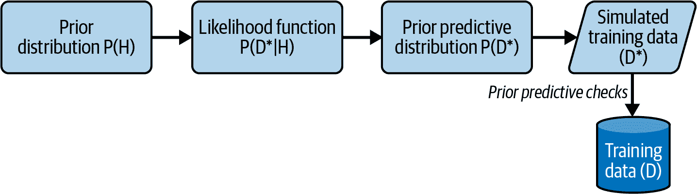

# 第五章。概率机器学习框架

> 概率论不过是普通常识化为计算而已。
> 
> —皮埃尔-西蒙·拉普拉斯，认知统计学和概率推理的主要贡献者

回顾来自第二章的逆概率规则，该规则指出，给定关于模型参数的假设 H 和一些观察到的数据集 D：

P(H|D) = P(D|H) × P(H) / P(D)

仅仅是这个乘法规则的微不足道的改写就是一般认知推理和概率机器学习（PML）复杂结构建立的基础，这简直令人惊叹。这是为什么这两种结构在数学上是严谨和逻辑上一致的根本原因。在更深入的检验中，我们将看到逆概率规则以深远方式结合了条件概率和无条件概率。

在本章中，我们将分析和反思规则中的每个术语，以更好地理解它。我们还将探讨这些术语如何满足我们在第一章中概述的下一代金融和投资机器学习框架的每一个要求。

将逆概率规则应用于现实问题有两个非常重要的原因：逻辑和计算。正如在第四章中解释的那样，我们的大脑在处理概率时并不擅长，特别是条件概率。还提到了 P(D)，逆概率规则中的分母，对于大多数现实问题而言是解析上难以处理的归一化常数。20 世纪突破性数值算法的发展和廉价计算能力的普及在很大程度上解决了这个问题。

我们将在下一章讨论应用逆概率规则的计算挑战。在本章中，我们通过高收益债券领域的一个简单例子解决了适用该规则的逻辑挑战。所有的 PML 模型，无论其复杂性如何，都遵循应用逆概率规则的相同过程。

推断模型参数只是解决方案的一半。我们希望使用我们的模型进行预测和模拟数据。先验和后验预测分布是我们模型的数据生成分布，它们与逆概率规则相关并从中派生。我们还讨论这些预测分布如何通过基于模型假设和观察数据生成新数据，从而实现 PML 模型输出的前向不确定性传播。

# 调查逆概率规则

你可能想回到 第二章 中的反转概率部分，复习一下蒙提霍尔问题中如何分析和计算概率的记忆。我们计算的反向概率规则中的每个术语都有特定的名称，如后验概率分布或似然函数，并在概率机器学习模型的机制中担任特定的角色。重要的是，我们理解这些术语，以便能够将概率机器学习机制应用于解决金融和投资中的复杂问题。

*P(H) 是先验概率分布*，它编码了关于模型参数的当前知识状态，并量化了在观察任何新数据之前的认知不确定性。这些参数的先验知识可能基于逻辑、先前的经验研究基础率、专家判断或机构知识。它还可以明确表达我们的无知。

在蒙提霍尔问题中，我们对汽车可能位于哪扇门（S[1]、S[2]、S[3]）的先验概率分布为 P(S[1], S[2], S[3]) = (⅓, ⅓, ⅓)。这是因为在我们选择门或观察数据集 D 之前，最合理的假设是汽车可能在这三扇门中的任何一扇后面。

所有模型都有明示和隐含的假设和约束条件，需要人类判断。请注意，先验概率分布是明确声明的模型假设，并以数学严谨的方式表达。它始终可以被质疑或更改。频率主义者的抱怨是，先验知识以先验概率分布的形式可能被滥用，用来支持似是而非的推论。这确实是可能的，就像所有模型一样，概率模型也无法免受 GIGO（垃圾进，垃圾出）病毒的影响。认知推断可能对先验概率分布的选择敏感。然而，关于先验的分歧并不证明不诚实或不一致的推断。更重要的是，如果有人想要不诚实，明确声明的先验概率分布将是操纵推论的最后一地方。此外，随着模型吸收更多数据，认知推断的机制会自动减少模型先验的权重分配。鉴于其对先验分布的敏感性，这是概率模型的重要自我修正机制。

回想一下来自第二章的无免费午餐（NFL）定理，它说如果我们希望我们的算法表现最佳，我们必须通过先验知识和假设了解我们特定问题领域及其基础数据分布。由于这种明确的透明度，对使用先验概率分布进行统计推断的普遍反对只是意识形态上的大放厥词，如果不是彻头彻尾的愚蠢的话。根据 NFL 定理，这也是危险和风险的。如果我们不包括关于问题领域的先验知识，我们的算法可能最终表现不如随机猜测。风险在于性能可能更差，并造成无法弥补的损害。

要确保你的先验概率分布不要将任何模型参数的概率分配为零是至关重要的。这是因为之后观察到的任何矛盾数据都无法改变这个零值。当然，除非你确信这个关于零值参数的具体假设在宇宙存在的年龄内不可能实现。这是物理学中通常接受的不可能事件的定义，因为在无限的空间和时间里任何事情都是可能的。

在金融领域，面对富有创造力、情感丰富和自由意志的人类，你会明智地对被认为不可能的事情设定更高的标准。例如，没有人认为负名义利率是可能的或者有任何意义的。请注意，名义利率大约等于实际利率加通货膨胀率。因此，负名义利率意味着你付给别人借款的资本，并且有义务在贷款期间继续支付他们的利息费用。荒谬吧！正如在第二章中提到的，长达十多年来，欧洲和日本政府债券市场上有 15 万亿美元的债券以负名义利率交易！

*P(D|H) 是似然函数*，它给出了在给定关于模型参数的特定假设 H 的情况下观察到样本数据 D 的条件概率。它量化了样本到样本数据在参数值 H 的特定假设下的随机不确定性。这是用于传统统计学中的抽样分布的相同似然函数。

在蒙特霍尔问题中，我们计算了三个似然函数：P(D | S[1]), P(D | S[2]), P(D | S[3])。回想一下，通过 P(D|S[1]) 我们指的是在汽车实际上在门 1 后面的情况下观察数据集 D 的概率，依此类推。这些似然函数给出了在参数 S[1], S[2], S[3] 下观察到我们的数据集 D 的条件概率。

需要注意的是，似然函数是一个函数而不是概率分布，因为其曲线下的面积通常不等于 1。这是因为似然函数是在不同假设（S[1]、S[2]、S[3]）的条件下计算的。从蒙蒂霍尔似然函数计算的概率是 P(D | S[1]) = ½，P(D | S[2]) = 1，P(D | S[3]) = 0，总和为 1.5。

*P(D) 是边际似然函数* 或观察到的特定数据样本 D 的无条件概率，平均值为所有可能生成它的参数或情景。它结合了我们似然函数产生的不确定性与我们关于可能生成数据样本 D 的参数值的先验不确定性。

根据第二章的全概率法则，计算我们特定数据集 D 的无条件观察概率，即当蒙蒂在我们选择第 1 号门后打开第 3 号门展示一只山羊时。该公式将我们的先验概率和似然函数组合如下：

+   P(D) = P(D|S[1]) × P(S[1]) + P(D|S[2]) × P(S[2]) + P(D|S[3]) × P(S[3])

+   P(D) = [½ × ⅓] + [1 × ⅓ ]+ [0 × ⅓ ] = ½

通常，观察数据 D 的边际似然性被计算为在所有可能生成观察数据的参数上的加权平均，权重由先验概率分布提供。使用全概率法则，一般情况下，P(D) 被计算为：

+   P(D) = <math alttext="sigma-summation Underscript i Endscripts upper P left-parenthesis upper D vertical-bar upper H Subscript i Baseline right-parenthesis times upper P left-parenthesis upper H Subscript i Baseline right-parenthesis"><mrow><msub><mo>∑</mo> <mi>i</mi></msub> <mi>P</mi> <mrow><mo>(</mo> <mi>D</mi> <mo>|</mo> <msub><mi>H</mi> <mi>i</mi></msub> <mo>)</mo></mrow> <mo>×</mo> <mi>P</mi> <mrow><mo>(</mo> <msub><mi>H</mi> <mi>i</mi></msub> <mo>)</mo></mrow></mrow></math> for discrete functions

+   P(D) = <math alttext="integral upper P left-parenthesis upper D vertical-bar upper H right-parenthesis times upper P left-parenthesis upper H right-parenthesis d upper H"><mrow><mo>∫</mo> <mi>P</mi> <mo>(</mo> <mi>D</mi> <mo>|</mo> <mi>H</mi> <mo>)</mo> <mo>×</mo> <mi>P</mi> <mo>(</mo> <mi>H</mi> <mo>)</mo> <mi>d</mi> <mi>H</mi></mrow></math> for continuous functions

根据第三章，概率加权平均和被称为期望值的算术平均数是等效的。因此，P(D) 计算了基于我们模型参数的所有先验不确定估计来观察特定数据样本 D 的期望。我们观察到的特定数据样本的这种先验期望均值充当一个通常在现实世界问题中难以解析求解的归一化常数。

*P(H|D) 是后验概率分布*，也是我们推理的目标。它基于观察到的样本数据 D 更新我们对模型参数的先验知识。它结合了我们参数的先验认知不确定性和样本数据的随机不确定性。在蒙提霍尔问题中，我们计算了后验概率 P(S[2] | D)，即我们的数据集 D 给出车在门 2 后的概率：

+   P(S[2]|D) = P(D|S[2]) × P(S[2]) / P(D)

+   P(S[2]|D) = [1 × ⅓ ] / ½ = ⅔

后验概率分布可以被视为我们先验知识与观察到的样本数据的逻辑和动态整合。当数据稀疏或噪声较大时，后验概率分布会受到先验概率分布的主导，并且似然函数的影响会相对较小。这在我们对先验知识有信心并希望在面对稀疏或噪声数据时进行推理时非常有用。

相反，随着数据的积累，后验分布将越来越受到似然函数的影响。这种学习行为是可取的，因为它意味着我们的推理需要在收集更多信息时调和观察到的数据与我们的先验知识。数据可能会加强和精炼我们的先验知识，也可能由于数据太嘈杂或稀疏而未添加新知识。当数据无法调和并挑战我们的先验知识时，学习机会就会出现。假设在数据质量和准确性方面没有问题，我们必须质疑所有的模型假设，从我们的先验开始。这通常发生在市场制度变化时。

先验分布和后验分布中似然函数之间的平衡可以通过选择适当的先验分布和收集更多或更高质量的数据来调整。先验概率分布的敏感性分析可用于评估不同先验概率分布选择对后验分布和最终结果的影响。这涉及深思熟虑的试错过程。

后验概率分布还能实现模型参数的逆不确定性传播。回顾第一章中的内容，逆不确定性传播是根据观察到的数据推断出模型输入参数的不确定性。后验概率分布编码了我们模型的概率学习。后验概率分布不仅从观察到的数据和我们对其先验知识学习我们模型的参数，还量化了这些估计的认知和随机不确定性。

后验概率分布以透明的方式完成所有这些操作，这在金融和投资管理行业尤为重要，这些行业受到严格监管。与其他传统的机器学习算法（如随机森林、梯度提升机和深度学习模型）形成对比，这些算法通常是黑盒子，因为它们推断的基本逻辑通常难以解释。

后验分布 P(H | D)在下一个学习周期的新数据样本到来时也可以作为先验概率分布 P(H)。这使得动态、迭代和综合的 PML 模型成为可能。这对金融和投资模型来说是一个非常强大的机制，并且在图 5-1 中进行了总结。


###### 图 5-1. 逆概率规则如何通过迭代概率学习从数据中构建知识

# 估计债务违约的概率

让我们将前面讨论的 PML 机制应用到估计一家公司可能违约其债务的问题上。假设你是一家对高风险信用公司的公共信用市场中的高收益债券感兴趣的对冲基金的分析师，因为它们通常提供有吸引力的风险调整后回报。由于其高风险性质以及这些公司可能无法偿还债券持有者的实际可能性，这些债券也被贬称为垃圾债券。

你基金的分析师们通过公司的专有知识、经验和管理方法评估这些公司的信用风险。当投资组合经理估计某家公司可能违约的概率只有 10%时，他们以市场价格购买其债券，以补偿基金承担的风险。

你的基金还使用传统的机器学习算法，从各种数据源中搜索与其投资组合中公司相关的信息。这些数据可能包括盈利发布、新闻稿、分析师报告、信用市场分析、投资者情绪调查等。每当机器学习分类模型接收到可能影响投资组合公司的每一条信息时，它会立即将这些信息分类为该公司的正面或负面评级。

多年来，你基金的机器学习分类系统建立了一份非常有价值的专有数据库，详细记录了这些高风险企业借款人的关键信息特征。特别是，它发现那些最终违约的公司累积了 70%的负面评级。然而，那些最终不违约的公司只累积了 40%的负面评级。

假设您的投资组合经理要求您开发一个 PML 模型，利用这些专有资源，以便在 ML 分类系统处理公司新信息时不断评估债务违约的概率。如果您成功开发了这个 PML 模型，您的基金将在高收益债券交易策略的时机和方向上获得优势。

现在假设您的 ML 分类系统刚刚通知您给 XYZ 分配了一个负面评级，XYZ 是您负责监控的基金债券投资组合中的一个新公司。如何基于新的负面评级更新 XYZ 公司的违约概率？让我们将 PML 模型应用于这个简单问题，作为学习您将应用于真实复杂交易和投资的 PML 过程的一种方式。

+   XYZ 公司违约（P(违约)）和不违约（P(未违约)）其债务义务的概率是模型要估计的参数。

+   有关 XYZ 公司的负面和正面评级包括将为您提供信息并影响您的参数估计。

+   假设所有评级彼此独立，并且所有评级都是从同一潜在统计分布中抽样得到的。

+   由于 XYZ 公司位于您基金的投资组合中，您在看到任何负面或正面评级之前的违约先验概率为 P(违约) = 10%。

+   这意味着 XYZ 不违约其债务的先验概率是 P(未违约) = 90%。

+   如果 XYZ 最终违约的话，您的 ML 分类系统观察到负面评级的可能性是 P(负面 | 违约) = 70%。

+   尽管有负面评级，XYZ 公司最终不违约的可能性是 P(负面 | 未违约) = 40%。

或许会觉得奇怪，P(负面 | 违约) + P(负面 | 未违约) = 0.7 + 0.4 = 1.1。这两个概率之和不为 1，因为它们条件是关于投资组合公司的两种非互补假设。可以将任何投资组合公司视为两种类型的加权硬币之一可能会有帮助：不违约硬币和违约硬币。不违约硬币在 40%的时间内显示其负面面。违约硬币在 70%的时间内显示其负面面。您正试图弄清楚您的投资组合经理从一个包含这两种硬币的袋子中选择了哪一种。

您希望在观察到负面评级后估计违约后验概率 P(违约 | 负面)，并结合您对信用风险管理的机构知识。现在您已经拥有所有的概率和信息，可以创建一个 PML 模型并应用逆概率规则。让我们用 Python 编码解决方案：

```py
# Import Python libraries
import numpy as np
import pandas as pd

# Create a dataframe for your bond analysis
bonds = pd.DataFrame(index=['Default', 'No Default'])

# The prior probability of default
# P(Default) = 0.10 and P(No Default) = 0.90

bonds['Prior'] = 0.10, 0.90

# The likelihood functions for observing negative ratings
# P(Negative|Default) = 0.70 and P(Negative|No Default) = 0.40

bonds['Likeli_Neg'] = 0.70, 0.40

# Joint probabilities of seeing a negative rating depending on 
# default or no default
# P(Negative|Default) * P(Default) and P(Negative|No Default) * P(No Default)

bonds['Joint1'] = bonds['Likeli_Neg'] * bonds['Prior']

# Add the joint probabilities to get the marginal likelihood or unconditional 
# probability of observing a negative rating
# P(Negative) = P(Negative|Default) * P(Default) + P(Negative|No Default) 
             * P(No Default)

prob_neg_data = bonds['Joint1'].sum()

# Use the inverse probability rule to calculate the updated probability of
# default based on the new negative rating and then print the data table.

bonds['Posterior1'] = bonds['Likeli_Neg'] * bonds['Prior']/prob_neg_data
bonds.round(2)
```


根据我们的代码，可以看到公司 XYZ 在刚刚收到负面评级后的违约后验概率 P(default | negative) = 16%。违约概率从我们先前的 10% 的先验概率上升，这是可以预料的。

假设几天后，您的 ML 分类器向您报告 XYZ 公司另一条负面评级。现在如何更新违约概率？PML 过程完全相同。但现在我们的违约的先验概率是我们先前计算的当前后验概率。这是 PML 模型最强大的特性之一：以数学严谨的方式持续集成我们的先验知识和新数据来动态学习。让我们继续编写我们的解决方案来演示这一点：

```py
#Our new prior probability is our previous posterior probability, Posterior1\. 
#Compute and print the table.

bonds['Joint2'] = bonds['Likeli_Neg'] * bonds['Posterior1']
prob_neg_data = bonds['Joint2'].sum()
bonds['Posterior2'] = bonds['Likeli_Neg'] * bonds['Posterior1']/prob_neg_data
bonds.round(2)
```


```py
# Create a new table so that you can plot a graph with the appropriate information
table = bonds[['Prior', 'Posterior1', 'Posterior2']].round(2)

# Change columns so that x axis is the number of negative ratings
table.columns = ['0', '1', '2']

# Select the row to plot in the graph and print it.
default_row = table.iloc[0]
default_row.plot(figsize = (8,8), grid = True, 
xlabel = 'Updates based on recent negative ratings', 
ylabel = 'Probability of default', title = 'XYZ Bonds');
```


在了解到公司的新信息后，两次负面评级条件下公司违约的概率 P(default | 2 negatives) 显著上升至 25%，接近基金风险限制。您决定将这些结果提供给投资组合经理，进行更深入、全面的 XYZ 公司及当前市场环境分析。

需要注意的是，PML 模型可以一次或逐点摄取数据。无论数据到达的顺序如何，最终得到的后验概率将是相同的。让我们验证这一点。假设基金的 ML 分类器在几分钟内向我们报告 XYZ 公司两次负面评级。

+   再次假设 ML 分类系统的评级是独立的，并且从以前相同的分布中抽样。

+   考虑到 XYZ 会违约的情况下，计算连续两次负面评级的概率 P(2 negatives | default) 使用独立事件的乘法规则：

    +   P(2 negatives | default) = P(negative | default) × P(negative | default) = 0.70 × 0.70 = 0.49

+   同样地，考虑到 XYZ 最终不会违约的情况下，计算两次负面评级的概率：P(2 negatives | no default) = 0.40 × 0.40 = 0.16。

+   观察 XYZ 公司两次负面评级的边际似然或无条件概率是对公司遵守其债务义务两种可能性的加权平均：

    +   P(2 negatives) = P(2 negatives | default) × P(default) + P(2 negatives | no default) × P(no default)

    +   将 P(2 negatives) 的数值代入计算：P(2 negatives) = (0.49 × 0.1) + (0.16 × 0.9) = 0.193

+   因此，找到 XYZ 公司在连续两次负面评级后违约的后验概率：

    +   P(default | 2 negatives) = P(2 negatives | default) × P(default) / P(2 negatives)

    +   将 P(default | 2 negatives) 的数值代入计算：0.049/0.193 = 0.25 或 25%

这与我们在 Python 代码中计算的`posterior2`的后验概率相同。

# 使用预测概率分布生成数据

如第一章中提到的，PML 模型是生成模型，能够学习数据的潜在统计结构。这使它们能够无缝地模拟新数据，包括生成可能缺失或损坏的数据。最重要的是，PML 模型能够通过其模型输出进行前向不确定性传播。它通过其先验和后验预测分布来实现这一点，这些分布模拟了 PML 模型未来可能生成的数据，并与观察到的训练数据、模型假设和先验知识一致。

需要注意的是，先验和后验分布是用于推断模型参数在训练前后的概率分布，它们支持反向不确定性传播。相比之下，先验和后验预测分布是模型在训练前后用于生成新数据的概率分布，它们支持前向不确定性传播。

先验和后验预测分布结合了两种不确定性：从其似然函数模拟的样本到样本数据的随机不确定性；以及编码在其先验和后验概率分布中的参数的认知不确定性。让我们继续在前一节的示例中工作，以说明和探索这两种预测分布。

*先验预测分布 P(D′)* 是我们预期在训练数据(D)中观察到的模拟数据(D′)的先验概率分布，*在* 我们实际开始训练模型之前。先验预测分布 P(D′)通过对参数的先验概率分布 P(H)进行似然函数 P(D′ | H)的平均来实现这一点。

我们的 PML 模型包括假设、约束、似然函数和先验概率分布。先验预测分布在训练开始之前作为我们的 PML 模型是否适用的检查。实质上，先验预测分布 P(D′)在对训练数据(D)进行回溯预测，以便我们评估模型是否准备好进行训练。参见图 5-2。



###### 图 5-2. 先验预测分布在训练之前生成新数据。这些模拟数据用于检查模型是否准备好进行训练。

如果实际的训练数据(D)不在由我们先验预测分布生成的模拟数据(D′)的合理范围内，我们应考虑修订我们的模型，从先验概率分布开始，然后是似然函数。

在前面的部分中，当我们计算观察到负面评级的边缘似然函数时，我们已经计算出了负面评级的先验预测平均值 P(负面)作为期望值或加权平均值：

+   P(负面) = P(负面 | 违约) × P(违约) + P(负面 | 未违约) × P(未违约)

+   P(负面) = (0.70 × 0.10) + (0.40 × 0.90) = 0.43

我们可以通过使用负面似然函数的补集类似地计算正面评级的先验预测平均值 P(正面)。

+   P(正面 | 违约) = 1 – P(负面 | 违约) 并且

+   P(正面 | 未违约) = 1 – P(负面 | 未违约)。

+   利用这些概率计算边缘似然函数并插入数字，我们得到：

+   P(正面) = P(正面 | 违约) × P(违约) + P(正面 | 未违约) × P(未违约)

+   P(正面) = (0.30 × 0.10) + (0.60 × 0.90) = 0.57

总的来说，先验预测分布的计算方法如下：

+   P(D′) = <math alttext="sigma-summation Underscript i Endscripts upper P left-parenthesis upper D prime vertical-bar upper H Subscript i Baseline right-parenthesis times upper P left-parenthesis upper H Subscript i Baseline right-parenthesis"><mrow><msub><mo>∑</mo> <mi>i</mi></msub> <mi>P</mi> <mrow><mo>(</mo> <msup><mi>D</mi> <mo>'</mo></msup> <mo>|</mo> <msub><mi>H</mi> <mi>i</mi></msub> <mo>)</mo></mrow> <mo>×</mo> <mi>P</mi> <mrow><mo>(</mo> <msub><mi>H</mi> <mi>i</mi></msub> <mo>)</mo></mrow></mrow></math> 用于离散函数

+   P(D′) = <math alttext="integral upper P left-parenthesis upper D prime vertical-bar upper H right-parenthesis times upper P left-parenthesis upper H right-parenthesis d upper H"><mrow><mo>∫</mo> <mi>P</mi> <mrow><mo>(</mo> <msup><mi>D</mi> <mo>'</mo></msup> <mo>|</mo> <mi>H</mi> <mo>)</mo></mrow> <mo>×</mo> <mi>P</mi> <mrow><mo>(</mo> <mi>H</mi> <mo>)</mo></mrow> <mi>d</mi> <mi>H</mi></mrow></math> 用于连续函数

注意边缘似然函数和先验预测分布之间存在差异，尽管它们的公式看起来相同。边缘似然函数是观察特定数据样本（D），如负面评级的期望值。先验预测分布是在实际观察到任何数据之前给出其样本空间内任何可能数据（D′）的无条件概率分布。在我们的例子中，在你开始监控公司之前，它给出了投资组合公司观察到负面评级和正面评级的无条件概率。  

*后验预测分布 P(D″ | D)* 模拟了在训练模型后，我们期望在未来观察到的样本或测试数据 (D″) 的后验概率分布。它通过对后验概率分布 P(H|D) 中的似然函数 P(D″ | H) 求平均来模拟测试数据样本 (D″)。简而言之，训练后的后验预测分布 P(D″ | D) 预测了未见测试数据 (D^)，以便评估模型的测试准备情况。见 图 5-3。


###### 图 5-3\. 后验预测分布在训练后生成新数据。这些模拟数据用于检查模型是否准备好进行测试。

注意，当我们在样本数据 (D) 上训练了我们的 PML 模型，并使用似然函数 P(D|H) 捕获了其偶然不确定性后，我们的后验分布 P(H|D) 相较于我们的先验分布 P(H) 给出了参数 (H) 及其认识不确定性的更好估计。我们的似然函数 P(D″| H) 继续表达观察未见样本数据 (D″) 的偶然不确定性。

后验预测分布在测试环境中作为最终的模型检查。我们可以根据样本数据分布与后验预测概率分布预测的数据分布的接近程度来评估模型的实用性。

总的来说，后验预测分布由以下公式给出：

+   P(D″ | D) = <math alttext="sigma-summation Underscript i Endscripts upper P left-parenthesis upper D double-prime vertical-bar upper H Subscript i Baseline right-parenthesis times upper P left-parenthesis upper H Subscript i Baseline vertical-bar upper D right-parenthesis"><mrow><msub><mo>∑</mo> <mi>i</mi></msub> <mi>P</mi> <mrow><mo>(</mo> <msup><mi>D</mi> <mrow><mo>'</mo><mo>'</mo></mrow></msup> <mo>|</mo> <msub><mi>H</mi> <mi>i</mi></msub> <mo>)</mo></mrow> <mo>×</mo> <mi>P</mi> <mrow><mo>(</mo> <msub><mi>H</mi> <mi>i</mi></msub> <mo>|</mo> <mi>D</mi> <mo>)</mo></mrow></mrow></math> 适用于离散函数

+   P(D″ | D) = <math alttext="integral upper P left-parenthesis upper D double-prime vertical-bar upper H right-parenthesis times upper P left-parenthesis upper H vertical-bar upper D right-parenthesis d upper H"><mrow><mo>∫</mo> <mi>P</mi> <mrow><mo>(</mo> <msup><mi>D</mi> <mrow><mo>'</mo><mo>'</mo></mrow></msup> <mo>|</mo> <mi>H</mi> <mo>)</mo></mrow> <mo>×</mo> <mi>P</mi> <mrow><mo>(</mo> <mi>H</mi> <mo>|</mo> <mi>D</mi> <mo>)</mo></mrow> <mi>d</mi> <mi>H</mi></mrow></math> 适用于连续函数

需要更新观察到 XYZ 公司再次获得负面评级的概率，鉴于我们已经观察到两个负面评级。虽然它仍然是生成另一个负面评级的期望值，但每个参数值分配的权重由条件于观察到两个负面评级的后验概率分布提供。这称为后验预测均值，计算如下：

+   P(负面 | 2 个负面) = P(负面 | 默认) × P(默认 | 2 个负面) + P(负面 | 非默认) × P(非默认 | 2 个负面) = (0.7 × 0.25) + (0.4 × 0.75) = 0.475 或 47.5%

现在我们观察到两个负面评级后，观察到 XYZ 公司获得正面评级的概率是多少？由于后验预测分布是一个概率分布，所以 P(正面 | 2 个负面) = 1 − P(负面 | 2 个负面) = 0.525 或 52.5%。您可以通过像我们在前面章节中所做的概率计算来检验这一点。

# 摘要

在本章中，我们研究了逆概率规则的具体术语及其如何支持在第一章中讨论的全面概率机器学习框架。具体来说，规则的以下术语支持持续的知识整合和逆不确定性传播：

+   先验概率分布 P(H)编码了我们对模型参数的当前知识和认识论不确定性，在我们观察到任何样本内或训练数据之前。

+   似然函数 P(D|H)捕获了数据分布和样本对样本训练数据的随机不确定性，给定我们模型参数的特定值。

+   边际似然函数 P(D)通过对所有可能参数值加权平均其先验概率，给出了观察特定样本的无条件概率。它结合了观察样本数据的随机不确定性与可能生成该样本的每个参数的认识论不确定性。它是一个通常不可解的常数，用于归一化后验概率分布，使其积分为 1。

+   后验概率分布 P(H|D)通过将我们对模型参数的先验知识与每个参数生成我们实际观察到的样本数据的可能性进行整合来更新我们对模型参数的估计。这是我们最感兴趣的目标概率分布，因为它编码了我们模型参数的概率学习，包括它们的随机性和认识论不确定性。

先验和后验预测分布支持我们 PML 模型的前向不确定性传播。它们还作为我们模型有效性的检验：

+   先验预测分布 P(D′) 提供了我们在实际开始实验并观察之前观察到假想的样本训练数据 (D′) 的无条件概率。请注意，这不是实际观察到的样本数据 D。

+   后验预测分布 P(D″|D) 提供了我们在我们的 PML 模型从样本内训练数据(D)中学习其参数后，观察到假想的样本外测试数据(D″)的条件概率。

重要的是要注意，先验分布 P(H) 和后验分布 P(H | D) 分别提供了我们关于我们模型参数的概率分布，这些参数是在样本数据 D 上训练我们的模型之前和之后的。

先验预测 P(D′) 和后验预测 P(D″ | D) 分布分别提供了在我们在样本数据 D 上训练我们的模型之前和之后，模拟的样本内 (D′) 和样本外数据 (D″) 的数据生成概率分布。

这些强大的机制使得在数据条件下动态、迭代和整合的机器学习成为可能，同时量化这些学习的随机和认知不确定性。PML 模型使得能够基于数据推断模型参数和预测。它在逻辑一致和数学严谨的情况下无缝集成了逆向不确定性传播和正向不确定性传播，同时不断地吸收新数据。这为基于数据的决策制定和风险管理提供了坚实的支持。

在下一章中，我们探索了 PML 模型的一个最重要的特性，特别是在金融和投资领域。将 PML 模型置于其独特的类别中的一个重要特征是它们知道自己不知道的东西，并据此校准他们的认知不确定性。这使我们远离了传统机器学习系统的潜在灾难性和破坏性后果，后者无论其无知如何，都极其自信。借用来自标志性电影警察“肮脏哈里”的一句名言，一个模型必须知道自己的限制。

# 进一步阅读

Downey, Allen B. “贝叶斯定理。”在 *Think Bayes：Python 中的贝叶斯统计*，第 2 版。奥莱利媒体，2021 年。

Jaynes, E. T. *概率论：科学的逻辑*。G. Larry Bretthorst 编。纽约：剑桥大学出版社，2003 年。

McElreath, Richard。“小世界和大世界。”在 *统计重新思考：具有 R 和 Stan 示例的贝叶斯课程*，19-48 页。博卡拉顿，佛罗里达州：查普曼和霍尔/CRC 出版社，2016 年。

Ross, Kevin。“预测简介。”在 *贝叶斯推理与方法介绍*。[Bookdown.org](http://Bookdown.org)，2022 年。[*https://bookdown.org/kevin_davisross/bayesian-reasoning-and-methods/*](https://bookdown.org/kevin_davisross/bayesian-reasoning-and-methods/)。
