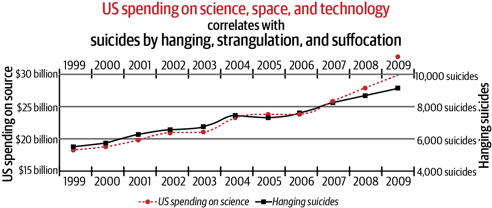
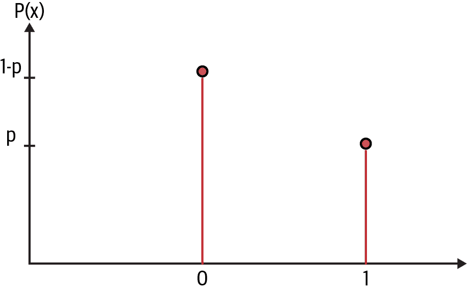
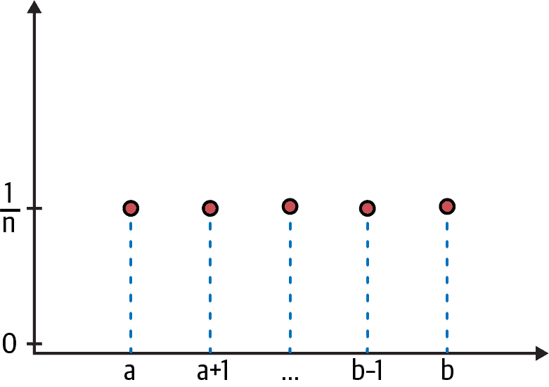
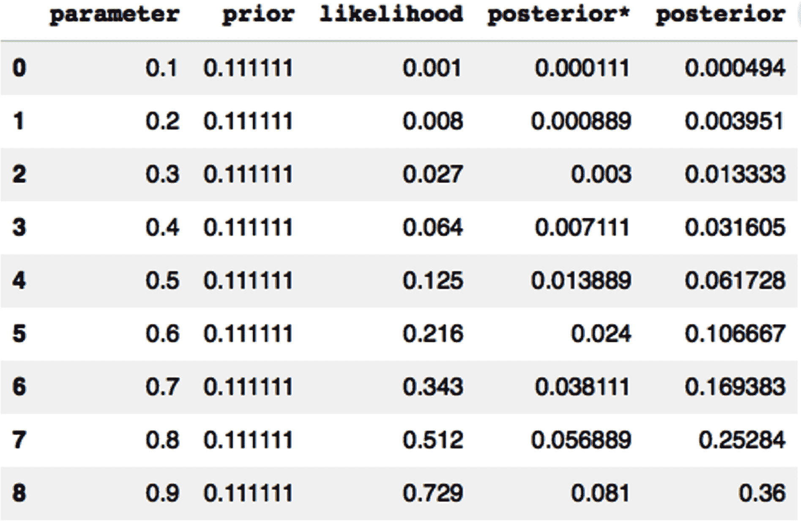
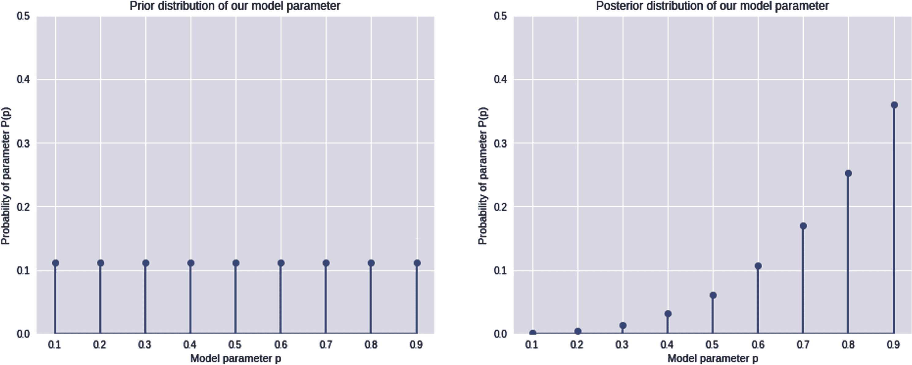
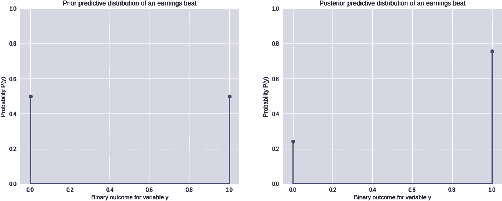
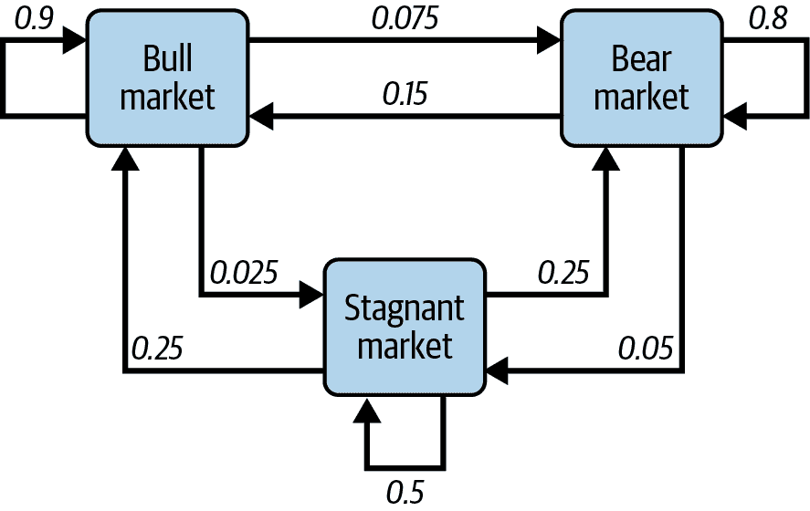
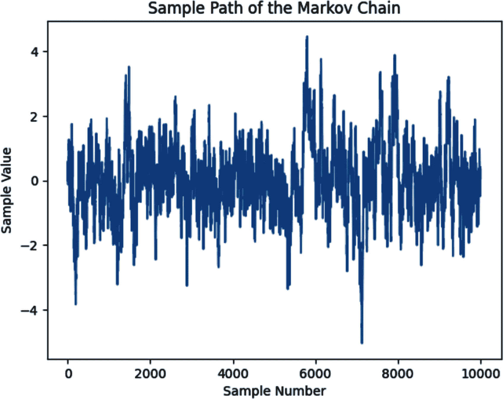
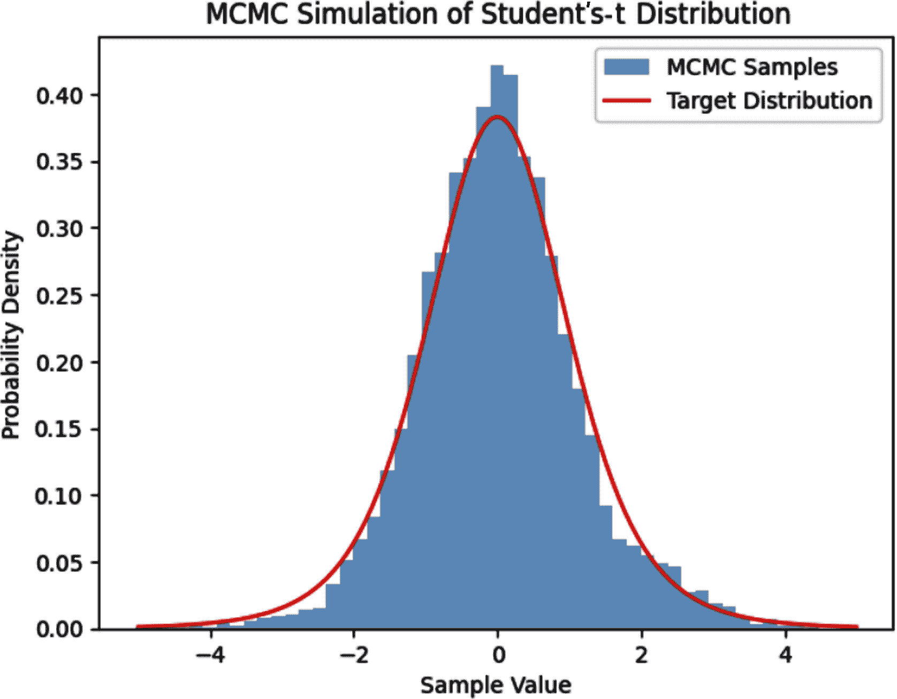

# 第六章：传统人工智能系统的危险

> 一个人必须知道自己的限制。
> 
> ——《铁证悬案》中的侦探“脏哈利”，他目睹一个自信过度的犯罪头目的汽车爆炸

一个模型必须知道自己的限制。这点很重要，因为这是金融和投资模型特性的重要性所在。其推论是，一个人工智能必须知道自己的限制。所有人工智能系统最严重的限制是它们缺乏常识。这源于它们无法理解因果关系。人工智能系统在训练期间只学习了难以推广到新情况的统计关系，而没有理解因果关系。

在 第一章 中，我们探讨了金融市场如何在你谨慎和深思熟虑地应用最佳模型时，仍然可能使你感到羞辱的三种方式。当你的模型基于有缺陷的金融和统计理论（例如本书上半部分讨论的内容）时，市场几乎肯定会让你感到羞辱。实际上，这并不是那么糟糕的结果，因为羞辱性的财务损失通常会带来个人的洞察和成长。更糟糕的结果是被解雇或者职业生涯以不光彩的方式结束。最糟糕的结果是个人财务破产，这种经历带来的智慧可能来不及发挥作用。

当传统的机器学习模型（如深度学习网络和逻辑回归）被训练时，它们通常使用最大似然估计（MLE）方法从样本数据中学习模型参数。因此，这些机器学习系统有三个严重缺陷，严重限制了它们在金融和投资领域的应用。首先，在使用小数据集时，尤其是在学习嘈杂的金融数据时，它们的模型参数估计是错误的。其次，这些机器学习模型在超出它们已经训练和测试过的数据范围和类别时，表现糟糕。第三，MLE 模型的概率分数必须通过使用 Sigmoid 或 Softmax 等函数进行校准，以将其校准为有效的概率。然而，这些校准不能保证准确地表示潜在的概率，导致了糟糕的不确定性量化。

所有这些缺陷的严重性在于，这些机器学习系统所依赖的传统统计模型在错误估计和预测时表现出令人震惊的高置信度，使它们在不确定的世界中变得非常危险。就像电影《铁证悬案》中一样，这些自信过满的人工智能模型有潜力引爆投资账户、公司、金融机构和经济，如果在不了解它们严重限制的情况下实施。

在第四章中，我们揭示了流行统计方法如 NHST、p 值和置信区间的错误推理推断。在本章中，我们检视了流行的 MLE 方法的严重限制和缺陷，以及其在金融和投资领域的失败原因。我们通过研究一个案例，试图预测我们投资的新上市公司是否能超过其季度盈利预期，基于一个短期记录。通过比较传统 MLE 模型与概率模型的结果，我们展示了为什么概率模型更适合于金融和投资，特别是在数据稀缺时。

正如之前讨论的，由于边缘概率分布中求和/积分的复杂性无法解析解决大多数现实世界的概率推断问题。与 MLE 模型使用的有缺陷的概率校准方法不同，我们只能采用近似数值解来解决概率推断问题。即使通过基本微积分可以解析解决盈利预期问题，我们也应用网格近似来解决它，以展示这种简单而强大的技术是如何运作的，使概率推断更容易理解。

马尔可夫链蒙特卡洛（MCMC）模拟是一种突破性的数值方法，通过估计解析上难以处理的高维后验概率分布，改变了概率推断的可用性。MCMC 使用依赖随机抽样算法模拟复杂的概率分布。我们探索了支持这种强大、可扩展模拟方法的基本概念。作为 MCMC 方法的概念验证，我们使用著名的 Metropolis 抽样算法模拟具有重尾的学生 t 分布。

# AI 系统：一个危险的缺乏常识

人类天生具有一种非常重要的质量，迄今为止没有任何 AI 能够学会：一种具有常识的能力，合理地将我们的学习推广到未见过的、样本外的相关类别或范围，即使我们没有专门接受过这些训练。与 AI 系统不同的是，几乎所有人类都能够轻松推断、推理，并根据常识调整自己的知识以应对新的情况。例如，一个训练用于在荒野中识别活象的深度神经网络无法识别展览馆中展示的一只标本象。[¹] 一个幼儿只需运用他们的常识就能轻松完成这项任务。正如其他人指出的那样，AI 系统实际上无法看到房间里的大象！

这种常见失败的主要原因是 AI 模型只计算相关性，而没有工具来理解因果关系。此外，人类能够从具体例子中抽象概念，并以对象的泛化和它们之间的因果关系来思考，而 AI 系统却无法做到这一点。当处理嘈杂的大数据集时，这是一个主要问题，因为它们提供了丰富的机会，可以关联那些没有合理物理或因果关系的变量。在大数据集中，变量之间的虚假关联是常规，而不是例外。

例如，图 6-1 显示在 1999 年至 2009 年期间，美国在科学、太空和技术上的支出与自杀（包括绞刑、勒颈和窒息）之间存在 99.8%的相关性。²



###### 图 6-1\. 大数据集中常见的虚假关联³

显然，这种关系是荒谬的，并且强调了相关性并不意味着因果关系的格言。人类可以很容易理解这种虚假关联的荒谬之处，但 AI 系统却无法做到。这也使得那些理解这些弱点并能利用它们的人可以轻易愚弄 AI 系统。

虽然人工神经网络灵感来自人脑的结构和功能，但我们对人类神经元如何学习和工作的理解仍然不完整。因此，人工神经网络并非生物神经元的精确复制品，人类大脑运作的许多未解之谜仍然存在。术语“深度神经网络”是一个误导性的营销术语，用于描述在输入层和输出层之间具有两个以上隐藏层的人工神经网络。对于一个缺乏幼儿通识的深度神经网络来说，并没有什么“深刻”的含义。⁴

# 为什么 MLE 模型在金融领域失败

所有传统的参数化 ML 系统都使用 MLE 统计方法，从简单的线性模型到复杂的深度学习神经网络。MLE 方法用于计算最优参数，以最佳拟合假定统计分布的数据。当模型只处理具有时间不变统计分布的大数据集的随机不确定性时，MLE 算法是有用的。

当统计分布被点估计总结时，尽管这是最优估计，但会丢失许多有价值的信息和不确定性评估。根据定义和设计，点估计不能捕捉模型参数的认知不确定性，因为它们不是概率分布。在金融和投资领域，这会带来严重后果，因为我们正在处理的是深陷于三种不确定性维度的复杂、动态社会系统：偶然性、认知性和本体论性。在第一章中，我们讨论了在金融和投资中使用点估计是危险和愚蠢的原因，因为我们持续处理错误的测量、不完整的信息和三维不确定性。换句话说，基于 MLE 的传统机器学习系统仅在不确定性三维空间的一个维度上运行，如图 2-7 所示。更令人担忧的是，许多这些机器学习系统通常是黑匣子，以高速自信地运行，但概率校准有缺陷。

此外，MLE 忽略了基于先验领域知识的基础率或先验概率，这可能导致基础率谬误，正如第四章所讨论的那样。当 MLE 应用于小数据集时，这一点尤为真实。我们实际上可以通过将 MLE 方法应用于一个估计公司实际是否能超过市场预期其收益估计的真实问题来看看为何如此。此示例受到参考文献中描述的硬币投掷示例的启发。⁵

## 用于收益预期的 MLE 模型

假设你已经换了工作，现在作为股票分析师在一家共同基金公司工作。去年，你的基金在高增长技术公司 ZYX 的首次公开募股(IPO)中分配了股权。尽管 ZYX 在其整个初创生涯中从未盈利过，但由于其侵略性营销活动得到大量风险投资的支持，其品牌已经成为家喻户晓的名字。显然，私募和公募股权投资者买入了其迷人的增长故事，由其富有魅力的首席执行官叙述。

在其 IPO 以来的最后三个季度中，ZYX 的负盈利甚至超过了市场对更大亏损的预期。在金融市场中，较差即好。ZYX 的股价持续不断地上涨，并且目前正在创下历史新高，让每个人受益。您的投资组合经理（PM）已要求您估计 ZYX 在即将到来的第四季度收益将超过市场预期的概率。根据您的概率估计，您的 PM 将在他们的收益公告前增加或减少基金对 ZYX 的权益投资。

在接受传统统计方法教育后，我们决定建立一个标准的 MLE 模型来计算所需的概率。收益公告事件只有两个我们感兴趣的结果：要么收益超过市场预期，要么低于市场预期。我们不关心收益仅达到市场预期的结果。像许多其他投资者一样，您的投资组合经理（PM）已经决定这样的结果相当于收益低于市场预期。众所周知，公司管理层在一年中与华尔街分析师打一场游戏，他们降低他们的盈利预期，以便在实际盈利公告时更容易超过这些预期。

让我们设计我们的季度收益最大似然估计（MLE）模型，并指定支撑它的假设：

+   在单个事件或试验中，模型的输出变量 y 只能假定两种可能的结果之一，y = 1 或 y = 0。

+   这两个结果是互斥的且完全穷尽的。

+   将 y = 1 分配给 ZYX 超过市场对其季度收益的预期的结果。

+   将 y = 0 分配给 ZYX 没有超过或仅达到市场对其季度收益的预期的结果。

我们现在必须为我们的似然函数选择一个最能模拟收益公告这一二元事件的统计分布。伯努利分布模拟了具有二元结果的单个事件或试验。参见 图 6-2。



###### 图 6-2\. 伯努利变量⁶，其结果 x = 1 的发生概率为 p，结果 x = 0 的发生概率为 1-p

回想一下，在 第一章 中，我们使用二项分布来模拟美联储在几次会议或试验中利率上涨的总次数。当用于单次试验时，伯努利分布是二项分布的特例，因为它们在用于单次试验时具有相同的概率分布。

+   假设变量 y 服从一个未知参数 p 的伯努利分布，这给了我们收益超预期的概率（y = 1）。

+   由于两个概率必须加起来等于 1，这意味着未能超过收益预期（y = 0）的概率是其补集，即 1-p。

我们的目标是找到参数 p 的 MLE，即 ZYX 基于其短期设定市场预期并超过市场预期的季度收益的概率。

变量 y 的伯努利过程是独立同分布（i.i.d.）伯努利试验的离散时间序列，由 y[i]表示。

+   i.i.d.假设意味着每次收益公告都与之前的所有收益独立，并且都从具有常数参数 p 的相同伯努利分布中抽取。

+   在其最后三个季度，ZYX 超过了收益预期，因此我们对参数 p 的训练数据是 D = (y[1] = 1, y[2] = 1, y[3] = 1)。

让我们称 p′为伯努利变量 y 参数 p 的 MLE。可以数学地证明，p′是时间序列数据 D 样本的期望值或算术平均值。它是最优参数，当插入伯努利似然函数中时，最适合时间序列数据 D。这意味着在数据集 D 上训练的 p′是：

+   p′(D) = (y[1]+y[2]+y[3]) / 3 = (1 + 1 + 1) / 3 = 3 / 3 = 1

+   因此，ZYX 在其第四季度超过市场对其收益预期的概率是 P(y[4] = 1 | p′) = p′ = 1 或 100%。

由于 MLE 模型仅允许由数据随机抽样引起的随机不确定性，让我们计算 y 的方差。具有参数 p′的伯努利变量 y 的方差由以下给出：

+   随机不确定性或方差(y | p′) = (p′) × (1 – p′) = 1 × (1 – 1) = 1 × 0 = 0.

+   由于 p′是一个最优点估计，认知不确定性= 0。

+   由于 p′被认为是一个“真实”的常数，而且假设伯努利分布是时间不变的，本体不确定性= 0。

因此，我们的 MLE 模型分配了一个 100%的概率，没有抽样误差，y[4] = 1。换句话说，我们的模型绝对确定 ZYX 将在即将到来的第四季度打破市场对其收益预期的期望。我们模型对 ZYX 收益超过市场预期的英雄式预测基于一家新兴的亏损技术公司仅有三个数据点。此外，我们当前的 MLE 模型将继续预测 ZYX 在其余生命周期内每个季度的收益超出预期。不仅仅是死亡和税收是确定的。我们需要将我们的 MLE 模型的预测添加到列表中。

任何具有常识的财务分析师都不会向其投资组合经理呈现这个 MLE 模型及其预测。然而，在金融和投资中拥有稀疏数据集是非常普遍的。例如，我们仅有两次全球大流行的财务数据。早期科技初创公司或战略/特别项目几乎没有相关数据可供作出具体决策。自大萧条于 1933 年结束以来，美国经济只经历了 13 次衰退。自 1942 年以来，标准普尔 500 指数仅有一次连续三年的负总回报（2000 年至 2003 年）。这些是一些明显的例子。金融和投资中稀疏数据集的列表确实很长。

显然，在金融和投资中常见的稀疏数据集上应用 MLE 模型是危险的。它们真的不了解它们的局限性，并毫不掩饰地显示他们的无知。基于 MLE 模型构建复杂的金融机器学习系统只会更早或更晚导致财务灾难。

## 关于收益预期的概率模型

现在让我们删除无用的 MLE 模型，并停下来思考这个问题。仅有三个数据点可供参考，对于任何对参数 p 的点估计都绝对不应该抱有确定性，即 ZYX 第四季度收益超过市场预期的概率。为什么？在过去一个季度可能发生了很多可能的问题，只有一些公司内部人员可能意识到。考虑到公司管理层和股东之间信息的持久不对称性，这种情况总是可能发生。这是我们对参数 p 的认识不确定性的一个主要来源。

最重要的是，眼前有太多因素——公司特定、政治、监管、法律、货币和经济——可能在 ZYX 公布其收益之前出现问题，并改变市场的预期。这些是我们本体不确定性的一些来源。当然，没有人知道未来会发生什么，但未来更有可能反映最近的过去。

因此，基于我们对我们生活的现实世界三个不确定性维度的理解以及我们目前掌握的信息，我们可以合理地打赌，ZYX 将超过市场对其第四季度收益的预期。然而，这并不是确定的。这意味着我们的模型参数 p 应能够取 0 到 1 之间的任何值，越接近 1 越有可能。换句话说，我们对 p 的估计最好用概率分布而不是任何特定点估计来表达。特别是在看到数据集 D 后，我们对 p 的估计最好表达为一个正偏态概率分布。

请注意，MLE 是最能复制观察数据的 p 值。但并没有普遍的自然法则表明 MLE 就是产生样本数据的 p 值的确证。参数 p 的其他值也很容易生成数据集 D。我们处理情感体的复杂社会系统，这些体系的行为往往是次优的。更重要的是，我们不受约束地选择一个 p 值。

让我们通过构建一个概率模型来更加精确地量化和可视化参数 p 的统计分布。回想一下，一个概率模型要求我们指定两个概率分布：

+   第一个是先验概率分布 P(p)，它概括了我们在观察任何数据之前对模型参数的知识或假设。假设您对 ZYX 公司没有任何先验知识或对参数 p 的任何概念。这使得一个均匀分布 U(0, 1)，我们在蒙提霍尔问题中学到的，成为我们先验分布的一个良好选择。这个分布将所有介于 0 到 1 之间的 p 值赋予相等的概率。因此，P(p) ~U (0, 1)，其中波浪号（~）是“统计分布为”的缩写。

+   第二个是似然函数 P(D | p)，它给出了观察我们样本数据 D 的可能性，假设参数 p 介于 0 到 1 之间的任何值。我们将继续使用伯努利概率分布及其相关过程作为我们概率模型中的似然函数。因此，我们概率模型的似然函数是 P(D | p) ~Bernoulli (p)。

我们的目标是估计我们的模型参数 p 在样本数据 D 和我们对 p 的先验知识或假设给定情况下的后验概率分布。这将为我们提供结果 y = 1 的概率分布，即盈利超预期的概率。我们将使用逆概率规则计算给定数据 D 的 p 的概率分布。我们的概率模型可以规定如下：

+   P( p | D) = P(D | p) ✕ P(p) / P(D) 其中

+   P(p) ~U (0, 1)

+   P(D | p) ~ Bernoulli (p)

+   D = (y[1] = 1, y[2] = 1, y[3] = 1)

这个后验分布足够简单，可以用基本的微积分解析求解。⁷ 然而，这涉及到对概率密度函数的积分，这对许多读者来说可能不容易理解。因此，我们将使用一种称为网格逼近的简单数值方法来计算后验分布。这种方法将把我们的积分微积分问题转化为描述性统计问题，这有助于我们建立对概率模型基本机制的直觉理解。

由于我们的先验分布是离散且均匀分布的，我们可以将 0 到 1 之间的区间分成 9 个等距点，相隔 0.1，如图 6-3 所示。



###### 图 6-3。在 a 和 b 之间均匀分布的 n 个网格点，每个点的概率均为 1/n⁸

因此，我们的网格点是 {p[1] = 0.1, p[2] = 0.2, .., p[9] = 0.9}。由于 n 个网格点均匀分布，它们都具有相同的概率，即 P(p) = 1/n，其中 n 是网格点的数量。在我们的近似中，我们有 n = 9 个网格点。

+   对于我们一维网格上的每个参数 p[1],...p[9]，先验概率为 P(p) = 1/9 = 0.111。

对于每个参数 p[i]，我们从九个网格点集合中抽样，以模拟一个具有 p[i] 值的收益事件，伯努利似然函数生成 y = 1 的概率为 pi，y = 0 的概率为 1-p[i]。ZYX 的收益事件最后三个季度的伯努利过程由我们的训练数据 D = (y[1] = 1, y[2] = 1, y[3] = 1) 给出。因此，伯努利过程的似然性为：

+   P(D | p[i]) = p[i] × p[i] × p[i] = p[i]³

对于每个参数 p[i]，我们使用一个网格点 {p[1],...p[9]} 计算未归一化后验分布 P*(p | D)，使用逆概率法则。为了计算归一化后验 P(p | D)，我们首先将所有未归一化后验值相加，然后将每个未归一化后验值除以该总和，如下所示：

+   <math alttext="upper P asterisk left-parenthesis p Subscript i Baseline vertical-bar upper D right-parenthesis proportional-to upper P left-parenthesis upper D vertical-bar p Subscript i Baseline right-parenthesis upper P left-parenthesis p Subscript i Baseline right-parenthesis equals p Subscript i Superscript 3 Baseline times 0.111"><mrow><mi>P</mi> <mo>*</mo> <mrow><mo>(</mo> <msub><mi>p</mi> <mi>i</mi></msub> <mo>|</mo> <mi>D</mi> <mo>)</mo></mrow> <mo>∝</mo> <mi>P</mi> <mrow><mo>(</mo> <mi>D</mi> <mo>|</mo> <msub><mi>p</mi> <mi>i</mi></msub> <mo>)</mo></mrow> <mi>P</mi> <mrow><mo>(</mo> <msub><mi>p</mi> <mi>i</mi></msub> <mo>)</mo></mrow> <mo>=</mo> <msubsup><mi>p</mi> <mi>i</mi> <mn>3</mn></msubsup> <mo>×</mo> <mn>0</mn> <mo>.</mo> <mn>111</mn></mrow></math>

+   P(p[i] | D) = <math alttext="upper P asterisk left-parenthesis p Subscript i Baseline vertical-bar upper D right-parenthesis slash sigma-summation Underscript i Endscripts upper P asterisk left-parenthesis p Subscript i Baseline vertical-bar upper D right-parenthesis"><mrow><mi>P</mi> <mo>*</mo> <mrow><mo>(</mo> <msub><mi>p</mi> <mi>i</mi></msub> <mo>|</mo> <mi>D</mi> <mo>)</mo></mrow> <mo>/</mo> <msub><mo>∑</mo> <mi>i</mi></msub> <mi>P</mi> <mo>*</mo> <mrow><mo>(</mo> <msub><mi>p</mi> <mi>i</mi></msub> <mo>|</mo> <mi>D</mi> <mo>)</mo></mrow></mrow></math>

让我们使用 Python 代码开发解决方案的网格近似：

```py
# Import the relevant Python libraries
import numpy as np
import pandas as pd
import matplotlib.pyplot as plt

# Create 9 grid points for the model parameter, from 0.1 to 0.9 spaced 0.1 apart
p = np.arange(0.1, 1, 0.1)

# Since all parameters are uniformly distributed and equally likely, the 
# probability for each parameter = 1/n = 1/9
prior = 1/len(p)

# Create a pandas DataFrame with the relevant columns to store 
# individual calculations
earnings_beat = pd.DataFrame(columns = ['parameter', 'prior', 'likelihood', 
'posterior*', 'posterior'])

# Store each parameter value
earnings_beat['parameter'] = p

# Loop computes the unnormalized posterior probability distribution
# for each value of the parameter
for i in range(0,len(p)):
 earnings_beat.iloc[i,1] = prior
 # Since our training data has three earnings beats in a row, 
 # each having a probability of p
 earnings_beat.iloc[i,2] = p[i]**3
 # Use the unnormalized inverse probability rule
 earnings_beat.iloc[i,3] = prior * (p[i]**3)

# Normalize the probability distribution so that all values add up to 1
earnings_beat['posterior'] = earnings_beat['posterior*']
                                /sum(earnings_beat['posterior*'])

# Display the data frame to show each calculation
earnings_beat
```



```py
# Plot the prior and posterior probability distribution for the model parameter
plt.figure(figsize=(16,6)), plt.subplot(1,2,1), plt.ylim([0,0.5])
plt.stem(earnings_beat['parameter'],earnings_beat['prior'], 
use_line_collection=True)
plt.xlabel('Model parameter p'), plt.ylabel('Probability of parameter P(p)'), 
plt.title('Prior distribution of our model parameter')

plt.subplot(1,2,2), plt.ylim([0,0.5])
plt.stem(earnings_beat['parameter'],earnings_beat['posterior'], 
use_line_collection=True)
plt.xlabel('Model parameter p'), plt.ylabel('Probability of parameter P(p)'), 
plt.title('Posterior distribution of our model parameter')
plt.show()
```



本图清楚地显示，我们的概率模型在训练模型之前和之后计算了模型参数 p 的概率分布。考虑到我们总是对任何事件都有不完整的信息，这是一个更加现实的解决方案。

我们的模型从先验知识和数据中学习了参数 p。这只是解决方案的一半。我们需要使用我们的模型来预测 ZYX 将超越市场对其第四季度盈利预期的概率。换句话说，我们需要开发我们模型的预测分布。让我们继续编写代码：

```py
# Since P(yi=1|pi) = pi, we compute the probability weighted average of 
# observing y=1 using our prior probabilities as the weights
# This probability weighted average gives us the prior predictive probability of 
# observing y=1 before observing any data
prior_predictive_1=sum(earnings_beat['parameter']*earnings_beat['prior'])

# The prior predictive probability of observing outcome y=0 is the complement of
# P(y=1) calculated above
prior_predictive_0 = 1 - prior_predictive_1

# Since we have picked a uniform distribution for our parameter, our model 
# predicts that both outcomes are equally likely prior to observing any data
print(prior_predictive_0, prior_predictive_1) 
(0.5, 0.5)

# Since P(yi=1|pi) = pi, we compute the probability weighted average of 
# observing y=1 but now we use the posterior probabilities as the weights
# This probability weighted average gives us the posterior predictive 
# probability of observing y=1 after observing in-sample data 
D={y1=1, y2=1, y3=1}
posterior_predictive_1 = 
sum(earnings_beat['parameter'] * earnings_beat['posterior'])

# The posterior predictive probability of observing outcome y=0 is the 
# complement of P(y=1|D) calculated above
posterior_predictive_0 = 1- posterior_predictive_1

# After observing data D, our model predicts that observing y=1 is 
# about 3 times more likely than observing y=0
round(posterior_predictive_0,2), round(posterior_predictive_1,2) 
(0.24, 0.76)

# Plot the prior and posterior predictive probability distribution 
# for the event outcomes
plt.figure(figsize=(16,6)), plt.subplot(1,2,1), plt.ylim([0,1])
plt.stem([0,1],[prior_predictive_0, prior_predictive_1], 

use_line_collection=True)
plt.xlabel('Binary outcome for variable y'), plt.ylabel('Probability P(y)'), 
plt.title('Prior predictive distribution of an earnings beat')

plt.subplot(1,2,2), plt.ylim([0,1])
plt.stem([0,1],[posterior_predictive_0, posterior_predictive_1], 

use_line_collection=True)
plt.xlabel('Binary outcome for variable y'), plt.ylabel('Probability P(y)'), 
plt.title('Posterior predictive distribution of an earnings beat')
plt.show()
```



预期值或后验预测均值为 76%，接近理论值 75%。尽管如此，我们的概率模型并不百分之百确定 ZYX 在第四季度将超过市场预期，即使在过去三个季度它已成功这样做。我们的模型预测，超过市场预期的可能性是不超过市场预期的三倍。这是一个更为现实的概率分布，也是我们可以用来做投资决策的东西。

不幸的是，我们用来解决收益预期问题的数值网格逼近技术在模型具有多个参数时无法扩展。因此，我们剩下的最可扩展和最健壮的数值方法是用于估计概率推理问题近似解的随机抽样方法。

# 马尔可夫链蒙特卡洛模拟

一般来说，有两种类型的随机抽样方法：独立抽样和依赖抽样。我们在第三章学到的标准蒙特卡洛模拟（MCS）方法是一种独立随机抽样方法。然而，当样本彼此依赖或相关时，随机抽样效果不佳。

此外，当独立抽样算法试图模拟具有多个参数或维度的目标概率分布时，效率低下。当模拟复杂的后验概率分布时，我们通常会遇到这两个问题。因此，我们需要能够处理相互依赖或相关样本的随机抽样算法。⁹ 马尔可夫链是生成依赖随机样本的流行方法。马尔可夫链的最重要特点是下一个生成的样本仅依赖于前一个样本，与其他所有因素无关。

## 马尔可夫链

马尔可夫链用于建模由一系列离散且相互依赖状态组成的随机过程，这些状态通过链式结构相互链接。它是一个顺序过程，在链中以离散时间概率转移从一个状态过渡到另一个状态。马尔可夫状态的最重要特点是它是无记忆的。对于任何状态，它的未来状态仅依赖于当前状态的转移概率，与所有过去状态和到达当前状态的路径无关。就像马尔可夫链编码了电影《功夫熊猫》中大师乌龟的禅宗名言：“昨日已成为历史，明日仍是个迷，今日则是馈赠，因此称为现在。”

同样重要的是，这种简化的无记忆特性使得马尔可夫链易于理解和实现。无论是算术还是几何的随机游走过程都是马尔可夫链的特定类型，并广泛用于模拟资产价格、回报率、利率和波动性。图 6-4 中展示了一个马尔可夫链的图形表示，描绘了金融市场的三种基本离散状态及其假设的过渡概率。



###### 图 6-4\. 描绘了金融市场三种基本状态及其假设过渡概率的马尔可夫链¹⁰

根据这个状态转移图，如果金融市场当前处于熊市状态，则有 80%的概率它将保持在熊市状态。然而，有 15%的概率市场将转移到牛市状态，而 5%的概率将转移到停滞市场状态。

假设市场随时间从熊市状态转移到停滞市场状态，然后再转移到牛市状态。一旦进入牛市状态，它将不会依赖或记忆停滞市场状态或熊市状态。关于其转移到未来状态的概率将仅依赖于其当前的牛市状态。因此，例如，无论它是从停滞市场状态还是熊市状态或两者的任何排列转移过来，有 90%的概率它将保持在牛市状态。换句话说，任何马尔可夫链的未来状态在给定当前状态时是条件独立于所有过去状态的。

尽管随机过程在马尔可夫链状态空间中进行随机游走，如果它可以在有限步数内从一个状态转移到任何其他状态，则该马尔可夫链被称为平稳遍历的。根据这个定义，在图 6-3 中描绘的假想金融市场过程的马尔可夫链是平稳遍历的，因为市场将在足够的时间内最终达到马尔可夫链中的任何状态。这样一个假设的平稳遍历金融市场将意味着所有投资者的集成平均价格回报预期将等于集成中任何单个投资者采取的每条随机轨迹的价格回报，在足够长的时间段内。

然而，正如前面讨论过的，真实的金融市场既不是稳态的，也不是遍历性的。例如，作为投资者，在持续的熊市状态下可能会遭受重大损失，或者在泡沫化的牛市状态下进行愚蠢的投资，或者被迫清算投资以支付昂贵的离婚律师费用，在停滞的市场状态下永远无法再进入另一个市场状态。然后，你将被放逐到一个特殊的马尔可夫状态，称为吸收状态，从中无法逃脱。这种特殊状态吸收了鹰乐队歌曲《加州旅馆》中的歌词精髓：“你可以随时退房，但你永远不能离开。”我们将在第八章中讨论金融和投资中的遍历性问题。

## Metropolis 抽样

Metropolis 算法生成一个马尔可夫链来模拟任何离散或连续的目标概率分布。Metropolis 算法基于三个关键元素迭代生成依赖随机样本：

提议概率分布

这是一个概率分布，通过提议马尔可夫链中的下一个状态，有效地探索目标概率分布。根据问题的不同，可以使用不同的提议分布。

提议接受率

这是提议移动的相对概率的度量。在概率推断问题中，接受率是目标分布的后验概率在马尔可夫链中提议状态和当前状态处评估的比率。回想一下上一章中，在两个不同点处取后验概率的比率消除了解析上难以处理的边际概率分布。

提议状态的决策规则

这些是确定是否接受或拒绝链中提议状态的概率决策规则。如果接受率大于或等于 1，则接受提议状态并使马尔可夫链移动到下一个状态。如果接受率小于 1，则算法生成介于 0 和 1 之间的随机数。如果随机数小于接受率，则接受提议状态。否则拒绝。

Metropolis 算法通过迭代构建其马尔可夫链，在接受所需数量的样本后停止。接受的样本然后用于模拟目标概率分布。

作为 MCMC 模拟的概念验证，我们将使用 Metropolis 算法模拟自由度为 6 的 Student's t 分布。这个分布在金融和投资领域广泛用于建模具有重尾分布的资产价格回报分布。Student's t 分布是一个概率分布家族，每个特定分布由其自由度参数控制。该值越低，分布尾部越厚。我们将在下一章中应用该分布并进一步讨论。

在以下 Python 代码中，我们使用均匀分布作为提议分布，并使用自由度为 6 的 Student's t 分布作为我们的目标分布进行模拟。它将马尔可夫链在 x = 0 处任意初始化，并运行 Metropolis 抽样算法 10000 次。结果样本存储在一个列表中，用于可视化马尔可夫链的样本路径。最后，代码绘制直方图显示样本收敛到实际目标分布：

```py
#Import Python libraries
import numpy as np
import scipy.stats as stats
import matplotlib.pyplot as plt

# Define the target distribution - Student's t-distribution 
# with 6 degrees of freedom.
# Use location=0 and scale=1 parameters which are the default 
# values of the Student's t-distribution
# x is any continuous variable
def target(x):
   return stats.t.pdf(x, df=6)

# Define the proposal distribution (uniform distribution)
def proposal(x):
   # Returns random sample between x-0.5 and x+0.5 of the current value
   return stats.uniform.rvs(loc=x-0.5, scale=1)

# Set the initial state arbitrarily at 0 and set the number of 
# iterations to 10,000
x0 = 0
n_iter = 10000

# Initialize the Markov chain and the samples list
x = x0
samples = [x]

# Run the Metropolis algorithm to generate new samples and store them in 
# the 'samples' list
for i in range(n_iter):
   # Generate a proposed state from the proposal distribution
   x_proposed = proposal(x)

   # Calculate the acceptance ratio
   acceptance_ratio = target(x_proposed) / target(x)

   # Accept or reject the proposed state
   if acceptance_ratio >= 1:
       # Accept new sample
       x = x_proposed
   else:
       u = np.random.rand()
       # Reject new sample
       if u < acceptance_ratio:
           x = x_proposed

   # Add the current state to the list of samples
   samples.append(x)

# Plot the sample path of the Markov chain
plt.plot(samples)
plt.xlabel('Sample Number')
plt.ylabel('Sample Value')
plt.title('Sample Path of the Markov Chain')
plt.show()

# Plot the histogram of the samples and compare it with the target distribution
plt.hist(samples, bins=50, density=True, alpha=0.5, label='MCMC Samples')
x_range = np.linspace(-5, 5, 1000)
plt.plot(x_range, target(x_range), 'r-', label='Target Distribution')
plt.xlabel('Sample Value')
plt.ylabel('Probability Density')
plt.title('MCMC Simulation of Students-T Distribution')
plt.legend()
plt.show()
```



1970 年，William Hastings 推广了 Metropolis 抽样算法，使得可以应用非对称提议分布和更灵活的接受标准。由此产生的 Metropolis-Hastings MCMC 算法可以渐近地模拟任何目标概率分布，即在足够的样本下，模拟将会收敛到目标概率分布。然而，对于高维复杂的目标分布，这种算法可能效率低下且成本高昂。

Metropolis-Hastings 算法依赖于马尔可夫链的任意初始值。在此期间收集的初始样本称为 burn-in 期间，通常会被丢弃。由于可能多次访问相同区域，状态空间的随机遍历可能会浪费时间。此外，算法可能会陷入多维空间的狭窄区域。

现代相关抽样算法已经发展出来，用以解决这种通用 MCMC 抽样算法的缺点。哈密尔顿蒙特卡罗（HMC）算法利用任意连续目标分布的几何结构在高维空间中高效移动。它是 PyMC 库中的默认 MCMC 抽样算法，我们使用它不需要任何专门的知识。在下一章中，我们将使用这些 MCMC 算法模拟模型参数的后验概率分布。

# 概要

大多数传统 ML 系统基于的传统统计 MLE 模型在能力上存在局限性。 它们仅设计用于处理偶然不确定性，并且对其局限性毫不知情。 正如我们在本章中展示的那样，基于 MLE 的模型会自信地进行愚蠢的预测。 在我们这个三维不确定性世界中，这使得它们在金融和投资的复杂世界中具有危险性。 由于这些自信、简单和仓促的 ML 模型的预测性能差和灾难性的风险管理几乎是不可避免的。

在设计概率模型时，我们承认只有死亡是肯定的事情 — — 其他事情，包括税收，都有可能分布。 概率模型旨在管理由嘈杂的样本数据和不准确的模型参数生成的不确定性。 这些模型使我们能够从偶然不确定性的一维世界进入包含偶然和认识不确定性的二维世界。 这使得它们更适合金融和投资的世界。 然而，这是以更高的计算复杂性为代价的。

要将概率机器学习应用于复杂的金融和投资问题，我们必须使用相关随机抽样，因为其他数值方法无法工作或无法扩展。 MCMC 模拟方法具有变革性。 它们使用相关随机抽样算法来模拟难以直接抽样的复杂概率分布。 我们将在下一章中应用 MCMC 方法，使用流行的概率 ML Python 库。

本体论不确定性源自复杂的社会系统，有时可能会造成混乱。 除其他事项外，它还涉及从头重新思考和重新设计概率模型，并使其更适合新的市场环境。 这通常最好由具有常识、判断力和经验的人类来管理。 在 AI 的大胆新世界中，我们仍然非常重要，实际上，这是最困难的工作。

# References

Dürr, Oliver, 和 Beate Sick. *Probabilistic Deep Learning with Python, Keras, and TensorFlow Probability*. Manning Publications，2020 年。

Guo, Chuan, Geoff Pleiss, Yu Sun, 和 Kilian Q. Weinberger. “On Calibration of Modern Neural Networks.” 最后修订于 2017 年 8 月 3 日。*https://arxiv.org/abs/1706.04599.*

Lambert, Ben. *A Student’s Guide to Bayesian Statistics*. 伦敦，英国：Sage Publications，2018 年。

Mitchell, Melanie. *Artificial Intelligence: A Guide for Thinking Humans*. 纽约：Farrar, Straus and Giroux，2020 年。

Vigen, Tyler. *Spurious Correlations*. 纽约：Hachette Books，2015 年。

¹ Oliver Dürr 和 Beate Sick，《贝叶斯统计学学生指南》（Manning Publications，2020 年），197–228 页。

² Tyler Vigen，《虚假相关性》（纽约：Hachette Books，2015 年）。

³ 改编自维基共享资源上的一幅图像。

⁴ 梅兰妮·米切尔，“人工智能中的知识、抽象和类比”，收录于《*人工智能：智慧人类的指南*》（纽约：法拉尔、斯特劳斯和吉鲁出版社，2019 年），247–65 页。

⁵ 杜尔和希克，“贝叶斯学习”。

⁶ 改编自维基共享资源上的一幅图像。

⁷ 杜尔和希克，“贝叶斯学习”。

⁸ 改编自维基共享资源上的一幅图像。

⁹ 本·兰伯特，“告别共轭：马尔可夫链蒙特卡洛”，收录于《*贝叶斯统计学指南*》（伦敦，英国：Sage 出版社，2018 年），263–90 页。

¹⁰ 改编自维基共享资源上的一幅图像。
