# 第七章：生成集成的概率机器学习

> 不要在干草堆里找针。直接买下整个干草堆！
> 
> — 约翰·博格尔，指数基金发明者及先锋集团创始人

大多数人可能不知道，在高中时，我们学习到了最强大和最稳健的机器学习算法之一，即通过找到数据点的最佳拟合直线来进行普通最小二乘（OLS）算法的估计。这一算法是由阿德里安-玛丽·勒让德和卡尔·高斯在两百多年前开发的，用于估计线性回归模型的参数。这类模型拥有最悠久的历史，并被视为通用机器学习模型的基准。线性回归和分类模型被认为是最基础的人工神经网络模型。正因如此，线性模型被称为“所有参数模型的鼻祖”。

线性回归模型在现代金融实践、学术界和研究中发挥着至关重要的作用。金融理论的两个基础模型都是线性回归模型：资本资产定价模型（CAPM）是一个简单的线性回归模型；而套利定价理论模型（APT）是一个多重回归模型。投资经理广泛使用的因子模型只是带有公共和专有因子的多重回归模型。因子是金融特征，如通货膨胀率。线性模型也是许多高频交易者（HFT）的首选模型，后者是行业中最复杂的算法交易者之一。

线性回归模型之所以如此受欢迎有很多原因。这些模型有坚实的数学基础，并在过去两个多世纪中在各个领域广泛应用——从天文学到医学再到经济学。它们被视为基础模型和任何解决方案的第一近似。线性回归模型有一个封闭的解析解，大多数人在高中就学过。这些模型易于构建和解释。大多数电子表格软件包都已经内置了这种算法及相关的统计分析。线性回归模型可以快速训练，并能很好地处理嘈杂的金融数据。它们在大数据集上高度可伸缩，并在更高维度的空间中变得更加强大。

在本章中，我们探讨了概率线性回归模型与基于最大似然估计（MLE）参数的传统/频率线性回归模型在本质上的区别。概率模型比 MLE 模型更有用，因为它们在对金融现实建模时更少出错。通常情况下，概率模型通过包含关于模型参数的认知不确定性的附加维度，以及明确包含我们的先验知识或无知来展示其有用性。

在模型中加入认知不确定性将概率机器学习转变为集成机器学习的一种形式，因为每组可能的参数生成不同的回归模型。这还具有当集成需要在训练数据或测试数据之外进行外推时增加模型预测不确定性的理想效果。如 第六章 中所讨论的，我们希望我们的 ML 系统能够意识到它的无知。一个模型应该了解自己的局限性。

我们通过开发一个概率市场模型（MM）来展示这些方法论上的基本差异，该模型转变了我们在 第四章 中使用的基于 MLE 的市场模型。我们还使用可信区间而不是有缺陷的置信区间。此外，我们的概率模型可以在内部数据训练之前和之后无缝地模拟数据。

在将概率模型应用于现实世界问题时，概率模型的数值计算提出了重大挑战。我们在上一章中使用的网格逼近方法在参数数量增加时并不适用。在前一章中，我们介绍了马尔可夫链蒙特卡洛（MCMC）采样方法。在本章中，我们将使用 PyMC 库构建我们的 PML 模型，这是 Python 中最流行的开源概率机器学习库。PyMC 的语法接近实际开发中概率模型的方式。它具有几种高级的 MCMC 和其他概率算法，如汉密尔顿蒙特卡洛（HMC）和自动微分变分推断（ADVI），可以说是机器学习中一些最复杂的算法。这些高级 MCMC 采样算法可以应用于具有基本理解复杂数学支持的问题，如 第六章 中所讨论的。

# MLE 回归模型

确定性线性模型，如物理学和工程学中的模型，提供了令市场参与者们为其财务模型所梦寐以求的极其精确的估计和预测。另一方面，所有的非确定性或统计线性模型都包含一个随机成分，该成分捕捉了模型预测（Y）与观察值（Y'）之间的差异。这种差异称为残差，并且在 图 7-1 中通过从最佳拟合线到观测数据点的垂直线来表示。训练模型的目标是学习最优参数，以最小化残差的某种平均值。

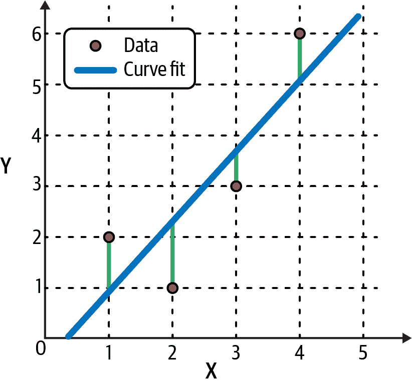

###### 图 7-1. 线性回归模型的最佳拟合线。残差是观测数据与拟合线之间的垂直线。¹

如图 7-1 所示，简单线性回归模型的目标（Y）只有一个特征（X），表达为：

+   Y = a + b × X + e，其中 a 和 b 是通过最小化残差 e = Y − Y′ 从训练数据中学习的常数。

多元线性回归模型使用多个特征的线性组合来预测目标。线性回归的一般形式表达为：

+   Y = b[0] + b[1] × X[1] + b[2] × X[2] + …+ b[n] × X[n] + e，其中 b[0] − b[n] 是从训练数据中学习的常数，通过最小化残差 e = Y − Y′。

需要注意的是，在线性模型中，必须使得系数（b[0] – b[n]）是线性的，而不是特征本身。回想一下第四章中提到的，一个依赖于现代投资组合理论和频率统计方法的金融分析师错误地假设，存在一个潜在的、时间不变的、随机过程来生成像股票这样的资产的价格数据。

## 市场模型

这个随机过程可以被建模为一个 MM，基本上是一个简单线性回归模型，股票的实现超额收益（目标）回归到整体市场的实现超额收益（特征），如下所示：

+   (R − F) = a + b (M − F) + e                      *(方程 7.1)*

+   Y = (R – F) 是目标，X = (M − F) 是特征。

+   R 是股票的实现收益。

+   F 是无风险资产的回报（如 10 年期美国国债）。

+   M 是市场投资组合（如标准普尔 500 指数）的实现收益。

+   a（alpha）是预期的特定股票收益。

+   b（贝塔）是对市场系统风险敞口的水平。

+   e（残差）是未预期的特定股票收益。

尽管这个潜在随机过程的 alpha 和 beta 参数可能是未知的或无法得知的，但分析师被误导认为这些参数是恒定的并且具有“真实”值。这个隐含的时间不变性随机过程的假设意味着，模型参数可以从涉及的各种证券的价格数据的任意随机样本中估计出来，这些数据跨越了相当长的时间。这个隐含假设被称为静态遍历条件。根据频率主义者的观点，样本到样本数据的随机性创造了真实固定参数估计的不确定性，这种参数的随机不确定性被残差 e = (Y – Y′) 所捕捉。

## 模型假设

许多分析师通常没有意识到，为了对模型参数做出合理的推断，他们必须基于高斯-马尔可夫定理对残差做进一步假设，即：

+   残差是独立同分布的。

+   残差的期望均值为零。

+   残差的方差是恒定的且有限。

## 使用 MLE 学习参数

如果分析人员假设残差服从正态分布，那么可以用基本的微积分证明，最大似然估计（MLE）的α和β两个参数与我们在高中学到并在第四章应用 Statsmodels 库中使用的 OLS 算法得到的值相同。这是因为这两种算法都在最小化均方误差或残差平方的期望值 E[(Y − Y′)²)]。然而，MLE 算法优于 OLS 算法，因为它可以适用于许多不同类型的似然函数。²

众所周知，尽管财务数据丰富，但它们的信噪比非常低。金融机器学习中最大的风险之一是数据的方差或过拟合。当模型在数据上训练时，算法学习的是噪声而不是信号。这导致模型参数估计在样本之间变化非常大。因此，模型在样本外测试中表现不佳。

在多元线性回归中，数据的过拟合也会发生，因为模型可能具有高度相关的特征。这也称为多重共线性，在金融和商业世界中很常见，特别是在金融困境时期，大多数特征都相互关联。

传统统计学家开发了两种临时方法称为正则化，通过在优化算法中创建惩罚项来减少噪声数据的过拟合，减少任何一个参数的影响。别管这是让“只让数据自己说话”的频率学派法则的反义。

有两种惩罚模型复杂性的正则化方法：

Lasso 或 L1 正则化

惩罚参数的绝对值之和。在 Lasso 回归中，许多参数都会被收缩到零。Lasso 也用于消除相关特征并改善复杂模型的解释性。

岭回归或 L2 正则化

惩罚参数系数的平方和。在岭回归中，所有参数都会被收缩到接近零，这减少了任何一个特征对目标变量的影响。

换句话说，L2 正则化不仅“让数据自己说话”，而且让所有声音都变得沉默，而 L1 正则化则让许多声音静音。当然，模型被正则化是为了使其在金融和投资中有用，那里的数据极其嘈杂，而以下的 Fisher 法则导致回归模型惨败并且亏损。

## 用置信区间量化参数不确定性

从训练数据估计模型参数后，分析师计算 alpha 和 beta 的置信区间，以量化它们的随机不确定性。大多数分析师不了解使用置信区间的三种错误类型，并不理解它们的缺陷，正如在第四章中所讨论的那样。如果他们了解的话，他们在金融分析中除了在中心极限定理适用的特殊情况下，将不会使用置信区间。

## 预测和模拟模型输出

现在线性模型已经建立，可以在未见数据上进行测试，以评估其用于估计和预测的实用性。与评估模型在训练数据上表现的评分算法相同，也会用于测试数据，计算其实用性。然而，要模拟数据，分析师将不得不建立一个单独的蒙特卡罗模拟（MCS）模型，如在第三章中讨论的那样。这是因为 MLE 模型不是生成模型。它们不会学习数据的潜在统计结构，因此无法模拟数据。

# 概率线性集成

在极大似然估计（MLE）建模中，财务分析师试图构建预计能够模拟“真实”模型的模型，这种模型被认为是最优的、优雅的和永恒的。在概率建模中，财务分析师摆脱了这种意识形态的负担。他们无需为其金融模型仅仅是近似、混乱和短暂而道歉，因为这些模型仅仅反映了数学和市场的现实。我们知道，所有模型都是错误的，无论它们是被视为预言还是可悲的。我们仅仅根据它们在实现我们的财务目标方面的有用性来评估它们。

使用概率框架的财务分析师不仅应用逆概率规则，还颠覆了 MLE 建模范式。他们摒弃了正统统计学的意识形态教条，转而采用常识和科学方法的原则，他们颠覆了数据和参数的传统处理方式：

+   超额回报的训练数据，如 Y = (R − F)和 X = (M − F)，被视为常数，因为它们的值已经实现和记录，永远不会改变。这就是常数意味着什么的典范。

+   模型参数，如 alpha（α）、beta（β）和残差（e），被视为具有概率分布的变量，因为它们的值是未知和不确定的。金融模型参数存在随机性、认知性和本体性不确定性。它们的估计值会随着使用的样本、应用的假设和涉及的时间段而变化。这就是变量意味着什么的本质。

分析师明白，寻找金融模型的任何“真实”恒定参数值是一件愚蠢的事情。这是因为市场的动态随机性及其参与者确保概率分布从不是静态遍历的。这些分析师痛苦地意识到，有创造力、自由意志、情感丰富的人类几乎每天都在嘲笑理论上基于 MLE 的“绝对主义”金融模型。频率主义者声称金融模型参数具有“真实”值简直是不科学、意识形态的废话。

我们将使用概率框架明确陈述我们的假设，并为到目前为止讨论过的概率框架中的所有术语分配具体的概率分布。每个概率分布都有额外的参数，分析师将必须估计这些参数。分析师必须指明他们选择的理由。如果在测试阶段模型失败，分析师将改变所有概率分布，包括它们的参数。所有的金融模型都是基于最基本的试错技术开发的。

在概率框架中，我们应用逆概率规则来估计我们的模型参数，如在 第五章 中发展的那样。设计完模型后，我们将使用 Python 和 PyMC 库开发它。基于 MM 定义的术语，概率线性集成（PLE）被表述为：

+   P(a, b, e| X, Y) = P(Y| a, b, e, X) P(a, b, e) / P(Y|X)，其中

+   Y = a + b × X + e，如 MLE 线性模型中所述，但不包括其明示或暗示的假设。这些将在 PLE 中明确指定。

+   P(a, b, e) 是在观察训练数据 (X, Y) 之前所有模型参数的先验概率。

+   P(Y| a, b, e, X) 是在给定参数 a, b, e 和特征训练数据 X 的情况下观察目标训练数据 Y 的似然性。

+   P(Y|X) 是观察到特征 X 的训练值的目标 Y 的边际似然性，平均值为所有可能先验参数 (a, b, e)。

+   P(a, b, e| X, Y) 是在观察训练数据 (X,Y) 后参数 a, b, e 的后验概率。

我们现在详细讨论 PLE 模型的每个组成部分。

## 先验概率分布 P(a, b, e)

在分析员看到任何训练数据（X, Y）之前，他们可以指定 PLE 参数（a, b, e）的先验概率分布，并量化其认识上的不确定性。所有先验分布假定彼此独立。这些先验分布可以基于个人、机构、经验或常识。如果分析员对参数没有任何先验知识，他们可以用均匀分布表达他们的无知，认为每个值在上限和下限之间是等可能的。请记住，除非您绝对确定参数可以取这些值，否则应避免设置上限和下限为 0 和 1。主要目标是明确和定量化最重要的模型假设之一。

鉴于模型易于过度拟合嘈杂的金融数据，这些数据没有任何持久的结构统一性，分析员意识到盲目遵循“只让数据说话”的正统格言是愚蠢的。在 MLE 模型中的正则化方法的特设使用仅仅是伪装的先验概率分布。可以数学上证明，L1 正则化等同于使用拉普拉斯先验，而 L2 正则化等同于使用高斯先验。³

分析员系统地遵循概率框架，并明确量化他们关于模型参数的知识或无知，使用先验概率分布。这使得模型透明，可以被任何人，尤其是投资组合经理，改变和批评。例如，分析员可以假设：

+   alpha 服从正态分布：a ~Normal()

+   beta 服从正态分布：b ~Normal()

+   残差是半学生 t 分布的：e ~HalfStudentT()

## 似然函数 P(Y| a, b, e, X)

分析员观察训练数据（X, Y）后，需要制定一个最适合该数据的似然函数，并量化模型参数（a, b, e）的随机不确定性。这与 MLE 线性模型中使用的似然函数相同。在标准线性回归中，假定残差（e）的似然函数是高斯或正态分布。然而，分析员使用学生 t 分布来模拟尾部肥厚的资产价格回报的金融实际情况。此外，如果似然函数能够像学生 t 分布一样容纳离群值，线性回归被称为健壮线性回归。

学生 t 分布是一类分布，可以根据其自由度参数 v 来逼近一系列其他概率分布，该参数是一个实数，可以从 0 到无穷大。对于较小的 v 值，学生 t 分布尾部肥厚，随着 v 的增大，趋于正态分布。重要的是要注意：

+   当 v ≤ 1 时，t-分布没有定义的均值和方差。

+   当 1 < v ≤ 2 时，t-分布具有定义的均值但没有定义的方差。

+   当 v > 30 时，t-分布近似正态分布。

假设分析员将 v = 6 分配给似然函数的学生 t-分布。为什么是 v = 6？金融研究和实践表明，这种 t-分布很好地描述了尾部股票价格回报。因此，我们将先前的共同知识应用于似然函数的选择。具体的似然函数可以数学表达为：

+   Y ~StudentT(u, e, v = 6)，其中 u = a + b × X，而 (a, b, e) 则由它们的先验概率分布定义。

## 边缘似然函数 P(Y|X)

这是最难计算的函数，因为它是在所有模型参数的似然函数上取平均。随着概率分布类型和参数数量的增加，复杂性也会增加。正如前面提到的，我们需要开创性的算法来数值近似这个函数。

## 后验概率分布 P(a, b, e| X, Y)

现在我们已经确定了我们的模型，我们可以计算所有模型参数 (a, b, e) 在给定训练数据 (X,Y) 的后验概率。总结一下，我们的模型规定如下：

+   Y ~StudentT(u, e, v = 6)

+   u = a + b × X

+   a ~Normal()，b ~Normal()，e ~HalfStudentT()

+   X,Y 是一个样本时间段内反映当前市场情况的训练数据对。

模型参数及其概率分布以及它们之间的关系显示在 图 7-2 中。

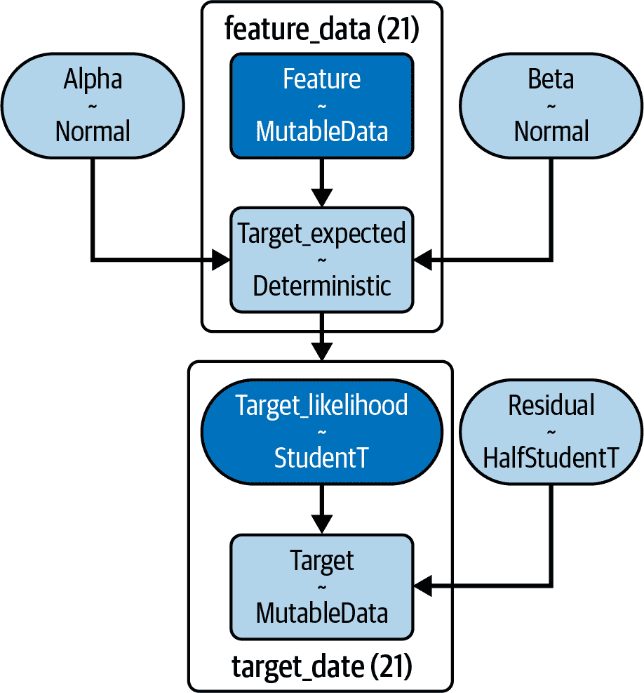

###### 图 7-2\. 概率市场模型显示用于参数的先验分布及用于拟合训练数据的似然函数。

由于任何现实模型的复杂性，尤其是边缘似然函数，我们只能近似计算其每个参数的后验分布。PyMC 使用先进的 MCMC 算法来模拟后验分布，通过从中抽样，正如第六章所讨论的那样。然后我们使用 ArviZ 库来探索这些样本，从而能够从中得出推断和预测。

# 使用 PyMC 和 ArviZ 组装 PLEs

现在让我们通过利用其强大的库生态系统在 Python 中构建我们的 PLE。除了 NumPy、pandas 和 Matplotlib 的标准 Python 栈之外，我们还将使用 PyMC、ArviZ 和 Xarray 库。正如之前提到的，PyMC 是 Python 中最流行的概率机器学习库。ArviZ 是一种概率语言无关的用于分析和可视化概率集合的工具。它将概率集合的推断数据转换为 Xarray 对象，这些对象是标记的、多维的数组。您可以搜索网络以获取先前提到的库的相关文档链接。

构建任何类型的集成都需要一个系统化的过程，我们的 PLE 也不例外。我们将按照 图 7-3 中概述的高层次集成构建过程。每个阶段及其组成部分将与相关代码一起解释。需要注意的是，即使我们将按顺序进行集成构建过程，但在实践中这是一个迭代的、非线性的过程。例如，您可以轻松地在训练阶段和分析特征和目标数据阶段之间来回切换。有了这种非线性性质，让我们开始第一个阶段。

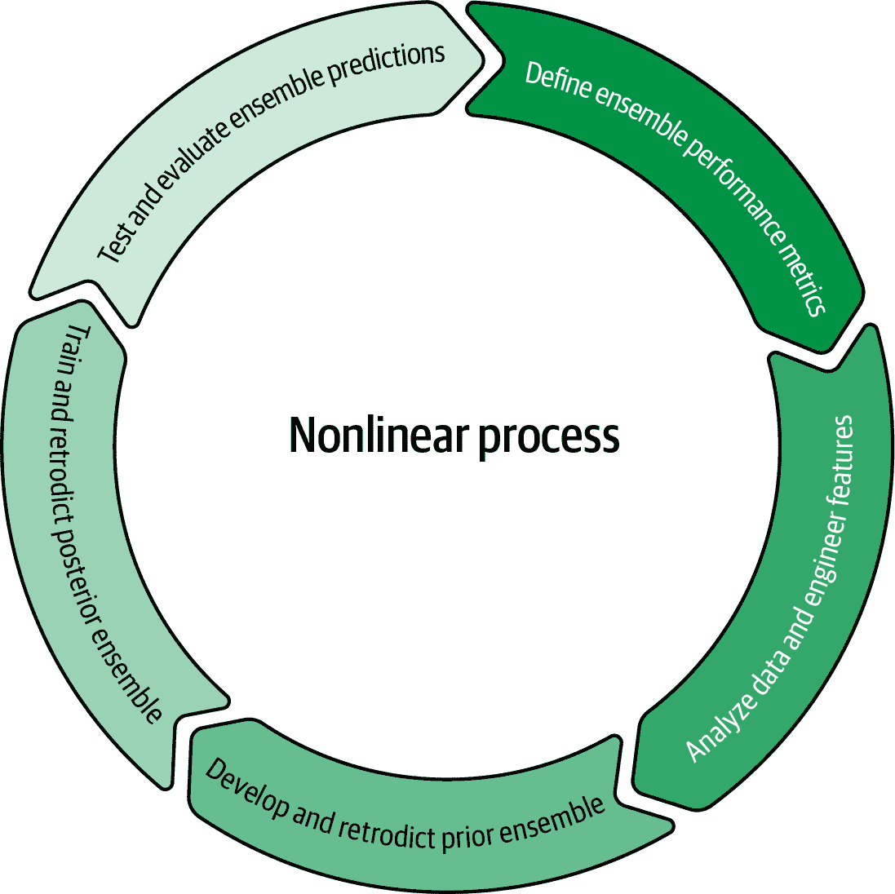

###### 图 7-3\. 用于组装概率学习集合的高级过程

## 定义集成性能指标

我们的金融目标和活动应该推动我们构建 PLE 的努力。因此，这影响了我们用来评估其性能的度量标准。我们的金融任务通常是估计金融模型的参数或预测其输出或两者兼而有之。正如您现在所知，概率机器学习系统非常适合这两项任务，因为它们无缝地进行逆传播和正向传播。更重要的是，这些生成集合引导我们考虑我们正在解决的问题及其可能解决方案的不确定性。

### 金融活动

方程式 7.1 中回归参数 alpha 和 beta 的合理估计是行业中几种金融活动所必需的：

詹森的 alpha

通过将基金的回报与其基准投资组合的回报进行回归，投资者通过估计回归的 alpha 参数来评估基金经理的技能。这个度量标准在行业中被称为詹森的 alpha。

市场中性策略

Alpha 也可以被视为与市场动态无关的特定资产预期收益率。如果基金经理发现这种回报率非常吸引人，他们可以尝试通过对冲资产市场波动的暴露来孤立并捕捉它。这还涉及估计资产的贝塔（beta），或对市场敏感性的评估。包含该资产和对冲的投资组合变得对市场的变化不敏感或中性。

交叉对冲

假设方程式 7.1 中残差的方差恒定不变，可以数学上显示贝塔参数与一个资产（Y）的波动性和另一个相关资产（X）的波动性相关。企业财务部门的交叉对冲计划利用这种与贝塔相关的相关性，通过另一个相关商品（例如石油）对公司所需的商品（例如喷气燃料）进行对冲。财务部门在开放市场购买或出售期货等金融工具，以对冲其输入成本。

股本成本

公司财务分析师通过估计回归方程式 7.1 中的实现回报率 R 来估算其公司股本的成本。这被认为是公众股东要求的其股票的预期收益率。许多分析师仍然使用其股票的 CAPM 模型，并通过在方程式 7.1 中使 alpha = 0 来估计 R。

在本章中，我们将通过使用其 MM 而不是 CAPM 来估计苹果公司的股本回报率，原因详见第四章。我们将估计给定当前市场制度的苹果公司超额回报（R - F）的后验概率分布。这种生成线性合奏可以应用于前述的所有财务活动中。

### 目标函数

一个旨在衡量模型或合奏性能的规则被称为目标函数。这个函数通常衡量合奏的估计或预测与相应实现或观察值之间的差异。在机器学习回归模型中，用于衡量预测值与观察值之间差异的常见目标函数包括均方误差（MSE）和中位绝对误差（MAE）。选择目标函数取决于我们试图解决的业务问题。减少损失/成本的目标函数称为损失/成本函数。

另一个回归目标函数是 R 平方。在频率统计学中，它被定义为预测值的方差除以数据的总方差。请注意，R 平方可以数学上解释为需要最大化的标准化 MSE 目标函数：

+   R 平方(Y) = 1 - MSE(Y) / Var(Y)

由于我们在概率模型中处理的是偶然性和认知不确定性，因此必须修改此 R 平方公式，以便其值不超过 1。概率版本的 R 平方被修改为等于预测值的方差除以预测值的方差加上误差的预期方差。 它可以解释为方差分解。 我们将称这个版本的 R 平方目标函数为*概率 R 平方*。

### 性能指标

正如前面提到的，金融数据非常嘈杂，这意味着我们需要对每个开发阶段建立的性能指标保持现实。 至少，我们希望我们的模型比随机猜测做得更好，即，我们希望性能得分大于 50%。 我们希望我们的 PLE 达到或超过以下性能指标：

+   概率 R 平方先验分数 > 55%

+   概率 R 平方训练得分 > 60%

+   概率 R 平方测试得分 > 65%

+   最高密度区间（HDIs）：90% HDI 包含几乎所有训练和测试数据（HDI 将很快解释）

请记住，所有这些度量标准将基于个人和组织的偏好，并且是不完美的，就像用于生成它们的模型一样。 这需要判断力和领域专业知识。 尽管如此，我们将使用这些指标作为另一个输入来帮助我们评估我们的 PLE，批评它，并修订它。 在实践中，我们修改我们的 PLE，直到我们确信它将为我们想要应用它的金融活动提供足够高的预期正值。 只有在那之后我们才会将我们的 PLE 部署到实验室之外。

## 分析数据和工程特征

我们已经对目标和特征进行了数据分析，在第四章和重新编写方程 7.1 中进行了分析。

### 数据探索

一般来说，在这个阶段，您将定义您感兴趣的目标，例如预测资产价格回报或估计波动性。 这些目标变量是实值数字，被称为回归目标。 或者，感兴趣的目标也可以是基于预测公司是否会违约的预测的分类。 这些是取值为离散数字（如 0 或 1）的分类目标。

接下来，您将确定各种数据源，这些数据源将使您能够对您的目标和特征进行足够详细的分析。 数据源可能很昂贵，您将不得不想出如何以成本有效的方式获得它们。 清理和处理来自各种来源的数据通常非常耗时。

### 特征工程

记住，特征是作为独立变量的数据表示，使模型的目标变量推断或预测成为可能。特征工程是选择、设计和开发一组有用的特征的实践，这些特征共同作用，使得在样本外数据上能够可靠地推断或预测目标变量。

要预测目标变量（例如价格回报），模型可以拥有许多不同类型的特征。以下是各种类型特征的例子：

基本面

公司销售，利率，汇率，GDP 增长率

技术

动量指标，资金流动，流动性

情绪

消费者情绪，投资者情绪

其他

专有的数学或统计指标

在选择和开发了一组可能的特征之后，通常建议使用特征级别的相对变化，而不是绝对水平，作为输入到您的特征数据框架中。这减少了金融时间序列中普遍存在的串行自相关。串行相关发生在一个变量在时间上与其自身的过去值相关联的时候。交易员和投资者通常有兴趣了解一个好的或坏的条件是变好还是变差。因此，市场参与者通常在百分比或差异的相对变化上持续反应水平。

如果我们有多个特征，我们需要检查它们是否彼此高度相关。回顾一下，这个问题被称为多重共线性。高度相关的特征可以在数据中过度放大相同的信号，导致无效的推断和预测。理想情况下，特征之间应该没有相关性或者没有多重共线性。不幸的是，这在实践中几乎从不发生。确定一个阈值方差，高于这个阈值的特征应该被移除，这是基于业务背景的判断调用。

特征工程对所有机器学习系统的性能至关重要。它需要领域专业知识、判断力、经验、常识以及大量的试错。这些是使人类智慧能够区分相关性和因果关系的特质，而目前 AI 能力仍无法做到。

在本篇介绍中，我们将保持特征工程的简单性，并利用市场模型上的广泛金融知识和经验。我们的 PLE（预测建模环境）只有一个特征：由标准普尔 500 指数代表的市场。

### 数据分析

PLEs 在我们拥有小数据集时展现出其优势，这样弱或平坦的先验就不会被似然函数所压倒。在过去的去年的最后两个月，即从 11/15/2022 到 12/31/22，我们将观察 31 天的数据。这个时期涵盖了两次联邦储备委员会会议，并且异常波动。我们将在前 21 天的数据上训练我们的 PLE，并在最后 10 天的数据上进行测试。这被称为时间序列拆分的交叉验证方法。由于金融时间序列具有较强的串行相关性，我们不能使用标准的交叉验证方法，因为它假设每个数据样本都是独立且同分布的。

让我们实际下载苹果公司、标准普尔 500 指数和 10 年期国库券的价格数据，并像我们对线性 MM 所做的那样计算每日价格回报率：第四章。

```py
# Import standard Python libraries.
import numpy as np
import pandas as pd
from datetime import datetime
import xarray as xr
import matplotlib.pyplot as plt

# Install and import PyMC and Arviz libraries.
!pip install pymc -q
import pymc as pm
import arviz as az
az.style.use('arviz-darkgrid')

# Install and import Yahoo Finance web scraper.
!pip install yfinance -q
import yfinance as yf

# Fix random seed so that numerical results can be reproduced.
np.random.seed(101)

# Import financial data.
start = datetime(2022, 11, 15)
end = datetime(2022, 12, 31)

# S&P 500 index is a proxy for the market factor.
market = yf.Ticker('SPY').history(start=start, end=end)
# Ticker symbol for Apple, the largest company in the world 
# by market capitalization.
stock = yf.Ticker('AAPL').history(start=start, end=end)
# 10 year US treasury note is the proxy for risk free rate.
riskfree_rate = yf.Ticker('^TNX').history(start=start, end=end)

# Create a dataframe to hold the daily returns of securities.
daily_returns = pd.DataFrame()
# Compute daily percentage returns based on closing prices for Apple and 
# S&P 500 index.
daily_returns['market'] = market['Close'].pct_change(1)*100
daily_returns['stock'] = stock['Close'].pct_change(1)*100
# Compounded daily risk free rate based on 360 days for the calendar year 
# used in the bond market.
daily_returns['riskfree'] = (1 + riskfree_rate['Close']) ** (1/360) - 1

# Check for missing data in the dataframe.
market.index.difference(riskfree_rate.index)
# Fill rows with previous day's risk-free rate since 
# daily rates are generally stable.
daily_returns = daily_returns.ffill()
# Drop NaNs in first row because of percentage calculations 
# are based on previous day's closing price.
daily_returns = daily_returns.dropna()
# Check dataframe for null values.
daily_returns.isnull().sum()
# Check first five rows of dataframe.
daily_returns.head()

# Daily excess returns of AAPL are returns in excess of 
# the daily risk free rate.
y = daily_returns['stock'] - daily_returns['riskfree']
# Daily excess returns of the market are returns in excess of 
# the daily risk free rate.
x = daily_returns['market'] - daily_returns['riskfree']

# Plot the excess returns of Apple and S&P 500.
plt.scatter(x,y)
plt.ylabel('Excess returns of Apple'), 
plt.xlabel('Excess returns of S&P 500');

# Plot histogram of Apple's excess returns during the period.
plt.hist(y, density=True, color='blue')
plt.ylabel('Probability density'), plt.xlabel('Excess returns of Apple');

# Analyze daily returns of all securities.
daily_returns.describe()

# Split time series sequentially because of serial correlation 
# in financial data.
test_size = 10

x_train = x[:-test_size]
y_train = y[:-test_size]

x_test = x[-test_size:]
y_test = y[-test_size:]

```

## 开发和反推先验集合

让我们开始使用 PyMC 库开发我们的 PLE。在这一点上，我们明确陈述了我们集合的假设，即参数的先验概率分布和似然函数。这还包括我们关于底层数据生成过程的功能形式的假设，即线性加上一些噪声。

之后，我们检查集合的先验预测分布是否生成了可能发生在过去的、现在在我们的训练数据样本中的数据。对过去事件的预测称为反推，并用作模型检查，在训练之前和之后。如果由先验集合生成的数据不合理，因为它们不在我们的最高密度区间内，我们会修正我们所有的模型假设。

### 指定分布及其参数

我们通过指定其参数的先验概率分布 P(a)、P(b) 和 P(e) 将我们的先验知识纳入集合中。之后，我们指定了在给定参数时观察数据的似然性，即 P(D | a, b, e)。

在下面的 Python 代码块中，我们选择了学生 t 分布，其自由度为 6，作为我们集合的似然函数。当然，我们也可以将 nu 添加为另一个需要推断的未知参数。然而，这只会增加复杂性，而不会增加对开发过程的理解。

```py
# Create a probabilistic model by instantiating the PyMC model class.
model = pm.Model()

# The with statement creates a context manager for the model object.
# All variables and constants inside the with-block are part of the model.

with model:
  # Define the prior probability distributions of the model's parameters. 
  # Use prior domain knowledge.

  # Alpha quantifies the idiosyncratic, daily excess return of Apple 
  # ​unaffected by market movements.
  # Assume that alpha is normally distributed. The values of mu and 
  # sigma are based on previous data analysis and trial and error.
  alpha = pm.Normal('alpha', mu=0.02, sigma=0.10)

  # Beta quantifies the sensitivity of Apple to the movements 
  # of the market/S&P 500.
  # Assume that beta is normally distributed. The values of mu and 
  # sigma are based on previous data analysis and trial and error.
  beta = pm.Normal('beta', mu=1.2, sigma=0.15)

  # Residual quantifies the unexpected returns of Apple 
  # i.e returns not predicted by the linear model.
  # Assume residuals are Half Student's t-distribution with nu=6\. 
  # Value of nu=6 is based on research studies and trial and error.
  residual = pm.HalfStudentT('residual', sigma=0.20, nu=6)

  # Mutatable data containers are used so that we can swap out 
  # training data for test data later.
  feature = pm.MutableData('feature', x_train, dims='feature_data')
  target = pm.MutableData('target', y_train, dims='target_data')

  # Expected daily excess returns of Apple are approximately 
  # linearly related to daily excess returns of S&P 500.
  # The function specifies the linear model and the expected return. 
  # It creates a deterministic variable in the trace object.
  target_expected = pm.Deterministic('target_expected', 
  alpha + beta * feature, dims='feature_data')

  # Assign the training data sample to the likelihood function.
  # Daily excess stock price returns are assumed to be T-distributed, nu=6.
  target_likelihood = pm.StudentT('target_likelihood', mu=target_expected, 
  sigma=residual, nu=6, observed=target, dims='target_data')

```

图 7-2 是通过以下代码中所示的 `graphviz` 方法生成的：

```py
# Use the graphviz method to visualize the probabilistic model's data, 
# parameters, distributions and dependencies
pm.model_to_graphviz(model)
```

### 采样分布并模拟数据

在我们训练模型之前，我们应该检查先验集合假设的有效性。目标是确保集合对训练阶段足够好。通过进行所谓的先验预测检查来完成这一点。我们使用集合的先验预测分布来模拟可能在过去实现的数据分布。回顾这被称为回测，与预测相对应，后者模拟未来最可能发生的数据分布。

在以下代码块中，我们从先验预测分布中模拟了 21,000 个数据样本。我们让 ArviZ 返回`InferenceData`对象，以便我们可以可视化和分析生成的数据样本。在推断对象返回后展开显示以检查各组的结构。我们将需要它们进行分析和推断：

```py
# Sample from the prior distributions and the likelihood function 
# to generate prior predictive distribution of the model.
# Take 1000 draws from the prior predictive distribution 
# to simulate (1000*21) target values based on our prior assumptions.
idata = pm.sample_prior_predictive(samples=1000, model=model, 
return_inferencedata=True, random_seed=101)

# PyMC/Arviz returns an xarray - a labeled, multidimensional array 
# containing inference data samples structured into groups. Note the 
# dimensions of the prior predictive group to see how we got (1*1000*21) 
# simulated target data of the prior predictive distribution.
idata

```

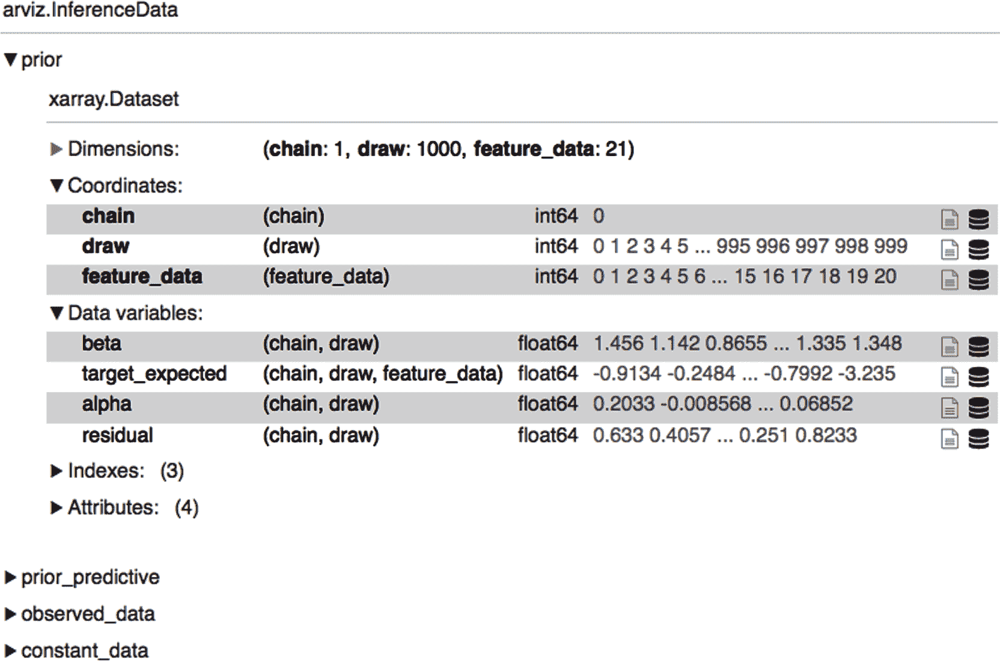

让我们在进行先验预测检查之前，绘制每个参数的边际先验分布。请注意，核密度估计是连续变量的平滑直方图：

```py
# Subplots on the left show the kernel density estimates (KDE) of 
# the marginal prior probability distributions of model parameters 
# from the 1000 samples drawn. Subplots on the right show the parameter 
# values from a single Markov chain that were sampled sequentially 
# by the NUTS sampler, the default regression sampler.
az.plot_trace(idata.prior, kind='trace', 
var_names = ['alpha', 'beta', 'residual'], legend=True);

```

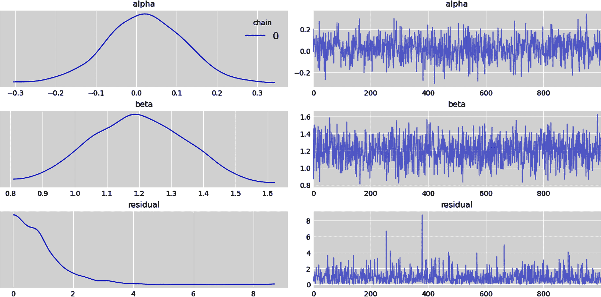

```py
# Plot the marginal prior distributions of each parameter with 94% 
# highest density intervals (HDI).
# Note the residual subplot shows the majority of probability density function
# within 3 percentage points and the rest extending out into a long tail.
# In Arviz, there is no method to plot the prior marginal distributions but we 
# can hack the plot posterior method and use the prior group instead.
az.plot_posterior(idata.prior, 
var_names = ['alpha', 'beta', 'residual'], round_to=2);

```

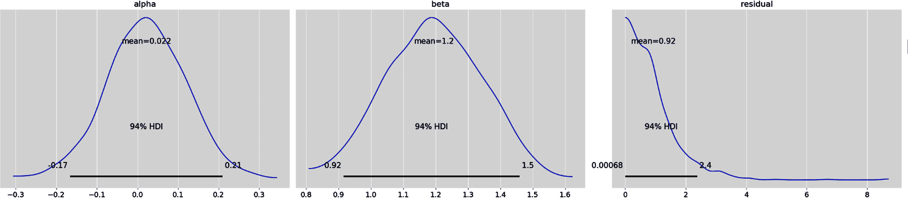

```py
# Plot the joint prior probability distribution of alpha and beta with their 
# respective means and marginal distributions on the side.
# Hexabin plot below shows little or no linear correlation with the high 
# concentration areas in the heat map forming a cloud.
az.plot_pair(idata.prior, var_names=['alpha', 'beta'], kind='hexbin', 
marginals=True, point_estimate='mean', colorbar=True);

```

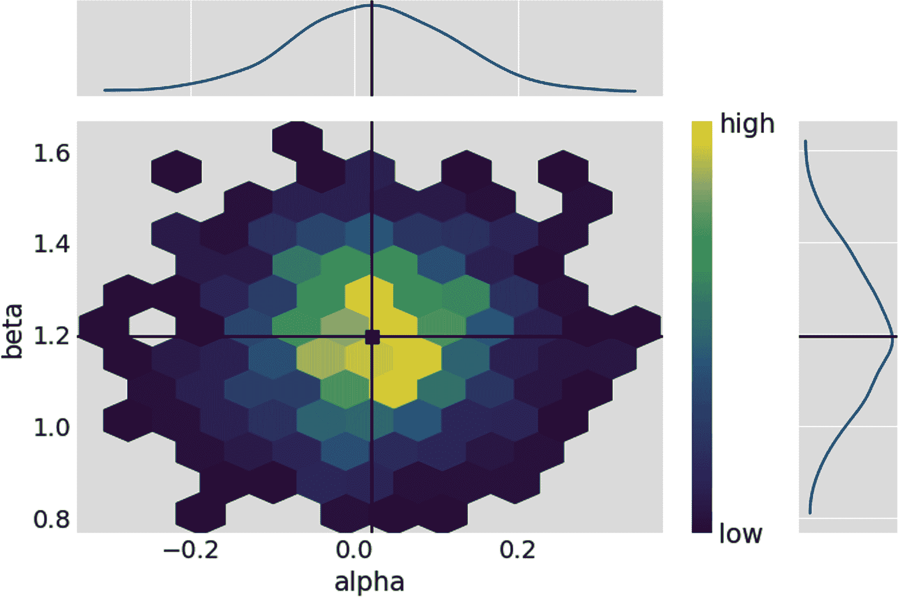

让我们创建一个包含 1000 条回归线的先验集合，每条线对应集合参数（a, b）的一个取样自其先验分布的值，并绘制未经训练的线性集合的先验均值周围的认知不确定性。我们还使用集合的先验预测分布来模拟数据。这显示了数据分布的认知和偶然不确定性。请注意，训练数据被绘制以便为我们提供一些背景和集合回测的基准：

```py
# Plot the retrodictions of prior predictive ensemble.

# Retrieve feature and target training data from the constant_data group.
# Feature is now an Xarray instead of a panda's series, 
# a requirement for ArviZ data analysis.
feature_train = idata.constant_data['feature']
target_train = idata.constant_data['target']

# Generate 1000 linear regression lines based on 1000 draws from one 
# Markov chain of the prior distributions of alpha and beta.
# Prior target values are in 1000 arrays with each array having 21 samples,
# the same number of samples as our training data set.
prior_target = idata.prior["alpha"] + idata.prior["beta"] * feature_train

# Prior_predictive is the data generating distribution of the untrained ensemble.
prior_predictive = idata.prior_predictive['target_likelihood']

# Create figure of subplots
fig, ax = plt.subplots()

# Plot epistemic and aleatory uncertainties of untrained 
# ensemble's retrodictions.
az.plot_lm(idata=idata, x=feature_train, y=target_train, 
num_samples=1000, y_model = prior_target, 
y_hat = prior_predictive, axes=ax)

#Label the figure.
ax.set_xlabel("Excess returns of S&
P 500")
ax.set_ylabel("Excess returns of Apple")
ax.set_title("Retrodictions of untrained linear ensemble")
ax.legend(loc='upper left');
```

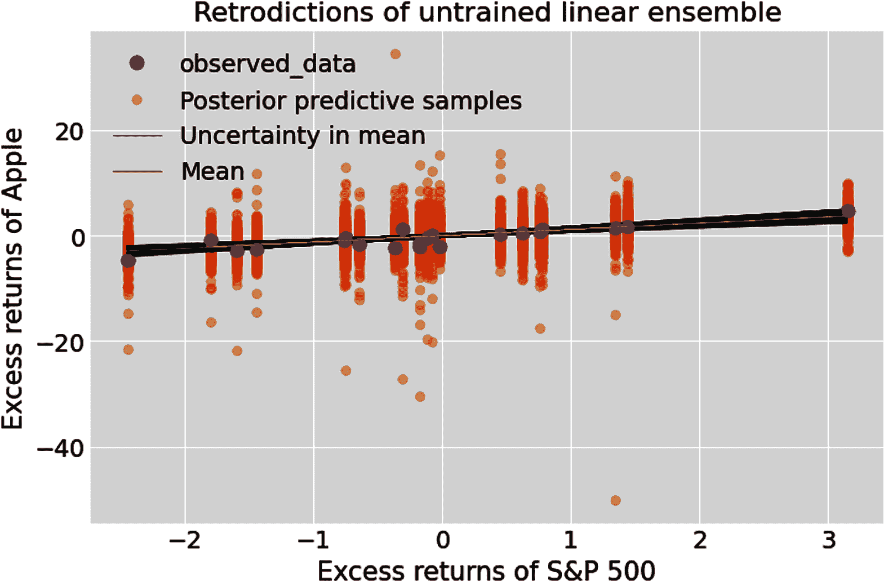

非常重要的是观察到，随着我们远离图的中心，线性集合的认知不确定性增加。承认对任何模型的无知是我们所追求的：随着其移动到没有数据且必须外推的区域，预期值的不确定性应该增加。我们的集合知道它的局限性。

这在下一个图中更清楚地显示出来，我们将先验预测数据样本生成并分布到 90%高密度区间（HDI），然后进行先验预测检查：

```py
# Plot 90% HDI of untrained ensemble.
# This will show the aleatory (data related) and epistemic 
# (parameter related) uncertainty of model output before it is trained.

# Create figure of subplots.
fig, ax = plt.subplots()

# Plot the ensemble of 1000 regression lines to show the 
# epistemic uncertainty around the mean regression line.
az.plot_lm(idata=idata, x=feature_train, y=target_train, 
num_samples=1000, y_model = prior_target, axes=ax)

# Plot the prior predictive data within the 90% HDI band to 
# show both epistemic and aleatory uncertainties.
az.plot_hdi(feature_train, prior_predictive, hdi_prob=0.90, smooth=False)

# Label figure.
ax.set_xlabel("Excess returns of S&P 500")
ax.set_ylabel("Excess returns of Apple")
ax.set_title("90% HDI for simulated samples of untrained linear ensemble")
ax.legend();

```

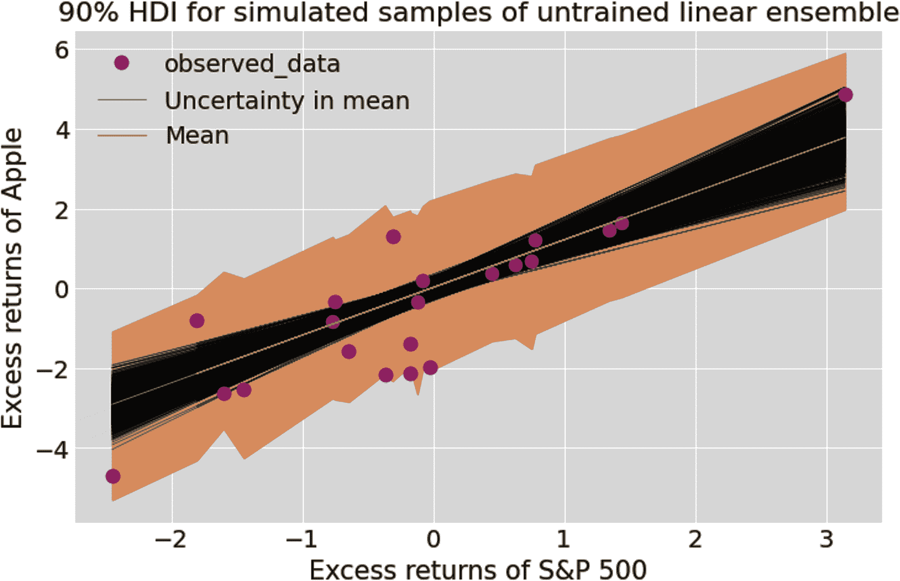

```py
# Conduct a prior predictive check of the untrained linear ensemble.
# Create figure of subplots.
fig, ax = plt.subplots()
# Plot the prior predictive check
az.plot_ppc(idata, group='prior', kind='cumulative', 
num_pp_samples=1000, alpha=0.1, ax=ax)

# Label the figure.
ax.set_xlabel("Simulated Apple excess returns")
ax.set_ylabel("Cumulative Probability")
ax.set_title("Prior predictive check of untrained linear ensemble");

```

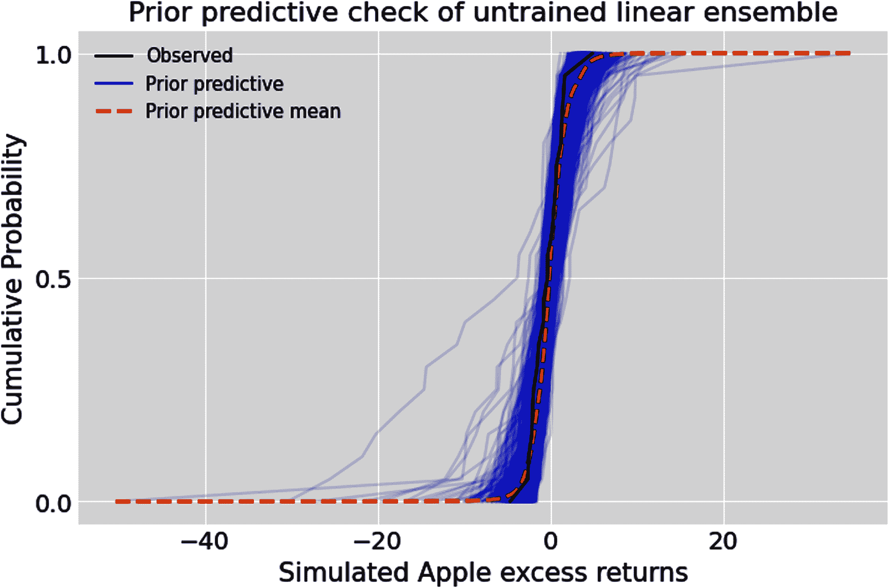

### 评估和修订未训练的模型

指定概率模型从未容易，需要多次修订。让我们使用定性和定量的先验预测检查来看看我们的先验模型是否合理并准备好进行训练。从最近的图表可以看出，我们的集合在 90% HDI 带内模拟了所有训练数据。然而，先验预测检查显示了一些低概率的极端回报，在最近的过去并未发生。现在让我们计算概率 R 平方度量来评估集合在训练之前的回测：

```py
# Evaluate untrained ensemble's retrodictions by comparing simulated 
# data with training data.

# Extract target values of our training data.
target_actual = target_train.values

# Sample the prior predictive distribution to simulate 
# expected target training values.
target_predicted = idata.prior_predictive.stack(sample=("chain", "draw"))
['target_likelihood'].values.T

# Use the probabilistic R-squared metric.
prior_score = az.r2_score(target_actual, target_predicted)
prior_score.round(2)

```

先验整体的概率 R 平方指标为 61%，标准偏差为 10%。这超过了我们对先验模型的 55%的性能基准。

请注意，这种表现是通过对先验模型的多次修订而实现的，我改变了先验分布的各种参数值。我还尝试了不同的分布，包括 alpha 参数的均匀先验。所有先验分数均大于 55%，而您在此处看到的接近中位数分数。请随意对先验模型进行修改，直到您满意为止，确保您的整体模型是合理的并且可以通过内样本数据进行训练。

## 训练和回溯后验模型

现在我们有一个准备好进行训练的整体模型，我们对其反映了先验知识的信心，包括其参数的认知不确定性和可能生成的数据的不确定性。让我们使用实际的内样本数据对其进行训练，计算后验分布。

### 训练和采样后验

我们执行 PyMC 的默认采样器，即 Hamiltonian Monte Carlo (HMC)算法，这是第二代 MCMC 算法。PyMC 指示 HMC 从所有参数的联合后验分布中生成依赖性随机样本：

```py
# Draw 1000 samples from two Markov chains resulting in 2000 values of each
# parameter to analyze the joint posterior distribution.
# Check for any divergences in the progress bar. We want 0 divergences for a 
# reliable sampling of the posterior distribution.
idata.extend(pm.sample(draws=1000, chains=2, model=model, random_seed=101))

```


评估 MCMC 采样质量是一个高级主题，不在本入门指南的讨论范围内。由于马尔可夫链中没有发散，让我们分析每个参数的边际分布并对其进行推断：

```py
# Subplots on the left show the kernel density estimates (KDE)
# of the marginal posterior probability distributions of each parameter.
# Subplots on the right show the parameter values 
# that were sampled sequentially in two chains by the NUTS sampler
with model:
  az.plot_trace(idata.posterior, kind='trace',
  var_names = ['alpha', 'beta', 'residual'], legend=True)

```

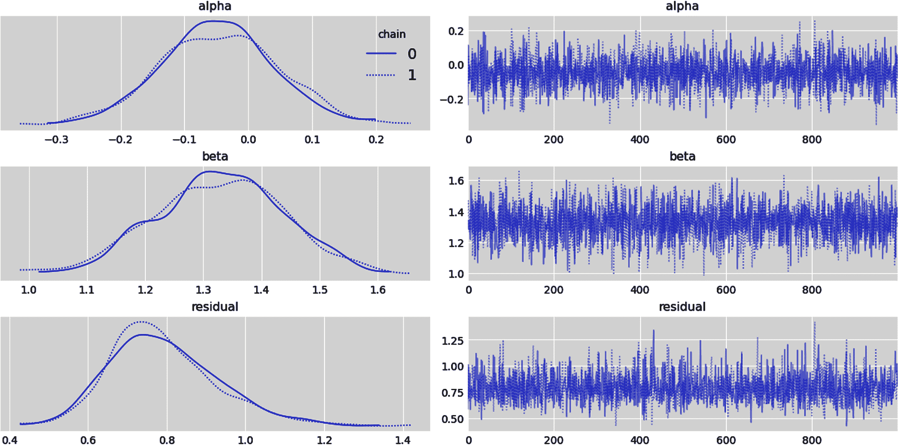

```py
# Plot the joint posterior probability distribution of alpha and beta 
# with their respective means and marginal distributions on the side.
# Hexabin plot below shows little or no linear correlation with the 
# high concentration areas in the heat map forming a cloud.
az.plot_pair(idata.posterior, var_names=['alpha', 'beta'], kind='hexbin',
marginals=True, point_estimate='mean', colorbar=True);

```

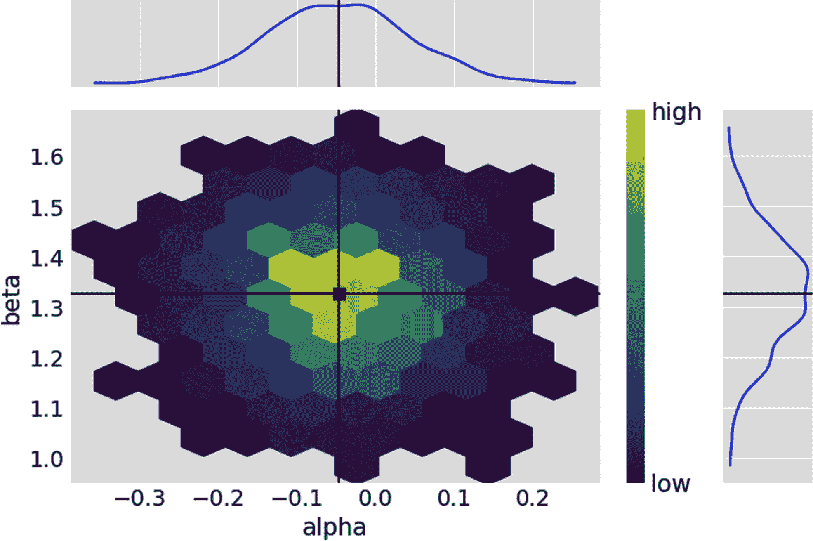

我们可以将后验分布总结为一个 pandas DataFrame 如下：

```py
# Examine sample statistics of each parameter's posterior marginal distribution, 
# including it's 94% highest density interval (HDI).
display(az.summary(idata, kind='stats', 
var_names = ['alpha', 'beta', 'residual'], round_to=2, hdi_prob=0.94))

```

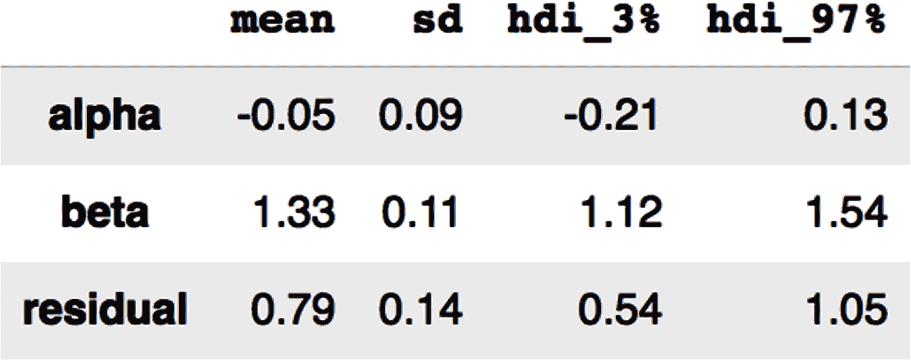

这个统计摘要为所有参数提供了平均值、标准差和 94%可信区间。请注意，94%可信区间是通过最高密度区间（HDI）计算得出的：hdi_97% – hdi_3% = hdi_94%。

与讨论第四章中频繁主义置信区间的把戏不同，可信区间正是置信区间所假装的但实际上并非如此。可信区间是一种后数据方法，用于从单个实验中进行有效的统计推断。这正是我们作为研究人员、科学家和从业者所需要的。例如，总结表中 beta 的 94%可信区间意味着以下内容：

+   beta 在*特定区间[1.12 和 1.55]*内的概率为 94%。就是这么简单。与置信区间不同，我们不必处理一些扭曲的定义，这些定义无法解释任何常识的影响。

+   没有任何分布的渐近正态性假设。

+   没有不诚实地引用中心极限定理。

+   Beta 不是仅具有偶然不确定性的点估计。

+   我们对 beta 的确切值一无所知。在社会和经济科学的实际场景中，我们几乎不可能知道任何模型参数的确切值。

+   像 beta 这样的参数最好解释为具有偶然和认识不确定性的概率分布。

+   将像 beta 这样的参数建模和解释为不可知变量，而不是不可知常数，更符合实际。

需要注意的是，在后验分布中，可信区间并不唯一。我们的首选方法是在后验分布中选择概率密度最高的最窄区间。这样的区间也被称为最高密度区间（HDI），这是本章节中我们一直在遵循的方法。

PyMC/ArviZ 开发者为何选择默认的可信区间为 94% 或许让你感到疑惑。这是一个提醒，没有物理或社会经济法律规定我们必须选择 95% 或其他特定百分比。我认为这是对传统统计界的微妙讽刺，因为社会和经济科学中神化了 95% 显著水平。无论如何，ArviZ 提供了更改默认区间的方法，如下面的代码块所示：

```py
# Change the default highest density interval to 90%
az.rcParams['stats.hdi_prob'] = 0.90
```

有助于可视化我们模型参数的后验分布，以评估不同概率下的可信区间。以下图表展示了三个参数的 70% 可信区间：

```py
# Plot the marginal posterior distribution of each parameter displaying 
# the above statistics but now within a 70% HDI
az.plot_posterior(idata, var_names = ['alpha', 'beta', 'residual'], 
hdi_prob=0.70, round_to=3);
```

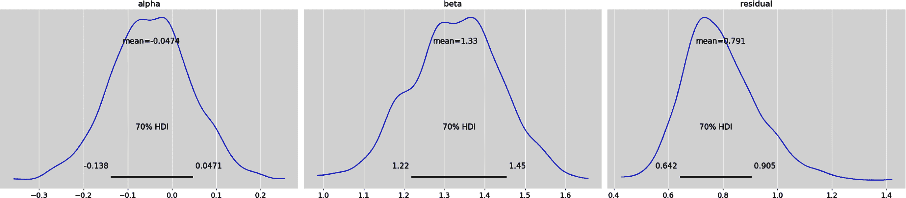

大多数情况下，我们必须评估点估计以做出我们的金融和投资决策。我们可以根据参数后验概率分布的位置来评估任何参数的点估计 = 1.15 的可信度。例如，如果我们想评估 beta 的点估计 = 1.15，我们可以将其作为参考值与 HDI 进行比较，如下所示的代码：

```py
# Evaluate a point estimate for a single parameter using its 
# posterior distribution.
az.plot_posterior(idata, 'beta', ref_val=1.15, hdi_prob=0.80, 
point_estimate='mode', round_to=3);

```

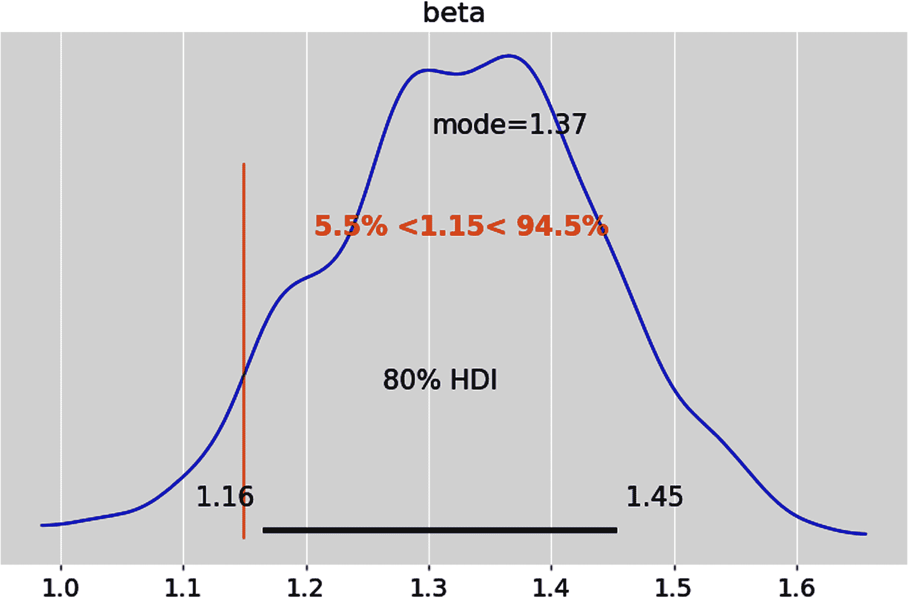

这个图表表明，分布的 94.5% 在 beta = 1.15 以上。由于只有 5.5% 的分布在其下方，所以 beta = 1.15 位于分布的左尾部。请注意，这两个百分比可能因为四舍五入误差而不加总为 100%。因此，合理推断 beta = 1.15 不是最佳估计。

### 逆推和模拟训练数据

现在我们使用后验预测分布（PPD）来模拟训练集中的数据，并遵循我们在先验预测分布中所做的相同步骤。这将帮助我们评估集合训练的效果：

```py
# Draw 1000 samples each from two Markov chains of the 
# posterior predictive distribution.
with model:
  pm.sample_posterior_predictive(idata, extend_inferencedata=True, 
  random_seed=101)

```

```py
# Generate 2000 linear regression lines based on 1000 draws each from 
# two chains of the posterior distributions of alpha and beta.
# Posterior target values are in 2000 arrays, each with 21 samples, 
# the same number of samples as our training data set.
posterior = idata.posterior
posterior_target = posterior["alpha"] + posterior["beta"] * feature_train

# Posterior_predictive is the data generating distribution of the 
# trained ensemble.
posterior_predictive = idata.posterior_predictive['target_likelihood']

# Create figure of subplots.
fig, ax = plt.subplots()

# Plot epistemic and aleatory uncertainties of trained 
# ensemble's retrodictions.
az.plot_lm(idata=idata, x=feature_train, y=target_train, num_samples=2000,
y_model = posterior_target, y_hat=posterior_predictive, axes=ax)

# Label the figure.
ax.set_xlabel("Excess returns of S&P 500")
ax.set_ylabel("Excess returns of Apple")
ax.set_title("Retrodictions of the trained linear ensemble")
ax.legend(loc='upper left');

```

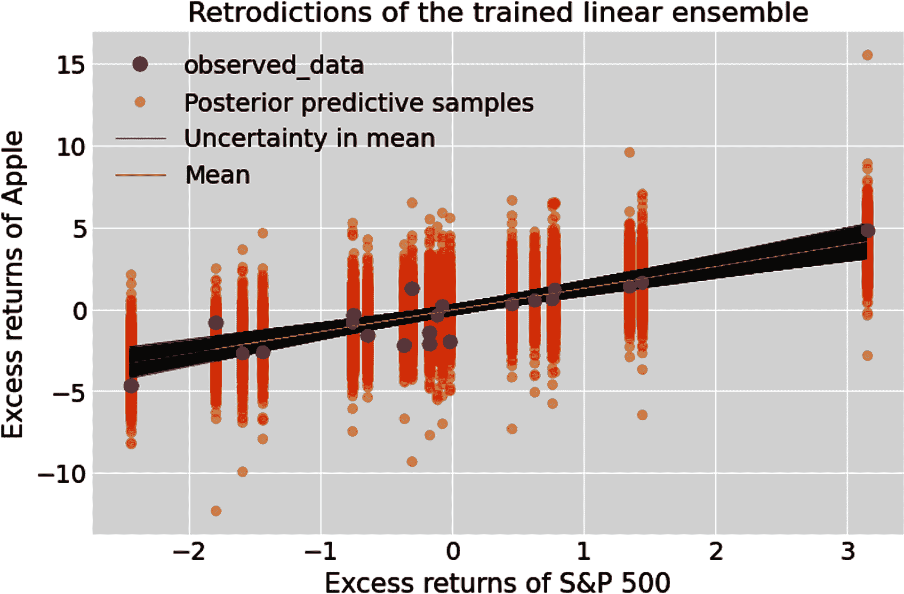

```py
# Plot 90% HDI of trained ensemble.
# This will show the aleatory (data related) and epistemic 
# (parameter related) uncertainty of model output after it is trained.

# Create figure of subplots.
fig, ax = plt.subplots()

# Plot the ensemble of 2000 regression lines to show the epistemic 
# uncertainty around the mean regression line.
az.plot_lm(idata=idata, x=feature_train, y=target_train, num_samples=1000,
y_model = posterior_target, axes=ax)

# Plot the posterior predictive data within the 90% HDI band to show both 
# epistemic and aleatory uncertainties.
az.plot_hdi(feature_train, posterior_predictive, hdi_prob=0.90, smooth=False)

# Label the figure
ax.set_xlabel("Excess returns of S&P 500")
ax.set_ylabel("Excess returns of Apple")
ax.set_title("90% HDI for simulated samples of trained linear ensemble");

```

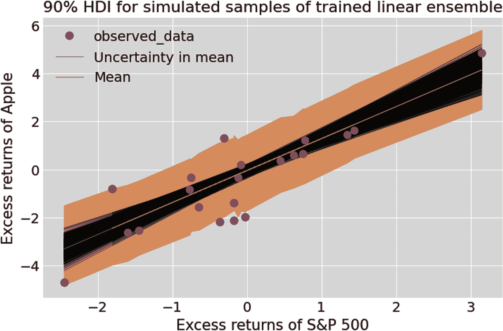

```py
# Conduct a posterior predictive check of the trained linear ensemble.

# Create a figure of subplots.
fig, ax = plt.subplots()

# Plot the posterior predictive check.
az.plot_ppc(idata, group='posterior', kind='cumulative', 
num_pp_samples=2000, alpha=0.1, ax=ax)

# Label the figure.
ax.set_xlabel("Simulated Apple excess returns given training data")
ax.set_ylabel("Cumulative Probability")
ax.set_title("Posterior predictive check of trained ensemble");

```

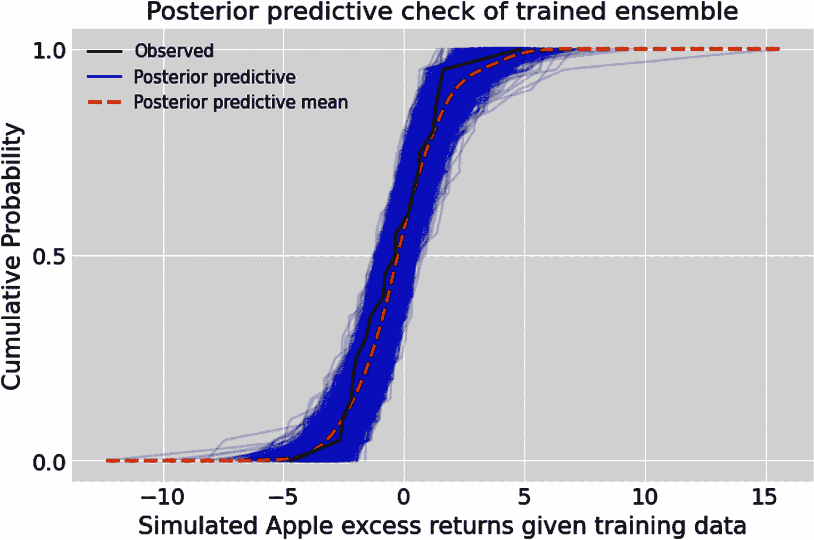

### 评估和修订训练模型

正如我们之前所做的，让我们使用定性和定量检查来查看我们的后验模型是否合理，并准备好进行测试。后验预测检查向我们展示了一系列与苹果最近的历史回报更一致的回报范围。从其追溯预测中，我们可以看到我们的集成已在 90% HDI 带内模拟了大部分它所训练的训练数据。现在让我们计算概率 R 平方指标来评估训练集成的性能：

```py
# Evaluate trained ensemble's retrodictions by comparing
# simulated data with training data.

# Get target values of our training data
target_actual = target_train.values

# Sample the posterior predictive distribution 
# conditioned on training data.
target_predicted = idata.posterior_predictive.stack(sample=("chain", "draw"))
['target_likelihood'].values.T

# Compute probabilistic R-squared performance metric.
training_score = az.r2_score(target_actual, target_predicted)
training_score.round(2)

```

后验集成的概率 R 平方指标为 65%，标准差为 8%。与未训练的集成相比，这是一个性能改进。我们可以进行这种比较，因为我们使用相同的数据集进行性能比较。它还超过了 60%的训练分数基准。我们的集成已准备好进行其主要测试：基于样本外或未见过的测试数据的预测。

## 测试和评估集成预测

我们现在确信，我们训练的集成反映了我们的先验知识和从样本内数据中获得的新学习。此外，集成已经根据训练数据更新了其参数概率分布，包括它们的认识不确定性。因此，集成生成的数据分布也已更新，包括它们的偶然不确定性。

带我们到这里的各种步骤都是必要的，但不足以决定我们是否要将我们的集成预测的硬赚资本承诺下去。对于任何 ML 系统来说，最重要的测试之一是它在先前未见的样本外测试数据上的表现。

### 交换数据并重新采样后验预测分布

PyMC 提供了可变数据容器，使得在不对集成做任何其他更改的情况下可以交换训练数据和测试数据。现在，我们必须使用新的测试数据重新对后验预测分布进行重采样，以用于我们的目标和特征。

```py
# Now we use our trained model to make predictions based on test data. 
# This is the reason we created mutable data containers earlier.
with model:
    #Swap feature and target training data for their respective test data.
    pm.set_data({'feature': x_test, 'target': y_test})
    #Create two new inference groups, predictions and predictions_constant_data 
    #for making predictions based on features in the test data.
    pm.sample_posterior_predictive(idata, return_inferencedata=True, 
    predictions=True, extend_inferencedata=True, random_seed=101)

```

### 预测和模拟测试数据

这创建了一个名为预测的新推断组。我们重复了在训练阶段所做的相同步骤，但使用测试数据：

```py
# Get feature and target test data.
feature_test = idata.predictions_constant_data['feature']
target_test = idata.predictions_constant_data['target']

# Prediction target values are in 2000 arrays, each with 10 samples,
# the same number of samples as our test data set. Predict target values 
# based on posterior values of regression parameters and feature test data.
prediction_target = posterior["alpha"] + posterior["beta"] * feature_test

# Predictions is the data generating posterior predictive distribution 
# of the trained ensemble based on test data.
simulate_predictions = idata.predictions['target_likelihood']

# Create figure of subplots.
fig, ax = plt.subplots()

# Plot the 2000 regression lines showing the epistemic and 
# aleatory uncertainties of out-of-sample predictions.
az.plot_lm(idata=idata, x=feature_test, y=target_test, num_samples=2000, 
y_model = prediction_target, y_hat=simulate_predictions, axes=ax)

# Label figure
ax.set_xlabel("Excess returns of S&P 500")
ax.set_ylabel("Excess returns of Apple")
ax.set_title("Predictions of trained linear ensemble")
ax.legend(loc='upper left');

```

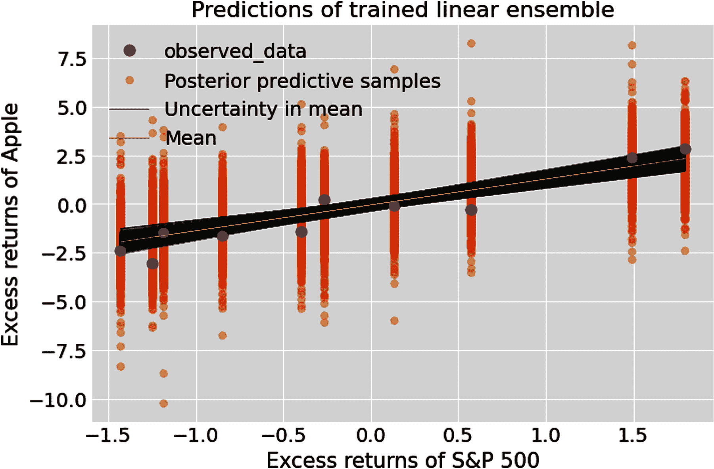

```py
# Plot 90% HDI of trained ensemble. This will show the aleatory 
# (data related) and epistemic (parameter related) uncertainty 
# of trained model's predictions based on test data.

# Create figure of subplots.
fig, ax = plt.subplots()

# Plot the ensemble of 2000 regression lines to show the epistemic uncertainty 
# around the mean regression line.
az.plot_lm(idata=idata, x=feature_test, y=target_test, 
num_samples=2000, y_model = prediction_target, axes=ax)

# Plot the posterior predictive data within the 90% HDI band 
# to show both epistemic and aleatory uncertainties.
az.plot_hdi(feature_test, simulate_predictions, 
hdi_prob=0.90, smooth=False)

# Label the figure.
ax.set_xlabel("Excess returns of S&P 500")
ax.set_ylabel("Excess returns of Apple")
ax.set_title("90% HDI for predictions of trained linear ensemble")
ax.legend();

```

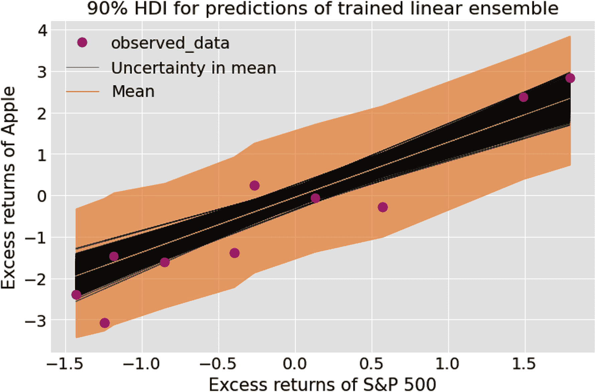

### 评估、修订或部署集成

从最近的图中，我们可以看到我们的集成在 90% HDI 带内模拟了所有的测试数据。让我们计算概率 R 平方指标来评估集成的预测性能：

```py
# Evaluate out-of-sample predictions of trained 
# ensemble by comparing simulated data with test data.

# Get target values of the test data.
target_actual = target_test.values

# Sample ensemble's predictions based on test data.
target_predicted = idata.predictions.stack(sample=("chain", "draw"))
['target_likelihood'].values.T

# Compute the probabilistic R-squared performance metric.
test_score = az.r2_score(target_actual, target_predicted)
test_score.round(2)

```

经过测试的集成的概率 R 平方指标为 69%，标准差为 13%。它优于我们的训练分数，并超过了 65%的测试分数基准。我们已准备将经过测试的集成部署到我们的模拟交易系统或其他使用实时数据源和虚拟资本的模拟金融系统中。这使我们能够在准备将其投入生产并将真正的资本投入到我们的系统之前，在实时环境中评估我们的集成表现。

# 摘要

在本章中，我们看到概率线性回归（PLE）建模与传统的最大似然估计（MLE）建模有根本的区别。概率框架为一般情况下的物理现象建模和特定的金融现实提供了系统化方法。

传统的金融模型使用 MLE 方法计算适合数据的参数的最优值。如果我们处理的是时间不变的统计分布，那将是合适的。但在金融领域，这是不适当的，因为我们没有这样的时间不变分布。从嘈杂的金融数据中学习最优参数值是次优的和风险的。在这种情况下，我们不应该依赖一个专家，而是依赖于一群专家，他们可以为多种可能的情景提供合理的综合意见。这正是概率集合为我们所做的。它为我们提供了模型参数所有估计的加权平均值。

在概率回归建模中，与传统的线性建模相反，数据被视为固定的，而参数被视为变量，因为常识和事实支持这种方法。不需要像 L1 和 L2 正则化那样的常规使用临时方法，这些方法仅仅是伪装成先验概率分布。最重要的是，在概率范式中，我们摆脱了“让数据自己说话”的意识形态口号以及存在“真实模型”或“真实参数”的非科学主张。

概率集合并不对分析优雅性做任何假设。它们不会用点估计和仅适用于玩具问题的伪分析解决方案让我们对我们的金融活动产生虚假的安全感。概率集合是量化无规和认知不确定性的数值模型。这些模型适用于金融和投资的固有不确定性。最重要的是，它提醒我们关于我们知识、推论和预测的不确定性。

在接下来的章节中，我们将探讨如何在面对三维不确定性和不完整信息的情况下，应用我们的概率估计和预测进行决策。

# 参考文献

Dürr, Oliver, and Beate Sick. *Probabilistic Deep Learning with Python, Keras, and TensorFlow Probability*. Manning Publications, 2020.

Gelman Andrew, Ben Goodrich, Jonah Gabry, and Aki Vehtari. “R-Squared for Bayesian Regression Models.” *The American Statistician* 73, no. 3 (2019): 307–309\. [*https://doi.org/10.1080/00031305.2018.1549100*](https://doi.org/10.1080/00031305.2018.1549100).

Murphy, Kevin P. *Machine Learning: A Probabilistic Perspective*. Cambridge, MA: The MIT Press, 2012.

# 进一步阅读

Martin, Osvaldo A., Ravin Kumar, and Junpeng Lao. *Bayesian Modeling and Computation in Python*. 1st ed. Boca Raton, FL: CRC Press, 2021.

¹ 改编自维基共享资源上的一幅图像。

² Oliver Dürr 和 Beate Sick，《使用似然方法构建损失函数》，收录于《Python、Keras 和 TensorFlow Probability 的概率深度学习》（Manning Publications, 2020），第 93–127 页。

³ Kevin P. Murphy，《稀疏线性模型》，收录于《机器学习：概率视角》（The MIT Press, 2012），第 421–78 页。

⁴ Andrew Gelman 等，《贝叶斯回归模型的 R 平方》，《The American Statistician》73 卷 3 期（2019 年）：第 307–309 页，[*https://doi.org/10.1080/00031305.2018.1549100*](https://doi.org/10.1080/00031305.2018.1549100)。
