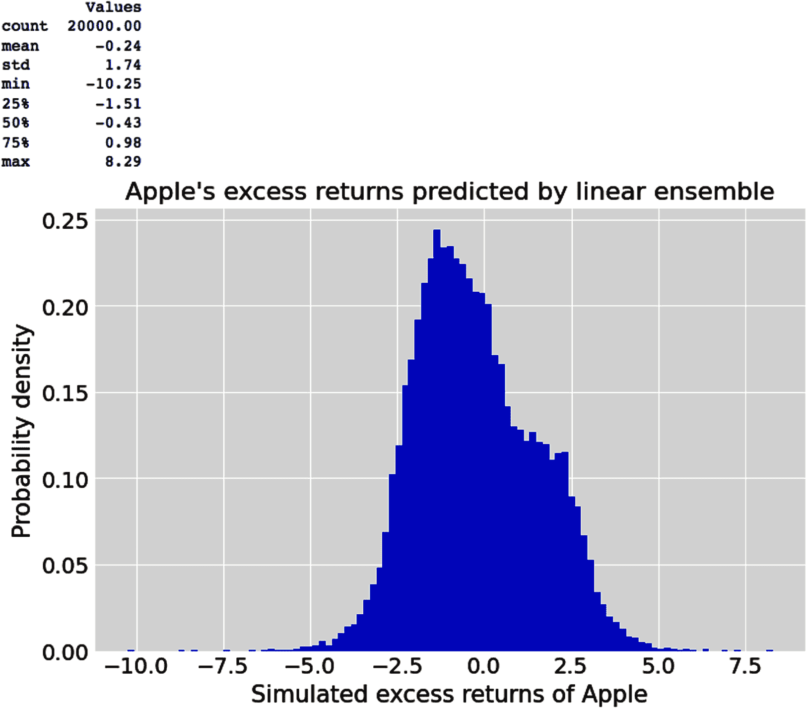
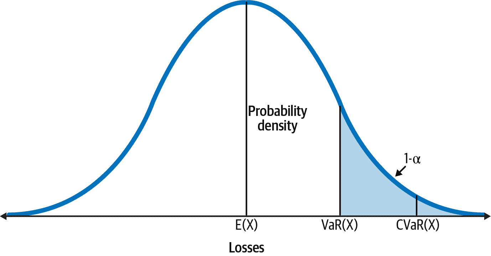
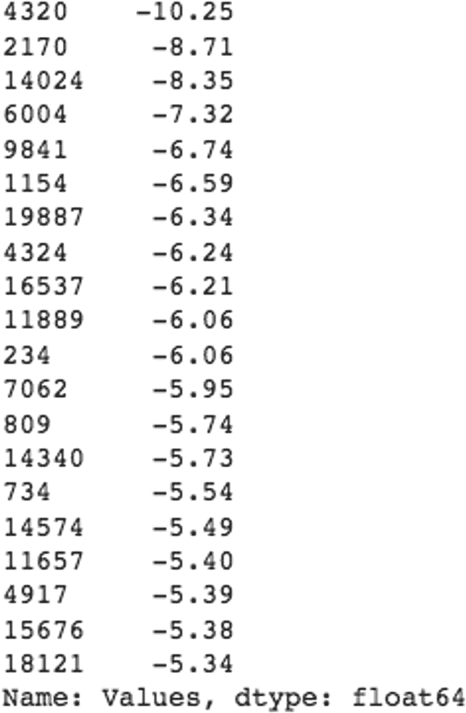
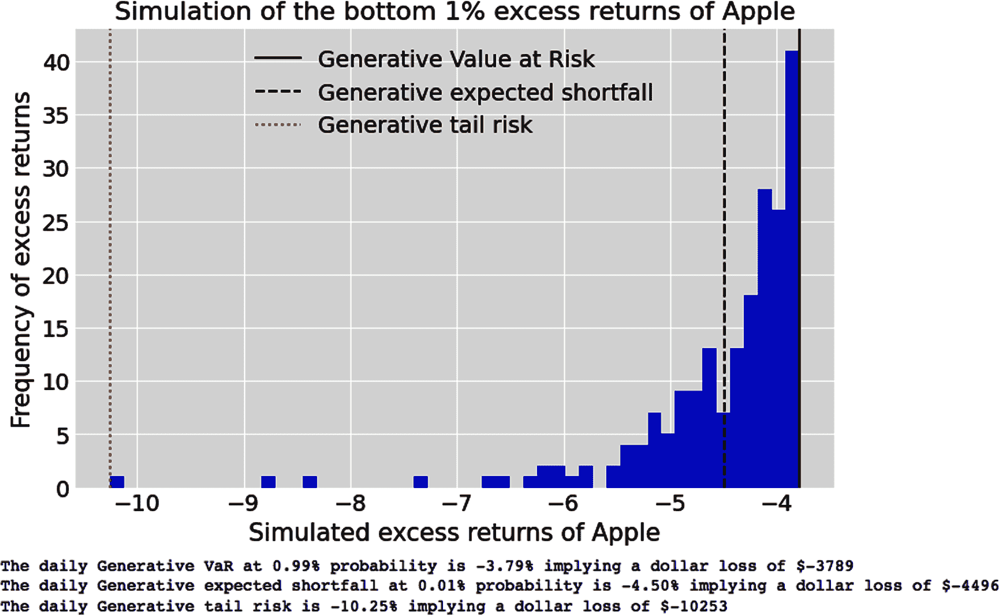
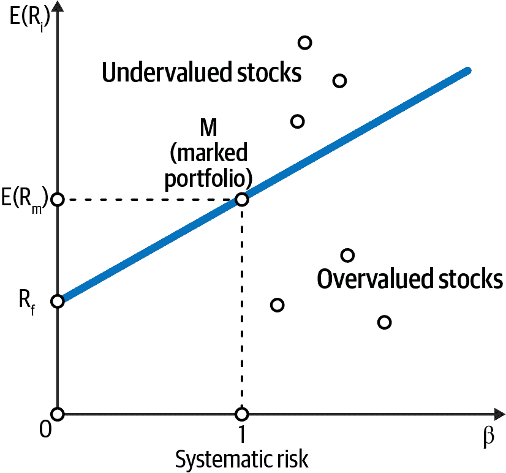
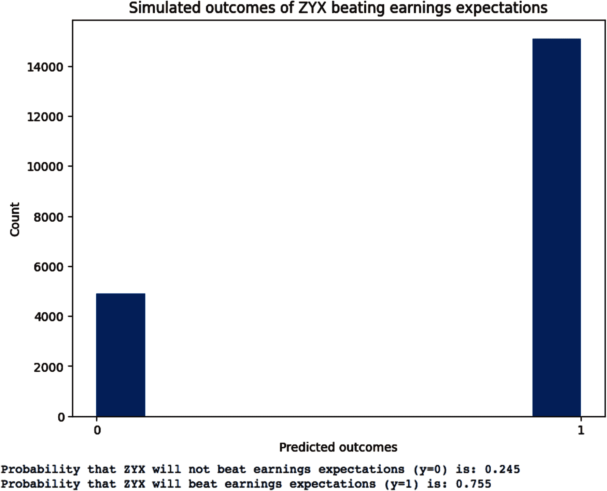
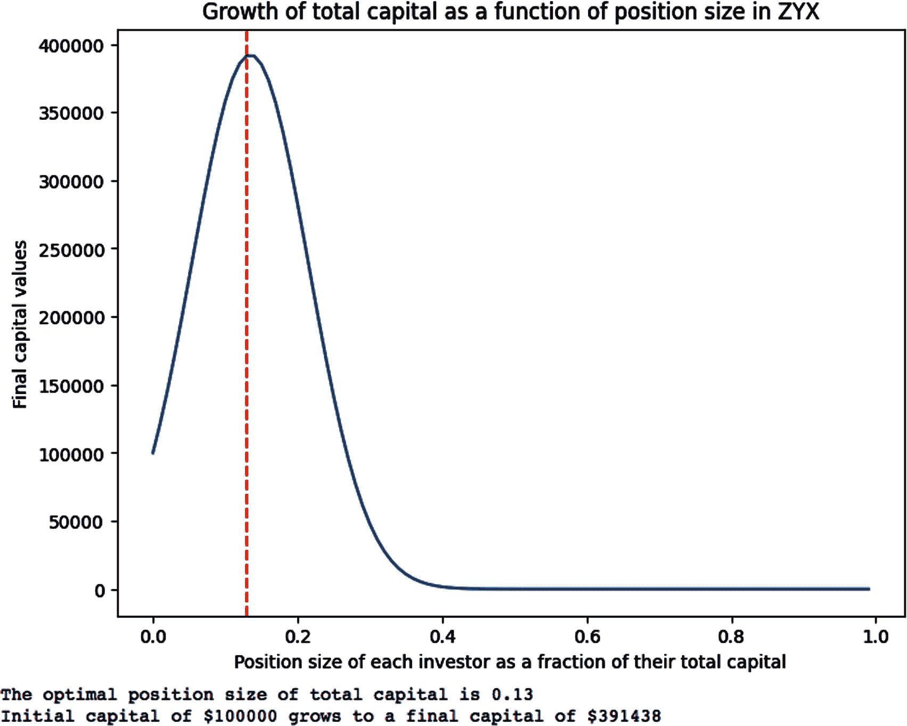
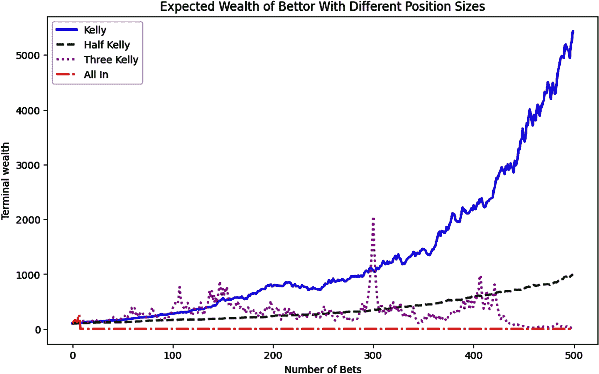

# 第八章：利用生成式集成进行概率决策

> 但我意识到，随着游戏的进行，胜率实际上取决于剩余牌堆中还有哪些牌，并且随着游戏的进行，这一优势会发生变化，有时候更有利于赌场，有时候则更有利于玩家。
> 
> ——Edward O. Thorp 博士，有史以来最伟大的量化赌徒和交易员

在前一章中，我们设计、开发、训练和测试了一个生成式线性回归线集合。概率线性回归与频率主义或传统线性回归有根本区别，如第四章所介绍的。首先，频率主义线性回归生成单一回归线，其参数经过优化以适应由既非平稳又非遍历的随机过程生成的嘈杂金融数据集。而概率线性回归生成多条回归线，每条对应不同的参数组合，能够以不同的可能性拟合观察到的数据分布，同时与先验知识和模型假设保持一致。

生成式集成具有不断学习和修订模型参数的良好特性，同时明确陈述从数据和显式陈述的过去知识中得出的模型参数。真正区分生成式集成与传统对手的是，它们能够无缝地模拟新数据和以观察数据和模型假设为条件的反事实知识，而不管数据集的大小或数据的顺序如何。

生成式集成在透明的模型假设和概率计算的严谨性下进行所有这些活动，同时适当地缩放此类预测和反事实知识中固有的偶然性和认知不确定性。概率模型了解其局限性，并通过在其外推中扩展其最高密度区间来诚实地表达其无知。

在前三章中，我们主要专注于推断我们集成参数的分布。在本章中，我们将注意力集中在使用我们训练和测试的生成式集成的模拟输出来在面对三维不确定性和不完整信息时做出财务和投资决策上。换句话说，我们的重点将放在我们模型的数据生成后验预测分布上，而不是其参数的后验分布。总体而言，集成的输出对于决策者来说更为重要和必需，例如，股价回报的分布对高级管理人员和客户比使用模型生成它们的α和β参数的分布更有意义。

在回顾本书中使用的概率推断和预测框架后，我们通过使用客观函数系统化我们的决策方法。在概率决策制定的第一个示例中，我们探讨了如何使用框架将主观人类行为与数据客观性和概率计算的严谨性结合起来。金融与投资涉及人而不是粒子或摆锤，一个不能整合人类内在主观性的决策框架是毫无用处的。这也强调了决策制定既是一门艺术又是一门科学，其中人类的常识和判断至关重要。

风险管理和企业财务主管常用的两个损失函数是风险价值（VaR）和预期缺口（ES）。我介绍了计算这些风险度量的新方法，作为生成集成的一个组成部分。为了正确使用集成平均数及其模拟数据，我们探讨了遍历性的统计概念，以理解为什么预期值或集成平均数存在严重局限，不像传统经济理论所说的那样有效。

最后，我们探讨了如何在不会有任何财务破产风险的情况下，将我们辛苦赚来的资本分配到有利的投资机会上的复杂问题。我们研究了赌博和投资之间的区别，做出关于一次性投资和一系列投资的决策。我们应用了马尔科维茨的均值方差和凯利的资本增长投资标准这两个最重要的资本分配算法，并分析了它们的优势和劣势。

# 概率推断与预测框架

让我们回顾并总结本书下半部分使用的框架，以推断模型参数、逆推样本训练数据分布以及预测样本外测试数据分布。我们将通过使用来自第五章的债务违约示例来说明这一框架——在您作为投资高收益债务或“垃圾”债券的对冲基金分析师时：

1.  指定在样本空间中可能发生的所有场景或事件结果。场景 S[1] 和 S[2] 是我们想要估计的模型参数：

    +   S[1] 是 XYZ 投资组合公司违约其债务义务的场景。S[2] 是它不违约的场景。

    +   场景 S[1] 和 S[2] 是互斥且完全穷尽的，这意味着 P(违约) + P(不违约) = 1。

1.  研究并利用与问题领域相关的任何个人、机构、科学和常识，这些可能有助于您设计模型并在观察任何新数据之前为样本空间中的各种参数分配先验概率。这是模型的先验概率分布。

    +   您的对冲基金管理团队利用其经验、专业知识和机构知识来估计参数 S[1] 和 S[2] 的以下先验概率：

        +   P(default) = 0.10 和 P(No default) = 0.90

1.  应用类似的先验知识和领域专业知识来为每个模型参数指定似然函数。了解从您的参数模型可能生成哪些数据。

    +   您使用了基金专有的 ML 分类系统，利用了有关债务违约者和非违约者的宝贵数据库的特征。特别是，您基金的分析师发现最终违约的公司会积累 70% 的负面评价。然而，最终未违约的公司只会积累 40% 的负面评价。

    +   模型的似然函数为：P(negative | default) = 0.70 和 P(negative | no default) = 0.40

1.  使用模型的先验预测分布生成数据 D′。该模型通过在其参数的先验概率分布上平均似然函数来生成尚未见过的数据。先验预测分布作为一个初始模型检查，通过模拟我们可能过去观察到的数据来进行。先验预测分布是对过去数据的逆向预测。通常，我们可以将数据分布与我们的先验知识进行比较。特别是，我们可以将其模拟数据与训练数据进行比较。

    +   基于您模型的所有假设编码在您的先验概率分布和似然函数中，您可以期望 XYZ 投资组合公司以以下概率生成负面和正面评级：

    +   P(negative) = P(negative | default) P(default) + P(negative | no default) P( no default) = (0.70 × 0.10) + (0.40 × 0.90) = 0.43

    +   P(positive) = P(positive | default) P(default) + P(positive | no default) P( no default) = (0.30 × 0.10) + (0.60 × 0.90) = 0.57

1.  通过观察样本内数据 D 进行先验预测检查，并将其与上一步生成的模拟数据进行比较。

    +   如果数据的逆向预测符合您的要求，则模型已准备好进行训练，您应该进入下一步。

    +   否则，请审查参数以及先验概率分布和似然函数的函数形式。

    +   重复步骤 2–4，直到模型通过您的先验预测检查并准备好进行训练。

1.  将逆概率规则应用于更新模型参数的分布。我们模型的后验概率分布根据实际训练数据更新我们的先验参数估计。

    +   您观察到一个负面评级，并将 XYZ 公司的违约后验概率更新如下：

    +   P(default | negative) = P(negative | default) P(default) / P(negative) = (0.70 × 0.10)/0.43 = 0.16

1.  使用模型的后验预测分布生成数据 D″。训练模型通过在更新参数的后验概率分布上对似然函数进行平均，模拟尚未见到的数据。后验预测分布充当第二个模型检查，通过回推训练过的样本数据并预测我们可能在后续测试中观察到的样本外或测试数据分布。

    +   基于模型先验概率分布中编码的所有模型假设、似然函数和新观察到的负面评级，您可以预期 XYZ 投资组合公司将以以下更新的概率生成新的正面评级“positive″和负面评级“negative″：

    +   P(negative″ | negative) = P(negative″ | default) P(default | negative) + P(negative″ | no default) P( no default | negative) = (0.70 × 0.16) + (0.40 × 0.84) = 0.35

    +   P(positive″) = 1 − P(negative″) = 0.65

现在我们面临着关于我们推断结果的输出中最重要的决策之一：我们将如何应用其结果来做出决策，以便在不完全信息和三维不确定性面前增加实现我们目标的几率？

# 概率决策框架

为了在面对不完全信息和不确定性时做出系统化决策，我们需要指定一个客观函数。损失函数是一种特定类型的客观函数，其目标是最小化我们根据推理和预测所做每个决策的预期值或加权平均损失¹。简单来说，损失函数量化我们基于我们所做推断和预测的每个决策的损失。

让我们继续通过我们的债务违约示例来理解损失函数的作用以及如何将其应用于由我们的生成集成模拟的结果。然后我们将其推广，以便我们可以应用于任何使用任何类型的客观函数进行的决策活动。

## 集成主观性

最困难的决策是涉及情况的客观逻辑和涉及的各种人的同样理性的主观自我利益之间复杂相互作用的决策。当然，我们为不同决策分配的损失数值可以是主观的。在这种情况下，损失的绝对数值并不重要。重要的是我们一致地校准损失，以反映从我们所做各种决策中逻辑上产生的后果的重要性。

假设您正在上述对冲基金中担任分析师。基本上，您的工作是在数据分析方面表现出色，并遵循您的投资组合经理的指示，特别是关于任何投资组合公司债券的风险限制。在您的工作中面临的最大风险是被解雇并失去主要收入来源。以下是您在投资管理初期职业生涯中可能面临的情景：

+   由于连续两次负面评级，XYZ 公司债券的违约概率现在为 25%。

+   你的投资组合经理已指示你在 XYZ 投资组合公司的违约概率超过 30% 时召开风险管理会议，这是她根据自己的经验和专业知识立下的风险限制。

+   你渴望在不久的将来成为一名投资组合经理，并向你的经理和同事展示判断力和承担风险的能力。

你的机器学习系统为 XYZ 债券分配的下一个评级几乎肯定不会决定 XYZ 债券违约的命运。但在你看来，下一个评级将对你的生活产生巨大影响，可能媲美任何一部莎士比亚悲剧。结果可能会从你被解雇到你被提升为投资组合经理。在下一个评级之前是否与你的投资组合经理开会，这是一个问题。为了帮助你解决困境，我们需要指定下一个评级的概率分布、XYZ 的违约概率突破风险限制以及你在观察评级前召开或不召开与投资组合经理的会议可能遭受的损失。

让我们计算一下，如果你观察到的下一个评级是负面的（这将使连续三次负面评级），XYZ 公司债券的违约概率是多少：

+   P(3 negatives | 默认) = 0.70 × 0.70 × 0.70 = 0.343

+   P(3 negatives | 无默认) = 0.40 × 0.40 × 0.40 = 0.064

+   P(3 negatives) = P(3 negatives | 默认) P(默认) + P(3 negatives | 无默认) P(无默认) = 0.343 × 0.10 + 0.064 × 0.90 = 0.0343 + 0.0576 = 0.0919

+   P(默认 | 3 negatives) = P(3 negatives | 默认) P(默认) / P(3 negatives) = 0.0343/0.0919 = 0.37

因此，如果下一个评级是负面的，你对 XYZ 公司违约概率的估计将约为 37%，并且将超过你的投资组合经理设定的 30% 的风险限制。但是，如果我们已经观察到了 2 个负面评级，那么 XYZ 公司下一个评级是负面评级的概率是多少？我们已经计算了给定 XYZ 公司连续两次负面评级的后验预测分布：

+   P(negative′ | 2 negatives) = P(negative′ | 默认) P(默认 | 2 negatives) + P(negative′ | 无默认) P(无默认 | 2 negatives) = (0.7 × 0.25) + (0.4 × 0.75) = 0.475

+   P(positive′ | 2 negatives) = 1 – P(negative′ | 2 negatives) = 0.525

看来情况不利于与你的投资组合经理开会，因为 XYZ 公司的下一个评级只有 47.5% 的可能性是负面的。然而，这些可能性并未考虑到你的决定对你的职业生涯和同事的影响。更具体地说，我们需要弄清楚你和你的投资组合经理根据你召开或不召开与她预先的风险管理会议可能面临的损失。

## 估算损失

让我们定义一个损失函数，L(R, D″)，来量化你可能因为基于样本外数据预测 D″而做出的决策 R 而经历的损失。

现在我们列举我们的结果数据和决策空间。

+   XYZ 债券的可能评级为 D[1]″ = 负″和 D[2]″ = 正″。请注意，这些数据预测是相互排斥且互相穷尽的。

基于这个未来的预测，即样本外数据，给定观察到的数据 D，你可能的决策（R,D″），在此列举如下：

（R[1],D[1]″）

根据你对 XYZ 债券下一次评级将为负且公司违约概率将突破她的风险限制 30%的预测与你的投资组合经理开会。

（R[2],D[2]″）

不要根据你对 XYZ 债券下一次评级将为正且公司的违约概率将远低于她的风险限制的预测与你的投资组合经理开会。

（R[3],D[2]″）

根据你对 XYZ 公司下一次评级将为正的预测，与你的投资组合经理开会。说服你的经理利用当前折价的市场价格购买 XYZ 债券，以增加她的头寸规模。

（R[4],D[1]″）

不要根据你对 XYZ 债券下一次评级将为负的预测与你的投资组合经理开会。显然，这将是愚蠢的，也不是你曾经考虑过的选项。我们仅仅是为了完整性而列出它。

决策（R[1],D[1]″）、（R[2],D[2]″）和（R[3],D[2]″）是你唯一能做出的可行决策，它们是相互排斥且互相穷尽的。我们需要给这些决策分配损失，以反映它们对你生活的影响。

决策（R[1], D[1]″）的可能损失——你与你的投资组合经理开会告知她基于你的预测下一次评级将为负的 XYZ 债券即将违约她的风险限制——如下：

+   一个可能的结果是 XYZ 公司的下一次评级为负。这对你和你的投资组合经理来说是一个很好的结果。你将展现出明智的判断、预见力和风险管理——这是投资经理最重要的品质之一。你的投资组合经理将会由于你的出色表现而积极地管理她的头寸风险。因此，你将朝着成为投资组合经理的职业目标取得重大进展。

    +   你的损失函数通过给你奖励或负损失来反映这个有利的结果。让我们将其赋予一个值+100 点：L(R[1],D[1]″ | 负″) = +100

+   另一种可能的结果是，XYZ 公司的下一个评级结果为正面。这对你来说不是一个好结果。你的投资组合经理将对她为保护她的 XYZ 债券而进行的对冲产生一些损失，这些对冲是基于你之前的预测。她可能会怀疑你惊慌失措，因为负面评级的概率为 47.5%，低于抛硬币的概率。她可能会得出结论，你可能没有成为投资组合经理所需的魄力和果断。你近期成为投资组合经理的梦想将逐渐消失。但让我们看看这种可能情景的好的一面：你仍然有工作，这可能会成为你的一个很好的学习经验。

    +   你的损失函数将通过给你一个小的损失，比如-100 点，来反映这一点：L(R[1],D[1]″ | positive″) = −100

对于决策(R[2], D[2]″)，你不会根据对 XYZ 债券的评级为正的预测而召开会议，你可能会有以下损失：

+   一个可能的结果是，XYZ 公司的下一个评级结果为负。这是你的噩梦情景。现在，XYZ 公司违约的概率将超过你的投资组合经理的风险限制。XYZ 公司债券的市场价格将受到打击。你的经理的投资组合将开始表现不佳，她的年终奖金将受到威胁。很可能，她会和你召开一次会议。你将被祝愿未来一切顺利，并受到安保人员的礼貌护送离开。

    +   这种糟糕的结果通过在损失函数中分配一个大的损失来进行编码，比如给它分配`-1000 points`的损失：L(R[2], D[2]″ |negative″) = −1000

+   另一种可能的结果是 XYZ 公司的下一个评级可能是正面的。这对你来说是一个好结果。然而，对于你的经理来说，不清楚是好判断还是运气在你的决策和预测中发挥了作用。毕竟，下一个评级为正面的概率只有 52.5%，略高于抛硬币。她可能会得出结论，你做得太危险了。与她对(R[1], D[1]″|positive″)的反应形成鲜明对比。两者都是不一致但基于随时会因任何原因而改变的主观风险态度的理性观点。但这正是人们和市场可以并且确实会表现出的方式。我们只能尽力应对。

    +   你的损失函数将反映这种中性结果，没有损失或 0 分：L(R[2], D[2]″ | positive″) = 0

最后，决策(R[1], D[2]″)的可能损失情况是：你根据对 XYZ 债券评级为正的预测召开会议，并说服你的投资组合经理增加她的头寸：

+   与您的投资组合经理会议后的一个可能结果是 XYZ 债券的下一个评级正如预期的那样为 positive″。这对您来说是最好的结果。基于您的建议，您的投资组合经理可能已经以折价的市场价格购买了更多 XYZ 债券。她很可能已经抓住机会利用 XYZ 债券价格在新的积极信息上涨时获得快速利润。您已经展示了预测能力和赚钱的智慧。这将令基金的所有人印象深刻，尤其是您的基金经理，她的奖金支票肯定会增加。现在似乎只是时间问题，您将管理一个数百万美元的投资组合。

    +   损失函数将通过给予您更大的奖励或负损失来校准这个积极的奖励。让我们将其赋予 +500 分的值：L(R[1],D[2]″ | positive″) = +500

+   与您的投资组合经理会议后的另一种结果是 XYZ 公司的下一个评级结果为负面。这对您来说将是最糟糕的结果。现在 XYZ 公司违约的概率已经超过了您的投资组合经理的风险限制。XYZ 公司债券的市场价格将大幅下跌，而她的头寸规模却增大了。您经理的投资组合表现将在基金中排名垫底，她的工作将受到威胁。将没有什么可以讨论的，您将被保安人员护送出门。

    +   损失函数通过指定一个巨大的损失值 –2000 分来校准这种灾难性的结果：L(R[2], D[2]″ |negative″) = −2000

## 最小化损失

现在我们可以计算每个决策（R[1], D[1]″）、（R[2], D[2]″）、（R[3], D[2]″）的预期损失，通过对后验预测概率分布 P(D″ | D) 进行平均，对于 XYZ 债券的下一个评级，假设我们已经观察到了 2 个负面评级：

+   E[L(R[1], D[1]″)] = P(negative″ | 2 negatives) L(R[1], D[1]″ | negative″) + P(positive″ | 2 negatives) L( R[1],D[1]″ | negative″) = 0.475 × +100 + 0.525 × –100 = –5 分

+   E[L(R[2], D[2]″)] = P(negative″ | 2 negatives) L(R[2], D[2]″ | negative″) + P(positive″ | 2 negatives) L( R[2], D[2]″ | positive″) = 0.475 × –1000 + 0.525 × 0 = –475 分

+   E[L(R[3], D[2]″)] = P(negative″ | 2 negatives) L(R[3], D[2]″ | negative″) + P(positive″ | 2 negatives) L( R[3], D[2]″ | positive″) = 0.475 × –2000 + 0.525 × +500 = –687.5 分

在概率决策中，你能做出的最佳决策是使得你特定决策后的预期损失的平均值最小化。在最小化损失的公式中，我们对模拟数据的后验预测分布进行了损失函数的平均。由于 E[L(R[1], D[1]″)] > E[L(R[2], D[2]″)] > E[L(R[3], D[2]″)]，因此你应该决定选择 (R[1], D[1]″)。你最好的选择是尽快与我们的投资组合经理会面，并告知她 XYZ 债券可能会超出她的风险限制，她需要适当管理她的头寸。这个选择最小化了你的职业风险。

众所周知，现实生活中的决策是一门艺术和一门科学。职业风险、高管自我、自相矛盾的利益、贪婪和对人们的恐惧是全世界金融交易最强大的驱动因素之一——从平凡的日常交易到最大公司的兼并重组，再到美联储加息。你若忽视这些主观决策驱动因素，可能会面临风险，并错失盈利，甚至是改变生活的机会。

无论如何，基于我们最小化职业风险的实践，我们可以假设，对于离散分布，通过后验预测分布 P(D″|D) 和损失函数 L(R, D″)，最佳决策是通过最小化所有可能行动 R 的预期损失 E[L(R)]，如下所示：

+   <math alttext="upper E left-bracket upper L left-parenthesis upper R right-parenthesis right-bracket equals arg min Underscript upper R Endscripts left-parenthesis sigma-summation Underscript i Endscripts upper L left-parenthesis upper R comma upper D Subscript i Superscript Super Superscript double-prime Superscript Baseline right-parenthesis times upper P left-parenthesis upper D Subscript i Superscript Super Superscript double-prime Superscript Baseline vertical-bar upper D right-parenthesis right-parenthesis"><mrow><mi>E</mi> <mrow><mo>[</mo> <mi>L</mi> <mrow><mo>(</mo> <mi>R</mi> <mo>)</mo></mrow> <mo>]</mo></mrow> <mo>=</mo> <mo form="prefix">arg</mo> <msub><mo form="prefix" movablelimits="true">min</mo> <mi>R</mi></msub> <mfenced close=")" open="(" separators=""><msub><mo>∑</mo> <mi>i</mi></msub> <mi>L</mi> <mrow><mo>(</mo> <mi>R</mi> <mo>,</mo> <msubsup><mi>D</mi> <mi>i</mi> <msup><mrow><mo>'</mo><mo>'</mo></mrow></msup></msubsup> <mo>)</mo></mrow> <mo>×</mo> <mi>P</mi> <mrow><mo>(</mo> <msubsup><mi>D</mi> <mi>i</mi> <msup><mrow><mo>'</mo><mo>'</mo></mrow></msup></msubsup> <mo>|</mo> <mi>D</mi> <mo>)</mo></mrow></mfenced></mrow></math>

对于连续函数，可以通过将求和替换为积分来扩展这个离散函数的预期损失公式。我们现在可以将损失函数应用于我们在回归集成中遇到的连续分布。与之前一样，我们通过最小化所有可能行动 R 的预期损失来达到目的，如下所示：

+   <math alttext="upper E left-bracket upper L left-parenthesis upper R right-parenthesis right-bracket equals arg min Underscript upper R Endscripts left-parenthesis integral upper L left-parenthesis upper R comma upper D Superscript Super Superscript double-prime Superscript Baseline right-parenthesis times upper P left-parenthesis upper D Superscript Super Superscript double-prime Superscript Baseline vertical-bar upper D right-parenthesis d upper D Superscript double-prime Baseline right-parenthesis"><mrow><mi>E</mi> <mrow><mo>[</mo> <mi>L</mi> <mrow><mo>(</mo> <mi>R</mi> <mo>)</mo></mrow> <mo>]</mo></mrow> <mo>=</mo> <mo form="prefix">arg</mo> <msub><mo form="prefix" movablelimits="true">min</mo> <mi>R</mi></msub> <mfenced close=")" open="(" separators=""><mo>∫</mo> <mi>L</mi> <mrow><mo>(</mo> <mi>R</mi> <mo>,</mo> <msup><mi>D</mi> <msup><mrow><mo>'</mo><mo>'</mo></mrow></msup></msup> <mo>)</mo></mrow> <mo>×</mo> <mi>P</mi> <mrow><mo>(</mo> <msup><mi>D</mi> <msup><mrow><mo>'</mo><mo>'</mo></mrow></msup></msup> <mo>|</mo> <mi>D</mi> <mo>)</mo></mrow> <mi>d</mi> <msup><mi>D</mi> <msup><mrow><mo>'</mo><mo>'</mo></mrow></msup></msup></mfenced></mrow></math>

这些公式使得我们的决策框架在应用时看起来比实际上更困难。真正困难的是理解和应用我们集成的预期值，正如我们将在下一节讨论的那样。

# 风险管理

投资者、交易员和企业高管的目标是从高风险的事业中获利，这些投资不仅预期会出现财务损失，而且在投资持有期内是不可避免的。在这些概率性事业中取得成功的关键是积极和系统地管理损失，以防它们在任何有限的时间段内超过利润或损害资本基础。在第三章中，我们探讨了用于风险管理的波动率的不足之处。价值-at-risk（VaR）和预期缺失（ES）是两种风险测量方法，几乎所有金融机构、政府监管机构和非金融机构的公司财务主管广泛使用。² 实践者对计算这些测量方法使用的方法有深入的理解非常重要，因为它们也存在严重的缺陷，可能导致对金融风险的灾难性错误定价。在本节中，我们总结了风险管理的一般原则以及如何特别应用上述风险测量方法于生成性集合。

## 资本保值

沃伦·巴菲特，有史以来最伟大的自由股票投资者，对投资股票等高风险资产有两条着名的规则：

+   规则一：不要亏钱。

+   规则二：不要忘记规则一。

巴菲特的智慧建议是，在进行高风险投资时，我们必须更加关注影响投资的常见风险的管理，而不是它未来潜在的回报。最重要的是，我们不能忘记，投资的主要目标是保证资本的回报；资本的回报只是次要目标。在投资的未来回报可能是有利可图的情况下，我们不应在投资机会变得有利之前就破产。此外，即使当前的投资不如预期那样成功，只要我们保持资本基础，总会有未来的其他投资机会。巴菲特所强调的主要原则背后—凭借几十年的卓越投资经验获得—是重要的统计学概念递进性，接下来我们将探讨这个概念。

## 递进性

让我们回到上一章中的线性集合，并分析我们的模型假设和观察数据所生成的 20,000 个后验预测样本。重要的是要注意，后验预测分布生成了一系列可能的未来结果，每个结果都可能由我们的集合中任何与其模型假设和用于训练和测试的数据一致的参数值组合生成。

尽管我们可以像后来那样轻松计算后验预测样本的描述性统计，但我们不能直接将任何样本结果与模型参数的具体值关联起来。当然，我们始终可以推断每个参数的可信区间，这些参数可能是从其边际后验分布生成样本，就像我们在前一章中所做的那样。让我们使用以下 Python 代码总结苹果股票假设头寸的预测超额回报：

```py
# Flatten posterior predictive xdarray into one numpy array of 
# 20,000 simulated samples.
simulated_data = target_predicted.flatten()

# Create a pandas dataframe to analyze the simulated data.
generated_data = pd.DataFrame(simulated_data, columns=["Values"])

# Print the summary statistics.
print(generated_data.describe().round(2))

# Plot the predicted samples of Apple's excess returns generated by 
# tested linear ensemble.
plt.hist(simulated_data, bins='auto', density=True)
plt.title("Apple's excess returns predicted by linear ensemble")
plt.ylabel('Probability density'), 
plt.xlabel('Simulated excess returns of Apple');

```



更重要的是，这些后验预测分布中的每日超额回报并不预测这些回报的具体时间或持续时间，只是基于我们集成模型假设和训练及测试期间观察到的数据，预测未来可能回报的分布。我们的集成平均值是我们假设投资于苹果股票的预期价值。让我们看看它是否能帮助我们决定是否持有、增加或减少我们的头寸规模。

简单的损失函数，L(R, D″)，即我们头寸规模的市场价值乘以后验预测分布中每个模拟数据点的苹果公司的每日超额回报：

+   L(R, D″) = R × D″

    +   R 是我们投资于苹果股票的市场价值。

    +   D″ 是我们线性集成生成的模拟每日超额回报。

在下面的 Python 代码中，我们假设我们对苹果股票的假设投资价值为\$100,000，并计算所有模拟超额回报的集成平均值：

```py
#Market value of position size in the portfolio
position_size = 100000

#The loss function is position size * excess returns of Apple 
#for each prediction. 
losses = simulated_data/100*position_size

#Expected loss is probability weighted arithmetic mean of all the losses 
#and profits
expected_loss = np.mean(losses)

#Range of losses predicted by tested linear ensemble.
print("Expected loss on investment of $100,000 is ${:.0f}, with max possible 
loss of ${:.0f} and max possible profit of ${:.0f}"
.format(expected_loss, np.min(losses), np.max(losses)))

Expected loss on investment of $100,000 is $-237, with max possible loss of 
$-10253 and max possible profit of $8286
```

–\$237 的预期值几乎是基于\$100,000 投资的四舍五入误差。这表明，如果我们保持我们的头寸，假设市场条件保持与我们模型编码和观察到的数据大致相同，我们可以预期几乎没有损失或损失很小。考虑到我们的头寸可能随时间发生的广泛损失和利润的大范围，从–10.25% 到+8.29%，–0.24% 的预期值是否具有误导性和风险性？看起来，集成平均值或预期值对风险管理决策是一个无用且危险的统计量。让我们深入了解预期值的统计概念，以理解为什么以及如何适当地应用它。³

回想一下，当我们估计任何变量（如投资）的期望值时，我们计算所有可能结果及其相应回报的概率加权平均值。我们还假设这些结果彼此独立且同分布，即它们是从同一随机过程中抽取的。换句话说，投资的期望值是概率加权的算术平均值。值得注意的是，期望值不依赖于时间，并且也被称为随机过程或系统的集合平均值。如果您有一组独立同分布的投资或交易同时进行，期望值是决策的有用工具。或者，如果您经营赌场业务，您可以计算在任何给定时间所有赌徒的预期收益。

然而，作为投资者和交易者，我们只观察到我们的投资随时间变化的特定路径或轨迹。我们按时间顺序测量我们投资的结果和回报，作为有限时间内的时间平均值。特别地，随着时间的推移，我们可能只观察到所有可能结果及其相应回报的子集。在我们的投资轨迹在时间上实现每一个可能的预测结果和回报的不太可能的情况下，轨迹的时间平均值几乎肯定会收敛到集合平均值。这样的随机过程被称为遍历的。我们在第六章中简要讨论了这一点，在马尔可夫链部分。

一个遍历投资过程的特殊之处在于，投资的期望值总结了任何投资者在足够长的时间内持有该投资所观察到的回报。当然，正如在第六章中提到的，这假设在马尔可夫链中没有截断投资者财富轨迹的吸收状态。正如我们将在本节和下一节看到的，投资过程是非遍历的，依赖期望值来管理风险或回报可能导致巨大损失，甚至是财务破产。

即使假设一个过程是遍历的，我们的投资的时间平均值也不考虑结果和回报序列的实际顺序。为什么要考虑呢？毕竟，这只是另一个算术平均值。值得注意的是，这也假设投资者是被动的、买入并持有的投资者。投资在市场上遵循的回报具体顺序是至关重要的，因为这会导致不同类型投资者的不同后果和决策。一个例子将有助于阐明这一点。

一个股票轨迹，先是亏损了–10.25%，然后是获利+8.29%，对于投资者来说与另一个轨迹（先是获利+8.29%，然后是亏损–10.25%）带来了不同的决策和后果。尽管在这两个两步序列中股票最终都以–2.81%的买入和持有投资者的方式结束。这种上涨和下跌的回报序列被称为波动性拖累，因为它将预期回报（算术平均值）拖至几何平均值或复合回报。如果波动性拖累是恒定的，复合回报 = 平均回报 - 回报方差的 1/2。但是对于投资者来说，波动性拖累的风险可能因其投资策略而大不相同。让我们看看为什么。

假设对于投资组合中的任何股票头寸，投资者有每日亏损限制–10%和每日盈利限制+5%。前一股票序列（–10.25%，+8.29%）将会触及投资者的止损限价单，使其退出持仓。更加令人不快的是，第二天股票强劲反弹+8.29%，而投资者已经在他们的投资中遭受了–10%的*实现*损失。现在，与持有其头寸的同行或具有–10.26%或更低风险限制的其他投资者相比，投资者将下跌–7.19%。谈论在我们投资者的伤口上撒盐！现在，投资者很难决定在如此惨痛的猛烈抽打之后是否重新进入他们的持仓。

现在让我们考虑一下如果股票遵循后一种序列（+8.29%，–10.25%）会发生什么。当股票飙升+8.29%时，投资者将获利+5%。他们会对未在最近的高价位卖出自己的持仓感到一些遗憾。但没有人能够完美地时间市场或者能够持续做到。然而，第二天，当股票下跌–10.25%时，投资者会感到非常聪明和满意。他们将通过+7.81%超额表现而超过同行，如果愿意的话可以炫耀一番。现在投资者可以相当轻松地重新进入股票持仓，因为他们的平均成本已经降低了+5%。

这个例子展示了波动性（或回报标准偏差）作为风险度量的另一个无意义之处，正如第三章中所讨论的那样。波动性只是另一种集成平均值，并非遍历性。在第一个轨迹中，波动性损害了投资者的回报，在第二个轨迹中却帮助了他们。

尽管这些数字是特定于我们的概率集合，但任何时间段内的投资轨迹对大多数积极的投资者和一般交易者来说都可能产生深远的影响。回报序列的特定排序影响了投资者的决策、经验和投资成功。关于“平均投资者”在投资上体验回报的概念只是另一个金融童话故事。

## 生成价值风险

与依赖集成平均值不同，一种称为价值风险 (VaR) 的流行损失函数可以帮助我们在任何时间段做出更好的风险管理决策。VaR 是回报分布的百分位数度量，代表了某个百分比的回报 (或损失) 位于其下方的值。换句话说，VaR 是在给定概率下在指定时间段内预期的最大损失。参见图 8-1，显示了 VaR 和条件 VaR (CVaR)，下一小节将对其进行解释。



###### 图 8-1\. 价值风险 (VaR) 和条件 VaR (CVaR)，也称为预期损失 (ES)，以 alpha 概率显示的一个假想投资回报分布⁴

与波动性不同，这一指标基于对风险的常识性理解。例如，假设投资组合的每日 VaR 为 $100,000，概率为 99%。这意味着我们估计有：

+   99% 的概率，投资组合的每日损失不会超过 $100,000。

+   每日损失超过$100,000 的概率为 1%。

一般来说，VaR 的时间跨度通常与决策者认为需要采取行动的时间有关，例如清算股票头寸的时间。时间跨度越长，产生的 VaR 值通常越大，因为未来的不确定性越多。

在第三章中，我们使用蒙特卡罗模拟揭示了将波动性作为风险度量的深刻缺陷。在行业中，通常使用蒙特卡罗模拟来使用理论或经验模型估算复杂投资或投资组合的 VaR。风险估计称为蒙特卡罗 VaR。在概率机器学习中，使用后验预测分布无缝地进行此模拟，并在认识上保持一致。我使用后验预测样本来估算 VaR，我称之为生成 VaR 或 GVaR，如下所示：

+   将 N 个模拟过的超额收益按损失降序排列。

+   取这些损失中的前 M 个，使得 1 - M/N 是所需的概率阈值。

+   M 个损失子集中的最小损失是你的 GVaR。

现在让我们使用 Python 计算线性集成的 GVaR，其损失来自其后验预测分布的尾部：

```py
#Generate a list the 20 worst daily losses predicted 
# by tested linear ensemble.
sorted_returns = generated['Values'].sort_values()
sorted_returns.head(20).round(2)
```



```py
# Compute the first percentile of returns. 
probability = 0.99
gvar = sorted_returns.quantile(1-probability)

print(f"The daily Generative VaR at {probability}% probability is 
{gvar/100:.2%} implying a dollar loss of ${gvar/100*position_size:.0f} ")

The daily Generative VaR at 0.99% probability is -3.79% implying a dollar
loss of $-3789 

```

## 生成期望损失

在大规模金融危机之后，人们普遍认识到金融机构使用的 VaR 指标存在严重缺陷。它不能估计超出 VaR 截断点的尾部分布中可能发生的巨大损失。预期缺失（ES），也称为条件 VaR，是一种常用的损失函数，用于估计可能发生在收益分布尾部的罕见但极端损失。请参考图 8-1 来看看 VaR 和 ES 之间的关系。顾名思义，ES 是一个期望值，并且被估计为 VaR 截断点后所有损失的加权平均值。让我们计算我们线性集成的生成 ES，并将其与后验预测分布尾部的所有最差收益进行比较：

```py
# Filter the returns that fall below the first percentile
generated_tail = sorted_returns[sorted_returns <= gvar]

# Expected shortfall is the mean of the tail returns.
ges = generated_tail.mean()

# Generated tail risk is the worst possible loss predicted 
# by the linear ensemble
gtr = generated_tail.min()

# Plot a histogram of the worst returns or generated tail risk (GTR)
plt.hist(generated_tail, bins=50)
plt.axvline(x=gvar, color='green', linestyle='solid', 
label='Generative Value at Risk')
plt.axvline(x=ges, color='black', linestyle='dashed', 
label='Generative expected shortfall')
plt.axvline(x=gtr, color='red', linestyle='dotted', 
label='Generative tail risk')

plt.xlabel('Simulated excess returns of Apple')
plt.ylabel('Frequency of excess returns')
plt.title('Simulation of the bottom 1% excess returns of Apple')
plt.legend(loc=0)
plt.show()

print(f"The daily Generative VaR at {probability}% probability is 
{gvar/100:.2%} implying a dollar loss of ${gvar/100*position_size:.0f} ")
print(f"The daily Generative expected shortfall at 
{1-probability:.2}% probability is {ges/100:.2%} implying a dollar loss 
of ${ges/100*position_size:.0f}")
print(f"The daily Generative tail risk is {gtr/100:.2%} 
implying a dollar loss of ${gtr/100*position_size:.0f}")

```



从 VaR 和 ES 的损失函数中，我们可以看到我们在苹果股票的假设投资中的每日损失有 99%的概率不会低于–3.79%。如果损失超过该 GVaR 阈值，则 GES 或在 1%的情景中每日损失不会低于–4.50%。

## 生成尾部风险

ES 的主要缺陷在于它是另一个期望值或集成平均值，低估了由极端事件引起的风险。它甚至更危险，因为它是在我们回归集成的最坏损失子集上进行平均，而这一区域的分布如前所示，在后验预测分布的尾部中更加非遍历和厚尾。对于我们特定的集成，最糟糕的损失是 GES 的两倍多。如果极端损失损害了你的资本基础，那么你将无法观察到预期缺失。作为一个经常做空波动率的波动性交易者，我使用后验预测分布生成的最坏损失—–10.25%作为我的缺失，并相应地对冲我的交易。我称之为集成的生成尾部风险（GTR）。

如果你拥有股票，就像大多数人一样，本质上你是在做空波动率，并且正在进行一种高概率的赌注，即股票未来不会出现意外波动。根据你的风险偏好、头寸规模和对回归集成的信心，你可能会选择尾部收益分布中不同百分位作为参考点来管理尾部风险。因此，你可以决定持有你的股票头寸、减少头寸，或者用期权或期货或两者对冲。无论如何，你应该继续监控你的投资和整个市场，不断根据更近期的数据更新你的回归集成。正如我们在本书的后半部分讨论的那样，持续的概率机器学习是生成集成的标志。

# 资本配置

资本保值或资本的回报是我们的主要目标。在前一节中，我们探讨了可以用来管理我们的高风险投资以实现这一目标的工具。现在让我们将注意力集中在第二个目标上：资本增值。作为投资者和交易者，在面对在三维不确定性和信息不完全的环境中投资高风险资产时，我们有两个相关的基本决策：

+   评估并决定投资是否会在合理的时间段内升值。

+   决定将我们辛苦赚来的资本的哪一部分分配到这个机会上。

预期价值广泛用于评估投资机会的吸引力。它几乎在金融和投资的每个情况中都有应用，从估算公司资本项目的自由现金流到估值其债务和未偿债务股权。然而，像所有概念和工具一样，预期价值有其优势、劣势和局限性。正如我们在前一节中已经讨论过的那样，作为一个整体平均值，预期价值是一个复杂的概念。在本节中，我们继续深化我们对整体平均值的理解，以看看投资者在寻求分配他们的资本以增加财富的同时，在任何时候都不会冒着财务毁灭风险的地方，是否可以适当地应用。

## Gambler’s Ruin

直到 17 世纪，著名数学家和物理学家布莱兹·帕斯卡与法国贵族合作，以提高其赌博技能，数学上证明了几千年来已知的一个真理：最终所有赌徒都会破产。赌博是有用的概率模型，在概率论和决策理论的发展中发挥了关键作用。⁶ 赌徒毁灭的经典问题对投资者具有教育意义，因为它强调了正期望值对于进行投资的必要条件。

假设您决定玩以下抛硬币游戏。您从$M 开始，您的对手从$N 开始。每个人在硬币抛掷上押注$1，硬币出现正面的概率为 p，反面的概率为 q = (1 - p)。如果是正面，您从对手那里赢得$1；如果是反面，您失去$1 给对手。游戏结束时，其中一名玩家破产（即被 Ruined）。这不是个儿戏。这是一个被称为算术随机漫步的随机过程，可用于模拟股票价格和尘埃颗粒的碰撞。它也是一个马尔可夫链，因为其未来状态仅依赖于当前状态，而不依赖于到达该状态的路径。

赌徒的毁灭是一个两部分问题，其中赌徒进行一系列预期价值为负或零的赌注。使用算术随机漫步模型，可以数学上证明，在以下两种情况下，任何赌徒几乎肯定会破产：

1.  一个赌徒进行一系列赌注，每次成功的概率都低于 50%，并且回报等于押注金额。在这样的游戏中，不论赌徒如何制定他们的投注策略，他们最终都会破产，因为他们的赌注始终具有负期望。甚至赌徒的资金规模与对手相比有多大都不重要。赌徒破产的概率 P(ruin) 是：

    +   <math><mrow><mrow><mrow><mi>P</mi><mo>⁢</mo><mrow><mo>(</mo><mrow><mi>r</mi><mo>⁢</mo><mi>u</mi><mo>⁢</mo><mi>i</mi><mo>⁢</mo><mi>n</mi></mrow><mo>)</mo></mrow></mrow><mo>=</mo><mrow><mrow><mrow><mo>[</mo><mrow><mn>1</mn><mo>−</mo><mrow><mrow><mo>(</mo><mrow><mfrac><mi>p</mi><mi>q</mi></mfrac></mrow><mo>)</mo></mrow><mo>⁢</mo><mi>^</mi><mo>⁢</mo><mi>N</mi></mrow></mrow><mo>]</mo></mrow><mo>/</mo><mrow><mo>[</mo><mrow><mn>1</mn><mo>−</mo><mrow><mrow><mo>(</mo><mrow><mfrac><mi>p</mi><mi>q</mi></mfrac></mrow><mo>)</mo></mrow><mo>⁢</mo><mi>^</mi><mo>⁢</mo><mrow><mo>(</mo><mrow><mi>N</mi><mo>+</mo><mi>M</mi></mrow><mo>)</mo></mrow></mrow></mrow><mo>]</mo></mrow></mrow><mo>⁢</mo><mi>i</mi><mo>⁢</mo><mi>f</mi><mo>⁢</mo><mi>p</mi></mrow></mrow><mo><</mo><mi>q</mi></mrow></math>

1.  一个赌徒面临一系列赌注，每次成功的概率为 50%，回报等于押注金额。这些是公平的赔率，但如果赌徒的对手拥有更大的资金规模，那么令人惊讶的是，即使在这种情况下，赌徒最终也会破产。如果他们的对手拥有更大的资金，例如赌场的经销商，那么通向破产的坎坷之路将变成一条没有限速的高速公路。破产的概率 P(ruin) 是：

    +   <math><mrow><mrow><mrow><mi>P</mi><mo>(</mo><mi>r</mi><mi>u</mi><mi>i</mi><mi>n</mi><mo>)</mo><mo>=</mo><mfrac><mrow><mi>N</mi></mrow><mrow><mo>(</mo><mi>M</mi><mo>+</mo><mi>N</mi><mo>)</mo></mrow></mfrac></mrow><mo>⁢</mo><mi>i</mi><mi>f</mi><mo>⁢</mo><mi>P</mi><mo>⁢</mo><mo>=</mo><mi>q</mi><mo>⁢</mo><mn>a</mn><mn>n</mn><mn>d</mn><mo>⁢</mo><mn>M</mn><mo><</mo><mn>N</mn></mrow></mrow></math>

请注意，在第一个场景中，我们假设赌徒不能或不允许计算卡片或利用赌博机的物理特性，例如 1960 年代伟大的埃德·索普在拉斯维加斯击败经销商所做的那样。⁷

数学非常清楚。无论你如何努力或发明什么样的投注系统，由于赌注的负期望，赌博对于所有赌徒来说都是一种愚蠢的事业。赌徒将采取各种随机行走，会在盈利和亏损之间曲折变化，但最终所有道路都将通向破产。涉及等概率和等资金规模的游戏对大多数赌徒来说是不现实的情况。因此，为了避免破产，赌徒需要进行具有正期望值的投注。

但是，一个具有正期望值的赌局通常被称为投资。根据约翰·凯利（John Kelly），最优资本增长算法的发明者，期望值的符号是每个赌注的预期值和投资之间的主要区别。通过进行具有正期望的赌注，一个堕落的赌徒变成了一个值得尊敬的投资者，现在可以追求一个在避免财务破产的同时增加财富的统计上可行的路径。但是，我们应该把多少资本分配给具有正期望的投资？当我们面临非常有利的赔率时，全力以赴是否有意义？

## 期望值的破产者

假设你面对一个富有且强大的对手，他拥有一个有 76%概率出现正面的有偏向性的硬币。假设所有人都准确地知道这个有偏向性硬币的概率，但是任何一次投硬币的物理学都是未知的。你的对手向你提出了一个具有法律约束力的提议——一个你*可以*拒绝的提议。

如果你把你的整个净资产押在一次投币上，如果硬币正面朝上，他会支付你三倍于你净资产价值的金额。但如果硬币反面朝上，你将失去你的全部净资产，除了你穿的衣服——这并不是私人问题，这只是商业行为。这看起来像一生中的赌注，因为它给了你一种机会，在眨眼之间将你的净资产增加一倍：

+   投注的期望值 = （3 × 净资产值 × 0.76） - （净资产值 × 0.24）= 2.04 × 净资产值。

+   支付是按你的净资产的倍数计算的，这将在法律诉讼中（或者不会）被估算，所以虚报你的净资产是没有用的。

你会接受这个明显具有高期望值的提议吗？有 76%的成功概率，但也有一个非常实质的 24%的破产风险？扔一次硬币实际上并不涉及时间，所以期望值作为一个集合平均值能帮助我们评估这个机会吗？

我们的常识本能地对于依赖任何最大化期望值的金融规则来进行如此高风险的决策有所警惕。就好像我们自己正面对着“脏”哈利警官著名的.44 马格南手枪，想知道里面是否还有子弹，而他警告我们：“你得问问自己一个问题：‘我感觉幸运吗？’那么，混蛋，你感觉到了吗？”

任何负责任的人、经验丰富的投资者、交易员或企业高管（总体上来说，他们都不是骗子）都会拒绝这个提议，因为任何甚至暗示可能导致财务破产的投资机会都是不可接受的。这在市场的一则至理名言中表达得很简洁：“有老交易员，有胆大的交易员，但没有又老又胆大的交易员。”或者另一句名言说，“牛市赚钱，熊市赚钱，但贪婪会导致屠杀。”这两个谚语的一个基本统计洞见，经过几个世纪的集体观察和生活经验，是：最大化投资的预期价值几乎肯定会导致巨大损失，甚至是财务破产，即使赔率对你有利。

对于一系列有利的赌注，你如何通过在每一次押注中最大化预期价值来投入所有资本？即使你的对手给了你一系列独立同分布的正期望押注，每次连续押注都会对你造成毁灭性打击。你不需要数学证明来弄清楚，只需一次输掉的赌注就足以清空所有累积利润和任何一位预期价值最大化投资者的初始资本。

那么在不涉及押注整个净资产的正期望二进制机会中，你应该如何做出决策？让我们回到我们在第六章中描述的情况，关于 ZYX 科技公司及其盈利预期。回想一下，在观察到 ZYX 在过去三个季度成功超过其盈利预期后，你的模型预测下个季度 ZYX 有 76%的概率会超过其盈利预期。假设你继续认为概率模型有用，并且 ZYX 将在今天交易结束后宣布其收益。

根据在 ZYX 股票期权价格，市场似乎在定价股票价格上涨 5% 如果 ZYX 超过其盈利预期。然而，如果不是这样，市场也在定价 ZYX 股票价格下跌 15%。就本次讨论而言，假设这些是在盈利事件后股票价格波动的准确预测。你如何利用这些市场信息和你模型的预测，在今天盈利公告前配置资金到 ZYX 股票？

让我们创建一个目标函数 V(F, Y″)，其中 F 是你想投资于 ZYX 的总资本的比例，Y″ 是盈利超预期的预测结果。考虑到你要避免破产的目标，F 必须在区间 [0, 1) 内：

+   由于 F 不能等于 1，所以我们避免了预期价值最大化策略和前文讨论过的赌徒困境。

+   此外，由于 F < 1，不能使用杠杆，这意味着你不能向经纪人借钱投资超过账户中现金的资本。当你从经纪人那里借钱投资股票时，最终可能欠债超过你的初始资本支出，这比破产账户更糟糕。

+   由于 F 不能为负数，你不能做空股票。做空股票是一种高级的交易技术，你从经纪人那里借股票卖出，期望以更低的价格买回。这相当于反向的买低卖高。请注意，由于公司所有权的有限责任，股票价格的下限为 0。然而，股票没有理论上限，这是许多不幸投资者在泡沫和狂热中意识到的。这就是为什么做空股票可能会很危险，需要专业技能和纪律的风险管理。股票可以因为最微弱的原因而爆发强劲的涨势，称为做空回补涨。这些涨势可能是两倍强劲，因为有来自买家的买单和来自做空者的买单，他们急于回补之前卖空的股票。我曾多次处于这种做空回补涨的错误一方，而“撕脸涨势”这个词组恰如其分地描述了这些经历。

回忆一下，Y″ 是我们的概率模型对 ZYX 公司的收益预测，基于观察到的样本数据 D，其中当 ZYX 超出盈利预期时，P(Y[1]″ = 1 | D) = 76%，当没有超出预期时，P(Y[0]″ = 0 | D) = 24%。因此，我们目标函数的期望值 E[V(F)] 是一个盈利（W）为 5% 和亏损（L）为 -15% 的概率加权平均：

+   E[V(F)] = W × F × P(Y[1]″ = 1 | D) + L × F × P(Y[0]″ = 0 | D)

+   E[V(F)] = 0.05 × F × 0.76 – 0.15 × F × 0.24 = 0.002 × F

+   这笔交易的优势或正期望约为 0.2%。

用常识来看，可以看到没有任何单一投资者会在 ZYX 的股票价值增长 0.2% 或者他们可能估计的任何其他预期值之后观察到。根据 ZYX 的实际收益结果，每个持有该股票的投资者将会有一个 5% 的盈利或者 -15% 的亏损，或者如果他们对该股票做空，情况会反过来。我们计算的期望值是所有 ZYX 股东所有盈利和亏损的集成平均值。这很难估计，并且可能不在你估计范围内是合理的。

但在这种情况下，我们为什么要关心集合平均值呢？正如您所看到的，对于单个投资者在这样的一次性二元事件中做决策，它是一个完全无用的工具。ZYX 的盈利事件的正期望值听起来很棒，直到您在一个高频微秒内遭受到-15%的损失，比您的眨眼速度还快。前重量级拳击冠军迈克·泰森（Mike Tyson）在概括这种充满希望的正期望时说得非常出色：“每个人都有计划，直到他们被打在嘴巴上。”

那么，无论您打算为赌注分配多少资本，什么资本分配算法可以帮助您在一次性二元交易中做出决策呢？不幸的是，没有。只有您能够承受您决策的最坏已知结果的能力，这在定义上是主观的，可以帮助您做出这样的一次性二元决策。我们已经讨论过如何将主观性整合到概率决策中去。假设您的每日亏损限制为-10%，每日利润限制为+5%，适用于您投资组合中的任何头寸。这使得决策系统化，尤其对于自动化系统而言更易实施：

+   在收益公告之前不要投资 ZYX，因为有非常大的可能性在一天内损失-10%，这与您的目标函数的风险限制相冲突。

+   不要做空 ZYX 股票，因为这与您的目标函数相冲突。

+   如果您已经投资于 ZYX 股票，则需要重新调整您的仓位大小，并用期权或期货进行对冲，以确保每日损失不超过-10%。当然，对冲成本会降低 5%的预期收益，因此您需要重新计算预期值，以确保它仍然是正的。

寻找在合理时间范围内具有正期望值的投资机会通常是任何投资策略的难点。但在本节中，我们已经了解到，做出具有正期望的投资是必要的，但不是充分条件。因此，投资者面临着一个困境：

+   如果他们将太多资本投入到这样一个有利机会中，他们会面临破产或造成毁灭性的损失的风险。

+   如果他们分配的资本太少，他们会冒着浪费有利机会的风险。

这意味着投资者需要一个资本分配算法，计算他们总资本的一部分投向一系列具有正期望的投资机会，以便平衡两个基本目标：

+   避免在任何时候陷入财务灾难。

+   在有限的时间内增加他们的财富。

一些投资者有额外的目标，这些目标需要在特定时间段内管理的资本上实现，通常是一年：

+   百分比利润必须超过一个定义的阈值

+   百分比损失不得超过一个定义的阈值

这些目标可以编码在投资者的目标函数中，这将影响和限制他们的资本配置算法。正如我们在本章中到目前为止已经学到的，将期望值应用于投资和金融中既不直观也不简单，因为投资过程是非遍历的。让我们探讨一种在学术界和工业界广泛使用的资本配置算法。

## 现代投资组合理论

现代投资组合理论（MPT），由哈里·马科维茨在 1952 年开发，着重于通过投资组合中不同资产回报的相关性来量化分散化的益处。它在单个时间段内最大化资产组合的预期回报的同时，利用波动率（方差的平方根）作为预期值优化算法的约束条件。MPT 假设资产价格回报是稳态遍历和正态分布的。

正如我们已经学到的那样，这些是不切实际和危险的假设，原因如下：

+   它们忽视了资产价格回报的偏度和峰度，即使是学术界也知道它们是不对称的、厚尾的。

+   在市场极端压力期间，如我们最近在 2020 年和之前在 2008 年所见到的那样，投资组合分散化会减少或消失。

+   在正常期间，厚尾分布可能会在投资组合中引入大的相关性误差。

+   投资组合权重对于回报、方差和协方差的估计非常敏感。对回报估计的微小变化可以完全改变最优投资组合的构成。

MPT 投资组合比宣传的要风险更大，并提供次优的回报——分散化导致“非优化”。巴菲特称 MPT 是“一大堆胡说八道”，自那时以来一直在他的巨额银行笑得开怀。

在一次采访中，马科维茨承认并未将他那个“诺贝尔奖获得的”均值-方差算法用于自己的退休基金！如果这不是对均值-方差算法的控诉，我不知道还有什么能够是。⁹ 相反，马科维茨采用了 1/N 启发式或者说天真的分散化策略。这是一种投资策略，你将资本均匀分配给 N 个投资项目。已经证明，这种天真的分散化投资组合策略表现优于均值方差和其他复杂的投资组合策略。¹⁰

我们将注意力集中在另一种更简单但同样无用的 MPT 模型上，以突显将波动性用作总体风险度量的概念错误。由其学生威廉·夏普从马科维茨的投资组合理论推导出来的资本资产定价模型（CAPM），在第四章中讨论。它简化了 MPT，用于思考任何风险投资的预期回报。根据 CAPM，资产具有两种类型的风险：非系统性风险和系统性风险。非系统性风险是特定资产特有的特异风险，是可分散的。系统性风险是影响所有资产的市场风险，不可分散。

CAPM 建立在 MPT 的英雄假设之上，即所有投资者都是理性且风险厌恶的，他们在同一时间给定相同信息时有相同的预期，从而市场总是处于均衡状态。这样的金融童话不亚于迪士尼乐园中的任何童话故事。无论如何，这些马科维茨投资者被认为会创造高度有效的市场，只持有能够减少资产相关性和消除任何特定资产特异风险的多样化投资组合。统计上来说，这意味着在一个充分多样化的投资组合中，任何特定资产的特异风险和回归线中的任何误差项的期望值都将为零。因此，马科维茨投资者只会为资产的系统风险支付溢价，因为这种风险无法通过分散化消除。

在这样高效的市场中，所有定价合理的投资将在一个称为安全市场线的回归线上绘制，其截距等于无风险利率，斜率等于β或系统风险。资产的β确定了资产相对于市场运动的幅度和方向。参见图 8-2（M 是具有β = 1 的市场组合）。

资产的市场模型（MM）的系统风险项β与其 CAPM 计算的相同。但是请注意，资产的市场模型（MM）与其 CAPM 在三个重要方面有所不同：

+   CAPM 制定了资产的预期回报，而其 MM 则制定了实现回报。

+   MM 在其制定中既有特异风险项（α），也有误差项。

+   基于 MPT，α的期望值为零，因为它已经被理性投资者通过分散化抵消掉了。这就是它不出现在 CAPM 中的原因。



###### 图 8-2\. CAPM 声称，随着您增加投资的系统风险（或β），其预期回报将线性增加。 Beta 与投资回报的波动性成正比¹¹

在简单线性回归中，beta 量化了与关联特征的单位变化相关的目标的平均变化。根据简单线性回归的假设，特别是残差恒定方差的假设，beta 有一个等于的解析公式：

+   Beta = Rxy × Sy / Sx 其中：

    +   Sy = 目标或投资的标准差

    +   Sx = 特征或市场投资组合的标准差

    +   Rxy = 特征与目标之间的相关系数

Beta 也可以解释为将高风险投资的波动性与市场波动性相关联的参数。

## 马科维茨投资者的破产

正如您可以从图 8-2 中看到的，CAPM 声称，只要您愿意接受资产价格回报的伴随波动性，通过选择高风险投资或使用杠杆或两者兼而有之，您可以增加期望收益的价值。

让我们通过生成一个与 ZYX 盈利事件具有相同概率、结果和回报的非常大的假设交易样本来测试关于收益期望的这些假设。在以下 Python 代码中，我们从后验预测分布生成了 20,000 个样本。这应该足够大，使大数定律（LLN）生效，并能使随机过程的任何渐近性质收敛。

特别地，我们将通过计算 20,000 个模拟样本中的后验预测均值来计算我们的集合平均值。这些样本模拟了 ZYX 盈利事件的两个结果。然后，我们按时间序列将相同的 20,000 个结果顺序地提供给 100 名模拟投资者。每个模拟投资者在其投资过程中应用 MPT/CAPM 理论。他们将其初始资本 100,000 美元的 1%到 100%分配给 ZYX 股票。对于特定投资者/总资本的每个模拟结果产生的利润或损失进行计算。我们的代码迭代地跟踪每个特定部分/投资者的终端财富。最后，我们绘制每个部分/投资者的终端财富，并检查典型投资者的时间平均值是否等于前面计算的集合平均值：

```py
#Fix the random seed so numbers can be reproduced
np.random.seed(114)

#Number of posterior predictive samples to simulate
N = 20000

#Draw 100,000 samples from the model's posterior distribution 
#of parameter p
#Random.choice() selects 100,000 values of p from the 
#earnings_beat['parameter'] column using the probabilities in the 
#earnings_beat['posterior'] column.
posterior_samples = np.random.choice(earnings_beat['parameter'], 
size=100000, p=earnings_beat['posterior'])

#Draw a smaller subset of N random samples from the 
#posterior samples of parameter p
posterior_samples_n = np.random.choice(posterior_samples, size=N)

#Generate N random simulated outcomes by using the model's likelihood
#function and posterior samples of the parameter p
#Likelihood function is the Bernoulli distribution, a special case 
#of the binomial distribution where number of trials n=1
#Simulated data are the data generated from the posterior 
#predictive distribution of the model
simulated_data = np.random.binomial(n=1, p=posterior_samples_n)

#Plot the simulated data of earnings outcomes y=0 and y=1
plt.figure(figsize=(8,6))
plt.hist(simulated_data)
plt.xticks([0,1])
plt.xlabel('Predicted outcomes')
plt.ylabel('Count')
plt.title('Simulated outcomes of ZYX beating earnings expectations')
plt.show()

#Count the number of data points for each outcome
y_0 = np.sum(simulated_data == 0)
y_1 = np.sum(simulated_data == 1)

#Compute the posterior predictive distribution
print(f"Probability that ZYX will not beat earnings expectations (y=0) is:
{y_0/(y_0+y_1):.3f}")
print(f"Probability that ZYX will beat earnings expectations (y=1) is:
{y_1/(y_0+y_1):.3f}")

```



注意，基于我们的后验预测分布的结果变量的概率几乎等于 y = 0 和 y = 1 的理论概率。这验证了我们的样本大小足够大，以实现渐近收敛，LLN 按预期工作。现在我们继续根据我们模型生成的 20,000 个可能结果序列来计算我们的利润和损失，以计算所有投资者的终端财富：

```py
#Percentage losses when y=0 and earnings don't beat expectations
loss = -0.15
#Percentage profits when y=1 and earnings beat expectations
profit = 0.05

#Set the starting capital
start_capital = 100000

#Create a list of values for position_size or percentage of total capital 
#invested in ZYX by an investor
position_size = np.arange(0.00, 1.00, 0.01)

#Create an empty list to store the final capital values for 
#each position_size of an investor
final_capital_values = []

#Loop over each value of position_size f to calculate 
#terminal wealth for each investor
for f in position_size:
   #Set the initial capital for this simulation
   capital = start_capital

   #Loop over each simulated data point and calculate the P&L based on y=0 or y=1
    for y in simulated_data:
        if y == 0:
           capital += capital * loss * f
       else:
           capital += capital * profit * f

   # Append the final capital value to the list
   final_capital_values.append(capital)

#Find the value of f that maximizes the final capital of each investor
optimal_index = np.argmax(final_capital_values)
optimal_f = f_values[optimal_index]
max_capital = final_capital_values[optimal_index]

#Plot the final capital values as a function of position size, f
plt.figure(figsize=(8,6))
plt.plot(position_size, final_capital_values)
plt.xlabel('Position size as a fraction of total capital')
plt.ylabel('Final capital values')
plt.title('Growth of total capital as a function of position size in ZYX')
# Plot a vertical line at the optimal value of f
plt.axvline(x=optimal_f, color='red', linestyle='--')
plt.show()

#Print the optimal value of f and the corresponding final capital
print(f"The optimal fraction of total capital is {optimal_f:.2f}")
print(f"Initial capital of ${start_capital:.0f} grows to a 
final capital of ${max_capital:.0f}")

```



根据我们的模拟，我们可以得出一些明显的观察：

+   投资者根据在这一系列假设正期望赌注中投资的初始资本的比例经历不同的财富轨迹（总计 20,000 次独立同分布赌注）。

+   如果投资者投资超过其资本的 26%，则会开始亏损。

+   所有投资者中超过其资本的 40%投资者都破产。

+   所有投资者，投资其资本的 1% 到 26% 的人都增加了他们的财富。

+   只投资其资本的 13% 的投资者获得了最多的终端财富。在这种投资情境中，13% 的总资本是 Kelly 最优头寸大小，用于增长个人财富。

+   需要注意的是，投资者的破产风险与其初始资本的头寸大小密切相关，而不是随机过程回报的波动性，这对每位投资者都是相同的。

+   更重要的是，即使您愿意接受相关投资的波动性，也有一个限度，应该分配到一个投资中。这是 MPT/CAPM 的致命缺陷，并揭示了使用波动性作为风险度量的愚蠢。

正如我们的模拟所示，假设投资是一个遗传过程，并且优化预期价值会导致大多数应用 MPT/CAPM 原则的投资者陷入财务灾难，这些原则使用波动率作为风险的代理，并忽略头寸大小。这就是 LTCM 为什么可以合理高杠杆化其头寸并忽略财务灾难可能性的理由。

## 凯利准则

1956 年，贝尔实验室的物理学家约翰·凯利提出了解决如何在非遗传性随机过程中投资正期望机会的棘手问题的突破性解决方案。他的解决方案，通常称为凯利准则，是最大化资本预期复利增长率或财富对数预期值的方法。¹² 凯利头寸大小是分配给一系列正期望赌注或投资的最优资本量，以在最短时间内获得最大的终端财富而不会冒财务灾难的风险。

假设您富有的对手给了您另一个加权硬币，有 55%的概率正面朝上。他向您提供了一系列赔率相等的无限交易：

+   正面时，您的投注金额翻倍。反面时，您失去整个投注金额。

+   为了长期最大化您的资本，您应该分配多少资金？

让我们在 Python 中运行一个简单的二元赌注系列模拟，固定赔率，以说明 Kelly 准则在最大化财富方面的威力：

```py
import numpy as np
import matplotlib.pyplot as plt

np.random.seed(101)

# Weighted coin in your favor
p = 0.55

# The Kelly position size (edge/odds) for odds 1:1
f_star = p - (1 - p)

# Number of series in Monte Carlo simulation
n_series = 50

# Number of trials per series
n_trials = 500

def run_simulation(f):
#Runs a Monte Carlo simulation of a betting strategy with 
#the given Kelly fraction.
#Takes f, The Kelly fraction, as the argument and returns a NumPy array 
#of the terminal wealths of the simulation.

    # Array for storing results
    c = np.zeros((n_trials, n_series))

    # Initial capital of $100
    c[0] = 100

    for i in range(n_series):
        for t in range(1, n_trials):
            # Use binomial random variable because we are tossing 
            # a weighted coin
            outcome = np.random.binomial(1, p)

            # If we win, we add the Kelly fraction to our accumulated capital
            if outcome > 0:
                c[t, i] = (1 + f) * c[t - 1, i]

            # If we lose, we subtract the Kelly fraction from 
            # our accumulated capital
            else:
                c[t, i] = (1 - f) * c[t - 1, i]

    return c

# Run simulations for different position sizes
# The Kelly position size is our optimal betting size
c_kelly = run_simulation(f_star)

# Half Kelly size reduces the volatility while keeping the gains
c_half_kelly = run_simulation(f_star / 2)

# Anything more than twice Kelly leads to ruin in the long run
c_3_kelly = run_simulation(f_star * 3)

# Betting all your capital leads to ruin very quickly
c_all_in = run_simulation(1)

# Plot the expected value/arithmetic mean of terminal wealth 
# over all the iterations of 500 trials each
fig, ax = plt.subplots(figsize=(10, 6))

# Overlay multiple plots with different line styles and markers
ax.plot(c_kelly.mean(axis=1), 'b-', lw=2, label='Kelly')
ax.plot(c_half_kelly.mean(axis=1), 'g--', lw=2, label='Half Kelly')
ax.plot(c_3_kelly.mean(axis=1), 'm:', lw=2, label='Three Kelly')
ax.plot(c_all_in.mean(axis=1), 'r-.', lw=2, label='All In')

ax.legend(loc=0)
ax.set_title('Expected Wealth of Bettor With Different Position Sizes')
ax.set_ylabel('Terminal wealth')
ax.set_xlabel('Number of Bets')

plt.show()
```



对于二元结果，投资者可以计算资本的百分比 F，以在非遍历投资过程的现实世界中将资金分配给正期望的机会。然而，关于凯利准则的流行文献并没有提供适用于你在其中失去赌注的一部分而不是你的整个赌注的一般凯利仓位大小公式。最优分数 F′ 是：

+   F′ = (W × p – L × q) / (W × L) 其中

    +   p 是获利的概率，q = 1 – p 是损失的概率。

    +   W 是百分比收益，L 是百分比损失。

+   当 L = 1 时，请注意，你将失去你的整个赌注，并且你会得到这个流行的公式：

    +   F′ = (W × p – q) / W，或者众所周知的优势赔率。

    +   此公式用于体育博彩，您可以失去整个赌注。

重要的是要注意，凯利公式将整体平均值与单个轨迹的时间平均值联系起来。投资的预期值，或者优势，在其分子中。但分母通过包含在时间平均值中将依次产生的乘法损失和利润来修改由整体平均值暗示的头寸大小。这就是我们早期在遍历性子节中讨论过的波动性拖曳。

凯利公式相当优雅地解决了多元动力学中的赌徒毁灭问题。回想一下，赌徒毁灭问题涉及一系列的加法赌注。相反，凯利准则用于一系列的乘法赌注。当机会的预期值或优势为零时，凯利公式给出了零头寸大小。此外，当预期为负时，头寸大小也为负。这意味着你应该押注另一边。在赌博中，这意味着反对赌徒，与赌场荷官一起下注。在市场上，这意味着押注市场将下跌，并在投资中建立空头头寸。

凯利准则对于投资于正期望投资机会有许多理想的特性：¹³

+   数学上无可争议，凯利仓位最大化了在最短时间内的终端财富而没有破产的风险。

    +   它产生指数增长，因为利润被再投资。

    +   它涉及多期，近视交易策略，您可以专注于当前的机会，而无需长期计划。

+   它在公式中内置了风险管理：

    +   凯利仓位大小是你资本的一个分数。

    +   当损失累积时，仓位大小变小。

凯利准则在数学上表达为，评估投资机会的期望值是必要的但不够的。调整我们的投资仓位以考虑投资的非遗传过程是非常重要的，并且是我们需要的充分条件。不幸的是，在金融市场中进行资本配置并不那么简单，应用凯利准则是具有挑战性的，因为市场并不稳定。

## 凯利投资者的毁灭

正如我们在第一章中提到的，金融市场不仅不符合遗传性，而且还不是稳态的。潜在的数据生成随机过程随时间变化。这使得估计这些过程的不断变化的统计特性变得危险，特别是当市场的基本结构突然发生变化时。

请注意，由于其参数和数据抽样的不确定性，事件变量 Y″ 的后验预测分布具有概率分布。76%的概率只是其后验预测分布的均值。如果我们的估计值低于 75%，我们的目标函数的期望值就会变负。这里没有太多的错误余地，这应该引起警觉。根据理论公式和超过 75%的盈利概率，凯利仓位大小应为零。然而，我们已经超出了凯利仓位，我们的资本增长是次优但对于这个模拟是正的。很可能在另一个具有更多样本的模拟中，仓位大小会发生变化，当前仓位大小为 13%可能会导致破产。

凯利仓位大小公式对期望值（“边缘”）和盈亏概率（“赔率”）的估计非常敏感。在应用凯利公式时犯的致命错误是过度投注或仓位大小大于凯利大小。随着投资者的仓位大小超过凯利最优值，他们的财富增长率会降低，并不可避免地将他们推向财务破产。¹⁴

凯利准则的实践者使用凯利最优大小的一部分，如半凯利，以避免过度投注，因为它对抗：

+   高估自己的优势

+   事件概率的错误估计

+   改变边缘和赔率

分数凯利分配策略还可以减少伴随全凯利仓位大小可能出现的回报波动性。将凯利标准完全应用于一系列投资涉及非线性规划，超出了本入门指南的范围。¹⁵

# 摘要

现实世界中的复杂决策是一门艺术和科学。我们的概率决策框架为我们提供了将先验知识和主观原因与观察数据的客观性以及概率计算的严苛要求整合起来的视角和工具。它使我们能够在面对不确定性和不完整信息的情况下做出最佳决策，以优化我们的目标。为了做出可以信赖机器的系统决策，我们需要指定一个目标函数，并根据从生成集合的后验预测分布中产生的所有可能结果评估该函数。

预期值，也被称为集合平均，需要谨慎应用，因为金融和投资过程是非遍历的。由于每位投资者的财富轨迹是独特的，不同于计算所有市场参与者所有可能轨迹的集合平均，他们的时间平均值与集合的预期值不同。此外，不同的事件序列导致不同的决策和结果，即使时间平均值可能是等效的。在风险管理中，使用风险值而不是波动性更为谨慎，因为风险值是从可能回报的分布中估计出来的。此外，最好使用尾部风险值而不是预期缺失，因为后者也是集合平均值。在本章中，我演示了这些风险度量的生成版本，这些版本无缝地由概率集合生成。

投资的预期值是一种有用的评估工具，因为它将赌博与投资区分开来。然而，在非遍历的世界中，尽管正期望是投资的必要条件，但它并不足够。您需要一种资本配置算法，适当地调整您的投资规模，以便在您的投资财富轨迹上不破产，并且有实现财富增长的现实机会。

如果您希望最大化资本的增长，您可能希望考虑凯利投资策略，这种策略优于任何其他资本配置策略，尤其是次优的马尔科维茨均值-方差投资策略。凯利准则投资策略已被有史以来最成功的投资者使用，包括沃伦·巴菲特、埃德·索普和詹姆斯·西蒙斯。凯利准则不在学术界或专业课程中教授是一种悲剧。然而，凯利公式并非灵丹妙药，在非平稳世界中实施起来很困难。这就是为什么像我这样的大多数从业者使用分数凯利交易策略来避免过度投注和破产风险。

不幸的是，对于在交易、投资和金融中获得成功而言，没有任何可以编码在任何 AI 系统中的简易公式或算法，因为市场不是静态的遗传群体。符号 AI 和概率机器学习系统需要人类的常识和专业知识，以区分相关性和因果关系，从而成功地应对由市场参与者的创造性、情感和自由意志产生的变量性、认知性和本体论性不确定性。现在这是一个几乎可以肯定地将几率放在你这边的生成整体。

# 参考文献

Bhide, A. V. “Compulsive Gambling in Ancient Indian Texts.” *Indian Journal of Psychiatry* 49, no. 4 (2007): 294–95.

Bower, Bruce “Simple Heresy: Rules of Thumb Challenge Complex Financial Analyses.” *Science News* 179, no. 12 (2011): 26–29.

DeMiguel, Victor, Lorenzo Garlappi, and Raman Uppal. “Optimal Versus Naïve Diversification: How Inefficient is the 1/N Portfolio Strategy?” *Review of Financial Studies* 22, no. 5 (2009): 1915–53.

Karasan, Abdullah. *Machine Learning for Financial Risk Management with Python*. O’Reilly Media, 2021.

Kelly Jr., J. L. “A New Interpretation of Information Rate.” *The Bell System Technical Journal* 35, no. 4 (1956): 917–26.

MacLean, L. C., E. O. Thorp, and W. T. Ziemba. “Long-Term Capital Growth: Good and Bad Properties of the Kelly Criterion.” *Quantitative Finance* 10, no. 7 (2010): 681–687.

MacLean, L. C., E. O. Thorp, and W. T. Ziemba. “Medium Term Simulations of the Full Kelly and Fractional Kelly Investment Strategies.” 在*The Kelly Capital Growth Investment Criterion: Theory and Practice*，由 L. C. MacLean, E. O. Thorp, and W. T. Ziemba 编辑，543–61 (Hackensack, NJ: World Scientific Publishing Company, 2011).

Peters, Ole. “The Ergodicity Problem in Economics.” *Nature Physics* 15 (2019): 1216–21.

Peters, Ole, and A. Adamou. “The Time Interpretation of Expected Utility Theory.” [arXiv.org](http://arXiv.org), February 28, 2021\. [*https://arxiv.org/abs/1801.03680*](https://arxiv.org/abs/1801.03680).

Peters, Ole, and Murray Gell-Mann. “Evaluating Gambles Using Dynamics,” [arXiv.org](http://arXiv.org), June 5, 2015\. [*https://arxiv.org/abs/1405.0585*](https://arxiv.org/abs/1405.0585).

Poundstone, William. *Fortune’s Formula: The Untold Story of the Scientific Betting System That Beat the Casinos and Wall Street*. New York: Hill and Wang, 2006.

Robert, Christian P. *The Bayesian Choice: From Decision-Theoretic Foundations to Computational Implementation*. New York: Springer Science+Business Media, 2007.

Thorp, Edward O. *A Man for All Markets: From Las Vegas to Wall Street, How I Beat the Dealer and the Market*. New York: Random House, 2017.

# 进一步阅读

MacLean, L.C., E. O. Thorp, and W. T. Ziemba (eds.). *The Kelly Capital Growth Investment Criterion: Theory and Practice*. World Scientific Publishing Company, 2011.

¹ Christian P. Robert，《贝叶斯选择：从决策理论基础到计算实施》（纽约：斯普林格科学+商业媒体，2007）。

² Abdullah Karasan，《Python 金融风险管理中的机器学习》（O’Reilly Media, 2021）。

³ Ole Peters，《经济学中的遍历性问题》，*自然物理学* 15（2019 年）：1216–1221；Ole Peters 和 A. Adamou，《预期效用理论的时间解释》，[arXiv.org](http://arXiv.org)，2021 年 2 月 28 日，[*https://arxiv.org/abs/1801.03680*](https://arxiv.org/abs/1801.03680)。

⁴ 自 Wikimedia Commons 的一幅图像改编。

⁵ A.V. Bhide，《古代印度文本中的强迫赌博》，*印度精神病学杂志* 49, no. 4（2007）：294–95。

⁶ Ole Peters 和 Murray Gell-Mann，《使用动力学评估赌注》，[arXiv.org](http://arXiv.org)，2015 年 6 月 5 日，[*https://arxiv.org/abs/1405.0585*](https://arxiv.org/abs/1405.0585)。

⁷ Edward O. Thorp，《一个适合所有市场的人：从拉斯维加斯到华尔街，我如何击败庄家和市场》（纽约：随机之家，2017）。

⁸ William Poundstone，《财富的公式：科学赌博系统打败赌场和华尔街的未被讲述的故事》（纽约：希尔和旺，2006）。

⁹ Bruce Bower，《简单的异端：经验法则挑战复杂的金融分析》，*科学新闻* 179, no. 12（2011）：26–29。

¹⁰ Victor DeMiguel, Lorenzo Garlappi, 和 Raman Uppal，《最优与天真的多样化：1/N 投资组合策略有多低效？》，*金融研究评论* 22, no. 5（2009）：1915–53。

¹¹ 自 Wikimedia Commons 的一幅图像改编。

¹² J.L. Kelly Jr.，《信息速率的新解释》，*贝尔系统技术期刊* 35, no. 4（1956）：917–26。

¹³ L.C. MacLean, E.O. Thorp, 和 W.T. Ziemba，《凯利准则的长期资本增长：准则的优缺点》，*量化金融* 10, no. 7（2010）：681–687。

¹⁴ L.C. MacLean, E.O. Thorp, Yonggan Zhao, 和 W.T. Ziemba，《完全凯利和分数凯利投资策略的中期模拟》，在*凯利资本增长投资准则：理论与实践*中，eds. L.C. MacLean, E.O. Thorp, 和 W.T. Ziemba（Hackensack, NJ: World Scientific Publishing Company, 2011），543–61。

¹⁵ *凯利资本增长投资准则：理论与实践*，eds. L.C. MacLean, E.O. Thorp, 和 W.T. Ziemba（Hackensack, NJ: World Scientific Publishing Company, 2011）。
