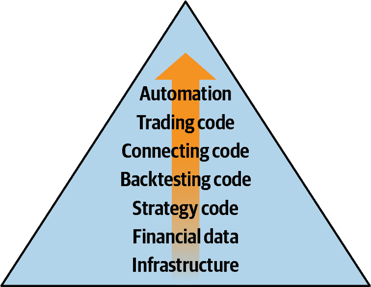

# 前言

> 数据主义认为宇宙由数据流组成，任何现象或实体的价值取决于其对数据处理的贡献... 数据主义因此打破了动物（人类）和机器之间的障碍，并期望电子算法最终能够解码并超越生物化学算法。¹
> 
> 尤瓦尔·赫拉利

发现在金融市场自动并成功交易的正确算法是金融界的圣杯。不久前，算法交易仅适用于资金雄厚、资产管理庞大的机构投资者。近年来，开源、开放数据、云计算和云存储以及在线交易平台的发展，使得小型机构和个体交易者也能参与其中，只需一台普通笔记本或台式电脑以及可靠的互联网连接就能开始进入这个迷人的领域。

如今，Python 及其强大包的生态系统是算法交易的首选技术平台。Python 允许您进行高效的数据分析（例如使用 [`pandas`](http://pandas.pydata.org)），用机器学习预测股市（例如使用 [`scikit-learn`](http://scikit-learn.org)），甚至可以利用 Google 的深度学习技术（使用 [`TensorFlow`](http://tensorflow.org)）。

本书讨论了 Python 在算法交易中的应用，主要是在 *生成α策略* 的背景下（见 第一章）。这样一本涉及两个广泛而激动人心领域交汇处的书籍，难以涵盖所有相关主题。但它可以深入探讨一系列重要的元主题。

这些话题包括：

金融数据

金融数据是每个算法交易项目的核心。Python 和像 `NumPy` 和 `pandas` 这样的包可以很好地处理和处理任何类型的结构化金融数据（日终、日内、高频）。

回测

在没有严格测试待部署交易策略的算法化自动交易的情况下是不可行的。本书涵盖了基于简单移动平均线、动量、均值回归以及基于机器/深度学习的预测的交易策略。

实时数据

算法交易需要处理实时数据，基于其进行在线算法，并实时可视化。本书介绍了使用 `ZeroMQ` 进行套接字编程和流式可视化。

在线平台

交易平台是进行交易的必要条件。本书介绍了两个流行的电子交易平台：[Oanda](http://oanda.com) 和 [FXCM](http://fxcm.com)。

自动化

算法交易之美及一些主要挑战在于交易操作的自动化。本书展示了如何在云中部署 Python，以及如何建立适合自动算法交易的环境。

本书提供了独特的学习体验，具有以下特点和好处：

涵盖相关主题

这是唯一一本涵盖 Python 算法交易相关主题如此广泛和深入的书籍（详见以下）。

自包含的代码库

本书附带一个 Git 代码库，以自包含的可执行形式提供所有代码。该代码库可在 [Quant 平台](http://py4at.pqp.io) 上获得。

实盘交易作为目标

两个不同在线交易平台的涵盖使读者能够高效地开始模拟和实盘交易。为此，本书为读者提供了相关、实用和有价值的背景知识。

自助和自主的学习方法

由于材料和代码是自包含的，仅依赖于标准的 Python 包，读者完全了解并掌握了正在发生的事情，如何使用代码示例，如何修改它们等。无需依赖第三方平台，例如进行回测或连接交易平台。有了本书，读者可以按自己的节奏做到这一切，并且可以掌控每一行代码。

用户论坛

虽然读者应该能够无缝跟进，但作者和 Python Quants 随时在 [Quant 平台](http://py4at.pqp.io) 的用户论坛上帮助。读者可以随时发布问题和评论（账号免费）。

在线/视频培训（付费订阅）

Python Quants 提供 [全面的在线培训课程](https://oreil.ly/Qy90w)，利用本书中呈现的内容，并增加额外内容，涵盖重要主题如金融数据科学、金融中的人工智能、Python 用于 Excel 和数据库，以及其他 Python 工具和技能。

# 内容和结构

下面是每章节中呈现的主题和内容的快速概述。

第一章，*Python 和算法交易*

第一章介绍了算法交易的主题——即基于计算机算法自动交易金融工具。它讨论了这一背景下的基本概念，还涉及阅读本书的预期先决条件等内容。

第二章，*Python 环境*

本章为后续所有章节奠定了技术基础，展示了如何建立正确的 Python 环境。本章主要使用 `conda` 作为包和环境管理器。它通过 [Docker](http://docker.com) 容器和云中部署 Python 进行演示。

第三章，*处理金融数据*

金融时间序列数据是每个算法交易项目的核心。本章向您展示如何从不同的公共数据和专有数据源中获取金融数据。还演示了如何使用 Python 高效存储金融时间序列数据。

第四章，*掌握向量化回测*

向量化是一种在一般数值计算和特别是金融分析中强大的方法。本章介绍了如何使用`NumPy`和`pandas`进行向量化，并将其应用于基于 SMA、动量和均值回归策略的回测。

第五章，*利用机器学习预测市场走势*

本章致力于通过机器学习和深度学习方法生成市场预测。主要依赖过去的回报观察作为特征，介绍了如何使用 Python 包[`Keras`](https://keras.io) 结合 [`TensorFlow`](https://oreil.ly/B44Fb) 和 [`scikit-learn`](http://scikit-learn.org) 来预测明天的市场走向。

第六章，*为事件驱动的回测构建类*

虽然向量化回测在代码简洁性和性能方面具有优势，但在表示某些市场特征和交易策略方面存在限制。另一方面，通过面向对象编程技术实现的事件驱动回测可以对这些特征进行更精细和更现实的建模。本章详细介绍和解释了一个基础类以及用于长仓和多空交易策略回测的两个类。

第七章，*处理实时数据和套接字*

对于雄心勃勃的个人算法交易者，需要处理实时或流数据是现实。选择的工具是套接字编程，本章介绍了[`ZeroMQ`](http://zeromq.org) 作为一种轻量级且可扩展的技术。该章还演示了如何利用[Plotly](http://plot.ly) 创建外观优美、交互式的流式图表。

第八章，*使用 Oanda 进行 CFD 交易*

[Oanda](http://oanda.com) 是一个外汇（Forex, FX）和差价合约（CFD）交易平台，提供多种可交易的工具，如基于外汇对、股票指数、商品或利率工具（基准债券）。本章指导如何使用 Python 封装包[`tpqoa`](http://github.com/yhilpisch/tpqoa) 实现自动化算法交易策略。

第九章，*使用 FXCM 进行外汇交易*

[FXCM](http://fxcm.co.uk) 是另一个外汇和差价合约交易平台，最近推出了现代化的 RESTful API，用于算法交易。可用的工具涵盖多个资产类别，如外汇、股票指数或大宗商品。有一个 Python 包装器，可以基于 Python 代码进行算法交易，非常方便和高效 ([*http://fxcmpy.tpq.io*](http://fxcmpy.tpq.io))。

第十章，*自动化交易操作*

本章涉及资本管理、风险分析与管理，以及技术自动化算法交易操作中的典型任务。详细介绍了资本分配和杠杆的 Kelly 准则。

附录 A，*Python, NumPy, matplotlib, pandas*

附录提供了一个简明的介绍，涵盖了主要章节中介绍的 Python、`NumPy`和`pandas`的重要主题。这代表了一个起点，通过时间可以增加自己的 Python 知识。

图 P-1 展示了与算法交易相关的各层次，从底层到顶层的章节涵盖。必须从 Python 基础设施开始 (第二章)，然后添加金融数据 (第三章)、策略和向量化回测代码（第 4 和 5 章）。在此之前，数据集是作为整体使用和操作的。基于事件的回测首次引入了实际世界数据逐步到达的概念 (第六章)。它是通向连接代码层的桥梁，涵盖了套接字通信和实时数据处理 (第七章)。在此之上，交易平台及其 API 用于能够下单（第 8 和 9 章）。最后，涵盖了自动化和部署的重要方面 (第十章)。从这个意义上讲，本书的主要章节与在 图 P-1 中看到的层次结构相关，为涵盖的主题提供了自然的顺序。

###### 图 P-1\. 算法交易的 Python 层次

# 适合阅读本书的人群

本书适用于希望在算法交易这一迷人领域中应用 Python 的学生、学者和从业者。本书假设读者在 Python 编程和金融交易方面至少具有基本水平的背景知识。为了参考和复习，附录 A 介绍了重要的 Python、`NumPy`、`matplotlib`和`pandas`主题。以下是获得本书重要 Python 主题深入理解的良好参考资料。大多数读者将受益于至少可以访问 Hilpisch（2018）作为参考。关于应用于算法交易的机器和深度学习方法的背景信息，Hilpisch（2020）提供了大量背景信息和更多具体示例。关于 Python 在金融、金融数据科学和人工智能中的应用的背景信息可以在以下书籍中找到：

+   Hilpisch, Yves. 2018\. *Python for Finance: Mastering Data-Driven Finance*. 2nd ed. Sebastopol: O’Reilly.

+   ⸻. 2020\. *Artificial Intelligence in Finance: A Python-Based Guide*. Sebastopol: O’Reilly.

+   McKinney, Wes. 2017\. *Python for Data Analysis: Data Wrangling with Pandas, NumPy, and IPython*. 2nd ed. Sebastopol: O’Reilly.

+   Ramalho, Luciano. 2021\. *Fluent Python: Clear, Concise, and Effective Programming*. 2nd ed. Sebastopol: O’Reilly.

+   VanderPlas, Jake. 2016\. *Python Data Science Handbook: Essential Tools for Working with Data*. Sebastopol: O’Reilly.

算法交易的背景信息可以在以下书籍中找到：

+   Chan, Ernest. 2009\. *Quantitative Trading: How to Build Your Own Algorithmic Trading Business*. Hoboken et al: John Wiley & Sons.

+   Chan, Ernest. 2013\. *Algorithmic Trading: Winning Strategies and Their Rationale*. Hoboken et al: John Wiley & Sons.

+   Kissel, Robert. 2013\. *The Science of Algorithmic Trading and Portfolio Management*. Amsterdam et al: Elsevier/Academic Press.

+   Narang, Rishi. 2013\. *Inside the Black Box: A Simple Guide to Quantitative and High Frequency Trading*. Hoboken et al: John Wiley & Sons.

享受使用 Python 在算法交易世界中的旅程，并通过电子邮件联系 py4at@tpq.io 如果您有问题或意见。

# 本书使用的约定

本书中使用了以下排版约定：

*斜体*

指示新术语、网址、电子邮件地址、文件名和文件扩展名。

`常量宽度`

用于程序列表以及段落内部，用于引用程序元素，如变量或函数名称、数据库、数据类型、环境变量、语句和关键字。

**`常量宽度粗体`**

显示用户应直接输入的命令或其他文本。

*`常量宽度斜体`*

显示应由用户提供值或由上下文确定的值替换的文本。

这个元素表示一个提示或建议。

这个元素表示一般注释。

此元素表示警告或注意事项。

# 使用代码示例

您可以在 Quant 平台上访问和执行附带本书的代码，只需免费注册即可访问[*https://py4at.pqp.io*](https://py4at.pqp.io)。

如果您有技术问题或在使用代码示例时遇到问题，请电邮至*bookquestions@oreilly.com*。

本书旨在帮助您完成工作。一般来说，如果本书提供示例代码，您可以在您的程序和文档中使用它。除非您复制了大量代码，否则无需征得我们的许可。例如，编写一个使用本书中几个代码片段的程序不需要许可。销售或分发奥莱利书籍中的示例代码需要许可。引用本书回答问题并引用示例代码不需要许可。将本书的大量示例代码整合到您产品的文档中需要许可。

我们感谢，但通常不要求归属。归属通常包括标题、作者、出版商和 ISBN。例如，此书可归因为：“*Python for Algorithmic Trading* by Yves Hilpisch (O’Reilly)。版权所有 2021 Yves Hilpisch, 978-1-492-05335-4。”

如果您认为您使用的代码示例超出了公平使用范围或上述许可，请随时通过*permissions@oreilly.com*与我们联系。

# 奥莱利在线学习

40 多年来，[*奥莱利传媒*](http://oreilly.com) 提供技术和商业培训，知识和见解，帮助公司取得成功。

我们独特的专家和创新者网络通过书籍、文章和我们的在线学习平台分享他们的知识和专业知识。奥莱利的在线学习平台为您提供按需访问直播培训课程、深度学习路径、互动编码环境，以及来自奥莱利和 200 多家其他出版商的大量文本和视频。获取更多信息，请访问[*http://oreilly.com*](http://oreilly.com)。

# 如何联系我们

请将关于本书的评论和问题发送至出版商：

+   奥莱利传媒公司

+   Gravenstein Highway North 1005

+   CA 95472 Sebastopol

+   800-998-9938（美国或加拿大）

+   707-829-0515（国际或本地）

+   707-829-0104（传真）

我们为本书设置了一个网页，列出勘误、示例和任何其他信息。您可以访问此页面[*https://oreil.ly/py4at*](https://oreil.ly/py4at)。

电子邮件 *bookquestions@oreilly.com* 以发表评论或就本书提出技术问题。

有关我们的书籍和课程的新闻和信息，请访问[*http://oreilly.com*](http://oreilly.com)。

在 Facebook 上找到我们：[*http://facebook.com/oreilly*](http://facebook.com/oreilly)

在 Twitter 上关注我们：[*http://twitter.com/oreillymedia*](http://twitter.com/oreillymedia)

在 YouTube 上关注我们：[*http://youtube.com/oreillymedia*](http://youtube.com/oreillymedia)

# 致谢

我要感谢技术审阅者——Hugh Brown、McKlayne Marshall、Ramanathan Ramakrishnamoorthy 和 Prem Jebaseelan——他们提供了有益的评论，导致书中内容的许多改进。

像往常一样，特别感谢 Michael Schwed，他在技术方面支持我，无论是简单的还是极其复杂的问题，都凭借他广泛而深入的技术知识。

Python 金融计算和算法交易证书项目的代表也帮助改进了这本书。他们不断的反馈使我能够排除错误并改进在线培训课程中使用的代码和笔记本，现在，最终，在这本书中。  

我还要感谢整个 O'Reilly Media 团队——特别是 Michelle Smith、Michele Cronin、Victoria DeRose 和 Danny Elfanbaum——因为他们让这一切成为可能，并在许多方面帮助我完善这本书。

当然，所有剩余的错误都是我自己的。

此外，我还要感谢 Refinitiv 团队——特别是 Jason Ramchandani——为提供持续支持和获取金融数据的机会而致谢。此书中使用的主要数据文件，并向读者提供的那些数据，都以某种方式从 Refinitiv 的数据 API 中获得。

献给我爱的家人。我把这本书献给我的父亲阿道夫，他对我和我们家庭的支持现在已经持续了近五十年。

¹ Harari, Yuval Noah. 2015. *Homo Deus: A Brief History of Tomorrow*. London: Harvill Secker.
