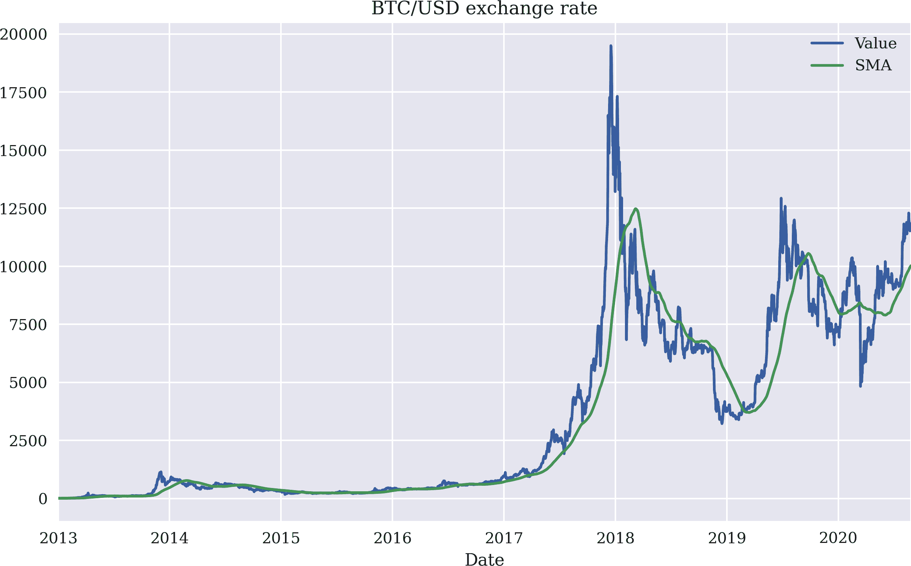

# 第一章\. Python 和算法交易

> 在高盛，从 2000 年的 600 人峰值下降到如今仅剩两人参与股票交易。^(1)
> 
> *《经济学家》*

本章为本书涵盖的主题提供背景信息和概述。虽然 Python 用于算法交易是 Python 编程和金融交叉领域的一个利基，但它是一个快速增长的领域，涉及诸如 Python 部署、交互式金融分析、机器和深度学习、面向对象编程、套接字通信、流数据可视化和交易平台等多样化的主题。

为了快速复习重要的 Python 主题，请先阅读附录 A。

# 金融 Python

Python 编程语言起源于 1991 年，由 Guido van Rossum 发布了标记为 0.9.0 的第一个版本。1994 年发布了版本 1.0。然而，Python 花了近二十年的时间才确立自己作为金融行业主要编程语言和技术平台。当然，早期采用者主要是对冲基金，但广泛应用可能直到大约 2011 年才开始。

金融行业采用 Python 的一个主要障碍是默认的 Python 版本 CPython 是一种解释型的高级语言。一般而言，数值算法，特别是金融算法，往往基于（嵌套的）循环结构。而像 C 或 C++ 这样的编译型低级语言在执行这些循环时非常快速，而 Python 则依赖解释而非编译，通常在执行上相当慢。因此，纯 Python 对于许多现实世界的金融应用，如期权定价或风险管理，速度过慢。

## Python 与伪代码对比

尽管 Python 从未专门针对科学和金融社区，但许多人仍然喜欢其语法的美观和简洁性。不久之前，通常认为解释（金融）算法并同时呈现一些伪代码作为其适当技术实现的中间步骤是一个良好的传统。许多人觉得，使用 Python，伪代码步骤将不再必要。他们大多数情况下是正确的。

例如，考虑几何布朗运动的欧拉离散化，如方程 1-1 所示。

##### 方程 1-1\. 几何布朗运动的欧拉离散化

<math alttext="upper S Subscript upper T Baseline equals upper S 0 exp left-parenthesis left-parenthesis r minus 0.5 sigma squared right-parenthesis upper T plus sigma z StartRoot upper T EndRoot right-parenthesis" display="block"><mrow><msub><mi>S</mi> <mi>T</mi></msub> <mo>=</mo> <msub><mi>S</mi> <mn>0</mn></msub> <mo form="prefix">exp</mo> <mrow><mo>(</mo> <mrow><mo>(</mo> <mi>r</mi> <mo>-</mo> <mn>0</mn> <mo>.</mo> <mn>5</mn> <msup><mi>σ</mi> <mn>2</mn></msup> <mo>)</mo></mrow> <mi>T</mi> <mo>+</mo> <mi>σ</mi> <mi>z</mi> <msqrt><mi>T</mi></msqrt> <mo>)</mo></mrow></mrow></math>

几十年来，LaTeX 标记语言和编译器一直是编写包含数学公式的科学文档的黄金标准。在许多方面，当例如布置方程式时，LaTeX 语法与伪代码相似或已经像伪代码。在这种特定情况下，LaTeX 版本如下所示：

```py
S_T = S_0 \exp((r - 0.5 \sigma²) T + \sigma z \sqrt{T})
```

在 Python 中，这意味着在给定相应变量定义的情况下转换为可执行代码，它也非常接近金融公式以及 Latex 表示：

```py
S_T = S_0 * exp((r - 0.5 * sigma ** 2) * T + sigma * z * sqrt(T))
```

然而，速度问题仍然存在。作为相应随机微分方程的数值近似，这种差分方程通常用于通过蒙特卡洛模拟定价衍生品或基于模拟进行风险分析和管理。^(2) 这些任务反过来可能需要完成数百万次模拟，通常需要在准实时或至少接近实时的时间内完成。作为解释型高级编程语言，Python 从未被设计成足够快速以处理这类计算要求极高的任务。

## NumPy 和向量化

2006 年，由 Travis Oliphant 发布了[`NumPy` Python 包](http://numpy.org)的 1.0 版本。`NumPy`代表*numerical Python*，表明其针对数值要求严格的场景。Python 基本解释器在许多领域试图尽可能通用，这往往导致运行时开销相当大。^(3) 另一方面，`NumPy`采用专门化作为其主要方法，以避免开销并在特定应用场景中表现得尽可能出色和快速。

`NumPy`的主要类是常规数组对象，称为*n 维数组*对象的`ndarray`对象。它是不可变的，这意味着大小不能更改，只能容纳一种称为`dtype`的单一数据类型。这种专门化允许实现简洁快速的代码。在这种背景下的一个核心方法是*向量化*。基本上，该方法避免了在 Python 级别上的循环，并将循环委托给专门的`NumPy`代码，通常用 C 实现，因此速度相当快。

考虑按照 Equation 1-1 用纯 Python 模拟 1,000,000 个期末值<math alttext="upper S Subscript upper T"><msub><mi>S</mi> <mi>T</mi></msub></math>。以下代码的主要部分是具有 1,000,000 次迭代的`for`循环：

```py
In [1]: %%time
        import random
        from math import exp, sqrt

        S0 = 100  
        r = 0.05  
        T = 1.0  
        sigma = 0.2  

        values = []  

        for _ in range(1000000):  
            ST = S0 * exp((r - 0.5 * sigma ** 2) * T +
                            sigma * random.gauss(0, 1) * sqrt(T))  
            values.append(ST)  
        CPU times: user 1.13 s, sys: 21.7 ms, total: 1.15 s
        Wall time: 1.15 s
```


初始指数水平。


常数短期利率。


年份的时间跨度。


常数波动率因子。


用于收集模拟值的空`list`对象。


主要的`for`循环。


单期末值的模拟。


将模拟值附加到`list`对象上。

使用`NumPy`，你完全可以通过向量化避免在 Python 层面上进行循环。代码更为简洁、易读，并且速度大约快了 8 倍：

```py
In [2]: %%time
        import numpy as np

        S0 = 100
        r = 0.05
        T = 1.0
        sigma = 0.2

        ST = S0 * np.exp((r - 0.5 * sigma ** 2) * T +
                            sigma * np.random.standard_normal(1000000) *
                            np.sqrt(T))  
        CPU times: user 375 ms, sys: 82.6 ms, total: 458 ms
        Wall time: 160 ms
```


这一行`NumPy`代码模拟所有值并将它们存储在一个`ndarray`对象中。

向量化是金融和算法交易中编写简洁、易读、易维护代码的强大概念。使用`NumPy`，向量化代码不仅使代码更简洁，而且可以显著加快代码执行速度（例如，在蒙特卡洛模拟中可以提高约 8 倍）。

可以说，`NumPy`在科学和金融领域中的成功有很大贡献。许多其他流行的 Python 包来自所谓的*科学 Python 堆栈*，构建在`NumPy`上作为高效的、执行数据结构来存储和处理数值数据。事实上，`NumPy`是`SciPy`包项目的一个延伸，提供科学中经常需要的丰富功能。`SciPy`项目意识到需要一个更强大的数值数据结构，将以前的项目如`Numeric`和`NumArray`整合成了一个新的统一形式，即`NumPy`。

在算法交易中，蒙特卡洛模拟可能不是编程语言的最重要用例。然而，如果涉足算法交易领域，管理更大或者说非常大的金融时间序列数据集是非常重要的用例。想象一下（股市内部的）交易策略的回测，或者在交易时间内处理 tick 数据流。这正是[`pandas`数据分析包](http://pandas.pydata.org)发挥作用的地方。

## pandas 和 DataFrame 类

`pandas`的开发始于 2008 年，由当时在康涅狄格州格林尼治工作的 AQR 资本管理公司的 Wes McKinney 发起。与其他对冲基金一样，处理时间序列数据对 AQR 资本管理公司至关重要，但当时 Python 并没有提供对这类数据的吸引力支持。Wes 的想法是创建一个类似于 R 统计语言（[*http://r-project.org*](http://r-project.org)）在此领域功能的软件包。例如，这体现在主要类名`DataFrame`，其在 R 中的对应称为`data.frame`。由于未被认为与金融管理核心业务足够接近，AQR 资本管理公司于 2009 年开源了`pandas`项目，这标志着基于开源的数据和金融分析取得了重大成功。

部分原因是因为`pandas`，Python 已经成为数据和金融分析的主要力量。许多从其他语言转向 Python 的人都将`pandas`列为其决定的主要原因。与像[Quandl](http://quandl.com)这样的开放数据源相结合，`pandas`甚至允许学生使用最低的准入门槛进行复杂的金融分析：只需一台带有互联网连接的普通笔记本电脑即可。

假设一个算法交易员对交易比特币感兴趣，比特币是市值最高的加密货币。第一步可能是检索有关历史兑美元汇率的数据。使用 Quandl 数据和`pandas`，这样的任务在不到一分钟内就可以完成。图 1-1 展示了以下 Python 代码的结果图，该代码（省略了一些与绘图样式相关的参数设置）仅有四行。虽然没有明确导入`pandas`，但是 Quandl Python 包默认返回一个`DataFrame`对象，然后用于添加 100 天的简单移动平均线（SMA），以及可视化原始数据和 SMA：

```py
In [3]: %matplotlib inline
        from pylab import mpl, plt  
        plt.style.use('seaborn')  
        mpl.rcParams['savefig.dpi'] = 300  
        mpl.rcParams['font.family'] = 'serif'  

In [4]: import configparser  
        c = configparser.ConfigParser()  
        c.read('../pyalgo.cfg')  
Out[4]: ['../pyalgo.cfg']

In [5]: import quandl as q  
        q.ApiConfig.api_key = c['quandl']['api_key']  
        d = q.get('BCHAIN/MKPRU')  
        d['SMA'] = d['Value'].rolling(100).mean()  
        d.loc['2013-1-1':].plot(title='BTC/USD exchange rate',
                                figsize=(10, 6));  
```


导入并配置绘图包。


导入`configparser`模块并读取凭据。


导入 Quandl Python 包装器包并提供 API 密钥。


检索比特币兑美元汇率的每日数据，并返回具有单列的`pandas` `DataFrame`对象。


以向量化方式计算 100 天的 SMA。


从 2013 年 1 月 1 日开始选择数据并绘制。

显然，`NumPy` 和 `pandas` 在金融中显著促进了 Python 的成功。然而，Python 生态系统在解决基本问题和有时是专门问题的附加 Python 包方面还有很多可提供的。本书将使用用于数据检索和存储（例如，`PyTables`，`TsTables`，`SQLite`）以及用于机器和深度学习（例如，`scikit-learn`，`TensorFlow`）的包，仅举两个类别。在此过程中，我们还将实现类和模块，使任何算法交易项目更高效。但是，整个过程中主要使用的包将是`NumPy`和`pandas`。



###### 图 1-1\. 从 2013 年初到 2020 年中期的比特币兑美元历史汇率

虽然`NumPy`提供了存储数值数据和处理数据的基本数据结构，`pandas`则为时间序列管理带来了强大的能力。它还将其他包的功能封装成易于使用的 API。刚才描述的比特币示例显示，仅需在`DataFrame`对象上调用一个方法即可生成可视化显示两个金融时间序列的图表。与`NumPy`类似，`pandas`允许编写相当简洁的向量化代码，由于在底层大量使用编译代码，因此通常执行速度也非常快。

# 算法交易

术语*算法交易*既不是唯一的也不是普遍定义的。在相当基本的层面上，它指的是基于某种正式算法进行金融工具交易。*算法*是一组操作（数学的、技术性的），按照一定顺序进行以达到特定目标。例如，有数学算法来解决魔方问题。^(4) 这样的算法可以通过逐步过程解决手头的问题，通常表现优异。另一个例子是用于寻找方程根的算法，如果根存在的话。在这种意义上，数学算法的目标通常是明确定义的，并且通常期望找到最优解。

但是财务交易算法的目标是什么呢？这个问题通常并不容易回答。暂时退后一步，考虑交易的一般动机可能有所帮助。在 Dorn 等人（2008）的文章中写道：

> 在金融市场中进行交易是一项重要的经济活动。交易是必要的，以进入和退出市场，将不需要的现金投入市场，并在需要时转换回现金。它们还需要在市场内移动资金，将一个资产交换为另一个资产，管理风险并利用关于未来价格变动的信息。

这里表达的观点更多地是技术性而非经济性质，主要集中在过程本身，而只有部分涉及为什么人们首先发起交易。对于我们的目的，个人和金融机构管理自己或他人资金的非详尽列表中包括以下财务交易动机：

贝塔交易

通过投资于例如复制标准普尔 500 指数表现的交易所交易基金（ETF）来赚取市场风险溢价。

Alpha 生成

通过例如卖空标准普尔 500 指数上的股票或 ETF 来赚取与市场无关的风险溢价。

静态对冲

通过购买例如标准普尔 500 指数的平值以外的看跌期权对冲市场风险。

动态对冲

通过例如动态交易标准普尔 500 指数期货和适当的现金、货币市场或利率工具对冲影响标准普尔 500 指数期权的市场风险。

资产负债管理

通过交易标准普尔 500 股票和 ETF 来覆盖因编写寿险政策而产生的责任。

做市商

例如，通过以不同买入和卖出价格买卖标准普尔 500 的期权来为期权提供流动性。

所有这些类型的交易可以通过自主方法实施，由人类交易员主要基于自身决策，同时也基于支持人类交易员或完全取代其决策过程的算法。在这种情况下，金融交易的计算机化当然起着重要作用。金融交易的开始阶段，通过大群人员在交易地点大声喊叫（“公开竞价”）进行交易是唯一的执行方式，但计算机化以及互联网和网络技术的出现彻底改变了金融行业的交易方式。本章开头的引文生动地说明了高盛在 2000 年和 2016 年参与股票交易活跃人数的变化。这是一个 25 年前就已经预见到的趋势，正如 Solomon 和 Corso（1991）所指出的：

> 计算机已经彻底改变了证券交易，股票市场目前正在进行动态转型。很明显，未来的市场将不再像过去的市场。
> 
> 技术使得股票价格信息可以在几秒钟内传送到全球各地。目前，计算机将订单路由并直接从券商终端到交易所执行小额交易。计算机现在连接各种股票交易所，这种做法有助于创建证券交易的全球单一市场。技术的持续改进将使得通过电子交易系统全球执行交易成为可能。

有趣的是，动态对冲期权中使用的最古老和广泛使用的算法之一可以追溯到欧式期权定价的开创性论文由 Black 和 Scholes（1973）以及 Merton（1973）发表之时。这个算法被称为*delta 对冲*，甚至在计算机化和电子交易开始之前就已经存在。作为一个交易算法，delta 对冲展示了如何在一个简化的、完美的连续模型世界中对冲所有市场风险。在现实世界中，由于交易成本、离散交易、市场不完全流动性以及其他摩擦（“不完美性”），这个算法证明了其意想不到的有用性和稳健性。也许不能完美地消除影响期权的市场风险，但它在接近理想状态方面非常有用，并因此仍然大规模应用于金融行业。^(5)

本书侧重于阿尔法生成策略的算法交易。尽管阿尔法有更复杂的定义，但在本书的目的下，阿尔法被视为一段时间内交易策略的回报与基准（单一股票、指数、加密货币等）回报之间的差异。例如，如果标准普尔 500 在 2018 年的回报为 10%，而算法策略的回报为 12%，那么阿尔法为+2 个百分点。如果策略回报为 7%，那么阿尔法为-3 个百分点。一般来说，这些数字不会根据风险进行调整，其他风险特征，如最大回撤（期间），通常被认为是二阶重要，如果有的话。

本书侧重于生成阿尔法的策略，即试图在市场表现独立之上（超过基准）生成正收益的策略。在本书中，阿尔法被定义为一种策略相对于基准金融工具表现的超额收益。

交易相关算法发挥重要作用的其他领域还有一些。其中之一是*高频交易*（HFT）领域，速度通常是参与者竞争的重点。^(6) HFT 的动机多种多样，但市场做市和阿尔法生成可能是主要角色。另一个领域是*交易执行*，在这个领域中，算法被部署以优化执行某些非标准交易。这个领域的动机可能包括以尽可能最佳价格执行大额订单，或者尽可能减少市场和价格冲击执行订单。更微妙的动机可能是通过在多个不同交易所执行订单来掩盖订单。

一个重要的问题仍有待解答：使用算法进行交易是否比人类研究、经验和自主性具有优势？这个问题很难以普遍性回答。确实，有些人类交易员和投资组合经理长期以来的平均表现超过了他们的投资者基准。在这方面的杰出例子是沃伦·巴菲特。另一方面，统计分析显示，大多数活跃投资组合经理很少连续击败相关基准。亚当·谢尔提到 2015 年时写道：

> 例如，去年，标准普尔 500 股票指数包括股息在内的总回报仅为 1.4%，而 66%的“主动管理”的大公司股票基金的回报低于该指数...从更长期来看，前景同样黯淡，84%的大市值基金在最近五年期间的回报低于标准普尔 500 指数，而 82%在过去十年中未能达到，该研究发现。^(7)

在 2016 年 12 月发表的一项实证研究中，Harvey 等人写道：

> 我们分析并对比自主和系统化对冲基金的表现。系统化基金使用基于规则的策略，几乎没有或没有人类日常干预……我们发现，在 1996 年至 2014 年期间，系统化股票基金在未调整（原始）回报方面表现不及其自主对冲基金对手，但在调整为知名风险因子的情况下，风险调整后的表现类似。在宏观领域，系统化基金在未调整和风险调整的基础上均胜过自主基金。

表格 1-0 复制了 Harvey 等人（2016）研究的主要定量发现。[⁸] 在表格中，*因子* 包括传统因子（股票、债券等）、动态因子（价值、动量等）以及波动性（买入平价看涨和看跌期权）。*调整后的回报评估比* 将 alpha 除以调整后的回报波动率。有关更多详细信息和背景，请参阅原始研究。

研究结果表明，系统化（“算法化”）宏观对冲基金在未调整和风险调整的条件下表现最佳。它们在研究期间实现了年化 alpha 为 4.85%。这些是实施通常为全球性、跨资产、常涉及政治和宏观经济因素的策略的对冲基金。在调整后的回报评估比方面，系统化股票对冲基金仅击败了其自主对冲基金对手（0.35 对 0.25）。

|  | 系统宏观 | 自主宏观 | 系统股票 | 自主股票 |
| --- | --- | --- | --- | --- |
| 平均回报 | 5.01% | 2.86% | 2.88% | 4.09% |
| 因子归因回报 | 0.15% | 1.28% | 1.77% | 2.86% |
| 平均调整回报率（alpha） | 4.85% | 1.57% | 1.11% | 1.22% |
| 调整后的回报波动率 | 0.93% | 5.10% | 3.18% | 4.79% |
| 调整后的回报评估比 | 0.44 | 0.31 | 0.35 | 0.25 |

与标准普尔 500 指数相比，2017 年对冲基金的整体表现相当疲弱。虽然标准普尔 500 指数回报率为 21.8%，但对冲基金仅为投资者带来了 8.5%的回报（参见 *Investopedia* 上的这篇[文章](https://oreil.ly/N59Hf)）。这说明即使拥有数百万美元的研究和技术预算，要生成 alpha 也是多么困难。

# Python 用于算法交易

Python 在金融行业的许多领域中被广泛使用，但在算法交易领域尤其受欢迎。这其中有几个很好的原因：

数据分析能力

每个算法交易项目的主要要求之一是能够有效管理和处理金融数据。Python，结合像 `NumPy` 和 `pandas` 这样的包，对每个算法交易员而言比大多数其他编程语言更加便利。

处理现代 API

现代在线交易平台，如 [FXCM](http://fxcm.co.uk) 和 [Oanda](http://oanda.com) 提供 RESTful 应用程序编程接口 (API) 和套接字 (流式) API 来访问历史和实时数据。Python 通常非常适合与这些 API 有效地交互。

专用软件包

除了标准的数据分析软件包外，还有多个专用于算法交易领域的软件包可用，例如用于交易策略回测的 [`PyAlgoTrade`](https://oreil.ly/IpIt1) 和 [`Zipline`](https://oreil.ly/2cSKR)，以及用于执行组合和风险分析的 [`Pyfolio`](https://oreil.ly/KT7V8)。

供应商赞助的软件包

越来越多的供应商在该领域发布开源 Python 软件包，以便更容易地访问它们的产品。其中包括像 Oanda 这样的在线交易平台，以及像 [彭博](https://oreil.ly/oSxei) 和 [Refinitiv](https://oreil.ly/1SNBN) 这样的领先数据提供商。

专用平台

例如，Quantopian 提供了一个标准化的基于 Web 的回测环境作为一个平台，人们可以在该平台上使用 Python 语言交换想法，并通过不同的社交网络功能与志同道合的人交流。从其成立到 2020 年，Quantopian 已经吸引了超过 30 万用户。

买方和卖方的采用

越来越多的机构参与者已经采用 Python 来简化他们交易部门的开发工作。这反过来又需要越来越多精通 Python 的员工，这使得学习 Python 成为一项值得的投资。

教育、培训和书籍

技术或编程语言的广泛采用的先决条件是学术和专业教育以及培训计划，结合专业书籍和其他资源。Python 生态系统最近在这些方面的提供上有了巨大的增长，教育和培训越来越多的人使用 Python 进行金融领域的工作。这有望强化 Python 在算法交易领域的采用趋势。

综上所述，可以相当肯定地说 Python 已经在算法交易中扮演着重要的角色，并且似乎有强劲的势头在未来变得更加重要。因此，对于任何试图进入这一领域的人来说，无论是作为雄心勃勃的“零售”交易员还是作为从事系统化交易的领先金融机构的专业人士，选择 Python 都是一个不错的选择。

# 焦点和先决条件

本书的重点是将 Python 作为算法交易的编程语言。本书假设读者已经具有一些 Python 和用于数据分析的流行 Python 包的经验。好的入门书籍包括 Hilpisch（2018）、McKinney（2017）和 VanderPlas（2016），这些都可以用来建立 Python 在数据分析和金融领域的扎实基础。读者也应具有一些使用 Python 进行交互式分析的典型工具的经验，例如 `IPython`，VanderPlas（2016）也对其进行了介绍。

本书呈现并解释了应用于所讨论主题的 Python 代码，例如回测交易策略或处理流数据。它不能对不同地方使用的所有包提供全面的介绍。但它尝试着突出这些包的那些对于表达（例如 `NumPy` 的向量化）的核心能力。

本书也无法对算法交易相关的所有财务和运营方面进行全面介绍和概述。相反，该方法侧重于使用 Python 构建自动算法交易系统所需的基础设施。当然，大多数例子都来自算法交易领域。然而，当涉及动量或均值回归策略时，它们更多地被简单地使用，而没有提供（统计）验证或对其复杂性的深入讨论。每当适当时，都会提供参考资料，指向解决在表达过程中留下的问题的来源。

总的来说，本书是为那些既有 Python 又有（算法）交易经验的读者编写的。对于这样的读者，本书是使用 Python 和其他包构建自动化交易系统的实用指南。

本书采用了许多 Python 编程方法（例如，面向对象编程）和包（例如，`scikit-learn`），这些方法和包无法详细解释。重点是将这些方法和包应用于算法交易过程的不同步骤。因此，建议那些尚未具有足够 Python（金融）经验的人额外查阅更多入门 Python 文本。

# 交易策略

本书中介绍了四种不同的算法交易策略作为示例。它们在以下各节中简要介绍，在第四章中有更详细的介绍。所有这些交易策略主要可以归类为*alpha seeking* *strategies*，因为它们的主要目标是产生正的，超出市场的回报，与市场方向无关。本书中的规范示例，涉及的金融工具交易，是*股票指数*、*单只股票*或*加密货币*（以法定货币计价）。本书不涵盖涉及多个金融工具同时进行的策略（配对交易策略、基于篮子的策略等）。它也仅涵盖其交易信号源自结构化的金融时间序列数据，而不是来自非结构化数据源如新闻或社交媒体资讯的策略。这使得讨论和 Python 实现更简洁易懂，符合（前面讨论过的）专注于 Python 算法交易的方法。^(9)

本章的剩余部分快速概述了本书中使用的四种交易策略。

## 简单移动平均线

第一类交易策略依赖于简单移动平均线（SMAs）来生成交易信号和市场定位。这些交易策略被所谓的技术分析师或图表分析师广泛推广。其基本思想是，较短期的简单移动平均线高于较长期的简单移动平均线，信号长期市场定位，而相反情况信号中立或空头市场定位。

## 动量

动量策略背后的基本思想是，金融工具被假设会按照其最近的表现继续表现一段时间。例如，当股票指数在过去五天内平均表现为负回报时，假定其明天的表现也将是负的。

## 均值回归

在均值回归策略中，假设金融工具将在当前远离某个均值或趋势水平时恢复到该均值或趋势水平。例如，假设一支股票交易比其 100 天简单移动平均线低 10 美元。然后可以预期该股价将很快回归到其简单移动平均线水平。

## 机器学习和深度学习

使用机器学习和深度学习算法时，一般采用更黑箱的方法来预测市场走势。为了简单和可重复性起见，本书中的示例主要依赖历史回报观察作为特征，训练机器学习和深度学习算法来预测股票市场走势。

本书不以系统方式介绍算法交易。由于重点在于将 Python 应用于这一引人入胜的领域，对算法交易不熟悉的读者应查阅专门的资源。本章及后续章节中引用的某些资源是相关的。但请注意，算法交易世界总体上是秘密的，几乎每个成功的人都自然而然地不愿分享他们的成功秘诀，以保护他们的成功来源（即他们的 alpha）。

# 结论

Python 在金融领域已经成为一股力量，并正朝着成为算法交易的主要力量迈进。使用 Python 进行算法交易有许多好处，其中包括强大的包生态系统，可实现高效的数据分析或处理现代 API 的能力。学习 Python 进行算法交易的原因也有很多，尤其是因为一些最大的买方和卖方机构在其交易操作中广泛使用 Python，并不断寻找经验丰富的 Python 专业人员。

本书侧重于将 Python 应用于算法交易的不同学科，如回测交易策略或与在线交易平台互动。它不能取代对 Python 本身或交易总体的彻底介绍。然而，它系统地结合了这两个引人入胜的世界，为当今竞争激烈的金融和加密货币市场中的 alpha 生成提供了宝贵的资源。

# 参考文献与进一步资源

本章引用的书籍和论文：

+   Black, Fischer, and Myron Scholes. 1973\. “The Pricing of Options and Corporate Liabilities.” *《政治经济学杂志》* 81 (3): 638-659.

+   Chan, Ernest. 2013\. *《算法交易：获胜策略及其原理》*. Hoboken et al: John Wiley & Sons.

+   Dorn, Anne, Daniel Dorn, and Paul Sengmueller. 2008\. “Why Do People Trade?” *《应用金融杂志》* (秋/冬): 37-50.

+   Harvey, Campbell, Sandy Rattray, Andrew Sinclair, and Otto Van Hemert. 2016\. “Man vs. Machine: Comparing Discretionary and Systematic Hedge Fund Performance.” *《投资组合管理杂志》* 白皮书, Man Group.

+   Hilpisch, Yves. 2015\. *《Python 金融衍生品分析：数据分析，模型，仿真，校准和套期保值》*. Wiley Finance. 资源位于 [*http://dawp.tpq.io*](http://dawp.tpq.io).

+   ⸻. 2018\. *《Python 金融分析：掌握数据驱动金融》*. 第二版. Sebastopol: O’Reilly. 资源位于 [*https://py4fi.pqp.io*](https://py4fi.pqp.io).

+   ⸻. 2020\. *《金融中的人工智能：基于 Python 的指南》*. Sebastopol: O’Reilly. 资源位于 [*https://aiif.pqp.io*](https://aiif.pqp.io).

+   Kissel, Robert. 2013\. *《算法交易与投资组合管理的科学》*. Amsterdam et al: Elsevier/Academic Press.

+   Lewis, Michael. 2015\. *《闪电少年：破解金融密码》*. 纽约，伦敦: W.W. Norton & Company.

+   McKinney, Wes. 2017\. *Python 数据分析：使用 Pandas、NumPy 和 IPython 进行数据整理*。第二版。Sebastopol：O’Reilly。

+   Merton, Robert. 1973\. “理性期权定价理论。” *贝尔经济与管理科学杂志* 4: 141-183。

+   Narang, Rishi. 2013\. *黑盒子内部：量化和高频交易的简易指南*。Hoboken 等地：John Wiley & Sons。

+   Solomon, Lewis, 和 Louise Corso. 1991\. “技术对证券交易的影响：新兴的全球市场及其对监管的影响。” *约翰·马歇尔法学评论* 24 (2): 299-338。

+   VanderPlas, Jake. 2016\. *Python 数据科学手册：处理数据的基本工具*。Sebastopol：O’Reilly。

^(1) “太蒸发无法失败。” *经济学人*，2016 年 10 月 29 日。

^(2) 详见 Hilpisch (2018, ch. 12)。

^(3) 例如，`list` 对象不仅是可变的（这意味着它们的大小可以改变），而且可以包含几乎任何其他类型的 Python 对象，如 `int`、`float`、`tuple` 对象或 `list` 对象本身。

^(4) 参见 [魔方的数学](https://oreil.ly/16pIA) 或 [解决魔方的算法](https://oreil.ly/XM0ZP)。

^(5) 详见 Hilpisch (2015)，详细分析使用 Python 进行欧式和美式期权的对冲策略。

^(6) 参见 Lewis (2015) 的书籍，非技术性介绍高频交易。

^(7) 资料来源：“66%的基金经理无法匹配标准普尔 500 指数的成绩。” *今日美国*，2016 年 3 月 14 日。

^(8) 年化表现（超过短期利率）和对包括从 1996 年 6 月到 2014 年 12 月期间的 9,000 只对冲基金的风险度量的总体基金类别的风险度量。

^(9) 参见 Kissel (2013) 的书籍，概述与算法交易相关的主题，参见 Chan (2013) 的书籍，深入讨论动量和均值回归策略，或参见 Narang (2013) 的书籍，全面覆盖量化和高频交易。
