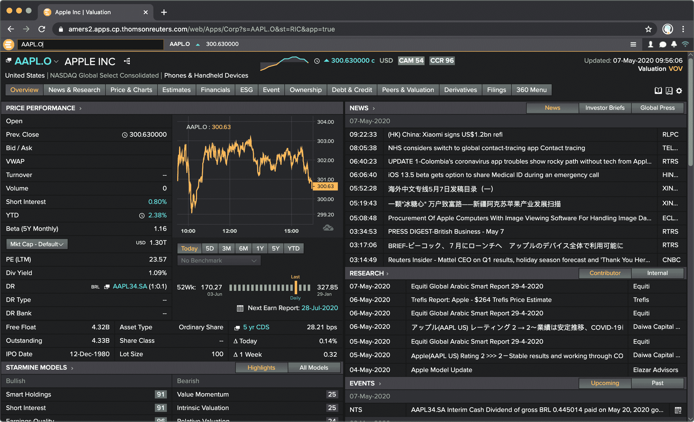
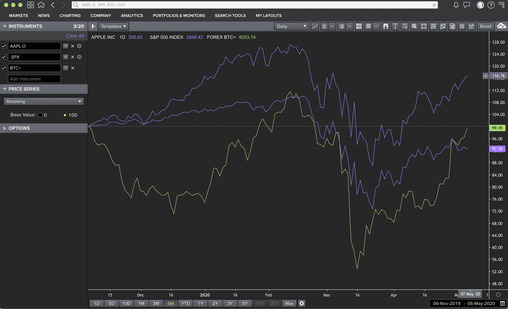

# 第三章。处理金融数据

> 显而易见，数据胜过算法。没有全面的数据，你很可能得到不全面的预测。
> 
> 罗布·托马斯（2016）

在算法交易中，通常需要处理四种类型的数据，如 表格 3-1 所示。尽管这简化了金融数据的世界，但在技术设置中，区分*历史数据与实时数据*以及*结构化数据与非结构化数据*往往是有用的。

表 3-1。金融数据类型（示例）

|   | 结构化 | 非结构化 |
| --- | --- | --- |
| 历史 | 收盘价 | 金融新闻文章 |
| 实时 | 外汇买卖价格 | 推特帖子 |

本书主要关注于*结构化数据*（数值、表格数据），包括历史和实时类型。特别是本章专注于历史的结构化数据，例如法兰克福证券交易所上的 SAP SE 股票的收盘价。然而，此类别也包括日内数据，如在纳斯达克证券交易所上交易的苹果公司股票的 1 分钟 K 线数据。关于实时结构化数据的处理，请参阅 第七章。

一个算法交易项目通常从需要根据历史金融数据（回）测的交易思想或假设开始。这是本章的背景，计划如下。 “从不同来源读取金融数据” 使用 `pandas` 从不同的文件和基于网络的来源读取数据。 “使用开放数据来源” 介绍了 [Quandl](http://quandl.com) 作为流行的开放数据源平台。 “Eikon 数据 API” 介绍了 Refinitiv Eikon 数据 API 的 Python 封装。最后， “有效存储金融数据” 简要介绍了如何使用 `pandas` 根据 [HDF5](http://hdfgroup.org) 二进制存储格式有效存储历史的结构化数据。

本章的目标是以一种能有效实现交易思想和假设回测的数据格式来提供金融数据。三个主要主题是数据导入、数据处理和数据存储。本章及后续章节假设已安装了 Python 3.8 并已按详细说明安装了 Python 软件包，详细信息请参阅 第二章。暂时还不确定此 Python 环境的基础设施是什么。有关如何使用 Python 进行高效的输入输出操作的详细信息，请参阅 Hilpisch（2018 年，第九章）。

# 从不同来源读取金融数据

本节大量使用`pandas`的功能，这是 Python 中流行的数据分析包（参见[`pandas`首页](http://pandas.pydata.org)）。`pandas`全面支持本章所关注的三项主要任务：*读取数据*、*处理数据*和*存储数据*。其优势之一是从不同类型的数据源读取数据，正如本节剩余部分所示。

## 数据集

在本节中，我们使用了一个相对较小的数据集，涉及到 2020 年 4 月从 Eikon 数据 API 检索的苹果公司股票价格（具有符号`AAPL`和 Reuters 工具代码或 RIC `AAPL.O`）。

由于这样的历史财务数据已存储在磁盘上的 CSV 文件中，可以使用纯 Python 来读取并打印其内容：

```py
In [1]: fn = '../data/AAPL.csv'  

In [2]: with open(fn, 'r') as f:  
            for _ in range(5):  
                print(f.readline(), end='')  
        Date,HIGH,CLOSE,LOW,OPEN,COUNT,VOLUME
        2020-04-01,248.72,240.91,239.13,246.5,460606.0,44054638.0
        2020-04-02,245.15,244.93,236.9,240.34,380294.0,41483493.0
        2020-04-03,245.7,241.41,238.9741,242.8,293699.0,32470017.0
        2020-04-06,263.11,262.47,249.38,250.9,486681.0,50455071.0
```


打开磁盘上的文件（如有必要，请调整路径和文件名）。


设置一个有五次迭代的`for`循环。


打印打开的 CSV 文件的前五行。

这种方法允许简单地检查数据。您可以了解到存在一个标题行，并且每行的单个数据点代表`Date, OPEN, HIGH, LOW, CLOSE, COUNT`和`VOLUME`。然而，数据尚未在内存中可供 Python 进一步使用。

## 使用 Python 从 CSV 文件中读取数据

要处理存储为 CSV 文件的数据，需要解析文件并将数据存储在 Python 数据结构中。Python 具有一个名为`csv`的内置模块，支持从 CSV 文件中读取数据。第一种方法生成一个包含文件数据的`list`对象：

```py
In [3]: import csv  

In [4]: csv_reader = csv.reader(open(fn, 'r'))  

In [5]: data = list(csv_reader)  

In [6]: data[:5]  
Out[6]: [['Date', 'HIGH', 'CLOSE', 'LOW', 'OPEN', 'COUNT', 'VOLUME'],
         ['2020-04-01',
          '248.72',
          '240.91',
          '239.13',
          '246.5',
          '460606.0',
          '44054638.0'],
         ['2020-04-02',
          '245.15',
          '244.93',
          '236.9',
          '240.34',
          '380294.0',
          '41483493.0'],
         ['2020-04-03',
          '245.7',
          '241.41',
          '238.9741',
          '242.8',
          '293699.0',
          '32470017.0'],
         ['2020-04-06',
          '263.11',
          '262.47',
          '249.38',
          '250.9',
          '486681.0',
          '50455071.0']]
```


导入`csv`模块。


实例化一个`csv.reader`迭代器对象。


使用列表推导将 CSV 文件中的每一行作为`list`对象添加到结果`list`对象中。


打印出`list`对象的前五个元素。

使用`csv.DictReader`迭代器对象而不是标准的`csv.reader`对象来处理这样的嵌套`list`对象——比如计算平均收盘价——原则上是可行的，但并不是真正高效或直观的方法。这样做可以更轻松地管理任务。CSV 文件中的每一行数据（除了标题行）都作为`dict`对象导入，以便可以通过相应的键访问单个值：

```py
In [7]: csv_reader = csv.DictReader(open(fn, 'r'))  

In [8]: data = list(csv_reader)

In [9]: data[:3]
Out[9]: [{'Date': '2020-04-01',
          'HIGH': '248.72',
          'CLOSE': '240.91',
          'LOW': '239.13',
          'OPEN': '246.5',
          'COUNT': '460606.0',
          'VOLUME': '44054638.0'},
         {'Date': '2020-04-02',
          'HIGH': '245.15',
          'CLOSE': '244.93',
          'LOW': '236.9',
          'OPEN': '240.34',
          'COUNT': '380294.0',
          'VOLUME': '41483493.0'},
         {'Date': '2020-04-03',
          'HIGH': '245.7',
          'CLOSE': '241.41',
          'LOW': '238.9741',
          'OPEN': '242.8',
          'COUNT': '293699.0',
          'VOLUME': '32470017.0'}]
```


在此，实例化了`csv.DictReader`迭代器对象，根据标题行中的信息将每一行数据读入`dict`对象。

基于单个`dict`对象，现在聚合操作变得更加容易。但是，当查看相应的 Python 代码时，仍然不能说计算苹果收盘股票价格的平均值是一种便捷的方式：

```py
In [10]: sum([float(l['CLOSE']) for l in data]) / len(data)  
Out[10]: 272.38619047619045
```


首先，通过列表推导生成一个包含所有收盘价的列表对象；其次，计算所有这些值的总和；第三，将得到的总和除以收盘价的数量。

这是`pandas`在 Python 社区中如此受欢迎的主要原因之一。它使得导入数据和处理例如金融时间序列数据集等操作比纯 Python 更加便捷（通常也更快）。

## 使用 pandas 从 CSV 文件读取数据

从此处开始，本节使用`pandas`处理苹果股票价格数据集。主要使用的函数是`read_csv()`，可以通过不同的参数进行多种自定义设置（参见[`read_csv()` API 参考](https://oreil.ly/IAVfO)）。`read_csv()`读取数据并生成一个`DataFrame`对象，这是使用`pandas`存储（表格）数据的主要方式。`DataFrame`类有许多强大的方法，特别适用于金融应用（参见[`DataFrame` API 参考](https://oreil.ly/5-sNr)）：

```py
In [11]: import pandas as pd  

In [12]: data = pd.read_csv(fn, index_col=0,
                            parse_dates=True)  

In [13]: data.info()  
         <class 'pandas.core.frame.DataFrame'>
         DatetimeIndex: 21 entries, 2020-04-01 to 2020-04-30
         Data columns (total 6 columns):
          #   Column  Non-Null Count  Dtype
         ---  ------  --------------  -----
          0   HIGH    21 non-null     float64
          1   CLOSE   21 non-null     float64
          2   LOW     21 non-null     float64
          3   OPEN    21 non-null     float64
          4   COUNT   21 non-null     float64
          5   VOLUME  21 non-null     float64
         dtypes: float64(6)
         memory usage: 1.1 KB

In [14]: data.tail()  
Out[14]:               HIGH   CLOSE     LOW    OPEN     COUNT      VOLUME
         Date
         2020-04-24  283.01  282.97  277.00  277.20  306176.0  31627183.0
         2020-04-27  284.54  283.17  279.95  281.80  300771.0  29271893.0
         2020-04-28  285.83  278.58  278.20  285.08  285384.0  28001187.0
         2020-04-29  289.67  287.73  283.89  284.73  324890.0  34320204.0
         2020-04-30  294.53  293.80  288.35  289.96  471129.0  45765968.0
```


导入`pandas`包。


此代码从 CSV 文件中导入数据，指示第一列将被视为索引列，并让该列中的条目被解释为日期时间信息。


此方法调用打印出关于结果`DataFrame`对象的元信息。


`data.tail()`方法默认打印出最近的五行数据。

现在计算苹果股票收盘价的平均值只需要一个方法调用：

```py
In [15]: data['CLOSE'].mean()
Out[15]: 272.38619047619056
```

第四章介绍了更多关于`pandas`处理金融数据的功能。有关使用`pandas`和强大的`DataFrame`类的详细信息，还请参阅官方[`pandas`文档页面](https://oreil.ly/5PM-O)和 McKinney (2017)。

尽管 Python 标准库提供了从 CSV 文件读取数据的能力，但总体而言，`pandas`显著简化和加速了此类操作。另一个好处是，由于`read_csv()`返回一个`DataFrame`对象，因此`pandas`的数据分析功能可以立即使用。

## 导出到 Excel 和 JSON

`pandas` 在需要将存储在 `DataFrame` 对象中的数据以非特定于 Python 的格式共享时也表现出色。除了能够导出到 CSV 文件外，`pandas` 还允许将导出为 Excel 电子表格文件和 JSON 文件，这两种格式在金融行业中都很流行。这种导出过程通常仅需调用一个方法：

```py
In [16]: data.to_excel('data/aapl.xls', 'AAPL')  

In [17]: data.to_json('data/aapl.json')  

In [18]: ls -n data/
         total 24
         -rw-r--r--  1 501  20  3067 Aug 25 11:47 aapl.json
         -rw-r--r--  1 501  20  5632 Aug 25 11:47 aapl.xls
```


将数据导出到磁盘上的 Excel 电子表格文件。


将数据导出到磁盘上的 JSON 文件。

特别是在处理与 Excel 电子表格文件的交互时，有比仅仅将数据转储到新文件更加优雅的方式。`xlwings`，例如，是一个强大的 Python 包，允许 Python 与 Excel 之间进行高效智能的交互（访问[`xlwings`官网](http://xlwings.org)）。

## 从 Excel 和 JSON 文件读取数据。

现在数据也以 Excel 电子表格文件和 JSON 数据文件的形式可用，`pandas` 可以从这些来源读取数据。这种方法与 CSV 文件一样简单：

```py
In [19]: data_copy_1 = pd.read_excel('data/aapl.xls', 'AAPL',
                                     index_col=0)  

In [20]: data_copy_1.head()  
Out[20]:               HIGH   CLOSE       LOW    OPEN   COUNT    VOLUME
         Date
         2020-04-01  248.72  240.91  239.1300  246.50  460606  44054638
         2020-04-02  245.15  244.93  236.9000  240.34  380294  41483493
         2020-04-03  245.70  241.41  238.9741  242.80  293699  32470017
         2020-04-06  263.11  262.47  249.3800  250.90  486681  50455071
         2020-04-07  271.70  259.43  259.0000  270.80  467375  50721831

In [21]: data_copy_2 = pd.read_json('data/aapl.json')  

In [22]: data_copy_2.head()  
Out[22]:               HIGH   CLOSE       LOW    OPEN   COUNT    VOLUME
         2020-04-01  248.72  240.91  239.1300  246.50  460606  44054638
         2020-04-02  245.15  244.93  236.9000  240.34  380294  41483493
         2020-04-03  245.70  241.41  238.9741  242.80  293699  32470017
         2020-04-06  263.11  262.47  249.3800  250.90  486681  50455071
         2020-04-07  271.70  259.43  259.0000  270.80  467375  50721831

In [23]: !rm data/*
```


这将从 Excel 电子表格文件中读取数据到一个新的 `DataFrame` 对象中。


打印第一个内存副本的前五行数据。


这将从 JSON 文件读取数据到另一个 `DataFrame` 对象中。


这将打印出第二个内存副本的前五行数据。

`pandas` 在从不同类型的数据文件读取和写入金融数据方面非常有用。由于非标准的存储格式（例如分隔符使用“;”而不是“,”），读取可能会有些棘手，但 `pandas` 通常提供了正确的参数组合来处理这些情况。尽管本节中的所有示例仅使用了一个小数据集，但在数据集更大的重要场景中，可以期待 `pandas` 提供高性能的输入输出操作。

# 处理开放数据源

Python 生态系统的吸引力在很大程度上源于几乎所有可用的包都是开源的，并且可以免费使用。然而，金融分析特别是算法交易不能仅仅依赖于开源软件和算法；数据也扮演着至关重要的角色，正如本章开头的引言所强调的那样。前一节使用了商业数据源的小数据集。虽然多年来一直有一些有用的开放（金融）数据源可用（例如 Yahoo! Finance 或 Google Finance 提供的数据），但到 2020 年撰写本文时，这类数据源并不多。这种趋势的一个显而易见的原因可能是数据许可协议条款的不断变化。

这本书的一个显著例外是[Quandl](http://quandl.com)，这是一个汇总大量开放及高级（即需付费）数据源的平台。数据通过统一的 API 提供，可使用 Python 包进行封装。

Quandl 数据 API 的 Python 包（参见[Quandl 上的 Python 包页面](https://oreil.ly/xRt5x)和该包的[GitHub 页面](https://oreil.ly/LcJEo)）可通过 `conda` 安装，命令为 `conda install quandl`。第一个示例展示了如何获取比特币/美元汇率自加密货币比特币引入以来的历史平均价格。在 Quandl 中，请求始终需要指定*数据库*和具体的*数据集*（例如，`BCHAIN` 和 `MKPRU`）。这类信息通常可以在 Quandl 平台上查找。例如，在 Quandl 上与之相关的页面是[BCHAIN/MKPRU](https://oreil.ly/APwvn)。

默认情况下，`quandl` 包返回一个 `pandas` 的 `DataFrame` 对象。在示例中，`Value` 列也以年度化方式呈现（即年末值）。请注意，2020 年显示的数值是数据集中最后可用的数值（来自 2020 年 5 月），并非必然是年末值。

尽管 Quandl 平台上的大部分数据集都是免费的，但一些免费数据集需要 API 密钥。在免费 API 调用达到一定限额后也需要此密钥。每位用户可以通过在[Quandl 注册页面](https://oreil.ly/sbh9j)注册获取此密钥。需要 API 密钥的数据请求需要在参数 `api_key` 中提供该密钥。在示例中，API 密钥（可在账户设置页面找到）存储为字符串，存放在变量 `quandl_api_key` 中。具体密钥值通过 `configparser` 模块从配置文件中读取：

```py
In [24]: import configparser
         config = configparser.ConfigParser()
         config.read('../pyalgo.cfg')
Out[24]: ['../pyalgo.cfg']

In [25]: import quandl as q  

In [26]: data = q.get('BCHAIN/MKPRU', api_key=config['quandl']['api_key'])  

In [27]: data.info()
         <class 'pandas.core.frame.DataFrame'>
         DatetimeIndex: 4254 entries, 2009-01-03 to 2020-08-26
         Data columns (total 1 columns):
          #   Column  Non-Null Count  Dtype
         ---  ------  --------------  -----
          0   Value   4254 non-null   float64
         dtypes: float64(1)
         memory usage: 66.5 KB

In [28]: data['Value'].resample('A').last()  
Out[28]: Date
         2009-12-31        0.000000
         2010-12-31        0.299999
         2011-12-31        4.995000
         2012-12-31       13.590000
         2013-12-31      731.000000
         2014-12-31      317.400000
         2015-12-31      428.000000
         2016-12-31      952.150000
         2017-12-31    13215.574000
         2018-12-31     3832.921667
         2019-12-31     7385.360000
         2020-12-31    11763.930000
         Freq: A-DEC, Name: Value, dtype: float64
```


导入 Quandl 的 Python 包。


读取比特币/美元汇率的历史数据。


选择`Value`列，将其重新采样—从最初的*日常*值到*年度*值—并定义最后可用的观察结果是相关的观察结果。

Quandl 还提供了例如单一股票的多样化数据集，如每日收盘股价、股票基本面或与某种股票交易的期权相关的数据集：

```py
In [29]: data = q.get('FSE/SAP_X', start_date='2018-1-1',
                      end_date='2020-05-01',
                      api_key=config['quandl']['api_key'])

In [30]: data.info()
         <class 'pandas.core.frame.DataFrame'>
         DatetimeIndex: 579 entries, 2018-01-02 to 2020-04-30
         Data columns (total 10 columns):
          #   Column                 Non-Null Count  Dtype
         ---  ------                 --------------  -----
          0   Open                   257 non-null    float64
          1   High                   579 non-null    float64
          2   Low                    579 non-null    float64
          3   Close                  579 non-null    float64
          4   Change                 0 non-null      object
          5   Traded Volume          533 non-null    float64
          6   Turnover               533 non-null    float64
          7   Last Price of the Day  0 non-null      object
          8   Daily Traded Units     0 non-null      object
          9   Daily Turnover         0 non-null      object
         dtypes: float64(6), object(4)
         memory usage: 49.8+ KB
```

API 密钥也可以通过以下 Python 包永久配置。

```py
q.ApiConfig.api_key = 'YOUR_API_KEY'
```

Quandl 平台还提供了需要订阅或付费的高级数据集。其中大多数数据集提供免费样本。例如，此示例检索了 Microsoft Corp.股票的期权隐含波动率。免费样本数据集非常庞大，有超过 4,100 行和多列（仅显示了部分子集）。代码的最后几行显示了最近五天可用的 30 天、60 天和 90 天期权隐含波动率值：

```py
In [31]: q.ApiConfig.api_key = config['quandl']['api_key']

In [32]: vol = q.get('VOL/MSFT')

In [33]: vol.iloc[:, :10].info()
         <class 'pandas.core.frame.DataFrame'>
         DatetimeIndex: 1006 entries, 2015-01-02 to 2018-12-31
         Data columns (total 10 columns):
          #   Column  Non-Null Count  Dtype
         ---  ------  --------------  -----
          0   Hv10    1006 non-null   float64
          1   Hv20    1006 non-null   float64
          2   Hv30    1006 non-null   float64
          3   Hv60    1006 non-null   float64
          4   Hv90    1006 non-null   float64
          5   Hv120   1006 non-null   float64
          6   Hv150   1006 non-null   float64
          7   Hv180   1006 non-null   float64
          8   Phv10   1006 non-null   float64
          9   Phv20   1006 non-null   float64
         dtypes: float64(10)
         memory usage: 86.5 KB

In [34]: vol[['IvMean30', 'IvMean60', 'IvMean90']].tail()
Out[34]:             IvMean30  IvMean60  IvMean90
         Date
         2018-12-24    0.4310    0.4112    0.3829
         2018-12-26    0.4059    0.3844    0.3587
         2018-12-27    0.3918    0.3879    0.3618
         2018-12-28    0.3940    0.3736    0.3482
         2018-12-31    0.3760    0.3519    0.3310
```

这就是 Python 包`quandl`用于 Quandl 数据 API 的概述。Quandl 平台和服务正在迅速增长，并且在算法交易环境中证明是一个宝贵的金融数据来源。

开源软件是多年前开始的趋势。它降低了许多领域的准入门槛，也包括算法交易。在这方面的一个新的增强趋势是开放数据源。在某些情况下，例如 Quandl，它们甚至提供高质量的数据集。不能指望开放数据很快完全取代专业数据订阅，但它们代表了一种成本效益高的开始进行算法交易的宝贵手段。

# Eikon 数据 API

开放数据源对于希望进入该领域并希望能够基于真实金融数据集快速测试假设和想法的算法交易者来说是一种福音。然而，迟早会有一天，开放数据集将不再足以满足更有雄心的交易者和专业人士的需求。

[瑞弗官网](http://refinitiv.com)是全球最大的金融数据和新闻提供商之一。其当前桌面旗舰产品是[Eikon](https://oreil.ly/foYNk)，相当于彭博终端的[终端](https://oreil.ly/kMJl7)，这是数据服务领域的主要竞争对手。图 3-1 显示了浏览器版 Eikon 的屏幕截图。Eikon 通过单一访问点提供对 PB 级数据的访问。



###### 图 3-1\. Eikon 终端的浏览器版本

最近，Refinitiv 简化了他们的 API 环境，并发布了一个名为`eikon`的 Python 封装包，用于 Eikon 数据 API，可通过`pip install eikon`安装。如果您订阅了 Refinitiv Eikon 数据服务，可以使用这个 Python 包从统一的 API 中以编程方式检索历史数据，以及流式传输结构化和非结构化数据。技术先决条件是运行一个本地桌面应用程序，提供桌面 API 会话。在撰写本文时，最新的此类桌面应用程序称为 Workspace（见图 3-2）。

如果您是 Eikon 订阅者，并在[开发者社区页面](https://oreil.ly/xowdi)上有一个帐户，您将在[快速入门](https://oreil.ly/7dnQx)下找到 Python Eikon 脚本库的概述。



###### 图 3-2\. 带有桌面 API 服务的工作空间应用程序

若要使用 Eikon 数据 API，需要设置 Eikon `app_key`。您可以通过 Eikon 或 Workspace 中的 App Key Generator (`APPKEY`) 应用程序获取它：

```py
In [35]: import eikon as ek  

In [36]: ek.set_app_key(config['eikon']['app_key'])  

In [37]: help(ek)  
         Help on package eikon:

         NAME
           eikon - # coding: utf-8

         PACKAGE CONTENTS
           Profile
           data_grid
           eikonError
           json_requests
           news_request
           streaming_session (package)
           symbology
           time_series
           tools

         SUBMODULES
           cache
           desktop_session
           istream_callback
           itemstream
           session
           stream
           stream_connection
           streamingprice
           streamingprice_callback
           streamingprices

         VERSION
           1.1.5

         FILE

            /Users/yves/Python/envs/py38/lib/python3.8/site-packages/eikon/__init__
         .py
```


将`eikon`包导入为`ek`。


设置`app_key`。


显示主模块的帮助文本。

## 检索历史结构化数据

检索历史金融时间序列数据与之前使用的其他封装包一样简单：

```py
In [39]: symbols = ['AAPL.O', 'MSFT.O', 'GOOG.O']  

In [40]: data = ek.get_timeseries(symbols,  
                                  start_date='2020-01-01',  
                                  end_date='2020-05-01',  
                                  interval='daily',  
                                  fields=['*'])  

In [41]: data.keys()  
Out[41]: MultiIndex([('AAPL.O',   'HIGH'),
                     ('AAPL.O',  'CLOSE'),
                     ('AAPL.O',    'LOW'),
                     ('AAPL.O',   'OPEN'),
                     ('AAPL.O',  'COUNT'),
                     ('AAPL.O', 'VOLUME'),
                     ('MSFT.O',   'HIGH'),
                     ('MSFT.O',  'CLOSE'),
                     ('MSFT.O',    'LOW'),
                     ('MSFT.O',   'OPEN'),
                     ('MSFT.O',  'COUNT'),
                     ('MSFT.O', 'VOLUME'),
                     ('GOOG.O',   'HIGH'),
                     ('GOOG.O',  'CLOSE'),
                     ('GOOG.O',    'LOW'),
                     ('GOOG.O',   'OPEN'),
                     ('GOOG.O',  'COUNT'),
                     ('GOOG.O', 'VOLUME')],
                    )

In [42]: type(data['AAPL.O'])  
Out[42]: pandas.core.frame.DataFrame

In [43]: data['AAPL.O'].info()  
         <class 'pandas.core.frame.DataFrame'>
         DatetimeIndex: 84 entries, 2020-01-02 to 2020-05-01
         Data columns (total 6 columns):
          #   Column  Non-Null Count  Dtype
         ---  ------  --------------  -----
          0   HIGH    84 non-null     float64
          1   CLOSE   84 non-null     float64
          2   LOW     84 non-null     float64
          3   OPEN    84 non-null     float64
          4   COUNT   84 non-null     Int64
          5   VOLUME  84 non-null     Int64
         dtypes: Int64(2), float64(4)
         memory usage: 4.8 KB

In [44]: data['AAPL.O'].tail()  
Out[44]:               HIGH   CLOSE     LOW    OPEN   COUNT    VOLUME
         Date
         2020-04-27  284.54  283.17  279.95  281.80  300771  29271893
         2020-04-28  285.83  278.58  278.20  285.08  285384  28001187
         2020-04-29  289.67  287.73  283.89  284.73  324890  34320204
         2020-04-30  294.53  293.80  288.35  289.96  471129  45765968
         2020-05-01  299.00  289.07  285.85  286.25  558319  60154175
```


将几个符号定义为`list`对象。


检索第一个符号的数据的核心代码行…


…给定的开始日期和…


…给定的结束日期。


此处选择的时间间隔为`daily`。


请求所有字段。


函数`get_timeseries()`返回一个多索引`DataFrame`对象。


与每个级别对应的值是常规`DataFrame`对象。


这提供了存储在`DataFrame`对象中的数据概述。


显示最后五行数据。

当希望使用多个符号特别是不同的财务数据粒度（即其他时间间隔）时，与专业数据服务 API 合作的优势变得显而易见：

```py
In [45]: %%time
         data = ek.get_timeseries(symbols,  
                                  start_date='2020-08-14',  
                                  end_date='2020-08-15',  
                                  interval='minute',  
                                  fields='*')
         CPU times: user 58.2 ms, sys: 3.16 ms, total: 61.4 ms
         Wall time: 2.02 s

In [46]: print(data['GOOG.O'].loc['2020-08-14 16:00:00':
                                  '2020-08-14 16:04:00'])  

                               HIGH       LOW      OPEN     CLOSE   COUNT VOLUME
     Date

     2020-08-14 16:00:00  1510.7439  1509.220  1509.940  1510.5239     48   1362
     2020-08-14 16:01:00  1511.2900  1509.980  1510.500  1511.2900     52   1002
     2020-08-14 16:02:00  1513.0000  1510.964  1510.964  1512.8600     72   1762
     2020-08-14 16:03:00  1513.6499  1512.160  1512.990  1513.2300    108   4534
     2020-08-14 16:04:00  1513.6500  1511.540  1513.418  1512.7100     40   1364

In [47]: for sym in symbols:
             print('\n' + sym + '\n', data[sym].iloc[-300:-295])  

       AAPL.O
                                HIGH       LOW      OPEN    CLOSE  COUNT  VOLUME
       Date
       2020-08-14 19:01:00  457.1699  456.6300    457.14   456.83   1457  104693
       2020-08-14 19:02:00  456.9399  456.4255    456.81   456.45   1178   79740
       2020-08-14 19:03:00  456.8199  456.4402    456.45   456.67    908   68517
       2020-08-14 19:04:00  456.9800  456.6100    456.67   456.97    665   53649
       2020-08-14 19:05:00  457.1900  456.9300    456.98   457.00    679   49636

       MSFT.O
                                HIGH       LOW      OPEN     CLOSE  COUNT VOLUME
       Date

       2020-08-14 19:01:00  208.6300  208.5083  208.5500  208.5674    333  21368
       2020-08-14 19:02:00  208.5750  208.3550  208.5501  208.3600    513  37270
       2020-08-14 19:03:00  208.4923  208.3000  208.3600  208.4000    303  23903
       2020-08-14 19:04:00  208.4200  208.3301  208.3901  208.4099    222  15861
       2020-08-14 19:05:00  208.4699  208.3600  208.3920  208.4069    235   9569

       GOOG.O
                                HIGH       LOW       OPEN   CLOSE   COUNT VOLUME
       Date

       2020-08-14 19:01:00  1510.42  1509.3288  1509.5100  1509.8550   47   1577
       2020-08-14 19:02:00  1510.30  1508.8000  1509.7559  1508.8647   71   2950
       2020-08-14 19:03:00  1510.21  1508.7200  1508.7200  1509.8100   33    603
       2020-08-14 19:04:00  1510.21  1508.7200  1509.8800  1509.8299   41    934
       2020-08-14 19:05:00  1510.21  1508.7300  1509.5500  1509.6600   30    445
```


数据同时检索所有符号。


时间间隔…


…显著缩短。


函数调用检索了符号的分钟间隔条形图。


打印了来自 Google, LLC 数据集的五行。


打印了每个`DataFrame`对象的三行数据。

上述代码说明了通过 Python 从 Eikon API 检索历史金融时间序列数据是多么方便。默认情况下，函数`get_timeseries()`为`interval`参数提供以下选项：`tick`、`minute`、`hour`、`daily`、`weekly`、`monthly`、`quarterly`和`yearly`。这在算法交易环境中提供了所有所需的灵活性，特别是与`pandas`的重新采样能力结合使用，如下所示的代码：

```py
In [48]: %%time
         data = ek.get_timeseries(symbols[0],
                                  start_date='2020-08-14 15:00:00',  
                                  end_date='2020-08-14 15:30:00',  
                                  interval='tick',  
                                  fields=['*'])
         CPU times: user 257 ms, sys: 17.3 ms, total: 274 ms
         Wall time: 2.31 s

In [49]: data.info()  
         <class 'pandas.core.frame.DataFrame'>
         DatetimeIndex: 47346 entries, 2020-08-14 15:00:00.019000 to 2020-08-14
          15:29:59.987000
         Data columns (total 2 columns):
          #   Column  Non-Null Count  Dtype
         ---  ------  --------------  -----
          0   VALUE   47311 non-null  float64
          1   VOLUME  47346 non-null  Int64
         dtypes: Int64(1), float64(1)
         memory usage: 1.1 MB

In [50]: data.head()  
Out[50]:                             VALUE  VOLUME
         Date
         2020-08-14 15:00:00.019  453.2499      60
         2020-08-14 15:00:00.036  453.2294       3
         2020-08-14 15:00:00.146  453.2100       5
         2020-08-14 15:00:00.146  453.2100     100
         2020-08-14 15:00:00.236  453.2100       2

In [51]: resampled = data.resample('30s', label='right').agg(
                     {'VALUE': 'last', 'VOLUME': 'sum'}) 

In [52]: resampled.tail()  
Out[52]:                         VALUE  VOLUME
         Date
         2020-08-14 15:28:00  453.9000   29746
         2020-08-14 15:28:30  454.2869   86441
         2020-08-14 15:29:00  454.3900   49513
         2020-08-14 15:29:30  454.7550   98520
         2020-08-14 15:30:00  454.6200   55592
```


时间间隔为…


…由于数据检索限制，选择了一个小时。


参数`interval`设定为`tick`。


获取了接近 50,000 个价格 tick 的间隔。


时间序列数据集显示了两个 tick 之间高度不规则（异质）的间隔长度。


通过采取最后一个值和总和的方式，重新采样 tick 数据为 30 秒间隔长度…


…反映在新`DataFrame`对象的`DatetimeIndex`中。

## 检索历史非结构化数据

通过 Python 通过 Eikon API 处理非结构化数据的主要优势是轻松检索，然后可以使用 Python 的自然语言处理（NLP）包解析和分析。这样的过程与金融时间序列数据一样简单和直观。

随后的代码检索了包括苹果公司和“Macbook”作为关键词的固定时间间隔内的新闻标题。显示最近的五个点击数：

```py
In [53]: headlines = ek.get_news_headlines(query='R:AAPL.O macbook',  
                                           count=5,  
                                           date_from='2020-4-1',  
                                           date_to='2020-5-1')  

In [54]: headlines  
Out[54]:                                           versionCreated  \
         2020-04-20 21:33:37.332 2020-04-20 21:33:37.332000+00:00
         2020-04-20 10:20:23.201 2020-04-20 10:20:23.201000+00:00
         2020-04-20 02:32:27.721 2020-04-20 02:32:27.721000+00:00
         2020-04-15 12:06:58.693 2020-04-15 12:06:58.693000+00:00
         2020-04-09 21:34:08.671 2020-04-09 21:34:08.671000+00:00

                                                                             text  \
         2020-04-20 21:33:37.332  Apple said to launch new AirPods, MacBook Pro ...
         2020-04-20 10:20:23.201  Apple might launch upgraded AirPods, 13-inch M...
         2020-04-20 02:32:27.721  Apple to reportedly launch new AirPods alongsi...
         2020-04-15 12:06:58.693  Apple files a patent for iPhones, MacBook indu...
         2020-04-09 21:34:08.671  Apple rolls out new software update for MacBoo...

                                                                       storyId  \
         2020-04-20 21:33:37.332  urn:newsml:reuters.com:20200420:nNRAble9rq:1
         2020-04-20 10:20:23.201  urn:newsml:reuters.com:20200420:nNRAbl8eob:1
         2020-04-20 02:32:27.721  urn:newsml:reuters.com:20200420:nNRAbl4mfz:1
         2020-04-15 12:06:58.693  urn:newsml:reuters.com:20200415:nNRAbjvsix:1
         2020-04-09 21:34:08.671  urn:newsml:reuters.com:20200409:nNRAbi2nbb:1

                                 sourceCode
         2020-04-20 21:33:37.332  NS:TIMIND
         2020-04-20 10:20:23.201  NS:BUSSTA
         2020-04-20 02:32:27.721  NS:HINDUT
         2020-04-15 12:06:58.693  NS:HINDUT
         2020-04-09 21:34:08.671  NS:TIMIND

In [55]: story = headlines.iloc[0]  

In [56]: story  
Out[56]: versionCreated                     2020-04-20 21:33:37.332000+00:00
         text              Apple said to launch new AirPods, MacBook Pro ...
         storyId                urn:newsml:reuters.com:20200420:nNRAble9rq:1
         sourceCode                                                NS:TIMIND
         Name: 2020-04-20 21:33:37.332000, dtype: object

In [57]: news_text = ek.get_news_story(story['storyId'])  

In [58]: from IPython.display import HTML  

In [59]: HTML(news_text)  
Out[59]: <IPython.core.display.HTML object>
```

```py
NEW DELHI: Apple recently launched its much-awaited affordable smartphone
iPhone SE. Now it seems that the company is gearing up for another launch.
Apple is said to launch the next generation of AirPods and the all-new
13-inch MacBook Pro next month.

In February an online report revealed that the Cupertino-based tech giant
is working on AirPods Pro Lite. Now a tweet by tipster Job Posser has
revealed that Apple will soon come up with new AirPods and MacBook Pro.
Jon Posser tweeted, "New AirPods (which were supposed to be at the
March Event) is now ready to go.

Probably alongside the MacBook Pro next month." However, not many details
about the upcoming products are available right now. The company was
supposed to launch these products at the March event along with the iPhone SE.

But due to the ongoing pandemic coronavirus, the event got cancelled.
It is expected that Apple will launch the AirPods Pro Lite and the 13-inch
MacBook Pro just like the way it launched the iPhone SE. Meanwhile,
Apple has scheduled its annual developer conference WWDC to take place in June.

This year the company has decided to hold an online-only event due to
the outbreak of coronavirus. Reports suggest that this year the company
is planning to launch the all-new AirTags and a premium pair of over-ear
Bluetooth headphones at the event. Using the Apple AirTags, users will
be able to locate real-world items such as keys or suitcase in the Find My app.

The AirTags will also have offline finding capabilities that the company
introduced in the core of iOS 13\. Apart from this, Apple is also said to
unveil its high-end Bluetooth headphones. It is expected that the Bluetooth
headphones will offer better sound quality and battery backup as compared
to the AirPods.

For Reprint Rights: timescontent.com

Copyright (c) 2020 BENNETT, COLEMAN & CO.LTD.
```


用于检索操作的`query`参数。


将最大点击数设置为五。


定义了间隔…


…用于查找新闻标题。


给出了结果对象（输出已缩短）。


挑选了一个特定的标题…


…并显示 `story_id`。


这将作为 HTML 代码检索新闻文本。


例如，在 `Jupyter Notebook` 中，HTML 代码…


…可渲染以提高阅读体验。

这结束了对 Refinitiv Eikon 数据 API 的 Python 封装包的说明。

# 高效存储金融数据

在算法交易中，数据集管理中最重要的一个场景是“获取一次，多次使用”。或者从输入输出（IO）的角度来看，是“写入一次，多次读取”。在第一种情况下，数据可能从 web 服务中检索，然后基于数据集的临时内存副本多次进行策略回测。在第二种情况下，连续接收的 tick 数据被写入磁盘，并在后续与回测过程中的某些操作（如聚合）结合使用多次。

本节假设内存中存储数据的数据结构是 `pandas` 的 `DataFrame` 对象，无论数据来自何处（从 CSV 文件、web 服务等）。

为了有一个在大小上有意义的数据集可用，本节使用了由伪随机数生成的样本金融数据集。“Python 脚本” 提供了一个名为 `generate_sample_data()` 的函数，完成了任务。

原则上，此函数以表格形式生成一个任意大小的样本金融数据集（当然，可用内存会设置限制）：

```py
In [60]: from sample_data import generate_sample_data  

In [61]: print(generate_sample_data(rows=5, cols=4))  
                                     No0         No1         No2         No3
         2021-01-01 00:00:00  100.000000  100.000000  100.000000  100.000000
         2021-01-01 00:01:00  100.019641   99.950661  100.052993   99.913841
         2021-01-01 00:02:00   99.998164   99.796667  100.109971   99.955398
         2021-01-01 00:03:00  100.051537   99.660550  100.136336  100.024150
         2021-01-01 00:04:00   99.984614   99.729158  100.210888   99.976584
```


从 Python 脚本导入函数。


打印一个包含五行四列的样本金融数据集。

## 存储 DataFrame 对象

使用 `pandas` 的 `HDFStore` 封装功能可以简化整个 `DataFrame` 对象的存储，支持 [HDF5](http://hdfgroup.org) 二进制存储标准。它允许一次性将完整的 `DataFrame` 对象导出到基于文件的数据库对象。为了说明其实现，第一步是创建一个具有意义的样本数据集。在这里，生成的 `DataFrame` 大约为 420 MB：

```py
In [62]: %time data = generate_sample_data(rows=5e6, cols=10).round(4)  
         CPU times: user 3.88 s, sys: 830 ms, total: 4.71 s
         Wall time: 4.72 s

In [63]: data.info()
         <class 'pandas.core.frame.DataFrame'>
         DatetimeIndex: 5000000 entries, 2021-01-01 00:00:00 to 2030-07-05
          05:19:00
         Freq: T
         Data columns (total 10 columns):
          #   Column  Dtype
         ---  ------  -----
          0   No0     float64
          1   No1     float64
          2   No2     float64
          3   No3     float64
          4   No4     float64
          5   No5     float64
          6   No6     float64
          7   No7     float64
          8   No8     float64
          9   No9     float64
         dtypes: float64(10)
         memory usage: 419.6 MB
```


生成一个包含 5,000,000 行和十列的样本金融数据集；生成过程需要几秒钟时间。

第二步是在磁盘上打开 `HDFStore` 对象（即 HDF5 数据库文件）并将 `DataFrame` 对象写入其中。¹ 磁盘上的大小约为 440 MB，比内存中的 `DataFrame` 对象稍大。然而，写入速度比内存生成示例数据集快约五倍。

在 Python 中使用像 HDF5 数据库文件这样的二进制存储通常可以获得接近硬件可用的理论最大写入速度：²

```py
In [64]: h5 = pd.HDFStore('data/data.h5', 'w')  

In [65]: %time h5['data'] = data  
         CPU times: user 356 ms, sys: 472 ms, total: 828 ms
         Wall time: 1.08 s

In [66]: h5  
Out[66]: <class 'pandas.io.pytables.HDFStore'>
         File path: data/data.h5

In [67]: ls -n data/data.*
         -rw-r--r--@ 1 501  20  440007240 Aug 25 11:48 data/data.h5

In [68]: h5.close()  
```


这会打开磁盘上的数据库文件进行写入（并覆盖可能存在的同名文件）。


将 `DataFrame` 对象写入磁盘只需不到一秒钟。


这会打印出数据库文件的元信息。


这会关闭数据库文件。

第三步是从基于文件的 `HDFStore` 对象中读取数据。读取速度通常接近理论上的最大速度：

```py
In [69]: h5 = pd.HDFStore('data/data.h5', 'r')  

In [70]: %time data_copy = h5['data']  
         CPU times: user 388 ms, sys: 425 ms, total: 813 ms
         Wall time: 812 ms

In [71]: data_copy.info()
         <class 'pandas.core.frame.DataFrame'>
         DatetimeIndex: 5000000 entries, 2021-01-01 00:00:00 to 2030-07-05
          05:19:00
         Freq: T
         Data columns (total 10 columns):
          #   Column  Dtype
         ---  ------  -----
          0   No0     float64
          1   No1     float64
          2   No2     float64
          3   No3     float64
          4   No4     float64
          5   No5     float64
          6   No6     float64
          7   No7     float64
          8   No8     float64
          9   No9     float64
         dtypes: float64(10)
         memory usage: 419.6 MB

In [72]: h5.close()

In [73]: rm data/data.h5
```


打开数据库文件进行读取。


读取时间少于半秒钟。

还有另一种更灵活的方式将 `DataFrame` 对象中的数据写入 `HDFStore` 对象中。为此，可以使用 `DataFrame` 对象的 `to_hdf()` 方法，并将 `format` 参数设置为 `table`（参见 [`to_hdf` API 参考页面](https://oreil.ly/uu0_j)）。这允许在磁盘上的 `table` 对象上追加新数据，并且还可以进行数据搜索，这是第一种方法所不具备的。但代价是较慢的写入和读取速度：

```py
In [74]: %time data.to_hdf('data/data.h5', 'data', format='table')  
         CPU times: user 3.25 s, sys: 491 ms, total: 3.74 s
         Wall time: 3.8 s

In [75]: ls -n data/data.*
         -rw-r--r--@ 1 501  20  446911563 Aug 25 11:48 data/data.h5

In [76]: %time data_copy = pd.read_hdf('data/data.h5', 'data')  
         CPU times: user 236 ms, sys: 266 ms, total: 502 ms
         Wall time: 503 ms

In [77]: data_copy.info()
         <class 'pandas.core.frame.DataFrame'>
         DatetimeIndex: 5000000 entries, 2021-01-01 00:00:00 to 2030-07-05
          05:19:00
         Freq: T
         Data columns (total 10 columns):
          #   Column  Dtype
         ---  ------  -----
          0   No0     float64
          1   No1     float64
          2   No2     float64
          3   No3     float64
          4   No4     float64
          5   No5     float64
          6   No6     float64
          7   No7     float64
          8   No8     float64
          9   No9     float64
         dtypes: float64(10)
         memory usage: 419.6 MB
```


这定义了写入格式为 `table` 类型。由于这种格式类型涉及更多开销，并导致稍微增加的文件大小，因此写入速度变慢。


在这种应用场景中，读取速度也较慢。

实际上，这种方法的优势在于可以像处理 `pandas` 中使用的 `PyTables` 包的任何其他 `table` 对象一样处理磁盘上的 `table_frame` 对象。这提供了对 `PyTables` 包的某些基本功能的访问，例如追加行到 `table` 对象：

```py
In [78]: import tables as tb  

In [79]: h5 = tb.open_file('data/data.h5', 'r')  

In [80]: h5  
Out[80]: File(filename=data/data.h5, title='', mode='r', root_uep='/',
          filters=Filters(complevel=0, shuffle=False, bitshuffle=False,
          fletcher32=False, least_significant_digit=None))
         / (RootGroup) ''
         /data (Group) ''
         /data/table (Table(5000000,)) ''
           description := {
           "index": Int64Col(shape=(), dflt=0, pos=0),
           "values_block_0": Float64Col(shape=(10,), dflt=0.0, pos=1)}
           byteorder := 'little'
           chunkshape := (2978,)
           autoindex := True
           colindexes := {
             "index": Index(6, medium, shuffle, zlib(1)).is_csi=False}

In [81]: h5.root.data.table[:3]  
Out[81]: array([(1609459200000000000, [100.    , 100.    , 100.    , 100.    ,
          100.    , 100.    , 100.    , 100.    , 100.    , 100.    ]),
         (1609459260000000000, [100.0752, 100.1164, 100.0224, 100.0073,
          100.1142, 100.0474,  99.9329, 100.0254, 100.1009, 100.066 ]),
         (1609459320000000000, [100.1593, 100.1721, 100.0519, 100.0933,
          100.1578, 100.0301,  99.92  , 100.0965, 100.1441, 100.0717])],
               dtype=[('index', '<i8'), ('values_block_0', '<f8', (10,))])

In [82]: h5.close()  

In [83]: rm data/data.h5
```


导入 `PyTables` 包。


打开数据库文件进行读取。


显示数据库文件的内容。


打印表中的前三行。


关闭数据库。

尽管这种第二种方法提供了*更多*的灵活性，但它并不打开`PyTables`包的全部功能。尽管如此，在处理更多或少*不可变内存中适合的数据集*时，此子部分介绍的两种方法是方便和高效的。然而，如今算法交易一般需要处理不断增长的数据集，例如与股票价格或外汇汇率相关的时序数据。为了应对这种情况的要求，可能需要使用替代方法。

使用`HDFStore`包装器进行 HDF5 二进制存储标准，`pandas`能够几乎以可用硬件允许的最大速度写入和读取金融数据。与 CSV 等其他基于文件的格式相比，导出通常要慢得多。

## 使用 TsTables

`PyTables`包，导入名为`tables`，是 HDF5 二进制存储库的包装器，也被`pandas`用于其在前述子部分中展示的`HDFStore`实现。`TsTables`包（参见[包的 GitHub 页面](https://oreil.ly/VGPas)）则致力于有效处理基于 HDF5 二进制存储库的大型金融时间序列数据集。它有效地增强了`PyTables`包，并为其能力添加了对时间序列数据的支持。它实现了一种分层存储方法，允许通过提供开始和结束日期和时间来快速检索数据子集。`TsTables`支持的主要场景是“一次写入，多次检索”。

此子部分展示的设置是数据不断从网络源、专业数据提供商等收集，并在中间和内存中存储在`DataFrame`对象中。一段时间后或检索到一定数量的数据点后，收集的数据将存储在 HDF5 数据库中的`TsTables` `table`对象中。

首先，这里是生成样本数据的过程：

```py
In [84]: %%time
         data = generate_sample_data(rows=2.5e6, cols=5,
                                     freq='1s').round(4)  
         CPU times: user 915 ms, sys: 191 ms, total: 1.11 s
         Wall time: 1.14 s

In [85]: data.info()
         <class 'pandas.core.frame.DataFrame'>
         DatetimeIndex: 2500000 entries, 2021-01-01 00:00:00 to 2021-01-29
          22:26:39
         Freq: S
         Data columns (total 5 columns):
          #   Column  Dtype
         ---  ------  -----
          0   No0     float64
          1   No1     float64
          2   No2     float64
          3   No3     float64
          4   No4     float64
         dtypes: float64(5)
         memory usage: 114.4 MB
```


这生成了一个包含 250 万行和五列，频率为一秒的样本金融数据集；样本数据四舍五入到两位小数。

其次，导入更多内容并创建`TsTables` `table`对象。主要部分是定义`desc`类，提供`table`对象数据结构的描述：

目前，`TsTables`仅适用于旧版本 0.19 的`pandas`。有一个友好的分支，适用于更新的`pandas`版本，可在[*http://github.com/yhilpisch/tstables*](http://github.com/yhilpisch/tstables)上找到，并可通过以下方式安装：

```py
pip install git+https://github.com/yhilpisch/tstables.git
```

```py
In [86]: import tstables  

In [87]: import tables as tb  

In [88]: class desc(tb.IsDescription):
             ''' Description of TsTables table structure.
             '''
             timestamp = tb.Int64Col(pos=0)  
             No0 = tb.Float64Col(pos=1)  
             No1 = tb.Float64Col(pos=2)
             No2 = tb.Float64Col(pos=3)
             No3 = tb.Float64Col(pos=4)
             No4 = tb.Float64Col(pos=5)

In [89]: h5 = tb.open_file('data/data.h5ts', 'w')  

In [90]: ts = h5.create_ts('/', 'data', desc)  

In [91]: h5  
Out[91]: File(filename=data/data.h5ts, title='', mode='w', root_uep='/',
          filters=Filters(complevel=0, shuffle=False, bitshuffle=False,
          fletcher32=False, least_significant_digit=None))
         / (RootGroup) ''
         /data (Group/Timeseries) ''
         /data/y2020 (Group) ''
         /data/y2020/m08 (Group) ''
         /data/y2020/m08/d25 (Group) ''
         /data/y2020/m08/d25/ts_data (Table(0,)) ''
           description := {
           "timestamp": Int64Col(shape=(), dflt=0, pos=0),
           "No0": Float64Col(shape=(), dflt=0.0, pos=1),
           "No1": Float64Col(shape=(), dflt=0.0, pos=2),
           "No2": Float64Col(shape=(), dflt=0.0, pos=3),
           "No3": Float64Col(shape=(), dflt=0.0, pos=4),
           "No4": Float64Col(shape=(), dflt=0.0, pos=5)}
           byteorder := 'little'
           chunkshape := (1365,)
```


`TsTables`（从[*https://github.com/yhilpisch/tstables*](https://github.com/yhilpisch/tstables)安装）…


…导入了`PyTables`。


表的第一列是表示为`int`值的`timestamp`。


所有数据列都包含`float`值。


打开一个新的数据库文件进行写入。


`TsTables`表在根节点创建，命名为`data`，并给出基于类的描述`desc`。


检查数据库文件揭示了按年、月和日进行分层结构化的基本原则。

第三步是将存储在`DataFrame`对象中的样本数据写入到磁盘上的`table`对象中。`TsTables`的主要优势之一是通过简单的方法调用轻松完成此操作。更重要的是，在这里的便利性与速度结合。关于数据库的结构，`TsTables`将数据分块成一天的子集。在例子中，如果频率设置为一秒钟，这意味着每天将有 24 x 60 x 60 = 86,400 个数据行：

```py
In [92]: %time ts.append(data)  
         CPU times: user 476 ms, sys: 238 ms, total: 714 ms
         Wall time: 739 ms

In [93]: # h5 
```

```py
File(filename=data/data.h5ts, title='', mode='w', root_uep='/',
	filters=Filters(complevel=0, shuffle=False, bitshuffle=False,
	fletcher32=False, least_significant_digit=None))
/ (RootGroup) ''
/data (Group/Timeseries) ''
/data/y2020 (Group) ''
/data/y2021 (Group) ''
/data/y2021/m01 (Group) ''
/data/y2021/m01/d01 (Group) ''
/data/y2021/m01/d01/ts_data (Table(86400,)) ''
  description := {
  "timestamp": Int64Col(shape=(), dflt=0, pos=0),
  "No0": Float64Col(shape=(), dflt=0.0, pos=1),
  "No1": Float64Col(shape=(), dflt=0.0, pos=2),
  "No2": Float64Col(shape=(), dflt=0.0, pos=3),
  "No3": Float64Col(shape=(), dflt=0.0, pos=4),
  "No4": Float64Col(shape=(), dflt=0.0, pos=5)}
  byteorder := 'little'
  chunkshape := (1365,)
/data/y2021/m01/d02 (Group) ''
/data/y2021/m01/d02/ts_data (Table(86400,)) ''
  description := {
  "timestamp": Int64Col(shape=(), dflt=0, pos=0),
  "No0": Float64Col(shape=(), dflt=0.0, pos=1),
  "No1": Float64Col(shape=(), dflt=0.0, pos=2),
  "No2": Float64Col(shape=(), dflt=0.0, pos=3),
  "No3": Float64Col(shape=(), dflt=0.0, pos=4),
  "No4": Float64Col(shape=(), dflt=0.0, pos=5)}
  byteorder := 'little'
  chunkshape := (1365,)
/data/y2021/m01/d03 (Group) ''
/data/y2021/m01/d03/ts_data (Table(86400,)) ''
  description := {
  "timestamp": Int64Col(shape=(), dflt=0, pos=0),
	...
```


通过简单的方法调用将`DataFrame`对象追加到表中。


`table`对象在`append()`操作后每天显示 86,400 行。

从`TsTables`表对象中读取数据子集通常非常快，因为这是其首要优化目标。在这方面，`TsTables`非常支持典型的算法交易应用，如回测。另一个贡献因素是，`TsTables`返回的数据已经作为`DataFrame`对象，因此通常不需要额外的转换：

```py
In [94]: import datetime

In [95]: start = datetime.datetime(2021, 1, 2)  

In [96]: end = datetime.datetime(2021, 1, 3)  

In [97]: %time subset = ts.read_range(start, end)  
         CPU times: user 10.3 ms, sys: 3.63 ms, total: 14 ms
         Wall time: 12.8 ms

In [98]: start = datetime.datetime(2021, 1, 2, 12, 30, 0)

In [99]: end = datetime.datetime(2021, 1, 5, 17, 15, 30)

In [100]: %time subset = ts.read_range(start, end)
          CPU times: user 28.6 ms, sys: 18.5 ms, total: 47.1 ms
          Wall time: 46.1 ms

In [101]: subset.info()
          <class 'pandas.core.frame.DataFrame'>
          DatetimeIndex: 276331 entries, 2021-01-02 12:30:00 to 2021-01-05
           17:15:30
          Data columns (total 5 columns):
           #   Column  Non-Null Count   Dtype
          ---  ------  --------------   -----
           0   No0     276331 non-null  float64
           1   No1     276331 non-null  float64
           2   No2     276331 non-null  float64
           3   No3     276331 non-null  float64
           4   No4     276331 non-null  float64
          dtypes: float64(5)
          memory usage: 12.6 MB

In [102]: h5.close()

In [103]: rm data/*
```


这定义了起始日期和…


…数据检索操作的结束日期。


`read_range()`方法以起始和结束日期作为输入，读取操作仅需几毫秒。

在一天内检索到的新数据可以追加到`TsTables`表对象中，如前所示。因此，该包在与`HDFStore`对象结合使用时，对于高效存储和检索（大型）金融时间序列数据集是一种宝贵的补充。

## 使用 SQLite3 存储数据

金融时间序列数据也可以直接从`DataFrame`对象写入到关系数据库（如`SQLite3`）。在应用 SQL 查询语言来实现更复杂的分析时，关系数据库的使用可能会很有用。然而，就速度和磁盘使用情况而言，关系数据库无法与依赖二进制存储格式（如 HDF5）的其他方法相比。

`DataFrame`类提供了`to_sql()`方法（参见[`to_sql()` API 参考页面](https://oreil.ly/ENhoW)），用于将数据写入关系数据库中的表中。100+ MB 的磁盘大小表明在使用关系数据库时存在相当大的开销：

```py
In [104]: %time data = generate_sample_data(1e6, 5, '1min').round(4)  
          CPU times: user 342 ms, sys: 60.5 ms, total: 402 ms
          Wall time: 405 ms

In [105]: data.info()  
          <class 'pandas.core.frame.DataFrame'>
          DatetimeIndex: 1000000 entries, 2021-01-01 00:00:00 to 2022-11-26
           10:39:00
          Freq: T
          Data columns (total 5 columns):
           #   Column  Non-Null Count    Dtype
          ---  ------  --------------    -----
           0   No0     1000000 non-null  float64
           1   No1     1000000 non-null  float64
           2   No2     1000000 non-null  float64
           3   No3     1000000 non-null  float64
           4   No4     1000000 non-null  float64
          dtypes: float64(5)
          memory usage: 45.8 MB

In [106]: import sqlite3 as sq3  

In [107]: con = sq3.connect('data/data.sql')  

In [108]: %time data.to_sql('data', con)  
          CPU times: user 4.6 s, sys: 352 ms, total: 4.95 s
          Wall time: 5.07 s

In [109]: ls -n data/data.*
          -rw-r--r--@ 1 501  20  105316352 Aug 25 11:48 data/data.sql
```


示例金融数据集有 100 万行和五列；内存使用约为 46 MB。


这导入了`SQLite3`模块。


打开到新数据库文件的连接。


将数据写入关系数据库需要几秒钟时间。

关系数据库的一个优势是能够基于标准化的 SQL 语句实现（非内存）分析任务。例如，考虑一个查询，选择`No1`列中值在 105 和 108 之间的所有行：

```py
In [110]: query = 'SELECT * FROM data WHERE No1 > 105 and No2 < 108'  

In [111]: %time res = con.execute(query).fetchall()  
          CPU times: user 109 ms, sys: 30.3 ms, total: 139 ms
          Wall time: 138 ms

In [112]: res[:5]  
Out[112]: [('2021-01-03 19:19:00', 103.6894, 105.0117, 103.9025, 95.8619,
           93.6062),
          ('2021-01-03 19:20:00', 103.6724, 105.0654, 103.9277, 95.8915,
           93.5673),
          ('2021-01-03 19:21:00', 103.6213, 105.1132, 103.8598, 95.7606,
           93.5618),
          ('2021-01-03 19:22:00', 103.6724, 105.1896, 103.8704, 95.7302,
           93.4139),
          ('2021-01-03 19:23:00', 103.8115, 105.1152, 103.8342, 95.706,
           93.4436)]

In [113]: len(res)  
Out[113]: 5035

In [114]: con.close()

In [115]: rm data/*
```


SQL 查询作为 Python 的`str`对象。


用于检索所有结果行的查询。


打印的前五个结果。


结果`list`对象的长度。

诚然，如果数据集适合内存，`pandas`也可以执行这样简单的查询。然而，SQL 查询语言已经被证明在几十年的时间里非常有用且强大，应该成为算法交易员数据武器库中的一部分。

`pandas`还支持通过`SQLAlchemy`进行数据库连接，`SQLAlchemy`是一个 Python 抽象层包，用于各种关系数据库（参见[`SQLAlchemy`首页](http://sqlalchemy.org)）。这反过来又允许使用，例如，[`MySQL`](https://mysql.com)作为关系数据库后端。

# 结论

本章涵盖了金融时间序列数据的处理。它说明了如何从不同的基于文件的数据源（如 CSV 文件）读取此类数据。它还展示了如何从 Web 服务中检索金融数据，例如 Quandl 的端点数据和期权数据。开放的金融数据源是金融领域的宝贵补充。Quandl 是一个平台，将成千上万个开放数据集集成到统一 API 的伞下。

本章还涵盖了在磁盘上高效存储完整`DataFrame`对象以及在数据库中存储内存中数据的相关重要主题。本章使用的数据库类型包括 HDF5 数据库标准和轻量级关系数据库`SQLite3`。这章奠定了第四章的基础，该章涉及向量化回测；第五章，该章介绍市场预测的机器学习和深度学习；以及第六章，该章讨论基于事件的交易策略回测。

# 参考资料和进一步资源

您可以在以下链接找到更多关于 Quandl 的信息：

+   [*http://quandl.org*](http://quandl.org)

有关用于从该来源检索数据的软件包信息，请查阅此处：

+   [Quandl 上 Python 包装器页面](https://www.quandl.com/tools/python)

+   [Quandl Python 包装器的 GitHub 页面](https://github.com/quandl/quandl-python)

您应该查阅官方文档页面以获取更多关于本章中使用的软件包的信息：

+   [`pandas` 主页](http://pandas.pydata.org)

+   [`PyTables` 主页](http://pytables.org)

+   [`TsTables` 在 GitHub 上的分支](https://github.com/yhilpisch/tstables)

+   [`SQLite` 主页](http://sqlite.org)

本章引用的书籍和文章：

+   Hilpisch, Yves. 2018\. *《Python 金融分析：掌握数据驱动的金融》*。第 2 版。Sebastopol：O’Reilly。

+   McKinney, Wes. 2017\. *《Python 数据分析：使用 Pandas、NumPy 和 IPython 进行数据处理》*。第 2 版。Sebastopol：O’Reilly。

+   Thomas, Rob. “预测数据科学：坏的选举日预测给予打击：预测模型受限于狭窄的数据、错误的算法和人类缺陷。” *《华尔街日报》*，2016 年 11 月 9 日。

# Python 脚本

以下 Python 脚本基于蒙特卡洛模拟生成样本金融时间序列数据，详见 Hilpisch（2018 年，第十二章）：

```py
#
# Python Module to Generate a
# Sample Financial Data Set
#
# Python for Algorithmic Trading
# (c) Dr. Yves J. Hilpisch
# The Python Quants GmbH
#
import numpy as np
import pandas as pd

r = 0.05  # constant short rate
sigma = 0.5  # volatility factor

def generate_sample_data(rows, cols, freq='1min'):
    '''
 Function to generate sample financial data.

 Parameters
 ==========
 rows: int
 number of rows to generate
 cols: int
 number of columns to generate
 freq: str
 frequency string for DatetimeIndex

 Returns
 =======
 df: DataFrame
 DataFrame object with the sample data
 '''
    rows = int(rows)
    cols = int(cols)
    # generate a DatetimeIndex object given the frequency
    index = pd.date_range('2021-1-1', periods=rows, freq=freq)
    # determine time delta in year fractions
    dt = (index[1] - index[0]) / pd.Timedelta(value='365D')
    # generate column names
    columns = ['No%d' % i for i in range(cols)]
    # generate sample paths for geometric Brownian motion
    raw = np.exp(np.cumsum((r - 0.5 * sigma ** 2) * dt +
                 sigma * np.sqrt(dt) *
                 np.random.standard_normal((rows, cols)), axis=0))
    # normalize the data to start at 100
    raw = raw / raw[0] * 100
    # generate the DataFrame object
    df = pd.DataFrame(raw, index=index, columns=columns)
    return df

if __name__ == '__main__':
    rows = 5  # number of rows
    columns = 3  # number of columns
    freq = 'D'  # daily frequency
    print(generate_sample_data(rows, columns, freq))
```

¹ 当然，多个`DataFrame`对象也可以存储在单个`HDFStore`对象中。

² 所有报告的数值均来自作者使用的 MacMini，配备 Intel i7 六核处理器（12 个线程），32 GB 随机存取内存（DDR4 RAM），以及 512 GB 固态驱动器（SSD）。
