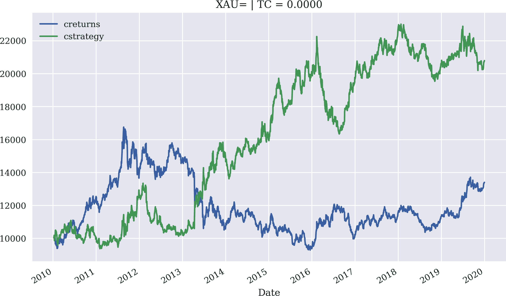

# 第四章：掌握向量化回测

> [T]他们愚蠢到以为可以通过过去来预测未来。¹
> 
> *经济学家*

开发算法交易程序的想法和假设通常是准备阶段中更具创造性甚至有时更有趣的部分。彻底测试它们通常是更技术性和耗时的部分。本章讨论不同算法交易策略的向量化回测。它涵盖以下类型的策略（还参考“交易策略”）：

简单移动平均线（SMA）基于策略

SMA 用于买卖信号生成的基本理念已有几十年历史。SMA 是所谓的股票价格技术分析中的重要工具。例如，当在较短时间窗口（如 42 天）上定义的 SMA 穿越在较长时间窗口（如 252 天）上定义的 SMA 时，就会产生信号。

动量策略

这些策略基于这样的假设：最近的表现将持续一段时间。例如，一个下跌趋势的股票被认为将继续下跌，这就是为什么应该做空这样的股票。

均值回归策略

均值回归策略背后的推理是，股票价格或其他金融工具的价格在偏离这些水平太多时，倾向于回归到某种均值水平或趋势水平。

本章内容如下。“利用向量化”介绍了向量化作为一个有用的技术方法来制定和回测交易策略。“基于简单移动平均线的策略”是本章的核心内容，深入讨论了基于 SMA 的向量化回测策略。“基于动量的策略”介绍并回测了基于所谓的时间序列动量（“近期表现”）的股票交易策略。“基于均值回归的策略”结束了本章的内容，涵盖了均值回归策略。最后，“数据窥探和过度拟合”讨论了在算法交易策略回测中数据窥探和过度拟合的陷阱。

本章的主要目标是掌握向量化实现方法，这些方法如`NumPy`和`pandas`包所允许的，作为高效快速的回测工具。为此，所提出的方法在简化假设的基础上更好地集中讨论向量化的主题。

在以下情况下应考虑向量化回测：

简单交易策略

当涉及建模算法交易策略时，向量化回测方法显然存在局限性。然而，许多流行的简单策略可以以向量化方式进行回测。

互动式策略探索

向量化的回测允许灵活、互动式地探索交易策略及其特征。通常只需几行代码即可得出初步结果，并且可以轻松测试不同的参数组合。

以可视化为主要目标

这种方法非常适合可视化使用的数据、统计数据、信号和性能结果。一些简短的 Python 代码通常足以生成引人入胜且富有洞察力的图表。

全面的回测程序

总体而言，向量化的回测速度相当快，能够在短时间内测试大量的参数组合。当速度至关重要时，应考虑这种方法。

# 利用向量化

*向量化*或*数组编程*是指一种编程风格，其中对标量（即整数或浮点数）的操作被推广到向量、矩阵甚至多维数组。考虑一个整数向量 <math alttext="v equals left-parenthesis 1 comma 2 comma 3 comma 4 comma 5 right-parenthesis Superscript upper T"><mrow><mi>v</mi> <mo>=</mo> <msup><mrow><mo>(</mo><mn>1</mn><mo>,</mo><mn>2</mn><mo>,</mo><mn>3</mn><mo>,</mo><mn>4</mn><mo>,</mo><mn>5</mn><mo>)</mo></mrow> <mi>T</mi></msup></mrow></math> 在 Python 中表示为`list`对象`v = [1, 2, 3, 4, 5]`。计算这样一个向量与数`2`的标量积在纯 Python 中需要使用`for`循环或类似的表达式，比如列表推导式，它实际上是`for`循环的另一种语法：

```py
In [1]: v = [1, 2, 3, 4, 5]

In [2]: sm = [2 * i for i in v]

In [3]: sm
Out[3]: [2, 4, 6, 8, 10]
```

原则上，Python 允许将`list`对象乘以一个整数，但在示例中，Python 的数据模型返回另一个`list`对象，其中包含原始对象元素的两倍：

```py
In [4]: 2 * v
Out[4]: [1, 2, 3, 4, 5, 1, 2, 3, 4, 5]
```

## NumPy 中的向量化

数值计算的`NumPy`包（详见[`NumPy`主页](http://numpy.org)）将向量化引入 Python。`NumPy`提供的主要类是`ndarray`类，代表*n 维数组*。例如，可以基于`list`对象`v`创建这样一个对象的实例。标量乘法、线性变换以及类似的线性代数操作将按预期进行：

```py
In [5]: import numpy as np  

In [6]: a = np.array(v)  

In [7]: a  
Out[7]: array([1, 2, 3, 4, 5])

In [8]: type(a)  
Out[8]: numpy.ndarray

In [9]: 2 * a  
Out[9]: array([ 2,  4,  6,  8, 10])

In [10]: 0.5 * a + 2  
Out[10]: array([2.5, 3. , 3.5, 4. , 4.5])
```


导入`NumPy`包。


基于`list`对象实例化一个`ndarray`对象。


以`ndarray`对象的形式打印存储的数据。


查找对象的类型。


实现矢量化的标量乘法。


实现矢量化的线性变换。

从一维数组（向量）到二维数组（矩阵）的转换是自然的。对于更高维度也同样适用：

```py
In [11]: a = np.arange(12).reshape((4, 3))  

In [12]: a
Out[12]: array([[ 0,  1,  2],
                [ 3,  4,  5],
                [ 6,  7,  8],
                [ 9, 10, 11]])

In [13]: 2 * a
Out[13]: array([[ 0,  2,  4],
                [ 6,  8, 10],
                [12, 14, 16],
                [18, 20, 22]])

In [14]: a ** 2  
Out[14]: array([[  0,   1,   4],
                [  9,  16,  25],
                [ 36,  49,  64],
                [ 81, 100, 121]])
```


创建一个一维`ndarray`对象，并将其重新整形为二维。


以向量化方式计算对象的每个元素的平方。

此外，`ndarray`类提供了一些方法，允许进行向量化操作。它们通常也有对应的称为通用函数的形式，由`NumPy`提供：

```py
In [15]: a.mean()  
Out[15]: 5.5

In [16]: np.mean(a)  
Out[16]: 5.5

In [17]: a.mean(axis=0)  
Out[17]: array([4.5, 5.5, 6.5])

In [18]: np.mean(a, axis=1)  
Out[18]: array([ 1.,  4.,  7., 10.])
```


通过方法调用计算所有元素的平均值。


通过通用函数计算所有元素的平均值。


沿第一轴计算平均值。


沿第二轴计算平均值。

作为金融示例，考虑在“Python Scripts”中使用欧拉离散化生成几何布朗运动样本路径的函数`generate_sample_data()`。该实现利用了多个向量化操作，将它们组合成一行代码。

更多关于`NumPy`中向量化的细节，请参见附录 A。有关在金融背景下向量化应用的多种示例，请参考 Hilpisch（2018）。

Python 的标准指令集和数据模型通常不允许进行向量化数值操作。`NumPy`引入了基于常规数组类`ndarray`的强大向量化技术，使得例如在线性代数中关于向量和矩阵的数学符号的紧凑代码成为可能。

## 使用`pandas`进行向量化

`pandas`包和中心`DataFrame`类大量使用`NumPy`和`ndarray`类。因此，`NumPy`上下文中看到的大多数向量化原则也适用于`pandas`。这些机制最好通过具体示例再次解释。首先，定义一个二维`ndarray`对象：

```py
In [19]: a = np.arange(15).reshape(5, 3)

In [20]: a
Out[20]: array([[ 0,  1,  2],
                [ 3,  4,  5],
                [ 6,  7,  8],
                [ 9, 10, 11],
                [12, 13, 14]])
```

要创建`DataFrame`对象，首先生成一个具有适当大小的列名`list`对象和一个`DatetimeIndex`对象，两者均适合给定的`ndarray`对象：

```py
In [21]: import pandas as pd  

In [22]: columns = list('abc')  

In [23]: columns
Out[23]: ['a', 'b', 'c']

In [24]: index = pd.date_range('2021-7-1', periods=5, freq='B')  

In [25]: index
Out[25]: DatetimeIndex(['2021-07-01', '2021-07-02', '2021-07-05',
          '2021-07-06',
                        '2021-07-07'],
                       dtype='datetime64[ns]', freq='B')

In [26]: df = pd.DataFrame(a, columns=columns, index=index)  

In [27]: df
Out[27]:              a   b   c
         2021-07-01   0   1   2
         2021-07-02   3   4   5
         2021-07-05   6   7   8
         2021-07-06   9  10  11
         2021-07-07  12  13  14
```


导入`pandas`包。


从`str`对象创建一个`list`对象。


创建一个具有“工作日”频率并覆盖五个周期的`pandas` `DatetimeIndex`对象。


基于 `ndarray` 对象 `a` 实例化一个 `DataFrame` 对象，指定列标签和索引值。

原则上，向量化现在与 `ndarray` 对象类似工作。一个不同之处是聚合操作默认为按列结果：

```py
In [28]: 2 * df  
Out[28]:              a   b   c
         2021-07-01   0   2   4
         2021-07-02   6   8  10
         2021-07-05  12  14  16
         2021-07-06  18  20  22
         2021-07-07  24  26  28

In [29]: df.sum()  
Out[29]: a    30
         b    35
         c    40
         dtype: int64

In [30]: np.mean(df)  
Out[30]: a    6.0
         b    7.0
         c    8.0
         dtype: float64
```


计算 `DataFrame` 对象（视为矩阵）的数量积。


计算*每列*的求和。


计算*每列*的均值。

通过方括号或点符号引用相应列名，可以实现按列的操作：

```py
In [31]: df['a'] + df['c']  
Out[31]: 2021-07-01     2
         2021-07-02     8
         2021-07-05    14
         2021-07-06    20
         2021-07-07    26
         Freq: B, dtype: int64

In [32]: 0.5 * df.a + 2 * df.b - df.c  
Out[32]: 2021-07-01     0.0
         2021-07-02     4.5
         2021-07-05     9.0
         2021-07-06    13.5
         2021-07-07    18.0
         Freq: B, dtype: float64
```


计算列 `a` 和 `c` 的逐元素求和。


计算涉及所有三列的线性变换。

同样地，根据布尔结果向量生成条件和类似 SQL 的选择条件也很容易实现：

```py
In [33]: df['a'] > 5  
Out[33]: 2021-07-01    False
         2021-07-02    False
         2021-07-05     True
         2021-07-06     True
         2021-07-07     True
         Freq: B, Name: a, dtype: bool

In [34]: df[df['a'] > 5]  
Out[34]:              a   b   c
         2021-07-05   6   7   8
         2021-07-06   9  10  11
         2021-07-07  12  13  14
```


列 `a` 中哪个元素大于五？


选择所有列 `a` 中元素大于五的行。

对于向量化回测交易策略，比较两列或更多列是典型的操作：

```py
In [35]: df['c'] > df['b']  
Out[35]: 2021-07-01    True
         2021-07-02    True
         2021-07-05    True
         2021-07-06    True
         2021-07-07    True
         Freq: B, dtype: bool

In [36]: 0.15 * df.a + df.b > df.c  
Out[36]: 2021-07-01    False
         2021-07-02    False
         2021-07-05    False
         2021-07-06     True
         2021-07-07     True
         Freq: B, dtype: bool
```


对于哪个日期，列 `c` 中的元素大于列 `b` 中的元素？


将列 `a` 和 `b` 的线性组合与列 `c` 进行比较的条件。

使用 `pandas` 进行向量化是一个强大的概念，特别适用于金融算法的实现和向量化回测，如本章节其余部分所示。有关使用 `pandas` 进行向量化的基础知识和金融示例，请参阅 Hilpisch（2018 年，第五章）。

虽然 `NumPy` 将一般向量化方法引入了 Python 的数值计算世界，但 `pandas` 允许在时间序列数据上进行向量化。这对于实施金融算法和算法交易策略的回测非常有帮助。通过这种方法，您可以期待更简洁的代码，并且与使用标准 Python 代码（使用 `for` 循环等惯用语法）相比，代码执行速度更快。

# 基于简单移动平均线的策略

基于简单移动平均线（SMAs）的交易策略是一个源于技术股票分析领域几十年历史的策略。例如，Brock 等人（1992 年）系统地对这些策略进行了实证研究。他们写道：

> “技术分析”这个术语是指多种交易技术的总称。在本文中，我们探讨了两种最简单和最流行的技术规则：移动平均振荡器和交易区间突破（阻力和支撑水平）。在第一种方法中，通过两个移动平均线（长期和短期）生成买入和卖出信号。我们的研究表明，技术分析有助于预测股票的变化。

## 入门基础

本小节重点介绍了使用两个 SMA 的回测交易策略的基础知识。后续示例使用了 EUR/USD 汇率的每日收盘数据，这些数据可以在 [EOD 数据文件](https://oreil.ly/AzE-p) 中的 *csv* 文件中找到。数据来自 Refinitiv Eikon 数据 API，代表了各自工具的 EOD 值 (`RICs`)：

```py
In [37]: raw = pd.read_csv('http://hilpisch.com/pyalgo_eikon_eod_data.csv',
                            index_col=0, parse_dates=True).dropna()  

In [38]: raw.info()  
         <class 'pandas.core.frame.DataFrame'>
         DatetimeIndex: 2516 entries, 2010-01-04 to 2019-12-31
         Data columns (total 12 columns):
          #   Column  Non-Null Count  Dtype
         ---  ------  --------------  -----
          0   AAPL.O  2516 non-null   float64
          1   MSFT.O  2516 non-null   float64
          2   INTC.O  2516 non-null   float64
          3   AMZN.O  2516 non-null   float64
          4   GS.N    2516 non-null   float64
          5   SPY     2516 non-null   float64
          6   .SPX    2516 non-null   float64
          7   .VIX    2516 non-null   float64
          8   EUR=    2516 non-null   float64
          9   XAU=    2516 non-null   float64
          10  GDX     2516 non-null   float64
          11  GLD     2516 non-null   float64
         dtypes: float64(12)
         memory usage: 255.5 KB

In [39]: data = pd.DataFrame(raw['EUR='])  

In [40]: data.rename(columns={'EUR=': 'price'}, inplace=True)  

In [41]: data.info()  
         <class 'pandas.core.frame.DataFrame'>
         DatetimeIndex: 2516 entries, 2010-01-04 to 2019-12-31
         Data columns (total 1 columns):
          #   Column  Non-Null Count  Dtype
         ---  ------  --------------  -----
          0   price   2516 non-null   float64
         dtypes: float64(1)
         memory usage: 39.3 KB
```


从远程存储的 `CSV` 文件中读取数据。


显示 `DataFrame` 对象的元信息。


将 `Series` 对象转换为 `DataFrame` 对象。


将唯一的列重命名为 `price`。


显示新 `DataFrame` 对象的元信息。

使用 `rolling()` 方法和延迟计算操作，简化了 SMA 的计算：

```py
In [42]: data['SMA1'] = data['price'].rolling(42).mean()  

In [43]: data['SMA2'] = data['price'].rolling(252).mean()  

In [44]: data.tail()  
Out[44]:              price      SMA1      SMA2
         Date
         2019-12-24  1.1087  1.107698  1.119630
         2019-12-26  1.1096  1.107740  1.119529
         2019-12-27  1.1175  1.107924  1.119428
         2019-12-30  1.1197  1.108131  1.119333
         2019-12-31  1.1210  1.108279  1.119231
```


创建一个包含 42 天 SMA 值的列。前 41 个值将为 `NaN`。


创建一个包含 252 天 SMA 值的列。前 251 个值将为 `NaN`。


打印数据集的最后五行。

通过原始时间序列数据与 SMA 的组合可视化，最佳地展示了结果（见 图 4-1）：

```py
In [45]: %matplotlib inline
         from pylab import mpl, plt
         plt.style.use('seaborn')
         mpl.rcParams['savefig.dpi'] = 300
         mpl.rcParams['font.family'] = 'serif'

In [46]: data.plot(title='EUR/USD | 42 & 252 days SMAs',
                   figsize=(10, 6));
```

下一步是根据两个 SMA 之间的关系生成信号或市场定位。规则是*当较短的 SMA 高于较长的 SMA 时做多，反之则做空*。对于我们的目的，我们用 1 表示做多仓位，用 -1 表示做空仓位。


###### 图 4-1\. EUR/USD 汇率与两个 SMA

能够直接比较 `DataFrame` 对象的两列使得这一规则的实现仅需一行代码。随时间变化的定位在 图 4-2 中有所体现：

```py
In [47]: data['position'] = np.where(data['SMA1'] > data['SMA2'],
                                     1, -1)  

In [48]: data.dropna(inplace=True)  

In [49]: data['position'].plot(ylim=[-1.1, 1.1],
                               title='Market Positioning',
                               figsize=(10, 6));  
```


以向量化方式实现交易规则。`np.where()` 在表达式为 `True` 的行上生成 `+1`，在表达式为 `False` 的行上生成 `-1`。


删除数据集中至少包含一个`NaN`值的所有行。


绘制随时间变化的定位。


###### 图 4-2\. 基于两个 SMA 的策略市场定位

计算策略表现时，接下来基于原始金融时间序列计算对数收益率。由于矢量化，代码相当简洁。图 4-3 显示了对数收益率的直方图：

```py
In [50]: data['returns'] = np.log(data['price'] / data['price'].shift(1))  

In [51]: data['returns'].hist(bins=35, figsize=(10, 6));  
```


在`price`列上以矢量化方式计算对数收益率。


将对数收益率绘制成直方图（频率分布）。

要得出策略收益，将`position`列（向后移一交易日）与`returns`列相乘。由于对数收益率是可加的，计算`returns`和`strategy`列的总和提供了策略相对于基础投资本身表现的首次比较。


###### 图 4-3\. EUR/USD 对数收益率的频率分布

比较收益率表明，该策略在超过被动基准投资方面获得了胜利：

```py
In [52]: data['strategy'] = data['position'].shift(1) * data['returns']  

In [53]: data[['returns', 'strategy']].sum()  
Out[53]: returns    -0.176731
         strategy    0.253121
         dtype: float64

In [54]: data[['returns', 'strategy']].sum().apply(np.exp)  
Out[54]: returns     0.838006
         strategy    1.288039
         dtype: float64
```


根据仓位和市场回报计算策略的对数收益率。


对股票和策略的单个对数收益值求和（仅作说明）。


对对数收益率之和应用指数函数以计算*总体表现*。

使用`cumsum`计算随时间的累积和，基于此应用指数函数`np.exp()`计算累积收益，这提供了策略如何随时间与基础金融工具表现相比的更全面的图像。图 4-4 图形化显示了数据，并展示了在这种特定情况下的超额表现：

```py
In [55]: data[['returns', 'strategy']].cumsum(
                     ).apply(np.exp).plot(figsize=(10, 6));
```


###### 图 4-4\. EUR/USD 与基于 SMA 的策略的总体表现对比

股票和策略的平均年化风险收益统计很容易计算：

```py
In [56]: data[['returns', 'strategy']].mean() * 252  
Out[56]: returns    -0.019671
         strategy    0.028174
         dtype: float64

In [57]: np.exp(data[['returns', 'strategy']].mean() * 252) - 1  
Out[57]: returns    -0.019479
         strategy    0.028575
         dtype: float64

In [58]: data[['returns', 'strategy']].std() * 252 ** 0.5  
Out[58]: returns     0.085414
         strategy    0.085405
         dtype: float64

In [59]: (data[['returns', 'strategy']].apply(np.exp) - 1).std() * 252 ** 0.5  
Out[59]: returns     0.085405
         strategy    0.085373
         dtype: float64
```


计算对数空间和常规空间中的年化均值收益。


计算对数空间和常规空间中的年化标准偏差。

在交易策略表现的背景下，其他经常感兴趣的风险统计数据包括*最大回撤*和*最长回撤期*。在此背景下使用的一个辅助统计数据是策略的总体最大累积毛利润，由应用于策略毛利润的`cummax()`方法计算。图 4-5 展示了基于 SMA 策略的两个时间序列：

```py
In [60]: data['cumret'] = data['strategy'].cumsum().apply(np.exp)  

In [61]: data['cummax'] = data['cumret'].cummax()  

In [62]: data[['cumret', 'cummax']].dropna().plot(figsize=(10, 6));  
```


定义一个新列`cumret`，其中包含随时间变化的策略毛利润。


定义另一个列，其中包含策略毛利润的运行最大值。


绘制`DataFrame`对象的两个新列。


###### 图 4-5\. 基于 SMA 策略的毛利润和累积最大表现

然后，最大回撤简单地计算为两个相关列之间的差异的最大值。在例子中，最大回撤约为 18 个百分点：

```py
In [63]: drawdown = data['cummax'] - data['cumret']  

In [64]: drawdown.max()  
Out[64]: 0.17779367070195917
```


计算两列之间的逐元素差异。


从所有差异中挑选出最大值。

确定最长回撤期需要更多的工作。它需要找到那些总体表现等于其累积最大值的日期（即设置新最大值的日期）。这些信息存储在一个临时对象中。然后计算所有这些日期之间的天数差异，并选择最长的期间。这样的期间可能只有一天，也可能超过 100 天。在这里，最长的回撤期为 596 天——一个相当长的时间段：²

```py
In [65]: temp = drawdown[drawdown == 0]  

In [66]: periods = (temp.index[1:].to_pydatetime() -
                    temp.index[:-1].to_pydatetime())  

In [67]: periods[12:15]
Out[67]: array([datetime.timedelta(days=1), datetime.timedelta(days=1),
                datetime.timedelta(days=10)], dtype=object)

In [68]: periods.max()  
Out[68]: datetime.timedelta(days=596)
```


哪些差异等于零？


计算所有索引值之间的`timedelta`值。


挑选出最大的`timedelta`值。

使用`pandas`进行向量化回测通常是一项相当高效的工作，这归功于该库的能力以及主要的`DataFrame`类。然而，迄今为止展示的交互式方法在希望实施更大的回测程序时效果不佳，例如优化基于 SMA 策略的参数。因此，建议采用更一般化的方法。

`pandas` 显然是进行交易策略向量化分析的强大工具。可以通过一行或几行代码计算许多感兴趣的统计数据，如对数收益、累积收益、年化收益和波动率、最大回撤及最大回撤期。通过简单的方法调用能够可视化结果是一个额外的好处。

## 泛化方法

“SMA 回测类” 提供了一个包含用于基于 SMA 的交易策略向量化回测的类的 Python 代码。在某种意义上，它是前一小节介绍的方法的一种泛化。它允许通过提供以下参数来定义 `SMAVectorBacktester` 类的实例：

+   `symbol`: 用于的 `RIC`（仪器数据）

+   `SMA1`: 较短 SMA 的时间窗口（天数）

+   `SMA2`: 较长 SMA 的时间窗口（天数）

+   `start`: 数据选择的开始日期

+   `end`: 数据选择的结束日期

应用程序本身最好通过使用该类的交互会话来说明。例如，首先复制之前基于 EUR/USD 汇率数据实施的回测。然后优化 SMA 参数以获取最大总体表现。基于最佳参数，它绘制了策略与基准工具在相关时间段内的总体表现：

```py
In [69]: import SMAVectorBacktester as SMA  

In [70]: smabt = SMA.SMAVectorBacktester('EUR=', 42, 252,
                                         '2010-1-1', '2019-12-31')   

In [71]: smabt.run_strategy()  
Out[71]: (1.29, 0.45)

In [72]: %%time
         smabt.optimize_parameters((30, 50, 2),
                                   (200, 300, 2))  
         CPU times: user 3.76 s, sys: 15.8 ms, total: 3.78 s
         Wall time: 3.78 s

Out[72]: (array([ 48., 238.]), 1.5)

In [73]: smabt.plot_results()  
```


这将模块导入为 `SMA`。


实例化主类的一个实例。


对给定实例化参数的 SMA 策略进行回测。


`optimize_parameters()` 方法接受参数范围和步长作为输入，并通过蛮力方法确定最佳组合。


`plot_results()` 方法根据当前存储的参数值（这里是优化过程的参数）绘制策略表现与基准工具的对比图。

原始参数化策略的总体表现为 1.24 或 124%。优化策略对于参数组合 `SMA1 = 48` 和 `SMA2 = 238` 的绝对回报率为 1.44 或 144%。图 4-6 以图形方式显示了随时间变化的总体表现，再次与代表基准的基础工具的表现进行比较。


###### 图 4-6\. EUR/USD 的总体表现及优化的 SMA 策略

# 基于动量的策略

有两种基本类型的动量策略。第一种类型是*交叉部门*动量策略。从更大的仪器池中选择，这些策略购买那些相对于同行（或基准）最近表现优越的仪器，并卖出那些表现不佳的仪器。基本思想是，这些仪器在一定时间内继续表现优越或不足。Jegadeesh 和 Titman（1993, 2001）以及 Chan 等人（1996）研究了这些类型的交易策略及其潜在的盈利来源。

交叉部门动量策略传统上表现相当不错。Jegadeesh 和 Titman（1993）写道：

> 本文记录了那些在过去表现良好的股票购买和在过去表现不佳的股票卖出的策略，在 3 至 12 个月的持有期内产生显著的正回报。

第二种类型是*时间序列*动量策略。这些策略购买那些最近表现良好的仪器，并卖出那些最近表现不佳的仪器。在这种情况下，基准是仪器本身的过去回报。Moskowitz 等人（2012）详细分析了各种市场中这种类型的动量策略。他们写道：

> 与关注证券在横截面上的相对回报不同，时间序列动量完全集中于安全本身的过去回报……我们发现，在我们研究的几乎每种仪器中，时间序列动量似乎挑战了“随机行走”假设，该假设的基本形式暗示了过去价格的上涨或下跌不应该对其未来的上涨或下跌具有信息性。

## 入门基础

考虑美元下的黄金收盘价（`XAU=`）：

```py
In [74]: data = pd.DataFrame(raw['XAU='])

In [75]: data.rename(columns={'XAU=': 'price'}, inplace=True)

In [76]: data['returns'] = np.log(data['price'] / data['price'].shift(1))
```

最简单的时间序列动量策略是，如果最后的回报是正的，就买入股票；如果是负的，就卖出。利用`NumPy`和`pandas`可以很容易地进行形式化；只需将最后可用回报的符号作为市场头寸。图 4-7 展示了该策略的表现。该策略明显表现不佳基准工具：

```py
In [77]: data['position'] = np.sign(data['returns'])  

In [78]: data['strategy'] = data['position'].shift(1) * data['returns']  

In [79]: data[['returns', 'strategy']].dropna().cumsum(
                     ).apply(np.exp).plot(figsize=(10, 6));  
```


定义一个新列，包含相关对数回报的符号（即 1 或-1）；结果值表示市场头寸（多头或空头）。


根据市场头寸计算策略的对数回报。


绘制并比较策略的表现与基准工具。


###### 图 4-7\. 黄金价格（美元）和动量策略（仅最后回报）的总体表现

使用滚动时间窗口，时间序列动量策略可以泛化到不仅仅是最后一个回报。例如，可以使用*最后三次回报*的平均值生成定位信号。图 4-8 表明，在这种情况下，该策略的表现要好得多，无论是绝对还是相对于基准工具：

```py
In [80]: data['position'] = np.sign(data['returns'].rolling(3).mean())  

In [81]: data['strategy'] = data['position'].shift(1) * data['returns']

In [82]: data[['returns', 'strategy']].dropna().cumsum(
                 ).apply(np.exp).plot(figsize=(10, 6));
```


这次采用了连续三天滚动窗口的平均回报。

然而，这种表现对于时间窗口参数非常敏感。例如，选择最后两次回报而不是三次会导致表现大幅下降，正如图 4-9 所示。


###### 图 4-8\. 黄金价格（USD）和动量策略（最后三次回报）的总体表现


###### 图 4-9\. 黄金价格（USD）和动量策略（最近两次回报）的总体表现

时间序列动量可能在一天中预期出现，实际上，人们预计它在一天内比在多天内更为显著。图 4-10 展示了五种时间序列动量策略的总体表现，分别为一、三、五、七和九次回报观察。所使用的数据是从 Eikon 数据 API 检索的苹果公司的一天内股价数据。该图基于以下代码。基本上所有策略在这一天内的时间窗口内都表现优于股票，尽管有些只是稍微好一些：

```py
In [83]: fn = '../data/AAPL_1min_05052020.csv'  
         # fn = '../data/SPX_1min_05052020.csv' 

In [84]: data = pd.read_csv(fn, index_col=0, parse_dates=True)  

In [85]: data.info()  
         <class 'pandas.core.frame.DataFrame'>
         DatetimeIndex: 241 entries, 2020-05-05 16:00:00 to 2020-05-05 20:00:00
         Data columns (total 6 columns):
          #   Column  Non-Null Count  Dtype
         ---  ------  --------------  -----
          0   HIGH    241 non-null    float64
          1   LOW     241 non-null    float64
          2   OPEN    241 non-null    float64
          3   CLOSE   241 non-null    float64
          4   COUNT   241 non-null    float64
          5   VOLUME  241 non-null    float64
         dtypes: float64(6)
         memory usage: 13.2 KB

In [86]: data['returns'] = np.log(data['CLOSE'] /
                                  data['CLOSE'].shift(1))  

In [87]: to_plot = ['returns']  

In [88]: for m in [1, 3, 5, 7, 9]:
             data['position_%d' % m] = np.sign(data['returns'].rolling(m).mean())  
             data['strategy_%d' % m] = (data['position_%d' % m].shift(1) *
                                        data['returns'])  
             to_plot.append('strategy_%d' % m)   

In [89]: data[to_plot].dropna().cumsum().apply(np.exp).plot(
             title='AAPL intraday 05\. May 2020',
             figsize=(10, 6), style=['-', '--', '--', '--', '--', '--']);  
```


从`CSV`文件中读取日内数据。


计算日内对数回报。


定义一个`list`对象以选择后续要绘制的列。


根据动量策略参数推导出定位。


计算所得的策略对数回报。


向`list`对象附加列名。


将所有相关列绘制出来，以比较策略的表现与基准工具的表现。


###### 图 4-10\. 苹果股票和五种动量策略（最后一次、三次、五次、七次和九次回报）的总体日内表现

图 4-11 展示了相同五种策略在标准普尔 500 指数上的表现。同样，所有五种策略配置都优于指数，且显示正回报（扣除交易成本前）。


###### 图 4-11\. 标准普尔 500 指数和五种动量策略（最后一次、三次、五次、七次和九次回报）的总体日内表现

## 泛化方法

“动量回测类”介绍了一个包含`MomVectorBacktester`类的 Python 模块，允许更加标准化地对基于动量的策略进行回测。该类具有以下属性：

+   `symbol`: 用于的`RIC`（工具数据）

+   `start`: 数据选择的开始日期

+   `end`: 数据选择的结束日期

+   `amount`: 初始投资金额

+   `tc`: 每笔交易的比例交易成本

与`SMAVectorBacktester`类相比，该类引入了两个重要的泛化特性：在回测期间初始投资的固定金额和比例交易成本，以更接近市场实际成本。特别是在时间序列动量策略的背景下，交易成本的增加尤为重要，这些策略往往随时间产生大量交易。

应用程序与以往一样简单方便。示例首先复制了以前交互会话的结果，但这次的初始投资为 10,000 美元。图 4-12 展示了该策略的表现，使用最后三次收益均值生成定位信号。第二种情况是每笔交易的比例交易成本为 0.1%。如图 4-13 所示，在这种情况下，即使是较小的交易成本也会显著降低绩效。影响的驱动因素是策略需要的交易频率相对较高：

```py
In [90]: import MomVectorBacktester as Mom  

In [91]: mombt = Mom.MomVectorBacktester('XAU=', '2010-1-1',
                                         '2019-12-31', 10000, 0.0)  

In [92]: mombt.run_strategy(momentum=3)  
Out[92]: (20797.87, 7395.53)

In [93]: mombt.plot_results()
In [94]: mombt = Mom.MomVectorBacktester('XAU=', '2010-1-1',
                                         '2019-12-31', 10000, 0.001)  

In [95]: mombt.run_strategy(momentum=3)  
Out[95]: (10749.4, -2652.93)

In [96]: mombt.plot_results()
```


将模块导入为`Mom`


实例化一个回测类的对象，定义起始资本为 10,000 美元，比例交易成本为零。


对基于三天时间窗口的动量策略进行回测：该策略优于基准被动投资。


这次假设每笔交易的比例交易成本为 0.1%。


在这种情况下，该策略基本上失去了所有超额绩效。



###### 图 4-12\. 黄金价格（美元）和动量策略的总体表现（最后三次收益，无交易成本）


###### 图 4-13\. 黄金价格（美元）和动量策略的总体表现（最后三次收益，交易成本为 0.1%）

# 基于均值回归的策略

粗略来说，均值回归策略依赖于与动量策略相反的推理。如果某个金融工具相对于其趋势表现“过好”，则会做空，反之亦然。换句话说，动量策略（时间序列）假设*收益之间有正相关性*，而均值回归策略则假设*收益之间有负相关性*。Balvers 等人（2000）写道：

> 均值回归是指资产价格返回到趋势路径的倾向。

使用简单移动平均线（SMA）作为“趋势路径”的代理，例如 EUR/USD 汇率的均值回归策略可以以类似 SMA 和动量策略的回测方式进行。其思想是定义当前股票价格与 SMA 之间的距离阈值，以指示开仓或平仓位置。

## 入门基础

后续示例针对两种不同的金融工具，由于它们都基于金价，可以预期有显著的均值回归：

+   `GLD` 是 SPDR 黄金股票的符号，这是最大的实物支持交易所交易基金（ETF）黄金（参见 [SPDR Gold Shares 主页](http://spdrgoldshares.com)）。

+   `GDX` 是 VanEck Vectors 黄金矿业 ETF 的符号，该基金投资于股票产品以跟踪 NYSE Arca 黄金矿业指数（参见 [VanEck Vectors Gold Miners 概述页面](https://oreil.ly/CmPBA)）。

示例从 `GDX` 开始，并基于 25 天 SMA 和绝对偏差阈值为 3.5 实施均值回归策略，以信号化定位。图 4-14 显示了 `GDX` 的当前价格与 SMA 之间的差异，以及生成卖出和买入信号的正负阈值：

```py
In [97]: data = pd.DataFrame(raw['GDX'])

In [98]: data.rename(columns={'GDX': 'price'}, inplace=True)

In [99]: data['returns'] = np.log(data['price'] /
                                  data['price'].shift(1))

In [100]: SMA = 25  

In [101]: data['SMA'] = data['price'].rolling(SMA).mean()  

In [102]: threshold = 3.5  

In [103]: data['distance'] = data['price'] - data['SMA']  

In [104]: data['distance'].dropna().plot(figsize=(10, 6), legend=True)  
          plt.axhline(threshold, color='r')
          plt.axhline(-threshold, color='r')
          plt.axhline(0, color='r');
```


SMA 参数被定义为…


…并且 SMA（“趋势路径”）被计算。


信号生成的阈值被定义。


对于每个时间点计算距离。


绘制距离数值。


###### 图 4-14\. `GDX` 当前价格与 SMA 之间的差异，以及生成均值回归信号的阈值数值

基于差异和固定阈值，可以再次以向量化方式推导出定位。图 4-15 显示了生成的定位：

```py
In [105]: data['position'] = np.where(data['distance'] > threshold,
                                      -1, np.nan)  

In [106]: data['position'] = np.where(data['distance'] < -threshold,
                                      1, data['position'])  

In [107]: data['position'] = np.where(data['distance'] *
                      data['distance'].shift(1) < 0, 0, data['position'])  

In [108]: data['position'] = data['position'].ffill().fillna(0)  

In [109]: data['position'].iloc[SMA:].plot(ylim=[-1.1, 1.1],
                                         figsize=(10, 6));  
```


如果距离值大于阈值，则进行做空操作（在新列 `position` 中设置为 -1），否则设置为 `NaN`。


如果距离值低于负阈值，则做多（设置为 1），否则保持`position`列不变。


如果距离值的符号发生变化，则市场中性（设置为 0），否则保持`position`列不变。


前向填充所有`NaN`位置的值为前一个值；将所有剩余的`NaN`值替换为 0。


从索引位置`SMA`开始绘制结果定位。


###### 图 4-15\. 基于均值回归策略生成的`GDX`的定位

最后一步是推导策略收益，显示在图 4-16 中。尽管特定的参数设置导致中性位置的长期存在（既非多也非空仓），但这些中性位置反映在图 4-16 策略曲线的平坦部分：

```py
In [110]: data['strategy'] = data['position'].shift(1) * data['returns']

In [111]: data[['returns', 'strategy']].dropna().cumsum(
                  ).apply(np.exp).plot(figsize=(10, 6));
```


###### 图 4-16\. `GDX` ETF 和均值回归策略的总体表现（SMA = 25，阈值 = 3.5）

## 泛化方法

与以往一样，基于相应 Python 类实现的向量化回测更高效。介绍的`MRVectorBacktester`类继承自`MomVectorBacktester`类，只需替换`run_strategy()`方法以适应均值回归策略的特定要求。

本例现在使用`GLD`，并将比例交易成本设置为 0.1%。再次将初始投资金额设定为 10,000 美元。这次的 SMA 为 43，阈值为 7.5。图 4-17 显示了均值回归策略与`GLD` ETF 的表现对比：

```py
In [112]: import MRVectorBacktester as MR  

In [113]: mrbt = MR.MRVectorBacktester('GLD', '2010-1-1', '2019-12-31',
                                       10000, 0.001)  

In [114]: mrbt.run_strategy(SMA=43, threshold=7.5)  
Out[114]: (13542.15, 646.21)

In [115]: mrbt.plot_results()  
```


将模块导入为`MR`。


用 10,000 美元的初始资本和每笔交易 0.1% 的比例交易成本实例化`MRVectorBacktester`类的对象；在这种情况下，策略明显优于基准工具。


使用`SMA`值为 43 和`threshold`值为 7.5 进行均值回归策略的回测。


绘制策略累积表现与基础工具的图表。


###### 图 4-17\. `GLD` ETF 和均值回归策略的总体表现（SMA = 43，阈值 = 7.5，交易成本为 0.1%）

# 数据窥探和过拟合

这一章节，以及本书的其余部分，侧重于使用 Python 在算法交易中重要概念的技术实现。有时选择的策略、参数、数据集和算法是任意的，有时则是有目的地选择以突出某一点。毫无疑问，在讨论应用于金融的技术方法时，看到展示“良好结果”的示例更令人兴奋和有动力，即使这些结果可能不适用于其他金融工具或时间段。

展示具有良好结果的示例的能力通常伴随着*数据窥探*的代价。根据 White（2000）的说法，数据窥探可以定义如下：

> 数据窥探发生在给定数据集被用于推断或模型选择的目的超过一次时。

换句话说，某种方法可能会多次或甚至多次应用于同一数据集，以获得令人满意的数字和图表。当然，在交易策略研究中，这种做法在智力上是不诚实的，因为它假装一种交易策略在现实世界中具有某种经济潜力，这可能并不现实。由于本书的重点是将 Python 作为算法交易的编程语言使用，数据窥探的方法可能是合理的。这类似于数学书籍通过例子解决一个具有唯一解且易于识别的方程。在数学中，这样的简单例子通常是例外而非规则，但它们经常用于教学目的。

在这种情况下出现的另一个问题是*过度拟合*。在交易背景下，过度拟合可以描述如下（参见[曼斯特理论关于过度拟合](https://oreil.ly/uYIGs)）：

> 过度拟合是指模型描述噪声而非信号的情况。该模型可能在测试数据上表现良好，但在未来的新数据上几乎没有预测能力。过度拟合可以描述为找到实际上并不存在的模式。过度拟合会带来成本——一个过度拟合的策略未来表现将不佳。

即使是基于两个 SMA 值的简单策略也允许进行数千种不同参数组合的回测。其中一些组合几乎肯定会显示良好的性能结果。正如 Bailey 等人（2015）详细讨论的那样，这很容易导致回测过度拟合，而负责回测的人员甚至可能都没有意识到这个问题。他们指出：

> 算法研究和高性能计算的最新进展使得在有限的金融时间序列数据集上测试数百万甚至数十亿个替代投资策略几乎变得微不足道……[I]常见做法是利用这种计算能力来校准投资策略的参数，以最大化其绩效。但由于信号与噪声比例如此之低，往往这种校准的结果是选择参数以从过去的噪声中获利，而不是未来的信号。结果是一个过拟合的回测。

在统计意义上，经验证的实证结果的有效性问题当然不仅限于金融背景下的策略回测。

Ioannidis（2005 年）在谈及医学出版物时，强调在评估研究结果的再现性和有效性时的概率和统计考量：

> 越来越多的人担心，在现代研究中，虚假发现可能占到或甚至是绝大多数已发表的研究声明。然而，这并不奇怪。可以证明，大多数声称的研究发现是错误的……正如先前所示，研究发现的真实概率取决于研究之前它的真实先验概率，研究的统计功效，以及统计显著性水平。

在这种背景下，如果本书中的某个交易策略在给定某个数据集、参数组合，以及可能的特定机器学习算法下表现良好，这既不构成对特定配置的任何推荐，也不允许对策略配置的质量和绩效潜力做出更一般性的结论。

当然，鼓励您使用本书中提供的代码和示例，探索您自己的算法交易策略思路，并根据您自己的回测结果、验证和结论来实际实施它们。毕竟，正确而勤奋的策略研究是金融市场会给予回报的，而不是仅仅依赖数据挖掘和过拟合。

# 结论

向量化是科学计算和金融分析中的一个强大概念，在算法交易策略回测的背景下尤为重要。本章介绍了使用`NumPy`和`pandas`进行向量化，并将其应用于回测三种类型的交易策略：基于简单移动平均线、动量和均值回归的策略。本章承认做了一些简化的假设，严格的交易策略回测需要考虑更多因素，如数据问题、选择问题、避免过度拟合或市场微观结构元素。然而，本章的主要目标是集中讨论向量化的概念及其在算法交易中的技术和实施视角下的应用。在所有具体例子和结果中，需要考虑数据窥探、过度拟合和统计显著性的问题。

# 参考文献和进一步资源

有关使用`NumPy`和`pandas`进行向量化的基础知识，请参阅以下书籍：

+   McKinney, Wes. 2017\. *Python 数据分析*. 第二版. Sebastopol: O’Reilly.

+   VanderPlas, Jake. 2016\. *Python 数据科学手册*. Sebastopol: O’Reilly.

有关在金融背景下使用`NumPy`和`pandas`，请参阅以下书籍：

+   Hilpisch, Yves. 2015\. *Python 金融衍生品分析：数据分析、模型、仿真、校准及对冲*. Wiley Finance.

+   ⸻. 2017\. *列出的波动率和方差衍生品：基于 Python 的指南*. Wiley Finance.

+   ⸻. 2018\. *Python 金融：掌握数据驱动的金融*. 第二版. Sebastopol: O’Reilly.

关于数据窥探和过度拟合的主题，请参阅以下论文：

+   Bailey, David, Jonathan Borwein, Marcos López de Prado 和 Qiji Jim Zhu. 2015\. “回测过拟合的概率.” *计算金融学杂志* 20, (4): 39-69\. [*https://oreil.ly/sOHlf*](https://oreil.ly/sOHlf).

+   Ioannidis, John. 2005\. “为什么大多数发表的研究结果是错误的.” *PLoS Medicine* 2, (8): 696-701.

+   White, Halbert. 2000\. “数据窥探的现实检验.” *计量经济学* 68, (5): 1097-1126.

关于基于简单移动平均线的交易策略的背景信息和实证结果，请参阅以下来源：

+   Brock, William, Josef Lakonishok 和 Blake LeBaron. 1992\. “简单技术交易规则和股票回报的随机特性.” *金融学杂志* 47, (5): 1731-1764.

+   Droke, Clif. 2001\. *简化移动平均线.* Columbia: Marketplace Books.

Ernest Chan 的书详细介绍了基于动量和均值回归的交易策略。该书也是回测交易策略陷阱的良好资源：

+   Chan, Ernest. 2013\. *算法交易：胜利策略及其原理*. Hoboken et al: John Wiley & Sons.

这些研究论文分析了*横截面动量*策略的特征和利润来源，这是动量交易的传统方法：

+   Chan, Louis, Narasimhan Jegadeesh, and Josef Lakonishok. 1996\. “Momentum Strategies.” *Journal of Finance* 51, (5): 1681-1713.

+   Jegadeesh, Narasimhan, and Sheridan Titman. 1993\. “Returns to Buying Winners and Selling Losers: Implications for Stock Market Efficiency.” *Journal of Finance* 48, (1): 65-91.

+   Jegadeesh, Narasimhan, and Sheridan Titman. 2001\. “Profitability of Momentum Strategies: An Evaluation of Alternative Explanations.” *Journal of Finance* 56, (2): 599-720.

Moskowitz 等人的论文提供了所谓的*时间序列动量*策略的分析：

+   Moskowitz, Tobias, Yao Hua Ooi, and Lasse Heje Pedersen. 2012\. “Time Series Momentum.” *Journal of Financial Economics* 104: 228-250.

这些论文从经验上分析了资产价格的均值回归：

+   Balvers, Ronald, Yangru Wu, and Erik Gilliland. 2000\. “Mean Reversion across National Stock Markets and Parametric Contrarian Investment Strategies.” *Journal of Finance* 55, (2): 745-772.

+   Kim, Myung Jig, Charles Nelson, and Richard Startz. 1991\. “Mean Reversion in Stock Prices? A Reappraisal of the Empirical Evidence.” *Review of Economic Studies* 58: 515-528.

+   Spierdijk, Laura, Jacob Bikker, and Peter van den Hoek. 2012\. “Mean Reversion in International Stock Markets: An Empirical Analysis of the 20th Century.” *Journal of International Money and Finance* 31: 228-249.

# Python 脚本

本节介绍了本章引用并使用的 Python 脚本。

## SMA 回测类

以下是具有基于*简单移动平均*的策略的向量化回测的类的 Python 代码：

```py
#
# Python Module with Class
# for Vectorized Backtesting
# of SMA-based Strategies
#
# Python for Algorithmic Trading
# (c) Dr. Yves J. Hilpisch
# The Python Quants GmbH
#
import numpy as np
import pandas as pd
from scipy.optimize import brute

class SMAVectorBacktester(object):
    ''' Class for the vectorized backtesting of SMA-based trading strategies.

 Attributes
 ==========
 symbol: str
 RIC symbol with which to work
 SMA1: int
 time window in days for shorter SMA
 SMA2: int
 time window in days for longer SMA
 start: str
 start date for data retrieval
 end: str
 end date for data retrieval

 Methods
 =======
 get_data:
 retrieves and prepares the base data set
 set_parameters:
 sets one or two new SMA parameters
 run_strategy:
 runs the backtest for the SMA-based strategy
 plot_results:
 plots the performance of the strategy compared to the symbol
 update_and_run:
 updates SMA parameters and returns the (negative) absolute performance
 optimize_parameters:
 implements a brute force optimization for the two SMA parameters
 '''

    def __init__(self, symbol, SMA1, SMA2, start, end):
        self.symbol = symbol
        self.SMA1 = SMA1
        self.SMA2 = SMA2
        self.start = start
        self.end = end
        self.results = None
        self.get_data()

    def get_data(self):
        ''' Retrieves and prepares the data.
 '''
        raw = pd.read_csv('http://hilpisch.com/pyalgo_eikon_eod_data.csv',
                          index_col=0, parse_dates=True).dropna()
        raw = pd.DataFrame(raw[self.symbol])
        raw = raw.loc[self.start:self.end]
        raw.rename(columns={self.symbol: 'price'}, inplace=True)
        raw['return'] = np.log(raw / raw.shift(1))
        raw['SMA1'] = raw['price'].rolling(self.SMA1).mean()
        raw['SMA2'] = raw['price'].rolling(self.SMA2).mean()
        self.data = raw

    def set_parameters(self, SMA1=None, SMA2=None):
        ''' Updates SMA parameters and resp. time series.
 '''
        if SMA1 is not None:
            self.SMA1 = SMA1
            self.data['SMA1'] = self.data['price'].rolling(
                self.SMA1).mean()
        if SMA2 is not None:
            self.SMA2 = SMA2
            self.data['SMA2'] = self.data['price'].rolling(self.SMA2).mean()

    def run_strategy(self):
        ''' Backtests the trading strategy.
 '''
        data = self.data.copy().dropna()
        data['position'] = np.where(data['SMA1'] > data['SMA2'], 1, -1)
        data['strategy'] = data['position'].shift(1) * data['return']
        data.dropna(inplace=True)
        data['creturns'] = data['return'].cumsum().apply(np.exp)
        data['cstrategy'] = data['strategy'].cumsum().apply(np.exp)
        self.results = data
        # gross performance of the strategy
        aperf = data['cstrategy'].iloc[-1]
        # out-/underperformance of strategy
        operf = aperf - data['creturns'].iloc[-1]
        return round(aperf, 2), round(operf, 2)

    def plot_results(self):
        ''' Plots the cumulative performance of the trading strategy
 compared to the symbol.
 '''
        if self.results is None:
            print('No results to plot yet. Run a strategy.')
        title = '%s | SMA1=%d, SMA2=%d' % (self.symbol,
                                               self.SMA1, self.SMA2)
        self.results[['creturns', 'cstrategy']].plot(title=title,
                                                     figsize=(10, 6))

    def update_and_run(self, SMA):
        ''' Updates SMA parameters and returns negative absolute performance
 (for minimazation algorithm).

 Parameters
 ==========
 SMA: tuple
 SMA parameter tuple
 '''
        self.set_parameters(int(SMA[0]), int(SMA[1]))
        return -self.run_strategy()[0]

    def optimize_parameters(self, SMA1_range, SMA2_range):
        ''' Finds global maximum given the SMA parameter ranges.

 Parameters
 ==========
 SMA1_range, SMA2_range: tuple
 tuples of the form (start, end, step size)
 '''
        opt = brute(self.update_and_run, (SMA1_range, SMA2_range), finish=None)
        return opt, -self.update_and_run(opt)

if __name__ == '__main__':
    smabt = SMAVectorBacktester('EUR=', 42, 252,
                                '2010-1-1', '2020-12-31')
    print(smabt.run_strategy())
    smabt.set_parameters(SMA1=20, SMA2=100)
    print(smabt.run_strategy())
    print(smabt.optimize_parameters((30, 56, 4), (200, 300, 4)))
```

## 动量回测类

以下是具有基于*时间序列动量*的策略的向量化回测的类的 Python 代码：

```py
#
# Python Module with Class
# for Vectorized Backtesting
# of Momentum-Based Strategies
#
# Python for Algorithmic Trading
# (c) Dr. Yves J. Hilpisch
# The Python Quants GmbH
#
import numpy as np
import pandas as pd

class MomVectorBacktester(object):
    ''' Class for the vectorized backtesting of
 momentum-based trading strategies.

 Attributes
 ==========
 symbol: str
 RIC (financial instrument) to work with
 start: str
 start date for data selection
 end: str
 end date for data selection
 amount: int, float
 amount to be invested at the beginning
 tc: float
 proportional transaction costs (e.g., 0.5% = 0.005) per trade

 Methods
 =======
 get_data:
 retrieves and prepares the base data set
 run_strategy:
 runs the backtest for the momentum-based strategy
 plot_results:
 plots the performance of the strategy compared to the symbol
 '''

    def __init__(self, symbol, start, end, amount, tc):
        self.symbol = symbol
        self.start = start
        self.end = end
        self.amount = amount
        self.tc = tc
        self.results = None
        self.get_data()

    def get_data(self):
        ''' Retrieves and prepares the data.
 '''
        raw = pd.read_csv('http://hilpisch.com/pyalgo_eikon_eod_data.csv',
                          index_col=0, parse_dates=True).dropna()
        raw = pd.DataFrame(raw[self.symbol])
        raw = raw.loc[self.start:self.end]
        raw.rename(columns={self.symbol: 'price'}, inplace=True)
        raw['return'] = np.log(raw / raw.shift(1))
        self.data = raw

    def run_strategy(self, momentum=1):
        ''' Backtests the trading strategy.
 '''
        self.momentum = momentum
        data = self.data.copy().dropna()
        data['position'] = np.sign(data['return'].rolling(momentum).mean())
        data['strategy'] = data['position'].shift(1) * data['return']
        # determine when a trade takes place
        data.dropna(inplace=True)
        trades = data['position'].diff().fillna(0) != 0
        # subtract transaction costs from return when trade takes place
        data['strategy'][trades] -= self.tc
        data['creturns'] = self.amount * data['return'].cumsum().apply(np.exp)
        data['cstrategy'] = self.amount * \
            data['strategy'].cumsum().apply(np.exp)
        self.results = data
        # absolute performance of the strategy
        aperf = self.results['cstrategy'].iloc[-1]
        # out-/underperformance of strategy
        operf = aperf - self.results['creturns'].iloc[-1]
        return round(aperf, 2), round(operf, 2)

    def plot_results(self):
        ''' Plots the cumulative performance of the trading strategy
 compared to the symbol.
 '''
        if self.results is None:
            print('No results to plot yet. Run a strategy.')
        title = '%s | TC = %.4f' % (self.symbol, self.tc)
        self.results[['creturns', 'cstrategy']].plot(title=title,
                                                     figsize=(10, 6))

if __name__ == '__main__':
    mombt = MomVectorBacktester('XAU=', '2010-1-1', '2020-12-31',
                                10000, 0.0)
    print(mombt.run_strategy())
    print(mombt.run_strategy(momentum=2))
    mombt = MomVectorBacktester('XAU=', '2010-1-1', '2020-12-31',
                                10000, 0.001)
    print(mombt.run_strategy(momentum=2))
```

## 均值回归回测类

以下是具有基于*均值回归*策略的向量化回测的类的 Python 代码：

```py
#
# Python Module with Class
# for Vectorized Backtesting
# of Mean-Reversion Strategies
#
# Python for Algorithmic Trading
# (c) Dr. Yves J. Hilpisch
# The Python Quants GmbH
#
from MomVectorBacktester import *

class MRVectorBacktester(MomVectorBacktester):
    ''' Class for the vectorized backtesting of
 mean reversion-based trading strategies.

 Attributes
 ==========
 symbol: str
 RIC symbol with which to work
 start: str
 start date for data retrieval
 end: str
 end date for data retrieval
 amount: int, float
 amount to be invested at the beginning
 tc: float
 proportional transaction costs (e.g., 0.5% = 0.005) per trade

 Methods
 =======
 get_data:
 retrieves and prepares the base data set
 run_strategy:
 runs the backtest for the mean reversion-based strategy
 plot_results:
 plots the performance of the strategy compared to the symbol
 '''

    def run_strategy(self, SMA, threshold):
        ''' Backtests the trading strategy.
 '''
        data = self.data.copy().dropna()
        data['sma'] = data['price'].rolling(SMA).mean()
        data['distance'] = data['price'] - data['sma']
        data.dropna(inplace=True)
        # sell signals
        data['position'] = np.where(data['distance'] > threshold,
                                    -1, np.nan)
        # buy signals
        data['position'] = np.where(data['distance'] < -threshold,
                                    1, data['position'])
        # crossing of current price and SMA (zero distance)
        data['position'] = np.where(data['distance'] *
                                    data['distance'].shift(1) < 0,
                                    0, data['position'])
        data['position'] = data['position'].ffill().fillna(0)
        data['strategy'] = data['position'].shift(1) * data['return']
        # determine when a trade takes place
        trades = data['position'].diff().fillna(0) != 0
        # subtract transaction costs from return when trade takes place
        data['strategy'][trades] -= self.tc
        data['creturns'] = self.amount * \
            data['return'].cumsum().apply(np.exp)
        data['cstrategy'] = self.amount * \
            data['strategy'].cumsum().apply(np.exp)
        self.results = data
        # absolute performance of the strategy
        aperf = self.results['cstrategy'].iloc[-1]
        # out-/underperformance of strategy
        operf = aperf - self.results['creturns'].iloc[-1]
        return round(aperf, 2), round(operf, 2)

if __name__ == '__main__':
    mrbt = MRVectorBacktester('GDX', '2010-1-1', '2020-12-31',
                              10000, 0.0)
    print(mrbt.run_strategy(SMA=25, threshold=5))
    mrbt = MRVectorBacktester('GDX', '2010-1-1', '2020-12-31',
                              10000, 0.001)
    print(mrbt.run_strategy(SMA=25, threshold=5))
    mrbt = MRVectorBacktester('GLD', '2010-1-1', '2020-12-31',
                              10000, 0.001)
    print(mrbt.run_strategy(SMA=42, threshold=7.5))
```

¹ 来源：“过去是否预示着未来？”《经济学人》, 2009 年 9 月 23 日。

² 有关 `datetime` 和 `timedelta` 对象的更多信息，请参阅 Hilpisch (2018) 的附录 C。
