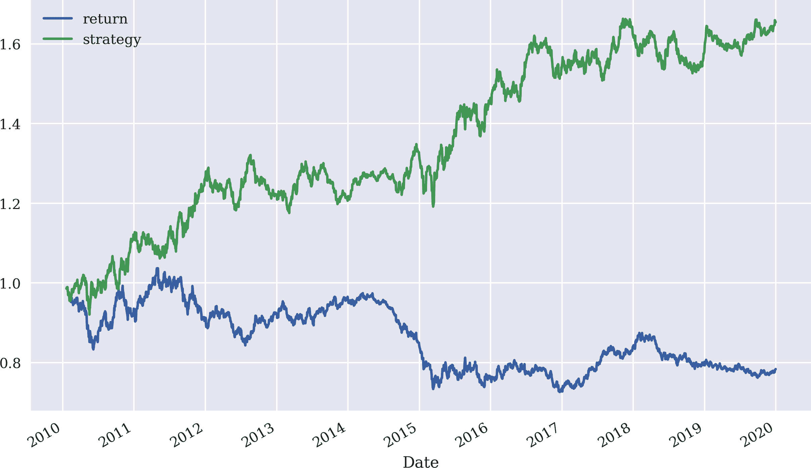
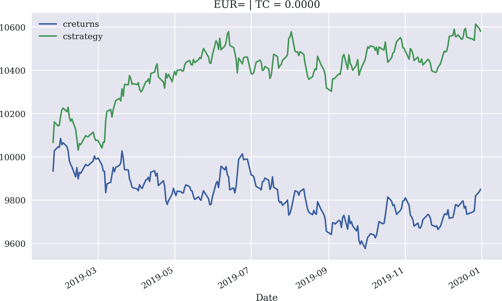
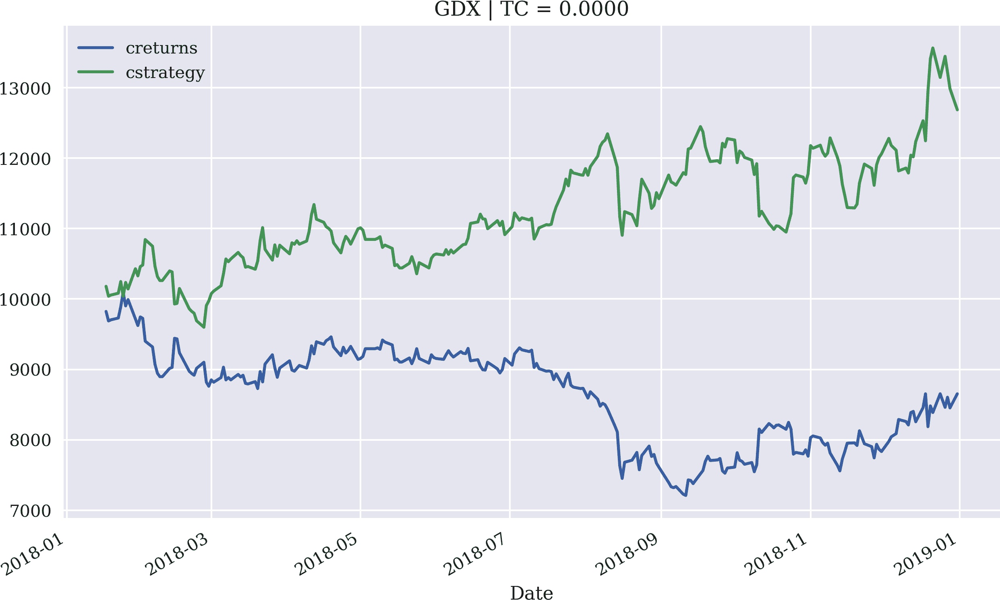
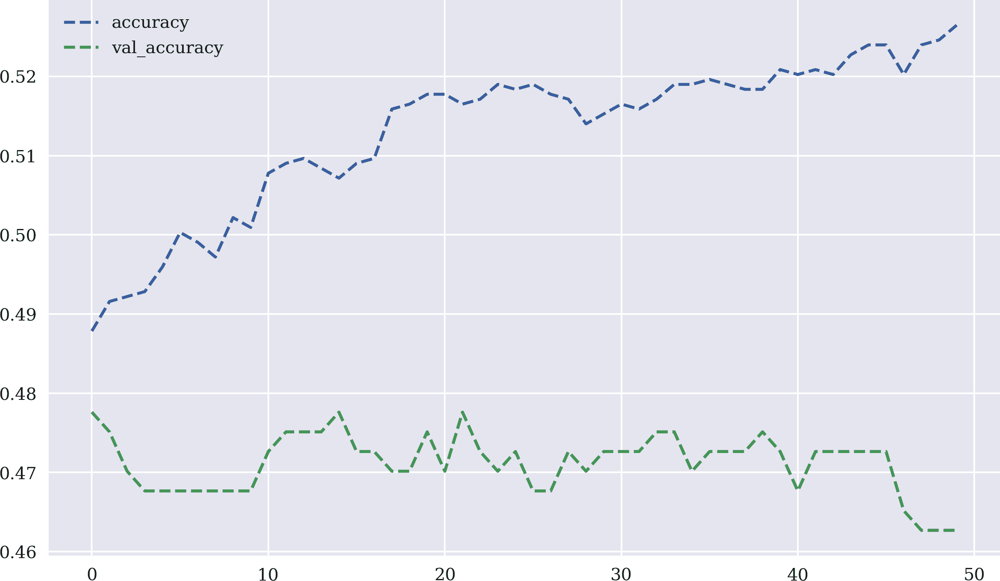

# 第五章。使用机器学习预测市场走势

> 天网开始以几何倍率学习。它在东部时间凌晨 2:14 自我意识到，时间是 8 月 29 日。
> 
> 终结者（*终结者 2*）

近年来，在机器学习、深度学习和人工智能领域取得了巨大进展。总体而言，金融行业和全球算法交易员也试图从这些技术进步中受益。

本章介绍了来自统计学（如*线性回归*）和机器学习（如*逻辑回归*）的技术，以基于过去收益预测未来价格走势。它还阐明了使用*神经网络*预测股市走势的方法。当然，本章不能替代对机器学习的深入介绍，但从实践者的角度，它可以展示如何具体应用某些技术来解决价格预测问题。有关更多详情，请参阅希尔皮什（2020 年）。¹

本章涵盖了以下类型的交易策略：

基于线性回归的策略

这些策略利用线性回归来推测趋势或推导金融工具未来价格运动的方向。

基于机器学习的策略

在算法交易中，通常只需预测金融工具的运动方向，而不是其绝对幅度。基于这种推理，预测问题基本上可以归结为一个*分类问题*，即决定是否会出现向上或向下的运动。已开发出不同的机器学习算法来解决这类分类问题。本章介绍了逻辑回归作为典型的基准算法，用于分类。

基于深度学习的策略

深度学习已经被 Facebook 等技术巨头普及。类似于机器学习算法，基于神经网络的深度学习算法允许攻击金融市场预测中面临的分类问题。

本章的组织如下。“使用线性回归预测市场运动”介绍了线性回归作为预测指数水平和价格走势方向的技术。“使用机器学习预测市场运动”聚焦于机器学习，并基于线性回归介绍了`scikit-learn`。它主要涵盖逻辑回归作为明确适用于分类问题的替代线性模型。“使用深度学习预测市场运动”介绍了`Keras`，以基于神经网络算法预测股市运动的方向。

本章的主要目标是提供基于过去收益预测未来价格走势的实用方法。基本假设是，有效市场假说并非普遍成立，类似于技术分析股票价格图表的推理，历史可能提供一些关于未来的见解，可以通过统计技术进行挖掘。换句话说，假设金融市场中的某些模式会重复出现，以至于可以利用过去的观察结果来预测未来的价格变动。更多细节请参阅 Hilpisch（2020）。

# 使用线性回归进行市场运动预测

普通最小二乘法（OLS）和线性回归是几十年来证明在许多不同应用领域有用的统计技术。本节使用线性回归进行价格预测。然而，它从基础知识的快速回顾和基本方法的介绍开始。

## 线性回归的快速回顾

在应用线性回归之前，根据一些随机化数据对方法进行快速回顾可能会有所帮助。示例代码使用`NumPy`首先生成一个包含独立变量`x`数据的`ndarray`对象。基于这些数据，生成了依赖变量`y`的随机化数据（“噪声数据”）。`NumPy`提供了两个函数，`polyfit`和`polyval`，用于方便地实现基于简单单项式的 OLS 回归。对于线性回归，设置要使用的单项式的最高次数为`1`。图 5-1 显示了数据和回归线：

```py
In [1]: import os
        import random
        import numpy as np  
        from pylab import mpl, plt  
        plt.style.use('seaborn')
        mpl.rcParams['savefig.dpi'] = 300
        mpl.rcParams['font.family'] = 'serif'
        os.environ['PYTHONHASHSEED'] = '0'

In [2]: x = np.linspace(0, 10)  

In [3]: def set_seeds(seed=100):
            random.seed(seed)
            np.random.seed(seed)
        set_seeds() 

In [4]: y = x + np.random.standard_normal(len(x))  

In [5]: reg = np.polyfit(x, y, deg=1)  

In [6]: reg  
Out[6]: array([0.94612934, 0.22855261])

In [7]: plt.figure(figsize=(10, 6))  
        plt.plot(x, y, 'bo', label='data')  
        plt.plot(x, np.polyval(reg, x), 'r', lw=2.5,
                 label='linear regression')  
        plt.legend(loc=0);  
```


导入了`NumPy`。


导入了`matplotlib`。


生成了一个在 0 到 10 之间的`x`值的均匀间隔浮点数网格。


为所有相关随机数生成器设置了种子值。


生成了随机化的`y`值数据。


进行了一次一次最小二乘法（即线性回归）的回归。


显示了最优参数值。


创建了一个新的图形对象。


将原始数据集绘制为点。


绘制了回归线。


创建了图例。


###### 图 5-1\. 基于随机数据的线性回归示例

因变量 `x` 的区间为 <math display="inline"><mrow><mi>x</mi><mo>∈</mo><mo>[</mo><mn>0</mn><mo>,</mo><mn>10</mn><mo>]</mo></mrow></math>。将区间扩大至，例如，<math display="inline"><mrow><mi>x</mi><mo>∈</mo><mo>[</mo><mn>0</mn><mo>,</mo><mn>20</mn><mo>]</mo></mrow></math> 允许通过外推给出因变量 `y` 的值，超出原始数据集的域。图 5-2 可视化了外推：

```py
In [8]: plt.figure(figsize=(10, 6))
        plt.plot(x, y, 'bo', label='data')
        xn = np.linspace(0, 20)  
        plt.plot(xn, np.polyval(reg, xn), 'r', lw=2.5,
                 label='linear regression')
        plt.legend(loc=0);
```


生成了 `x` 值的扩展域。


###### 图 5-2\. 基于线性回归的预测（外推）

## 价格预测的基本理念

基于时间序列数据的价格预测必须处理一个特殊特征：数据的基于时间的排序。一般来说，数据的排序对于线性回归的应用并不重要。在前一节的第一个示例中，实施线性回归的数据可以按完全不同的顺序编制，同时保持 `x` 和 `y` 对不变。独立于排序，最优回归参数将保持不变。

然而，在预测明天的指数水平的背景下，例如，正确排序历史上的指数水平似乎至关重要。如果是这样，那么就会试图根据今天、昨天、前天等的指数水平来预测明天的指数水平。作为输入使用的天数通常称为 *滞后期*。因此，使用今天的指数水平及之前两天的指数水平可被称为 *三个滞后期*。

下一个示例再次将这个想法简化到一个相当简单的背景中。该示例使用的数据是从 0 到 11 的数字：

```py
In [9]: x = np.arange(12)

In [10]: x
Out[10]: array([ 0,  1,  2,  3,  4,  5,  6,  7,  8,  9, 10, 11])
```

假设回归使用三个滞后期。这意味着回归有三个自变量和一个因变量。更具体地说，0、1 和 2 是自变量的值，而 3 是相应的因变量的值。向前一步（“在时间上”），值为 1、2 和 3，以及 4。最终的值组合是 8、9 和 10，与 11。因此，问题是将这个想法正式地表述为形如 <math alttext="upper A dot x equals b"><mrow><mi>A</mi> <mo>·</mo> <mi>x</mi> <mo>=</mo> <mi>b</mi></mrow></math> 的线性方程，其中 <math alttext="upper A"><mi>A</mi></math> 是矩阵，而 <math alttext="x"><mi>x</mi></math> 和 <math alttext="b"><mi>b</mi></math> 是向量：

```py
In [11]: lags = 3  

In [12]: m = np.zeros((lags + 1, len(x) - lags))  

In [13]: m[lags] = x[lags:]  
         for i in range(lags):  
             m[i] = x[i:i - lags]  

In [14]: m.T  
Out[14]: array([[ 0.,  1.,  2.,  3.],
                [ 1.,  2.,  3.,  4.],
                [ 2.,  3.,  4.,  5.],
                [ 3.,  4.,  5.,  6.],
                [ 4.,  5.,  6.,  7.],
                [ 5.,  6.,  7.,  8.],
                [ 6.,  7.,  8.,  9.],
                [ 7.,  8.,  9., 10.],
                [ 8.,  9., 10., 11.]])
```


定义了滞后期的数量。


实例化具有适当维度的`ndarray`对象。


定义目标值（因变量）。


迭代从`0`到`lags - 1`的数字。


定义基础向量（独立变量）


显示`ndarray`对象`m`的转置。

在转置后的`ndarray`对象`m`中，前三列包含三个独立变量的值。它们一起形成矩阵<math alttext="upper A"><mi>A</mi></math>。第四列代表向量<math alttext="b"><mi>b</mi></math>。因此，线性回归然后产生缺失的向量<math alttext="x"><mi>x</mi></math>。由于现在有更多的独立变量，`polyfit`和`polyval`不再适用。但是，在`NumPy`子包中有一个用于线性代数（`linalg`）的函数，允许解决一般的最小二乘问题：`lstsq`。只需要结果数组的第一个元素，因为它包含最佳回归参数：

```py
In [15]: reg = np.linalg.lstsq(m[:lags].T, m[lags], rcond=None)[0]  

In [16]: reg  
Out[16]: array([-0.66666667,  0.33333333,  1.33333333])

In [17]: np.dot(m[:lags].T, reg)  
Out[17]: array([ 3.,  4.,  5.,  6.,  7.,  8.,  9., 10., 11.])
```


实现线性 OLS 回归。


打印出最优参数。


点积产生预测结果。

这个基本思想很容易应用到现实世界的金融时间序列数据中。

## 预测指数水平

下一步是将基本方法转化为实际金融工具的时间序列数据，比如欧元/美元汇率：

```py
In [18]: import pandas as pd  

In [19]: raw = pd.read_csv('http://hilpisch.com/pyalgo_eikon_eod_data.csv',
                           index_col=0, parse_dates=True).dropna()  

In [20]: raw.info()  
         <class 'pandas.core.frame.DataFrame'>
         DatetimeIndex: 2516 entries, 2010-01-04 to 2019-12-31
         Data columns (total 12 columns):
          #   Column  Non-Null Count  Dtype
         ---  ------  --------------  -----
          0   AAPL.O  2516 non-null   float64
          1   MSFT.O  2516 non-null   float64
          2   INTC.O  2516 non-null   float64
          3   AMZN.O  2516 non-null   float64
          4   GS.N    2516 non-null   float64
          5   SPY     2516 non-null   float64
          6   .SPX    2516 non-null   float64
          7   .VIX    2516 non-null   float64
          8   EUR=    2516 non-null   float64
          9   XAU=    2516 non-null   float64
          10  GDX     2516 non-null   float64
          11  GLD     2516 non-null   float64
         dtypes: float64(12)
         memory usage: 255.5 KB

In [21]: symbol = 'EUR='

In [22]: data = pd.DataFrame(raw[symbol])  

In [23]: data.rename(columns={symbol: 'price'}, inplace=True)  
```


导入`pandas`包。


检索每日末尾（EOD）数据并将其存储在`DataFrame`对象中。


从原始`DataFrame`中选择指定符号的时间序列数据。


将单列重命名为`price`。

形式上，前面简单示例的 Python 代码几乎不需要更改就可以实现基于回归的预测方法。只需要替换数据对象即可：

```py
In [24]: lags = 5

In [25]: cols = []
         for lag in range(1, lags + 1):
             col = f'lag_{lag}'
             data[col] = data['price'].shift(lag) 
             cols.append(col)
         data.dropna(inplace=True)

In [26]: reg = np.linalg.lstsq(data[cols], data['price'],
                               rcond=None)[0]

In [27]: reg
Out[27]: array([ 0.98635864,  0.02292172, -0.04769849,  0.05037365,
          -0.01208135])
```


获取`price`列并将其向后移动`lag`。

最佳回归参数展示了通常所称的*随机行走假设*。该假设指出，例如股票价格或汇率遵循随机行走，因此明天价格的最佳预测因子是今天的价格。最佳参数似乎支持这样的假设，因为今天的价格几乎完全解释了明天预测价格水平。其他四个值几乎没有分配任何权重。

图 5-3 展示了 EUR/USD 汇率和预测值。由于多年时间窗口中的数据量庞大，这两个时间序列在图中几乎无法区分：

```py
In [28]: data['prediction'] = np.dot(data[cols], reg)  

In [29]: data[['price', 'prediction']].plot(figsize=(10, 6));  
```


计算预测值为`dot`乘积。


绘制`price`和`prediction`列。


###### 图 5-3\. EUR/USD 汇率和基于线性回归的预测值（五个滞后）

缩小时间窗口后的绘图可以更好地区分两个时间序列。图 5-4 展示了三个月时间窗口的结果。该图表明，明天汇率的预测基本上是今天汇率的延迟一个交易日的结果：

```py
In [30]: data[['price', 'prediction']].loc['2019-10-1':].plot(
                     figsize=(10, 6));
```

将线性 OLS 回归应用于基于历史汇率的 EUR/USD 汇率预测，为随机行走假设提供支持。数值示例的结果显示，以最小二乘意义上今天的汇率是明天汇率的最佳预测因子。


###### 图 5-4\. EUR/USD 汇率和基于线性回归的预测值（五个滞后，仅三个月）

## 预测未来回报

到目前为止，分析基于绝对汇率水平。然而，（对数）回报可能对此类统计应用更为合适，因为例如它们使时间序列数据平稳化的特性。应用线性回归到回报数据的代码几乎与之前相同。这一次不仅仅是今天的回报对预测明天的回报重要，而且回归结果在性质上完全不同：

```py
In [31]: data['return'] = np.log(data['price'] /
                                  data['price'].shift(1))  

In [32]: data.dropna(inplace=True)  

In [33]: cols = []
         for lag in range(1, lags + 1):
             col = f'lag_{lag}'
             data[col] = data['return'].shift(lag) 
             cols.append(col)
         data.dropna(inplace=True)

In [34]: reg = np.linalg.lstsq(data[cols], data['return'],
                               rcond=None)[0]

In [35]: reg
Out[35]: array([-0.015689  ,  0.00890227, -0.03634858,  0.01290924,
          -0.00636023])
```


计算对数回报。


删除所有具有`NaN`值的行。


以`returns`列作为滞后数据。

图 5-5 展示了回报数据和预测值。正如图中生动展示的那样，线性回归显然不能对未来回报的幅度进行有效预测：

```py
In [36]: data['prediction'] = np.dot(data[cols], reg)

In [37]: data[['return', 'prediction']].iloc[lags:].plot(figsize=(10, 6));
```


###### 图 5-5\. EUR/USD 对数收益率和基于线性回归（五个滞后期）的预测值。

从交易角度来看，人们可能会认为预测回报的大小并不重要，而是预测方向是否正确。为此，简单的计算提供了一个概述。每当线性回归正确预测方向时，即预测回报的符号正确时，市场回报和预测回报的乘积为正，否则为负。

在这个例子中，预测正确的次数是 1,250 次，错误的次数是 1,242 次，这对应命中率约为 49.9%，或几乎恰好 50%：

```py
In [38]: hits = np.sign(data['return'] *
                        data['prediction']).value_counts()  

In [39]: hits  
Out[39]:  1.0    1250
         -1.0    1242
          0.0      13
         dtype: int64

In [40]: hits.values[0] / sum(hits)  
Out[40]: 0.499001996007984
```


计算市场和预测回报的乘积，取结果的符号并计数值。


打印出两种可能值的计数。


计算命中率，定义为所有预测中正确预测的数量。

## 预测未来市场走向

引发的问题是是否可以通过直接实施基于待预测回报的符号的线性回归来提高命中率。至少在理论上，这将问题简化为预测绝对回报值的符号。在 Python 代码中实现此推理的唯一更改是在回归步骤中使用符号值（即 Python 中的`1.0`或`-1.0`）。这确实将命中次数增加到 1,301 次，命中率约为 51.9%——提高了两个百分点：

```py
In [41]: reg = np.linalg.lstsq(data[cols], np.sign(data['return']),
                               rcond=None)[0]  

In [42]: reg
Out[42]: array([-5.11938725, -2.24077248, -5.13080606, -3.03753232,
          -2.14819119])

In [43]: data['prediction'] = np.sign(np.dot(data[cols], reg))  

In [44]: data['prediction'].value_counts()
Out[44]:  1.0    1300
         -1.0    1205
         Name: prediction, dtype: int64

In [45]: hits = np.sign(data['return'] *
                        data['prediction']).value_counts()

In [46]: hits
Out[46]:  1.0    1301
         -1.0    1191
          0.0      13
         dtype: int64

In [47]: hits.values[0] / sum(hits)
Out[47]: 0.5193612774451097
```


这直接使用了待预测回报的符号进行回归。


预测步骤中，只有符号是相关的。

## 基于回归的向量化回测策略

单凭命中率无法充分说明使用线性回归进行交易策略的经济潜力。众所周知，对于给定时间段内市场上的十个最佳和最差日子显著影响投资的总体表现。² 在理想情况下，多头和空头交易者当然会尝试通过适当的市场时机指标在最佳和最差的日子中受益。转化为当前背景，这意味着除了命中率外，市场时机的质量也很重要。因此，沿着第四章中矢量化回测的方法进行回溯测试可以更好地描绘回归预测价值的全貌。

鉴于已有的数据，矢量化回测归结为两行 Python 代码，包括可视化。这是因为预测值已经反映了市场位置（多头或空头）。图 5-6 显示，在样本内，基于当前假设的策略明显优于市场（忽略交易成本等因素）：

```py
In [48]: data.head()
Out[48]:              price     lag_1     lag_2     lag_3     lag_4     lag_5  \
         Date
         2010-01-20  1.4101 -0.005858 -0.008309 -0.000551  0.001103 -0.001310
         2010-01-21  1.4090 -0.013874 -0.005858 -0.008309 -0.000551  0.001103
         2010-01-22  1.4137 -0.000780 -0.013874 -0.005858 -0.008309 -0.000551
         2010-01-25  1.4150  0.003330 -0.000780 -0.013874 -0.005858 -0.008309
         2010-01-26  1.4073  0.000919  0.003330 -0.000780 -0.013874 -0.005858

                     prediction    return
         Date
         2010-01-20         1.0 -0.013874
         2010-01-21         1.0 -0.000780
         2010-01-22         1.0  0.003330
         2010-01-25         1.0  0.000919
         2010-01-26         1.0 -0.005457

In [49]: data['strategy'] = data['prediction'] * data['return']  

In [50]: data[['return', 'strategy']].sum().apply(np.exp)  
Out[50]: return      0.784026
         strategy    1.654154
         dtype: float64

In [51]: data[['return', 'strategy']].dropna().cumsum(
                 ).apply(np.exp).plot(figsize=(10, 6));  
```


将预测值（定位）乘以市场回报。


计算基础工具和策略的总体表现。


绘制基础工具和策略随时间的总体表现（样本内，无交易成本）。



###### 图 5-6\. EUR/USD 和基于回归的策略（五个滞后期）的总体表现

基于预测的策略的命中率只是整体策略表现的一面。另一面是策略在市场时机选择上的表现。一种策略在一段时间内正确预测最佳和最差的日子可能会超越市场，即使命中率低于 50%。另一方面，如果一种策略的命中率远高于 50%，但在罕见的大幅波动时预测错误，仍可能表现不及基础工具。

## 泛化方法

“线性回归回测类” 提供了一个 Python 模块，其中包含一个类，用于基于向量化的回归交易策略的回测，类似于第四章中的内容。除了允许任意投资金额和比例交易成本外，它还允许*样本内拟合*线性回归模型和*样本外评估*。这意味着回归模型是基于数据集的一部分进行拟合的，比如说 2010 年到 2015 年的数据，而基于另一部分数据集进行评估，比如说 2016 年到 2019 年的数据。对于涉及优化或拟合步骤的所有策略，这提供了更真实的实际表现视角，因为它有助于避免数据窥探和模型过拟合带来的问题（也见“数据窥探和过拟合”）。

图 5-7 显示，基于五个滞后项的回归策略在特定配置下在样本外表现优于 EUR/USD 基础工具，并且在考虑交易成本之前也是如此：

```py
In [52]: import LRVectorBacktester as LR  

In [53]: lrbt = LR.LRVectorBacktester('EUR=', '2010-1-1', '2019-12-31',
                                              10000, 0.0)  

In [54]: lrbt.run_strategy('2010-1-1', '2019-12-31',
                           '2010-1-1', '2019-12-31', lags=5)  
Out[54]: (17166.53, 9442.42)

In [55]: lrbt.run_strategy('2010-1-1', '2017-12-31',
                           '2018-1-1', '2019-12-31', lags=5)  
Out[55]: (10160.86, 791.87)

In [56]: lrbt.plot_results()  
```


将模块导入为 `LR`。


实例化 `LRVectorBacktester` 类的对象。


在相同数据集上训练和评估策略。


在训练和评估步骤中使用了两个不同的数据集。


绘制样本外策略表现与市场的比较。


###### 图 5-7\. EUR/USD 和基于回归的策略（五个滞后项，在交易成本前的样本外）的总体表现

考虑 `GDX` ETF。所选择的策略配置显示在样本外并在考虑交易成本后表现出色（见图 5-8）：

```py
In [57]: lrbt = LR.LRVectorBacktester('GDX', '2010-1-1', '2019-12-31',
                                              10000, 0.002)  

In [58]: lrbt.run_strategy('2010-1-1', '2019-12-31',
                           '2010-1-1', '2019-12-31', lags=7)
Out[58]: (23642.32, 17649.69)

In [59]: lrbt.run_strategy('2010-1-1', '2014-12-31',
                           '2015-1-1', '2019-12-31', lags=7)
Out[59]: (28513.35, 14888.41)

In [60]: lrbt.plot_results()
```


改变了`GDX`的时间序列数据。


###### 图 5-8\. `GDX` ETF 和基于回归的策略（七个滞后项，在交易成本后的样本外）的总体表现

# 使用机器学习预测市场运动

如今，Python 生态系统在机器学习领域提供了许多包。其中最受欢迎的是 `scikit-learn`（参见 [`scikit-learn` 主页](http://scikit-learn.org)），它也是文档和维护最好的包之一。本节首先介绍了基于线性回归的包的 API，复制了前一节部分结果。然后，使用逻辑回归作为分类算法来解决预测未来市场方向的问题。

## 使用 `scikit-learn` 进行线性回归

为了介绍 `scikit-learn` 的 API，重新审视本章节中介绍的预测方法的基本思想是有益的。数据准备与 `NumPy` 相同：

```py
In [61]: x = np.arange(12)

In [62]: x
Out[62]: array([ 0,  1,  2,  3,  4,  5,  6,  7,  8,  9, 10, 11])

In [63]: lags = 3

In [64]: m = np.zeros((lags + 1, len(x) - lags))

In [65]: m[lags] = x[lags:]
         for i in range(lags):
             m[i] = x[i:i - lags]
```

对于我们的目的，使用 `scikit-learn` 主要包括三个步骤：

1.  *模型选择*：需选择并实例化一个模型。

1.  *模型拟合*：模型将被拟合到手头的数据。

1.  *预测*：给定拟合模型，进行预测。

要应用线性回归，可以使用 `linear_model` 子包进行广义线性模型（参见 [`scikit-learn` 线性模型页面](https://oreil.ly/5XoG1)）。默认情况下，`LinearRegression` 模型拟合一个截距值：

```py
In [66]: from sklearn import linear_model  

In [67]: lm = linear_model.LinearRegression()  

In [68]: lm.fit(m[:lags].T, m[lags])  
Out[68]: LinearRegression()

In [69]: lm.coef_  
Out[69]: array([0.33333333, 0.33333333, 0.33333333])

In [70]: lm.intercept_  
Out[70]: 2.0

In [71]: lm.predict(m[:lags].T)  
Out[71]: array([ 3.,  4.,  5.,  6.,  7.,  8.,  9., 10., 11.])
```


导入广义线性模型类。


实例化线性回归模型。


将模型拟合到数据中。


打印出最佳的回归参数。


打印出截距值。


给定拟合模型，预测所需数值。

将参数 `fit_intercept` 设置为 `False` 将给出与 `NumPy` 和 `polyfit()` 相同的回归结果：

```py
In [72]: lm = linear_model.LinearRegression(fit_intercept=False)  

In [73]: lm.fit(m[:lags].T, m[lags])
Out[73]: LinearRegression(fit_intercept=False)

In [74]: lm.coef_
Out[74]: array([-0.66666667,  0.33333333,  1.33333333])

In [75]: lm.intercept_
Out[75]: 0.0

In [76]: lm.predict(m[:lags].T)
Out[76]: array([ 3.,  4.,  5.,  6.,  7.,  8.,  9., 10., 11.])
```


强制拟合而不使用截距值。

此示例已很好地展示了如何将 `scikit-learn` 应用于预测问题。由于其一致的 API 设计，基本方法可适用于其他模型。

## 一个简单的分类问题

在分类问题中，必须确定新观察属于有限类别（“类别”）中的哪一个。机器学习中研究的一个经典问题是识别手写数字 0 到 9。这样的识别会导致一个正确的结果，比如 3。或者导致一个错误的结果，比如 6 或 8，所有这些错误结果同样错误。在金融市场的背景下，预测金融工具价格可能会导致远离正确值或接近正确值的数值结果。预测明天市场方向，只能有正确或（“完全”）错误的结果。后者是一个*分类问题*，类别集合限定为“上升”和“下降”或“+1”和“–1”或“1”和“0”。相比之下，前者是一个*估计问题*。

一个简单的分类问题示例在维基百科的[逻辑回归](https://oreil.ly/zg8gW)中找到。数据集将学生准备考试的学习时间与每个学生是否通过考试联系起来。虽然学习时间是一个实数（`float`对象），通过考试是`True`或`False`（即数字`1`或`0`）。图 5-9 展示了数据的图形化表现：

```py
In [77]: hours = np.array([0.5, 0.75, 1., 1.25, 1.5, 1.75, 1.75, 2.,
                           2.25, 2.5, 2.75, 3., 3.25, 3.5, 4., 4.25,
                           4.5, 4.75, 5., 5.5])  

In [78]: success = np.array([0, 0, 0, 0, 0, 0, 1, 0, 1, 0, 1, 0, 1,
                             0, 1, 1, 1, 1, 1, 1])  

In [79]: plt.figure(figsize=(10, 6))
         plt.plot(hours, success, 'ro')  
         plt.ylim(-0.2, 1.2);  
```


不同学生的学习时间（顺序很重要）。


每个学生通过考试的成功（顺序很重要）。


将数据集绘制成以`hours`为`x`值，以`success`为`y`值的图表。


调整 y 轴的限制。


###### 图 5-9\. 分类问题示例数据

在这样的背景下通常会提出基本问题：给定学生的学习时间（不在数据集中），他们能否通过考试？线性回归能给出什么样的答案？可能不尽如人意，如图 5-10 所示。在不同的学习时间下，线性回归主要给出（预测）值在 0 到 1 之间，同时也有更低或更高的值。但考试的结果只能是*失败*或*成功*：

```py
In [80]: reg = np.polyfit(hours, success, deg=1)  

In [81]: plt.figure(figsize=(10, 6))
         plt.plot(hours, success, 'ro')
         plt.plot(hours, np.polyval(reg, hours), 'b')  
         plt.ylim(-0.2, 1.2);
```


对数据集实施线性回归。


绘制回归线以及数据集。


###### 图 5-10\. 应用于分类问题的线性回归

这是分类算法如逻辑回归和支持向量机发挥作用的地方。为了说明，逻辑回归的应用足够了（详见 James 等人（2013 年，第四章）获取更多背景信息）。相应的类也可以在`linear_model`子包中找到。图 5-11 展示了以下 Python 代码的结果。这次，每个不同输入值都有一个明确的（预测）值。模型预测，学习了 0 至 2 小时的学生会失败。对于所有等于或高于 2.75 小时的值，模型预测学生通过考试：

```py
In [82]: lm = linear_model.LogisticRegression(solver='lbfgs')  

In [83]: hrs = hours.reshape(1, -1).T  

In [84]: lm.fit(hrs, success)  
Out[84]: LogisticRegression()

In [85]: prediction = lm.predict(hrs)  

In [86]: plt.figure(figsize=(10, 6))
         plt.plot(hours, success, 'ro', label='data')
         plt.plot(hours, prediction, 'b', label='prediction')
         plt.legend(loc=0)
         plt.ylim(-0.2, 1.2);
```


实例化逻辑回归模型。


将一维`ndarray`对象重塑为二维对象（`scikit-learn`所需）。


实现拟合步骤。


给定拟合模型，实现预测步骤。


###### 图 5-11。逻辑回归应用于分类问题

然而，正如图 5-11 所示，2.75 小时或更多时间并不保证成功。从那么多小时开始，成功只是“更有可能”而已。这种概率推理也可以根据同一模型实例进行分析和可视化，如下面的代码所示。图 5-12 中的虚线显示了成功概率（单调递增）。点划线显示了失败概率（单调递减）：

```py
In [87]: prob = lm.predict_proba(hrs)  

In [88]: plt.figure(figsize=(10, 6))
         plt.plot(hours, success, 'ro')
         plt.plot(hours, prediction, 'b')
         plt.plot(hours, prob.T[0], 'm--',
                  label='$p(h)$ for zero')  
         plt.plot(hours, prob.T[1], 'g-.',
                  label='$p(h)$ for one')  
         plt.ylim(-0.2, 1.2)
         plt.legend(loc=0);
```


预测成功和失败的概率，分别。


绘制失败概率。


绘制成功概率。


###### 图 5-12。基于逻辑回归分别得出的成功和失败概率。

`scikit-learn`非常好地提供了统一访问各种机器学习模型的方式。示例显示，应用逻辑回归的 API 与应用线性回归的 API 并无不同。因此，`scikit-learn`非常适合在某些应用场景中测试多种适当的机器学习模型，而几乎不需要更改 Python 代码。

掌握了基础知识，下一步是将逻辑回归应用于预测市场方向的问题。

## 使用逻辑回归预测市场方向

在机器学习中，通常用*特征*代替回归背景下的*独立变量*或*解释变量*。简单的分类示例只有一个特征：学习小时数。实际应用中，通常有多个可用于分类的特征。根据本章介绍的预测方法，可以通过*滞后*来识别一个*特征*。因此，从时间序列数据中工作的三个滞后意味着有三个特征。作为可能的结果或类别，只有`+1`和`-1`分别表示向上和向下的移动。尽管措辞不同，但形式主义保持不变，特别是在推导矩阵时，现在称为*特征矩阵*。

下面的代码提供了一种创建`pandas` `DataFrame`的“特征矩阵”的替代方法，这三个步骤同样适用，甚至更符合 Pythonic 风格。现在的特征矩阵是原始数据集中列的子集：

```py
In [89]: symbol = 'GLD'

In [90]: data = pd.DataFrame(raw[symbol])

In [91]: data.rename(columns={symbol: 'price'}, inplace=True)

In [92]: data['return'] = np.log(data['price'] / data['price'].shift(1))

In [93]: data.dropna(inplace=True)

In [94]: lags = 3

In [95]: cols = []  
         for lag in range(1, lags + 1):
             col = 'lag_{}'.format(lag)  
             data[col] = data['return'].shift(lag)  
             cols.append(col)  

In [96]: data.dropna(inplace=True)  
```


实例化一个空的`list`对象以收集列名。


为列名创建一个`str`对象。


向`DataFrame`对象添加一个带有相应滞后数据的新列。


将列名附加到`list`对象。


确保数据集完整。

与线性回归相比，逻辑回归将命中率提高了超过一个百分点，达到约 54.5%。图 5-13 展示了基于逻辑回归预测的策略表现。尽管命中率更高，但性能比线性回归差：

```py
In [97]: from sklearn.metrics import accuracy_score

In [98]: lm = linear_model.LogisticRegression(C=1e7, solver='lbfgs',
                                              multi_class='auto',
                                              max_iter=1000)  

In [99]: lm.fit(data[cols], np.sign(data['return']))  
Out[99]: LogisticRegression(C=10000000.0, max_iter=1000)

In [100]: data['prediction'] = lm.predict(data[cols])  

In [101]: data['prediction'].value_counts()  
Out[101]:  1.0    1983
          -1.0     529
          Name: prediction, dtype: int64

In [102]: hits = np.sign(data['return'].iloc[lags:] *
                         data['prediction'].iloc[lags:]
                        ).value_counts()  

In [103]: hits
Out[103]:  1.0    1338
          -1.0    1159
           0.0      12
          dtype: int64

In [104]: accuracy_score(data['prediction'],
                         np.sign(data['return']))  
Out[104]: 0.5338375796178344

In [105]: data['strategy'] = data['prediction'] * data['return']  

In [106]: data[['return', 'strategy']].sum().apply(np.exp)  
Out[106]: return      1.289478
          strategy    2.458716
          dtype: float64

In [107]: data[['return', 'strategy']].cumsum().apply(np.exp).plot(
                                                  figsize=(10, 6));  
```


使用一个`C`值实例化模型对象，该值减少了正则化项的权重（参见[广义线性模型页面](https://oreil.ly/D819h)）。


根据要预测的回报的符号拟合模型。


在`DataFrame`对象中生成一个新列，并将预测值写入其中。


显示生成的多头和空头仓位的数量。


计算正确和错误预测的数量。


在这种情况下，准确率（命中率）为 53.3%。


然而，策略的总体表现…


…与被动基准投资相比要高得多。


###### 图 5-13\. `GLD` ETF 的总体表现和基于逻辑回归的策略（3 个滞后值，样本内）

将使用的滞后数从三增加到五，虽然降低了命中率，但在某种程度上提高了策略的总体表现（样本内，在交易成本之前）。 图 5-14 显示了相应的表现：

```py
In [108]: data = pd.DataFrame(raw[symbol])

In [109]: data.rename(columns={symbol: 'price'}, inplace=True)

In [110]: data['return'] = np.log(data['price'] / data['price'].shift(1))

In [111]: lags = 5

In [112]: cols = []
          for lag in range(1, lags + 1):
              col = 'lag_%d' % lag
              data[col] = data['price'].shift(lag)  
              cols.append(col)

In [113]: data.dropna(inplace=True)

In [114]: lm.fit(data[cols], np.sign(data['return']))  
Out[114]: LogisticRegression(C=10000000.0, max_iter=1000)

In [115]: data['prediction'] = lm.predict(data[cols])

In [116]: data['prediction'].value_counts()  
Out[116]:  1.0    2047
          -1.0     464
          Name: prediction, dtype: int64

In [117]: hits = np.sign(data['return'].iloc[lags:] *
                         data['prediction'].iloc[lags:]
                        ).value_counts()

In [118]: hits
Out[118]:  1.0    1331
          -1.0    1163
           0.0      12
          dtype: int64

In [119]: accuracy_score(data['prediction'],
                         np.sign(data['return']))  
Out[119]: 0.5312624452409399

In [120]: data['strategy'] = data['prediction'] * data['return']  

In [121]: data[['return', 'strategy']].sum().apply(np.exp)  
Out[121]: return      1.283110
          strategy    2.656833
          dtype: float64

In [122]: data[['return', 'strategy']].cumsum().apply(np.exp).plot(
                                                  figsize=(10, 6));
```


将滞后数增加到五。


根据五个滞后值拟合模型。


现在有了更多的空头头寸。


准确率（命中率）降低到了 53.1%。


累积表现也显著增加。


###### 图 5-14\. `GLD` ETF 的总体表现和基于逻辑回归的策略（五个滞后值，样本内）

这里必须小心，不要陷入过拟合的陷阱。通过一种方法获得了更为现实的图片，该方法使用*训练数据*（=样本内数据）来*拟合*模型，并使用*测试数据*（=样本外数据）来评估*策略性能*。这在接下来的部分中完成，当该方法再次以 Python 类的形式被概括时。

## 泛化方法

`分类算法回测类` 提供了一个 Python 模块，其中包含一个用于基于`scikit-learn`线性模型的策略的向量化回测的类。尽管只实现了线性和逻辑回归，但模型数量很容易增加。原则上，`ScikitVectorBacktester` 类可以从 `LRVectorBacktester` 中继承选定的方法，但它以自包含的方式呈现。这使得更容易增强和重用该类用于实际应用。

基于`ScikitBacktesterClass`，可以对基于逻辑回归的策略进行样本外评估。本例使用 EUR/USD 汇率作为基础工具。

图 5-15 说明了该策略在样本外期间（跨越 2019 年）表现优于基础工具，然而，与以前一样，不考虑交易成本：

```py
In [123]: import ScikitVectorBacktester as SCI

In [124]: scibt = SCI.ScikitVectorBacktester('EUR=',
                                             '2010-1-1', '2019-12-31',
                                             10000, 0.0, 'logistic')

In [125]: scibt.run_strategy('2015-1-1', '2019-12-31',
                             '2015-1-1', '2019-12-31', lags=15)
Out[125]: (12192.18, 2189.5)

In [126]: scibt.run_strategy('2016-1-1', '2018-12-31',
                             '2019-1-1', '2019-12-31', lags=15)
Out[126]: (10580.54, 729.93)

In [127]: scibt.plot_results()
```



###### 图 5-15\. 标准普尔 500 指数的总体表现及样本外基于逻辑回归的策略（15 滞后，无交易成本）

举个例子，考虑相同策略应用于 `GDX` ETF，在 2018 年展示了样本外的超额表现（在考虑交易成本之前）在 图 5-16 中：

```py
In [128]: scibt = SCI.ScikitVectorBacktester('GDX',
                                             '2010-1-1', '2019-12-31',
                                             10000, 0.00, 'logistic')

In [129]: scibt.run_strategy('2013-1-1', '2017-12-31',
                             '2018-1-1', '2018-12-31', lags=10)
Out[129]: (12686.81, 4032.73)

In [130]: scibt.plot_results()
```



###### 图 5-16\. `GDX` ETF 的总体表现及基于逻辑回归的策略（10 滞后，样本外，无交易成本）

图 5-17 展示了考虑交易成本后，总体表现如何下降，甚至导致净损失，而其他所有参数保持不变：

```py
In [131]: scibt = SCI.ScikitVectorBacktester('GDX',
                                             '2010-1-1', '2019-12-31',
                                             10000, 0.0025, 'logistic')

In [132]: scibt.run_strategy('2013-1-1', '2017-12-31',
                             '2018-1-1', '2018-12-31', lags=10)
Out[132]: (9588.48, 934.4)

In [133]: scibt.plot_results()
```


###### 图 5-17\. `GDX` ETF 的总体表现及基于逻辑回归的策略（10 滞后，样本外，含交易成本）

将复杂的机器学习技术应用于股市预测通常在早期表现出有希望的结果。在多个示例中，回测策略往往在样本内表现优于基础工具。这种突出的表现往往是由于简化假设的混合，同时也由于预测模型的过拟合。例如，测试相同策略而非样本内数据集，加入交易成本——这两种方法都能更真实地描绘出的图片——通常表明，所考虑策略的表现“突然”在性能上落后于基础工具或转为净损失。

# 使用深度学习预测市场动向

自从谷歌开源并发布后，深度学习库 [`TensorFlow`](http://tensorflow.org) 吸引了广泛关注和应用。本节将 `TensorFlow` 应用于与前一节类似的股市动向预测，模型化为分类问题。然而，`TensorFlow` 并非直接使用；它是通过同样流行的 [`Keras`](http://keras.io) 深度学习包间接使用的。`Keras` 可以被视为提供了对 `TensorFlow` 包更高级别的抽象，具有更易于理解和使用的 API。

库最好通过 `pip install tensorflow` 和 `pip install keras` 安装。`scikit-learn` 还提供了应用神经网络解决分类问题的类。

想要了解更多有关深度学习和 `Keras` 的背景信息，请参阅 Goodfellow 等人（2016）和 Chollet（2017）。

## 简单的分类问题再审视

为了说明将神经网络应用于分类问题的基本方法，前一节介绍的简单分类问题再次显示出其用处：

```py
In [134]: hours = np.array([0.5, 0.75, 1., 1.25, 1.5, 1.75, 1.75, 2.,
                            2.25, 2.5, 2.75, 3., 3.25, 3.5, 4., 4.25,
                            4.5, 4.75, 5., 5.5])

In [135]: success = np.array([0, 0, 0, 0, 0, 0, 1, 0, 1, 0, 1, 0, 1,
                              0, 1, 1, 1, 1, 1, 1])

In [136]: data = pd.DataFrame({'hours': hours, 'success': success})  

In [137]: data.info()  
          <class 'pandas.core.frame.DataFrame'>
          RangeIndex: 20 entries, 0 to 19
          Data columns (total 2 columns):
           #   Column   Non-Null Count  Dtype
          ---  ------   --------------  -----
           0   hours    20 non-null     float64
           1   success  20 non-null     int64
          dtypes: float64(1), int64(1)
          memory usage: 448.0 bytes
```


将两个数据子集存储在 `DataFrame` 对象中。


打印出`DataFrame`对象的元信息。

准备工作完成后，可以导入并直接应用`scikit-learn`中的`MLPClassifier`。³ 在这个上下文中，“MLP”代表*多层感知器*，这是*密集神经网络*的另一种表达方式。与以往一样，使用`scikit-learn`应用神经网络的 API 基本相同：

```py
In [138]: from sklearn.neural_network import MLPClassifier  

In [139]: model = MLPClassifier(hidden_layer_sizes=[32],
                               max_iter=1000, random_state=100)  
```


从`scikit-learn`导入`MLPClassifier`对象。


实例化`MLPClassifier`对象。

以下代码拟合模型，生成预测并绘制结果，如图 5-18 所示：

```py
In [140]: model.fit(data['hours'].values.reshape(-1, 1), data['success'])  
Out[140]: MLPClassifier(hidden_layer_sizes=[32], max_iter=1000,
           random_state=100)

In [141]: data['prediction'] = model.predict(data['hours'].values.reshape(-1, 1)) 

In [142]: data.tail()
Out[142]:     hours  success  prediction
          15   4.25        1           1
          16   4.50        1           1
          17   4.75        1           1
          18   5.00        1           1
          19   5.50        1           1

In [143]: data.plot(x='hours', y=['success', 'prediction'],
                    style=['ro', 'b-'], ylim=[-.1, 1.1],
                    figsize=(10, 6));  
```


为分类拟合神经网络。


根据拟合模型生成预测值。


绘制原始数据和预测值。

这个简单的例子显示了深度学习方法的应用与`scikit-learn`和`LogisticRegression`模型对象的方法非常相似。API 基本相同，只是参数不同。


###### 图 5-18\. 简单分类示例中使用`MLPClassifier`的基础数据和预测结果

## 使用深度神经网络预测市场方向。

下一步是将这种方法应用于股票市场数据，以金融时间序列的对数收益率形式。首先，需要检索和准备数据：

```py
In [144]: symbol = 'EUR='  

In [145]: data = pd.DataFrame(raw[symbol])  

In [146]: data.rename(columns={symbol: 'price'}, inplace=True)  

In [147]: data['return'] = np.log(data['price'] /
                                   data['price'].shift(1))   

In [148]: data['direction'] = np.where(data['return'] > 0, 1, 0)  

In [149]: lags = 5

In [150]: cols = []
          for lag in range(1, lags + 1): 
              col = f'lag_{lag}'
              data[col] = data['return'].shift(lag) 
              cols.append(col)
          data.dropna(inplace=True) 

In [151]: data.round(4).tail()  
Out[151]:
                  price  return  direction   lag_1   lag_2   lag_3   lag_4   lag_5
     Date
     2019-12-24  1.1087  0.0001          1  0.0007 -0.0038  0.0008 -0.0034  0.0006
     2019-12-26  1.1096  0.0008          1  0.0001  0.0007 -0.0038  0.0008 -0.0034
     2019-12-27  1.1175  0.0071          1  0.0008  0.0001  0.0007 -0.0038  0.0008
     2019-12-30  1.1197  0.0020          1  0.0071  0.0008  0.0001  0.0007 -0.0038
     2019-12-31  1.1210  0.0012          1  0.0020  0.0071  0.0008  0.0001  0.0007
```


从`CSV`文件读取数据。


选择感兴趣的单个时间序列列。


将唯一的列重命名为`price`。


计算对数收益率并将`direction`定义为二进制列。


创建滞后数据。


创建新的`DataFrame`列，其中包含相应滞后数的对数收益率。


删除包含`NaN`值的行。


输出最后五行，指示五个特征列中出现的“模式”。

以下代码使用密集神经网络（DNN）与`Keras`包进行训练和测试数据子集的定义，定义特征列和标签，并拟合分类器。在后台，`Keras`使用`TensorFlow`包来完成任务。图 5-19 显示了 DNN 分类器在训练过程中训练和验证数据集的准确性如何变化。作为验证数据集，使用训练数据的 20%（不进行洗牌）：

```py
In [152]: import tensorflow as tf  
          from keras.models import Sequential  
          from keras.layers import Dense  
          from keras.optimizers import Adam, RMSprop

In [153]: optimizer = Adam(learning_rate=0.0001)

In [154]: def set_seeds(seed=100):
              random.seed(seed)
              np.random.seed(seed)
              tf.random.set_seed(100)

In [155]: set_seeds()
          model = Sequential()  
          model.add(Dense(64, activation='relu',
                  input_shape=(lags,)))  
          model.add(Dense(64, activation='relu'))  
          model.add(Dense(1, activation='sigmoid')) 
          model.compile(optimizer=optimizer,
                        loss='binary_crossentropy',
                        metrics=['accuracy'])  

In [156]: cutoff = '2017-12-31'  

In [157]: training_data = data[data.index < cutoff].copy()  

In [158]: mu, std = training_data.mean(), training_data.std()  

In [159]: training_data_ = (training_data - mu) / std  

In [160]: test_data = data[data.index >= cutoff].copy()  

In [161]: test_data_ = (test_data - mu) / std  

In [162]: %%time
          model.fit(training_data[cols],
                    training_data['direction'],
                    epochs=50, verbose=False,
                    validation_split=0.2, shuffle=False)  
          CPU times: user 4.86 s, sys: 989 ms, total: 5.85 s
          Wall time: 3.34 s

Out[162]: <tensorflow.python.keras.callbacks.History at 0x7f996a0a2880>

In [163]: res = pd.DataFrame(model.history.history)

In [164]: res[['accuracy', 'val_accuracy']].plot(figsize=(10, 6), style='--');
```


导入`TensorFlow`包。


从`Keras`导入所需的模型对象。


从`Keras`中导入相关层对象。


实例化一个`Sequential`模型。


定义隐藏层和输出层。


为分类编译`Sequential`模型对象。


定义训练和测试数据之间的截止日期。


定义训练和测试数据集。


通过高斯归一化对特征数据进行归一化。


将模型拟合到训练数据集。



###### 图 5-19\. DNN 分类器在训练和验证数据中的准确性每个训练步骤

配备适配的分类器，该模型可以在训练数据集上生成预测。图 5-20 显示了策略总体绩效与基础工具（样本内）的比较：

```py
In [165]: model.evaluate(training_data_[cols], training_data['direction'])
          63/63 [==============================] - 0s 586us/step - loss: 0.7556 -
           accuracy: 0.5152

Out[165]: [0.7555528879165649, 0.5151968002319336]

In [166]: pred = np.where(model.predict(training_data_[cols]) > 0.5, 1, 0)  

In [167]: pred[:30].flatten()  
Out[167]: array([0, 0, 0, 0, 0, 1, 1, 1, 1, 0, 0, 0, 1, 1, 1, 0, 0, 0, 1, 1,
           0, 0, 0, 1, 0, 1, 0, 1, 0, 0])

In [168]: training_data['prediction'] = np.where(pred > 0, 1, -1)  

In [169]: training_data['strategy'] = (training_data['prediction'] *
                                      training_data['return'])  

In [170]: training_data[['return', 'strategy']].sum().apply(np.exp)
Out[170]: return      0.826569
          strategy    1.317303
          dtype: float64

In [171]: training_data[['return', 'strategy']].cumsum(
                          ).apply(np.exp).plot(figsize=(10, 6));  
```


在样本内预测市场方向。


将预测转换为多空头寸，`+1`和`-1`。


计算给定仓位的策略回报。


绘制并比较策略绩效与基准绩效（样本内）。


###### 图 5-20\. EUR/USD 的总体绩效与基于深度学习的策略比较（样本内，无交易成本）

该策略在训练数据集上似乎比基础工具稍有改进（样本内，无交易成本）。然而，更有趣的问题是它在测试数据集上的表现。在起步踯躅后，策略也在测试数据集上表现优于基础工具，正如图 5-21 所示。尽管分类器在测试数据集上的准确率仅略高于 50%：

```py
In [172]: model.evaluate(test_data_[cols], test_data['direction'])
          16/16 [==============================] - 0s 676us/step - loss: 0.7292 -
           accuracy: 0.5050

Out[172]: [0.7292129993438721, 0.5049701929092407]

In [173]: pred = np.where(model.predict(test_data_[cols]) > 0.5, 1, 0)

In [174]: test_data['prediction'] = np.where(pred > 0, 1, -1)

In [175]: test_data['prediction'].value_counts()
Out[175]: -1    368
           1    135
          Name: prediction, dtype: int64

In [176]: test_data['strategy'] = (test_data['prediction'] *
                                  test_data['return'])

In [177]: test_data[['return', 'strategy']].sum().apply(np.exp)
Out[177]: return      0.934478
          strategy    1.109065
          dtype: float64

In [178]: test_data[['return', 'strategy']].cumsum(
                          ).apply(np.exp).plot(figsize=(10, 6));
```


###### 图 5-21\. EUR/USD 的总体表现与基于深度学习的策略对比（样本外，无交易成本）

## 添加不同类型的特征

到目前为止，分析主要集中在对数收益率上。当然，不仅可以添加更多的类别/分类，还可以添加其他类型的特征，比如基于*动量*、*波动性*或*距离*度量的特征。接下来的代码会推导出这些额外的特征并将它们添加到数据集中：

```py
In [179]: data['momentum'] = data['return'].rolling(5).mean().shift(1)  

In [180]: data['volatility'] = data['return'].rolling(20).std().shift(1)  

In [181]: data['distance'] = (data['price'] -
                              data['price'].rolling(50).mean()).shift(1)  

In [182]: data.dropna(inplace=True)

In [183]: cols.extend(['momentum', 'volatility', 'distance'])

In [184]: print(data.round(4).tail())

                 price  return  direction   lag_1   lag_2   lag_3   lag_4    lag_5
    Date

    2019-12-24  1.1087  0.0001          1  0.0007 -0.0038  0.0008 -0.0034   0.0006
    2019-12-26  1.1096  0.0008          1  0.0001  0.0007 -0.0038  0.0008  -0.0034
    2019-12-27  1.1175  0.0071          1  0.0008  0.0001  0.0007 -0.0038   0.0008
    2019-12-30  1.1197  0.0020          1  0.0071  0.0008  0.0001  0.0007  -0.0038
    2019-12-31  1.1210  0.0012          1  0.0020  0.0071  0.0008  0.0001   0.0007

                      momentum  volatility  distance
          Date
          2019-12-24   -0.0010      0.0024    0.0005
          2019-12-26   -0.0011      0.0024    0.0004
          2019-12-27   -0.0003      0.0024    0.0012
          2019-12-30    0.0010      0.0028    0.0089
          2019-12-31    0.0021      0.0028    0.0110
```


基于动量的特征。


基于波动性的特征。


基于距离的特征。

下一步是重新定义训练和测试数据集，规范化特征数据，并更新模型以反映新的特征列：

```py
In [185]: training_data = data[data.index < cutoff].copy()

In [186]: mu, std = training_data.mean(), training_data.std()

In [187]: training_data_ = (training_data - mu) / std

In [188]: test_data = data[data.index >= cutoff].copy()

In [189]: test_data_ = (test_data - mu) / std

In [190]: set_seeds()
          model = Sequential()
          model.add(Dense(32, activation='relu',
                          input_shape=(len(cols),)))  
          model.add(Dense(32, activation='relu'))
          model.add(Dense(1, activation='sigmoid'))
          model.compile(optimizer=optimizer,
                        loss='binary_crossentropy',
                        metrics=['accuracy'])
```


参数`input_shape`已调整以反映新的特征数。

基于丰富的特征集，可以训练分类器。如图 5-22 所示，策略的样本内表现比以前好得多：

```py
In [191]: %%time
          model.fit(training_data_[cols], training_data['direction'],
                    verbose=False, epochs=25)
          CPU times: user 2.32 s, sys: 577 ms, total: 2.9 s
          Wall time: 1.48 s

Out[191]: <tensorflow.python.keras.callbacks.History at 0x7f996d35c100>

In [192]: model.evaluate(training_data_[cols], training_data['direction'])
          62/62 [==============================] - 0s 649us/step - loss: 0.6816 -
           accuracy: 0.5646

Out[192]: [0.6816270351409912, 0.5646397471427917]

In [193]: pred = np.where(model.predict(training_data_[cols]) > 0.5, 1, 0)

In [194]: training_data['prediction'] = np.where(pred > 0, 1, -1)

In [195]: training_data['strategy'] = (training_data['prediction'] *
                                       training_data['return'])

In [196]: training_data[['return', 'strategy']].sum().apply(np.exp)
Out[196]: return      0.901074
          strategy    2.703377
          dtype: float64

In [197]: training_data[['return', 'strategy']].cumsum(
                          ).apply(np.exp).plot(figsize=(10, 6));
```


###### 图 5-22\. EUR/USD 的总体表现与基于深度学习的策略对比（样本内，额外特征）

最后一步是对分类器进行评估，并推导出样本外策略表现。与没有额外特征的情况相比，分类器的表现也显著提高，*其他条件不变*。与训练数据集相比，起步稍显踯躅（见图 5-23）：

```py
In [198]: model.evaluate(test_data_[cols], test_data['direction'])
          16/16 [==============================] - 0s 800us/step - loss: 0.6931 -
           accuracy: 0.5507

Out[198]: [0.6931276321411133, 0.5506958365440369]

In [199]: pred = np.where(model.predict(test_data_[cols]) > 0.5, 1, 0)

In [200]: test_data['prediction'] = np.where(pred > 0, 1, -1)

In [201]: test_data['prediction'].value_counts()
Out[201]: -1    335
           1    168
          Name: prediction, dtype: int64

In [202]: test_data['strategy'] = (test_data['prediction'] *
                                   test_data['return'])

In [203]: test_data[['return', 'strategy']].sum().apply(np.exp)
Out[203]: return      0.934478
          strategy    1.144385
          dtype: float64

In [204]: test_data[['return', 'strategy']].cumsum(
                          ).apply(np.exp).plot(figsize=(10, 6));
```


###### 图 5-23\. EUR/USD 的总体表现与基于深度学习的策略对比（样本外，额外特征）

`Keras`包与其后端`TensorFlow`包结合使用，允许利用深度学习的最新进展，如深度神经网络（DNN）分类器，用于算法交易。该应用与使用`scikit-learn`的其他机器学习模型一样简单。本节中展示的方法允许轻松地增强所使用的不同类型的特征。

作为一项练习，编写一个 Python 类（灵感来自“线性回归回测类”和“分类算法回测类”），允许更系统化和现实化地使用`Keras`包进行金融市场预测和相应交易策略的回测。

# 结论

预测未来市场走势是金融界的圣杯。这意味着找到真理。这意味着克服*有效市场*。如果能够在这方面取得相当大的优势，那么卓越的投资和交易回报将是其结果。本章介绍了来自传统统计学、机器学习和深度学习领域的统计技术，以便根据过去的收益或类似的金融数据预测未来市场走向。一些首次样本内结果是有希望的，无论是线性回归还是逻辑回归。然而，在样本外评估这些策略并考虑交易成本时，可以获得更可靠的印象。

本章并不声称找到了圣杯。它更多地提供了一瞥可能在寻找圣杯过程中证明有用的技术。`scikit-learn`的统一 API 也使得例如用另一个线性模型替换一个线性模型变得很容易。在这种意义上，`ScikitBacktesterClass`可以作为探索更多机器学习模型并将其应用于金融时间序列预测的起点。

本章开头引用了 1991 年电影《终结者 2》中的一句话，对于计算机能够学习和获得意识的速度和程度持乐观态度。无论您是否相信计算机会在生活的大部分领域取代人类，或者它们是否有一天会真正意识到自我存在，它们已被证明对人类非常有用，几乎在生活的任何领域都作为支持设备存在。而像机器学习、深度学习或人工智能中使用的算法至少有望让它们在不久的将来成为更好的算法交易员。关于这些主题和考虑的更详细介绍可以在 Hilpisch（2020）中找到。

# 参考文献和进一步资源

Guido 和 Müller（2016）以及 VanderPlas（2016）的书提供了 Python 和`scikit-learn`进行机器学习的实用介绍。Hilpisch（2020）的书专注于将机器学习和深度学习算法应用于识别统计效率低下和通过算法交易利用经济效率低下的问题。

+   Guido，Sarah 和 Andreas Müller。2016。《Python 数据科学入门：数据科学家指南》。Sebastopol：O’Reilly。

+   Hilpisch，Yves。2020。《金融中的人工智能：基于 Python 的指南》。Sebastopol：O’Reilly。

+   VanderPlas，Jake。2016。《Python 数据科学手册：处理数据的基本工具》。Sebastopol：O’Reilly。

Hastie 等人（2008 年）和 James 等人（2013 年）的书提供了流行的机器学习技术和算法的彻底数学概述：

+   Hastie, Trevor, Robert Tibshirani, and Jerome Friedman. 2008\. *统计学习的要素*. 第 2 版。纽约：斯普林格出版社。

+   James, Gareth, Daniela Witten, Trevor Hastie, and Robert Tibshirani. 2013\. *统计学习导论*. 纽约：斯普林格出版社。

欲了解更多关于深度学习和`Keras`的背景信息，请参阅以下书籍：

+   Chollet, Francois. 2017\. *Python 深度学习*. Shelter Island：Manning。

+   Goodfellow, Ian, Yoshua Bengio, and Aaron Courville. 2016\. *深度学习*. 剑桥：MIT 出版社。[*http://deeplearningbook.org*](http://deeplearningbook.org)。

# Python 脚本

本节展示了本章引用和使用的 Python 脚本。

## 线性回归回测类

这里展示了一个基于*线性回归*的策略向量化回测的 Python 代码，用于预测市场运动方向：

```py
#
# Python Module with Class
# for Vectorized Backtesting
# of Linear Regression-Based Strategies
#
# Python for Algorithmic Trading
# (c) Dr. Yves J. Hilpisch
# The Python Quants GmbH
#
import numpy as np
import pandas as pd

class LRVectorBacktester(object):
    ''' Class for the vectorized backtesting of
 linear regression-based trading strategies.

 Attributes
 ==========
 symbol: str
 TR RIC (financial instrument) to work with
 start: str
 start date for data selection
 end: str
 end date for data selection
 amount: int, float
 amount to be invested at the beginning
 tc: float
 proportional transaction costs (e.g., 0.5% = 0.005) per trade

 Methods
 =======
 get_data:
 retrieves and prepares the base data set
 select_data:
 selects a sub-set of the data
 prepare_lags:
 prepares the lagged data for the regression
 fit_model:
 implements the regression step
 run_strategy:
 runs the backtest for the regression-based strategy
 plot_results:
 plots the performance of the strategy compared to the symbol
 '''

    def __init__(self, symbol, start, end, amount, tc):
        self.symbol = symbol
        self.start = start
        self.end = end
        self.amount = amount
        self.tc = tc
        self.results = None
        self.get_data()

    def get_data(self):
        ''' Retrieves and prepares the data.
 '''
        raw = pd.read_csv('http://hilpisch.com/pyalgo_eikon_eod_data.csv',
                          index_col=0, parse_dates=True).dropna()
        raw = pd.DataFrame(raw[self.symbol])
        raw = raw.loc[self.start:self.end]
        raw.rename(columns={self.symbol: 'price'}, inplace=True)
        raw['returns'] = np.log(raw / raw.shift(1))
        self.data = raw.dropna()

    def select_data(self, start, end):
        ''' Selects sub-sets of the financial data.
 '''
        data = self.data[(self.data.index >= start) &
                         (self.data.index <= end)].copy()
        return data

    def prepare_lags(self, start, end):
        ''' Prepares the lagged data for the regression and prediction steps.
 '''
        data = self.select_data(start, end)
        self.cols = []
        for lag in range(1, self.lags + 1):
            col = f'lag_{lag}'
            data[col] = data['returns'].shift(lag)
            self.cols.append(col)
        data.dropna(inplace=True)
        self.lagged_data = data

    def fit_model(self, start, end):
        ''' Implements the regression step.
 '''
        self.prepare_lags(start, end)
        reg = np.linalg.lstsq(self.lagged_data[self.cols],
                              np.sign(self.lagged_data['returns']),
                              rcond=None)[0]
        self.reg = reg

    def run_strategy(self, start_in, end_in, start_out, end_out, lags=3):
        ''' Backtests the trading strategy.
 '''
        self.lags = lags
        self.fit_model(start_in, end_in)
        self.results = self.select_data(start_out, end_out).iloc[lags:]
        self.prepare_lags(start_out, end_out)
        prediction = np.sign(np.dot(self.lagged_data[self.cols], self.reg))
        self.results['prediction'] = prediction
        self.results['strategy'] = self.results['prediction'] * \
                                   self.results['returns']
        # determine when a trade takes place
        trades = self.results['prediction'].diff().fillna(0) != 0
        # subtract transaction costs from return when trade takes place
        self.results['strategy'][trades] -= self.tc
        self.results['creturns'] = self.amount * \
                        self.results['returns'].cumsum().apply(np.exp)
        self.results['cstrategy'] = self.amount * \
                        self.results['strategy'].cumsum().apply(np.exp)
        # gross performance of the strategy
        aperf = self.results['cstrategy'].iloc[-1]
        # out-/underperformance of strategy
        operf = aperf - self.results['creturns'].iloc[-1]
        return round(aperf, 2), round(operf, 2)

    def plot_results(self):
        ''' Plots the cumulative performance of the trading strategy
 compared to the symbol.
 '''
        if self.results is None:
            print('No results to plot yet. Run a strategy.')
        title = '%s | TC = %.4f' % (self.symbol, self.tc)
        self.results[['creturns', 'cstrategy']].plot(title=title,
                                                     figsize=(10, 6))

if __name__ == '__main__':
    lrbt = LRVectorBacktester('.SPX', '2010-1-1', '2018-06-29', 10000, 0.0)
    print(lrbt.run_strategy('2010-1-1', '2019-12-31',
                            '2010-1-1', '2019-12-31'))
    print(lrbt.run_strategy('2010-1-1', '2015-12-31',
                            '2016-1-1', '2019-12-31'))
    lrbt = LRVectorBacktester('GDX', '2010-1-1', '2019-12-31', 10000, 0.001)
    print(lrbt.run_strategy('2010-1-1', '2019-12-31',
                            '2010-1-1', '2019-12-31', lags=5))
    print(lrbt.run_strategy('2010-1-1', '2016-12-31',
                            '2017-1-1', '2019-12-31', lags=5))
```

## 分类算法回测类

这里展示了一个基于*逻辑回归*的策略向量化回测的 Python 代码，作为一种标准的分类算法，用于预测市场运动方向：

```py
#
# Python Module with Class
# for Vectorized Backtesting
# of Machine Learning-Based Strategies
#
# Python for Algorithmic Trading
# (c) Dr. Yves J. Hilpisch
# The Python Quants GmbH
#
import numpy as np
import pandas as pd
from sklearn import linear_model

class ScikitVectorBacktester(object):
    ''' Class for the vectorized backtesting of
 machine learning-based trading strategies.

 Attributes
 ==========
 symbol: str
 TR RIC (financial instrument) to work with
 start: str
 start date for data selection
 end: str
 end date for data selection
 amount: int, float
 amount to be invested at the beginning
 tc: float
 proportional transaction costs (e.g., 0.5% = 0.005) per trade
 model: str
 either 'regression' or 'logistic'

 Methods
 =======
 get_data:
 retrieves and prepares the base data set
 select_data:
 selects a sub-set of the data
 prepare_features:
 prepares the features data for the model fitting
 fit_model:
 implements the fitting step
 run_strategy:
 runs the backtest for the regression-based strategy
 plot_results:
 plots the performance of the strategy compared to the symbol
 '''

    def __init__(self, symbol, start, end, amount, tc, model):
        self.symbol = symbol
        self.start = start
        self.end = end
        self.amount = amount
        self.tc = tc
        self.results = None
        if model == 'regression':
            self.model = linear_model.LinearRegression()
        elif model == 'logistic':
            self.model = linear_model.LogisticRegression(C=1e6,
                solver='lbfgs', multi_class='ovr', max_iter=1000)
        else:
            raise ValueError('Model not known or not yet implemented.')
        self.get_data()

    def get_data(self):
        ''' Retrieves and prepares the data.
 '''
        raw = pd.read_csv('http://hilpisch.com/pyalgo_eikon_eod_data.csv',
                          index_col=0, parse_dates=True).dropna()
        raw = pd.DataFrame(raw[self.symbol])
        raw = raw.loc[self.start:self.end]
        raw.rename(columns={self.symbol: 'price'}, inplace=True)
        raw['returns'] = np.log(raw / raw.shift(1))
        self.data = raw.dropna()

    def select_data(self, start, end):
        ''' Selects sub-sets of the financial data.
 '''
        data = self.data[(self.data.index >= start) &
                         (self.data.index <= end)].copy()
        return data

    def prepare_features(self, start, end):
        ''' Prepares the feature columns for the regression and prediction steps.
 '''
        self.data_subset = self.select_data(start, end)
        self.feature_columns = []
        for lag in range(1, self.lags + 1):
            col = 'lag_{}'.format(lag)
            self.data_subset[col] = self.data_subset['returns'].shift(lag)
            self.feature_columns.append(col)
        self.data_subset.dropna(inplace=True)

    def fit_model(self, start, end):
        ''' Implements the fitting step.
 '''
        self.prepare_features(start, end)
        self.model.fit(self.data_subset[self.feature_columns],
                       np.sign(self.data_subset['returns']))

    def run_strategy(self, start_in, end_in, start_out, end_out, lags=3):
        ''' Backtests the trading strategy.
 '''
        self.lags = lags
        self.fit_model(start_in, end_in)
        # data = self.select_data(start_out, end_out)
        self.prepare_features(start_out, end_out)
        prediction = self.model.predict(
            self.data_subset[self.feature_columns])
        self.data_subset['prediction'] = prediction
        self.data_subset['strategy'] = (self.data_subset['prediction'] *
                                        self.data_subset['returns'])
        # determine when a trade takes place
        trades = self.data_subset['prediction'].diff().fillna(0) != 0
        # subtract transaction costs from return when trade takes place
        self.data_subset['strategy'][trades] -= self.tc
        self.data_subset['creturns'] = (self.amount *
                        self.data_subset['returns'].cumsum().apply(np.exp))
        self.data_subset['cstrategy'] = (self.amount *
                        self.data_subset['strategy'].cumsum().apply(np.exp))
        self.results = self.data_subset
        # absolute performance of the strategy
        aperf = self.results['cstrategy'].iloc[-1]
        # out-/underperformance of strategy
        operf = aperf - self.results['creturns'].iloc[-1]
        return round(aperf, 2), round(operf, 2)

    def plot_results(self):
        ''' Plots the cumulative performance of the trading strategy
 compared to the symbol.
 '''
        if self.results is None:
            print('No results to plot yet. Run a strategy.')
        title = '%s | TC = %.4f' % (self.symbol, self.tc)
        self.results[['creturns', 'cstrategy']].plot(title=title,
                                                     figsize=(10, 6))

if __name__ == '__main__':
    scibt = ScikitVectorBacktester('.SPX', '2010-1-1', '2019-12-31',
                                   10000, 0.0, 'regression')
    print(scibt.run_strategy('2010-1-1', '2019-12-31',
                             '2010-1-1', '2019-12-31'))
    print(scibt.run_strategy('2010-1-1', '2016-12-31',
                             '2017-1-1', '2019-12-31'))
    scibt = ScikitVectorBacktester('.SPX', '2010-1-1', '2019-12-31',
                                   10000, 0.0, 'logistic')
    print(scibt.run_strategy('2010-1-1', '2019-12-31',
                             '2010-1-1', '2019-12-31'))
    print(scibt.run_strategy('2010-1-1', '2016-12-31',
                             '2017-1-1', '2019-12-31'))
    scibt = ScikitVectorBacktester('.SPX', '2010-1-1', '2019-12-31',
                                   10000, 0.001, 'logistic')
    print(scibt.run_strategy('2010-1-1', '2019-12-31',
                             '2010-1-1', '2019-12-31', lags=15))
    print(scibt.run_strategy('2010-1-1', '2013-12-31',
                             '2014-1-1', '2019-12-31', lags=15))
```

¹ Guido 和 Müller（2016 年）以及 VanderPlas（2016 年）的书提供了 Python 机器学习的实用、通用介绍。

² 例如，请参阅[10 天的故事](https://oreil.ly/KRH78)的讨论。

³ 详细信息，请参阅[*https://oreil.ly/hOwsE*](https://oreil.ly/hOwsE)。

⁴ 详细信息，请参阅[*https://keras.io/layers/core/*](https://keras.io/layers/core/)。
