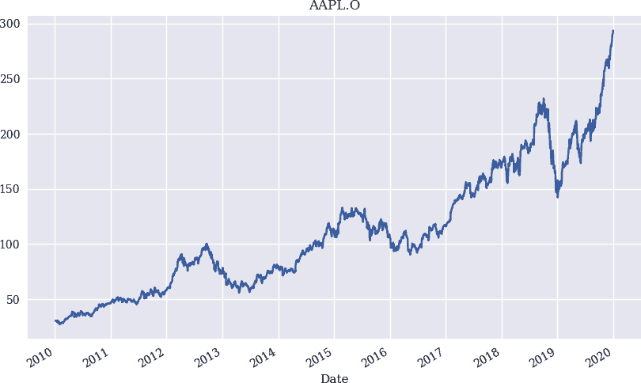

# 第六章。为事件驱动的回测构建类

> 生活的实际悲剧与一个人的预设观念毫无关系。在事件中，人们总是被它们的简单性、设计的宏伟以及似乎固有的奇异因素所困惑。
> 
> 让·科克托

一方面，*NumPy* 和 *pandas* 的*向量化回测*通常因为简洁的代码而便于实现，并且由于这些包针对这类操作进行了优化，执行速度快。然而，这种方法无法处理所有类型的交易策略，也无法处理交易现实中算法交易员面临的所有现象。在向量化回测方面，该方法的潜在缺点包括：

展望偏差

向量化回测基于可用的完整数据集，并且不考虑新数据的逐步到达。

简化

例如，固定交易成本不能通过向量化进行建模，后者主要基于相对收益。此外，每笔交易的固定金额或单个金融工具的不可分割性（例如股票的一部分）也不能得到适当的建模。

非递归性

算法，体现交易策略，可能随时间推移而对状态变量进行递归，比如截至某一时间点的盈亏或类似的路径相关统计数据。向量化不能处理这样的特性。

另一方面，*事件驱动的回测*允许通过更现实的方法来模拟交易现实。从基本层面上看，*事件*的特征是新数据的到达。根据每日结束数据回测苹果公司股票的交易策略，事件可能是苹果股票的新收盘价。它也可以是利率变化，或触及止损水平。事件驱动回测方法的优点通常包括：

增量方法

与交易现实一样，回测是在新数据逐步到达的前提下进行的，每一次变动和报价。

真实的建模

一个完全自由的模型，这些过程是由新的和具体的事件触发的。

路径依赖性

跟踪条件、递归或其他路径相关的统计数据非常简单，比如迄今为止见过的最高或最低价格，并将它们包含在交易算法中。

可重用性

回测不同类型的交易策略需要类似的基础功能，可以通过面向对象编程实现和统一。

靠近交易

事件驱动的回测系统的某些元素有时也可以用于自动实施交易策略。

在接下来的内容中，一个新事件通常由一个 *条形图* 标识，它代表新数据的一个单位。例如，事件可以是用于日内交易策略的 *一分钟条形图* 或基于每日收盘价格的交易策略的 *一天条形图*。

本章的组织如下。“回测基础类” 提供了一个用于基于事件的交易策略回测的基础类。“仅多头回测类” 和 “多空头回测类” 则利用基类实现了分别用于仅多头和多空头回测的类。

本章的目标是理解基于事件的建模，创建允许更现实的回测的类，并提供一个基础的回测基础设施，作为进一步增强和改进的起点。

# 回测基础类

当建立基础设施——以 Python 类的形式——用于基于事件的回测时，必须满足几个要求：

检索和准备数据

基类将负责数据检索，可能还包括为回测本身做准备。为了讨论的聚焦，基类应允许以 CSV 文件读取的每日结束数据作为数据类型。

帮助和便利函数

它应该提供一些帮助和便利函数，使得回测更加容易。例如，用于绘制数据的函数、打印状态变量或返回给定条形图的日期和价格信息的函数等。

下订单

基类应涵盖基本买入和卖出订单的下达。为简化起见，仅建模市价买入和卖出订单。

平仓持仓

在任何回测结束时，需要平掉所有市场持仓。基类将负责这最后的交易。

如果基类满足这些要求，则可以在此基础上构建基于简单移动平均线（SMA）、动量或均值回归（见第四章）、以及基于机器学习预测（见第五章）的策略回测类。“回测基础类” 展示了一个名为 `BacktestBase` 的此类基础类的实现。以下是该类的单个方法的概述。

关于特殊方法 `__main__`，只有几件值得注意的事情。首先，可用初始金额存储两次，分别在一个私有属性 `_amount` 中保持不变，以及在一个表示流动余额的常规属性 `amount` 中。默认假设是没有交易成本的：

```py
    def __init__(self, symbol, start, end, amount,
                 ftc=0.0, ptc=0.0, verbose=True):
        self.symbol = symbol
        self.start = start
        self.end = end
        self.initial_amount = amount  
        self.amount = amount  
        self.ftc = ftc  
        self.ptc = ptc  
        self.units = 0  
        self.position = 0  
        self.trades = 0  
        self.verbose = verbose  
        self.get_data()
```


存储初始金额在一个私有属性中。


设置起始现金余额值。


定义每笔交易的固定交易成本。


定义每笔交易的比例交易成本。


初始时，投资组合中工具的单位（例如股票数量）。


将初始仓位设置为市场中性。


将初始交易数量设置为零。


将`self.verbose`设置为`True`以获得完整输出。

在初始化期间，调用`get_data`方法，该方法从 CSV 文件中获取提供的符号和给定时间间隔的 EOD 数据。它还计算对数收益率。随后的 Python 代码在第 4 和第五章节中广泛使用，因此这里不需要详细解释：

```py
    def get_data(self):
        ''' Retrieves and prepares the data.
 '''
        raw = pd.read_csv('http://hilpisch.com/pyalgo_eikon_eod_data.csv',
                          index_col=0, parse_dates=True).dropna()
        raw = pd.DataFrame(raw[self.symbol])
        raw = raw.loc[self.start:self.end]
        raw.rename(columns={self.symbol: 'price'}, inplace=True)
        raw['return'] = np.log(raw / raw.shift(1))
        self.data = raw.dropna()
```

`.plot_data()`方法只是一个简单的辅助方法，用于绘制提供的符号（调整后的收盘）值的图表：

```py
    def plot_data(self, cols=None):
        ''' Plots the closing prices for symbol.
 '''
        if cols is None:
            cols = ['price']
        self.data['price'].plot(figsize=(10, 6), title=self.symbol)
```

一个经常被调用的方法是`.get_date_price()`。对于给定的`bar`，它返回日期和价格信息：

```py
    def get_date_price(self, bar):
        ''' Return date and price for bar.
 '''
        date = str(self.data.index[bar])[:10]
        price = self.data.price.iloc[bar]
        return date, price
```

`.print_balance()`在给定的某个`bar`中打印出当前现金余额，而`.print_net_wealth()`则对净财富（=当前余额加上交易仓位的价值）做相同操作：

```py
    def print_balance(self, bar):
        ''' Print out current cash balance info.
 '''
        date, price = self.get_date_price(bar)
        print(f'{date} | current balance {self.amount:.2f}')

    def print_net_wealth(self, bar):
        ''' Print out current cash balance info.
 '''
        date, price = self.get_date_price(bar)
        net_wealth = self.units * price + self.amount
        print(f'{date} | current net wealth {net_wealth:.2f}')
```

两个核心方法是`.place_buy_order()`和`.place_sell_order()`。它们允许模拟买卖金融工具的单位。首先是`.place_buy_order()`方法，详细注释如下：

```py
    def place_buy_order(self, bar, units=None, amount=None):
        ''' Place a buy order.
        '''
        date, price = self.get_date_price(bar)  
        if units is None:  
            units = int(amount / price)  
        self.amount -= (units * price) * (1 + self.ptc) + self.ftc  
        self.units += units  
        self.trades += 1  
        if self.verbose:  
            print(f'{date} | selling {units} units at {price:.2f}')  
            self.print_balance(bar)  
            self.print_net_wealth(bar)  
```


检索给定`bar`的日期和价格信息。


如果未提供`units`的值…


…给定`amount`的值，计算`units`的数量。（注意需要给定一个值。）此计算不包括交易成本。


当前现金余额减去要购买的工具单位的现金支出*加上*比例和固定的交易成本。请注意，没有检查是否有足够的流动性可用。


`self.units`的值增加了买入的单位数。


这将交易数量的计数器增加一。


如果`self.verbose`为`True`…


…打印有关交易执行的信息…


…当前的现金余额…


…和当前的净财富。

第二，`.place_sell_order()`方法与`.place_buy_order()`方法相比仅有两个小调整：

```py
    def place_sell_order(self, bar, units=None, amount=None):
        ''' Place a sell order.
        '''
        date, price = self.get_date_price(bar)
        if units is None:
            units = int(amount / price)
        self.amount += (units * price) * (1 - self.ptc) - self.ftc  
        self.units -= units  
        self.trades += 1
        if self.verbose:
            print(f'{date} | selling {units} units at {price:.2f}')
            self.print_balance(bar)
            self.print_net_wealth(bar)
```


当前现金余额增加了销售收入*减去*交易成本。


`self.units`的值减少了卖出的单位数。

无论回测什么类型的交易策略，回测期末的头寸都需要平仓。`BacktestBase`类中的代码假设头寸没有清算，而是用其资产价值来计算和打印性能数据：

```py
    def close_out(self, bar):
        ''' Closing out a long or short position.
        '''
        date, price = self.get_date_price(bar)
        self.amount += self.units * price  
        self.units = 0
        self.trades += 1
        if self.verbose:
            print(f'{date} | inventory {self.units} units at {price:.2f}')
            print('=' * 55)
        print('Final balance   [$] {:.2f}'.format(self.amount))  
        perf = ((self.amount - self.initial_amount) /
                self.initial_amount * 100)
        print('Net Performance [%] {:.2f}'.format(perf))  
        print('Trades Executed [#] {:.2f}'.format(self.trades))  
        print('=' * 55)
```


最后没有减去交易成本。


最终余额包括当前现金余额加上交易头寸的价值。


这计算出百分比的净表现。

Python 脚本的最后部分是`__main__`部分，当文件作为脚本运行时执行：

```py
if __name__ == '__main__':
    bb = BacktestBase('AAPL.O', '2010-1-1', '2019-12-31', 10000)
    print(bb.data.info())
    print(bb.data.tail())
    bb.plot_data()
```

它基于`BacktestBase`类实例化一个对象。这自动导致检索提供的符号的数据。图 6-1 显示出结果图。以下输出显示了相应`DataFrame`对象的元信息和最近的五行数据：

```py
In [1]: %run BacktestBase.py
<class 'pandas.core.frame.DataFrame'>
DatetimeIndex: 2515 entries, 2010-01-05 to 2019-12-31
Data columns (total 2 columns):
 #   Column  Non-Null Count  Dtype
---  ------  --------------  -----
 0   price   2515 non-null   float64
 1   return  2515 non-null   float64
dtypes: float64(2)
memory usage: 58.9 KB
None
             price    return
Date
2019-12-24  284.27  0.000950
2019-12-26  289.91  0.019646
2019-12-27  289.80 -0.000380
2019-12-30  291.52  0.005918
2019-12-31  293.65  0.007280

In [2]:
```



###### 图 6-1\. 由`BacktestBase`类检索的`symbol`数据绘图

两个后续章节介绍了用于回测仅多头和多空交易策略的类。由于这些类依赖于本节中介绍的基础类，因此回测例程的实现相当简洁。

使用面向对象编程可以通过 Python 类的形式构建基本的回测基础设施。这种类提供了在不冗余、易于维护的方式下回测不同类型算法交易策略所需的标准功能。同时，通过简单的方式增强基础类以提供更多默认功能，这些功能可能有益于其他构建在其上的多个类。

# 仅多头回测类

某些投资者偏好或法规可能禁止作为交易策略的卖空。因此，交易员或投资组合经理只允许进入多头头寸或以现金或类似低风险资产（如货币市场账户）形式投放资本。“仅多头回测类”展示了名为`BacktestLongOnly`的仅多头策略回测类的代码。由于它依赖于并继承自`BacktestBase`类，因此基于 SMA、动量和均值回归实现的三种策略的代码相当简洁。

方法`.run_mean_reversion_strategy()`实现基于均值回归策略的回测过程。这个方法有详细的注释，因为从实现的角度来看可能有点棘手。然而，这些基本的见解很容易推广到实现其他两种策略的方法上：

```py
    def run_mean_reversion_strategy(self, SMA, threshold):
        ''' Backtesting a mean reversion-based strategy.

        Parameters
        ==========
        SMA: int
            simple moving average in days
        threshold: float
            absolute value for deviation-based signal relative to SMA
        '''
        msg = f'\n\nRunning mean reversion strategy | '
        msg += f'SMA={SMA} & thr={threshold}'
        msg += f'\nfixed costs {self.ftc} | '
        msg += f'proportional costs {self.ptc}'
        print(msg)  
        print('=' * 55)
        self.position = 0  
        self.trades = 0  
        self.amount = self.initial_amount  

        self.data['SMA'] = self.data['price'].rolling(SMA).mean()  

        for bar in range(SMA, len(self.data)):  
            if self.position == 0:  
                if (self.data['price'].iloc[bar] <
                        self.data['SMA'].iloc[bar] - threshold):  
                    self.place_buy_order(bar, amount=self.amount)  
                    self.position = 1  
            elif self.position == 1:  
                if self.data['price'].iloc[bar] >= self.data['SMA'].iloc[bar]:  
                    self.place_sell_order(bar, units=self.units)  
                    self.position = 0  
        self.close_out(bar)  
```


在开始时，此方法输出回测的主要参数概述。


该位置设置为市场中性，在这里更清晰地说明，而且无论如何都应该是这种情况。


如果另一个回测运行覆盖了该值，则当前现金余额将重置为初始金额。


这计算了策略实施所需的 SMA 值。


起始值`SMA`确保有足够的 SMA 值可用于实施和回测策略。


条件检查当前位置是否为市场中性。


如果仓位是市场中性的，就检查当前价格是否相对于 SMA 低到足以触发买入订单并持有多头。


这将以当前现金余额的金额执行买单。


市场仓位设置为多头。


检查条件是否为多头市场位置。


如果是这种情况，则检查当前价格是否已回到或高于 SMA 水平。


在这种情况下，为所有金融工具单位下达卖单。


市场仓位再次设置为中性。


在回测期结束时，如果有未平仓位，市场仓位将被关闭。

在“仅多头回测类”中执行 Python 脚本将产生回测结果，如下所示。这些示例说明了固定和比例交易成本的影响。首先，它们通常会降低整体表现。无论如何，考虑交易成本都会降低表现。其次，它们突显了一定策略随时间触发的交易数量的重要性。没有交易成本时，动量策略明显优于基于 SMA 的策略。而有了交易成本，基于 SMA 的策略优于动量策略，因为它依赖较少的交易：

```py
Running SMA strategy | SMA1=42 & SMA2=252
fixed costs 0.0 | proportional costs 0.0
=======================================================
Final balance   [$] 56204.95
Net Performance [%] 462.05
=======================================================

Running momentum strategy | 60 days
fixed costs 0.0 | proportional costs 0.0
=======================================================
Final balance   [$] 136716.52
Net Performance [%] 1267.17
=======================================================

Running mean reversion strategy | SMA=50 & thr=5
fixed costs 0.0 | proportional costs 0.0
=======================================================
Final balance   [$] 53907.99
Net Performance [%] 439.08
=======================================================

Running SMA strategy | SMA1=42 & SMA2=252
fixed costs 10.0 | proportional costs 0.01
=======================================================
Final balance   [$] 51959.62
Net Performance [%] 419.60
=======================================================

Running momentum strategy | 60 days
fixed costs 10.0 | proportional costs 0.01
=======================================================
Final balance   [$] 38074.26
Net Performance [%] 280.74
=======================================================

Running mean reversion strategy | SMA=50 & thr=5
fixed costs 10.0 | proportional costs 0.01
=======================================================
Final balance   [$] 15375.48
Net Performance [%] 53.75
=======================================================
```

第五章强调了表现币的两面：正确预测市场方向的命中率和市场定时（即准确预测的时间）。这里显示的结果说明了甚至有一个“第三面”：策略触发的交易数量。要求更高频率交易的策略必须承担更高的交易成本，这很容易吞噬掉声称相对于其他没有或低交易成本策略的表现。其中，这经常为基于低成本的被动投资策略（例如，基于交易所交易基金（ETF）的策略）提供支持。

# 多空回测类

“多空回测课程”介绍了`BacktestLongShort`类，它也继承自`BacktestBase`类。除了实现不同策略的回测方法外，它还分别实现了两种额外的方法来进行多头和空头操作。仅详细介绍了`.go_long()`方法，因为`.go_short()`方法在相反方向上执行完全相同的操作：

```py
    def go_long(self, bar, units=None, amount=None):  
        if self.position == -1:  
            self.place_buy_order(bar, units=-self.units)  
        if units:  
            self.place_buy_order(bar, units=units)  
        elif amount:  
            if amount == 'all':  
                amount = self.amount  
            self.place_buy_order(bar, amount=amount)  

    def go_short(self, bar, units=None, amount=None):
        if self.position == 1:
            self.place_sell_order(bar, units=self.units)
        if units:
            self.place_sell_order(bar, units=units)
        elif amount:
            if amount == 'all':
                amount = self.amount
            self.place_sell_order(bar, amount=amount)
```


除了`bar`，这些方法还期望交易工具的单位数或货币金额的数字。


在`.go_long()`情况下，首先检查是否有空头头寸。


如果是这样，这个短头寸首先被关闭。


然后检查是否给出了`units`…


…相应地触发买入订单。


如果给定了`amount`，可能会有两种情况。


首先，`all`的值被翻译成…


…当前现金余额中所有可用的现金。


其次，该值是一个数字，然后直接用来下相应的买入订单。请注意，没有检查是否有足够的流动性。

为了在整个实现中保持简洁，Python 类中有许多简化，这些简化将责任转移给用户。例如，这些类不关心是否有足够的流动性来执行交易。这是经济简化，因为理论上，可以假设算法交易者拥有足够甚至无限的信贷。另一个例子是，某些方法期望至少指定两个参数中的一个（`units`或`amount`）。没有代码捕捉两者都未设置的情况。这是技术上的简化。

以下展示了`BacktestLongShort`类的`.run_mean_reversion_strategy()`方法中的核心循环。再次选择均值回归策略，因为实现稍微复杂一些。例如，这是唯一会导致中间市场中性位置的策略。这要求与其他两种策略相比需要更多的检查，如在“长-短回测类”中所见：

```py
        for bar in range(SMA, len(self.data)):
            if self.position == 0:  
                if (self.data['price'].iloc[bar] <
                        self.data['SMA'].iloc[bar] - threshold):  
                    self.go_long(bar, amount=self.initial_amount)  
                    self.position = 1  
                elif (self.data['price'].iloc[bar] >
                        self.data['SMA'].iloc[bar] + threshold):  
                    self.go_short(bar, amount=self.initial_amount)
                    self.position = -1  
            elif self.position == 1:  
                if self.data['price'].iloc[bar] >= self.data['SMA'].iloc[bar]:  
                    self.place_sell_order(bar, units=self.units)  
                    self.position = 0  
            elif self.position == -1:  
                if self.data['price'].iloc[bar] <= self.data['SMA'].iloc[bar]:  
                    self.place_buy_order(bar, units=-self.units)  
                    self.position = 0  
        self.close_out(bar)
```


第一个顶层条件检查头寸是否市场中性。


如果是这样，然后检查当前价格是否相对于 SMA 足够低。


在这种情况下，调用`.go_long()`方法…


…并且市场位置设置为长。


如果当前价格相对于 SMA 足够高，则调用`.go_short()`方法…


…并且市场位置设置为短。


第二个顶层条件检查长期市场位置。


在这种情况下，进一步检查当前价格是否再次达到或高于 SMA 水平。


如果是这样，长头寸通过出售投资组合中的所有单位来平仓。


市场位置被重置为中性。


最后，第三个顶层条件检查空头位置。


如果当前价格等于或低于 SMA…


…触发所有空头单位的买入订单以平仓空头头寸。


然后市场位置被重置为中性。

在“多头空头回测类”执行 Python 脚本后，可以得到进一步揭示策略特性的性能结果。人们可能倾向于认为添加对金融工具进行做空的灵活性会带来更好的结果。然而，现实表明这未必正确。所有策略在没有和在交易成本后表现都更差。有些配置甚至会累积净损失或负债。尽管这些仅是具体的结果，但它们说明在这样的背景下过早得出结论并不明智，并且不考虑积累债务的限制：

```py
Running SMA strategy | SMA1=42 & SMA2=252
fixed costs 0.0 | proportional costs 0.0
=======================================================
Final balance   [$] 45631.83
Net Performance [%] 356.32
=======================================================

Running momentum strategy | 60 days
fixed costs 0.0 | proportional costs 0.0
=======================================================
Final balance   [$] 105236.62
Net Performance [%] 952.37
=======================================================

Running mean reversion strategy | SMA=50 & thr=5
fixed costs 0.0 | proportional costs 0.0
=======================================================
Final balance   [$] 17279.15
Net Performance [%] 72.79
=======================================================

Running SMA strategy | SMA1=42 & SMA2=252
fixed costs 10.0 | proportional costs 0.01
=======================================================
Final balance   [$] 38369.65
Net Performance [%] 283.70
=======================================================

Running momentum strategy | 60 days
fixed costs 10.0 | proportional costs 0.01
=======================================================
Final balance   [$] 6883.45
Net Performance [%] -31.17
=======================================================

Running mean reversion strategy | SMA=50 & thr=5
fixed costs 10.0 | proportional costs 0.01
=======================================================
Final balance   [$] -5110.97
Net Performance [%] -151.11
=======================================================
```

例如，在交易差价合约（CFD）的背景下，可能会出现交易可能耗尽所有初始权益甚至导致负债的情况。这些是高度杠杆化的产品，交易者只需要作为初始保证金放下，比如说，头寸价值的 5%（当杠杆是 20 时）。如果头寸价值变化了 10%，交易者可能需要满足相应的追加保证金要求。对于 100,000 美元的多头头寸，需要 5,000 美元的权益。如果头寸下跌到 90,000 美元，权益被清零，交易者必须再支付 5,000 美元来弥补损失。这假设没有设立会在剩余权益降到 0 美元时关闭头寸的保证金止损。

# 结论

本章介绍了用于事件驱动交易策略回测的类。与矢量化回测相比，事件驱动回测通过有意和大量使用循环和迭代来处理每个新事件（通常是新数据到来）可以单独处理。这种方法可以更灵活地应对固定交易成本或更复杂的策略（及其变体），等等。

“回测基类”提供了一个基类，其中包含对各种交易策略进行回测的某些有用方法。“仅多头回测类”和“多头空头回测类”在此基础上构建，实现了允许对仅多头和多头空头交易策略进行回测的类。主要出于比较的原因，实现包括在第四章正式介绍的所有三种策略。通过本章的类作为起点，可以轻松实现增强和改进。

# 参考文献和进一步资源

前几章介绍了本章涵盖的三种交易策略的基本思想和概念。本章首次更系统地使用了 Python 类和面向对象编程（OOP）。关于 Python 和 Python 数据模型的 OOP 良好介绍可在 Ramalho（2021）中找到。关于金融中应用 OOP 的更简明介绍见 Hilpisch（2018 年，第六章）：

+   Hilpisch, Yves. 2018\. *Python 金融：掌握数据驱动金融*. 第 2 版. Sebastopol：O’Reilly.

+   Ramalho, Luciano. 2021\. *流畅的 Python：清晰、简洁和高效的编程*. 第 2 版. Sebastopol：O’Reilly.

Python 生态系统提供了许多可选的软件包，用于算法交易策略的回测。其中四个如下：

+   [bt](http://pmorissette.github.io/bt/)

+   [Backtrader](https://backtrader.com/)

+   [PyAlgoTrade](http://gbeced.github.io/pyalgotrade/)

+   [Zipline](https://github.com/quantopian/zipline)

例如，`Zipline`支持用于算法交易策略回测的流行[Quantopian](http://quantopian.com)平台，但也可以在本地安装和使用。

尽管这些软件包可能允许比本章介绍的简单类更彻底地回测算法交易策略，但本书的主要目标是使读者和算法交易者能够自主实现 Python 代码。即使以后使用标准软件包进行实际回测，对不同方法及其机制的良好理解也是有益的，如果不是必需的话。

# Python 脚本

本节介绍了本章中引用和使用的 Python 脚本。

## 回测基类

以下 Python 代码包含了基于事件的回测的基类：

```py
#
# Python Script with Base Class
# for Event-Based Backtesting
#
# Python for Algorithmic Trading
# (c) Dr. Yves J. Hilpisch
# The Python Quants GmbH
#
import numpy as np
import pandas as pd
from pylab import mpl, plt
plt.style.use('seaborn')
mpl.rcParams['font.family'] = 'serif'

class BacktestBase(object):
    ''' Base class for event-based backtesting of trading strategies.

 Attributes
 ==========
 symbol: str
 TR RIC (financial instrument) to be used
 start: str
 start date for data selection
 end: str
 end date for data selection
 amount: float
 amount to be invested either once or per trade
 ftc: float
 fixed transaction costs per trade (buy or sell)
 ptc: float
 proportional transaction costs per trade (buy or sell)

 Methods
 =======
 get_data:
 retrieves and prepares the base data set
 plot_data:
 plots the closing price for the symbol
 get_date_price:
 returns the date and price for the given bar
 print_balance:
 prints out the current (cash) balance
 print_net_wealth:
 prints out the current net wealth
 place_buy_order:
 places a buy order
 place_sell_order:
 places a sell order
 close_out:
 closes out a long or short position
 '''

    def __init__(self, symbol, start, end, amount,
                 ftc=0.0, ptc=0.0, verbose=True):
        self.symbol = symbol
        self.start = start
        self.end = end
        self.initial_amount = amount
        self.amount = amount
        self.ftc = ftc
        self.ptc = ptc
        self.units = 0
        self.position = 0
        self.trades = 0
        self.verbose = verbose
        self.get_data()

    def get_data(self):
        ''' Retrieves and prepares the data.
 '''
        raw = pd.read_csv('http://hilpisch.com/pyalgo_eikon_eod_data.csv',
                          index_col=0, parse_dates=True).dropna()
        raw = pd.DataFrame(raw[self.symbol])
        raw = raw.loc[self.start:self.end]
        raw.rename(columns={self.symbol: 'price'}, inplace=True)
        raw['return'] = np.log(raw / raw.shift(1))
        self.data = raw.dropna()

    def plot_data(self, cols=None):
        ''' Plots the closing prices for symbol.
 '''
        if cols is None:
            cols = ['price']
        self.data['price'].plot(figsize=(10, 6), title=self.symbol)

    def get_date_price(self, bar):
        ''' Return date and price for bar.
 '''
        date = str(self.data.index[bar])[:10]
        price = self.data.price.iloc[bar]
        return date, price

    def print_balance(self, bar):
        ''' Print out current cash balance info.
 '''
        date, price = self.get_date_price(bar)
        print(f'{date} | current balance {self.amount:.2f}')

    def print_net_wealth(self, bar):
        ''' Print out current cash balance info.
 '''
        date, price = self.get_date_price(bar)
        net_wealth = self.units * price + self.amount
        print(f'{date} | current net wealth {net_wealth:.2f}')

    def place_buy_order(self, bar, units=None, amount=None):
        ''' Place a buy order.
 '''
        date, price = self.get_date_price(bar)
        if units is None:
            units = int(amount / price)
        self.amount -= (units * price) * (1 + self.ptc) + self.ftc
        self.units += units
        self.trades += 1
        if self.verbose:
            print(f'{date} | selling {units} units at {price:.2f}')
            self.print_balance(bar)
            self.print_net_wealth(bar)

    def place_sell_order(self, bar, units=None, amount=None):
        ''' Place a sell order.
 '''
        date, price = self.get_date_price(bar)
        if units is None:
            units = int(amount / price)
        self.amount += (units * price) * (1 - self.ptc) - self.ftc
        self.units -= units
        self.trades += 1
        if self.verbose:
            print(f'{date} | selling {units} units at {price:.2f}')
            self.print_balance(bar)
            self.print_net_wealth(bar)

    def close_out(self, bar):
        ''' Closing out a long or short position.
 '''
        date, price = self.get_date_price(bar)
        self.amount += self.units * price
        self.units = 0
        self.trades += 1
        if self.verbose:
            print(f'{date} | inventory {self.units} units at {price:.2f}')
            print('=' * 55)
        print('Final balance   [$] {:.2f}'.format(self.amount))
        perf = ((self.amount - self.initial_amount) /
                self.initial_amount * 100)
        print('Net Performance [%] {:.2f}'.format(perf))
        print('Trades Executed [#] {:.2f}'.format(self.trades))
        print('=' * 55)

if __name__ == '__main__':
    bb = BacktestBase('AAPL.O', '2010-1-1', '2019-12-31', 10000)
    print(bb.data.info())
    print(bb.data.tail())
    bb.plot_data()
```

## 仅多头回测类

以下介绍了 Python 代码，其中包含了基于*仅多头*策略的事件驱动回测类，实现了基于*简单移动平均线(SMAs)*、*动量*和*均值回归*的策略：

```py
#
# Python Script with Long Only Class
# for Event-Based Backtesting
#
# Python for Algorithmic Trading
# (c) Dr. Yves J. Hilpisch
# The Python Quants GmbH
#
from BacktestBase import *

class BacktestLongOnly(BacktestBase):

    def run_sma_strategy(self, SMA1, SMA2):
        ''' Backtesting an SMA-based strategy.

 Parameters
 ==========
 SMA1, SMA2: int
 shorter and longer term simple moving average (in days)
 '''
        msg = f'\n\nRunning SMA strategy | SMA1={SMA1} & SMA2={SMA2}'
        msg += f'\nfixed costs {self.ftc} | '
        msg += f'proportional costs {self.ptc}'
        print(msg)
        print('=' * 55)
        self.position = 0  # initial neutral position
        self.trades = 0  # no trades yet
        self.amount = self.initial_amount  # reset initial capital
        self.data['SMA1'] = self.data['price'].rolling(SMA1).mean()
        self.data['SMA2'] = self.data['price'].rolling(SMA2).mean()

        for bar in range(SMA2, len(self.data)):
            if self.position == 0:
                if self.data['SMA1'].iloc[bar] > self.data['SMA2'].iloc[bar]:
                    self.place_buy_order(bar, amount=self.amount)
                    self.position = 1  # long position
            elif self.position == 1:
                if self.data['SMA1'].iloc[bar] < self.data['SMA2'].iloc[bar]:
                    self.place_sell_order(bar, units=self.units)
                    self.position = 0  # market neutral
        self.close_out(bar)

    def run_momentum_strategy(self, momentum):
        ''' Backtesting a momentum-based strategy.

 Parameters
 ==========
 momentum: int
 number of days for mean return calculation
 '''
        msg = f'\n\nRunning momentum strategy | {momentum} days'
        msg += f'\nfixed costs {self.ftc} | '
        msg += f'proportional costs {self.ptc}'
        print(msg)
        print('=' * 55)
        self.position = 0  # initial neutral position
        self.trades = 0  # no trades yet
        self.amount = self.initial_amount  # reset initial capital
        self.data['momentum'] = self.data['return'].rolling(momentum).mean()
        for bar in range(momentum, len(self.data)):
            if self.position == 0:
                if self.data['momentum'].iloc[bar] > 0:
                    self.place_buy_order(bar, amount=self.amount)
                    self.position = 1  # long position
            elif self.position == 1:
                if self.data['momentum'].iloc[bar] < 0:
                    self.place_sell_order(bar, units=self.units)
                    self.position = 0  # market neutral
        self.close_out(bar)

    def run_mean_reversion_strategy(self, SMA, threshold):
        ''' Backtesting a mean reversion-based strategy.

 Parameters
 ==========
 SMA: int
 simple moving average in days
 threshold: float
 absolute value for deviation-based signal relative to SMA
 '''
        msg = f'\n\nRunning mean reversion strategy | '
        msg += f'SMA={SMA} & thr={threshold}'
        msg += f'\nfixed costs {self.ftc} | '
        msg += f'proportional costs {self.ptc}'
        print(msg)
        print('=' * 55)
        self.position = 0
        self.trades = 0
        self.amount = self.initial_amount

        self.data['SMA'] = self.data['price'].rolling(SMA).mean()

        for bar in range(SMA, len(self.data)):
            if self.position == 0:
                if (self.data['price'].iloc[bar] <
                        self.data['SMA'].iloc[bar] - threshold):
                    self.place_buy_order(bar, amount=self.amount)
                    self.position = 1
            elif self.position == 1:
                if self.data['price'].iloc[bar] >= self.data['SMA'].iloc[bar]:
                    self.place_sell_order(bar, units=self.units)
                    self.position = 0
        self.close_out(bar)

if __name__ == '__main__':
    def run_strategies():
        lobt.run_sma_strategy(42, 252)
        lobt.run_momentum_strategy(60)
        lobt.run_mean_reversion_strategy(50, 5)
    lobt = BacktestLongOnly('AAPL.O', '2010-1-1', '2019-12-31', 10000,
                            verbose=False)
    run_strategies()
    # transaction costs: 10 USD fix, 1% variable
    lobt = BacktestLongOnly('AAPL.O', '2010-1-1', '2019-12-31',
                            10000, 10.0, 0.01, False)
    run_strategies()
```

## 多空回测类

以下 Python 代码包含了基于事件的*多空*策略的回测基类，实现了基于*简单移动平均线(SMAs)*、*动量*和*均值回归*的策略：

```py
#
# Python Script with Long-Short Class
# for Event-Based Backtesting
#
# Python for Algorithmic Trading
# (c) Dr. Yves J. Hilpisch
# The Python Quants GmbH
#
from BacktestBase import *

class BacktestLongShort(BacktestBase):

    def go_long(self, bar, units=None, amount=None):
        if self.position == -1:
            self.place_buy_order(bar, units=-self.units)
        if units:
            self.place_buy_order(bar, units=units)
        elif amount:
            if amount == 'all':
                amount = self.amount
            self.place_buy_order(bar, amount=amount)

    def go_short(self, bar, units=None, amount=None):
        if self.position == 1:
            self.place_sell_order(bar, units=self.units)
        if units:
            self.place_sell_order(bar, units=units)
        elif amount:
            if amount == 'all':
                amount = self.amount
            self.place_sell_order(bar, amount=amount)

    def run_sma_strategy(self, SMA1, SMA2):
        msg = f'\n\nRunning SMA strategy | SMA1={SMA1} & SMA2={SMA2}'
        msg += f'\nfixed costs {self.ftc} | '
        msg += f'proportional costs {self.ptc}'
        print(msg)
        print('=' * 55)
        self.position = 0  # initial neutral position
        self.trades = 0  # no trades yet
        self.amount = self.initial_amount  # reset initial capital
        self.data['SMA1'] = self.data['price'].rolling(SMA1).mean()
        self.data['SMA2'] = self.data['price'].rolling(SMA2).mean()

        for bar in range(SMA2, len(self.data)):
            if self.position in [0, -1]:
                if self.data['SMA1'].iloc[bar] > self.data['SMA2'].iloc[bar]:
                    self.go_long(bar, amount='all')
                    self.position = 1  # long position
            if self.position in [0, 1]:
                if self.data['SMA1'].iloc[bar] < self.data['SMA2'].iloc[bar]:
                    self.go_short(bar, amount='all')
                    self.position = -1  # short position
        self.close_out(bar)

    def run_momentum_strategy(self, momentum):
        msg = f'\n\nRunning momentum strategy | {momentum} days'
        msg += f'\nfixed costs {self.ftc} | '
        msg += f'proportional costs {self.ptc}'
        print(msg)
        print('=' * 55)
        self.position = 0  # initial neutral position
        self.trades = 0  # no trades yet
        self.amount = self.initial_amount  # reset initial capital
        self.data['momentum'] = self.data['return'].rolling(momentum).mean()
        for bar in range(momentum, len(self.data)):
            if self.position in [0, -1]:
                if self.data['momentum'].iloc[bar] > 0:
                    self.go_long(bar, amount='all')
                    self.position = 1  # long position
            if self.position in [0, 1]:
                if self.data['momentum'].iloc[bar] <= 0:
                    self.go_short(bar, amount='all')
                    self.position = -1  # short position
        self.close_out(bar)

    def run_mean_reversion_strategy(self, SMA, threshold):
        msg = f'\n\nRunning mean reversion strategy | '
        msg += f'SMA={SMA} & thr={threshold}'
        msg += f'\nfixed costs {self.ftc} | '
        msg += f'proportional costs {self.ptc}'
        print(msg)
        print('=' * 55)
        self.position = 0  # initial neutral position
        self.trades = 0  # no trades yet
        self.amount = self.initial_amount  # reset initial capital

        self.data['SMA'] = self.data['price'].rolling(SMA).mean()

        for bar in range(SMA, len(self.data)):
            if self.position == 0:
                if (self.data['price'].iloc[bar] <
                        self.data['SMA'].iloc[bar] - threshold):
                    self.go_long(bar, amount=self.initial_amount)
                    self.position = 1
                elif (self.data['price'].iloc[bar] >
                        self.data['SMA'].iloc[bar] + threshold):
                    self.go_short(bar, amount=self.initial_amount)
                    self.position = -1
            elif self.position == 1:
                if self.data['price'].iloc[bar] >= self.data['SMA'].iloc[bar]:
                    self.place_sell_order(bar, units=self.units)
                    self.position = 0
            elif self.position == -1:
                if self.data['price'].iloc[bar] <= self.data['SMA'].iloc[bar]:
                    self.place_buy_order(bar, units=-self.units)
                    self.position = 0
        self.close_out(bar)

if __name__ == '__main__':
    def run_strategies():
        lsbt.run_sma_strategy(42, 252)
        lsbt.run_momentum_strategy(60)
        lsbt.run_mean_reversion_strategy(50, 5)
    lsbt = BacktestLongShort('EUR=', '2010-1-1', '2019-12-31', 10000,
                             verbose=False)
    run_strategies()
    # transaction costs: 10 USD fix, 1% variable
    lsbt = BacktestLongShort('AAPL.O', '2010-1-1', '2019-12-31',
                             10000, 10.0, 0.01, False)
    run_strategies()
```
