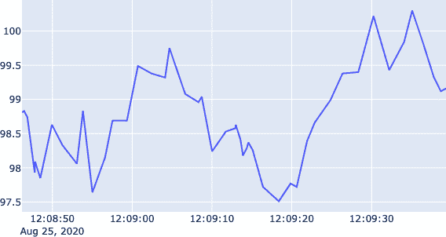
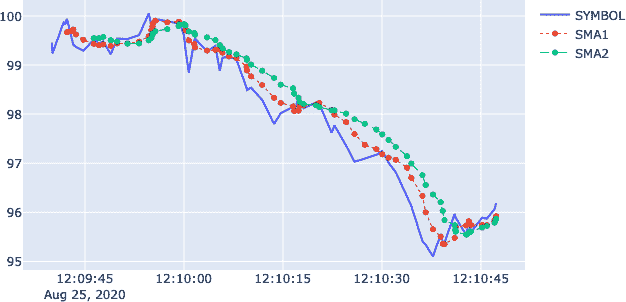
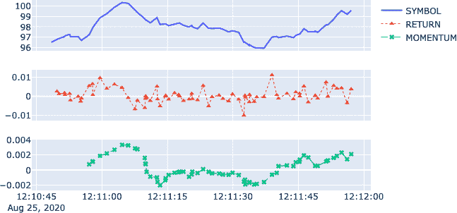
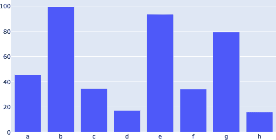

# 第七章。处理实时数据和套接字

> 如果你想找到宇宙的秘密，想象能量、频率和振动的概念。
> 
> 尼古拉·特斯拉

开发交易思路并对其进行回测是一个相对异步且非关键的过程，期间可能有多个步骤会重复或不重复，期间没有资本风险，性能和速度也不是最重要的需求。当转向市场以部署交易策略时，规则会发生显著变化。数据实时到达且通常是大量到达，这使得实时处理数据和基于流数据做出实时决策成为必要。本章讨论处理实时数据的问题，其中*套接字*通常是技术工具的首选。在这种背景下，以下是一些核心技术术语的简要介绍：

网络套接字

计算机网络中连接的终点，简称为*套接字*。

套接字地址

由互联网协议（IP）地址和端口号组合而成。

套接字协议

定义和处理套接字通信的协议，如传输控制协议（TCP）。

套接字对

本地套接字和远程套接字的组合，它们相互通信。

套接字 API

允许控制套接字及其通信的应用程序接口。

本章重点介绍[`ZeroMQ`](http://zeromq.org)作为一款轻量、快速和可扩展的套接字编程库的使用。它在多个平台上都可用，并为大多数流行的编程语言提供了包装器。`ZeroMQ`支持不同的套接字通信模式。其中一种模式是所谓的*发布-订阅*（`PUB-SUB`）模式，其中一个套接字发布数据，多个套接字同时检索数据。这类似于广播自己的节目并通过收音机设备同时被成千上万的人收听的电台。

在给定的`PUB-SUB`模式下，算法交易的一个基本应用场景是从交易所、交易平台或数据服务提供商检索实时金融数据。假设你已经基于 EUR/USD 货币对开发了一个日内交易思路并进行了彻底的回测。在部署时，您需要能够实时接收和处理价格数据。这正好符合`PUB-SUB`模式。一个中心实例在新的 tick 数据可用时广播该数据，同时您和可能还有成千上万的其他人同时接收和处理它。¹

本章的组织结构如下。“运行一个简单的 Tick 数据服务器” 描述了如何为示例财务数据实现和运行一个 Tick 数据服务器。“连接一个简单的 Tick 数据客户端” 实现了一个 Tick 数据客户端，用于连接到 Tick 数据服务器。“实时信号生成” 展示了如何基于 Tick 数据服务器的数据实时生成交易信号。最后，“使用 Plotly 可视化流数据” 介绍了 [Plotly](http://plot.ly) 绘图包作为实时绘制流数据的有效方法。

本章的目标是提供一套工具集和方法，以便在算法交易的上下文中处理流数据。

本章的代码大量使用端口进行套接字通信，并且需要同时执行两个或两个以上的脚本。因此建议在不同的终端实例中执行本章的代码，运行不同的 Python 内核。在单个 Jupyter Notebook 中执行，例如，通常不起作用。然而，可以在终端中执行 Tick 数据服务器脚本（“运行一个简单的 Tick 数据服务器”），并在 Jupyter Notebook 中检索数据（“使用 Plotly 可视化流数据”）。

# 运行简单的 Tick 数据服务器

本节展示了如何运行一个基于模拟金融工具价格的简单 Tick 数据服务器。用于数据生成的模型是几何布朗运动（不考虑股息），其精确的欧拉离散化方法如 方程式 7-1 所示。在这里，<math alttext="upper S"><mi>S</mi></math> 是工具价格，<math alttext="r"><mi>r</mi></math> 是常数短期利率，<math alttext="sigma"><mi>σ</mi></math> 是常数波动率因子，<math alttext="z"><mi>z</mi></math> 是标准正态随机变量。 <math alttext="normal upper Delta t"><mrow><mi>Δ</mi> <mi>t</mi></mrow></math> 是工具价格的两次离散观察之间的间隔。

##### 方程式 7-1\. 几何布朗运动的欧拉离散化

<math alttext="upper S Subscript t Baseline equals upper S Subscript t minus normal upper Delta t Baseline dot exp left-parenthesis left-parenthesis r minus StartFraction sigma squared Over 2 EndFraction right-parenthesis normal upper Delta t plus sigma StartRoot normal upper Delta t EndRoot z right-parenthesis" display="block"><mrow><msub><mi>S</mi> <mi>t</mi></msub> <mo>=</mo> <msub><mi>S</mi> <mrow><mi>t</mi><mo>-</mo><mi>Δ</mi><mi>t</mi></mrow></msub> <mo>·</mo> <mo form="prefix">exp</mo> <mfenced close=")" open="(" separators=""><mfenced close=")" open="(" separators=""><mi>r</mi> <mo>-</mo> <mfrac><msup><mi>σ</mi> <mn>2</mn></msup> <mn>2</mn></mfrac></mfenced> <mi>Δ</mi> <mi>t</mi> <mo>+</mo> <mi>σ</mi> <msqrt><mrow><mi>Δ</mi> <mi>t</mi></mrow></msqrt> <mi>z</mi></mfenced></mrow></math>

利用这个模型，“示例 Tick 数据服务器” 提供了一个使用 `ZeroMQ` 和一个名为 `InstrumentPrice` 的类实现的 Python 脚本，以随机方式发布新的模拟 Tick 数据。发布是通过两种方式随机进行的。首先，股票价格基于蒙特卡罗模拟。第二种是两次发布事件之间的时间间隔的长度是随机的。本节的其余部分详细解释了脚本的主要部分。

以下脚本的第一部分执行一些导入，以及其他事情，用于 Python 的 `ZeroMQ` 包装器。它还实例化了打开 `PUB` 类型套接字所需的主要对象：

```py
import zmq  
import math
import time
import random

context = zmq.Context()  
socket = context.socket(zmq.PUB)  
socket.bind('tcp://0.0.0.0:5555')  
```


这里导入了 Python 对`ZeroMQ`库的包装。


实例化一个`Context`对象。它是套接字通信的中心对象。


基于`PUB`套接字类型（“通信模式”）定义套接字本身。


套接字绑定到本地 IP 地址（在 Linux 和 Mac OS 上为`0.0.0.0`，在 Windows 上为`127.0.0.1`）和端口号 5555。

`InstrumentPrice`类用于模拟随时间变化的工具价格值。作为属性，除了工具符号和实例创建时间外，还有几何布朗运动的主要参数。唯一的方法`.simulate_value()`根据最后一次调用以来经过的时间和随机因子生成新的股票价格值：

```py
class InstrumentPrice(object):
    def __init__(self):
        self.symbol = 'SYMBOL'
        self.t = time.time()  
        self.value = 100.
        self.sigma = 0.4
        self.r = 0.01

    def simulate_value(self):
        ''' Generates a new, random stock price.
        '''
        t = time.time()  
        dt = (t - self.t) / (252 * 8 * 60 * 60)  
        dt *= 500  
        self.t = t  
        self.value *= math.exp((self.r - 0.5 * self.sigma ** 2) * dt +
                               self.sigma * math.sqrt(dt) * random.gauss(0, 1))  
        return self.value
```


属性`t`存储初始化的时间。


调用`.simulate_value()`方法时记录当前时间。


`dt`表示当前时间与存储在`self.t`中的时间之间的(交易)年分数间隔。


为了具有更大的工具价格波动，此行代码通过任意因子缩放`dt`变量。


属性`t`使用当前时间更新，表示下次调用方法的参考点。


基于几何布朗运动的欧拉方案，模拟新的工具价格。

脚本的主要部分包括类型为`InstrumentPrice`的对象的实例化和一个无限的`while`循环。在`while`循环期间，模拟新的工具价格，并创建、打印并通过套接字发送消息。

最后，执行暂停一段随机时间：

```py
ip = InstrumentPrice()  

while True:  
    msg = '{} {:.2f}'.format(ip.symbol, ip.simulate_value())  
    print(msg)  
    socket.send_string(msg)  
    time.sleep(random.random() * 2)  
```


此行实例化一个`InstrumentPrice`对象。


开始了一个无限的`while`循环。


消息文本基于`symbol`属性和新模拟的股票价格值生成。


将消息`str`对象打印到标准输出。


它也被发送到已订阅的套接字。


循环的执行暂停了一段随机时间（在 0 到 2 秒之间），模拟了市场上新的 tick 数据的随机到达。

执行脚本将如下打印出消息：

```py
(base) pro:ch07 yves$ Python TickServer.py
SYMBOL 100.00
SYMBOL 99.65
SYMBOL 99.28
SYMBOL 99.09
SYMBOL 98.76
SYMBOL 98.83
SYMBOL 98.82
SYMBOL 98.92
SYMBOL 98.57
SYMBOL 98.81
SYMBOL 98.79
SYMBOL 98.80
```

此时还不能验证脚本是否也通过绑定到`tcp://0.0.0.0:5555`（在 Windows 上是`tcp://127.0.0.1:5555`）的套接字发送相同的消息。为此，需要另一个订阅发布套接字的套接字来完成套接字对。

在许多情况下，金融工具价格的蒙特卡洛模拟依赖于均匀时间间隔（例如“一个交易日”）。在许多情况下，当与更长的视野内的日终收盘价格一起使用时，这是一个“足够好”的近似值。在涉及到日内 tick 数据的情况下，数据的随机到达是需要考虑的重要特征。用于 tick 数据服务器的 Python 脚本通过在执行期间暂停的随机时间间隔实现了数据的随机到达时间。

# 连接一个简单的 Tick 数据客户端

用于 tick 数据服务器的代码已经相当简洁，其中`InstrumentPrice`模拟类代表最长的部分。如“Tick 数据客户端”中所示，相应的 tick 数据客户端代码更加简洁。只需几行代码实例化主`Context`对象，连接到发布套接字，并订阅`SYMBOL`频道，这恰好是此处唯一可用的频道。在`while`循环中，接收并打印基于字符串的消息。这使得脚本相当简短。

以下脚本的初始部分几乎与 tick 数据服务器脚本对称：

```py
import zmq  

context = zmq.Context()  
socket = context.socket(zmq.SUB)  
socket.connect('tcp://0.0.0.0:5555')  
socket.setsockopt_string(zmq.SUBSCRIBE, 'SYMBOL')  
```


这导入了`ZeroMQ`库的 Python 包装器。


对于客户端，主要对象也是`zmq.Context`的实例。


从这里开始，代码是不同的；套接字类型设置为`SUB`。


此套接字连接到相应的 IP 地址和端口组合。


这行代码定义了所谓的频道，该频道订阅了套接字。在这里，只有一个频道，但仍然需要规范。然而，在实际应用中，您可能通过套接字连接接收来自多种不同符号的数据。

`while`循环归结为获取服务器套接字发送的消息并将其打印出来：

```py
while True:  
    data = socket.recv_string()  
    print(data)  
```


此套接字在一个无限循环中接收数据。


这是接收数据（基于字符串消息）的主要代码行。


`data`被打印到`stdout`。

Python 套接字客户端的输出与 Python 套接字服务器的输出完全相同：

```py
(base) pro:ch07 yves$ Python TickClient.py
SYMBOL 100.00
SYMBOL 99.65
SYMBOL 99.28
SYMBOL 99.09
SYMBOL 98.76
SYMBOL 98.83
SYMBOL 98.82
SYMBOL 98.92
SYMBOL 98.57
SYMBOL 98.81
SYMBOL 98.79
SYMBOL 98.80
```

通过套接字通信以字符串消息的形式检索数据仅是基于数据完成任务的先决条件，例如实时生成交易信号或数据可视化。这是接下来两个章节所涵盖的内容。

`ZeroMQ`还允许传输其他对象类型。例如，可以通过套接字发送 Python 对象。为此，默认情况下使用`pickle`对对象进行序列化和反序列化。实现这一目标的方法是`.send_pyobj()`和`.recv_pyobj()`（参见[PyZMQ API](https://oreil.ly/ok2kc)）。然而，在实践中，平台和数据提供商涵盖了多种环境，Python 仅是其中的一种语言。因此，通常使用基于字符串的套接字通信，例如与诸如`JSON`等标准数据格式的结合。

# 实时信号生成

*在线算法*是一种基于逐步接收的数据（逐位递增）的算法。这样的算法仅了解相关变量和参数的当前状态和先前状态，但不了解未来的情况。这对于金融交易算法而言是一种现实的设置，其中任何完全预见性的元素都被排除在外。相比之下，*离线算法*从一开始就知道完整的数据集。许多计算机科学中的算法属于离线算法的范畴，例如对数字列表的排序算法。

要基于在线算法实时生成信号，需要随时间收集和处理数据。例如，考虑基于最后三个五秒间隔的时间序列动量的交易策略（参见第四章）。需要收集 Tick 数据，然后对其进行重新采样，并根据重新采样后的数据集计算动量。随着时间的推移，持续进行增量更新。"动量在线算法" 提供了一个 Python 脚本，实现了如前所述的动量策略，作为一个在线算法。从技术上讲，除了处理套接字通信之外，还有两个主要部分。首先是 Tick 数据的检索和存储：

```py
df = pd.DataFrame()  
mom = 3  
min_length = mom + 1  

while True:
    data = socket.recv_string()  
    t = datetime.datetime.now()  
    sym, value = data.split()  
    df = df.append(pd.DataFrame({sym: float(value)}, index=[t]))  
```


实例化一个空的`pandas` `DataFrame`以收集 Tick 数据。


定义用于动量计算的时间间隔数。


指定触发信号生成的（初始）最小长度。


通过套接字连接检索 tick 数据。


为数据检索生成一个时间戳。


将基于字符串的消息分割为符号和数值（此处仍然是一个`str`对象）。


这行代码首先生成一个临时的`DataFrame`对象，然后将其附加到现有的`DataFrame`对象中。

第二步是数据重新采样和处理，如下所示的 Python 代码。这基于截至某一时间点收集的 tick 数据进行。在此步骤中，基于重新采样的数据计算对数收益率，并推导出动量。动量的符号定义了在金融工具中应采取的定位：

```py
    dr = df.resample('5s', label='right').last()  
    dr['returns'] = np.log(dr / dr.shift(1))  
    if len(dr) > min_length:
        min_length += 1  
        dr['momentum'] = np.sign(dr['returns'].rolling(mom).mean())  
        print('\n' + '=' * 51)
        print('NEW SIGNAL | {}'.format(datetime.datetime.now()))
        print('=' * 51)
        print(dr.iloc[:-1].tail())  
        if dr['momentum'].iloc[-2] == 1.0:  
            print('\nLong market position.')
            # take some action (e.g., place buy order)
        elif dr['momentum'].iloc[-2] == -1.0:  
            print('\nShort market position.')
            # take some action (e.g., place sell order)
```


tick 数据被重新采样为五秒间隔，取最后一个可用的 tick 值作为相关值。


这计算了五秒间隔内的对数收益率。


增加重新采样后的`DataFrame`对象的最小长度一行。


根据从三个重新采样的时间间隔得到的对数收益率，推导出动量及其定位。


打印重新采样后的`DataFrame`对象的最后五行。


动量值为`1.0`表示持有多头市场仓位。在实际应用中，第一个信号或信号的变化将触发特定的操作，例如向经纪人下达订单。请注意，`momentum`列的倒数第二个值被使用，因为最后一个值基于尚未完成的相关时间间隔的不完整数据。技术上，这是由于使用`pandas`的`.resample()`方法，并带有`label='right'`参数设置。


类似地，动量值为`-1.0`意味着持有空头市场仓位，并可能触发某些操作，例如向经纪人下达卖出订单。同样，`momentum`列的倒数第二个值被使用。

当脚本执行时，根据所选择的参数，需要一定时间，直到有足够的（重新采样的）数据生成第一个信号为止。

这里是在线交易算法脚本的中间示例输出：

```py
(base) yves@pro ch07 $ python OnlineAlgorithm.py

===================================================
NEW SIGNAL | 2020-05-23 11:33:31.233606
===================================================
                     SYMBOL  ...  momentum
2020-05-23 11:33:15   98.65  ...       NaN
2020-05-23 11:33:20   98.53  ...       NaN
2020-05-23 11:33:25   98.83  ...       NaN
2020-05-23 11:33:30   99.33  ...       1.0

[4 rows x 3 columns]

Long market position.

===================================================
NEW SIGNAL | 2020-05-23 11:33:36.185453
===================================================
                     SYMBOL  ...  momentum
2020-05-23 11:33:15   98.65  ...       NaN
2020-05-23 11:33:20   98.53  ...       NaN
2020-05-23 11:33:25   98.83  ...       NaN
2020-05-23 11:33:30   99.33  ...       1.0
2020-05-23 11:33:35   97.76  ...      -1.0

[5 rows x 3 columns]

Short market position.

===================================================
NEW SIGNAL | 2020-05-23 11:33:40.077869
===================================================
                     SYMBOL  ...  momentum
2020-05-23 11:33:20   98.53  ...       NaN
2020-05-23 11:33:25   98.83  ...       NaN
2020-05-23 11:33:30   99.33  ...       1.0
2020-05-23 11:33:35   97.76  ...      -1.0
2020-05-23 11:33:40   98.51  ...      -1.0

[5 rows x 3 columns]

Short market position.
```

根据所呈现的 Tick 客户端脚本，实施基于 SMA 的策略和均值回归策略作为在线算法是一个很好的练习。

# 使用 Plotly 可视化流数据

实时流数据的可视化通常是一项具有挑战性的任务。幸运的是，如今有许多技术和 Python 包可以显著简化这样的任务。接下来，我们将使用[Plotly](http://plot.ly)，它既是一种技术，也是一种用于生成漂亮的交互式静态和流数据图的服务。为了跟进，需要安装`plotly`包。同时，在使用 Jupyter Lab 时，还需安装几个 Jupyter Lab 扩展。应在终端上执行以下命令：

```py
conda install plotly ipywidgets
jupyter labextension install jupyterlab-plotly
jupyter labextension install @jupyter-widgets/jupyterlab-manager
jupyter labextension install plotlywidget
```

## 基础知识

一旦安装了所需的包和扩展，生成流式图表就非常高效。第一步是创建一个 Plotly 图表小部件：

```py
In [1]: import zmq
        from datetime import datetime
        import plotly.graph_objects as go  

In [2]: symbol = 'SYMBOL'

In [3]: fig = go.FigureWidget()  
        fig.add_scatter()  
        fig  
Out[3]: FigureWidget({
       'data': [{'type': 'scatter', 'uid':
        'e1a65f25-287d-4021-a210-c2f41f32426a'}], 'layout': {'t…
```


这将从`plotly`导入图形对象。


这在 Jupyter Notebook 中实例化了一个 Plotly 图表小部件。

第二步是设置与样本刻度数据服务器的套接字通信，该服务器需要在单独的 Python 进程中与相同机器上运行。传入的数据通过时间戳增强，并收集在`list`对象中。这些`list`对象反过来用于更新图表小部件的`data`对象（参见图 7-1）：

```py
In [4]: context = zmq.Context()

In [5]: socket = context.socket(zmq.SUB)

In [6]: socket.connect('tcp://0.0.0.0:5555')

In [7]: socket.setsockopt_string(zmq.SUBSCRIBE, 'SYMBOL')

In [8]: times = list()  
        prices = list()  

In [9]: for _ in range(50):
            msg = socket.recv_string()
            t = datetime.now()  
            times.append(t)  
            _, price = msg.split()
            prices.append(float(price))
            fig.data[0].x = times  
            fig.data[0].y = prices  
```


`list`对象用于时间戳。


`list`对象用于实时价格。


生成时间戳并附加它。


使用修改后的`x`（`times`）和`y`（`prices`）数据集更新`data`对象。



###### 图 7-1。通过套接字连接实时检索的流价格数据的绘图

## 三个实时流

使用 Plotly 进行流式图绘制时，可以有多个图形对象。例如，在实时可视化价格刻度之外，还可以方便地显示两个简单移动平均线（SMA）。以下代码再次实例化一个图表小部件，这次是带有三个`scatter`对象。从样本刻度数据服务器收集的刻度数据存储在`pandas`的`DataFrame`对象中。在每次来自套接字的更新后计算两个 SMA。修改后的数据集用于更新图表小部件的`data`对象（参见图 7-2）：

```py
In [10]: fig = go.FigureWidget()
         fig.add_scatter(name='SYMBOL')
         fig.add_scatter(name='SMA1', line=dict(width=1, dash='dot'),
                         mode='lines+markers')
         fig.add_scatter(name='SMA2', line=dict(width=1, dash='dash'),
                         mode='lines+markers')
         fig
Out[10]: FigureWidget({
        'data': [{'name': 'SYMBOL', 'type': 'scatter', 'uid':
        'bcf83157-f015-411b-a834-d5fd6ac509ba…

In [11]: import pandas as pd

In [12]: df = pd.DataFrame()  

In [13]: for _ in range(75):
             msg = socket.recv_string()
             t = datetime.now()
             sym, price = msg.split()
             df = df.append(pd.DataFrame({sym: float(price)}, index=[t]))  
             df['SMA1'] = df[sym].rolling(5).mean()  
             df['SMA2'] = df[sym].rolling(10).mean()  
             fig.data[0].x = df.index
             fig.data[1].x = df.index
             fig.data[2].x = df.index
             fig.data[0].y = df[sym]
             fig.data[1].y = df['SMA1']
             fig.data[2].y = df['SMA2']
```


在 `DataFrame` 对象中收集 tick 数据。


将两个简单移动平均线添加到 `DataFrame` 对象的单独列中。

再次，将实时 tick 数据的绘制与两个简单移动平均线的实现结合起来，实现基于这两个简单移动平均线的在线交易算法是一种很好的练习。在这种情况下，应添加重采样到实现中，因为这种交易算法很少基于 tick 数据，而是基于固定长度的条形图（五秒钟、一分钟等）。



###### Figure 7-2\. 实时计算的流式价格数据和两个简单移动平均线的图表

## 三个流的三个子图

与常规的 Plotly 图表一样，基于 figure 小部件的实时流图表也可以具有多个子图。接下来的示例创建一个具有三个子图的实时流图表。第一个子图绘制实时 tick 数据。第二个子图绘制对数收益数据。第三个子图基于对数收益数据绘制时间序列动量。Figure 7-3 展示了整个图形对象的快照：

```py
In [14]: from plotly.subplots import make_subplots

In [15]: f = make_subplots(rows=3, cols=1, shared_xaxes=True)  
         f.append_trace(go.Scatter(name='SYMBOL'), row=1, col=1)  
         f.append_trace(go.Scatter(name='RETURN', line=dict(width=1, dash='dot'),
                  mode='lines+markers', marker={'symbol': 'triangle-up'}),
                  row=2, col=1)  
         f.append_trace(go.Scatter(name='MOMENTUM', line=dict(width=1, dash='dash'),
                  mode='lines+markers', marker={'symbol': 'x'}), row=3, col=1)  
         # f.update_layout(height=600) 

In [16]: fig = go.FigureWidget(f)

In [17]: fig
Out[17]: FigureWidget({
           'data': [{'name': 'SYMBOL',
                     'type': 'scatter',
                     'uid': 'c8db0cac…

In [18]: import numpy as np

In [19]: df = pd.DataFrame()

In [20]: for _ in range(75):
             msg = socket.recv_string()
             t = datetime.now()
             sym, price = msg.split()
             df = df.append(pd.DataFrame({sym: float(price)}, index=[t]))
             df['RET'] = np.log(df[sym] / df[sym].shift(1))
             df['MOM'] = df['RET'].rolling(10).mean()
             fig.data[0].x = df.index
             fig.data[1].x = df.index
             fig.data[2].x = df.index
             fig.data[0].y = df[sym]
             fig.data[1].y = df['RET']
             fig.data[2].y = df['MOM']
```


创建三个共享 x 轴的子图。


为价格数据创建第一个子图。


为对数收益数据创建第二个子图。


为动量数据创建第三个子图。


调整图形对象的高度。



###### Figure 7-3\. 实时流价格数据、对数收益和动量在不同子图中

## 实时流数据作为条形图

并非所有实时数据都最适合作为时间序列（`Scatter` 对象）进行可视化。某些实时数据最好通过高度变化的条形图进行可视化。“条形图样本数据服务器” 包含一个适用于基于条形图可视化的样本数据的 Python 脚本。单个数据集（消息）包含八个浮点数。以下 Python 代码生成一个实时条形图（参见 Figure 7-4）。在此情况下，x 数据通常不会改变。要使以下代码起作用，需要在单独的本地 Python 实例中执行 `BarsServer.py` 脚本：

```py
In [21]: socket = context.socket(zmq.SUB)

In [22]: socket.connect('tcp://0.0.0.0:5556')

In [23]: socket.setsockopt_string(zmq.SUBSCRIBE, '')

In [24]: for _ in range(5):
             msg = socket.recv_string()
             print(msg)
         60.361 53.504 67.782 64.165 35.046 94.227 20.221 54.716
         79.508 48.210 84.163 73.430 53.288 38.673 4.962 78.920
         53.316 80.139 73.733 55.549 21.015 20.556 49.090 29.630
         86.664 93.919 33.762 82.095 3.108 92.122 84.194 36.666
         37.192 85.305 48.397 36.903 81.835 98.691 61.818 87.121

In [25]: fig = go.FigureWidget()
         fig.add_bar()
         fig
Out[25]: FigureWidget({
        'data': [{'type': 'bar', 'uid':
        '51c6069f-4924-458d-a1ae-c5b5b5f3b07f'}], 'layout': {'templ…

In [26]: x = list('abcdefgh')
         fig.data[0].x = x
         for _ in range(25):
             msg = socket.recv_string()
             y = msg.split()
             y = [float(n) for n in y]
             fig.data[0].y = y
```



###### Figure 7-4\. 实时流数据作为高度变化的条形图

# 结论

如今，算法交易必须处理不同类型的流数据。在这方面最重要的是金融工具的 Tick 数据，原则上是全天候生成和发布的。² 套接字是处理流数据的技术工具首选。在这方面一个强大且易于使用的库是`ZeroMQ`，本章中使用它创建一个简单的 Tick 数据服务器，无休止地发出样本 Tick 数据。

引入并解释了不同的 Tick 数据客户端，以基于在线算法生成实时交易信号，并使用 Plotly 通过流动图表可视化传入的 Tick 数据。Plotly 使得在 Jupyter Notebook 中进行流数据可视化变得高效，允许在单个图表或不同子图中进行多个流的显示。

根据本章和前几章讨论的主题，您现在能够处理*历史结构化数据*（例如在交易策略回测的背景下）和*实时流数据*（例如在实时生成交易信号的背景下）。这代表着建立自动化算法交易操作的重要里程碑。

# 参考和进一步资源

深入了解`ZeroMQ`的最佳起点是[ZeroMQ 主页](http://zeromq.org)。[Learning ZeroMQ with Python](https://bit.ly/zmq_pub_sub) 教程页面提供了基于 Python 套接字通信库的 PUB-SUB 模式概述。

开始使用 Plotly 的好地方是[Plotly 主页](http://plot.ly)，特别是 Python 的[Getting Started with Plotly 页面](https://oreil.ly/7ARrQ)。

# Python 脚本

本节介绍了本章引用和使用的 Python 脚本。

## 样本 Tick 数据服务器

下面是一个基于`ZeroMQ`运行样本 Tick 数据服务器的脚本。它利用蒙特卡罗模拟实现几何布朗运动：

```py
#
# Python Script to Simulate a
# Financial Tick Data Server
#
# Python for Algorithmic Trading
# (c) Dr. Yves J. Hilpisch
# The Python Quants GmbH
#
import zmq
import math
import time
import random

context = zmq.Context()
socket = context.socket(zmq.PUB)
socket.bind('tcp://0.0.0.0:5555')

class InstrumentPrice(object):
    def __init__(self):
        self.symbol = 'SYMBOL'
        self.t = time.time()
        self.value = 100.
        self.sigma = 0.4
        self.r = 0.01

    def simulate_value(self):
        ''' Generates a new, random stock price.
 '''
        t = time.time()
        dt = (t - self.t) / (252 * 8 * 60 * 60)
        dt *= 500
        self.t = t
        self.value *= math.exp((self.r - 0.5 * self.sigma ** 2) * dt +
                               self.sigma * math.sqrt(dt) * random.gauss(0, 1))
        return self.value

ip = InstrumentPrice()

while True:
    msg = '{} {:.2f}'.format(ip.symbol, ip.simulate_value())
    print(msg)
    socket.send_string(msg)
    time.sleep(random.random() * 2)
```

## Tick 数据客户端

下面是一个基于`ZeroMQ`运行 Tick 数据客户端的脚本。它连接到来自“样本 Tick 数据服务器”的 Tick 数据服务器：

```py
#
# Python Script
# with Tick Data Client
#
# Python for Algorithmic Trading
# (c) Dr. Yves J. Hilpisch
# The Python Quants GmbH
#
import zmq

context = zmq.Context()
socket = context.socket(zmq.SUB)
socket.connect('tcp://0.0.0.0:5555')
socket.setsockopt_string(zmq.SUBSCRIBE, 'SYMBOL')

while True:
    data = socket.recv_string()
    print(data)
```

## 动量在线算法

下面是一个脚本，实现基于时间序列动量的交易策略作为在线算法。它连接到来自“样本 Tick 数据服务器”的 Tick 数据服务器：

```py
#
# Python Script
# with Online Trading Algorithm
#
# Python for Algorithmic Trading
# (c) Dr. Yves J. Hilpisch
# The Python Quants GmbH
#
import zmq
import datetime
import numpy as np
import pandas as pd

context = zmq.Context()
socket = context.socket(zmq.SUB)
socket.connect('tcp://0.0.0.0:5555')
socket.setsockopt_string(zmq.SUBSCRIBE, 'SYMBOL')

df = pd.DataFrame()
mom = 3
min_length = mom + 1

while True:
    data = socket.recv_string()
    t = datetime.datetime.now()
    sym, value = data.split()
    df = df.append(pd.DataFrame({sym: float(value)}, index=[t]))
    dr = df.resample('5s', label='right').last()
    dr['returns'] = np.log(dr / dr.shift(1))
    if len(dr) > min_length:
        min_length += 1
        dr['momentum'] = np.sign(dr['returns'].rolling(mom).mean())
        print('\n' + '=' * 51)
        print('NEW SIGNAL | {}'.format(datetime.datetime.now()))
        print('=' * 51)
        print(dr.iloc[:-1].tail())
        if dr['momentum'].iloc[-2] == 1.0:
            print('\nLong market position.')
            # take some action (e.g., place buy order)
        elif dr['momentum'].iloc[-2] == -1.0:
            print('\nShort market position.')
            # take some action (e.g., place sell order)
```

## 条形图样本数据服务器

下面是一个生成流动条形图样本数据的 Python 脚本：

```py
#
# Python Script to Serve
# Random Bars Data
#
# Python for Algorithmic Trading
# (c) Dr. Yves J. Hilpisch
# The Python Quants GmbH
#
import zmq
import math
import time
import random

context = zmq.Context()
socket = context.socket(zmq.PUB)
socket.bind('tcp://0.0.0.0:5556')

while True:
    bars = [random.random() * 100 for _ in range(8)]
    msg = ' '.join([f'{bar:.3f}' for bar in bars])
    print(msg)
    socket.send_string(msg)
    time.sleep(random.random() * 2)
```

¹ 当提到*同时*或*同时进行*时，这是在理论上和理想化的意义上说的。在实际应用中，发送和接收套接字之间的不同距离、网络速度和其他因素影响每个订阅套接字的确切检索时间。

² 并非所有市场都是全天候、全周 7 天开放的，当然，也并非所有金融工具都是全天候交易的。然而，例如比特币等加密货币市场的确是全天候运营的，不断产生新数据，需要由参与这些市场的活跃参与者实时消化。
