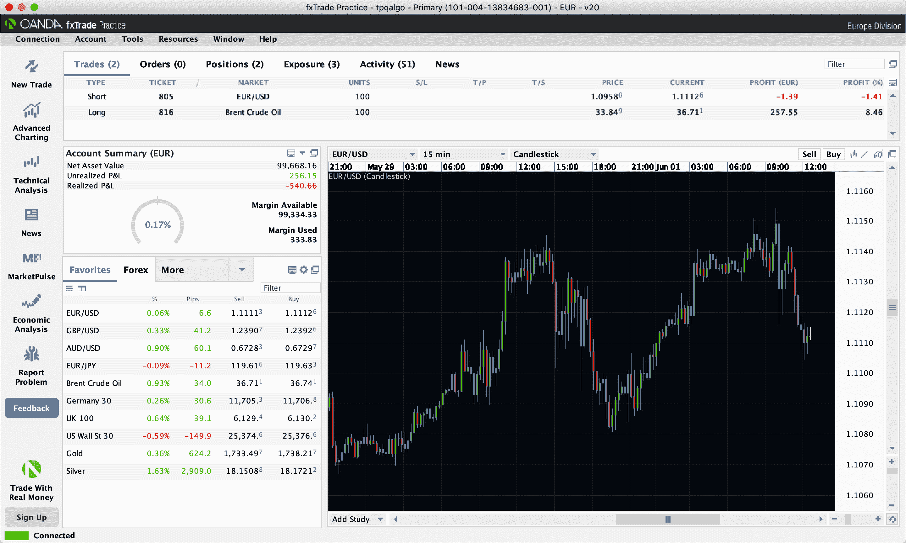
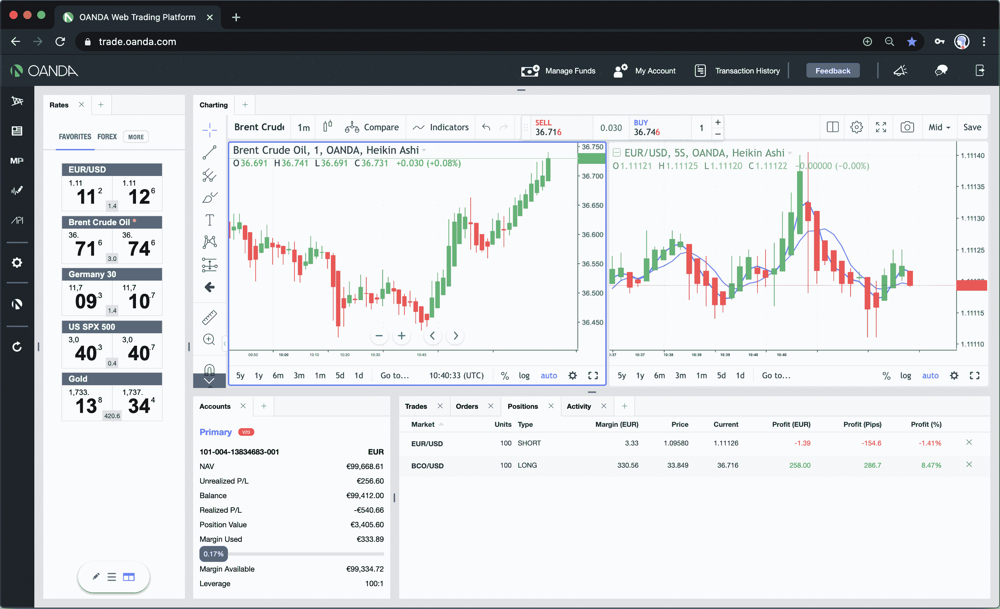
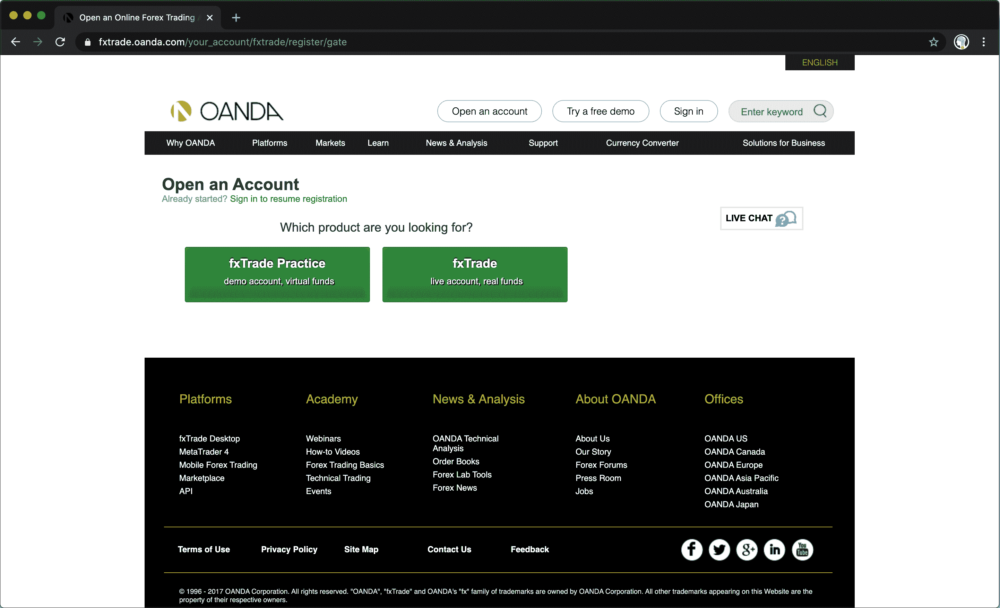
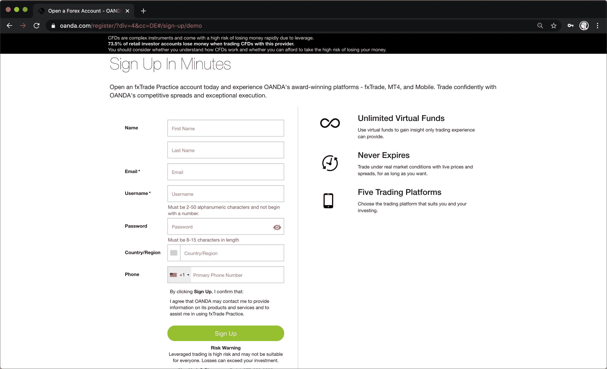
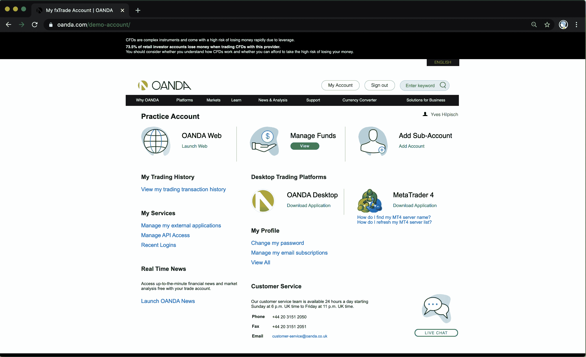
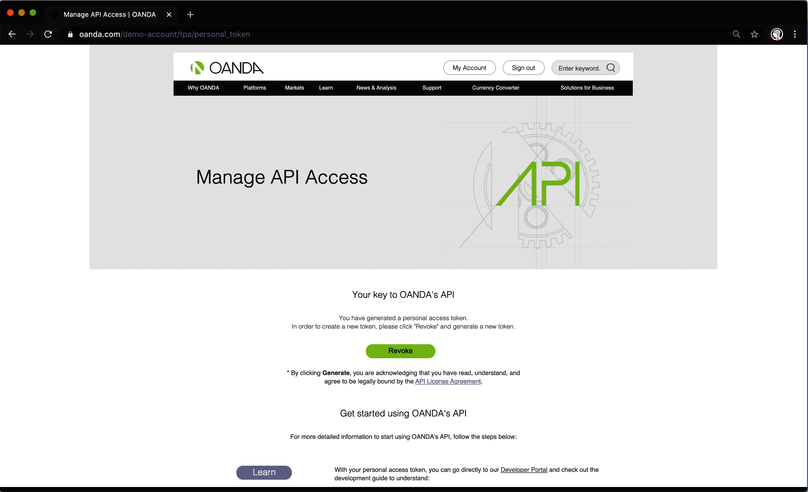
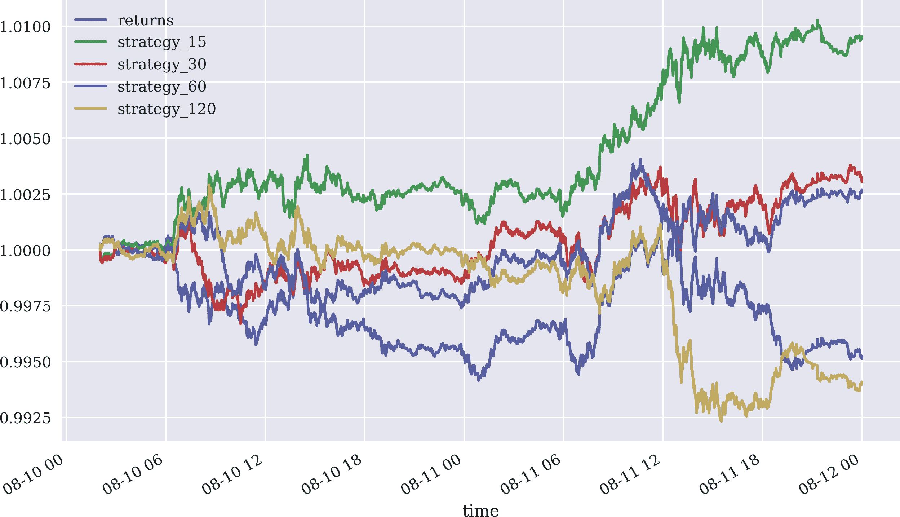
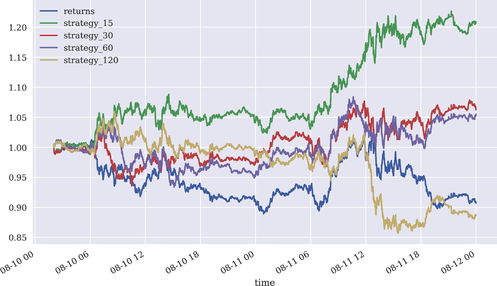

# 第八章。使用 Oanda 进行 CFD 交易

> 今天，即使是交易复杂工具或获得足够杠杆的小实体也可能威胁全球金融系统。
> 
> 保罗·辛格

今天，开始在金融市场进行交易比以往任何时候都更容易。有大量在线交易平台（经纪商）可供算法交易者选择。选择平台可能受多种因素影响：

工具

第一个想到的标准是所感兴趣的交易工具类型。例如，一个人可能有兴趣交易股票、交易所交易基金（ETFs）、债券、货币、大宗商品、期权或期货。

策略

一些交易者对仅限多头策略感兴趣，而其他人则需要做空。一些人专注于单一工具策略，而其他人则专注于同时涉及多种工具的策略。

成本

固定和变动交易成本对许多交易者来说是一个重要因素。它们甚至可能决定某种策略是否盈利（例如，参见第四章和第六章）。

技术

技术已经成为选择交易平台的重要因素。首先是平台为交易者提供的工具。通常，交易工具可用于桌面/笔记本电脑、平板电脑和智能手机。其次是交易者可以以编程方式访问的应用程序编程接口（APIs）。

管辖权

金融交易是一个受严格监管的领域，不同国家或地区有不同的法律框架。这可能会根据其居住地禁止某些交易者使用某些平台和/或金融工具。

本章重点介绍[Oanda](http://oanda.com)，这是一个在线交易平台，非常适合部署自动化、算法交易策略，即使是零售交易者也能轻松应用。以下是对 Oanda 的简要描述，根据之前概述的标准：

工具

Oanda 提供各种所谓的*差价合约*（CFD）产品（参见“差价合约 (CFDs)”和“免责声明”）。CFD 的主要特点是可以使用杠杆（例如 10:1 或 50:1），并且交易保证金化，因此亏损可能超过初始资本。

策略

Oanda 允许同时买入和卖出 CFD。提供不同类型的订单，如市价或限价订单，带有或不带有利润目标和/或（追踪）止损。

成本

在 Oanda 交易 CFD 时，没有固定的交易成本。然而，存在买卖价差，导致交易 CFD 时的变动交易成本。

技术

Oanda 提供了交易应用程序 fxTrade（Practice），可以实时检索数据并允许（手动、自主）交易所有工具（见 图 8-1）。此外，还提供了基于浏览器的交易应用程序（见 图 8-2）。该平台的主要优势在于其 RESTful 和流式 API（参见 [Oanda v20 API](https://oreil.ly/_AHHI)），通过这些 API，交易员可以编程访问历史数据和实时数据，下买卖订单或检索账户信息。还提供了一个 Python 封装包（见 [v20 on PyPi](https://oreil.ly/iZuuV)）。Oanda 提供了免费的模拟交易账户，可以完全使用所有技术功能，这在平台入门时非常有帮助。这也简化了从模拟交易到真实交易的过渡。

司法管辖区

根据账户持有人的居住地，可以交易的 CFD 选择会有所不同。例如，与外汇相关的 CFD 在 Oanda 活跃的地方基本上都可以交易。而例如股指的 CFD，在某些司法管辖区可能不可用。



###### 图 8-1\. Oanda 交易应用 fxTrade Practice



###### 图 8-2\. Oanda 基于浏览器的交易应用程序

本章内容安排如下。“设置账户” 简要介绍了如何设置账户。“Oanda API” 说明了访问 API 的必要步骤。基于 API 访问，“检索历史数据” 获取并处理特定 CFD 的历史数据。“处理流数据” 介绍了 Oanda 的流式 API，用于数据检索和可视化。“实时实施交易策略” 实现了实时自动化算法交易策略。最后，“检索账户信息” 处理有关账户本身的数据，例如当前余额或最近的交易。整个过程中，代码使用了名为 `tpqoa` 的 Python 封装类（见 [GitHub 仓库](https://oreil.ly/E95UV)）。

本章的目标是利用前几章介绍的方法和技术，自动在 Oanda 平台上进行交易。

# 设置账户

使用 Oanda 注册账户的过程简单而高效。你可以选择实盘账户或免费的模拟（“练习”）账户，后者完全足以实施后续内容（见图 8-3 和 8-4）。



###### 图 8-3\. Oanda 账户注册（账户类型）

如果注册成功并且在平台上登录到帐户，您应该会看到一个起始页面，如图 8-5 所示。在中间，您会找到一个下载链接，用于安装`fxTrade Practice for Desktop`应用程序。一旦运行起来，它看起来类似于图 8-1 中显示的屏幕截图。



###### 图 8-4\. Oanda 帐户注册（注册表单）



###### 图 8-5\. Oanda 帐户起始页面

# Oanda API

注册后，轻松获取 Oanda 的 API 访问权限。所需的主要要素是帐号和访问令牌（API 密钥）。例如，您可以在“管理资金”区域找到帐号号码。访问令牌可以在“管理 API 访问”区域生成（见图 8-6）。^(1)

从现在开始，使用[`configparser`](https://oreil.ly/UaQyo)模块来管理帐户凭证。该模块期望一个文本文件——例如命名为*pyalgo.cfg*——的以下格式，以便与 Oanda 实践帐户一起使用：

```py
[oanda]
account_id = YOUR_ACCOUNT_ID
access_token = YOUR_ACCESS_TOKEN
account_type = practice
```



###### 图 8-6\. Oanda API 访问管理页面

要通过 Python 访问 API，建议使用 Python 封装包`tpqoa`（参见[GitHub 代码库](http://github.com/yhilpisch/tpqoa)），它依赖于 Oanda 的`v20`包（参见[GitHub 代码库](https://oreil.ly/F_cB2)）。

安装它的命令如下：

```py
pip install git+https://github.com/yhilpisch/tpqoa.git
```

有了这些先决条件，您可以通过一行代码连接到 API：

```py
In [1]: import tpqoa

In [2]: api = tpqoa.tpqoa('../pyalgo.cfg')  
```


如有需要，请调整路径和文件名。

这是一个重要的里程碑：连接到 Oanda API 允许检索历史数据、程序化下单等功能。

使用`configparser`模块的好处在于它简化了帐户凭证的存储和管理。在算法交易中，所需的账户数量可能会迅速增加。例如，云实例或服务器、数据服务提供商、在线交易平台等。

缺点是帐户信息以纯文本形式存储，这代表着一个相当大的安全风险，特别是因为关于多个账户的信息存储在一个文件中。因此，在投入生产之前，您应该应用文件加密方法来确保凭证的安全性。

# 检索历史数据

使用 Oanda 平台的一个主要好处是，可以通过 RESTful API 访问所有 Oanda 工具的完整价格历史。在这个上下文中，*完整历史*指的是 CFD 本身的不同，而不是它们所定义的基础工具。

## 查找可交易的工具

要查看特定账户可交易的工具概览，请使用`.get_instruments()`方法。它仅检索 API 中的显示名称和技术工具名称。更多详细信息可以通过 API 获取，例如最小持仓大小：

```py
In [3]: api.get_instruments()[:15]
Out[3]: [('AUD/CAD', 'AUD_CAD'),
         ('AUD/CHF', 'AUD_CHF'),
         ('AUD/HKD', 'AUD_HKD'),
         ('AUD/JPY', 'AUD_JPY'),
         ('AUD/NZD', 'AUD_NZD'),
         ('AUD/SGD', 'AUD_SGD'),
         ('AUD/USD', 'AUD_USD'),
         ('Australia 200', 'AU200_AUD'),
         ('Brent Crude Oil', 'BCO_USD'),
         ('Bund', 'DE10YB_EUR'),
         ('CAD/CHF', 'CAD_CHF'),
         ('CAD/HKD', 'CAD_HKD'),
         ('CAD/JPY', 'CAD_JPY'),
         ('CAD/SGD', 'CAD_SGD'),
         ('CHF/HKD', 'CHF_HKD')]
```

## 在分钟 K 线上回测动量策略

以下示例使用基于 EUR/USD 货币对的工具`EUR_USD`。目标是在一分钟 K 线上回测*基于动量的策略*。使用的数据为 2020 年 5 月的两天。第一步是从 Oanda *检索原始数据*：

```py
In [4]: help(api.get_history)  
        Help on method get_history in module tpqoa.tpqoa:

        get_history(instrument, start, end, granularity, price, localize=True)
         method of tpqoa.tpqoa.tpqoa instance
            Retrieves historical data for instrument.

            Parameters
            ==========
            instrument: string
                valid instrument name
            start, end: datetime, str
                Python datetime or string objects for start and end
            granularity: string
                a string like 'S5', 'M1' or 'D'
            price: string
                one of 'A' (ask), 'B' (bid) or 'M' (middle)

            Returns
            =======
            data: pd.DataFrame
                pandas DataFrame object with data

In [5]: instrument = 'EUR_USD'  
        start = '2020-08-10'  
        end = '2020-08-12'  
        granularity = 'M1'  
        price = 'M'  

In [6]: data = api.get_history(instrument, start, end,
                              granularity, price)  

In [7]: data.info()  
        <class 'pandas.core.frame.DataFrame'>
        DatetimeIndex: 2814 entries, 2020-08-10 00:00:00 to 2020-08-11
         23:59:00
        Data columns (total 6 columns):
         #   Column    Non-Null Count  Dtype
        ---  ------    --------------  -----
         0   o         2814 non-null   float64
         1   h         2814 non-null   float64
         2   l         2814 non-null   float64
         3   c         2814 non-null   float64
         4   volume    2814 non-null   int64
         5   complete  2814 non-null   bool
        dtypes: bool(1), float64(4), int64(1)
        memory usage: 134.7 KB

In [8]: data[['c', 'volume']].head()  
Out[8]:                            c  volume
        time
        2020-08-10 00:00:00  1.17822      18
        2020-08-10 00:01:00  1.17836      32
        2020-08-10 00:02:00  1.17828      25
        2020-08-10 00:03:00  1.17834      13
        2020-08-10 00:04:00  1.17847      43
```


显示`.get_history()`方法的文档字符串（帮助文本）。


定义参数值。


从 API 中检索原始数据。


显示检索到的数据集的元信息。


显示两列的前五行数据。

第二步是*实施向量化回测*。其想法是同时回测几种动量策略。代码简单而简洁（另见第四章）。

为简单起见，以下代码仅使用中间价格的收盘（`c`）值：^(2)

```py
In [9]: import numpy as np

In [10]: data['returns'] = np.log(data['c'] / data['c'].shift(1))  

In [11]: cols = []  

In [12]: for momentum in [15, 30, 60, 120]:  
             col = 'position_{}'.format(momentum)  
             data[col] = np.sign(data['returns'].rolling(momentum).mean())  
             cols.append(col)  
```


基于中间价格的`close`值计算对数收益。


实例化一个空`list`对象来收集列名。


定义动量策略的分钟 K 线时间间隔。


定义要在`DataFrame`对象中存储的列名。


将策略定位添加为新列。


向`list`对象附加列名。

最后一步是*推导和绘制不同动量策略的绝对表现*。图图 8-7 以图形方式显示了基于动量的策略的表现，并将其与基础工具的表现进行比较：

```py
In [13]: from pylab import plt
         plt.style.use('seaborn')
         import matplotlib as mpl
         mpl.rcParams['savefig.dpi'] = 300
         mpl.rcParams['font.family'] = 'serif'

In [14]: strats = ['returns']  

In [15]: for col in cols:  
             strat = 'strategy_{}'.format(col.split('_')[1])  
             data[strat] = data[col].shift(1) * data['returns']  
             strats.append(strat)  

In [16]: data[strats].dropna().cumsum(
             ).apply(np.exp).plot(figsize=(10, 6));  
```


定义另一个`list`对象以存储稍后绘制的列名。


遍历具有不同策略定位的列。


推导策略表现存储的新列名称。


为不同策略计算对数收益并将其存储为新列。


将列名附加到`list`对象，以备后续绘图使用。


绘制工具和策略的累积表现。



###### 图 8-7 显示了`EUR_USD`工具（分钟柱）不同动量策略的总体表现。

## 考虑杠杆和保证金因素

一般而言，当你购买一支股票，例如 100 美元时，盈亏（P&L）计算非常直观：如果股票价格上涨 1 美元，你赚取 1 美元（未实现盈利）；如果股票价格下跌 1 美元，你亏损 1 美元（未实现损失）。如果你购买了 10 股，只需将结果乘以 10。

在 Oanda 平台上交易差价合约（CFD）涉及杠杆和保证金，这对 P&L 计算有显著影响。有关此主题的介绍和概述，请参阅[Oanda fxTrade Margin Rules](https://oreil.ly/8I5Eg)。一个简单的例子可以在这个背景下阐明主要方面。

假设一位以欧元为基础的算法交易员希望在 Oanda 平台上交易`EUR_USD`工具，并且希望以 1.1 的卖出价格获得 10,000 欧元的多头敞口。如果没有杠杆和保证金，交易员（或 Python 程序）将购买 10,000 单位的 CFD。^(3)如果工具（汇率）价格上涨至 1.105（作为买卖价格间的中间率），绝对利润为 10,000 x 0.005 = 50 或 0.5%。

杠杆和保证金会带来什么影响？假设算法交易员选择 20:1 的杠杆比率，这意味着 5%的保证金（= 100% / 20）。这意味着交易员只需提前支付 10,000 欧元 x 5% = 500 欧元的保证金，即可获得相同的敞口。如果随后工具价格上涨至 1.105，绝对利润保持在 50 欧元不变，但相对利润却提高到 50 欧元 / 500 欧元 = 10%。收益因杠杆而显著放大，这是当事情如期望般进行时的好处。

如果情况变糟，会发生什么？假设工具价格跌至 1.08（作为买卖价格间的中间率），导致损失为 10,000 x (1.08 - 1.1) = -200 欧元。现在的相对损失为-200 欧元 / 500 欧元 = -40%。如果算法交易员所用账户的权益/现金少于 200 欧元，那么由于无法满足（监管）保证金要求，必须平仓。如果损失完全吞噬了保证金，需要额外的资金作为保证金来维持交易的持续。

图 8-8 展示了杠杆比率为 20:1 时动量策略对绩效的放大效应。5%的初始保证金足以覆盖潜在的损失，即使在最坏的情况下也未被耗尽：

```py
In [17]: data[strats].dropna().cumsum().apply(
                     lambda x: x * 20).apply(np.exp).plot(figsize=(10, 6));  
```


根据假设的杠杆比率，将对数收益率乘以 20 的因子。

杠杆交易不仅放大了潜在的利润，也放大了潜在的损失。基于 10:1 的杠杆交易（10% 保证金），基础工具的 10% 不利变动已经会清空整个保证金。换句话说，10% 的变动导致 100% 的损失。因此，您应该确保充分理解杠杆交易涉及的所有风险。您还应该确保采取适当的风险措施，例如符合您风险偏好和风险配置的止损订单。



###### 图 8-8\. `EUR_USD` 工具动量策略的总体表现，使用 20:1 杠杆（分钟柱状图）

# 处理流数据

使用 Python 封装包 `tpqoa` 再次简化和直接处理流数据。该包与 `v20` 包结合使用，处理套接字通信，使算法交易员只需决定如何处理流数据：

```py
In [18]: instrument = 'EUR_USD'

In [19]: api.stream_data(instrument, stop=10)  
         2020-08-19T14:39:13.560138152Z 1.19131 1.1915
         2020-08-19T14:39:14.088511060Z 1.19134 1.19152
         2020-08-19T14:39:14.390081879Z 1.19124 1.19145
         2020-08-19T14:39:15.105974700Z 1.19129 1.19144
         2020-08-19T14:39:15.375370451Z 1.19128 1.19144
         2020-08-19T14:39:15.501380756Z 1.1912 1.19141
         2020-08-19T14:39:15.951793928Z 1.1912 1.19138
         2020-08-19T14:39:16.354844135Z 1.19123 1.19138
         2020-08-19T14:39:16.661440356Z 1.19118 1.19133
         2020-08-19T14:39:16.912150908Z 1.19112 1.19132
```


`stop` 参数在检索到一定数量的 ticks 后停止流式传输。

# 下达市场订单

同样，使用 `create_order()` 方法可以简单地下市场买入或卖出订单：

```py
In [20]: help(api.create_order)  
         Help on method create_order in module tpqoa.tpqoa:

         create_order(instrument, units, price=None, sl_distance=None,
          tsl_distance=None, tp_price=None, comment=None, touch=False,
          suppress=False, ret=False) method of tpqoa.tpqoa.tpqoa instance
             Places order with Oanda.

             Parameters
             ==========
             instrument: string
                 valid instrument name
             units: int
                 number of units of instrument to be bought
                 (positive int, e.g., 'units=50')
                 or to be sold (negative int, e.g., 'units=-100')
             price: float
                 limit order price, touch order price
             sl_distance: float
                 stop loss distance price, mandatory e.g., in Germany
             tsl_distance: float
                 trailing stop loss distance
             tp_price: float
                 take profit price to be used for the trade
             comment: str
                 string
             touch: boolean
                 market_if_touched order (requires price to be set)
             suppress: boolean
                 whether to suppress print out
             ret: boolean
                 whether to return the order object

In [21]: api.create_order(instrument, 1000)  

         {'id': '1721', 'time': '2020-08-19T14:39:17.062399275Z', 'userID':
          13834683, 'accountID': '101-004-13834683-001', 'batchID': '1720',
          'requestID': '24716258589170956', 'type': 'ORDER_FILL', 'orderID':
          '1720', 'instrument': 'EUR_USD', 'units': '1000.0',
          'gainQuoteHomeConversionFactor': '0.835288642787',
          'lossQuoteHomeConversionFactor': '0.843683503518', 'price': 1.19131,
          'fullVWAP': 1.19131, 'fullPrice': {'type': 'PRICE', 'bids': [{'price':
          1.1911, 'liquidity': '10000000'}], 'asks': [{'price': 1.19131,
          'liquidity': '10000000'}], 'closeoutBid': 1.1911, 'closeoutAsk':
          1.19131}, 'reason': 'MARKET_ORDER', 'pl': '0.0', 'financing': '0.0',
          'commission': '0.0', 'guaranteedExecutionFee': '0.0',
          'accountBalance': '98510.7986', 'tradeOpened': {'tradeID': '1721',
          'units': '1000.0', 'price': 1.19131, 'guaranteedExecutionFee': '0.0',
          'halfSpreadCost': '0.0881', 'initialMarginRequired': '33.3'},
          'halfSpreadCost': '0.0881'}

In [22]: api.create_order(instrument, -1500)  

         {'id': '1723', 'time': '2020-08-19T14:39:17.200434462Z', 'userID':
          13834683, 'accountID': '101-004-13834683-001', 'batchID': '1722',
          'requestID': '24716258589171315', 'type': 'ORDER_FILL', 'orderID':
          '1722', 'instrument': 'EUR_USD', 'units': '-1500.0',
          'gainQuoteHomeConversionFactor': '0.835288642787',
          'lossQuoteHomeConversionFactor': '0.843683503518', 'price': 1.1911,
          'fullVWAP': 1.1911, 'fullPrice': {'type': 'PRICE', 'bids': [{'price':
          1.1911, 'liquidity': '10000000'}], 'asks': [{'price': 1.19131,
          'liquidity': '9999000'}], 'closeoutBid': 1.1911, 'closeoutAsk':
          1.19131}, 'reason': 'MARKET_ORDER', 'pl': '-0.1772', 'financing':
          '0.0', 'commission': '0.0', 'guaranteedExecutionFee': '0.0',
          'accountBalance': '98510.6214', 'tradeOpened': {'tradeID': '1723',
          'units': '-500.0', 'price': 1.1911, 'guaranteedExecutionFee': '0.0',
          'halfSpreadCost': '0.0441', 'initialMarginRequired': '16.65'},
          'tradesClosed': [{'tradeID': '1721', 'units': '-1000.0', 'price':
          1.1911, 'realizedPL': '-0.1772', 'financing': '0.0',
          'guaranteedExecutionFee': '0.0', 'halfSpreadCost': '0.0881'}],
          'halfSpreadCost': '0.1322'}

In [23]: api.create_order(instrument, 500)  

         {'id': '1725', 'time': '2020-08-19T14:39:17.348231507Z', 'userID':
          13834683, 'accountID': '101-004-13834683-001', 'batchID': '1724',
          'requestID': '24716258589171775', 'type': 'ORDER_FILL', 'orderID':
          '1724', 'instrument': 'EUR_USD', 'units': '500.0',
          'gainQuoteHomeConversionFactor': '0.835313189428',
          'lossQuoteHomeConversionFactor': '0.84370829686', 'price': 1.1913,
          'fullVWAP': 1.1913, 'fullPrice': {'type': 'PRICE', 'bids': [{'price':
          1.19104, 'liquidity': '9998500'}], 'asks': [{'price': 1.1913,
          'liquidity': '9999000'}], 'closeoutBid': 1.19104, 'closeoutAsk':
          1.1913}, 'reason': 'MARKET_ORDER', 'pl': '-0.0844', 'financing':
          '0.0', 'commission': '0.0', 'guaranteedExecutionFee': '0.0',
          'accountBalance': '98510.537', 'tradesClosed': [{'tradeID': '1723',
          'units': '500.0', 'price': 1.1913, 'realizedPL': '-0.0844',
          'financing': '0.0', 'guaranteedExecutionFee': '0.0', 'halfSpreadCost':
          '0.0546'}], 'halfSpreadCost': '0.0546'}
```


显示了下市场、限价和市场如果触及订单的所有选项。


通过市场订单开设多头头寸。


在通过市场订单平仓多头头寸后进行空头操作。


通过市场订单平仓空头头寸。

虽然 Oanda API 允许下达不同类型的订单，但本章和接下来的章节主要关注*市场订单*，以便在出现新信号时立即开多或开空。

# 实时实现交易策略

本节介绍了一个自定义类，根据动量策略在 Oanda 平台上自动交易 `EUR_USD` 工具。它被称为 `MomentumTrader`，在 “Python Script” 中展示。以下逐行讲解该类，从 `–0—` 方法开始。该类本身继承自 `tpqoa` 类：

```py
import tpqoa
import numpy as np
import pandas as pd

class MomentumTrader(tpqoa.tpqoa):
    def __init__(self, conf_file, instrument, bar_length, momentum, units,
                 *args, **kwargs):
        super(MomentumTrader, self).__init__(conf_file)
        self.position = 0  
        self.instrument = instrument  
        self.momentum = momentum  
        self.bar_length = bar_length  
        self.units = units  
        self.raw_data = pd.DataFrame()  
        self.min_length = self.momentum + 1  
```


初始位置值（市场中性）。


要交易的工具。


重新采样 tick 数据的条的长度。


动量计算的区间数。


要交易的单位数。


一个空的 `DataFrame` 对象，将用 tick 数据填充。


开始交易本身的初始最小 bar 长度。

主要方法是 `.on_success()` 方法，用于实现动量策略的交易逻辑：

```py
    def on_success(self, time, bid, ask):  
        ''' Takes actions when new tick data arrives. '''
        print(self.ticks, end=' ')  
        self.raw_data = self.raw_data.append(pd.DataFrame(
            {'bid': bid, 'ask': ask}, index=[pd.Timestamp(time)]))  
        self.data = self.raw_data.resample(
            self.bar_length, label='right').last().ffill().iloc[:-1]  
        self.data['mid'] = self.data.mean(axis=1)  
        self.data['returns'] = np.log(self.data['mid'] /
                                      self.data['mid'].shift(1))  
        self.data['position'] = np.sign(
            self.data['returns'].rolling(self.momentum).mean())  

        if len(self.data) > self.min_length:  
            self.min_length += 1  
            if self.data['position'].iloc[-1] == 1:  
                if self.position == 0:  
                    self.create_order(self.instrument, self.units)  
                elif self.position == -1:  
                    self.create_order(self.instrument, self.units * 2)  
                self.position = 1  
            elif self.data['position'].iloc[-1] == -1:  
                if self.position == 0:  
                    self.create_order(self.instrument, -self.units)  
                elif self.position == 1:  
                    self.create_order(self.instrument, -self.units * 2)  
                self.position = -1  
```


当新的 tick 数据到达时调用此方法。


打印检索到的 ticks 数量。


收集并存储 tick 数据。


然后将 tick 数据重新采样为适当的 bar 长度。


计算中间价格…


…基于此推导对数收益率。


基于 `momentum` 参数/属性（通过在线算法）推导信号（定位）。


当有足够或新数据时，应用交易逻辑并每次增加最小长度一次。


检查最新定位（“信号”）是否为 `1`（多头）。


如果当前市场位置为 `0`（中性）…


…以 `self.units` 进行买入订单。


如果是 `-1`（空头）…


…以 `–0—` 进行买入订单。


市场位置 `self.position` 设置为 `+1`（多头）。


检查最新定位（“信号”）是否为 `-1`（空头）。


如果当前市场位置为 `0`（中性）…


…以 `-self.units` 进行卖出订单。


如果是 `+1`（多头）…


…以 `–0—` 进行卖出订单。


市场位置 `self.position` 设置为 -1（空头）。

根据这个类，开始自动化算法交易仅需四行代码。随后的 Python 代码启动了一个自动化交易会话：

```py
In [24]: import MomentumTrader as MT

In [25]: mt = MT.MomentumTrader('../pyalgo.cfg',  
                                instrument=instrument,  
                                bar_length='10s',  
                                momentum=6,  
                                units=10000)  

In [26]: mt.stream_data(mt.instrument, stop=500)  
```


使用凭据的配置文件。


指定 `instrument` 参数。


为重新采样提供的 `bar_length` 参数。


已定义`momentum`参数，应用于重新采样的数据间隔。


`units`参数已设置，指定了多头和空头仓位的位置大小。


这将启动流式处理和交易；在 100 个点之后停止。

前述代码提供以下输出：

```py
1 2 3 4 5 6 7 8 9 10 11 12 13 14 15 16 17 18 19 20 21 22 23 24 25 26 27
 28 29 30 31 32 33 34 35 36 37 38 39 40 41 42 43 44 45 46 47 48 49 50
 51 52 53 54 55 56 57 58 59 60 61 62 63 64 65 66 67 68 69 70 71 72 73
 74 75 76 77 78 79 80 81 82 83 84 85 86 87 88 89 90 91 92 93 94 95 96
 97 98 99 100 101 102 103 104 105 106 107 108 109 110 111 112 113 114
 115 116 117 118 119 120 121 122 123 124 125 126 127 128 129 130 131
 132 133 134 135 136 137 138 139 140 141 142 143 144 145 146 147 148
 149 150 151 152 153

{'id': '1727', 'time': '2020-08-19T14:40:30.443867492Z', 'userID':
 13834683, 'accountID': '101-004-13834683-001', 'batchID': '1726',
 'requestID': '42730657405829101', 'type': 'ORDER_FILL', 'orderID':
 '1726', 'instrument': 'EUR_USD', 'units': '10000.0',
 'gainQuoteHomeConversionFactor': '0.8350012403',
 'lossQuoteHomeConversionFactor': '0.843393212565', 'price': 1.19168,
 'fullVWAP': 1.19168, 'fullPrice': {'type': 'PRICE', 'bids': [{'price':
 1.19155, 'liquidity': '10000000'}], 'asks': [{'price': 1.19168,
 'liquidity': '10000000'}], 'closeoutBid': 1.19155, 'closeoutAsk':
 1.19168}, 'reason': 'MARKET_ORDER', 'pl': '0.0', 'financing': '0.0',
 'commission': '0.0', 'guaranteedExecutionFee': '0.0',
 'accountBalance': '98510.537', 'tradeOpened': {'tradeID': '1727',
 'units': '10000.0', 'price': 1.19168, 'guaranteedExecutionFee': '0.0',
 'halfSpreadCost': '0.5455', 'initialMarginRequired': '333.0'},
 'halfSpreadCost': '0.5455'}

154 155 156 157 158 159 160 161 162 163 164 165 166 167 168 169 170 171
 172 173 174 175 176 177 178 179 180 181 182 183 184 185 186 187 188
 189 190 191 192 193 194 195 196 197 198 199 200 201 202 203 204 205
 206 207 208 209 210 211 212 213 214 215 216 217 218 219 220 221 222
 223

{'id': '1729', 'time': '2020-08-19T14:41:11.436438078Z', 'userID':
 13834683, 'accountID': '101-004-13834683-001', 'batchID': '1728',
 'requestID': '42730657577912600', 'type': 'ORDER_FILL', 'orderID':
 '1728', 'instrument': 'EUR_USD', 'units': '-20000.0',
 'gainQuoteHomeConversionFactor': '0.83519398913',
 'lossQuoteHomeConversionFactor': '0.843587898569', 'price': 1.19124,
 'fullVWAP': 1.19124, 'fullPrice': {'type': 'PRICE', 'bids': [{'price':
 1.19124, 'liquidity': '10000000'}], 'asks': [{'price': 1.19144,
 'liquidity': '10000000'}], 'closeoutBid': 1.19124, 'closeoutAsk':
 1.19144}, 'reason': 'MARKET_ORDER', 'pl': '-3.7118', 'financing':
 '0.0', 'commission': '0.0', 'guaranteedExecutionFee': '0.0',
 'accountBalance': '98506.8252', 'tradeOpened': {'tradeID': '1729',
 'units': '-10000.0', 'price': 1.19124, 'guaranteedExecutionFee':
 '0.0', 'halfSpreadCost': '0.8394', 'initialMarginRequired': '333.0'},
 'tradesClosed': [{'tradeID': '1727', 'units': '-10000.0', 'price':
 1.19124, 'realizedPL': '-3.7118', 'financing': '0.0',
 'guaranteedExecutionFee': '0.0', 'halfSpreadCost': '0.8394'}],
 'halfSpreadCost': '1.6788'}

224 225 226 227 228 229 230 231 232 233 234 235 236 237 238 239 240 241
 242 243 244 245 246 247 248 249 250 251 252 253 254 255 256 257 258
 259 260 261 262 263 264 265 266 267 268 269 270 271 272 273 274 275
 276 277 278 279 280 281 282 283 284 285 286 287 288 289 290 291 292
 293 294 295 296 297 298 299 300 301 302 303 304 305 306 307 308 309
 310 311 312 313 314 315 316 317 318 319 320 321 322 323 324 325 326
 327 328 329 330 331 332 333 334 335 336 337 338 339 340 341 342 343
 344 345 346 347 348 349 350 351 352 353 354 355 356 357 358 359 360
 361 362 363 364 365 366 367 368 369 370 371 372 373 374 375 376 377
 378 379 380 381 382 383 384 385 386 387 388 389 390 391 392 393 394

{'id': '1731', 'time': '2020-08-19T14:42:20.525804142Z', 'userID':
 13834683, 'accountID': '101-004-13834683-001', 'batchID': '1730',
 'requestID': '42730657867512554', 'type': 'ORDER_FILL', 'orderID':
 '1730', 'instrument': 'EUR_USD', 'units': '20000.0',
 'gainQuoteHomeConversionFactor': '0.835400847964',
 'lossQuoteHomeConversionFactor': '0.843796836386', 'price': 1.19111,
 'fullVWAP': 1.19111, 'fullPrice': {'type': 'PRICE', 'bids': [{'price':
 1.19098, 'liquidity': '10000000'}], 'asks': [{'price': 1.19111,
 'liquidity': '10000000'}], 'closeoutBid': 1.19098, 'closeoutAsk':
 1.19111}, 'reason': 'MARKET_ORDER', 'pl': '1.086', 'financing': '0.0',
 'commission': '0.0', 'guaranteedExecutionFee': '0.0',
 'accountBalance': '98507.9112', 'tradeOpened': {'tradeID': '1731',
 'units': '10000.0', 'price': 1.19111, 'guaranteedExecutionFee': '0.0',
 'halfSpreadCost': '0.5457', 'initialMarginRequired': '333.0'},
 'tradesClosed': [{'tradeID': '1729', 'units': '10000.0', 'price':
 1.19111, 'realizedPL': '1.086', 'financing': '0.0',
 'guaranteedExecutionFee': '0.0', 'halfSpreadCost': '0.5457'}],
 'halfSpreadCost': '1.0914'}

395 396 397 398 399 400 401 402 403 404 405 406 407 408 409 410 411 412
 413 414 415 416 417 418 419 420 421 422 423 424 425 426 427 428 429
 430 431 432 433 434 435 436 437 438 439 440 441 442 443 444 445 446
 447 448 449 450 451 452 453 454 455 456 457 458 459 460 461 462 463
 464 465 466 467 468 469 470 471 472 473 474 475 476 477 478 479 480
 481 482 483 484 485 486 487 488 489 490 491 492 493 494 495 496 497
 498 499 500
```

最后，关闭最后的持仓：

```py
In [27]: oo = mt.create_order(instrument, units=-mt.position * mt.units,
                              ret=True, suppress=True)  
         oo
Out[27]: {'id': '1733',
          'time': '2020-08-19T14:43:17.107985242Z',
          'userID': 13834683,
          'accountID': '101-004-13834683-001',
          'batchID': '1732',
          'requestID': '42730658106750652',
          'type': 'ORDER_FILL',
          'orderID': '1732',
          'instrument': 'EUR_USD',
          'units': '-10000.0',
          'gainQuoteHomeConversionFactor': '0.835327206922',
          'lossQuoteHomeConversionFactor': '0.843722455232',
          'price': 1.19109,
          'fullVWAP': 1.19109,
          'fullPrice': {'type': 'PRICE',
           'bids': [{'price': 1.19109, 'liquidity': '10000000'}],
           'asks': [{'price': 1.19121, 'liquidity': '10000000'}],
           'closeoutBid': 1.19109,
           'closeoutAsk': 1.19121},
          'reason': 'MARKET_ORDER',
          'pl': '-0.1687',
          'financing': '0.0',
          'commission': '0.0',
          'guaranteedExecutionFee': '0.0',
          'accountBalance': '98507.7425',
          'tradesClosed': [{'tradeID': '1731',
            'units': '-10000.0',
            'price': 1.19109,
            'realizedPL': '-0.1687',
            'financing': '0.0',
            'guaranteedExecutionFee': '0.0',
            'halfSpreadCost': '0.5037'}],
          'halfSpreadCost': '0.5037'}
```


结束最后的持仓。

# 检索账户信息

关于账户信息、交易历史等方面，Oanda 的 RESTful API 也很方便。例如，在前一节执行动量策略后，算法交易员可能想要查看交易账户的当前余额。这可以通过`.get_account_summary()`方法实现：

```py
In [28]: api.get_account_summary()
Out[28]: {'id': '101-004-13834683-001',
          'alias': 'Primary',
          'currency': 'EUR',
          'balance': '98507.7425',
          'createdByUserID': 13834683,
          'createdTime': '2020-03-19T06:08:14.363139403Z',
          'guaranteedStopLossOrderMode': 'DISABLED',
          'pl': '-1273.126',
          'resettablePL': '-1273.126',
          'resettablePLTime': '0',
          'financing': '-219.1315',
          'commission': '0.0',
          'guaranteedExecutionFees': '0.0',
          'marginRate': '0.0333',
          'openTradeCount': 1,
          'openPositionCount': 1,
          'pendingOrderCount': 0,
          'hedgingEnabled': False,
          'unrealizedPL': '929.8862',
          'NAV': '99437.6287',
          'marginUsed': '377.76',
          'marginAvailable': '99064.4945',
          'positionValue': '3777.6',
          'marginCloseoutUnrealizedPL': '935.8183',
          'marginCloseoutNAV': '99443.5608',
          'marginCloseoutMarginUsed': '377.76',
          'marginCloseoutPercent': '0.0019',
          'marginCloseoutPositionValue': '3777.6',
          'withdrawalLimit': '98507.7425',
          'marginCallMarginUsed': '377.76',
          'marginCallPercent': '0.0038',
          'lastTransactionID': '1733'}
```

使用`.get_transactions()`方法接收关于最近几笔交易的信息：

```py
In [29]: api.get_transactions(tid=int(oo['id']) - 2)
Out[29]: [{'id': '1732',
           'time': '2020-08-19T14:43:17.107985242Z',
           'userID': 13834683,
           'accountID': '101-004-13834683-001',
           'batchID': '1732',
           'requestID': '42730658106750652',
           'type': 'MARKET_ORDER',
           'instrument': 'EUR_USD',
           'units': '-10000.0',
           'timeInForce': 'FOK',
           'positionFill': 'DEFAULT',
           'reason': 'CLIENT_ORDER'},
          {'id': '1733',
           'time': '2020-08-19T14:43:17.107985242Z',
           'userID': 13834683,
           'accountID': '101-004-13834683-001',
           'batchID': '1732',
           'requestID': '42730658106750652',
           'type': 'ORDER_FILL',
           'orderID': '1732',
           'instrument': 'EUR_USD',
           'units': '-10000.0',
           'gainQuoteHomeConversionFactor': '0.835327206922',
           'lossQuoteHomeConversionFactor': '0.843722455232',
           'price': 1.19109,
           'fullVWAP': 1.19109,
           'fullPrice': {'type': 'PRICE',
            'bids': [{'price': 1.19109, 'liquidity': '10000000'}],
            'asks': [{'price': 1.19121, 'liquidity': '10000000'}],
            'closeoutBid': 1.19109,
            'closeoutAsk': 1.19121},
           'reason': 'MARKET_ORDER',
           'pl': '-0.1687',
           'financing': '0.0',
           'commission': '0.0',
           'guaranteedExecutionFee': '0.0',
           'accountBalance': '98507.7425',
           'tradesClosed': [{'tradeID': '1731',
             'units': '-10000.0',
             'price': 1.19109,
             'realizedPL': '-0.1687',
             'financing': '0.0',
             'guaranteedExecutionFee': '0.0',
             'halfSpreadCost': '0.5037'}],
           'halfSpreadCost': '0.5037'}]
```

为了简明地概述，还有`.print_transactions()`方法可用：

```py
In [30]: api.print_transactions(tid=int(oo['id']) - 18)
         1717 | 2020-08-19T14:37:00.803426931Z | EUR_USD |   -10000.0 | 0.0
         1719 | 2020-08-19T14:38:21.953399006Z | EUR_USD |    10000.0 | 6.8444
         1721 | 2020-08-19T14:39:17.062399275Z | EUR_USD |     1000.0 | 0.0
         1723 | 2020-08-19T14:39:17.200434462Z | EUR_USD |    -1500.0 | -0.1772
         1725 | 2020-08-19T14:39:17.348231507Z | EUR_USD |      500.0 | -0.0844
         1727 | 2020-08-19T14:40:30.443867492Z | EUR_USD |    10000.0 | 0.0
         1729 | 2020-08-19T14:41:11.436438078Z | EUR_USD |   -20000.0 | -3.7118
         1731 | 2020-08-19T14:42:20.525804142Z | EUR_USD |    20000.0 | 1.086
         1733 | 2020-08-19T14:43:17.107985242Z | EUR_USD |   -10000.0 | -0.1687
```

# 结论

Oanda 平台允许轻松直接地进入自动化、算法交易的世界。Oanda 专注于所谓的差价合约（CFD）。根据交易者的居住国家，可以交易多种多样的工具。

从技术角度来看，Oanda 的一个主要优势是现代、强大的 API，可以通过专用的 Python 包（`v20`）轻松访问。本章介绍了如何设置账户，如何使用 Python 连接 API，如何检索历史数据（一分钟 K 线）进行回测，如何实时检索流式数据，如何基于动量策略自动交易 CFD，以及如何检索账户信息和详细的交易历史。

# 参考和进一步资源

访问 Oanda 的帮助和支持页面[帮助和支持](https://oreil.ly/-CMwk)以了解有关 Oanda 平台和 CFD 交易的重要方面的更多信息。

Oanda 的开发者门户[入门指南](https://oreil.ly/oO_eV)提供了 API 的详细描述。

# Python 脚本

以下 Python 脚本包含一个 Oanda 自定义流式处理类，可自动执行动量策略交易：

```py
#
# Python Script
# with Momentum Trading Class
# for Oanda v20
#
# Python for Algorithmic Trading
# (c) Dr. Yves J. Hilpisch
# The Python Quants GmbH
#
import tpqoa
import numpy as np
import pandas as pd

class MomentumTrader(tpqoa.tpqoa):
    def __init__(self, conf_file, instrument, bar_length, momentum, units,
                 *args, **kwargs):
        super(MomentumTrader, self).__init__(conf_file)
        self.position = 0
        self.instrument = instrument
        self.momentum = momentum
        self.bar_length = bar_length
        self.units = units
        self.raw_data = pd.DataFrame()
        self.min_length = self.momentum + 1

    def on_success(self, time, bid, ask):
        ''' Takes actions when new tick data arrives. '''
        print(self.ticks, end=' ')
        self.raw_data = self.raw_data.append(pd.DataFrame(
            {'bid': bid, 'ask': ask}, index=[pd.Timestamp(time)]))
        self.data = self.raw_data.resample(
            self.bar_length, label='right').last().ffill().iloc[:-1]
        self.data['mid'] = self.data.mean(axis=1)
        self.data['returns'] = np.log(self.data['mid'] /
                                      self.data['mid'].shift(1))
        self.data['position'] = np.sign(
            self.data['returns'].rolling(self.momentum).mean())

        if len(self.data) > self.min_length:
            self.min_length += 1
            if self.data['position'].iloc[-1] == 1:
                if self.position == 0:
                    self.create_order(self.instrument, self.units)
                elif self.position == -1:
                    self.create_order(self.instrument, self.units * 2)
                self.position = 1
            elif self.data['position'].iloc[-1] == -1:
                if self.position == 0:
                    self.create_order(self.instrument, -self.units)
                elif self.position == 1:
                    self.create_order(self.instrument, -self.units * 2)
                self.position = -1

if __name__ == '__main__':
    strat = 2
    if strat == 1:
        mom = MomentumTrader('../pyalgo.cfg', 'DE30_EUR', '5s', 3, 1)
        mom.stream_data(mom.instrument, stop=100)
        mom.create_order(mom.instrument, units=-mom.position * mom.units)
    elif strat == 2:
        mom = MomentumTrader('../pyalgo.cfg', instrument='EUR_USD',
                             bar_length='5s', momentum=6, units=100000)
        mom.stream_data(mom.instrument, stop=100)
        mom.create_order(mom.instrument, units=-mom.position * mom.units)
    else:
        print('Strategy not known.')
```

^(1) 在 Oanda API 的上下文中，某些对象的命名并不完全一致。例如，*API 密钥*和*访问令牌*可以互换使用。此外，*账户 ID*和*账户号码*指的是同一个数字。

^(2) 这隐含地忽略了卖出和买入工具单位时的交易成本，即买卖价差。

^(3) 请注意，对于某些工具，*一个单位*表示 1 美元，例如与货币相关的差价合约。对于其他工具，例如与指数相关的差价合约（例如，`DE30_EUR`），*一个单位*表示以差价合约的（买入/卖出）价格进行的货币敞口（例如，11,750 欧元）。

^(4) 简化的计算忽略了例如可能因杠杆交易而产生的*融资成本*。
