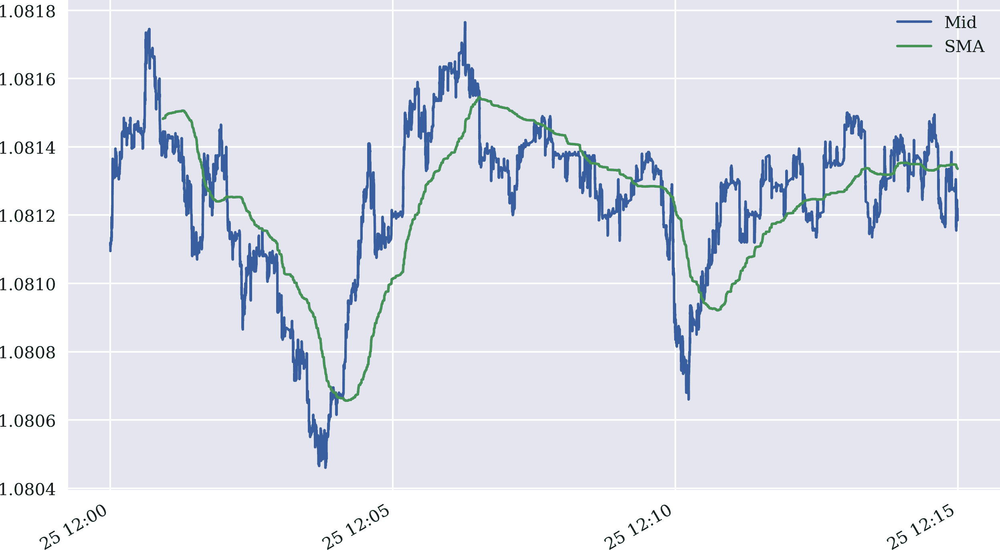
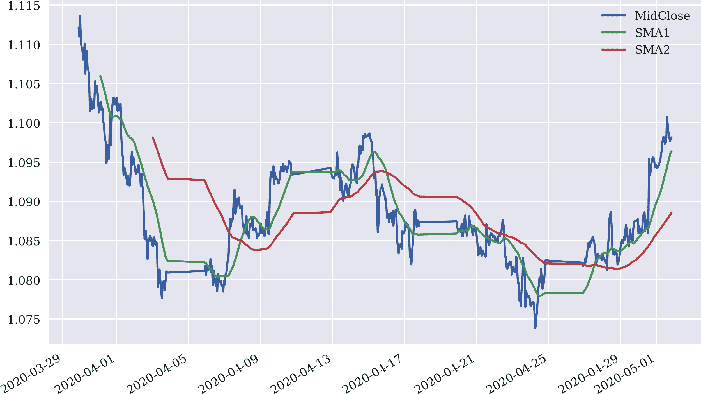
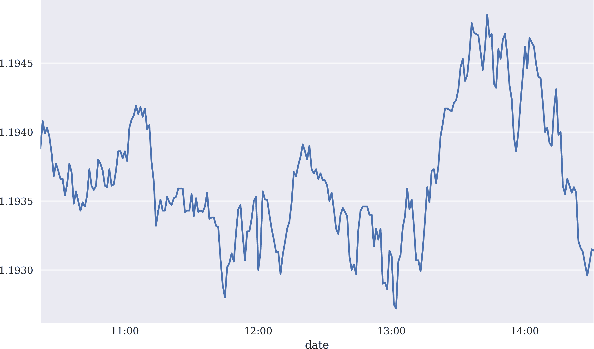

# 第九章。 使用 FXCM 进行外汇交易

> 金融机构喜欢称他们所做的事情为交易。让我们诚实一点。这不是交易；这是打赌。
> 
> Graydon Carter

本章介绍了 FXCM 集团的交易平台，其具有 RESTful 和流式应用程序编程接口（API）以及 Python 包`fcxmpy`。与 Oanda 类似，它非常适合部署自动化的算法交易策略，即使是资金较小的零售交易者。FXCM 为零售和机构交易者提供了许多金融产品，这些产品既可以通过传统交易应用程序进行交易，也可以通过他们的 API 以编程方式进行交易。产品的重点在于货币对以及差价合约（CFD），包括主要股票指数和商品。在这种情况下，还请参阅“差价合约（CFD）”和“免责声明”。

关于如第八章中讨论的平台标准，FXCM 提供以下内容：

工具

外汇产品（例如，货币对的交易），股票指数的差价合约（CFDs），商品或利率产品。

策略

FXCM 允许（以及其他事项）开设（有杠杆）多头和空头头寸，市场进入订单，止损订单和获利目标。

成本

除了买卖价差之外，通常还需支付固定费用来进行 FXCM 的每笔交易。有不同的定价模型可供选择。

技术

FXCM 为算法交易者提供了现代的 RESTful API，可以通过例如使用 Python 包`fxcmpy`来访问。也提供了桌面计算机，平板电脑和智能手机的标准交易应用程序。

司法管辖权

FXCM 在全球多个国家活跃（例如，英国或德国）。根据国家本身的情况，由于监管和限制，某些产品可能无法提供/提供。

本章介绍了 FXCM 交易 API 和实施自动化算法交易策略所需的`fxcmpy` Python 包的基本功能。它结构如下。“入门”展示了如何设置一切以使用 FXCM REST API 进行算法交易。“检索数据”展示了如何检索和处理金融数据（直至 tick 级别）。“使用 API”是核心，因为它说明了使用 RESTful API 实现的典型任务，例如检索历史和流数据，下订单或查找帐户信息。

# 入门

FXCM API 的详细文档可在[*https://oreil.ly/Df_7e*](https://oreil.ly/Df_7e)下找到。要安装 Python 包`fxcmpy`，请在 Shell 上执行以下操作：

```py
pip install fxcmpy
```

`fxcmpy`包的文档可在[*http://fxcmpy.tpq.io*](http://fxcmpy.tpq.io)下找到。

要开始使用 FXCM 交易 API 和 `fxcmpy` 包，FXCM 的免费演示账户就足够了。可以在 [FXCM 演示账户](https://oreil.ly/v9H6z) 下开设此类账户。¹ 接下来的步骤是在演示账户内创建一个唯一的 API 令牌（例如 `YOUR_FXCM_API_TOKEN`）。然后可以通过以下方式打开 API 连接：

```py
import fxcmpy
api = fxcmpy.fxcmpy(access_token=YOUR_FXCM_API_TOKEN, log_level='error')
```

或者，可以使用在 第八章 中创建的配置文件连接 API。此文件的内容应修改如下：

```py
[FXCM]
log_level = error
log_file = PATH_TO_AND_NAME_OF_LOG_FILE
access_token = YOUR_FXCM_API_TOKEN
```

然后可以通过以下方式连接到 API：

```py
import fxcmpy
api = fxcmpy.fxcmpy(config_file='pyalgo.cfg')
```

默认情况下，服务器连接到演示服务器。但是，通过使用 `server` 参数，可以将连接切换到实时交易服务器（如果有此类账户）：

```py
api = fxcmpy.fxcmpy(config_file='pyalgo.cfg', server='demo')  
api = fxcmpy.fxcmpy(config_file='pyalgo.cfg', server='real')  
```


连接到演示服务器。


连接到实时交易服务器。

# 检索数据

FXCM 提供访问历史市场价格数据集的方式，例如 ticks 数据，以预打包的方式提供。这意味着可以从 FXCM 服务器检索到压缩文件，其中包含 2020 年第 10 周的 EUR/USD 汇率的 ticks 数据。接下来的部分将解释如何从 API 检索历史蜡烛数据。

## 检索 Tick 数据

对于多个货币对，FXCM 提供历史 ticks 数据。`fxcmpy` 包使得检索和处理这类 ticks 数据变得方便。首先，导入一些库：

```py
In [1]: import time
        import numpy as np
        import pandas as pd
        import datetime as dt
        from pylab import mpl, plt
        plt.style.use('seaborn')
        mpl.rcParams['savefig.dpi'] = 300
        mpl.rcParams['font.family'] = 'serif'
```

其次，查看可用的 `symbols`（货币对），这些货币对具有 ticks 数据可用性：

```py
In [2]: from fxcmpy import fxcmpy_tick_data_reader as tdr

In [3]: print(tdr.get_available_symbols())
        ('AUDCAD', 'AUDCHF', 'AUDJPY', 'AUDNZD', 'CADCHF', 'EURAUD', 'EURCHF',
         'EURGBP', 'EURJPY', 'EURUSD', 'GBPCHF', 'GBPJPY', 'GBPNZD', 'GBPUSD',
         'GBPCHF', 'GBPJPY', 'GBPNZD', 'NZDCAD', 'NZDCHF', 'NZDJPY', 'NZDUSD',
         'USDCAD', 'USDCHF', 'USDJPY')
```

以下代码检索单个符号一周的 ticks 数据。生成的 pandas `DataFrame` 对象包含超过 4.5 百万行数据：

```py
In [4]: start = dt.datetime(2020, 3, 25)  
        stop = dt.datetime(2020, 3, 30)  

In [5]: td = tdr('EURUSD', start, stop)  

In [6]: td.get_raw_data().info()  
        <class 'pandas.core.frame.DataFrame'>
        Index: 4504288 entries, 03/22/2020 21:12:02.256 to 03/27/2020
         20:59:00.022
        Data columns (total 2 columns):
         #   Column  Dtype
        ---  ------  -----
         0   Bid     float64
         1   Ask     float64
        dtypes: float64(2)
        memory usage: 103.1+ MB

In [7]: td.get_data().info()  
        <class 'pandas.core.frame.DataFrame'>
        DatetimeIndex: 4504288 entries, 2020-03-22 21:12:02.256000 to
         2020-03-27 20:59:00.022000
        Data columns (total 2 columns):
         #   Column  Dtype
        ---  ------  -----
         0   Bid     float64
         1   Ask     float64
        dtypes: float64(2)
        memory usage: 103.1 MB

In [8]: td.get_data().head()
Out[8]:                              Bid      Ask
        2020-03-22 21:12:02.256  1.07006  1.07050
        2020-03-22 21:12:02.258  1.07002  1.07050
        2020-03-22 21:12:02.259  1.07003  1.07033
        2020-03-22 21:12:02.653  1.07003  1.07034
        2020-03-22 21:12:02.749  1.07000  1.07034
```


这会检索数据文件，解压缩并将原始数据存储在 `DataFrame` 对象中（作为结果对象的属性）。


`.get_raw_data()` 方法返回带有原始数据的 `DataFrame` 对象，其中索引值仍然是 `str` 对象。


`.get_data()` 方法返回一个 `DataFrame` 对象，其中的索引已转换为 `DatetimeIndex`。²

由于 ticks 数据存储在 `DataFrame` 对象中，因此很容易选择数据的子集并在其上执行典型的金融分析任务。Figure 9-1 展示了从子集中派生的中间价格及其简单移动平均线（SMA）的绘图：

```py
In [9]: sub = td.get_data(start='2020-03-25 12:00:00',
                          end='2020-03-25 12:15:00')  

In [10]: sub.head()
Out[10]:                              Bid     Ask
         2020-03-25 12:00:00.067  1.08109  1.0811
         2020-03-25 12:00:00.072  1.08110  1.0811
         2020-03-25 12:00:00.074  1.08109  1.0811
         2020-03-25 12:00:00.078  1.08111  1.0811
         2020-03-25 12:00:00.121  1.08112  1.0811

In [11]: sub['Mid'] = sub.mean(axis=1)  

In [12]: sub['SMA'] = sub['Mid'].rolling(1000).mean()  

In [13]: sub[['Mid', 'SMA']].plot(figsize=(10, 6), lw=1.5);
```


选择完整数据集的子集。


计算从买入价和卖出价中得出的中间价格。


按照 1,000 个 ticks 的间隔计算 SMA 值。



###### 图 9-1\. EUR/USD 历史中间 tick 价格和 SMA

## 检索蜡烛数据

此外，FXCM 还提供对历史蜡烛数据（超出 API 范围）的访问。蜡烛数据是一定时间间隔内的数据（“柱状图”），包含买入和卖出价格的开盘价、最高价、最低价和收盘价。

首先查看提供蜡烛数据的可用符号：

```py
In [14]: from fxcmpy import fxcmpy_candles_data_reader as cdr

In [15]: print(cdr.get_available_symbols())
         ('AUDCAD', 'AUDCHF', 'AUDJPY', 'AUDNZD', 'CADCHF', 'EURAUD', 'EURCHF',
          'EURGBP', 'EURJPY', 'EURUSD', 'GBPCHF', 'GBPJPY', 'GBPNZD', 'GBPUSD',
          'GBPCHF', 'GBPJPY', 'GBPNZD', 'NZDCAD', 'NZDCHF', 'NZDJPY', 'NZDUSD',
          'USDCAD', 'USDCHF', 'USDJPY')
```

第二，数据检索本身。与前面的 tick 数据检索类似。唯一的区别是需要指定`period`值或柱状图长度（例如，`m1`表示一分钟，`H1`表示一小时，`D1`表示一天）：

```py
In [16]: start = dt.datetime(2020, 4, 1)
         stop = dt.datetime(2020, 5, 1)

In [17]: period = 'H1'  

In [18]: candles = cdr('EURUSD', start, stop, period)

In [19]: data = candles.get_data()

In [20]: data.info()
         <class 'pandas.core.frame.DataFrame'>
         DatetimeIndex: 600 entries, 2020-03-29 21:00:00 to 2020-05-01 20:00:00
         Data columns (total 8 columns):
          #   Column    Non-Null Count  Dtype
         ---  ------    --------------  -----
          0   BidOpen   600 non-null    float64
          1   BidHigh   600 non-null    float64
          2   BidLow    600 non-null    float64
          3   BidClose  600 non-null    float64
          4   AskOpen   600 non-null    float64
          5   AskHigh   600 non-null    float64
          6   AskLow    600 non-null    float64
          7   AskClose  600 non-null    float64
         dtypes: float64(8)
         memory usage: 42.2 KB

In [21]: data[data.columns[:4]].tail()  
Out[21]:                      BidOpen  BidHigh   BidLow  BidClose
         2020-05-01 16:00:00  1.09976  1.09996  1.09850   1.09874
         2020-05-01 17:00:00  1.09874  1.09888  1.09785   1.09818
         2020-05-01 18:00:00  1.09818  1.09820  1.09757   1.09766
         2020-05-01 19:00:00  1.09766  1.09816  1.09747   1.09793
         2020-05-01 20:00:00  1.09793  1.09812  1.09730   1.09788

In [22]: data[data.columns[4:]].tail()  
Out[22]:                      AskOpen  AskHigh   AskLow  AskClose
         2020-05-01 16:00:00  1.09980  1.09998  1.09853   1.09876
         2020-05-01 17:00:00  1.09876  1.09891  1.09786   1.09818
         2020-05-01 18:00:00  1.09818  1.09822  1.09758   1.09768
         2020-05-01 19:00:00  1.09768  1.09818  1.09748   1.09795
         2020-05-01 20:00:00  1.09795  1.09856  1.09733   1.09841
```


指定`period`数值。


开盘价、最高价、最低价和收盘价对应的*买入*价格。


开盘价、最高价、最低价和收盘价对应的*卖出*价格。

结束本节，以下是接下来计算中间收盘价、计算两个 SMA 并绘制结果的 Python 代码（参见图 9-2）：

```py
In [23]: data['MidClose'] = data[['BidClose', 'AskClose']].mean(axis=1)  

In [24]: data['SMA1'] = data['MidClose'].rolling(30).mean()  
         data['SMA2'] = data['MidClose'].rolling(100).mean()  

In [25]: data[['MidClose', 'SMA1', 'SMA2']].plot(figsize=(10, 6));
```


计算中间收盘价，从买入和卖出的收盘价中计算。


计算两个 SMA：一个较短时间间隔的和一个较长时间间隔的。



###### 图 9-2\. EUR/USD 历史小时中间收盘价和两个 SMA

# 使用 API 进行工作

虽然前几节从 FXCM 服务器检索了历史 tick 数据和蜡烛数据的预打包数据，但本节展示了如何通过 API 检索历史数据。但是，需要连接到 FXCM API 的连接对象。因此，首先是导入`fxcmpy`包，连接到 API（基于唯一的 API 令牌），并查看可用的工具。可能有更多的工具可用，与预打包数据集相比：

```py
In [26]: import fxcmpy

In [27]: fxcmpy.__version__
Out[27]: '1.2.6'

In [28]: api = fxcmpy.fxcmpy(config_file='../pyalgo.cfg')  

In [29]: instruments = api.get_instruments()

In [30]: print(instruments)
         ['EUR/USD', 'USD/JPY', 'GBP/USD', 'USD/CHF', 'EUR/CHF', 'AUD/USD',
          'USD/CAD', 'NZD/USD', 'EUR/GBP', 'EUR/JPY', 'GBP/JPY', 'CHF/JPY',
          'GBP/CHF', 'EUR/AUD', 'EUR/CAD', 'AUD/CAD', 'AUD/JPY', 'CAD/JPY',
          'NZD/JPY', 'GBP/CAD', 'GBP/NZD', 'GBP/AUD', 'AUD/NZD', 'USD/SEK',
          'EUR/SEK', 'EUR/NOK', 'USD/NOK', 'USD/MXN', 'AUD/CHF', 'EUR/NZD',
          'USD/ZAR', 'USD/HKD', 'ZAR/JPY', 'USD/TRY', 'EUR/TRY', 'NZD/CHF',
          'CAD/CHF', 'NZD/CAD', 'TRY/JPY', 'USD/ILS', 'USD/CNH', 'AUS200',
          'ESP35', 'FRA40', 'GER30', 'HKG33', 'JPN225', 'NAS100', 'SPX500',
          'UK100', 'US30', 'Copper', 'CHN50', 'EUSTX50', 'USDOLLAR', 'US2000',
          'USOil', 'UKOil', 'SOYF', 'NGAS', 'USOilSpot', 'UKOilSpot', 'WHEATF',
          'CORNF', 'Bund', 'XAU/USD', 'XAG/USD', 'EMBasket', 'JPYBasket',
          'BTC/USD', 'BCH/USD', 'ETH/USD', 'LTC/USD', 'XRP/USD', 'CryptoMajor',
          'EOS/USD', 'XLM/USD', 'ESPORTS', 'BIOTECH', 'CANNABIS', 'FAANG',
          'CHN.TECH', 'CHN.ECOMM', 'USEquities']
```


这将连接到 API；调整路径/文件名。

## 检索历史数据

连接后，通过单个方法调用实现特定时间间隔的数据检索。使用`.get_candles()`方法时，参数`period`可以是`m1`、`m5`、`m15`、`m30`、`H1`、`H2`、`H3`、`H4`、`H6`、`H8`、`D1`、`W1`或`M1`之一。图 9-3 显示了`EUR/USD`工具（货币对）的一分钟柱状图卖出收盘价：

```py
In [31]: candles = api.get_candles('USD/JPY', period='D1', number=10)  

In [32]: candles[candles.columns[:4]]  
Out[32]:                      bidopen  bidclose  bidhigh   bidlow
         date
         2020-08-07 21:00:00  105.538   105.898  106.051  105.452
         2020-08-09 21:00:00  105.871   105.846  105.871  105.844
         2020-08-10 21:00:00  105.846   105.914  106.197  105.702
         2020-08-11 21:00:00  105.914   106.466  106.679  105.870
         2020-08-12 21:00:00  106.466   106.848  107.009  106.434
         2020-08-13 21:00:00  106.848   106.893  107.044  106.560
         2020-08-14 21:00:00  106.893   106.535  107.033  106.429
         2020-08-17 21:00:00  106.559   105.960  106.648  105.937
         2020-08-18 21:00:00  105.960   105.378  106.046  105.277
         2020-08-19 21:00:00  105.378   105.528  105.599  105.097

In [33]: candles[candles.columns[4:]]  
Out[33]:                      askopen  askclose  askhigh   asklow  tickqty
         date
         2020-08-07 21:00:00  105.557   105.969  106.062  105.484   253759
         2020-08-09 21:00:00  105.983   105.952  105.989  105.925       20
         2020-08-10 21:00:00  105.952   105.986  106.209  105.715   161841
         2020-08-11 21:00:00  105.986   106.541  106.689  105.929   243813
         2020-08-12 21:00:00  106.541   106.950  107.022  106.447   248989
         2020-08-13 21:00:00  106.950   106.983  107.056  106.572   214735
         2020-08-14 21:00:00  106.983   106.646  107.044  106.442   164244
         2020-08-17 21:00:00  106.680   106.047  106.711  105.948   163629
         2020-08-18 21:00:00  106.047   105.431  106.101  105.290   215574
         2020-08-19 21:00:00  105.431   105.542  105.612  105.109   151255

In [34]: start = dt.datetime(2019, 1, 1)  
         end = dt.datetime(2020, 6, 1)  

In [35]: candles = api.get_candles('EUR/GBP', period='D1',
                                   start=start, stop=end)  

In [36]: candles.info()  
         <class 'pandas.core.frame.DataFrame'>
         DatetimeIndex: 438 entries, 2019-01-02 22:00:00 to 2020-06-01 21:00:00
         Data columns (total 9 columns):
          #   Column    Non-Null Count  Dtype
         ---  ------    --------------  -----
          0   bidopen   438 non-null    float64
          1   bidclose  438 non-null    float64
          2   bidhigh   438 non-null    float64
          3   bidlow    438 non-null    float64
          4   askopen   438 non-null    float64
          5   askclose  438 non-null    float64
          6   askhigh   438 non-null    float64
          7   asklow    438 non-null    float64
          8   tickqty   438 non-null    int64
         dtypes: float64(8), int64(1)
         memory usage: 34.2 KB

In [37]: candles = api.get_candles('EUR/USD', period='m1', number=250)  

In [38]: candles['askclose'].plot(figsize=(10, 6))
```


检索最近的 10 个收盘价。


检索整年的收盘价。


检索可用的最近一分钟柱状图价格。

从 FXCM RESTful API 检索的历史数据可以根据账户的定价模型而变化。特别是，不同定价模型对不同交易者群体提供的平均买卖价差可能更高或更低。



###### 图 9-3\. EUR/USD 的历史要价收盘价格（分钟柱）

## 检索流数据

尽管*历史*数据对于例如回测算法交易策略很重要，但在交易时间内，部署和自动化算法交易策略需要持续访问*实时或流式*数据。与 Oanda API 类似，FXCM API 也允许订阅所有工具的实时数据流。因此，`fxcmpy`包支持此功能，允许用户定义的函数（称为*回调函数*）处理订阅的实时数据流。

以下 Python 代码展示了这样一个简单的回调函数——它仅打印出检索到的数据集的选定元素，并用它来处理实时检索的数据，订阅所需工具（这里是`EUR/USD`）：

```py
In [39]: def output(data, dataframe):
             print('%3d | %s | %s | %6.5f, %6.5f'
                   % (len(dataframe), data['Symbol'],
                      pd.to_datetime(int(data['Updated']), unit='ms'),
                      data['Rates'][0], data['Rates'][1]))  

In [40]: api.subscribe_market_data('EUR/USD', (output,))  
           2 | EUR/USD | 2020-08-19 14:32:36.204000 | 1.19319, 1.19331
           3 | EUR/USD | 2020-08-19 14:32:37.005000 | 1.19320, 1.19331
           4 | EUR/USD | 2020-08-19 14:32:37.940000 | 1.19323, 1.19333
           5 | EUR/USD | 2020-08-19 14:32:38.429000 | 1.19321, 1.19332
           6 | EUR/USD | 2020-08-19 14:32:38.915000 | 1.19323, 1.19334
           7 | EUR/USD | 2020-08-19 14:32:39.436000 | 1.19321, 1.19332
           8 | EUR/USD | 2020-08-19 14:32:39.883000 | 1.19317, 1.19328
           9 | EUR/USD | 2020-08-19 14:32:40.437000 | 1.19317, 1.19328
          10 | EUR/USD | 2020-08-19 14:32:40.810000 | 1.19318, 1.19329

In [41]: api.get_last_price('EUR/USD')  
Out[41]: Bid     1.19318
         Ask     1.19329
         High    1.19534
         Low     1.19217
         Name: 2020-08-19 14:32:40.810000, dtype: float64

          11 | EUR/USD | 2020-08-19 14:32:41.410000 | 1.19319, 1.19329

In [42]: api.unsubscribe_market_data('EUR/USD')  
```


这是打印检索到的数据集中某些元素的回调函数。


这是对特定实时数据流的订阅。只要没有“取消订阅”事件，数据将异步处理。


在订阅期间，`.get_last_price()`方法返回最后一个可用的数据集。


这将取消实时数据流的订阅。

# 回调函数

回调函数是根据 Python 函数或甚至多个这样的函数处理实时流数据的灵活方式。它们可用于简单的任务，如打印传入的数据，或复杂的任务，如基于在线交易算法生成交易信号。

## 下单

FXCM API 允许下达和管理所有类型的订单，这些订单也可以通过 FXCM 的交易应用程序使用（例如入场订单或追踪止损订单）。³ 然而，以下代码仅说明基本的市场买卖订单，因为它们通常足以开始算法交易。

以下代码首先验证是否有空仓位，然后通过`.create_market_buy_order()`方法开设不同的仓位：

```py
In [43]: api.get_open_positions()  
Out[43]: Empty DataFrame
         Columns: []
         Index: []

In [44]: order = api.create_market_buy_order('EUR/USD', 100)  

In [45]: sel = ['tradeId', 'amountK', 'currency',
                'grossPL', 'isBuy']  

In [46]: api.get_open_positions()[sel]  
Out[46]:      tradeId  amountK currency  grossPL  isBuy
         0  169122817      100  EUR/USD -9.21945   True

In [47]: order = api.create_market_buy_order('EUR/GBP', 50)  

In [48]: api.get_open_positions()[sel]
Out[48]:      tradeId  amountK currency  grossPL  isBuy
         0  169122817      100  EUR/USD -8.38125   True
         1  169122819       50  EUR/GBP -9.40900   True
```


显示连接的（默认）账户的开放仓位。


开设`EUR/USD`货币对的 100,000 的仓位。⁴


仅显示选定元素的开放仓位。


在 `EUR/GBP` 货币对中再次开仓 50,000。

`.create_market_buy_order()` 方法用于开仓或增加持仓，而 `.create_market_sell_order()` 允许关闭或减少持仓。还有更一般的方法允许平仓持仓，如下面的代码所示：

```py
In [49]: order = api.create_market_sell_order('EUR/USD', 25)  

In [50]: order = api.create_market_buy_order('EUR/GBP', 50)  

In [51]: api.get_open_positions()[sel]  
Out[51]:      tradeId  amountK currency   grossPL  isBuy
         0  169122817      100  EUR/USD  -7.54306   True
         1  169122819       50  EUR/GBP -11.62340   True
         2  169122834       25  EUR/USD  -2.30463  False
         3  169122835       50  EUR/GBP  -9.96292   True

In [52]: api.close_all_for_symbol('EUR/GBP')  

In [53]: api.get_open_positions()[sel]
Out[53]:      tradeId  amountK currency  grossPL  isBuy
         0  169122817      100  EUR/USD -5.02858   True
         1  169122834       25  EUR/USD -3.14257  False

In [54]: api.close_all()  

In [55]: api.get_open_positions()
Out[55]: Empty DataFrame
         Columns: []
         Index: []
```


减少 `EUR/USD` 货币对的持仓。


增加 `EUR/GBP` 货币对的持仓。


对于 `EUR/GBP`，现在有两个开仓多头持仓；与 `EUR/USD` 持仓相反，它不进行净额处理。


`.close_all_for_symbol()` 方法关闭指定符号的所有持仓。


`.close_all()` 方法一次性关闭所有持仓。

默认情况下，FXCM 将演示账户设置为*对冲账户*。这意味着用 10,000 进行 EUR/USD 的多头操作，并使用相同工具进行空头操作会导致两个不同的持仓。而 Oanda 的默认设置是*净额账户*，即对同一工具的订单和持仓进行净额处理。

## 账户信息

此外，例如，开仓持仓，FXCM API 还允许检索更一般的账户信息。例如，可以查找默认账户（如果有多个账户）或概览权益和保证金情况：

```py
In [56]: api.get_default_account()  
Out[56]: 1233279

In [57]: api.get_accounts().T  
Out[57]:                           0
         t                         6
         ratePrecision             0
         accountId           1233279
         balance             47555.2
         usdMr                     0
         mc                        N
         mcDate
         accountName        01233279
         usdMr3                    0
         hedging                   Y
         usableMargin3       47555.2
         usableMarginPerc        100
         usableMargin3Perc       100
         equity              47555.2
         usableMargin        47555.2
         bus                    1000
         dayPL                653.16
         grossPL                   0
```


显示默认 `accountId` 值。


显示所有账户的财务状况和一些参数。

# 结论

本章介绍了 FXCM 的 RESTful API 用于算法交易，涵盖了以下主题：

+   为 API 使用设置一切

+   检索历史时刻数据

+   检索历史蜡烛数据

+   检索实时流数据

+   下单市场买入和卖出

+   查找账户信息

除了这些方面，FXCM API 和 `fxcmpy` 封装包当然提供了更多功能。然而，本章的主题是开始进行算法交易所需的基本构建模块。

使用 Oanda 和 FXCM，算法交易者有两个可用的交易平台（经纪商），提供广泛的金融工具和适当的 API 来实施自动化、算法交易策略。在第十章中添加了一些重要的方面。

# 参考资料和进一步资源

以下资源涵盖了 FXCM 交易 API 和 Python 封装包：

+   交易 API：[*https://fxcm.github.io/rest-api-docs*](https://fxcm.github.io/rest-api-docs)

+   `fxcmpy` 包：[*http://fxcmpy.tpq.io*](http://fxcmpy.tpq.io)

¹ 注意，FXCM 的演示账户仅限于特定国家。

² `DatetimeIndex` 转换非常耗时，这就是为什么有两种与 Tick 数据检索相关的不同方法。

³ 参见 [*http://fxcmpy.tpq.io*](http://fxcmpy.tpq.io) 下的文档。

⁴ 货币对的数量单位为千分之一，此外，请注意不同账户可能具有不同的杠杆比率。这意味着相同的头寸可能需要更多或更少的资产（保证金），具体取决于相关的杠杆比率。如有必要，请将示例数量调整为较低的值。参见 [*https://oreil.ly/xUHMP*](https://oreil.ly/xUHMP)。
