# 第十章：自动化交易操作

> 人们担心计算机会变得太聪明并接管世界，但实际问题是它们太愚蠢，而它们已经接管了世界。
> 
> Pedro Domingos

“现在怎么办？”你可能会想。能够检索历史数据和流数据的交易平台已经可用。它允许下单买卖，并检查账户状态。本书介绍了多种方法来通过预测市场价格走向来制定算法交易策略。你可能会问，“毕竟，如何将这些组合在一起以自动化方式工作？”这不能以一般性回答。然而，本章讨论了在这一背景下重要的几个主题。本章假设要部署单一的自动化算法交易策略。这简化了资本和风险管理等方面的处理。

本章涵盖以下主题。“资本管理”讨论*Kelly 准则*。根据策略特征和可用的交易资本，Kelly 准则有助于确定交易规模。要对算法交易策略获得信心，需要对其进行全面的回测，考虑其性能和风险特征。“基于 ML 的交易策略”对一个基于机器学习（ML）分类算法的示例策略进行回测，正如在“交易策略”中介绍的那样。要将算法交易策略部署到自动化交易中，需要将其转化为一个能够实时处理流入数据的在线算法。“在线算法”讨论将*离线*算法转化为*在线*算法的过程。

“基础设施和部署”致力于确保自动化算法交易策略在云中稳健可靠地运行。并不能详细涵盖所有相关主题，但从可用性、性能和安全性的角度看，*云部署*似乎是唯一可行的选择。“日志记录和监控”涵盖了日志记录和监控。日志记录对于分析部署自动化交易策略过程中的历史和某些事件至关重要。通过在第七章介绍的套接字通信进行监控，允许远程实时观察事件。本章以“视觉逐步概述”结束，提供了云中自动部署算法交易策略核心步骤的视觉概述。

# 资本管理

算法交易中的一个核心问题是在总可用资金的基础上，要为给定的算法交易策略投入多少资金。这个问题的答案取决于一个人通过算法交易试图实现的主要目标。大多数个人和金融机构都会同意*最大化长期财富*是一个不错的候选目标。这就是爱德华·索普在推导出用于投资的*Kelly 准则*时所考虑的，正如 Rotando 和 Thorp（1992 年）所述。简单来说，Kelly 准则允许对一个交易员应该将多少资金投入到一种策略中进行明确的计算，考虑到了其统计回报特征。

## 二项式设定中的 Kelly 准则

引入 Kelly 准则到投资的常见方法是基于一个抛硬币游戏或者更一般地，一个二项式设置（只有两种可能结果）。本节遵循这条路径。假设一个赌徒正在与一个资金无限的银行或赌场玩抛硬币游戏。进一步假设正面的概率是一些值 <math alttext="p"><mi>p</mi></math>，对于这个值有以下成立：

<math alttext="one-half less-than p less-than 1" display="block"><mrow><mfrac><mn>1</mn> <mn>2</mn></mfrac> <mo><</mo> <mi>p</mi> <mo><</mo> <mn>1</mn></mrow></math>

尾部概率由以下公式定义：

<math alttext="q equals 1 minus p less-than one-half" display="block"><mrow><mi>q</mi> <mo>=</mo> <mn>1</mn> <mo>-</mo> <mi>p</mi> <mo><</mo> <mfrac><mn>1</mn> <mn>2</mn></mfrac></mrow></math>

赌徒可以下任意大小的赌注 <math alttext="b 大于 0"><mrow><mi>b</mi> <mo>></mo> <mn>0</mn></mrow></math>，如果正确则赢得相同金额，如果错误则全部输掉。鉴于对概率的假设，赌徒当然想要押注于正面。

因此，这个赌博游戏在一次性设置中的预期价值 <math alttext="upper B"><mi>B</mi></math>（即代表这个游戏的随机变量）如下：

<math alttext="bold upper E left-parenthesis upper B right-parenthesis equals p dot b minus q dot b equals left-parenthesis p minus q right-parenthesis dot b greater-than 0" display="block"><mrow><mi>𝐄</mi> <mo>(</mo> <mi>B</mi> <mo>)</mo> <mo>=</mo> <mi>p</mi> <mo>·</mo> <mi>b</mi> <mo>-</mo> <mi>q</mi> <mo>·</mo> <mi>b</mi> <mo>=</mo> <mo>(</mo> <mi>p</mi> <mo>-</mo> <mi>q</mi> <mo>)</mo> <mo>·</mo> <mi>b</mi> <mo>></mo> <mn>0</mn></mrow></math>

一个风险中性的赌徒希望押注尽可能多的资金，因为这样可以最大化预期收益。然而，在金融市场上交易通常不是一次性的游戏。它是一个重复的游戏。因此，假设 <math alttext="b 下标 i"><msub><mi>b</mi> <mi>i</mi></msub></math>表示在第 <math alttext="i"><mi>i</mi></math> 天押注的金额，<math alttext="c 0"><msub><mi>c</mi> <mn>0</mn></msub></math>表示初始资本。第一天结束时的资本 <math alttext="c 1"><msub><mi>c</mi> <mn>1</mn></msub></math> 取决于当天的押注成功情况，可能是 <math alttext="c 0 plus b 1"><mrow><msub><mi>c</mi> <mn>0</mn></msub> <mo>+</mo> <msub><mi>b</mi> <mn>1</mn></msub></mrow></math> 或者 <math alttext="c 0 minus b 1"><mrow><msub><mi>c</mi> <mn>0</mn></msub> <mo>-</mo> <msub><mi>b</mi> <mn>1</mn></msub></mrow></math>。那么，一个赌局重复 <math alttext="n"><mi>n</mi></math> 次的预期值如下：

<math alttext="bold upper E left-parenthesis upper B Superscript n Baseline right-parenthesis equals c 0 plus sigma-summation Underscript i equals 1 Overscript n Endscripts left-parenthesis p minus q right-parenthesis dot b Subscript i" display="block"><mrow><mi>𝐄</mi> <mrow><mo>(</mo> <msup><mi>B</mi> <mi>n</mi></msup> <mo>)</mo></mrow> <mo>=</mo> <msub><mi>c</mi> <mn>0</mn></msub> <mo>+</mo> <munderover><mo>∑</mo> <mrow><mi>i</mi><mo>=</mo><mn>1</mn></mrow> <mi>n</mi></munderover> <mrow><mo>(</mo> <mi>p</mi> <mo>-</mo> <mi>q</mi> <mo>)</mo></mrow> <mo>·</mo> <msub><mi>b</mi> <mi>i</mi></msub></mrow></math>

在经典经济理论中，对于风险中性、期望效用最大化的代理人来说，赌徒会试图最大化上述表达式。很容易看出，通过下注所有可用资金 <math alttext="b Subscript i Baseline equals c Subscript i minus 1"><mrow><msub><mi>b</mi> <mi>i</mi></msub> <mo>=</mo> <msub><mi>c</mi> <mrow><mi>i</mi><mo>-</mo><mn>1</mn></mrow></msub></mrow></math>，就像在一次性场景中一样，可以实现最大化。然而，这反过来意味着单次损失将清空所有可用资金，并导致破产（除非可以无限借贷）。因此，这种策略并不能导致长期财富的最大化。

尽管下最大赌注会导致突然破产，不下赌注则避免了任何形式的损失，但也无法从有利的赌博中受益。这就是凯利准则的作用所在，因为它确定了每轮下注时可用资本的*最优比例* <math alttext="f Superscript asterisk"><msup><mi>f</mi> <mo>*</mo></msup></math>。假设 <math alttext="n equals h plus t"><mrow><mi>n</mi> <mo>=</mo> <mi>h</mi> <mo>+</mo> <mi>t</mi></mrow></math>，其中 <math alttext="h"><mi>h</mi></math> 表示在 <math alttext="n"><mi>n</mi></math> 轮下注期间观察到的正面数量，而 <math alttext="t"><mi>t</mi></math> 表示反面数量。基于这些定义，经过 <math alttext="n"><mi>n</mi></math> 轮下注后的可用资本如下所示：

<math alttext="c Subscript n Baseline equals c 0 dot left-parenthesis 1 plus f right-parenthesis Superscript h Baseline dot left-parenthesis 1 minus f right-parenthesis Superscript t" display="block"><mrow><msub><mi>c</mi> <mi>n</mi></msub> <mo>=</mo> <msub><mi>c</mi> <mn>0</mn></msub> <mo>·</mo> <msup><mrow><mo>(</mo><mn>1</mn><mo>+</mo><mi>f</mi><mo>)</mo></mrow> <mi>h</mi></msup> <mo>·</mo> <msup><mrow><mo>(</mo><mn>1</mn><mo>-</mo><mi>f</mi><mo>)</mo></mrow> <mi>t</mi></msup></mrow></math>

在这样的背景下，长期财富最大化归结为最大化每次下注的平均几何增长率，如下所示：

<math alttext="StartLayout 1st Row 1st Column r Superscript g 2nd Column equals log left-parenthesis StartFraction c Subscript n Baseline Over c 0 EndFraction right-parenthesis Superscript 1 slash n Baseline 2nd Row 1st Column Blank 2nd Column equals log left-parenthesis StartFraction c 0 dot left-parenthesis 1 plus f right-parenthesis Superscript h Baseline dot left-parenthesis 1 minus f right-parenthesis Superscript t Baseline Over c 0 EndFraction right-parenthesis Superscript 1 slash n Baseline 3rd Row 1st Column Blank 2nd Column equals log left-parenthesis left-parenthesis 1 plus f right-parenthesis Superscript h Baseline dot left-parenthesis 1 minus f right-parenthesis Superscript t Baseline right-parenthesis Superscript 1 slash n Baseline 4th Row 1st Column Blank 2nd Column equals StartFraction h Over n EndFraction log left-parenthesis 1 plus f right-parenthesis plus StartFraction t Over n EndFraction log left-parenthesis 1 minus f right-parenthesis EndLayout" display="block"><mtable displaystyle="true"><mtr><mtd columnalign="right"><msup><mi>r</mi> <mi>g</mi></msup></mtd> <mtd columnalign="left"><mrow><mo>=</mo> <mo form="prefix">log</mo> <msup><mfenced close=")" open="(" separators=""><mfrac><msub><mi>c</mi> <mi>n</mi></msub> <msub><mi>c</mi> <mn>0</mn></msub></mfrac></mfenced> <mrow><mn>1</mn><mo>/</mo><mi>n</mi></mrow></msup></mrow></mtd></mtr> <mtr><mtd columnalign="left"><mrow><mo>=</mo> <mo form="prefix">log</mo> <msup><mfenced close=")" open="(" separators=""><mfrac><mrow><msub><mi>c</mi> <mn>0</mn></msub> <mo>·</mo><msup><mrow><mo>(</mo><mn>1</mn><mo>+</mo><mi>f</mi><mo>)</mo></mrow> <mi>h</mi></msup> <mo>·</mo><msup><mrow><mo>(</mo><mn>1</mn><mo>-</mo><mi>f</mi><mo>)</mo></mrow> <mi>t</mi></msup></mrow> <msub><mi>c</mi> <mn>0</mn></msub></mfrac></mfenced> <mrow><mn>1</mn><mo>/</mo><mi>n</mi></mrow></msup></mrow></mtd></mtr> <mtr><mtd columnalign="left"><mrow><mo>=</mo> <mo form="prefix">log</mo> <msup><mfenced close=")" open="(" separators=""><msup><mrow><mo>(</mo><mn>1</mn><mo>+</mo><mi>f</mi><mo>)</mo></mrow> <mi>h</mi></msup> <mo>·</mo><msup><mrow><mo>(</mo><mn>1</mn><mo>-</mo><mi>f</mi><mo>)</mo></mrow> <mi>t</mi></msup></mfenced> <mrow><mn>1</mn><mo>/</mo><mi>n</mi></mrow></msup></mrow></mtd></mtr> <mtr><mtd columnalign="left"><mrow><mo>=</mo> <mfrac><mi>h</mi> <mi>n</mi></mfrac> <mo form="prefix">log</mo> <mrow><mo>(</mo> <mn>1</mn> <mo>+</mo> <mi>f</mi> <mo>)</mo></mrow> <mo>+</mo> <mfrac><mi>t</mi> <mi>n</mi></mfrac> <mo form="prefix">log</mo> <mrow><mo>(</mo> <mn>1</mn> <mo>-</mo> <mi>f</mi> <mo>)</mo></mrow></mrow></mtd></mtr></mtable></math>

因此，问题的正式表述是通过选择最优的 <math alttext="f"><mi>f</mi></math> 来最大化*预期*的平均增长率。使用 <math alttext="bold upper E left-parenthesis h right-parenthesis equals n dot p"><mrow><mi>𝐄</mi> <mo>(</mo> <mi>h</mi> <mo>)</mo> <mo>=</mo> <mi>n</mi> <mo>·</mo> <mi>p</mi></mrow></math> 和 <math alttext="bold upper E left-parenthesis t right-parenthesis equals n dot q"><mrow><mi>𝐄</mi> <mo>(</mo> <mi>t</mi> <mo>)</mo> <mo>=</mo> <mi>n</mi> <mo>·</mo> <mi>q</mi></mrow></math>，可以得到：

<math alttext="StartLayout 1st Row 1st Column bold upper E left-parenthesis r Superscript g Baseline right-parenthesis 2nd Column equals bold upper E left-parenthesis StartFraction h Over n EndFraction log left-parenthesis 1 plus f right-parenthesis plus StartFraction t Over n EndFraction log left-parenthesis 1 minus f right-parenthesis right-parenthesis 2nd Row 1st Column Blank 2nd Column equals bold upper E left-parenthesis p log left-parenthesis 1 plus f right-parenthesis plus q log left-parenthesis 1 minus f right-parenthesis right-parenthesis 3rd Row 1st Column Blank 2nd Column equals p log left-parenthesis 1 plus f right-parenthesis plus q log left-parenthesis 1 minus f right-parenthesis 4th Row 1st Column Blank 2nd Column identical-to upper G left-parenthesis f right-parenthesis EndLayout" display="block"><mtable displaystyle="true"><mtr><mtd columnalign="right"><mrow><mi>𝐄</mi> <mo>(</mo> <msup><mi>r</mi> <mi>g</mi></msup> <mo>)</mo></mrow></mtd> <mtd columnalign="left"><mrow><mo>=</mo> <mi>𝐄</mi> <mfenced close=")" open="(" separators=""><mfrac><mi>h</mi> <mi>n</mi></mfrac> <mo form="prefix">log</mo> <mrow><mo>(</mo> <mn>1</mn> <mo>+</mo> <mi>f</mi> <mo>)</mo></mrow> <mo>+</mo> <mfrac><mi>t</mi> <mi>n</mi></mfrac> <mo form="prefix">log</mo> <mrow><mo>(</mo> <mn>1</mn> <mo>-</mo> <mi>f</mi> <mo>)</mo></mrow></mfenced></mrow></mtd></mtr> <mtr><mtd columnalign="left"><mrow><mo>=</mo> <mi>𝐄</mi> <mo>(</mo> <mi>p</mi> <mo form="prefix">log</mo> <mo>(</mo> <mn>1</mn> <mo>+</mo> <mi>f</mi> <mo>)</mo> <mo>+</mo> <mi>q</mi> <mo form="prefix">log</mo> <mo>(</mo> <mn>1</mn> <mo>-</mo> <mi>f</mi> <mo>)</mo> <mo>)</mo></mrow></mtd></mtr> <mtr><mtd columnalign="left"><mrow><mo>=</mo> <mi>p</mi> <mo form="prefix">log</mo> <mo>(</mo> <mn>1</mn> <mo>+</mo> <mi>f</mi> <mo>)</mo> <mo>+</mo> <mi>q</mi> <mo form="prefix">log</mo> <mo>(</mo> <mn>1</mn> <mo>-</mo> <mi>f</mi> <mo>)</mo></mrow></mtd></mtr> <mtr><mtd columnalign="left"><mrow><mo>≡</mo> <mi>G</mi> <mo>(</mo> <mi>f</mi> <mo>)</mo></mrow></mtd></mtr></mtable></math>

现在可以通过根据一阶条件选择最优比例 <math alttext="f Superscript asterisk"><msup><mi>f</mi> <mo>*</mo></msup></math> 来最大化该项。第一导数如下所示：

<math alttext="StartLayout 1st Row 1st Column upper G prime left-parenthesis f right-parenthesis 2nd Column equals StartFraction p Over 1 plus f EndFraction minus StartFraction q Over 1 minus f EndFraction 2nd Row 1st Column Blank 2nd Column equals StartFraction p minus p f minus q minus q f Over left-parenthesis 1 plus f right-parenthesis left-parenthesis 1 minus f right-parenthesis EndFraction 3rd Row 1st Column Blank 2nd Column equals StartFraction p minus q minus f Over left-parenthesis 1 plus f right-parenthesis left-parenthesis 1 minus f right-parenthesis EndFraction EndLayout" display="block"><mtable displaystyle="true"><mtr><mtd columnalign="right"><mrow><msup><mi>G</mi> <mo>'</mo></msup> <mrow><mo>(</mo> <mi>f</mi> <mo>)</mo></mrow></mrow></mtd> <mtd columnalign="left"><mrow><mo>=</mo> <mfrac><mi>p</mi> <mrow><mn>1</mn><mo>+</mo><mi>f</mi></mrow></mfrac> <mo>-</mo> <mfrac><mi>q</mi> <mrow><mn>1</mn><mo>-</mo><mi>f</mi></mrow></mfrac></mrow></mtd></mtr> <mtr><mtd columnalign="left"><mrow><mo>=</mo> <mfrac><mrow><mi>p</mi><mo>-</mo><mi>p</mi><mi>f</mi><mo>-</mo><mi>q</mi><mo>-</mo><mi>q</mi><mi>f</mi></mrow> <mrow><mo>(</mo><mn>1</mn><mo>+</mo><mi>f</mi><mo>)</mo><mo>(</mo><mn>1</mn><mo>-</mo><mi>f</mi><mo>)</mo></mrow></mfrac></mrow></mtd></mtr> <mtr><mtd columnalign="left"><mrow><mo>=</mo> <mfrac><mrow><mi>p</mi><mo>-</mo><mi>q</mi><mo>-</mo><mi>f</mi></mrow> <mrow><mo>(</mo><mn>1</mn><mo>+</mo><mi>f</mi><mo>)</mo><mo>(</mo><mn>1</mn><mo>-</mo><mi>f</mi><mo>)</mo></mrow></mfrac></mrow></mtd></mtr></mtable></math>

根据一阶条件，得到如下结果：

<math alttext="upper G prime left-parenthesis f right-parenthesis ModifyingAbove equals With factorial 0 right double arrow f Superscript asterisk Baseline equals p minus q" display="block"><mrow><msup><mi>G</mi> <mo>'</mo></msup> <mrow><mo>(</mo> <mi>f</mi> <mo>)</mo></mrow> <mover accent="true"><mo>=</mo> <mo>!</mo></mover> <mn>0</mn> <mo>⇒</mo> <msup><mi>f</mi> <mo>*</mo></msup> <mo>=</mo> <mi>p</mi> <mo>-</mo> <mi>q</mi></mrow></math>

如果相信这是最大值（而不是最小值），这个结果意味着在每轮投注中投资一部分 <math alttext="f Superscript asterisk Baseline equals p minus q"><mrow><msup><mi>f</mi> <mo>*</mo></msup> <mo>=</mo> <mi>p</mi> <mo>-</mo> <mi>q</mi></mrow></math> 是最优的。例如，如果 <math alttext="p equals"><mrow><mi>p</mi> <mo>=</mo></mrow></math> 0.55，则 <math alttext="f Superscript asterisk Baseline equals"><mrow><msup><mi>f</mi> <mo>*</mo></msup> <mo>=</mo></mrow></math> 0.55 - 0.45 = 0.1，或者最优部分是 10%。

下面的 Python 代码通过模拟形式化了这些概念和结果。首先，一些导入和配置：

```py
In [1]: import math
        import time
        import numpy as np
        import pandas as pd
        import datetime as dt
        from pylab import plt, mpl

In [2]: np.random.seed(1000)
        plt.style.use('seaborn')
        mpl.rcParams['savefig.dpi'] = 300
        mpl.rcParams['font.family'] = 'serif'
```

这个想法是模拟，例如，每个序列进行 50 次投掷。这个 Python 代码很简单：

```py
In [3]: p = 0.55  

In [4]: f = p - (1 - p)  

In [5]: f  
Out[5]: 0.10000000000000009

In [6]: I = 50  

In [7]: n = 100  
```


设定正面的概率。


根据凯利准则计算最优部分。


要模拟的序列数。


每个序列的试验次数。

主要部分是 Python 函数`run_simulation()`，它根据前述假设进行模拟。图 10-1 展示了模拟结果：

```py
In [8]: def run_simulation(f):
            c = np.zeros((n, I))  
            c[0] = 100  
            for i in range(I):  
                for t in range(1, n):  
                    o = np.random.binomial(1, p)  
                    if o > 0:  
                        c[t, i] = (1 + f) * c[t - 1, i]  
                    else:  
                        c[t, i] = (1 - f) * c[t - 1, i]  
            return c

In [9]: c_1 = run_simulation(f)  

In [10]: c_1.round(2)
Out[10]: array([[100.  , 100.  , 100.  , ..., 100.  , 100.  , 100.  ],
                [ 90.  , 110.  ,  90.  , ..., 110.  ,  90.  , 110.  ],
                [ 99.  , 121.  ,  99.  , ..., 121.  ,  81.  , 121.  ],
                ...,
                [226.35, 338.13, 413.27, ..., 123.97, 123.97, 123.97],
                [248.99, 371.94, 454.6 , ..., 136.37, 136.37, 136.37],
                [273.89, 409.14, 409.14, ..., 122.73, 150.01, 122.73]])

In [11]: plt.figure(figsize=(10, 6))
         plt.plot(c_1, 'b', lw=0.5)  
         plt.plot(c_1.mean(axis=1), 'r', lw=2.5);  
```


实例化一个`ndarray`对象来存储模拟结果。


将初始资本设定为 100。


外部循环处理序列模拟。


内部循环处理序列本身。


模拟抛硬币。


如果是`1`或正面…


…则将赢利加入资本。


如果是`0`或反面…


…从资本中扣除损失。


这将运行模拟。


绘制所有 50 个序列。


绘制所有 50 个序列的平均值。

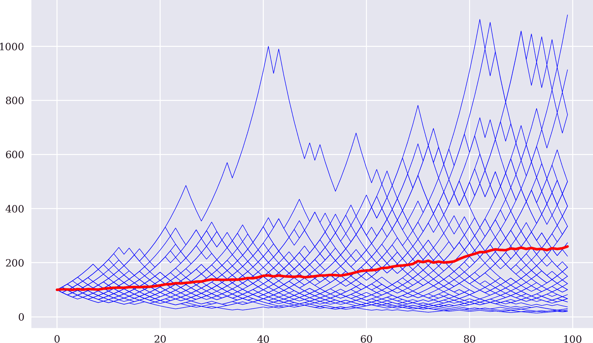

###### 图 10-1\. 每个有 100 次试验的 50 个模拟序列（红线=平均值）

下面的代码重复了不同<math alttext="f"><mi>f</mi></math>值的模拟。如图 10-2 所示，较低的分数通常导致平均增长率较低。较高的值可能导致模拟结束时的平均资本较高（ <math alttext="f equals"><mrow><mi>f</mi> <mo>=</mo></mrow></math> 0.25），或者导致平均资本大幅降低（ <math alttext="f equals"><mrow><mi>f</mi> <mo>=</mo></mrow></math> 0.5）。在分数较高的两种情况下，波动性显著增加：

```py
In [12]: c_2 = run_simulation(0.05)  

In [13]: c_3 = run_simulation(0.25)  

In [14]: c_4 = run_simulation(0.5)  

In [15]: plt.figure(figsize=(10, 6))
         plt.plot(c_1.mean(axis=1), 'r', label='$f^*=0.1$')
         plt.plot(c_2.mean(axis=1), 'b', label='$f=0.05$')
         plt.plot(c_3.mean(axis=1), 'y', label='$f=0.25$')
         plt.plot(c_4.mean(axis=1), 'm', label='$f=0.5$')
         plt.legend(loc=0);
```


使用<math alttext="f equals"><mrow><mi>f</mi> <mo>=</mo></mrow></math> 0.05 进行模拟。


使用<math alttext="f equals"><mrow><mi>f</mi> <mo>=</mo></mrow></math> 0.25 进行模拟。


使用<math alttext="f equals"><mrow><mi>f</mi> <mo>=</mo></mrow></math> 0.5 进行模拟。

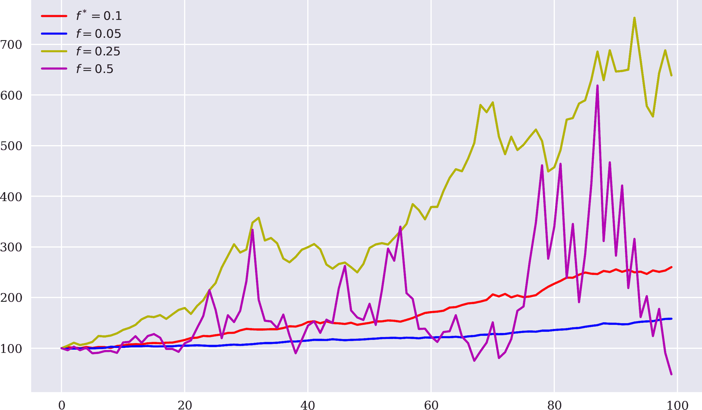

###### 图 10-2。不同<math alttext="f"><mi>f</mi></math>值的时间平均资本。

## 股票和指数的凯利准则

现在假设股票市场设置中，相关股票（指数）在今天之后的一年内只能采取两个值，根据其今天已知的值。再次，该设置是二项式的，但这次在建模方面更接近股市实际情况。¹ 具体假设如下：

<math alttext="upper P left-parenthesis r Superscript upper S Baseline equals mu plus sigma right-parenthesis equals upper P left-parenthesis r Superscript upper S Baseline equals mu minus sigma right-parenthesis equals one-half" display="block"><mrow><mi>P</mi> <mfenced close=")" open="(" separators=""><msup><mi>r</mi> <mi>S</mi></msup> <mo>=</mo> <mi>μ</mi> <mo>+</mo> <mi>σ</mi></mfenced> <mo>=</mo> <mi>P</mi> <mfenced close=")" open="(" separators=""><msup><mi>r</mi> <mi>S</mi></msup> <mo>=</mo> <mi>μ</mi> <mo>-</mo> <mi>σ</mi></mfenced> <mo>=</mo> <mfrac><mn>1</mn> <mn>2</mn></mfrac></mrow></math>

在这里，<math alttext="bold upper E left-parenthesis r Superscript upper S Baseline right-parenthesis equals mu greater-than 0"><mrow><mi>𝐄</mi> <mo>(</mo> <msup><mi>r</mi> <mi>S</mi></msup> <mo>)</mo> <mo>=</mo> <mi>μ</mi> <mo>></mo> <mn>0</mn></mrow></math> 是股票一年期预期收益，<math alttext="sigma greater-than 0"><mrow><mi>σ</mi> <mo>></mo> <mn>0</mn></mrow></math> 是收益的标准偏差（波动性）。在一个期间的设定中，一年后的可用资本如下（其中<math alttext="c 0"><msub><mi>c</mi> <mn>0</mn></msub></math>和<math alttext="f"><mi>f</mi></math>如前所定义）：

<math alttext="c left-parenthesis f right-parenthesis equals c 0 dot left-parenthesis 1 plus left-parenthesis 1 minus f right-parenthesis dot r plus f dot r Superscript upper S Baseline right-parenthesis" display="block"><mrow><mi>c</mi> <mrow><mo>(</mo> <mi>f</mi> <mo>)</mo></mrow> <mo>=</mo> <msub><mi>c</mi> <mn>0</mn></msub> <mo>·</mo> <mfenced close=")" open="(" separators=""><mn>1</mn> <mo>+</mo> <mrow><mo>(</mo> <mn>1</mn> <mo>-</mo> <mi>f</mi> <mo>)</mo></mrow> <mo>·</mo> <mi>r</mi> <mo>+</mo> <mi>f</mi> <mo>·</mo> <msup><mi>r</mi> <mi>S</mi></msup></mfenced></mrow></math>

在这里，<math alttext="r"><mi>r</mi></math> 是未投资于股票的现金所赚的固定短期利率。最大化几何增长率意味着最大化该术语：

<math alttext="upper G left-parenthesis f right-parenthesis equals bold upper E left-parenthesis log StartFraction c left-parenthesis f right-parenthesis Over c 0 EndFraction right-parenthesis" display="block"><mrow><mi>G</mi> <mrow><mo>(</mo> <mi>f</mi> <mo>)</mo></mrow> <mo>=</mo> <mi>𝐄</mi> <mfenced close=")" open="(" separators=""><mo form="prefix">log</mo> <mfrac><mrow><mi>c</mi><mo>(</mo><mi>f</mi><mo>)</mo></mrow> <msub><mi>c</mi> <mn>0</mn></msub></mfrac></mfenced></mrow></math>

现在假设一年中有<math alttext="n"><mi>n</mi></math>个相关的交易日，以便对每个这样的交易日<math alttext="i"><mi>i</mi></math>，以下情况成立：

<math alttext="upper P left-parenthesis r Subscript i Superscript upper S Baseline equals StartFraction mu Over n EndFraction plus StartFraction sigma Over StartRoot n EndRoot EndFraction right-parenthesis equals upper P left-parenthesis r Subscript i Superscript upper S Baseline equals StartFraction mu Over n EndFraction minus StartFraction sigma Over StartRoot n EndRoot EndFraction right-parenthesis equals one-half" display="block"><mrow><mi>P</mi> <mfenced close=")" open="(" separators=""><msubsup><mi>r</mi> <mi>i</mi> <mi>S</mi></msubsup> <mo>=</mo> <mfrac><mi>μ</mi> <mi>n</mi></mfrac> <mo>+</mo> <mfrac><mi>σ</mi> <msqrt><mi>n</mi></msqrt></mfrac></mfenced> <mo>=</mo> <mi>P</mi> <mfenced close=")" open="(" separators=""><msubsup><mi>r</mi> <mi>i</mi> <mi>S</mi></msubsup> <mo>=</mo> <mfrac><mi>μ</mi> <mi>n</mi></mfrac> <mo>-</mo> <mfrac><mi>σ</mi> <msqrt><mi>n</mi></msqrt></mfrac></mfenced> <mo>=</mo> <mfrac><mn>1</mn> <mn>2</mn></mfrac></mrow></math>

注意波动性随着交易日数的平方根而增加。在这些假设下，日常价值从之前的年度价值扩展到以下内容：

<math alttext="c Subscript n Baseline left-parenthesis f right-parenthesis equals c 0 dot product Underscript i equals 1 Overscript n Endscripts left-parenthesis 1 plus left-parenthesis 1 minus f right-parenthesis dot StartFraction r Over n EndFraction plus f dot r Subscript i Superscript upper S Baseline right-parenthesis" display="block"><mrow><msub><mi>c</mi> <mi>n</mi></msub> <mrow><mo>(</mo> <mi>f</mi> <mo>)</mo></mrow> <mo>=</mo> <msub><mi>c</mi> <mn>0</mn></msub> <mo>·</mo> <munderover><mo>∏</mo> <mrow><mi>i</mi><mo>=</mo><mn>1</mn></mrow> <mi>n</mi></munderover> <mfenced close=")" open="(" separators=""><mn>1</mn> <mo>+</mo> <mrow><mo>(</mo> <mn>1</mn> <mo>-</mo> <mi>f</mi> <mo>)</mo></mrow> <mo>·</mo> <mfrac><mi>r</mi> <mi>n</mi></mfrac> <mo>+</mo> <mi>f</mi> <mo>·</mo> <msubsup><mi>r</mi> <mi>i</mi> <mi>S</mi></msubsup></mfenced></mrow></math>

投资股票时，为了实现长期财富最大化，现在必须最大化以下数量：

<math alttext="StartLayout 1st Row 1st Column upper G Subscript n Baseline left-parenthesis f right-parenthesis 2nd Column equals bold upper E left-parenthesis log StartFraction c Subscript n Baseline left-parenthesis f right-parenthesis Over c 0 EndFraction right-parenthesis 2nd Row 1st Column Blank 2nd Column equals bold upper E left-parenthesis sigma-summation Underscript i equals 1 Overscript n Endscripts log left-parenthesis 1 plus left-parenthesis 1 minus f right-parenthesis dot StartFraction r Over n EndFraction plus f dot r Subscript i Superscript upper S Baseline right-parenthesis right-parenthesis 3rd Row 1st Column Blank 2nd Column equals one-half sigma-summation Underscript i equals 1 Overscript n Endscripts log left-parenthesis 1 plus left-parenthesis 1 minus f right-parenthesis dot StartFraction r Over n EndFraction plus f dot left-parenthesis StartFraction mu Over n EndFraction plus StartFraction sigma Over StartRoot n EndRoot EndFraction right-parenthesis right-parenthesis 4th Row 1st Column Blank 2nd Column plus log left-parenthesis 1 plus left-parenthesis 1 minus f right-parenthesis dot StartFraction r Over n EndFraction plus f dot left-parenthesis StartFraction mu Over n EndFraction minus StartFraction sigma Over StartRoot n EndRoot EndFraction right-parenthesis right-parenthesis 5th Row 1st Column Blank 2nd Column equals StartFraction n Over 2 EndFraction log left-parenthesis left-parenthesis 1 plus left-parenthesis 1 minus f right-parenthesis dot StartFraction r Over n EndFraction plus f dot StartFraction mu Over n EndFraction right-parenthesis squared minus StartFraction f squared sigma squared Over n EndFraction right-parenthesis EndLayout" display="block"><mtable displaystyle="true"><mtr><mtd columnalign="right"><mrow><msub><mi>G</mi> <mi>n</mi></msub> <mrow><mo>(</mo> <mi>f</mi> <mo>)</mo></mrow></mrow></mtd> <mtd columnalign="left"><mrow><mo>=</mo> <mi>𝐄</mi> <mfenced close=")" open="(" separators=""><mo form="prefix">log</mo> <mfrac><mrow><msub><mi>c</mi> <mi>n</mi></msub> <mrow><mo>(</mo><mi>f</mi><mo>)</mo></mrow></mrow> <msub><mi>c</mi> <mn>0</mn></msub></mfrac></mfenced></mrow></mtd></mtr> <mtr><mtd columnalign="left"><mrow><mo>=</mo> <mi>𝐄</mi> <mfenced close=")" open="(" separators=""><munderover><mo>∑</mo> <mrow><mi>i</mi><mo>=</mo><mn>1</mn></mrow> <mi>n</mi></munderover> <mo form="prefix">log</mo> <mfenced close=")" open="(" separators=""><mn>1</mn> <mo>+</mo> <mrow><mo>(</mo> <mn>1</mn> <mo>-</mo> <mi>f</mi> <mo>)</mo></mrow> <mo>·</mo> <mfrac><mi>r</mi> <mi>n</mi></mfrac> <mo>+</mo> <mi>f</mi> <mo>·</mo> <msubsup><mi>r</mi> <mi>i</mi> <mi>S</mi></msubsup></mfenced></mfenced></mrow></mtd></mtr> <mtr><mtd columnalign="left"><mrow><mo>=</mo> <mfrac><mn>1</mn> <mn>2</mn></mfrac> <munderover><mo>∑</mo> <mrow><mi>i</mi><mo>=</mo><mn>1</mn></mrow> <mi>n</mi></munderover> <mo form="prefix">log</mo> <mfenced close=")" open="(" separators=""><mn>1</mn> <mo>+</mo> <mrow><mo>(</mo> <mn>1</mn> <mo>-</mo> <mi>f</mi> <mo>)</mo></mrow> <mo>·</mo> <mfrac><mi>r</mi> <mi>n</mi></mfrac> <mo>+</mo> <mi>f</mi> <mo>·</mo> <mfenced close=")" open="(" separators=""><mfrac><mi>μ</mi> <mi>n</mi></mfrac> <mo>+</mo> <mfrac><mi>σ</mi> <msqrt><mi>n</mi></msqrt></mfrac></mfenced></mfenced></mrow></mtd></mtr> <mtr><mtd columnalign="left"><mrow><mo>+</mo> <mo form="prefix">log</mo> <mfenced close=")" open="(" separators=""><mn>1</mn> <mo>+</mo> <mrow><mo>(</mo> <mn>1</mn> <mo>-</mo> <mi>f</mi> <mo>)</mo></mrow> <mo>·</mo> <mfrac><mi>r</mi> <mi>n</mi></mfrac> <mo>+</mo> <mi>f</mi> <mo>·</mo> <mfenced close=")" open="(" separators=""><mfrac><mi>μ</mi> <mi>n</mi></mfrac> <mo>-</mo> <mfrac><mi>σ</mi> <msqrt><mi>n</mi></msqrt></mfrac></mfenced></mfenced></mrow></mtd></mtr> <mtr><mtd columnalign="left"><mrow><mo>=</mo> <mfrac><mi>n</mi> <mn>2</mn></mfrac> <mo form="prefix">log</mo> <mfenced close=")" open="(" separators=""><msup><mfenced close=")" open="(" separators=""><mn>1</mn><mo>+</mo><mrow><mo>(</mo><mn>1</mn><mo>-</mo><mi>f</mi><mo>)</mo></mrow><mo>·</mo><mfrac><mi>r</mi> <mi>n</mi></mfrac><mo>+</mo><mi>f</mi><mo>·</mo><mfrac><mi>μ</mi> <mi>n</mi></mfrac></mfenced> <mn>2</mn></msup> <mo>-</mo> <mfrac><mrow><msup><mi>f</mi> <mn>2</mn></msup> <msup><mi>σ</mi> <mn>2</mn></msup></mrow> <mi>n</mi></mfrac></mfenced></mrow></mtd></mtr></mtable></math>

使用[Taylor 级数展开](https://oreil.ly/xX4tA)，最终得出以下结果：

<math alttext="upper G Subscript n Baseline left-parenthesis f right-parenthesis equals r plus left-parenthesis mu minus r right-parenthesis dot f minus StartFraction sigma squared Over 2 EndFraction dot f squared plus script upper O left-parenthesis StartFraction 1 Over StartRoot n EndRoot EndFraction right-parenthesis" display="block"><mrow><msub><mi>G</mi> <mi>n</mi></msub> <mrow><mo>(</mo> <mi>f</mi> <mo>)</mo></mrow> <mo>=</mo> <mi>r</mi> <mo>+</mo> <mrow><mo>(</mo> <mi>μ</mi> <mo>-</mo> <mi>r</mi> <mo>)</mo></mrow> <mo>·</mo> <mi>f</mi> <mo>-</mo> <mfrac><msup><mi>σ</mi> <mn>2</mn></msup> <mn>2</mn></mfrac> <mo>·</mo> <msup><mi>f</mi> <mn>2</mn></msup> <mo>+</mo> <mi>𝒪</mi> <mfenced close=")" open="(" separators=""><mfrac><mn>1</mn> <msqrt><mi>n</mi></msqrt></mfrac></mfenced></mrow></math>

或者对于无限多的交易时间点（即连续交易），最终得出以下结果：

<math alttext="upper G Subscript normal infinity Baseline left-parenthesis f right-parenthesis equals r plus left-parenthesis mu minus r right-parenthesis dot f minus StartFraction sigma squared Over 2 EndFraction dot f squared" display="block"><mrow><msub><mi>G</mi> <mi>∞</mi></msub> <mrow><mo>(</mo> <mi>f</mi> <mo>)</mo></mrow> <mo>=</mo> <mi>r</mi> <mo>+</mo> <mrow><mo>(</mo> <mi>μ</mi> <mo>-</mo> <mi>r</mi> <mo>)</mo></mrow> <mo>·</mo> <mi>f</mi> <mo>-</mo> <mfrac><msup><mi>σ</mi> <mn>2</mn></msup> <mn>2</mn></mfrac> <mo>·</mo> <msup><mi>f</mi> <mn>2</mn></msup></mrow></math>

然后，通过以下表达式通过一阶条件确定最优分数 <math alttext="f Superscript asterisk"><msup><mi>f</mi> <mo>*</mo></msup></math> ：

<math alttext="f Superscript asterisk Baseline equals StartFraction mu minus r Over sigma squared EndFraction" display="block"><mrow><msup><mi>f</mi> <mo>*</mo></msup> <mo>=</mo> <mfrac><mrow><mi>μ</mi><mo>-</mo><mi>r</mi></mrow> <msup><mi>σ</mi> <mn>2</mn></msup></mfrac></mrow></math>

这代表了股票预期超过无风险利率的回报率与回报率方差的比值。这个表达式看起来类似于夏普比率，但有所不同。

一个实际案例将说明前述公式的应用及其在交易策略中杠杆化的作用。考虑的交易策略简单地是*标准普尔 500 指数的被动长期持仓*。为此，基础数据迅速获取，并且所需的统计数据很容易衍生：

```py
In [16]: raw = pd.read_csv('http://hilpisch.com/pyalgo_eikon_eod_data.csv',
                           index_col=0, parse_dates=True)

In [17]: symbol = '.SPX'

In [18]: data = pd.DataFrame(raw[symbol])

In [19]: data['return'] = np.log(data / data.shift(1))

In [20]: data.dropna(inplace=True)

In [21]: data.tail()
Out[21]:                .SPX    return
         Date
         2019-12-23  3224.01  0.000866
         2019-12-24  3223.38 -0.000195
         2019-12-27  3240.02  0.000034
         2019-12-30  3221.29 -0.005798
         2019-12-31  3230.78  0.002942
```

在涵盖期间内，标准普尔 500 指数的统计特性建议将约 4.5 的最优分数投资于指数的长期持仓中。换句话说，对于每可用美元，将投资 4.5 美元，这意味着根据最优凯利分数或在这种情况下最优的凯利*因子*，杠杆率为 4.5。

其他条件相等时，凯利准则意味着在预期回报较高且波动性（方差）较低时，杠杆率更高：

```py
In [22]: mu = data['return'].mean() * 252  

In [23]: mu  
Out[23]: 0.09992181916534204

In [24]: sigma = data['return'].std() * 252 ** 0.5  

In [25]: sigma  
Out[25]: 0.14761569775486563

In [26]: r = 0.0  

In [27]: f = (mu - r) / sigma ** 2 

In [28]: f  
Out[28]: 4.585590244019818
```


计算年化回报。


计算年化波动率。


将无风险利率设置为 0（简化起见）。


计算要投资于策略的最优凯利分数。

以下 Python 代码模拟了凯利准则及最优杠杆比率的应用。为了简化和比较的原因，初始资本设置为 1，而初始投资总资本设置为<math alttext="1 dot f Superscript asterisk"><mrow><mn>1</mn> <mo>·</mo> <msup><mi>f</mi> <mo>*</mo></msup></mrow></math> 。根据策略部署的资本表现，每日调整可用权益来调整总资本。亏损后，资本减少；盈利后，资本增加。相对于指数本身，权益位置的演变显示在图 10-3 中：

```py
In [29]: equs = []

In [30]: def kelly_strategy(f):
             global equs
             equ = 'equity_{:.2f}'.format(f)
             equs.append(equ)
             cap = 'capital_{:.2f}'.format(f)
             data[equ] = 1  
             data[cap] = data[equ] * f  
             for i, t in enumerate(data.index[1:]):
                 t_1 = data.index[i]  
                 data.loc[t, cap] = data[cap].loc[t_1] * \
                                     math.exp(data['return'].loc[t])  
                 data.loc[t, equ] = data[cap].loc[t] - \
                                     data[cap].loc[t_1] + \
                                     data[equ].loc[t_1]  
                 data.loc[t, cap] = data[equ].loc[t] * f  

In [31]: kelly_strategy(f * 0.5)  

In [32]: kelly_strategy(f * 0.66)  

In [33]: kelly_strategy(f)  

In [34]: print(data[equs].tail())
                     equity_2.29  equity_3.03  equity_4.59
         Date
         2019-12-23     6.628865     9.585294    14.205748
         2019-12-24     6.625895     9.579626    14.193019
         2019-12-27     6.626410     9.580610    14.195229
         2019-12-30     6.538582     9.412991    13.818934
         2019-12-31     6.582748     9.496919    14.005618

In [35]: ax = data['return'].cumsum().apply(np.exp).plot(figsize=(10, 6))
         data[equs].plot(ax=ax, legend=True);
```


生成一个名为`equity`的新列，并将初始值设为 1。


生成一个名为`capital`的新列，并将初始值设为<math alttext="1 dot f Superscript asterisk"><mrow><mn>1</mn> <mo>·</mo> <msup><mi>f</mi> <mo>*</mo></msup></mrow></math> 。


选择前值的正确 `DatetimeIndex` 值。


根据回报计算新的资本位置。


根据资本位置的表现调整权益价值。


根据新的权益位置和固定杠杆比例调整资本位置。


模拟基于 Kelly 准则的策略，针对一半的<math alttext="f"><mi>f</mi></math>…


…三分之二的<math alttext="f"><mi>f</mi></math> …


…和<math alttext="f"><mi>f</mi></math> 本身。


###### 图 10-3\. S&P 500 的总表现与给定不同<math alttext="f"><mi>f</mi></math>值的权益位置的比较

如图 10-3 所示，应用最优 Kelly 杠杆导致权益位置的演变相当不稳定（高波动性），这在直觉上是合理的，考虑到杠杆比率为 4.59\. 预计随着杠杆增加，权益位置的波动性会增加。因此，从业者通常不使用“全凯利”（4.6），而是使用“半凯利”（2.3）。在当前示例中，这被减少到：

<math alttext="one-half dot f Superscript asterisk Baseline almost-equals 2.3" display="block"><mrow><mfrac><mn>1</mn> <mn>2</mn></mfrac> <mo>•</mo> <msup><mi>f</mi> <mo>*</mo></msup> <mo>≈</mo> <mn>2.3</mn></mrow></math>

在此背景下，图 10-3 还展示了对“全凯利”低于的值的权益位置的演变。“全凯利”的风险确实随着 latexmath:[$f$] 的降低而减少。

# 基于 ML 的交易策略

第八章 介绍了 Oanda 交易平台，其 RESTful API 和 Python 封装包 `tpqoa`。本节将基于 Oanda v20 RESTful API 的历史数据，结合基于 ML 的方法来预测市场价格走势，以测试 EUR/USD 货币对的算法交易策略。它使用向量化回测，并考虑了买卖价差作为比例交易成本。与第四章介绍的普通向量化回测方法相比，它还对所测试的交易策略的风险特征进行了更深入的分析。

## 向量化回测

回测基于日内数据，更具体地说是 10 分钟长的条形图。以下代码连接到 Oanda v20 API 并检索一周的 10 分钟条形图数据。图 10-4 可视化了所检索数据的时间段内的中间收盘价格：

```py
In [36]: import tpqoa

In [37]: %time api = tpqoa.tpqoa('../pyalgo.cfg')  
         CPU times: user 893 µs, sys: 198 µs, total: 1.09 ms
         Wall time: 1.04 ms

In [38]: instrument = 'EUR_USD'  

In [39]: raw = api.get_history(instrument,
                                start='2020-06-08',
                                end='2020-06-13',
                                granularity='M10',
                                price='M')  

In [40]: raw.tail()
Out[40]:                            o        h        l        c  volume  complete
         time
         2020-06-12 20:10:00  1.12572  1.12593  1.12532  1.12568     221      True
         2020-06-12 20:20:00  1.12569  1.12578  1.12532  1.12558     163      True
         2020-06-12 20:30:00  1.12560  1.12573  1.12534  1.12543     192      True
         2020-06-12 20:40:00  1.12544  1.12594  1.12528  1.12542     219      True
         2020-06-12 20:50:00  1.12544  1.12624  1.12541  1.12554     296      True

In [41]: raw.info()
         <class 'pandas.core.frame.DataFrame'>
         DatetimeIndex: 701 entries, 2020-06-08 00:00:00 to 2020-06-12 20:50:00
         Data columns (total 6 columns):
          #   Column    Non-Null Count  Dtype
         ---  ------    --------------  -----
          0   o         701 non-null    float64
          1   h         701 non-null    float64
          2   l         701 non-null    float64
          3   c         701 non-null    float64
          4   volume    701 non-null    int64
          5   complete  701 non-null    bool
         dtypes: bool(1), float64(4), int64(1)
         memory usage: 33.5 KB

In [42]: spread = 0.00012  

In [43]: mean = raw['c'].mean()  

In [44]: ptc = spread / mean  
         ptc  
Out[44]: 0.00010599557439495706

In [45]: raw['c'].plot(figsize=(10, 6), legend=True);
```


连接到 API 并检索数据。


指定平均买卖价差。


计算数据集的平均收盘价。


计算给定平均差价和平均中间收盘价的平均比例交易成本。

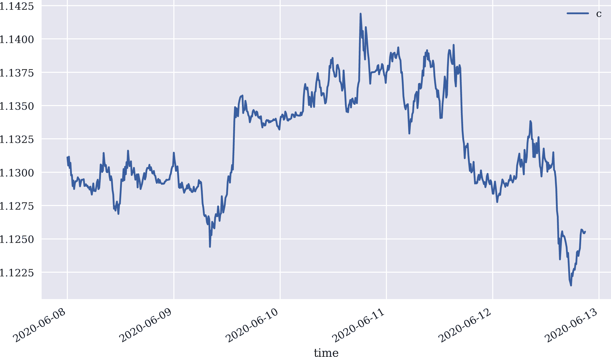

###### 图 10-4\. 欧元/美元汇率（10 分钟柱状图）

基于 ML 的策略使用了多个时间序列特征，如对数收益率以及收盘价的最小值和最大值。此外，特征数据是滞后的。换句话说，ML 算法将从历史模式中学习，这些模式由滞后特征数据体现：

```py
In [46]: data = pd.DataFrame(raw['c'])

In [47]: data.columns = [instrument,]

In [48]: window = 20  
         data['return'] = np.log(data / data.shift(1))  
         data['vol'] = data['return'].rolling(window).std()  
         data['mom'] = np.sign(data['return'].rolling(window).mean())  
         data['sma'] = data[instrument].rolling(window).mean()  
         data['min'] = data[instrument].rolling(window).min()  
         data['max'] = data[instrument].rolling(window).max()  

In [49]: data.dropna(inplace=True)

In [50]: lags = 6  

In [51]: features = ['return', 'vol', 'mom', 'sma', 'min', 'max']  

In [52]: cols = []
         for f in features:
             for lag in range(1, lags + 1):
                 col = f'{f}_lag_{lag}'
                 data[col] = data[f].shift(lag)  
                 cols.append(col)

In [53]: data.dropna(inplace=True)

In [54]: data['direction'] = np.where(data['return'] > 0, 1, -1)  

In [55]: data[cols].iloc[:lags, :lags]  
Out[55]:
                          return_lag_1  return_lag_2  return_lag_3  return_lag_4 \
     time
     2020-06-08 04:20:00      0.000097      0.000018     -0.000452      0.000035
     2020-06-08 04:30:00     -0.000115      0.000097      0.000018     -0.000452
     2020-06-08 04:40:00      0.000027     -0.000115      0.000097      0.000018
     2020-06-08 04:50:00     -0.000142      0.000027     -0.000115      0.000097
     2020-06-08 05:00:00      0.000035     -0.000142      0.000027     -0.000115
     2020-06-08 05:10:00     -0.000159      0.000035     -0.000142      0.000027

                          return_lag_5  return_lag_6
     time
     2020-06-08 04:20:00      0.000000      0.000009
     2020-06-08 04:30:00      0.000035      0.000000
     2020-06-08 04:40:00     -0.000452      0.000035
     2020-06-08 04:50:00      0.000018     -0.000452
     2020-06-08 05:00:00      0.000097      0.000018
     2020-06-08 05:10:00     -0.000115      0.000097
```


指定某些特征的窗口长度。


计算收盘价的对数收益率。


计算滚动波动率。


将时间序列动量定义为最近对数收益率的平均值。


计算简单移动平均线。


计算滚动最大值。


计算滚动最小值。


将滞后特征数据添加到`DataFrame`对象中。


将标签数据定义为市场方向（`+1`或*上涨*和`-1`或*下跌*）。


显示结果滞后特征数据的一个小子集。

针对特征和标签数据，现在可以应用不同的监督学习算法。接下来，使用`scikit-learn` ML 包中的所谓*AdaBoost 算法*进行分类（参见[`AdaBoostClassifier`](https://oreil.ly/WIANy)）。在分类的背景下，增强的概念是使用基分类器的*集成*，以得到一个更优的预测器，理论上不太容易过拟合（参见“数据窥探和过拟合”）。作为基分类器，使用了`scikit-learn`中的*决策树分类算法*（参见[`DecisionTreeClassifier`](https://oreil.ly/wb-wh)）。

该代码根据顺序训练-测试分割来训练和测试算法交易策略。模型在训练和测试数据上的准确率分数均显著高于 50%。除了准确率分数外，也可以在金融交易的背景下讨论交易策略的*命中率*（即获胜交易数与所有交易数的比例）。由于命中率显著高于 50%，这可能表明——根据凯利准则的背景——相对于随机行走设置，存在统计优势：

```py
In [56]: from sklearn.metrics import accuracy_score
         from sklearn.tree import DecisionTreeClassifier
         from sklearn.ensemble import AdaBoostClassifier

In [57]: n_estimators=15  
         random_state=100  
         max_depth=2  
         min_samples_leaf=15  
         subsample=0.33  

In [58]: dtc = DecisionTreeClassifier(random_state=random_state,
                                      max_depth=max_depth,
                                      min_samples_leaf=min_samples_leaf)  

In [59]: model = AdaBoostClassifier(base_estimator=dtc,
                                   n_estimators=n_estimators,
                                   random_state=random_state)  

In [60]: split = int(len(data) * 0.7)

In [61]: train = data.iloc[:split].copy()

In [62]: mu, std = train.mean(), train.std()  

In [63]: train_ = (train - mu) / std  

In [64]: model.fit(train_[cols], train['direction'])  
Out[64]: AdaBoostClassifier(algorithm='SAMME.R',
         base_estimator=DecisionTreeClassifier(ccp_alpha=0.0,
         class_weight=None,
         criterion='gini',
         max_depth=2,
         max_features=None,
         max_leaf_nodes=None,
         min_impurity_decrease=0.0,
         min_impurity_split=None,
         min_samples_leaf=15,
         min_samples_split=2,
         min_weight_fraction_leaf=0.0,
         presort='deprecated',
         random_state=100,
         splitter='best'),
         learning_rate=1.0, n_estimators=15, random_state=100)

In [65]: accuracy_score(train['direction'], model.predict(train_[cols]))  
Out[65]: 0.8050847457627118

In [66]: test = data.iloc[split:].copy()  

In [67]: test_ = (test - mu) / std  

In [68]: test['position'] = model.predict(test_[cols])  

In [69]: accuracy_score(test['direction'], test['position'])  
Out[69]: 0.5665024630541872
```


指定机器学习算法的主要参数（请参阅之前提供的模型类的参考资料）。


实例化基础分类算法（决策树）。


实例化 AdaBoost 分类算法。


对*训练*特征数据集应用高斯归一化。


根据训练数据集拟合模型。


展示来自训练模型的*样本内*预测准确率（训练数据集）。


对*测试*特征数据集应用高斯归一化（使用训练特征数据集的参数）。


生成测试数据集的预测。


展示来自训练模型的*样本外*预测准确率。

众所周知，命中率只是金融交易成功的一方面。另一方面包括正确把握重要交易和交易策略隐含的交易成本等因素。² 为此，只有正式的矢量化回测方法才能评估交易策略的质量。以下代码考虑了基于平均买卖价差的比例交易成本。图 10-5 比较了算法交易策略（无交易成本和有比例交易成本）与被动基准投资的表现：

```py
In [70]: test['strategy'] = test['position'] * test['return']  

In [71]: sum(test['position'].diff() != 0)  
Out[71]: 77

In [72]: test['strategy_tc'] = np.where(test['position'].diff() != 0,
                                        test['strategy'] - ptc,  
                                        test['strategy'])

In [73]: test[['return', 'strategy', 'strategy_tc']].sum(
                 ).apply(np.exp)
Out[73]: return         0.990182
         strategy       1.015827
         strategy_tc    1.007570
         dtype: float64

In [74]: test[['return', 'strategy', 'strategy_tc']].cumsum(
                 ).apply(np.exp).plot(figsize=(10, 6));
```


推导基于机器学习的算法交易策略的对数收益率。


根据持仓变动计算交易策略涉及的交易次数。


每次交易发生时，从该日策略的对数收益中扣除比例交易成本。

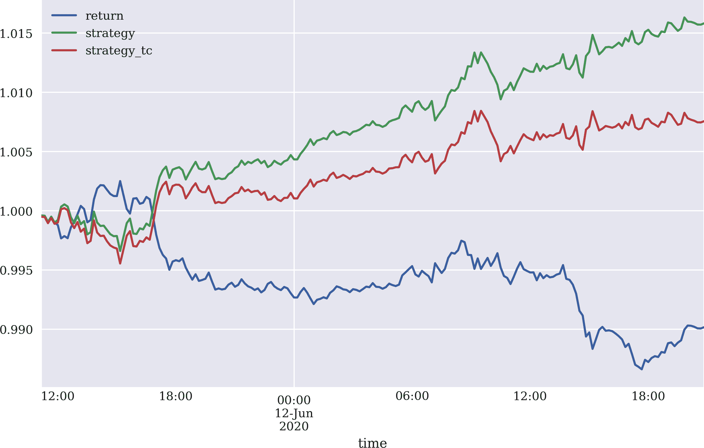

###### 图 10-5\. EUR/USD 汇率和算法交易策略的总体表现（扣除交易成本前后）

矢量化回测在测试策略接近市场实际情况方面存在局限性。例如，它不允许直接包括每笔交易的固定交易成本。可以作为一种近似，通过取平均位置大小的平均比例交易成本的倍数来间接考虑固定交易成本。然而，这一方法通常不够精确。如果需要更高精度，需要采用其他方法，比如*基于事件的回测*（见第六章） ，通过对价格数据的每个条形图进行显式循环。

## 最佳杠杆

配备交易策略的对数收益数据，可以计算均值和方差值，以便根据凯利准则确定最佳杠杆。接下来的代码将这些数字缩放为年化值，尽管这不会改变根据凯利准则的最佳杠杆值，因为均值回报和方差随着同一因子缩放：

```py
In [75]: mean = test[['return', 'strategy_tc']].mean() * len(data) * 52  
         mean
Out[75]: return        -1.705965
         strategy_tc    1.304023
         dtype: float64

In [76]: var = test[['return', 'strategy_tc']].var() * len(data) * 52  
         var
Out[76]: return         0.011306
         strategy_tc    0.011370
         dtype: float64

In [77]: vol = var ** 0.5  
         vol
Out[77]: return         0.106332
         strategy_tc    0.106631
         dtype: float64

In [78]: mean / var  
Out[78]: return        -150.884961
         strategy_tc    114.687875
         dtype: float64

In [79]: mean / var * 0.5  
Out[79]: return        -75.442481
         strategy_tc    57.343938
         dtype: float64
```


年化平均回报。


年化方差。


年化波动率。


根据凯利准则确定的最佳杠杆（“全凯利”）。


根据凯利准则（“半凯利”）确定的最佳杠杆。

使用“半凯利”准则，交易策略的最佳杠杆在 50 以上。对于一些经纪商，如 Oanda，以及某些金融工具，如外汇对和差价合约（CFDs），即使对于零售交易者，这样的杠杆比率也是可行的。图 10-6 显示了带有交易成本的不同杠杆值下交易策略的表现比较：

```py
In [80]: to_plot = ['return', 'strategy_tc']

In [81]: for lev in [10, 20, 30, 40, 50]:
             label = 'lstrategy_tc_%d' % lev
             test[label] = test['strategy_tc'] * lev  
             to_plot.append(label)

In [82]: test[to_plot].cumsum().apply(np.exp).plot(figsize=(10, 6));
```


缩放不同杠杆值的策略回报。

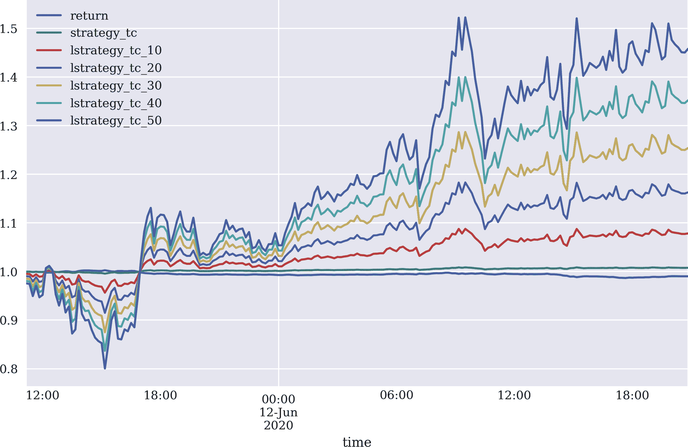

###### 图 10-6\. 算法交易策略在不同杠杆值下的总体表现

杠杆增加了与交易策略相关的风险。交易者应仔细阅读风险声明和监管规定。积极的回测表现也不能保证未来的表现。所有展示的结果仅用于说明编程和分析方法的应用。在某些司法管辖区，如德国，零售交易者的杠杆比例根据不同的金融工具组别进行限制。

## 风险分析

由于杠杆显著增加了与某一交易策略相关的风险，因此需要进行更深入的风险分析。随后的风险分析假设杠杆比率为 30。首先，将计算最大回撤和最长回撤期。*最大回撤*是最近高点后的最大损失（低点）。因此，*最长回撤期*是交易策略需要恢复到最近高点的最长时间。分析假设初始股本位置为 3,333 欧元，导致杠杆比率为 30 的初始头寸大小为 100,000 欧元。还假设无论绩效如何，股本随时间不会调整：

```py
In [83]: equity = 3333  

In [84]: risk = pd.DataFrame(test['lstrategy_tc_30'])  

In [85]: risk['equity'] = risk['lstrategy_tc_30'].cumsum(
                                   ).apply(np.exp) * equity  

In [86]: risk['cummax'] = risk['equity'].cummax()  

In [87]: risk['drawdown'] = risk['cummax'] - risk['equity']  

In [88]: risk['drawdown'].max()  
Out[88]: 511.38321383258017

In [89]: t_max = risk['drawdown'].idxmax()  
         t_max  
Out[89]: Timestamp('2020-06-12 10:30:00')
```


初始股权。


相关的对数收益时间序列…


…按初始股权缩放。


随时间的累计最大值。


随时间变化的回撤数值。


最大回撤值。


发生时的时间点。

技术上，新高点的特征是回撤值为 0。回撤期是两个这样的高点之间的时间。图 10-7 可视化了最大回撤和回撤期：

```py
In [90]: temp = risk['drawdown'][risk['drawdown'] == 0]  

In [91]: periods = (temp.index[1:].to_pydatetime() -
                    temp.index[:-1].to_pydatetime())  

In [92]: periods[20:30]  
Out[92]: array([datetime.timedelta(seconds=600),
          datetime.timedelta(seconds=1200),
         datetime.timedelta(seconds=1200), datetime.timedelta(seconds=1200)],
               dtype=object)

In [93]: t_per = periods.max()  

In [94]: t_per  
Out[94]: datetime.timedelta(seconds=26400)

In [95]: t_per.seconds / 60 / 60  
Out[95]: 7.333333333333333

In [96]: risk[['equity', 'cummax']].plot(figsize=(10, 6))
         plt.axvline(t_max, c='r', alpha=0.5);
```


确定需要将回撤降为 0 的高点。


计算所有高点之间的`timedelta`值。


*秒*为单位的最长回撤期…


…转换为*小时*。

另一个重要的风险度量是*风险价值*（VaR）。它以货币金额表示，代表在特定时间段和置信水平下可能发生的最大损失。


###### 图 10-7。最大回撤（垂直线）和回撤期（水平线）

下面的代码根据杠杆交易策略的股本位置的对数收益随时间的不同置信水平推导 VaR 值。时间间隔固定为十分钟的条长度：

```py
In [97]: import scipy.stats as scs

In [98]: percs = [0.01, 0.1, 1., 2.5, 5.0, 10.0]  

In [99]: risk['return'] = np.log(risk['equity'] /
                                  risk['equity'].shift(1))

In [100]: VaR = scs.scoreatpercentile(equity * risk['return'], percs)  

In [101]: def print_var():
              print('{}    {}'.format('Confidence Level', 'Value-at-Risk'))
              print(33 * '-')
              for pair in zip(percs, VaR):
                  print('{:16.2f} {:16.3f}'.format(100 - pair[0], -pair[1]))  

In [102]: print_var()  
          Confidence Level    Value-at-Risk
          ---------------------------------
                     99.99          162.570
                     99.90          161.348
                     99.00          132.382
                     97.50          122.913
                     95.00          100.950
                     90.00           62.622
```


确定要使用的百分位值。


根据百分位值计算 VaR 值。


将百分位值转换为置信水平，将 VaR 值（负值）转换为正值以供打印。

最后，以下代码通过对原始`DataFrame`对象重新采样来计算*一小时*时间范围内的 VaR 值。实际上，所有置信水平的 VaR 值都会增加：

```py
In [103]: hourly = risk.resample('1H', label='right').last()  

In [104]: hourly['return'] = np.log(hourly['equity'] /
                                   hourly['equity'].shift(1))

In [105]: VaR = scs.scoreatpercentile(equity * hourly['return'], percs)  

In [106]: print_var()
          Confidence Level    Value-at-Risk
          ---------------------------------
                     99.99          252.460
                     99.90          251.744
                     99.00          244.593
                     97.50          232.674
                     95.00          125.498
                     90.00           61.701
```


将数据从 10 分钟重新采样为 1 小时的条形图。


根据百分位值计算 VaR 值。

## 持久化模型对象

一旦基于回测、杠杆和风险分析结果接受了算法交易策略，模型对象和其他相关的算法组件可能会被持久化以备后续部署使用。它现在体现了基于机器学习的交易策略或交易算法。

```py
In [107]: import pickle

In [108]: algorithm = {'model': model, 'mu': mu, 'std': std}

In [109]: pickle.dump(algorithm, open('algorithm.pkl', 'wb'))
```

# 在线算法

到目前为止测试的交易算法是*离线算法*。这类算法使用完整的数据集来解决手头的问题。问题在于训练一个基于决策树作为基础分类器的 AdaBoost 分类算法，多个不同的时间序列特征和方向性标签数据。实际上，在金融市场上部署交易算法时，它必须逐步消耗数据，以预测下一个时间间隔（条）市场运动方向。本节利用前一节的持久化模型对象，并将其嵌入到流数据环境中。

将*离线*交易算法转化为*在线*交易算法的代码主要解决以下问题：

Tick 数据

Tick 数据以实时方式到达并需要实时处理，例如被收集到一个`DataFrame`对象中。

重新采样

Tick 数据将根据交易算法重新采样到适当的条形长度。为了说明，重新采样时使用的条形长度比训练和回测时使用的条形长度短。

预测

交易算法为未来的时间间隔内市场运动方向生成预测。

订单

根据当前位置和算法生成的预测（“信号”），下订单或保持位置不变。

第八章，特别是“使用流数据”，展示了如何实时从 Oanda API 获取 Tick 数据。基本方法是重新定义`tpqoa.tpqoa`类的`.on_success()`方法以实现交易逻辑。

首先加载持久化的交易算法；它代表了要遵循的交易逻辑。它由训练好的模型本身和用于特征数据归一化的参数组成，这些都是算法的整体部分：

```py
In [110]: algorithm = pickle.load(open('algorithm.pkl', 'rb'))

In [111]: algorithm['model']
Out[111]: AdaBoostClassifier(algorithm='SAMME.R',
          base_estimator=DecisionTreeClassifier(ccp_alpha=0.0,
          class_weight=None,
          criterion='gini',
          max_depth=2,
          max_features=None,
          max_leaf_nodes=None,
          min_impurity_decrease=0.0,
          min_impurity_split=None,
          min_samples_leaf=15,
          min_samples_split=2,
          min_weight_fraction_leaf=0.0,
          presort='deprecated',
          random_state=100,
          splitter='best'),
          learning_rate=1.0, n_estimators=15, random_state=100)
```

在下面的代码中，新类`MLTrader`继承自`tpqoa.tpqoa`，通过`.on_success()`和额外的辅助方法，将交易算法转换为实时环境。这是将*离线算法*转换为所谓的*在线算法*的过程：

```py
In [112]: class MLTrader(tpqoa.tpqoa):
              def __init__(self, config_file, algorithm):
                  super(MLTrader, self).__init__(config_file)
                  self.model = algorithm['model']  
                  self.mu = algorithm['mu']  
                  self.std = algorithm['std']  
                  self.units = 100000  
                  self.position = 0  
                  self.bar = '5s'  
                  self.window = 2  
                  self.lags = 6  
                  self.min_length = self.lags + self.window + 1
                  self.features = ['return', 'sma', 'min', 'max', 'vol', 'mom']
                  self.raw_data = pd.DataFrame()
              def prepare_features(self):  
                  self.data['return'] = np.log(self.data['mid'] /
                                               self.data['mid'].shift(1))
                  self.data['sma'] = self.data['mid'].rolling(self.window).mean()
                  self.data['min'] = self.data['mid'].rolling(self.window).min()
                  self.data['mom'] = np.sign(
                      self.data['return'].rolling(self.window).mean())
                  self.data['max'] = self.data['mid'].rolling(self.window).max()
                  self.data['vol'] = self.data['return'].rolling(
                      self.window).std()
                  self.data.dropna(inplace=True)
                  self.data[self.features] -= self.mu
                  self.data[self.features] /= self.std
                  self.cols = []
                  for f in self.features:
                      for lag in range(1, self.lags + 1):
                          col = f'{f}_lag_{lag}'
                          self.data[col] = self.data[f].shift(lag)
                          self.cols.append(col)
              def on_success(self, time, bid, ask):  
                  df = pd.DataFrame({'bid': float(bid), 'ask': float(ask)},
                                   index=[pd.Timestamp(time).tz_localize(None)])
                  self.raw_data = self.raw_data.append(df)
                  self.data = self.raw_data.resample(self.bar,
                                          label='right').last().ffill()
                  self.data = self.data.iloc[:-1]
                  if len(self.data) > self.min_length:
                      self.min_length +=1
                      self.data['mid'] = (self.data['bid'] +
                                          self.data['ask']) / 2
                      self.prepare_features()
                      features = self.data[
                          self.cols].iloc[-1].values.reshape(1, -1)
                      signal = self.model.predict(features)[0]
                      print(f'NEW SIGNAL: {signal}', end='\r')
                      if self.position in [0, -1] and signal == 1:  
                          print('*** GOING LONG ***')
                          self.create_order(self.stream_instrument,
                                      units=(1 - self.position) * self.units)
                          self.position = 1
                      elif self.position in [0, 1] and signal == -1:  
                          print('*** GOING SHORT ***')
                          self.create_order(self.stream_instrument,
                                      units=-(1 + self.position) * self.units)
                          self.position = -1
```


已训练的 AdaBoost 模型对象和标准化参数。


交易单位数。


初始的中性位置。


实施算法的条形图长度。


选定功能的窗口长度。


滞后数目（必须与算法训练一致）。


生成滞后特征数据的方法。


具体化体现交易逻辑的重新定义方法。


检查长信号和长交易。


检查短信号和短交易。

使用新的类`MLTrader`，自动交易变得简单。在交互式环境中只需几行代码即可。参数设置使得第一个订单在短时间后被下达。然而，在实际中，所有参数当然必须与研究和回测阶段的原始参数保持一致。例如，它们也可以持久化在磁盘上，并且可以通过算法读取：

```py
In [113]: mlt = MLTrader('../pyalgo.cfg', algorithm)  

In [114]: mlt.stream_data(instrument, stop=500)  
          print('*** CLOSING OUT ***')
          mlt.create_order(mlt.stream_instrument,
                            units=-mlt.position * mlt.units)  
```


实例化交易对象。


开始流式处理、数据处理和交易。


结束最后一个开放位置。

上述代码生成类似以下输出：

```py
          *** GOING LONG ***

          {'id': '1735', 'time': '2020-08-19T14:46:15.552233563Z', 'userID':
           13834683, 'accountID': '101-004-13834683-001', 'batchID': '1734',
           'requestID': '42730658849646182', 'type': 'ORDER_FILL', 'orderID':
           '1734', 'instrument': 'EUR_USD', 'units': '100000.0',
           'gainQuoteHomeConversionFactor': '0.835983419025',
           'lossQuoteHomeConversionFactor': '0.844385262432', 'price': 1.1903,
           'fullVWAP': 1.1903, 'fullPrice': {'type': 'PRICE', 'bids': [{'price':
           1.19013, 'liquidity': '10000000'}], 'asks': [{'price': 1.1903,
           'liquidity': '10000000'}], 'closeoutBid': 1.19013, 'closeoutAsk':
           1.1903}, 'reason': 'MARKET_ORDER', 'pl': '0.0', 'financing': '0.0',
           'commission': '0.0', 'guaranteedExecutionFee': '0.0',
           'accountBalance': '98507.7425', 'tradeOpened': {'tradeID': '1735',
           'units': '100000.0', 'price': 1.1903, 'guaranteedExecutionFee': '0.0',
           'halfSpreadCost': '7.1416', 'initialMarginRequired': '3330.0'},
           'halfSpreadCost': '7.1416'}

          *** GOING SHORT ***

          {'id': '1737', 'time': '2020-08-19T14:48:10.510726213Z', 'userID':
           13834683, 'accountID': '101-004-13834683-001', 'batchID': '1736',
           'requestID': '42730659332312267', 'type': 'ORDER_FILL', 'orderID':
           '1736', 'instrument': 'EUR_USD', 'units': '-200000.0',
           'gainQuoteHomeConversionFactor': '0.835885095595',
           'lossQuoteHomeConversionFactor': '0.844285950827', 'price': 1.19029,
           'fullVWAP': 1.19029, 'fullPrice': {'type': 'PRICE', 'bids': [{'price':
           1.19029, 'liquidity': '10000000'}], 'asks': [{'price': 1.19042,
           'liquidity': '10000000'}], 'closeoutBid': 1.19029, 'closeoutAsk':
           1.19042}, 'reason': 'MARKET_ORDER', 'pl': '-0.8443', 'financing':
           '0.0', 'commission': '0.0', 'guaranteedExecutionFee': '0.0',
           'accountBalance': '98506.8982', 'tradeOpened': {'tradeID': '1737',
           'units': '-100000.0', 'price': 1.19029, 'guaranteedExecutionFee':
           '0.0', 'halfSpreadCost': '5.4606', 'initialMarginRequired': '3330.0'},
           'tradesClosed': [{'tradeID': '1735', 'units': '-100000.0', 'price':
           1.19029, 'realizedPL': '-0.8443', 'financing': '0.0',
           'guaranteedExecutionFee': '0.0', 'halfSpreadCost': '5.4606'}],
           'halfSpreadCost': '10.9212'}

          *** GOING LONG ***

          {'id': '1739', 'time': '2020-08-19T14:48:15.529680632Z', 'userID':
           13834683, 'accountID': '101-004-13834683-001', 'batchID': '1738',
           'requestID': '42730659353297789', 'type': 'ORDER_FILL', 'orderID':
           '1738', 'instrument': 'EUR_USD', 'units': '200000.0',
           'gainQuoteHomeConversionFactor': '0.835835944263',
           'lossQuoteHomeConversionFactor': '0.844236305512', 'price': 1.1905,
           'fullVWAP': 1.1905, 'fullPrice': {'type': 'PRICE', 'bids': [{'price':
           1.19035, 'liquidity': '10000000'}], 'asks': [{'price': 1.1905,
           'liquidity': '10000000'}], 'closeoutBid': 1.19035, 'closeoutAsk':
           1.1905}, 'reason': 'MARKET_ORDER', 'pl': '-17.729', 'financing':
           '0.0', 'commission': '0.0', 'guaranteedExecutionFee': '0.0',
           'accountBalance': '98489.1692', 'tradeOpened': {'tradeID': '1739',
           'units': '100000.0', 'price': 1.1905, 'guaranteedExecutionFee': '0.0',
           'halfSpreadCost': '6.3003', 'initialMarginRequired': '3330.0'},
           'tradesClosed': [{'tradeID': '1737', 'units': '100000.0', 'price':
           1.1905, 'realizedPL': '-17.729', 'financing': '0.0',
           'guaranteedExecutionFee': '0.0', 'halfSpreadCost': '6.3003'}],
           'halfSpreadCost': '12.6006'}

          *** CLOSING OUT ***

          {'id': '1741', 'time': '2020-08-19T14:49:11.976885485Z', 'userID':
           13834683, 'accountID': '101-004-13834683-001', 'batchID': '1740',
           'requestID': '42730659588338204', 'type': 'ORDER_FILL', 'orderID':
           '1740', 'instrument': 'EUR_USD', 'units': '-100000.0',
           'gainQuoteHomeConversionFactor': '0.835730636848',
           'lossQuoteHomeConversionFactor': '0.844129939731', 'price': 1.19051,
           'fullVWAP': 1.19051, 'fullPrice': {'type': 'PRICE', 'bids': [{'price':
           1.19051, 'liquidity': '10000000'}], 'asks': [{'price': 1.19064,
           'liquidity': '10000000'}], 'closeoutBid': 1.19051, 'closeoutAsk':
           1.19064}, 'reason': 'MARKET_ORDER', 'pl': '0.8357', 'financing':
           '0.0', 'commission': '0.0', 'guaranteedExecutionFee': '0.0',
           'accountBalance': '98490.0049', 'tradesClosed': [{'tradeID': '1739',
           'units': '-100000.0', 'price': 1.19051, 'realizedPL': '0.8357',
           'financing': '0.0', 'guaranteedExecutionFee': '0.0', 'halfSpreadCost':
           '5.4595'}], 'halfSpreadCost': '5.4595'}
```

# 基础设施和部署

使用真实资金部署自动化算法交易策略需要适当的基础设施。基础设施应满足以下要求之一：

可靠性

部署算法交易策略的基础设施应确保高可用性（例如，99.9%或更高），并应确保可靠性（自动备份、磁盘冗余和网络连接冗余等）。

性能

根据处理数据量和算法生成的计算需求，基础设施必须具备足够的 CPU 核心、工作内存（RAM）和存储（SSD）。此外，网络连接速度也应足够快。

安全性

操作系统及其上运行的应用程序应受到强密码、SSL 加密和硬盘加密的保护。硬件应受到防火、防水和未经授权的物理访问的保护。

基本上，这些要求只能通过向专业数据中心或云提供商租用适当的基础设施来实现。通常情况下，只有金融市场中更大、甚至最大的参与者才能通过在物理基础设施上进行自有投资来满足上述要求。

从开发和测试的角度来看，即使是 DigitalOcean 的最小 Droplet（云实例）也足以开始使用。在撰写本文时，这样一个 Droplet 每月的成本是 5 美元，并按小时计费，可以在几分钟内创建，并在几秒钟内销毁³。

如何使用 DigitalOcean 设置 Droplet 在第二章中详细解释（具体在“使用云实例”），使用可以调整以反映个人对 Python 包的要求的 Bash 脚本。

尽管可以从本地计算机（台式机、笔记本电脑或类似设备）进行自动化算法交易策略的开发和测试，但这并不适用于部署用于交易真实资金的自动化策略。简单的网络连接中断或短暂的停电可能会导致整个算法崩溃，例如，在投资组合中留下意外的未平仓头寸。另一个例子是，这将导致错过实时的 tick 数据，并最终得到损坏的数据集，可能导致错误的信号和意外的交易和头寸。

# 记录和监控

假设现在自动化算法交易策略要部署在远程服务器上（虚拟云实例或专用服务器）。进一步假设所有必需的 Python 包已经安装好（参见“使用云实例”）并且，例如，`Jupyter Lab` 正在安全运行（参见[运行笔记本服务器](https://oreil.ly/cnBHE)）。从算法交易员的角度考虑，如果他们不想整天坐在屏幕前登录到服务器上，还需要考虑什么？

这一节涉及两个重要主题：*日志记录*和*实时监控*。日志记录将信息和事件持久化到磁盘以供以后检查。这是软件应用开发和部署的标准做法。然而，在这里可能更侧重于金融方面，记录重要的财务数据和事件信息以供以后检查和分析。实时监控也是如此，利用套接字通信。通过套接字，可以创建重要财务方面的持续实时流，然后可以在本地计算机上检索和处理，即使部署在云端也可以。

“自动交易策略”介绍了一个 Python 脚本，实现了所有这些方面，并利用了来自“在线算法”的代码。该脚本将代码整理成一种形式，例如*部署*算法交易策略——基于持久化的算法对象——到远程服务器上。它还基于自定义函数增加了*日志记录和监控*功能，其中包括使用`ZeroMQ`（参见[*http://zeromq.org*](http://zeromq.org)）进行套接字通信。结合来自“策略监控”的简短脚本，这允许对远程服务器上的活动进行远程实时监控。⁴

当执行“自动交易策略”的脚本时，无论是本地还是远程执行，记录并通过套接字发送的输出如下所示：

```py
2020-06-15 17:04:14.298653
================================================================================
NUMBER OF TICKS: 147 | NUMBER OF BARS: 49

================================================================================
MOST RECENT DATA
                     return_lag_1  return_lag_2  ...  max_lag_5  max_lag_6
2020-06-15 15:04:06      0.026508     -0.125253  ...  -1.703276  -1.700746
2020-06-15 15:04:08     -0.049373      0.026508  ...  -1.694419  -1.703276
2020-06-15 15:04:10     -0.077828     -0.049373  ...  -1.694419  -1.694419
2020-06-15 15:04:12      0.064448     -0.077828  ...  -1.705807  -1.694419
2020-06-15 15:04:14     -0.020918      0.064448  ...  -1.710869  -1.705807

[5 rows x 36 columns]

================================================================================
features:
[[-0.02091774  0.06444794 -0.07782834 -0.04937258  0.02650799 -0.12525265
  -2.06428556 -1.96568848 -2.16288147 -2.08071843 -1.94925692 -2.19574189
   0.92939697  0.92939697 -1.07368691  0.92939697 -1.07368691 -1.07368691
  -1.41861822 -1.42605902 -1.4294412  -1.42470615 -1.4274119  -1.42470615
  -1.05508516 -1.06879043 -1.06879043 -1.0619378  -1.06741991 -1.06741991
  -1.70580717 -1.70707253 -1.71339931 -1.7108686  -1.7108686  -1.70580717]]
position: 1
signal:   1

2020-06-15 17:04:14.402154
================================================================================
*** NO TRADE PLACED ***

*** END OF CYCLE ***

2020-06-15 17:04:16.199950
================================================================================

================================================================================
*** GOING NEUTRAL ***

{'id': '979', 'time': '2020-06-15T15:04:16.138027118Z', 'userID': 13834683,
'accountID': '101-004-13834683-001', 'batchID': '978',
'requestID': '60721506683906591', 'type': 'ORDER_FILL', 'orderID': '978',
'instrument': 'EUR_USD', 'units': '-100000.0',
'gainQuoteHomeConversionFactor': '0.882420762903',
'lossQuoteHomeConversionFactor': '0.891289313284',
'price': 1.12751, 'fullVWAP': 1.12751, 'fullPrice': {'type': 'PRICE',
'bids': [{'price': 1.12751, 'liquidity': '10000000'}],
'asks': [{'price': 1.12765, 'liquidity': '10000000'}],
'closeoutBid': 1.12751, 'closeoutAsk': 1.12765}, 'reason': 'MARKET_ORDER',
'pl': '-3.5652', 'financing': '0.0', 'commission': '0.0',
'guaranteedExecutionFee': '0.0', 'accountBalance': '99259.7485',
'tradesClosed': [{'tradeID': '975', 'units': '-100000.0',
'price': 1.12751, 'realizedPL': '-3.5652', 'financing': '0.0',
'guaranteedExecutionFee': '0.0', 'halfSpreadCost': '6.208'}],
'halfSpreadCost': '6.208'}
================================================================================
```

从“策略监控”本地运行脚本，然后允许实时检索和处理这类信息。当然，可以轻松调整日志记录和流数据以符合个人需求。⁵此外，交易脚本和整体逻辑可以进行调整，以编程方式包括止损或止盈目标等元素。

交易货币对和/或差价合约伴随着多种财务风险。为这些工具实施算法交易策略自动导致许多额外的风险。其中包括交易和/或执行逻辑中的缺陷，以及技术风险，包括与套接字通信相关的问题，延迟的检索，甚至在部署过程中丢失 Tick 数据。因此，在以自动化方式部署交易策略之前，应确保已识别、评估和适当处理所有相关的市场、执行、操作、技术和其他风险。本章介绍的代码仅用于技术说明目的。

# 视觉逐步概述

最后一节通过截图提供了逐步概述。虽然前几节基于 FXCM 交易平台，但视觉概述基于 Oanda 交易平台。

## 配置 Oanda 账户

第一步是在 Oanda（或其他交易平台）上设置账户，并根据凯利准则设置正确的杠杆比率，如图 10-8 所示。

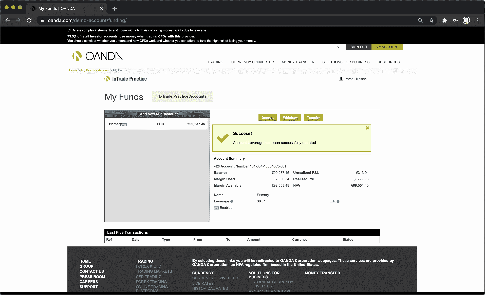

###### 图 10-8\. 在 Oanda 上设置杠杆

## 设置硬件

第二步是创建 DigitalOcean droplet，如图 10-9 所示。

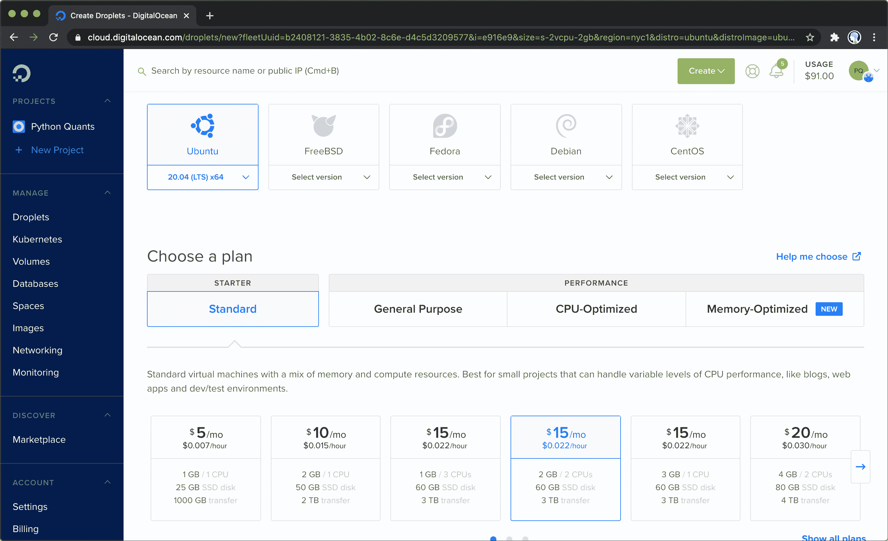

###### 图 10-9\. DigitalOcean droplet

## 设置 Python 环境

第三步是将所有软件放在 droplet 上（参见图 10-10），以建立基础设施。当一切正常运行时，您可以创建一个新的 Jupyter Notebook 并开始交互式 Python 会话（参见图 10-11）。

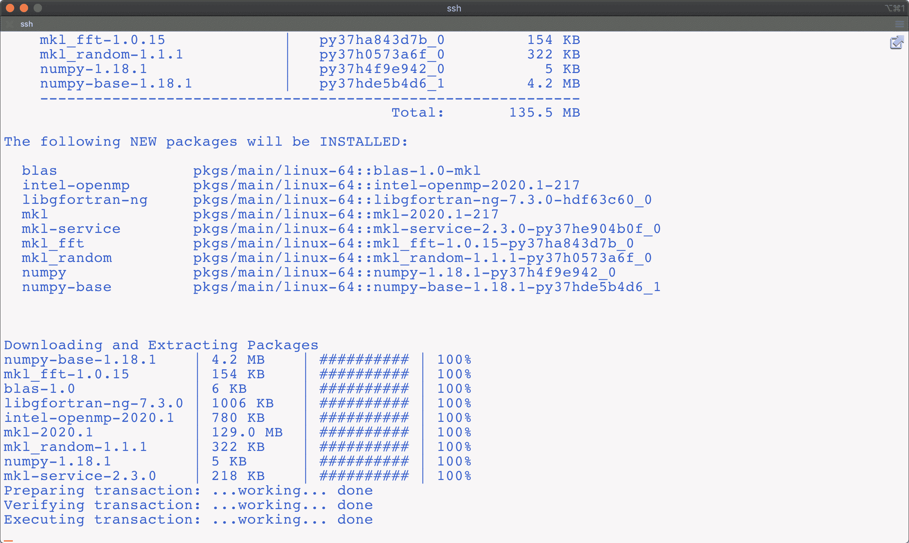

###### 图 10-10\. 安装 Python 和相关包


###### 图 10-11\. 测试 Jupyter Lab

## 上传代码

第四步是上传用于自动化交易和实时监控的 Python 脚本，如图 10-12 所示。还需上传包含账户凭证的配置文件。

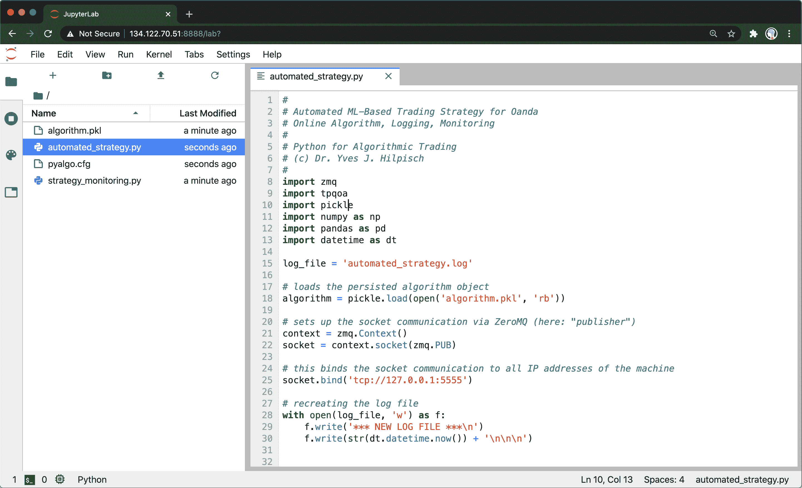

###### 图 10-12\. 上传 Python 代码文件

## 运行代码

第五步是运行 Python 脚本进行自动化交易，如图 10-13 所示。图 10-14 展示了 Python 脚本启动的交易。

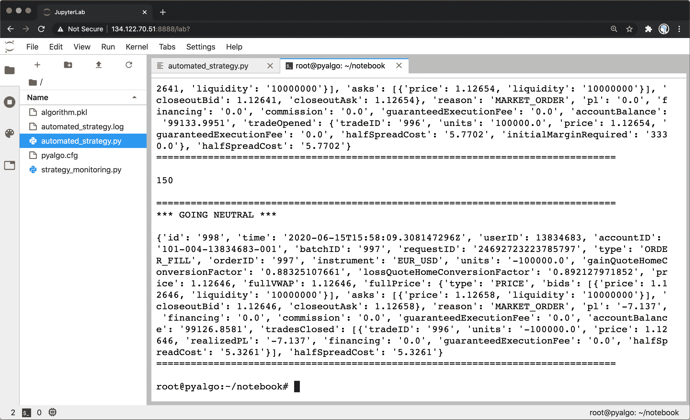

###### 图 10-13\. 运行 Python 脚本

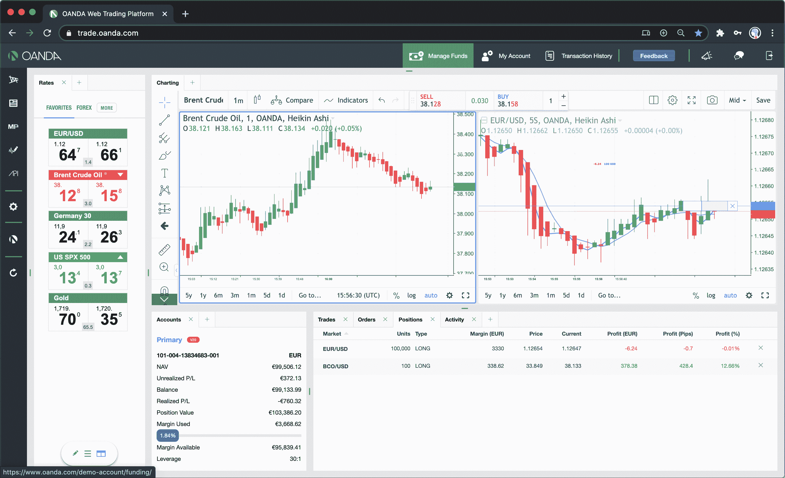

###### 图 10-14\. Python 脚本发起的交易

## 实时监控

最后一步是在本地运行监控脚本（假设您在本地脚本中设置了正确的 IP），如图 10-15 所示。实际上，这意味着您可以实时在本地监控云实例上正在发生的情况。

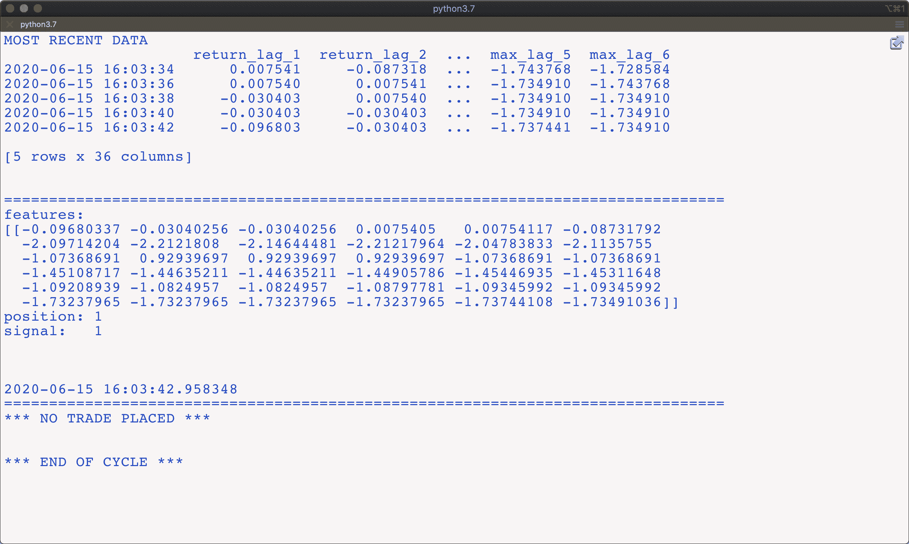

###### 图 10-15\. 通过 socket 进行本地实时监控

# 结论

本章介绍了基于机器学习分类算法部署算法交易策略的自动化方式，涵盖了资本管理（基于凯利准则）、基于向量化的性能和风险回测、将离线交易算法转化为在线的方式、适当的部署基础设施以及部署过程中的日志记录和监控。

本章主题复杂，需要算法交易从业者广泛的技能集。另一方面，有 RESTful API 可用于算法交易，例如来自 Oanda 的 API，显著简化了自动化任务，因为核心部分主要是利用 Python 封装包 `tpqoa` 的能力进行 tick 数据检索和订单下达。在这个核心周围，应根据适当和可能性加入减少操作和技术风险的元素。

# 参考文献和进一步资源

本章引用的论文：

+   Rotando, Louis, and Edward Thorp. 1992\. “The Kelly Criterion and the Stock Market.” *The American Mathematical Monthly* 99 (10): 922-931。

+   Hung, Jane. 2010\. “Betting with the Kelly Criterion.” [*http://bit.ly/betting_with_kelly*](http://bit.ly/betting_with_kelly)。

# Python 脚本

本节包含本章中使用的 Python 脚本。

## 自动化交易策略

下面的 Python 脚本包含了基于机器学习的交易策略的自动化部署代码，正如本章中所讨论和回测的那样：

```py
#
# Automated ML-Based Trading Strategy for Oanda
# Online Algorithm, Logging, Monitoring
#
# Python for Algorithmic Trading
# (c) Dr. Yves J. Hilpisch
#
import zmq
import tpqoa
import pickle
import numpy as np
import pandas as pd
import datetime as dt

log_file = 'automated_strategy.log'

# loads the persisted algorithm object
algorithm = pickle.load(open('algorithm.pkl', 'rb'))

# sets up the socket communication via ZeroMQ (here: "publisher")
context = zmq.Context()
socket = context.socket(zmq.PUB)

# this binds the socket communication to all IP addresses of the machine
socket.bind('tcp://0.0.0.0:5555')

# recreating the log file
with open(log_file, 'w') as f:
    f.write('*** NEW LOG FILE ***\n')
    f.write(str(dt.datetime.now()) + '\n\n\n')

def logger_monitor(message, time=True, sep=True):
    ''' Custom logger and monitor function.
 '''
    with open(log_file, 'a') as f:
        t = str(dt.datetime.now())
        msg = ''
        if time:
            msg += '\n' + t + '\n'
        if sep:
            msg += 80 * '=' + '\n'
        msg += message + '\n\n'
        # sends the message via the socket
        socket.send_string(msg)
        # writes the message to the log file
        f.write(msg)

class MLTrader(tpqoa.tpqoa):
    def __init__(self, config_file, algorithm):
        super(MLTrader, self).__init__(config_file)
        self.model = algorithm['model']
        self.mu = algorithm['mu']
        self.std = algorithm['std']
        self.units = 100000
        self.position = 0
        self.bar = '2s'
        self.window = 2
        self.lags = 6
        self.min_length = self.lags + self.window + 1
        self.features = ['return', 'vol', 'mom', 'sma', 'min', 'max']
        self.raw_data = pd.DataFrame()

    def prepare_features(self):
        self.data['return'] = np.log(
            self.data['mid'] / self.data['mid'].shift(1))
        self.data['vol'] = self.data['return'].rolling(self.window).std()
        self.data['mom'] = np.sign(
            self.data['return'].rolling(self.window).mean())
        self.data['sma'] = self.data['mid'].rolling(self.window).mean()
        self.data['min'] = self.data['mid'].rolling(self.window).min()
        self.data['max'] = self.data['mid'].rolling(self.window).max()
        self.data.dropna(inplace=True)
        self.data[self.features] -= self.mu
        self.data[self.features] /= self.std
        self.cols = []
        for f in self.features:
            for lag in range(1, self.lags + 1):
                col = f'{f}_lag_{lag}'
                self.data[col] = self.data[f].shift(lag)
                self.cols.append(col)

    def report_trade(self, pos, order):
        ''' Prints, logs, and sends trade data.
 '''
        out = '\n\n' + 80 * '=' + '\n'
        out += '*** GOING {} *** \n'.format(pos) + '\n'
        out += str(order) + '\n'
        out += 80 * '=' + '\n'
        logger_monitor(out)
        print(out)

    def on_success(self, time, bid, ask):
        print(self.ticks, 20 * ' ', end='\r')
        df = pd.DataFrame({'bid': float(bid), 'ask': float(ask)},
                          index=[pd.Timestamp(time).tz_localize(None)])
        self.raw_data = self.raw_data.append(df)
        self.data = self.raw_data.resample(
            self.bar, label='right').last().ffill()
        self.data = self.data.iloc[:-1]
        if len(self.data) > self.min_length:
            logger_monitor('NUMBER OF TICKS: {} | '.format(self.ticks) +
                           'NUMBER OF BARS: {}'.format(self.min_length))
            self.min_length += 1
            self.data['mid'] = (self.data['bid'] + self.data['ask']) / 2
            self.prepare_features()
            features = self.data[self.cols].iloc[-1].values.reshape(1, -1)
            signal = self.model.predict(features)[0]
            # logs and sends major financial information
            logger_monitor('MOST RECENT DATA\n' +
                           str(self.data[self.cols].tail()),
                           False)
            logger_monitor('features:\n' + str(features) + '\n' +
                           'position: ' + str(self.position) + '\n' +
                           'signal:   ' + str(signal), False)
            if self.position in [0, -1] and signal == 1:  # going long?
                order = self.create_order(self.stream_instrument,
                                          units=(1 - self.position) *
                                          self.units,
                                          suppress=True, ret=True)
                self.report_trade('LONG', order)
                self.position = 1
            elif self.position in [0, 1] and signal == -1:  # going short?
                order = self.create_order(self.stream_instrument,
                                          units=-(1 + self.position) *
                                          self.units,
                                          suppress=True, ret=True)
                self.report_trade('SHORT', order)
                self.position = -1
            else:  # no trade
                logger_monitor('*** NO TRADE PLACED ***')

            logger_monitor('*** END OF CYCLE ***\n\n', False, False)

if __name__ == '__main__':
    mlt = MLTrader('../pyalgo.cfg', algorithm)
    mlt.stream_data('EUR_USD', stop=150)
    order = mlt.create_order(mlt.stream_instrument,
                             units=-mlt.position * mlt.units,
                             suppress=True, ret=True)
    mlt.position = 0
    mlt.report_trade('NEUTRAL', order)
```

## 策略监控

下面的 Python 脚本包含了远程监控从“自动化交易策略”中执行的 Python 脚本的代码。

```py
#
# Automated ML-Based Trading Strategy for Oanda
# Strategy Monitoring via Socket Communication
#
# Python for Algorithmic Trading
# (c) Dr. Yves J. Hilpisch
#
import zmq

# sets up the socket communication via ZeroMQ (here: "subscriber")
context = zmq.Context()
socket = context.socket(zmq.SUB)

# adjust the IP address to reflect the remote location
socket.connect('tcp://134.122.70.51:5555')

# local IP address used for testing
# socket.connect('tcp://0.0.0.0:5555')

# configures the socket to retrieve every message
socket.setsockopt_string(zmq.SUBSCRIBE, '')

while True:
    msg = socket.recv_string()
    print(msg)
```

¹ 本文遵循了 Hung (2010) 的阐述。

² 重要的经验事实是，对于投资和交易表现来说，准确捕捉市场上的最大波动至关重要（即最大的赢家*和*输家波动）。这一方面在图 10-5 中得到了清晰的说明，图示了交易策略准确捕捉基础工具的大幅下跌运动，从而导致交易策略跳跃较大。

³ 使用链接[*http://bit.ly/do_sign_up*](http://bit.ly/do_sign_up)注册 DigitalOcean 新账户时，可获得 10 美元的奖金。

⁴ 这里使用的日志记录方法非常简单，以简单文本文件的形式。可以轻松地更改日志记录和持久化，比如将相关的金融数据以数据库或适当的二进制存储格式（如`HDF5`）的形式存储（参见第 3 章）。

⁵ 请注意，如同两个脚本中实现的那样，套接字通信未加密，通过网络发送明文，这可能在生产环境中代表着安全风险。
