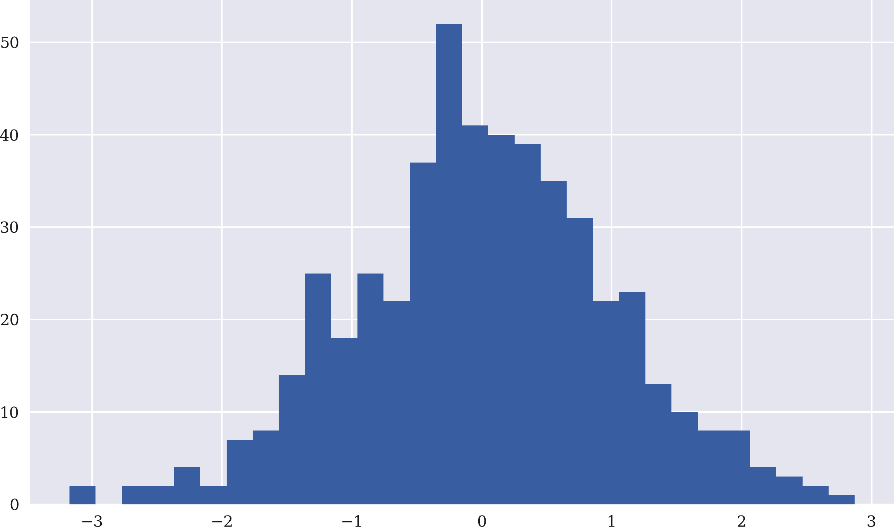
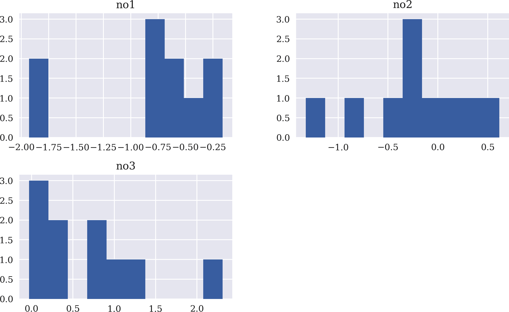

# 附录 A. Python、NumPy、matplotlib、pandas

> 谈论便宜。给我看代码。
> 
> Linus Torvalds

Python 已经成为一种强大的编程语言，并在过去几年中发展出了一个庞大的有用包生态系统。本附录提供了 Python 和所谓的*科学或数据科学栈*的三个主要支柱的简明概述：

+   `NumPy`（参见[*https://numpy.org*](https://numpy.org)）

+   `matplotlib`（参见[*https://matplotlib.org*](https://matplotlib.org)）

+   `pandas`（参见[*https://pandas.pydata.org*](https://pandas.pydata.org)）

`NumPy` 提供对大型同构数值数据集进行高性能数组操作，而 `pandas` 主要设计用于高效处理表格数据，例如财务时间序列数据。

这样一个简介附录——只涵盖与本书其余内容相关的选定主题——当然不能取代对 Python 及其涵盖的包进行彻底介绍。但是，如果你对 Python 或编程总体上比较新，你可能会得到一个初步的概述，并对 Python 的全貌有所了解。如果你已经在量化金融中使用其他语言（如 Matlab、R、C++ 或 VBA），你会看到 Python 中典型的数据结构、编程范式和习惯用法。

要了解 Python 应用于金融的全面概述，请参阅 Hilpisch（2018）。其他更一般的介绍，关注科学和数据分析的语言包括 VanderPlas（2017）和 McKinney（2017）。

# Python 基础

本节介绍基本的 Python 数据类型和结构、控制结构以及一些 Python 习惯用法。

## 数据类型

值得注意的是，Python 通常是一种*动态类型系统*，这意味着对象的类型是从其上下文中推断出来的。让我们从数字开始：

```py
In [1]: a = 3  

In [2]: type(a)  
Out[2]: int

In [3]: a.bit_length()  
Out[3]: 2

In [4]: b = 5.  

In [5]: type(b)
Out[5]: float
```


将变量名 `a` 分配为整数值 3。


查找 `a` 的类型。


查找用于存储整数值的位数。


将变量名 `b` 分配为浮点数值 5.0。

Python 可以处理任意大的整数，这对于数字理论应用非常有益，例如：

```py
In [6]: c = 10 ** 100  

In [7]: c
Out[7]: 100000000000000000000000000000000000000000000000000000000000000000000000
        00000000000000000000000000000

In [8]: c.bit_length()  
Out[8]: 333
```


分配一个“巨大”的整数值。


显示用于整数表示的位数。

对这些对象进行的算术运算按预期进行：

```py
In [9]: 3 / 5.  
Out[9]: 0.6

In [10]: a * b  
Out[10]: 15.0

In [11]: a - b  
Out[11]: -2.0

In [12]: b + a  
Out[12]: 8.0

In [13]: a ** b  
Out[13]: 243.0
```


除法。


乘法。


加法。


差异。


幂。

许多常用的数学函数可以在`math`模块中找到，它是 Python 标准库的一部分：

```py
In [14]: import math  

In [15]: math.log(a)  
Out[15]: 1.0986122886681098

In [16]: math.exp(a)  
Out[16]: 20.085536923187668

In [17]: math.sin(b)  
Out[17]: -0.9589242746631385
```


从标准库中导入`math`模块。


计算自然对数。


计算指数值。


计算正弦值。

另一个重要的基本数据类型是字符串对象（`str`）：

```py
In [18]: s = 'Python for Algorithmic Trading.'  

In [19]: type(s)
Out[19]: str

In [20]: s.lower()  
Out[20]: 'python for algorithmic trading.'

In [21]: s.upper()  
Out[21]: 'PYTHON FOR ALGORITHMIC TRADING.'

In [22]: s[0:6]  
Out[22]: 'Python'
```


将`str`对象赋给变量名`s`。


将所有字符转换为小写。


将所有字符转换为大写。


选择前六个字符。

这样的对象也可以使用`+`运算符组合。索引值–1 表示字符串的最后一个字符（或一般序列的最后一个元素）：

```py
In [23]: st = s[0:6] + s[-9:-1]  

In [24]: print(st)  
         Python Trading
```


将`str`对象的子集合并为一个新对象。


打印出结果。

字符串替换经常用于参数化文本输出：

```py
In [25]: repl = 'My name is %s, I am %d years old and %4.2f m tall.'  

In [26]: print(repl % ('Gordon Gekko', 43, 1.78))  
         My name is Gordon Gekko, I am 43 years old and 1.78 m tall.

In [27]: repl = 'My name is {:s}, I am {:d} years old and {:4.2f} m tall.' 

In [28]: print(repl.format('Gordon Gekko', 43, 1.78))  
         My name is Gordon Gekko, I am 43 years old and 1.78 m tall.

In [29]: name, age, height = 'Gordon Gekko', 43, 1.78 

In [30]: print(f'My name is {name:s}, I am {age:d} years old and \
 {height:4.2f}m tall.')  
         My name is Gordon Gekko, I am 43 years old and 1.78m tall.
```


用“旧”方式定义字符串模板。


用“旧”方式打印模板并替换值。


定义字符串模板的“新”方式。


用“新”方式打印模板并替换值。


为后续替换定义变量。


使用所谓的*f-string*进行字符串替换（Python 3.6 引入）。

## 数据结构

`tuple`对象是轻量级数据结构。这些是由逗号分隔的对象组成的不可变集合，可以用括号分隔或不分隔：

```py
In [31]: t1 = (a, b, st)  

In [32]: t1  
Out[32]: (3, 5.0, 'Python Trading')

In [33]: type(t1)
Out[33]: tuple

In [34]: t2 = st, b, a  

In [35]: t2
Out[35]: ('Python Trading', 5.0, 3)

In [36]: type(t2)
Out[36]: tuple
```


用括号构造一个`tuple`对象。


打印出`str`的表示。


用不带括号的方式构造`tuple`对象。

嵌套结构也是可能的：

```py
In [37]: t = (t1, t2)  

In [38]: t
Out[38]: ((3, 5.0, 'Python Trading'), ('Python Trading', 5.0, 3))

In [39]: t[0][2]  
Out[39]: 'Python Trading'
```


构建一个 `tuple` 对象，使用两个其他对象。


访问第一个对象的第三个元素。

`list` 对象是可变集合对象，通常通过在方括号中提供逗号分隔的对象集合构建：

```py
In [40]: l = [a, b, st]  

In [41]: l
Out[41]: [3, 5.0, 'Python Trading']

In [42]: type(l)
Out[42]: list

In [43]: l.append(s.split()[3])  

In [44]: l
Out[44]: [3, 5.0, 'Python Trading', 'Trading.']
```


使用方括号生成一个 `list` 对象。


将一个新元素（字符串的最后一个单词）附加到 `list` 对象。

对 `list` 对象进行排序是典型操作，也可以使用 `list` 构造函数构建（这里应用于一个 tuple 对象）：

```py
In [45]: l = list(('Z', 'Q', 'D', 'J', 'E', 'H', '5.', 'a'))  

In [46]: l
Out[46]: ['Z', 'Q', 'D', 'J', 'E', 'H', '5.', 'a']

In [47]: l.sort()  

In [48]: l
Out[48]: ['5.', 'D', 'E', 'H', 'J', 'Q', 'Z', 'a']
```


使用一个 `tuple` 对象创建一个 `list` 对象。


在原地对所有元素进行排序（即更改对象本身）。

字典（`dict`）对象是所谓的键值存储，通常用花括号构建：

```py
In [49]: d = {'int_obj': a, 'float_obj': b, 'string_obj': st}  

In [50]: type(d)
Out[50]: dict

In [51]: d
Out[51]: {'int_obj': 3, 'float_obj': 5.0, 'string_obj': 'Python Trading'}

In [52]: d['float_obj']  
Out[52]: 5.0

In [53]: d['int_obj_long'] = 10 ** 20  

In [54]: d
Out[54]: {'int_obj': 3,
          'float_obj': 5.0,
          'string_obj': 'Python Trading',
          'int_obj_long': 100000000000000000000}

In [55]: d.keys()  
Out[55]: dict_keys(['int_obj', 'float_obj', 'string_obj', 'int_obj_long'])

In [56]: d.values()  
Out[56]: dict_values([3, 5.0, 'Python Trading', 100000000000000000000])
```


使用花括号和键值对创建一个 `dict` 对象。


根据键访问值。


添加一个新的键值对。


选择并显示所有键。


选择并显示所有数值。

## 控制结构

迭代在编程一般和金融分析特别是很重要。许多 Python 对象都是可迭代的，在许多情况下非常方便。考虑特殊的迭代器对象 `range`：

```py
In [57]: range(5)  
Out[57]: range(0, 5)

In [58]: range(3, 15, 2)  
Out[58]: range(3, 15, 2)

In [59]: for i in range(5):  
             print(i ** 2, end=' ')  
         0 1 4 9 16
In [60]: for i in range(3, 15, 2):
             print(i, end=' ')
         3 5 7 9 11 13
In [61]: l = ['a', 'b', 'c', 'd', 'e']

In [62]: for _ in l:  
             print(_)
         a
         b
         c
         d
         e

In [63]: s = 'Python Trading'

In [64]: for c in s:  
             print(c + '|', end='')
         P|y|t|h|o|n| |T|r|a|d|i|n|g|
```


给定一个单参数（结束值 + 1）的对象。


使用 `start`、`end` 和 `step` 参数值创建一个 `range` 对象。


迭代一个 `range` 对象并打印平方值。


使用 `start`、`end` 和 `step` 参数迭代一个 `range` 对象。


迭代一个 `list` 对象。


迭代一个 `str` 对象。

`while` 循环与其他语言中的类似：

```py
In [65]: i = 0  

In [66]: while i < 5:  
             print(i ** 0.5, end=' ')  
             i += 1  
         0.0 1.0 1.4142135623730951 1.7320508075688772 2.0
```


将计数器值设置为 0。


只要 `i` 的值小于 5…


…打印 `i` 的平方根，并且…


…增加`i`的值 1。

## Python 习语

Python 在许多地方依赖于一些特殊的习语。让我们从一个相当流行的习语开始，即*列表推导*：

```py
In [67]: lc = [i ** 2 for i in range(10)]  

In [68]: lc
Out[68]: [0, 1, 4, 9, 16, 25, 36, 49, 64, 81]

In [69]: type(lc)
Out[69]: list
```


基于*列表推导*语法创建一个新的`list`对象（括号中的`for`循环）。

所谓的*lambda*或*匿名函数*在许多地方都是有用的助手：

```py
In [70]: f = lambda x: math.cos(x)  

In [71]: f(5)  
Out[71]: 0.2836621854632263

In [72]: list(map(lambda x: math.cos(x), range(10)))  
Out[72]: [1.0,
          0.5403023058681398,
          -0.4161468365471424,
          -0.9899924966004454,
          -0.6536436208636119,
          0.2836621854632263,
          0.9601702866503661,
          0.7539022543433046,
          -0.14550003380861354,
          -0.9111302618846769]
```


通过`lambda`语法定义一个新的函数`f`。


评估值为 5 时的函数`f`。


将函数`f`映射到`range`对象的所有元素，并创建一个包含结果的`list`对象，然后将其打印出来。

一般而言，使用常规的 Python 函数（而不是 lambda 函数），构建如下：

```py
In [73]: def f(x):  
             return math.exp(x)  

In [74]: f(5)
Out[74]: 148.4131591025766

In [75]: def f(*args):  
             for arg in args:  
                 print(arg)  
             return None  

In [76]: f(l)  
         ['a', 'b', 'c', 'd', 'e']
```


常规函数使用`def`语句进行定义。


使用`return`语句时，定义执行/评估成功时返回的内容；可以有多个`return`语句（例如，针对不同情况）。


`–0—`允许将多个参数作为可迭代对象传递（例如，`list`对象）。


遍历参数。


对每个参数执行某些操作：在此处是打印。


返回某些内容：在此处是`None`；对于有效的 Python 函数来说并非必需。


将`list`对象`l`传递给函数`f`，该函数将其解释为参数列表。

考虑以下函数定义，根据`if-elif-else`控制结构返回不同的值/字符串：

```py
In [77]: import random  

In [78]: a = random.randint(0, 1000)  

In [79]: print(f'Random number is {a}')  
         Random number is 188

In [80]: def number_decide(number):
             if a < 10:  
                 return "Number is single digit."
             elif 10 <= a < 100:  
                 return "Number is double digit."
             else:  
                 return "Number is triple digit."

In [81]: number_decide(a)  
Out[81]: 'Number is triple digit.'
```


导入`random`模块以生成随机数。


生成 0 到 1,000 之间的随机整数。


打印所绘制数字的值。


检查是否为单个数字，如果为`False`…


…检查是否为两位数；如果也为`False`…


…剩下的情况只有三位数。


用随机数值`a`调用函数。

# NumPy

许多计算金融中的操作涉及大量的数值数据数组。`NumPy`是一个 Python 包，允许高效处理和操作这样的数据结构。虽然`NumPy`功能强大且丰富，但本书的目的是涵盖`NumPy`的基础知识即可。关于`NumPy`的一本不错的在线书籍是[*从 Python 到 NumPy*](https://oreil.ly/Yxequ)。它详细介绍了许多重要的方面，这些方面在下面的章节中被省略了。

## 常规的`ndarray`对象

`NumPy`的工作马是`ndarray`类，为 n 维数组对象提供数据结构。例如，可以从`list`对象生成一个`ndarray`对象：

```py
In [82]: import numpy as np  

In [83]: a = np.array(range(24))  

In [84]: a  
Out[84]: array([ 0,  1,  2,  3,  4,  5,  6,  7,  8,  9, 10, 11, 12, 13, 14,
          15, 16,
                17, 18, 19, 20, 21, 22, 23])

In [85]: b = a.reshape((4, 6))  

In [86]: b  
Out[86]: array([[ 0,  1,  2,  3,  4,  5],
                [ 6,  7,  8,  9, 10, 11],
                [12, 13, 14, 15, 16, 17],
                [18, 19, 20, 21, 22, 23]])

In [87]: c = a.reshape((2, 3, 4))  

In [88]: c  
Out[88]: array([[[ 0,  1,  2,  3],
                 [ 4,  5,  6,  7],
                 [ 8,  9, 10, 11]],

                [[12, 13, 14, 15],
                 [16, 17, 18, 19],
                 [20, 21, 22, 23]]])

In [89]: b = np.array(b, dtype=np.float)  

In [90]: b  
Out[90]: array([[ 0.,  1.,  2.,  3.,  4.,  5.],
                [ 6.,  7.,  8.,  9., 10., 11.],
                [12., 13., 14., 15., 16., 17.],
                [18., 19., 20., 21., 22., 23.]])
```


按约定将`NumPy`导入为`np`。


从`range`对象实例化一个`ndarray`对象；例如也可以使用`np.arange`。


打印出这些值。


将对象重塑为二维对象…


…并打印出结果。


将对象重塑为三维对象…


…并打印出结果。


这会改变对象的`dtype`为`np.float`并且…


…显示了一组新的（现在是浮点数的）数字。

许多 Python 数据结构设计得非常通用。一个例子是可变的`list`对象，可以以多种方式轻松操作（添加和删除元素，存储其他复杂数据结构等）。`NumPy`与常规的`ndarray`对象的策略是提供一种更专业的数据结构，其中所有元素都是同一种原子类型，并且允许在内存中连续存储。这使得`ndarray`对象在解决某些情境下的问题时更加优秀，例如在操作较大或大型数值数据集时。在`NumPy`的情况下，这种专门化还伴随着对程序员的便利性，一方面，另一方面通常会提高速度。

## 向量化操作

`NumPy`的一个主要优势是*向量化操作*：

```py
In [91]: 2 * b  
Out[91]: array([[ 0.,  2.,  4.,  6.,  8., 10.],
                [12., 14., 16., 18., 20., 22.],
                [24., 26., 28., 30., 32., 34.],
                [36., 38., 40., 42., 44., 46.]])

In [92]: b ** 2  
Out[92]: array([[  0.,   1.,   4.,   9.,  16.,  25.],
                [ 36.,  49.,  64.,  81., 100., 121.],
                [144., 169., 196., 225., 256., 289.],
                [324., 361., 400., 441., 484., 529.]])

In [93]: f = lambda x: x ** 2 - 2 * x + 0.5  

In [94]: f(a)  
Out[94]: array([  0.5,  -0.5,   0.5,   3.5,   8.5,  15.5,  24.5,  35.5,
          48.5,
         63.5,  80.5,  99.5, 120.5, 143.5, 168.5, 195.5, 224.5, 255.5,
                288.5, 323.5, 360.5, 399.5, 440.5, 483.5])
```


在一维`ndarray`对象（向量）上实现标量乘法。


以向量化的方式计算`b`中每个数字的平方。


通过 `lambda` 构造函数定义函数 `f`。


使用向量化将 `f` 应用于 `ndarray` 对象 `a`。

在许多情况下，仅感兴趣的是存储在 `ndarray` 对象中的（少量）数据。`NumPy` 支持基本和高级切片以及其他选择功能：

```py
In [95]: a[2:6]  
Out[95]: array([2, 3, 4, 5])

In [96]: b[2, 4]  
Out[96]: 16.0

In [97]: b[1:3, 2:4]  
Out[97]: array([[ 8.,  9.],
                [14., 15.]])
```


选择第三到第六个元素。


选择第三行和第五行（最后）。


从 `b` 对象中选出中间的正方形。

## 布尔运算

布尔运算也在许多地方得到支持：

```py
In [98]: b > 10  
Out[98]: array([[False, False, False, False, False, False],
                [False, False, False, False, False,  True],
                [ True,  True,  True,  True,  True,  True],
                [ True,  True,  True,  True,  True,  True]])

In [99]: b[b > 10]  
Out[99]: array([11., 12., 13., 14., 15., 16., 17., 18., 19., 20., 21., 22.,
          23.])
```


哪些数字大于 10？


返回所有大于 10 的数字。

## ndarray 方法和 NumPy 函数

此外，`ndarray` 对象已经内置了多个（方便的）方法：

```py
In [100]: a.sum()  
Out[100]: 276

In [101]: b.mean()  
Out[101]: 11.5

In [102]: b.mean(axis=0)  
Out[102]: array([ 9., 10., 11., 12., 13., 14.])

In [103]: b.mean(axis=1)  
Out[103]: array([ 2.5,  8.5, 14.5, 20.5])

In [104]: c.std()  
Out[104]: 6.922186552431729
```


所有元素的总和。


所有元素的均值。


沿第一个轴的均值。


沿第二个轴的均值。


所有元素的标准差。

同样，`NumPy` 包提供了大量所谓的*通用函数*。它们是通用的，因为它们可以普遍应用于 `NumPy` 的 `ndarray` 对象和标准的数值 Python 数据类型。有关详细信息，请参阅[通用函数 (ufunc)](https://oreil.ly/Ogiah)：

```py
In [105]: np.sum(a)  
Out[105]: 276

In [106]: np.mean(b, axis=0)  
Out[106]: array([ 9., 10., 11., 12., 13., 14.])

In [107]: np.sin(b).round(2)  
Out[107]: array([[ 0.  ,  0.84,  0.91,  0.14, -0.76, -0.96],
                 [-0.28,  0.66,  0.99,  0.41, -0.54, -1.  ],
                 [-0.54,  0.42,  0.99,  0.65, -0.29, -0.96],
                 [-0.75,  0.15,  0.91,  0.84, -0.01, -0.85]])

In [108]: np.sin(4.5)  
Out[108]: -0.977530117665097
```


所有元素的总和。


沿第一个轴的均值。


对所有元素取正弦值并保留两位小数。


Python `float` 对象的正弦值。

但是，您应该注意，将 `NumPy` 通用函数应用于标准的 Python 数据类型通常会带来显著的性能负担：

```py
In [109]: %time l = [np.sin(x) for x in range(1000000)]  
          CPU times: user 1.21 s, sys: 22.9 ms, total: 1.24 s
          Wall time: 1.24 s

In [110]: %time l = [math.sin(x) for x in range(1000000)]  
          CPU times: user 215 ms, sys: 22.9 ms, total: 238 ms
          Wall time: 239 ms
```


在 Python `float` 对象上使用 `NumPy` 通用函数的列表推导。


在 Python `float` 对象上使用 `math` 函数的列表推导。

使用 `NumPy` 中的向量化操作对 `ndarray` 对象进行操作比前述生成 `list` 对象的两种方法更快。然而，速度优势通常是以更大甚至巨大的内存占用为代价的：

```py
In [111]: %time a = np.sin(np.arange(1000000))  
          CPU times: user 20.7 ms, sys: 5.32 ms, total: 26 ms
          Wall time: 24.6 ms

In [112]: import sys  

In [113]: sys.getsizeof(a)  
Out[113]: 8000096

In [114]: a.nbytes  
Out[114]: 8000000
```


使用 `NumPy` 对正弦值进行向量化计算，这通常更快。


导入具有许多与系统相关的功能的 `sys` 模块。


显示内存中 `a` 对象的大小。


显示存储在 `a` 对象中的数据所使用的字节数。

向量化有时是编写简洁代码的非常有用的方法，通常也比 Python 代码快得多。但是，请注意向量化可能在与金融相关的许多场景中具有的内存占用。通常，还有替代算法实现可用，这些实现在内存效率上更高，并且通过使用性能库（如 `Numba` 或 `Cython`）甚至可能更快。参见 Hilpisch (2018, 第十章)。

## ndarray 创建

在这里，我们使用 ndarray 对象构造函数 `np.arange()`，它生成一个整数的 `ndarray` 对象。以下是一个简单的例子：

```py
In [115]: ai = np.arange(10)  

In [116]: ai  
Out[116]: array([0, 1, 2, 3, 4, 5, 6, 7, 8, 9])

In [117]: ai.dtype  
Out[117]: dtype('int64')

In [118]: af = np.arange(0.5, 9.5, 0.5)  

In [119]: af  
Out[119]: array([0.5, 1. , 1.5, 2. , 2.5, 3. , 3.5, 4. , 4.5, 5. , 5.5, 6. ,
           6.5,
                 7. , 7.5, 8. , 8.5, 9. ])

In [120]: af.dtype  
Out[120]: dtype('float64')

In [121]: np.linspace(0, 10, 12)  
Out[121]: array([ 0.        ,  0.90909091,  1.81818182,  2.72727273,
           3.63636364,
          4.54545455,  5.45454545,  6.36363636,  7.27272727,  8.18181818,
                  9.09090909, 10.        ])
```


通过 `np.arange()` 构造函数实例化一个 `ndarray` 对象。


打印出数值。


结果的 `dtype` 是 `np.int64`。


再次使用 `arange()`，但这次带有 `start`、`end` 和 `step` 参数。


打印出数值。


结果的 `dtype` 是 `np.float64`。


使用 `linspace()` 构造函数，在 0 到 10 之间均匀分布 11 个间隔，返回一个具有 12 个值的 `ndarray` 对象。

## 随机数

在金融分析中，人们经常需要随机^(1) 数字。 `NumPy` 提供了许多从不同分布中抽样的函数。在量化金融中经常需要的是标准正态分布和泊松分布。相应的函数位于子包 `numpy.random` 中：

```py
In [122]: np.random.standard_normal(10)   
Out[122]: array([-1.06384884, -0.22662171,  1.2615483 , -0.45626608,
           -1.23231112,
          -1.51309987,  1.23938439,  0.22411366, -0.84616512, -1.09923136])

In [123]: np.random.poisson(0.5, 10)  
Out[123]: array([0, 1, 1, 0, 0, 1, 0, 0, 2, 0])

In [124]: np.random.seed(1000)  

In [125]: data = np.random.standard_normal((5, 100))  

In [126]: data[:, :3]  
Out[126]: array([[-0.8044583 ,  0.32093155, -0.02548288],
                 [-0.39031935, -0.58069634,  1.94898697],
                 [-1.11573322, -1.34477121,  0.75334374],
                 [ 0.42400699, -1.56680276,  0.76499895],
                 [-1.74866738, -0.06913021,  1.52621653]])

In [127]: data.mean()  
Out[127]: -0.02714981205311327

In [128]: data.std()  
Out[128]: 1.0016799134894265

In [129]: data = data - data.mean()  

In [130]: data.mean()  
Out[130]: 3.552713678800501e-18

In [131]: data = data / data.std()  

In [132]: data.std()  
Out[132]: 1.0
```


抽取十个标准正态分布的随机数。


抽取十个泊松分布的随机数。


固定随机数生成器的种子值以便重复性。


生成一个带有随机数的二维`ndarray`对象。


打印一小部分数字。


所有值的平均值接近于`0`，但不完全是`0`。


标准差接近于`1`，但不完全是`1`。


第一时刻以向量化的方式进行修正。


现在的平均值“几乎等于”`0`。


第二时刻以向量化的方式进行修正。


现在标准差正好是`1`。

# matplotlib

此时，引入使用[`matplotlib`](http://matplotlib.org)进行绘图是有意义的，在 Python 生态系统中，`matplotlib`是主要的绘图工具。我们始终使用另一个库的设置，即[`seaborn`](https://oreil.ly/SWvT6)，这样可以得到更现代的绘图风格。以下代码生成图 A-1：

```py
In [133]: import matplotlib.pyplot as plt  

In [134]: plt.style.use('seaborn')  

In [135]: import matplotlib as mpl  

In [136]: mpl.rcParams['savefig.dpi'] = 300  
          mpl.rcParams['font.family'] = 'serif'  
          %matplotlib inline

In [137]: data = np.random.standard_normal((5, 100))  

In [138]: plt.figure(figsize=(10, 6))  
          plt.plot(data.cumsum())  
Out[138]: [<matplotlib.lines.Line2D at 0x7faceaaeed30>]
```


导入主要的绘图库。


设置新的绘图样式默认值。


导入顶级模块。


将分辨率设置为 300 DPI（用于保存），字体设置为`serif`。


生成一个带有随机数的`ndarray`对象。


实例化一个新的`figure`对象。


首先计算`ndarray`对象所有元素的累积和，然后绘制结果。


###### 图 A-1\. 使用`matplotlib`绘制折线图

在单个`figure`对象中生成多条线图也很容易（见图 A-2）：

```py
In [139]: plt.figure(figsize=(10, 6));  
          plt.plot(data.T.cumsum(axis=0), label='line')  
          plt.legend(loc=0);  
          plt.xlabel('data point')  
          plt.ylabel('value');  
          plt.title('random series');  
```


实例化一个新的`figure`对象并定义其大小。


通过沿第一个轴计算累积和来绘制五条线，并定义一个标签。


将图例放置在最佳位置（`loc=0`）。


添加 x 轴的标签。


添加 y 轴的标签。


为图添加标题。


###### 图 A-2\. 包含多条线的图

其他重要的绘图类型包括直方图和条形图。显示了数据对象的 500 个值的直方图，如图 A-3 所示。在代码中，使用`.flatten()`方法从二维数组生成一维数组：

```py
In [140]: plt.figure(figsize=(10, 6))
          plt.hist(data.flatten(), bins=30);  
```


绘制包含 30 个柱（数据组）的直方图。

最后，考虑由以下代码生成的条形图图 A-4：

```py
In [141]: plt.figure(figsize=(10, 6))
          plt.bar(np.arange(1, 12) - 0.25,
                  data[0, :11], width=0.5);  
```


基于原始数据集的一个小子集绘制条形图。



###### 图 A-3\. 随机数据的直方图


###### 图 A-4\. 随机数据的条形图

结束对`matplotlib`的介绍，考虑在图 A-5 中显示的样本数据的普通最小二乘（OLS）回归。`NumPy`提供了两个函数`polyfit`和`polyval`，便于基于简单单项式实现 OLS，<math alttext="x comma x squared comma x cubed comma period period period comma x Superscript n"><mrow><mi>x</mi> <mo>,</mo> <msup><mi>x</mi> <mn>2</mn></msup> <mo>,</mo> <msup><mi>x</mi> <mn>3</mn></msup> <mo>,</mo> <mo>.</mo> <mo>.</mo> <mo>.</mo> <mo>,</mo> <msup><mi>x</mi> <mi>n</mi></msup></mrow></math> 。举例说明，考虑线性、三次和九次 OLS 回归（见图 A-5）：

```py
In [142]: x = np.arange(len(data.cumsum()))  

In [143]: y = 0.2 * data.cumsum() ** 2 

In [144]: rg1 = np.polyfit(x, y, 1)  

In [145]: rg3 = np.polyfit(x, y, 3)  

In [146]: rg9 = np.polyfit(x, y, 9)  

In [147]: plt.figure(figsize=(10, 6))  
          plt.plot(x, y, 'r', label='data')  
          plt.plot(x, np.polyval(rg1, x), 'b--', label='linear')  
          plt.plot(x, np.polyval(rg3, x), 'b-.', label='cubic')  
          plt.plot(x, np.polyval(rg9, x), 'b:', label='9th degree')  
          plt.legend(loc=0);  
```


创建`x`值的`ndarray`对象。


将`y`值定义为`data`对象的累积和。


线性回归。


三次回归。


九次回归。


新的`figure`对象。


基础数据。


可视化的回归结果。


添加图例。


###### 图 A-5\. 线性、三次和九次回归

# pandas

`pandas`是一个能够高效管理和操作时间序列数据及其他表格数据结构的包。它允许在内存中处理甚至是相当大的数据集上执行复杂的数据分析任务。虽然重点在于内存操作，但也有多种用于外存（磁盘）操作的选项。尽管`pandas`提供了多种不同的数据结构，通过强大的类来体现，但最常用的结构是`DataFrame`类，它类似于关系型（SQL）数据库的典型表格，并用于管理例如金融时间序列数据。这是本节的重点。

## DataFrame 类

在其最基本形式中，`DataFrame`对象由索引、列名和表格数据组成。为了更具体地说明，考虑以下示例数据集：

```py
In [148]: import pandas as pd  

In [149]: np.random.seed(1000)  

In [150]: raw = np.random.standard_normal((10, 3)).cumsum(axis=0)  

In [151]: index = pd.date_range('2022-1-1', periods=len(raw), freq='M')  

In [152]: columns = ['no1', 'no2', 'no3']  

In [153]: df = pd.DataFrame(raw, index=index, columns=columns)  

In [154]: df  
Out[154]:                  no1       no2       no3
          2022-01-31 -0.804458  0.320932 -0.025483
          2022-02-28 -0.160134  0.020135  0.363992
          2022-03-31 -0.267572 -0.459848  0.959027
          2022-04-30 -0.732239  0.207433  0.152912
          2022-05-31 -1.928309 -0.198527 -0.029466
          2022-06-30 -1.825116 -0.336949  0.676227
          2022-07-31 -0.553321 -1.323696  0.341391
          2022-08-31 -0.652803 -0.916504  1.260779
          2022-09-30 -0.340685  0.616657  0.710605
          2022-10-31 -0.723832 -0.206284  2.310688
```


导入`pandas`包。


设置`NumPy`随机数生成器的种子值。


使用随机数创建一个`ndarray`对象。


定义一个包含一些日期的`DatetimeIndex`对象。


定义一个包含列名（标签）的`list`对象。


实例化一个`DataFrame`对象。


展示新对象的`str`（HTML）表示。

`DataFrame`对象具有多种基本、高级和便利方法，下面的 Python 代码演示了其中的一些：

```py
In [155]: df.head()  
Out[155]:                  no1       no2       no3
          2022-01-31 -0.804458  0.320932 -0.025483
          2022-02-28 -0.160134  0.020135  0.363992
          2022-03-31 -0.267572 -0.459848  0.959027
          2022-04-30 -0.732239  0.207433  0.152912
          2022-05-31 -1.928309 -0.198527 -0.029466

In [156]: df.tail()  
Out[156]:                  no1       no2       no3
          2022-06-30 -1.825116 -0.336949  0.676227
          2022-07-31 -0.553321 -1.323696  0.341391
          2022-08-31 -0.652803 -0.916504  1.260779
          2022-09-30 -0.340685  0.616657  0.710605
          2022-10-31 -0.723832 -0.206284  2.310688

In [157]: df.index  
Out[157]: DatetimeIndex(['2022-01-31', '2022-02-28', '2022-03-31',
           '2022-04-30',
          '2022-05-31', '2022-06-30', '2022-07-31', '2022-08-31',
                         '2022-09-30', '2022-10-31'],
                        dtype='datetime64[ns]', freq='M')

In [158]: df.columns  
Out[158]: Index(['no1', 'no2', 'no3'], dtype='object')

In [159]: df.info()  
          <class 'pandas.core.frame.DataFrame'>
          DatetimeIndex: 10 entries, 2022-01-31 to 2022-10-31
          Freq: M
          Data columns (total 3 columns):
           #   Column  Non-Null Count  Dtype
          ---  ------  --------------  -----
           0   no1     10 non-null     float64
           1   no2     10 non-null     float64
           2   no3     10 non-null     float64
          dtypes: float64(3)
          memory usage: 320.0 bytes

In [160]: df.describe()  
Out[160]:              no1        no2        no3
          count  10.000000  10.000000  10.000000
          mean   -0.798847  -0.227665   0.672067
          std     0.607430   0.578071   0.712430
          min    -1.928309  -1.323696  -0.029466
          25%    -0.786404  -0.429123   0.200031
          50%    -0.688317  -0.202406   0.520109
          75%    -0.393844   0.160609   0.896922
          max    -0.160134   0.616657   2.310688
```


展示前五行数据。


展示最后五行数据。


打印对象的`index`属性。


打印对象的`column`属性。


展示对象的一些元数据。


提供关于数据的选定摘要统计信息。

虽然`NumPy`提供了一个专门的多维数组数据结构（通常用于数值数据），`pandas`将专门化推向了一个更高的层次，使用`DataFrame`类处理表格（二维）数据。特别是在处理金融时间序列数据方面，`pandas`表现出色，正如后续的例子所示。

## 数值操作

`DataFrame`对象与`NumPy`的`ndarray`对象一样，可以轻松进行数值运算。它们在语法上也非常接近：

```py
In [161]: print(df * 2)  
                           no1       no2       no3
          2022-01-31 -1.608917  0.641863 -0.050966
          2022-02-28 -0.320269  0.040270  0.727983
          2022-03-31 -0.535144 -0.919696  1.918054
          2022-04-30 -1.464479  0.414866  0.305823
          2022-05-31 -3.856618 -0.397054 -0.058932
          2022-06-30 -3.650232 -0.673898  1.352453
          2022-07-31 -1.106642 -2.647393  0.682782
          2022-08-31 -1.305605 -1.833009  2.521557
          2022-09-30 -0.681369  1.233314  1.421210
          2022-10-31 -1.447664 -0.412568  4.621376

In [162]: df.std()  
Out[162]: no1    0.607430
          no2    0.578071
          no3    0.712430
          dtype: float64

In [163]: df.mean()  
Out[163]: no1   -0.798847
          no2   -0.227665
          no3    0.672067
          dtype: float64

In [164]: df.mean(axis=1)  
Out[164]: 2022-01-31   -0.169670
          2022-02-28    0.074664
          2022-03-31    0.077202
          2022-04-30   -0.123965
          2022-05-31   -0.718767
          2022-06-30   -0.495280
          2022-07-31   -0.511875
          2022-08-31   -0.102843
          2022-09-30    0.328859
          2022-10-31    0.460191
          Freq: M, dtype: float64

In [165]: np.mean(df)  
Out[165]: no1   -0.798847
          no2   -0.227665
          no3    0.672067
          dtype: float64
```


所有元素的标量（向量化）乘法。


计算按列的标准差…


…以及均值。对于 `DataFrame` 对象，默认是按列进行操作。


计算每个索引值的均值（即，按行）。


将 `NumPy` 的函数应用于 `DataFrame` 对象。

## 数据选择

数据可以通过不同的机制查找：

```py
In [166]: df['no2']  
Out[166]: 2022-01-31    0.320932
          2022-02-28    0.020135
          2022-03-31   -0.459848
          2022-04-30    0.207433
          2022-05-31   -0.198527
          2022-06-30   -0.336949
          2022-07-31   -1.323696
          2022-08-31   -0.916504
          2022-09-30    0.616657
          2022-10-31   -0.206284
          Freq: M, Name: no2, dtype: float64

In [167]: df.iloc[0]  
Out[167]: no1   -0.804458
          no2    0.320932
          no3   -0.025483
          Name: 2022-01-31 00:00:00, dtype: float64

In [168]: df.iloc[2:4]  
Out[168]:                  no1       no2       no3
          2022-03-31 -0.267572 -0.459848  0.959027
          2022-04-30 -0.732239  0.207433  0.152912

In [169]: df.iloc[2:4, 1]  
Out[169]: 2022-03-31   -0.459848
          2022-04-30    0.207433
          Freq: M, Name: no2, dtype: float64

In [170]: df.no3.iloc[3:7]  
Out[170]: 2022-04-30    0.152912
          2022-05-31   -0.029466
          2022-06-30    0.676227
          2022-07-31    0.341391
          Freq: M, Name: no3, dtype: float64

In [171]: df.loc['2022-3-31']  
Out[171]: no1   -0.267572
          no2   -0.459848
          no3    0.959027
          Name: 2022-03-31 00:00:00, dtype: float64

In [172]: df.loc['2022-5-31', 'no3']  
Out[172]: -0.02946577492329111

In [173]: df['no1'] + 3 * df['no3']  
Out[173]: 2022-01-31   -0.880907
          2022-02-28    0.931841
          2022-03-31    2.609510
          2022-04-30   -0.273505
          2022-05-31   -2.016706
          2022-06-30    0.203564
          2022-07-31    0.470852
          2022-08-31    3.129533
          2022-09-30    1.791130
          2022-10-31    6.208233
          Freq: M, dtype: float64
```


按名称选择列。


按索引位置选择一行。


按索引位置选择两行。


按索引位置从一列中选择两个行值。


使用点查找语法选择列。


按索引值选择一行。


按索引值和列名选择单个数据点。


实现向量化的算术操作。

## 布尔运算

基于布尔运算进行的数据选择也是 pandas 的优势之一：

```py
In [174]: df['no3'] > 0.5  
Out[174]: 2022-01-31    False
          2022-02-28    False
          2022-03-31     True
          2022-04-30    False
          2022-05-31    False
          2022-06-30     True
          2022-07-31    False
          2022-08-31     True
          2022-09-30     True
          2022-10-31     True
          Freq: M, Name: no3, dtype: bool

In [175]: df[df['no3'] > 0.5]  
Out[175]:                  no1       no2       no3
          2022-03-31 -0.267572 -0.459848  0.959027
          2022-06-30 -1.825116 -0.336949  0.676227
          2022-08-31 -0.652803 -0.916504  1.260779
          2022-09-30 -0.340685  0.616657  0.710605
          2022-10-31 -0.723832 -0.206284  2.310688

In [176]: df[(df.no3 > 0.5) & (df.no2 > -0.25)]  
Out[176]:                  no1       no2       no3
          2022-09-30 -0.340685  0.616657  0.710605
          2022-10-31 -0.723832 -0.206284  2.310688

In [177]: df[df.index > '2022-5-15']  
Out[177]:                  no1       no2       no3
          2022-05-31 -1.928309 -0.198527 -0.029466
          2022-06-30 -1.825116 -0.336949  0.676227
          2022-07-31 -0.553321 -1.323696  0.341391
          2022-08-31 -0.652803 -0.916504  1.260779
          2022-09-30 -0.340685  0.616657  0.710605
          2022-10-31 -0.723832 -0.206284  2.310688

In [178]: df.query('no2 > 0.1')  
Out[178]:                  no1       no2       no3
          2022-01-31 -0.804458  0.320932 -0.025483
          2022-04-30 -0.732239  0.207433  0.152912
          2022-09-30 -0.340685  0.616657  0.710605

In [179]: a = -0.5  

In [180]: df.query('no1 > @a')  
Out[180]:                  no1       no2       no3
          2022-02-28 -0.160134  0.020135  0.363992
          2022-03-31 -0.267572 -0.459848  0.959027
          2022-09-30 -0.340685  0.616657  0.710605
```


列 `no3` 中大于 0.5 的值是哪些？


选择所有满足条件为 `True` 的行。


使用 `&`（按位 `and`）运算符结合两个条件；`|` 是按位 `or` 运算符。


选择所有索引值大于 `'2020-5-15'` 的行（基于 `str` 对象排序）。


使用 `.query()` 方法根据条件选择行，条件为 `str` 对象。

## 使用 pandas 绘图

`pandas` 与 `matplotlib` 绘图包集成良好，便于绘制存储在 `DataFrame` 对象中的数据。一般情况下，一个方法调用就能搞定（见 图 A-6）：

```py
In [181]: df.plot(figsize=(10, 6));  
```


将数据绘制为线图（按列）并修正图形大小。


###### 图 A-6\. 使用 `pandas` 绘制线图

在这种情况下，`pandas`负责格式化索引值，如本例中的日期。这仅适用于`DatetimeIndex`。如果日期时间信息仅以`str`对象形式存在，可以使用`DatetimeIndex()`构造函数轻松转换日期时间信息：

```py
In [182]: index = ['2022-01-31', '2022-02-28', '2022-03-31', '2022-04-30',
                   '2022-05-31', '2022-06-30', '2022-07-31', '2022-08-31',
                   '2022-09-30', '2022-10-31']  

In [183]: pd.DatetimeIndex(df.index)  
Out[183]: DatetimeIndex(['2022-01-31', '2022-02-28', '2022-03-31',
           '2022-04-30',
          '2022-05-31', '2022-06-30', '2022-07-31', '2022-08-31',
                         '2022-09-30', '2022-10-31'],
                        dtype='datetime64[ns]', freq='M')
```


日期时间索引数据作为`str`对象的`list`对象。


从`list`对象生成`DatetimeIndex`对象。

通过这种方式也可以生成直方图。在这两种情况下，`pandas`负责处理单列并自动生成单行（具有相应的图例条目，请参见图 A-6）并生成三个不同直方图的相应子图（如图 A-7）：

```py
In [184]: df.hist(figsize=(10, 6));  
```


为每列生成直方图。



###### 图表 A-7\. 使用`pandas`生成直方图

## 输入输出操作

`pandas`的另一个优点是导出和导入不同数据存储格式的数据（也请参阅第三章）。考虑逗号分隔值（CSV）文件的情况：

```py
In [185]: df.to_csv('data.csv')  

In [186]: with open('data.csv') as f:
              for line in f.readlines():
                  print(line, end='')  
          ,no1,no2,no3
          2022-01-31,-0.8044583035248052,0.3209315470898572,
          ,-0.025482880472072204
          2022-02-28,-0.16013447509799061,0.020134874302836725,0.363991673815235
          2022-03-31,-0.26757177678888727,-0.4598482010579319,0.9590271758917923
          2022-04-30,-0.7322393029842283,0.2074331059300848,0.15291156544935125
          2022-05-31,-1.9283091368170622,-0.19852705542997268,
          ,-0.02946577492329111
          2022-06-30,-1.8251162427820806,-0.33694904401573555,0.6762266000356951
          2022-07-31,-0.5533209663746153,-1.3236963728130973,0.34139114682415433
          2022-08-31,-0.6528026643843922,-0.9165042724715742,1.2607786860286034
          2022-09-30,-0.34068465431802875,0.6166567928863607,0.7106048210003031
          2022-10-31,-0.7238320652023266,-0.20628417055270565,2.310688189060956

In [187]: from_csv = pd.read_csv('data.csv',  
                                index_col=0,  
                                parse_dates=True)  

In [188]: from_csv.head() # 
Out[188]:                  no1       no2       no3
          2022-01-31 -0.804458  0.320932 -0.025483
          2022-02-28 -0.160134  0.020135  0.363992
          2022-03-31 -0.267572 -0.459848  0.959027
          2022-04-30 -0.732239  0.207433  0.152912
          2022-05-31 -1.928309 -0.198527 -0.029466
```


将数据写入磁盘作为 CSV 文件。


打开该文件并逐行打印内容。


将存储在 CSV 文件中的数据读入新的`DataFrame`对象。


定义第一列为`index`列。


索引列中的日期时间信息应转换为`Timestamp`对象。


打印新的`DataFrame`对象的前五行。

一般情况下，您应将`DataFrame`对象以更高效的二进制格式（如[HDF5](http://hdfgroup.org)）存储在磁盘上。在这种情况下，`pandas`包装了[`PyTables`包](http://pytables.org)的功能。应使用的构造函数是`HDFStore`：

```py
In [189]: h5 = pd.HDFStore('data.h5', 'w')  

In [190]: h5['df'] = df  

In [191]: h5  
Out[191]: <class 'pandas.io.pytables.HDFStore'>
          File path: data.h5

In [192]: from_h5 = h5['df']  

In [193]: h5.close()  

In [194]: from_h5.tail()  
Out[194]:                  no1       no2       no3
          2022-06-30 -1.825116 -0.336949  0.676227
          2022-07-31 -0.553321 -1.323696  0.341391
          2022-08-31 -0.652803 -0.916504  1.260779
          2022-09-30 -0.340685  0.616657  0.710605
          2022-10-31 -0.723832 -0.206284  2.310688

In [195]: !rm data.csv data.h5 
```


打开一个`HDFStore`对象。


将`DataFrame`对象（数据）写入`HDFStore`。


显示数据库文件的结构/内容。


将数据读入新的`DataFrame`对象。


关闭`HDFStore`对象。


显示新的`DataFrame`对象的最后五行。


移除 CSV 和 HDF5 文件。

# 案例研究

在处理金融数据时，`pandas`包中提供了有用的数据导入函数（另见第三章）。以下代码使用`pd.read_csv()`函数从远程服务器上的 CSV 文件中读取标准普尔 500 指数和 VIX 波动率指数的历史日数据：

```py
In [196]: raw = pd.read_csv('http://hilpisch.com/pyalgo_eikon_eod_data.csv',
                           index_col=0, parse_dates=True).dropna()  

In [197]: spx = pd.DataFrame(raw['.SPX'])  

In [198]: spx.info()  
          <class 'pandas.core.frame.DataFrame'>
          DatetimeIndex: 2516 entries, 2010-01-04 to 2019-12-31
          Data columns (total 1 columns):
           #   Column  Non-Null Count  Dtype
          ---  ------  --------------  -----
           0   .SPX    2516 non-null   float64
          dtypes: float64(1)
          memory usage: 39.3 KB

In [199]: vix = pd.DataFrame(raw['.VIX'])  

In [200]: vix.info()  
          <class 'pandas.core.frame.DataFrame'>
          DatetimeIndex: 2516 entries, 2010-01-04 to 2019-12-31
          Data columns (total 1 columns):
           #   Column  Non-Null Count  Dtype
          ---  ------  --------------  -----
           0   .VIX    2516 non-null   float64
          dtypes: float64(1)
          memory usage: 39.3 KB
```


导入`pandas`包。


从 CSV 文件（来自 Refinitiv Eikon Data API 的数据）中读取标准普尔 500 指数的历史数据。


显示结果`DataFrame`对象的元信息。


读取波动率指数 VIX 的历史数据。


显示结果`DataFrame`对象的元信息。

让我们将各自的`Close`列合并成一个单独的`DataFrame`对象。有多种方法可以实现这个目标：

```py
In [201]: spxvix = pd.DataFrame(spx).join(vix)  

In [202]: spxvix.info()
          <class 'pandas.core.frame.DataFrame'>
          DatetimeIndex: 2516 entries, 2010-01-04 to 2019-12-31
          Data columns (total 2 columns):
           #   Column  Non-Null Count  Dtype
          ---  ------  --------------  -----
           0   .SPX    2516 non-null   float64
           1   .VIX    2516 non-null   float64
          dtypes: float64(2)
          memory usage: 139.0 KB

In [203]: spxvix = pd.merge(spx, vix,
                            left_index=True,  # merge on left index
                            right_index=True,  # merge on right index
                           )  

In [204]: spxvix.info()
          <class 'pandas.core.frame.DataFrame'>
          DatetimeIndex: 2516 entries, 2010-01-04 to 2019-12-31
          Data columns (total 2 columns):
           #   Column  Non-Null Count  Dtype
          ---  ------  --------------  -----
           0   .SPX    2516 non-null   float64
           1   .VIX    2516 non-null   float64
          dtypes: float64(2)
          memory usage: 139.0 KB

In [205]: spxvix = pd.DataFrame({'SPX': spx['.SPX'],
                                 'VIX': vix['.VIX']},
                                 index=spx.index)  

In [206]: spxvix.info()
          <class 'pandas.core.frame.DataFrame'>
          DatetimeIndex: 2516 entries, 2010-01-04 to 2019-12-31
          Data columns (total 2 columns):
           #   Column  Non-Null Count  Dtype
          ---  ------  --------------  -----
           0   SPX     2516 non-null   float64
           1   VIX     2516 non-null   float64
          dtypes: float64(2)
          memory usage: 139.0 KB
```


使用`join`方法合并相关数据子集。


使用`merge`函数进行组合。


使用`DataFrame`构造函数与`dict`对象结合使用。

将所有组合数据都包含在一个单一对象中使得视觉分析变得直观（见图 A-8）：

```py
In [207]: spxvix.plot(figsize=(10, 6), subplots=True);  
```


将两个数据子集绘制到单独的子图中。


###### 图 A-8\. 标准普尔 500 指数和波动率指数的历史收盘价。

`pandas`还允许在整个`DataFrame`对象上进行向量化操作。以下代码以向量化方式同时计算`DataFrame`对象`spxvix`的两列的对数收益率。`shift`方法根据提供的索引值数量（在本例中为一个交易日）来移动数据集：

```py
In [208]: rets = np.log(spxvix / spxvix.shift(1))  

In [209]: rets = rets.dropna()  

In [210]: rets.head()  
Out[210]:                  SPX       VIX
          Date
          2010-01-05  0.003111 -0.035038
          2010-01-06  0.000545 -0.009868
          2010-01-07  0.003993 -0.005233
          2010-01-08  0.002878 -0.050024
          2010-01-11  0.001745 -0.032514
```


以完全向量化的方式计算两个时间序列的对数收益率。


删除所有包含`NaN`值（“不是数字”）的行。


显示新`DataFrame`对象的前五行。

考虑图中的绘图（见图 A-9），显示了 VIX 对标准普尔 500 指数对数收益率的散点图和线性回归。它展示了这两个指数之间的强负相关关系。

```py
In [211]: rg = np.polyfit(rets['SPX'], rets['VIX'], 1)  

In [212]: rets.plot(kind='scatter', x='SPX', y='VIX',
                    style='.', figsize=(10, 6))  
          plt.plot(rets['SPX'], np.polyval(rg, rets['SPX']), 'r-');  
```


对两个对数收益率数据集实施线性回归。


创建对数收益率的散点图。


在现有的散点图中绘制线性回归线。


###### 图 A-9\. S&P 500 和 VIX 对数收益率的散点图与线性回归线

将财务时间序列数据存储在`pandas`的`DataFrame`对象中，可以轻松计算典型的统计数据：

```py
In [213]: ret = rets.mean() * 252  

In [214]: ret
Out[214]: SPX    0.104995
          VIX   -0.037526
          dtype: float64

In [215]: vol = rets.std() * math.sqrt(252)  

In [216]: vol
Out[216]: SPX    0.147902
          VIX    1.229086
          dtype: float64

In [217]: (ret - 0.01) / vol  
Out[217]: SPX    0.642279
          VIX   -0.038667
          dtype: float64
```


计算两个指数的年化平均收益率。


计算年化标准差。


计算无风险短期利率为 1%的夏普比率。

最大回撤，我们仅计算 S&P 500 指数，稍微复杂一些。在其计算中，我们使用`.cummax()`方法，记录到某个日期为止的历史最大值。考虑以下生成图 A-10 的图表的代码：

```py
In [218]: plt.figure(figsize=(10, 6))  
          spxvix['SPX'].plot(label='S&P 500')  
          spxvix['SPX'].cummax().plot(label='running maximum')  
          plt.legend(loc=0);  
```


实例化一个新的`figure`对象。


绘制 S&P 500 指数的历史收盘值。


计算并绘制随时间变化的运行最大值。


在画布上放置图例。


###### 图 A-10\. S&P 500 指数的历史收盘价和运行最大值

*绝对最大回撤*是运行最大值与当前指数水平之间的最大差异。在我们的特定情况下，约为 580 个指数点。*相对最大回撤*有时可能更具有意义。在这里，大约为 20%：

```py
In [219]: adrawdown = spxvix['SPX'].cummax() - spxvix['SPX']  

In [220]: adrawdown.max()
Out[220]: 579.6500000000001

In [221]: rdrawdown = ((spxvix['SPX'].cummax() - spxvix['SPX']) /
                        spxvix['SPX'].cummax())  

In [222]: rdrawdown.max()
Out[222]: 0.1977821376780688
```


求取*绝对*最大回撤。


求取*相对*最大回撤。

最长回撤期如下计算。以下代码选择所有回撤为零的数据点（即达到新的最大值的地方）。然后计算回撤为零的两个连续指数值（交易日期）之间的差异，并取最大值。在我们分析的数据集中，最长回撤期为 417 天：

```py
In [223]: temp = adrawdown[adrawdown == 0]  

In [224]: periods_spx = (temp.index[1:].to_pydatetime() -
                         temp.index[:-1].to_pydatetime())  

In [225]: periods_spx[50:60]  
Out[225]: array([datetime.timedelta(days=67), datetime.timedelta(days=1),
                 datetime.timedelta(days=1), datetime.timedelta(days=1),
                 datetime.timedelta(days=301), datetime.timedelta(days=3),
                 datetime.timedelta(days=1), datetime.timedelta(days=2),
                 datetime.timedelta(days=12), datetime.timedelta(days=2)],
                dtype=object)

In [226]: max(periods_spx)  
Out[226]: datetime.timedelta(days=417)
```


选择所有回撤为 0 的索引位置。


计算所有这些索引位置之间的`timedelta`值。


展示了其中一些值的选择性。


选择结果的最大值。

# 结论

本附录提供了有关在算法交易环境中使用 Python、`NumPy`、`matplotlib` 和 `pandas` 的选定主题的简明介绍。当然，它无法取代全面的培训和实践经验，但它可以帮助那些希望快速入门并愿意在必要时深入了解细节的人。

# 进一步资源

本附录涵盖的主题的宝贵、免费资源是[Scipy Lecture Notes](http://scipy-lectures.org)，提供多种电子格式。同样可以免费获得的是 Nicolas Rougier 的在线书籍[从 Python 到 NumPy](https://oreil.ly/vo54e)。

本附录中引用的书籍：

+   Hilpisch, Yves. 2018\. *Python 金融*. 第二版. Sebastopol: O’Reilly.

+   McKinney, Wes. 2017\. *Python 数据分析*. 第二版. Sebastopol: O’Reilly.

+   VanderPlas, Jake. 2017\. *Python 数据科学手册*. Sebastopol: O’Reilly.

^(1) 请注意，计算机只能生成*伪随机*数作为*真正随机*数的近似。
