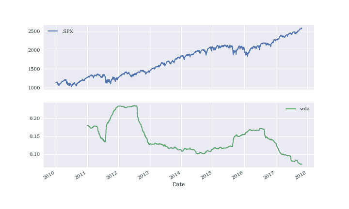

# 第一章：为什么要用 Python 进行金融？

> 银行本质上是科技公司。
> 
> [雨果·班齐格](https://www.example.org/hugo_banziger)

# 什么是 Python？

Python 是一种高级、通用的编程语言，广泛应用于各个领域和技术领域。在 Python 网站上，您可以找到以下执行摘要（参见 [*https://www.python.org/doc/essays/blurb*](https://www.python.org/doc/essays/blurb)）：

> Python 是一种解释性的、面向对象的、高级的编程语言，具有动态语义。它的高级内置数据结构，结合动态类型和动态绑定，使其非常适合快速应用程序开发，以及用作脚本语言或粘合语言将现有组件连接在一起。Python 简单、易学的语法强调可读性，从而降低了程序维护的成本。Python 支持模块和包，这鼓励了程序的模块化和代码的重用。Python 解释器和广泛的标准库可以在所有主要平台上免费获得源代码或二进制形式，并可以自由分发。

这很好地描述了为什么 Python 已经发展成为今天的主要编程语言之一。现在，Python 不仅被初学者程序员使用，还被高技能专家开发者使用，在学校，在大学，在网络公司，在大型企业和金融机构以及在任何科学领域都有应用。

Python 具有以下特点之一：

开源

Python 及其大多数支持库和工具都是开源的，并且通常具有相当灵活和开放的许可证。

解释性的

参考 `CPython` 实现是一种语言的解释器，它将 Python 代码在运行时转换为可执行字节码。

多范式

Python 支持不同的编程和实现范式，如面向对象和命令式、函数式或过程式编程。

多用途

Python 可用于快速、交互式的代码开发，也可用于构建大型应用程序；它可用于低级系统操作，也可用于高级分析任务。

跨平台

Python 可用于最重要的操作系统，如 Windows、Linux 和 Mac OS；它用于构建桌面应用程序和 Web 应用程序；它可以用于最大的集群和最强大的服务器，也可以用于树莓派等小型设备（参见 [*http://www.raspberrypi.org*](http://www.raspberrypi.org)）。

动态类型

Python 中的类型通常在运行时推断，而不是像大多数编译语言中静态声明的那样。

缩进感知

与大多数其他编程语言不同，Python 使用缩进来标记代码块，而不是使用括号、方括号或分号。

垃圾收集

Python 具有自动化垃圾收集，避免了程序员管理内存的需要。

当涉及到 Python 语法和 Python 的本质时，Python Enhancement Proposal 20——即所谓的“Python 之禅”提供了主要的指导原则。可以通过每个交互式 shell 的命令`import this`访问它：

```py
In [1]: import this

        The Zen of Python, by Tim Peters

        Beautiful is better than ugly.
        Explicit is better than implicit.
        Simple is better than complex.
        Complex is better than complicated.
        Flat is better than nested.
        Sparse is better than dense.
        Readability counts.
        Special cases aren't special enough to break the rules.
        Although practicality beats purity.
        Errors should never pass silently.
        Unless explicitly silenced.
        In the face of ambiguity, refuse the temptation to guess.
        There should be one-- and preferably only one --obvious way to do it.
        Although that way may not be obvious at first unless you're Dutch.
        Now is better than never.
        Although never is often better than *right* now.
        If the implementation is hard to explain, it's a bad idea.
        If the implementation is easy to explain, it may be a good idea.
        Namespaces are one honking great idea -- let's do more of those!
```

## Python 的简要历史

尽管对于一些人来说，Python 可能仍然具有一些*新鲜感*，但它已经存在了相当长的时间。事实上，Python 的开发工作始于 1980 年代，由来自荷兰的 Guido van Rossum 负责。他仍然活跃于 Python 的开发，并且被 Python 社区授予了*终身仁慈独裁者*的称号（参见[*http://en.wikipedia.org/wiki/History_of_Python*](http://en.wikipedia.org/wiki/History_of_Python)）。以下可以被视为 Python 发展的里程碑：

+   **Python 0.9.0** 发布于 1991 年（第一个版本）

+   **Python 1.0** 发布于 1994 年

+   **Python 2.0** 发布于 2000 年

+   **Python 2.6** 发布于 2008 年

+   **Python 3.0** 发布于 2008 年

+   **Python 3.1** 发布于 2009 年

+   **Python 2.7** 发布于 2010 年

+   **Python 3.2** 发布于 2011 年

+   **Python 3.3** 发布于 2012 年

+   **Python 3.4** 发布于 2014 年

+   **Python 3.5** 发布于 2015 年

+   **Python 3.6** 发布于 2016 年

令人瞩目的是，对于 Python 新手来说，Python 有两个主要版本可用，自 2008 年以来仍在开发中，并且更重要的是，同时使用。截至撰写本文时，这种情况可能会持续一段时间，因为大量的代码仍然是基于 Python 2.6/2.7 并且在生产中使用。尽管本书的第一版是基于 Python 2.7 编写的，但本书的第二版全程使用的是 Python 3.6。

## Python 生态系统

Python 作为一个生态系统的一个主要特点，与仅仅是一种编程语言相比，就是有大量的包和工具可用。这些包和工具通常在需要时必须被*导入*（例如，绘图库），或者必须作为一个单独的系统进程启动（例如，Python 开发环境）。导入意味着使一个包对当前的命名空间和当前的 Python 解释器进程可用。

Python 本身已经带有大量的包和模块，可以增强基本的解释器。人们谈论的是*Python 标准库*（参见[*https://docs.python.org/3/library/index.html*](https://docs.python.org/3/library/index.html)）。例如，可以进行基本的数学计算而无需任何导入，而更专业的数学函数需要通过`math`模块导入：

```py
In [2]: 100 * 2.5 + 50
Out[2]: 300.0

In [3]: log(1)

        ----------------------------------------
        NameErrorTraceback (most recent call last)
        <ipython-input-3-cfa4946d0225> in <module>()
----> 1 log(1)

        NameError: name 'log' is not defined

In [4]: import math

In [5]: math.log(1)
Out[5]: 0.0
```

虽然 `math` 是一个标准的 Python 库，可以在任何安装中使用，但还有许多其他可选安装的库，可以像标准库一样使用。这些库可从不同的（网络）来源获取。然而，通常建议使用一个 Python 软件包管理器，以确保所有库都与彼此一致（有关此主题的更多信息，请参见第二章）。

到目前为止所提供的代码示例都使用了`IPython`（请参见[*http://www.ipython.org*](http://www.ipython.org)），这是 Python 最受欢迎的交互式开发环境（IDE）之一。尽管它最初只是一个增强的 shell，但今天它具有许多通常在 IDE 中找到的特性（例如，支持分析和调试）。那些缺失的功能通常由高级文本/代码编辑器提供，如 Sublime Text（请参见[*http://www.sublimetext.com*](http://www.sublimetext.com)）。因此，将`IPython`与个人选择的文本/代码编辑器结合起来形成 Python 开发过程的基本工具集并不罕见。

``IPython`` 在许多方面增强了标准的交互式 shell。例如，它提供了改进的命令行历史功能，并允许轻松地检查对象。例如，只需在函数名称前后添加`?`（添加`??`将提供更多信息），就可以打印函数的帮助文本（`docstring`）。

`IPython` 最初有两个流行版本：一个是 *shell* 版本，另一个是 *基于浏览器的版本*（`Notebook`）。`Notebook` 变体已被证明非常有用和受欢迎，因此它现在已成为一个独立的、与语言无关的项目和工具，现在称为 `Jupyter`（见[*http://jupyter.org*](http://jupyter.org)）。

## Python 用户光谱

Python 不仅吸引专业软件开发人员；它也对业余开发人员以及领域专家和科学开发人员有用。

*专业软件开发人员*可以找到他们构建大型应用程序所需的一切。几乎支持所有编程范式；有强大的开发工具可用；并且原则上任何任务都可以通过 Python 来解决。这些类型的用户通常构建自己的框架和类，也在基本的 Python 和科学堆栈上工作，并努力充分利用生态系统。

*科学开发人员*或*领域专家*通常是某些库和框架的重度用户，已经构建了自己的应用程序，并随着时间的推移对其进行了增强和优化，并根据自己的特定需求定制了生态系统。这些用户群通常参与更长时间的交互式会话，快速原型化新代码，并探索和可视化他们的研究和/或领域数据集。

*业余程序员* 喜欢使用 Python 通常是因为他们知道 Python 在特定问题上有优势。例如，访问 `matplotlib` 的画廊页面，复制那里提供的某个可视化代码片段，并根据他们的特定需求调整代码，可能是这个群体的成员的有益用例。

还有另一重要的 Python 用户群体：*初学者程序员*，即那些刚开始学习编程的人。如今，Python 已经成为大学、学院甚至学校介绍编程给学生的非常流行的语言之一。¹ 这主要是因为它的基本语法易于学习和理解，即使对于非开发者也是如此。此外，有帮助的是 Python 几乎支持所有的编程风格。²

## 科学堆栈

有一组被统称为 *科学堆栈* 的库。这个堆栈包括，但不限于，以下几个包：

[`NumPy`](http://www.numpy.org)

`NumPy` 提供了一个多维数组对象来存储同构或异构数据；它还提供了优化的函数/方法来操作这个数组对象。

[`SciPy`](http://www.scipy.org)

`SciPy` 是一个子包和函数的集合，实现了科学或金融中经常需要的重要标准功能；例如，可以找到用于三次样条插值以及数值积分的函数。

[`matplotlib`](http://www.matplotlib.org)

这是 Python 中最受欢迎的绘图和可视化库，提供了 2D 和 3D 可视化功能。

[`PyTables`](http://www.pytables.org)

`PyTables` 是 `HDF5` 数据存储库的流行封装器（参见[*http://www.hdfgroup.org/HDF5/*](http://www.hdfgroup.org/HDF5/)）；它是一个用于实现基于磁盘的优化 I/O 操作的库，基于分层数据库/文件格式。

[`pandas`](http://pandas.pydata.org)

`pandas` 建立在 `NumPy` 之上，提供了更丰富的类来管理和分析时间序列和表格数据；它与 `matplotlib` 紧密集成用于绘图和 `PyTables` 用于数据存储和检索。

[`Scikit-Learn`](http://scikit-learn.org)

`Scikit-Learn` 是一个流行的机器学习（ML）包，为许多不同的 ML 算法提供了统一的 API，例如，用于估计、分类或聚类的算法。

根据特定的领域或问题，这个堆栈会通过额外的库进行扩展，这些库往往有一个共同点，即它们建立在一个或多个基本库的基础之上。然而，在一般情况下，最常见的最小公分母或基本构建块是 `NumPy` 的 `ndarray` 类（参见 第四章），或者现在是 `pandas` 的 `DataFrame` 类（参见 第五章）。

单纯将 Python 视为一种编程语言，还有许多其他语言可供选择，可能与其语法和优雅程度相媲美。例如，`Ruby` 是一种相当流行的语言，经常与 Python 进行比较。在该语言的网站 [*http://www.ruby-lang.org*](http://www.ruby-lang.org) 上，您会找到以下描述：

> 一种以简洁和高效为重点的动态、开源编程语言。它具有优雅的语法，自然易读且易于编写。

大多数使用 Python 的人可能也同意对 Python 本身作出完全相同的声明。然而，与 `Ruby` 等同样吸引人的语言相比，许多用户认为 Python 的特点在于科学堆栈的可用性。这使得 Python 不仅是一种好的、优雅的语言，还能够替代类似 Matlab 或 R 这样的领域特定语言和工具集。它默认提供了你所期望的任何东西，比如一位经验丰富的 Web 开发人员或系统管理员。此外，Python 也擅长与领域特定语言（如 R）进行接口交互，因此通常决策并不是关于“要么选择 Python 要么选择其他语言”，而是关于选择哪种语言作为主要语言。

# 金融科技

现在我们对 Python 的大致了解有了一些想法，稍微退后一步，简要思考一下技术在金融中的作用是有意义的。这将使我们能够更好地评判 Python 已经扮演的角色，甚至更重要的是，可能会在未来的金融行业中发挥的作用。

在某种意义上，技术本身对金融机构（例如，与工业公司相比）或金融职能（例如，与物流等其他企业职能相比）并不“特别”。然而，近年来，在创新和监管的推动下，银行和其他金融机构（如对冲基金）已经越来越多地演变成了技术公司，而不仅仅是“仅仅”是金融中介。技术已经成为全球几乎所有金融机构的重要资产，具有带来竞争优势以及劣势的潜力。一些背景信息可以阐明这一发展的原因。

## 技术支出

银行和金融机构共同构成了年度技术支出最多的行业。因此，以下声明不仅显示了技术对金融业的重要性，而且金融业对技术行业也非常重要（[`www.idc.com`](https://www.idc.com/getdoc.jsp?containerId=prUS41216616)）：

> …，截至 2016 年，全球金融服务 IT 支出将达到近 4800 亿美元，年复合增长率（CAGR）为 4.2%。
> 
> IDC

特别是，银行和其他金融机构正在竞相将业务和运营模式转移到数字化基础上 ([`www.statista.com`](https://www.statista.com/statistics/379517/forecast-of-bank-spending-on-new-tech-by-region/))：

> 预计 2017 年北美银行对新技术的支出将达到 199 亿美元。
> 
> 银行开发当前系统并致力于新技术解决方案，以增强其在全球市场上的竞争力并吸引对新在线和移动技术感兴趣的客户。这对于为银行业提供新想法和软件解决方案的全球金融科技公司来说是一个巨大的机遇。
> 
> Statista

当今，大型跨国银行通常雇佣数千名开发人员来维护现有系统并构建新系统。

## 技术作为推动因素

技术发展也促进了金融领域的创新和效率提升：

> 金融服务行业在过去几年里经历了技术引领的剧变。许多高管指望他们的 IT 部门提高效率并促进游戏改变式的创新，同时以某种方式降低成本并继续支持遗留系统。与此同时，金融科技初创企业正在侵入已建立的市场，以客户友好的解决方案为首，这些解决方案从零开始开发，并且不受遗留系统的束缚。
> 
> 《普华永道第 19 届全球 CEO 调查报告》（2016 年）

随着效率日益提高，寻找竞争优势往往要求在越来越复杂的产品或交易中寻找。这反过来会增加风险，并使风险管理以及监督和监管变得越来越困难。2007 年和 2008 年的金融危机讲述了由此类发展带来的潜在危险。同样，“算法和计算机失控”也代表了对金融市场的潜在风险；这在 2010 年 5 月的所谓*闪电崩盘*中得到了戏剧性的体现，那时自动卖出导致某些股票和股票指数在一天内大幅下跌（参见[*http://en.wikipedia.org/wiki/2010_Flash_Crash*](http://en.wikipedia.org/wiki/2010_Flash_Crash)）。

## 技术和人才作为进入壁垒

一方面，技术的进步会随着时间的推移降低成本，*其他条件不变*。另一方面，金融机构继续大力投资于技术，以获得市场份额并捍卫其当前地位。要在今天的某些金融领域活跃起来，通常需要进行大规模的技术和人才投资。例如，考虑一下衍生品分析领域：

> 在总体软件生命周期中，采用内部策略进行场外[衍生品]定价的公司，仅建立、维护和增强完整的衍生品库就需要投资额在$25 百万到$36 百万之间。
> 
> Ding 2010

建立完整的衍生品分析库不仅成本高昂且耗时，你还需要*足够的专家*来完成这项工作。而且这些专家必须有适当的工具和技术来完成他们的任务。

另一则关于长期资本管理（LTCM）早期的报价支持了关于技术和人才的这一见解：LTCM 曾是最受尊敬的量化对冲基金之一，然而在 1990 年代末破产。

> Meriwether 花费了$20 百万在格林威治，康涅狄格州建立了一套最先进的计算机系统，并雇佣了一支精英金融工程团队来运作 LTCM，这是工业级风险管理。
> 
> Patterson 2010

Meriwether 为数百万美元购买的同样计算能力，如今可能只需数千美元就能获得。另一方面，对于更大的金融机构来说，交易、定价和风险管理已变得如此复杂，以至于今天它们需要部署拥有数万计算核心的 IT 基础设施。

## 日益增加的速度、频率和数据量

金融行业的一个维度受到技术进步影响最大：金融交易的决策和执行*速度*和*频率*。Lewis（2014 年）的新书详细描述了所谓的*闪电交易*—即以最高速度进行交易。

一方面，不断增加的数据可用性在越来越小的尺度上使得实时反应变得必要。另一方面，交易速度和频率的增加使得数据量进一步增加。这导致了一些过程相互强化，并将金融交易的平均时间尺度系统性地推向下降：

> Renaissance 的 Medallion 基金在 2008 年惊人地增长了 80%，利用其闪电般快速的计算机资本化市场极端波动。吉姆·西蒙斯成为当年对冲基金界的最高收入者，赚得了 25 亿美元。
> 
> Patterson 2010

单支股票的三十年日度股价数据大约包括 7,500 个报价。今天大部分金融理论基于这种数据。例如，现代投资组合理论（MPT）、资本资产定价模型（CAPM）和风险价值（VaR）理论都基于日度股价数据。

相比之下，在典型的交易日，苹果公司（AAPL）的股价约被报价 15,000 次—比过去 30 年末日报价看到的报价多两倍。这带来了一系列挑战：

数据处理

仅仅考虑和处理股票或其他金融工具的日终行情是不够的；对于某些工具来说，每天 24 小时，每周 7 天都会发生“太多”的事情。

分析速度

决策通常需要在毫秒甚至更快的时间内做出，因此需要建立相应的分析能力，并实时分析大量数据。

理论基础

尽管传统的金融理论和概念远非完美，但它们随着时间的推移已经经过了充分的测试（有时也被充分地拒绝）；就当今至关重要的毫秒级时间尺度而言，仍然缺乏一致的、经过时间检验的概念和理论，这些理论已被证明在一定程度上是相对稳健的。

所有这些挑战原则上只能通过现代技术来解决。可能有点令人惊讶的是，缺乏一致性理论往往是通过技术手段来解决的，高速算法利用市场微观结构元素（例如，订单流量、买卖价差），而不是依赖某种金融推理。

## 实时分析的崛起

有一个学科在金融行业的重要性大大增加：*金融和数据分析*。这一现象与速度、频率和数据量在行业中迅速增长的认识密切相关。事实上，实时分析可以被认为是行业对这一趋势的回应。

大致而言，“金融和数据分析”是指将软件和技术与（可能是先进的）算法和方法相结合，以收集、处理和分析数据，以获取见解、做出决策或满足监管要求的学科。例如，估算银行零售业务中金融产品定价结构变化引起的销售影响。另一个例子可能是对投资银行衍生品交易的复杂投资组合进行大规模的隔夜信用价值调整（CVA）计算。

在这种情况下，金融机构面临着两个主要挑战：

大数据

即使在“大数据”这个术语被创造之前，银行和其他金融机构也不得不处理大量数据；然而，随着时间的推移，单个分析任务中需要处理的数据量已经大大增加，要求提高计算能力以及越来越大的内存和存储容量。

实时经济

在过去，决策者可以依靠结构化的、定期的规划、决策和（风险）管理流程，而今天他们面临的是需要实时处理这些功能的需求；过去通过夜间批量运行在后台处理的几项任务现在已被转移到前台，并实时执行。

再次，人们可以观察到技术进步与金融/商业实践之间的相互作用。一方面，需要不断应用现代技术来提高分析方法的速度和能力。另一方面，技术的进步使得几年甚至几个月前被认为不可能（或由于预算限制而不可行）的新分析方法成为可能。

分析领域的一个主要趋势是在 CPU（中央处理单元）端利用并行架构和在 GPGPU（通用图形处理单元）端利用大规模并行架构。当前的 GPGPU 通常拥有 1,000 多个计算核心，这使得有时需要彻底重新思考并行对不同算法可能意味着什么。在这方面仍然存在的障碍是用户通常必须学习新的范例和技术来利用这种硬件的性能。^（3）

# 金融中的 Python

上一节描述了金融中技术角色的一些选定方面：

+   金融业技术成本

+   技术作为新业务和创新的推动者

+   技术和人才作为金融行业进入壁垒

+   速度、频率和数据量的增加

+   实时分析的兴起

在本节中，我们想要分析 Python 如何帮助解决这些方面所暗示的几个挑战。但首先，从更基本的角度来看，让我们从语言和语法的角度来审视 Python 在金融领域的作用。

## 金融和 Python 语法

在金融环境中首次尝试 Python 的大多数人可能会面临算法问题。这类似于科学家想要解决微分方程、评估积分或简单地可视化一些数据的情况。一般来说，在这个阶段，很少有人会花费时间思考形式化的开发过程、测试、文档编写或部署等问题。然而，这似乎是人们开始喜爱 Python 的阶段。其中一个主要原因可能是 Python 语法通常与用于描述科学问题或金融算法的数学语法非常接近。

我们可以通过一个简单的金融算法来说明这一现象，即通过蒙特卡洛模拟对欧式看涨期权进行估值。我们将考虑一个 Black-Scholes-Merton（BSM）设置（也见[待续链接]），其中期权的基础风险因素遵循几何布朗运动。

假设我们对估值有以下数值*参数值*：

+   初始股指水平 <math alttext="upper S 0 equals 100"><mrow><msub><mi>S</mi> <mn>0</mn></msub> <mo>=</mo> <mn>100</mn></mrow></math>

+   欧式看涨期权的行权价格 <math alttext="upper K equals 105"><mrow><mi>K</mi> <mo>=</mo> <mn>105</mn></mrow></math>

+   到期时间 <math alttext="upper T equals 1"><mrow><mi>T</mi> <mo>=</mo> <mn>1</mn></mrow></math> 年。

+   常量，无风险短期利率 <math alttext="r equals 0.05"><mrow><mi>r</mi> <mo>=</mo> <mn>0</mn> <mo>.</mo> <mn>05</mn></mrow></math>。

+   常量波动率 <math><mrow><mi>σ</mi> <mo>=</mo> <mn>0</mn> <mo>.</mo> <mn>2</mn></mrow></math>。

在 BSM 模型中，到期时的指数水平是一个随机变量，由 方程 1-1 给出，其中 *z* 是一个标准正态分布的随机变量。

##### 方程 1-1\. 到期时的 Black-Scholes-Merton (1973) 指数水平。

<math display="block" alttext="upper S Subscript upper T Baseline equals upper S 0 exp left-parenthesis left-parenthesis r minus one-half sigma squared right-parenthesis upper T plus sigma StartRoot upper T EndRoot z right-parenthesis"><mrow><msub><mi>S</mi> <mi>T</mi></msub> <mo>=</mo> <msub><mi>S</mi> <mn>0</mn></msub> <mo form="prefix">exp</mo> <mfenced separators="" open="(" close=")"><mfenced separators="" open="(" close=")"><mi>r</mi> <mo>-</mo> <mfrac><mn>1</mn> <mn>2</mn></mfrac> <msup><mi>σ</mi> <mn>2</mn></msup></mfenced> <mi>T</mi> <mo>+</mo> <mi>σ</mi> <msqrt><mi>T</mi></msqrt> <mi>z</mi></mfenced></mrow></math>

以下是蒙特卡洛估值过程的 *算法描述* ：

1.  从标准正态分布中绘制（伪）随机数 <math><mi>I</mi></math>（i） ， 其中 <math alttext="z left-parenthesis i right-parenthesis comma i i n left-brace 1 comma 2 comma period period period comma upper I right-brace"><mrow><mi>z</mi> <mo>(</mo> <mi>i</mi> <mo>)</mo> <mo>,</mo> <mi>i</mi> <mi>i</mi> <mi>n</mi> <mo>{</mo> <mn>1</mn> <mo>,</mo> <mn>2</mn> <mo>,</mo> <mo>.</mo> <mo>.</mo> <mo>.</mo> <mo>,</mo> <mi>I</mi> <mo>}</mo></mrow></math>。

1.  计算给定 <math alttext="z left-parenthesis i right-parenthesis"><mrow><mi>z</mi> <mo>(</mo> <mi>i</mi> <mo>)</mo></mrow></math> 和 方程 1-1 的所有到期时指数水平 <math alttext="upper S Subscript upper T Baseline left-parenthesis i right-parenthesis"><mrow><msub><mi>S</mi> <mi>T</mi></msub> <mrow><mo>(</mo> <mi>i</mi> <mo>)</mo></mrow></mrow></math>。

1.  计算到期时期权的所有内部值为 <math alttext="h Subscript upper T Baseline left-parenthesis i right-parenthesis equals max left-parenthesis upper S Subscript upper T Baseline left-parenthesis i right-parenthesis minus upper K comma 0 right-parenthesis"><mrow><msub><mi>h</mi> <mi>T</mi></msub> <mrow><mo>(</mo> <mi>i</mi> <mo>)</mo></mrow> <mo>=</mo> <mo movablelimits="true" form="prefix">max</mo> <mrow><mo>(</mo> <msub><mi>S</mi> <mi>T</mi></msub> <mrow><mo>(</mo> <mi>i</mi> <mo>)</mo></mrow> <mo>-</mo> <mi>K</mi> <mo>,</mo> <mn>0</mn> <mo>)</mo></mrow></mrow></math>。

1.  根据 方程 1-2 中给出的蒙特卡罗估计量估算期权现值。

##### 方程 1-2\. 欧式期权的蒙特卡罗估计量。

<math display="block"><mrow><msub><mi>C</mi> <mn>0</mn></msub> <mo>≈</mo> <msup><mi>e</mi> <mrow><mo>-</mo><mi>r</mi><mi>T</mi></mrow></msup> <mfrac><mn>1</mn> <mi>I</mi></mfrac> <munder><mo>∑</mo> <mi>I</mi></munder> <msub><mi>h</mi> <mi>T</mi></msub> <mrow><mo>(</mo> <mi>i</mi> <mo>)</mo></mrow></mrow></math>

现在我们将把这个问题和算法翻译成 Python 代码。读者可以通过使用 `IPython` 等工具来跟踪单个步骤，但在这个阶段并不是非常必要。

```py
In [6]: S0 = 100.  # ①
        K = 105.  # ①
        T = 1.0  # ①
        r = 0.05  # ①
        sigma = 0.2  # ①

In [7]: import math
        import numpy as np  # ②

        I = 100000

        np.random.seed(1000)  # ③
        z = np.random.standard_normal(I)  # ④
        ST = S0 * np.exp((r - sigma ** 2 / 2) * T + sigma * math.sqrt(T) * z)  # ⑤
        hT = np.maximum(ST - K, 0)  # ⑥
        C0 = math.exp(-r * T) * np.mean(hT)  # ⑦

In [8]: print('Value of the European Call Option %5.3f:' % C0)  # ⑧

        Value of the European Call Option 8.019:
```

①

模型参数值已定义。

②

`NumPy` 在这里作为主要包被使用。

③

随机数生成器的种子值是固定的。

④

这绘制了标准正态分布的随机数。

⑤

这模拟了期末值。

⑥

到期时的期权回报是通过计算得出的。

⑦

蒙特卡洛估算器被评估。

⑧

这将打印出结果值的估计。

有三个方面值得强调：

语法

Python 语法确实与数学语法非常接近，例如，在参数值赋值时。

翻译

每个数学和/或算法声明通常可以被翻译成一行*单独的*Python 代码。

向量化

`NumPy`的一个优点是其紧凑、向量化的语法，例如，允许在一行代码中进行 10 万次计算。

这段代码可以在像`IPython`这样的交互环境中使用。然而，通常被定期重复使用的代码会被组织成所谓的*模块*（或*脚本*），它们是具有后缀`.py`的单个 Python（技术上的“文本”）文件。在这种情况下，这样的一个模块可能看起来像 Example 1-1，并且可以保存为名为`bsm_mcs_euro.py`的文件。

##### 示例 1-1\. 欧式看涨期权的蒙特卡洛估值

```py
#
# Monte Carlo valuation of European call option
# in Black-Scholes-Merton model
# bsm_mcs_euro.py
#
# Python for Finance
# (c) Dr. Yves J. Hilpisch
#
import math
import numpy as np

# Parameter Values
S0 = 100.  # initial index level
K = 105.  # strike price
T = 1.0  # time-to-maturity
r = 0.05  # riskless short rate
sigma = 0.2  # volatility

I = 100000  # number of simulations

# Valuation Algorithm
z = np.random.standard_normal(I)  # pseudorandom numbers
# index values at maturity
ST = S0 * np.exp((r - 0.5 * sigma ** 2) * T + sigma * math.sqrt(T) * z)
hT = np.maximum(ST - K, 0)  # inner values at maturity
C0 = math.exp(-r * T) * np.mean(hT)  # Monte Carlo estimator

# Result Output
print('Value of the European Call Option %5.3f' % C0)
```

本小节中相当简单的算法示例说明了 Python，以其非常直观的语法，非常适合补充经典的科学语言英语和数学。似乎将`Python`加入到科学语言集合中使其更加完整。我们有

+   **英语**用于*书写、讨论*科学和金融问题等。

+   **数学**用于*简洁而准确地描述和建模*抽象方面、算法、复杂量等。

+   **Python**用于*技术上建模和实现*抽象方面、算法、复杂量等。

# 数学和 Python 语法

几乎没有任何编程语言能像 Python 一样接近数学语法。因此，数值算法从数学表示转换为`Python`实现非常简单。这使得在这些领域中使用 Python 进行原型设计、开发和代码维护非常高效。

在一些领域，使用*伪代码*并以此引入第四个语言家族成员是常见做法。伪代码的作用是更技术化地表示金融算法，这既与数学表示接近，又与技术实现接近。除了算法本身，伪代码还考虑了计算机原理。

这种做法通常源于大多数编程语言的技术实现与其正式数学表示相距甚远。大多数编程语言需要包含许多仅在技术上需要的元素，以至于很难看出数学和代码之间的等价性。

如今，Python 通常以*伪代码方式*使用，因为其语法几乎与数学相似，并且由于技术“开销”保持最小。这是通过语言中体现的一些高级概念实现的，这些概念不仅具有优势，而且一般都伴随着风险和/或其他成本。但是，可以肯定的是，使用 Python 可以在需要时遵循其他语言可能从一开始就需要的严格实现和编码实践。在这个意义上，Python 可以提供最好的两种世界：*高级抽象*和*严格实现*。

## 通过 Python 提高效率和生产力

在高层次上，使用 Python 的好处可以从三个方面衡量：

效率

Python 如何帮助更快地获得结果，节省成本和节省时间？

生产力

Python 如何帮助提高使用相同资源（人力、资产等）的效率？

质量

Python 允许我们做什么，而其他技术做不到呢？

对这些方面的讨论自然不可能穷尽。但是，它可以突出一些论据作为起点。

### 更短的结果时间

Python 的效率显而易见的领域之一是交互式数据分析。这是一个极大受益于诸如`IPython`和像`pandas`这样的强大工具的领域。

考虑一个金融学生，她正在写她的硕士论文，对 S&P 500 指数值感兴趣。她想要分析历史指数水平，比如说，几年来指数波动率是如何随时间波动的。她想要找到证据表明，与一些典型的模型假设相反，波动率随时间波动，并且远非恒定。结果还应该进行可视化。她主要需要做以下几件事：

+   从网络检索指数水平数据。

+   计算对数收益的年化滚动标准差（波动性）。

+   绘制指数水平数据和结果。

这些任务足够复杂，以至于不久之前人们会认为这是专业金融分析师的事情。如今，即使是金融学生也能轻松应对这些问题。让我们看看这究竟是如何运作的——在这个阶段不必担心语法细节（一切都将在后续章节中详细解释）。

```py
In [10]: import numpy as np  # ①
         import pandas as pd  # ①

In [11]: data = pd.read_csv('http://hilpisch.com/tr_eikon_eod_data.csv',
                           index_col=0, parse_dates=True)  # ②
         data = pd.DataFrame(data['.SPX'])  # ③
         data.info()  # ④

         <class 'pandas.core.frame.DataFrame'>
         DatetimeIndex: 1972 entries, 2010-01-04 to 2017-10-31
         Data columns (total 1 columns):
         .SPX    1972 non-null float64
         dtypes: float64(1)
         memory usage: 30.8 KB

In [12]: data['rets'] = np.log(data / data.shift(1))  # ⑤
         data['vola'] = data['rets'].rolling(252).std() * np.sqrt(252)  # ⑥

In [13]: data[['.SPX', 'vola']].plot(subplots=True, figsize=(10, 6));  # ⑦
         plt.savefig('../images/01_chapter/spx_volatility.png')
```

①

这导入了`NumPy`和`pandas`。

②

`read_csv`允许检索远程存储的数据集。

③

选择数据的一个子集。

④

这显示了数据集的一些元信息。

⑤

对数收益以矢量化方式计算（“无循环”）。

⑥

滚动、年化波动率是由此得出的。

⑦

最后一行将这两个时间序列绘制出来。

图 1-1 展示了这个简短交互会话的图形结果。几行代码就足以实现在金融分析中经常遇到的三个相当复杂的任务：数据收集、复杂和重复的数学计算，以及结果的可视化。这个例子说明了`pandas`使得处理整个时间序列几乎与对浮点数执行数学运算一样简单。



###### 图 1-1\. S&P 500 收盘价和年化波动率

将其翻译成专业的金融背景下，该示例意味着金融分析师可以——当应用正确的 Python 工具和库，提供高级抽象——专注于他们的领域，而不是技术细节。分析师可以更快地做出反应，几乎实时提供有价值的见解，并确保他们领先竞争对手一步。这个*提高效率*的例子很容易转化为可衡量的底线效应。

### 确保高性能

总的来说，人们普遍认为 Python 语法相对简洁，编码相对高效。然而，由于 Python 是一种解释语言，导致了“偏见”持续存在，即 Python 通常对金融中的计算密集型任务来说速度太慢了。事实上，根据特定的实现方法，Python 可能确实很慢。但它*不一定慢*— 它几乎可以在任何应用领域都表现出高性能。原则上，可以区分至少三种不同的策略来提高性能：

范式

通常情况下，Python 中有很多不同的方法可以得到相同的结果，但性能特性却大不相同；“简单地”选择正确的方式（例如特定的库）可以显著提高结果。

编译

如今，有几个性能库可用，它们提供了重要函数的编译版本，或者将 Python 代码静态或动态地（在运行时或调用时）编译为机器代码，速度可以提高数个数量级；其中流行的有`Cython`和`Numba`。

并行化

许多计算任务，特别是在金融领域，都可以从并行执行中获益；这并不是 Python 特有的，但是可以很容易地用 Python 实现。

# 使用 Python 进行性能计算

Python 本身不是一种高性能计算技术。然而，Python 已经发展成为访问当前性能技术的理想平台。从这个意义上说，Python 已经成为一种 *性能计算的粘合语言*。

后面的章节将详细介绍这三种技术。目前，我们希望使用一个简单但仍然现实的例子，涉及这三种技术。

在金融分析中，一个相当常见的任务是在大量数字数组上评估复杂的数学表达式。为此，Python 本身提供了一切所需的：

```py
In [14]: loops = 2500000
         import math
         a = range(1, loops)
         def f(x):
             return 3 * math.log(x) + math.cos(x) ** 2
         %timeit r = [f(x) for x in a]

         1.52 s ± 29.2 ms per loop (mean ± std. dev. of 7 runs, 1 loop each)
```

在这种情况下，Python 解释器需要 1.5 秒来评估函数 `f` 250 万次。

同样的任务可以使用`NumPy`来实现，它提供了优化（即，*预编译*）的函数来处理这种基于数组的操作：

```py
In [15]: import numpy as np
         a = np.arange(1, loops)
         %timeit r = 3 * np.log(a) + np.cos(a) ** 2

         83.3 ms ± 1.16 ms per loop (mean ± std. dev. of 7 runs, 10 loops each)
```

使用`NumPy`可以大大减少执行时间至 90 毫秒。

然而，甚至有一个专门致力于这种任务的库。它被称为 `numexpr`，表示“数值表达式”。它将表达式*编译*以改进`NumPy`的一般功能，例如，在此过程中避免数组的内存副本：

```py
In [16]: import numexpr as ne
         ne.set_num_threads(1)
         f = '3 * log(a) + cos(a) ** 2'
         %timeit r = ne.evaluate(f)

         78.2 ms ± 4.08 ms per loop (mean ± std. dev. of 7 runs, 10 loops each)
```

使用这种更专业的方法进一步将执行时间缩短到 80 毫秒。然而，`numexpr` 也具有内置功能来并行执行相应的操作。这使我们能够使用 CPU 的多个线程：

```py
In [17]: ne.set_num_threads(4)
         %timeit r = ne.evaluate(f)

         21.9 ms ± 113 µs per loop (mean ± std. dev. of 7 runs, 10 loops each)
```

这将执行时间进一步缩短到约 25 毫秒，在此情况下，使用了四个线程。总体而言，这是性能提升超过 50 倍。特别注意，这种改进是可能的，而不需要改变基本的问题/算法，也不需要了解编译或并行化问题。即使是非专家也可以从高层次访问这些功能。当然，必须意识到存在哪些功能和选项。

该示例显示了 Python 提供了许多选项，以充分利用现有资源——即，*提高生产力*。使用顺序方法，每秒完成大约 31 百万次评估，而并行方法允许每秒进行超过 100 百万次评估——在这种情况下，只需告诉 Python 使用所有可用的 CPU 线程，而不是只使用一个线程。

## 从原型设计到生产

在交互式分析中的效率以及在执行速度方面的性能无疑是考虑 Python 的两个好处。然而，使用 Python 进行金融交易的另一个主要好处乍一看可能似乎有点微妙；第二次看可能会表现为一个重要的战略因素。这就是可以从*原型设计到生产*都可以使用 Python 的可能性。

当涉及到金融开发流程时，全球金融机构的实践通常以分离的、两步的过程为特征。一方面，有*量化分析师*（“量化分析师”）负责模型开发和技术原型设计。他们喜欢使用像`Matlab`和`R`这样的工具和环境，这些工具和环境允许进行快速、交互式的应用程序开发。在开发工作的这个阶段，性能、稳定性、异常管理、数据访问和分析的分离等问题并不那么重要。主要是在寻找概念验证和/或展示算法或整个应用程序主要期望功能的原型。

一旦原型完成，IT 部门与其*开发人员*接管并负责将现有的*原型代码*转换为可靠、可维护和高性能的*生产代码*。通常，在这个阶段会发生范式转变，使用像`C`++或`Java`这样的语言来满足生产的要求。此外，还会应用正式的开发流程，包括专业工具、版本控制等。

这种两步法的做法通常会产生一些通常意义上不期而遇的后果：

低效

原型代码不可重用；算法必须实现两次；冗余的工作需要时间和资源。

多样化的技能组合

不同部门展示出不同的技能集，并使用不同的语言来实现“相同的事物”。

遗留代码

代码可用且必须用不同的语言进行维护，通常使用不同的实现风格（例如，从架构的角度来看）。

另一方面，使用 Python 可以实现从最初的交互式原型设计步骤到高度可靠且高效可维护的生产代码的*简化*端到端流程。不同部门之间的沟通变得更容易。员工培训也更加简化，因为只有一种主要语言涵盖了金融应用构建的所有领域。它还避免了在开发过程的不同步骤中使用不同技术时固有的低效和冗余。总而言之，Python 几乎可以为金融应用开发和算法实现的几乎所有任务提供*一致的技术框架*。

# 人工智能优先金融

## 数据可用性

## 机器学习和深度学习

## 传统与人工智能优先金融

# 结论

Python 作为一种语言——但更多作为一个生态系统——是金融行业的理想技术框架。它具有许多优点，如优雅的语法、高效的开发方法以及适用于原型设计*和*生产等方面的可用性。凭借其大量可用的库和工具，Python 似乎对金融行业的最新发展所提出的大多数问题都有答案，例如分析、数据量和频率、合规性和监管，以及技术本身。它有潜力提供一个*单一、强大、一致的框架*，可以使端到端的开发和生产工作流程变得更加顺畅，即使是在较大的金融机构之间也是如此。

# 进一步阅读

以下书籍由同一作者撰写，详细介绍了本章中只是简要提及的许多方面（例如衍生品分析）：

+   Hilpisch, Yves (2015): *Python 衍生品分析.* Wiley Finance, Chichester, England. [*http://derivatives-analytics-with-python.com*](http://derivatives-analytics-with-python.com)。

本章引用的语录来自以下资源：

+   Crosman, Penny (2013): “银行将如何使用其 2014 年 IT 预算的 8 种方式。” *银行技术新闻*。

+   Deutsche Börse Group (2008): “全球衍生品市场——简介。” 白皮书。

+   Ding, Cubillas (2010): “优化场外交易定价和估值基础设施。” *Celent 研究*。

+   Lewis, Michael (2014): *闪电少年.* W. W. Norton & Company, New York.

+   Patterson, Scott (2010): *量化分析师.* Crown Business, New York.

¹ 例如，Python 是纽约市立大学巴鲁克学院金融工程硕士课程中使用的主要语言（请参阅[*http://mfe.baruch.cuny.edu*](http://mfe.baruch.cuny.edu)）。

² 请参阅[*http://wiki.python.org/moin/BeginnersGuide*](http://wiki.python.org/moin/BeginnersGuide)，在那里您将找到许多对于初学者和非开发人员来说开始使用 Python 非常有价值的资源链接。

³ [*Link to Come*]提供了在随机数生成的背景下使用现代 GPGPU 的好处的示例。
