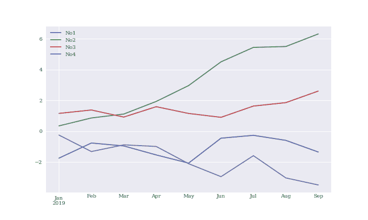
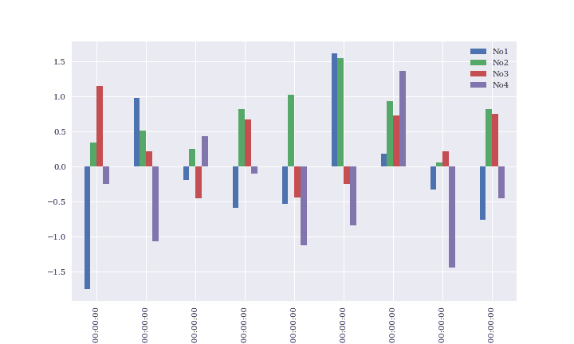
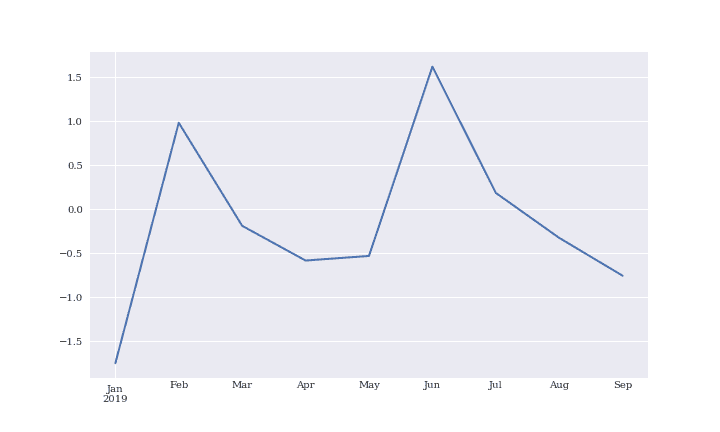

# 第五章：数据分析与 pandas

> 数据！数据！数据！没有数据，我无法制造砖头！
> 
> 夏洛克·福尔摩斯

# 简介

本章讨论的是`pandas`，这是一个专注于表格数据的数据分析库。`pandas`在最近几年已经成为一个强大的工具，不仅提供了强大的类和功能，还很好地封装了来自其他软件包的现有功能。结果是一个用户界面，使得数据分析，特别是金融分析，成为一项便捷和高效的任务。

在`pandas`的核心和本章中的是`DataFrame`，一个有效处理表格形式数据的类，即以列为组织的数据。为此，`DataFrame`类提供了列标签以及对数据集的行（记录）进行灵活索引的能力，类似于关系数据库中的表或 Excel 电子表格。

本章涵盖了以下基本数据结构：

| 对象类型 | 意义 | 用途/模型为 |
| --- | --- | --- |
| `DataFrame` | 带有索引的二维数据对象 | 表格数据以列组织 |
| `Series` | 带有索引的一维数据对象 | 单一（时间）数据系列 |

本章组织如下：

“DataFrame 类”

本章从使用简单且小的数据集探索`pandas`的`DataFrame`类的基本特征和能力开始；然后通过使用`NumPy`的`ndarray`对象并将其转换为`DataFrame`对象来进行处理。

“基本分析” 和 “基本可视化”

本章还展示了基本的分析和可视化能力，尽管后面的章节在这方面更深入。

“Series 类”

本节简要介绍了`pandas`的`Series`类，它在某种程度上代表了`DataFrame`类的一个特殊情况，只包含单列数据。

“GroupBy 操作”

`DataFrame`类的一大优势在于根据单个或多个列对数据进行分组。

“复杂选择”

使用（复杂）条件允许从`DataFrame`对象中轻松选择数据。

“串联、连接和合并”

将不同数据集合并为一个是数据分析中的重要操作。`pandas`提供了多种选项来完成这样的任务。

“性能方面”

与 Python 一般一样，`pandas`在一般情况下提供了多种选项来完成相同的目标。本节简要讨论潜在的性能差异。

# DataFrame 类

本节涵盖了`DataFrame`类的一些基本方面。这个类非常复杂和强大，这里只能展示其中一小部分功能。后续章节提供更多例子并揭示不同的方面。

## 使用 DataFrame 类的第一步

从相当基本的角度来看，`DataFrame`类被设计用来管理带索引和标签的数据，与`SQL`数据库表或电子表格应用程序中的工作表并没有太大的不同。考虑以下创建`DataFrame`对象的示例：

```py
In [1]: import pandas as pd  

In [2]: df = pd.DataFrame([10, 20, 30, 40],  
                          columns=['numbers'],  
                          index=['a', 'b', 'c', 'd'])  

In [3]: df  
Out[3]:    numbers
        a       10
        b       20
        c       30
        d       40
```


导入`pandas`。


将数据定义为`list`对象。


指定列标签。


指定索引值/标签。


显示`DataFrame`对象的数据以及列和索引标签。

这个简单的例子已经展示了当涉及到存储数据时`DataFrame`类的一些主要特性：

数据

数据本身可以以不同的形状和类型提供（`list`、`tuple`、`ndarray`和`dict`对象都是候选对象）。

标签

数据以列的形式组织，可以具有自定义名称。

索引

存在可以采用不同格式（例如，数字、字符串、时间信息）的索引。

与此类`DataFrame`对象一起工作通常非常方便和高效，例如，与常规的`ndarray`对象相比，当您想要像扩大现有对象一样时，后者更为专业和受限。以下是展示在`DataFrame`对象上进行典型操作的简单示例：

```py
In [4]: df.index  
Out[4]: Index(['a', 'b', 'c', 'd'], dtype='object')

In [5]: df.columns  
Out[5]: Index(['numbers'], dtype='object')

In [6]: df.loc['c']  
Out[6]: numbers    30
        Name: c, dtype: int64

In [7]: df.loc[['a', 'd']]  
Out[7]:    numbers
        a       10
        d       40

In [8]: df.iloc[1:3]  
Out[8]:    numbers
        b       20
        c       30

In [9]: df.sum()  
Out[9]: numbers    100
        dtype: int64

In [10]: df.apply(lambda x: x ** 2)  
Out[10]:    numbers
         a      100
         b      400
         c      900
         d     1600

In [11]: df ** 2  
Out[11]:    numbers
         a      100
         b      400
         c      900
         d     1600
```


`index`属性和`Index`对象。


`columns`属性和`Index`对象。


选择与索引`c`对应的值。


选择与索引`a`和`d`对应的两个值。


通过索引位置选择第二行和第三行。


计算单列的总和。


使用`apply()`方法以向量化方式计算平方。


直接应用向量化，就像使用`ndarray`对象一样。

与`NumPy`的`ndarray`对象相反，可以在两个维度上扩大`DataFrame`对象：

```py
In [12]: df['floats'] = (1.5, 2.5, 3.5, 4.5)  

In [13]: df
Out[13]:    numbers  floats
         a       10     1.5
         b       20     2.5
         c       30     3.5
         d       40     4.5

In [14]: df['floats']  
Out[14]: a    1.5
         b    2.5
         c    3.5
         d    4.5
         Name: floats, dtype: float64
```


使用提供的`float`对象作为`tuple`对象添加新列。


选择此列并显示其数据和索引标签。

整个`DataFrame`对象也可以用来定义新列。在这种情况下，索引会自动对齐：

```py
In [15]: df['names'] = pd.DataFrame(['Yves', 'Sandra', 'Lilli', 'Henry'],
                                    index=['d', 'a', 'b', 'c'])  

In [16]: df
Out[16]:    numbers  floats   names
         a       10     1.5  Sandra
         b       20     2.5   Lilli
         c       30     3.5   Henry
         d       40     4.5    Yves
```


基于`DataFrame`对象创建另一个新列。

数据附加工作方式类似。但是，在以下示例中，我们看到通常应避免的副作用——索引被简单的范围索引替换：

```py
In [17]: df.append({'numbers': 100, 'floats': 5.75, 'names': 'Jil'},
                        ignore_index=True)  
Out[17]:    numbers  floats   names
         0       10    1.50  Sandra
         1       20    2.50   Lilli
         2       30    3.50   Henry
         3       40    4.50    Yves
         4      100    5.75     Jil

In [18]: df = df.append(pd.DataFrame({'numbers': 100, 'floats': 5.75,
                                      'names': 'Jil'}, index=['y',]))  

In [19]: df
Out[19]:    floats   names  numbers
         a    1.50  Sandra       10
         b    2.50   Lilli       20
         c    3.50   Henry       30
         d    4.50    Yves       40
         y    5.75     Jil      100

In [20]: df = df.append(pd.DataFrame({'names': 'Liz'}, index=['z',]))  

In [21]: df
Out[21]:    floats   names  numbers
         a    1.50  Sandra     10.0
         b    2.50   Lilli     20.0
         c    3.50   Henry     30.0
         d    4.50    Yves     40.0
         y    5.75     Jil    100.0
         z     NaN     Liz      NaN

In [22]: df.dtypes  
Out[22]: floats     float64
         names       object
         numbers    float64
         dtype: object
```


通过`dict`对象添加新行；这是一个临时操作，在此期间索引信息会丢失。


这基于具有索引信息的`DataFrame`对象附加行；原始索引信息被保留。


这将不完整的数据行附加到`DataFrame`对象中，导致`NaN`值。


单列的不同`dtypes`；这类似于带有`NumPy`的记录数组。

尽管现在存在缺失值，但大多数方法调用仍将起作用。例如：

```py
In [23]: df[['numbers', 'floats']].mean()  
Out[23]: numbers    40.00
         floats      3.55
         dtype: float64

In [24]: df[['numbers', 'floats']].std()  
Out[24]: numbers    35.355339
         floats      1.662077
         dtype: float64
```


对指定的两列求平均值（忽略具有`NaN`值的行）。


对指定的两列计算标准差（忽略具有`NaN`值的行）。

## DataFrame 类的第二步

本小节中的示例基于具有标准正态分布随机数的`ndarray`对象。它探索了进一步的功能，如使用`DatetimeIndex`来管理时间序列数据。

```py
In [25]: import numpy as np

In [26]: np.random.seed(100)

In [27]: a = np.random.standard_normal((9, 4))

In [28]: a
Out[28]: array([[-1.74976547,  0.3426804 ,  1.1530358 , -0.25243604],
                [ 0.98132079,  0.51421884,  0.22117967, -1.07004333],
                [-0.18949583,  0.25500144, -0.45802699,  0.43516349],
                [-0.58359505,  0.81684707,  0.67272081, -0.10441114],
                [-0.53128038,  1.02973269, -0.43813562, -1.11831825],
                [ 1.61898166,  1.54160517, -0.25187914, -0.84243574],
                [ 0.18451869,  0.9370822 ,  0.73100034,  1.36155613],
                [-0.32623806,  0.05567601,  0.22239961, -1.443217  ],
                [-0.75635231,  0.81645401,  0.75044476, -0.45594693]])
```

尽管可以更直接地构造`DataFrame`对象（如前所示），但通常使用`ndarray`对象是一个很好的选择，因为`pandas`将保留基本结构，并且“只”会添加元信息（例如，索引值）。它还代表了金融应用和一般科学研究的典型用例。例如：

```py
In [29]: df = pd.DataFrame(a)  

In [30]: df
Out[30]:           0         1         2         3
         0 -1.749765  0.342680  1.153036 -0.252436
         1  0.981321  0.514219  0.221180 -1.070043
         2 -0.189496  0.255001 -0.458027  0.435163
         3 -0.583595  0.816847  0.672721 -0.104411
         4 -0.531280  1.029733 -0.438136 -1.118318
         5  1.618982  1.541605 -0.251879 -0.842436
         6  0.184519  0.937082  0.731000  1.361556
         7 -0.326238  0.055676  0.222400 -1.443217
         8 -0.756352  0.816454  0.750445 -0.455947
```


从`ndarray`对象创建`DataFrame`对象。

表 5-1 列出了`DataFrame`函数接受的参数。在表中，“array-like”意味着类似于`ndarray`对象的数据结构，例如`list`。`Index`是`pandas` `Index`类的一个实例。

表 5-1\. DataFrame 函数的参数

| 参数 | 格式 | 描述 |
| --- | --- | --- |
| ``data`` | ``ndarray``/``dict``/``DataFrame`` | `DataFrame`的数据；`dict`可以包含`Series`，`ndarray`，`list`等 |
| `index` | ``Index``/array-like | 要使用的索引；默认为`range(n)` |
| `columns` | ``Index``/array-like | 要使用的列标题；默认为`range(n)` |
| `dtype` | ``dtype``，默认为`None` | 要使用/强制的数据类型；否则，它会被推断 |
| `copy` | ``bool``，默认为`None` | 从输入复制数据 |

与结构化数组一样，正如我们已经看到的那样，`DataFrame`对象具有可以直接通过分配具有正确数量元素的`list`来定义的列名。这说明您可以在需要时定义/更改`DataFrame`对象的属性：

```py
In [31]: df.columns = ['No1', 'No2', 'No3', 'No4']  

In [32]: df
Out[32]:         No1       No2       No3       No4
         0 -1.749765  0.342680  1.153036 -0.252436
         1  0.981321  0.514219  0.221180 -1.070043
         2 -0.189496  0.255001 -0.458027  0.435163
         3 -0.583595  0.816847  0.672721 -0.104411
         4 -0.531280  1.029733 -0.438136 -1.118318
         5  1.618982  1.541605 -0.251879 -0.842436
         6  0.184519  0.937082  0.731000  1.361556
         7 -0.326238  0.055676  0.222400 -1.443217
         8 -0.756352  0.816454  0.750445 -0.455947

In [33]: df['No2'].mean()  
Out[33]: 0.70103309414564585
```


通过`list`对象指定列标签。


现在选择列变得很容易。

要高效处理金融时间序列数据，必须能够处理时间索引。这也可以被视为`pandas`的一项重要优势。例如，假设我们的四个列中的九个数据条目对应于从 2019 年 1 月开始的每月末数据。然后，可以使用`date_range()`函数生成`DatetimeIndex`对象，如下所示：

```py
In [34]: dates = pd.date_range('2019-1-1', periods=9, freq='M')  

In [35]: dates
Out[35]: DatetimeIndex(['2019-01-31', '2019-02-28', '2019-03-31', '2019-04-30',
                        '2019-05-31', '2019-06-30', '2019-07-31', '2019-08-31',
                        '2019-09-30'],
                       dtype='datetime64[ns]', freq='M')
```


创建一个`DatetimeIndex`对象。

表 5-2 列出了`date_range`函数的参数。

表 5-2。`date_range`函数的参数

| 参数 | 格式 | 描述 |
| --- | --- | --- |
| `start` | ``string``/``datetime`` | 生成日期的左边界 |
| `end` | ``string``/``datetime`` | 生成日期的右边界 |
| `periods` | ``integer``/``None`` | 期数（如果`start`或`end`为`None`） |
| `freq` | ``string``/``DateOffset`` | 频率字符串，例如，`5D`代表 5 天 |
| `tz` | ``string``/``None`` | 本地化索引的时区名称 |
| `normalize` | `bool`，默认为`None` | 规范化`start`和`end`为午夜 |
| `name` | `string`，默认为`None` | 结果索引的名称 |

以下代码将刚刚创建的`DatetimeIndex`对象定义为相关的索引对象，从而使原始数据集生成时间序列：

```py
In [36]: df.index = dates

In [37]: df
Out[37]:                  No1       No2       No3       No4
         2019-01-31 -1.749765  0.342680  1.153036 -0.252436
         2019-02-28  0.981321  0.514219  0.221180 -1.070043
         2019-03-31 -0.189496  0.255001 -0.458027  0.435163
         2019-04-30 -0.583595  0.816847  0.672721 -0.104411
         2019-05-31 -0.531280  1.029733 -0.438136 -1.118318
         2019-06-30  1.618982  1.541605 -0.251879 -0.842436
         2019-07-31  0.184519  0.937082  0.731000  1.361556
         2019-08-31 -0.326238  0.055676  0.222400 -1.443217
         2019-09-30 -0.756352  0.816454  0.750445 -0.455947
```

在使用`date_range`函数生成`DatetimeIndex`对象时，频率参数`freq`有多种选择。表 5-3 列出了所有选项。

表 5-3。`date_range`函数的频率参数值

| 别名 | 描述 |
| --- | --- |
| `B` | 工作日频率 |
| `C` | 自定义工作日频率（实验性的） |
| `D` | 日历日频率 |
| `W` | 周频率 |
| `M` | 月度末频率 |
| `BM` | 工作月末频率 |
| `MS` | 月初频率 |
| `BMS` | 工作月初频率 |
| `Q` | 季度末频率 |
| `BQ` | 工作季度末频率 |
| `QS` | 季度初频率 |
| `BQS` | 工作季度初频率 |
| `A` | 年度末频率 |
| `BA` | 工作年度末频率 |
| `AS` | 年度初频率 |
| `BAS` | 工作年度初频率 |
| `H` | 每小时频率 |
| `T` | 分钟频率 |
| `S` | 每秒频率 |
| `L` | 毫秒 |
| `U` | 微秒 |

在某些情况下，以`ndarray`对象的形式访问原始数据集是值得的。例如，`values`属性直接提供了对它的访问。

```py
In [38]: df.values
Out[38]: array([[-1.74976547,  0.3426804 ,  1.1530358 , -0.25243604],
                [ 0.98132079,  0.51421884,  0.22117967, -1.07004333],
                [-0.18949583,  0.25500144, -0.45802699,  0.43516349],
                [-0.58359505,  0.81684707,  0.67272081, -0.10441114],
                [-0.53128038,  1.02973269, -0.43813562, -1.11831825],
                [ 1.61898166,  1.54160517, -0.25187914, -0.84243574],
                [ 0.18451869,  0.9370822 ,  0.73100034,  1.36155613],
                [-0.32623806,  0.05567601,  0.22239961, -1.443217  ],
                [-0.75635231,  0.81645401,  0.75044476, -0.45594693]])

In [39]: np.array(df)
Out[39]: array([[-1.74976547,  0.3426804 ,  1.1530358 , -0.25243604],
                [ 0.98132079,  0.51421884,  0.22117967, -1.07004333],
                [-0.18949583,  0.25500144, -0.45802699,  0.43516349],
                [-0.58359505,  0.81684707,  0.67272081, -0.10441114],
                [-0.53128038,  1.02973269, -0.43813562, -1.11831825],
                [ 1.61898166,  1.54160517, -0.25187914, -0.84243574],
                [ 0.18451869,  0.9370822 ,  0.73100034,  1.36155613],
                [-0.32623806,  0.05567601,  0.22239961, -1.443217  ],
                [-0.75635231,  0.81645401,  0.75044476, -0.45594693]])
```

# 数组和数据框

通常情况下，您可以从`ndarray`对象中生成`DataFrame`对象。但是，您也可以通过使用`DataFrame`类的`values`属性或`NumPy`的`np.array()`函数轻松地从`DataFrame`生成`ndarray`对象。

# 基本分析

像`NumPy`的`ndarray`对象一样，`pandas`的`DataFrame`类内置了许多便利方法。作为入门，考虑`info()`方法和+describe()。

```py
In [40]: df.info()  

         <class 'pandas.core.frame.DataFrame'>
         DatetimeIndex: 9 entries, 2019-01-31 to 2019-09-30
         Freq: M
         Data columns (total 4 columns):
         No1    9 non-null float64
         No2    9 non-null float64
         No3    9 non-null float64
         No4    9 non-null float64
         dtypes: float64(4)
         memory usage: 360.0 bytes

In [41]: df.describe()  
Out[41]:             No1       No2       No3       No4
         count  9.000000  9.000000  9.000000  9.000000
         mean  -0.150212  0.701033  0.289193 -0.387788
         std    0.988306  0.457685  0.579920  0.877532
         min   -1.749765  0.055676 -0.458027 -1.443217
         25%   -0.583595  0.342680 -0.251879 -1.070043
         50%   -0.326238  0.816454  0.222400 -0.455947
         75%    0.184519  0.937082  0.731000 -0.104411
         max    1.618982  1.541605  1.153036  1.361556
```


提供有关数据、列和索引的元信息。


为每列提供有用的摘要统计信息（针对数值数据）。

此外，您可以轻松地按列或按行获取和累积和，平均值，如下所示：

```py
In [42]: df.sum()  
Out[42]: No1   -1.351906
         No2    6.309298
         No3    2.602739
         No4   -3.490089
         dtype: float64

In [43]: df.mean()  
Out[43]: No1   -0.150212
         No2    0.701033
         No3    0.289193
         No4   -0.387788
         dtype: float64

In [44]: df.mean(axis=0)  
Out[44]: No1   -0.150212
         No2    0.701033
         No3    0.289193
         No4   -0.387788
         dtype: float64

In [45]: df.mean(axis=1)  
Out[45]: 2019-01-31   -0.126621
         2019-02-28    0.161669
         2019-03-31    0.010661
         2019-04-30    0.200390
         2019-05-31   -0.264500
         2019-06-30    0.516568
         2019-07-31    0.803539
         2019-08-31   -0.372845
         2019-09-30    0.088650
         Freq: M, dtype: float64

In [46]: df.cumsum()  
Out[46]:                  No1       No2       No3       No4
         2019-01-31 -1.749765  0.342680  1.153036 -0.252436
         2019-02-28 -0.768445  0.856899  1.374215 -1.322479
         2019-03-31 -0.957941  1.111901  0.916188 -0.887316
         2019-04-30 -1.541536  1.928748  1.588909 -0.991727
         2019-05-31 -2.072816  2.958480  1.150774 -2.110045
         2019-06-30 -0.453834  4.500086  0.898895 -2.952481
         2019-07-31 -0.269316  5.437168  1.629895 -1.590925
         2019-08-31 -0.595554  5.492844  1.852294 -3.034142
         2019-09-30 -1.351906  6.309298  2.602739 -3.490089
```


逐列求和。


逐列平均值。


逐行平均值。


逐列累积和（从第一个索引位置开始）。

`DataFrame`对象也按预期理解`NumPy`通用函数：

```py
In [47]: np.mean(df)  
Out[47]: No1   -0.150212
         No2    0.701033
         No3    0.289193
         No4   -0.387788
         dtype: float64

In [48]: np.log(df)  

         /Users/yves/miniconda3/envs/base/lib/python3.6/site-packages/ipykernel_launcher.py:1: RuntimeWarning: invalid value encountered in log
           """Entry point for launching an IPython kernel.

Out[48]:                  No1       No2       No3       No4
 2019-01-31       NaN -1.070957  0.142398       NaN
 2019-02-28 -0.018856 -0.665106 -1.508780       NaN
 2019-03-31       NaN -1.366486       NaN -0.832033
 2019-04-30       NaN -0.202303 -0.396425       NaN
 2019-05-31       NaN  0.029299       NaN       NaN
 2019-06-30  0.481797  0.432824       NaN       NaN
 2019-07-31 -1.690005 -0.064984 -0.313341  0.308628
 2019-08-31       NaN -2.888206 -1.503279       NaN
 2019-09-30       NaN -0.202785 -0.287089       NaN

In [49]: np.sqrt(abs(df)) 
Out[49]:                  No1       No2       No3       No4
 2019-01-31  1.322787  0.585389  1.073795  0.502430
 2019-02-28  0.990616  0.717091  0.470297  1.034429
 2019-03-31  0.435311  0.504977  0.676777  0.659669
 2019-04-30  0.763934  0.903796  0.820196  0.323127
 2019-05-31  0.728890  1.014757  0.661918  1.057506
 2019-06-30  1.272392  1.241614  0.501876  0.917843
 2019-07-31  0.429556  0.968030  0.854986  1.166857
 2019-08-31  0.571173  0.235958  0.471593  1.201340
 2019-09-30  0.869685  0.903578  0.866282  0.675238

In [50]: np.sqrt(abs(df)).sum() 
Out[50]: No1    7.384345
 No2    7.075190
 No3    6.397719
 No4    7.538440
 dtype: float64

In [51]: 100 * df + 100 
Out[51]:                    No1         No2         No3         No4
 2019-01-31  -74.976547  134.268040  215.303580   74.756396
 2019-02-28  198.132079  151.421884  122.117967   -7.004333
 2019-03-31   81.050417  125.500144   54.197301  143.516349
 2019-04-30   41.640495  181.684707  167.272081   89.558886
 2019-05-31   46.871962  202.973269   56.186438  -11.831825
 2019-06-30  261.898166  254.160517   74.812086   15.756426
 2019-07-31  118.451869  193.708220  173.100034  236.155613
 2019-08-31   67.376194  105.567601  122.239961  -44.321700
 2019-09-30   24.364769  181.645401  175.044476   54.405307
```


逐列平均值。


逐元素自然对数；会发出警告，但计算会继续进行，导致多个`NaN`值。


绝对值的逐元素平方根 …


… 以及结果的逐列平均值。


数值数据的线性变换。

# NumPy 通用函数

通常情况下，您可以将`NumPy`通用函数应用于`pandas`的`DataFrame`对象，只要它们可以应用于包含相同类型数据的`ndarray`对象。

`pandas`相当容错，以捕获错误并在相应的数学运算失败时仅放置`NaN`值。不仅如此，正如之前简要展示的那样，您还可以在许多情况下像处理完整数据集一样处理这些不完整数据集。这非常方便，因为现实往往被不完整的数据集所表征，这比人们希望的更常见。

# 基本可视化

通常情况下，一旦数据存储在`DataFrame`对象中，数据的绘制就只需一行代码即可（参见图 5-1）：

```py
In [52]: from pylab import plt, mpl  
         plt.style.use('seaborn')  
         mpl.rcParams['font.family'] = 'serif'  
         %matplotlib inline

In [53]: df.cumsum().plot(lw=2.0, figsize=(10, 6));  
         # plt.savefig('../../images/ch05/pd_plot_01.png')
```


自定义绘图样式。


将四列的累积和绘制成折线图。



###### 图 5-1。`DataFrame`对象的折线图

基本上，`pandas` 提供了一个围绕 `matplotplib`（参见第七章）的包装器，专门设计用于 `DataFrame` 对象。表 5-4 列出了 `plot` 方法接受的参数。

表 5-4。plot 方法的参数

| 参数 | 格式 | 描述 |
| --- | --- | --- |
| `x` | 标签/位置，默认为 `None` | 仅当列值为 x 刻度时使用 |
| `y` | 标签/位置，默认为 `None` | 仅当列值为 y 刻度时使用 |
| `subplots` | 布尔值，默认为 `False` | 在子图中绘制列 |
| `sharex` | 布尔值，默认为 `True` | x 轴共享 |
| `sharey` | 布尔值，默认为 `False` | y 轴共享 |
| `use_index` | 布尔值，默认为 `True` | 使用 `DataFrame.index` 作为 x 刻度 |
| `stacked` | 布尔值，默认为 `False` | 堆叠（仅用于柱状图） |
| `sort_columns` | 布尔值，默认为 `False` | 绘图前按字母顺序排序列 |
| `title` | 字符串，默认为 `None` | 绘图标题 |
| `grid` | 布尔值，默认为 `False` | 水平和垂直网格线 |
| `legend` | 布尔值，默认为 `True` | 标签的图例 |
| `ax` | `matplotlib` axis 对象 | 用于绘图的 `matplotlib` axis 对象 |
| `style` | 字符串或列表/字典 | 线绘图风格（对每列） |
| `kind` | "`line`"/"`bar`"/"`barh`"/"`kde`"/"`density`" | 绘图类型 |
| `logx` | 布尔值，默认为 `False` | x 轴的对数缩放 |
| `logy` | 布尔值，默认为 `False` | y 轴的对数缩放 |
| `xticks` | 序列，默认为 `Index` | 绘图的 x 刻度 |
| `yticks` | 序列，默认为 `Values` | 绘图的 y 刻度 |
| `xlim` | 2-元组，列表 | x 轴的边界 |
| `ylim` | 2-元组，列表 | y 轴的边界 |
| `rot` | 整数，默认为 `None` | x 刻度的旋转 |
| `secondary_y` | 布尔值/序列，默认为 `False` | 次要 y 轴 |
| `mark_right` | 布尔值，默认为 `True` | 次要轴的自动标记 |
| `colormap` | 字符串/colormap 对象，默认为 `None` | 用于绘图的色图 |
| `kwds` | 关键字 | 传递给 `matplotlib` 的选项 |

作为另一个示例，考虑绘制相同数据的柱状图（参见图 5-1）。

```py
In [54]: df.plot(kind='bar', figsize=(10, 6));  
         # plt.savefig('../../images/ch05/pd_plot_02.png')
```


使用 `kind` 参数来改变绘图类型。



###### 图 5-2。DataFrame 对象的柱状图

# Series 类

到目前为止，我们主要使用 `pandas` 的 `DataFrame` 类。`Series` 类是另一个与 `pandas` 一起提供的重要类。它的特点是只有一列数据。从这个意义上说，它是 `DataFrame` 类的一个特化，共享许多但不是所有的特征和功能。通常，当从多列 `DataFrame` 对象中选择单列时，会得到一个 `Series` 对象：

```py
In [55]: type(df)
Out[55]: pandas.core.frame.DataFrame

In [56]: s = df['No1']

In [57]: s
Out[57]: 2019-01-31   -1.749765
         2019-02-28    0.981321
         2019-03-31   -0.189496
         2019-04-30   -0.583595
         2019-05-31   -0.531280
         2019-06-30    1.618982
         2019-07-31    0.184519
         2019-08-31   -0.326238
         2019-09-30   -0.756352
         Freq: M, Name: No1, dtype: float64

In [58]: type(s)
Out[58]: pandas.core.series.Series
```

主要的`DataFrame`方法也适用于`Series`对象。举例来说，考虑`mean()`和`plot()`方法（见图 5-3）：

```py
In [59]: s.mean()
Out[59]: -0.15021177307319458

In [60]: s.plot(lw=2.0, figsize=(10, 6));
         # plt.savefig('../../images/ch05/pd_plot_03.png')
```



###### 图 5-3。一个 Series 对象的线性图

# 分组操作

`pandas`具有强大且灵活的分组功能。它们与`SQL`中的分组以及 Microsoft`Excel`中的数据透视表类似。为了有东西可以分组，我们添加了一列，指示相应数据所属的季度：

```py
In [61]: df['Quarter'] = ['Q1', 'Q1', 'Q1', 'Q2', 'Q2',
                          'Q2', 'Q3', 'Q3', 'Q3']
         df
Out[61]:                  No1       No2       No3       No4 Quarter
         2019-01-31 -1.749765  0.342680  1.153036 -0.252436      Q1
         2019-02-28  0.981321  0.514219  0.221180 -1.070043      Q1
         2019-03-31 -0.189496  0.255001 -0.458027  0.435163      Q1
         2019-04-30 -0.583595  0.816847  0.672721 -0.104411      Q2
         2019-05-31 -0.531280  1.029733 -0.438136 -1.118318      Q2
         2019-06-30  1.618982  1.541605 -0.251879 -0.842436      Q2
         2019-07-31  0.184519  0.937082  0.731000  1.361556      Q3
         2019-08-31 -0.326238  0.055676  0.222400 -1.443217      Q3
         2019-09-30 -0.756352  0.816454  0.750445 -0.455947      Q3
```

现在，我们可以按`Quarter`列进行分组，并且可以输出单个组的统计信息：

```py
In [62]: groups = df.groupby('Quarter')  

In [63]: groups.size()  
Out[63]: Quarter
         Q1    3
         Q2    3
         Q3    3
         dtype: int64

In [64]: groups.mean()  
Out[64]:               No1       No2       No3       No4
         Quarter
         Q1      -0.319314  0.370634  0.305396 -0.295772
         Q2       0.168035  1.129395 -0.005765 -0.688388
         Q3      -0.299357  0.603071  0.567948 -0.179203

In [65]: groups.max()  
Out[65]:               No1       No2       No3       No4
         Quarter
         Q1       0.981321  0.514219  1.153036  0.435163
         Q2       1.618982  1.541605  0.672721 -0.104411
         Q3       0.184519  0.937082  0.750445  1.361556

In [66]: groups.aggregate([min, max]).round(2)  
Out[66]:           No1         No2         No3         No4
                   min   max   min   max   min   max   min   max
         Quarter
         Q1      -1.75  0.98  0.26  0.51 -0.46  1.15 -1.07  0.44
         Q2      -0.58  1.62  0.82  1.54 -0.44  0.67 -1.12 -0.10
         Q3      -0.76  0.18  0.06  0.94  0.22  0.75 -1.44  1.36
```


根据`Quarter`列进行分组。


给出组中的行数。


给出每列的均值。


给出每列的最大值。


给出每列的最小值和最大值。

也可以通过多个列进行分组。为此，引入另一列，指示索引日期的月份是奇数还是偶数：

```py
In [67]: df['Odd_Even'] = ['Odd', 'Even', 'Odd', 'Even', 'Odd', 'Even',
                           'Odd', 'Even', 'Odd']

In [68]: groups = df.groupby(['Quarter', 'Odd_Even'])

In [69]: groups.size()
Out[69]: Quarter  Odd_Even
         Q1       Even        1
                  Odd         2
         Q2       Even        2
                  Odd         1
         Q3       Even        1
                  Odd         2
         dtype: int64

In [70]: groups[['No1', 'No4']].aggregate([sum, np.mean])
Out[70]:                        No1                 No4
                                sum      mean       sum      mean
         Quarter Odd_Even
         Q1      Even      0.981321  0.981321 -1.070043 -1.070043
                 Odd      -1.939261 -0.969631  0.182727  0.091364
         Q2      Even      1.035387  0.517693 -0.946847 -0.473423
                 Odd      -0.531280 -0.531280 -1.118318 -1.118318
         Q3      Even     -0.326238 -0.326238 -1.443217 -1.443217
                 Odd      -0.571834 -0.285917  0.905609  0.452805
```

这就是对`pandas`和`DataFrame`对象的介绍。后续部分将使用这个工具集来处理真实世界的金融数据。

# 复杂选择

数据选择通常通过在列值上制定条件来完成，并可能逻辑地组合多个这样的条件。考虑以下数据集。

```py
In [71]: data = np.random.standard_normal((10, 2))  

In [72]: df = pd.DataFrame(data, columns=['x', 'y'])  

In [73]: df.info()  

         <class 'pandas.core.frame.DataFrame'>
         RangeIndex: 10 entries, 0 to 9
         Data columns (total 2 columns):
         x    10 non-null float64
         y    10 non-null float64
         dtypes: float64(2)
         memory usage: 240.0 bytes

In [74]: df.head()  
Out[74]:           x         y
         0  1.189622 -1.690617
         1 -1.356399 -1.232435
         2 -0.544439 -0.668172
         3  0.007315 -0.612939
         4  1.299748 -1.733096

In [75]: df.tail()  
Out[75]:           x         y
         5 -0.983310  0.357508
         6 -1.613579  1.470714
         7 -1.188018 -0.549746
         8 -0.940046 -0.827932
         9  0.108863  0.507810
```


具有标准正态分布随机数的`ndarray`对象。


具有相同随机数的`DataFrame`对象。


通过`head()`方法获得前五行。


通过`tail()`方法获得最后五行。

下面的代码说明了 Python 的比较运算符和逻辑运算符在两列值上的应用。

```py
In [76]: df['x'] > 0.5  
Out[76]: 0     True
         1    False
         2    False
         3    False
         4     True
         5    False
         6    False
         7    False
         8    False
         9    False
         Name: x, dtype: bool

In [77]: (df['x'] > 0) & (df['y'] < 0)  
Out[77]: 0     True
         1    False
         2    False
         3     True
         4     True
         5    False
         6    False
         7    False
         8    False
         9    False
         dtype: bool

In [78]: (df['x'] > 0) | (df['y'] < 0)  
Out[78]: 0     True
         1     True
         2     True
         3     True
         4     True
         5    False
         6    False
         7     True
         8     True
         9     True
         dtype: bool
```


检查`x`列中的值是否大于 0.5。


检查`x`列中的值是否为正*且*`y`列中的值是否为负。


检查`x`列中的值是否为正*或*`y`列中的值是否为负。

使用结果布尔`Series`对象，复杂数据（行）的选择很简单。

```py
In [79]: df[df['x'] > 0]  
Out[79]:           x         y
         0  1.189622 -1.690617
         3  0.007315 -0.612939
         4  1.299748 -1.733096
         9  0.108863  0.507810

In [80]: df[(df['x'] > 0) & (df['y'] < 0)]  
Out[80]:           x         y
         0  1.189622 -1.690617
         3  0.007315 -0.612939
         4  1.299748 -1.733096

In [81]: df[(df.x > 0) | (df.y < 0)]  
Out[81]:           x         y
         0  1.189622 -1.690617
         1 -1.356399 -1.232435
         2 -0.544439 -0.668172
         3  0.007315 -0.612939
         4  1.299748 -1.733096
         7 -1.188018 -0.549746
         8 -0.940046 -0.827932
         9  0.108863  0.507810
```


所有`x`列的值大于 0.5 的行。


所有`x`列的值为正*且*`y`列的值为负的行。


所有列中 `x` 的值为正*或*列中 `y` 的值为负的所有行（这里通过各自的属性访问列）。

比较运算符也可以一次应用于完整的 `DataFrame` 对象。

```py
In [82]: df > 0  
Out[82]:        x      y
         0   True  False
         1  False  False
         2  False  False
         3   True  False
         4   True  False
         5  False   True
         6  False   True
         7  False  False
         8  False  False
         9   True   True

In [83]: df[df > 0]  
Out[83]:           x         y
         0  1.189622       NaN
         1       NaN       NaN
         2       NaN       NaN
         3  0.007315       NaN
         4  1.299748       NaN
         5       NaN  0.357508
         6       NaN  1.470714
         7       NaN       NaN
         8       NaN       NaN
         9  0.108863  0.507810
```


`DataFrame` 对象中哪些值是正数？


选择所有这样的值，并在所有其他位置放置 `NaN`。

# 连接、合并和拼接

本节介绍了在形式上为 `DataFrame` 对象的两个简单数据集组合的不同方法。这两个简单数据集是：

```py
In [84]: df1 = pd.DataFrame(['100', '200', '300', '400'],
                             index=['a', 'b', 'c', 'd'],
                             columns=['A',])

In [85]: df1
Out[85]:      A
         a  100
         b  200
         c  300
         d  400

In [86]: df2 = pd.DataFrame(['200', '150', '50'],
                             index=['f', 'b', 'd'],
                             columns=['B',])

In [87]: df2
Out[87]:      B
         f  200
         b  150
         d   50
```

## 拼接

拼接或附加基本上意味着将行从一个 `DataFrame` 对象添加到另一个 `DataFrame` 对象。这可以通过 `append()` 方法或 `pd.concat()` 函数完成。一个主要问题是如何处理索引值。

```py
In [88]: df1.append(df2)  
Out[88]:      A    B
         a  100  NaN
         b  200  NaN
         c  300  NaN
         d  400  NaN
         f  NaN  200
         b  NaN  150
         d  NaN   50

In [89]: df1.append(df2, ignore_index=True)  
Out[89]:      A    B
         0  100  NaN
         1  200  NaN
         2  300  NaN
         3  400  NaN
         4  NaN  200
         5  NaN  150
         6  NaN   50

In [90]: pd.concat((df1, df2))  
Out[90]:      A    B
         a  100  NaN
         b  200  NaN
         c  300  NaN
         d  400  NaN
         f  NaN  200
         b  NaN  150
         d  NaN   50

In [91]: pd.concat((df1, df2), ignore_index=True)  
Out[91]:      A    B
         0  100  NaN
         1  200  NaN
         2  300  NaN
         3  400  NaN
         4  NaN  200
         5  NaN  150
         6  NaN   50
```


将来自 `df2` 的数据附加为 `df1` 的新行。


做同样的事情，但忽略了索引。


具有与第一个相同的效果，并且…


第二个追加操作，分别。

## 连接

在连接这两个数据集时，`DataFrame` 对象的顺序也很重要，但方式不同。只使用第一个 `DataFrame` 对象的索引值。这种默认行为称为*左连接*。

```py
In [92]: df1.join(df2)  
Out[92]:      A    B
         a  100  NaN
         b  200  150
         c  300  NaN
         d  400   50

In [93]: df2.join(df1)  
Out[93]:      B    A
         f  200  NaN
         b  150  200
         d   50  400
```


`df1` 的索引值相关。


`df2` 相关的索引值。

一共有四种不同的连接方法可用，每种方法都会导致索引值和相应数据行的处理方式不同。

```py
In [94]: df1.join(df2, how='left')  
Out[94]:      A    B
         a  100  NaN
         b  200  150
         c  300  NaN
         d  400   50

In [95]: df1.join(df2, how='right')  
Out[95]:      A    B
         f  NaN  200
         b  200  150
         d  400   50

In [96]: df1.join(df2, how='inner')  
Out[96]:      A    B
         b  200  150
         d  400   50

In [97]: df1.join(df2, how='outer')  
Out[97]:      A    B
         a  100  NaN
         b  200  150
         c  300  NaN
         d  400   50
         f  NaN  200
```


左连接是默认操作。


右连接与颠倒 `DataFrame` 对象的顺序相同。


内连接仅保留那些在两个索引中都找到的索引值。


外连接保留来自两个索引的所有索引值。

也可以基于空的 `DataFrame` 对象进行连接。在这种情况下，列会被*顺序*创建，导致行为类似于左连接。

```py
In [98]: df = pd.DataFrame()

In [99]: df['A'] = df1  

In [100]: df
Out[100]:      A
          0  NaN
          1  NaN
          2  NaN
          3  NaN

In [101]: df['B'] = df2  

In [102]: df
Out[102]:      A    B
          0  NaN  NaN
          1  NaN  NaN
          2  NaN  NaN
          3  NaN  NaN
```


`df1` 作为第一列 `A`。


`df2` 作为第二列 `B`。

利用字典组合数据集的方式产生了类似外连接的结果，因为列是*同时*创建的。

```py
In [103]: df = pd.DataFrame({'A': df1['A'], 'B': df2['B']})  

In [104]: df
Out[104]:      A    B
          a  100  NaN
          b  200  150
          c  300  NaN
          d  400   50
          f  NaN  200
```


`DataFrame` 对象的列被用作 `dict` 对象中的值。

## 合并

虽然连接操作是基于要连接的 `DataFrame` 对象的索引进行的，但合并操作通常是在两个数据集之间共享的列上进行的。为此，将新列 `C` 添加到原始的两个 `DataFrame` 对象中：

```py
In [105]: c = pd.Series([250, 150, 50], index=['b', 'd', 'c'])
          df1['C'] = c
          df2['C'] = c

In [106]: df1
Out[106]:      A      C
          a  100    NaN
          b  200  250.0
          c  300   50.0
          d  400  150.0

In [107]: df2
Out[107]:      B      C
          f  200    NaN
          b  150  250.0
          d   50  150.0
```

默认情况下，此情况下的合并操作基于单个共享列 `C` 进行。然而，还有其他选项可用。

```py
In [108]: pd.merge(df1, df2)  
Out[108]:      A      C    B
          0  100    NaN  200
          1  200  250.0  150
          2  400  150.0   50

In [109]: pd.merge(df1, df2, on='C')  
Out[109]:      A      C    B
          0  100    NaN  200
          1  200  250.0  150
          2  400  150.0   50

In [110]: pd.merge(df1, df2, how='outer')  
Out[110]:      A      C    B
          0  100    NaN  200
          1  200  250.0  150
          2  300   50.0  NaN
          3  400  150.0   50
```


默认在列 `C` 上合并。


外部合并也是可能的，保留所有数据行。

还有许多其他类型的合并操作可用，以下代码示例了其中的一些：

```py
In [111]: pd.merge(df1, df2, left_on='A', right_on='B')
Out[111]:      A    C_x    B  C_y
          0  200  250.0  200  NaN

In [112]: pd.merge(df1, df2, left_on='A', right_on='B', how='outer')
Out[112]:      A    C_x    B    C_y
          0  100    NaN  NaN    NaN
          1  200  250.0  200    NaN
          2  300   50.0  NaN    NaN
          3  400  150.0  NaN    NaN
          4  NaN    NaN  150  250.0
          5  NaN    NaN   50  150.0

In [113]: pd.merge(df1, df2, left_index=True, right_index=True)
Out[113]:      A    C_x    B    C_y
          b  200  250.0  150  250.0
          d  400  150.0   50  150.0

In [114]: pd.merge(df1, df2, on='C', left_index=True)
Out[114]:      A      C    B
          f  100    NaN  200
          b  200  250.0  150
          d  400  150.0   50

In [115]: pd.merge(df1, df2, on='C', right_index=True)
Out[115]:      A      C    B
          a  100    NaN  200
          b  200  250.0  150
          d  400  150.0   50

In [116]: pd.merge(df1, df2, on='C', left_index=True, right_index=True)
Out[116]:      A      C    B
          b  200  250.0  150
          d  400  150.0   50
```

# 性能方面

本章中的许多示例说明了使用 `pandas` 可以实现相同目标的多个选项。本节比较了用于逐元素添加两列的此类选项。首先，使用 `NumPy` 生成的数据集。

```py
In [117]: data = np.random.standard_normal((1000000, 2))  

In [118]: data.nbytes  
Out[118]: 16000000

In [119]: df = pd.DataFrame(data, columns=['x', 'y'])  

In [120]: df.info()  

          <class 'pandas.core.frame.DataFrame'>
          RangeIndex: 1000000 entries, 0 to 999999
          Data columns (total 2 columns):
          x    1000000 non-null float64
          y    1000000 non-null float64
          dtypes: float64(2)
          memory usage: 15.3 MB
```


带有随机数字的 `ndarray` 对象。


带有随机数字的 `DataFrame` 对象。

第二，一些完成任务的性能值的选项。

```py
In [121]: %time res = df['x'] + df['y']  

          CPU times: user 5.68 ms, sys: 14.5 ms, total: 20.1 ms
          Wall time: 4.06 ms

In [122]: res[:3]
Out[122]: 0    0.387242
          1   -0.969343
          2   -0.863159
          dtype: float64

In [123]: %time res = df.sum(axis=1)  

          CPU times: user 44 ms, sys: 14.9 ms, total: 58.9 ms
          Wall time: 57.6 ms

In [124]: res[:3]
Out[124]: 0    0.387242
          1   -0.969343
          2   -0.863159
          dtype: float64

In [125]: %time res = df.values.sum(axis=1)  

          CPU times: user 16.1 ms, sys: 1.74 ms, total: 17.8 ms
          Wall time: 16.6 ms

In [126]: res[:3]
Out[126]: array([ 0.3872424 , -0.96934273, -0.86315944])

In [127]: %time res = np.sum(df, axis=1)  

          CPU times: user 39.7 ms, sys: 8.91 ms, total: 48.7 ms
          Wall time: 47.7 ms

In [128]: res[:3]
Out[128]: 0    0.387242
          1   -0.969343
          2   -0.863159
          dtype: float64

In [129]: %time res = np.sum(df.values, axis=1)  

          CPU times: user 16.1 ms, sys: 1.78 ms, total: 17.9 ms
          Wall time: 16.6 ms

In [130]: res[:3]
Out[130]: array([ 0.3872424 , -0.96934273, -0.86315944])
```


直接操作列（`Series`对象）是最快的方法。


这通过在 `DataFrame` 对象上调用 `sum()` 方法来计算总和。


这通过在 `ndarray` 对象上调用 `sum()` 方法来计算总和。


这通过在 `DataFrame` 对象上调用 `np.sum()` 方法来计算总和。


这通过在 `ndarray` 对象上使用通用函数 `np.sum()` 方法来计算总和。

最后，更多基于 `eval()` 和 `apply()` 方法的选项。

```py
In [131]: %time res = df.eval('x + y')  

          CPU times: user 13.3 ms, sys: 15.6 ms, total: 28.9 ms
          Wall time: 18.5 ms

In [132]: res[:3]
Out[132]: 0    0.387242
          1   -0.969343
          2   -0.863159
          dtype: float64

In [133]: %time res = df.apply(lambda row: row['x'] + row['y'], axis=1)  

          CPU times: user 22 s, sys: 71 ms, total: 22.1 s
          Wall time: 22.1 s

In [134]: res[:3]
Out[134]: 0    0.387242
          1   -0.969343
          2   -0.863159
          dtype: float64

# tag::PD_34[]
```


`eval()` 是专门用于评估（复杂）数值表达式的方法；可以直接访问列。


最慢的选项是逐行使用 `apply()` 方法；这就像在 Python 级别上循环遍历所有行。

###### 注意

`pandas` 通常提供多种选项来实现相同的目标。如果不确定，应该比较一些选项，以确保在时间紧迫时获得最佳性能。在简单示例中，执行时间相差数个数量级。

# 结论

`pandas` 是数据分析的强大工具，并已成为所谓 PyData 栈的核心包。它的 `DataFrame` 类特别适用于处理任何类型的表格数据。对这种对象的大多数操作都是矢量化的，这不仅使代码简洁，而且通常性能很高，与 `NumPy` 的情况一样。此外，`pandas` 还使得处理不完整的数据集变得方便，例如，使用 `NumPy` 并不那么方便。在本书的许多后续章节中，`pandas` 和 `DataFrame` 类将是核心，当需要时还将使用和说明其他功能。

# 进一步阅读

`pandas` 是一个文档齐全的开源项目，既有在线文档，也有可供下载的 PDF 版本。^(1)。以下页面提供了所有资源：

+   [*http://pandas.pydata.org/*](http://pandas.pydata.org/)

至于 `NumPy`，在书籍形式上推荐的参考资料是：

+   McKinney, Wes (2017): *Python 数据分析*. 第二版, O’Reilly, 北京等地。

+   VanderPlas, Jake (2016): *Python 数据科学手册*. O’Reilly, 北京等地。

^(1) 在撰写本文时，PDF 版本共有 2,207 页（版本 0.21.1）。
