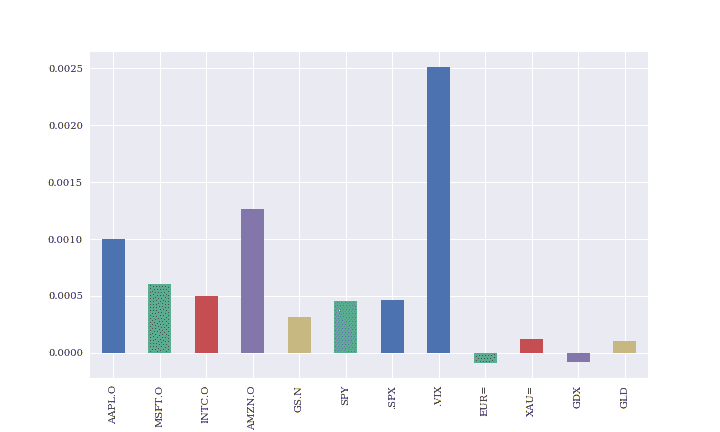
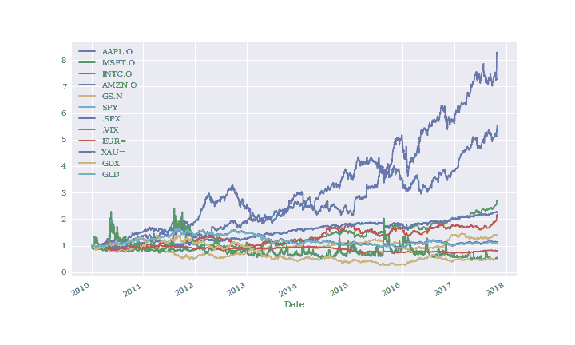

# 第八章：金融时间序列

> 时间的唯一目的是让一切不是同时发生。
> 
> 阿尔伯特·爱因斯坦

金融时间序列数据是金融领域最重要的数据类型之一。这是按日期和/或时间索引的数据。例如，随着时间的推移，股票价格代表金融时间序列数据。类似地，随时间变化的欧元/美元汇率代表金融时间序列；汇率在较短的时间间隔内报价，一系列这样的报价则是汇率的时间序列。

没有任何金融学科能够不考虑时间因素而存在。这与物理学和其他科学基本相同。在 Python 中处理时间序列数据的主要工具是`pandas`。`pandas`的原始和主要作者 Wes McKinney 在 AQR Capital Management，一家大型对冲基金的分析员时开始开发这个库。可以肯定地说`pandas`是从头开始设计用于处理金融时间序列数据的。

本章主要基于两个以逗号分隔值（CSV）文件形式的金融时间序列数据集。它沿以下线路进行：

“金融数据”

这一部分介绍了使用`pandas`处理金融时间序列数据的基础知识：数据导入，导出摘要统计信息，计算随时间变化的数据和重采样。

“滚动统计”

在金融分析中，滚动统计起着重要作用。这些统计数据通常在一个固定的时间间隔内进行计算，并在整个数据集上“滚动前进”。简单移动平均线（SMAs）是一个流行的例子。这一部分说明了`pandas`如何支持计算这种统计数据。

“相关性分析”

这一部分提供了一个基于标普 500 股票指数和 VIX 波动率指数的金融时间序列数据的案例研究。它为两个指数都呈现负相关的模式提供了一些支持。

“高频数据”

高频数据或者说 tick 数据在金融领域已经变得司空见惯。这一部分处理 tick 数据。`pandas`再次在处理这样的数据集时表现强大。

# 金融数据

这一部分处理的是一个以 CSV 文件形式存储的本地金融数据集。从技术上讲，这些文件只是由逗号分隔单个值的数据行结构的文本文件。在导入数据之前，首先进行一些软件包导入和自定义。

```py
In [1]: import numpy as np
        import pandas as pd
        from pylab import mpl, plt
        plt.style.use('seaborn')
        mpl.rcParams['font.family'] = 'serif'
        %matplotlib inline
```

## 数据导入

`pandas`提供了许多不同的函数和`DataFrame`方法来导入以不同格式存储的数据（CSV、SQL、Excel 等）以及将数据导出为不同的格式（详见第九章）。下面的代码使用`pd.read_csv()`函数从 CSV 文件中导入时间序列数据集。¹

```py
In [2]: filename = '../../source/tr_eikon_eod_data.csv'  

In [3]: !head -5 $filename  

        Date,AAPL.O,MSFT.O,INTC.O,AMZN.O,GS.N,SPY,.SPX,.VIX,EUR=,XAU=,GDX,GLD
        2010-01-04,30.57282657,30.95,20.88,133.9,173.08,113.33,1132.99,20.04,1.4411,1120.0,47.71,109.8
        2010-01-05,30.625683660000004,30.96,20.87,134.69,176.14,113.63,1136.52,19.35,1.4368,1118.65,48.17,109.7
        2010-01-06,30.138541290000003,30.77,20.8,132.25,174.26,113.71,1137.14,19.16,1.4412,1138.5,49.34,111.51
        2010-01-07,30.082827060000003,30.452,20.6,130.0,177.67,114.19,1141.69,19.06,1.4318,1131.9,49.1,110.82

In [4]: data = pd.read_csv(filename,  
                           index_col=0, 
                           parse_dates=True)  

In [5]: data.info()  

        <class 'pandas.core.frame.DataFrame'>
        DatetimeIndex: 1972 entries, 2010-01-04 to 2017-10-31
        Data columns (total 12 columns):
        AAPL.O    1972 non-null float64
        MSFT.O    1972 non-null float64
        INTC.O    1972 non-null float64
        AMZN.O    1972 non-null float64
        GS.N      1972 non-null float64
        SPY       1972 non-null float64
        .SPX      1972 non-null float64
        .VIX      1972 non-null float64
        EUR=      1972 non-null float64
        XAU=      1972 non-null float64
        GDX       1972 non-null float64
        GLD       1972 non-null float64
        dtypes: float64(12)
        memory usage: 200.3 KB
```


指定路径和文件名。


显示原始数据的前五行（Linux/Mac）。


传递给`pd.read_csv()`函数的文件名。


这指定第一列将被处理为索引。


这另外指定索引值的类型为日期时间。


结果的`DataFrame`对象。

在这个阶段，金融分析师可能会通过检查数据或将其可视化（参见图 8-1）来首次查看数据。

```py
In [6]: data.head()  
Out[6]:                AAPL.O  MSFT.O  INTC.O  AMZN.O    GS.N     SPY     .SPX   .VIX  \
        Date
        2010-01-04  30.572827  30.950   20.88  133.90  173.08  113.33  1132.99  20.04
        2010-01-05  30.625684  30.960   20.87  134.69  176.14  113.63  1136.52  19.35
        2010-01-06  30.138541  30.770   20.80  132.25  174.26  113.71  1137.14  19.16
        2010-01-07  30.082827  30.452   20.60  130.00  177.67  114.19  1141.69  19.06
        2010-01-08  30.282827  30.660   20.83  133.52  174.31  114.57  1144.98  18.13

                      EUR=     XAU=    GDX     GLD
        Date
        2010-01-04  1.4411  1120.00  47.71  109.80
        2010-01-05  1.4368  1118.65  48.17  109.70
        2010-01-06  1.4412  1138.50  49.34  111.51
        2010-01-07  1.4318  1131.90  49.10  110.82
        2010-01-08  1.4412  1136.10  49.84  111.37

In [7]: data.tail()  
Out[7]:             AAPL.O  MSFT.O  INTC.O   AMZN.O    GS.N     SPY     .SPX   .VIX  \
        Date
        2017-10-25  156.41   78.63   40.78   972.91  241.71  255.29  2557.15  11.23
        2017-10-26  157.41   78.76   41.35   972.43  241.72  255.62  2560.40  11.30
        2017-10-27  163.05   83.81   44.40  1100.95  241.71  257.71  2581.07   9.80
        2017-10-30  166.72   83.89   44.37  1110.85  240.89  256.75  2572.83  10.50
        2017-10-31  169.04   83.18   45.49  1105.28  242.48  257.15  2575.26  10.18

                      EUR=     XAU=    GDX     GLD
        Date
        2017-10-25  1.1812  1277.01  22.83  121.35
        2017-10-26  1.1650  1266.73  22.43  120.33
        2017-10-27  1.1608  1272.60  22.57  120.90
        2017-10-30  1.1649  1275.86  22.76  121.13
        2017-10-31  1.1644  1271.20  22.48  120.67

In [8]: data.plot(figsize=(10, 12), subplots=True)  
        # plt.savefig('../../images/ch08/fts_01.png');
```


前五行 …


… 最后五行显示。


这通过多个子图可视化完整数据集。


###### 图 8-1\. 金融时间序列数据的线图

使用的数据来自汤森路透（TR）Eikon 数据 API。在 TR 世界中，金融工具的符号称为“`路透社仪器代码`”或`RICs`。单个`RICs`代表的金融工具是：

```py
In [9]: instruments = ['Apple Stock', 'Microsoft Stock',
                       'Intel Stock', 'Amazon Stock', 'Goldman Sachs Stock',
                       'SPDR S&P 500 ETF Trust', 'S&P 500 Index',
                       'VIX Volatility Index', 'EUR/USD Exchange Rate',
                       'Gold Price', 'VanEck Vectors Gold Miners ETF',
                       'SPDR Gold Trust']

In [10]: for pari in zip(data.columns, instruments):
             print('{:8s} | {}'.format(pari[0], pari[1]))

         AAPL.O   | Apple Stock
         MSFT.O   | Microsoft Stock
         INTC.O   | Intel Stock
         AMZN.O   | Amazon Stock
         GS.N     | Goldman Sachs Stock
         SPY      | SPDR S&P 500 ETF Trust
         .SPX     | S&P 500 Index
         .VIX     | VIX Volatility Index
         EUR=     | EUR/USD Exchange Rate
         XAU=     | Gold Price
         GDX      | VanEck Vectors Gold Miners ETF
         GLD      | SPDR Gold Trust
```

## 摘要统计

下一步，金融分析师可能会采取的步骤是查看数据集的不同摘要统计信息，以了解它的“`感觉`”。

```py
In [11]: data.info()  

         <class 'pandas.core.frame.DataFrame'>
         DatetimeIndex: 1972 entries, 2010-01-04 to 2017-10-31
         Data columns (total 12 columns):
         AAPL.O    1972 non-null float64
         MSFT.O    1972 non-null float64
         INTC.O    1972 non-null float64
         AMZN.O    1972 non-null float64
         GS.N      1972 non-null float64
         SPY       1972 non-null float64
         .SPX      1972 non-null float64
         .VIX      1972 non-null float64
         EUR=      1972 non-null float64
         XAU=      1972 non-null float64
         GDX       1972 non-null float64
         GLD       1972 non-null float64
         dtypes: float64(12)
         memory usage: 200.3 KB

In [12]: data.describe().round(2)  
Out[12]:         AAPL.O   MSFT.O   INTC.O   AMZN.O     GS.N      SPY     .SPX     .VIX  \
         count  1972.00  1972.00  1972.00  1972.00  1972.00  1972.00  1972.00  1972.00
         mean     86.53    40.59    27.70   401.15   163.61   172.84  1727.54    17.21
         std      34.04    14.39     5.95   257.12    37.17    42.33   424.35     5.92
         min      27.44    23.01    17.66   108.61    87.70   102.20  1022.58     9.19
         25%      57.57    28.12    22.23   202.66   144.23   132.64  1325.53    13.25
         50%      84.63    36.54    26.41   306.42   162.09   178.80  1783.81    15.65
         75%     111.87    50.08    33.74   559.45   184.11   208.01  2080.15    19.20
         max     169.04    83.89    45.49  1110.85   252.89   257.71  2581.07    48.00

                   EUR=     XAU=      GDX      GLD
         count  1972.00  1972.00  1972.00  1972.00
         mean      1.25  1352.47    34.50   130.60
         std       0.12   195.38    15.44    19.46
         min       1.04  1051.36    12.47   100.50
         25%       1.13  1214.56    22.22   116.77
         50%       1.29  1288.82    26.59   123.90
         75%       1.35  1491.98    49.77   145.43
         max       1.48  1897.10    66.63   184.59
```


`.info()`提供有关`DataFrame`对象的一些元信息。


`.describe()` 提供每列有用的标准统计数据。

###### 提示

`pandas`提供了许多方法来快速查看新导入的金融时间序列数据集的概述，例如`.info()`和`.describe()`。它们还允许快速检查导入过程是否按预期工作（例如，`DataFrame`对象是否确实具有`DatetimeIndex`作为索引）。

当然，也有选项来自定义要推导和显示的统计信息类型。

```py
In [13]: data.mean()  
Out[13]: AAPL.O      86.530152
         MSFT.O      40.586752
         INTC.O      27.701411
         AMZN.O     401.154006
         GS.N       163.614625
         SPY        172.835399
         .SPX      1727.538342
         .VIX        17.209498
         EUR=         1.252613
         XAU=      1352.471593
         GDX         34.499391
         GLD        130.601856
         dtype: float64

In [14]: data.aggregate(min,  
                         np.std,  
                         np.median,  
                         max]  
         ).round(2)
Out[14]:         AAPL.O  MSFT.O  INTC.O   AMZN.O    GS.N     SPY     .SPX   .VIX  EUR=  \
         min      27.44   23.01   17.66   108.61   87.70  102.20  1022.58   9.19  1.04
         mean     86.53   40.59   27.70   401.15  163.61  172.84  1727.54  17.21  1.25
         std      34.04   14.39    5.95   257.12   37.17   42.33   424.35   5.92  0.12
         median   84.63   36.54   26.41   306.42  162.09  178.80  1783.81  15.65  1.29
         max     169.04   83.89   45.49  1110.85  252.89  257.71  2581.07  48.00  1.48

                    XAU=    GDX     GLD
         min     1051.36  12.47  100.50
         mean    1352.47  34.50  130.60
         std      195.38  15.44   19.46
         median  1288.82  26.59  123.90
         max     1897.10  66.63  184.59
```


每列的均值。


每列的最小值。


每列的均值。


每列的标准偏差。


每列的最大值。


使用`.aggregate()`方法还允许传递自定义函数。

## 随时间变化

大多数统计分析方法，例如，通常基于时间序列随时间的变化，而不是绝对值本身。有多种选项可以计算时间序列随时间的变化，包括：绝对差异、百分比变化和对数（对数）收益。

首先是绝对差异，对于这个`pandas`提供了一个特殊的方法。

```py
In [15]: data.diff().head()  
Out[15]:               AAPL.O  MSFT.O  INTC.O  AMZN.O  GS.N   SPY  .SPX  .VIX    EUR=  \
         Date
         2010-01-04       NaN     NaN     NaN     NaN   NaN   NaN   NaN   NaN     NaN
         2010-01-05  0.052857   0.010   -0.01    0.79  3.06  0.30  3.53 -0.69 -0.0043
         2010-01-06 -0.487142  -0.190   -0.07   -2.44 -1.88  0.08  0.62 -0.19  0.0044
         2010-01-07 -0.055714  -0.318   -0.20   -2.25  3.41  0.48  4.55 -0.10 -0.0094
         2010-01-08  0.200000   0.208    0.23    3.52 -3.36  0.38  3.29 -0.93  0.0094

                      XAU=   GDX   GLD
         Date
         2010-01-04    NaN   NaN   NaN
         2010-01-05  -1.35  0.46 -0.10
         2010-01-06  19.85  1.17  1.81
         2010-01-07  -6.60 -0.24 -0.69
         2010-01-08   4.20  0.74  0.55

In [16]: data.diff().mean()  
Out[16]: AAPL.O    0.070252
         MSFT.O    0.026499
         INTC.O    0.012486
         AMZN.O    0.492836
         GS.N      0.035211
         SPY       0.072968
         .SPX      0.731745
         .VIX     -0.005003
         EUR=     -0.000140
         XAU=      0.076712
         GDX      -0.012801
         GLD       0.005515
         dtype: float64
```


`.diff()`提供了两个索引值之间的绝对变化。


当然，还可以应用聚合操作。

从统计学的角度来看，绝对变化不是最佳选择，因为它们依赖于时间序列数据本身的比例。因此，通常更喜欢百分比变化。以下代码推导了金融背景下的百分比变化或百分比收益（也称为：简单收益），并可视化其每列的均值（参见 图 8-2）。

```py
In [17]: data.pct_change().round(3).head()  
Out[17]:             AAPL.O  MSFT.O  INTC.O  AMZN.O   GS.N    SPY   .SPX   .VIX   EUR=  \
         Date
         2010-01-04     NaN     NaN     NaN     NaN    NaN    NaN    NaN    NaN    NaN
         2010-01-05   0.002   0.000  -0.000   0.006  0.018  0.003  0.003 -0.034 -0.003
         2010-01-06  -0.016  -0.006  -0.003  -0.018 -0.011  0.001  0.001 -0.010  0.003
         2010-01-07  -0.002  -0.010  -0.010  -0.017  0.020  0.004  0.004 -0.005 -0.007
         2010-01-08   0.007   0.007   0.011   0.027 -0.019  0.003  0.003 -0.049  0.007

                      XAU=    GDX    GLD
         Date
         2010-01-04    NaN    NaN    NaN
         2010-01-05 -0.001  0.010 -0.001
         2010-01-06  0.018  0.024  0.016
         2010-01-07 -0.006 -0.005 -0.006
         2010-01-08  0.004  0.015  0.005

In [18]: data.pct_change().mean().plot(kind='bar', figsize=(10, 6));  
         # plt.savefig('../../images/ch08/fts_02.png');
```


`.pct_change()`计算两个索引值之间的百分比变化。


结果的均值作为条形图可视化。



###### 图 8-2\. 百分比变化的均值作为条形图

作为百分比收益的替代，可以使用对数收益。在某些情况下，它们更容易处理，因此在金融背景下通常更受欢迎。² 图 8-3 展示了单个金融时间序列的累积对数收益。这种类型的绘图导致某种形式的*归一化*。

```py
In [19]: rets = np.log(data / data.shift(1))  

In [20]: rets.head().round(3)  
Out[20]:             AAPL.O  MSFT.O  INTC.O  AMZN.O   GS.N    SPY   .SPX   .VIX   EUR=  \
         Date
         2010-01-04     NaN     NaN     NaN     NaN    NaN    NaN    NaN    NaN    NaN
         2010-01-05   0.002   0.000  -0.000   0.006  0.018  0.003  0.003 -0.035 -0.003
         2010-01-06  -0.016  -0.006  -0.003  -0.018 -0.011  0.001  0.001 -0.010  0.003
         2010-01-07  -0.002  -0.010  -0.010  -0.017  0.019  0.004  0.004 -0.005 -0.007
         2010-01-08   0.007   0.007   0.011   0.027 -0.019  0.003  0.003 -0.050  0.007

                      XAU=    GDX    GLD
         Date
         2010-01-04    NaN    NaN    NaN
         2010-01-05 -0.001  0.010 -0.001
         2010-01-06  0.018  0.024  0.016
         2010-01-07 -0.006 -0.005 -0.006
         2010-01-08  0.004  0.015  0.005

In [21]: rets.cumsum().apply(np.exp).plot(figsize=(10, 6));  
         # plt.savefig('../../images/ch08/fts_03.png');
```


这以向量化方式计算对数收益。


结果的子集。


这绘制了随时间累积的对数收益；首先调用`.cumsum()`方法，然后将`np.exp()`应用于结果。



###### 图 8-3\. 随时间累积的对数收益

## 重采样

对于金融时间序列数据，重采样是一项重要的操作。通常，这采取*上采样*的形式，意味着例如，具有每日观测的时间序列被重采样为具有每周或每月观测的时间序列。这也可能意味着将金融 Tick 数据系列重采样为一分钟间隔（也称为：柱）。

```py
In [22]: data.resample('1w', label='right').last().head()  
Out[22]:                AAPL.O  MSFT.O  INTC.O  AMZN.O    GS.N     SPY     .SPX   .VIX  \
         Date
         2010-01-10  30.282827   30.66   20.83  133.52  174.31  114.57  1144.98  18.13
         2010-01-17  29.418542   30.86   20.80  127.14  165.21  113.64  1136.03  17.91
         2010-01-24  28.249972   28.96   19.91  121.43  154.12  109.21  1091.76  27.31
         2010-01-31  27.437544   28.18   19.40  125.41  148.72  107.39  1073.87  24.62
         2010-02-07  27.922829   28.02   19.47  117.39  154.16  106.66  1066.19  26.11

                       EUR=     XAU=    GDX     GLD
         Date
         2010-01-10  1.4412  1136.10  49.84  111.37
         2010-01-17  1.4382  1129.90  47.42  110.86
         2010-01-24  1.4137  1092.60  43.79  107.17
         2010-01-31  1.3862  1081.05  40.72  105.96
         2010-02-07  1.3662  1064.95  42.41  104.68

In [23]: data.resample('1m', label='right').last().head()  
Out[23]:                AAPL.O   MSFT.O  INTC.O  AMZN.O    GS.N       SPY     .SPX  \
         Date
         2010-01-31  27.437544  28.1800   19.40  125.41  148.72  107.3900  1073.87
         2010-02-28  29.231399  28.6700   20.53  118.40  156.35  110.7400  1104.49
         2010-03-31  33.571395  29.2875   22.29  135.77  170.63  117.0000  1169.43
         2010-04-30  37.298534  30.5350   22.84  137.10  145.20  118.8125  1186.69
         2010-05-31  36.697106  25.8000   21.42  125.46  144.26  109.3690  1089.41

                      .VIX    EUR=     XAU=    GDX      GLD
         Date
         2010-01-31  24.62  1.3862  1081.05  40.72  105.960
         2010-02-28  19.50  1.3625  1116.10  43.89  109.430
         2010-03-31  17.59  1.3510  1112.80  44.41  108.950
         2010-04-30  22.05  1.3295  1178.25  50.51  115.360
         2010-05-31  32.07  1.2267  1213.81  49.86  118.881

In [24]: rets.cumsum().resample('1m', label='right').last(
                                   ).plot(figsize=(10, 6));  
         # plt.savefig('../../images/ch08/fts_04.png');
```


EOD 数据被重采样为


结果的子集。


这绘制了随时间累积的对数收益；首先调用`.cumsum()`方法，然后将`np.exp()`应用于结果。


###### 图 8-4\. 随时间重采样的累积对数收益（每月）

###### 注意

在重新取样时，默认情况下，`pandas`采用区间的左标签（或索引值）。为了保持金融一致性，请确保使用右标签（索引值）和通常是区间中最后一个可用数据点。否则，可能会在金融分析中引入预见偏差。^（3）

# 滚动统计

在金融传统中，通常称为*滚动统计*，也称为*金融指标*或*金融研究*。这样的滚动统计是金融图表分析师和技术交易员的基本工具，例如。本节仅处理单个金融时间序列。

```py
In [25]: sym = 'AAPL.O'

In [26]: data = pd.DataFrame(data[sym])

In [27]: data.tail()
Out[27]:             AAPL.O
         Date
         2017-10-25  156.41
         2017-10-26  157.41
         2017-10-27  163.05
         2017-10-30  166.72
         2017-10-31  169.04
```

## 概览

使用`pandas`很容易得出标准滚动统计。

```py
In [28]: window = 20  

In [29]: data['min'] = data[sym].rolling(window=window).min()  

In [30]: data['mean'] = data[sym].rolling(window=window).mean()  

In [31]: data['std'] = data[sym].rolling(window=window).std()  

In [32]: data['median'] = data[sym].rolling(window=window).median()  

In [33]: data['max'] = data[sym].rolling(window=window).max()  

In [34]: data['ewma'] = data[sym].ewm(halflife=0.5, min_periods=window).mean()  
```


定义窗口，即要包含的索引值的数量。


计算滚动最小值。


计算滚动均值。


计算滚动标准差。


计算滚动中位数。


计算滚动最大值。


这将计算指数加权移动平均值，衰减以半衰期`0.5`来计算。

要推导出更专业的金融指标，通常需要使用其他软件包（例如，使用`Cufflinks`进行金融图表，参见“交互式二维绘图”）。也可以通过`.apply()`方法轻松地应用自定义指标。

下面的代码显示了部分结果，并可视化了计算的滚动统计的选择部分（参见图 8-5）。

```py
In [35]: data.dropna().head()
Out[35]:                AAPL.O        min       mean       std     median        max  \
         Date
         2010-02-01  27.818544  27.437544  29.580892  0.933650  29.821542  30.719969
         2010-02-02  27.979972  27.437544  29.451249  0.968048  29.711113  30.719969
         2010-02-03  28.461400  27.437544  29.343035  0.950665  29.685970  30.719969
         2010-02-04  27.435687  27.435687  29.207892  1.021129  29.547113  30.719969
         2010-02-05  27.922829  27.435687  29.099892  1.037811  29.419256  30.719969

                          ewma
         Date
         2010-02-01  27.805432
         2010-02-02  27.936337
         2010-02-03  28.330134
         2010-02-04  27.659299
         2010-02-05  27.856947

In [36]: ax = data[['min', 'mean', 'max']].iloc[-200:].plot(
             figsize=(10, 6), style=['g--', 'r--', 'g--'], lw=0.8)  
         data[sym].iloc[-200:].plot(ax=ax, lw=2.0);  
         # plt.savefig('../../images/ch08/fts_05.png');
```


绘制最后 200 个数据行的三个滚动统计。


将原始时间序列数据添加到图表中。


###### 图 8-5。最小、平均、最大值的滚动统计

## 技术分析示例

与基本分析相比，滚动统计是所谓的技术分析中的主要工具，基本分析侧重于财务报告和被分析股票公司的战略位置等方面。

基于技术分析的几十年历史的交易策略基于*两个简单移动平均线（SMAs）*。这个想法是，当短期 SMA 高于长期 SMA 时，交易员应该持有一支股票（或者一般的金融工具），当情况相反时，应该空仓。这些概念可以通过`pandas`和`DataFrame`对象的功能来精确描述。

当给定了`window`参数规范并且有足够的数据时，通常才会计算滚动统计。如图 8-6 所示，SMAs 时间序列仅从有足够数据的那天开始。

```py
In [37]: data['SMA1'] = data[sym].rolling(window=42).mean()  

In [38]: data['SMA2'] = data[sym].rolling(window=252).mean()  

In [39]: data[[sym, 'SMA1', 'SMA2']].tail()
Out[39]:             AAPL.O        SMA1        SMA2
         Date
         2017-10-25  156.41  157.610952  139.862520
         2017-10-26  157.41  157.514286  140.028472
         2017-10-27  163.05  157.517619  140.221210
         2017-10-30  166.72  157.597857  140.431528
         2017-10-31  169.04  157.717857  140.651766

In [40]: data[[sym, 'SMA1', 'SMA2']].plot(figsize=(10, 6));  
         # plt.savefig('../../images/ch08/fts_06.png');
```


计算短期 SMA 的值。


计算长期 SMA 的值。


可视化股价数据和两条 SMAs 时间序列。


###### 图 8-6\. 苹果股价和两条简单移动平均线

在这个背景下，简单移动平均线（SMAs）仅仅是实现目标的手段。它们被用来推导出实施交易策略的定位。图 8-7 通过数值`1`来可视化多头头寸，数值`-1`来可视化空头头寸。头寸的变化（在视觉上）由表示 SMAs 时间序列的两条线的交叉触发。

```py
In [41]: data.dropna(inplace=True)  

In [42]: data['positions'] = np.where(data['SMA1'] > data['SMA2'],  
                                      1,  
                                      -1)  

In [43]: ax = data[[sym, 'SMA1', 'SMA2', 'positions']].plot(figsize=(10, 6),
                                                       secondary_y='positions')
         ax.get_legend().set_bbox_to_anchor((0.25, 0.85));
         # plt.savefig('../../images/ch08/fts_07.png');
```


仅保留完整的数据行。


如果短期 SMA 值大于长期 SMA 值…


…买入股票（放置`1`）…


…否则卖空股票（放置`-1`）。


###### 图 8-7\. 苹果股价，两条简单移动平均线和头寸

在这里隐含地推导出的交易策略本质上只导致了很少的交易：只有当头寸价值变化（即发生交叉）时，才会进行交易。包括开仓和平仓交易，在总计中这将只增加到六次交易。

# 相关性分析

作为如何使用`pandas`和金融时间序列数据的进一步说明，考虑标准普尔 500 股指数和 VIX 波动率指数的情况。一个事实是，一般情况下，当标准普尔 500 上涨时，VIX 下降，反之亦然。这涉及*相关性*而不是*因果关系*。本节展示了如何为标准普尔 500 和 VIX 之间（高度）负相关的事实提供支持性统计证据。⁴

## 数据

数据集现在包含两个金融时间序列，都在图 8-8 中可视化。

```py
In [44]: # EOD data from Thomson Reuters Eikon Data API
         raw = pd.read_csv('../../source/tr_eikon_eod_data.csv',
                          index_col=0, parse_dates=True)

In [45]: data = raw[['.SPX', '.VIX']]

In [46]: data.tail()
Out[46]:                .SPX   .VIX
         Date
         2017-10-25  2557.15  11.23
         2017-10-26  2560.40  11.30
         2017-10-27  2581.07   9.80
         2017-10-30  2572.83  10.50
         2017-10-31  2575.26  10.18

In [47]: data.plot(subplots=True, figsize=(10, 6));
         # plt.savefig('../../images/ch08/fts_08.png');
```


###### 图 8-8\. S&P 500 和 VIX 时间序列数据（不同的缩放）

当在单个图中绘制（部分）两个时间序列并进行调整缩放时，两个指数之间的负相关的事实通过简单的视觉检查就已经变得明显。

```py
In [48]: data.loc[:'2012-12-31'].plot(secondary_y='.VIX', figsize=(10, 6));
         # plt.savefig('../../images/ch08/fts_09.png');
```


###### 图 8-9\. S&P 500 和 VIX 时间序列数据（相同的缩放）

## 对数收益率

如上所述，一般的统计分析依赖于收益而不是绝对变化或甚至绝对值。因此，在进行任何进一步分析之前，首先计算对数收益。图 8-10 显示了随时间变化的对数收益的高变异性。对于两个指数都可以发现所谓的波动率集群。总的来说，股票指数波动率高的时期伴随着波动率指数的同样现象。

```py
In [49]: rets = np.log(data / data.shift(1))

In [50]: rets.head()
Out[50]:                 .SPX      .VIX
         Date
         2010-01-04       NaN       NaN
         2010-01-05  0.003111 -0.035038
         2010-01-06  0.000545 -0.009868
         2010-01-07  0.003993 -0.005233
         2010-01-08  0.002878 -0.050024

In [51]: rets.dropna(inplace=True)

In [52]: rets.plot(subplots=True, figsize=(10, 6));
         # plt.savefig('../../images/ch08/fts_10.png');
```


###### 图 8-10。S&P 500 和 VIX 的对数收益随时间变化

在这种情况下，`pandas`的`scatter_matrix()`绘图函数非常方便用于可视化。它将两个系列的对数收益相互绘制，可以在对角线上添加直方图或核密度估计器（KDE）（请参见图 8-11）。

```py
In [53]: pd.plotting.scatter_matrix(rets,  
                                    alpha=0.2,  
                                    diagonal='hist',  
                                    hist_kwds={'bins': 35},  
                                    figsize=(10, 6));
         # plt.savefig('../../images/ch08/fts_11.png');
```


要绘制的数据集。


点的不透明度参数为`alpha`。


放置在对角线上的内容；这里是列数据的直方图。


这些是要传递给直方图绘图函数的关键字。


###### 图 8-11。S&P 500 和 VIX 的对数收益作为散点矩阵

## OLS 回归

通过所有这些准备，普通最小二乘（OLS）回归分析很方便实现。图 8-12 显示了对数收益的散点图和通过点云的线性回归线。斜率明显为负，支持了关于两个指数之间负相关的事实。

```py
In [54]: reg = np.polyfit(rets['.SPX'], rets['.VIX'], deg=1)  

In [55]: ax = rets.plot(kind='scatter', x='.SPX', y='.VIX', figsize=(10, 6))  
         ax.plot(rets['.SPX'], np.polyval(reg, rets['.SPX']), 'r', lw=2);  
         # plt.savefig('../../images/ch08/fts_12.png');
```


这实现了线性 OLS 回归。


这将对数收益绘制为散点图…


… 添加了线性回归线。


###### 图 8-12。S&P 500 和 VIX 的对数收益作为散点矩阵

## 相关性

最后，直接考虑相关性度量。考虑到两种度量，一种是考虑完整数据集的静态度量，另一种是显示一定时间内相关性的滚动度量。图 8-13 说明了相关性确实随时间变化，但鉴于参数设置，始终为负。这确实强有力地支持了 S&P 500 和 VIX 指数之间甚至强烈的负相关的事实。

```py
In [56]: rets.corr()  
Out[56]:           .SPX      .VIX
         .SPX  1.000000 -0.808372
         .VIX -0.808372  1.000000

In [57]: ax = rets['.SPX'].rolling(window=252).corr(
                           rets['.VIX']).plot(figsize=(10, 6))  
         ax.axhline(rets.corr().iloc[0, 1], c='r');  
         # plt.savefig('../../images/ch08/fts_13.png');
```


整个`DataFrame`的相关矩阵。


这会绘制随时间变化的滚动相关性……


… 并将静态值添加到绘图中作为水平线。


###### 图 8-13\. 标普 500 和 VIX 之间的相关性（静态和滚动）

# 高频数据

本章介绍了使用`pandas`进行金融时间序列分析。金融时间序列的一个特殊情况是 tick 数据集。坦率地说，它们可以更多或更少地以与本章迄今为止使用的 EOD 数据集相同的方式处理。一般来说，使用`pandas`导入这些数据集也是相当快的。所使用的数据集包含 17,352 行数据（另见图 8-14）。

```py
In [58]: %%time
         # data from FXCM Forex Capital Markets Ltd.
         tick = pd.read_csv('../../source/fxcm_eur_usd_tick_data.csv',
                              index_col=0, parse_dates=True)

         CPU times: user 23 ms, sys: 3.35 ms, total: 26.4 ms
         Wall time: 25.1 ms

In [59]: tick.info()

         <class 'pandas.core.frame.DataFrame'>
         DatetimeIndex: 17352 entries, 2017-11-10 12:00:00.007000 to 2017-11-10 14:00:00.131000
         Data columns (total 2 columns):
         Bid    17352 non-null float64
         Ask    17352 non-null float64
         dtypes: float64(2)
         memory usage: 406.7 KB

In [60]: tick['Mid'] = tick.mean(axis=1)  

In [61]: tick['Mid'].plot(figsize=(10, 6));
         # plt.savefig('../../images/ch08/fts_14.png');
```


计算每一行数据的`Mid`价格。


###### 图 8-14\. 欧元/美元汇率的 tick 数据

处理 tick 数据通常需要对金融时间序列数据进行重新采样。以下代码将 tick 数据重新采样为一分钟的条形数据。例如，这样的数据集（另见图 8-15）用于回测算法交易策略或实施技术分析。

```py
In [62]: tick_resam = tick.resample(rule='1min', label='right').last()

In [63]: tick_resam.head()
Out[63]:                          Bid      Ask       Mid
         2017-11-10 12:01:00  1.16406  1.16407  1.164065
         2017-11-10 12:02:00  1.16396  1.16397  1.163965
         2017-11-10 12:03:00  1.16416  1.16418  1.164170
         2017-11-10 12:04:00  1.16417  1.16417  1.164170
         2017-11-10 12:05:00  1.16425  1.16427  1.164260

In [64]: tick_resam['Mid'].plot(figsize=(10, 6));
         # plt.savefig('../../images/ch08/fts_15.png');
```


###### 图 8-15\. 欧元/美元汇率的一分钟条形数据

# 结论

本章涉及金融时间序列，可能是金融领域最重要的数据类型。`pandas`是处理这种数据集的强大工具包，不仅可以进行高效的数据分析，而且还可以轻松进行可视化。`pandas`还有助于从不同来源读取此类数据集，并将此类数据集导出为不同的技术文件格式。这在随后的第九章第九章中进行了说明。

# 进一步阅读

本章涵盖的主题在书籍形式上有很好的参考资料：

+   McKinney, Wes (2017): *Python for Data Analysis*. 2nd ed., O’Reilly, 北京等地.

+   VanderPlas, Jake (2016): *Python Data Science Handbook*. O’Reilly, 北京等地。

¹ 该文件包含了从汤姆森路透 Eikon 数据 API 检索的不同金融工具的每日结束数据（EOD 数据）。

² 其中一个优点是随时间的可加性，这对于简单的百分比变化/回报并不成立。

³ *预见偏见* ——或者，在其最强形式下，*完美预见* ——意味着在金融分析的某个点上使用的数据仅在以后才可用。结果可能是“`太好了`”的结果，例如，在回测交易策略时。

⁴ 其背后的一个推理是，当股指下跌时——例如在危机期间——交易量会上升，因此波动性也会上升。当股指上涨时，投资者通常会保持冷静，并且不怎么有动力进行大量交易。特别是，仅持有多头头寸的投资者会试图进一步跟进趋势。
