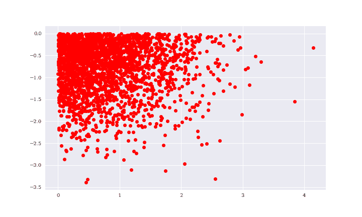
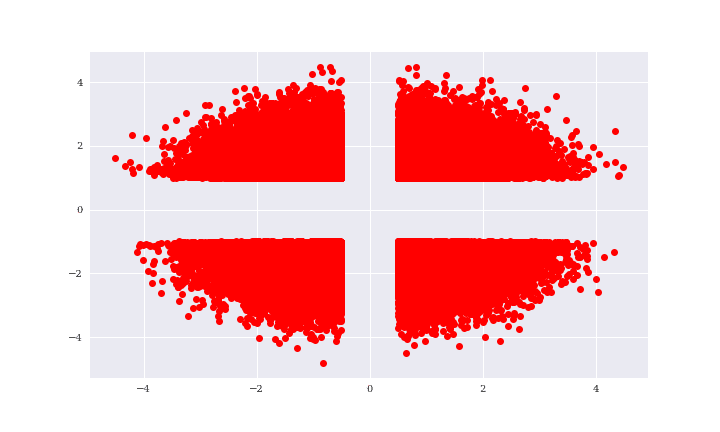
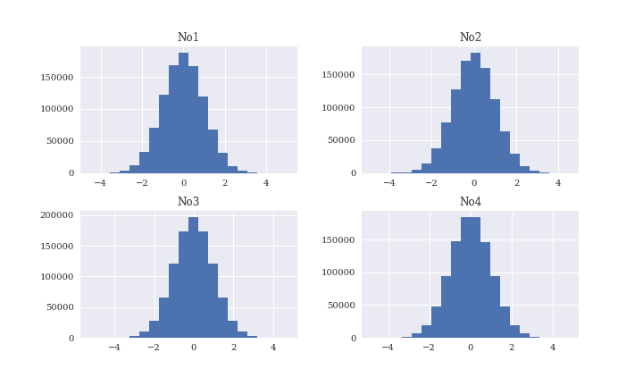
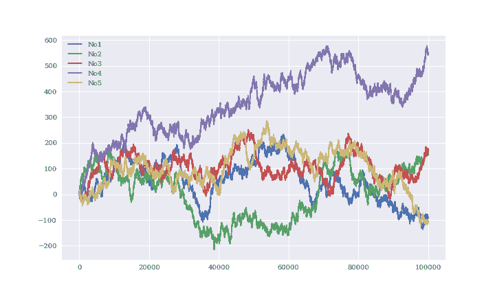
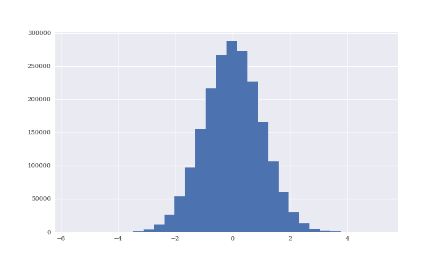
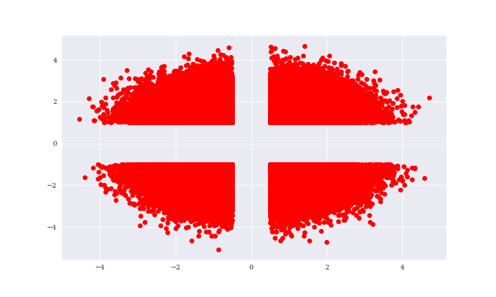
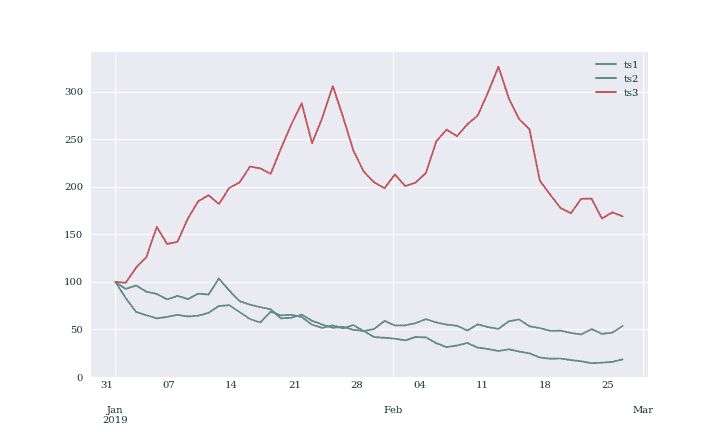
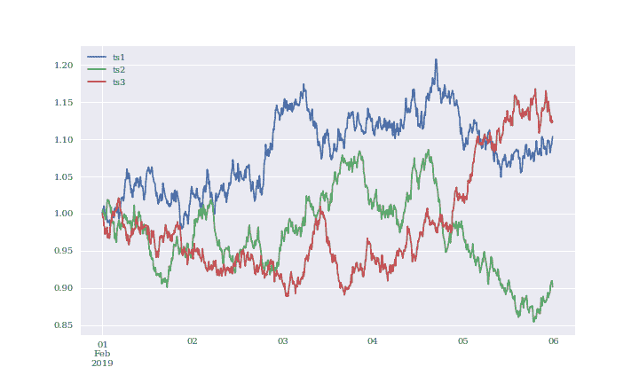

# 第九章：输入/输出操作

> 在有数据之前进行理论推断是一个大错误。
> 
> 福尔摩斯

作为一般规则，无论是在金融环境中还是在其他任何应用程序领域，大多数数据都存储在硬盘驱动器（HDDs）或其他形式的永久存储设备上，如固态硬盘（SSDs）或混合硬盘驱动器。多年来，存储容量一直在稳步增长，而存储单元的成本（例如，每兆字节）一直在稳步下降。

与此同时，存储数据的容量增长速度远远快于即使是最大型机器中可用的典型随机访问内存（RAM）。这使得不仅需要将数据存储到磁盘上以进行永久存储，而且需要通过将数据从 RAM 交换到磁盘，然后再交换回来来弥补 RAM 不足的情况。

因此，在金融应用程序和数据密集型应用程序中，输入/输出（I/O）操作通常是重要的任务。通常，它们代表了性能关键计算的瓶颈，因为 I/O 操作通常无法将数据快速地从 RAM 移动到 RAM¹，然后再从 RAM 移动到磁盘。从某种意义上说，CPU 经常由于 I/O 操作慢而“`饥饿`”。

尽管如今的大部分金融和企业分析工作都面临着大数据（例如，PB 级别），但单个分析任务通常使用的数据子集属于中等数据类别。微软研究的一项研究得出了结论：

> 我们的测量以及其他最近的工作显示，大多数现实世界的分析任务处理的输入量不超过 100GB，但流行的基础设施，如 Hadoop/MapReduce 最初是为 PB 级处理而设计的。
> 
> Appuswamy 等人（2013 年）

就频率而言，单个金融分析任务通常处理不超过几 GB 大小的数据，并且这是 Python 及其科学堆栈库（如`NumPy`，`pandas`和`PyTables`）的甜蜜点。这样大小的数据集也可以在内存中进行分析，利用今天的 CPU 和 GPU 通常会获得较高的速度。但是，必须将数据读入 RAM 并将结果写入磁盘，同时确保满足今天的性能要求。

本章涉及以下主题：

“使用 Python 进行基本 I/O”

Python 具有内置函数，可以对任何对象进行序列化并将其存储到磁盘上，然后从磁盘中读取到 RAM 中；除此之外，在处理文本文件和`SQL`数据库时，Python 也很强大。`NumPy`还提供了专用函数，用于快速二进制存储和检索`ndarray`对象。

“使用 pandas 进行 I/O”

`pandas`库提供了丰富的便利函数和方法，用于读取存储在不同格式中的数据（例如，`CSV`，`JSON`）并将数据写入不同格式的文件。

“使用 PyTables 进行快速 I/O”

`PyTables` 使用具有分层数据库结构和二进制存储的 [`HDF5`](http://www.hdfgroup.org) 标准来实现对大数据集的快速 I/O 操作；速度通常仅受使用的硬件限制。

“TsTables 的 I/O”

`TsTables` 是一个构建在 `PyTables` 之上的包，允许快速存储和检索时间序列数据。

# Python 的基本 I/O

Python 本身具有多种 I/O 功能，有些针对性能进行了优化，而其他一些则更注重灵活性。然而，总的来说，它们既可以在交互式环境下使用，也可以在生产环境中轻松应用。

## 将对象写入磁盘

以供以后使用、文档化或与他人共享，有人可能想要将 Python 对象存储在磁盘上。一个选项是使用 `pickle` 模块。该模块可以序列化大多数 Python 对象。*序列化* 指的是将对象（层次结构）转换为字节流；*反序列化* 是相反的操作。

通常情况下，首先进行一些与绘图相关的导入和自定义：

```py
In [1]: from pylab import plt, mpl
        plt.style.use('seaborn')
        mpl.rcParams['font.family'] = 'serif'
        %matplotlib inline
```

接下来的示例使用（伪）随机数据，这次存储在 `list` 对象中：

```py
In [2]: import pickle  # ①
        import numpy as np
        from random import gauss  # ②

In [3]: a = [gauss(1.5, 2) for i in range(1000000)]  # ③

In [4]: path = '/Users/yves/Documents/Temp/data/'  # ④

In [5]: pkl_file = open(path + 'data.pkl', 'wb')  # ⑤
```


从标准库导入 `pickle` 模块。


导入 `gauss` 以生成正态分布的随机数。


创建一个更大的 `list` 对象，并填充随机数。


指定存储数据文件的路径。


以二进制模式打开文件进行写入（`wb`）。

用于序列化和反序列化 Python 对象的两个主要函数是 `pickle.dump()`（用于写入对象）和 `pickle.load()`（用于将对象加载到内存中）：

```py
In [6]: %time pickle.dump(a, pkl_file)  # ①

        CPU times: user 23.4 ms, sys: 10.1 ms, total: 33.5 ms
        Wall time: 31.9 ms

In [7]: pkl_file.close()  # ②

In [8]: ll $path*  # ③

        -rw-r--r--  1 yves  staff    9002006 Jan 18 10:05 /Users/yves/Documents/Temp/data/data.pkl
        -rw-r--r--  1 yves  staff  163328824 Jan 18 10:05 /Users/yves/Documents/Temp/data/tstb.h5

In [9]: pkl_file = open(path + 'data.pkl', 'rb')  # ④

In [10]: %time b = pickle.load(pkl_file)  # ⑤

         CPU times: user 28.7 ms, sys: 15.2 ms, total: 43.9 ms
         Wall time: 41.9 ms

In [11]: a[:3]
Out[11]: [3.0804166128701134, -0.6586387748854099, 3.3266248354210206]

In [12]: b[:3]
Out[12]: [3.0804166128701134, -0.6586387748854099, 3.3266248354210206]

In [13]: np.allclose(np.array(a), np.array(b))  # ⑥
Out[13]: True
```


序列化对象 `a` 并将其保存到文件中。


关闭文件。


显示磁盘上的文件及其大小（Mac/Linux）。


以二进制模式打开文件进行读取（`rb`）。


从磁盘读取对象并进行反序列化。


将 `a` 和 `b` 转换为 `ndarrary` 对象，`np.allclose()` 验证两者包含相同的数据（数字）。

使用 `pickle` 存储和检索单个对象显然非常简单。那么两个对象呢？

```py
In [14]: pkl_file = open(path + 'data.pkl', 'wb')

In [15]: %time pickle.dump(np.array(a), pkl_file)  # ①

         CPU times: user 26.6 ms, sys: 11.5 ms, total: 38.1 ms
         Wall time: 36.3 ms

In [16]: %time pickle.dump(np.array(a) ** 2, pkl_file)  # ②

         CPU times: user 35.3 ms, sys: 12.7 ms, total: 48 ms
         Wall time: 46.8 ms

In [17]: pkl_file.close()

In [18]: ll $path*  # ③

         -rw-r--r--  1 yves  staff   16000322 Jan 18 10:05 /Users/yves/Documents/Temp/data/data.pkl
         -rw-r--r--  1 yves  staff  163328824 Jan 18 10:05 /Users/yves/Documents/Temp/data/tstb.h5
```


序列化 `a` 的 `ndarray` 版本并保存。


序列化 `a` 的平方 `ndarray` 版本并保存。


文件现在的大小大约是之前的两倍。

那么如何将两个`ndarray`对象读回内存？

```py
In [19]: pkl_file = open(path + 'data.pkl', 'rb')

In [20]: x = pickle.load(pkl_file)  # ①
         x[:4]
Out[20]: array([ 3.08041661, -0.65863877,  3.32662484,  0.77225328])

In [21]: y = pickle.load(pkl_file)  # ②
         y[:4]
Out[21]: array([  9.48896651,   0.43380504,  11.0664328 ,   0.59637513])

In [22]: pkl_file.close()
```


这检索到了存储的对象*第一个*。


这检索到了存储的对象*第二个*。

很明显，`pickle`根据*先进先出*（FIFO）原则存储对象。但这存在一个主要问题：用户事先无法获得关于存储在`pickle`文件中的内容的元信息。

有时一个有用的解决方法是不存储单个对象，而是存储包含所有其他对象的`dict`对象：

```py
In [23]: pkl_file = open(path + 'data.pkl', 'wb')
         pickle.dump({'x': x, 'y': y}, pkl_file)  # ①
         pkl_file.close()

In [24]: pkl_file = open(path + 'data.pkl', 'rb')
         data = pickle.load(pkl_file)  # ②
         pkl_file.close()
         for key in data.keys():
             print(key, data[key][:4])

         x [ 3.08041661 -0.65863877  3.32662484  0.77225328]
         y [  9.48896651   0.43380504  11.0664328    0.59637513]

In [25]: !rm -f $path*
```


存储包含两个`ndarray`对象的`dict`对象。


检索`dict`对象。

然而，这种方法要求一次性写入和读取所有对象。考虑到它带来的更高便利性，这可能是一个可以接受的折中方案。

## 读写文本文件

文本处理可以被视为 Python 的一个优势。事实上，许多公司和科学用户正是用 Python 来完成这项任务的。使用 Python，你有多种选择来处理`str`对象，以及一般的文本文件。

假设有一个相当大的数据集要共享为逗号分隔值（`CSV`）文件。尽管这些文件具有特殊的内部结构，但它们基本上是纯文本文件。以下代码创建一个虚拟数据集作为`ndarray`对象，一个`DatetimeIndex`对象，将两者组合并将数据存储为 CSV 文本文件。

```py
In [26]: import pandas as pd

In [27]: rows = 5000  # ①
         a = np.random.standard_normal((rows, 5)).round(4)  # ②

In [28]: a  # ②
Out[28]: array([[-0.9627,  0.1326, -2.012 , -0.299 , -1.4554],
                [ 0.8918,  0.8904, -0.3396, -2.3485,  2.0913],
                [-0.1899, -0.9574,  1.0258,  0.6206, -2.4693],
                ...,
                [ 1.4688, -1.268 , -0.4778,  1.4315, -1.4689],
                [ 1.1162,  0.152 , -0.9363, -0.7869, -0.1147],
                [-0.699 ,  0.3206,  0.3659, -1.0282, -0.4151]])

In [29]: t = pd.date_range(start='2019/1/1', periods=rows, freq='H')  # ③

In [30]: t  # ③
Out[30]: DatetimeIndex(['2019-01-01 00:00:00', '2019-01-01 01:00:00',
                        '2019-01-01 02:00:00', '2019-01-01 03:00:00',
                        '2019-01-01 04:00:00', '2019-01-01 05:00:00',
                        '2019-01-01 06:00:00', '2019-01-01 07:00:00',
                        '2019-01-01 08:00:00', '2019-01-01 09:00:00',
                        ...
                        '2019-07-27 22:00:00', '2019-07-27 23:00:00',
                        '2019-07-28 00:00:00', '2019-07-28 01:00:00',
                        '2019-07-28 02:00:00', '2019-07-28 03:00:00',
                        '2019-07-28 04:00:00', '2019-07-28 05:00:00',
                        '2019-07-28 06:00:00', '2019-07-28 07:00:00'],
                       dtype='datetime64[ns]', length=5000, freq='H')

In [31]: csv_file = open(path + 'data.csv', 'w')  # ④

In [32]: header = 'date,no1,no2,no3,no4,no5\n'  # ⑤

In [33]: csv_file.write(header)  # ⑤
Out[33]: 25

In [34]: for t_, (no1, no2, no3, no4, no5) in zip(t, a):  # ⑥
             s = '{},{},{},{},{},{}\n'.format(t_, no1, no2, no3, no4, no5)  # ⑦
             csv_file.write(s)  # ⑧

In [35]: csv_file.close()

In [36]: ll $path*

         -rw-r--r--  1 yves  staff  284621 Jan 18 10:05 /Users/yves/Documents/Temp/data/data.csv
```


定义数据集的行数。


创建具有随机数的`ndarray`对象。


创建一个适当长度的`DatetimeIndex`对象（每小时间隔）。


打开一个供写入的文件（`w`）。


定义标题行（列标签）并将其写为第一行。


数据以行为单位组合…


…转换为`str`对象…


…并逐行写入（追加到 CSV 文本文件中）。

另一种方法也类似。首先，打开现有的`CSV`文件。其次，使用`file`对象的`.readline()`或`.readlines()`方法逐行读取其内容：

```py
In [37]: csv_file = open(path + 'data.csv', 'r')  # ①

In [38]: for i in range(5):
             print(csv_file.readline(), end='')  # ②

         date,no1,no2,no3,no4,no5
         2019-01-01 00:00:00,-0.9627,0.1326,-2.012,-0.299,-1.4554
         2019-01-01 01:00:00,0.8918,0.8904,-0.3396,-2.3485,2.0913
         2019-01-01 02:00:00,-0.1899,-0.9574,1.0258,0.6206,-2.4693
         2019-01-01 03:00:00,-0.0217,-0.7168,1.7875,1.6226,-0.4857

In [39]: csv_file.close()

In [40]: csv_file = open(path + 'data.csv', 'r')  # ①

In [41]: content = csv_file.readlines()  # ③

In [42]: content[:5]  # ④
Out[42]: ['date,no1,no2,no3,no4,no5\n',
          '2019-01-01 00:00:00,-0.9627,0.1326,-2.012,-0.299,-1.4554\n',
          '2019-01-01 01:00:00,0.8918,0.8904,-0.3396,-2.3485,2.0913\n',
          '2019-01-01 02:00:00,-0.1899,-0.9574,1.0258,0.6206,-2.4693\n',
          '2019-01-01 03:00:00,-0.0217,-0.7168,1.7875,1.6226,-0.4857\n']

In [43]: csv_file.close()
```


打开文件以供读取（`r`）。


逐行读取文件内容并打印。


一次性读取文件内容…


… 其结果是一个包含所有行的`list`对象，每行作为单独的`str`对象。

`CSV`文件如此重要且常见，以至于 Python 标准库中有一个`csv`模块，简化了 CSV 文件的处理。`csv`模块的两个有用的读取器（迭代器）对象都返回一个`list`对象的`list`对象，或者一个`list`对象的`dict`对象。

```py
In [44]: import csv

In [45]: with open(path + 'data.csv', 'r') as f:
             csv_reader = csv.reader(f)  # ①
             lines = [line for line in csv_reader]

In [46]: lines[:5]  # ①
Out[46]: [['date', 'no1', 'no2', 'no3', 'no4', 'no5'],
          ['2019-01-01 00:00:00', '-0.9627', '0.1326', '-2.012', '-0.299', '-1.4554'],
          ['2019-01-01 01:00:00', '0.8918', '0.8904', '-0.3396', '-2.3485', '2.0913'],
          ['2019-01-01 02:00:00', '-0.1899', '-0.9574', '1.0258', '0.6206', '-2.4693'],
          ['2019-01-01 03:00:00', '-0.0217', '-0.7168', '1.7875', '1.6226', '-0.4857']]

In [47]: with open(path + 'data.csv', 'r') as f:
             csv_reader = csv.DictReader(f)  # ②
             lines = [line for line in csv_reader]

In [48]: lines[:3]  # ②
Out[48]: [OrderedDict([('date', '2019-01-01 00:00:00'),
                       ('no1', '-0.9627'),
                       ('no2', '0.1326'),
                       ('no3', '-2.012'),
                       ('no4', '-0.299'),
                       ('no5', '-1.4554')]),
          OrderedDict([('date', '2019-01-01 01:00:00'),
                       ('no1', '0.8918'),
                       ('no2', '0.8904'),
                       ('no3', '-0.3396'),
                       ('no4', '-2.3485'),
                       ('no5', '2.0913')]),
          OrderedDict([('date', '2019-01-01 02:00:00'),
                       ('no1', '-0.1899'),
                       ('no2', '-0.9574'),
                       ('no3', '1.0258'),
                       ('no4', '0.6206'),
                       ('no5', '-2.4693')])]

In [49]: !rm -f $path*
```


`csv.reader()`将每一行都返回为一个`list`对象。


`csv.DictReader()`将每一行都返回为`OrderedDict`，它是`dict`对象的一种特殊情况。

## SQL 数据库

Python 可以与任何类型的`SQL`数据库一起工作，并且通常也可以与任何类型的`NoSQL`数据库一起工作。在这种情况下，`SQL`代表*结构化查询语言*。Python 默认提供的一个`SQL`或*关系*数据库是[`SQLite3`](http://www.sqlite.org)。借助它，可以轻松地说明 Python 对`SQL`数据库的基本方法:²

```py
In [50]: import sqlite3 as sq3

In [51]: con = sq3.connect(path + 'numbs.db')  # ①

In [52]: query = 'CREATE TABLE numbs (Date date, No1 real, No2 real)'  # ②

In [53]: con.execute(query)  # ③
Out[53]: <sqlite3.Cursor at 0x1054efb20>

In [54]: con.commit()  # ④

In [55]: q = con.execute  # ⑤

In [56]: q('SELECT * FROM sqlite_master').fetchall()  # ⑥
Out[56]: [('table',
           'numbs',
           'numbs',
           2,
           'CREATE TABLE numbs (Date date, No1 real, No2 real)')]
```


打开数据库连接；如果不存在，则创建一个文件。


这是一个创建包含三列的表的`SQL`查询。³


执行查询…


… 并提交更改。


这为`con.execute()`方法定义了一个简短的别名。


这获取关于数据库的元信息，将刚创建的表显示为单个对象。

现在有了一个带有表的数据库文件，可以使用数据填充该表。每行由一个`datetime`对象和两个`float`对象组成：

```py
In [57]: import datetime

In [58]: now = datetime.datetime.now()
         q('INSERT INTO numbs VALUES(?, ?, ?)', (now, 0.12, 7.3))  # ①
Out[58]: <sqlite3.Cursor at 0x1054efc70>

In [59]: np.random.seed(100)

In [60]: data = np.random.standard_normal((10000, 2)).round(4)  # ②

In [61]: %%time
         for row in data:  # ③
             now = datetime.datetime.now()
             q('INSERT INTO numbs VALUES(?, ?, ?)', (now, row[0], row[1]))
         con.commit()

         CPU times: user 111 ms, sys: 3.22 ms, total: 115 ms
         Wall time: 116 ms

In [62]: q('SELECT * FROM numbs').fetchmany(4)  # ④
Out[62]: [('2018-01-18 10:05:24.043286', 0.12, 7.3),
          ('2018-01-18 10:05:24.071921', -1.7498, 0.3427),
          ('2018-01-18 10:05:24.072110', 1.153, -0.2524),
          ('2018-01-18 10:05:24.072160', 0.9813, 0.5142)]

In [63]: q('SELECT * FROM numbs WHERE no1 > 0.5').fetchmany(4)  # ⑤
Out[63]: [('2018-01-18 10:05:24.072110', 1.153, -0.2524),
          ('2018-01-18 10:05:24.072160', 0.9813, 0.5142),
          ('2018-01-18 10:05:24.072257', 0.6727, -0.1044),
          ('2018-01-18 10:05:24.072319', 1.619, 1.5416)]

In [64]: pointer = q('SELECT * FROM numbs')  # ⑥

In [65]: for i in range(3):
             print(pointer.fetchone())  # ⑦

         ('2018-01-18 10:05:24.043286', 0.12, 7.3)
         ('2018-01-18 10:05:24.071921', -1.7498, 0.3427)
         ('2018-01-18 10:05:24.072110', 1.153, -0.2524)

In [66]: rows = pointer.fetchall()  # ⑧
         rows[:3]
Out[66]: [('2018-01-18 10:05:24.072160', 0.9813, 0.5142),
          ('2018-01-18 10:05:24.072184', 0.2212, -1.07),
          ('2018-01-18 10:05:24.072202', -0.1895, 0.255)]
```


将单行（或记录）写入`numbs`表。


创建一个较大的虚拟数据集作为`ndarray`对象。


迭代`ndarray`对象的行。


从表中检索多行。


相同但在`no1`列的值上有条件。


定义一个指针对象…


…它的行为类似于生成器对象。


`.fetchall()`检索所有剩余的行。

最后，如果不再需要，可能会想要删除数据库中的表对象。

```py
In [67]: q('DROP TABLE IF EXISTS numbs')  # ①
Out[67]: <sqlite3.Cursor at 0x1054eff80>

In [68]: q('SELECT * FROM sqlite_master').fetchall()  # ②
Out[68]: []

In [69]: con.close()  # ③

In [70]: !rm -f $path*  # ④
```


从数据库中删除表格。


此操作后不再存在表格对象。


关闭数据库连接。


从磁盘中删除数据库文件。

`SQL`数据库是一个相当广泛的主题；事实上，在本章中无法对其进行任何重要的涵盖，因为它太广泛且复杂了。基本信息如下：

+   Python 与几乎所有的数据库技术都能很好地集成。

+   基本的`SQL`语法主要由所使用的数据库确定；其余部分如我们所说，都是`Pythonic`的。

接下来会有几个基于`SQLite3`的示例。

## 写入和读取 NumPy 数组

`NumPy`本身有函数可以以方便和高效的方式写入和读取`ndarray`对象。在某些情况下，这节省了很多工作，比如当你必须将`NumPy`的`dtype`对象转换为特定的数据库类型时（例如对于`SQLite3`）。为了说明`NumPy`有时可以有效替代基于`SQL`的方法，以下代码复制了之前使用`NumPy`的示例。

代码使用`NumPy`的`np.arange()`函数生成一个存储了`datetime`对象的`ndarray`对象，而不是使用`pandas`：⁴

```py
In [71]: dtimes = np.arange('2019-01-01 10:00:00', '2025-12-31 22:00:00',
                           dtype='datetime64[m]')  # ①

In [72]: len(dtimes)
Out[72]: 3681360

In [73]: dty = np.dtype([('Date', 'datetime64[m]'),
                         ('No1', 'f'), ('No2', 'f')])  # ②

In [74]: data = np.zeros(len(dtimes), dtype=dty)  # ③

In [75]: data['Date'] = dtimes  # ④

In [76]: a = np.random.standard_normal((len(dtimes), 2)).round(4)  # ⑤

In [77]: data['No1'] = a[:, 0]  # ⑥
         data['No2'] = a[:, 1]  # ⑥

In [78]: data.nbytes  # ⑦
Out[78]: 58901760
```


创建一个带有`datetime`作为`dtype`的`ndarray`对象。


用于记录数组的特殊`dtype`对象。


用特殊`dtype`实例化的`ndarray`对象。


这将填充`Date`列。


假数据集……


…这填充了`No1`和`No2`列。


记录数组的大小（以字节为单位）。

保存`ndarray`对象是高度优化的，因此非常快速。大约 60 MB 的数据在磁盘上保存约 0.1 秒（这里使用 SSD）。大小为 480 MB 的较大`ndarray`对象在磁盘上保存大约需要 1 秒钟。

```py
In [79]: %time np.save(path + 'array', data)  # ①

         CPU times: user 4.06 ms, sys: 99.3 ms, total: 103 ms
         Wall time: 107 ms

In [80]: ll $path*  # ②

         -rw-r--r--  1 yves  staff  58901888 Jan 18 10:05 /Users/yves/Documents/Temp/data/array.npy

In [81]: %time np.load(path + 'array.npy')  # ③

         CPU times: user 1.81 ms, sys: 47.4 ms, total: 49.2 ms
         Wall time: 46.7 ms

Out[81]: array([('2019-01-01T10:00',  1.51310003,  0.69730002),
                ('2019-01-01T10:01', -1.722     , -0.4815    ),
                ('2019-01-01T10:02',  0.8251    ,  0.3019    ), ...,
                ('2025-12-31T21:57',  1.37199998,  0.64459997),
                ('2025-12-31T21:58', -1.25419998,  0.1612    ),
                ('2025-12-31T21:59', -1.1997    , -1.097     )],
               dtype=[('Date', '<M8[m]'), ('No1', '<f4'), ('No2', '<f4')])

In [82]: %time data = np.random.standard_normal((10000, 6000)).round(4)  # ④

         CPU times: user 2.81 s, sys: 354 ms, total: 3.17 s
         Wall time: 3.23 s

In [83]: data.nbytes  # ④
Out[83]: 480000000

In [84]: %time np.save(path + 'array', data)  # ④

         CPU times: user 23.9 ms, sys: 878 ms, total: 902 ms
         Wall time: 964 ms

In [85]: ll $path*  # ④

         -rw-r--r--  1 yves  staff  480000080 Jan 18 10:05 /Users/yves/Documents/Temp/data/array.npy

In [86]: %time np.load(path + 'array.npy')  # ④

         CPU times: user 1.95 ms, sys: 441 ms, total: 443 ms
         Wall time: 441 ms

Out[86]: array([[ 0.3066,  0.5951,  0.5826, ...,  1.6773,  0.4294, -0.2216],
                [ 0.8769,  0.7292, -0.9557, ...,  0.5084,  0.9635, -0.4443],
                [-1.2202, -2.5509, -0.0575, ..., -1.6128,  0.4662, -1.3645],
                ...,
                [-0.5598,  0.2393, -2.3716, ...,  1.7669,  0.2462,  1.035 ],
                [ 0.273 ,  0.8216, -0.0749, ..., -0.0552, -0.8396,  0.3077],
                [-0.6305,  0.8331,  1.3702, ...,  0.3493,  0.1981,  0.2037]])

In [87]: !rm -f $path*
```


这将记录的`ndarray`对象保存到磁盘上。


磁盘上的大小几乎与内存中的大小相同（由于二进制存储）。


这会从磁盘加载记录的`ndarray`对象。


一个较大的普通`ndarray`对象。

这些示例说明，在这种情况下，写入磁盘主要受硬件限制，因为 480 MB/s 大致代表了标准 SSD 在撰写本文时的宣传写入速度（512 MB/s）。

无论如何，可以预期，与使用标准 `SQL` 数据库或使用标准 `pickle` 库进行序列化相比，这种形式的数据存储和检索速度要快得多。有两个原因：首先，数据主要是数字；其次，`NumPy` 实现了二进制存储，几乎将开销降低到零。当然，使用这种方法不具备 `SQL` 数据库的功能，但是随后的部分将显示 `PyTables` 将在这方面提供帮助。

# `pandas` 中的 I/O

`pandas` 的一个主要优势之一是它可以原生地读取和写入不同的数据格式，其中包括：

+   `CSV`（逗号分隔值）

+   `SQL`（结构化查询语言）

+   `XLS/XSLX`（微软 `Excel` 文件）

+   `JSON`（`JavaScript` `对象表示法`）

+   `HTML`（超文本标记语言）

表 9-1 列出了 `pandas` 和 `DataFrame` 类的支持格式以及相应的导入和导出函数/方法。导入函数所接受的参数在 [Link to Come] 中列出并描述（根据函数，可能适用其他约定）。

表 9-1\. 导入导出函数和方法

| 格式 | 输入 | 输出 | 备注 |
| --- | --- | --- | --- |
| `CSV` | `pd.read_csv()` | `.to_csv()` | 文本文件 |
| `XLS/XLSX` | `pd.read_excel()` | `.to_excel()` | 电子表格 |
| `HDF` | `pd.read_hdf()` | `.to_hdf()` | `HDF5` 数据库 |
| `SQL` | `pd.read_sql()` | `.to_sql()` | `SQL` 表 |
| `JSON` | `pd.read_json()` | `.to_json()` | `JavaScript 对象表示法` |
| `MSGPACK` | `pd.read_msgpack()` | `.to_msgpack()` | 可移植二进制格式 |
| `HTML` | `pd.read_html()` | `.to_html()` | `HTML` 代码 |
| `GBQ` | `pd.read_gbq()` | `.to_gbq()` | `Google Big Query` 格式 |
| `DTA` | `pd.read_stata()` | `.to_stata()` | 格式 104, 105, 108, 113-115, 117 |
| 任何 | `pd.read_clipboard()` | `.to_clipboard()` | 例如，从 `HTML` 页面 |
| 任何 | `pd.read_pickle()` | `.to_pickle()` | （结构化的）Python 对象 |

测试案例再次是一个较大的 `float` 对象集合：

```py
In [88]: data = np.random.standard_normal((1000000, 5)).round(4)

In [89]: data[:3]
Out[89]: array([[ 0.4918,  1.3707,  0.137 ,  0.3981, -1.0059],
                [ 0.4516,  1.4445,  0.0555, -0.0397,  0.44  ],
                [ 0.1629, -0.8473, -0.8223, -0.4621, -0.5137]])
```

为此，我们还将重新审视 `SQLite3` 并将其性能与使用 `pandas` 的替代格式进行比较。

## SQL 数据库

至于 `SQLite3` 的一切，现在应该都很熟悉了。

```py
In [90]: filename = path + 'numbers'

In [91]: con = sq3.Connection(filename + '.db')

In [92]: query = 'CREATE TABLE numbers (No1 real, No2 real,\
 No3 real, No4 real, No5 real)'  # ①

In [93]: q = con.execute
         qm = con.executemany

In [94]: q(query)
Out[94]: <sqlite3.Cursor at 0x1054e2260>
```


一张具有五列实数（`float` 对象）的表格。

这次，可以应用 `.executemany()` 方法，因为数据在一个单一的 `ndarray` 对象中可用。读取和处理数据与以前一样工作。查询结果也可以轻松可视化（参见 图 9-1）。

```py
In [95]: %%time
         qm('INSERT INTO numbers VALUES (?, ?, ?, ?, ?)', data)  # ①
         con.commit()

         CPU times: user 7.16 s, sys: 147 ms, total: 7.3 s
         Wall time: 7.39 s

In [96]: ll $path*

         -rw-r--r--  1 yves  staff  52633600 Jan 18 10:05 /Users/yves/Documents/Temp/data/numbers.db

In [97]: %%time
         temp = q('SELECT * FROM numbers').fetchall()  # ②
         print(temp[:3])

         [(0.4918, 1.3707, 0.137, 0.3981, -1.0059), (0.4516, 1.4445, 0.0555, -0.0397, 0.44), (0.1629, -0.8473, -0.8223, -0.4621, -0.5137)]
         CPU times: user 1.86 s, sys: 138 ms, total: 2 s
         Wall time: 2.07 s

In [98]: %%time
         query = 'SELECT * FROM numbers WHERE No1 > 0 AND No2 < 0'
         res = np.array(q(query).fetchall()).round(3)  # ③

         CPU times: user 770 ms, sys: 73.9 ms, total: 844 ms
         Wall time: 854 ms

In [99]: res = res[::100]  # ④
         plt.figure(figsize=(10, 6))
         plt.plot(res[:, 0], res[:, 1], 'ro')  # ④
         plt.savefig('../../images/ch09/io_01.png');
```


将整个数据集一次性插入表中。


以单步操作从表中检索所有行。


检索行的选择并将其转换为 `ndarray` 对象。


绘制查询结果的子集。



###### 图 9-1\. 查询结果的散点图（选择）

## 从 SQL 到 pandas

一个通常更高效的方法，然而，是使用 `pandas` 读取整个表或查询结果。当您能够将整个表读入内存时，分析查询通常可以比使用 `SQL` 基于磁盘的方法执行得快得多。

使用 `pandas` 读取整个表与将其读入 `NumPy` `ndarray` 对象大致需要相同的时间。在这里和那里，瓶颈是 `SQL` 数据库。

```py
In [100]: %time data = pd.read_sql('SELECT * FROM numbers', con)  # ①

          CPU times: user 2.11 s, sys: 175 ms, total: 2.29 s
          Wall time: 2.33 s

In [101]: data.head()
Out[101]:       No1     No2     No3     No4     No5
          0  0.4918  1.3707  0.1370  0.3981 -1.0059
          1  0.4516  1.4445  0.0555 -0.0397  0.4400
          2  0.1629 -0.8473 -0.8223 -0.4621 -0.5137
          3  1.3064  0.9125  0.5142 -0.7868 -0.3398
          4 -0.1148 -1.5215 -0.7045 -1.0042 -0.0600
```


将表的所有行读入名为 `data` 的 `DataFrame` 对象中。

数据现在在内存中。这样可以进行更快的分析。加速通常是一个数量级或更多。`pandas` 也可以处理更复杂的查询，尽管它既不意味着也不能替代 `SQL` 数据库，当涉及复杂的关系数据结构时。多个条件组合的查询结果显示在 图 9-2 中。

```py
In [102]: %time data[(data['No1'] > 0) & (data['No2'] < 0)].head()  # ①

          CPU times: user 19.4 ms, sys: 9.56 ms, total: 28.9 ms
          Wall time: 27.5 ms

Out[102]:        No1     No2     No3     No4     No5
          2   0.1629 -0.8473 -0.8223 -0.4621 -0.5137
          5   0.1893 -0.0207 -0.2104  0.9419  0.2551
          8   1.4784 -0.3333 -0.7050  0.3586 -0.3937
          10  0.8092 -0.9899  1.0364 -1.0453  0.0579
          11  0.9065 -0.7757 -0.9267  0.7797  0.0863

In [103]: %%time
          res = data[['No1', 'No2']][((data['No1'] > 0.5) | (data['No1'] < -0.5))
                               & ((data['No2'] < -1) | (data['No2'] > 1))]  # ②

          CPU times: user 20.6 ms, sys: 9.18 ms, total: 29.8 ms
          Wall time: 28 ms

In [104]: plt.figure(figsize=(10, 6))
          plt.plot(res['No1'], res['No2'], 'ro');
          plt.savefig('../../images/ch09/io_02.png');
```


两个条件逻辑上组合。


逻辑上组合了四个条件。



###### 图 9-2\. 查询结果的散点图（选择）

预期地，使用 `pandas` 的内存分析能力会显著加速，只要 `pandas` 能够复制相应的 `SQL` 语句。

使用 `pandas` 的另一个优点不仅仅是这个，因为 `pandas` 与 `PyTables` 等紧密集成 — 后续部分的主题。在这里，知道它们的组合可以显著加速 I/O 操作就足够了。如下所示：

```py
In [105]: h5s = pd.HDFStore(filename + '.h5s', 'w')  # ①

In [106]: %time h5s['data'] = data  # ②

          CPU times: user 33 ms, sys: 43.3 ms, total: 76.3 ms
          Wall time: 85.8 ms

In [107]: h5s  # ③
Out[107]: <class 'pandas.io.pytables.HDFStore'>
          File path: /Users/yves/Documents/Temp/data/numbers.h5s

In [108]: h5s.close()  # ④
```


打开 `HDF5` 数据库文件进行写入；在 `pandas` 中创建一个 `HDFStore` 对象。


完整的 `DataFrame` 对象通过二进制存储存储在数据库文件中。


`HDFStore` 对象的信息。


关闭数据库文件。

与使用 `SQLite3` 相比，整个来自原始 `SQL` 表的所有数据的 `DataFrame` 写入速度快得多。读取甚至更快：

```py
In [109]: %%time
          h5s = pd.HDFStore(filename + '.h5s', 'r')  # ①
          data_ = h5s['data']  # ②
          h5s.close()  # ③

          CPU times: user 8.24 ms, sys: 21.2 ms, total: 29.4 ms
          Wall time: 28.5 ms

In [110]: data_ is data  # ④
Out[110]: False

In [111]: (data_ == data).all()  # ⑤
Out[111]: No1    True
          No2    True
          No3    True
          No4    True
          No5    True
          dtype: bool

In [112]: np.allclose(data_, data)  # ⑤
Out[112]: True

In [113]: ll $path*  # ⑥

          -rw-r--r--  1 yves  staff  52633600 Jan 18 10:05 /Users/yves/Documents/Temp/data/numbers.db
          -rw-r--r--  1 yves  staff  48007192 Jan 18 10:05 /Users/yves/Documents/Temp/data/numbers.h5s
```


打开 `HDF5` 数据库文件进行读取。


`DataFrame` 被读取并存储在内存中作为 `data_`。


关闭数据库文件。


这两个 `DataFrame` 对象不相同。


然而，它们现在包含相同的数据。


与 `SQL` 表相比，二进制存储通常具有更小的大小开销。

## CSV 文件中的数据

交换金融数据最广泛使用的格式之一是 `CSV` 格式。尽管它并没有真正标准化，但它可以被任何平台处理，并且绝大多数与数据和金融分析有关的应用程序都可以处理。前一节展示了如何使用标准 Python 功能将数据写入 `CSV` 文件并从 `CSV` 文件中读取数据（参见“读写文本文件”）。`pandas` 使得整个过程更加方便，代码更加简洁，并且总体执行更快（还可以参见图 9-3）：

```py
In [114]: %time data.to_csv(filename + '.csv')  # ①

          CPU times: user 6.82 s, sys: 277 ms, total: 7.1 s
          Wall time: 7.54 s

In [115]: ll $path

          total 282184
          -rw-r--r--  1 yves  staff  43834157 Jan 18 10:05 numbers.csv
          -rw-r--r--  1 yves  staff  52633600 Jan 18 10:05 numbers.db
          -rw-r--r--  1 yves  staff  48007192 Jan 18 10:05 numbers.h5s

In [116]: %time df = pd.read_csv(filename + '.csv')  # ②

          CPU times: user 1.4 s, sys: 124 ms, total: 1.53 s
          Wall time: 1.58 s

In [117]: df[['No1', 'No2', 'No3', 'No4']].hist(bins=20, figsize=(10, 6));
          plt.savefig('../../images/ch09/io_03.png');
```


`.to_csv()` 方法将 `DataFrame` 数据以 `CSV` 格式写入磁盘。


然后 `pd.read_csv()` 以新的 `DataFrame` 对象的形式将其再次读入内存。



###### 图 9-3\. 选定列的直方图

## Excel 文件中的数据

尽管处理 `Excel` 电子表格是本书的后续章节的主题，但以下代码简要地演示了 `pandas` 如何以 `Excel` 格式写入数据并从 `Excel` 电子表格中读取数据。在这种情况下，我们将数据集限制为 100,000 行：

```py
In [118]: %time data[:100000].to_excel(filename + '.xlsx')  # ①

          CPU times: user 23.2 s, sys: 498 ms, total: 23.7 s
          Wall time: 23.9 s

In [119]: %time df = pd.read_excel(filename + '.xlsx', 'Sheet1')  # ②

          CPU times: user 5.47 s, sys: 74.7 ms, total: 5.54 s
          Wall time: 5.57 s

In [120]: df.cumsum().plot(figsize=(10, 6));
          plt.savefig('../../images/ch09/io_04.png');
In [121]: ll $path*

          -rw-r--r--  1 yves  staff  43834157 Jan 18 10:05 /Users/yves/Documents/Temp/data/numbers.csv
          -rw-r--r--  1 yves  staff  52633600 Jan 18 10:05 /Users/yves/Documents/Temp/data/numbers.db
          -rw-r--r--  1 yves  staff  48007192 Jan 18 10:05 /Users/yves/Documents/Temp/data/numbers.h5s
          -rw-r--r--  1 yves  staff   4032639 Jan 18 10:06 /Users/yves/Documents/Temp/data/numbers.xlsx

In [122]: rm -f $path*
```


`.to_excel()` 方法将 `DataFrame` 数据以 `XLSX` 格式写入磁盘。


然后 `pd.read_excel()` 以新的 `DataFrame` 对象的形式将其再次读入内存，同时指定要从中读取的工作表。



###### 图 9-4\. 所有列的线性图

生成包含较小数据子集的 `Excel` 电子表格文件需要相当长的时间。这说明了电子表格结构所带来的额外开销。

对生成的文件进行检查后发现，`DataFrame` 与 `HDFStore` 结合是最紧凑的选择（使用压缩，正如本章后面所述，进一步增加了优势）。与文本文件相比，作为 `CSV` 文件的相同数量的数据的大小要大一些。这是处理 `CSV` 文件时性能较慢的另一个原因，另一个原因是它们只是“普通”文本文件。

# 使用 PyTables 进行快速 I/O

`PyTables`是`HDF5`数据库标准的 Python 绑定（参见[*http://www.hdfgroup.org*](http://www.hdfgroup.org)）。它专门设计用于优化 I/O 操作的性能，并充分利用可用的硬件。库的导入名称是`tables`。与`pandas`类似，当涉及到内存分析时，`PyTables`既不能也不意味着是对`SQL`数据库的完全替代。然而，它带来了一些进一步缩小差距的特性。例如，一个`PyTables`数据库可以有很多表，它支持压缩和索引以及对表的非平凡查询。此外，它可以有效地存储`NumPy`数组，并具有其自己的数组数据结构的风格。

首先，一些导入：

```py
In [123]: import tables as tb  # ①
          import datetime as dt
```


包名是`PyTables`，导入名称是`tables`。

## 与表格一起工作

`PyTables`提供了一种基于文件的数据库格式，类似于`SQLite3`。⁵。以下是打开数据库文件并创建表格的示例：

```py
In [124]: filename = path + 'pytab.h5'

In [125]: h5 = tb.open_file(filename, 'w')  # ①

In [126]: row_des = {
              'Date': tb.StringCol(26, pos=1),  # ②
              'No1': tb.IntCol(pos=2),  # ③
              'No2': tb.IntCol(pos=3),  # ③
              'No3': tb.Float64Col(pos=4),  # ④
              'No4': tb.Float64Col(pos=5)  # ④
              }

In [127]: rows = 2000000

In [128]: filters = tb.Filters(complevel=0)  # ⑤

In [129]: tab = h5.create_table('/', 'ints_floats',  # ⑥
                                row_des,  # ⑦
                                title='Integers and Floats',  # ⑧
                                expectedrows=rows,  # ⑨
                                filters=filters)  # ⑩

In [130]: type(tab)
Out[130]: tables.table.Table

In [131]: tab
Out[131]: /ints_floats (Table(0,)) 'Integers and Floats'
            description := {
            "Date": StringCol(itemsize=26, shape=(), dflt=b'', pos=0),
            "No1": Int32Col(shape=(), dflt=0, pos=1),
            "No2": Int32Col(shape=(), dflt=0, pos=2),
            "No3": Float64Col(shape=(), dflt=0.0, pos=3),
            "No4": Float64Col(shape=(), dflt=0.0, pos=4)}
            byteorder := 'little'
            chunkshape := (2621,)
```


以`HDF5`二进制存储格式打开数据库文件。


用于日期时间信息的`date`列（作为`str`对象）。


用于存储`int`对象的两列。


用于存储`float`对象的两列。


通过`Filters`对象，可以指定压缩级别等。


表的节点（路径）和技术名称。


行数据结构的描述。


表的名称（标题）。


预期的行数；允许进行优化。


用于表格的`Filters`对象。

为了用数字数据填充表格，生成两个具有随机数字的`ndarray`对象。一个是随机整数，另一个是随机浮点数。通过一个简单的 Python 循环来填充表格。

```py
In [132]: pointer = tab.row  # ①

In [133]: ran_int = np.random.randint(0, 10000, size=(rows, 2))  # ②

In [134]: ran_flo = np.random.standard_normal((rows, 2)).round(4)  # ③

In [135]: %%time
          for i in range(rows):
              pointer['Date'] = dt.datetime.now()  # ④
              pointer['No1'] = ran_int[i, 0]  # ④
              pointer['No2'] = ran_int[i, 1]  # ④
              pointer['No3'] = ran_flo[i, 0]  # ④
              pointer['No4'] = ran_flo[i, 1]  # ④
              pointer.append()  # ⑤
          tab.flush()  # ⑥

          CPU times: user 8.36 s, sys: 136 ms, total: 8.49 s
          Wall time: 8.92 s

In [136]: tab  # ⑦
Out[136]: /ints_floats (Table(2000000,)) 'Integers and Floats'
            description := {
            "Date": StringCol(itemsize=26, shape=(), dflt=b'', pos=0),
            "No1": Int32Col(shape=(), dflt=0, pos=1),
            "No2": Int32Col(shape=(), dflt=0, pos=2),
            "No3": Float64Col(shape=(), dflt=0.0, pos=3),
            "No4": Float64Col(shape=(), dflt=0.0, pos=4)}
            byteorder := 'little'
            chunkshape := (2621,)

In [137]: ll $path*

          -rw-r--r--  1 yves  staff  100156248 Jan 18 10:06 /Users/yves/Documents/Temp/data/pytab.h5
```


创建了一个指针对象。


具有随机`int`对象的`ndarray`对象。


具有随机`float`对象的`ndarray`对象。


`datetime`对象，两个`int`和两个`float`对象被逐行写入。


新行被附加。


所有写入的行都会被刷新，即作为永久更改提交。


更改反映在 `Table` 对象描述中。

在这种情况下，Python 循环相当慢。 有一种更高效和 Pythonic 的方法可以实现相同的结果，即使用 `NumPy` 结构化数组。 使用存储在结构化数组中的完整数据集，表的创建归结为一行代码。 请注意，不再需要行描述; `PyTables` 使用结构化数组的 `dtype` 对象来推断数据类型：

```py
In [138]: dty = np.dtype([('Date', 'S26'), ('No1', '<i4'), ('No2', '<i4'),
                                           ('No3', '<f8'), ('No4', '<f8')])  # ①

In [139]: sarray = np.zeros(len(ran_int), dtype=dty)  # ②

In [140]: sarray[:4]  # ③
Out[140]: array([(b'', 0, 0,  0.,  0.), (b'', 0, 0,  0.,  0.), (b'', 0, 0,  0.,  0.),
                 (b'', 0, 0,  0.,  0.)],
                dtype=[('Date', 'S26'), ('No1', '<i4'), ('No2', '<i4'), ('No3', '<f8'), ('No4', '<f8')])

In [141]: %%time
          sarray['Date'] = dt.datetime.now()  # ④
          sarray['No1'] = ran_int[:, 0]  # ④
          sarray['No2'] = ran_int[:, 1]  # ④
          sarray['No3'] = ran_flo[:, 0]  # ④
          sarray['No4'] = ran_flo[:, 1]  # ④

          CPU times: user 82.7 ms, sys: 37.9 ms, total: 121 ms
          Wall time: 133 ms

In [142]: %%time
          h5.create_table('/', 'ints_floats_from_array', sarray,
                                title='Integers and Floats',
                                expectedrows=rows, filters=filters)  # ⑤

          CPU times: user 39 ms, sys: 61 ms, total: 100 ms
          Wall time: 123 ms

Out[142]: /ints_floats_from_array (Table(2000000,)) 'Integers and Floats'
            description := {
            "Date": StringCol(itemsize=26, shape=(), dflt=b'', pos=0),
            "No1": Int32Col(shape=(), dflt=0, pos=1),
            "No2": Int32Col(shape=(), dflt=0, pos=2),
            "No3": Float64Col(shape=(), dflt=0.0, pos=3),
            "No4": Float64Col(shape=(), dflt=0.0, pos=4)}
            byteorder := 'little'
            chunkshape := (2621,)
```


定义特殊的 `dtype` 对象。


使用零（和空字符串）创建结构化数组。


来自 `ndarray` 对象的几条记录。


`ndarray` 对象的列一次性填充。


这将创建 `Table` 对象，并用数据填充它。

这种方法快了一个数量级，代码更简洁，且实现了相同的结果。

```py
In [143]: type(h5)
Out[143]: tables.file.File

In [144]: h5  # ①
Out[144]: File(filename=/Users/yves/Documents/Temp/data/pytab.h5, title='', mode='w', root_uep='/', filters=Filters(complevel=0, shuffle=False, bitshuffle=False, fletcher32=False, least_significant_digit=None))
          / (RootGroup) ''
          /ints_floats (Table(2000000,)) 'Integers and Floats'
            description := {
            "Date": StringCol(itemsize=26, shape=(), dflt=b'', pos=0),
            "No1": Int32Col(shape=(), dflt=0, pos=1),
            "No2": Int32Col(shape=(), dflt=0, pos=2),
            "No3": Float64Col(shape=(), dflt=0.0, pos=3),
            "No4": Float64Col(shape=(), dflt=0.0, pos=4)}
            byteorder := 'little'
            chunkshape := (2621,)
          /ints_floats_from_array (Table(2000000,)) 'Integers and Floats'
            description := {
            "Date": StringCol(itemsize=26, shape=(), dflt=b'', pos=0),
            "No1": Int32Col(shape=(), dflt=0, pos=1),
            "No2": Int32Col(shape=(), dflt=0, pos=2),
            "No3": Float64Col(shape=(), dflt=0.0, pos=3),
            "No4": Float64Col(shape=(), dflt=0.0, pos=4)}
            byteorder := 'little'
            chunkshape := (2621,)

In [145]: h5.remove_node('/', 'ints_floats_from_array')  # ②
```


带有两个 `Table` 对象的 `File` 对象的描述。


这会删除具有冗余数据的第二个 `Table` 对象。

`Table` 对象在大多数情况下的行为与 `NumPy` 结构化的 `ndarray` 对象非常相似（另见 图 9-5）：

```py
In [146]: tab[:3]  # ①
Out[146]: array([(b'2018-01-18 10:06:28.516235', 8576, 5991, -0.0528,  0.2468),
                 (b'2018-01-18 10:06:28.516332', 2990, 9310, -0.0261,  0.3932),
                 (b'2018-01-18 10:06:28.516344', 4400, 4823,  0.9133,  0.2579)],
                dtype=[('Date', 'S26'), ('No1', '<i4'), ('No2', '<i4'), ('No3', '<f8'), ('No4', '<f8')])

In [147]: tab[:4]['No4']  # ②
Out[147]: array([ 0.2468,  0.3932,  0.2579, -0.5582])

In [148]: %time np.sum(tab[:]['No3'])  # ③

          CPU times: user 64.5 ms, sys: 97.1 ms, total: 162 ms
          Wall time: 165 ms

Out[148]: 88.854299999999697

In [149]: %time np.sum(np.sqrt(tab[:]['No1']))  # ③

          CPU times: user 59.3 ms, sys: 69.4 ms, total: 129 ms
          Wall time: 130 ms

Out[149]: 133349920.36892509

In [150]: %%time
          plt.figure(figsize=(10, 6))
          plt.hist(tab[:]['No3'], bins=30);  # ④
          plt.savefig('../../images/ch09/io_05.png');

          CPU times: user 244 ms, sys: 67.6 ms, total: 312 ms
          Wall time: 340 ms
```


通过索引选择行。


仅通过索引选择列值。


应用 `NumPy` 通用函数。


从 `Table` 对象绘制列。



###### 图 9-5\. 列数据的直方图

`PyTables` 还提供了通过典型的 `SQL`-like 语句查询数据的灵活工具，如下例所示（其结果如 图 9-6 所示；与 图 9-2 相比，基于 `pandas` 查询）：

```py
In [151]: query = '((No3 < -0.5) | (No3 > 0.5)) & ((No4 < -1) | (No4 > 1))'  # ①

In [152]: iterator = tab.where(query)  # ②

In [153]: %time res = [(row['No3'], row['No4']) for row in iterator]  # ③

          CPU times: user 487 ms, sys: 128 ms, total: 615 ms
          Wall time: 637 ms

In [154]: res = np.array(res)  # ④
          res[:3]
Out[154]: array([[ 0.7694,  1.4866],
                 [ 0.9201,  1.3346],
                 [ 1.4701,  1.8776]])

In [155]: plt.figure(figsize=(10, 6))
          plt.plot(res.T[0], res.T[1], 'ro');
          plt.savefig('../../images/ch09/io_06.png');
```


查询作为 `str` 对象，由逻辑运算符组合的四个条件。


基于查询的迭代器对象。


通过列表推导收集查询结果的行…


… 并转换为 `ndarray` 对象。



###### 图 9-6\. 列数据的直方图

# 快速查询

`pandas`和`PyTables`都能够处理相对复杂的、类似`SQL`的查询和选择。它们在执行此类操作时都进行了速度优化。但是，与关系型数据库相比，这些方法当然存在限制。但对于大多数数值和金融应用程序，它们通常并不决定性。

正如以下示例所示，使用存储在`PyTables`中的数据作为`Table`对象让您感觉就像是在`NumPy`或`pandas`中工作且是内存中的，从*语法*和*性能*方面都是如此：

```py
In [156]: %%time
          values = tab[:]['No3']
          print('Max %18.3f' % values.max())
          print('Ave %18.3f' % values.mean())
          print('Min %18.3f' % values.min())
          print('Std %18.3f' % values.std())

          Max              5.224
          Ave              0.000
          Min             -5.649
          Std              1.000
          CPU times: user 88.9 ms, sys: 70 ms, total: 159 ms
          Wall time: 156 ms

In [157]: %%time
          res = [(row['No1'], row['No2']) for row in
                  tab.where('((No1 > 9800) | (No1 < 200)) \
 & ((No2 > 4500) & (No2 < 5500))')]

          CPU times: user 78.4 ms, sys: 38.9 ms, total: 117 ms
          Wall time: 80.9 ms

In [158]: for r in res[:4]:
              print(r)

          (91, 4870)
          (9803, 5026)
          (9846, 4859)
          (9823, 5069)

In [159]: %%time
          res = [(row['No1'], row['No2']) for row in
                  tab.where('(No1 == 1234) & (No2 > 9776)')]

          CPU times: user 58.9 ms, sys: 40.1 ms, total: 99 ms
          Wall time: 133 ms

In [160]: for r in res:
              print(r)

          (1234, 9841)
          (1234, 9821)
          (1234, 9867)
          (1234, 9987)
          (1234, 9849)
          (1234, 9800)
```

## 使用压缩表

使用`PyTables`的一个主要优势是它采用的压缩方法。它不仅使用压缩来节省磁盘空间，还利用了在某些硬件场景下改善 I/O 操作性能的压缩。这是如何实现的？当 I/O 成为瓶颈，而 CPU 能够快速（解）压缩数据时，压缩在速度方面的净效果可能是积极的。由于以下示例基于标准 SSD 的 I/O，因此观察不到压缩的速度优势。但是，使用压缩也几乎没有*缺点*：

```py
In [161]: filename = path + 'pytabc.h5'

In [162]: h5c = tb.open_file(filename, 'w')

In [163]: filters = tb.Filters(complevel=5,  # ①
                               complib='blosc')  # ②

In [164]: tabc = h5c.create_table('/', 'ints_floats', sarray,
                                  title='Integers and Floats',
                                  expectedrows=rows, filters=filters)

In [165]: query = '((No3 < -0.5) | (No3 > 0.5)) & ((No4 < -1) | (No4 > 1))'

In [166]: iteratorc = tabc.where(query)  # ③

In [167]: %time res = [(row['No3'], row['No4']) for row in iteratorc]  # ④

          CPU times: user 362 ms, sys: 55.3 ms, total: 418 ms
          Wall time: 445 ms

In [168]: res = np.array(res)
          res[:3]
Out[168]: array([[ 0.7694,  1.4866],
                 [ 0.9201,  1.3346],
                 [ 1.4701,  1.8776]])
```


压缩级别（`complevel`）可以取 0（无压缩）到 9（最高压缩）的值。


使用了经过优化的`Blosc`压缩引擎（[Blosc](http://blosc.org)），该引擎旨在提高性能。


给定前面查询的迭代器对象。


通过列表推导收集查询结果行。

使用原始数据生成压缩的`Table`对象并对其进行分析比使用未压缩的`Table`对象稍慢一些。那么将数据读入`ndarray`对象呢？让我们来检查一下：

```py
In [169]: %time arr_non = tab.read()  # ①

          CPU times: user 42.9 ms, sys: 69.9 ms, total: 113 ms
          Wall time: 117 ms

In [170]: tab.size_on_disk
Out[170]: 100122200

In [171]: arr_non.nbytes
Out[171]: 100000000

In [172]: %time arr_com = tabc.read()  # ②

          CPU times: user 123 ms, sys: 60.5 ms, total: 184 ms
          Wall time: 191 ms

In [173]: tabc.size_on_disk
Out[173]: 40612465

In [174]: arr_com.nbytes
Out[174]: 100000000

In [175]: ll $path*  # ③

          -rw-r--r--  1 yves  staff  200312336 Jan 18 10:06 /Users/yves/Documents/Temp/data/pytab.h5
          -rw-r--r--  1 yves  staff   40647761 Jan 18 10:06 /Users/yves/Documents/Temp/data/pytabc.h5

In [176]: h5c.close()  # ④
```


从未压缩的`Table`对象`tab`中读取。


从压缩的`Table`对象`tabc`中读取。


压缩表的大小显着减小了。


关闭数据库文件。

例子表明，与未压缩的`Table`对象相比，使用压缩的`Table`对象工作时几乎没有速度差异。但是，磁盘上的文件大小可能会根据数据的质量而显着减少，这有许多好处：

+   **存储成本**：存储成本降低了

+   **备份成本**：备份成本降低了

+   **网络流量**：网络流量减少了

+   **网络速度**：存储在远程服务器上并从中检索的速度更快

+   **CPU 利用率**：为了克服 I/O 瓶颈而增加了 CPU 利用率

## 使用数组

“Python 基本 I/O”演示了`NumPy`对于`ndarray`对象具有内置的快速写入和读取功能。当涉及到存储和检索`ndarray`对象时，`PyTables`也非常快速和高效。由于它基于分层数据库结构，因此提供了许多便利功能：

```py
In [177]: %%time
          arr_int = h5.create_array('/', 'integers', ran_int)  # ①
          arr_flo = h5.create_array('/', 'floats', ran_flo)  # ②

          CPU times: user 3.24 ms, sys: 33.1 ms, total: 36.3 ms
          Wall time: 41.6 ms

In [178]: h5  # ③
Out[178]: File(filename=/Users/yves/Documents/Temp/data/pytab.h5, title='', mode='w', root_uep='/', filters=Filters(complevel=0, shuffle=False, bitshuffle=False, fletcher32=False, least_significant_digit=None))
          / (RootGroup) ''
          /floats (Array(2000000, 2)) ''
            atom := Float64Atom(shape=(), dflt=0.0)
            maindim := 0
            flavor := 'numpy'
            byteorder := 'little'
            chunkshape := None
          /integers (Array(2000000, 2)) ''
            atom := Int64Atom(shape=(), dflt=0)
            maindim := 0
            flavor := 'numpy'
            byteorder := 'little'
            chunkshape := None
          /ints_floats (Table(2000000,)) 'Integers and Floats'
            description := {
            "Date": StringCol(itemsize=26, shape=(), dflt=b'', pos=0),
            "No1": Int32Col(shape=(), dflt=0, pos=1),
            "No2": Int32Col(shape=(), dflt=0, pos=2),
            "No3": Float64Col(shape=(), dflt=0.0, pos=3),
            "No4": Float64Col(shape=(), dflt=0.0, pos=4)}
            byteorder := 'little'
            chunkshape := (2621,)

In [179]: ll $path*

          -rw-r--r--  1 yves  staff  262344490 Jan 18 10:06 /Users/yves/Documents/Temp/data/pytab.h5
          -rw-r--r--  1 yves  staff   40647761 Jan 18 10:06 /Users/yves/Documents/Temp/data/pytabc.h5

In [180]: h5.close()

In [181]: !rm -f $path*
```


存储`ran_int` `ndarray`对象。


存储`ran_flo` `ndarray`对象。


更改反映在对象描述中。

将这些对象直接写入`HDF5`数据库比遍历对象并逐行将数据写入`Table`对象或使用结构化`ndarray`对象的方法更快。

# 基于 HDF5 的数据存储

当涉及到结构化的数值和金融数据时，`HDF5`分层数据库（文件）格式是一个强大的替代方案，例如，关系数据库。无论是在直接使用`PyTables`还是与`pandas`的功能结合使用时，您都可以期望获得几乎达到可用硬件允许的最大 I/O 性能。

## 内存外计算

`PyTables`支持内存外操作，这使得可以实现不适合内存的基于数组的计算。为此，请考虑以下基于`EArray`类的代码。这种类型的对象允许在一维（按行）中扩展，而列数（每行的元素）需要固定。

```py
In [182]: filename = path + 'earray.h5'

In [183]: h5 = tb.open_file(filename, 'w')

In [184]: n = 500  # ①

In [185]: ear = h5.create_earray('/', 'ear',  # ②
                                atom=tb.Float64Atom(),  # ③
                                shape=(0, n))  # ④

In [186]: type(ear)
Out[186]: tables.earray.EArray

In [187]: rand = np.random.standard_normal((n, n))  # ⑤
          rand[:4, :4]
Out[187]: array([[-1.25983231,  1.11420699,  0.1667485 ,  0.7345676 ],
                 [-0.13785424,  1.22232417,  1.36303097,  0.13521042],
                 [ 1.45487119, -1.47784078,  0.15027672,  0.86755989],
                 [-0.63519366,  0.1516327 , -0.64939447, -0.45010975]])

In [188]: %%time
          for _ in range(750):
              ear.append(rand)  # ⑥
          ear.flush()

          CPU times: user 728 ms, sys: 1.11 s, total: 1.84 s
          Wall time: 2.03 s

In [189]: ear
Out[189]: /ear (EArray(375000, 500)) ''
            atom := Float64Atom(shape=(), dflt=0.0)
            maindim := 0
            flavor := 'numpy'
            byteorder := 'little'
            chunkshape := (16, 500)

In [190]: ear.size_on_disk
Out[190]: 1500032000
```


这定义了固定的列数。


`EArray`对象的路径和技术名称。


单个值的原子`dtype`对象。


用于实例化的形状（没有行，`n`列）。


具有随机数的`ndarray`对象…


… 多次附加。

对于不会导致聚合的内存外计算，需要另一个相同形状（大小）的`EArray`对象。 PyTables+有一个特殊模块可以高效处理数值表达式。它称为`Expr`，基于数值表达式库[`numexpr`](https://numexpr.readthedocs.io)。接下来的代码使用`Expr`计算之前整个`EArray`对象中的方程式 9-1 的数学表达式。

##### 方程式 9-1\. 示例数学表达式

<math display="block" alttext="y equals 3 sine left-parenthesis x right-parenthesis plus StartRoot StartAbsoluteValue x EndAbsoluteValue EndRoot"><mrow><mi>y</mi> <mo>=</mo> <mn>3</mn> <mo form="prefix">sin</mo> <mrow><mo>(</mo> <mi>x</mi> <mo>)</mo></mrow> <mo>+</mo> <msqrt><mrow><mo>|</mo> <mi>x</mi> <mo>|</mo></mrow></msqrt></mrow></math>

结果存储在`out` `EArray`对象中，表达式评估以块方式进行。

```py
In [191]: out = h5.create_earray('/', 'out',
                                atom=tb.Float64Atom(),
                                shape=(0, n))

In [192]: out.size_on_disk
Out[192]: 0

In [193]: expr = tb.Expr('3 * sin(ear) + sqrt(abs(ear))')  # ①

In [194]: expr.set_output(out, append_mode=True)  # ②

In [195]: %time expr.eval()  # ③

          CPU times: user 2.98 s, sys: 1.38 s, total: 4.36 s
          Wall time: 3.28 s

Out[195]: /out (EArray(375000, 500)) ''
            atom := Float64Atom(shape=(), dflt=0.0)
            maindim := 0
            flavor := 'numpy'
            byteorder := 'little'
            chunkshape := (16, 500)

In [196]: out.size_on_disk
Out[196]: 1500032000

In [197]: out[0, :10]
Out[197]: array([-1.73369462,  3.74824436,  0.90627898,  2.86786818,  1.75424957,
                 -0.91108973, -1.68313885,  1.29073295, -1.68665599, -1.71345309])

In [198]: %time out_ = out.read()  # ④

          CPU times: user 879 ms, sys: 1.11 s, total: 1.99 s
          Wall time: 2.18 s

In [199]: out_[0, :10]
Out[199]: array([-1.73369462,  3.74824436,  0.90627898,  2.86786818,  1.75424957,
                 -0.91108973, -1.68313885,  1.29073295, -1.68665599, -1.71345309])
```


这将基于`str`对象的表达式转换为`Expr`对象。


这定义了输出为 `out` `EArray` 对象。


这启动了表达式的评估。


这将整个 `EArray` 读入内存。

考虑到整个操作是在内存之外进行的，可以认为是相当快的，尤其是在标准硬件上执行。作为基准，可以考虑 `numexpr` 模块的内存性能（也见[Link to Come]）。它更快，但并不是很大的优势：

```py
In [200]: import numexpr as ne  # ①

In [201]: expr = '3 * sin(out_) + sqrt(abs(out_))'  # ②

In [202]: ne.set_num_threads(1)  # ③
Out[202]: 4

In [203]: %time ne.evaluate(expr)[0, :10]  # ④

          CPU times: user 1.72 s, sys: 529 ms, total: 2.25 s
          Wall time: 2.38 s

Out[203]: array([-1.64358578,  0.22567882,  3.31363043,  2.50443549,  4.27413965,
                 -1.41600606, -1.68373023,  4.01921805, -1.68117412, -1.66053597])

In [204]: ne.set_num_threads(4)  # ⑤
Out[204]: 1

In [205]: %time ne.evaluate(expr)[0, :10]  # ⑥

          CPU times: user 2.29 s, sys: 804 ms, total: 3.09 s
          Wall time: 1.56 s

Out[205]: array([-1.64358578,  0.22567882,  3.31363043,  2.50443549,  4.27413965,
                 -1.41600606, -1.68373023,  4.01921805, -1.68117412, -1.66053597])

In [206]: h5.close()

In [207]: !rm -f $path*
```


导入用于 *内存中* 评估数值表达式的模块。


数值表达式作为 `str` 对象。


将线程数设置为仅一个。


使用一个线程在内存中评估数值表达式。


将线程数设置为四。


使用四个线程在内存中评估数值表达式。

# 通过 TsTables 进行 I/O 操作。

`TsTables` 包使用 `PyTables` 构建了一个高性能的时间序列数据存储。主要的使用场景是“`一次写入，多次检索`”。这是金融分析中的典型场景，因为数据是在市场上创建的，可能是实时或异步检索，并存储在磁盘上以供以后使用。这样的使用场景可能是一个较大的交易策略回测程序，需要反复使用历史金融时间序列的不同子集。因此，数据检索速度很重要。

## 示例数据

通常情况下，首先生成一些足够大的示例数据集，以说明 `TsTables` 的好处。以下代码基于几何布朗运动的模拟生成了三个相当长的金融时间序列（见[Link to Come]）。

```py
In [208]: no = 5000000  # ①
          co = 3  # ②
          interval = 1. / (12 * 30 * 24 * 60)  # ③
          vol = 0.2  # ④

In [209]: %%time
          rn = np.random.standard_normal((no, co))  # ⑤
          rn[0] = 0.0  # ⑥
          paths = 100 * np.exp(np.cumsum(-0.5 * vol ** 2 * interval +
                  vol * np.sqrt(interval) * rn, axis=0))  # ⑦
          paths[0] = 100  # ⑧

          CPU times: user 932 ms, sys: 204 ms, total: 1.14 s
          Wall time: 1.2 s
```


时间步数。


时间序列的数量。


年份间隔作为年分数。


波动率。


标准正态分布的随机数。


初始随机数设为 0。


基于 Euler 离散化的模拟。


将路径的初始值设为 100。

由于`TsTables`与`pandas` `DataFrame`对象很好地配合，因此数据被转换为这样的对象（另见图 9-7）。

```py
In [210]: dr = pd.date_range('2019-1-1', periods=no, freq='1s')

In [211]: dr[-6:]
Out[211]: DatetimeIndex(['2019-02-27 20:53:14', '2019-02-27 20:53:15',
                         '2019-02-27 20:53:16', '2019-02-27 20:53:17',
                         '2019-02-27 20:53:18', '2019-02-27 20:53:19'],
                        dtype='datetime64[ns]', freq='S')

In [212]: df = pd.DataFrame(paths, index=dr, columns=['ts1', 'ts2', 'ts3'])

In [213]: df.info()

          <class 'pandas.core.frame.DataFrame'>
          DatetimeIndex: 5000000 entries, 2019-01-01 00:00:00 to 2019-02-27 20:53:19
          Freq: S
          Data columns (total 3 columns):
          ts1    float64
          ts2    float64
          ts3    float64
          dtypes: float64(3)
          memory usage: 152.6 MB

In [214]: df.head()
Out[214]:                             ts1         ts2         ts3
          2019-01-01 00:00:00  100.000000  100.000000  100.000000
          2019-01-01 00:00:01  100.018443   99.966644   99.998255
          2019-01-01 00:00:02  100.069023  100.004420   99.986646
          2019-01-01 00:00:03  100.086757  100.000246   99.992042
          2019-01-01 00:00:04  100.105448  100.036033   99.950618

In [215]: df[::100000].plot(figsize=(10, 6));
          plt.savefig('../../images/ch09/io_07.png')
```



###### 图 9-7\. 金融时间序列的选定数据点

## 数据存储

`TsTables`基于特定的基于块的结构存储金融时间序列数据，该结构允许根据某个时间间隔快速检索任意数据子集。为此，该软件包将`create_ts()`函数添加到`PyTables`中。以下代码使用了来自`PyTables`的`class`基于描述方法，基于`tb.IsDescription`类。

```py
In [216]: import tstables as tstab

In [217]: class ts_desc(tb.IsDescription):
              timestamp = tb.Int64Col(pos=0)  # ①
              ts1 = tb.Float64Col(pos=1)  # ②
              ts2 = tb.Float64Col(pos=2)  # ②
              ts3 = tb.Float64Col(pos=3)  # ②

In [218]: h5 = tb.open_file(path + 'tstab.h5', 'w')  # ③

In [219]: ts = h5.create_ts('/', 'ts', ts_desc)  # ④

In [220]: %time ts.append(df)  # ⑤

          CPU times: user 692 ms, sys: 403 ms, total: 1.1 s
          Wall time: 1.12 s

In [221]: type(ts)
Out[221]: tstables.tstable.TsTable

In [222]: ls -n $path

          total 306720
          -rw-r--r--  1 501  20  157037368 Jan 18 10:07 tstab.h5
```


时间戳的列。


存储数字数据的列。


为写入（`w`）打开`HDF5`数据库文件。


基于`ts_desc`对象创建`TsTable`对象。


将`DataFrame`对象中的数据附加到`TsTable`对象。

## 数据检索

使用`TsTables`编写数据显然非常快，即使与硬件有关。对数据的块的读取也是如此。方便的是，`TaTables`返回一个`DataFrame`对象（另见图 9-8）。

```py
In [223]: read_start_dt = dt.datetime(2019, 2, 1, 0, 0)  # ①
          read_end_dt = dt.datetime(2019, 2, 5, 23, 59)  # ②

In [224]: %time rows = ts.read_range(read_start_dt, read_end_dt)  # ③

          CPU times: user 80.5 ms, sys: 36.2 ms, total: 117 ms
          Wall time: 116 ms

In [225]: rows.info()  # ④

          <class 'pandas.core.frame.DataFrame'>
          DatetimeIndex: 431941 entries, 2019-02-01 00:00:00 to 2019-02-05 23:59:00
          Data columns (total 3 columns):
          ts1    431941 non-null float64
          ts2    431941 non-null float64
          ts3    431941 non-null float64
          dtypes: float64(3)
          memory usage: 13.2 MB

In [226]: rows.head()  # ④
Out[226]:                            ts1        ts2         ts3
          2019-02-01 00:00:00  52.063640  40.474580  217.324713
          2019-02-01 00:00:01  52.087455  40.471911  217.250070
          2019-02-01 00:00:02  52.084808  40.458013  217.228712
          2019-02-01 00:00:03  52.073536  40.451408  217.302912
          2019-02-01 00:00:04  52.056133  40.450951  217.207481

In [227]: h5.close()

In [228]: (rows[::500] / rows.iloc[0]).plot(figsize=(10, 6));
          plt.savefig('../../images/ch09/io_08.png')
```


时间间隔的开始时间。


时间间隔的结束时间。


函数`ts.read_range()`返回时间间隔的`DataFrame`对象。


`DataFrame`对象有几十万行数据。



###### 图 9-8\. 金融时间序列的特定时间间隔（归一化）

为了更好地说明基于`TsTables`的数据检索性能，考虑以下基准，该基准检索由三天的一秒钟柱状图组成的 100 个数据块。检索包含 345,600 行数据的`DataFrame`仅需不到十分之一秒。

```py
In [229]: import random

In [230]: h5 = tb.open_file(path + 'tstab.h5', 'r')

In [231]: ts = h5.root.ts._f_get_timeseries()  # ①

In [235]: %%time
          for _ in range(100):  # ②
              d = random.randint(1, 24)  # ③
              read_start_dt = dt.datetime(2019, 2, d, 0, 0, 0)
              read_end_dt = dt.datetime(2019, 2, d + 3, 23, 59, 59)
              rows = ts.read_range(read_start_dt, read_end_dt)

          CPU times: user 3.51 s, sys: 1.03 s, total: 4.55 s
          Wall time: 4.62 s

In [233]: rows.info()  # ④

          <class 'pandas.core.frame.DataFrame'>
          DatetimeIndex: 431941 entries, 2019-02-01 00:00:00 to 2019-02-05 23:59:00
          Data columns (total 3 columns):
          ts1    431941 non-null float64
          ts2    431941 non-null float64
          ts3    431941 non-null float64
          dtypes: float64(3)
          memory usage: 13.2 MB

In [234]: !rm $path/tstab.h5
```


连接到`TsTable`对象。


数据检索重复多次。


起始日值被随机化。


最后检索到的`DataFrame`对象。

# 结论

基于`SQL`或关系数据库的方法在处理展示了许多单个对象/表之间关系的复杂数据结构时具有优势。在某些情况下，这可能会使它们在纯`NumPy` `ndarray`或`pandas` `DataFrame`方法上的性能劣势成为合理。

金融或一般科学中的许多应用领域可以通过主要基于数组的数据建模方法取得成功。在这些情况下，通过利用原生`NumPy`的 I/O 功能、`NumPy`和`PyTables`功能的组合，或通过`HDF5`-based 存储的`pandas`方法，可以实现巨大的性能提升。当处理大型（金融）时间序列数据集时，尤其是在“一次写入，多次检索”的场景中，`TsTables`特别有用。

虽然最近的一个趋势是使用基于商品硬件的大量计算节点组成的云解决方案，特别是在金融背景下，人们应该仔细考虑哪种硬件架构最适合分析需求。微软的一项研究对这个问题有所启发：

> 我们声称一个“扩展”服务器可以处理这些工作中的每一个，并且在性能、成本、功耗和服务器密度等方面与集群一样好，甚至更好。
> 
> Appuswamy 等人（2013 年）

从事数据分析的公司、研究机构等应该首先分析一般情况下必须完成的具体任务，然后根据以下方面的硬件/软件架构做出决策：

扩展

使用具有标准 CPU 和相对较低内存的许多商品节点的集群

扩展

使用一台或多台强大的服务器，配备多核 CPU，可能还有 GPU 甚至 TPU，当机器学习和深度学习发挥作用时，并拥有大量内存。

扩展硬件规模并应用适当的实现方法可能会显著影响性能。下一章将更多地涉及性能。

# 进一步阅读

本章开头引用的论文以及“结论”部分是一篇不错的文章，也是思考金融分析硬件架构的良好起点：

+   Appuswamy，Raja 等人（2013 年）：“`没有人因为购买集群而被解雇。`”微软研究，英格兰剑桥，[*http://research.microsoft.com/apps/pubs/default.aspx?id=179615*](http://research.microsoft.com/apps/pubs/default.aspx?id=179615)。

通常情况下，网络提供了许多有关本章涵盖主题的宝贵资源：

+   对于使用`pickle`对 Python 对象进行序列化，请参阅文档：[*http://docs.python.org/3/library/pickle.html*](http://docs.python.org/3/library/pickle.html)。

+   关于`NumPy`的 I/O 功能概述可在`SciPy`网站上找到：[*http://docs.scipy.org/doc/numpy/reference/routines.io.html*](http://docs.scipy.org/doc/numpy/reference/routines.io.html)。

+   对于使用`pandas`进行 I/O，请参阅在线文档中的相应部分：[*http://pandas.pydata.org/pandas-docs/stable/io.html*](http://pandas.pydata.org/pandas-docs/stable/io.html)。

+   `PyTables`首页提供了教程和详细文档：[*http://www.pytables.org*](http://www.pytables.org)。

+   `TsTables` 的 Github 页面位于[*https://github.com/afiedler/tstables*](https://github.com/afiedler/tstables)。

¹ 这里，我们不区分不同级别的 RAM 和处理器缓存。当前内存架构的最佳使用是一个独立的主题。

² 要了解 Python 可用的数据库连接器的概述，请访问[*https://wiki.python.org/moin/DatabaseInterfaces*](https://wiki.python.org/moin/DatabaseInterfaces)。与直接使用关系型数据库不同，对象关系映射器，例如[SQLAlchemy](https://www.sqlalchemy.org/)，通常非常有用。它们引入了一个抽象层，允许更加 Pythonic、面向对象的代码。它们还允许更容易地在后端将一个关系型数据库更换为另一个。

³ 请参阅[*https://www.sqlite.org/lang.html*](https://www.sqlite.org/lang.html)以了解 `SQLite3` 语言方言的概述。

⁴ 请参阅[*http://docs.scipy.org/doc/numpy/reference/arrays.datetime.html*](http://docs.scipy.org/doc/numpy/reference/arrays.datetime.html)。

⁵ 许多其他数据库需要服务器-客户端架构。对于交互式数据和金融分析，基于文件的数据库在一般情况下会更加方便，也足够满足大多数目的。
